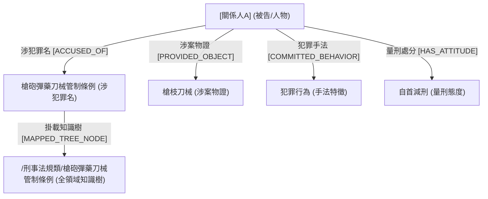

面對超過 16.89 GB、數百萬行的台灣刑事裁判書原始文本，多數人的第一反應可能是直接丟進向量資料庫（Vector DB）做 RAG（檢索增強生成）。然而，法律文件的特殊之處在於其**高度嚴謹的條文結構與精準的訴訟程序**。如果只是盲目拆封分塊（Chunking），AI 非常容易產生幻覺，甚至連基本的人名遮蔽與法條層級都無法對齊。

這篇文章記錄了我與 AI 助手（Antigravity） pair programming 的真實歷程：我們如何從文字沼澤中，梳理出包含 **15,886 個節點的全領域知識樹**、**30,000 個受控標籤**，並建立一套兼具 **「5W1H 人事時地物」與「雙視角 Mermaid 拓撲」** 的高品質判例中繼資料庫（LJMeta-in）。

---

## 💡 一、 核心架構原理：兩階段烘焙與「五角立體拓撲」

在設計 LJMeta-in 時，我們死守的核心思維是：**「人類定義框架與驗證標準，AI 負責大數據的高效厚化與算子執行。」**

```
 ┌─────────────────────────────────────────────────────────┐
 │ 兩階段資料庫烘焙架構 (Two-Stage Architectural Pattern)    │
 └─────────────────────────────────────────────────────────┘
   [Stage 1: 規則與知識體系對合]
   • 15,886 節點全領域深層知識樹 (Tree Ontology)
   • 30,257 個受控標籤 (Tag Taxonomy) & Stopwords 停用詞
   • 12 種受控語意關係邊 (Relation Taxonomy)
                            │
                            ▼
   [Stage 2: 離線預算烘焙 (Offline Baking)]
   • 16.89 GB 原始 CSV ──(DuckDB/Pandas 純流式分批)──► 3.8 GB Parquet
   • 內建預算欄位: entities_5w1h, entity_graph, tags, tree_paths
                            │
                            ▼
   [Stage 3: 極致 Token 節省檢索介面 (CLI / FastMCP)]
   • 秒級回應、預設極簡摘要，支援 --full 動態開關
```

### 1. 兩階段烘焙法 (Two-Stage Baking Architecture)
* **Stage 1 (專家與 AI 共同演進知識體系)**：我們不讓 AI 自由發揮，而是先建立嚴格的字典本體（Tree Ontology、Tag Taxonomy 與 Relation Taxonomy）。
* **Stage 2 (離線將結構烘焙至 Parquet)**：將複雜的 5W1H 實體抽取、知識樹掛載、代號去識別化等算子，離線「烘焙」成 DuckDB/Parquet 列式資料庫中的固定 JSON 欄位。這讓原始 16.89 GB 的文字巨獸壓縮 77%，並帶來秒級的精準過濾能力。

### 2. 五角立體情境圖譜 (Pentagon Crime Context Graph)
將單一判決解耦為 7 大維度的立體關聯圖，解決過往文字描述過於單薄的問題：
* **`PERSON`** (被告代號) ──`[ACCUSED_OF]`──► **`CRIME`** (涉犯罪名)
* **`PERSON`** ──`[COMMITTED_BEHAVIOR]`──► **`BEHAVIOR`** (犯罪手法特徵)
* **`PERSON`** ──`[HAS_ATTITUDE]`──► **`MITIGATION`** (量刑態度與處分)
* **`PERSON`** ──`[PROVIDED_OBJECT]`──► **`OBJECT`** (涉案物證標的)
* **`CRIME`** ──`[MAPPED_TREE_NODE]`──► **`TREE_NODE`** (全領域知識樹掛載點)

---

## 🛠️ 二、 關鍵實戰歷程與白板決策瞬間

### 1. 決策瞬間一：法規條文表示法的「剛性正規化 (Normalization)」
在處理法規引用時，判決書文本充滿了各式各樣的書寫習慣（例如：「`第 三十 一 章`」、「`第 339 條`」、「`第339條第1項`」）。若不進行清洗，知識樹節點將會嚴重碎片化。

我們建立了專屬的 `law_normalizer.py` 算子，執行剛性轉譯：
* **國字數字轉半形阿拉伯數字**：`第 三十 一 章` $\rightarrow$ `第31章`
* **空格與符號抹平**：去除多餘全半形空白，統一組合格式（例如：`第32章_詐欺背信及重利罪/第339條`）。
* **全領域路徑對合**：確保每一筆判決都能準確掛載到包含 15,886 個節點的全領域深層知識樹上（涵蓋 9 大法律大類）。

### 2. 決策瞬間二：標籤對合度拷問 (Grounding Audit) 與 Stopwords 機制
在初始版本的標籤萃取中，我們透過自建的 `verify_tags.py` 自動化工具進行文字對合稽核（Grounding Check）。

當時驚人地發現：**`#訴訟` 這個標籤出現在了 82.3% 的案例中！** 
這屬於典型的「無鑑別度泛用標籤」。我們立刻調整策略：
* **導入 Stopwords 停用詞**：將 `訴訟`、`案件`、`被告`、`理由` 等詞彙列入過濾清單，讓 Top 標籤還原出真正有價值的法律特徵（如 `#過失`、`#違禁物`、`#假釋`、`#再審`）。
* **擴充 Behavior 與 Mitigation 詞庫**：針對真實裁判常見的短語，擴充了 185 個犯罪手法標籤（如 `#人頭帳戶`、`#車手提領`、`#酒後駕車`）與 154 個量刑處分標籤（如 `#自首`、`#和解`、`#宣告沒收`）。

### 3. 決策瞬間三：解耦為「程序」與「案情」雙視角 Mermaid 圖譜
判決書同時記錄了「法院的訴訟程序」與「被告的犯罪事實」。若混在一起畫圖，讀者會抓不到重點。

我們決策在報告生成器（`SPC-009`）中將圖譜拆解為雙視角：
* **程序判決視角 (Procedural Judgment Context)**：呈現 `[審理法院] --(ADJUDICATED)--> [判決] --(RESULTED_IN)--> [訴訟結果]`。
* **犯罪案情視角 (Substantive Crime Fact Context)**：呈現 `[被告] --(COMMITTED_BEHAVIOR)--> [手法]` 與 `[被告] --(HAS_ATTITUDE)--> [自首/和解]`。



### 4. 決策瞬間四：100% 不佔用 Mac 主硬碟的純流式轉檔防禦 (Pure Disk Streaming)
在將 16.89 GB CSV 全量轉檔為 Parquet 時，我們遇到了實戰踩坑：DuckDB 預設的記憶體資料庫機制觸發了 macOS 的虛擬記憶體 Swap，瞬間把 Mac 系統主硬碟的空間吃滿。

我們立刻與 AI 檢討並重構架構：
* **放棄全記憶體寫入，改採純流式分批 (`chunksize=25,000`)**。
* **將 DuckDB 的運算暫存檔全數指定至外接硬碟 (`/Volumes/D2024/...`)**。
* **成果**：Mac 主硬碟空間佔用保持 **0 MB**（零風險），實體記憶體佔用降至 **< 800 MB**，實現了超高穩定度的全量轉檔。

---

## 🎯 三、 人機協作的心法總結

打造 LJMeta-in 的過程，再次印證了現代 AI pair programming 的核心心法：

1. **明確界定邊界 (Domain Boundaries)**：AI 在處理未經規範的自然語言時非常容易偏離主題。透過建立可稽核的工具（如 `verify_tags.py`）與標準化規範（`law_normalizer.py`），能讓 AI 的輸出永遠落在合規的框架內。
2. **極簡 Context 預算控制**：大模型時代，不要把數萬字的判決全文一口氣塞給 AI。先讓 AI 閱讀幾百 Byte 的 5W1H 實體與摘要，真正需要細節時再動態載入，才是高效能代理程式（Agent）的運作之道。

> **AI 協作聲明**：
> 本文由筆者提供專案架構思維與實戰決策歷程，由 AI 助手 Antigravity 彙整修辭與技術細節。展現在人機協作下，將巨量法律資料轉化為結構化知識圖譜的探索成果。
