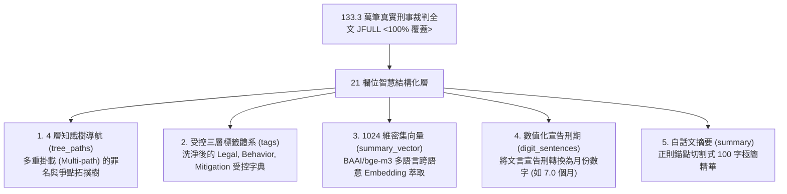
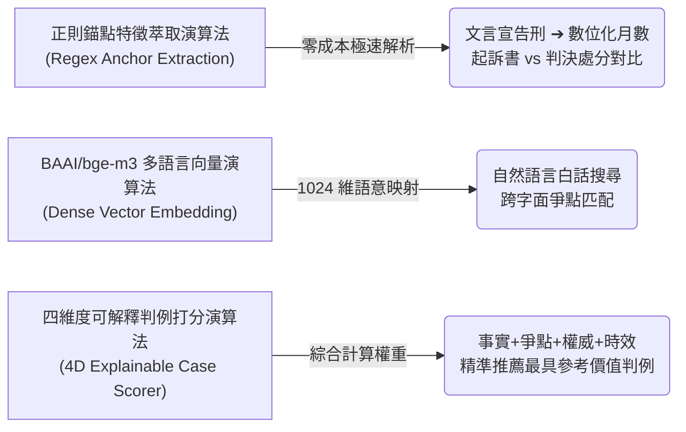

經過一段時間的持續淬鍊，我們正式發布了 **LJMeta (Legal Judgment Metadata) v0.6.0 重大更新**！

這個版本的的核心宗旨，在於**將台灣龐大、艱澀且分散的 1,333,373 筆刑事裁判大數據（100.00% 滿分全涵蓋）**，轉化為一般民眾、執業律師、企業法務與學者都能**隨需隨用、即時解答訴訟爭點的「智慧法律 AI 兵器庫」**。

本篇文章將說明：**LJMeta 在資料上設計了什麼？背後運用了哪些關鍵演算法？具備哪些強大的 CLI 工具與應用功能？以及能為您解決什麼實際問題？**

* **🔗 GitHub 公開開源專案**: [https://github.com/wuulong/LJMeta](https://github.com/wuulong/LJMeta)
* **📘 《LJMeta 智慧法律兵器庫》全書 PDF 免費下載**: [https://github.com/wuulong/LJMeta/blob/main/book/LJMeta_Complete_Book.pdf](https://github.com/wuulong/LJMeta/blob/main/book/LJMeta_Complete_Book.pdf)

---

## 💡 1. 在資料上，LJMeta 為使用者設計了什麼？

傳統的法院檢索系統往往只給讀者一大段「如天書般」的判決書內文。LJMeta 重新設計了資料結構，為全台 133.3 萬筆裁判賦予了 **21 個維度的結構化智慧層 (Metadata)**：

### 1.1 4 層知識樹導航設計 (tree_paths)
* **設計意圖**：法律案件並非單一分類。LJMeta 建立了 4 層深度知識樹（總計 315 個主題節點，覆蓋全庫 94.65% 案例），支援 **多重掛載 (Multi-path)**。一筆判決可以同時掛載在「刑法 > 詐欺罪 > 加重詐欺」與「特別刑法 > 洗錢防制法 > 帳戶提供」兩個樹狀分枝上，實現精準導航。

### 1.2 受控三層標籤體系 (tags)
* **設計意圖**：洗淨並建構了受控標籤詞表（覆蓋全庫 82.94% 案例），包含三大維度：
  * **`Legal` (法條爭點標籤)**：如 `#加重詐欺`, `#洗錢防制法`。
  * **`Behavior` (犯罪行為特徵)**：如 `#車手提款`, `#提供人頭帳戶`。
  * **`Mitigation` (法定減刑因子)**：如 `#自首減刑`, `#達成和解`, `#犯罪所得繳回`。

### 1.3 1024 維密集語意向量萃取 (summary_vector)
* **設計意圖**：採用當前頂級的 **BAAI/bge-m3 語言模型**，對每筆判決事實萃取出 1024 維度的密集向量（Dense Embedding），讓系統能夠理解語意相近但字面不同的法律爭點。

---

## ⚡ 2. 什麼關鍵演算法讓這個機能做得到？

能夠在 10.69 GB 的輕量體積下達到 133.3 萬筆裁判的秒級回應，背後仰賴了幾項突破性的核心演算法與資料工程：

### 2.1 四維度可解釋最相關判例打分演算法 (4D Explainable Case Scorer Algorithm)
當輸入一個案件事實或查詢時，如何從 133.3 萬筆裁判中，精確篩選出「最具參考價值與勝訴指引性」的標竿判例？LJMeta 研發了 **四維度混合打分與 Re-ranking 演算法**：

$$\text{Score} = w_1 \cdot \text{Sim}_{\text{Dense}} + w_2 \cdot \text{Sim}_{\text{Tag}} + w_3 \cdot \text{Rank}_{\text{PageRank}} + w_4 \cdot \text{Decay}_{\text{Time}}$$

1. **事實契合度得分 ($\text{Sim}_{\text{Dense}}$)**：透過 1024 維 BGE-M3 向量餘弦相似度，計算案情犯罪事實的語意契合度。
2. **爭點與特徵標籤重疊度 ($\text{Sim}_{\text{Tag}}$)**：比對受控標籤字典（如是否同屬 `#車手`, `#和解`），計算 Jaccard 爭點重疊係數。
3. **判例權威加權值 ($\text{Rank}_{\text{PageRank}}$)**：結合最高法院引用圖譜與 Citation PageRank 演算法，為最高法院標竿裁判與大法官解釋給予額外權威加分。
4. **時間時效衰減因子 ($\text{Decay}_{\text{Time}}$)**：針對近年新修法與最新實務見解給予時間衰減校正，確保推薦出既權威又合乎最新實務見解的判例。

### 2.2 正則錨點特徵萃取演算法 (Regex Anchor Extraction)
* 透過精準的文法錨點切割演算法，能以 **零 LLM 成本、毫秒級速度** 將艱澀判決主文轉換為數位月數（`digit_sentences`），並精確拆解公訴檢察官、辯護律師與前審案號。

### 2.3 BAAI/bge-m3 多語言向量嵌入演算法 (Dense Vector Embedding)
* 解決傳統關鍵字搜尋「字面匹配但爭點不同」的致命缺陷，將案情事實映射至 1024 維連續向量空間，實現白話文案情查詢。

---

## 🚀 3. LJMeta v0.6.0 具備哪些強大功能與 CLI 工具？

針對不同使用者的需求，LJMeta 提供了一套強大、開箱即用的命令行工具（`ljmeta_cli.py`）：

### 3.1 命令行主工具 (`ljmeta_cli.py`) 9 大命令模組
* **`search` (系統化多維度裁判檢索)**：支援字號 (`--jid`)、法條 (`--law`)、年份 (`--year`)、被告 (`--defendant`) 與關鍵字 (`--query`) 交集過濾。
* **`predict` (量刑區間預測)**：輸入罪名與犯行標籤，即時預估判刑「6 個月以下」、「1 年至 3 年」的確切機率。
* **`judge` (法官履歷與風格剖析)**：輸入承辦法官，剖析全台 1,754 位法官 (VJID) 的歷年熱門罪名、駁回率與改判率。
* **`reversal` (起訴求刑 vs 改判逆轉戰例診斷)**：自動診斷出起訴求刑高但最終改判輕刑的逆轉勝關鍵裁判。
* **`sensitivity` (減刑因子敏態分析)**：定量分析自首、和解、繳回犯罪所得等因子對宣告刑期的減刑邊際效應。
* **`radar` (全國法院裁判雷達圖)**：分析全台 22 所地方法院的罪名分布與判決見解分歧。
* **`report` (一鍵訴訟研判報告與草稿)**：輸入白話訴訟 Prompt，自動產出研判報告與《刑事上訴理由狀草稿》。
* **`tree` (知識樹結構導航)**：4 層知識樹結構查詢與案例掛載檢索。
* **`sql` (DuckDB SQL 直連通道)**：提供工程師與分析師進行自由 SQL 查詢。

---

## 🎯 4. LJMeta 能幫您做什麼事情？（不同角色的實戰價值）

### 👨‍💼 當事人與一般民眾：看懂判決，建立對訴訟的知情權
* **解決痛點**：看不懂判決書文言文、不知是否會坐牢。
* **能做的事**：將天書判決翻譯成 100 字白話摘要，清楚了解可能的刑期區間與法律觀念，與律師溝通不再雞同鴨講。

### ⚖️ 執業律師：極速檢索權威判例，高效率撰寫優質書狀
* **解決痛點**：傳統關鍵字搜尋易跑題、耗費數小時整理爭點與法官見解。
* **能做的事**：秒級查出事實契合度最高的標竿判決，掌握法官量刑偏好，大幅提升訴訟勝率與辦案效率。

### 🏢 企業法務長：跨法院訴訟風險評估與成本控管
* **解決痛點**：不同縣市法院見解分歧，無法評估商務訴訟風險。
* **能做的事**：透過大數據雷達圖分析各法院的判決趨勢，提供企業高層客觀的訴訟決策支援。

### 🎓 法學研究者：全台裁判實證研究與數據統計
* **解決痛點**：缺乏大數據樣本，實證法學研究採樣困難。
* **能做的事**：直接利用全量 133.3 萬筆結構化資料庫，進行跨年份、罪名與法官見解演進的大數據統計研究。

---

## 📚 5. 免費公開資源與專書下載

為了推動台灣法律科技與實證法學的發展，我們將 LJMeta 的成果完全開源：

* **🔗 GitHub 官方開源專案**: [https://github.com/wuulong/LJMeta](https://github.com/wuulong/LJMeta)  
  * 包含專案介紹、資料庫結構說明、4 大 Taxonomy 詞表與 Python / DuckDB 開發工具。

* **📘 《LJMeta 智慧法律兵器庫》全書 PDF 免費下載**: [https://github.com/wuulong/LJMeta/blob/main/book/LJMeta_Complete_Book.pdf](https://github.com/wuulong/LJMeta/blob/main/book/LJMeta_Complete_Book.pdf)  
  * 全書共 11 大章節，完整收錄四大族群痛點剖析、五大利害關係人實戰案例、21 欄位 Schema 設計與完整運維指南。

---

> **AI 協作聲明**：本文由哈爸與 AI 夥伴共同創作，分享 LJMeta v0.6.0 智慧法律 AI 兵器庫之資料設計、關鍵演算法、CLI 工具與實戰價值。歡迎至 GitHub 閱讀專書與開源專案！
