### 📌 前情提要與專書 v2.2 更新

在上一篇筆記 [《建構民間自主水網拓樸：相容水利署官方河川代碼的 WRA-Civ 延伸編碼規範》](https://wuulong.github.io/wuulong-notes-blog/posts/20260624_wra_civilian_topology_spec/) 中，我們首次對外發表了 **WRA-Civ 拓樸架構**。當時我們以淡水河流域（加九寮溪、內洞溪）作為 PoC 概念驗證，提出了「官方圖資為底，民間連字號下鑽 (`-[CivCode]`) 補齊小支流與野溪」的共創編碼原則。

這幾個月來，常有朋友詢問：「這套架構能拓展到淡水河以外的流域嗎？全台灣的山區野溪也能這樣紀錄嗎？」

今天，我很興奮地向大家宣佈：**答案是肯定的！WRA-Civ 全台灣水資源區大一統版本正式釋出！**

同時，我們的專書 **《流域導航：台灣母親之河的深度探索與實踐指南》** 也正式同步更新進位至 **v2.2 版本**！我們將全台 573 筆拓樸圖資、水利署官方 837 筆開放資料集對合，以及寫入工具 `scripts/river_topology_importer.py`，完整寫入並歸檔於專書第 11.5 章中。

---

### 🌊 573 筆水脈大一統：全台灣四大水資源區成果

我們完成了全台灣四大水資源區（北、中、南、東）中央管 26 大水系、高達 **573 筆水脈拓樸** 的全量收錄與資料庫落庫！

您可以直接在 GitHub 上下載或檢視這份全台水脈完整拓樸 CSV 註冊表：
* 📥 [**直接下載原始 CSV 檔案 (Raw)**](https://raw.githubusercontent.com/wuulong/RiverExploration/refs/heads/main/taiwan_river_topology_registry.csv)
* 👁️ [**線上瀏覽 GitHub Repo (RiverExploration)**](https://github.com/wuulong/RiverExploration)

目前註冊表已完整收錄 **573 筆水脈**，四大分區全景如下：

* 💙 **北部水資源區 (110 筆)**：
  淡水河、頭前溪、鳳山溪、中港溪主流與全體山區野溪（如桶後溪、加九寮溪、麥巴來溪、牛欄河等）。
* 💚 **中部水資源區 (185 筆)**：
  濁水溪、大甲溪、大安溪、烏溪、後龍溪（如裡冷溪、司界蘭溪、帖比倫溪、萬大北溪等）。
* 🧡 **南部水資源區 (160 筆)**：
  高屏溪、曾文溪、北港溪、二仁溪、八掌溪、急水溪、朴子溪、鹽水溪（如荖濃溪、旗山溪、菜寮溪等）。
* ❤️ **東部水資源區 (118 筆)**：
  蘭陽溪、花蓮溪、秀姑巒溪、卑南溪（如梵梵溪、拉庫拉庫溪、霧鹿溪等）。

---

### 🎨 頭前溪水系 (114004) 完整拓樸實例 (Mermaid)

以下為依據水利署官方資料庫硬性對照整合（藍色實線）並自動計算民間下鑽野溪（橘色虛線）的 **頭前溪水系完整拓樸圖**：

```mermaid
graph TD
    classDef official fill:#e1f5fe,stroke:#0288d1,stroke-width:1px;
    classDef civilian fill:#fff3e0,stroke:#f57c00,stroke-width:1px;

    R_114004["頭前溪 (114004)"]
    R_114004 --> R_130020["油羅溪 (130020)"]
    R_114004 --> R_130010["上坪溪 (130010)"]
    R_114004 --> R_1300E0["冷水坑溪 (1300E0)"]
    
    %% 淡水/民間一級與二級支流
    R_114004 -.-> R_114004_C01["豆子埔溪 (114004-C01)"]
    R_114004_C01 -.-> R_114004_C01_C01["東山溪 (114004-C01-C01)"]
    R_114004 -.-> R_114004_C02["柯子湖溪 (114004-C02)"]
    R_114004 -.-> R_114004_C03["崁下溪 (114004-C03)"]
    R_114004_C03 -.-> R_114004_C03_C01["九芎溪 (114004-C03-C01)"]
    R_114004_C03_C01 -.-> R_114004_C03_C01_C01["倒別牛溪 (114004-C03-C01-C01)"]
    R_114004_C03_C01 -.-> R_114004_C03_C01_C02["中坑溪 (114004-C03-C01-C02)"]
    R_114004_C03_C01 -.-> R_114004_C03_C01_C03["水坑溪 (114004-C03-C01-C03)"]
    R_114004_C03_C01_C03 -.-> R_114004_C03_C01_C03_C01["赤柯寮溪 (114004-C03-C01-C03-C01)"]
    R_114004_C03 -.-> R_114004_C03_C02["荳子埔溪 (114004-C03-C02)"]
    R_114004_C03_C02 -.-> R_114004_C03_C02_C01["燥坑溪 (114004-C03-C02-C01)"]
    R_114004 -.-> R_114004_C04["鹿寮坑溪 (114004-C04)"]
    R_114004_C04 -.-> R_114004_C04_C01["王爺坑溪 (114004-C04-C01)"]
    R_114004_C04 -.-> R_114004_C04_C02["大肚溪 (114004-C04-C02)"]
    
    %% 油羅溪水系 (130020)
    R_130020 -.-> R_130020_C01["馬胎溪 (130020-C01)"]
    R_130020 --> R_130025["那羅溪 (130025)"]
    
    %% 上坪溪水系 (130010)
    R_130010 -.-> R_130010_C01["花園溪 (130010-C01)"]
    R_130010 -.-> R_130010_C02["麥巴來溪 (130010-C02)"]
    R_130010 -.-> R_130010_C03["爺巴堪溪 (130010-C03)"]
    R_130010 --> R_130011["霞喀羅溪 (130011)"]

    class R_114004,R_1300E0,R_130020,R_130025,R_130010,R_130011 official;
    class R_114004_C01,R_114004_C01_C01,R_114004_C02,R_114004_C03,R_114004_C03_C01,R_114004_C03_C01_C01,R_114004_C03_C01_C02,R_114004_C03_C01_C03,R_114004_C03_C01_C03_C01,R_114004_C03_C02,R_114004_C03_C02_C01,R_114004_C04,R_114004_C04_C01,R_114004_C04_C02,R_130020_C01,R_130010_C01,R_130010_C02,R_130010_C03 civilian;
```

---

### 💡 背後的原理：AI 語意理解與確定性程式的分工

這次能夠一舉補齊全台 573 筆水脈，重點不在於寫了多複雜的演算法，而是我們驗證了一套極致的 **「兩階段人機協作原理」**：

#### 1. 第一階段：發揮 LLM（AI）的「語意理解」優勢
過去要人工整理維基百科或文獻裡的河流樹狀圖非常繁瑣。現在，我們讓 AI 去閱讀非結構化的文獻與網頁文字。AI 最擅長的就是**理解自然語言的上下文**，它可以一眼看懂「哪一條溪是哪一條溪的支流」，並自動把它整理成一份帶有縮排深度（Level 1, 2, 3...）的中間態文字檔案。

#### 2. 第二階段：發揮確定性程式的「零發揮」優勢
如果直接讓 AI 來幫河川編號，AI 很可能會產生「代碼幻覺」隨機瞎編。因此，我們把編號與落庫的工作**完全交給傳統程式**：
* **官方既有者**：程式會自動對照經濟部水利署 110 年全量 837 筆官方開放資料庫。只要官方資料庫有紀錄，**硬性綁定官方權威 6 碼**（如油羅溪 `130020`、宜蘭河 `256020`）。
* **深山野溪**：對官方沒記錄的無名溪，由程式依據父節點**自動計算 `-C[nn]` 下鑽編碼**（例如 `130020-C01` 馬胎溪），並自動算出一條一路回溯到出海口的完整水脈路徑 (`0@...`)。

> **原理總結**：讓 AI 負責「理解世界」（讀文獻做結構化），讓程式負責「硬性執行」（比對官方資料庫與編碼落庫）。兩者結合，既有 AI 的彈性，又有程式的 100% 準確！

---

### 🎯 寫在最後

現在，這套 WRA-Civ 全台水系地圖與寫入工具，已經完整收錄並歸檔在我們的專書 [《流域導航》第 11.5 章](https://github.com/wuulong/RiverExploration/blob/main/Chapter_11_5.md) 之中。

這不只是一份資料庫的釋出，更是數位時代戶外探索者與 AI 共創水文資產的新里程碑。未來任何一位探索者走進山林發現一條無名溪，都能在這套體系下找到它的座標與親緣位置！

歡迎大家一同加入台灣母親之河的深度探索！
