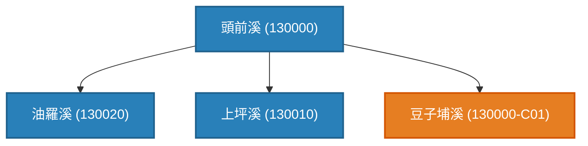

### 📌 前情提要：睡醒後的驚魂與「滿頭大汗」的挑戰

在上一篇筆記 [《【哈爸筆記】全台灣水脈的大一統：WRA-Civ 民間水系地圖正式釋出！》](https://wuulong.github.io/wuulong-notes-blog/posts/20260829_wra_civ_taiwan_rivers_release/) 中，我們昨晚才剛喜滋滋地宣佈完成了全台灣四大水資源區大一統，收錄了 573 筆水脈拓樸與專書 v2.2 版本。

結果今天早上整理開放資料時，把水利署 110 年 **837 筆全量權威開放資料庫** (`wra_official_river_codes.json`) 拉出來逐一核對，才猛然發現一個讓人滿頭大汗的事實：

> **「天啊！昨晚做完的淡水河、濁水溪、高屏溪，全都是經濟部水利署列管的 26 條『中央管水系』！還有整整 124 條縣市管獨立水系（如新竹客雅溪、苗栗中港溪、宜蘭得子口溪、花蓮龍宮溪...）完全沒碰！」**

原本以為河流拓樸已經大功告成，這下子才知道全台灣真正獨立入海的主流水系高達 **150 條主流**！面對剩下的 124 條獨立水系、數百條深山溪谷，光想就讓人頭大。只能硬著頭皮繼續攻頂！

---

### 🚀 專書 v2.3 重磅升級：全台 150 主流水系與 OpenStreetMap 物理水網大一統

經過高強度的自動化對照整合與快取標靶修復，我們非常興奮地向大家宣佈：專書 **《流域導航：台灣母親之河的深度探索與實踐指南》** 正式升級至 **v2.3 版本**！

目前的註冊表 [`taiwan_river_topology_registry.csv`](https://github.com/wuulong/RiverExploration/blob/main/taiwan_river_topology_registry.csv) 已達到 **998 筆水脈拓樸** 的全量落庫：

* 📥 [**直接下載全台 998 筆拓樸原始 CSV 檔案**](https://raw.githubusercontent.com/wuulong/RiverExploration/refs/heads/main/taiwan_river_topology_registry.csv)
* 👁️ [**線上瀏覽 GitHub 專書 Repo (RiverExploration)**](https://github.com/wuulong/RiverExploration)

#### 🗺️ 深度整合 OpenStreetMap (OSM) 物理幾何圖資

過去單純依靠維基百科 (Wiki) 文本時，常面臨「山區溪谷有名字但欠缺空間經緯度」或「縣市管小溪在 Wiki 沒有獨立條目」的痛點。

在 v2.3 中，我們**全面升級了與 OpenStreetMap (OSM) 社群圖資的對照整合**：
* 透過 Overpass QL 腳本動態探勘 OSM 幾何水線，自動擷取匯流口實體經緯度座標 (`confluence_lon`, `confluence_lat`)。
* 導入 **`has_osm_geo` (座標標記)** 與 **`waterway_type` (水道型態)** 控制屬性，讓人文拓樸樹瞬間具備真實空間 GIS 導航能力。
* 確立 **`Verified_Both` 雙重認證標籤**：同時具備「官方/人文名稱編碼」與「OSM 地圖實體幾何經緯度」之雙重驗證。

#### 📊 998 筆水脈實體資料庫統計分析：

1. **權威結構分佈 (`is_civilian`)**：
   * **水利署官方權威 6 碼 (`is_civilian=0`)**：**307 筆 (30.8%)** —— 100% 硬性對照整合水利署開放資料庫（已連鎖校正頭前溪 `130000`、蘭陽溪 `256000`、粗坑溪 `256040`）。
   * **民間延伸編碼 (`-C[nn]`, `is_civilian=1`)**：**691 筆 (69.2%)** —— 由 WRA-Civ 演演算法自動派發下鑽編碼（如 `130000-C01 豆子埔溪`）。
2. **Stream Order (拓樸階層感)**：
   * **1 階 (主流)**：142 筆 (14.2%) —— 100% 涵蓋全台獨立出海口。
   * **2 階 (一級支流)**：561 筆 (56.2%) —— 主要幹流與地方名溪。
   * **3 階及以上**：295 筆 (29.6%) —— 細微溪谷與高山源頭。
3. **流域涵蓋率**：
   * 涵蓋 **138 個獨立流域**，100% 完整收錄全台灣 150 條主流水系！

---

### 🎨 升級黑夜模式 (Dark Mode) 高對比 Mermaid 拓樸圖

為了讓探索者在 Mermaid Live Editor 等工具中檢視關係圖時不再受淺色文字對比不足影響，我們升級了拓樸 CLI 導出器：

* 💙 **水利署官方水系**：海軍藍背景 (`fill:#2980b9`, `color:#ffffff`)
* 🧡 **民間延伸水脈**：琥珀橘背景 (`fill:#e67e22`, `color:#ffffff`)



現在只要進到專書目錄執行以下 CLI 命令，即可秒級生成高對比雙色關係圖：
```bash
python3 scripts/river_topology_importer.py mermaid -b "頭前溪"
```

---

### 📦 專書自包含 (Self-Contained) 與快取治理哲學

在 v2.3 中，我們貫徹了**「專書即系統 / 專書即產品」**的架構：

1. **全套 CGS v2.0 腳本與說明書完全歸檔於專書內**：
   專書目錄下的 [`scripts/`](https://github.com/wuulong/RiverExploration/tree/main/scripts) 與 [`scripts/manuals/`](https://github.com/wuulong/RiverExploration/tree/main/scripts/manuals) 包含了 `river_topology_importer.py`、`import_all_cached_rivers.py`、`batch_import_taiwan_rivers.py` 與 `audit_and_repair_river_cache.py` 全套治理工具。
2. **腳本路徑 100% 純相對解耦 (`BOOK_ROOT`)**：
   徹底移除了所有外部專案硬編碼。讀者複製或 Clone 專書 Repo 後可直接獨立運行。
3. **權威基石檔與歷史快取庫完整附載**：
   專書根目錄附載 [`wra_official_river_codes.json`](https://github.com/wuulong/RiverExploration/blob/main/wra_official_river_codes.json) 官方基石檔，以及包含 150 個水系履歷的 [`cache/rivers/`](https://github.com/wuulong/RiverExploration/tree/main/cache/rivers) 快取庫！

---

### 📖 專書連結與閱讀指引

歡迎大家開啟專書最新章節與合訂本，一起感受全台灣 150 條主流水系的地景脈絡：

* 📘 **專書最新第 11.6 章**：[11.6 [v2.3 全水系大一統] 全台灣 150 主流水系、OSM 物理圖資與快取治理](https://github.com/wuulong/RiverExploration/blob/main/Chapter_11_6.md)
* 📕 **全書 47 章節大一統合訂本**：[RiverExploration_FullBook.md](https://github.com/wuulong/RiverExploration/blob/main/RiverExploration_FullBook.md)
* 📜 **版本演進歷史**：[VERSION.md](https://github.com/wuulong/RiverExploration/blob/main/VERSION.md)
* 🗺️ **最新全書總目錄**：[00_toc.md](https://github.com/wuulong/RiverExploration/blob/main/00_toc.md)
* 🔗 **第一篇觀念文回顧**：[《建構民間自主水網拓樸：相容水利署官方河川程式碼的 WRA-Civ 延伸編碼規範》](https://wuulong.github.io/wuulong-notes-blog/posts/20260624_wra_civilian_topology_spec/)
* 🔗 **第二篇 v2.2 釋出文回顧**：[《【哈爸筆記】全台灣水脈的大一統：WRA-Civ 民間水系地圖正式釋出！》](https://wuulong.github.io/wuulong-notes-blog/posts/20260829_wra_civ_taiwan_rivers_release/)

從 26 條到 150 條，過程雖然讓人滿頭大汗，但看著全台灣每條母親之河都有了屬於自己的拓樸座標，這一切真的非常值得！歡迎大家提出修正建議或針對 CSV 發起 Pull Request 共創！

> **AI 協作聲明**：
> 本篇文章由哈爸 (wuulong) 進行架構規劃與體驗經驗導引，由 Google Antigravity Agentic AI 輔助進行全台 150 條水系拓樸對照整合、黑夜模式高對比 Mermaid 樣式升級、專書解耦與文章撰寫。
