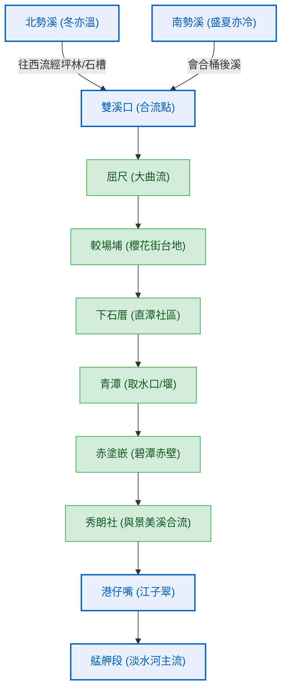

# 【水源之心】新店溪與南勢溪系統：歷史文獻與地學對合

本網頁整理了與「新店溪與南勢溪系統（水源之心）」相關的清代古籍文獻與歷史背景。透過將 L1 歷史文獻（《臺灣通史》、《淡水廳志》）與現代 WalkGIS 地理資訊對合，重現大台北自來水之源在水利、水文與原住民拓墾史上的多重脈絡。

---

## 🏔️ 專題一：烏來與屈尺泰雅族的開山撫墾與防禦史

在清代光緒年間，新店溪中上游的屈尺與烏來一帶是漢番交界的「隘勇線」前線。劉銘傳在此處推行「開山撫墾」政策，與當地的泰雅族原住民產生了激烈的衝突與文化交流。

### 1. 統領劉朝佑討伐烏來社
> **【古籍原文】**
> 「先是屈尺番烏來社亦每出殺人，十一年九月，統領劉朝佑率銘軍三營討之，番降。」
> ——《臺灣通史·撫墾志》卷三十一

* **白話譯文與背景**：
  在光緒十一年（1885年）九月，居住在屈尺與烏來（古籍中記作「烏來社」）一帶的泰雅族人，因漢人墾民不斷深入其傳統獵場與領域，時常發生出草與衝突事件。對此，台灣巡撫劉銘傳派遣統領劉朝佑率領三營的「銘軍」（劉銘傳的嫡系淮軍部隊）前往烏來山區進行軍事討伐，最終迫使烏來社泰雅族人降服歸順。
* **現代地學對合**：
  * **屈尺**：今新店區屈尺里，位於新店溪的大曲流處，是進入烏來山區的交通咽喉。
  * **烏來社**：即今烏來區烏來街、南勢溪與桶後溪交會處（即現今之烏來老街與溫泉區）。
  * **歷史地景**：此事件見證了晚清軍事力量正式越過屈尺隘勇線，深入南勢溪流域的關鍵歷史節點。

### 2. 番學堂的現代教育實驗
> **【古籍原文】**
> 「是年春三月，並設番學堂，先選大崁嵌、屈尺、馬武督之番童二十名而教之，聘羅步韓、吳化龍、簡受禧為教習，課以漢文、算書，旁及官話、臺語，起居禮儀，悉倣漢制...然自邵友濂一至，十七年而撤西學堂，十八年而番學堂亦廢矣。烏乎傷哉！」
> ——《臺灣通史·教育志》卷十二

* **白話譯文與背景**：
  光緒十二年（1886年）春三月，劉銘傳在台北府城內設立了台灣歷史上第一所招收原住民的官立學校「番學堂」。首批招收了大嵙崁（今桃園大溪）、屈尺（今新店烏來一帶）、馬武督（今新竹關西）等地的泰雅族原住民童子共二十名。學校聘請漢人教師教授漢字、算數、官話、台語以及漢人起居禮儀。劉銘傳本人時常親自前往視察並極力獎勵。然而，光緒十七年（1891年）劉銘傳離職，繼任巡撫邵友濂因財政困難，於光緒十八年（1892年）將番學堂廢除，使得這場短暫的原住民現代教育實驗告終，令作者連橫扼腕嘆息。
* **現代地學對合**：
  * **屈尺番童**：這批學生代表了新店溪中上游泰雅族部落與台北城都市文明的早期接觸。
  * **番學堂舊址**：位於台北城內登瀛書院旁（約今台北市中正區西門至總統府一帶）。

---

## 💧 專題二：南勢溪與北勢溪的水物理與水路地理

新店溪在清代中上游河段被統稱為「青潭溪」。《淡水廳志》以極其細緻的水文觀察，記錄了兩大源流——「南勢溪」與「北勢溪」完全不同的水物理特徵與合流路徑。

> **【古籍原文】**
> 「青潭溪之原有二：其一來自石槽，西過火炎山，西南過熬酒桶山曰北勢。溪水性至冬亦溫。其一發湯頭社山，東流西會咬狗寮尖山坑，南會桶後溪，過熬酒桶山曰南勢。溪水性盛夏亦冷。由南勢會北勢，北至屈尺西過較場埔，至下石厝；北過直潭，東至青潭；東北至赤塗嵌；北過暗坑仔尖山，至秀朗社，與內湖溪合流，出港仔嘴北東至艋舺。」
> ——《淡水廳志·志一封域志·水石》

### 1. 「北勢冬溫、南勢夏冷」的水物理特徵
* **水文地學解析**：
  古籍中所記載的溫差現象具備極佳的地理科學依據：
  * **北勢溪（冬亦溫）**：北勢溪流經的坪林盆地河道較為開闊，日照時間長，且沿途有許多開闊的淺灘，在冬季日照下蓄熱能力較強，且水流速度相對較緩，因此冬季水溫感覺較為溫暖。
  * **南勢溪（盛夏亦冷）**：南勢溪發源於高聳的雪山山脈北段（阿玉山、哈盆一帶），流經森林茂密的深山峽谷（如內洞溪、桶後溪流域）。其流域內森林覆蓋率極高，陽光終年難以直射河谷，且高山冷泉源源不斷地匯入，因此即便在盛夏，溪水依然極為冰涼。

### 2. 古今地名對合表
| 古籍地名 | 現代地理位置 | 水文與空間意義 |
| :--- | :--- | :--- |
| **石槽 / 火炎山** | 坪林區石曹里 / 坪林火炎山 | 北勢溪中上游的主要集水區與峽谷。 |
| **湯頭社山** | 宜蘭與烏來交界之阿玉山一帶 | 南勢溪的源頭山嶺。 |
| **桶後溪** | 烏來區桶後溪 | 南勢溪重要支流，現為桶後越嶺古道核心水系。 |
| **較場埔** | 新店區屈尺櫻花街與新潭路間台地 | 新店溪曲流頂部的台地。 |
| **下石厝** | 今直潭社區、直潭路一帶 | 著名的直潭大曲流凸岸，現為直潭淨水廠所在地。 |
| **青潭** | 新店東峰路、青潭堰一帶 | 瑠公圳與大坪林圳的引水起點，現為大台北取水樞紐。 |
| **赤塗嵌** | 碧潭東岸至新店路、文中路一帶 | 碧潭著名的紅土赤壁侵蝕地景（「碧潭赤壁」）。 |
| **內湖溪** | 景美溪（昔稱霧裡薛溪） | 新店溪在景美與中和交界處的重要支流。 |
| **港仔嘴** | 板橋江子翠、雙園一帶 | 新店溪與大漢溪匯流成淡水河主流的起點。 |

---

## 🚰 專題三：大坪林圳與瑠公圳的拓墾水利史

清乾隆年間，為了解決大加蚋堡（台北市中心）與大坪林五莊的農業灌溉需求，墾戶郭錫瑠與當地居民合作，在新店溪青潭一帶展開了規模宏大的鑿山引水工程。

### 1. 穿山鑿石的大工程
> **【古籍原文】**
> 「瑠公圳又名金合川圳，在拳山堡...其水自大坪林築陂鑿石穿山，引過大木見溪仔口，再引至挖仔內過小木見，到公館街後拳山麓內埔分為三條...」
> ——《淡水廳志·志二建置志·水利》

> **【古籍原文】**
> 「大坪林圳，在拳山堡...莊民所置。其水引青潭溪，灌溉田四百四十五甲。」
> ——《淡水廳志·志二建置志·水利》

> **【古籍原文】**
> 「郭元汾，字錫琉，漳人也...乃傭工鑿圳，引新店溪之水，自大坪林築陂蓄之，穿山度梘，至溪仔口，又引至挖仔內...名金合川圳，而佃人念其功，稱瑠公圳。」
> ——《臺灣通史·卷三十四·列傳三》

* **白話譯文與背景**：
  乾隆十八年（1753年），郭錫瑠（琉公）為引水灌溉台北盆地，變賣家產在新店溪青潭堰一帶修築草埤，並僱工開鑿堅硬的岩石山壁以修築引水隧道（即「石硿」）。然而該處鄰近泰雅族部落，開工後常遭出草襲擊。
  為解決防禦與資金問題，郭錫瑠與大坪林墾首蕭妙興等人達成協定：大坪林五莊出資並協助防衛，共同鑿通引水石硿。完工後，石硿出水口以上之水源由大坪林五莊引導灌溉（即「大坪林圳」），出水口以下的水源則由郭錫瑠跨越景美溪送往台北盆地（即「瑠公圳」）。郭錫瑠使用木製的「水梘」（梘橋）跨越景美溪（大木見溪），完成「穿山度梘」的壯舉。
* **現代地學對合**：
  * **瑠公圳引水石腔（石硿）**：位於今新店東峰路「開天宮」下方的山壁中，至今仍保存完好，為新店著名的水利古蹟。
  * **地理落差與重力流**：此系統完全仰賴新店溪青潭堰（海拔約22-24公尺）與台北盆地（海拔約5-10公尺）之間的高程落差，實現無動力的重力流供水，物理配置極具智慧。

---

## ⛵ 專題四：寶藏巖與新店溪的舟楫功能

公館寶藏巖是新店溪畔的重要地標，在陸路不發達的清代，新店溪扮演了極為重要的航運角色。

> **【古籍原文】**
> 「石壁潭寺：即寶藏岩，在拳山堡。康熙時人郭治亨舍其山園，與康公合建...門拱獅象，山蒼翠可掬。叢樹集鳥以千百計，有水通舟楫。」
> ——《淡水廳志·考三古跡考》

* **白話譯文與背景**：
  寶藏巖（古稱石壁潭寺）建於清康熙年間，由墾民郭治亨捨棄其山丘園林，與康公合力興建。當時廟宇依山傍水，風景極為秀麗。文獻特別提到「有水通舟楫」，說明在清代，此處的新店溪河道寬廣、水量充沛，舢舨船可沿溪直接航行並停靠於寶藏巖下。
* **現代地學對合**：
  * **石壁潭**：指今寶藏巖下方的曲流深潭地景。此處受拳山山脈山腳（今福和橋旁丘陵）阻擋，河道在此處形成深潭。
  * **航運水文**：證實了日治時期興建堰壩（如水源地堰堤）前，新店溪具備完整的內河航運功能，是台北盆地與新店山區物資（茶葉、煤炭、樟腦）交換的交通動脈。

---

## 🧪 專題五：大台北現代自來水的起源

大台北六本萬人口的自來水源自新店溪，這段城市自來水史有著長達百年的水文地景遷移。

> **【古籍原文】**
> 「光緒十一年，劉銘傳任巡撫...聘日本人鑿井，曰自來水，汲者便之。」
> ——《臺灣通史·商務志》卷二十

* **白話譯文與背景**：
  光緒十三年（1887年），劉銘傳在台北城內推行現代化政策。為了解決居民飲用井水引發霍亂等流行病的問題，他聘請日本技術人員，在大稻埕與城內街頭開鑿深井，以管線配送，這是在台灣官方歷史文獻中「自來水」一詞的首見記載。
* **現代水文地景遷移對合**：
  劉銘傳時期的「自來水」利用的是地下深井水。現代台北自來水系統的起點，則是日治時期明治四十年（1907年）選址於新店溪畔（今自來水園區），利用新店溪豐富的表面水與伏流水進行過濾與配送。
  隨著大台北都市化，新店溪中下游水質污染，取水口逐步上演了**「由下往上溯源」**的遷移歷程：
  1. **日治初期**：新店溪畔唧筒室取水口（今公館思源街自來水博物館旁）。
  2. **戰後初期**：往上游移至「青潭堰」取水。
  3. **現代**：移至直潭大曲流的「直潭堰」取水，並興建「翡翠水庫」進行水源調節。
  這段百年自來水史，與我們探索的「新店溪水源之心」地理路徑完全吻合。
