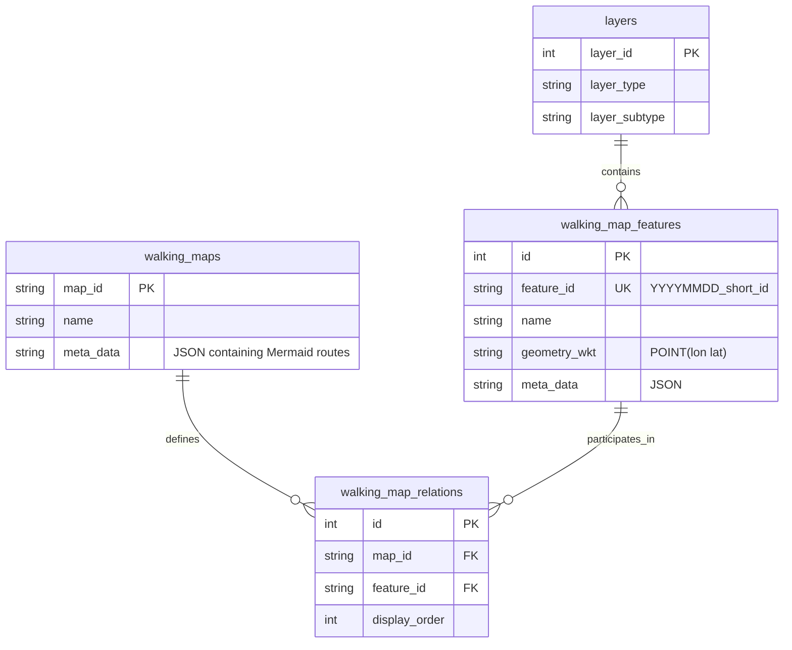

# WalkGIS Database Schema

## 概述
WalkGIS 使用 SQLite 資料庫，其設計核心理念為 **「AI 友善」 (AI-Friendly)** 與 **「零依賴」 (Zero-Dependency)**。
*   **幾何儲存**: 摒棄二進位 BLOB，全面採用 **WKT (Well-Known Text)** 字串 (如 `POINT(121.5 25.0)`) 儲存空間資料，方便 LLM 讀寫與理解。
*   **路徑定義**: 使用 **Mermaid Flowchart** 語法於 JSON 中定義邏輯路徑，而非傳統的幾何線段拓樸。

## 實體關聯圖 (ER Diagram)



## 表格詳解

### 1. `layers` (圖層定義)
定義地理特徵的分類體系。
*   `layer_id`: (PK) 自動遞增
*   `layer_type`: 主分類 (如: 水文與親水層)
*   `layer_subtype`: 次分類 (如: 親水點)

### 2. `walking_map_features` (地理特徵)
儲存實際的景點與地標資料。這是最核心的資料表。
*   `id`: (PK) 內部序號
*   `feature_id`: (Unique Text) **外部識別碼**，格式為 `YYYYMMDD_{short_id}`，對應 `features/` 目錄下的 Markdown 檔名。
*   `name`: 名稱
*   `description`: 簡短描述 (Markdown)
*   `geometry_type`: (Text) 幾何類型 (Point, LineString...)
*   **`geometry_wkt`**: (Text) **WKT 幾何字串**。
*   `meta_data`: (JSON) 擴充屬性，如外部文件連結 (`ref_doc`)、圖片路徑 (`images`)。

### 3. `walking_maps` (地圖/路線)
定義一組有主題性的地圖集合 (Collection)。
*   `map_id`: (PK) 地圖唯一代碼 (如 `2025_houfeng_loop`)
*   `name`: 地圖顯示名稱
*   **`meta_data`**: (JSON)
    *   `routes`: (Dictionary) 使用 **Mermaid** 語法定義路徑。
    *   範例：
        ```json
        {
          "routes": {
            "main_route": "graph LR; A[FeatureA] --> B[FeatureB];"
          }
        }
        ```

### 4. `walking_map_relations` (關聯表)
連結 `walking_maps` 與 `walking_map_features`，構成多對多關係。
*   `map_id`: (FK)
*   `feature_id`: (FK)
*   `display_order`: (Int) 在 UI 列表中的顯示順序。**注意：這不是路徑順序，路徑順序由 Mermaid 定義。**
*   `is_highlight`: (Bool) 是否為該地圖的重點推薦。

### 5. `meta_data_templates` (元數據範本)
儲存 `meta_data` JSON 的標準結構範本，用於驗證或指引 AI 生成正確的 JSON 格式。
*   `id`: (PK)
*   `template_name`: 範本名稱 (如 `map_standard_schema`, `poi_facility_schema`)
*   `applies_to_layer_type`: 適用對象，若為地圖物件可設為 `_MAP_`。
*   `template_json`: (Text) 完整的 JSON 範本。
    *   **地圖範本範例 (`_MAP_`)**:
        ```json
        {
          "difficulty": "Easy|Medium|Hard",
          "estimated_time": "String",
          "routes": {
             "description": "Key-Value pairs of Mermaid graphs",
             "example": "graph LR; A-->B;"
          }
        }
        ```

