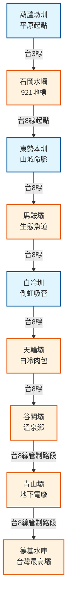

# 大甲溪水利溯源之旅 (The Great Dajia River Hydration Tour)

這是一條沿著台8線（中橫公路）一路向上的壯闊路線，帶您探索台灣最重要河流——大甲溪的水利工程史詩。從平原的百年水圳，到深山峽谷中的巍峨高壩，見證人類與自然共存的智慧。

## 實際探索

- [2026台灣河流探索 - 大甲溪流域深度之旅](https://wuulong.github.io/wuulong-notes-blog/series/2026%E5%8F%B0%E7%81%A3%E6%B2%B3%E6%B5%81%E6%8E%A2%E7%B4%A2-%E5%A4%A7%E7%94%B2%E6%BA%AA/)

## 路線地圖 (Route Map)


```mermaid
graph TD
    %% 定義節點 (Features)
    A[葫蘆墩圳<br>平原起點]:::canal
    B[石岡水壩<br>921地標]:::dam
    C[東勢本圳<br>山城命脈]:::canal
    D[馬鞍壩<br>生態魚道]:::dam
    E[白冷圳<br>倒虹吸管]:::canal
    F[天輪壩<br>白冷肉包]:::dam
    G[谷關壩<br>溫泉鄉]:::dam
    H[青山壩<br>地下電廠]:::dam
    I[德基水庫<br>台灣最高壩]:::dam

    %% 定義路徑 (Path)
    A -->|台3線| B
    B -->|台8線起點| C
    C -->|台8線| D
    D -->|台8線| E
    E -->|台8線| F
    F -->|台8線| G
    G -->|台8線管制路段| H
    H -->|台8線管制路段| I

    %% 樣式類別定義
    classDef canal fill:#e1f5fe,stroke:#01579b,stroke-width:2px;
    classDef dam fill:#fff3e0,stroke:#e65100,stroke-width:2px;

    %% 點擊事件 (未來擴充功能)
    click A "features/20251229_huludun_canal.md"
    click B "features/20251229_shigang_dam.md"
    click C "features/20251229_dongshi_main_canal.md"
    click D "features/20251229_maan_dam.md"
    click E "features/20251229_baileng_canal.md"
    click F "features/20251229_tianlun_dam.md"
    click G "features/20251229_guguan_dam.md"
    click H "features/20251229_qingshan_dam.md"
    click I "features/20251229_techi_reservoir.md"
```

## 路線亮點
這條路線垂直落差超過 1200 公尺，您可以觀察到：
1.  **水圳傳奇**: 清代先民如何用「割地換水」開鑿葫蘆墩圳，以及日治時期白冷圳的倒虹吸管工程奇蹟。
2.  **生態平衡**: 馬鞍壩獨特的生態魚道，讓洄游魚類得以返鄉。

## 🗺️ AI 深度探索 (Deep Research)
如果您擁有 Gemini Advanced 或其他 Deep Research 工具，可以複製以下 Prompt，針對這條中橫水利路線進行深入探索：

```markdown
# Context
一份名為「大甲溪水利溯源之旅」的導覽路線，沿台8線（中橫公路）逆流而上，不僅是水利工程的巡禮，更是台灣電力發展與中橫開發史的縮影。

# Task
針對以下景點列表，進行多維度的文史與生態分析，並挖掘沿線的秘密景點與山產美食。

**景點列表：**
1. 葫蘆墩圳 (平原開發起點)
2. 石岡水壩 (921地震斷層與重生)
3. 東勢本圳 (山城水脈)
4. 馬鞍壩 (生態魚道)
5. 白冷圳 (倒虹吸管工程奇蹟)
6. 天輪壩 (白冷聚落)
7. 谷關壩 (溫泉鄉與發電)
8. 青山壩 (隱藏於峽谷中的電廠)
9. 德基水庫 (台灣最高拱壩)

# Requirements (請分析以下維度)
1. **水電與開發史**: 大甲溪發電廠系的建立過程？中橫公路開拓與水壩建設的關係？
2. **聚落與文化**: 沿線的客家文化（東勢）、泰雅族原民文化（谷關/松鶴/環山）、榮民文化。
3. **生態與地質**: 沿線特殊的峽谷地形、921地震地質公園、馬鞍壩的生態保育。
4. **必吃山城美食**: 東勢客家菜、白冷肉包/冰棒、谷關鱒魚/鱘龍魚餐廳。
```

## 景點列表

1.  [葫蘆墩圳 (Huludun Canal)](?map=20260202_shanhaijun&feature=20251229_huludun_canal)
2.  [石岡水壩 (Shigang Dam)](?map=20260202_shanhaijun&feature=20251229_shigang_dam)
3.  [東勢本圳 (Dongshi Main Canal)](?map=20260202_shanhaijun&feature=20251229_dongshi_main_canal)
4.  [馬鞍壩 (Ma'an Dam)](?map=20260202_shanhaijun&feature=20251229_maan_dam)
5.  [白冷圳 (Baileng Canal)](?map=20260202_shanhaijun&feature=20251229_baileng_canal)
6.  [天輪壩 (Tianlun Dam)](?map=20260202_shanhaijun&feature=20251229_tianlun_dam)
7.  [谷關壩 (Guguan Dam)](?map=20260202_shanhaijun&feature=20251229_guguan_dam)
8.  [青山壩 (Qingshan Dam)](?map=20260202_shanhaijun&feature=20251229_qingshan_dam)
9.  [德基水庫 (Techi Reservoir)](?map=20260202_shanhaijun&feature=20251229_techi_reservoir)

