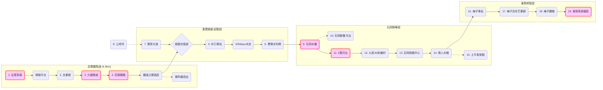

# 后豐鐵馬道 & 東豐綠廊精華遊

這是一條結合「舊山線鐵道歷史」與「大甲溪水岸風光」的經典自行車路線。全程約 18 公里，串聯了后里馬場、花樑鋼橋、石岡水壩與東勢客家文化園區，是台中最受歡迎的綠色隧道。

## 🗺️ 地圖概覽 (Map Overview)

## 🛤️ 路線拓樸 (Route Topology)

## 📍 包含景點 (Points of Interest)

### 后豐段 (Houfeng Section)
*   [后里馬場](../features/20251229_houli_ranch.md)
*   [九號隧道](../features/20251229_tunnel_9.md)
*   [花樑鋼橋](../features/20251229_old_beam_bridge.md)

### 東豐段 (Dongfeng Section)
*   [石岡水壩](../features/20251229_shigang_dam.md)
*   [0蛋月台](../features/20251229_0_dan_platform.md)
*   [情人木橋](../features/20251229_lovers_bridge.md)
*   [東勢客家文化園區](../features/20251229_dongshi_hakka.md)

*(完整清單請參閱 features 目錄)*
