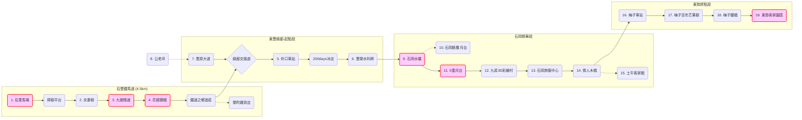

# 后豐鐵馬道 & 東豐綠廊精華遊

這是一條結合「舊山線鐵道歷史」與「大甲溪水岸風光」的經典自行車路線。全程約 18 公里，串聯了后里馬場、花樑鋼橋、石岡水壩與東勢客家文化園區，是台中最受歡迎的綠色隧道。

## 🗺️ 地圖概覽 (Map Overview)


## 🛤️ 路線拓樸 (Route Topology)



## 🗺️ AI 深度探索 (Deep Research)
如果您擁有 Gemini Advanced 或其他 Deep Research 工具，可以複製以下 Prompt，將單純的騎車行程升級為深度的文史走讀：

```markdown
# Context
「后豐鐵馬道」與「東豐綠廊」是台中最經典的兩條自行車專用道，前身分別是「舊山線鐵路」與「東勢支線鐵路」。這一路見證了台灣中部山線鐵路的興衰、921地震的傷痕，以及客家聚落的發展。

# Task
針對以下景點列表，進行深度的文史挖掘與旅遊資訊整合。

**景點列表：**
1. 后里馬場 (百年馬場)
2. 九號隧道 (舊山線經典)
3. 花樑鋼橋 (大甲溪上的鋼鐵巨人)
4. 朴口車站/石岡車站 (消失的車站)
5. 石岡水壩 (地震遺跡)
6. 0蛋月台 (廢棄車廂)
7. 情人木橋 (全台最大木造橋)
8. 梅子鐵橋 (跨越石角溪)
9. 東勢客家文化園區 (舊東勢車站)

# Requirements (請分析以下維度)
1. **鐵道記憶**: 舊山線與東勢支線的建造歷史與停駛原因？
2. **震殤與重生**: 921地震如何改變地貌（石岡壩斷層、埤豐大橋）？
3. **建築美學**: 花樑鋼橋的結構特色？情人木橋的建造工法？
4. **在地美食**: 石岡蜂巢蛋糕、東勢牛肉麵/水餃、沿線特色冰店 (如 200days)。
```

## 📍 包含景點 (Points of Interest)

### 后豐段 (Houfeng Section)
*   [后里馬場](../features/20251229_houli_ranch.md)
*   [九號隧道](../features/20251229_tunnel_9.md)
*   [花樑鋼橋](../features/20251229_old_beam_bridge.md)

### 東豐段 (Dongfeng Section)
*   [石岡水壩](../features/20251229_shigang_dam.md)
*   [0蛋月台](../features/20251229_0_dan_platform.md)
*   [情人木橋](../features/20251229_lovers_bridge.md)
*   [東勢客家文化園區](../features/20251229_dongshi_hakka.md)

*(完整清單請參閱 features 目錄)*
