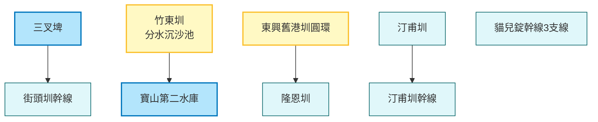

# 智慧水圳玩樂地圖 - 新竹管理處

探索新竹地區的重要水利設施，從百年的隆恩圳、汀甫圳到現代化的寶二水庫分水工，見證傳統與現代科技的結合。

## 路線地圖 (Route Map)



## 🗺️ AI 深度探索 (Deep Research)
如果您擁有 Gemini Advanced 或其他 Deep Research 工具，可以複製以下 Prompt，探索新竹平原與丘陵間的水利變遷：

```markdown
# Context
一份名為「智慧水圳玩樂地圖 - 新竹管理處」的導覽路線，探索新竹地區（竹東、竹北、新竹市）的水利設施。這裡見證了從清代農業水圳（隆恩圳）到支撐世界級半導體產業（寶二水庫）的水源轉型。

# Task
針對以下景點列表，挖掘其中的歷史變遷、科技應用與周邊的客家/城市文化。

**景點列表：**
1. 三叉埤 (傳統埤塘)
2. 汀甫圳 (清交校園與城市水岸)
3. 汀甫圳幹線
4. 竹東圳 (分水沉沙池、寶二水庫水源)
5. 東興舊港圳圓環 (竹北城市化遺跡)
6. 街頭圳幹線
7. 隆恩圳 (新竹最古老水圳之一)
8. 貓兒錠幹線3支線

# Requirements (請分析以下維度)
1. **古今對照**: 從農業灌溉到科技用水（竹科），這些水圳的角色如何轉變？
2. **水岸與城市**: 隆恩圳/汀甫圳在新竹市區的景觀改造與親水空間（如隆恩圳親水公園）。
3. **客家文化**: 竹東圳開鑿與客家聚落的關係。
4. **在地美食**: 竹東市場客家美食、新竹舊城區小吃、交大/清大周邊美食。
```

## 景點列表

1.  [三叉埤](../features/20251230_sancha_pond.md)
2.  [汀甫圳](../features/20251230_tingfu_canal.md)
3.  [汀甫圳幹線](../features/20251230_tingfu_main_canal.md)
4.  [竹東圳 (寶山第二水庫與竹東圳分水沉沙池)](../features/20251230_zhudong_canal_sand_basin.md)
5.  [東興舊港圳圓環](../features/20251230_dongxing_old_port_canal_circle.md)
6.  [街頭圳幹線](../features/20251230_jietou_main_canal.md)
7.  [隆恩圳](../features/20251230_longen_canal.md)
8.  [貓兒錠幹線3支線](../features/20251230_maoerding_branch_3.md)
