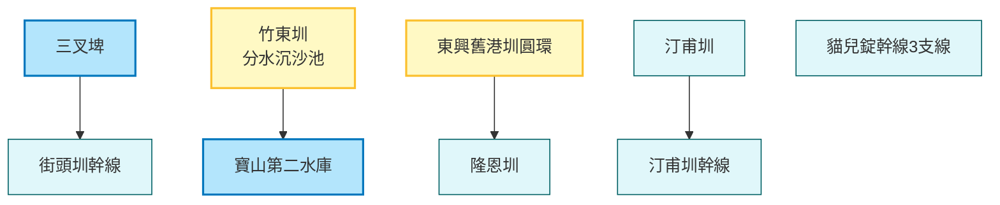

# 智慧水圳玩樂地圖 - 新竹管理處

探索新竹地區的重要水利設施，從百年的隆恩圳、汀甫圳到現代化的寶二水庫分水工，見證傳統與現代科技的結合。

## 路線地圖 (Route Map)

## 景點列表

1.  [三叉埤](../features/20251230_sancha_pond.md)
2.  [汀甫圳](../features/20251230_tingfu_canal.md)
3.  [汀甫圳幹線](../features/20251230_tingfu_main_canal.md)
4.  [竹東圳 (寶山第二水庫與竹東圳分水沉沙池)](../features/20251230_zhudong_canal_sand_basin.md)
5.  [東興舊港圳圓環](../features/20251230_dongxing_old_port_canal_circle.md)
6.  [街頭圳幹線](../features/20251230_jietou_main_canal.md)
7.  [隆恩圳](../features/20251230_longen_canal.md)
8.  [貓兒錠幹線3支線](../features/20251230_maoerding_branch_3.md)
