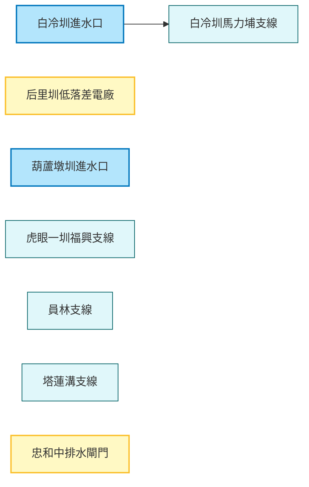

# 智慧水圳玩樂地圖 - 臺中管理處 (Smart Water Canal Fun Map - Taichung Management Office)

探索大甲溪流域的智慧水利設施，見證傳統灌溉與現代科技的結合。這是一趟結合歷史、科技與生態知性之旅。

## 路線地圖 (Route Map)



## 🗺️ AI 深度探索 (Deep Research)
如果您擁有 Gemini Advanced 或其他 Deep Research 工具，可以複製以下 Prompt，深入探究台中地區的水利智慧與綠能實踐：

```markdown
# Context
一份名為「智慧水圳玩樂地圖 - 臺中管理處」的導覽案，連結了台中市山區（新社）與平原（后里、豐原）的關鍵水利設施。這是一條展現台灣如何將「百年水利」升級為「智慧防災與綠能發電」的知識路徑。

# Task
針對以下景點列表，挖掘其中的工程原理、歷史背景與周邊的休閒亮點。

**景點列表：**
1. 白冷圳進水口 (倒虹吸管起點)
2. 白冷圳馬力埔支線 (新社花海灌溉區)
3. 后里圳低落差示範電廠 (小水力發電)
4. 忠和中排水截水閘門 (智慧防汛)
5. 虎眼一圳福興支線
6. 員林支線
7. 塔蓮溝支線
8. 葫蘆墩圳進水口 (台中最老水圳)

# Requirements (請分析以下維度)
1. **工程科普**: 倒虹吸管運作原理？小水力發電如何利用位能？智慧閘門如何運作？
2. **地方創生**: 新社花海與白冷圳的關係（沒有水就沒有花海）。
3. **歷史軌跡**: 磯田謙雄與白冷圳的故事。
4. **在地美食**: 新社香菇大餐、后里豬血湯、豐原廟東夜市（鄰近葫蘆墩圳）。
```

## 景點列表 (Feature List)

1.  [白冷圳進水口](../features/20251229_baileng_intake.md)
2.  [白冷圳馬力埔支線](../features/20251229_baileng_malipu.md)
3.  [后里圳低落差示範電廠](../features/20251229_houli_low_head_power.md)
4.  [忠和中排水截水閘門](../features/20251229_zhonghe_gate.md)
5.  [虎眼一圳福興支線](../features/20251229_huyan_fuxing.md)
6.  [員林支線](../features/20251229_yuanlin_branch.md)
7.  [塔蓮溝支線](../features/20251229_taliangou_branch.md)
8.  [葫蘆墩圳進水口](../features/20251229_huludun_intake.md)
