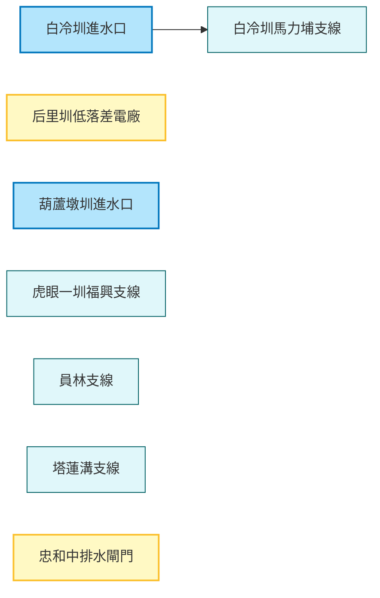

# 智慧水圳玩樂地圖 - 臺中管理處 (Smart Water Canal Fun Map - Taichung Management Office)

探索大甲溪流域的智慧水利設施，見證傳統灌溉與現代科技的結合。這是一趟結合歷史、科技與生態知性之旅。

## 路線地圖 (Route Map)

## 景點列表 (Feature List)

1.  [白冷圳進水口](../features/20251229_baileng_intake.md)
2.  [白冷圳馬力埔支線](../features/20251229_baileng_malipu.md)
3.  [后里圳低落差示範電廠](../features/20251229_houli_low_head_power.md)
4.  [忠和中排水截水閘門](../features/20251229_zhonghe_gate.md)
5.  [虎眼一圳福興支線](../features/20251229_huyan_fuxing.md)
6.  [員林支線](../features/20251229_yuanlin_branch.md)
7.  [塔蓮溝支線](../features/20251229_taliangou_branch.md)
8.  [葫蘆墩圳進水口](../features/20251229_huludun_intake.md)
