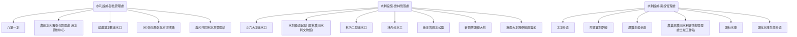

# 農田水利署中區圳路地圖

## 地圖結構 (Topology)

```mermaid
graph TD
    八堡一圳["八堡一圳"]
    農田水利署彰化管理處_用水管制中心["農田水利署彰化管理處 用水管制中心"]
    葫蘆墩圳舊進水口["葫蘆墩圳舊進水口"]
    500彰化縣彰化市河濱路["500彰化縣彰化市河濱路"]
    義和共同制水埧管理站["義和共同制水埧管理站"]
    斗六大圳進水口["斗六大圳進水口"]
    水圳綠道起點__雲林農田水利文物館["水圳綠道起點 (雲林農田水利文物館)"]
    林內二號進水口["林內二號進水口"]
    林內分水工["林內分水工"]
    後庄埤親水公園["後庄埤親水公園"]
    新頂埤頭線大排["新頂埤頭線大排"]
    嘉南大圳濁幹線調蓄池["嘉南大圳濁幹線調蓄池"]
    北圳步道["北圳步道"]
    阿罩霧圳幹線["阿罩霧圳幹線"]
    鳳雛生態步道["鳳雛生態步道"]
    農業部農田水利署南投管理處土城工作站["農業部農田水利署南投管理處土城工作站"]
    頭社水庫["頭社水庫"]
    頭社水庫生態步道["頭社水庫生態步道"]
    水利設施_彰化管理處(水利設施-彰化管理處)
    水利設施_彰化管理處 --> 八堡一圳
    水利設施_彰化管理處 --> 農田水利署彰化管理處_用水管制中心
    水利設施_彰化管理處 --> 葫蘆墩圳舊進水口
    水利設施_彰化管理處 --> 500彰化縣彰化市河濱路
    水利設施_彰化管理處 --> 義和共同制水埧管理站
    水利設施_雲林管理處(水利設施-雲林管理處)
    水利設施_雲林管理處 --> 斗六大圳進水口
    水利設施_雲林管理處 --> 水圳綠道起點__雲林農田水利文物館
    水利設施_雲林管理處 --> 林內二號進水口
    水利設施_雲林管理處 --> 林內分水工
    水利設施_雲林管理處 --> 後庄埤親水公園
    水利設施_雲林管理處 --> 新頂埤頭線大排
    水利設施_雲林管理處 --> 嘉南大圳濁幹線調蓄池
    水利設施_南投管理處(水利設施-南投管理處)
    水利設施_南投管理處 --> 北圳步道
    水利設施_南投管理處 --> 阿罩霧圳幹線
    水利設施_南投管理處 --> 鳳雛生態步道
    水利設施_南投管理處 --> 農業部農田水利署南投管理處土城工作站
    水利設施_南投管理處 --> 頭社水庫
    水利設施_南投管理處 --> 頭社水庫生態步道
```

## 簡介 (Introduction)
本圖資彙整了農業部農田水利署（彰化、雲林、南投管理處）轄區內的重要圳路設施、取水口與相關景點。適合進行水利文化探索與考察。

## 使用者補充筆記 (User Notes)
### 重點觀察
- 彰化：八堡圳水系
- 雲林：濁幹線與水圳綠道
- 南投：埔里與頭社水庫生態

## 🗺️ AI 深度探索 (Deep Research)
如果您擁有 Gemini Advanced 或其他 Deep Research 工具，可以複製以下 Prompt，針對本工程地圖進行深度的文史與美食探索：

```markdown
# Context
一份名為「農田水利署中區圳路地圖」的導覽路線，探索中台灣重要的農田水利設施，涵蓋彰化、雲林、南投三大管理處。

# Task
請針對以下景點列表，進行 Deep Research，挖掘背後的「歷史深度」、「生活溫度」與「在地美食」。

**景點列表：**
1. 八堡一圳
2. 農田水利署彰化管理處 用水管制中心
3. 葫蘆墩圳舊進水口 (同源圳舊進水口)
4. 500彰化縣彰化市河濱路 (東西三圳)
5. 義和共同制水埧管理站
6. 斗六大圳進水口
7. 水圳綠道起點 (雲林農田水利文物館)
8. 林內二號進水口
9. 林內分水工 (八卦池)
10. 後庄埤親水公園
11. 新頂埤頭線大排
12. 嘉南大圳濁幹線調蓄池
13. 北圳步道
14. 阿罩霧圳幹線 (及其水車)
15. 鳳雛生態步道 (埔里南烘圳)
16. 農業部農田水利署南投管理處土城工作站 (農田水利教育園區)
17. 頭社水庫
18. 頭社水庫生態步道 (山龍坑吊橋)

# Requirements (請分析以下維度)
1. **歷史與工程脈絡**: 該點在台灣水利/歷史的角色？
2. **在地文化與生態**: 周邊古蹟、廟宇、特殊生態景觀。
3. **順遊景點**: 步行/單車可達的隱藏景點。
4. **必吃在地美食**: 老字號小吃、在地人推薦 (非連鎖)。
```

## 📊 Dynamic View 視覺化
如果您已經產出了 Deep Research Report，接著在 Dynamic View 中，您的 Prompt 策略應該從「獲取資訊」轉向**「結構化與視覺化」**。

1. **生成時間軸 (Timeline View)**
   - Prompt: "基於這份研究報告，請以時間軸視圖呈現各水利設施的建造年代與演變。"
2. **生成比較表格 (Comparison Table View)**
   - Prompt: "請建立一個比較表格，分析不同管理處（彰化/雲林/南投）的灌溉特色與水源差異。"

## 下載與資源 (Resources)
- **[KML 地圖檔下載](./20260111_ia_central_canals.kml)**

## 景點列表 (Features)
- [八堡一圳](?map=20260202_shanhaijun&feature=20260111_ia_central_canals_00_%E5%85%AB%E5%A0%A1%E4%B8%80%E5%9C%B3)
- [農田水利署彰化管理處 用水管制中心](?map=20260202_shanhaijun&feature=20260111_ia_central_canals_01_%E8%BE%B2%E7%94%B0%E6%B0%B4%E5%88%A9%E7%BD%B2%E5%BD%B0%E5%8C%96%E7%AE%A1%E7%90%86%E8%99%95_%E7%94%A8%E6%B0%B4%E7%AE%A1%E5%88%B6%E4%B8%AD%E5%BF%83)
- [葫蘆墩圳舊進水口](?map=20260202_shanhaijun&feature=20260111_ia_central_canals_02_%E8%91%AB%E8%98%86%E5%A2%A9%E5%9C%B3%E8%88%8A%E9%80%B2%E6%B0%B4%E5%8F%A3)
- [500彰化縣彰化市河濱路](?map=20260202_shanhaijun&feature=20260111_ia_central_canals_03_500%E5%BD%B0%E5%8C%96%E7%B8%A3%E5%BD%B0%E5%8C%96%E5%B8%82%E6%B2%B3%E6%BF%B1%E8%B7%AF)
- [義和共同制水埧管理站](?map=20260202_shanhaijun&feature=20260111_ia_central_canals_04_%E7%BE%A9%E5%92%8C%E5%85%B1%E5%90%8C%E5%88%B6%E6%B0%B4%E5%9F%A7%E7%AE%A1%E7%90%86%E7%AB%99)
- [斗六大圳進水口](?map=20260202_shanhaijun&feature=20260111_ia_central_canals_05_%E6%96%97%E5%85%AD%E5%A4%A7%E5%9C%B3%E9%80%B2%E6%B0%B4%E5%8F%A3)
- [水圳綠道起點 (雲林農田水利文物館)](?map=20260202_shanhaijun&feature=20260111_ia_central_canals_06_%E6%B0%B4%E5%9C%B3%E7%B6%A0%E9%81%93%E8%B5%B7%E9%BB%9E__%E9%9B%B2%E6%9E%97%E8%BE%B2%E7%94%B0%E6%B0%B4%E5%88%A9%E6%96%87%E7%89%A9%E9%A4%A8)
- [林內二號進水口](?map=20260202_shanhaijun&feature=20260111_ia_central_canals_07_%E6%9E%97%E5%85%A7%E4%BA%8C%E8%99%9F%E9%80%B2%E6%B0%B4%E5%8F%A3)
- [林內分水工](?map=20260202_shanhaijun&feature=20260111_ia_central_canals_08_%E6%9E%97%E5%85%A7%E5%88%86%E6%B0%B4%E5%B7%A5)
- [後庄埤親水公園](?map=20260202_shanhaijun&feature=20260111_ia_central_canals_09_%E5%BE%8C%E5%BA%84%E5%9F%A4%E8%A6%AA%E6%B0%B4%E5%85%AC%E5%9C%92)
- [新頂埤頭線大排](?map=20260202_shanhaijun&feature=20260111_ia_central_canals_10_%E6%96%B0%E9%A0%82%E5%9F%A4%E9%A0%AD%E7%B7%9A%E5%A4%A7%E6%8E%92)
- [嘉南大圳濁幹線調蓄池](?map=20260202_shanhaijun&feature=20260111_ia_central_canals_11_%E5%98%89%E5%8D%97%E5%A4%A7%E5%9C%B3%E6%BF%81%E5%B9%B9%E7%B7%9A%E8%AA%BF%E8%93%84%E6%B1%A0)
- [北圳步道](?map=20260202_shanhaijun&feature=20260111_ia_central_canals_12_%E5%8C%97%E5%9C%B3%E6%AD%A5%E9%81%93)
- [阿罩霧圳幹線](?map=20260202_shanhaijun&feature=20260111_ia_central_canals_13_%E9%98%BF%E7%BD%A9%E9%9C%A7%E5%9C%B3%E5%B9%B9%E7%B7%9A)
- [鳳雛生態步道](?map=20260202_shanhaijun&feature=20260111_ia_central_canals_14_%E9%B3%B3%E9%9B%9B%E7%94%9F%E6%85%8B%E6%AD%A5%E9%81%93)
- [農業部農田水利署南投管理處土城工作站](?map=20260202_shanhaijun&feature=20260111_ia_central_canals_15_%E8%BE%B2%E6%A5%AD%E9%83%A8%E8%BE%B2%E7%94%B0%E6%B0%B4%E5%88%A9%E7%BD%B2%E5%8D%97%E6%8A%95%E7%AE%A1%E7%90%86%E8%99%95%E5%9C%9F%E5%9F%8E%E5%B7%A5%E4%BD%9C%E7%AB%99)
- [頭社水庫](?map=20260202_shanhaijun&feature=20260111_ia_central_canals_16_%E9%A0%AD%E7%A4%BE%E6%B0%B4%E5%BA%AB)
- [頭社水庫生態步道](?map=20260202_shanhaijun&feature=20260111_ia_central_canals_17_%E9%A0%AD%E7%A4%BE%E6%B0%B4%E5%BA%AB%E7%94%9F%E6%85%8B%E6%AD%A5%E9%81%93)
