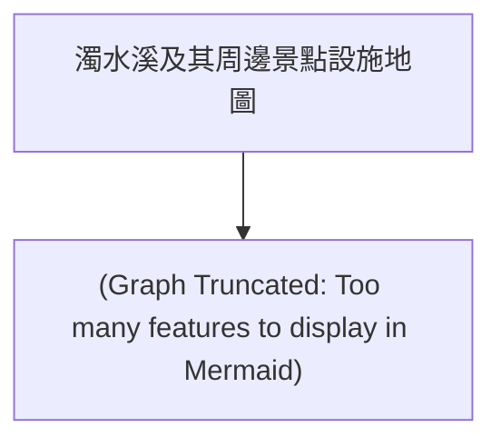

# 濁水溪及其周邊景點設施地圖

## 簡介 (Introduction)
彙整濁水溪流域之交通、水利、人文與自然景點。本資料集包含水利、交通、人文、自然等多面向的景點。

## 地圖結構 (Topology)

## 🗺️ AI 深度探索 (Deep Research)
(由於景點眾多，建議針對特定分類進行搜尋)

## 下載與資源 (Resources)
- **[KML 地圖檔下載](./20260111_zhuoshui_facilities.kml)**

## 景點列表 (Features)
- [二水車站](../features/20260111_zhuoshui_facilities_000_二水車站.md)
- [源泉車站](../features/20260111_zhuoshui_facilities_001_源泉車站.md)
- [二水自行車道](../features/20260111_zhuoshui_facilities_002_二水自行車道.md)
- [二水登廟步道](../features/20260111_zhuoshui_facilities_003_二水登廟步道.md)
- [豐柏廣場](../features/20260111_zhuoshui_facilities_004_豐柏廣場.md)
- [龍仔頭山](../features/20260111_zhuoshui_facilities_005_龍仔頭山.md)
- [二水台灣獼猴保護區](../features/20260111_zhuoshui_facilities_006_二水台灣獼猴保護區.md)
- [林先生廟](../features/20260111_zhuoshui_facilities_007_林先生廟.md)
- [大丘園休閒農場](../features/20260111_zhuoshui_facilities_008_大丘園休閒農場.md)
- [二八彎農園](../features/20260111_zhuoshui_facilities_009_二八彎農園.md)
- [水車農園](../features/20260111_zhuoshui_facilities_010_水車農園.md)
- [鼻子頭休閒農園](../features/20260111_zhuoshui_facilities_011_鼻子頭休閒農園.md)
- [蓮荷果休閒農園](../features/20260111_zhuoshui_facilities_012_蓮荷果休閒農園.md)
- [螺溪石藝館](../features/20260111_zhuoshui_facilities_013_螺溪石藝館.md)
- [大義崙天后宮](../features/20260111_zhuoshui_facilities_014_大義崙天后宮.md)
- [張廖宗祠崇遠堂](../features/20260111_zhuoshui_facilities_015_張廖宗祠崇遠堂.md)
- [國興宮](../features/20260111_zhuoshui_facilities_016_國興宮.md)
- [定安宮](../features/20260111_zhuoshui_facilities_017_定安宮.md)
- [彌陀精舍](../features/20260111_zhuoshui_facilities_018_彌陀精舍.md)
- [二崙自然步道](../features/20260111_zhuoshui_facilities_019_二崙自然步道.md)
- [二崙故事屋](../features/20260111_zhuoshui_facilities_020_二崙故事屋.md)
- [興山公園](../features/20260111_zhuoshui_facilities_021_興山公園.md)
- [鷺鷥生態景觀公園](../features/20260111_zhuoshui_facilities_022_鷺鷥生態景觀公園.md)
- [龍鳳瀑布](../features/20260111_zhuoshui_facilities_023_龍鳳瀑布.md)
- [仙峰日月洞](../features/20260111_zhuoshui_facilities_024_仙峰日月洞.md)
- [仙洞坪棋盤石](../features/20260111_zhuoshui_facilities_025_仙洞坪棋盤石.md)
- [粗坑大峭壁](../features/20260111_zhuoshui_facilities_026_粗坑大峭壁.md)
- [石龍宮](../features/20260111_zhuoshui_facilities_027_石龍宮.md)
- [金龍山法華寺](../features/20260111_zhuoshui_facilities_028_金龍山法華寺.md)
- [白鶴嶺天恩宮](../features/20260111_zhuoshui_facilities_029_白鶴嶺天恩宮.md)
- [太魯閣國家公園](../features/20260111_zhuoshui_facilities_030_太魯閣國家公園.md)
- [合歡山國家森林遊樂區](../features/20260111_zhuoshui_facilities_031_合歡山國家森林遊樂區.md)
- [奧萬大國家森林遊樂區](../features/20260111_zhuoshui_facilities_032_奧萬大國家森林遊樂區.md)
- [翠峰風景特定區](../features/20260111_zhuoshui_facilities_033_翠峰風景特定區.md)
- [鳶峰觀景台](../features/20260111_zhuoshui_facilities_034_鳶峰觀景台.md)
- [霧社水庫](../features/20260111_zhuoshui_facilities_035_霧社水庫.md)
- [廬山溫泉](../features/20260111_zhuoshui_facilities_036_廬山溫泉.md)
- [清境農場](../features/20260111_zhuoshui_facilities_037_清境農場.md)
- [台大梅峰農場](../features/20260111_zhuoshui_facilities_038_台大梅峰農場.md)
- [興大惠蓀林場](../features/20260111_zhuoshui_facilities_039_興大惠蓀林場.md)
- [泰雅渡假村](../features/20260111_zhuoshui_facilities_040_泰雅渡假村.md)
- [南投縣自然史教育館](../features/20260111_zhuoshui_facilities_041_南投縣自然史教育館.md)
- [霧社事件紀念公園](../features/20260111_zhuoshui_facilities_042_霧社事件紀念公園.md)
- [撩溪](../features/20260111_zhuoshui_facilities_043_撩溪.md)
- [二水跑水節](../features/20260111_zhuoshui_facilities_044_二水跑水節.md)
- [溪州黑泥季](../features/20260111_zhuoshui_facilities_045_溪州黑泥季.md)
- [濁溪搶水文化節](../features/20260111_zhuoshui_facilities_046_濁溪搶水文化節.md)
- [明潭水庫](../features/20260111_zhuoshui_facilities_047_明潭水庫.md)
- [寧靜谷](../features/20260111_zhuoshui_facilities_048_寧靜谷.md)
- [仙鄉瀑布](../features/20260111_zhuoshui_facilities_049_仙鄉瀑布.md)
- [石觀音](../features/20260111_zhuoshui_facilities_050_石觀音.md)
- [水里蛇窯](../features/20260111_zhuoshui_facilities_051_水里蛇窯.md)
- [車埕雙土地公廟](../features/20260111_zhuoshui_facilities_052_車埕雙土地公廟.md)
- [車埕休閒園區](../features/20260111_zhuoshui_facilities_053_車埕休閒園區.md)
- [水里溪親水區及自行車道](../features/20260111_zhuoshui_facilities_054_水里溪親水區及自行車道.md)
- [阿本農場櫻花祕境](../features/20260111_zhuoshui_facilities_055_阿本農場櫻花祕境.md)
- [雨社山聚落](../features/20260111_zhuoshui_facilities_056_雨社山聚落.md)
- [益則坑](../features/20260111_zhuoshui_facilities_057_益則坑.md)
- [建安堂](../features/20260111_zhuoshui_facilities_058_建安堂.md)
- [水里虎爺廟](../features/20260111_zhuoshui_facilities_059_水里虎爺廟.md)
- [水里鵲橋](../features/20260111_zhuoshui_facilities_060_水里鵲橋.md)
- [登瀛書院](../features/20260111_zhuoshui_facilities_061_登瀛書院.md)
- [明新書院](../features/20260111_zhuoshui_facilities_062_明新書院.md)
- [林鳳池舉人墓](../features/20260111_zhuoshui_facilities_063_林鳳池舉人墓.md)
- [八通關古道](../features/20260111_zhuoshui_facilities_064_八通關古道.md)
- [楠仔腳蔓社學堂遺蹟](../features/20260111_zhuoshui_facilities_065_楠仔腳蔓社學堂遺蹟.md)
- [草屯燉倫堂](../features/20260111_zhuoshui_facilities_066_草屯燉倫堂.md)
- [國姓鄉北港溪石橋](../features/20260111_zhuoshui_facilities_067_國姓鄉北港溪石橋.md)
- [祭祀公業張琯溪公宗祠](../features/20260111_zhuoshui_facilities_068_祭祀公業張琯溪公宗祠.md)
- [旗杆厝](../features/20260111_zhuoshui_facilities_069_旗杆厝.md)
- [南投市農會](../features/20260111_zhuoshui_facilities_070_南投市農會.md)
- [武德殿及其附屬建築群](../features/20260111_zhuoshui_facilities_071_武德殿及其附屬建築群.md)
- [崇善堂](../features/20260111_zhuoshui_facilities_072_崇善堂.md)
- [敷榮堂](../features/20260111_zhuoshui_facilities_073_敷榮堂.md)
- [南投縣陳姓宗親會西水祠](../features/20260111_zhuoshui_facilities_074_南投縣陳姓宗親會西水祠.md)
- [賴家古厝](../features/20260111_zhuoshui_facilities_075_賴家古厝.md)
- [陳家古厝](../features/20260111_zhuoshui_facilities_076_陳家古厝.md)
- [草屯國民小學禮堂](../features/20260111_zhuoshui_facilities_077_草屯國民小學禮堂.md)
- [碧峰國民小學禮堂](../features/20260111_zhuoshui_facilities_078_碧峰國民小學禮堂.md)
- [埔里黃宅](../features/20260111_zhuoshui_facilities_079_埔里黃宅.md)
- [水蛙窟考古遺址](../features/20260111_zhuoshui_facilities_080_水蛙窟考古遺址.md)
- [南投市中山公園「聚芳館」](../features/20260111_zhuoshui_facilities_081_南投市中山公園「聚芳館」.md)
- [新庄國小禮堂](../features/20260111_zhuoshui_facilities_082_新庄國小禮堂.md)
- [集集火車站](../features/20260111_zhuoshui_facilities_083_集集火車站.md)
- [集集林尾陳宅永福堂](../features/20260111_zhuoshui_facilities_084_集集林尾陳宅永福堂.md)
- [振昌興業股份有限公司建築群](../features/20260111_zhuoshui_facilities_085_振昌興業股份有限公司建築群.md)
- [甘泉井及石頭公](../features/20260111_zhuoshui_facilities_086_甘泉井及石頭公.md)
- [竹山隆恩圳隧渠](../features/20260111_zhuoshui_facilities_087_竹山隆恩圳隧渠.md)
- [鹿谷聖蹟亭](../features/20260111_zhuoshui_facilities_088_鹿谷聖蹟亭.md)
- [新庄國小日治宿舍](../features/20260111_zhuoshui_facilities_089_新庄國小日治宿舍.md)
- [國姓鄉南港村–林屋伙房](../features/20260111_zhuoshui_facilities_090_國姓鄉南港村–林屋伙房.md)
- [添興窯及其附屬設施](../features/20260111_zhuoshui_facilities_091_添興窯及其附屬設施.md)
- [大馬璘考古遺址](../features/20260111_zhuoshui_facilities_092_大馬璘考古遺址.md)
- [中興新村文化景觀](../features/20260111_zhuoshui_facilities_093_中興新村文化景觀.md)
- [行政院農業委員會農糧署](../features/20260111_zhuoshui_facilities_094_行政院農業委員會農糧署.md)
- [經濟部中部辦公室](../features/20260111_zhuoshui_facilities_095_經濟部中部辦公室.md)
- [臺灣銀行中興新村分行](../features/20260111_zhuoshui_facilities_096_臺灣銀行中興新村分行.md)
- [行政院農業委員會水土保持局](../features/20260111_zhuoshui_facilities_097_行政院農業委員會水土保持局.md)
- [中興會堂](../features/20260111_zhuoshui_facilities_098_中興會堂.md)
- [臺灣新生報中興新村辦事處](../features/20260111_zhuoshui_facilities_099_臺灣新生報中興新村辦事處.md)
- [臺灣省政資料館](../features/20260111_zhuoshui_facilities_100_臺灣省政資料館.md)
- [中華電信中興服務中心](../features/20260111_zhuoshui_facilities_101_中華電信中興服務中心.md)
- [國家文官學院中區培訓中心中正堂](../features/20260111_zhuoshui_facilities_102_國家文官學院中區培訓中心中正堂.md)
- [行政院人事行政局地方人事行政處](../features/20260111_zhuoshui_facilities_103_行政院人事行政局地方人事行政處.md)
- [國立中興大學實驗林管理處埔里連絡站](../features/20260111_zhuoshui_facilities_104_國立中興大學實驗林管理處埔里連絡站.md)
- [行政院農業委員會茶業改良場魚池分場](../features/20260111_zhuoshui_facilities_105_行政院農業委員會茶業改良場魚池分場.md)
- [社寮穀倉](../features/20260111_zhuoshui_facilities_106_社寮穀倉.md)
- [臺灣省政府](../features/20260111_zhuoshui_facilities_107_臺灣省政府.md)
- [林圮公墓](../features/20260111_zhuoshui_facilities_108_林圮公墓.md)
- [集集館](../features/20260111_zhuoshui_facilities_109_集集館.md)
- [林淵石頭厝](../features/20260111_zhuoshui_facilities_110_林淵石頭厝.md)
- [縣定古蹟永濟義渡碑(名間鄉)](../features/20260111_zhuoshui_facilities_111_縣定古蹟永濟義渡碑(名間鄉).md)
- [集集樟腦出張所建築群](../features/20260111_zhuoshui_facilities_112_集集樟腦出張所建築群.md)
- [縣定古蹟永濟義渡碑(竹山鎮)](../features/20260111_zhuoshui_facilities_113_縣定古蹟永濟義渡碑(竹山鎮).md)
- [竹山郡役所作戰指揮所(防空壕)](../features/20260111_zhuoshui_facilities_114_竹山郡役所作戰指揮所(防空壕).md)
- [竹山社寮敬聖亭](../features/20260111_zhuoshui_facilities_115_竹山社寮敬聖亭.md)
- [竹山連興宮](../features/20260111_zhuoshui_facilities_116_竹山連興宮.md)
- [月眉厝龍德廟](../features/20260111_zhuoshui_facilities_117_月眉厝龍德廟.md)
- [藍田書院
「奏凱崇文」匾](../features/20260111_zhuoshui_facilities_118_藍田書院
「奏凱崇文」匾.md)
- [竹山神社鳥居及竹山神社附屬設施](../features/20260111_zhuoshui_facilities_119_竹山神社鳥居及竹山神社附屬設施.md)
- [台中菸葉場竹山輔導站](../features/20260111_zhuoshui_facilities_120_台中菸葉場竹山輔導站.md)
- [交通部交通事業管理小組](../features/20260111_zhuoshui_facilities_121_交通部交通事業管理小組.md)
- [南投稅務出張所](../features/20260111_zhuoshui_facilities_122_南投稅務出張所.md)
- [曲冰考古遺址](../features/20260111_zhuoshui_facilities_123_曲冰考古遺址.md)
- [霧社事件‧馬赫坡古戰場](../features/20260111_zhuoshui_facilities_124_霧社事件‧馬赫坡古戰場.md)
- [頭社古日潭浮田文化景觀](../features/20260111_zhuoshui_facilities_125_頭社古日潭浮田文化景觀.md)
- [藍田雅舍](../features/20260111_zhuoshui_facilities_126_藍田雅舍.md)
- [陳善述老宅](../features/20260111_zhuoshui_facilities_127_陳善述老宅.md)
- [埔里南村義民祠](../features/20260111_zhuoshui_facilities_128_埔里南村義民祠.md)
- [草屯朝陽宮
朝陽宮虎爺石雕香爐](../features/20260111_zhuoshui_facilities_129_草屯朝陽宮
朝陽宮虎爺石雕香爐.md)
- [覆鼎金考古遺址](../features/20260111_zhuoshui_facilities_130_覆鼎金考古遺址.md)
- [原手工業品陳列館](../features/20260111_zhuoshui_facilities_131_原手工業品陳列館.md)
- [草鞋墩雅舍](../features/20260111_zhuoshui_facilities_132_草鞋墩雅舍.md)
- [嚴禁勒索竹排船伕碑](../features/20260111_zhuoshui_facilities_133_嚴禁勒索竹排船伕碑.md)
- [配天宮正殿石獅](../features/20260111_zhuoshui_facilities_134_配天宮正殿石獅.md)
- [慶安宮土地公石雕香爐](../features/20260111_zhuoshui_facilities_135_慶安宮土地公石雕香爐.md)
- [近藤昌之碑](../features/20260111_zhuoshui_facilities_136_近藤昌之碑.md)
- [清代埔眉社古文書三件一組
毛格后蚋潘永成潘有明同立開墾合約字
泰雅貝珠衣](../features/20260111_zhuoshui_facilities_137_清代埔眉社古文書三件一組
毛格后蚋潘永成潘有明同立開墾合約字
泰雅貝珠衣.md)
- [「七將軍」匾](../features/20260111_zhuoshui_facilities_138_「七將軍」匾.md)
- [日治時期埔里地區神社手洗缽](../features/20260111_zhuoshui_facilities_139_日治時期埔里地區神社手洗缽.md)
- [簡姓惠宗祠堂陶製香爐](../features/20260111_zhuoshui_facilities_140_簡姓惠宗祠堂陶製香爐.md)
- [喜捐祝生廟祀田碑](../features/20260111_zhuoshui_facilities_141_喜捐祝生廟祀田碑.md)
- [刑期無刑匾](../features/20260111_zhuoshui_facilities_142_刑期無刑匾.md)
- [昭險圳改修諸首事人氏名記念碑](../features/20260111_zhuoshui_facilities_143_昭險圳改修諸首事人氏名記念碑.md)
- [萬丹山生命紀念園](../features/20260111_zhuoshui_facilities_144_萬丹山生命紀念園.md)
- [帝皇嶺紀念花園](../features/20260111_zhuoshui_facilities_145_帝皇嶺紀念花園.md)
- [皇穹陵紀念花園](../features/20260111_zhuoshui_facilities_146_皇穹陵紀念花園.md)
- [松柏嶺遊客中心](../features/20260111_zhuoshui_facilities_147_松柏嶺遊客中心.md)
- [七星陣地碉堡公園](../features/20260111_zhuoshui_facilities_148_七星陣地碉堡公園.md)
- [京麟雕塑文化園區](../features/20260111_zhuoshui_facilities_149_京麟雕塑文化園區.md)
- [茶香步道](../features/20260111_zhuoshui_facilities_150_茶香步道.md)
- [南投縣松柏嶺高爾夫球場](../features/20260111_zhuoshui_facilities_151_南投縣松柏嶺高爾夫球場.md)
- [茶二指故事館](../features/20260111_zhuoshui_facilities_152_茶二指故事館.md)
- [桂花森林休閒農莊](../features/20260111_zhuoshui_facilities_153_桂花森林休閒農莊.md)
- [緣園有機農場](../features/20260111_zhuoshui_facilities_154_緣園有機農場.md)
- [茶米香休閒農場](../features/20260111_zhuoshui_facilities_155_茶米香休閒農場.md)
- [森18休閒農場](../features/20260111_zhuoshui_facilities_156_森18休閒農場.md)
- [香茗園樹葡萄農場](../features/20260111_zhuoshui_facilities_157_香茗園樹葡萄農場.md)
- [南投肉品市場-豬樂園](../features/20260111_zhuoshui_facilities_158_南投肉品市場-豬樂園.md)
- [木協台灣檜木坊](../features/20260111_zhuoshui_facilities_159_木協台灣檜木坊.md)
- [杉林溪森林遊樂區](../features/20260111_zhuoshui_facilities_160_杉林溪森林遊樂區.md)
- [下坪自然教育園區](../features/20260111_zhuoshui_facilities_161_下坪自然教育園區.md)
- [竹山文化園區](../features/20260111_zhuoshui_facilities_162_竹山文化園區.md)
- [沙東宮國家地震公園](../features/20260111_zhuoshui_facilities_163_沙東宮國家地震公園.md)
- [青竹竹藝文化園區](../features/20260111_zhuoshui_facilities_164_青竹竹藝文化園區.md)
- [八通關社寮古道](../features/20260111_zhuoshui_facilities_165_八通關社寮古道.md)
- [林圮墓](../features/20260111_zhuoshui_facilities_166_林圮墓.md)
- [聖義廟「紅旗公」](../features/20260111_zhuoshui_facilities_167_聖義廟「紅旗公」.md)
- [桶頭吊橋](../features/20260111_zhuoshui_facilities_168_桶頭吊橋.md)
- [李勇廟](../features/20260111_zhuoshui_facilities_169_李勇廟.md)
- [竹山連興宮](../features/20260111_zhuoshui_facilities_170_竹山連興宮.md)
- [社寮紫南宮](../features/20260111_zhuoshui_facilities_171_社寮紫南宮.md)
- [大鞍竹海](../features/20260111_zhuoshui_facilities_172_大鞍竹海.md)
- [軟鞍八卦茶園](../features/20260111_zhuoshui_facilities_173_軟鞍八卦茶園.md)
- [太極峽谷](../features/20260111_zhuoshui_facilities_174_太極峽谷.md)
- [觀海坪](../features/20260111_zhuoshui_facilities_175_觀海坪.md)
- [車籠埔斷層保存園區](../features/20260111_zhuoshui_facilities_176_車籠埔斷層保存園區.md)
- [竹山天梯](../features/20260111_zhuoshui_facilities_177_竹山天梯.md)
- [頂崙天倫宮](../features/20260111_zhuoshui_facilities_178_頂崙天倫宮.md)
- [竹塘醒靈宮](../features/20260111_zhuoshui_facilities_179_竹塘醒靈宮.md)
- [明航寺](../features/20260111_zhuoshui_facilities_180_明航寺.md)
- [竹塘慈航宮](../features/20260111_zhuoshui_facilities_181_竹塘慈航宮.md)
- [九龍大榕公](../features/20260111_zhuoshui_facilities_182_九龍大榕公.md)
- [米香囍懷舊農村生活館](../features/20260111_zhuoshui_facilities_183_米香囍懷舊農村生活館.md)
- [鹿世界觀光牧場](../features/20260111_zhuoshui_facilities_184_鹿世界觀光牧場.md)
- [竹塘公園](../features/20260111_zhuoshui_facilities_185_竹塘公園.md)
- [西螺大橋](../features/20260111_zhuoshui_facilities_186_西螺大橋.md)
- [延平老街](../features/20260111_zhuoshui_facilities_187_延平老街.md)
- [西螺廣福宮](../features/20260111_zhuoshui_facilities_188_西螺廣福宮.md)
- [西螺福興宮](../features/20260111_zhuoshui_facilities_189_西螺福興宮.md)
- [西螺福天宮](../features/20260111_zhuoshui_facilities_190_西螺福天宮.md)
- [西螺果菜市場](../features/20260111_zhuoshui_facilities_191_西螺果菜市場.md)
- [西螺東市場](../features/20260111_zhuoshui_facilities_192_西螺東市場.md)
- [西螺泰山石敢當](../features/20260111_zhuoshui_facilities_193_西螺泰山石敢當.md)
- [農田水利文物陳列館](../features/20260111_zhuoshui_facilities_194_農田水利文物陳列館.md)
- [坪頂茶葉文化館](../features/20260111_zhuoshui_facilities_195_坪頂茶葉文化館.md)
- [玉山國家公園](../features/20260111_zhuoshui_facilities_196_玉山國家公園.md)
- [風櫃斗](../features/20260111_zhuoshui_facilities_197_風櫃斗.md)
- [東埔溫泉](../features/20260111_zhuoshui_facilities_198_東埔溫泉.md)
- [坪瀨風景區](../features/20260111_zhuoshui_facilities_199_坪瀨風景區.md)
- [彩虹瀑布情人谷](../features/20260111_zhuoshui_facilities_200_彩虹瀑布情人谷.md)
- [雲龍瀑布](../features/20260111_zhuoshui_facilities_201_雲龍瀑布.md)
- [雙龍瀑布](../features/20260111_zhuoshui_facilities_202_雙龍瀑布.md)
- [父不知子斷崖](../features/20260111_zhuoshui_facilities_203_父不知子斷崖.md)
- [丹大林道](../features/20260111_zhuoshui_facilities_204_丹大林道.md)
- [七彩湖](../features/20260111_zhuoshui_facilities_205_七彩湖.md)
- [木瓜坑大瀑布](../features/20260111_zhuoshui_facilities_206_木瓜坑大瀑布.md)
- [宇宙萬聖宮](../features/20260111_zhuoshui_facilities_207_宇宙萬聖宮.md)
- [神木樟樹公](../features/20260111_zhuoshui_facilities_208_神木樟樹公.md)
- [夫妻樹](../features/20260111_zhuoshui_facilities_209_夫妻樹.md)
- [南投市樟樹園](../features/20260111_zhuoshui_facilities_210_南投市樟樹園.md)
- [中山公園](../features/20260111_zhuoshui_facilities_211_中山公園.md)
- [南投酒廠](../features/20260111_zhuoshui_facilities_212_南投酒廠.md)
- [南投縣文化園區](../features/20260111_zhuoshui_facilities_213_南投縣文化園區.md)
- [中興新村](../features/20260111_zhuoshui_facilities_214_中興新村.md)
- [猴探井遊憩區](../features/20260111_zhuoshui_facilities_215_猴探井遊憩區.md)
- [南投荔枝王](../features/20260111_zhuoshui_facilities_216_南投荔枝王.md)
- [天空之橋](../features/20260111_zhuoshui_facilities_217_天空之橋.md)
- [橫山登山步道](../features/20260111_zhuoshui_facilities_218_橫山登山步道.md)
- [綠美橋](../features/20260111_zhuoshui_facilities_219_綠美橋.md)
- [八卦山青山茶園](../features/20260111_zhuoshui_facilities_220_八卦山青山茶園.md)
- [虎山藝術館](../features/20260111_zhuoshui_facilities_221_虎山藝術館.md)
- [藍田書院](../features/20260111_zhuoshui_facilities_222_藍田書院.md)
- [台灣麻糬主題館](../features/20260111_zhuoshui_facilities_223_台灣麻糬主題館.md)
- [埔里孔子廟](../features/20260111_zhuoshui_facilities_224_埔里孔子廟.md)
- [臺灣地理中心碑](../features/20260111_zhuoshui_facilities_225_臺灣地理中心碑.md)
- [埔里酒廠](../features/20260111_zhuoshui_facilities_226_埔里酒廠.md)
- [廣興紙寮](../features/20260111_zhuoshui_facilities_227_廣興紙寮.md)
- [造紙龍手創館](../features/20260111_zhuoshui_facilities_228_造紙龍手創館.md)
- [龍南漆藝文物館](../features/20260111_zhuoshui_facilities_229_龍南漆藝文物館.md)
- [木生昆蟲博物館](../features/20260111_zhuoshui_facilities_230_木生昆蟲博物館.md)
- [錦吉昆蟲館](../features/20260111_zhuoshui_facilities_231_錦吉昆蟲館.md)
- [中台世界博物館](../features/20260111_zhuoshui_facilities_232_中台世界博物館.md)
- [敲敲木工房](../features/20260111_zhuoshui_facilities_233_敲敲木工房.md)
- [桃米里](../features/20260111_zhuoshui_facilities_234_桃米里.md)
- [新故鄉貝學園區](../features/20260111_zhuoshui_facilities_235_新故鄉貝學園區.md)
- [草湳溼地](../features/20260111_zhuoshui_facilities_236_草湳溼地.md)
- [中路坑溼地](../features/20260111_zhuoshui_facilities_237_中路坑溼地.md)
- [牛耳藝術渡假村](../features/20260111_zhuoshui_facilities_238_牛耳藝術渡假村.md)
- [大黑松小倆口元首館](../features/20260111_zhuoshui_facilities_239_大黑松小倆口元首館.md)
- [暨大校園](../features/20260111_zhuoshui_facilities_240_暨大校園.md)
- [大馬璘遺址](../features/20260111_zhuoshui_facilities_241_大馬璘遺址.md)
- [打鐵街](../features/20260111_zhuoshui_facilities_242_打鐵街.md)
- [手抄紙](../features/20260111_zhuoshui_facilities_243_手抄紙.md)
- [埔里茄苳樹王公](../features/20260111_zhuoshui_facilities_244_埔里茄苳樹王公.md)
- [八幡崎古道](../features/20260111_zhuoshui_facilities_245_八幡崎古道.md)
- [虎頭山](../features/20260111_zhuoshui_facilities_246_虎頭山.md)
- [草湳濕地](../features/20260111_zhuoshui_facilities_247_草湳濕地.md)
- [鯉魚潭](../features/20260111_zhuoshui_facilities_248_鯉魚潭.md)
- [觀音瀑布](../features/20260111_zhuoshui_facilities_249_觀音瀑布.md)
- [北坑瀑布](../features/20260111_zhuoshui_facilities_250_北坑瀑布.md)
- [中坑瀑布](../features/20260111_zhuoshui_facilities_251_中坑瀑布.md)
- [草鞋墩遺址](../features/20260111_zhuoshui_facilities_252_草鞋墩遺址.md)
- [國立臺灣工藝研究發展中心](../features/20260111_zhuoshui_facilities_253_國立臺灣工藝研究發展中心.md)
- [雙十吊橋](../features/20260111_zhuoshui_facilities_254_雙十吊橋.md)
- [九九峰自然保留區](../features/20260111_zhuoshui_facilities_255_九九峰自然保留區.md)
- [坪頂七股神木](../features/20260111_zhuoshui_facilities_256_坪頂七股神木.md)
- [靈蛟瀑布](../features/20260111_zhuoshui_facilities_257_靈蛟瀑布.md)
- [欣隆休閒農場](../features/20260111_zhuoshui_facilities_258_欣隆休閒農場.md)
- [大虎山](../features/20260111_zhuoshui_facilities_259_大虎山.md)
- [寶島時代村](../features/20260111_zhuoshui_facilities_260_寶島時代村.md)
- [草屯老街](../features/20260111_zhuoshui_facilities_261_草屯老街.md)
- [上林里石榕公](../features/20260111_zhuoshui_facilities_262_上林里石榕公.md)
- [毓繡美術館](../features/20260111_zhuoshui_facilities_263_毓繡美術館.md)
- [九九峰動物樂園](../features/20260111_zhuoshui_facilities_264_九九峰動物樂園.md)
- [芙蓉谷瀑布](../features/20260111_zhuoshui_facilities_265_芙蓉谷瀑布.md)
- [北圳水橋](../features/20260111_zhuoshui_facilities_266_北圳水橋.md)
- [北圳步道](../features/20260111_zhuoshui_facilities_267_北圳步道.md)
- [北港溪橋](../features/20260111_zhuoshui_facilities_268_北港溪橋.md)
- [李董果醋莊園](../features/20260111_zhuoshui_facilities_269_李董果醋莊園.md)
- [勇春農家](../features/20260111_zhuoshui_facilities_270_勇春農家.md)
- [阿坤香茅工坊](../features/20260111_zhuoshui_facilities_271_阿坤香茅工坊.md)
- [新豐農場(冷泉米)](../features/20260111_zhuoshui_facilities_272_新豐農場(冷泉米).md)
- [九二咖啡故事館](../features/20260111_zhuoshui_facilities_273_九二咖啡故事館.md)
- [綠野仙境農場](../features/20260111_zhuoshui_facilities_274_綠野仙境農場.md)
- [綠恩有機棉花農場](../features/20260111_zhuoshui_facilities_275_綠恩有機棉花農場.md)
- [泰雅渡假村](../features/20260111_zhuoshui_facilities_276_泰雅渡假村.md)
- [北港溪沙八度假村](../features/20260111_zhuoshui_facilities_277_北港溪沙八度假村.md)
- [神仙島遊覽谷](../features/20260111_zhuoshui_facilities_278_神仙島遊覽谷.md)
- [北山養鹿天地休閒園區](../features/20260111_zhuoshui_facilities_279_北山養鹿天地休閒園區.md)
- [春水堂-秋山居(留香樓)](../features/20260111_zhuoshui_facilities_280_春水堂-秋山居(留香樓).md)
- [逸和園檸檬宿](../features/20260111_zhuoshui_facilities_281_逸和園檸檬宿.md)
- [達雅奇跡星球(蘋果屋)](../features/20260111_zhuoshui_facilities_282_達雅奇跡星球(蘋果屋).md)
- [聚合居露營區](../features/20260111_zhuoshui_facilities_283_聚合居露營區.md)
- [水長流露營區](../features/20260111_zhuoshui_facilities_284_水長流露營區.md)
- [山嵐謐靜](../features/20260111_zhuoshui_facilities_285_山嵐謐靜.md)
- [漾嵐山莊](../features/20260111_zhuoshui_facilities_286_漾嵐山莊.md)
- [小胖露營區](../features/20260111_zhuoshui_facilities_287_小胖露營區.md)
- [水秀農場](../features/20260111_zhuoshui_facilities_288_水秀農場.md)
- [逸和園檸檬宿](../features/20260111_zhuoshui_facilities_289_逸和園檸檬宿.md)
- [崙前順天宮](../features/20260111_zhuoshui_facilities_290_崙前順天宮.md)
- [崙背奉天宮](../features/20260111_zhuoshui_facilities_291_崙背奉天宮.md)
- [崙背天衡宮](../features/20260111_zhuoshui_facilities_292_崙背天衡宮.md)
- [水汴頭崇賢寺](../features/20260111_zhuoshui_facilities_293_水汴頭崇賢寺.md)
- [詔安客家文化園區](../features/20260111_zhuoshui_facilities_294_詔安客家文化園區.md)
- [千巧谷牛樂園牧場](../features/20260111_zhuoshui_facilities_295_千巧谷牛樂園牧場.md)
- [欣昌錦鯉養殖場](../features/20260111_zhuoshui_facilities_296_欣昌錦鯉養殖場.md)
- [老土藝術工作坊](../features/20260111_zhuoshui_facilities_297_老土藝術工作坊.md)
- [詔安客家文化館](../features/20260111_zhuoshui_facilities_298_詔安客家文化館.md)
- [崙背港尾開口獅藝術信箱](../features/20260111_zhuoshui_facilities_299_崙背港尾開口獅藝術信箱.md)
- [酪農專區](../features/20260111_zhuoshui_facilities_300_酪農專區.md)
- [崙背分駐所宿舍群](../features/20260111_zhuoshui_facilities_301_崙背分駐所宿舍群.md)
- [崙背夜市](../features/20260111_zhuoshui_facilities_302_崙背夜市.md)
- [日月潭](../features/20260111_zhuoshui_facilities_303_日月潭.md)
- [九族文化村](../features/20260111_zhuoshui_facilities_304_九族文化村.md)
- [竹廬](../features/20260111_zhuoshui_facilities_305_竹廬.md)
- [小半天](../features/20260111_zhuoshui_facilities_306_小半天.md)
- [凍頂山](../features/20260111_zhuoshui_facilities_307_凍頂山.md)
- [麒麟潭](../features/20260111_zhuoshui_facilities_308_麒麟潭.md)
- [德興瀑布](../features/20260111_zhuoshui_facilities_309_德興瀑布.md)
- [國立自然科學博物館鳳凰谷鳥園生態園區](../features/20260111_zhuoshui_facilities_310_國立自然科學博物館鳳凰谷鳥園生態園區.md)
- [永隆開山廟](../features/20260111_zhuoshui_facilities_311_永隆開山廟.md)
- [溪頭自然教育園區](../features/20260111_zhuoshui_facilities_312_溪頭自然教育園區.md)
- [孟宗竹林古戰場](../features/20260111_zhuoshui_facilities_313_孟宗竹林古戰場.md)
- [大崙山銀杏森林](../features/20260111_zhuoshui_facilities_314_大崙山銀杏森林.md)
- [萬年亨衢](../features/20260111_zhuoshui_facilities_315_萬年亨衢.md)
- [天林宮](../features/20260111_zhuoshui_facilities_316_天林宮.md)
- [鳳凰山鳳凰玉泉真元宮](../features/20260111_zhuoshui_facilities_317_鳳凰山鳳凰玉泉真元宮.md)
- [終南山淨律寺](../features/20260111_zhuoshui_facilities_318_終南山淨律寺.md)
- [石馬公園](../features/20260111_zhuoshui_facilities_319_石馬公園.md)
- [拱範宮](../features/20260111_zhuoshui_facilities_320_拱範宮.md)
- [麥寮港](../features/20260111_zhuoshui_facilities_321_麥寮港.md)
- [阿嬤公園](../features/20260111_zhuoshui_facilities_322_阿嬤公園.md)
- [麥寮公園](../features/20260111_zhuoshui_facilities_323_麥寮公園.md)
- [楊厝社區](../features/20260111_zhuoshui_facilities_324_楊厝社區.md)
- [六輕福德宮](../features/20260111_zhuoshui_facilities_325_六輕福德宮.md)
- [生菜物語館](../features/20260111_zhuoshui_facilities_326_生菜物語館.md)
- [後安福興宮](../features/20260111_zhuoshui_facilities_327_後安福興宮.md)
- [許厝寮泊地](../features/20260111_zhuoshui_facilities_328_許厝寮泊地.md)
- [臺塑六輕廠](../features/20260111_zhuoshui_facilities_329_臺塑六輕廠.md)
- [楊厝永安宮](../features/20260111_zhuoshui_facilities_330_楊厝永安宮.md)
- [橋頭泰安宮](../features/20260111_zhuoshui_facilities_331_橋頭泰安宮.md)
- [晁陽綠能園區](../features/20260111_zhuoshui_facilities_332_晁陽綠能園區.md)
- [麥仔簝鴉片牆](../features/20260111_zhuoshui_facilities_333_麥仔簝鴉片牆.md)
- [麥寮三角公園](../features/20260111_zhuoshui_facilities_334_麥寮三角公園.md)
- [麥寮運動公園](../features/20260111_zhuoshui_facilities_335_麥寮運動公園.md)
- [霄仁厝福興宮](../features/20260111_zhuoshui_facilities_336_霄仁厝福興宮.md)
- [濁水溪口濕地](../features/20260111_zhuoshui_facilities_337_濁水溪口濕地.md)
- [月光下友善農場](../features/20260111_zhuoshui_facilities_338_月光下友善農場.md)
- [麥寮風力發電站](../features/20260111_zhuoshui_facilities_339_麥寮風力發電站.md)
- [新吉紙漿藝術村](../features/20260111_zhuoshui_facilities_340_新吉紙漿藝術村.md)
- [鳳儀宮](../features/20260111_zhuoshui_facilities_341_鳳儀宮.md)
- [鎮華宮](../features/20260111_zhuoshui_facilities_342_鎮華宮.md)
- [福天宮](../features/20260111_zhuoshui_facilities_343_福天宮.md)
- [林本古厝](../features/20260111_zhuoshui_facilities_344_林本古厝.md)
- [農村生活實驗場](../features/20260111_zhuoshui_facilities_345_農村生活實驗場.md)
- [集集車站](../features/20260111_zhuoshui_facilities_346_集集車站.md)
- [綠色隧道](../features/20260111_zhuoshui_facilities_347_綠色隧道.md)
- [化及蠻貊碣](../features/20260111_zhuoshui_facilities_348_化及蠻貊碣.md)
- [集集大眾爺廟](../features/20260111_zhuoshui_facilities_349_集集大眾爺廟.md)
- [集集大樟樹](../features/20260111_zhuoshui_facilities_350_集集大樟樹.md)
- [集集攔河堰](../features/20260111_zhuoshui_facilities_351_集集攔河堰.md)
- [特有生物研究保育中心](../features/20260111_zhuoshui_facilities_352_特有生物研究保育中心.md)
- [軍史公園](../features/20260111_zhuoshui_facilities_353_軍史公園.md)
- [集集瀑布](../features/20260111_zhuoshui_facilities_354_集集瀑布.md)
- [集集樟腦出張所](../features/20260111_zhuoshui_facilities_355_集集樟腦出張所.md)
- [集元果觀光工廠](../features/20260111_zhuoshui_facilities_356_集元果觀光工廠.md)
- [溪州長老教會](../features/20260111_zhuoshui_facilities_357_溪州長老教會.md)
- [溪州聖智天主堂](../features/20260111_zhuoshui_facilities_358_溪州聖智天主堂.md)
- [西螺大橋](../features/20260111_zhuoshui_facilities_359_西螺大橋.md)
- [三條圳警察官吏派出所](../features/20260111_zhuoshui_facilities_360_三條圳警察官吏派出所.md)
- [溪州森林公園](../features/20260111_zhuoshui_facilities_361_溪州森林公園.md)
- [溪州公園區](../features/20260111_zhuoshui_facilities_362_溪州公園區.md)
- [苗木園區](../features/20260111_zhuoshui_facilities_363_苗木園區.md)
- [萬景藝術中心](../features/20260111_zhuoshui_facilities_364_萬景藝術中心.md)
- [純園](../features/20260111_zhuoshui_facilities_365_純園.md)
- [溪州尚水](../features/20260111_zhuoshui_facilities_366_溪州尚水.md)
- [玉蛉錦鯉園](../features/20260111_zhuoshui_facilities_367_玉蛉錦鯉園.md)
- [二水堤防國聖碑](../features/20260111_zhuoshui_facilities_368_二水堤防國聖碑.md)
- [舊眉村泰山石敢當](../features/20260111_zhuoshui_facilities_369_舊眉村泰山石敢當.md)
- [溪州石塔](../features/20260111_zhuoshui_facilities_370_溪州石塔.md)
- [坑厝村阿彌陀佛石碑](../features/20260111_zhuoshui_facilities_371_坑厝村阿彌陀佛石碑.md)
- [竹塘鄉阿彌陀佛碑](../features/20260111_zhuoshui_facilities_372_竹塘鄉阿彌陀佛碑.md)
- [莿桐麻園村石敢當](../features/20260111_zhuoshui_facilities_373_莿桐麻園村石敢當.md)
- [西螺泰山石敢當](../features/20260111_zhuoshui_facilities_374_西螺泰山石敢當.md)
- [百年舊堤_路段_01](../features/20260111_zhuoshui_facilities_375_百年舊堤_路段_01.md)
- [百年舊堤_路段_02](../features/20260111_zhuoshui_facilities_376_百年舊堤_路段_02.md)
- [百年舊堤_路段_03](../features/20260111_zhuoshui_facilities_377_百年舊堤_路段_03.md)
- [百年舊堤_路段_04](../features/20260111_zhuoshui_facilities_378_百年舊堤_路段_04.md)
- [百年舊堤_路段_05](../features/20260111_zhuoshui_facilities_379_百年舊堤_路段_05.md)
- [百年舊堤_路段_06](../features/20260111_zhuoshui_facilities_380_百年舊堤_路段_06.md)
- [百年舊堤_路段_07](../features/20260111_zhuoshui_facilities_381_百年舊堤_路段_07.md)
- [百年舊堤_路段_08](../features/20260111_zhuoshui_facilities_382_百年舊堤_路段_08.md)
- [百年舊堤_路段_09](../features/20260111_zhuoshui_facilities_383_百年舊堤_路段_09.md)
- [百年舊堤_路段_10](../features/20260111_zhuoshui_facilities_384_百年舊堤_路段_10.md)
- [百年舊堤_路段_11](../features/20260111_zhuoshui_facilities_385_百年舊堤_路段_11.md)
- [百年舊堤_路段_12](../features/20260111_zhuoshui_facilities_386_百年舊堤_路段_12.md)
- [百年舊堤_路段_13](../features/20260111_zhuoshui_facilities_387_百年舊堤_路段_13.md)
- [百年舊堤_路段_14](../features/20260111_zhuoshui_facilities_388_百年舊堤_路段_14.md)
- [百年舊堤_路段_15](../features/20260111_zhuoshui_facilities_389_百年舊堤_路段_15.md)
- [百年舊堤_路段_16](../features/20260111_zhuoshui_facilities_390_百年舊堤_路段_16.md)
- [百年舊堤_路段_17](../features/20260111_zhuoshui_facilities_391_百年舊堤_路段_17.md)
- [百年舊堤_路段_18](../features/20260111_zhuoshui_facilities_392_百年舊堤_路段_18.md)
- [百年舊堤_路段_19](../features/20260111_zhuoshui_facilities_393_百年舊堤_路段_19.md)
- [百年舊堤_路段_20](../features/20260111_zhuoshui_facilities_394_百年舊堤_路段_20.md)
- [百年舊堤_路段_21](../features/20260111_zhuoshui_facilities_395_百年舊堤_路段_21.md)
- [百年舊堤_路段_22](../features/20260111_zhuoshui_facilities_396_百年舊堤_路段_22.md)
- [百年舊堤_路段_23](../features/20260111_zhuoshui_facilities_397_百年舊堤_路段_23.md)
- [百年舊堤_路段_24](../features/20260111_zhuoshui_facilities_398_百年舊堤_路段_24.md)
- [百年舊堤_路段_25](../features/20260111_zhuoshui_facilities_399_百年舊堤_路段_25.md)
- [百年舊堤_路段_26](../features/20260111_zhuoshui_facilities_400_百年舊堤_路段_26.md)
- [百年舊堤_路段_27](../features/20260111_zhuoshui_facilities_401_百年舊堤_路段_27.md)
- [百年舊堤_路段_28](../features/20260111_zhuoshui_facilities_402_百年舊堤_路段_28.md)
- [百年舊堤_路段_29](../features/20260111_zhuoshui_facilities_403_百年舊堤_路段_29.md)
- [百年舊堤_路段_30](../features/20260111_zhuoshui_facilities_404_百年舊堤_路段_30.md)
- [百年舊堤_路段_31](../features/20260111_zhuoshui_facilities_405_百年舊堤_路段_31.md)
- [百年舊堤_路段_32](../features/20260111_zhuoshui_facilities_406_百年舊堤_路段_32.md)
- [百年舊堤_路段_33](../features/20260111_zhuoshui_facilities_407_百年舊堤_路段_33.md)
- [水門](../features/20260111_zhuoshui_facilities_408_水門.md)
- [水門](../features/20260111_zhuoshui_facilities_409_水門.md)
- [水門](../features/20260111_zhuoshui_facilities_410_水門.md)
- [水門](../features/20260111_zhuoshui_facilities_411_水門.md)
- [水門](../features/20260111_zhuoshui_facilities_412_水門.md)
- [水門](../features/20260111_zhuoshui_facilities_413_水門.md)
- [水門](../features/20260111_zhuoshui_facilities_414_水門.md)
- [水門](../features/20260111_zhuoshui_facilities_415_水門.md)
- [水門](../features/20260111_zhuoshui_facilities_416_水門.md)
- [水門](../features/20260111_zhuoshui_facilities_417_水門.md)
- [水門](../features/20260111_zhuoshui_facilities_418_水門.md)
- [水門](../features/20260111_zhuoshui_facilities_419_水門.md)
- [水門](../features/20260111_zhuoshui_facilities_420_水門.md)
- [水門](../features/20260111_zhuoshui_facilities_421_水門.md)
- [水門](../features/20260111_zhuoshui_facilities_422_水門.md)
- [水門](../features/20260111_zhuoshui_facilities_423_水門.md)
- [水門](../features/20260111_zhuoshui_facilities_424_水門.md)
- [水門](../features/20260111_zhuoshui_facilities_425_水門.md)