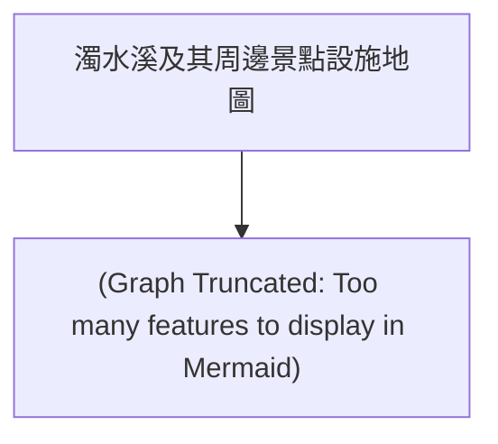

# 濁水溪及其周邊景點設施地圖

## 簡介 (Introduction)
彙整濁水溪流域之交通、水利、人文與自然景點。本資料集包含水利、交通、人文、自然等多面向的景點。

## 實際探索

- [2026台灣河流探索 - 濁水溪流域深度之旅](https://wuulong.github.io/wuulong-notes-blog/series/2026%E5%8F%B0%E7%81%A3%E6%B2%B3%E6%B5%81%E6%8E%A2%E7%B4%A2-%E6%BF%81%E6%B0%B4%E6%BA%AA/)

## 地圖結構 (Topology)

```mermaid
graph TD
    Map["濁水溪及其周邊景點設施地圖"]

    Note["(Graph Truncated: Too many features to display in Mermaid)"]
    Map --> Note
```

## 🗺️ AI 深度探索 (Deep Research)
(由於景點眾多，建議針對特定分類進行搜尋)

## 下載與資源 (Resources)
- **[KML 地圖檔下載](./20260111_zhuoshui_facilities.kml)**

## 景點列表 (Features)
- [二水車站](?map=20260202_shanhaijun&feature=20260111_zhuoshui_facilities_000_%E4%BA%8C%E6%B0%B4%E8%BB%8A%E7%AB%99)
- [源泉車站](?map=20260202_shanhaijun&feature=20260111_zhuoshui_facilities_001_%E6%BA%90%E6%B3%89%E8%BB%8A%E7%AB%99)
- [二水自行車道](?map=20260202_shanhaijun&feature=20260111_zhuoshui_facilities_002_%E4%BA%8C%E6%B0%B4%E8%87%AA%E8%A1%8C%E8%BB%8A%E9%81%93)
- [二水登廟步道](?map=20260202_shanhaijun&feature=20260111_zhuoshui_facilities_003_%E4%BA%8C%E6%B0%B4%E7%99%BB%E5%BB%9F%E6%AD%A5%E9%81%93)
- [豐柏廣場](?map=20260202_shanhaijun&feature=20260111_zhuoshui_facilities_004_%E8%B1%90%E6%9F%8F%E5%BB%A3%E5%A0%B4)
- [龍仔頭山](?map=20260202_shanhaijun&feature=20260111_zhuoshui_facilities_005_%E9%BE%8D%E4%BB%94%E9%A0%AD%E5%B1%B1)
- [二水台灣獼猴保護區](?map=20260202_shanhaijun&feature=20260111_zhuoshui_facilities_006_%E4%BA%8C%E6%B0%B4%E5%8F%B0%E7%81%A3%E7%8D%BC%E7%8C%B4%E4%BF%9D%E8%AD%B7%E5%8D%80)
- [林先生廟](?map=20260202_shanhaijun&feature=20260111_zhuoshui_facilities_007_%E6%9E%97%E5%85%88%E7%94%9F%E5%BB%9F)
- [大丘園休閒農場](?map=20260202_shanhaijun&feature=20260111_zhuoshui_facilities_008_%E5%A4%A7%E4%B8%98%E5%9C%92%E4%BC%91%E9%96%92%E8%BE%B2%E5%A0%B4)
- [二八彎農園](?map=20260202_shanhaijun&feature=20260111_zhuoshui_facilities_009_%E4%BA%8C%E5%85%AB%E5%BD%8E%E8%BE%B2%E5%9C%92)
- [水車農園](?map=20260202_shanhaijun&feature=20260111_zhuoshui_facilities_010_%E6%B0%B4%E8%BB%8A%E8%BE%B2%E5%9C%92)
- [鼻子頭休閒農園](?map=20260202_shanhaijun&feature=20260111_zhuoshui_facilities_011_%E9%BC%BB%E5%AD%90%E9%A0%AD%E4%BC%91%E9%96%92%E8%BE%B2%E5%9C%92)
- [蓮荷果休閒農園](?map=20260202_shanhaijun&feature=20260111_zhuoshui_facilities_012_%E8%93%AE%E8%8D%B7%E6%9E%9C%E4%BC%91%E9%96%92%E8%BE%B2%E5%9C%92)
- [螺溪石藝館](?map=20260202_shanhaijun&feature=20260111_zhuoshui_facilities_013_%E8%9E%BA%E6%BA%AA%E7%9F%B3%E8%97%9D%E9%A4%A8)
- [大義崙天后宮](?map=20260202_shanhaijun&feature=20260111_zhuoshui_facilities_014_%E5%A4%A7%E7%BE%A9%E5%B4%99%E5%A4%A9%E5%90%8E%E5%AE%AE)
- [張廖宗祠崇遠堂](?map=20260202_shanhaijun&feature=20260111_zhuoshui_facilities_015_%E5%BC%B5%E5%BB%96%E5%AE%97%E7%A5%A0%E5%B4%87%E9%81%A0%E5%A0%82)
- [國興宮](?map=20260202_shanhaijun&feature=20260111_zhuoshui_facilities_016_%E5%9C%8B%E8%88%88%E5%AE%AE)
- [定安宮](?map=20260202_shanhaijun&feature=20260111_zhuoshui_facilities_017_%E5%AE%9A%E5%AE%89%E5%AE%AE)
- [彌陀精舍](?map=20260202_shanhaijun&feature=20260111_zhuoshui_facilities_018_%E5%BD%8C%E9%99%80%E7%B2%BE%E8%88%8D)
- [二崙自然步道](?map=20260202_shanhaijun&feature=20260111_zhuoshui_facilities_019_%E4%BA%8C%E5%B4%99%E8%87%AA%E7%84%B6%E6%AD%A5%E9%81%93)
- [二崙故事屋](?map=20260202_shanhaijun&feature=20260111_zhuoshui_facilities_020_%E4%BA%8C%E5%B4%99%E6%95%85%E4%BA%8B%E5%B1%8B)
- [興山公園](?map=20260202_shanhaijun&feature=20260111_zhuoshui_facilities_021_%E8%88%88%E5%B1%B1%E5%85%AC%E5%9C%92)
- [鷺鷥生態景觀公園](?map=20260202_shanhaijun&feature=20260111_zhuoshui_facilities_022_%E9%B7%BA%E9%B7%A5%E7%94%9F%E6%85%8B%E6%99%AF%E8%A7%80%E5%85%AC%E5%9C%92)
- [龍鳳瀑布](?map=20260202_shanhaijun&feature=20260111_zhuoshui_facilities_023_%E9%BE%8D%E9%B3%B3%E7%80%91%E5%B8%83)
- [仙峰日月洞](?map=20260202_shanhaijun&feature=20260111_zhuoshui_facilities_024_%E4%BB%99%E5%B3%B0%E6%97%A5%E6%9C%88%E6%B4%9E)
- [仙洞坪棋盤石](?map=20260202_shanhaijun&feature=20260111_zhuoshui_facilities_025_%E4%BB%99%E6%B4%9E%E5%9D%AA%E6%A3%8B%E7%9B%A4%E7%9F%B3)
- [粗坑大峭壁](?map=20260202_shanhaijun&feature=20260111_zhuoshui_facilities_026_%E7%B2%97%E5%9D%91%E5%A4%A7%E5%B3%AD%E5%A3%81)
- [石龍宮](?map=20260202_shanhaijun&feature=20260111_zhuoshui_facilities_027_%E7%9F%B3%E9%BE%8D%E5%AE%AE)
- [金龍山法華寺](?map=20260202_shanhaijun&feature=20260111_zhuoshui_facilities_028_%E9%87%91%E9%BE%8D%E5%B1%B1%E6%B3%95%E8%8F%AF%E5%AF%BA)
- [白鶴嶺天恩宮](?map=20260202_shanhaijun&feature=20260111_zhuoshui_facilities_029_%E7%99%BD%E9%B6%B4%E5%B6%BA%E5%A4%A9%E6%81%A9%E5%AE%AE)
- [太魯閣國家公園](?map=20260202_shanhaijun&feature=20260111_zhuoshui_facilities_030_%E5%A4%AA%E9%AD%AF%E9%96%A3%E5%9C%8B%E5%AE%B6%E5%85%AC%E5%9C%92)
- [合歡山國家森林遊樂區](?map=20260202_shanhaijun&feature=20260111_zhuoshui_facilities_031_%E5%90%88%E6%AD%A1%E5%B1%B1%E5%9C%8B%E5%AE%B6%E6%A3%AE%E6%9E%97%E9%81%8A%E6%A8%82%E5%8D%80)
- [奧萬大國家森林遊樂區](?map=20260202_shanhaijun&feature=20260111_zhuoshui_facilities_032_%E5%A5%A7%E8%90%AC%E5%A4%A7%E5%9C%8B%E5%AE%B6%E6%A3%AE%E6%9E%97%E9%81%8A%E6%A8%82%E5%8D%80)
- [翠峰風景特定區](?map=20260202_shanhaijun&feature=20260111_zhuoshui_facilities_033_%E7%BF%A0%E5%B3%B0%E9%A2%A8%E6%99%AF%E7%89%B9%E5%AE%9A%E5%8D%80)
- [鳶峰觀景台](?map=20260202_shanhaijun&feature=20260111_zhuoshui_facilities_034_%E9%B3%B6%E5%B3%B0%E8%A7%80%E6%99%AF%E5%8F%B0)
- [霧社水庫](?map=20260202_shanhaijun&feature=20260111_zhuoshui_facilities_035_%E9%9C%A7%E7%A4%BE%E6%B0%B4%E5%BA%AB)
- [廬山溫泉](?map=20260202_shanhaijun&feature=20260111_zhuoshui_facilities_036_%E5%BB%AC%E5%B1%B1%E6%BA%AB%E6%B3%89)
- [清境農場](?map=20260202_shanhaijun&feature=20260111_zhuoshui_facilities_037_%E6%B8%85%E5%A2%83%E8%BE%B2%E5%A0%B4)
- [台大梅峰農場](?map=20260202_shanhaijun&feature=20260111_zhuoshui_facilities_038_%E5%8F%B0%E5%A4%A7%E6%A2%85%E5%B3%B0%E8%BE%B2%E5%A0%B4)
- [興大惠蓀林場](?map=20260202_shanhaijun&feature=20260111_zhuoshui_facilities_039_%E8%88%88%E5%A4%A7%E6%83%A0%E8%93%80%E6%9E%97%E5%A0%B4)
- [泰雅渡假村](?map=20260202_shanhaijun&feature=20260111_zhuoshui_facilities_040_%E6%B3%B0%E9%9B%85%E6%B8%A1%E5%81%87%E6%9D%91)
- [南投縣自然史教育館](?map=20260202_shanhaijun&feature=20260111_zhuoshui_facilities_041_%E5%8D%97%E6%8A%95%E7%B8%A3%E8%87%AA%E7%84%B6%E5%8F%B2%E6%95%99%E8%82%B2%E9%A4%A8)
- [霧社事件紀念公園](?map=20260202_shanhaijun&feature=20260111_zhuoshui_facilities_042_%E9%9C%A7%E7%A4%BE%E4%BA%8B%E4%BB%B6%E7%B4%80%E5%BF%B5%E5%85%AC%E5%9C%92)
- [撩溪](?map=20260202_shanhaijun&feature=20260111_zhuoshui_facilities_043_%E6%92%A9%E6%BA%AA)
- [二水跑水節](?map=20260202_shanhaijun&feature=20260111_zhuoshui_facilities_044_%E4%BA%8C%E6%B0%B4%E8%B7%91%E6%B0%B4%E7%AF%80)
- [溪州黑泥季](?map=20260202_shanhaijun&feature=20260111_zhuoshui_facilities_045_%E6%BA%AA%E5%B7%9E%E9%BB%91%E6%B3%A5%E5%AD%A3)
- [濁溪搶水文化節](?map=20260202_shanhaijun&feature=20260111_zhuoshui_facilities_046_%E6%BF%81%E6%BA%AA%E6%90%B6%E6%B0%B4%E6%96%87%E5%8C%96%E7%AF%80)
- [明潭水庫](?map=20260202_shanhaijun&feature=20260111_zhuoshui_facilities_047_%E6%98%8E%E6%BD%AD%E6%B0%B4%E5%BA%AB)
- [寧靜谷](?map=20260202_shanhaijun&feature=20260111_zhuoshui_facilities_048_%E5%AF%A7%E9%9D%9C%E8%B0%B7)
- [仙鄉瀑布](?map=20260202_shanhaijun&feature=20260111_zhuoshui_facilities_049_%E4%BB%99%E9%84%89%E7%80%91%E5%B8%83)
- [石觀音](?map=20260202_shanhaijun&feature=20260111_zhuoshui_facilities_050_%E7%9F%B3%E8%A7%80%E9%9F%B3)
- [水里蛇窯](?map=20260202_shanhaijun&feature=20260111_zhuoshui_facilities_051_%E6%B0%B4%E9%87%8C%E8%9B%87%E7%AA%AF)
- [車埕雙土地公廟](?map=20260202_shanhaijun&feature=20260111_zhuoshui_facilities_052_%E8%BB%8A%E5%9F%95%E9%9B%99%E5%9C%9F%E5%9C%B0%E5%85%AC%E5%BB%9F)
- [車埕休閒園區](?map=20260202_shanhaijun&feature=20260111_zhuoshui_facilities_053_%E8%BB%8A%E5%9F%95%E4%BC%91%E9%96%92%E5%9C%92%E5%8D%80)
- [水里溪親水區及自行車道](?map=20260202_shanhaijun&feature=20260111_zhuoshui_facilities_054_%E6%B0%B4%E9%87%8C%E6%BA%AA%E8%A6%AA%E6%B0%B4%E5%8D%80%E5%8F%8A%E8%87%AA%E8%A1%8C%E8%BB%8A%E9%81%93)
- [阿本農場櫻花祕境](?map=20260202_shanhaijun&feature=20260111_zhuoshui_facilities_055_%E9%98%BF%E6%9C%AC%E8%BE%B2%E5%A0%B4%E6%AB%BB%E8%8A%B1%E7%A5%95%E5%A2%83)
- [雨社山聚落](?map=20260202_shanhaijun&feature=20260111_zhuoshui_facilities_056_%E9%9B%A8%E7%A4%BE%E5%B1%B1%E8%81%9A%E8%90%BD)
- [益則坑](?map=20260202_shanhaijun&feature=20260111_zhuoshui_facilities_057_%E7%9B%8A%E5%89%87%E5%9D%91)
- [建安堂](?map=20260202_shanhaijun&feature=20260111_zhuoshui_facilities_058_%E5%BB%BA%E5%AE%89%E5%A0%82)
- [水里虎爺廟](?map=20260202_shanhaijun&feature=20260111_zhuoshui_facilities_059_%E6%B0%B4%E9%87%8C%E8%99%8E%E7%88%BA%E5%BB%9F)
- [水里鵲橋](?map=20260202_shanhaijun&feature=20260111_zhuoshui_facilities_060_%E6%B0%B4%E9%87%8C%E9%B5%B2%E6%A9%8B)
- [登瀛書院](?map=20260202_shanhaijun&feature=20260111_zhuoshui_facilities_061_%E7%99%BB%E7%80%9B%E6%9B%B8%E9%99%A2)
- [明新書院](?map=20260202_shanhaijun&feature=20260111_zhuoshui_facilities_062_%E6%98%8E%E6%96%B0%E6%9B%B8%E9%99%A2)
- [林鳳池舉人墓](?map=20260202_shanhaijun&feature=20260111_zhuoshui_facilities_063_%E6%9E%97%E9%B3%B3%E6%B1%A0%E8%88%89%E4%BA%BA%E5%A2%93)
- [八通關古道](?map=20260202_shanhaijun&feature=20260111_zhuoshui_facilities_064_%E5%85%AB%E9%80%9A%E9%97%9C%E5%8F%A4%E9%81%93)
- [楠仔腳蔓社學堂遺蹟](?map=20260202_shanhaijun&feature=20260111_zhuoshui_facilities_065_%E6%A5%A0%E4%BB%94%E8%85%B3%E8%94%93%E7%A4%BE%E5%AD%B8%E5%A0%82%E9%81%BA%E8%B9%9F)
- [草屯燉倫堂](?map=20260202_shanhaijun&feature=20260111_zhuoshui_facilities_066_%E8%8D%89%E5%B1%AF%E7%87%89%E5%80%AB%E5%A0%82)
- [國姓鄉北港溪石橋](?map=20260202_shanhaijun&feature=20260111_zhuoshui_facilities_067_%E5%9C%8B%E5%A7%93%E9%84%89%E5%8C%97%E6%B8%AF%E6%BA%AA%E7%9F%B3%E6%A9%8B)
- [祭祀公業張琯溪公宗祠](?map=20260202_shanhaijun&feature=20260111_zhuoshui_facilities_068_%E7%A5%AD%E7%A5%80%E5%85%AC%E6%A5%AD%E5%BC%B5%E7%90%AF%E6%BA%AA%E5%85%AC%E5%AE%97%E7%A5%A0)
- [旗杆厝](?map=20260202_shanhaijun&feature=20260111_zhuoshui_facilities_069_%E6%97%97%E6%9D%86%E5%8E%9D)
- [南投市農會](?map=20260202_shanhaijun&feature=20260111_zhuoshui_facilities_070_%E5%8D%97%E6%8A%95%E5%B8%82%E8%BE%B2%E6%9C%83)
- [武德殿及其附屬建築群](?map=20260202_shanhaijun&feature=20260111_zhuoshui_facilities_071_%E6%AD%A6%E5%BE%B7%E6%AE%BF%E5%8F%8A%E5%85%B6%E9%99%84%E5%B1%AC%E5%BB%BA%E7%AF%89%E7%BE%A4)
- [崇善堂](?map=20260202_shanhaijun&feature=20260111_zhuoshui_facilities_072_%E5%B4%87%E5%96%84%E5%A0%82)
- [敷榮堂](?map=20260202_shanhaijun&feature=20260111_zhuoshui_facilities_073_%E6%95%B7%E6%A6%AE%E5%A0%82)
- [南投縣陳姓宗親會西水祠](?map=20260202_shanhaijun&feature=20260111_zhuoshui_facilities_074_%E5%8D%97%E6%8A%95%E7%B8%A3%E9%99%B3%E5%A7%93%E5%AE%97%E8%A6%AA%E6%9C%83%E8%A5%BF%E6%B0%B4%E7%A5%A0)
- [賴家古厝](?map=20260202_shanhaijun&feature=20260111_zhuoshui_facilities_075_%E8%B3%B4%E5%AE%B6%E5%8F%A4%E5%8E%9D)
- [陳家古厝](?map=20260202_shanhaijun&feature=20260111_zhuoshui_facilities_076_%E9%99%B3%E5%AE%B6%E5%8F%A4%E5%8E%9D)
- [草屯國民小學禮堂](?map=20260202_shanhaijun&feature=20260111_zhuoshui_facilities_077_%E8%8D%89%E5%B1%AF%E5%9C%8B%E6%B0%91%E5%B0%8F%E5%AD%B8%E7%A6%AE%E5%A0%82)
- [碧峰國民小學禮堂](?map=20260202_shanhaijun&feature=20260111_zhuoshui_facilities_078_%E7%A2%A7%E5%B3%B0%E5%9C%8B%E6%B0%91%E5%B0%8F%E5%AD%B8%E7%A6%AE%E5%A0%82)
- [埔里黃宅](?map=20260202_shanhaijun&feature=20260111_zhuoshui_facilities_079_%E5%9F%94%E9%87%8C%E9%BB%83%E5%AE%85)
- [水蛙窟考古遺址](?map=20260202_shanhaijun&feature=20260111_zhuoshui_facilities_080_%E6%B0%B4%E8%9B%99%E7%AA%9F%E8%80%83%E5%8F%A4%E9%81%BA%E5%9D%80)
- [南投市中山公園「聚芳館」](?map=20260202_shanhaijun&feature=20260111_zhuoshui_facilities_081_%E5%8D%97%E6%8A%95%E5%B8%82%E4%B8%AD%E5%B1%B1%E5%85%AC%E5%9C%92%E3%80%8C%E8%81%9A%E8%8A%B3%E9%A4%A8%E3%80%8D)
- [新庄國小禮堂](?map=20260202_shanhaijun&feature=20260111_zhuoshui_facilities_082_%E6%96%B0%E5%BA%84%E5%9C%8B%E5%B0%8F%E7%A6%AE%E5%A0%82)
- [集集火車站](?map=20260202_shanhaijun&feature=20260111_zhuoshui_facilities_083_%E9%9B%86%E9%9B%86%E7%81%AB%E8%BB%8A%E7%AB%99)
- [集集林尾陳宅永福堂](?map=20260202_shanhaijun&feature=20260111_zhuoshui_facilities_084_%E9%9B%86%E9%9B%86%E6%9E%97%E5%B0%BE%E9%99%B3%E5%AE%85%E6%B0%B8%E7%A6%8F%E5%A0%82)
- [振昌興業股份有限公司建築群](?map=20260202_shanhaijun&feature=20260111_zhuoshui_facilities_085_%E6%8C%AF%E6%98%8C%E8%88%88%E6%A5%AD%E8%82%A1%E4%BB%BD%E6%9C%89%E9%99%90%E5%85%AC%E5%8F%B8%E5%BB%BA%E7%AF%89%E7%BE%A4)
- [甘泉井及石頭公](?map=20260202_shanhaijun&feature=20260111_zhuoshui_facilities_086_%E7%94%98%E6%B3%89%E4%BA%95%E5%8F%8A%E7%9F%B3%E9%A0%AD%E5%85%AC)
- [竹山隆恩圳隧渠](?map=20260202_shanhaijun&feature=20260111_zhuoshui_facilities_087_%E7%AB%B9%E5%B1%B1%E9%9A%86%E6%81%A9%E5%9C%B3%E9%9A%A7%E6%B8%A0)
- [鹿谷聖蹟亭](?map=20260202_shanhaijun&feature=20260111_zhuoshui_facilities_088_%E9%B9%BF%E8%B0%B7%E8%81%96%E8%B9%9F%E4%BA%AD)
- [新庄國小日治宿舍](?map=20260202_shanhaijun&feature=20260111_zhuoshui_facilities_089_%E6%96%B0%E5%BA%84%E5%9C%8B%E5%B0%8F%E6%97%A5%E6%B2%BB%E5%AE%BF%E8%88%8D)
- [國姓鄉南港村–林屋伙房](?map=20260202_shanhaijun&feature=20260111_zhuoshui_facilities_090_%E5%9C%8B%E5%A7%93%E9%84%89%E5%8D%97%E6%B8%AF%E6%9D%91%E2%80%93%E6%9E%97%E5%B1%8B%E4%BC%99%E6%88%BF)
- [添興窯及其附屬設施](?map=20260202_shanhaijun&feature=20260111_zhuoshui_facilities_091_%E6%B7%BB%E8%88%88%E7%AA%AF%E5%8F%8A%E5%85%B6%E9%99%84%E5%B1%AC%E8%A8%AD%E6%96%BD)
- [大馬璘考古遺址](?map=20260202_shanhaijun&feature=20260111_zhuoshui_facilities_092_%E5%A4%A7%E9%A6%AC%E7%92%98%E8%80%83%E5%8F%A4%E9%81%BA%E5%9D%80)
- [中興新村文化景觀](?map=20260202_shanhaijun&feature=20260111_zhuoshui_facilities_093_%E4%B8%AD%E8%88%88%E6%96%B0%E6%9D%91%E6%96%87%E5%8C%96%E6%99%AF%E8%A7%80)
- [行政院農業委員會農糧署](?map=20260202_shanhaijun&feature=20260111_zhuoshui_facilities_094_%E8%A1%8C%E6%94%BF%E9%99%A2%E8%BE%B2%E6%A5%AD%E5%A7%94%E5%93%A1%E6%9C%83%E8%BE%B2%E7%B3%A7%E7%BD%B2)
- [經濟部中部辦公室](?map=20260202_shanhaijun&feature=20260111_zhuoshui_facilities_095_%E7%B6%93%E6%BF%9F%E9%83%A8%E4%B8%AD%E9%83%A8%E8%BE%A6%E5%85%AC%E5%AE%A4)
- [臺灣銀行中興新村分行](?map=20260202_shanhaijun&feature=20260111_zhuoshui_facilities_096_%E8%87%BA%E7%81%A3%E9%8A%80%E8%A1%8C%E4%B8%AD%E8%88%88%E6%96%B0%E6%9D%91%E5%88%86%E8%A1%8C)
- [行政院農業委員會水土保持局](?map=20260202_shanhaijun&feature=20260111_zhuoshui_facilities_097_%E8%A1%8C%E6%94%BF%E9%99%A2%E8%BE%B2%E6%A5%AD%E5%A7%94%E5%93%A1%E6%9C%83%E6%B0%B4%E5%9C%9F%E4%BF%9D%E6%8C%81%E5%B1%80)
- [中興會堂](?map=20260202_shanhaijun&feature=20260111_zhuoshui_facilities_098_%E4%B8%AD%E8%88%88%E6%9C%83%E5%A0%82)
- [臺灣新生報中興新村辦事處](?map=20260202_shanhaijun&feature=20260111_zhuoshui_facilities_099_%E8%87%BA%E7%81%A3%E6%96%B0%E7%94%9F%E5%A0%B1%E4%B8%AD%E8%88%88%E6%96%B0%E6%9D%91%E8%BE%A6%E4%BA%8B%E8%99%95)
- [臺灣省政資料館](?map=20260202_shanhaijun&feature=20260111_zhuoshui_facilities_100_%E8%87%BA%E7%81%A3%E7%9C%81%E6%94%BF%E8%B3%87%E6%96%99%E9%A4%A8)
- [中華電信中興服務中心](?map=20260202_shanhaijun&feature=20260111_zhuoshui_facilities_101_%E4%B8%AD%E8%8F%AF%E9%9B%BB%E4%BF%A1%E4%B8%AD%E8%88%88%E6%9C%8D%E5%8B%99%E4%B8%AD%E5%BF%83)
- [國家文官學院中區培訓中心中正堂](?map=20260202_shanhaijun&feature=20260111_zhuoshui_facilities_102_%E5%9C%8B%E5%AE%B6%E6%96%87%E5%AE%98%E5%AD%B8%E9%99%A2%E4%B8%AD%E5%8D%80%E5%9F%B9%E8%A8%93%E4%B8%AD%E5%BF%83%E4%B8%AD%E6%AD%A3%E5%A0%82)
- [行政院人事行政局地方人事行政處](?map=20260202_shanhaijun&feature=20260111_zhuoshui_facilities_103_%E8%A1%8C%E6%94%BF%E9%99%A2%E4%BA%BA%E4%BA%8B%E8%A1%8C%E6%94%BF%E5%B1%80%E5%9C%B0%E6%96%B9%E4%BA%BA%E4%BA%8B%E8%A1%8C%E6%94%BF%E8%99%95)
- [國立中興大學實驗林管理處埔里連絡站](?map=20260202_shanhaijun&feature=20260111_zhuoshui_facilities_104_%E5%9C%8B%E7%AB%8B%E4%B8%AD%E8%88%88%E5%A4%A7%E5%AD%B8%E5%AF%A6%E9%A9%97%E6%9E%97%E7%AE%A1%E7%90%86%E8%99%95%E5%9F%94%E9%87%8C%E9%80%A3%E7%B5%A1%E7%AB%99)
- [行政院農業委員會茶業改良場魚池分場](?map=20260202_shanhaijun&feature=20260111_zhuoshui_facilities_105_%E8%A1%8C%E6%94%BF%E9%99%A2%E8%BE%B2%E6%A5%AD%E5%A7%94%E5%93%A1%E6%9C%83%E8%8C%B6%E6%A5%AD%E6%94%B9%E8%89%AF%E5%A0%B4%E9%AD%9A%E6%B1%A0%E5%88%86%E5%A0%B4)
- [社寮穀倉](?map=20260202_shanhaijun&feature=20260111_zhuoshui_facilities_106_%E7%A4%BE%E5%AF%AE%E7%A9%80%E5%80%89)
- [臺灣省政府](?map=20260202_shanhaijun&feature=20260111_zhuoshui_facilities_107_%E8%87%BA%E7%81%A3%E7%9C%81%E6%94%BF%E5%BA%9C)
- [林圮公墓](?map=20260202_shanhaijun&feature=20260111_zhuoshui_facilities_108_%E6%9E%97%E5%9C%AE%E5%85%AC%E5%A2%93)
- [集集館](?map=20260202_shanhaijun&feature=20260111_zhuoshui_facilities_109_%E9%9B%86%E9%9B%86%E9%A4%A8)
- [林淵石頭厝](?map=20260202_shanhaijun&feature=20260111_zhuoshui_facilities_110_%E6%9E%97%E6%B7%B5%E7%9F%B3%E9%A0%AD%E5%8E%9D)
- [縣定古蹟永濟義渡碑(名間鄉)](../features/20260111_zhuoshui_facilities_111_縣定古蹟永濟義渡碑(名間鄉).md)
- [集集樟腦出張所建築群](?map=20260202_shanhaijun&feature=20260111_zhuoshui_facilities_112_%E9%9B%86%E9%9B%86%E6%A8%9F%E8%85%A6%E5%87%BA%E5%BC%B5%E6%89%80%E5%BB%BA%E7%AF%89%E7%BE%A4)
- [縣定古蹟永濟義渡碑(竹山鎮)](../features/20260111_zhuoshui_facilities_113_縣定古蹟永濟義渡碑(竹山鎮).md)
- [竹山郡役所作戰指揮所(防空壕)](../features/20260111_zhuoshui_facilities_114_竹山郡役所作戰指揮所(防空壕).md)
- [竹山社寮敬聖亭](?map=20260202_shanhaijun&feature=20260111_zhuoshui_facilities_115_%E7%AB%B9%E5%B1%B1%E7%A4%BE%E5%AF%AE%E6%95%AC%E8%81%96%E4%BA%AD)
- [竹山連興宮](?map=20260202_shanhaijun&feature=20260111_zhuoshui_facilities_116_%E7%AB%B9%E5%B1%B1%E9%80%A3%E8%88%88%E5%AE%AE)
- [月眉厝龍德廟](?map=20260202_shanhaijun&feature=20260111_zhuoshui_facilities_117_%E6%9C%88%E7%9C%89%E5%8E%9D%E9%BE%8D%E5%BE%B7%E5%BB%9F)
- [藍田書院
「奏凱崇文」匾](?map=20260202_shanhaijun&feature=20260111_zhuoshui_facilities_118_%E8%97%8D%E7%94%B0%E6%9B%B8%E9%99%A2%0A%E3%80%8C%E5%A5%8F%E5%87%B1%E5%B4%87%E6%96%87%E3%80%8D%E5%8C%BE)
- [竹山神社鳥居及竹山神社附屬設施](?map=20260202_shanhaijun&feature=20260111_zhuoshui_facilities_119_%E7%AB%B9%E5%B1%B1%E7%A5%9E%E7%A4%BE%E9%B3%A5%E5%B1%85%E5%8F%8A%E7%AB%B9%E5%B1%B1%E7%A5%9E%E7%A4%BE%E9%99%84%E5%B1%AC%E8%A8%AD%E6%96%BD)
- [台中菸葉場竹山輔導站](?map=20260202_shanhaijun&feature=20260111_zhuoshui_facilities_120_%E5%8F%B0%E4%B8%AD%E8%8F%B8%E8%91%89%E5%A0%B4%E7%AB%B9%E5%B1%B1%E8%BC%94%E5%B0%8E%E7%AB%99)
- [交通部交通事業管理小組](?map=20260202_shanhaijun&feature=20260111_zhuoshui_facilities_121_%E4%BA%A4%E9%80%9A%E9%83%A8%E4%BA%A4%E9%80%9A%E4%BA%8B%E6%A5%AD%E7%AE%A1%E7%90%86%E5%B0%8F%E7%B5%84)
- [南投稅務出張所](?map=20260202_shanhaijun&feature=20260111_zhuoshui_facilities_122_%E5%8D%97%E6%8A%95%E7%A8%85%E5%8B%99%E5%87%BA%E5%BC%B5%E6%89%80)
- [曲冰考古遺址](?map=20260202_shanhaijun&feature=20260111_zhuoshui_facilities_123_%E6%9B%B2%E5%86%B0%E8%80%83%E5%8F%A4%E9%81%BA%E5%9D%80)
- [霧社事件‧馬赫坡古戰場](?map=20260202_shanhaijun&feature=20260111_zhuoshui_facilities_124_%E9%9C%A7%E7%A4%BE%E4%BA%8B%E4%BB%B6%E2%80%A7%E9%A6%AC%E8%B5%AB%E5%9D%A1%E5%8F%A4%E6%88%B0%E5%A0%B4)
- [頭社古日潭浮田文化景觀](?map=20260202_shanhaijun&feature=20260111_zhuoshui_facilities_125_%E9%A0%AD%E7%A4%BE%E5%8F%A4%E6%97%A5%E6%BD%AD%E6%B5%AE%E7%94%B0%E6%96%87%E5%8C%96%E6%99%AF%E8%A7%80)
- [藍田雅舍](?map=20260202_shanhaijun&feature=20260111_zhuoshui_facilities_126_%E8%97%8D%E7%94%B0%E9%9B%85%E8%88%8D)
- [陳善述老宅](?map=20260202_shanhaijun&feature=20260111_zhuoshui_facilities_127_%E9%99%B3%E5%96%84%E8%BF%B0%E8%80%81%E5%AE%85)
- [埔里南村義民祠](?map=20260202_shanhaijun&feature=20260111_zhuoshui_facilities_128_%E5%9F%94%E9%87%8C%E5%8D%97%E6%9D%91%E7%BE%A9%E6%B0%91%E7%A5%A0)
- [草屯朝陽宮
朝陽宮虎爺石雕香爐](?map=20260202_shanhaijun&feature=20260111_zhuoshui_facilities_129_%E8%8D%89%E5%B1%AF%E6%9C%9D%E9%99%BD%E5%AE%AE%0A%E6%9C%9D%E9%99%BD%E5%AE%AE%E8%99%8E%E7%88%BA%E7%9F%B3%E9%9B%95%E9%A6%99%E7%88%90)
- [覆鼎金考古遺址](?map=20260202_shanhaijun&feature=20260111_zhuoshui_facilities_130_%E8%A6%86%E9%BC%8E%E9%87%91%E8%80%83%E5%8F%A4%E9%81%BA%E5%9D%80)
- [原手工業品陳列館](?map=20260202_shanhaijun&feature=20260111_zhuoshui_facilities_131_%E5%8E%9F%E6%89%8B%E5%B7%A5%E6%A5%AD%E5%93%81%E9%99%B3%E5%88%97%E9%A4%A8)
- [草鞋墩雅舍](?map=20260202_shanhaijun&feature=20260111_zhuoshui_facilities_132_%E8%8D%89%E9%9E%8B%E5%A2%A9%E9%9B%85%E8%88%8D)
- [嚴禁勒索竹排船伕碑](?map=20260202_shanhaijun&feature=20260111_zhuoshui_facilities_133_%E5%9A%B4%E7%A6%81%E5%8B%92%E7%B4%A2%E7%AB%B9%E6%8E%92%E8%88%B9%E4%BC%95%E7%A2%91)
- [配天宮正殿石獅](?map=20260202_shanhaijun&feature=20260111_zhuoshui_facilities_134_%E9%85%8D%E5%A4%A9%E5%AE%AE%E6%AD%A3%E6%AE%BF%E7%9F%B3%E7%8D%85)
- [慶安宮土地公石雕香爐](?map=20260202_shanhaijun&feature=20260111_zhuoshui_facilities_135_%E6%85%B6%E5%AE%89%E5%AE%AE%E5%9C%9F%E5%9C%B0%E5%85%AC%E7%9F%B3%E9%9B%95%E9%A6%99%E7%88%90)
- [近藤昌之碑](?map=20260202_shanhaijun&feature=20260111_zhuoshui_facilities_136_%E8%BF%91%E8%97%A4%E6%98%8C%E4%B9%8B%E7%A2%91)
- [清代埔眉社古文書三件一組
毛格后蚋潘永成潘有明同立開墾合約字
泰雅貝珠衣](?map=20260202_shanhaijun&feature=20260111_zhuoshui_facilities_137_%E6%B8%85%E4%BB%A3%E5%9F%94%E7%9C%89%E7%A4%BE%E5%8F%A4%E6%96%87%E6%9B%B8%E4%B8%89%E4%BB%B6%E4%B8%80%E7%B5%84%0A%E6%AF%9B%E6%A0%BC%E5%90%8E%E8%9A%8B%E6%BD%98%E6%B0%B8%E6%88%90%E6%BD%98%E6%9C%89%E6%98%8E%E5%90%8C%E7%AB%8B%E9%96%8B%E5%A2%BE%E5%90%88%E7%B4%84%E5%AD%97%0A%E6%B3%B0%E9%9B%85%E8%B2%9D%E7%8F%A0%E8%A1%A3)
- [「七將軍」匾](?map=20260202_shanhaijun&feature=20260111_zhuoshui_facilities_138_%E3%80%8C%E4%B8%83%E5%B0%87%E8%BB%8D%E3%80%8D%E5%8C%BE)
- [日治時期埔里地區神社手洗缽](?map=20260202_shanhaijun&feature=20260111_zhuoshui_facilities_139_%E6%97%A5%E6%B2%BB%E6%99%82%E6%9C%9F%E5%9F%94%E9%87%8C%E5%9C%B0%E5%8D%80%E7%A5%9E%E7%A4%BE%E6%89%8B%E6%B4%97%E7%BC%BD)
- [簡姓惠宗祠堂陶製香爐](?map=20260202_shanhaijun&feature=20260111_zhuoshui_facilities_140_%E7%B0%A1%E5%A7%93%E6%83%A0%E5%AE%97%E7%A5%A0%E5%A0%82%E9%99%B6%E8%A3%BD%E9%A6%99%E7%88%90)
- [喜捐祝生廟祀田碑](?map=20260202_shanhaijun&feature=20260111_zhuoshui_facilities_141_%E5%96%9C%E6%8D%90%E7%A5%9D%E7%94%9F%E5%BB%9F%E7%A5%80%E7%94%B0%E7%A2%91)
- [刑期無刑匾](?map=20260202_shanhaijun&feature=20260111_zhuoshui_facilities_142_%E5%88%91%E6%9C%9F%E7%84%A1%E5%88%91%E5%8C%BE)
- [昭險圳改修諸首事人氏名記念碑](?map=20260202_shanhaijun&feature=20260111_zhuoshui_facilities_143_%E6%98%AD%E9%9A%AA%E5%9C%B3%E6%94%B9%E4%BF%AE%E8%AB%B8%E9%A6%96%E4%BA%8B%E4%BA%BA%E6%B0%8F%E5%90%8D%E8%A8%98%E5%BF%B5%E7%A2%91)
- [萬丹山生命紀念園](?map=20260202_shanhaijun&feature=20260111_zhuoshui_facilities_144_%E8%90%AC%E4%B8%B9%E5%B1%B1%E7%94%9F%E5%91%BD%E7%B4%80%E5%BF%B5%E5%9C%92)
- [帝皇嶺紀念花園](?map=20260202_shanhaijun&feature=20260111_zhuoshui_facilities_145_%E5%B8%9D%E7%9A%87%E5%B6%BA%E7%B4%80%E5%BF%B5%E8%8A%B1%E5%9C%92)
- [皇穹陵紀念花園](?map=20260202_shanhaijun&feature=20260111_zhuoshui_facilities_146_%E7%9A%87%E7%A9%B9%E9%99%B5%E7%B4%80%E5%BF%B5%E8%8A%B1%E5%9C%92)
- [松柏嶺遊客中心](?map=20260202_shanhaijun&feature=20260111_zhuoshui_facilities_147_%E6%9D%BE%E6%9F%8F%E5%B6%BA%E9%81%8A%E5%AE%A2%E4%B8%AD%E5%BF%83)
- [七星陣地碉堡公園](?map=20260202_shanhaijun&feature=20260111_zhuoshui_facilities_148_%E4%B8%83%E6%98%9F%E9%99%A3%E5%9C%B0%E7%A2%89%E5%A0%A1%E5%85%AC%E5%9C%92)
- [京麟雕塑文化園區](?map=20260202_shanhaijun&feature=20260111_zhuoshui_facilities_149_%E4%BA%AC%E9%BA%9F%E9%9B%95%E5%A1%91%E6%96%87%E5%8C%96%E5%9C%92%E5%8D%80)
- [茶香步道](?map=20260202_shanhaijun&feature=20260111_zhuoshui_facilities_150_%E8%8C%B6%E9%A6%99%E6%AD%A5%E9%81%93)
- [南投縣松柏嶺高爾夫球場](?map=20260202_shanhaijun&feature=20260111_zhuoshui_facilities_151_%E5%8D%97%E6%8A%95%E7%B8%A3%E6%9D%BE%E6%9F%8F%E5%B6%BA%E9%AB%98%E7%88%BE%E5%A4%AB%E7%90%83%E5%A0%B4)
- [茶二指故事館](?map=20260202_shanhaijun&feature=20260111_zhuoshui_facilities_152_%E8%8C%B6%E4%BA%8C%E6%8C%87%E6%95%85%E4%BA%8B%E9%A4%A8)
- [桂花森林休閒農莊](?map=20260202_shanhaijun&feature=20260111_zhuoshui_facilities_153_%E6%A1%82%E8%8A%B1%E6%A3%AE%E6%9E%97%E4%BC%91%E9%96%92%E8%BE%B2%E8%8E%8A)
- [緣園有機農場](?map=20260202_shanhaijun&feature=20260111_zhuoshui_facilities_154_%E7%B7%A3%E5%9C%92%E6%9C%89%E6%A9%9F%E8%BE%B2%E5%A0%B4)
- [茶米香休閒農場](?map=20260202_shanhaijun&feature=20260111_zhuoshui_facilities_155_%E8%8C%B6%E7%B1%B3%E9%A6%99%E4%BC%91%E9%96%92%E8%BE%B2%E5%A0%B4)
- [森18休閒農場](?map=20260202_shanhaijun&feature=20260111_zhuoshui_facilities_156_%E6%A3%AE18%E4%BC%91%E9%96%92%E8%BE%B2%E5%A0%B4)
- [香茗園樹葡萄農場](?map=20260202_shanhaijun&feature=20260111_zhuoshui_facilities_157_%E9%A6%99%E8%8C%97%E5%9C%92%E6%A8%B9%E8%91%A1%E8%90%84%E8%BE%B2%E5%A0%B4)
- [南投肉品市場-豬樂園](?map=20260202_shanhaijun&feature=20260111_zhuoshui_facilities_158_%E5%8D%97%E6%8A%95%E8%82%89%E5%93%81%E5%B8%82%E5%A0%B4-%E8%B1%AC%E6%A8%82%E5%9C%92)
- [木協台灣檜木坊](?map=20260202_shanhaijun&feature=20260111_zhuoshui_facilities_159_%E6%9C%A8%E5%8D%94%E5%8F%B0%E7%81%A3%E6%AA%9C%E6%9C%A8%E5%9D%8A)
- [杉林溪森林遊樂區](?map=20260202_shanhaijun&feature=20260111_zhuoshui_facilities_160_%E6%9D%89%E6%9E%97%E6%BA%AA%E6%A3%AE%E6%9E%97%E9%81%8A%E6%A8%82%E5%8D%80)
- [下坪自然教育園區](?map=20260202_shanhaijun&feature=20260111_zhuoshui_facilities_161_%E4%B8%8B%E5%9D%AA%E8%87%AA%E7%84%B6%E6%95%99%E8%82%B2%E5%9C%92%E5%8D%80)
- [竹山文化園區](?map=20260202_shanhaijun&feature=20260111_zhuoshui_facilities_162_%E7%AB%B9%E5%B1%B1%E6%96%87%E5%8C%96%E5%9C%92%E5%8D%80)
- [沙東宮國家地震公園](?map=20260202_shanhaijun&feature=20260111_zhuoshui_facilities_163_%E6%B2%99%E6%9D%B1%E5%AE%AE%E5%9C%8B%E5%AE%B6%E5%9C%B0%E9%9C%87%E5%85%AC%E5%9C%92)
- [青竹竹藝文化園區](?map=20260202_shanhaijun&feature=20260111_zhuoshui_facilities_164_%E9%9D%92%E7%AB%B9%E7%AB%B9%E8%97%9D%E6%96%87%E5%8C%96%E5%9C%92%E5%8D%80)
- [八通關社寮古道](?map=20260202_shanhaijun&feature=20260111_zhuoshui_facilities_165_%E5%85%AB%E9%80%9A%E9%97%9C%E7%A4%BE%E5%AF%AE%E5%8F%A4%E9%81%93)
- [林圮墓](?map=20260202_shanhaijun&feature=20260111_zhuoshui_facilities_166_%E6%9E%97%E5%9C%AE%E5%A2%93)
- [聖義廟「紅旗公」](?map=20260202_shanhaijun&feature=20260111_zhuoshui_facilities_167_%E8%81%96%E7%BE%A9%E5%BB%9F%E3%80%8C%E7%B4%85%E6%97%97%E5%85%AC%E3%80%8D)
- [桶頭吊橋](?map=20260202_shanhaijun&feature=20260111_zhuoshui_facilities_168_%E6%A1%B6%E9%A0%AD%E5%90%8A%E6%A9%8B)
- [李勇廟](?map=20260202_shanhaijun&feature=20260111_zhuoshui_facilities_169_%E6%9D%8E%E5%8B%87%E5%BB%9F)
- [竹山連興宮](?map=20260202_shanhaijun&feature=20260111_zhuoshui_facilities_170_%E7%AB%B9%E5%B1%B1%E9%80%A3%E8%88%88%E5%AE%AE)
- [社寮紫南宮](?map=20260202_shanhaijun&feature=20260111_zhuoshui_facilities_171_%E7%A4%BE%E5%AF%AE%E7%B4%AB%E5%8D%97%E5%AE%AE)
- [大鞍竹海](?map=20260202_shanhaijun&feature=20260111_zhuoshui_facilities_172_%E5%A4%A7%E9%9E%8D%E7%AB%B9%E6%B5%B7)
- [軟鞍八卦茶園](?map=20260202_shanhaijun&feature=20260111_zhuoshui_facilities_173_%E8%BB%9F%E9%9E%8D%E5%85%AB%E5%8D%A6%E8%8C%B6%E5%9C%92)
- [太極峽谷](?map=20260202_shanhaijun&feature=20260111_zhuoshui_facilities_174_%E5%A4%AA%E6%A5%B5%E5%B3%BD%E8%B0%B7)
- [觀海坪](?map=20260202_shanhaijun&feature=20260111_zhuoshui_facilities_175_%E8%A7%80%E6%B5%B7%E5%9D%AA)
- [車籠埔斷層保存園區](?map=20260202_shanhaijun&feature=20260111_zhuoshui_facilities_176_%E8%BB%8A%E7%B1%A0%E5%9F%94%E6%96%B7%E5%B1%A4%E4%BF%9D%E5%AD%98%E5%9C%92%E5%8D%80)
- [竹山天梯](?map=20260202_shanhaijun&feature=20260111_zhuoshui_facilities_177_%E7%AB%B9%E5%B1%B1%E5%A4%A9%E6%A2%AF)
- [頂崙天倫宮](?map=20260202_shanhaijun&feature=20260111_zhuoshui_facilities_178_%E9%A0%82%E5%B4%99%E5%A4%A9%E5%80%AB%E5%AE%AE)
- [竹塘醒靈宮](?map=20260202_shanhaijun&feature=20260111_zhuoshui_facilities_179_%E7%AB%B9%E5%A1%98%E9%86%92%E9%9D%88%E5%AE%AE)
- [明航寺](?map=20260202_shanhaijun&feature=20260111_zhuoshui_facilities_180_%E6%98%8E%E8%88%AA%E5%AF%BA)
- [竹塘慈航宮](?map=20260202_shanhaijun&feature=20260111_zhuoshui_facilities_181_%E7%AB%B9%E5%A1%98%E6%85%88%E8%88%AA%E5%AE%AE)
- [九龍大榕公](?map=20260202_shanhaijun&feature=20260111_zhuoshui_facilities_182_%E4%B9%9D%E9%BE%8D%E5%A4%A7%E6%A6%95%E5%85%AC)
- [米香囍懷舊農村生活館](?map=20260202_shanhaijun&feature=20260111_zhuoshui_facilities_183_%E7%B1%B3%E9%A6%99%E5%9B%8D%E6%87%B7%E8%88%8A%E8%BE%B2%E6%9D%91%E7%94%9F%E6%B4%BB%E9%A4%A8)
- [鹿世界觀光牧場](?map=20260202_shanhaijun&feature=20260111_zhuoshui_facilities_184_%E9%B9%BF%E4%B8%96%E7%95%8C%E8%A7%80%E5%85%89%E7%89%A7%E5%A0%B4)
- [竹塘公園](?map=20260202_shanhaijun&feature=20260111_zhuoshui_facilities_185_%E7%AB%B9%E5%A1%98%E5%85%AC%E5%9C%92)
- [西螺大橋](?map=20260202_shanhaijun&feature=20260111_zhuoshui_facilities_186_%E8%A5%BF%E8%9E%BA%E5%A4%A7%E6%A9%8B)
- [延平老街](?map=20260202_shanhaijun&feature=20260111_zhuoshui_facilities_187_%E5%BB%B6%E5%B9%B3%E8%80%81%E8%A1%97)
- [西螺廣福宮](?map=20260202_shanhaijun&feature=20260111_zhuoshui_facilities_188_%E8%A5%BF%E8%9E%BA%E5%BB%A3%E7%A6%8F%E5%AE%AE)
- [西螺福興宮](?map=20260202_shanhaijun&feature=20260111_zhuoshui_facilities_189_%E8%A5%BF%E8%9E%BA%E7%A6%8F%E8%88%88%E5%AE%AE)
- [西螺福天宮](?map=20260202_shanhaijun&feature=20260111_zhuoshui_facilities_190_%E8%A5%BF%E8%9E%BA%E7%A6%8F%E5%A4%A9%E5%AE%AE)
- [西螺果菜市場](?map=20260202_shanhaijun&feature=20260111_zhuoshui_facilities_191_%E8%A5%BF%E8%9E%BA%E6%9E%9C%E8%8F%9C%E5%B8%82%E5%A0%B4)
- [西螺東市場](?map=20260202_shanhaijun&feature=20260111_zhuoshui_facilities_192_%E8%A5%BF%E8%9E%BA%E6%9D%B1%E5%B8%82%E5%A0%B4)
- [西螺泰山石敢當](?map=20260202_shanhaijun&feature=20260111_zhuoshui_facilities_193_%E8%A5%BF%E8%9E%BA%E6%B3%B0%E5%B1%B1%E7%9F%B3%E6%95%A2%E7%95%B6)
- [農田水利文物陳列館](?map=20260202_shanhaijun&feature=20260111_zhuoshui_facilities_194_%E8%BE%B2%E7%94%B0%E6%B0%B4%E5%88%A9%E6%96%87%E7%89%A9%E9%99%B3%E5%88%97%E9%A4%A8)
- [坪頂茶葉文化館](?map=20260202_shanhaijun&feature=20260111_zhuoshui_facilities_195_%E5%9D%AA%E9%A0%82%E8%8C%B6%E8%91%89%E6%96%87%E5%8C%96%E9%A4%A8)
- [玉山國家公園](?map=20260202_shanhaijun&feature=20260111_zhuoshui_facilities_196_%E7%8E%89%E5%B1%B1%E5%9C%8B%E5%AE%B6%E5%85%AC%E5%9C%92)
- [風櫃斗](?map=20260202_shanhaijun&feature=20260111_zhuoshui_facilities_197_%E9%A2%A8%E6%AB%83%E6%96%97)
- [東埔溫泉](?map=20260202_shanhaijun&feature=20260111_zhuoshui_facilities_198_%E6%9D%B1%E5%9F%94%E6%BA%AB%E6%B3%89)
- [坪瀨風景區](?map=20260202_shanhaijun&feature=20260111_zhuoshui_facilities_199_%E5%9D%AA%E7%80%A8%E9%A2%A8%E6%99%AF%E5%8D%80)
- [彩虹瀑布情人谷](?map=20260202_shanhaijun&feature=20260111_zhuoshui_facilities_200_%E5%BD%A9%E8%99%B9%E7%80%91%E5%B8%83%E6%83%85%E4%BA%BA%E8%B0%B7)
- [雲龍瀑布](?map=20260202_shanhaijun&feature=20260111_zhuoshui_facilities_201_%E9%9B%B2%E9%BE%8D%E7%80%91%E5%B8%83)
- [雙龍瀑布](?map=20260202_shanhaijun&feature=20260111_zhuoshui_facilities_202_%E9%9B%99%E9%BE%8D%E7%80%91%E5%B8%83)
- [父不知子斷崖](?map=20260202_shanhaijun&feature=20260111_zhuoshui_facilities_203_%E7%88%B6%E4%B8%8D%E7%9F%A5%E5%AD%90%E6%96%B7%E5%B4%96)
- [丹大林道](?map=20260202_shanhaijun&feature=20260111_zhuoshui_facilities_204_%E4%B8%B9%E5%A4%A7%E6%9E%97%E9%81%93)
- [七彩湖](?map=20260202_shanhaijun&feature=20260111_zhuoshui_facilities_205_%E4%B8%83%E5%BD%A9%E6%B9%96)
- [木瓜坑大瀑布](?map=20260202_shanhaijun&feature=20260111_zhuoshui_facilities_206_%E6%9C%A8%E7%93%9C%E5%9D%91%E5%A4%A7%E7%80%91%E5%B8%83)
- [宇宙萬聖宮](?map=20260202_shanhaijun&feature=20260111_zhuoshui_facilities_207_%E5%AE%87%E5%AE%99%E8%90%AC%E8%81%96%E5%AE%AE)
- [神木樟樹公](?map=20260202_shanhaijun&feature=20260111_zhuoshui_facilities_208_%E7%A5%9E%E6%9C%A8%E6%A8%9F%E6%A8%B9%E5%85%AC)
- [夫妻樹](?map=20260202_shanhaijun&feature=20260111_zhuoshui_facilities_209_%E5%A4%AB%E5%A6%BB%E6%A8%B9)
- [南投市樟樹園](?map=20260202_shanhaijun&feature=20260111_zhuoshui_facilities_210_%E5%8D%97%E6%8A%95%E5%B8%82%E6%A8%9F%E6%A8%B9%E5%9C%92)
- [中山公園](?map=20260202_shanhaijun&feature=20260111_zhuoshui_facilities_211_%E4%B8%AD%E5%B1%B1%E5%85%AC%E5%9C%92)
- [南投酒廠](?map=20260202_shanhaijun&feature=20260111_zhuoshui_facilities_212_%E5%8D%97%E6%8A%95%E9%85%92%E5%BB%A0)
- [南投縣文化園區](?map=20260202_shanhaijun&feature=20260111_zhuoshui_facilities_213_%E5%8D%97%E6%8A%95%E7%B8%A3%E6%96%87%E5%8C%96%E5%9C%92%E5%8D%80)
- [中興新村](?map=20260202_shanhaijun&feature=20260111_zhuoshui_facilities_214_%E4%B8%AD%E8%88%88%E6%96%B0%E6%9D%91)
- [猴探井遊憩區](?map=20260202_shanhaijun&feature=20260111_zhuoshui_facilities_215_%E7%8C%B4%E6%8E%A2%E4%BA%95%E9%81%8A%E6%86%A9%E5%8D%80)
- [南投荔枝王](?map=20260202_shanhaijun&feature=20260111_zhuoshui_facilities_216_%E5%8D%97%E6%8A%95%E8%8D%94%E6%9E%9D%E7%8E%8B)
- [天空之橋](?map=20260202_shanhaijun&feature=20260111_zhuoshui_facilities_217_%E5%A4%A9%E7%A9%BA%E4%B9%8B%E6%A9%8B)
- [橫山登山步道](?map=20260202_shanhaijun&feature=20260111_zhuoshui_facilities_218_%E6%A9%AB%E5%B1%B1%E7%99%BB%E5%B1%B1%E6%AD%A5%E9%81%93)
- [綠美橋](?map=20260202_shanhaijun&feature=20260111_zhuoshui_facilities_219_%E7%B6%A0%E7%BE%8E%E6%A9%8B)
- [八卦山青山茶園](?map=20260202_shanhaijun&feature=20260111_zhuoshui_facilities_220_%E5%85%AB%E5%8D%A6%E5%B1%B1%E9%9D%92%E5%B1%B1%E8%8C%B6%E5%9C%92)
- [虎山藝術館](?map=20260202_shanhaijun&feature=20260111_zhuoshui_facilities_221_%E8%99%8E%E5%B1%B1%E8%97%9D%E8%A1%93%E9%A4%A8)
- [藍田書院](?map=20260202_shanhaijun&feature=20260111_zhuoshui_facilities_222_%E8%97%8D%E7%94%B0%E6%9B%B8%E9%99%A2)
- [台灣麻糬主題館](?map=20260202_shanhaijun&feature=20260111_zhuoshui_facilities_223_%E5%8F%B0%E7%81%A3%E9%BA%BB%E7%B3%AC%E4%B8%BB%E9%A1%8C%E9%A4%A8)
- [埔里孔子廟](?map=20260202_shanhaijun&feature=20260111_zhuoshui_facilities_224_%E5%9F%94%E9%87%8C%E5%AD%94%E5%AD%90%E5%BB%9F)
- [臺灣地理中心碑](?map=20260202_shanhaijun&feature=20260111_zhuoshui_facilities_225_%E8%87%BA%E7%81%A3%E5%9C%B0%E7%90%86%E4%B8%AD%E5%BF%83%E7%A2%91)
- [埔里酒廠](?map=20260202_shanhaijun&feature=20260111_zhuoshui_facilities_226_%E5%9F%94%E9%87%8C%E9%85%92%E5%BB%A0)
- [廣興紙寮](?map=20260202_shanhaijun&feature=20260111_zhuoshui_facilities_227_%E5%BB%A3%E8%88%88%E7%B4%99%E5%AF%AE)
- [造紙龍手創館](?map=20260202_shanhaijun&feature=20260111_zhuoshui_facilities_228_%E9%80%A0%E7%B4%99%E9%BE%8D%E6%89%8B%E5%89%B5%E9%A4%A8)
- [龍南漆藝文物館](?map=20260202_shanhaijun&feature=20260111_zhuoshui_facilities_229_%E9%BE%8D%E5%8D%97%E6%BC%86%E8%97%9D%E6%96%87%E7%89%A9%E9%A4%A8)
- [木生昆蟲博物館](?map=20260202_shanhaijun&feature=20260111_zhuoshui_facilities_230_%E6%9C%A8%E7%94%9F%E6%98%86%E8%9F%B2%E5%8D%9A%E7%89%A9%E9%A4%A8)
- [錦吉昆蟲館](?map=20260202_shanhaijun&feature=20260111_zhuoshui_facilities_231_%E9%8C%A6%E5%90%89%E6%98%86%E8%9F%B2%E9%A4%A8)
- [中台世界博物館](?map=20260202_shanhaijun&feature=20260111_zhuoshui_facilities_232_%E4%B8%AD%E5%8F%B0%E4%B8%96%E7%95%8C%E5%8D%9A%E7%89%A9%E9%A4%A8)
- [敲敲木工房](?map=20260202_shanhaijun&feature=20260111_zhuoshui_facilities_233_%E6%95%B2%E6%95%B2%E6%9C%A8%E5%B7%A5%E6%88%BF)
- [桃米里](?map=20260202_shanhaijun&feature=20260111_zhuoshui_facilities_234_%E6%A1%83%E7%B1%B3%E9%87%8C)
- [新故鄉貝學園區](?map=20260202_shanhaijun&feature=20260111_zhuoshui_facilities_235_%E6%96%B0%E6%95%85%E9%84%89%E8%B2%9D%E5%AD%B8%E5%9C%92%E5%8D%80)
- [草湳溼地](?map=20260202_shanhaijun&feature=20260111_zhuoshui_facilities_236_%E8%8D%89%E6%B9%B3%E6%BA%BC%E5%9C%B0)
- [中路坑溼地](?map=20260202_shanhaijun&feature=20260111_zhuoshui_facilities_237_%E4%B8%AD%E8%B7%AF%E5%9D%91%E6%BA%BC%E5%9C%B0)
- [牛耳藝術渡假村](?map=20260202_shanhaijun&feature=20260111_zhuoshui_facilities_238_%E7%89%9B%E8%80%B3%E8%97%9D%E8%A1%93%E6%B8%A1%E5%81%87%E6%9D%91)
- [大黑松小倆口元首館](?map=20260202_shanhaijun&feature=20260111_zhuoshui_facilities_239_%E5%A4%A7%E9%BB%91%E6%9D%BE%E5%B0%8F%E5%80%86%E5%8F%A3%E5%85%83%E9%A6%96%E9%A4%A8)
- [暨大校園](?map=20260202_shanhaijun&feature=20260111_zhuoshui_facilities_240_%E6%9A%A8%E5%A4%A7%E6%A0%A1%E5%9C%92)
- [大馬璘遺址](?map=20260202_shanhaijun&feature=20260111_zhuoshui_facilities_241_%E5%A4%A7%E9%A6%AC%E7%92%98%E9%81%BA%E5%9D%80)
- [打鐵街](?map=20260202_shanhaijun&feature=20260111_zhuoshui_facilities_242_%E6%89%93%E9%90%B5%E8%A1%97)
- [手抄紙](?map=20260202_shanhaijun&feature=20260111_zhuoshui_facilities_243_%E6%89%8B%E6%8A%84%E7%B4%99)
- [埔里茄苳樹王公](?map=20260202_shanhaijun&feature=20260111_zhuoshui_facilities_244_%E5%9F%94%E9%87%8C%E8%8C%84%E8%8B%B3%E6%A8%B9%E7%8E%8B%E5%85%AC)
- [八幡崎古道](?map=20260202_shanhaijun&feature=20260111_zhuoshui_facilities_245_%E5%85%AB%E5%B9%A1%E5%B4%8E%E5%8F%A4%E9%81%93)
- [虎頭山](?map=20260202_shanhaijun&feature=20260111_zhuoshui_facilities_246_%E8%99%8E%E9%A0%AD%E5%B1%B1)
- [草湳濕地](?map=20260202_shanhaijun&feature=20260111_zhuoshui_facilities_247_%E8%8D%89%E6%B9%B3%E6%BF%95%E5%9C%B0)
- [鯉魚潭](?map=20260202_shanhaijun&feature=20260111_zhuoshui_facilities_248_%E9%AF%89%E9%AD%9A%E6%BD%AD)
- [觀音瀑布](?map=20260202_shanhaijun&feature=20260111_zhuoshui_facilities_249_%E8%A7%80%E9%9F%B3%E7%80%91%E5%B8%83)
- [北坑瀑布](?map=20260202_shanhaijun&feature=20260111_zhuoshui_facilities_250_%E5%8C%97%E5%9D%91%E7%80%91%E5%B8%83)
- [中坑瀑布](?map=20260202_shanhaijun&feature=20260111_zhuoshui_facilities_251_%E4%B8%AD%E5%9D%91%E7%80%91%E5%B8%83)
- [草鞋墩遺址](?map=20260202_shanhaijun&feature=20260111_zhuoshui_facilities_252_%E8%8D%89%E9%9E%8B%E5%A2%A9%E9%81%BA%E5%9D%80)
- [國立臺灣工藝研究發展中心](?map=20260202_shanhaijun&feature=20260111_zhuoshui_facilities_253_%E5%9C%8B%E7%AB%8B%E8%87%BA%E7%81%A3%E5%B7%A5%E8%97%9D%E7%A0%94%E7%A9%B6%E7%99%BC%E5%B1%95%E4%B8%AD%E5%BF%83)
- [雙十吊橋](?map=20260202_shanhaijun&feature=20260111_zhuoshui_facilities_254_%E9%9B%99%E5%8D%81%E5%90%8A%E6%A9%8B)
- [九九峰自然保留區](?map=20260202_shanhaijun&feature=20260111_zhuoshui_facilities_255_%E4%B9%9D%E4%B9%9D%E5%B3%B0%E8%87%AA%E7%84%B6%E4%BF%9D%E7%95%99%E5%8D%80)
- [坪頂七股神木](?map=20260202_shanhaijun&feature=20260111_zhuoshui_facilities_256_%E5%9D%AA%E9%A0%82%E4%B8%83%E8%82%A1%E7%A5%9E%E6%9C%A8)
- [靈蛟瀑布](?map=20260202_shanhaijun&feature=20260111_zhuoshui_facilities_257_%E9%9D%88%E8%9B%9F%E7%80%91%E5%B8%83)
- [欣隆休閒農場](?map=20260202_shanhaijun&feature=20260111_zhuoshui_facilities_258_%E6%AC%A3%E9%9A%86%E4%BC%91%E9%96%92%E8%BE%B2%E5%A0%B4)
- [大虎山](?map=20260202_shanhaijun&feature=20260111_zhuoshui_facilities_259_%E5%A4%A7%E8%99%8E%E5%B1%B1)
- [寶島時代村](?map=20260202_shanhaijun&feature=20260111_zhuoshui_facilities_260_%E5%AF%B6%E5%B3%B6%E6%99%82%E4%BB%A3%E6%9D%91)
- [草屯老街](?map=20260202_shanhaijun&feature=20260111_zhuoshui_facilities_261_%E8%8D%89%E5%B1%AF%E8%80%81%E8%A1%97)
- [上林里石榕公](?map=20260202_shanhaijun&feature=20260111_zhuoshui_facilities_262_%E4%B8%8A%E6%9E%97%E9%87%8C%E7%9F%B3%E6%A6%95%E5%85%AC)
- [毓繡美術館](?map=20260202_shanhaijun&feature=20260111_zhuoshui_facilities_263_%E6%AF%93%E7%B9%A1%E7%BE%8E%E8%A1%93%E9%A4%A8)
- [九九峰動物樂園](?map=20260202_shanhaijun&feature=20260111_zhuoshui_facilities_264_%E4%B9%9D%E4%B9%9D%E5%B3%B0%E5%8B%95%E7%89%A9%E6%A8%82%E5%9C%92)
- [芙蓉谷瀑布](?map=20260202_shanhaijun&feature=20260111_zhuoshui_facilities_265_%E8%8A%99%E8%93%89%E8%B0%B7%E7%80%91%E5%B8%83)
- [北圳水橋](?map=20260202_shanhaijun&feature=20260111_zhuoshui_facilities_266_%E5%8C%97%E5%9C%B3%E6%B0%B4%E6%A9%8B)
- [北圳步道](?map=20260202_shanhaijun&feature=20260111_zhuoshui_facilities_267_%E5%8C%97%E5%9C%B3%E6%AD%A5%E9%81%93)
- [北港溪橋](?map=20260202_shanhaijun&feature=20260111_zhuoshui_facilities_268_%E5%8C%97%E6%B8%AF%E6%BA%AA%E6%A9%8B)
- [李董果醋莊園](?map=20260202_shanhaijun&feature=20260111_zhuoshui_facilities_269_%E6%9D%8E%E8%91%A3%E6%9E%9C%E9%86%8B%E8%8E%8A%E5%9C%92)
- [勇春農家](?map=20260202_shanhaijun&feature=20260111_zhuoshui_facilities_270_%E5%8B%87%E6%98%A5%E8%BE%B2%E5%AE%B6)
- [阿坤香茅工坊](?map=20260202_shanhaijun&feature=20260111_zhuoshui_facilities_271_%E9%98%BF%E5%9D%A4%E9%A6%99%E8%8C%85%E5%B7%A5%E5%9D%8A)
- [新豐農場(冷泉米)](../features/20260111_zhuoshui_facilities_272_新豐農場(冷泉米).md)
- [九二咖啡故事館](?map=20260202_shanhaijun&feature=20260111_zhuoshui_facilities_273_%E4%B9%9D%E4%BA%8C%E5%92%96%E5%95%A1%E6%95%85%E4%BA%8B%E9%A4%A8)
- [綠野仙境農場](?map=20260202_shanhaijun&feature=20260111_zhuoshui_facilities_274_%E7%B6%A0%E9%87%8E%E4%BB%99%E5%A2%83%E8%BE%B2%E5%A0%B4)
- [綠恩有機棉花農場](?map=20260202_shanhaijun&feature=20260111_zhuoshui_facilities_275_%E7%B6%A0%E6%81%A9%E6%9C%89%E6%A9%9F%E6%A3%89%E8%8A%B1%E8%BE%B2%E5%A0%B4)
- [泰雅渡假村](?map=20260202_shanhaijun&feature=20260111_zhuoshui_facilities_276_%E6%B3%B0%E9%9B%85%E6%B8%A1%E5%81%87%E6%9D%91)
- [北港溪沙八度假村](?map=20260202_shanhaijun&feature=20260111_zhuoshui_facilities_277_%E5%8C%97%E6%B8%AF%E6%BA%AA%E6%B2%99%E5%85%AB%E5%BA%A6%E5%81%87%E6%9D%91)
- [神仙島遊覽谷](?map=20260202_shanhaijun&feature=20260111_zhuoshui_facilities_278_%E7%A5%9E%E4%BB%99%E5%B3%B6%E9%81%8A%E8%A6%BD%E8%B0%B7)
- [北山養鹿天地休閒園區](?map=20260202_shanhaijun&feature=20260111_zhuoshui_facilities_279_%E5%8C%97%E5%B1%B1%E9%A4%8A%E9%B9%BF%E5%A4%A9%E5%9C%B0%E4%BC%91%E9%96%92%E5%9C%92%E5%8D%80)
- [春水堂-秋山居(留香樓)](../features/20260111_zhuoshui_facilities_280_春水堂-秋山居(留香樓).md)
- [逸和園檸檬宿](?map=20260202_shanhaijun&feature=20260111_zhuoshui_facilities_281_%E9%80%B8%E5%92%8C%E5%9C%92%E6%AA%B8%E6%AA%AC%E5%AE%BF)
- [達雅奇跡星球(蘋果屋)](../features/20260111_zhuoshui_facilities_282_達雅奇跡星球(蘋果屋).md)
- [聚合居露營區](?map=20260202_shanhaijun&feature=20260111_zhuoshui_facilities_283_%E8%81%9A%E5%90%88%E5%B1%85%E9%9C%B2%E7%87%9F%E5%8D%80)
- [水長流露營區](?map=20260202_shanhaijun&feature=20260111_zhuoshui_facilities_284_%E6%B0%B4%E9%95%B7%E6%B5%81%E9%9C%B2%E7%87%9F%E5%8D%80)
- [山嵐謐靜](?map=20260202_shanhaijun&feature=20260111_zhuoshui_facilities_285_%E5%B1%B1%E5%B5%90%E8%AC%90%E9%9D%9C)
- [漾嵐山莊](?map=20260202_shanhaijun&feature=20260111_zhuoshui_facilities_286_%E6%BC%BE%E5%B5%90%E5%B1%B1%E8%8E%8A)
- [小胖露營區](?map=20260202_shanhaijun&feature=20260111_zhuoshui_facilities_287_%E5%B0%8F%E8%83%96%E9%9C%B2%E7%87%9F%E5%8D%80)
- [水秀農場](?map=20260202_shanhaijun&feature=20260111_zhuoshui_facilities_288_%E6%B0%B4%E7%A7%80%E8%BE%B2%E5%A0%B4)
- [逸和園檸檬宿](?map=20260202_shanhaijun&feature=20260111_zhuoshui_facilities_289_%E9%80%B8%E5%92%8C%E5%9C%92%E6%AA%B8%E6%AA%AC%E5%AE%BF)
- [崙前順天宮](?map=20260202_shanhaijun&feature=20260111_zhuoshui_facilities_290_%E5%B4%99%E5%89%8D%E9%A0%86%E5%A4%A9%E5%AE%AE)
- [崙背奉天宮](?map=20260202_shanhaijun&feature=20260111_zhuoshui_facilities_291_%E5%B4%99%E8%83%8C%E5%A5%89%E5%A4%A9%E5%AE%AE)
- [崙背天衡宮](?map=20260202_shanhaijun&feature=20260111_zhuoshui_facilities_292_%E5%B4%99%E8%83%8C%E5%A4%A9%E8%A1%A1%E5%AE%AE)
- [水汴頭崇賢寺](?map=20260202_shanhaijun&feature=20260111_zhuoshui_facilities_293_%E6%B0%B4%E6%B1%B4%E9%A0%AD%E5%B4%87%E8%B3%A2%E5%AF%BA)
- [詔安客家文化園區](?map=20260202_shanhaijun&feature=20260111_zhuoshui_facilities_294_%E8%A9%94%E5%AE%89%E5%AE%A2%E5%AE%B6%E6%96%87%E5%8C%96%E5%9C%92%E5%8D%80)
- [千巧谷牛樂園牧場](?map=20260202_shanhaijun&feature=20260111_zhuoshui_facilities_295_%E5%8D%83%E5%B7%A7%E8%B0%B7%E7%89%9B%E6%A8%82%E5%9C%92%E7%89%A7%E5%A0%B4)
- [欣昌錦鯉養殖場](?map=20260202_shanhaijun&feature=20260111_zhuoshui_facilities_296_%E6%AC%A3%E6%98%8C%E9%8C%A6%E9%AF%89%E9%A4%8A%E6%AE%96%E5%A0%B4)
- [老土藝術工作坊](?map=20260202_shanhaijun&feature=20260111_zhuoshui_facilities_297_%E8%80%81%E5%9C%9F%E8%97%9D%E8%A1%93%E5%B7%A5%E4%BD%9C%E5%9D%8A)
- [詔安客家文化館](?map=20260202_shanhaijun&feature=20260111_zhuoshui_facilities_298_%E8%A9%94%E5%AE%89%E5%AE%A2%E5%AE%B6%E6%96%87%E5%8C%96%E9%A4%A8)
- [崙背港尾開口獅藝術信箱](?map=20260202_shanhaijun&feature=20260111_zhuoshui_facilities_299_%E5%B4%99%E8%83%8C%E6%B8%AF%E5%B0%BE%E9%96%8B%E5%8F%A3%E7%8D%85%E8%97%9D%E8%A1%93%E4%BF%A1%E7%AE%B1)
- [酪農專區](?map=20260202_shanhaijun&feature=20260111_zhuoshui_facilities_300_%E9%85%AA%E8%BE%B2%E5%B0%88%E5%8D%80)
- [崙背分駐所宿舍群](?map=20260202_shanhaijun&feature=20260111_zhuoshui_facilities_301_%E5%B4%99%E8%83%8C%E5%88%86%E9%A7%90%E6%89%80%E5%AE%BF%E8%88%8D%E7%BE%A4)
- [崙背夜市](?map=20260202_shanhaijun&feature=20260111_zhuoshui_facilities_302_%E5%B4%99%E8%83%8C%E5%A4%9C%E5%B8%82)
- [日月潭](?map=20260202_shanhaijun&feature=20260111_zhuoshui_facilities_303_%E6%97%A5%E6%9C%88%E6%BD%AD)
- [九族文化村](?map=20260202_shanhaijun&feature=20260111_zhuoshui_facilities_304_%E4%B9%9D%E6%97%8F%E6%96%87%E5%8C%96%E6%9D%91)
- [竹廬](?map=20260202_shanhaijun&feature=20260111_zhuoshui_facilities_305_%E7%AB%B9%E5%BB%AC)
- [小半天](?map=20260202_shanhaijun&feature=20260111_zhuoshui_facilities_306_%E5%B0%8F%E5%8D%8A%E5%A4%A9)
- [凍頂山](?map=20260202_shanhaijun&feature=20260111_zhuoshui_facilities_307_%E5%87%8D%E9%A0%82%E5%B1%B1)
- [麒麟潭](?map=20260202_shanhaijun&feature=20260111_zhuoshui_facilities_308_%E9%BA%92%E9%BA%9F%E6%BD%AD)
- [德興瀑布](?map=20260202_shanhaijun&feature=20260111_zhuoshui_facilities_309_%E5%BE%B7%E8%88%88%E7%80%91%E5%B8%83)
- [國立自然科學博物館鳳凰谷鳥園生態園區](?map=20260202_shanhaijun&feature=20260111_zhuoshui_facilities_310_%E5%9C%8B%E7%AB%8B%E8%87%AA%E7%84%B6%E7%A7%91%E5%AD%B8%E5%8D%9A%E7%89%A9%E9%A4%A8%E9%B3%B3%E5%87%B0%E8%B0%B7%E9%B3%A5%E5%9C%92%E7%94%9F%E6%85%8B%E5%9C%92%E5%8D%80)
- [永隆開山廟](?map=20260202_shanhaijun&feature=20260111_zhuoshui_facilities_311_%E6%B0%B8%E9%9A%86%E9%96%8B%E5%B1%B1%E5%BB%9F)
- [溪頭自然教育園區](?map=20260202_shanhaijun&feature=20260111_zhuoshui_facilities_312_%E6%BA%AA%E9%A0%AD%E8%87%AA%E7%84%B6%E6%95%99%E8%82%B2%E5%9C%92%E5%8D%80)
- [孟宗竹林古戰場](?map=20260202_shanhaijun&feature=20260111_zhuoshui_facilities_313_%E5%AD%9F%E5%AE%97%E7%AB%B9%E6%9E%97%E5%8F%A4%E6%88%B0%E5%A0%B4)
- [大崙山銀杏森林](?map=20260202_shanhaijun&feature=20260111_zhuoshui_facilities_314_%E5%A4%A7%E5%B4%99%E5%B1%B1%E9%8A%80%E6%9D%8F%E6%A3%AE%E6%9E%97)
- [萬年亨衢](?map=20260202_shanhaijun&feature=20260111_zhuoshui_facilities_315_%E8%90%AC%E5%B9%B4%E4%BA%A8%E8%A1%A2)
- [天林宮](?map=20260202_shanhaijun&feature=20260111_zhuoshui_facilities_316_%E5%A4%A9%E6%9E%97%E5%AE%AE)
- [鳳凰山鳳凰玉泉真元宮](?map=20260202_shanhaijun&feature=20260111_zhuoshui_facilities_317_%E9%B3%B3%E5%87%B0%E5%B1%B1%E9%B3%B3%E5%87%B0%E7%8E%89%E6%B3%89%E7%9C%9F%E5%85%83%E5%AE%AE)
- [終南山淨律寺](?map=20260202_shanhaijun&feature=20260111_zhuoshui_facilities_318_%E7%B5%82%E5%8D%97%E5%B1%B1%E6%B7%A8%E5%BE%8B%E5%AF%BA)
- [石馬公園](?map=20260202_shanhaijun&feature=20260111_zhuoshui_facilities_319_%E7%9F%B3%E9%A6%AC%E5%85%AC%E5%9C%92)
- [拱範宮](?map=20260202_shanhaijun&feature=20260111_zhuoshui_facilities_320_%E6%8B%B1%E7%AF%84%E5%AE%AE)
- [麥寮港](?map=20260202_shanhaijun&feature=20260111_zhuoshui_facilities_321_%E9%BA%A5%E5%AF%AE%E6%B8%AF)
- [阿嬤公園](?map=20260202_shanhaijun&feature=20260111_zhuoshui_facilities_322_%E9%98%BF%E5%AC%A4%E5%85%AC%E5%9C%92)
- [麥寮公園](?map=20260202_shanhaijun&feature=20260111_zhuoshui_facilities_323_%E9%BA%A5%E5%AF%AE%E5%85%AC%E5%9C%92)
- [楊厝社區](?map=20260202_shanhaijun&feature=20260111_zhuoshui_facilities_324_%E6%A5%8A%E5%8E%9D%E7%A4%BE%E5%8D%80)
- [六輕福德宮](?map=20260202_shanhaijun&feature=20260111_zhuoshui_facilities_325_%E5%85%AD%E8%BC%95%E7%A6%8F%E5%BE%B7%E5%AE%AE)
- [生菜物語館](?map=20260202_shanhaijun&feature=20260111_zhuoshui_facilities_326_%E7%94%9F%E8%8F%9C%E7%89%A9%E8%AA%9E%E9%A4%A8)
- [後安福興宮](?map=20260202_shanhaijun&feature=20260111_zhuoshui_facilities_327_%E5%BE%8C%E5%AE%89%E7%A6%8F%E8%88%88%E5%AE%AE)
- [許厝寮泊地](?map=20260202_shanhaijun&feature=20260111_zhuoshui_facilities_328_%E8%A8%B1%E5%8E%9D%E5%AF%AE%E6%B3%8A%E5%9C%B0)
- [臺塑六輕廠](?map=20260202_shanhaijun&feature=20260111_zhuoshui_facilities_329_%E8%87%BA%E5%A1%91%E5%85%AD%E8%BC%95%E5%BB%A0)
- [楊厝永安宮](?map=20260202_shanhaijun&feature=20260111_zhuoshui_facilities_330_%E6%A5%8A%E5%8E%9D%E6%B0%B8%E5%AE%89%E5%AE%AE)
- [橋頭泰安宮](?map=20260202_shanhaijun&feature=20260111_zhuoshui_facilities_331_%E6%A9%8B%E9%A0%AD%E6%B3%B0%E5%AE%89%E5%AE%AE)
- [晁陽綠能園區](?map=20260202_shanhaijun&feature=20260111_zhuoshui_facilities_332_%E6%99%81%E9%99%BD%E7%B6%A0%E8%83%BD%E5%9C%92%E5%8D%80)
- [麥仔簝鴉片牆](?map=20260202_shanhaijun&feature=20260111_zhuoshui_facilities_333_%E9%BA%A5%E4%BB%94%E7%B0%9D%E9%B4%89%E7%89%87%E7%89%86)
- [麥寮三角公園](?map=20260202_shanhaijun&feature=20260111_zhuoshui_facilities_334_%E9%BA%A5%E5%AF%AE%E4%B8%89%E8%A7%92%E5%85%AC%E5%9C%92)
- [麥寮運動公園](?map=20260202_shanhaijun&feature=20260111_zhuoshui_facilities_335_%E9%BA%A5%E5%AF%AE%E9%81%8B%E5%8B%95%E5%85%AC%E5%9C%92)
- [霄仁厝福興宮](?map=20260202_shanhaijun&feature=20260111_zhuoshui_facilities_336_%E9%9C%84%E4%BB%81%E5%8E%9D%E7%A6%8F%E8%88%88%E5%AE%AE)
- [濁水溪口濕地](?map=20260202_shanhaijun&feature=20260111_zhuoshui_facilities_337_%E6%BF%81%E6%B0%B4%E6%BA%AA%E5%8F%A3%E6%BF%95%E5%9C%B0)
- [月光下友善農場](?map=20260202_shanhaijun&feature=20260111_zhuoshui_facilities_338_%E6%9C%88%E5%85%89%E4%B8%8B%E5%8F%8B%E5%96%84%E8%BE%B2%E5%A0%B4)
- [麥寮風力發電站](?map=20260202_shanhaijun&feature=20260111_zhuoshui_facilities_339_%E9%BA%A5%E5%AF%AE%E9%A2%A8%E5%8A%9B%E7%99%BC%E9%9B%BB%E7%AB%99)
- [新吉紙漿藝術村](?map=20260202_shanhaijun&feature=20260111_zhuoshui_facilities_340_%E6%96%B0%E5%90%89%E7%B4%99%E6%BC%BF%E8%97%9D%E8%A1%93%E6%9D%91)
- [鳳儀宮](?map=20260202_shanhaijun&feature=20260111_zhuoshui_facilities_341_%E9%B3%B3%E5%84%80%E5%AE%AE)
- [鎮華宮](?map=20260202_shanhaijun&feature=20260111_zhuoshui_facilities_342_%E9%8E%AE%E8%8F%AF%E5%AE%AE)
- [福天宮](?map=20260202_shanhaijun&feature=20260111_zhuoshui_facilities_343_%E7%A6%8F%E5%A4%A9%E5%AE%AE)
- [林本古厝](?map=20260202_shanhaijun&feature=20260111_zhuoshui_facilities_344_%E6%9E%97%E6%9C%AC%E5%8F%A4%E5%8E%9D)
- [農村生活實驗場](?map=20260202_shanhaijun&feature=20260111_zhuoshui_facilities_345_%E8%BE%B2%E6%9D%91%E7%94%9F%E6%B4%BB%E5%AF%A6%E9%A9%97%E5%A0%B4)
- [集集車站](?map=20260202_shanhaijun&feature=20260111_zhuoshui_facilities_346_%E9%9B%86%E9%9B%86%E8%BB%8A%E7%AB%99)
- [綠色隧道](?map=20260202_shanhaijun&feature=20260111_zhuoshui_facilities_347_%E7%B6%A0%E8%89%B2%E9%9A%A7%E9%81%93)
- [化及蠻貊碣](?map=20260202_shanhaijun&feature=20260111_zhuoshui_facilities_348_%E5%8C%96%E5%8F%8A%E8%A0%BB%E8%B2%8A%E7%A2%A3)
- [集集大眾爺廟](?map=20260202_shanhaijun&feature=20260111_zhuoshui_facilities_349_%E9%9B%86%E9%9B%86%E5%A4%A7%E7%9C%BE%E7%88%BA%E5%BB%9F)
- [集集大樟樹](?map=20260202_shanhaijun&feature=20260111_zhuoshui_facilities_350_%E9%9B%86%E9%9B%86%E5%A4%A7%E6%A8%9F%E6%A8%B9)
- [集集攔河堰](?map=20260202_shanhaijun&feature=20260111_zhuoshui_facilities_351_%E9%9B%86%E9%9B%86%E6%94%94%E6%B2%B3%E5%A0%B0)
- [特有生物研究保育中心](?map=20260202_shanhaijun&feature=20260111_zhuoshui_facilities_352_%E7%89%B9%E6%9C%89%E7%94%9F%E7%89%A9%E7%A0%94%E7%A9%B6%E4%BF%9D%E8%82%B2%E4%B8%AD%E5%BF%83)
- [軍史公園](?map=20260202_shanhaijun&feature=20260111_zhuoshui_facilities_353_%E8%BB%8D%E5%8F%B2%E5%85%AC%E5%9C%92)
- [集集瀑布](?map=20260202_shanhaijun&feature=20260111_zhuoshui_facilities_354_%E9%9B%86%E9%9B%86%E7%80%91%E5%B8%83)
- [集集樟腦出張所](?map=20260202_shanhaijun&feature=20260111_zhuoshui_facilities_355_%E9%9B%86%E9%9B%86%E6%A8%9F%E8%85%A6%E5%87%BA%E5%BC%B5%E6%89%80)
- [集元果觀光工廠](?map=20260202_shanhaijun&feature=20260111_zhuoshui_facilities_356_%E9%9B%86%E5%85%83%E6%9E%9C%E8%A7%80%E5%85%89%E5%B7%A5%E5%BB%A0)
- [溪州長老教會](?map=20260202_shanhaijun&feature=20260111_zhuoshui_facilities_357_%E6%BA%AA%E5%B7%9E%E9%95%B7%E8%80%81%E6%95%99%E6%9C%83)
- [溪州聖智天主堂](?map=20260202_shanhaijun&feature=20260111_zhuoshui_facilities_358_%E6%BA%AA%E5%B7%9E%E8%81%96%E6%99%BA%E5%A4%A9%E4%B8%BB%E5%A0%82)
- [西螺大橋](?map=20260202_shanhaijun&feature=20260111_zhuoshui_facilities_359_%E8%A5%BF%E8%9E%BA%E5%A4%A7%E6%A9%8B)
- [三條圳警察官吏派出所](?map=20260202_shanhaijun&feature=20260111_zhuoshui_facilities_360_%E4%B8%89%E6%A2%9D%E5%9C%B3%E8%AD%A6%E5%AF%9F%E5%AE%98%E5%90%8F%E6%B4%BE%E5%87%BA%E6%89%80)
- [溪州森林公園](?map=20260202_shanhaijun&feature=20260111_zhuoshui_facilities_361_%E6%BA%AA%E5%B7%9E%E6%A3%AE%E6%9E%97%E5%85%AC%E5%9C%92)
- [溪州公園區](?map=20260202_shanhaijun&feature=20260111_zhuoshui_facilities_362_%E6%BA%AA%E5%B7%9E%E5%85%AC%E5%9C%92%E5%8D%80)
- [苗木園區](?map=20260202_shanhaijun&feature=20260111_zhuoshui_facilities_363_%E8%8B%97%E6%9C%A8%E5%9C%92%E5%8D%80)
- [萬景藝術中心](?map=20260202_shanhaijun&feature=20260111_zhuoshui_facilities_364_%E8%90%AC%E6%99%AF%E8%97%9D%E8%A1%93%E4%B8%AD%E5%BF%83)
- [純園](?map=20260202_shanhaijun&feature=20260111_zhuoshui_facilities_365_%E7%B4%94%E5%9C%92)
- [溪州尚水](?map=20260202_shanhaijun&feature=20260111_zhuoshui_facilities_366_%E6%BA%AA%E5%B7%9E%E5%B0%9A%E6%B0%B4)
- [玉蛉錦鯉園](?map=20260202_shanhaijun&feature=20260111_zhuoshui_facilities_367_%E7%8E%89%E8%9B%89%E9%8C%A6%E9%AF%89%E5%9C%92)
- [二水堤防國聖碑](?map=20260202_shanhaijun&feature=20260111_zhuoshui_facilities_368_%E4%BA%8C%E6%B0%B4%E5%A0%A4%E9%98%B2%E5%9C%8B%E8%81%96%E7%A2%91)
- [舊眉村泰山石敢當](?map=20260202_shanhaijun&feature=20260111_zhuoshui_facilities_369_%E8%88%8A%E7%9C%89%E6%9D%91%E6%B3%B0%E5%B1%B1%E7%9F%B3%E6%95%A2%E7%95%B6)
- [溪州石塔](?map=20260202_shanhaijun&feature=20260111_zhuoshui_facilities_370_%E6%BA%AA%E5%B7%9E%E7%9F%B3%E5%A1%94)
- [坑厝村阿彌陀佛石碑](?map=20260202_shanhaijun&feature=20260111_zhuoshui_facilities_371_%E5%9D%91%E5%8E%9D%E6%9D%91%E9%98%BF%E5%BD%8C%E9%99%80%E4%BD%9B%E7%9F%B3%E7%A2%91)
- [竹塘鄉阿彌陀佛碑](?map=20260202_shanhaijun&feature=20260111_zhuoshui_facilities_372_%E7%AB%B9%E5%A1%98%E9%84%89%E9%98%BF%E5%BD%8C%E9%99%80%E4%BD%9B%E7%A2%91)
- [莿桐麻園村石敢當](?map=20260202_shanhaijun&feature=20260111_zhuoshui_facilities_373_%E8%8E%BF%E6%A1%90%E9%BA%BB%E5%9C%92%E6%9D%91%E7%9F%B3%E6%95%A2%E7%95%B6)
- [西螺泰山石敢當](?map=20260202_shanhaijun&feature=20260111_zhuoshui_facilities_374_%E8%A5%BF%E8%9E%BA%E6%B3%B0%E5%B1%B1%E7%9F%B3%E6%95%A2%E7%95%B6)
- [百年舊堤_路段_01](?map=20260202_shanhaijun&feature=20260111_zhuoshui_facilities_375_%E7%99%BE%E5%B9%B4%E8%88%8A%E5%A0%A4_%E8%B7%AF%E6%AE%B5_01)
- [百年舊堤_路段_02](?map=20260202_shanhaijun&feature=20260111_zhuoshui_facilities_376_%E7%99%BE%E5%B9%B4%E8%88%8A%E5%A0%A4_%E8%B7%AF%E6%AE%B5_02)
- [百年舊堤_路段_03](?map=20260202_shanhaijun&feature=20260111_zhuoshui_facilities_377_%E7%99%BE%E5%B9%B4%E8%88%8A%E5%A0%A4_%E8%B7%AF%E6%AE%B5_03)
- [百年舊堤_路段_04](?map=20260202_shanhaijun&feature=20260111_zhuoshui_facilities_378_%E7%99%BE%E5%B9%B4%E8%88%8A%E5%A0%A4_%E8%B7%AF%E6%AE%B5_04)
- [百年舊堤_路段_05](?map=20260202_shanhaijun&feature=20260111_zhuoshui_facilities_379_%E7%99%BE%E5%B9%B4%E8%88%8A%E5%A0%A4_%E8%B7%AF%E6%AE%B5_05)
- [百年舊堤_路段_06](?map=20260202_shanhaijun&feature=20260111_zhuoshui_facilities_380_%E7%99%BE%E5%B9%B4%E8%88%8A%E5%A0%A4_%E8%B7%AF%E6%AE%B5_06)
- [百年舊堤_路段_07](?map=20260202_shanhaijun&feature=20260111_zhuoshui_facilities_381_%E7%99%BE%E5%B9%B4%E8%88%8A%E5%A0%A4_%E8%B7%AF%E6%AE%B5_07)
- [百年舊堤_路段_08](?map=20260202_shanhaijun&feature=20260111_zhuoshui_facilities_382_%E7%99%BE%E5%B9%B4%E8%88%8A%E5%A0%A4_%E8%B7%AF%E6%AE%B5_08)
- [百年舊堤_路段_09](?map=20260202_shanhaijun&feature=20260111_zhuoshui_facilities_383_%E7%99%BE%E5%B9%B4%E8%88%8A%E5%A0%A4_%E8%B7%AF%E6%AE%B5_09)
- [百年舊堤_路段_10](?map=20260202_shanhaijun&feature=20260111_zhuoshui_facilities_384_%E7%99%BE%E5%B9%B4%E8%88%8A%E5%A0%A4_%E8%B7%AF%E6%AE%B5_10)
- [百年舊堤_路段_11](?map=20260202_shanhaijun&feature=20260111_zhuoshui_facilities_385_%E7%99%BE%E5%B9%B4%E8%88%8A%E5%A0%A4_%E8%B7%AF%E6%AE%B5_11)
- [百年舊堤_路段_12](?map=20260202_shanhaijun&feature=20260111_zhuoshui_facilities_386_%E7%99%BE%E5%B9%B4%E8%88%8A%E5%A0%A4_%E8%B7%AF%E6%AE%B5_12)
- [百年舊堤_路段_13](?map=20260202_shanhaijun&feature=20260111_zhuoshui_facilities_387_%E7%99%BE%E5%B9%B4%E8%88%8A%E5%A0%A4_%E8%B7%AF%E6%AE%B5_13)
- [百年舊堤_路段_14](?map=20260202_shanhaijun&feature=20260111_zhuoshui_facilities_388_%E7%99%BE%E5%B9%B4%E8%88%8A%E5%A0%A4_%E8%B7%AF%E6%AE%B5_14)
- [百年舊堤_路段_15](?map=20260202_shanhaijun&feature=20260111_zhuoshui_facilities_389_%E7%99%BE%E5%B9%B4%E8%88%8A%E5%A0%A4_%E8%B7%AF%E6%AE%B5_15)
- [百年舊堤_路段_16](?map=20260202_shanhaijun&feature=20260111_zhuoshui_facilities_390_%E7%99%BE%E5%B9%B4%E8%88%8A%E5%A0%A4_%E8%B7%AF%E6%AE%B5_16)
- [百年舊堤_路段_17](?map=20260202_shanhaijun&feature=20260111_zhuoshui_facilities_391_%E7%99%BE%E5%B9%B4%E8%88%8A%E5%A0%A4_%E8%B7%AF%E6%AE%B5_17)
- [百年舊堤_路段_18](?map=20260202_shanhaijun&feature=20260111_zhuoshui_facilities_392_%E7%99%BE%E5%B9%B4%E8%88%8A%E5%A0%A4_%E8%B7%AF%E6%AE%B5_18)
- [百年舊堤_路段_19](?map=20260202_shanhaijun&feature=20260111_zhuoshui_facilities_393_%E7%99%BE%E5%B9%B4%E8%88%8A%E5%A0%A4_%E8%B7%AF%E6%AE%B5_19)
- [百年舊堤_路段_20](?map=20260202_shanhaijun&feature=20260111_zhuoshui_facilities_394_%E7%99%BE%E5%B9%B4%E8%88%8A%E5%A0%A4_%E8%B7%AF%E6%AE%B5_20)
- [百年舊堤_路段_21](?map=20260202_shanhaijun&feature=20260111_zhuoshui_facilities_395_%E7%99%BE%E5%B9%B4%E8%88%8A%E5%A0%A4_%E8%B7%AF%E6%AE%B5_21)
- [百年舊堤_路段_22](?map=20260202_shanhaijun&feature=20260111_zhuoshui_facilities_396_%E7%99%BE%E5%B9%B4%E8%88%8A%E5%A0%A4_%E8%B7%AF%E6%AE%B5_22)
- [百年舊堤_路段_23](?map=20260202_shanhaijun&feature=20260111_zhuoshui_facilities_397_%E7%99%BE%E5%B9%B4%E8%88%8A%E5%A0%A4_%E8%B7%AF%E6%AE%B5_23)
- [百年舊堤_路段_24](?map=20260202_shanhaijun&feature=20260111_zhuoshui_facilities_398_%E7%99%BE%E5%B9%B4%E8%88%8A%E5%A0%A4_%E8%B7%AF%E6%AE%B5_24)
- [百年舊堤_路段_25](?map=20260202_shanhaijun&feature=20260111_zhuoshui_facilities_399_%E7%99%BE%E5%B9%B4%E8%88%8A%E5%A0%A4_%E8%B7%AF%E6%AE%B5_25)
- [百年舊堤_路段_26](?map=20260202_shanhaijun&feature=20260111_zhuoshui_facilities_400_%E7%99%BE%E5%B9%B4%E8%88%8A%E5%A0%A4_%E8%B7%AF%E6%AE%B5_26)
- [百年舊堤_路段_27](?map=20260202_shanhaijun&feature=20260111_zhuoshui_facilities_401_%E7%99%BE%E5%B9%B4%E8%88%8A%E5%A0%A4_%E8%B7%AF%E6%AE%B5_27)
- [百年舊堤_路段_28](?map=20260202_shanhaijun&feature=20260111_zhuoshui_facilities_402_%E7%99%BE%E5%B9%B4%E8%88%8A%E5%A0%A4_%E8%B7%AF%E6%AE%B5_28)
- [百年舊堤_路段_29](?map=20260202_shanhaijun&feature=20260111_zhuoshui_facilities_403_%E7%99%BE%E5%B9%B4%E8%88%8A%E5%A0%A4_%E8%B7%AF%E6%AE%B5_29)
- [百年舊堤_路段_30](?map=20260202_shanhaijun&feature=20260111_zhuoshui_facilities_404_%E7%99%BE%E5%B9%B4%E8%88%8A%E5%A0%A4_%E8%B7%AF%E6%AE%B5_30)
- [百年舊堤_路段_31](?map=20260202_shanhaijun&feature=20260111_zhuoshui_facilities_405_%E7%99%BE%E5%B9%B4%E8%88%8A%E5%A0%A4_%E8%B7%AF%E6%AE%B5_31)
- [百年舊堤_路段_32](?map=20260202_shanhaijun&feature=20260111_zhuoshui_facilities_406_%E7%99%BE%E5%B9%B4%E8%88%8A%E5%A0%A4_%E8%B7%AF%E6%AE%B5_32)
- [百年舊堤_路段_33](?map=20260202_shanhaijun&feature=20260111_zhuoshui_facilities_407_%E7%99%BE%E5%B9%B4%E8%88%8A%E5%A0%A4_%E8%B7%AF%E6%AE%B5_33)
- [水門](?map=20260202_shanhaijun&feature=20260111_zhuoshui_facilities_408_%E6%B0%B4%E9%96%80)
- [水門](?map=20260202_shanhaijun&feature=20260111_zhuoshui_facilities_409_%E6%B0%B4%E9%96%80)
- [水門](?map=20260202_shanhaijun&feature=20260111_zhuoshui_facilities_410_%E6%B0%B4%E9%96%80)
- [水門](?map=20260202_shanhaijun&feature=20260111_zhuoshui_facilities_411_%E6%B0%B4%E9%96%80)
- [水門](?map=20260202_shanhaijun&feature=20260111_zhuoshui_facilities_412_%E6%B0%B4%E9%96%80)
- [水門](?map=20260202_shanhaijun&feature=20260111_zhuoshui_facilities_413_%E6%B0%B4%E9%96%80)
- [水門](?map=20260202_shanhaijun&feature=20260111_zhuoshui_facilities_414_%E6%B0%B4%E9%96%80)
- [水門](?map=20260202_shanhaijun&feature=20260111_zhuoshui_facilities_415_%E6%B0%B4%E9%96%80)
- [水門](?map=20260202_shanhaijun&feature=20260111_zhuoshui_facilities_416_%E6%B0%B4%E9%96%80)
- [水門](?map=20260202_shanhaijun&feature=20260111_zhuoshui_facilities_417_%E6%B0%B4%E9%96%80)
- [水門](?map=20260202_shanhaijun&feature=20260111_zhuoshui_facilities_418_%E6%B0%B4%E9%96%80)
- [水門](?map=20260202_shanhaijun&feature=20260111_zhuoshui_facilities_419_%E6%B0%B4%E9%96%80)
- [水門](?map=20260202_shanhaijun&feature=20260111_zhuoshui_facilities_420_%E6%B0%B4%E9%96%80)
- [水門](?map=20260202_shanhaijun&feature=20260111_zhuoshui_facilities_421_%E6%B0%B4%E9%96%80)
- [水門](?map=20260202_shanhaijun&feature=20260111_zhuoshui_facilities_422_%E6%B0%B4%E9%96%80)
- [水門](?map=20260202_shanhaijun&feature=20260111_zhuoshui_facilities_423_%E6%B0%B4%E9%96%80)
- [水門](?map=20260202_shanhaijun&feature=20260111_zhuoshui_facilities_424_%E6%B0%B4%E9%96%80)
- [水門](?map=20260202_shanhaijun&feature=20260111_zhuoshui_facilities_425_%E6%B0%B4%E9%96%80)