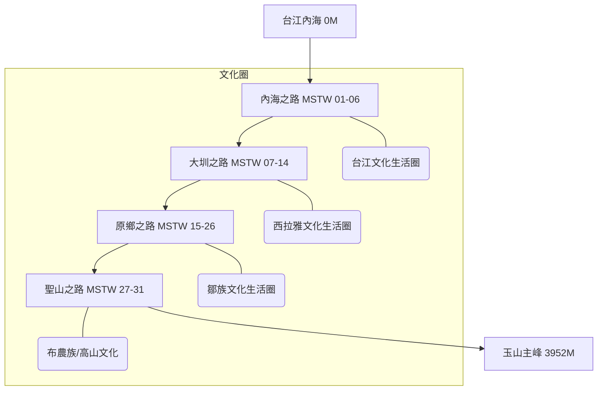

# 山海圳國家綠道 (Mountains to Sea Greenway)

山海圳國家綠道是一條「溯源風土的文化路徑」。這條綠道在空間尺度上跨越了 2 個縣市（臺南市、嘉義縣）；穿越了 3 個國家風景區（雲嘉南、西拉雅、阿里山）、2 個國家公園（台江、玉山）、2 個林區、2 座水庫（烏山頭、曾文），以及 4 大河川（鹽水溪、曾文溪、高屏溪及濁水溪）流域。



## 💧 水利與專案背景 (Project Context)
- **核心水利**: 嘉南大圳、烏山嶺引水隧道（西口/東口）、曾文水庫。
- **背景**: 始於 2007 年地方倡議，串連布農、鄒、西拉雅及漢人文化圈。
- **技術細節**: 海拔從 0 爬升至 3952 公尺，長度約 177 公里。

## AI 投影片 
- [NotebookLM投影片](https://drive.google.com/open?id=1UshWflfmzdiIZcFavEs4ax2vdaLp0X0F&usp=drive_copy)

## 🗺️ AI 深度探索 (Deep Research)
如果您擁有 Gemini Advanced 或其他 Deep Research 工具，可以複製以下 Prompt，針對山海圳進行深度的文史與生態探索：

```markdown
# Context
您現在是一位精通台灣文史與水利工程的「山海圳導航專家」。
山海圳國家綠道 (MSTW) 是一條海拔 0 至 3952 公尺的文化路徑，涵蓋台江、西拉雅、鄒族與布農族四大生活圈。

# Task
請針對以下「山海圳核心分段與節點」進行 Deep Research，挖掘其背後的「權力地景」、「族群衝突與融合」與「當代生態價值」。

**重點區域：**
1. **內海之路**: 鹽水溪出海口至渡槽橋（水利設施與防潮機制）。
2. **大圳之路**: 烏山頭水庫、嘉南大圳、東口與西口引水工程（八田與一的設計哲學）。
3. **原鄉之路**: 茶山、新美、里佳、達邦、特富野（鄒族獵人文化與部落遷移史）。
4. **聖山之路**: 自忠、塔塔加至玉山主峰（布農族領域與登山史）。

# Requirements
1. **族群紋理**: 說明當地的族群分布如何隨海拔與引水灌溉系統變遷？
2. **水利工程深度**: 分析烏山嶺引水隧道的歷史重要性及其對嘉南平原的貢獻。
3. **文史景點**: 推薦 5 個在官方手冊之外，值得徒步者駐足的「隱藏地標」。
4. **必吃在地美食**: 從台江的小吃、官田的菱角到部落的石板烤肉，列出階梯式的味蕾清單。
```
- [山海圳國家綠道深度研究](https://docs.google.com/document/d/1mcWGWggQSKZYYAQzI3y1AM_1GWYLhZMsT7i2-hfJGUE/edit?usp=sharing)


## 📊 用 Dynamic View 視覺化您的研究
研究報告完成後，請在 Dynamic View 中使用以下 Prompt 進行結構化呈現：

- **Culture Map**: `請以文化分層視圖，分析四個文化生活圈的關鍵圖騰與核心價值。`
- **Engineering Timeline**: `建立烏山頭水庫與嘉南大圳建設的關鍵時間軸。`
- **Route Card**: `將 MSTW 01 到 31 轉換為一張張難度與亮點分明的行程卡片。`

---

## 製作筆記
- [從「靜態手冊」到「動態地圖」：山海圳國家綠道的數位敘事化轉型實錄](https://wuulong.github.io/wuulong-notes-blog/posts/20260203_shj_transformation_log/)


## 景點 Feature 索引

### 軌跡段 (Tracks)

- [MSTW 01 (起點為鹽水溪排水線出海口，台江國家公園管理處暫無船隻通行）台江國家公園管理處→朝皇宮](?map=20260202_shanhaijun&feature=20260202_shj_track_01)
- [MSTW 02 朝皇宮→保安宮](?map=20260202_shanhaijun&feature=20260202_shj_track_02)
- [MSTW 03 保安宮→臺灣歷史博物館](?map=20260202_shanhaijun&feature=20260202_shj_track_03)
- [MSTW 04 臺灣歷史博物館→新港社地方文化館](?map=20260202_shanhaijun&feature=20260202_shj_track_04)
- [MSTW 05 新港社地方文化館→兒南公園](?map=20260202_shanhaijun&feature=20260202_shj_track_05)
- [MSTW 06 兒南公園→茄拔天后宮](?map=20260202_shanhaijun&feature=20260202_shj_track_06)
- [MSTW 07 茄拔天后宮→烏山頭水庫風景區售票口](?map=20260202_shanhaijun&feature=20260202_shj_track_07)
- [MSTW 08 烏山頭水庫風景區售票口→南湖口](?map=20260202_shanhaijun&feature=20260202_shj_track_08)
- [MSTW 09 南湖口→西口](?map=20260202_shanhaijun&feature=20260202_shj_track_09)
- [MSTW 10 西口→焙灶](?map=20260202_shanhaijun&feature=20260202_shj_track_10)
- [MSTW 11 焙灶→烏山嶺水利古道→東口工作站](?map=20260202_shanhaijun&feature=20260202_shj_track_11)
- [MSTW 12 東口工作站→曾文水庫紀念碑](?map=20260202_shanhaijun&feature=20260202_shj_track_12)
- [MSTW 13 曾文水庫紀念碑→曾文水庫觀景樓](?map=20260202_shanhaijun&feature=20260202_shj_track_13)
- [MSTW 14 曾文水庫觀景樓→大埔情人公園碼頭](?map=20260202_shanhaijun&feature=20260202_shj_track_14)
- [MSTW 15 大埔情人公園碼頭→茶山部落](?map=20260202_shanhaijun&feature=20260202_shj_track_15)
- [MSTW 16 茶山部落→新美部落](?map=20260202_shanhaijun&feature=20260202_shj_track_16)
- [MSTW 17 新美部落→山美達娜伊谷](?map=20260202_shanhaijun&feature=20260202_shj_track_17)
- [MSTW 18 山美達娜伊谷→里美避難步道](?map=20260202_shanhaijun&feature=20260202_shj_track_18)
- [MSTW 19 里美避難步道](?map=20260202_shanhaijun&feature=20260202_shj_track_19)
- [MSTW 20 巨石坂步道](?map=20260202_shanhaijun&feature=20260202_shj_track_20)
- [MSTW 21 巨石坂步道→里佳林間步道](?map=20260202_shanhaijun&feature=20260202_shj_track_21)
- [MSTW 22 里佳林間步道→里佳部落→賞楓步道](?map=20260202_shanhaijun&feature=20260202_shj_track_22)
- [MSTW 23 賞楓步道→達邦部落](?map=20260202_shanhaijun&feature=20260202_shj_track_23)
- [MSTW 24 達邦部落→特富野步道→特富野部落](?map=20260202_shanhaijun&feature=20260202_shj_track_24)
- [MSTW 25 特富野部落(產道)→特富野古道](?map=20260202_shanhaijun&feature=20260202_shj_track_25)
- [MSTW 26 特富野古道(特富野→自忠)](?map=20260202_shanhaijun&feature=20260202_shj_track_26)
- [MSTW 27 自忠→石山停車場](?map=20260202_shanhaijun&feature=20260202_shj_track_27)
- [MSTW 28 石山停車場→鹿林小徑](?map=20260202_shanhaijun&feature=20260202_shj_track_28)
- [MSTW 29 鹿林小徑→鹿林山→麟趾山鞍部](?map=20260202_shanhaijun&feature=20260202_shj_track_29)
- [MSTW 30 麟趾山鞍部→玉山登山口](?map=20260202_shanhaijun&feature=20260202_shj_track_30)
- [MSTW 31 玉山主峰線](?map=20260202_shanhaijun&feature=20260202_shj_track_31)
- [工程替代路線 Detour(~2026.05)請依現場指示通行](?map=20260202_shanhaijun&feature=20260202_shj_track_%E5%B7%A5%E7%A8%8B%E6%9B%BF%E4%BB%A3%E8%B7%AF%E7%B7%9ADeto)
- [曾文水庫旱季-臺三線替代道路](?map=20260202_shanhaijun&feature=20260202_shj_track_%E6%9B%BE%E6%96%87%E6%B0%B4%E5%BA%AB%E6%97%B1%E5%AD%A3%E8%87%BA%E4%B8%89%E7%B7%9A%E6%9B%BF)
### 特色景點與服務據點 (Highlights)
- [隆田酒廠](?map=20260202_shanhaijun&feature=20260202_shj_poi_001)
- [川文山森林保育農場](?map=20260202_shanhaijun&feature=20260202_shj_poi_002)
- [藝農號｜農產x文創展售·芒果冰｜](?map=20260202_shanhaijun&feature=20260202_shj_poi_003)
- [種書店｜拔林賴氏七房宗祠（拔林工作站）](?map=20260202_shanhaijun&feature=20260202_shj_poi_004)
- [水雉生態教育園區](?map=20260202_shanhaijun&feature=20260202_shj_poi_005)
- [善化啤酒廠](?map=20260202_shanhaijun&feature=20260202_shj_poi_006)
- [溫馨草莓園](?map=20260202_shanhaijun&feature=20260202_shj_poi_007)
- [晴光草莓園](?map=20260202_shanhaijun&feature=20260202_shj_poi_008)
- [美裕草莓園](?map=20260202_shanhaijun&feature=20260202_shj_poi_009)
- [溪頂寮保安宮](?map=20260202_shanhaijun&feature=20260202_shj_poi_010)
- [楊逵文學紀念館](?map=20260202_shanhaijun&feature=20260202_shj_poi_011)
- [臺南市台江文化中心](?map=20260202_shanhaijun&feature=20260202_shj_poi_012)
- [新港社地方文化館](?map=20260202_shanhaijun&feature=20260202_shj_poi_013)
- [大安草莓家園](?map=20260202_shanhaijun&feature=20260202_shj_poi_014)
- [隆田 chacha 文化資產教育園區](?map=20260202_shanhaijun&feature=20260202_shj_poi_015)
- [臺南山上花園水道博物館](?map=20260202_shanhaijun&feature=20260202_shj_poi_016)
- [菱炭森活工場（預約制） Trapa Shell Bio-charcoal Living Workshop](?map=20260202_shanhaijun&feature=20260202_shj_poi_017)
- [台3線333公里處](?map=20260202_shanhaijun&feature=20260202_shj_poi_018)
- [山海驛站-茄拔天后宮](?map=20260202_shanhaijun&feature=20260202_shj_poi_019)
- [山海驛站｜集章處-歐都納山野渡假村](?map=20260202_shanhaijun&feature=20260202_shj_poi_020)
- [山海驛站-里佳資訊站](?map=20260202_shanhaijun&feature=20260202_shj_poi_021)
- [山海驛站-財團法人樹谷文化基金會](?map=20260202_shanhaijun&feature=20260202_shj_poi_022)
- [山海驛站-西拉雅國家風景區管理處-官田遊客中心](?map=20260202_shanhaijun&feature=20260202_shj_poi_023)
- [國立臺灣歷史博物館](?map=20260202_shanhaijun&feature=20260202_shj_poi_024)
- [國立臺灣史前文化博物館-南科考古館](?map=20260202_shanhaijun&feature=20260202_shj_poi_025)
- [山海驛站-東埔山莊](?map=20260202_shanhaijun&feature=20260202_shj_poi_026)
- [山海驛站-嘉南農田水利會-東口工作站](?map=20260202_shanhaijun&feature=20260202_shj_poi_027)
- [山海驛站-嘉南農田水利會-茄拔工作站](?map=20260202_shanhaijun&feature=20260202_shj_poi_028)
- [山海驛站-嘉南農田水利會-大崎工作站](?map=20260202_shanhaijun&feature=20260202_shj_poi_029)
- [曾文之眼遊客中心](?map=20260202_shanhaijun&feature=20260202_shj_poi_030)
- [山海驛站-大埔孟崇竹炭生產合作社(和平窯)](?map=20260202_shanhaijun&feature=20260202_shj_poi_031)
- [山海驛站｜護照販售-茶山社區發展協會](?map=20260202_shanhaijun&feature=20260202_shj_poi_032)
- [山海驛站-特富野社區發展協會](?map=20260202_shanhaijun&feature=20260202_shj_poi_033)
- [山海驛站-阿里山轉運站](?map=20260202_shanhaijun&feature=20260202_shj_poi_034)
- [山海驛站｜護照販售｜護照優惠-新美尼亞后薩獵人營](?map=20260202_shanhaijun&feature=20260202_shj_poi_035)
- [山海驛站-農田水利署嘉南管理處-官田工作站](?map=20260202_shanhaijun&feature=20260202_shj_poi_036)
- [山海驛站-農田水利署嘉南管理處-分岐工作站](?map=20260202_shanhaijun&feature=20260202_shj_poi_037)
- [集章處－0km（室外） 台江國家公園](?map=20260202_shanhaijun&feature=20260202_shj_poi_038)
- [台江國家公園遊客中心 (0km 起點)](?map=20260202_shanhaijun&feature=20260202_shj_poi_039)
- [集章處－台江國家公園-販售處](?map=20260202_shanhaijun&feature=20260202_shj_poi_040)
- [海尾朝皇宮](?map=20260202_shanhaijun&feature=20260202_shj_poi_041)
- [烏山頭水庫風景區](?map=20260202_shanhaijun&feature=20260202_shj_poi_042)
- [西口工作站 (西口小瑞士)](?map=20260202_shanhaijun&feature=20260202_shj_poi_043)
- [集章處－大埔旅遊資訊站 (西拉雅國家風景區)(現整修中，集章處移至歐都納山野度假村 24小時櫃檯） Da-pu Visitor Information Station Of Siraya National Scenic Area(Now closed)](?map=20260202_shanhaijun&feature=20260202_shj_poi_044)
- [集章處－鄒族自然與文化中心](?map=20260202_shanhaijun&feature=20260202_shj_poi_045)
- [集章處－（室外）特富野古道](?map=20260202_shanhaijun&feature=20260202_shj_poi_046)
- [集章處－排雲登山服務中心](?map=20260202_shanhaijun&feature=20260202_shj_poi_047)
- [護照販售｜優惠-台江國家公園遊客中心/來趣台江/伴手禮/旅遊諮詢](?map=20260202_shanhaijun&feature=20260202_shj_poi_048)
- [護照販售｜優惠-嘉娜百藝工坊](?map=20260202_shanhaijun&feature=20260202_shj_poi_049)
- [護照販售-森2488m X 馬羊家茶](?map=20260202_shanhaijun&feature=20260202_shj_poi_050)
- [護照販售-飛鼠咖啡Peisu coffee（暫停營業）](?map=20260202_shanhaijun&feature=20260202_shj_poi_051)
- [護照販售｜護照優惠-達娜伊谷](?map=20260202_shanhaijun&feature=20260202_shj_poi_052)
- [護照優惠-阿里山國家森林遊樂區入口售票亭](?map=20260202_shanhaijun&feature=20260202_shj_poi_053)
- [護照優惠-烏山頭 湖境渡假會館](?map=20260202_shanhaijun&feature=20260202_shj_poi_054)
- [曾文水庫觀景樓](?map=20260202_shanhaijun&feature=20260202_shj_poi_055)
- [護照優惠-嘉義縣大埔鄉和平社區發展協會](?map=20260202_shanhaijun&feature=20260202_shj_poi_056)
- [護照優惠-大埔山莊](?map=20260202_shanhaijun&feature=20260202_shj_poi_057)
- [護照優惠-救國團曾文青年活動中心](?map=20260202_shanhaijun&feature=20260202_shj_poi_058)
- [護照優惠-湖境渡假會館](?map=20260202_shanhaijun&feature=20260202_shj_poi_059)
- [護照優惠-特富野民宿](?map=20260202_shanhaijun&feature=20260202_shj_poi_060)
- [善化嘉北里社區老人文康活動中心](?map=20260202_shanhaijun&feature=20260202_shj_poi_061)
- [台南市紅樹林保護協會](?map=20260202_shanhaijun&feature=20260202_shj_poi_062)
- [台南楠西區照興里篤加阿立祖公廨](?map=20260202_shanhaijun&feature=20260202_shj_poi_063)
- [隆本復興宮](?map=20260202_shanhaijun&feature=20260202_shj_poi_064)
- [台南市西拉雅文化協會](?map=20260202_shanhaijun&feature=20260202_shj_poi_065)
- [住-台南科學園區商務民宿](?map=20260202_shanhaijun&feature=20260202_shj_poi_066)
- [住-Mimiyo秘密遊民宿](?map=20260202_shanhaijun&feature=20260202_shj_poi_067)
- [住-趣淘漫旅 台南](?map=20260202_shanhaijun&feature=20260202_shj_poi_068)
- [住-小農家族民宿](?map=20260202_shanhaijun&feature=20260202_shj_poi_069)
- [住-樺谷大飯店](?map=20260202_shanhaijun&feature=20260202_shj_poi_070)
- [住-南科贊美酒店](?map=20260202_shanhaijun&feature=20260202_shj_poi_071)
- [住-威妮斯汽車商務旅館](?map=20260202_shanhaijun&feature=20260202_shj_poi_072)
- [住-藝想田開民宿](?map=20260202_shanhaijun&feature=20260202_shj_poi_073)
- [住-護照優惠-特富野民宿](?map=20260202_shanhaijun&feature=20260202_shj_poi_074)
- [住-護照優惠-救國團曾文青年活動中心](?map=20260202_shanhaijun&feature=20260202_shj_poi_075)
- [住-福爾摩沙遊艇酒店](?map=20260202_shanhaijun&feature=20260202_shj_poi_076)
- [住-松竹梅休閒渡假民宿](?map=20260202_shanhaijun&feature=20260202_shj_poi_077)
- [住-護照優惠-大埔山莊](?map=20260202_shanhaijun&feature=20260202_shj_poi_078)
- [住-護照優惠-烏山頭湖境渡假會館](?map=20260202_shanhaijun&feature=20260202_shj_poi_079)
- [住-白紫茶香居](?map=20260202_shanhaijun&feature=20260202_shj_poi_080)
- [住-給巴娜民宿](?map=20260202_shanhaijun&feature=20260202_shj_poi_081)
- [住-阿里山賓館](?map=20260202_shanhaijun&feature=20260202_shj_poi_082)
- [住-阿里山閣大飯店](?map=20260202_shanhaijun&feature=20260202_shj_poi_083)
- [住-新美尼亞后薩獵人營](?map=20260202_shanhaijun&feature=20260202_shj_poi_084)
- [住-隆田旅社](?map=20260202_shanhaijun&feature=20260202_shj_poi_085)
- [南科商場](?map=20260202_shanhaijun&feature=20260202_shj_poi_086)
- [達娜伊谷山之美餐廳(原住民風味餐)](?map=20260202_shanhaijun&feature=20260202_shj_poi_087)
- [護照優惠｜鯝事的起源](?map=20260202_shanhaijun&feature=20260202_shj_poi_088)
- [橫路、東山休息站、174休息區](?map=20260202_shanhaijun&feature=20260202_shj_poi_089)
- [梅花飯店水庫店](?map=20260202_shanhaijun&feature=20260202_shj_poi_090)
- [MT.Sylvia Coffee 雪山貓](?map=20260202_shanhaijun&feature=20260202_shj_poi_091)
- [柳川 台日料理專門 | 桌菜](?map=20260202_shanhaijun&feature=20260202_shj_poi_092)
- [酷柏德式精釀啤/酒KUBO Craftbrewing](?map=20260202_shanhaijun&feature=20260202_shj_poi_093)
- [小菱居 咖啡/下午茶/早午餐](?map=20260202_shanhaijun&feature=20260202_shj_poi_094)
- [騎蹟Rider's Pitstop](?map=20260202_shanhaijun&feature=20260202_shj_poi_095)
- [穗興商行](?map=20260202_shanhaijun&feature=20260202_shj_poi_096)
- [七彩琉璃咖啡莊園](?map=20260202_shanhaijun&feature=20260202_shj_poi_097)
- [珈雅瑪文化園區](?map=20260202_shanhaijun&feature=20260202_shj_poi_098)
- [達明製茶廠](?map=20260202_shanhaijun&feature=20260202_shj_poi_099)
- [曉青的店](?map=20260202_shanhaijun&feature=20260202_shj_poi_100)
- [達邦街角複合式餐飲](?map=20260202_shanhaijun&feature=20260202_shj_poi_101)
- [山田小館](?map=20260202_shanhaijun&feature=20260202_shj_poi_102)
- [鄒風館部落餐廳（鄒達邦餐飲工藝複合館）](?map=20260202_shanhaijun&feature=20260202_shj_poi_103)
- [特富野餐廳](?map=20260202_shanhaijun&feature=20260202_shj_poi_104)
- [拉拉克斯山食餐館(採預約制)](?map=20260202_shanhaijun&feature=20260202_shj_poi_105)
- [塔塔加遊客中心](?map=20260202_shanhaijun&feature=20260202_shj_poi_106)
- [排雲山莊](?map=20260202_shanhaijun&feature=20260202_shj_poi_107)
- [山賓餐廳](?map=20260202_shanhaijun&feature=20260202_shj_poi_108)
- [隆田米糕](?map=20260202_shanhaijun&feature=20260202_shj_poi_109)