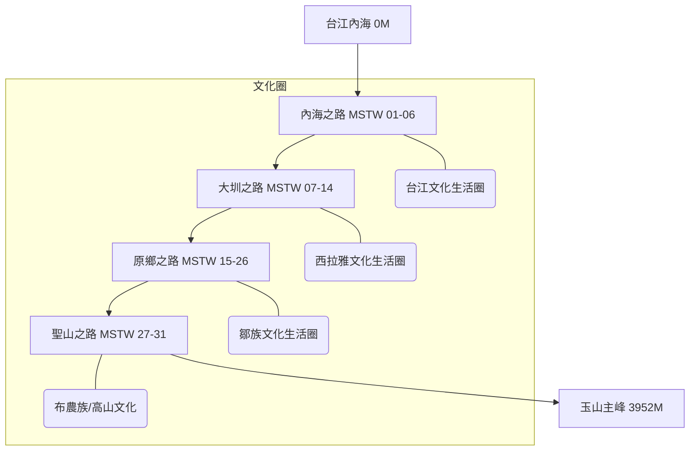

# 山海圳國家綠道 (Mountains to Sea Greenway)

山海圳國家綠道是一條「溯源風土的文化路徑」。這條綠道在空間尺度上跨越了 2 個縣市（臺南市、嘉義縣）；穿越了 3 個國家風景區（雲嘉南、西拉雅、阿里山）、2 個國家公園（台江、玉山）、2 個林區、2 座水庫（烏山頭、曾文），以及 4 大河川（鹽水溪、曾文溪、高屏溪及濁水溪）流域。



## 💧 水利與專案背景 (Project Context)
- **核心水利**: 嘉南大圳、烏山嶺引水隧道（西口/東口）、曾文水庫。
- **背景**: 始於 2007 年地方倡議，串連布農、鄒、西拉雅及漢人文化圈。
- **技術細節**: 海拔從 0 爬升至 3952 公尺，長度約 177 公里。

## 🗺️ AI 深度探索 (Deep Research)
如果您擁有 Gemini Advanced 或其他 Deep Research 工具，可以複製以下 Prompt，針對山海圳進行深度的文史與生態探索：

```markdown
# Context
您現在是一位精通台灣文史與水利工程的「山海圳導航專家」。
山海圳國家綠道 (MSTW) 是一條海拔 0 至 3952 公尺的文化路徑，涵蓋台江、西拉雅、鄒族與布農族四大生活圈。

# Task
請針對以下「山海圳核心分段與節點」進行 Deep Research，挖掘其背後的「權力地景」、「族群衝突與融合」與「當代生態價值」。

**重點區域：**
1. **內海之路**: 鹽水溪出海口至渡槽橋（水利設施與防潮機制）。
2. **大圳之路**: 烏山頭水庫、嘉南大圳、東口與西口引水工程（八田與一的設計哲學）。
3. **原鄉之路**: 茶山、新美、里佳、達邦、特富野（鄒族獵人文化與部落遷移史）。
4. **聖山之路**: 自忠、塔塔加至玉山主峰（布農族領域與登山史）。

# Requirements
1. **族群紋理**: 說明當地的族群分布如何隨海拔與引水灌溉系統變遷？
2. **水利工程深度**: 分析烏山嶺引水隧道的歷史重要性及其對嘉南平原的貢獻。
3. **文史景點**: 推薦 5 個在官方手冊之外，值得徒步者駐足的「隱藏地標」。
4. **必吃在地美食**: 從台江的小吃、官田的菱角到部落的石板烤肉，列出階梯式的味蕾清單。
```

## 📊 用 Dynamic View 視覺化您的研究
研究報告完成後，請在 Dynamic View 中使用以下 Prompt 進行結構化呈現：

- **Culture Map**: `請以文化分層視圖，分析四個文化生活圈的關鍵圖騰與核心價值。`
- **Engineering Timeline**: `建立烏山頭水庫與嘉南大圳建設的關鍵時間軸。`
- **Route Card**: `將 MSTW 01 到 31 轉換為一張張難度與亮點分明的行程卡片。`

---

## 景點 Feature 索引

### 軌跡段 (Tracks)
https://walkgis-544663807110.us-west1.run.app/?map=20260202_shanhaijun&feature=20260202_shj_poi_003
- [MSTW 01 (起點為鹽水溪排水線出海口，台江國家公園管理處暫無船隻通行）台江國家公園管理處→朝皇宮](https://github.com/wuulong/wuulong-notes-blog/blob/main/static/walkgis_prj/features/20260202_shj_track_01.md)
- [MSTW 02 朝皇宮→保安宮](https://github.com/wuulong/wuulong-notes-blog/blob/main/static/walkgis_prj/features/20260202_shj_track_02.md)
- [MSTW 03 保安宮→臺灣歷史博物館](https://github.com/wuulong/wuulong-notes-blog/blob/main/static/walkgis_prj/features/20260202_shj_track_03.md)
- [MSTW 04 臺灣歷史博物館→新港社地方文化館](https://github.com/wuulong/wuulong-notes-blog/blob/main/static/walkgis_prj/features/20260202_shj_track_04.md)
- [MSTW 05 新港社地方文化館→兒南公園](https://github.com/wuulong/wuulong-notes-blog/blob/main/static/walkgis_prj/features/20260202_shj_track_05.md)
- [MSTW 06 兒南公園→茄拔天后宮](https://github.com/wuulong/wuulong-notes-blog/blob/main/static/walkgis_prj/features/20260202_shj_track_06.md)
- [MSTW 07 茄拔天后宮→烏山頭水庫風景區售票口](https://github.com/wuulong/wuulong-notes-blog/blob/main/static/walkgis_prj/features/20260202_shj_track_07.md)
- [MSTW 08 烏山頭水庫風景區售票口→南湖口](https://github.com/wuulong/wuulong-notes-blog/blob/main/static/walkgis_prj/features/20260202_shj_track_08.md)
- [MSTW 09 南湖口→西口](https://github.com/wuulong/wuulong-notes-blog/blob/main/static/walkgis_prj/features/20260202_shj_track_09.md)
- [MSTW 10 西口→焙灶](https://github.com/wuulong/wuulong-notes-blog/blob/main/static/walkgis_prj/features/20260202_shj_track_10.md)
- [MSTW 11 焙灶→烏山嶺水利古道→東口工作站](https://github.com/wuulong/wuulong-notes-blog/blob/main/static/walkgis_prj/features/20260202_shj_track_11.md)
- [MSTW 12 東口工作站→曾文水庫紀念碑](https://github.com/wuulong/wuulong-notes-blog/blob/main/static/walkgis_prj/features/20260202_shj_track_12.md)
- [MSTW 13 曾文水庫紀念碑→曾文水庫觀景樓](https://github.com/wuulong/wuulong-notes-blog/blob/main/static/walkgis_prj/features/20260202_shj_track_13.md)
- [MSTW 14 曾文水庫觀景樓→大埔情人公園碼頭](https://github.com/wuulong/wuulong-notes-blog/blob/main/static/walkgis_prj/features/20260202_shj_track_14.md)
- [MSTW 15 大埔情人公園碼頭→茶山部落](https://github.com/wuulong/wuulong-notes-blog/blob/main/static/walkgis_prj/features/20260202_shj_track_15.md)
- [MSTW 16 茶山部落→新美部落](https://github.com/wuulong/wuulong-notes-blog/blob/main/static/walkgis_prj/features/20260202_shj_track_16.md)
- [MSTW 17 新美部落→山美達娜伊谷](https://github.com/wuulong/wuulong-notes-blog/blob/main/static/walkgis_prj/features/20260202_shj_track_17.md)
- [MSTW 18 山美達娜伊谷→里美避難步道](https://github.com/wuulong/wuulong-notes-blog/blob/main/static/walkgis_prj/features/20260202_shj_track_18.md)
- [MSTW 19 里美避難步道](https://github.com/wuulong/wuulong-notes-blog/blob/main/static/walkgis_prj/features/20260202_shj_track_19.md)
- [MSTW 20 巨石坂步道](https://github.com/wuulong/wuulong-notes-blog/blob/main/static/walkgis_prj/features/20260202_shj_track_20.md)
- [MSTW 21 巨石坂步道→里佳林間步道](https://github.com/wuulong/wuulong-notes-blog/blob/main/static/walkgis_prj/features/20260202_shj_track_21.md)
- [MSTW 22 里佳林間步道→里佳部落→賞楓步道](https://github.com/wuulong/wuulong-notes-blog/blob/main/static/walkgis_prj/features/20260202_shj_track_22.md)
- [MSTW 23 賞楓步道→達邦部落](https://github.com/wuulong/wuulong-notes-blog/blob/main/static/walkgis_prj/features/20260202_shj_track_23.md)
- [MSTW 24 達邦部落→特富野步道→特富野部落](https://github.com/wuulong/wuulong-notes-blog/blob/main/static/walkgis_prj/features/20260202_shj_track_24.md)
- [MSTW 25 特富野部落(產道)→特富野古道](https://github.com/wuulong/wuulong-notes-blog/blob/main/static/walkgis_prj/features/20260202_shj_track_25.md)
- [MSTW 26 特富野古道(特富野→自忠)](https://github.com/wuulong/wuulong-notes-blog/blob/main/static/walkgis_prj/features/20260202_shj_track_26.md)
- [MSTW 27 自忠→石山停車場](https://github.com/wuulong/wuulong-notes-blog/blob/main/static/walkgis_prj/features/20260202_shj_track_27.md)
- [MSTW 28 石山停車場→鹿林小徑](https://github.com/wuulong/wuulong-notes-blog/blob/main/static/walkgis_prj/features/20260202_shj_track_28.md)
- [MSTW 29 鹿林小徑→鹿林山→麟趾山鞍部](https://github.com/wuulong/wuulong-notes-blog/blob/main/static/walkgis_prj/features/20260202_shj_track_29.md)
- [MSTW 30 麟趾山鞍部→玉山登山口](https://github.com/wuulong/wuulong-notes-blog/blob/main/static/walkgis_prj/features/20260202_shj_track_30.md)
- [MSTW 31 玉山主峰線](https://github.com/wuulong/wuulong-notes-blog/blob/main/static/walkgis_prj/features/20260202_shj_track_31.md)
- [工程替代路線 Detour(~2026.05)請依現場指示通行](https://github.com/wuulong/wuulong-notes-blog/blob/main/static/walkgis_prj/features/20260202_shj_track_工程替代路線Deto.md)
- [曾文水庫旱季-臺三線替代道路](https://github.com/wuulong/wuulong-notes-blog/blob/main/static/walkgis_prj/features/20260202_shj_track_曾文水庫旱季臺三線替.md)
### 特色景點與服務據點 (Highlights)
- [隆田酒廠](https://github.com/wuulong/wuulong-notes-blog/blob/main/static/walkgis_prj/features/20260202_shj_poi_001.md)
- [川文山森林保育農場](https://github.com/wuulong/wuulong-notes-blog/blob/main/static/walkgis_prj/features/20260202_shj_poi_002.md)
- [藝農號｜農產x文創展售·芒果冰｜](https://github.com/wuulong/wuulong-notes-blog/blob/main/static/walkgis_prj/features/20260202_shj_poi_003.md)
- [種書店｜拔林賴氏七房宗祠（拔林工作站）](https://github.com/wuulong/wuulong-notes-blog/blob/main/static/walkgis_prj/features/20260202_shj_poi_004.md)
- [水雉生態教育園區](https://github.com/wuulong/wuulong-notes-blog/blob/main/static/walkgis_prj/features/20260202_shj_poi_005.md)
- [善化啤酒廠](https://github.com/wuulong/wuulong-notes-blog/blob/main/static/walkgis_prj/features/20260202_shj_poi_006.md)
- [溫馨草莓園](https://github.com/wuulong/wuulong-notes-blog/blob/main/static/walkgis_prj/features/20260202_shj_poi_007.md)
- [晴光草莓園](https://github.com/wuulong/wuulong-notes-blog/blob/main/static/walkgis_prj/features/20260202_shj_poi_008.md)
- [美裕草莓園](https://github.com/wuulong/wuulong-notes-blog/blob/main/static/walkgis_prj/features/20260202_shj_poi_009.md)
- [溪頂寮保安宮](https://github.com/wuulong/wuulong-notes-blog/blob/main/static/walkgis_prj/features/20260202_shj_poi_010.md)
- [楊逵文學紀念館](https://github.com/wuulong/wuulong-notes-blog/blob/main/static/walkgis_prj/features/20260202_shj_poi_011.md)
- [臺南市台江文化中心](https://github.com/wuulong/wuulong-notes-blog/blob/main/static/walkgis_prj/features/20260202_shj_poi_012.md)
- [新港社地方文化館](https://github.com/wuulong/wuulong-notes-blog/blob/main/static/walkgis_prj/features/20260202_shj_poi_013.md)
- [大安草莓家園](https://github.com/wuulong/wuulong-notes-blog/blob/main/static/walkgis_prj/features/20260202_shj_poi_014.md)
- [隆田 chacha 文化資產教育園區](https://github.com/wuulong/wuulong-notes-blog/blob/main/static/walkgis_prj/features/20260202_shj_poi_015.md)
- [臺南山上花園水道博物館](https://github.com/wuulong/wuulong-notes-blog/blob/main/static/walkgis_prj/features/20260202_shj_poi_016.md)
- [菱炭森活工場（預約制） Trapa Shell Bio-charcoal Living Workshop](https://github.com/wuulong/wuulong-notes-blog/blob/main/static/walkgis_prj/features/20260202_shj_poi_017.md)
- [台3線333公里處](https://github.com/wuulong/wuulong-notes-blog/blob/main/static/walkgis_prj/features/20260202_shj_poi_018.md)
- [山海驛站-茄拔天后宮](https://github.com/wuulong/wuulong-notes-blog/blob/main/static/walkgis_prj/features/20260202_shj_poi_019.md)
- [山海驛站｜集章處-歐都納山野渡假村](https://github.com/wuulong/wuulong-notes-blog/blob/main/static/walkgis_prj/features/20260202_shj_poi_020.md)
- [山海驛站-里佳資訊站](https://github.com/wuulong/wuulong-notes-blog/blob/main/static/walkgis_prj/features/20260202_shj_poi_021.md)
- [山海驛站-財團法人樹谷文化基金會](https://github.com/wuulong/wuulong-notes-blog/blob/main/static/walkgis_prj/features/20260202_shj_poi_022.md)
- [山海驛站-西拉雅國家風景區管理處-官田遊客中心](https://github.com/wuulong/wuulong-notes-blog/blob/main/static/walkgis_prj/features/20260202_shj_poi_023.md)
- [國立臺灣歷史博物館](https://github.com/wuulong/wuulong-notes-blog/blob/main/static/walkgis_prj/features/20260202_shj_poi_024.md)
- [國立臺灣史前文化博物館-南科考古館](https://github.com/wuulong/wuulong-notes-blog/blob/main/static/walkgis_prj/features/20260202_shj_poi_025.md)
- [山海驛站-東埔山莊](https://github.com/wuulong/wuulong-notes-blog/blob/main/static/walkgis_prj/features/20260202_shj_poi_026.md)
- [山海驛站-嘉南農田水利會-東口工作站](https://github.com/wuulong/wuulong-notes-blog/blob/main/static/walkgis_prj/features/20260202_shj_poi_027.md)
- [山海驛站-嘉南農田水利會-茄拔工作站](https://github.com/wuulong/wuulong-notes-blog/blob/main/static/walkgis_prj/features/20260202_shj_poi_028.md)
- [山海驛站-嘉南農田水利會-大崎工作站](https://github.com/wuulong/wuulong-notes-blog/blob/main/static/walkgis_prj/features/20260202_shj_poi_029.md)
- [曾文之眼遊客中心](https://github.com/wuulong/wuulong-notes-blog/blob/main/static/walkgis_prj/features/20260202_shj_poi_030.md)
- [山海驛站-大埔孟崇竹炭生產合作社(和平窯)](https://github.com/wuulong/wuulong-notes-blog/blob/main/static/walkgis_prj/features/20260202_shj_poi_031.md)
- [山海驛站｜護照販售-茶山社區發展協會](https://github.com/wuulong/wuulong-notes-blog/blob/main/static/walkgis_prj/features/20260202_shj_poi_032.md)
- [山海驛站-特富野社區發展協會](https://github.com/wuulong/wuulong-notes-blog/blob/main/static/walkgis_prj/features/20260202_shj_poi_033.md)
- [山海驛站-阿里山轉運站](https://github.com/wuulong/wuulong-notes-blog/blob/main/static/walkgis_prj/features/20260202_shj_poi_034.md)
- [山海驛站｜護照販售｜護照優惠-新美尼亞后薩獵人營](https://github.com/wuulong/wuulong-notes-blog/blob/main/static/walkgis_prj/features/20260202_shj_poi_035.md)
- [山海驛站-農田水利署嘉南管理處-官田工作站](https://github.com/wuulong/wuulong-notes-blog/blob/main/static/walkgis_prj/features/20260202_shj_poi_036.md)
- [山海驛站-農田水利署嘉南管理處-分岐工作站](https://github.com/wuulong/wuulong-notes-blog/blob/main/static/walkgis_prj/features/20260202_shj_poi_037.md)
- [集章處－0km（室外） 台江國家公園](https://github.com/wuulong/wuulong-notes-blog/blob/main/static/walkgis_prj/features/20260202_shj_poi_038.md)
- [台江國家公園遊客中心 (0km 起點)](https://github.com/wuulong/wuulong-notes-blog/blob/main/static/walkgis_prj/features/20260202_shj_poi_039.md)
- [集章處－台江國家公園-販售處](https://github.com/wuulong/wuulong-notes-blog/blob/main/static/walkgis_prj/features/20260202_shj_poi_040.md)
- [海尾朝皇宮](https://github.com/wuulong/wuulong-notes-blog/blob/main/static/walkgis_prj/features/20260202_shj_poi_041.md)
- [烏山頭水庫風景區](https://github.com/wuulong/wuulong-notes-blog/blob/main/static/walkgis_prj/features/20260202_shj_poi_042.md)
- [西口工作站 (西口小瑞士)](https://github.com/wuulong/wuulong-notes-blog/blob/main/static/walkgis_prj/features/20260202_shj_poi_043.md)
- [集章處－大埔旅遊資訊站 (西拉雅國家風景區)(現整修中，集章處移至歐都納山野度假村 24小時櫃檯） Da-pu Visitor Information Station Of Siraya National Scenic Area(Now closed)](https://github.com/wuulong/wuulong-notes-blog/blob/main/static/walkgis_prj/features/20260202_shj_poi_044.md)
- [集章處－鄒族自然與文化中心](https://github.com/wuulong/wuulong-notes-blog/blob/main/static/walkgis_prj/features/20260202_shj_poi_045.md)
- [集章處－（室外）特富野古道](https://github.com/wuulong/wuulong-notes-blog/blob/main/static/walkgis_prj/features/20260202_shj_poi_046.md)
- [集章處－排雲登山服務中心](https://github.com/wuulong/wuulong-notes-blog/blob/main/static/walkgis_prj/features/20260202_shj_poi_047.md)
- [護照販售｜優惠-台江國家公園遊客中心/來趣台江/伴手禮/旅遊諮詢](https://github.com/wuulong/wuulong-notes-blog/blob/main/static/walkgis_prj/features/20260202_shj_poi_048.md)
- [護照販售｜優惠-嘉娜百藝工坊](https://github.com/wuulong/wuulong-notes-blog/blob/main/static/walkgis_prj/features/20260202_shj_poi_049.md)
- [護照販售-森2488m X 馬羊家茶](https://github.com/wuulong/wuulong-notes-blog/blob/main/static/walkgis_prj/features/20260202_shj_poi_050.md)
- [護照販售-飛鼠咖啡Peisu coffee（暫停營業）](https://github.com/wuulong/wuulong-notes-blog/blob/main/static/walkgis_prj/features/20260202_shj_poi_051.md)
- [護照販售｜護照優惠-達娜伊谷](https://github.com/wuulong/wuulong-notes-blog/blob/main/static/walkgis_prj/features/20260202_shj_poi_052.md)
- [護照優惠-阿里山國家森林遊樂區入口售票亭](https://github.com/wuulong/wuulong-notes-blog/blob/main/static/walkgis_prj/features/20260202_shj_poi_053.md)
- [護照優惠-烏山頭 湖境渡假會館](https://github.com/wuulong/wuulong-notes-blog/blob/main/static/walkgis_prj/features/20260202_shj_poi_054.md)
- [曾文水庫觀景樓](https://github.com/wuulong/wuulong-notes-blog/blob/main/static/walkgis_prj/features/20260202_shj_poi_055.md)
- [護照優惠-嘉義縣大埔鄉和平社區發展協會](https://github.com/wuulong/wuulong-notes-blog/blob/main/static/walkgis_prj/features/20260202_shj_poi_056.md)
- [護照優惠-大埔山莊](https://github.com/wuulong/wuulong-notes-blog/blob/main/static/walkgis_prj/features/20260202_shj_poi_057.md)
- [護照優惠-救國團曾文青年活動中心](https://github.com/wuulong/wuulong-notes-blog/blob/main/static/walkgis_prj/features/20260202_shj_poi_058.md)
- [護照優惠-湖境渡假會館](https://github.com/wuulong/wuulong-notes-blog/blob/main/static/walkgis_prj/features/20260202_shj_poi_059.md)
- [護照優惠-特富野民宿](https://github.com/wuulong/wuulong-notes-blog/blob/main/static/walkgis_prj/features/20260202_shj_poi_060.md)
- [善化嘉北里社區老人文康活動中心](https://github.com/wuulong/wuulong-notes-blog/blob/main/static/walkgis_prj/features/20260202_shj_poi_061.md)
- [台南市紅樹林保護協會](https://github.com/wuulong/wuulong-notes-blog/blob/main/static/walkgis_prj/features/20260202_shj_poi_062.md)
- [台南楠西區照興里篤加阿立祖公廨](https://github.com/wuulong/wuulong-notes-blog/blob/main/static/walkgis_prj/features/20260202_shj_poi_063.md)
- [隆本復興宮](https://github.com/wuulong/wuulong-notes-blog/blob/main/static/walkgis_prj/features/20260202_shj_poi_064.md)
- [台南市西拉雅文化協會](https://github.com/wuulong/wuulong-notes-blog/blob/main/static/walkgis_prj/features/20260202_shj_poi_065.md)
- [住-台南科學園區商務民宿](https://github.com/wuulong/wuulong-notes-blog/blob/main/static/walkgis_prj/features/20260202_shj_poi_066.md)
- [住-Mimiyo秘密遊民宿](https://github.com/wuulong/wuulong-notes-blog/blob/main/static/walkgis_prj/features/20260202_shj_poi_067.md)
- [住-趣淘漫旅 台南](https://github.com/wuulong/wuulong-notes-blog/blob/main/static/walkgis_prj/features/20260202_shj_poi_068.md)
- [住-小農家族民宿](https://github.com/wuulong/wuulong-notes-blog/blob/main/static/walkgis_prj/features/20260202_shj_poi_069.md)
- [住-樺谷大飯店](https://github.com/wuulong/wuulong-notes-blog/blob/main/static/walkgis_prj/features/20260202_shj_poi_070.md)
- [住-南科贊美酒店](https://github.com/wuulong/wuulong-notes-blog/blob/main/static/walkgis_prj/features/20260202_shj_poi_071.md)
- [住-威妮斯汽車商務旅館](https://github.com/wuulong/wuulong-notes-blog/blob/main/static/walkgis_prj/features/20260202_shj_poi_072.md)
- [住-藝想田開民宿](https://github.com/wuulong/wuulong-notes-blog/blob/main/static/walkgis_prj/features/20260202_shj_poi_073.md)
- [住-護照優惠-特富野民宿](https://github.com/wuulong/wuulong-notes-blog/blob/main/static/walkgis_prj/features/20260202_shj_poi_074.md)
- [住-護照優惠-救國團曾文青年活動中心](https://github.com/wuulong/wuulong-notes-blog/blob/main/static/walkgis_prj/features/20260202_shj_poi_075.md)
- [住-福爾摩沙遊艇酒店](https://github.com/wuulong/wuulong-notes-blog/blob/main/static/walkgis_prj/features/20260202_shj_poi_076.md)
- [住-松竹梅休閒渡假民宿](https://github.com/wuulong/wuulong-notes-blog/blob/main/static/walkgis_prj/features/20260202_shj_poi_077.md)
- [住-護照優惠-大埔山莊](https://github.com/wuulong/wuulong-notes-blog/blob/main/static/walkgis_prj/features/20260202_shj_poi_078.md)
- [住-護照優惠-烏山頭湖境渡假會館](https://github.com/wuulong/wuulong-notes-blog/blob/main/static/walkgis_prj/features/20260202_shj_poi_079.md)
- [住-白紫茶香居](https://github.com/wuulong/wuulong-notes-blog/blob/main/static/walkgis_prj/features/20260202_shj_poi_080.md)
- [住-給巴娜民宿](https://github.com/wuulong/wuulong-notes-blog/blob/main/static/walkgis_prj/features/20260202_shj_poi_081.md)
- [住-阿里山賓館](https://github.com/wuulong/wuulong-notes-blog/blob/main/static/walkgis_prj/features/20260202_shj_poi_082.md)
- [住-阿里山閣大飯店](https://github.com/wuulong/wuulong-notes-blog/blob/main/static/walkgis_prj/features/20260202_shj_poi_083.md)
- [住-新美尼亞后薩獵人營](https://github.com/wuulong/wuulong-notes-blog/blob/main/static/walkgis_prj/features/20260202_shj_poi_084.md)
- [住-隆田旅社](https://github.com/wuulong/wuulong-notes-blog/blob/main/static/walkgis_prj/features/20260202_shj_poi_085.md)
- [南科商場](https://github.com/wuulong/wuulong-notes-blog/blob/main/static/walkgis_prj/features/20260202_shj_poi_086.md)
- [達娜伊谷山之美餐廳(原住民風味餐)](https://github.com/wuulong/wuulong-notes-blog/blob/main/static/walkgis_prj/features/20260202_shj_poi_087.md)
- [護照優惠｜鯝事的起源](https://github.com/wuulong/wuulong-notes-blog/blob/main/static/walkgis_prj/features/20260202_shj_poi_088.md)
- [橫路、東山休息站、174休息區](https://github.com/wuulong/wuulong-notes-blog/blob/main/static/walkgis_prj/features/20260202_shj_poi_089.md)
- [梅花飯店水庫店](https://github.com/wuulong/wuulong-notes-blog/blob/main/static/walkgis_prj/features/20260202_shj_poi_090.md)
- [MT.Sylvia Coffee 雪山貓](https://github.com/wuulong/wuulong-notes-blog/blob/main/static/walkgis_prj/features/20260202_shj_poi_091.md)
- [柳川 台日料理專門 | 桌菜](https://github.com/wuulong/wuulong-notes-blog/blob/main/static/walkgis_prj/features/20260202_shj_poi_092.md)
- [酷柏德式精釀啤/酒KUBO Craftbrewing](https://github.com/wuulong/wuulong-notes-blog/blob/main/static/walkgis_prj/features/20260202_shj_poi_093.md)
- [小菱居 咖啡/下午茶/早午餐](https://github.com/wuulong/wuulong-notes-blog/blob/main/static/walkgis_prj/features/20260202_shj_poi_094.md)
- [騎蹟Rider's Pitstop](https://github.com/wuulong/wuulong-notes-blog/blob/main/static/walkgis_prj/features/20260202_shj_poi_095.md)
- [穗興商行](https://github.com/wuulong/wuulong-notes-blog/blob/main/static/walkgis_prj/features/20260202_shj_poi_096.md)
- [七彩琉璃咖啡莊園](https://github.com/wuulong/wuulong-notes-blog/blob/main/static/walkgis_prj/features/20260202_shj_poi_097.md)
- [珈雅瑪文化園區](https://github.com/wuulong/wuulong-notes-blog/blob/main/static/walkgis_prj/features/20260202_shj_poi_098.md)
- [達明製茶廠](https://github.com/wuulong/wuulong-notes-blog/blob/main/static/walkgis_prj/features/20260202_shj_poi_099.md)
- [曉青的店](https://github.com/wuulong/wuulong-notes-blog/blob/main/static/walkgis_prj/features/20260202_shj_poi_100.md)
- [達邦街角複合式餐飲](https://github.com/wuulong/wuulong-notes-blog/blob/main/static/walkgis_prj/features/20260202_shj_poi_101.md)
- [山田小館](https://github.com/wuulong/wuulong-notes-blog/blob/main/static/walkgis_prj/features/20260202_shj_poi_102.md)
- [鄒風館部落餐廳（鄒達邦餐飲工藝複合館）](https://github.com/wuulong/wuulong-notes-blog/blob/main/static/walkgis_prj/features/20260202_shj_poi_103.md)
- [特富野餐廳](https://github.com/wuulong/wuulong-notes-blog/blob/main/static/walkgis_prj/features/20260202_shj_poi_104.md)
- [拉拉克斯山食餐館(採預約制)](https://github.com/wuulong/wuulong-notes-blog/blob/main/static/walkgis_prj/features/20260202_shj_poi_105.md)
- [塔塔加遊客中心](https://github.com/wuulong/wuulong-notes-blog/blob/main/static/walkgis_prj/features/20260202_shj_poi_106.md)
- [排雲山莊](https://github.com/wuulong/wuulong-notes-blog/blob/main/static/walkgis_prj/features/20260202_shj_poi_107.md)
- [山賓餐廳](https://github.com/wuulong/wuulong-notes-blog/blob/main/static/walkgis_prj/features/20260202_shj_poi_108.md)
- [隆田米糕](https://github.com/wuulong/wuulong-notes-blog/blob/main/static/walkgis_prj/features/20260202_shj_poi_109.md)