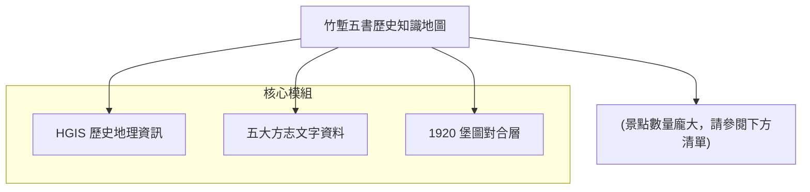

# 竹塹五書歷史知識地圖

## 簡介 (Introduction)
本計畫致力於將新竹地區最具代表性的五部歷史文獻（簡稱「竹塹五書」）與現代地理資訊系統 (GIS) 進行深度對位。透過對《新竹縣採訪冊》等史料中記載的聚落、圳路、古蹟及地景進行座標化，結合 1920 年代的台灣堡圖與現今的數值地形模型 (DTM)，重建三百年間竹塹地區的時空演變。

## 地圖結構 (Topology)


## 🗺️ AI 深度探索 (Deep Research)
如果您擁有 Gemini Advanced 或其他 Deep Research 工具，可以利用本資料集進行深度的文史研究。

```markdown
# Context
一份名為「竹塹五書歷史知識地圖」的 HGIS 專案，旨在對齊清代方志與現代規律。

# Task
請利用提供的景點清單，分析新竹（竹塹）地區從清領時期到日治初期的土地開發邏輯。

# Requirements
1. **水緣脈絡**: 分析水圳（如隆恩圳、汀甫圳）如何決定早期聚落的擴張方向。
2. **防衛與界域**: 根據「土城」、「隘」等關鍵字，找出歷史上的族群邊界。
3. **地名演化**: 比對古地名與現代街道，找出消失的地標。
```

## 下載與資源 (Resources)
- **[KML 地圖檔下載](./20260223_hsinchu_historical_atlas.kml)**

## 景點列表 (Features)
<!-- 由自動化腳本生成 -->
- [竹南堡 (古)](?map=20260223_hsinchu_historical_atlas&feature=20260223_hsinchu_2_竹南堡)
- [香山堡 (古)](?map=20260223_hsinchu_historical_atlas&feature=20260223_hsinchu_31_香山堡)
- [堡內莊 (古)](?map=20260223_hsinchu_historical_atlas&feature=20260223_hsinchu_52_堡內莊)
- [大崙堡 (古)](?map=20260223_hsinchu_historical_atlas&feature=20260223_hsinchu_77_大崙堡)
- [大甲堡 (古)](?map=20260223_hsinchu_historical_atlas&feature=20260223_hsinchu_113_大甲堡)
- [竹子坑 (古)](?map=20260223_hsinchu_historical_atlas&feature=20260223_hsinchu_171_竹子坑)
- [下寮街 (古)](?map=20260223_hsinchu_historical_atlas&feature=20260223_hsinchu_187_下寮街)
- [上橫坑 (古)](?map=20260223_hsinchu_historical_atlas&feature=20260223_hsinchu_224_上橫坑)
- [鹿寮坑 (古)](?map=20260223_hsinchu_historical_atlas&feature=20260223_hsinchu_296_鹿寮坑)
- [汶水坑 (古)](?map=20260223_hsinchu_historical_atlas&feature=20260223_hsinchu_297_汶水坑)
- [新埔街 (古)](?map=20260223_hsinchu_historical_atlas&feature=20260223_hsinchu_305_新埔街)
- [太平窩 (古)](?map=20260223_hsinchu_historical_atlas&feature=20260223_hsinchu_306_太平窩)
- [王爺坑 (古)](?map=20260223_hsinchu_historical_atlas&feature=20260223_hsinchu_338_王爺坑)
- [中興莊 (古)](?map=20260223_hsinchu_historical_atlas&feature=20260223_hsinchu_437_中興莊)
- [中港莊 (古)](?map=20260223_hsinchu_historical_atlas&feature=20260223_hsinchu_574_中港莊)
- [竹南堡莊 (古)](?map=20260223_hsinchu_historical_atlas&feature=20260223_hsinchu_601_竹南堡莊)
- [竹南堡社 (古)](?map=20260223_hsinchu_historical_atlas&feature=20260223_hsinchu_604_竹南堡社)
- [竹南堡街 (古)](?map=20260223_hsinchu_historical_atlas&feature=20260223_hsinchu_606_竹南堡街)
- [番社社 (古)](?map=20260223_hsinchu_historical_atlas&feature=20260223_hsinchu_643_番社社)
- [北門街 (古)](?map=20260223_hsinchu_historical_atlas&feature=20260223_hsinchu_648_北門街)
- [西門口莊 (古)](?map=20260223_hsinchu_historical_atlas&feature=20260223_hsinchu_649_西門口莊)
- [崙子莊 (古)](?map=20260223_hsinchu_historical_atlas&feature=20260223_hsinchu_655_崙子莊)
- [水田莊 (古)](?map=20260223_hsinchu_historical_atlas&feature=20260223_hsinchu_656_水田莊)
- [頂東勢莊 (古)](?map=20260223_hsinchu_historical_atlas&feature=20260223_hsinchu_662_頂東勢莊)
- [樹林子莊 (古)](?map=20260223_hsinchu_historical_atlas&feature=20260223_hsinchu_664_樹林子莊)
- [泉州厝莊 (古)](?map=20260223_hsinchu_historical_atlas&feature=20260223_hsinchu_667_泉州厝莊)
- [東海窟莊 (古)](?map=20260223_hsinchu_historical_atlas&feature=20260223_hsinchu_668_東海窟莊)
- [隘口莊 (古)](?map=20260223_hsinchu_historical_atlas&feature=20260223_hsinchu_669_隘口莊)
- [鹿場莊 (古)](?map=20260223_hsinchu_historical_atlas&feature=20260223_hsinchu_670_鹿場莊)
- [柴梳山莊 (古)](?map=20260223_hsinchu_historical_atlas&feature=20260223_hsinchu_672_柴梳山莊)
- [頭重埔莊 (古)](?map=20260223_hsinchu_historical_atlas&feature=20260223_hsinchu_674_頭重埔莊)
- [下員山莊 (古)](?map=20260223_hsinchu_historical_atlas&feature=20260223_hsinchu_676_下員山莊)
- [中坑莊 (古)](?map=20260223_hsinchu_historical_atlas&feature=20260223_hsinchu_682_中坑莊)
- [水坑莊 (古)](?map=20260223_hsinchu_historical_atlas&feature=20260223_hsinchu_683_水坑莊)
- [石壁潭莊 (古)](?map=20260223_hsinchu_historical_atlas&feature=20260223_hsinchu_685_石壁潭莊)
- [王爺坑莊 (古)](?map=20260223_hsinchu_historical_atlas&feature=20260223_hsinchu_687_王爺坑莊)
- [鹿寮坑莊 (古)](?map=20260223_hsinchu_historical_atlas&feature=20260223_hsinchu_688_鹿寮坑莊)
- [燥坑莊 (古)](?map=20260223_hsinchu_historical_atlas&feature=20260223_hsinchu_689_燥坑莊)
- [橫山莊 (古)](?map=20260223_hsinchu_historical_atlas&feature=20260223_hsinchu_690_橫山莊)
- [大肚莊 (古)](?map=20260223_hsinchu_historical_atlas&feature=20260223_hsinchu_692_大肚莊)
- [大窩莊 (古)](?map=20260223_hsinchu_historical_atlas&feature=20260223_hsinchu_693_大窩莊)
- [上橫坑莊 (古)](?map=20260223_hsinchu_historical_atlas&feature=20260223_hsinchu_703_上橫坑莊)
- [坪林莊 (古)](?map=20260223_hsinchu_historical_atlas&feature=20260223_hsinchu_704_坪林莊)
- [下橫坑莊 (古)](?map=20260223_hsinchu_historical_atlas&feature=20260223_hsinchu_705_下橫坑莊)
- [石頭坑莊 (古)](?map=20260223_hsinchu_historical_atlas&feature=20260223_hsinchu_707_石頭坑莊)
- [土地公埔莊 (古)](?map=20260223_hsinchu_historical_atlas&feature=20260223_hsinchu_708_土地公埔莊)
- [柯子林莊 (古)](?map=20260223_hsinchu_historical_atlas&feature=20260223_hsinchu_709_柯子林莊)
- [拔子林莊 (古)](?map=20260223_hsinchu_historical_atlas&feature=20260223_hsinchu_715_拔子林莊)
- [虎子山莊 (古)](?map=20260223_hsinchu_historical_atlas&feature=20260223_hsinchu_716_虎子山莊)
- [浸水莊 (古)](?map=20260223_hsinchu_historical_atlas&feature=20260223_hsinchu_717_浸水莊)
- [牛埔莊 (古)](?map=20260223_hsinchu_historical_atlas&feature=20260223_hsinchu_720_牛埔莊)
- [頭竹圍莊 (古)](?map=20260223_hsinchu_historical_atlas&feature=20260223_hsinchu_727_頭竹圍莊)
- [青草湖莊 (古)](?map=20260223_hsinchu_historical_atlas&feature=20260223_hsinchu_730_青草湖莊)
- [雙溪莊 (古)](?map=20260223_hsinchu_historical_atlas&feature=20260223_hsinchu_733_雙溪莊)
- [月眉莊 (古)](?map=20260223_hsinchu_historical_atlas&feature=20260223_hsinchu_737_月眉莊)
- [赤柯坪莊 (古)](?map=20260223_hsinchu_historical_atlas&feature=20260223_hsinchu_738_赤柯坪莊)
- [湳子莊 (古)](?map=20260223_hsinchu_historical_atlas&feature=20260223_hsinchu_743_湳子莊)
- [舊社莊 (古)](?map=20260223_hsinchu_historical_atlas&feature=20260223_hsinchu_744_舊社莊)
- [新社莊 (古)](?map=20260223_hsinchu_historical_atlas&feature=20260223_hsinchu_745_新社莊)
- [麻園莊 (古)](?map=20260223_hsinchu_historical_atlas&feature=20260223_hsinchu_750_麻園莊)
- [田心子莊 (古)](?map=20260223_hsinchu_historical_atlas&feature=20260223_hsinchu_751_田心子莊)
- [北勢子莊 (古)](?map=20260223_hsinchu_historical_atlas&feature=20260223_hsinchu_753_北勢子莊)
- [白地粉莊 (古)](?map=20260223_hsinchu_historical_atlas&feature=20260223_hsinchu_756_白地粉莊)
- [魚寮莊 (古)](?map=20260223_hsinchu_historical_atlas&feature=20260223_hsinchu_757_魚寮莊)
- [金山面莊 (古)](?map=20260223_hsinchu_historical_atlas&feature=20260223_hsinchu_761_金山面莊)
- [草山莊 (古)](?map=20260223_hsinchu_historical_atlas&feature=20260223_hsinchu_766_草山莊)
- [大壢莊 (古)](?map=20260223_hsinchu_historical_atlas&feature=20260223_hsinchu_767_大壢莊)
- [北埔莊 (古)](?map=20260223_hsinchu_historical_atlas&feature=20260223_hsinchu_769_北埔莊)
- [南埔莊 (古)](?map=20260223_hsinchu_historical_atlas&feature=20260223_hsinchu_770_南埔莊)
- [大河底莊 (古)](?map=20260223_hsinchu_historical_atlas&feature=20260223_hsinchu_780_大河底莊)
- [番社子莊 (古)](?map=20260223_hsinchu_historical_atlas&feature=20260223_hsinchu_781_番社子莊)
- [上公館莊 (古)](?map=20260223_hsinchu_historical_atlas&feature=20260223_hsinchu_784_上公館莊)
- [油車窩莊 (古)](?map=20260223_hsinchu_historical_atlas&feature=20260223_hsinchu_788_油車窩莊)
- [員崠子莊 (古)](?map=20260223_hsinchu_historical_atlas&feature=20260223_hsinchu_789_員崠子莊)
- [燥樹排莊 (古)](?map=20260223_hsinchu_historical_atlas&feature=20260223_hsinchu_794_燥樹排莊)
- [湳湖莊 (古)](?map=20260223_hsinchu_historical_atlas&feature=20260223_hsinchu_796_湳湖莊)
- [溪埔子莊 (古)](?map=20260223_hsinchu_historical_atlas&feature=20260223_hsinchu_801_溪埔子莊)
- [白沙墩莊 (古)](?map=20260223_hsinchu_historical_atlas&feature=20260223_hsinchu_802_白沙墩莊)
- [番子園莊 (古)](?map=20260223_hsinchu_historical_atlas&feature=20260223_hsinchu_804_番子園莊)
- [石頭厝莊 (古)](?map=20260223_hsinchu_historical_atlas&feature=20260223_hsinchu_806_石頭厝莊)
- [安溪寮莊 (古)](?map=20260223_hsinchu_historical_atlas&feature=20260223_hsinchu_809_安溪寮莊)
- [豆子埔莊 (古)](?map=20260223_hsinchu_historical_atlas&feature=20260223_hsinchu_810_豆子埔莊)
- [香山坑莊 (古)](?map=20260223_hsinchu_historical_atlas&feature=20260223_hsinchu_816_香山坑莊)
- [草漯莊 (古)](?map=20260223_hsinchu_historical_atlas&feature=20260223_hsinchu_818_草漯莊)
- [內湖莊 (古)](?map=20260223_hsinchu_historical_atlas&feature=20260223_hsinchu_823_內湖莊)
- [南隘莊 (古)](?map=20260223_hsinchu_historical_atlas&feature=20260223_hsinchu_825_南隘莊)
- [寶斗仁莊 (古)](?map=20260223_hsinchu_historical_atlas&feature=20260223_hsinchu_826_寶斗仁莊)
- [蘆竹湳莊 (古)](?map=20260223_hsinchu_historical_atlas&feature=20260223_hsinchu_831_蘆竹湳莊)
- [沙崙莊 (古)](?map=20260223_hsinchu_historical_atlas&feature=20260223_hsinchu_832_沙崙莊)
- [後湖莊 (古)](?map=20260223_hsinchu_historical_atlas&feature=20260223_hsinchu_833_後湖莊)
- [莊子莊 (古)](?map=20260223_hsinchu_historical_atlas&feature=20260223_hsinchu_834_莊子莊)
- [番婆莊 (古)](?map=20260223_hsinchu_historical_atlas&feature=20260223_hsinchu_835_番婆莊)
- [油車港莊 (古)](?map=20260223_hsinchu_historical_atlas&feature=20260223_hsinchu_836_油車港莊)
- [吉羊崙莊 (古)](?map=20260223_hsinchu_historical_atlas&feature=20260223_hsinchu_837_吉羊崙莊)
- [萬興莊 (古)](?map=20260223_hsinchu_historical_atlas&feature=20260223_hsinchu_847_萬興莊)
- [番社莊 (古)](?map=20260223_hsinchu_historical_atlas&feature=20260223_hsinchu_868_番社莊)
- [過溝莊 (古)](?map=20260223_hsinchu_historical_atlas&feature=20260223_hsinchu_875_過溝莊)
- [下街子莊 (古)](?map=20260223_hsinchu_historical_atlas&feature=20260223_hsinchu_877_下街子莊)
- [海口莊 (古)](?map=20260223_hsinchu_historical_atlas&feature=20260223_hsinchu_880_海口莊)
- [竹圍子莊 (古)](?map=20260223_hsinchu_historical_atlas&feature=20260223_hsinchu_883_竹圍子莊)
- [後厝子莊 (古)](?map=20260223_hsinchu_historical_atlas&feature=20260223_hsinchu_884_後厝子莊)
- [山寮莊 (古)](?map=20260223_hsinchu_historical_atlas&feature=20260223_hsinchu_885_山寮莊)
- [竹篙厝莊 (古)](?map=20260223_hsinchu_historical_atlas&feature=20260223_hsinchu_886_竹篙厝莊)
- [大埔莊 (古)](?map=20260223_hsinchu_historical_atlas&feature=20260223_hsinchu_892_大埔莊)
- [營盤邊莊 (古)](?map=20260223_hsinchu_historical_atlas&feature=20260223_hsinchu_895_營盤邊莊)
- [田寮莊 (古)](?map=20260223_hsinchu_historical_atlas&feature=20260223_hsinchu_899_田寮莊)
- [土牛莊 (古)](?map=20260223_hsinchu_historical_atlas&feature=20260223_hsinchu_901_土牛莊)
- [頭分街 (古)](?map=20260223_hsinchu_historical_atlas&feature=20260223_hsinchu_902_頭分街)
- [口公館街 (古)](?map=20260223_hsinchu_historical_atlas&feature=20260223_hsinchu_903_口公館街)
- [珊珠湖莊 (古)](?map=20260223_hsinchu_historical_atlas&feature=20260223_hsinchu_904_珊珠湖莊)
- [斗換坪莊 (古)](?map=20260223_hsinchu_historical_atlas&feature=20260223_hsinchu_905_斗換坪莊)
- [內灣莊 (古)](?map=20260223_hsinchu_historical_atlas&feature=20260223_hsinchu_906_內灣莊)
- [頂埔莊 (古)](?map=20260223_hsinchu_historical_atlas&feature=20260223_hsinchu_908_頂埔莊)
- [下埔莊 (古)](?map=20260223_hsinchu_historical_atlas&feature=20260223_hsinchu_909_下埔莊)
- [永和山莊 (古)](?map=20260223_hsinchu_historical_atlas&feature=20260223_hsinchu_910_永和山莊)
- [楓樹莊 (古)](?map=20260223_hsinchu_historical_atlas&feature=20260223_hsinchu_912_楓樹莊)
- [尖山莊 (古)](?map=20260223_hsinchu_historical_atlas&feature=20260223_hsinchu_913_尖山莊)
- [銅鑼圈莊 (古)](?map=20260223_hsinchu_historical_atlas&feature=20260223_hsinchu_914_銅鑼圈莊)
- [濫坑莊 (古)](?map=20260223_hsinchu_historical_atlas&feature=20260223_hsinchu_915_濫坑莊)
- [大南埔莊 (古)](?map=20260223_hsinchu_historical_atlas&feature=20260223_hsinchu_920_大南埔莊)
- [大坪林莊 (古)](?map=20260223_hsinchu_historical_atlas&feature=20260223_hsinchu_921_大坪林莊)
- [社寮莊 (古)](?map=20260223_hsinchu_historical_atlas&feature=20260223_hsinchu_922_社寮莊)
- [田尾莊 (古)](?map=20260223_hsinchu_historical_atlas&feature=20260223_hsinchu_923_田尾莊)
- [老街莊 (古)](?map=20260223_hsinchu_historical_atlas&feature=20260223_hsinchu_929_老街莊)
- [拱子溝莊 (古)](?map=20260223_hsinchu_historical_atlas&feature=20260223_hsinchu_935_拱子溝莊)
- [大旱坑莊 (古)](?map=20260223_hsinchu_historical_atlas&feature=20260223_hsinchu_939_大旱坑莊)
- [水汴頭莊 (古)](?map=20260223_hsinchu_historical_atlas&feature=20260223_hsinchu_940_水汴頭莊)
- [大茅埔莊 (古)](?map=20260223_hsinchu_historical_atlas&feature=20260223_hsinchu_941_大茅埔莊)
- [打鐵坑莊 (古)](?map=20260223_hsinchu_historical_atlas&feature=20260223_hsinchu_942_打鐵坑莊)
- [鹿鳴坑莊 (古)](?map=20260223_hsinchu_historical_atlas&feature=20260223_hsinchu_943_鹿鳴坑莊)
- [汶水坑莊 (古)](?map=20260223_hsinchu_historical_atlas&feature=20260223_hsinchu_944_汶水坑莊)
- [深窩莊 (古)](?map=20260223_hsinchu_historical_atlas&feature=20260223_hsinchu_948_深窩莊)
- [石門莊 (古)](?map=20260223_hsinchu_historical_atlas&feature=20260223_hsinchu_950_石門莊)
- [照鏡莊 (古)](?map=20260223_hsinchu_historical_atlas&feature=20260223_hsinchu_951_照鏡莊)
- [旱坑子莊 (古)](?map=20260223_hsinchu_historical_atlas&feature=20260223_hsinchu_955_旱坑子莊)
- [太平窩莊 (古)](?map=20260223_hsinchu_historical_atlas&feature=20260223_hsinchu_956_太平窩莊)
- [枋寮莊 (古)](?map=20260223_hsinchu_historical_atlas&feature=20260223_hsinchu_958_枋寮莊)
- [糞箕窩莊 (古)](?map=20260223_hsinchu_historical_atlas&feature=20260223_hsinchu_961_糞箕窩莊)
- [番子湖莊 (古)](?map=20260223_hsinchu_historical_atlas&feature=20260223_hsinchu_962_番子湖莊)
- [南勢莊 (古)](?map=20260223_hsinchu_historical_atlas&feature=20260223_hsinchu_963_南勢莊)
- [員山莊 (古)](?map=20260223_hsinchu_historical_atlas&feature=20260223_hsinchu_964_員山莊)
- [和興莊 (古)](?map=20260223_hsinchu_historical_atlas&feature=20260223_hsinchu_968_和興莊)
- [吳厝莊 (古)](?map=20260223_hsinchu_historical_atlas&feature=20260223_hsinchu_970_吳厝莊)
- [頭湖莊 (古)](?map=20260223_hsinchu_historical_atlas&feature=20260223_hsinchu_971_頭湖莊)
- [南窩莊 (古)](?map=20260223_hsinchu_historical_atlas&feature=20260223_hsinchu_972_南窩莊)
- [北窩莊 (古)](?map=20260223_hsinchu_historical_atlas&feature=20260223_hsinchu_973_北窩莊)
- [水流東莊 (古)](?map=20260223_hsinchu_historical_atlas&feature=20260223_hsinchu_977_水流東莊)
- [大眉莊 (古)](?map=20260223_hsinchu_historical_atlas&feature=20260223_hsinchu_982_大眉莊)
- [車路頭莊 (古)](?map=20260223_hsinchu_historical_atlas&feature=20260223_hsinchu_986_車路頭莊)
- [坪頂莊 (古)](?map=20260223_hsinchu_historical_atlas&feature=20260223_hsinchu_994_坪頂莊)
- [中崙莊 (古)](?map=20260223_hsinchu_historical_atlas&feature=20260223_hsinchu_997_中崙莊)
- [蚵殼港莊 (古)](?map=20260223_hsinchu_historical_atlas&feature=20260223_hsinchu_1006_蚵殼港莊)
- [青埔子莊 (古)](?map=20260223_hsinchu_historical_atlas&feature=20260223_hsinchu_1008_青埔子莊)
- [福興莊 (古)](?map=20260223_hsinchu_historical_atlas&feature=20260223_hsinchu_1009_福興莊)
- [泉水空莊 (古)](?map=20260223_hsinchu_historical_atlas&feature=20260223_hsinchu_1013_泉水空莊)
- [溪南莊 (古)](?map=20260223_hsinchu_historical_atlas&feature=20260223_hsinchu_1018_溪南莊)
- [笨子港莊 (古)](?map=20260223_hsinchu_historical_atlas&feature=20260223_hsinchu_1019_笨子港莊)
- [埔頂莊 (古)](?map=20260223_hsinchu_historical_atlas&feature=20260223_hsinchu_1022_埔頂莊)
- [員笨莊 (古)](?map=20260223_hsinchu_historical_atlas&feature=20260223_hsinchu_1026_員笨莊)
- [頭家厝莊 (古)](?map=20260223_hsinchu_historical_atlas&feature=20260223_hsinchu_1031_頭家厝莊)
- [新厝莊 (古)](?map=20260223_hsinchu_historical_atlas&feature=20260223_hsinchu_1037_新厝莊)
- [青埔莊 (古)](?map=20260223_hsinchu_historical_atlas&feature=20260223_hsinchu_1039_青埔莊)
- [大潭莊 (古)](?map=20260223_hsinchu_historical_atlas&feature=20260223_hsinchu_1042_大潭莊)
- [石觀音莊 (古)](?map=20260223_hsinchu_historical_atlas&feature=20260223_hsinchu_1043_石觀音莊)
- [過嶺莊 (古)](?map=20260223_hsinchu_historical_atlas&feature=20260223_hsinchu_1050_過嶺莊)
- [大崙莊 (古)](?map=20260223_hsinchu_historical_atlas&feature=20260223_hsinchu_1051_大崙莊)
- [張厝莊 (古)](?map=20260223_hsinchu_historical_atlas&feature=20260223_hsinchu_1052_張厝莊)
- [雙溪口莊 (古)](?map=20260223_hsinchu_historical_atlas&feature=20260223_hsinchu_1063_雙溪口莊)
- [港子嘴莊 (古)](?map=20260223_hsinchu_historical_atlas&feature=20260223_hsinchu_1066_港子嘴莊)
- [後厝莊 (古)](?map=20260223_hsinchu_historical_atlas&feature=20260223_hsinchu_1078_後厝莊)
- [圳股頭莊 (古)](?map=20260223_hsinchu_historical_atlas&feature=20260223_hsinchu_1079_圳股頭莊)
- [埔心莊 (古)](?map=20260223_hsinchu_historical_atlas&feature=20260223_hsinchu_1084_埔心莊)
- [中港社 (古)](?map=20260223_hsinchu_historical_atlas&feature=20260223_hsinchu_1117_中港社)
- [北埔街 (古)](?map=20260223_hsinchu_historical_atlas&feature=20260223_hsinchu_1136_北埔街)
- [觀音街 (古)](?map=20260223_hsinchu_historical_atlas&feature=20260223_hsinchu_1149_觀音街)
- [樹林頭莊 (古)](?map=20260223_hsinchu_historical_atlas&feature=20260223_hsinchu_1320_樹林頭莊)
- [中港街 (古)](?map=20260223_hsinchu_historical_atlas&feature=20260223_hsinchu_1360_中港街)
- [香山坑 (古)](?map=20260223_hsinchu_historical_atlas&feature=20260223_hsinchu_1986_香山坑)
- [芎蕉坑 (古)](?map=20260223_hsinchu_historical_atlas&feature=20260223_hsinchu_2121_芎蕉坑)
- [新興莊 (古)](?map=20260223_hsinchu_historical_atlas&feature=20260223_hsinchu_2197_新興莊)
- [水尾莊 (古)](?map=20260223_hsinchu_historical_atlas&feature=20260223_hsinchu_2254_水尾莊)
- [船頭埔莊 (古)](?map=20260223_hsinchu_historical_atlas&feature=20260223_hsinchu_2259_船頭埔莊)
- [東興莊 (古)](?map=20260223_hsinchu_historical_atlas&feature=20260223_hsinchu_2384_東興莊)
- [香山莊 (古)](?map=20260223_hsinchu_historical_atlas&feature=20260223_hsinchu_2385_香山莊)
- [遠望坑 (古)](?map=20260223_hsinchu_historical_atlas&feature=20260223_hsinchu_2540_遠望坑)
- [彭厝莊 (古)](?map=20260223_hsinchu_historical_atlas&feature=20260223_hsinchu_2785_彭厝莊)
- [北投社 (古)](?map=20260223_hsinchu_historical_atlas&feature=20260223_hsinchu_2797_北投社)
- [新港社 (古)](?map=20260223_hsinchu_historical_atlas&feature=20260223_hsinchu_2810_新港社)
- [大甲社 (古)](?map=20260223_hsinchu_historical_atlas&feature=20260223_hsinchu_2816_大甲社)
- [雙寮社 (古)](?map=20260223_hsinchu_historical_atlas&feature=20260223_hsinchu_2817_雙寮社)
- [日南社 (古)](?map=20260223_hsinchu_historical_atlas&feature=20260223_hsinchu_2818_日南社)
- [東勢莊 (古)](?map=20260223_hsinchu_historical_atlas&feature=20260223_hsinchu_2831_東勢莊)
- [斗崙莊 (古)](?map=20260223_hsinchu_historical_atlas&feature=20260223_hsinchu_2839_斗崙莊)
- [大溪墘莊 (古)](?map=20260223_hsinchu_historical_atlas&feature=20260223_hsinchu_2877_大溪墘莊)
- [鳳山崎莊 (古)](?map=20260223_hsinchu_historical_atlas&feature=20260223_hsinchu_2879_鳳山崎莊)
- [新埔莊 (古)](?map=20260223_hsinchu_historical_atlas&feature=20260223_hsinchu_2883_新埔莊)
- [烏樹林莊 (古)](?map=20260223_hsinchu_historical_atlas&feature=20260223_hsinchu_2886_烏樹林莊)
- [頭重溪莊 (古)](?map=20260223_hsinchu_historical_atlas&feature=20260223_hsinchu_2892_頭重溪莊)
- [下溪洲莊 (古)](?map=20260223_hsinchu_historical_atlas&feature=20260223_hsinchu_2901_下溪洲莊)
- [中壢街 (古)](?map=20260223_hsinchu_historical_atlas&feature=20260223_hsinchu_2904_中壢街)
- [大湳莊 (古)](?map=20260223_hsinchu_historical_atlas&feature=20260223_hsinchu_2916_大湳莊)
- [潭底莊 (古)](?map=20260223_hsinchu_historical_atlas&feature=20260223_hsinchu_2933_潭底莊)
- [樟樹窟莊 (古)](?map=20260223_hsinchu_historical_atlas&feature=20260223_hsinchu_2935_樟樹窟莊)
- [南靖厝莊 (古)](?map=20260223_hsinchu_historical_atlas&feature=20260223_hsinchu_2936_南靖厝莊)
- [大湖莊 (古)](?map=20260223_hsinchu_historical_atlas&feature=20260223_hsinchu_2939_大湖莊)
- [莊中莊 (古)](?map=20260223_hsinchu_historical_atlas&feature=20260223_hsinchu_2940_莊中莊)
- [橫溪莊 (古)](?map=20260223_hsinchu_historical_atlas&feature=20260223_hsinchu_2942_橫溪莊)
- [石頭溪莊 (古)](?map=20260223_hsinchu_historical_atlas&feature=20260223_hsinchu_2944_石頭溪莊)
- [新莊街 (古)](?map=20260223_hsinchu_historical_atlas&feature=20260223_hsinchu_2950_新莊街)
- [中港厝莊 (古)](?map=20260223_hsinchu_historical_atlas&feature=20260223_hsinchu_2951_中港厝莊)
- [大坪頂莊 (古)](?map=20260223_hsinchu_historical_atlas&feature=20260223_hsinchu_2958_大坪頂莊)
- [長道坑莊 (古)](?map=20260223_hsinchu_historical_atlas&feature=20260223_hsinchu_2963_長道坑莊)
- [嗄嘮別莊 (古)](?map=20260223_hsinchu_historical_atlas&feature=20260223_hsinchu_2973_嗄嘮別莊)
- [大屯社 (古)](?map=20260223_hsinchu_historical_atlas&feature=20260223_hsinchu_2976_大屯社)
- [大武崙莊 (古)](?map=20260223_hsinchu_historical_atlas&feature=20260223_hsinchu_2982_大武崙莊)
- [深澳莊 (古)](?map=20260223_hsinchu_historical_atlas&feature=20260223_hsinchu_2984_深澳莊)
- [鼻頭莊 (古)](?map=20260223_hsinchu_historical_atlas&feature=20260223_hsinchu_2986_鼻頭莊)
- [燦光寮莊 (古)](?map=20260223_hsinchu_historical_atlas&feature=20260223_hsinchu_2987_燦光寮莊)
- [獅球嶺莊 (古)](?map=20260223_hsinchu_historical_atlas&feature=20260223_hsinchu_2989_獅球嶺莊)
- [田寮港莊 (古)](?map=20260223_hsinchu_historical_atlas&feature=20260223_hsinchu_2990_田寮港莊)
- [武丹坑莊 (古)](?map=20260223_hsinchu_historical_atlas&feature=20260223_hsinchu_2993_武丹坑莊)
- [古亭莊 (古)](?map=20260223_hsinchu_historical_atlas&feature=20260223_hsinchu_3000_古亭莊)
- [大灣莊 (古)](?map=20260223_hsinchu_historical_atlas&feature=20260223_hsinchu_3001_大灣莊)
- [林口莊 (古)](?map=20260223_hsinchu_historical_atlas&feature=20260223_hsinchu_3002_林口莊)
- [溪洲底莊 (古)](?map=20260223_hsinchu_historical_atlas&feature=20260223_hsinchu_3013_溪洲底莊)
- [樟樹灣莊 (古)](?map=20260223_hsinchu_historical_atlas&feature=20260223_hsinchu_3015_樟樹灣莊)
- [叭嗹港莊 (古)](?map=20260223_hsinchu_historical_atlas&feature=20260223_hsinchu_3016_叭嗹港莊)
- [康誥坑莊 (古)](?map=20260223_hsinchu_historical_atlas&feature=20260223_hsinchu_3018_康誥坑莊)
- [保長坑莊 (古)](?map=20260223_hsinchu_historical_atlas&feature=20260223_hsinchu_3019_保長坑莊)
- [暖暖莊 (古)](?map=20260223_hsinchu_historical_atlas&feature=20260223_hsinchu_3020_暖暖莊)
- [公館街 (古)](?map=20260223_hsinchu_historical_atlas&feature=20260223_hsinchu_3025_公館街)
- [秀朗社 (古)](?map=20260223_hsinchu_historical_atlas&feature=20260223_hsinchu_3028_秀朗社)
- [青潭莊 (古)](?map=20260223_hsinchu_historical_atlas&feature=20260223_hsinchu_3030_青潭莊)
- [木柵莊 (古)](?map=20260223_hsinchu_historical_atlas&feature=20260223_hsinchu_3032_木柵莊)
- [萬順寮莊 (古)](?map=20260223_hsinchu_historical_atlas&feature=20260223_hsinchu_3034_萬順寮莊)
- [土庫莊 (古)](?map=20260223_hsinchu_historical_atlas&feature=20260223_hsinchu_3036_土庫莊)
- [枋寮街 (古)](?map=20260223_hsinchu_historical_atlas&feature=20260223_hsinchu_3043_枋寮街)
- [南勢角莊 (古)](?map=20260223_hsinchu_historical_atlas&feature=20260223_hsinchu_3045_南勢角莊)
- [後埔莊 (古)](?map=20260223_hsinchu_historical_atlas&feature=20260223_hsinchu_3046_後埔莊)
- [社後莊 (古)](?map=20260223_hsinchu_historical_atlas&feature=20260223_hsinchu_3050_社後莊)
- [大安寮莊 (古)](?map=20260223_hsinchu_historical_atlas&feature=20260223_hsinchu_3052_大安寮莊)
- [湖底莊 (古)](?map=20260223_hsinchu_historical_atlas&feature=20260223_hsinchu_3062_湖底莊)
- [大牛欄莊 (古)](?map=20260223_hsinchu_historical_atlas&feature=20260223_hsinchu_3068_大牛欄莊)
- [隆恩莊 (古)](?map=20260223_hsinchu_historical_atlas&feature=20260223_hsinchu_3072_隆恩莊)
- [南港莊 (古)](?map=20260223_hsinchu_historical_atlas&feature=20260223_hsinchu_3078_南港莊)
- [西山莊 (古)](?map=20260223_hsinchu_historical_atlas&feature=20260223_hsinchu_3089_西山莊)
- [社寮崗莊 (古)](?map=20260223_hsinchu_historical_atlas&feature=20260223_hsinchu_3091_社寮崗莊)
- [芎蕉灣莊 (古)](?map=20260223_hsinchu_historical_atlas&feature=20260223_hsinchu_3096_芎蕉灣莊)
- [銅鑼灣莊 (古)](?map=20260223_hsinchu_historical_atlas&feature=20260223_hsinchu_3098_銅鑼灣莊)
- [高埔莊 (古)](?map=20260223_hsinchu_historical_atlas&feature=20260223_hsinchu_3099_高埔莊)
- [溪洲莊 (古)](?map=20260223_hsinchu_historical_atlas&feature=20260223_hsinchu_3101_溪洲莊)
- [北勢窩社 (古)](?map=20260223_hsinchu_historical_atlas&feature=20260223_hsinchu_3111_北勢窩社)
- [塗城莊 (古)](?map=20260223_hsinchu_historical_atlas&feature=20260223_hsinchu_3113_塗城莊)
- [古亭笨莊 (古)](?map=20260223_hsinchu_historical_atlas&feature=20260223_hsinchu_3115_古亭笨莊)
- [山柑莊 (古)](?map=20260223_hsinchu_historical_atlas&feature=20260223_hsinchu_3116_山柑莊)
- [馬鳴埔莊 (古)](?map=20260223_hsinchu_historical_atlas&feature=20260223_hsinchu_3125_馬鳴埔莊)
- [內水尾莊 (古)](?map=20260223_hsinchu_historical_atlas&feature=20260223_hsinchu_3128_內水尾莊)
- [中和莊 (古)](?map=20260223_hsinchu_historical_atlas&feature=20260223_hsinchu_3132_中和莊)
- [圳寮莊 (古)](?map=20260223_hsinchu_historical_atlas&feature=20260223_hsinchu_3134_圳寮莊)
- [犁頭鏢莊 (古)](?map=20260223_hsinchu_historical_atlas&feature=20260223_hsinchu_3137_犁頭鏢莊)
- [頂店莊 (古)](?map=20260223_hsinchu_historical_atlas&feature=20260223_hsinchu_3141_頂店莊)
- [社尾莊 (古)](?map=20260223_hsinchu_historical_atlas&feature=20260223_hsinchu_3142_社尾莊)
- [橫圳莊 (古)](?map=20260223_hsinchu_historical_atlas&feature=20260223_hsinchu_3143_橫圳莊)
- [營盤口莊 (古)](?map=20260223_hsinchu_historical_atlas&feature=20260223_hsinchu_3145_營盤口莊)
- [日南莊 (古)](?map=20260223_hsinchu_historical_atlas&feature=20260223_hsinchu_3147_日南莊)
- [打鐵莊 (古)](?map=20260223_hsinchu_historical_atlas&feature=20260223_hsinchu_3150_打鐵莊)
- [雙寮莊 (古)](?map=20260223_hsinchu_historical_atlas&feature=20260223_hsinchu_3152_雙寮莊)
- [西勢社 (古)](?map=20260223_hsinchu_historical_atlas&feature=20260223_hsinchu_3153_西勢社)
- [大安街 (古)](?map=20260223_hsinchu_historical_atlas&feature=20260223_hsinchu_3154_大安街)
- [海墘厝莊 (古)](?map=20260223_hsinchu_historical_atlas&feature=20260223_hsinchu_3155_海墘厝莊)
- [北汕莊 (古)](?map=20260223_hsinchu_historical_atlas&feature=20260223_hsinchu_3156_北汕莊)
- [頂大安莊 (古)](?map=20260223_hsinchu_historical_atlas&feature=20260223_hsinchu_3157_頂大安莊)
- [下大安莊 (古)](?map=20260223_hsinchu_historical_atlas&feature=20260223_hsinchu_3158_下大安莊)
- [東勢尾莊 (古)](?map=20260223_hsinchu_historical_atlas&feature=20260223_hsinchu_3166_東勢尾莊)
- [溪墘莊 (古)](?map=20260223_hsinchu_historical_atlas&feature=20260223_hsinchu_3179_溪墘莊)
- [北投莊 (古)](?map=20260223_hsinchu_historical_atlas&feature=20260223_hsinchu_3213_北投莊)
- [南興莊 (古)](?map=20260223_hsinchu_historical_atlas&feature=20260223_hsinchu_3324_南興莊)
- [西勢莊 (古)](?map=20260223_hsinchu_historical_atlas&feature=20260223_hsinchu_3445_西勢莊)
- [大甲東社 (古)](?map=20260223_hsinchu_historical_atlas&feature=20260223_hsinchu_3500_大甲東社)
- [猴猴社 (古)](?map=20260223_hsinchu_historical_atlas&feature=20260223_hsinchu_3528_猴猴社)
- [奇立丹社 (古)](?map=20260223_hsinchu_historical_atlas&feature=20260223_hsinchu_3548_奇立丹社)
- [踏踏社 (古)](?map=20260223_hsinchu_historical_atlas&feature=20260223_hsinchu_3557_踏踏社)
- [石碇堡 (古)](?map=20260223_hsinchu_historical_atlas&feature=20260223_hsinchu_3697_石碇堡)
- [南港社 (古)](?map=20260223_hsinchu_historical_atlas&feature=20260223_hsinchu_3719_南港社)
- [北港社 (古)](?map=20260223_hsinchu_historical_atlas&feature=20260223_hsinchu_3720_北港社)
- [深澳坑 (古)](?map=20260223_hsinchu_historical_atlas&feature=20260223_hsinchu_3747_深澳坑)
- [新埔社 (古)](?map=20260223_hsinchu_historical_atlas&feature=20260223_hsinchu_3786_新埔社)
- [艋舺街 (古)](?map=20260223_hsinchu_historical_atlas&feature=20260223_hsinchu_3789_艋舺街)
- [暖暖街 (古)](?map=20260223_hsinchu_historical_atlas&feature=20260223_hsinchu_3935_暖暖街)
- [田心莊 (古)](?map=20260223_hsinchu_historical_atlas&feature=20260223_hsinchu_3976_田心莊)
- [大溪莊 (古)](?map=20260223_hsinchu_historical_atlas&feature=20260223_hsinchu_3981_大溪莊)
- [頭前莊 (古)](?map=20260223_hsinchu_historical_atlas&feature=20260223_hsinchu_3989_頭前莊)
- [士林莊 (古)](?map=20260223_hsinchu_historical_atlas&feature=20260223_hsinchu_4020_士林莊)
- [龜崙蘭溪洲莊 (古)](?map=20260223_hsinchu_historical_atlas&feature=20260223_hsinchu_4023_龜崙蘭溪洲莊)
- [舊路坑 (古)](?map=20260223_hsinchu_historical_atlas&feature=20260223_hsinchu_4132_舊路坑)
- [埔里社 (古)](?map=20260223_hsinchu_historical_atlas&feature=20260223_hsinchu_4224_埔里社)
- [淡水社 (古)](?map=20260223_hsinchu_historical_atlas&feature=20260223_hsinchu_4351_淡水社)
- [大肚庄 (古)](?map=20260223_hsinchu_historical_atlas&feature=20260223_hsinchu_4424_大肚庄)
- [沙坑庄 (古)](?map=20260223_hsinchu_historical_atlas&feature=20260223_hsinchu_4441_沙坑庄)
- [南埔庄 (古)](?map=20260223_hsinchu_historical_atlas&feature=20260223_hsinchu_4442_南埔庄)
- [月眉庄 (古)](?map=20260223_hsinchu_historical_atlas&feature=20260223_hsinchu_4444_月眉庄)
- [藤坪庄 (古)](?map=20260223_hsinchu_historical_atlas&feature=20260223_hsinchu_4448_藤坪庄)
- [大南坑 (古)](?map=20260223_hsinchu_historical_atlas&feature=20260223_hsinchu_4465_大南坑)
- [番婆坑 (古)](?map=20260223_hsinchu_historical_atlas&feature=20260223_hsinchu_4467_番婆坑)
- [社寮坑 (古)](?map=20260223_hsinchu_historical_atlas&feature=20260223_hsinchu_4468_社寮坑)
- [上坪庄 (古)](?map=20260223_hsinchu_historical_atlas&feature=20260223_hsinchu_4492_上坪庄)
- [田寮坑 (古)](?map=20260223_hsinchu_historical_atlas&feature=20260223_hsinchu_4501_田寮坑)
- [燥坑庄 (古)](?map=20260223_hsinchu_historical_atlas&feature=20260223_hsinchu_4509_燥坑庄)
- [南河庄 (古)](?map=20260223_hsinchu_historical_atlas&feature=20260223_hsinchu_4510_南河庄)
- [水坑庄 (古)](?map=20260223_hsinchu_historical_atlas&feature=20260223_hsinchu_4514_水坑庄)
- [崁下庄 (古)](?map=20260223_hsinchu_historical_atlas&feature=20260223_hsinchu_4516_崁下庄)
- [中坑庄 (古)](?map=20260223_hsinchu_historical_atlas&feature=20260223_hsinchu_4517_中坑庄)
- [下山庄 (古)](?map=20260223_hsinchu_historical_atlas&feature=20260223_hsinchu_4518_下山庄)
- [埔心庄 (古)](?map=20260223_hsinchu_historical_atlas&feature=20260223_hsinchu_4525_埔心庄)
- [月眉街 (古)](?map=20260223_hsinchu_historical_atlas&feature=20260223_hsinchu_4531_月眉街)
- [石井庄 (古)](?map=20260223_hsinchu_historical_atlas&feature=20260223_hsinchu_4538_石井庄)
- [尖山庄 (古)](?map=20260223_hsinchu_historical_atlas&feature=20260223_hsinchu_4543_尖山庄)
- [南坑庄 (古)](?map=20260223_hsinchu_historical_atlas&feature=20260223_hsinchu_4545_南坑庄)
- [新城庄 (古)](?map=20260223_hsinchu_historical_atlas&feature=20260223_hsinchu_4547_新城庄)
- [坪林庄 (古)](?map=20260223_hsinchu_historical_atlas&feature=20260223_hsinchu_4607_坪林庄)
- [鹿寮坑庄 (古)](?map=20260223_hsinchu_historical_atlas&feature=20260223_hsinchu_4713_鹿寮坑庄)
- [石壁潭庄 (古)](?map=20260223_hsinchu_historical_atlas&feature=20260223_hsinchu_4715_石壁潭庄)
- [田寮坑庄 (古)](?map=20260223_hsinchu_historical_atlas&feature=20260223_hsinchu_4738_田寮坑庄)
- [番婆坑庄 (古)](?map=20260223_hsinchu_historical_atlas&feature=20260223_hsinchu_4762_番婆坑庄)
- [大河底庄 (古)](?map=20260223_hsinchu_historical_atlas&feature=20260223_hsinchu_4767_大河底庄)
- [大南坑庄 (古)](?map=20260223_hsinchu_historical_atlas&feature=20260223_hsinchu_4770_大南坑庄)
- [赤柯坪庄 (古)](?map=20260223_hsinchu_historical_atlas&feature=20260223_hsinchu_4773_赤柯坪庄)
- [社寮坑庄 (古)](?map=20260223_hsinchu_historical_atlas&feature=20260223_hsinchu_4776_社寮坑庄)
- [北埔街庄 (古)](?map=20260223_hsinchu_historical_atlas&feature=20260223_hsinchu_4970_北埔街庄)
- [大坪庄 (古)](?map=20260223_hsinchu_historical_atlas&feature=20260223_hsinchu_4975_大坪庄)
- [北埔庄 (古)](?map=20260223_hsinchu_historical_atlas&feature=20260223_hsinchu_5002_北埔庄)
- [糞箕窩 (古)](?map=20260223_hsinchu_historical_atlas&feature=20260223_hsinchu_5091_糞箕窩)
- [通霄社 (古)](?map=20260223_hsinchu_historical_atlas&feature=20260223_hsinchu_5139_通霄社)
- [水田街 (古)](?map=20260223_hsinchu_historical_atlas&feature=20260223_hsinchu_5163_水田街)
- [香山街 (古)](?map=20260223_hsinchu_historical_atlas&feature=20260223_hsinchu_5165_香山街)
- [頭分堡街 (古)](?map=20260223_hsinchu_historical_atlas&feature=20260223_hsinchu_5174_頭分堡街)
- [斗換坪街 (古)](?map=20260223_hsinchu_historical_atlas&feature=20260223_hsinchu_5177_斗換坪街)
- [南埔街 (古)](?map=20260223_hsinchu_historical_atlas&feature=20260223_hsinchu_5178_南埔街)
- [南莊街 (古)](?map=20260223_hsinchu_historical_atlas&feature=20260223_hsinchu_5179_南莊街)
- [大湖街 (古)](?map=20260223_hsinchu_historical_atlas&feature=20260223_hsinchu_5185_大湖街)
- [銅鑼灣街 (古)](?map=20260223_hsinchu_historical_atlas&feature=20260223_hsinchu_5186_銅鑼灣街)
- [通霄街 (古)](?map=20260223_hsinchu_historical_atlas&feature=20260223_hsinchu_5188_通霄街)
- [房裡街 (古)](?map=20260223_hsinchu_historical_atlas&feature=20260223_hsinchu_5190_房裡街)
- [大甲堡街 (古)](?map=20260223_hsinchu_historical_atlas&feature=20260223_hsinchu_5191_大甲堡街)
- [大甲街 (古)](?map=20260223_hsinchu_historical_atlas&feature=20260223_hsinchu_5192_大甲街)
- [頭分堡 (古)](?map=20260223_hsinchu_historical_atlas&feature=20260223_hsinchu_5351_頭分堡)
- [新埔堡 (古)](?map=20260223_hsinchu_historical_atlas&feature=20260223_hsinchu_5497_新埔堡)
- [德盛莊 (古)](?map=20260223_hsinchu_historical_atlas&feature=20260223_hsinchu_5615_德盛莊)
- [長道坑 (古)](?map=20260223_hsinchu_historical_atlas&feature=20260223_hsinchu_5628_長道坑)
- [中港堡 (古)](?map=20260223_hsinchu_historical_atlas&feature=20260223_hsinchu_5654_中港堡)
- [南勢坑 (古)](?map=20260223_hsinchu_historical_atlas&feature=20260223_hsinchu_5692_南勢坑)
- [福德社 (古)](?map=20260223_hsinchu_historical_atlas&feature=20260223_hsinchu_5751_福德社)
- [下橫坑 (古)](?map=20260223_hsinchu_historical_atlas&feature=20260223_hsinchu_5826_下橫坑)
- [過港莊 (古)](?map=20260223_hsinchu_historical_atlas&feature=20260223_hsinchu_6069_過港莊)
- [溪埔莊 (古)](?map=20260223_hsinchu_historical_atlas&feature=20260223_hsinchu_6078_溪埔莊)
- [石頭坑 (古)](?map=20260223_hsinchu_historical_atlas&feature=20260223_hsinchu_6081_石頭坑)
- [麻園窩莊 (古)](?map=20260223_hsinchu_historical_atlas&feature=20260223_hsinchu_6084_麻園窩莊)
- [下南莊 (古)](?map=20260223_hsinchu_historical_atlas&feature=20260223_hsinchu_6087_下南莊)
- [打鐵坑 (古)](?map=20260223_hsinchu_historical_atlas&feature=20260223_hsinchu_6088_打鐵坑)
- [上南莊 (古)](?map=20260223_hsinchu_historical_atlas&feature=20260223_hsinchu_6090_上南莊)
- [油羅莊 (古)](?map=20260223_hsinchu_historical_atlas&feature=20260223_hsinchu_6100_油羅莊)
- [南河莊 (古)](?map=20260223_hsinchu_historical_atlas&feature=20260223_hsinchu_6101_南河莊)
- [崁下莊 (古)](?map=20260223_hsinchu_historical_atlas&feature=20260223_hsinchu_6106_崁下莊)
- [南坑莊 (古)](?map=20260223_hsinchu_historical_atlas&feature=20260223_hsinchu_6130_南坑莊)
- [油車坑 (古)](?map=20260223_hsinchu_historical_atlas&feature=20260223_hsinchu_6132_油車坑)
- [客雅莊 (古)](?map=20260223_hsinchu_historical_atlas&feature=20260223_hsinchu_6133_客雅莊)
- [石井莊 (古)](?map=20260223_hsinchu_historical_atlas&feature=20260223_hsinchu_6144_石井莊)
- [溝背莊 (古)](?map=20260223_hsinchu_historical_atlas&feature=20260223_hsinchu_6147_溝背莊)
- [富興莊 (古)](?map=20260223_hsinchu_historical_atlas&feature=20260223_hsinchu_6153_富興莊)
- [上坪莊 (古)](?map=20260223_hsinchu_historical_atlas&feature=20260223_hsinchu_6155_上坪莊)
- [老坑莊 (古)](?map=20260223_hsinchu_historical_atlas&feature=20260223_hsinchu_6160_老坑莊)
- [秀才窩 (古)](?map=20260223_hsinchu_historical_atlas&feature=20260223_hsinchu_6161_秀才窩)
- [老寮坑 (古)](?map=20260223_hsinchu_historical_atlas&feature=20260223_hsinchu_6163_老寮坑)
- [新堡街 (古)](?map=20260223_hsinchu_historical_atlas&feature=20260223_hsinchu_6165_新堡街)
- [大平莊 (古)](?map=20260223_hsinchu_historical_atlas&feature=20260223_hsinchu_6170_大平莊)
- [鹿鳴坑 (古)](?map=20260223_hsinchu_historical_atlas&feature=20260223_hsinchu_6173_鹿鳴坑)
- [北坑莊 (古)](?map=20260223_hsinchu_historical_atlas&feature=20260223_hsinchu_6176_北坑莊)
- [大旱坑 (古)](?map=20260223_hsinchu_historical_atlas&feature=20260223_hsinchu_6182_大旱坑)
- [茄苳坑 (古)](?map=20260223_hsinchu_historical_atlas&feature=20260223_hsinchu_6184_茄苳坑)
- [南湖莊 (古)](?map=20260223_hsinchu_historical_atlas&feature=20260223_hsinchu_6185_南湖莊)
- [湖肚莊 (古)](?map=20260223_hsinchu_historical_atlas&feature=20260223_hsinchu_6188_湖肚莊)
- [下青埔莊 (古)](?map=20260223_hsinchu_historical_atlas&feature=20260223_hsinchu_6204_下青埔莊)
- [坡寮莊 (古)](?map=20260223_hsinchu_historical_atlas&feature=20260223_hsinchu_6214_坡寮莊)
- [新坡莊 (古)](?map=20260223_hsinchu_historical_atlas&feature=20260223_hsinchu_6215_新坡莊)
- [北勢莊 (古)](?map=20260223_hsinchu_historical_atlas&feature=20260223_hsinchu_6220_北勢莊)
- [溪州莊 (古)](?map=20260223_hsinchu_historical_atlas&feature=20260223_hsinchu_6223_溪州莊)
- [崩坡莊 (古)](?map=20260223_hsinchu_historical_atlas&feature=20260223_hsinchu_6225_崩坡莊)
- [崙坪莊 (古)](?map=20260223_hsinchu_historical_atlas&feature=20260223_hsinchu_6233_崙坪莊)
- [圳頭莊 (古)](?map=20260223_hsinchu_historical_atlas&feature=20260223_hsinchu_6239_圳頭莊)
- [崁頂莊 (古)](?map=20260223_hsinchu_historical_atlas&feature=20260223_hsinchu_6251_崁頂莊)
- [中興莊街 (古)](?map=20260223_hsinchu_historical_atlas&feature=20260223_hsinchu_6306_中興莊街)
- [獅潭莊 (古)](?map=20260223_hsinchu_historical_atlas&feature=20260223_hsinchu_6321_獅潭莊)
- [貓兒錠莊 (古)](?map=20260223_hsinchu_historical_atlas&feature=20260223_hsinchu_6394_貓兒錠莊)
- [湳底莊 (古)](?map=20260223_hsinchu_historical_atlas&feature=20260223_hsinchu_6493_湳底莊)
- [石觀音街 (古)](?map=20260223_hsinchu_historical_atlas&feature=20260223_hsinchu_6578_石觀音街)
- [大厝坑 (古)](?map=20260223_hsinchu_historical_atlas&feature=20260223_hsinchu_16_大厝坑)
- [冷水坑 (古)](?map=20260223_hsinchu_historical_atlas&feature=20260223_hsinchu_142_冷水坑)
- [火燒坑 (古)](?map=20260223_hsinchu_historical_atlas&feature=20260223_hsinchu_170_火燒坑)
- [小份坑 (古)](?map=20260223_hsinchu_historical_atlas&feature=20260223_hsinchu_236_小份坑)
- [鹿廚坑 (古)](?map=20260223_hsinchu_historical_atlas&feature=20260223_hsinchu_239_鹿廚坑)
- [土地公坑 (古)](?map=20260223_hsinchu_historical_atlas&feature=20260223_hsinchu_570_土地公坑)
- [樹杞林莊 (古)](?map=20260223_hsinchu_historical_atlas&feature=20260223_hsinchu_632_樹杞林莊)
- [東門街 (古)](?map=20260223_hsinchu_historical_atlas&feature=20260223_hsinchu_645_東門街)
- [西門街 (古)](?map=20260223_hsinchu_historical_atlas&feature=20260223_hsinchu_646_西門街)
- [南門街 (古)](?map=20260223_hsinchu_historical_atlas&feature=20260223_hsinchu_647_南門街)
- [巡司埔莊 (古)](?map=20260223_hsinchu_historical_atlas&feature=20260223_hsinchu_653_巡司埔莊)
- [園中央莊 (古)](?map=20260223_hsinchu_historical_atlas&feature=20260223_hsinchu_654_園中央莊)
- [下東店莊 (古)](?map=20260223_hsinchu_historical_atlas&feature=20260223_hsinchu_659_下東店莊)
- [潭後莊 (古)](?map=20260223_hsinchu_historical_atlas&feature=20260223_hsinchu_663_潭後莊)
- [界址莊 (古)](?map=20260223_hsinchu_historical_atlas&feature=20260223_hsinchu_671_界址莊)
- [牛路頭莊 (古)](?map=20260223_hsinchu_historical_atlas&feature=20260223_hsinchu_673_牛路頭莊)
- [伯公窩莊 (古)](?map=20260223_hsinchu_historical_atlas&feature=20260223_hsinchu_679_伯公窩莊)
- [赤柯寮莊 (古)](?map=20260223_hsinchu_historical_atlas&feature=20260223_hsinchu_681_赤柯寮莊)
- [猴洞莊 (古)](?map=20260223_hsinchu_historical_atlas&feature=20260223_hsinchu_691_猴洞莊)
- [麻竹窩莊 (古)](?map=20260223_hsinchu_historical_atlas&feature=20260223_hsinchu_695_麻竹窩莊)
- [白石湖莊 (古)](?map=20260223_hsinchu_historical_atlas&feature=20260223_hsinchu_697_白石湖莊)
- [河壩莊 (古)](?map=20260223_hsinchu_historical_atlas&feature=20260223_hsinchu_702_河壩莊)
- [大南勢莊 (古)](?map=20260223_hsinchu_historical_atlas&feature=20260223_hsinchu_713_大南勢莊)
- [小南勢莊 (古)](?map=20260223_hsinchu_historical_atlas&feature=20260223_hsinchu_714_小南勢莊)
- [羊寮莊 (古)](?map=20260223_hsinchu_historical_atlas&feature=20260223_hsinchu_718_羊寮莊)
- [埔姜圍莊 (古)](?map=20260223_hsinchu_historical_atlas&feature=20260223_hsinchu_719_埔姜圍莊)
- [香山塘莊 (古)](?map=20260223_hsinchu_historical_atlas&feature=20260223_hsinchu_722_香山塘莊)
- [石屑崙莊 (古)](?map=20260223_hsinchu_historical_atlas&feature=20260223_hsinchu_731_石屑崙莊)
- [水尾溝莊 (古)](?map=20260223_hsinchu_historical_atlas&feature=20260223_hsinchu_732_水尾溝莊)
- [大崎莊 (古)](?map=20260223_hsinchu_historical_atlas&feature=20260223_hsinchu_735_大崎莊)
- [新藤坪莊 (古)](?map=20260223_hsinchu_historical_atlas&feature=20260223_hsinchu_739_新藤坪莊)
- [水田尾莊 (古)](?map=20260223_hsinchu_historical_atlas&feature=20260223_hsinchu_742_水田尾莊)
- [新社南勢角莊 (古)](?map=20260223_hsinchu_historical_atlas&feature=20260223_hsinchu_746_新社南勢角莊)
- [金門厝莊 (古)](?map=20260223_hsinchu_historical_atlas&feature=20260223_hsinchu_747_金門厝莊)
- [下油車莊 (古)](?map=20260223_hsinchu_historical_atlas&feature=20260223_hsinchu_749_下油車莊)
- [上新莊 (古)](?map=20260223_hsinchu_historical_atlas&feature=20260223_hsinchu_754_上新莊)
- [下新莊 (古)](?map=20260223_hsinchu_historical_atlas&feature=20260223_hsinchu_755_下新莊)
- [觀音坐蓮莊 (古)](?map=20260223_hsinchu_historical_atlas&feature=20260223_hsinchu_771_觀音坐蓮莊)
- [大分林莊 (古)](?map=20260223_hsinchu_historical_atlas&feature=20260223_hsinchu_773_大分林莊)
- [面盆寮莊 (古)](?map=20260223_hsinchu_historical_atlas&feature=20260223_hsinchu_774_面盆寮莊)
- [煙寮坪莊 (古)](?map=20260223_hsinchu_historical_atlas&feature=20260223_hsinchu_775_煙寮坪莊)
- [南坑尾莊 (古)](?map=20260223_hsinchu_historical_atlas&feature=20260223_hsinchu_778_南坑尾莊)
- [山豬湖莊 (古)](?map=20260223_hsinchu_historical_atlas&feature=20260223_hsinchu_783_山豬湖莊)
- [水頭厝莊 (古)](?map=20260223_hsinchu_historical_atlas&feature=20260223_hsinchu_786_水頭厝莊)
- [花草林莊 (古)](?map=20260223_hsinchu_historical_atlas&feature=20260223_hsinchu_790_花草林莊)
- [軟橋莊 (古)](?map=20260223_hsinchu_historical_atlas&feature=20260223_hsinchu_791_軟橋莊)
- [上薯園莊 (古)](?map=20260223_hsinchu_historical_atlas&feature=20260223_hsinchu_795_上薯園莊)
- [中央寮莊 (古)](?map=20260223_hsinchu_historical_atlas&feature=20260223_hsinchu_797_中央寮莊)
- [汫水港莊 (古)](?map=20260223_hsinchu_historical_atlas&feature=20260223_hsinchu_819_汫水港莊)
- [大店莊 (古)](?map=20260223_hsinchu_historical_atlas&feature=20260223_hsinchu_840_大店莊)
- [槺榔莊 (古)](?map=20260223_hsinchu_historical_atlas&feature=20260223_hsinchu_843_槺榔莊)
- [頂牛埔莊 (古)](?map=20260223_hsinchu_historical_atlas&feature=20260223_hsinchu_844_頂牛埔莊)
- [南寮莊 (古)](?map=20260223_hsinchu_historical_atlas&feature=20260223_hsinchu_849_南寮莊)
- [船頭溪洲莊 (古)](?map=20260223_hsinchu_historical_atlas&feature=20260223_hsinchu_850_船頭溪洲莊)
- [海子尾莊 (古)](?map=20260223_hsinchu_historical_atlas&feature=20260223_hsinchu_851_海子尾莊)
- [社寮前莊 (古)](?map=20260223_hsinchu_historical_atlas&feature=20260223_hsinchu_864_社寮前莊)
- [公地莊 (古)](?map=20260223_hsinchu_historical_atlas&feature=20260223_hsinchu_866_公地莊)
- [澎湖厝莊 (古)](?map=20260223_hsinchu_historical_atlas&feature=20260223_hsinchu_872_澎湖厝莊)
- [香山厝莊 (古)](?map=20260223_hsinchu_historical_atlas&feature=20260223_hsinchu_873_香山厝莊)
- [海口尾莊 (古)](?map=20260223_hsinchu_historical_atlas&feature=20260223_hsinchu_878_海口尾莊)
- [大厝莊 (古)](?map=20260223_hsinchu_historical_atlas&feature=20260223_hsinchu_897_大厝莊)
- [牛欄肚莊 (古)](?map=20260223_hsinchu_historical_atlas&feature=20260223_hsinchu_907_牛欄肚莊)
- [鹿廚坑莊 (古)](?map=20260223_hsinchu_historical_atlas&feature=20260223_hsinchu_916_鹿廚坑莊)
- [小南埔莊 (古)](?map=20260223_hsinchu_historical_atlas&feature=20260223_hsinchu_919_小南埔莊)
- [山下莊 (古)](?map=20260223_hsinchu_historical_atlas&feature=20260223_hsinchu_925_山下莊)
- [橫街莊 (古)](?map=20260223_hsinchu_historical_atlas&feature=20260223_hsinchu_930_橫街莊)
- [車路坑莊 (古)](?map=20260223_hsinchu_historical_atlas&feature=20260223_hsinchu_932_車路坑莊)
- [暗潭莊 (古)](?map=20260223_hsinchu_historical_atlas&feature=20260223_hsinchu_934_暗潭莊)
- [店子岡莊 (古)](?map=20260223_hsinchu_historical_atlas&feature=20260223_hsinchu_936_店子岡莊)
- [焿寮莊 (古)](?map=20260223_hsinchu_historical_atlas&feature=20260223_hsinchu_937_焿寮莊)
- [石岡子莊 (古)](?map=20260223_hsinchu_historical_atlas&feature=20260223_hsinchu_938_石岡子莊)
- [大湖口莊 (古)](?map=20260223_hsinchu_historical_atlas&feature=20260223_hsinchu_960_大湖口莊)
- [德勝莊 (古)](?map=20260223_hsinchu_historical_atlas&feature=20260223_hsinchu_967_德勝莊)
- [下鳳山崎莊 (古)](?map=20260223_hsinchu_historical_atlas&feature=20260223_hsinchu_981_下鳳山崎莊)
- [茄冬坑莊 (古)](?map=20260223_hsinchu_historical_atlas&feature=20260223_hsinchu_983_茄冬坑莊)
- [後面莊 (古)](?map=20260223_hsinchu_historical_atlas&feature=20260223_hsinchu_984_後面莊)
- [山邊莊 (古)](?map=20260223_hsinchu_historical_atlas&feature=20260223_hsinchu_987_山邊莊)
- [鳳鼻尾莊 (古)](?map=20260223_hsinchu_historical_atlas&feature=20260223_hsinchu_993_鳳鼻尾莊)
- [山背莊 (古)](?map=20260223_hsinchu_historical_atlas&feature=20260223_hsinchu_995_山背莊)
- [外湖莊 (古)](?map=20260223_hsinchu_historical_atlas&feature=20260223_hsinchu_1002_外湖莊)
- [陂腳莊 (古)](?map=20260223_hsinchu_historical_atlas&feature=20260223_hsinchu_1004_陂腳莊)
- [陰影窩莊 (古)](?map=20260223_hsinchu_historical_atlas&feature=20260223_hsinchu_1012_陰影窩莊)
- [深圳莊 (古)](?map=20260223_hsinchu_historical_atlas&feature=20260223_hsinchu_1014_深圳莊)
- [上槺榔莊 (古)](?map=20260223_hsinchu_historical_atlas&feature=20260223_hsinchu_1015_上槺榔莊)
- [下槺榔莊 (古)](?map=20260223_hsinchu_historical_atlas&feature=20260223_hsinchu_1016_下槺榔莊)
- [紅瓦厝莊 (古)](?map=20260223_hsinchu_historical_atlas&feature=20260223_hsinchu_1020_紅瓦厝莊)
- [營盤腳莊 (古)](?map=20260223_hsinchu_historical_atlas&feature=20260223_hsinchu_1021_營盤腳莊)
- [圓山莊 (古)](?map=20260223_hsinchu_historical_atlas&feature=20260223_hsinchu_1029_圓山莊)
- [榕樹下莊 (古)](?map=20260223_hsinchu_historical_atlas&feature=20260223_hsinchu_1030_榕樹下莊)
- [水流莊 (古)](?map=20260223_hsinchu_historical_atlas&feature=20260223_hsinchu_1035_水流莊)
- [對面厝莊 (古)](?map=20260223_hsinchu_historical_atlas&feature=20260223_hsinchu_1045_對面厝莊)
- [大崙尾莊 (古)](?map=20260223_hsinchu_historical_atlas&feature=20260223_hsinchu_1065_大崙尾莊)
- [衙門口街 (古)](?map=20260223_hsinchu_historical_atlas&feature=20260223_hsinchu_1134_衙門口街)
- [樹杞林街 (古)](?map=20260223_hsinchu_historical_atlas&feature=20260223_hsinchu_1135_樹杞林街)
- [草店尾街 (古)](?map=20260223_hsinchu_historical_atlas&feature=20260223_hsinchu_1141_草店尾街)
- [南片莊 (古)](?map=20260223_hsinchu_historical_atlas&feature=20260223_hsinchu_1627_南片莊)
- [蜈蜞窩 (古)](?map=20260223_hsinchu_historical_atlas&feature=20260223_hsinchu_1658_蜈蜞窩)
- [畚箕窩 (古)](?map=20260223_hsinchu_historical_atlas&feature=20260223_hsinchu_1976_畚箕窩)
- [茄冬坑 (古)](?map=20260223_hsinchu_historical_atlas&feature=20260223_hsinchu_2031_茄冬坑)
- [湳仔莊 (古)](?map=20260223_hsinchu_historical_atlas&feature=20260223_hsinchu_2224_湳仔莊)
- [鹿仔坑 (古)](?map=20260223_hsinchu_historical_atlas&feature=20260223_hsinchu_2480_鹿仔坑)
- [松仔腳莊 (古)](?map=20260223_hsinchu_historical_atlas&feature=20260223_hsinchu_2606_松仔腳莊)
- [坑仔口社 (古)](?map=20260223_hsinchu_historical_atlas&feature=20260223_hsinchu_2804_坑仔口社)
- [嘉志閣社 (古)](?map=20260223_hsinchu_historical_atlas&feature=20260223_hsinchu_2811_嘉志閣社)
- [番仔寮莊 (古)](?map=20260223_hsinchu_historical_atlas&feature=20260223_hsinchu_2841_番仔寮莊)
- [虎仔山莊 (古)](?map=20260223_hsinchu_historical_atlas&feature=20260223_hsinchu_2854_虎仔山莊)
- [頂溪洲莊 (古)](?map=20260223_hsinchu_historical_atlas&feature=20260223_hsinchu_2868_頂溪洲莊)
- [新莊仔莊 (古)](?map=20260223_hsinchu_historical_atlas&feature=20260223_hsinchu_2869_新莊仔莊)
- [紅毛港莊 (古)](?map=20260223_hsinchu_historical_atlas&feature=20260223_hsinchu_2874_紅毛港莊)
- [笨仔港莊 (古)](?map=20260223_hsinchu_historical_atlas&feature=20260223_hsinchu_2876_笨仔港莊)
- [崙仔莊 (古)](?map=20260223_hsinchu_historical_atlas&feature=20260223_hsinchu_2893_崙仔莊)
- [苦苓腳莊 (古)](?map=20260223_hsinchu_historical_atlas&feature=20260223_hsinchu_2896_苦苓腳莊)
- [坑仔口莊 (古)](?map=20260223_hsinchu_historical_atlas&feature=20260223_hsinchu_2911_坑仔口莊)
- [過溪仔莊 (古)](?map=20260223_hsinchu_historical_atlas&feature=20260223_hsinchu_2912_過溪仔莊)
- [龜崙口莊 (古)](?map=20260223_hsinchu_historical_atlas&feature=20260223_hsinchu_2915_龜崙口莊)
- [山仔頂莊 (古)](?map=20260223_hsinchu_historical_atlas&feature=20260223_hsinchu_2925_山仔頂莊)
- [山仔腳莊 (古)](?map=20260223_hsinchu_historical_atlas&feature=20260223_hsinchu_2934_山仔腳莊)
- [柑園莊 (古)](?map=20260223_hsinchu_historical_atlas&feature=20260223_hsinchu_2943_柑園莊)
- [龜崙頂莊 (古)](?map=20260223_hsinchu_historical_atlas&feature=20260223_hsinchu_2947_龜崙頂莊)
- [山腳莊 (古)](?map=20260223_hsinchu_historical_atlas&feature=20260223_hsinchu_2960_山腳莊)
- [劍潭莊 (古)](?map=20260223_hsinchu_historical_atlas&feature=20260223_hsinchu_2966_劍潭莊)
- [新南莊 (古)](?map=20260223_hsinchu_historical_atlas&feature=20260223_hsinchu_3005_新南莊)
- [社仔莊 (古)](?map=20260223_hsinchu_historical_atlas&feature=20260223_hsinchu_3012_社仔莊)
- [暗坑仔莊 (古)](?map=20260223_hsinchu_historical_atlas&feature=20260223_hsinchu_3029_暗坑仔莊)
- [深坑仔莊 (古)](?map=20260223_hsinchu_historical_atlas&feature=20260223_hsinchu_3035_深坑仔莊)
- [楓林莊 (古)](?map=20260223_hsinchu_historical_atlas&feature=20260223_hsinchu_3037_楓林莊)
- [員山仔莊 (古)](?map=20260223_hsinchu_historical_atlas&feature=20260223_hsinchu_3047_員山仔莊)
- [冷水坑莊 (古)](?map=20260223_hsinchu_historical_atlas&feature=20260223_hsinchu_3049_冷水坑莊)
- [火燒莊 (古)](?map=20260223_hsinchu_historical_atlas&feature=20260223_hsinchu_3054_火燒莊)
- [水流潭莊 (古)](?map=20260223_hsinchu_historical_atlas&feature=20260223_hsinchu_3075_水流潭莊)
- [新港埔莊 (古)](?map=20260223_hsinchu_historical_atlas&feature=20260223_hsinchu_3086_新港埔莊)
- [嘉志閣莊 (古)](?map=20260223_hsinchu_historical_atlas&feature=20260223_hsinchu_3092_嘉志閣莊)
- [竹仔林莊 (古)](?map=20260223_hsinchu_historical_atlas&feature=20260223_hsinchu_3112_竹仔林莊)
- [新厝仔莊 (古)](?map=20260223_hsinchu_historical_atlas&feature=20260223_hsinchu_3127_新厝仔莊)
- [泉洲厝莊 (古)](?map=20260223_hsinchu_historical_atlas&feature=20260223_hsinchu_3136_泉洲厝莊)
- [中厝莊 (古)](?map=20260223_hsinchu_historical_atlas&feature=20260223_hsinchu_3139_中厝莊)
- [樹仔腳莊 (古)](?map=20260223_hsinchu_historical_atlas&feature=20260223_hsinchu_3146_樹仔腳莊)
- [田心仔莊 (古)](?map=20260223_hsinchu_historical_atlas&feature=20260223_hsinchu_3159_田心仔莊)
- [田寮仔莊 (古)](?map=20260223_hsinchu_historical_atlas&feature=20260223_hsinchu_3227_田寮仔莊)
- [坑仔社 (古)](?map=20260223_hsinchu_historical_atlas&feature=20260223_hsinchu_3515_坑仔社)
- [瓦窯莊 (古)](?map=20260223_hsinchu_historical_atlas&feature=20260223_hsinchu_3929_瓦窯莊)
- [流水潭莊 (古)](?map=20260223_hsinchu_historical_atlas&feature=20260223_hsinchu_3956_流水潭莊)
- [河背莊 (古)](?map=20260223_hsinchu_historical_atlas&feature=20260223_hsinchu_3975_河背莊)
- [中灣莊 (古)](?map=20260223_hsinchu_historical_atlas&feature=20260223_hsinchu_3985_中灣莊)
- [大南勢莊莊 (古)](?map=20260223_hsinchu_historical_atlas&feature=20260223_hsinchu_4001_大南勢莊莊)
- [埔仔莊 (古)](?map=20260223_hsinchu_historical_atlas&feature=20260223_hsinchu_4033_埔仔莊)
- [石厝坑 (古)](?map=20260223_hsinchu_historical_atlas&feature=20260223_hsinchu_4407_石厝坑)
- [西河排庄 (古)](?map=20260223_hsinchu_historical_atlas&feature=20260223_hsinchu_4446_西河排庄)
- [小南坑庄 (古)](?map=20260223_hsinchu_historical_atlas&feature=20260223_hsinchu_4447_小南坑庄)
- [小南坑 (古)](?map=20260223_hsinchu_historical_atlas&feature=20260223_hsinchu_4466_小南坑)
- [石嘴庄 (古)](?map=20260223_hsinchu_historical_atlas&feature=20260223_hsinchu_4493_石嘴庄)
- [下坪庄 (古)](?map=20260223_hsinchu_historical_atlas&feature=20260223_hsinchu_4496_下坪庄)
- [麻耀庄 (古)](?map=20260223_hsinchu_historical_atlas&feature=20260223_hsinchu_4498_麻耀庄)
- [埔尾庄 (古)](?map=20260223_hsinchu_historical_atlas&feature=20260223_hsinchu_4523_埔尾庄)
- [河背庄 (古)](?map=20260223_hsinchu_historical_atlas&feature=20260223_hsinchu_4533_河背庄)
- [茅坪庄 (古)](?map=20260223_hsinchu_historical_atlas&feature=20260223_hsinchu_4534_茅坪庄)
- [焿寮坑 (古)](?map=20260223_hsinchu_historical_atlas&feature=20260223_hsinchu_4537_焿寮坑)
- [大崎庄 (古)](?map=20260223_hsinchu_historical_atlas&feature=20260223_hsinchu_4539_大崎庄)
- [崎林庄 (古)](?map=20260223_hsinchu_historical_atlas&feature=20260223_hsinchu_4549_崎林庄)
- [深井庄 (古)](?map=20260223_hsinchu_historical_atlas&feature=20260223_hsinchu_4551_深井庄)
- [花草林庄 (古)](?map=20260223_hsinchu_historical_atlas&feature=20260223_hsinchu_4677_花草林庄)
- [中央寮庄 (古)](?map=20260223_hsinchu_historical_atlas&feature=20260223_hsinchu_4681_中央寮庄)
- [崩山下庄 (古)](?map=20260223_hsinchu_historical_atlas&feature=20260223_hsinchu_4682_崩山下庄)
- [番社仔庄 (古)](?map=20260223_hsinchu_historical_atlas&feature=20260223_hsinchu_4689_番社仔庄)
- [沙坑仔庄 (古)](?map=20260223_hsinchu_historical_atlas&feature=20260223_hsinchu_4692_沙坑仔庄)
- [柯仔湖庄 (古)](?map=20260223_hsinchu_historical_atlas&feature=20260223_hsinchu_4701_柯仔湖庄)
- [赤柯寮庄 (古)](?map=20260223_hsinchu_historical_atlas&feature=20260223_hsinchu_4708_赤柯寮庄)
- [柯仔林庄 (古)](?map=20260223_hsinchu_historical_atlas&feature=20260223_hsinchu_4709_柯仔林庄)
- [白石湖庄 (古)](?map=20260223_hsinchu_historical_atlas&feature=20260223_hsinchu_4722_白石湖庄)
- [太平地庄 (古)](?map=20260223_hsinchu_historical_atlas&feature=20260223_hsinchu_4729_太平地庄)
- [新庄仔庄 (古)](?map=20260223_hsinchu_historical_atlas&feature=20260223_hsinchu_4732_新庄仔庄)
- [芎蕉湖庄 (古)](?map=20260223_hsinchu_historical_atlas&feature=20260223_hsinchu_4741_芎蕉湖庄)
- [尾隘仔庄 (古)](?map=20260223_hsinchu_historical_atlas&feature=20260223_hsinchu_4754_尾隘仔庄)
- [上大湖庄 (古)](?map=20260223_hsinchu_historical_atlas&feature=20260223_hsinchu_4755_上大湖庄)
- [下大湖庄 (古)](?map=20260223_hsinchu_historical_atlas&feature=20260223_hsinchu_4756_下大湖庄)
- [焿寮坪庄 (古)](?map=20260223_hsinchu_historical_atlas&feature=20260223_hsinchu_4768_焿寮坪庄)
- [梯仔桄庄 (古)](?map=20260223_hsinchu_historical_atlas&feature=20260223_hsinchu_4774_梯仔桄庄)
- [赤柯山庄 (古)](?map=20260223_hsinchu_historical_atlas&feature=20260223_hsinchu_4775_赤柯山庄)
- [焿寮坑庄 (古)](?map=20260223_hsinchu_historical_atlas&feature=20260223_hsinchu_4783_焿寮坑庄)
- [北坑仔庄 (古)](?map=20260223_hsinchu_historical_atlas&feature=20260223_hsinchu_4803_北坑仔庄)
- [柑仔崎庄 (古)](?map=20260223_hsinchu_historical_atlas&feature=20260223_hsinchu_4811_柑仔崎庄)
- [樹杞林堡街 (古)](?map=20260223_hsinchu_historical_atlas&feature=20260223_hsinchu_5166_樹杞林堡街)
- [樹杞林堡 (古)](?map=20260223_hsinchu_historical_atlas&feature=20260223_hsinchu_5453_樹杞林堡)
- [燒炭窩 (古)](?map=20260223_hsinchu_historical_atlas&feature=20260223_hsinchu_5454_燒炭窩)
- [山尾莊 (古)](?map=20260223_hsinchu_historical_atlas&feature=20260223_hsinchu_5461_山尾莊)
- [鬼仔窩 (古)](?map=20260223_hsinchu_historical_atlas&feature=20260223_hsinchu_5490_鬼仔窩)
- [店仔窩 (古)](?map=20260223_hsinchu_historical_atlas&feature=20260223_hsinchu_5494_店仔窩)
- [北門外街 (古)](?map=20260223_hsinchu_historical_atlas&feature=20260223_hsinchu_5614_北門外街)
- [坑仔底莊 (古)](?map=20260223_hsinchu_historical_atlas&feature=20260223_hsinchu_5617_坑仔底莊)
- [水坑口莊 (古)](?map=20260223_hsinchu_historical_atlas&feature=20260223_hsinchu_5824_水坑口莊)
- [大南勢社 (古)](?map=20260223_hsinchu_historical_atlas&feature=20260223_hsinchu_5861_大南勢社)
- [楊寮莊 (古)](?map=20260223_hsinchu_historical_atlas&feature=20260223_hsinchu_6070_楊寮莊)
- [焿寮窩 (古)](?map=20260223_hsinchu_historical_atlas&feature=20260223_hsinchu_6083_焿寮窩)
- [流民窩 (古)](?map=20260223_hsinchu_historical_atlas&feature=20260223_hsinchu_6089_流民窩)
- [牛角窩 (古)](?map=20260223_hsinchu_historical_atlas&feature=20260223_hsinchu_6094_牛角窩)
- [新打坑 (古)](?map=20260223_hsinchu_historical_atlas&feature=20260223_hsinchu_6097_新打坑)
- [矺仔莊 (古)](?map=20260223_hsinchu_historical_atlas&feature=20260223_hsinchu_6099_矺仔莊)
- [火炭坑 (古)](?map=20260223_hsinchu_historical_atlas&feature=20260223_hsinchu_6109_火炭坑)
- [直窩莊 (古)](?map=20260223_hsinchu_historical_atlas&feature=20260223_hsinchu_6112_直窩莊)
- [伯公窩 (古)](?map=20260223_hsinchu_historical_atlas&feature=20260223_hsinchu_6113_伯公窩)
- [中隘莊 (古)](?map=20260223_hsinchu_historical_atlas&feature=20260223_hsinchu_6119_中隘莊)
- [矺仔坑 (古)](?map=20260223_hsinchu_historical_atlas&feature=20260223_hsinchu_6127_矺仔坑)
- [深井莊 (古)](?map=20260223_hsinchu_historical_atlas&feature=20260223_hsinchu_6128_深井莊)
- [崎林莊 (古)](?map=20260223_hsinchu_historical_atlas&feature=20260223_hsinchu_6129_崎林莊)
- [東坑莊 (古)](?map=20260223_hsinchu_historical_atlas&feature=20260223_hsinchu_6131_東坑莊)
- [竹仔坑 (古)](?map=20260223_hsinchu_historical_atlas&feature=20260223_hsinchu_6134_竹仔坑)
- [洽水莊 (古)](?map=20260223_hsinchu_historical_atlas&feature=20260223_hsinchu_6135_洽水莊)
- [軟埤坑 (古)](?map=20260223_hsinchu_historical_atlas&feature=20260223_hsinchu_6136_軟埤坑)
- [枋屋坑 (古)](?map=20260223_hsinchu_historical_atlas&feature=20260223_hsinchu_6143_枋屋坑)
- [大沙坑 (古)](?map=20260223_hsinchu_historical_atlas&feature=20260223_hsinchu_6145_大沙坑)
- [崗頂莊 (古)](?map=20260223_hsinchu_historical_atlas&feature=20260223_hsinchu_6164_崗頂莊)
- [箭竹窩 (古)](?map=20260223_hsinchu_historical_atlas&feature=20260223_hsinchu_6171_箭竹窩)
- [旱坑莊 (古)](?map=20260223_hsinchu_historical_atlas&feature=20260223_hsinchu_6181_旱坑莊)
- [溝尾莊 (古)](?map=20260223_hsinchu_historical_atlas&feature=20260223_hsinchu_6213_溝尾莊)
- [大堀莊 (古)](?map=20260223_hsinchu_historical_atlas&feature=20260223_hsinchu_6227_大堀莊)
- [陰影窩 (古)](?map=20260223_hsinchu_historical_atlas&feature=20260223_hsinchu_6229_陰影窩)
- [永興莊 (古)](?map=20260223_hsinchu_historical_atlas&feature=20260223_hsinchu_6240_永興莊)
- [車坪莊 (古)](?map=20260223_hsinchu_historical_atlas&feature=20260223_hsinchu_6252_車坪莊)
- [中肚莊 (古)](?map=20260223_hsinchu_historical_atlas&feature=20260223_hsinchu_6258_中肚莊)
- [老崎坑 (古)](?map=20260223_hsinchu_historical_atlas&feature=20260223_hsinchu_6260_老崎坑)
- [坪潭莊 (古)](?map=20260223_hsinchu_historical_atlas&feature=20260223_hsinchu_6264_坪潭莊)
- [牛欄窩 (古)](?map=20260223_hsinchu_historical_atlas&feature=20260223_hsinchu_6267_牛欄窩)
- [屯營莊 (古)](?map=20260223_hsinchu_historical_atlas&feature=20260223_hsinchu_6268_屯營莊)
- [雙坑莊 (古)](?map=20260223_hsinchu_historical_atlas&feature=20260223_hsinchu_6270_雙坑莊)
- [坡塘窩 (古)](?map=20260223_hsinchu_historical_atlas&feature=20260223_hsinchu_6275_坡塘窩)
- [大北坑 (古)](?map=20260223_hsinchu_historical_atlas&feature=20260223_hsinchu_6278_大北坑)
- [隘寮下街 (古)](?map=20260223_hsinchu_historical_atlas&feature=20260223_hsinchu_6312_隘寮下街)
- [埔尾莊 (古)](?map=20260223_hsinchu_historical_atlas&feature=20260223_hsinchu_6514_埔尾莊)
- [番仔湖莊 (古)](?map=20260223_hsinchu_historical_atlas&feature=20260223_hsinchu_6568_番仔湖莊)
- [石壁潭 (古)](?map=20260223_hsinchu_historical_atlas&feature=20260223_hsinchu_214_石壁潭)
- [引水入花草林圳 (古)](?map=20260223_hsinchu_historical_atlas&feature=20260223_hsinchu_351_引水入花草林圳)
- [引水入樹杞林圳 (古)](?map=20260223_hsinchu_historical_atlas&feature=20260223_hsinchu_356_引水入樹杞林圳)
- [引水入雞油林圳 (古)](?map=20260223_hsinchu_historical_atlas&feature=20260223_hsinchu_357_引水入雞油林圳)
- [引水入菜頭寮圳 (古)](?map=20260223_hsinchu_historical_atlas&feature=20260223_hsinchu_365_引水入菜頭寮圳)
- [引水入下員山圳 (古)](?map=20260223_hsinchu_historical_atlas&feature=20260223_hsinchu_367_引水入下員山圳)
- [引水入七分子圳 (古)](?map=20260223_hsinchu_historical_atlas&feature=20260223_hsinchu_368_引水入七分子圳)
- [引水入九甲埔圳 (古)](?map=20260223_hsinchu_historical_atlas&feature=20260223_hsinchu_384_引水入九甲埔圳)
- [引水入烏瓦窯圳 (古)](?map=20260223_hsinchu_historical_atlas&feature=20260223_hsinchu_386_引水入烏瓦窯圳)
- [引水入茄冬坑圳 (古)](?map=20260223_hsinchu_historical_atlas&feature=20260223_hsinchu_472_引水入茄冬坑圳)
- [引水入大茅埔圳 (古)](?map=20260223_hsinchu_historical_atlas&feature=20260223_hsinchu_493_引水入大茅埔圳)
- [引水入四座屋圳 (古)](?map=20260223_hsinchu_historical_atlas&feature=20260223_hsinchu_494_引水入四座屋圳)
- [引水入石岡子圳 (古)](?map=20260223_hsinchu_historical_atlas&feature=20260223_hsinchu_521_引水入石岡子圳)
- [引水入水汴頭圳 (古)](?map=20260223_hsinchu_historical_atlas&feature=20260223_hsinchu_522_引水入水汴頭圳)
- [引水入五份埔圳 (古)](?map=20260223_hsinchu_historical_atlas&feature=20260223_hsinchu_523_引水入五份埔圳)
- [引水入田心子圳 (古)](?map=20260223_hsinchu_historical_atlas&feature=20260223_hsinchu_525_引水入田心子圳)
- [引水入貓兒錠圳 (古)](?map=20260223_hsinchu_historical_atlas&feature=20260223_hsinchu_528_引水入貓兒錠圳)
- [二十五里石壁潭 (古)](?map=20260223_hsinchu_historical_atlas&feature=20260223_hsinchu_561_二十五里石壁潭)
- [東勢陂 (古)](?map=20260223_hsinchu_historical_atlas&feature=20260223_hsinchu_661_東勢陂)
- [番子陂 (古)](?map=20260223_hsinchu_historical_atlas&feature=20260223_hsinchu_812_番子陂)
- [隆恩圳 (古)](?map=20260223_hsinchu_historical_atlas&feature=20260223_hsinchu_1753_隆恩圳)
- [花草林圳 (古)](?map=20260223_hsinchu_historical_atlas&feature=20260223_hsinchu_1814_花草林圳)
- [油羅溪水瀦為陂 (古)](?map=20260223_hsinchu_historical_atlas&feature=20260223_hsinchu_1823_油羅溪水瀦為陂)
- [猴洞圳 (古)](?map=20260223_hsinchu_historical_atlas&feature=20260223_hsinchu_1831_猴洞圳)
- [坪林圳 (古)](?map=20260223_hsinchu_historical_atlas&feature=20260223_hsinchu_1832_坪林圳)
- [樹杞林圳 (古)](?map=20260223_hsinchu_historical_atlas&feature=20260223_hsinchu_1835_樹杞林圳)
- [雞油林圳 (古)](?map=20260223_hsinchu_historical_atlas&feature=20260223_hsinchu_1839_雞油林圳)
- [大窩圳 (古)](?map=20260223_hsinchu_historical_atlas&feature=20260223_hsinchu_1843_大窩圳)
- [石壁潭圳 (古)](?map=20260223_hsinchu_historical_atlas&feature=20260223_hsinchu_1844_石壁潭圳)
- [芎林溪水瀦為陂 (古)](?map=20260223_hsinchu_historical_atlas&feature=20260223_hsinchu_1855_芎林溪水瀦為陂)
- [引水入五塊厝圳 (古)](?map=20260223_hsinchu_historical_atlas&feature=20260223_hsinchu_1856_引水入五塊厝圳)
- [五塊厝圳 (古)](?map=20260223_hsinchu_historical_atlas&feature=20260223_hsinchu_1858_五塊厝圳)
- [下員山圳 (古)](?map=20260223_hsinchu_historical_atlas&feature=20260223_hsinchu_1866_下員山圳)
- [七分子圳 (古)](?map=20260223_hsinchu_historical_atlas&feature=20260223_hsinchu_1872_七分子圳)
- [菜頭寮圳 (古)](?map=20260223_hsinchu_historical_atlas&feature=20260223_hsinchu_1876_菜頭寮圳)
- [隘口圳 (古)](?map=20260223_hsinchu_historical_atlas&feature=20260223_hsinchu_1885_隘口圳)
- [引水入六張犁圳 (古)](?map=20260223_hsinchu_historical_atlas&feature=20260223_hsinchu_1886_引水入六張犁圳)
- [六張犁圳 (古)](?map=20260223_hsinchu_historical_atlas&feature=20260223_hsinchu_1890_六張犁圳)
- [九甲埔圳 (古)](?map=20260223_hsinchu_historical_atlas&feature=20260223_hsinchu_1900_九甲埔圳)
- [番子陂圳 (古)](?map=20260223_hsinchu_historical_atlas&feature=20260223_hsinchu_1931_番子陂圳)
- [引水入翁厝圳 (古)](?map=20260223_hsinchu_historical_atlas&feature=20260223_hsinchu_1936_引水入翁厝圳)
- [翁厝圳 (古)](?map=20260223_hsinchu_historical_atlas&feature=20260223_hsinchu_1937_翁厝圳)
- [引水入魚寮圳 (古)](?map=20260223_hsinchu_historical_atlas&feature=20260223_hsinchu_1943_引水入魚寮圳)
- [魚寮圳 (古)](?map=20260223_hsinchu_historical_atlas&feature=20260223_hsinchu_1945_魚寮圳)
- [土地公埔圳 (古)](?map=20260223_hsinchu_historical_atlas&feature=20260223_hsinchu_1954_土地公埔圳)
- [河背圳 (古)](?map=20260223_hsinchu_historical_atlas&feature=20260223_hsinchu_1961_河背圳)
- [南埔圳 (古)](?map=20260223_hsinchu_historical_atlas&feature=20260223_hsinchu_1963_南埔圳)
- [月眉圳 (古)](?map=20260223_hsinchu_historical_atlas&feature=20260223_hsinchu_1974_月眉圳)
- [畚箕窩圳 (古)](?map=20260223_hsinchu_historical_atlas&feature=20260223_hsinchu_1977_畚箕窩圳)
- [香山坑圳 (古)](?map=20260223_hsinchu_historical_atlas&feature=20260223_hsinchu_1991_香山坑圳)
- [隆恩陂 (古)](?map=20260223_hsinchu_historical_atlas&feature=20260223_hsinchu_2012_隆恩陂)
- [田尾圳 (古)](?map=20260223_hsinchu_historical_atlas&feature=20260223_hsinchu_2017_田尾圳)
- [北埔圳 (古)](?map=20260223_hsinchu_historical_atlas&feature=20260223_hsinchu_2023_北埔圳)
- [三灣圳 (古)](?map=20260223_hsinchu_historical_atlas&feature=20260223_hsinchu_2026_三灣圳)
- [內灣圳 (古)](?map=20260223_hsinchu_historical_atlas&feature=20260223_hsinchu_2029_內灣圳)
- [茄冬坑圳 (古)](?map=20260223_hsinchu_historical_atlas&feature=20260223_hsinchu_2033_茄冬坑圳)
- [引水入五分埔圳 (古)](?map=20260223_hsinchu_historical_atlas&feature=20260223_hsinchu_2055_引水入五分埔圳)
- [石岡子圳 (古)](?map=20260223_hsinchu_historical_atlas&feature=20260223_hsinchu_2056_石岡子圳)
- [水汴頭圳 (古)](?map=20260223_hsinchu_historical_atlas&feature=20260223_hsinchu_2058_水汴頭圳)
- [五分埔圳 (古)](?map=20260223_hsinchu_historical_atlas&feature=20260223_hsinchu_2061_五分埔圳)
- [新埔圳 (古)](?map=20260223_hsinchu_historical_atlas&feature=20260223_hsinchu_2067_新埔圳)
- [田心子圳 (古)](?map=20260223_hsinchu_historical_atlas&feature=20260223_hsinchu_2072_田心子圳)
- [大茅埔圳 (古)](?map=20260223_hsinchu_historical_atlas&feature=20260223_hsinchu_2074_大茅埔圳)
- [四座屋圳 (古)](?map=20260223_hsinchu_historical_atlas&feature=20260223_hsinchu_2082_四座屋圳)
- [引水入枋寮圳 (古)](?map=20260223_hsinchu_historical_atlas&feature=20260223_hsinchu_2084_引水入枋寮圳)
- [枋寮圳 (古)](?map=20260223_hsinchu_historical_atlas&feature=20260223_hsinchu_2086_枋寮圳)
- [山崎溪水瀦為陂 (古)](?map=20260223_hsinchu_historical_atlas&feature=20260223_hsinchu_2096_山崎溪水瀦為陂)
- [青埔子圳 (古)](?map=20260223_hsinchu_historical_atlas&feature=20260223_hsinchu_2098_青埔子圳)
- [雙連陂 (古)](?map=20260223_hsinchu_historical_atlas&feature=20260223_hsinchu_2112_雙連陂)
- [員崠子陂 (古)](?map=20260223_hsinchu_historical_atlas&feature=20260223_hsinchu_2119_員崠子陂)
- [芎蕉坑陂 (古)](?map=20260223_hsinchu_historical_atlas&feature=20260223_hsinchu_2123_芎蕉坑陂)
- [赤柯坪陂 (古)](?map=20260223_hsinchu_historical_atlas&feature=20260223_hsinchu_2134_赤柯坪陂)
- [鹿廚坑陂 (古)](?map=20260223_hsinchu_historical_atlas&feature=20260223_hsinchu_2144_鹿廚坑陂)
- [湳坑陂 (古)](?map=20260223_hsinchu_historical_atlas&feature=20260223_hsinchu_2147_湳坑陂)
- [茄冬坑陂 (古)](?map=20260223_hsinchu_historical_atlas&feature=20260223_hsinchu_2153_茄冬坑陂)
- [後湖陂 (古)](?map=20260223_hsinchu_historical_atlas&feature=20260223_hsinchu_2177_後湖陂)
- [秀才潭 (古)](?map=20260223_hsinchu_historical_atlas&feature=20260223_hsinchu_2541_秀才潭)
- [獅頭潭 (古)](?map=20260223_hsinchu_historical_atlas&feature=20260223_hsinchu_2542_獅頭潭)
- [水流潭 (古)](?map=20260223_hsinchu_historical_atlas&feature=20260223_hsinchu_3079_水流潭)
- [永安陂 (古)](?map=20260223_hsinchu_historical_atlas&feature=20260223_hsinchu_3333_永安陂)
- [大安陂圳 (古)](?map=20260223_hsinchu_historical_atlas&feature=20260223_hsinchu_3366_大安陂圳)
- [暗坑圳 (古)](?map=20260223_hsinchu_historical_atlas&feature=20260223_hsinchu_3376_暗坑圳)
- [大坪林圳 (古)](?map=20260223_hsinchu_historical_atlas&feature=20260223_hsinchu_3391_大坪林圳)
- [內湖陂 (古)](?map=20260223_hsinchu_historical_atlas&feature=20260223_hsinchu_3399_內湖陂)
- [番仔陂 (古)](?map=20260223_hsinchu_historical_atlas&feature=20260223_hsinchu_3426_番仔陂)
- [嘉志閣圳 (古)](?map=20260223_hsinchu_historical_atlas&feature=20260223_hsinchu_3439_嘉志閣圳)
- [古亭笨圳 (古)](?map=20260223_hsinchu_historical_atlas&feature=20260223_hsinchu_3452_古亭笨圳)
- [大安溪圳 (古)](?map=20260223_hsinchu_historical_atlas&feature=20260223_hsinchu_3456_大安溪圳)
- [土地後陂 (古)](?map=20260223_hsinchu_historical_atlas&feature=20260223_hsinchu_3492_土地後陂)
- [埔心圳 (古)](?map=20260223_hsinchu_historical_atlas&feature=20260223_hsinchu_4613_埔心圳)
- [崁下圳 (古)](?map=20260223_hsinchu_historical_atlas&feature=20260223_hsinchu_4616_崁下圳)
- [沙坑圳 (古)](?map=20260223_hsinchu_historical_atlas&feature=20260223_hsinchu_4620_沙坑圳)
- [八十份圳 (古)](?map=20260223_hsinchu_historical_atlas&feature=20260223_hsinchu_4621_八十份圳)
- [九芎林圳 (古)](?map=20260223_hsinchu_historical_atlas&feature=20260223_hsinchu_4624_九芎林圳)
- [下山圳 (古)](?map=20260223_hsinchu_historical_atlas&feature=20260223_hsinchu_4625_下山圳)
- [埔尾圳 (古)](?map=20260223_hsinchu_historical_atlas&feature=20260223_hsinchu_4628_埔尾圳)
- [十二寮圳 (古)](?map=20260223_hsinchu_historical_atlas&feature=20260223_hsinchu_4638_十二寮圳)
- [西河排圳 (古)](?map=20260223_hsinchu_historical_atlas&feature=20260223_hsinchu_4642_西河排圳)
- [柑仔崎圳 (古)](?map=20260223_hsinchu_historical_atlas&feature=20260223_hsinchu_4646_柑仔崎圳)
- [番仔埤 (古)](?map=20260223_hsinchu_historical_atlas&feature=20260223_hsinchu_6114_番仔埤)
- [中港土城 (古)](?map=20260223_hsinchu_historical_atlas&feature=20260223_hsinchu_4_中港土城)
- [大崙嶺 (古)](?map=20260223_hsinchu_historical_atlas&feature=20260223_hsinchu_166_大崙嶺)
- [番子嶺 (古)](?map=20260223_hsinchu_historical_atlas&feature=20260223_hsinchu_168_番子嶺)
- [二十五里中港土城 (古)](?map=20260223_hsinchu_historical_atlas&feature=20260223_hsinchu_855_二十五里中港土城)
- [萬年橋 (古)](?map=20260223_hsinchu_historical_atlas&feature=20260223_hsinchu_1222_萬年橋)
- [東門土城外橋 (古)](?map=20260223_hsinchu_historical_atlas&feature=20260223_hsinchu_1248_東門土城外橋)
- [六張犁橋 (古)](?map=20260223_hsinchu_historical_atlas&feature=20260223_hsinchu_1258_六張犁橋)
- [石壁潭橋 (古)](?map=20260223_hsinchu_historical_atlas&feature=20260223_hsinchu_1273_石壁潭橋)
- [西門外橋 (古)](?map=20260223_hsinchu_historical_atlas&feature=20260223_hsinchu_1277_西門外橋)
- [西門土城外橋 (古)](?map=20260223_hsinchu_historical_atlas&feature=20260223_hsinchu_1280_西門土城外橋)
- [永安橋 (古)](?map=20260223_hsinchu_historical_atlas&feature=20260223_hsinchu_1291_永安橋)
- [北門土城外橋 (古)](?map=20260223_hsinchu_historical_atlas&feature=20260223_hsinchu_1294_北門土城外橋)
- [三重埔橋 (古)](?map=20260223_hsinchu_historical_atlas&feature=20260223_hsinchu_1300_三重埔橋)
- [樹杞林橋 (古)](?map=20260223_hsinchu_historical_atlas&feature=20260223_hsinchu_1302_樹杞林橋)
- [石井橋 (古)](?map=20260223_hsinchu_historical_atlas&feature=20260223_hsinchu_1305_石井橋)
- [鴨母寮橋 (古)](?map=20260223_hsinchu_historical_atlas&feature=20260223_hsinchu_1317_鴨母寮橋)
- [流水潭橋 (古)](?map=20260223_hsinchu_historical_atlas&feature=20260223_hsinchu_1387_流水潭橋)
- [斗崙渡 (古)](?map=20260223_hsinchu_historical_atlas&feature=20260223_hsinchu_1497_斗崙渡)
- [魚寮渡 (古)](?map=20260223_hsinchu_historical_atlas&feature=20260223_hsinchu_1510_魚寮渡)
- [菜頭寮渡 (古)](?map=20260223_hsinchu_historical_atlas&feature=20260223_hsinchu_1514_菜頭寮渡)
- [水坑口渡 (古)](?map=20260223_hsinchu_historical_atlas&feature=20260223_hsinchu_1520_水坑口渡)
- [五座屋渡 (古)](?map=20260223_hsinchu_historical_atlas&feature=20260223_hsinchu_1522_五座屋渡)
- [石壁潭渡 (古)](?map=20260223_hsinchu_historical_atlas&feature=20260223_hsinchu_1526_石壁潭渡)
- [鹿寮坑口渡 (古)](?map=20260223_hsinchu_historical_atlas&feature=20260223_hsinchu_1552_鹿寮坑口渡)
- [田尾渡 (古)](?map=20260223_hsinchu_historical_atlas&feature=20260223_hsinchu_1578_田尾渡)
- [新埔口渡 (古)](?map=20260223_hsinchu_historical_atlas&feature=20260223_hsinchu_1634_新埔口渡)
- [枋寮渡 (古)](?map=20260223_hsinchu_historical_atlas&feature=20260223_hsinchu_1639_枋寮渡)
- [北勢子渡 (古)](?map=20260223_hsinchu_historical_atlas&feature=20260223_hsinchu_1648_北勢子渡)
- [鹽水港渡 (古)](?map=20260223_hsinchu_historical_atlas&feature=20260223_hsinchu_2236_鹽水港渡)
- [中崙嶺 (古)](?map=20260223_hsinchu_historical_atlas&feature=20260223_hsinchu_2478_中崙嶺)
- [烏眉崎 (古)](?map=20260223_hsinchu_historical_atlas&feature=20260223_hsinchu_2484_烏眉崎)
- [銅鑼灣隘 (古)](?map=20260223_hsinchu_historical_atlas&feature=20260223_hsinchu_2660_銅鑼灣隘)
- [大坑口隘 (古)](?map=20260223_hsinchu_historical_atlas&feature=20260223_hsinchu_2666_大坑口隘)
- [嘉志閣隘 (古)](?map=20260223_hsinchu_historical_atlas&feature=20260223_hsinchu_2676_嘉志閣隘)
- [三灣隘 (古)](?map=20260223_hsinchu_historical_atlas&feature=20260223_hsinchu_2684_三灣隘)
- [樹杞林隘 (古)](?map=20260223_hsinchu_historical_atlas&feature=20260223_hsinchu_2699_樹杞林隘)
- [矺仔隘 (古)](?map=20260223_hsinchu_historical_atlas&feature=20260223_hsinchu_2702_矺仔隘)
- [猴洞隘 (古)](?map=20260223_hsinchu_historical_atlas&feature=20260223_hsinchu_2705_猴洞隘)
- [九芎林隘 (古)](?map=20260223_hsinchu_historical_atlas&feature=20260223_hsinchu_2708_九芎林隘)
- [三坑仔隘 (古)](?map=20260223_hsinchu_historical_atlas&feature=20260223_hsinchu_2721_三坑仔隘)
- [大坪隘 (古)](?map=20260223_hsinchu_historical_atlas&feature=20260223_hsinchu_2724_大坪隘)
- [溪洲隘 (古)](?map=20260223_hsinchu_historical_atlas&feature=20260223_hsinchu_2728_溪洲隘)
- [萬順寮隘 (古)](?map=20260223_hsinchu_historical_atlas&feature=20260223_hsinchu_2748_萬順寮隘)
- [十分寮隘 (古)](?map=20260223_hsinchu_historical_atlas&feature=20260223_hsinchu_2752_十分寮隘)
- [在大甲土城 (古)](?map=20260223_hsinchu_historical_atlas&feature=20260223_hsinchu_2779_在大甲土城)
- [大甲土城 (古)](?map=20260223_hsinchu_historical_atlas&feature=20260223_hsinchu_3122_大甲土城)
- [媽祖宮橋 (古)](?map=20260223_hsinchu_historical_atlas&feature=20260223_hsinchu_3176_媽祖宮橋)
- [湳仔橋 (古)](?map=20260223_hsinchu_historical_atlas&feature=20260223_hsinchu_3181_湳仔橋)
- [太平橋 (古)](?map=20260223_hsinchu_historical_atlas&feature=20260223_hsinchu_3201_太平橋)
- [金門厝渡 (古)](?map=20260223_hsinchu_historical_atlas&feature=20260223_hsinchu_3240_金門厝渡)
- [五堵渡 (古)](?map=20260223_hsinchu_historical_atlas&feature=20260223_hsinchu_3248_五堵渡)
- [六堵渡 (古)](?map=20260223_hsinchu_historical_atlas&feature=20260223_hsinchu_3249_六堵渡)
- [八堵渡 (古)](?map=20260223_hsinchu_historical_atlas&feature=20260223_hsinchu_3250_八堵渡)
- [粗坑口渡 (古)](?map=20260223_hsinchu_historical_atlas&feature=20260223_hsinchu_3258_粗坑口渡)
- [遠望坑渡 (古)](?map=20260223_hsinchu_historical_atlas&feature=20260223_hsinchu_3260_遠望坑渡)
- [獅頭渡 (古)](?map=20260223_hsinchu_historical_atlas&feature=20260223_hsinchu_3266_獅頭渡)
- [橫溪渡 (古)](?map=20260223_hsinchu_historical_atlas&feature=20260223_hsinchu_3277_橫溪渡)
- [劍潭渡 (古)](?map=20260223_hsinchu_historical_atlas&feature=20260223_hsinchu_3283_劍潭渡)
- [白石湖渡 (古)](?map=20260223_hsinchu_historical_atlas&feature=20260223_hsinchu_3286_白石湖渡)
- [樟樹灣渡 (古)](?map=20260223_hsinchu_historical_atlas&feature=20260223_hsinchu_3289_樟樹灣渡)
- [龜山頭渡 (古)](?map=20260223_hsinchu_historical_atlas&feature=20260223_hsinchu_3295_龜山頭渡)
- [黃泥塘隘 (古)](?map=20260223_hsinchu_historical_atlas&feature=20260223_hsinchu_3765_黃泥塘隘)
- [觀音嶺 (古)](?map=20260223_hsinchu_historical_atlas&feature=20260223_hsinchu_3930_觀音嶺)
- [月眉崎 (古)](?map=20260223_hsinchu_historical_atlas&feature=20260223_hsinchu_4082_月眉崎)
- [連城橋 (古)](?map=20260223_hsinchu_historical_atlas&feature=20260223_hsinchu_4354_連城橋)
- [楓林隘 (古)](?map=20260223_hsinchu_historical_atlas&feature=20260223_hsinchu_4379_楓林隘)
- [白石隘 (古)](?map=20260223_hsinchu_historical_atlas&feature=20260223_hsinchu_4381_白石隘)
- [龍岡隘 (古)](?map=20260223_hsinchu_historical_atlas&feature=20260223_hsinchu_4382_龍岡隘)
- [鳳岡隘 (古)](?map=20260223_hsinchu_historical_atlas&feature=20260223_hsinchu_4393_鳳岡隘)
- [太平隘 (古)](?map=20260223_hsinchu_historical_atlas&feature=20260223_hsinchu_4398_太平隘)
- [小坑隘 (古)](?map=20260223_hsinchu_historical_atlas&feature=20260223_hsinchu_4405_小坑隘)
- [洽水渡 (古)](?map=20260223_hsinchu_historical_atlas&feature=20260223_hsinchu_4579_洽水渡)
- [三叉凸隘 (古)](?map=20260223_hsinchu_historical_atlas&feature=20260223_hsinchu_4847_三叉凸隘)
- [石嘴隘 (古)](?map=20260223_hsinchu_historical_atlas&feature=20260223_hsinchu_4854_石嘴隘)
- [上坪隘 (古)](?map=20260223_hsinchu_historical_atlas&feature=20260223_hsinchu_4880_上坪隘)
- [六股隘 (古)](?map=20260223_hsinchu_historical_atlas&feature=20260223_hsinchu_4891_六股隘)
- [大河底隘 (古)](?map=20260223_hsinchu_historical_atlas&feature=20260223_hsinchu_4893_大河底隘)
- [小南坑隘 (古)](?map=20260223_hsinchu_historical_atlas&feature=20260223_hsinchu_4894_小南坑隘)
- [大南坑隘 (古)](?map=20260223_hsinchu_historical_atlas&feature=20260223_hsinchu_4895_大南坑隘)
- [藤坪隘 (古)](?map=20260223_hsinchu_historical_atlas&feature=20260223_hsinchu_4896_藤坪隘)
- [六寮隘 (古)](?map=20260223_hsinchu_historical_atlas&feature=20260223_hsinchu_4899_六寮隘)
- [八寮隘 (古)](?map=20260223_hsinchu_historical_atlas&feature=20260223_hsinchu_4900_八寮隘)
- [九寮隘 (古)](?map=20260223_hsinchu_historical_atlas&feature=20260223_hsinchu_4901_九寮隘)
- [十寮坑隘 (古)](?map=20260223_hsinchu_historical_atlas&feature=20260223_hsinchu_4902_十寮坑隘)
- [十二寮隘 (古)](?map=20260223_hsinchu_historical_atlas&feature=20260223_hsinchu_4904_十二寮隘)
- [十四寮隘 (古)](?map=20260223_hsinchu_historical_atlas&feature=20260223_hsinchu_4905_十四寮隘)
- [十五寮隘 (古)](?map=20260223_hsinchu_historical_atlas&feature=20260223_hsinchu_4906_十五寮隘)
- [雙坑隘隘 (古)](?map=20260223_hsinchu_historical_atlas&feature=20260223_hsinchu_5243_雙坑隘隘)
- [圓山仔隘隘 (古)](?map=20260223_hsinchu_historical_atlas&feature=20260223_hsinchu_5245_圓山仔隘隘)
- [九芎林渡 (古)](?map=20260223_hsinchu_historical_atlas&feature=20260223_hsinchu_5308_九芎林渡)
- [九甲埔渡 (古)](?map=20260223_hsinchu_historical_atlas&feature=20260223_hsinchu_5310_九甲埔渡)
- [大甲渡 (古)](?map=20260223_hsinchu_historical_atlas&feature=20260223_hsinchu_5348_大甲渡)
- [中港渡 (古)](?map=20260223_hsinchu_historical_atlas&feature=20260223_hsinchu_5352_中港渡)
- [鶴子岡橋 (古)](?map=20260223_hsinchu_historical_atlas&feature=20260223_hsinchu_5433_鶴子岡橋)
- [新店橋 (古)](?map=20260223_hsinchu_historical_atlas&feature=20260223_hsinchu_5439_新店橋)
- [枋寮橋 (古)](?map=20260223_hsinchu_historical_atlas&feature=20260223_hsinchu_5443_枋寮橋)
- [西門城門 (古)](?map=20260223_hsinchu_historical_atlas&feature=20260223_hsinchu_6522_西門城門)
