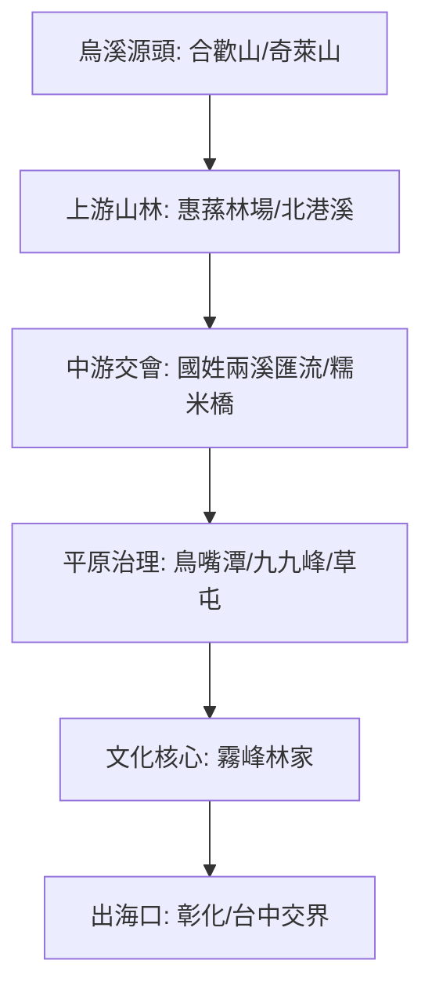

# 🌊 烏溪流域流浪與探索地圖 (Wuxi Wandering ISMap)

本計畫記錄了 2026 年 3 月在烏溪流域的流浪歷程，從公部門的治理視野（水規所、鳥嘴潭）到民間豪族的文化美學（霧峰林家），展現流域內多元的地景摺層。

## 🗺️ 流域導覽圖

## 📍 核心探索點位

### **第一階段：治理與人工湖 (草屯/霧峰)**
1. **[治理點]** [水利規劃分署展覽館](../features/20260310_Wuxi/20260310_水利規劃分署展覽館.md)
2. **[數據點]** [鳥嘴潭人工湖](../features/20260310_Wuxi/20260310_鳥嘴潭人工湖.md)
3. **[景觀點]** [九九峰氦氣園區](../features/20260310_Wuxi/20260310_九九峰氦氣園區.md)
4. **[生活點]** [草屯大觀市場](../features/20260310_Wuxi/20260310_草屯大觀市場.md)
5. **[歷史點]** [草屯老街](../features/20260310_Wuxi/20260310_草屯老街.md)
6. **[信仰點]** [草屯敦和宮](../features/20260310_Wuxi/20260310_草屯敦和宮.md)

### **第二階段：山林、圳道與古橋 (國姓/仁愛)**
7. **[山林點]** [惠蓀林場](../features/20260310_Wuxi/20260310_惠蓀林場.md)
8. **[引水點]** [國姓北圳水過橋](../features/20260310_Wuxi/20260310_國姓北圳水過橋.md)
9. **[工藝點]** [國姓糯米石橋](../features/20260310_Wuxi/20260310_國姓鄉北港溪糯米石橋.md)
10. **[脈絡點]** [國姓兩溪匯流處](../features/20260310_Wuxi/20260310_國姓兩溪匯流處.md)

### **第三階段：文化與美學 (霧峰)**
11. **[休閒點]** [霧峰健體中心](../features/20260310_Wuxi/20260310_霧峰健體中心.md)
12. **[核心點]** [霧峰林家大花廳](../features/20260310_Wuxi/20260310_霧峰林家大花廳.md)
13. **[文人點]** [霧峰林家頤圃](../features/20260310_Wuxi/20260310_霧峰林家頤圃.md)
14. **[園林點]** [霧峰林家萊園](../features/20260310_Wuxi/20260310_霧峰林家萊園.md)

---
*數位紀錄：流浪與探索 v2.1 (SOP 實測回補)*
