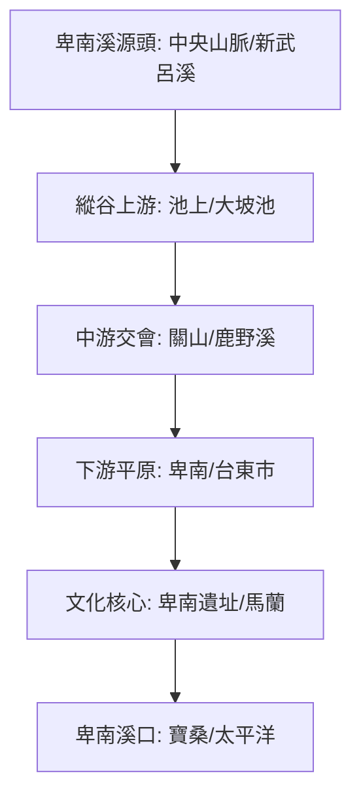

# 🌊 卑南溪流域探索地圖 (Beinan River ISMap)

本計畫記錄了 2026 年對卑南溪流域的探索規劃。從史前的卑南文化、清代的開山撫番南路終點，到現代的縱谷農耕地景，展現卑南溪作為台東生命之河的多重面貌。

## 🗺️ 流域導覽圖



## 📍 核心探索點位

### **第一階段：溪口地景與古王傳說 (台東市/卑南)**
1. **[歷史點]** [寶桑 (Baosang)](?map=20260316_beinan_river&feature=20260316_寶桑)
2. **[紀念點]** [昭忠祠 (Zhaozhong Shrine)](?map=20260316_beinan_river&feature=20260316_昭忠祠)
3. **[信仰點]** [馬蘭天后宮 (朝天宮)](?map=20260316_beinan_river&feature=20260316_馬蘭天后宮)
4. **[核心點]** [卑南遺址公園](?map=20260316_beinan_river&feature=20260316_卑南遺址公園)

### **第二階段：縱谷拓墾與水利 (預計後續厚化)**
*   (待後續實地探索並建立特徵檔)

---

## 🗺️ AI 深度探索 (Deep Research)
如果您擁有 Gemini Advanced 或其他 Deep Research 工具，可以複製以下 Prompt 進行深入探索：

```markdown
# Context
一份名為「卑南溪流域探索」的導覽路線，涵蓋台東平原到縱谷上游，涉及史前遺址、清代遷徙與現代水利。

# Task
針對以下維度進行深度分析：
1. **卑南王傳說與族群互動**: 卑南族與阿美族、卑南王對東部開發的影響？
2. **開山撫番南路**: 清代南路終點在卑南溪口的歷史意義？
3. **利吉層地質**: 卑南溪兩岸不同的地質構造（板塊交界）？
4. **現代農業**: 卑南溪水如何支撐池上米與台東釋迦的灌溉？
```

---

## 📥 資源下載
- [卑南溪探索 KML 資產包](../data/2026台灣河流探索/卑南溪/卑南溪.kml)
- [歷史文獻證據報告](../data/2026台灣河流探索/卑南溪/Historical_Evidence_Report.md)

---
*數位紀錄：2026台灣河流探索系列 - 卑南溪卷*
