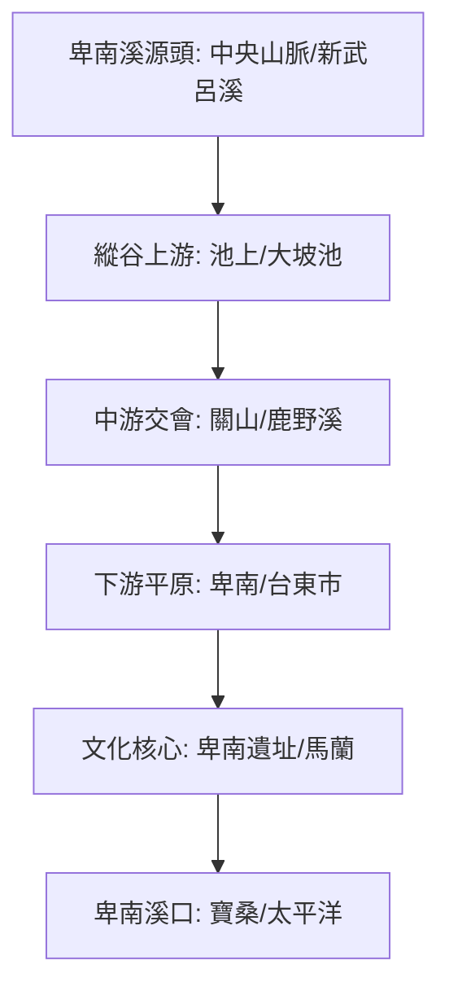

# 🌊 卑南溪流域探索地圖 (Beinan River ISMap)

本計畫記錄了 2026 年對卑南溪流域的探索規劃。從史前的卑南文化、清代的開山撫番南路終點，到現代的縱谷農耕地景，展現卑南溪作為台東生命之河的多重面貌。

## 🗺️ 流域導覽圖

## 📍 核心探索點位

### **第一階段：溪口地景與古王傳說 (台東市/卑南)**
1. **[歷史點]** [寶桑 (Baosang)](../features/20260316_卑南溪/20260316_寶桑.md)
2. **[紀念點]** [昭忠祠 (Zhaozhong Shrine)](../features/20260316_卑南溪/20260316_昭忠祠.md)
3. **[信仰點]** [馬蘭天后宮 (朝天宮)](../features/20260316_卑南溪/20260316_馬蘭天后宮.md)
4. **[核心點]** [卑南遺址公園](../features/20260316_卑南溪/20260316_卑南遺址公園.md)

### **第二階段：縱谷拓墾與水利 (預計後續厚化)**
*   (待後續實地探索並建立特徵檔)

---
*數位紀錄：2026台灣河流探索系列 - 卑南溪卷*
