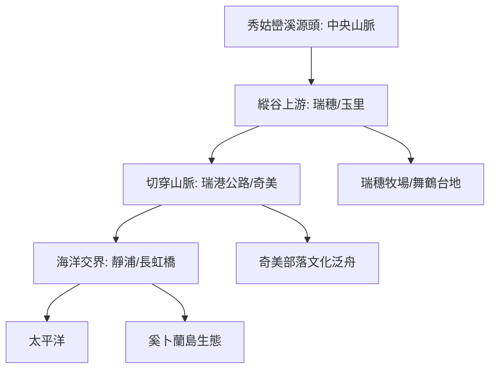

# 🌊 秀姑巒溪流域探索地圖 (Xiuguluan River ISMap)

本計畫記錄了 2026 年對秀姑巒溪流域的探索規劃。秀姑巒溪是台灣唯一切穿海岸山脈的河流，本環節聚焦於上游縱谷平原、中游峽谷部落與下游太平洋出海口的空間脈脈。

## 🗺️ 流域導覽圖



## 📍 核心探索點位

### **第一區：瑞穗與舞鶴台地 (縱谷北段)**
1. **[畜牧點]** [瑞穗牧場](?map=20260316_xiuguluan_river&feature=20260316_xiuguluan_瑞穗牧場)
2. **[畜牧點]** [吉蒸牧場](?map=20260316_xiuguluan_river&feature=20260316_xiuguluan_吉蒸牧場)
3. **[文化點]** [舞鶴觀光茶園](?map=20260316_xiuguluan_river&feature=20260316_xiuguluan_舞鶴觀光茶園)
4. **[遺址點]** [掃叭隧道](?map=20260316_xiuguluan_river&feature=20260315_掃叭隧道)

### **第二區：切穿海岸山脈 (峽谷與部落)**
5. **[核心點]** [瑞穗泛舟服務中心](?map=20260316_xiuguluan_river&feature=20260316_xiuguluan_瑞穗泛舟服務中心)
6. **[景觀點]** [瑞港公路觀景點](?map=20260316_xiuguluan_river&feature=20260316_xiuguluan_瑞港公路觀景點)
7. **[文化點]** [奇美部落](?map=20260316_xiuguluan_river&feature=20260316_xiuguluan_奇美部落)
8. **[地景點]** [秀姑漱玉](?map=20260316_xiuguluan_river&feature=20260316_xiuguluan_秀姑漱玉)

### **第三區：太平出海口 (豐濱/靜浦)**
9. **[地標點]** [長虹橋](?map=20260316_xiuguluan_river&feature=20260316_xiuguluan_長虹橋)
10. **[核心點]** [靜浦部落](?map=20260316_xiuguluan_river&feature=20260316_xiuguluan_靜浦部落)
11. **[生態點]** [奚卜蘭島](?map=20260316_xiuguluan_river&feature=20260316_xiuguluan_奚卜蘭島)

### **第四區：玉里縱谷與支流 (縱谷南段)**
12. **[交通點]** [玉里車站](?map=20260316_xiuguluan_river&feature=20260316_xiuguluan_玉里車站)
13. **[遺址點]** [玉里社殘蹟](?map=20260316_xiuguluan_river&feature=20260315_玉里社殘蹟)
14. **[景觀點]** [松浦天堂路](?map=20260316_xiuguluan_river&feature=20260316_xiuguluan_松浦天堂路)
15. **[親山點]** [瓦拉米步道口](?map=20260316_xiuguluan_river&feature=20260316_xiuguluan_瓦拉米步道口)
16. **[景觀點]** [赤柯山](?map=20260316_xiuguluan_river&feature=20260316_xiuguluan_赤柯山)

---

## 🗺️ AI 深度探索 (Deep Research)
如果您擁有 Gemini Advanced 或其他 Deep Research 工具，可以複製以下 Prompt 進行深入探索：

```markdown
# Context
一個關於秀姑巒溪流域的行程，涵蓋縱谷畜牧、峽谷文化泛舟與出海口生態。

# Task
請針對以下維度進行深度分析：
1. **阿美族與秀姑巒溪**: 奇美部落的傳統生活智慧如何反映在「Tatadok 文化泛舟」中？
2. **切穿山脈的地質奇蹟**: 秀姑巒溪如何能夠切穿海岸山脈？其地質演化過程？
3. **長虹橋與港口米**: 出海口地區的灌溉史與港口部落的農業發展。
4. **掃叭巨石文化**: 舞鶴台地的史前巨石與周邊卑南文化、長濱文化的關聯？
```

---

## 📥 資源下載
- [秀姑巒溪 Google My Maps 互動地圖](https://www.google.com/maps/d/edit?mid=17hhScs-HmTm50lLK25y941a4XAxHQ3U&usp=sharing)
- [秀姑巒溪探索 KML 資產包](../data/2026台灣河流探索/秀姑巒溪/秀姑巒溪.kml)

---
*數位紀錄：2026台灣河流探索系列 - 秀姑巒溪卷*
