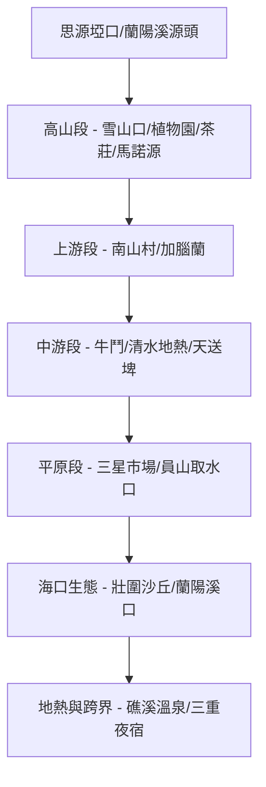

# 蘭陽溪流域分段探索：從雪山埡口到海口大縱走 (2026)

本專案採用**「垂直地景（Vertical Landscape）」**與**「物導向歷史（Object-Oriented History）」**的方法論，重新閱讀蘭陽溪流域的資源開墾、林業鐵道、高山規訓空間、氣候陰陽界，以及從海拔 2,000 公尺雪山登山口一路切降至太平洋海口的三河匯流生態，並在深夜跨越分水嶺進入台北盆地的史詩級全流域縱走。

---

## 🧩 模組化探索路徑 (Itinerary Modules)

### **Day 1：開墾地層與平原邊界 —— 水道與信仰**
- **核心物件**：員山取水口、東門夜市、吳沙故居。
- **考掘焦點**：水利灌溉系統如何將蠻荒之水轉化為平原白金，以及漢人開墾邊界的空間擴張。

### **Day 2：林業鐵道與感官地層 —— 索道與溫泉**
- **核心物件**：太平山蹦蹦車、茂興懷舊步道、鎮安宮（神社遺址）、見晴懷古步道、鳩之澤溫泉。
- **考掘焦點**：林業帝國如何透過鐵道與索道規訓高山，並透過鳩之澤地熱展現山區感官地層的身體經驗。

### **Day 3：垂直地景與權力網絡 —— 分水嶺與車宿**
- **核心物件**：三星市場、清水地熱、牛鬥觀景台（實測糾正 Google Maps 錯誤）、馬諾源（單一高麗菜地景）、南山村（派出所全景敞視與蒼蠅大軍）、思源埡口氣候分界線、武陵農場露營區。
- **考掘焦點**：氣候屏障的肉身實測，以及高山農業資本化與國家警備視線對原民部落空間的重組。

### **Day 4：源頭考掘、海口對位與跨界長征 —— 縱走完結**
- **核心物件**：雪山登山口、植物園、茶莊（工作小憩）、壯圍沙丘（黃聲遠清水模地景）、蘭陽溪口保護區（海邊無人小路）、礁溪春和浴池、三重夜宿點。
- **考掘焦點**：從源頭大水池下切至太平洋沙丘的河流完整命運，壯圍沙丘 AI 資訊滯後的「現地真理」反思，礁溪地熱感官的延續，以及深夜越嶺台北盆地跨越空間邊界的極限轉換。

---

## 🗺️ 景點 Feature 索引 (WikiLinks)

### 🌲 Day 2 林業與感官地景
- [[20260516_lanyang_maoxing_trail]] 茂興懷舊步道 (林業規訓)
- [[20260516_lanyang_zhenan_temple]] 太平山鎮安宮 (神社權力轉置)
- [[20260516_lanyang_jianqing_trail]] 見晴懷古步道 (林鐵殘骸)
- [[20260516_lanyang_jiuzhize_thermal]] 鳩之澤溫泉 (地熱感官地層)

### 🍉 Day 3 高山與分水嶺地景
- [[20260517_lanyang_sanshing_market]] 三星公有零售市場 (大廚海鮮粥)
- [[20260517_lanyang_lanyang_icebar]] 蘭陽冰廠金棗冰棒 (電力副產品)
- [[20260517_lanyang_qingshui_geothermal]] 清水地熱公園 (地熱採買智慧)
- [[20260517_lanyang_niudou_observatory]] 牛鬥橋遠眺景觀台 (Google 地圖資訊糾錯)
- [[20260324_lanyang_manoyuan]] 馬諾源 (Mnoyan) (高麗菜單一地景)
- [[20260324_lanyang_nanshan_pyanan]] 南山 (Pyanan) (全景敞視監控與蒼蠅)
- [[20260324_lanyang_siyuan_watershed]] 思源埡口 (大分水嶺與氣候傳送門)
- [[20260517_lanyang_wuling_camping]] 武陵農場露營區 (平日車宿與光害星空)
- [[20260517_lanyang_salmon_center]] 台灣櫻花鉤吻鮭生態中心 (孑遺國寶魚)
- [[20260517_lanyang_newtons_apple]] 武陵農場牛頓蘋果樹 (科學地景流轉)

### 🌊 Day 4 高山源頭、海口與跨界地景
- [[20260518_lanyang_wuling_bell]] 武陵農場祈福平安鐘 (心靈寧靜儀式)
- [[20260518_lanyang_wuling_botanical]] 武陵農場植物園 (樹木與節氣美學)
- [[20260518_lanyang_wuling_trailhead]] 武陵雪山登山口 (荒野與墾殖實體邊界)
- [[20260518_lanyang_wuling_teahouse]] 武陵茶莊 (山林與茶香辦公空間)
- [[20260518_lanyang_zhuangwei_dunes]] 壯圍沙丘生態園區 (黃聲遠地景與現地真理)
- [[20260518_lanyang_river_mouth]] 蘭陽溪口水鳥保護區 (大河入海與海邊窄路)
- [[20260518_lanyang_jiaoxi_chunhe]] 礁溪春和日式溫泉 (深入巷弄大眾池)
- [[20260518_lanyang_sanchong_stay]] 三重夜宿點 (避開塞車跨界夜宿)
- [[20260324_lanyang_watermelon_fields]] 蘭陽溪河床西瓜地景 (板岩保溫地質)
- [[20260324_lanyang_yuanshan_intake]] 員山取水口 (天然自湧泉)
