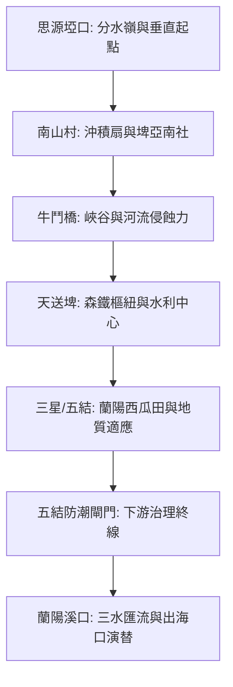

# 蘭陽溪流域探索：垂直地景與權力空間的深度考掘

蘭陽溪不僅是地理上雪山與中央山脈的分界，更是台灣東北部最重要的生命線。本計畫應用『幾何骨架化河道重建』與『Google Maps API 精指定位』，結合地質與歷史文本，重新閱讀這條河流。

## 🗺️ 探索架構 (ISMap)

## 📍 核心點位 (Features)

> [!TIP]
> 點擊下列連結可在地圖中快速跳轉至對應景點。

- **[南山村 (埤亞南社) (?map=20260324_lanyang_exploration&feature=20260324_lanyang_nanshan_pyanan)]** - 觀察「扇端湧泉」與強制遷徙史。
- **[思源埡口 (?map=20260324_lanyang_exploration&feature=20260324_lanyang_siyuan_watershed)]** - 兩大山脈的分野點。
- **[天送埤車站 (?map=20260324_lanyang_exploration&feature=20260324_lanyang_tiansongpi)]** - 太平山森鐵與水利樞紐。
- **[蘭陽西瓜田 (?map=20260324_lanyang_exploration&feature=20260324_lanyang_watermelon_fields)]** - 砂礫土地質適應之典範。
- **[五結防潮閘門 (?map=20260324_lanyang_exploration&feature=20260324_lanyang_wujie_gate)]** - 守護蘭陽平原深層農業的末端防線。
- **[蘭陽發電廠 (?map=20260324_lanyang_exploration&feature=20260324_lanyang_power_plant)]** - 流域開發的最早能源樞紐。

## 🧠 AI 深度研究提示 (Deep Research Prompts)

如果您想進一步挖掘蘭陽溪的秘密，路徑如下：
> 「分析蘭陽溪板岩沖積扇地質如何促成『南山高冷蔬菜』與『蘭陽西瓜』兩大極端產業，並探討流域開發中的泰雅族權力重構歷程。」

## 📥 資源下載
- [下載整合性 KML 資產 (蘭陽溪.kml)](file:///Users/wuulong/github/bmad-pa/events/notes/wuulong-notes-blog/static/walkgis_prj/data/2026台灣河流探索/蘭陽溪/蘭陽溪.kml)
- [參考：蘭陽溪流域深度研究計畫](file:///Users/wuulong/github/bmad-pa/events/AIBooks/RiverExploration/Research/2.%E8%98%AD%E9%99%BD%E6%BA%AA%E6%B5%81%E5%9F%9F%E6%B7%B1%E5%BA%A6%E7%A0%94%E7%A9%B6%E8%A8%88%E7%95%AB.md)

---
*Generated by River Exploration Skill (Upgrade v2026)*
