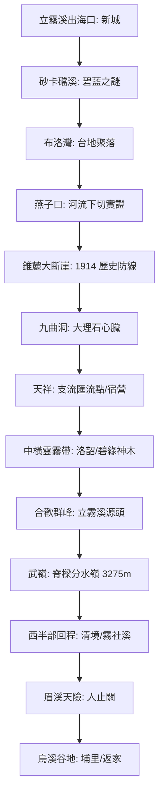

# 立霧溪流域探索：地貌、工程與歷史的交錯實錄

立霧溪不僅是台灣造山運動的縮影，更是 1914 年太魯閣戰役與中橫公路開鑿的歷史現場。本計畫透過骨架化技術補全了河道網路，並使用 Google Maps API 進行精確定位。

## 🗺️ 探索架構 (ISMap)



## 📍 關鍵景點 (Features)

> [!TIP]
> 點擊下列連結可在地圖中快速切換至對應景點。

- **[新城神社舊址 (?map=20260324_liwu_river&feature=20260324_liwu_11_xincheng_shrine)]** - 歷史的起點。
- **[砂卡礑步道 (?map=20260324_liwu_river&feature=20260324_liwu_04_shakadang_ent)]** - 碧藍溪色與細極岩粉。
- **[燕子口 (?map=20260324_liwu_river&feature=20260324_liwu_01_swallow)]** - 立霧溪這把「液態之刃」的傑作。
- **[靳珩橋 (?map=20260324_liwu_river&feature=20260324_liwu_03_jinheng)]** - 此路英雄血淚史之紀念。
- **[錐麓古道入口 (?map=20260324_liwu_river&feature=20260324_liwu_10_zhuilu_ent)]** - 太魯閣族防堵日本兩萬大軍的防線。
- **[九曲洞 (?map=20260324_liwu_river&feature=20260324_liwu_02_nine_turns)]** - 世界級大理石峽谷核心。
- **[武嶺分水嶺 (?map=20260324_liwu_river&feature=20260324_liwu_12_wuling)]** - 太平洋與台灣海峽水系的主脊骨架。
- **[人止關 (?map=20260324_liwu_river&feature=20260324_liwu_13_renzhipass)]** - 眉溪下切峽谷與原漢防線。

## 🗺️ AI 深度探索 (Deep Research)
如果您擁有 Gemini Advanced 或其他 Deep Research 工具，可以複製以下結構化 Prompt，對本立霧溪探索地圖進行深度的歷史、地質與文史探討：

```markdown
# Context
一份名為「立霧溪探索計畫：橫跨太魯閣大理石峽谷的生命之刃」的導覽路線，串連太魯閣口出海口至 3275m 的中央山脈脊樑（武嶺分水嶺）與西側眉溪、烏溪流域。

# Task
請針對以下景點列表，進行 Deep Research，挖掘背後的「地質力學（下切速率與向源搶水）」、「1914 戰役文史」與「車宿補給實踐」。

**景點列表：**
1. 新城神社舊址 (起點，原漢與日治歷史空間演替)
2. 立霧發電廠 / 溪畔壩 (立霧溪水力發電史)
3. 砂卡礑步道入口 (綠松石溪流與褶皺地貌)
4. 布洛灣 (高位河階台地聚落)
5. 燕子口 (噴砂磨蝕壺穴與年下切 26mm 實證)
6. 靳珩橋 (中橫修築工兵與血淚英雄史)
7. 錐麓古道入口 (1914 太魯閣戰役垂直大斷崖防線)
8. 九曲洞 (大理石流變與地質褶皺美學)
9. 水急 (立霧溪急流衝擊地貌)
10. 天祥 (塔比多部落，昔日內太魯閣抗日指揮中心)
11. 長春祠 (湧泉瀑布地貌與築路英魂)
12. 武嶺分水嶺 (3275m 太平洋與台灣海峽水系分水嶺，搶水戰爭動態)
13. 人止關 (眉溪下切硬質砂岩一線天峽谷，清代原漢隘勇線天險)

# Requirements (請分析以下維度)
1. **地質營力與搶水動態**: 分析立霧溪年下切速率 26mm/yr 的物理原因？站在武嶺分水嶺，如何觀察立霧溪對西側濁水溪霧社溪上游的向源侵蝕搶水戰爭？
2. **文史抗爭與中橫開拓**: 1914 年太魯閣戰役中，太魯閣族人如何利用燕子口、九曲洞、錐麓斷崖地形防守？天祥 (塔比多) 與人止關在戰略上的咽喉地位？
3. **車宿與探索實踐**: 分析合流露營區、慈恩停車場、關原加油站、昆陽停車場在海拔氣溫、風向、水源公廁等維度的車宿條件，給出五天探索的車宿生存指引。
```

---

## 📊 用 Dynamic View 視覺化
如果您已經利用上述 Prompt 產出了 Deep Research Report，您可以利用 Dynamic View 將其「結構化與視覺化」，快速生成圖表：

1. **生成歷史與工程時間軸 (Timeline View)**
   *   **Prompt**：「基於這份立霧溪研究報告，請以時間軸視圖呈現這條路線的關鍵歷史里程碑（如 1902 人止關之役、1914 太魯閣戰役、1950 中橫公路開闢、近期太魯閣地質治理等）。」
2. **生成地質與文史差異表 (Comparison Table View)**
   *   **Prompt**：「請建立一個比較表格，分析這 13 個景點的『主導營力/歷史事件』。欄位應包含：景點名稱、主要地質特徵（如大理石下切/砂頁岩一線天）、關鍵歷史文史事件、目前車宿便利度評分。」
3. **生成五天車宿行程卡片 (Itinerary Card View)**
   *   **Prompt**：「將報告中關於『合流、慈恩、關原、昆陽』的車宿點優劣評估，轉換為精美的行程卡片視圖。請按天分組，並標註『溫度指數』與『公廁便利度』。」

---

### 📋 地圖關聯之完整 POIs 清單 (Complete POI List for AI Context)
本探索地圖共包含以下 13 個核心地理特徵點位，可供 AI 進行深度時空對合研究：
1.  **[新城神社舊址](file:///Users/wuulong/github/bmad-pa/events/notes/wuulong-notes-blog/static/walkgis_prj/features/20260324_liwu_11_xincheng_shrine.md)** - ID: `20260324_liwu_11_xincheng_shrine` (文史與民族空間演替)
2.  **[立霧發電廠](file:///Users/wuulong/github/bmad-pa/events/notes/wuulong-notes-blog/static/walkgis_prj/features/20260324_liwu_09_power_plant.md)** - ID: `20260324_liwu_09_power_plant` (中橫水力發電開發)
3.  **[砂卡礑步道入口](file:///Users/wuulong/github/bmad-pa/events/notes/wuulong-notes-blog/static/walkgis_prj/features/20260324_liwu_04_shakadang_ent.md)** - ID: `20260324_liwu_04_shakadang_ent` (綠松石溪流與褶皺地景)
4.  **[布洛灣](file:///Users/wuulong/github/bmad-pa/events/notes/wuulong-notes-blog/static/walkgis_prj/features/20260324_liwu_06_bulowan.md)** - ID: `20260324_liwu_06_bulowan` (高位河階台地地形)
5.  **[燕子口](file:///Users/wuulong/github/bmad-pa/events/notes/wuulong-notes-blog/static/walkgis_prj/features/20260324_liwu_01_swallow.md)** - ID: `20260324_liwu_01_swallow` (極速下切壺穴實證)
6.  **[靳珩橋](file:///Users/wuulong/github/bmad-pa/events/notes/wuulong-notes-blog/static/walkgis_prj/features/20260324_liwu_03_jinheng.md)** - ID: `20260324_liwu_03_jinheng` (中橫開拓與工兵血淚)
7.  **[錐麓古道入口](file:///Users/wuulong/github/bmad-pa/events/notes/wuulong-notes-blog/static/walkgis_prj/features/20260324_liwu_10_zhuilu_ent.md)** - ID: `20260324_liwu_10_zhuilu_ent` (1914 年太魯閣戰役大斷崖防線)
8.  **[九曲洞](file:///Users/wuulong/github/bmad-pa/events/notes/wuulong-notes-blog/static/walkgis_prj/features/20260324_liwu_02_nine_turns.md)** - ID: `20260324_liwu_02_nine_turns` (大理岩峽谷與流變地質美學)
9.  **[水急](file:///Users/wuulong/github/bmad-pa/events/notes/wuulong-notes-blog/static/walkgis_prj/features/20260324_liwu_05_swiji.md)** - ID: `20260324_liwu_05_swiji` (立霧溪主流急流衝擊地貌)
10. **[天祥](file:///Users/wuulong/github/bmad-pa/events/notes/wuulong-notes-blog/static/walkgis_prj/features/20260324_liwu_07_tianxiang.md)** - ID: `20260324_liwu_07_tianxiang` (塔比多部落/主支流匯流樞紐)
11. **[長春祠](file:///Users/wuulong/github/bmad-pa/events/notes/wuulong-notes-blog/static/walkgis_prj/features/20260324_liwu_08_eternal_spring.md)** - ID: `20260324_liwu_08_eternal_spring` (湧泉瀑布與築路英魂)
12. **[武嶺分水嶺](file:///Users/wuulong/github/bmad-pa/events/notes/wuulong-notes-blog/static/walkgis_prj/features/20260324_liwu_12_wuling.md)** - ID: `20260324_liwu_12_wuling` (3275m 太平洋與台灣海峽主脊分水嶺/搶水地質)
13. **[人止關](file:///Users/wuulong/github/bmad-pa/events/notes/wuulong-notes-blog/static/walkgis_prj/features/20260324_liwu_13_renzhipass.md)** - ID: `20260324_liwu_13_renzhipass` (眉溪下切近垂直峽谷/原漢歷史天險防線)

## 📥 資源下載
- [下載整合性 KML 資產 (立霧溪.kml)](file:///Users/wuulong/github/bmad-pa/events/notes/wuulong-notes-blog/static/walkgis_prj/data/2026台灣河流探索/立霧溪/立霧溪.kml)
- [參考：立霧溪流域深度研究報告 (PDF 摘要)](file:///Users/wuulong/github/bmad-pa/events/AIBooks/RiverExploration/Research/9.%E7%AB%8B%E9%9C%A7%E6%BA%AA%E6%B5%81%E5%9F%9F%E6%B7%B1%E5%BA%A6%E7%A0%94%E7%A9%B6%E5%A0%B1%E5%91%8A.md)

---
*Generated by Antigravity River Exploration Skill*
