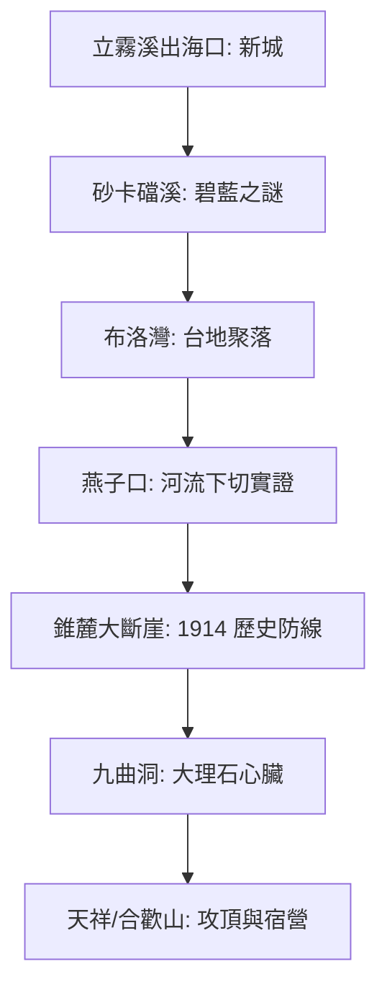

# 立霧溪流域探索：地貌、工程與歷史的交錯實錄

立霧溪不僅是台灣造山運動的縮影，更是 1914 年太魯閣戰役與中橫公路開鑿的歷史現場。本計畫透過骨架化技術補全了河道網路，並使用 Google Maps API 進行精確定位。

## 🗺️ 探索架構 (ISMap)

## 📍 關鍵景點 (Features)

> [!TIP]
> 點擊下列連結可在地圖中快速切換至對應景點。

- **[新城神社舊址 (?map=20260324_liwu_river&feature=liwu_11_xincheng_shrine)]** - 歷史的起點。
- **[砂卡礑步道 (?map=20260324_liwu_river&feature=liwu_04_shakadang_ent)]** - 碧藍溪色與細極岩粉。
- **[燕子口 (?map=20260324_liwu_river&feature=liwu_01_swallow)]** - 立霧溪這把「液態之刃」的傑作。
- **[靳珩橋 (?map=20260324_liwu_river&feature=liwu_03_jinheng)]** - 此路英雄血淚史之紀念。
- **[錐麓古道入口 (?map=20260324_liwu_river&feature=liwu_10_zhuilu_ent)]** - 太魯閣族防堵日本兩萬大軍的防線。
- **[九曲洞 (?map=20260324_liwu_river&feature=liwu_02_nine_turns)]** - 世界級大理石峽谷核心。

## 🧠 AI 深度研究提示 (Deep Research Prompts)

如果您想進一步挖掘立霧溪的秘密，請嘗試輸入以下指令至 AI：
> 「分析立霧溪全新世下切速率 26mm/yr 與台灣造山運動中板塊抬升速率的耦合關係，並探討這對台8線邊坡穩定性的長期影響。」

## 📥 資源下載
- [下載整合性 KML 資產 (立霧溪.kml)](file:///Users/wuulong/github/bmad-pa/events/notes/wuulong-notes-blog/static/walkgis_prj/data/2026台灣河流探索/立霧溪/立霧溪.kml)
- [參考：立霧溪流域深度研究報告 (PDF 摘要)](file:///Users/wuulong/github/bmad-pa/events/AIBooks/RiverExploration/Research/9.%E7%AB%8B%E9%9C%A7%E6%BA%AA%E6%B5%81%E5%9F%9F%E6%B7%B1%E5%BA%A6%E7%A0%94%E7%A9%B6%E5%A0%B1%E5%91%8A.md)

---
*Generated by Antigravity River Exploration Skill*
