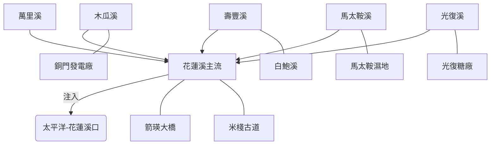

# 2026 花蓮溪流域探索計畫

- **互動地圖 (Google My Maps)**：[2026台灣河流探索-花蓮溪](https://www.google.com/maps/d/edit?mid=1FjTWECjGJk5U7GCOCfi2I5pb4AeeOxI&usp=sharing)
- **空間資產 (KML)**：[2026_hualien_river_full.kml](../data/2026_hualien_river_full.kml)

展示花蓮溪流域從卑南大斷層、縱谷沖積扇到河川襲奪所形成的地質脈絡，以及阿美族與漢人開發的人文地景。

## 🗺️ AI 深度探索 (Deep Research)
如果您擁有 Gemini Advanced 或其他 Deep Research 工具，可以複製以下 Prompt：

```markdown
# Context
一個名為「花蓮溪流域探索計畫」的導覽路徑，涵蓋花蓮溪主流、木瓜溪與馬太鞍溪。

# Task
請針對以下景點列表進行 Deep Research，挖掘背後的「水理邏輯」、「文史深度」與「地脈故事」。

**景點列表：**
1. 花蓮溪口 (七七高地，觀察斷層與出海口)
2. 馬太鞍濕地 (阿美族巴拉告生態捕魚與底泥文化)
3. 銅門發電廠 (木瓜溪水力開發與隧道工程)
4. 米棧古道 (日治時期挑夫文化與溪口對位)
5. 箭瑛大橋 (鳳林精神人文地景)
6. 白鮑溪 (豐田玉產區與親水工程)

# Requirements
1. **地質與演化**: 分析花蓮溪襲奪與卑南溪的對抗關係，以及縱谷地理對族群遷徙的屏障作用。
2. **水利與電力**: 詳述東部發電廠系統（銅門、初英、龍澗）在台灣工商業早期開發史的戰略地位。
3. **民族與社會**: 探討馬太鞍、太巴塱與光復地區的族群交會、糖業歷史與當代生態農法的轉型。
4. **必看細節**: 提供 3 個具備「河川簽名 (River Signature)」特徵、但一般觀光客會漏掉的隱藏觀察點（例如：特定的引水隧道出口或古道殘跡）。
```

## 📊 用 Dynamic View 視覺化建議
您可以將研究得到的文本透過 Dynamic View 進行以下呈現：
- **時間軸**：呈現木瓜溪流域電廠群的建設序列與地震復建史。
- **比較表**：對比馬太鞍濕地的傳統 Palakaw 工法與現代混凝土排水溝的生態差異。
- **卡片視圖**：整理「米棧古道」在花蓮溪物流體系中（陸運 vs 水運）的角色切換。

## 📍 景點列表 (Spot List)
- [花蓮溪口 (七七高地)](?map=20260427_hualien_river_exploration&feature=20260427_hualien_溪口)
- [馬太鞍濕地 (Palakaw)](?map=20260427_hualien_river_exploration&feature=20260427_hualien_馬太鞍溼地休閒農業區_生態園區_特色遊程_食農教育)
- [米棧古道 (挑夫辦公室)](?map=20260427_hualien_river_exploration&feature=20260427_hualien_米棧古道_辦公室)
- [箭瑛大橋](?map=20260427_hualien_river_exploration&feature=20260427_hualien_箭瑛大橋)
- [銅門發電廠](?map=20260427_hualien_river_exploration&feature=20260427_hualien_銅門發電廠)
- [初英發電廠](?map=20260427_hualien_river_exploration&feature=20260427_hualien_台灣電力公司_東部發電廠初英機組)
- [花蓮觀光糖廠](?map=20260427_hualien_river_exploration&feature=20260427_hualien_花蓮觀光糖廠)
- [白鮑溪戲水區](?map=20260427_hualien_river_exploration&feature=20260427_hualien_白鮑溪戲水區)

---
*Created by Antigravity WalkGIS Manager*
