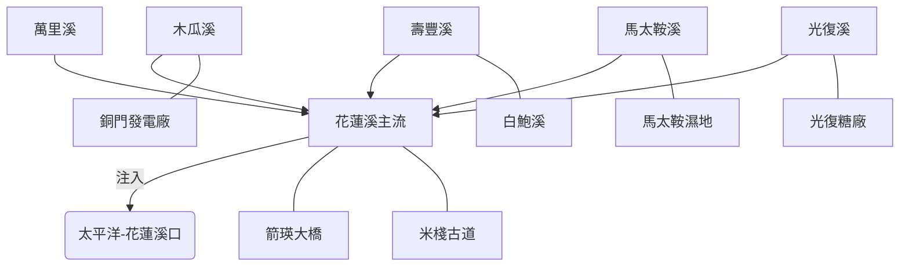

# 花蓮溪流域探索計畫

## 📐 流域邏輯架構 (Basin Architecture)

## 🛠 數位資產 (Digital Assets)
- **KML 軌跡**：[2026_hualien_river_full.kml](../data/2026_hualien_river_full.kml)
- **互動地圖**：[Google My Maps](https://www.google.com/maps/d/edit?mid=1FjTWECjGJk5U7GCOCfi2I5pb4AeeOxI&usp=sharing)

## 📌 景點索引 (Feature Index)
- [花蓮溪口](?map=20260427_hualien_river_exploration&feature=20260427_hualien_溪口)
- [馬太鞍濕地](?map=20260427_hualien_river_exploration&feature=20260427_hualien_馬太鞍溼地休閒農業區_生態園區_特色遊程_食農教育)
- [箭瑛大橋](?map=20260427_hualien_river_exploration&feature=20260427_hualien_箭瑛大橋)
- [米棧古道](?map=20260427_hualien_river_exploration&feature=20260427_hualien_米棧古道_辦公室)

---
*Created by Antigravity WalkGIS Manager*
