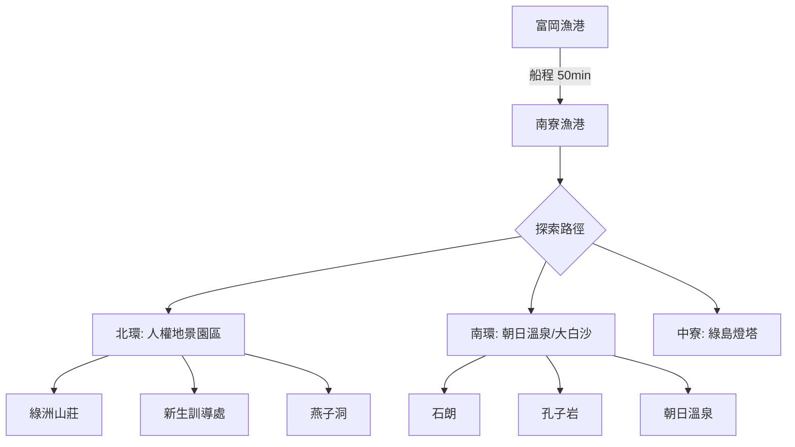

# 2026 綠島：黑潮中尋找地景的邊界

綠島（火燒島）不僅是觀光勝地，更是一座活生生的地質實驗室與歷史博物館。本圖資整合了綠島從 200 萬年前火山噴發至今的演化脈絡。

## 💧 島嶼水理與地質 (Project Context)
- **核心地質**: 北呂宋火山島弧，主要由安山岩與火山碎屑岩構成。
- **水理特徵**: 無大型河流，但發達的海蝕平台（大白沙、牛頭山）展示了黑潮與太平洋湧浪的「海岸流域」侵蝕力量。
- **熱動力**: 朝日海底溫泉為全球罕見，受後火山餘熱與地底斷層海水循環驅動。

## 📥 資源下載
- **[綠島（火燒島）全方位厚數據研究：地景地圖採集與文化層累分析報告 (Google Docs)](https://docs.google.com/document/d/1zb6OQPQKm3IzS7lP4_DtxW9LzlCD7hvIXlIDlJphTvA/edit?tab=t.0)**

## 🗺️ AI 深度探索 (Deep Research)
如果您擁有 Gemini Advanced 或其他 Deep Research 工具，可以複製以下 Prompt 進行探索：

```markdown
# Context
綠島（火燒島）2D1N 深度探勘。聚焦火成岩、航海歷史、白色恐怖不義遺址。

# Task
請針對以下景點列表進行 Deep Research，挖掘背後的「歷史深度」、「生活溫度」與「在地美食」。

**景點列表：**
1. 綠島燈塔 (胡佛號事件)
2. 綠洲山莊 (八卦樓)
3. 觀音洞 (地貌信仰)
4. 朝日溫泉 (海底湧泉)
5. 柚子湖遺址 (南島文化)

# Requirements
1. **地質與工程脈絡**: 火山噴發與地層抬升的細節。
2. **在地文化與生態**: 觀音洞的洞穴崇拜起源、梅花鹿引進史。
3. **必吃在地美食**: 海草冰、羊肉爐、綠島傳統芡粿。
```

## 📊 景點 Feature 索引
- [綠島燈塔](?map=2026_green_island_exploration&feature=20260417_ludao_01) - 1937 胡佛總統號海難義舉紀念。
- [將軍岩](?map=2026_green_island_exploration&feature=20260417_ludao_02) - 集塊岩海蝕柱地標。
- [觀音洞](?map=2026_green_island_exploration&feature=20260417_ludao_03) - 綠島信仰核心，石灰岩溶蝕奇觀。
- [新生訓導處遺址](?map=2026_green_island_exploration&feature=20260417_ludao_04) - 1950s 勞動改造與克難房。
- [綠洲山莊 (八卦樓)](?map=2026_green_island_exploration&feature=20260417_ludao_05) - 高度戒備監獄，全景監控空間。
- [朝日溫泉](?map=2026_green_island_exploration&feature=20260417_ludao_06) - 世界級海底溫泉湧出點。
- [油子湖 (遺址區)](?map=2026_green_island_exploration&feature=20260417_ludao_07) - 3,000 年史前聚落與咾咕石房。
- [牛頭山草原](?map=2026_green_island_exploration&feature=20260417_ludao_08) - 高位隆起海蝕平台。
- [大白沙平台](?map=2026_green_island_exploration&feature=20260417_ludao_09) - 珊瑚礁多樣性與貝殼砂。
- [燕子洞](?map=2026_green_island_exploration&feature=20260417_ludao_10) - 傳說中的刑場，壯麗海蝕拱門。
- [人權紀念碑](?map=2026_green_island_exploration&feature=20260417_ludao_11) - 感知歷史創傷的「垂淚碑」。
- [孔子岩](?map=2026_green_island_exploration&feature=20260417_ludao_12) - 海蝕塑造的人形奇岩。
- [柚子湖彎弓洞](?map=2026_green_island_exploration&feature=20260417_ludao_13) - 綠島最大天然海蝕拱門。
- [中寮國民小學舊址](?map=2026_green_island_exploration&feature=20260417_ludao_14) - 歷史外交與災難安置點。
- [石朗潛水區](?map=2026_green_island_exploration&feature=20260417_ludao_15) - 海下郵筒與千年大香菇珊瑚。
