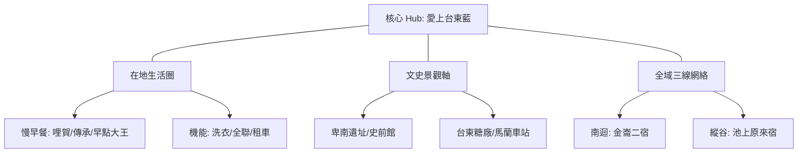

# 🏨 2026 台東市旅宿業者賦能實踐地圖 (ISMap)

本案展示如何落實「軟體定義地圖 (SDM)」與「地理編碼實戰」。以「愛上台東藍民宿」為樞紐，連結三條主題路徑與周邊 30+ 個生活採集點。

## 🗺️ 空間脈絡架構 (Mermaid View)

## 🧠 AI 深度探索 (Deep Research) Prompt
> [!TIP]
> 業者可現場複製此 Prompt 於手機：
> 「作為台東當地的旅宿經理，請根據本圖資中的 38 個實例點位：愛上台東藍民宿、老船長、打個蛋、原來宿、七里坡紅藜、三一牛肉麵、人x人、傳承手工蛋餅、卑南遺址、台東糖廠冰店、聖母健康農莊、哩賀早餐、回家食間、史前館、大武之心、宋媽媽海產、宏昌客家菜、寶桑小吃、彭8草原廚房、成功豆花、旗遇海味、明奎早餐、明隆春捲、福原豆腐、深黑義法、特選海產、王記鬼頭刀、石老爺臭豆腐、米舖客家小館、花里岸、草民、萬林肉粽、賞味家、阿榮蘿蔔糕、響羅雷、馬蘭市場野菜街、黃記肉粽、鼎倫牛肉麵。
> 
> 請為一對尋求深度文化的夫妻規劃一個『地解碼』的一日行程，並指出哪些點位結合了台東的『資訊厚度』與『慢遊感』。」

## 🔍 景點 Feature 索引
以下為本圖資集包含之核心點位，點擊名稱可開啟 WalkGIS 深度解說。

### 🛌 旅宿種子網絡
*   [愛上台東藍電梯民宿](?map=2026_taitung_city_enablement_case&feature=20260416_愛上台東藍民宿)
*   [老船長溫泉民宿](?map=2026_taitung_city_enablement_case&feature=20260416_老船長溫泉民宿)
*   [打個蛋海旅](?map=2026_taitung_city_enablement_case&feature=20260416_打個蛋海旅)
*   [原來宿](?map=2026_taitung_city_enablement_case&feature=20260416_池上福原豆腐店)

### 🥐 在地早味
*   [哩賀早餐店](?map=2026_taitung_city_enablement_case&feature=20260416_哩賀早餐店)
*   [傳承手工蛋餅坊早餐](?map=2026_taitung_city_enablement_case&feature=20260416_傳承手工蛋餅坊早餐店)
*   [明奎早餐店](?map=2026_taitung_city_enablement_case&feature=20260416_明奎早餐店)

### 🗿 文化與生活
*   [國立臺灣史前文化博物館](?map=2026_taitung_city_enablement_case&feature=20260416_國立臺灣史前文化博物館_National_Museum_of_Prehistory)
*   [卑南遺址公園](?map=2026_taitung_city_enablement_case&feature=20260416_卑南遺址公園_Peinan_Site_Park_(Peinan_archaeological_park))
*   [台東糖廠冰店](?map=2026_taitung_city_enablement_case&feature=20260416_台東糖廠冰店)

---
*數位資產支援：GIS Data Manager Skill | Standard v1.0*
