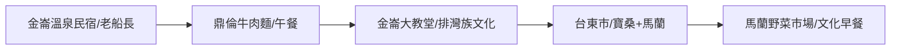

# 🏨 2026台東旅宿業者賦能地圖 (Taitung Tourism Enablement)

本計畫是針對「AI 賦能時代的台東探索」課程所開發的實踐案例（TA5）。我們將台東的重要旅宿、美食與文史節點對位，展示如何透過數位工具將「住宿」轉化為「深度探索體驗」。

## 📍 賦能導覽路徑

## 📜 賦能特徵點清單 (Featured POIs)

### 1. 金崙生活圈 (Jinlun Hub)
*   **[旅宿]** [老船長溫泉民宿](?map=2026_taitung_tourism_enablement&feature=20260416_老船長溫泉民宿)
*   **[美食]** [鼎倫牛肉麵](?map=2026_taitung_tourism_enablement&feature=20260416_鼎倫牛肉麵)

### 2. 城市文史圈 (City & Culture)
*   **[文化]** [馬蘭市場阿美族野菜街](?map=2026_taitung_tourism_enablement&feature=20260416_馬蘭市場野菜街)
*   **[歷史]** 寶桑舊城區 (待厚化)

---

## 🛠️ 業者如何使用此地圖？ (How-to for TA5)
1. **濾鏡轉出**：使用「NotebookLM 匯出工具」，將上方的 POI 資訊轉化為給客人的行程介紹。
2. **現地更新**：業者可以自行使用 WalkGIS 新增「私藏景點」，並分享座標給旅客。
3. **AI 解碼**：旅客抵達標註點後，可直接透過本系統提供的「AI 深度故事」進行自助導覽。

---
*數位紀錄：2026台東課程實踐案例分享*
