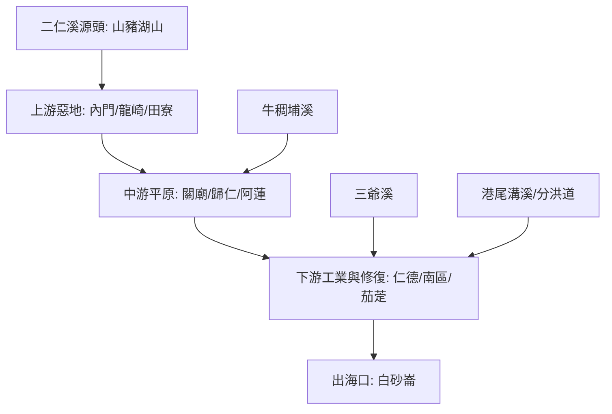

# 🌊 二仁溪流域探索地圖 (Erren River ISMap)

本計畫結合《南部紋理》8.3 節「環境博物館」概念，將二仁溪視為一個動態的環境實驗場。

## 🗺️ 流域導覽圖

## 📍 核心探索點位

- [二仁溪源頭 (山豬湖山)](?map=2026xxxx_erren_exploration&feature=2026xxxx_erren_source)
- [308高地 (展望點)](?map=2026xxxx_erren_exploration&feature=2026xxxx_erren_308_high)
- [田寮月世界 (地質點)](?map=2026xxxx_erren_exploration&feature=2026xxxx_erren_moon_world)
- [阿蓮大曲流 (曲流點)](?map=2026xxxx_erren_exploration&feature=2026xxxx_erren_fuxing_meander)
- [二仁溪綠堤 (藝術牆)](?map=2026xxxx_erren_exploration&feature=2026xxxx_erren_mosaic_wall)
- [港尾溝分洪道 (治理點)](?map=2026xxxx_erren_exploration&feature=2026xxxx_erren_gangweigou_diversion)
- [雙博物館自行車道 (文化徑)](?map=2026xxxx_erren_exploration&feature=2026xxxx_erren_double_museum_point)
- [仁德滯洪池 (教育點)](?map=2026xxxx_erren_exploration&feature=2026xxxx_erren_rende_pond)
- [跨域治理地標 (南萣橋旁)](?map=2026xxxx_erren_exploration&feature=2026xxxx_erren_governance_sign)
- [南萣橋遺址 (歷史點)](?map=2026xxxx_erren_exploration&feature=2026xxxx_erren_nanding_legacy)
- [茄萣舢筏協會 (復育點)](?map=2026xxxx_erren_exploration&feature=2026xxxx_erren_sampan_assoc)

## 🚲 區域串聯與上位計畫 (Regional Context)

- **雙博物館自行車道**：串聯二仁溪堤頂，連接奇美博物館與史博館，是流域轉型為文化廊道的關鍵徑路。
*   **跨域治理典範**：由台南、高雄與中央環境部共同打造的「二仁溪污染整治願景」。
*   **相關地圖專案**：
    *   [山海圳國家綠道 (?map=20260202_shanhaijun)](?map=20260202_shanhaijun) - 此專案在南端與二仁溪治理空間高度關聯。

## 📡 數位資源
- [GoogleMyMap:2026流域探索_二仁溪](https://www.google.com/maps/d/edit?mid=1pU9vWgJnr_Bccf_zL6osk0GTT-SdaBc&usp=sharing)
- [哈爸筆記：2026台灣河流探索-二仁溪](https://wuulong.github.io/wuulong-notes-blog/series/2026%E5%8F%B0%E7%81%A3%E6%B2%B3%E6%B5%81%E6%8E%A2%E7%B4%A2-%E4%BA%8C%E4%BB%81%E6%BA%AA/)