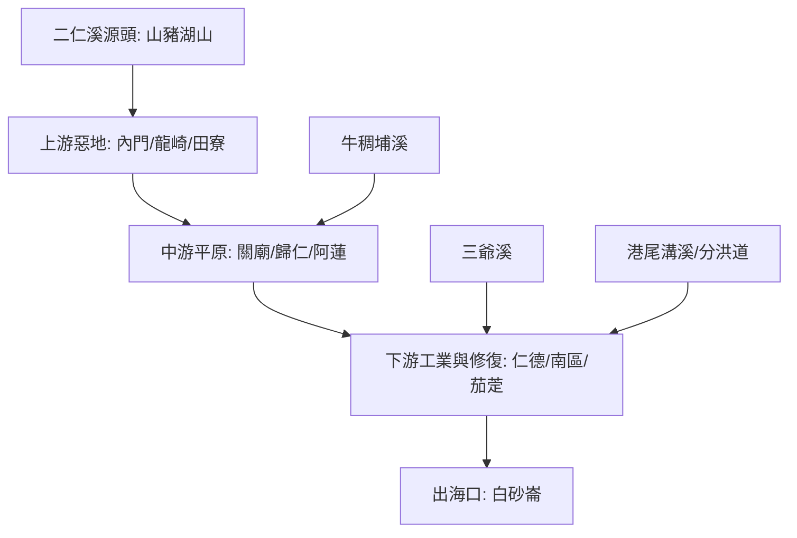

# 🌊 二仁溪流域探索地圖 (Erren River ISMap)

本計畫結合《南部紋理》8.3 節「環境博物館」概念，將二仁溪視為一個動態的環境實驗場。

## 🗺️ 流域導覽圖

## 📍 核心探索點位

- [二仁溪源頭 (山源段)](?map=2026xxxx_erren_exploration&feature=2026xxxx_erren_source)
- [308高地 (展望點)](?map=2026xxxx_erren_exploration&feature=2026xxxx_erren_308_high)
- [田寮月世界 (地質點)](?map=2026xxxx_erren_exploration&feature=2026xxxx_erren_moon_world)
- [阿蓮大曲流 (曲流點)](?map=2026xxxx_erren_exploration&feature=2026xxxx_erren_fuxing_meander)
- [港尾溝分洪道 (治理點)](?map=2026xxxx_erren_exploration&feature=2026xxxx_erren_gangweigou_diversion)
- [仁德滯洪池 (教育點)](?map=2026xxxx_erren_exploration&feature=2026xxxx_erren_rende_pond)
- [南萣橋遺址 (歷史點)](?map=2026xxxx_erren_exploration&feature=2026xxxx_erren_nanding_legacy)
- [茄萣舢筏協會 (復育點)](?map=2026xxxx_erren_exploration&feature=2026xxxx_erren_sampan_assoc)

## 📡 數位資源
- [KML 檔案 (Google My Map 匯入)](../../data/erren_exploration/二仁溪流域探索_2026.kml)
