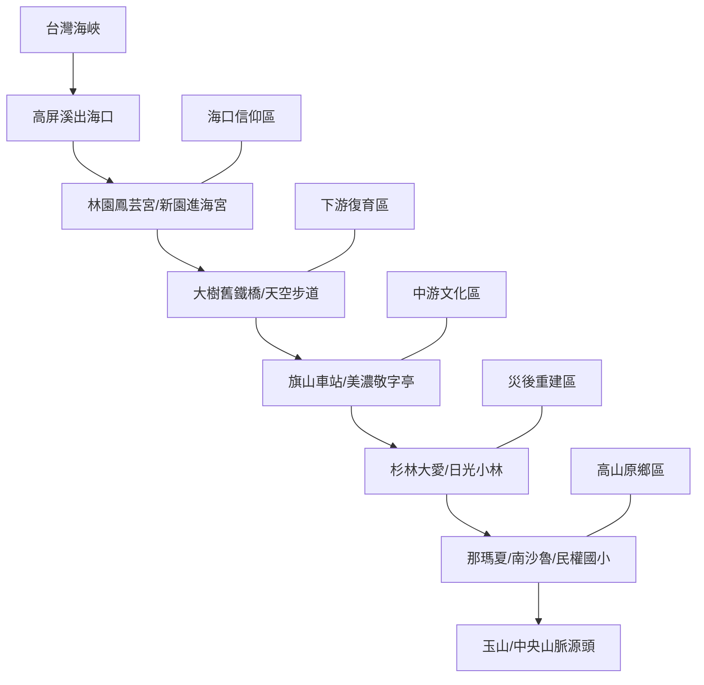

# 高屏溪：從海到山的生命溯源

高屏溪（下淡水溪）是南台灣最巨大的地理刻痕。本次探索採取「逆流而上」的策略，從鹹淡交界的海口信仰出發，穿透工業污染修復的濕地，進入耕讀傳家的客庄，最後抵達莫拉克風災重創後依然挺立的深山原鄉。這是一場關於「從末端看見起源」的溯源之旅。

## 🔍 流域析構 (Basin Analysis)

### 1. 水文脈動 (Hydrology)：逆向的輸砂記憶
從海口堆積的泥沙，追蹤到中游因過度開發（採砂）導致的河床刷深，最後抵達上游因土石流劇烈變動的碎裂地形。

### 2. 歷史地層 (History)：從生存防禦到主體復振
下游是與海搏鬥的生存防禦；中游是日治工業與農業文明的交織；上游則是當代最沈重的災害地景與族群遷徙史。

### 3. 文化摺層 (Culture)：垂直的靈魂廊道
*   **河口**：鎮水與海巡（對未知力量的祈求）。
*   **平原**：敬字與送聖蹟（對知識與自然的循環尊重）。
*   **高山**：河祭與土地共生（人類與自然的神聖契約）。

## 🗺️ 空間分區導引 (Regional Guide - Sea to Mountain)

- **Day 1: 河口防線 (林園、新園)**：看與海共處的信仰邊界。
- **Day 2: 鋼鐵與綠洲 (大樹)**：看工業遺跡與水質淨化的自然力量。
- **Day 3: 蔗糖與文字 (旗山、美濃)**：看早期經濟動脈與客家文風。
- **Day 4: 空間規訓 (杉林)**：在大愛園區看災後重建的社會工程。
- **Day 5: 溯源原鄉 (那瑪夏)**：回到高山，看見強韌的生命起源（下午回程）。

## 實際探索
- (即將上線 - 接續二仁溪計畫)

## 🏛️ 知識座標 (Museum Index)
- [[poi_美濃客家文物館]]：客家文風與敬字傳統。
- [[poi_旗山車站]]：糖業殖民的物資動脈。
- [[poi_大樹舊鐵橋濕地教育園區]]：工業廢水治理與生態修復模型。

## 景點 Feature 索引
- [[poi_進海宮_屏東]]
- [[poi_鳳芸宮]]
- [[poi_大樹舊鐵橋濕地教育園區]]
- [[poi_旗山車站]]
- [[poi_瀰濃庄敬字亭]]
- [[poi_美濃客家文物館]]
- [[poi_杉林大愛園區]]
- [[poi_日光小林社區]]
- [[poi_南沙魯部落]]
- [[poi_那瑪夏民權國小]]
