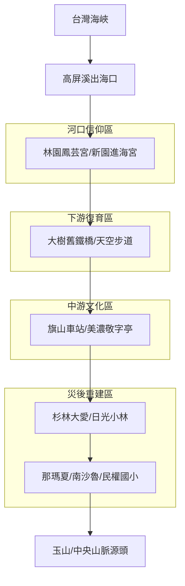

# 高屏溪：從海到山的生命溯源

高屏溪（下淡水溪）是南台灣最巨大的地理刻痕。本次探索採取「逆流而上」的策略，從鹹淡交界的海口信仰出發，穿透歷史斷裂與生態修復的地景，最後抵達莫拉克風災重創後依然挺立的深山原鄉。這是一場關於「從末端看見起源」的溯源之旅。

## 🔍 流域析構 (Basin Analysis)

### 1. 水文脈動 (Hydrology)：逆向的輸砂記憶
從海口堆積的泥沙，追蹤到中游因過度開發（採砂）導致的河床刷深，最後抵達上游因土石流劇烈變動的碎裂地形。歷史上高屏溪的狂暴與人類抽砂的貪婪，共同形塑了今日的河道。

### 2. 歷史地層 (History)：從生存防禦到主體復振
*   **下游**：與海搏鬥的生存防禦（水仙尊王、海巡媽）。
*   **中游**：日治與戰後的物資動脈（糖鐵與採砂）。
*   **上游**：莫拉克災後的空間規訓與自主重建的韌性對抗。

### 3. 文化摺層 (Culture)：垂直的靈魂廊道
這是一條串聯「水神、文字、山靈」的廊道：
*   **河口**：對變幻莫測力量的祈求。
*   **平原**：對知識與自然循環的尊重（送聖蹟）。
*   **高山**：人類與河流的神聖互惠（河祭）。

## 🗺️ 空間分區導引 (Regional Guide)

- **Day 1: 河口防線 (Sea)**：[新園進海宮](?map=2026xxxx_gaoping_exploration&feature=2026xxxx_gaoping_jin_hai_gong)、[林園鳳芸宮](?map=2026xxxx_gaoping_exploration&feature=2026xxxx_gaoping_feng_yun_gong)。
- **Day 2: 鋼鐵與綠洲 (Downstream)**：[舊下淡水溪鐵橋](?map=2026xxxx_gaoping_exploration&feature=2026xxxx_gaoping_old_bridge)、[大樹舊鐵橋濕地](?map=2026xxxx_gaoping_exploration&feature=2026xxxx_gaoping_wetland)。
- **Day 3: 蔗糖與文字 (Middle)**：[旗山車站](?map=2026xxxx_gaoping_exploration&feature=2026xxxx_gaoping_qishan_station)、[瀰濃庄敬字亭](?map=2026xxxx_gaoping_exploration&feature=2026xxxx_gaoping_meinong_shrine)、[美濃客家文物館](?map=2026xxxx_gaoping_exploration&feature=2026xxxx_gaoping_meinong_museum)。
- **Day 4: 空間規訓 (Half-way)**：[杉林大愛園區](?map=2026xxxx_gaoping_exploration&feature=2026xxxx_gaoping_daei_village)、[日光小林社區](?map=2026xxxx_gaoping_exploration&feature=2026xxxx_gaoping_sunlight_village)。
- **Day 5: 溯源原鄉 (Mountain)**：[南沙魯部落](?map=2026xxxx_gaoping_exploration&feature=2026xxxx_gaoping_nanshalu)、[那瑪夏民權國小](?map=2026xxxx_gaoping_exploration&feature=2026xxxx_gaoping_minquan_school)。

## 實際探索
- [2026台灣河流探索 - 高屏溪系列網誌](https://wuulong.github.io/wuulong-notes-blog/series/2026%E5%8F%B0%E7%81%A3%E6%B2%B3%E6%B5%81%E6%8E%A2%E7%B4%A2-%E9%AB%98%E5%B1%8F%E6%BA%AA/)
- [Google My Maps 互動地圖](https://www.google.com/maps/d/edit?mid=1IpA6Yyz-IwMRX3F2L1jDWtJuAMEUsn4&usp=sharing)

## 🏛️ 關鍵 Feature 索引
- [新園進海宮 (鎮水防線)](?map=2026xxxx_gaoping_exploration&feature=2026xxxx_gaoping_jin_hai_gong)
- [林園鳳芸宮 (海巡媽)](?map=2026xxxx_gaoping_exploration&feature=2026xxxx_gaoping_feng_yun_gong)
- [舊下淡水溪鐵橋 (採砂傷痕)](?map=2026xxxx_gaoping_exploration&feature=2026xxxx_gaoping_old_bridge)
- [大樹舊鐵橋濕地 (生態修復)](?map=2026xxxx_gaoping_exploration&feature=2026xxxx_gaoping_wetland)
- [旗山車站 (糖鐵動脈)](?map=2026xxxx_gaoping_exploration&feature=2026xxxx_gaoping_qishan_station)
- [瀰濃庄敬字亭 (送聖蹟文化)](?map=2026xxxx_gaoping_exploration&feature=2026xxxx_gaoping_meinong_shrine)
- [美濃客家文物館 (客庄知識)](?map=2026xxxx_gaoping_exploration&feature=2026xxxx_gaoping_meinong_museum)
- [杉林大愛園區 (空間規訓現場)](?map=2026xxxx_gaoping_exploration&feature=2026xxxx_gaoping_daei_village)
- [日光小林社區 (自主重建韌性)](?map=2026xxxx_gaoping_exploration&feature=2026xxxx_gaoping_sunlight_village)
- [南沙魯部落 (原鄉堅守)](?map=2026xxxx_gaoping_exploration&feature=2026xxxx_gaoping_nanshalu)
- [那瑪夏民權國小 (避難方舟)](?map=2026xxxx_gaoping_exploration&feature=2026xxxx_gaoping_minquan_school)
