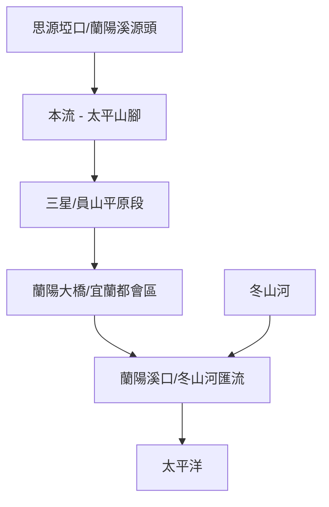

# 蘭陽溪水路歷史考掘：全流域分段探索地圖 (2026)

蘭陽溪是宜蘭平原的生命之河，其水文特色在於極高的含砂量與廣大的河床耕作地景，以及與冬山河在海口的共舞。

## 💧 水利與地景焦點：白金與西瓜
- **河床西瓜田**：蘭陽溪含砂量大，枯水期河床上大片的西瓜田是宜蘭特有的地景。
- **蘭陽大橋與台鐵橋**：觀察多代同堂的橋樑並行景觀，以及河川局對此寬廣河床的治理方式。
- **蘭陽溪口中心**：三條河流（蘭陽溪、冬山河、宜蘭河）交匯處，是國際級的賞鳥與生態保育熱點。

## 🧩 模組化探索分段 (Module Groups)
*建議拆分為兩次不同的主題探索：*

1.  **[海口與生態模組] 溪口賞鳥與水系匯流**：蘭陽溪口水鳥保護區、壯圍沙丘、五結排水閘門。
2.  **[山城與水利模組] 三星蔥田與河床奇觀**：三星天送埤、蘭陽發電廠取水口、葫蘆堵大橋、河床西瓜田。

## 🗺️ AI 深度探索 (Deep Research)
請使用 Deep Research 工具挖掘蘭陽溪的細節：

```markdown
# Context
一個名為「蘭陽溪流域分段探索」的計畫，包含海口濕地與山前平原兩大區域。

# Task
請針對蘭陽溪特定區域進行 Deep Research，挖掘「水利文獻」、「消失的聚落」、「地方風土」與「必吃小吃」。

**景點列表範例：**
1. 蘭陽溪口水鳥保護區 (三河匯流處)
2. 蘭陽大橋 (新舊並行景觀)
3. 員山取水口與地下水觀測點
4. 三星天送埤與蘭陽電力史
5. 壯圍沙丘生態園區
6. 蘭陽溪河床西瓜田 (季節地景)

# Requirements
1. **水利演進**: 蘭陽溪在宜蘭平原防洪與灌溉中的定位？
2. **人文軼事**: 宜蘭人的河流記憶、河床耕作的社會契約。
3. **生態觀察**: 秋冬候鳥、沙洲生態與海岸侵蝕問題。
4. **在地美食**: 三星卜肉、員山魚丸米粉、壯圍海鮮小吃。
```

## 景點 Feature 索引
- [[2026xxxx_lanyang_mouth]] 蘭陽溪口水鳥保護區
- [[2026xxxx_lanyang_bridge]] 蘭陽大橋與舊鐵道橋站
- [[2026xxxx_lanyang_tiansongpi]] 天送埤與蘭陽電力發源地
- [[2026xxxx_lanyang_watermelon_fields]] 蘭陽溪河床西瓜地景
