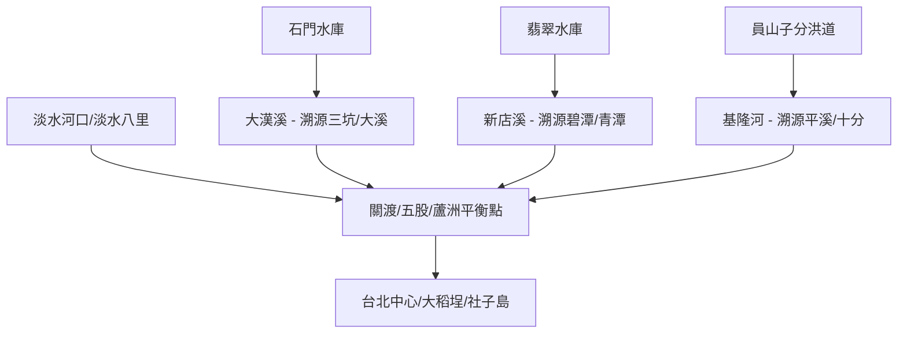

# 淡水河全流域模組化探索地圖 (2026)

淡水河不僅是台北的母親河，其複雜的高密度水利設施（堤防、抽水站、分洪道）與深厚的歷史商貿（大稻埕、淡水港）構成了北台灣最豐富的河流文化譜系。

## 💧 水利與系統焦點：高密度防災與水源
淡水河流域的水體系特色：
- **基隆河系統**：世界級的「員山子分洪」技術，以及河川奪河形成的著名瀑布與地景。
- **大漢溪系統**：北部農業與工業的供水動脈，包含石門水庫與壯觀的桃園大圳體系。
- **新店溪系統**：台北最純淨的民生水源區，保留了早期的水力發電與取水古蹟。
- **都會防洪層**：巨大的二重疏洪道與社子島堤防，是都市與自然爭地的歷史見證。

## 🧩 模組化探索模組 (Module Groups)
*由於流域廣闊，建議採單日或單點探索，隨時出發：*

1.  **[都會脈動] 大稻埕與社子島**：探索老街商貿遺址與現代高牆防洪。
2.  **[海口故事] 淡水八里與關渡**：紅樹林生態、夕照、清領時期港口與關渡大橋工程。
3.  **[水利溯源] 大溪三坑水路**：大溪老街、三坑老街、桃園大圳取水口。
4.  **[水源之心] 新店碧潭與青潭**：碧潭地景、取水站、新店電力史。
5.  **[地景奇蹟] 員山子與瀑布群**：瑞芳、員山子分洪工程、十分瀑布、壺穴地景。

## 🗺️ AI 深度探索 (Deep Research)
請複製以下 Prompt 並使用 Gemini Advanced 或 Deep Research 工具，挖掘淡水河的豐富層次：

```markdown
# Context
一個名為「淡水河全流域模組化探索」的計畫，涵蓋大漢溪、新店溪、基隆河三大支流。

# Task
請針對淡水河特定區域進行 Deep Research，挖掘「失落的碼頭」、「水利工程秘辛」、「老街興衰」與「巷弄美食」。

**景點列表範例（可任選模組）：**
1. 大稻埕碼頭 & 延平河濱抽水站
2. 員山子分洪道 (基隆河防洪核心)
3. 碧潭水利與青潭取水站
4. 大溪三坑老街與桃園大圳
5. 社子島堤防與台北城防洪史
6. 關渡自然公園與關渡宮水文

# Requirements
1. **水利演進**: 該區域在台北防洪計畫中的地位？
2. **人文軼事**: 從前的渡口生活、水運與陸運的轉折。
3. **生態觀察**: 都會河濱的復育現況、潮汐影響。
4. **必吃在地美食**: 如大稻埕慈聖宮小吃、新店光明街美食、大溪豆干等。
```

## 景點 Feature 索引
- [[2026xxxx_tamsui_dadaocheng]] 大稻埕碼頭與水門
- [[2026xxxx_tamsui_shezi]] 社子島島頭公園與防洪牆
- [[2026xxxx_tamsui_yuanshanzi]] 員山子分洪道
- [[2026xxxx_tamsui_bitan]] 碧潭與青潭水源地
- [[2026xxxx_tamsui_guandu]] 關渡宮與紅樹林區
- [[2026xxxx_tamsui_sanxia_daxi]] 大溪三坑水利網
