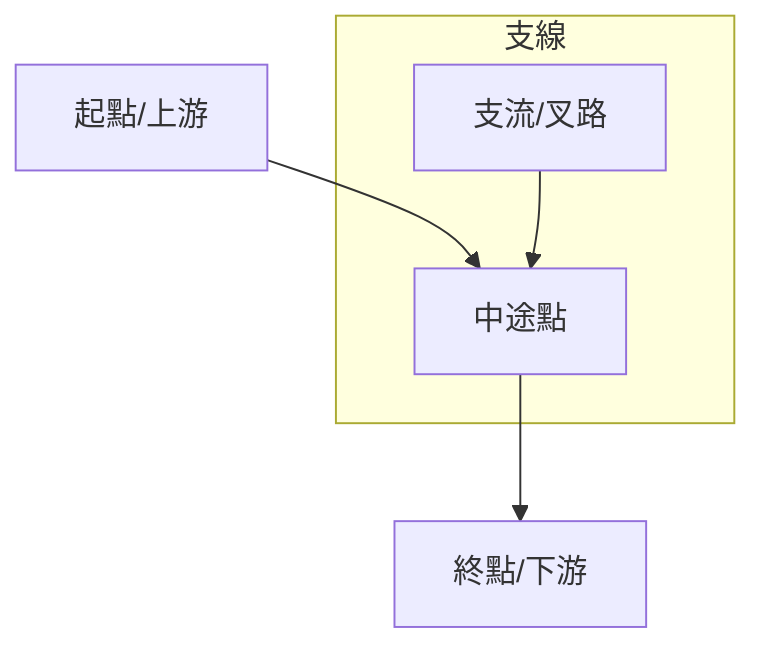

# 地圖中文名稱

## 地圖結構 (Topology)
<!-- 
使用 Mermaid 語法來繪製景點之間的關係。
適合表達：河流上下游、登山路線順序、水利設施關聯等。
-->


## 簡介 (Introduction)
<!-- 描述此地圖的背景故事、製作目的以及主要亮點 -->
這裡填寫地圖的詳細介紹。例如：這是一份關於濁水溪流域的百科全書式地圖，涵蓋了從合歡山源頭到麥寮出海口的重要地理與人文景點。

## 使用者補充筆記 (User Notes)
<!-- 使用者手動編輯區域，記錄實地踏查心得或補充資料 -->
### 重點觀察
- 觀察點 1...
- 觀察點 2...

### 相關文獻與連結
- [參考資料 1](https://example.com)
- [參考資料 2](https://example.com)

## 🗺️ AI 深度探索 (Deep Research)
如果您擁有 Gemini Advanced 或其他 Deep Research 工具，可以複製以下 Prompt，針對本工程地圖進行深度的文史與美食探索：

```markdown
# Context
一份名為「{MAP_NAME}」的導覽路線，探索...

# Task
請針對以下景點列表，進行 Deep Research，挖掘背後的「歷史深度」、「生活溫度」與「在地美食」。

**景點列表：**
1. [請填入景點1]
2. [請填入景點2]
...

# Requirements (請分析以下維度)
1. **歷史與工程脈絡**: 該點在台灣水利/歷史的角色？
2. **在地文化與生態**: 周邊古蹟、廟宇、特殊生態景觀。
3. **順遊景點**: 步行/單車可達的隱藏景點。
4. **必吃在地美食**: 老字號小吃、在地人推薦 (非連鎖)。
```

## 📊 Dynamic View 視覺化
如果您已經產出了 Deep Research Report，接著在 Dynamic View 中，您的 Prompt 策略應該從「獲取資訊」轉向**「結構化與視覺化」**。

1. **生成時間軸 (Timeline View)**
   - Prompt: "基於這份研究報告，請以時間軸視圖呈現關鍵歷史里程碑。重點放在建造年份與重大事件。"
2. **生成比較表格 (Comparison Table View)**
   - Prompt: "請建立一個比較表格，分析文中提到的新舊設施差異。欄位應包含：設施名稱、年代、建造工法、目前狀態。"
3. **生成旅遊行程卡片 (Itinerary/Card View)**
   - Prompt: "將「順遊景點」與「在地美食」章節轉換為行程卡片視圖。請按地區分組，並標註「必試」項目。"

## 下載與資源 (Resources)
<!-- 提供 KML、GPX 或 ATAK Package 的下載連結 -->
- **[KML 地圖檔下載](./YYYYMMDD_map_name_english.kml)**
- **[Google Maps 導航連結](https://maps.google.com/...)**

## 景點列表 (Features)
<!-- 
此列表通常由 Python Script 自動生成。
格式為：- [景點名稱](../features/FEATURE_ID.md)
-->
- [範例景點 A](../features/YYYYMMDD_map_name_00_spot_a.md)
- [範例景點 B](../features/YYYYMMDD_map_name_01_spot_b.md)
