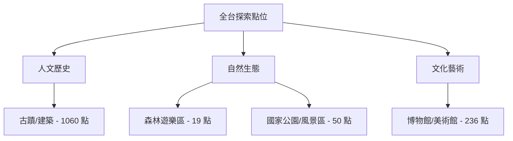

# 🌏 全台重要探索點位匯總地圖

本圖資整合了台灣目前營運中且具备高度探索價值的「國家級」與「重要地方級」節點，包含古蹟、國家森林遊樂區、博物館以及國家公園/風景區。

## 📊 點位統計
- **古蹟 (人文史蹟)**: 1060 筆
- **國家森林遊樂區 (自然地景)**: 19 筆
- **博物館/美術館 (景點設施)**: 236 筆
- **國家級景點 (整合版)**: 50 筆
- **總計**: 1257 筆

## 🗺️ 探索脈絡

## 📍 部分重點點位快取 (僅列出範例)
- [太平山國家森林遊樂區](../features/20260315_national_spots/20260315_太平山國家森林遊樂區.md)
- [國立故宮博物院](../features/20260315_national_spots/20260315_國立故宮博物院.md)
- [玉山國家公園](../features/20260315_national_spots/20260315_玉山國家公園.md)
- [鹿港天后宮](../features/20260315_national_spots/20260315_鹿港天后宮.md)

---
*數位紀錄：全台重要探索點位 L0/L1 補完計畫 (2026-03-15)*
