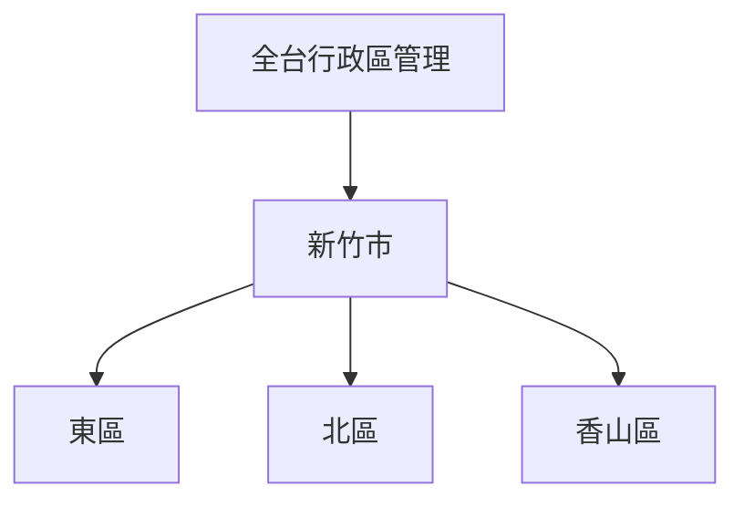

# 台灣行政區富化管理地圖

本提圖旨在管理全台灣所有縣市與鄉鎮的「內容富化 (Enrichment)」進度。透過 WalkGIS 的空間界面，可以直觀地查看哪些區域已完成深度地誌建立。

## 🗺️ 富化區域

### 1. 全台灣 (已完成初始化)
目前已匯入全台 22 縣市及 368 鄉鎮的行政邊界資訊。

- [全台行政區總覽](?map=taiwan_admin_enrichment)
- [新竹市 (已完成 AI 厚化)](?map=taiwan_admin_enrichment&feature=COUNTY_10018_新竹市)

## 📊 富化進度指標
- **DEFAULT**: 初始匯入
- **AI_ENRICHED**: 標準 AI 搜尋厚化
- **DEEP_RESEARCHED**: 深度研究整合
- **VERIFIED**: 人工完成校驗

## 路線結構 (Mermaid)

