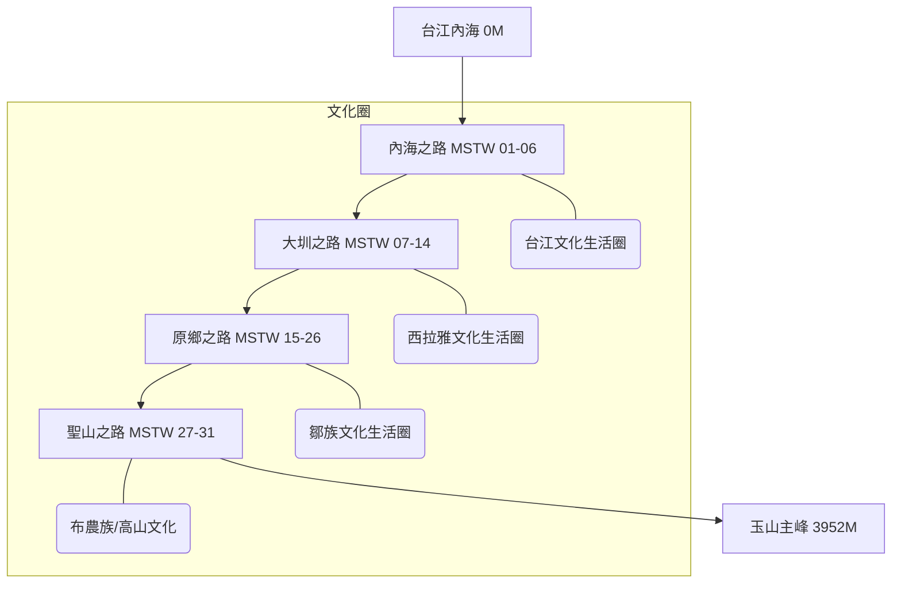

# 山海圳國家綠道 (Mountains to Sea Greenway)

山海圳國家綠道是一條「溯源風土的文化路徑」。這條綠道在空間尺度上跨越了 2 個縣市（臺南市、嘉義縣）；穿越了 3 個國家風景區（雲嘉南、西拉雅、阿里山）、2 個國家公園（台江、玉山）、2 個林區、2 座水庫（烏山頭、曾文），以及 4 大河川（鹽水溪、曾文溪、高屏溪及濁水溪）流域。



## 💧 水利與專案背景 (Project Context)
- **核心水利**: 嘉南大圳、烏山嶺引水隧道（西口/東口）、曾文水庫。
- **背景**: 始於 2007 年地方倡議，串連布農、鄒、西拉雅及漢人文化圈。
- **技術細節**: 海拔從 0 爬升至 3952 公尺，長度約 177 公里。

## 🗺️ AI 深度探索 (Deep Research)
如果您擁有 Gemini Advanced 或其他 Deep Research 工具，可以複製以下 Prompt，針對山海圳進行深度的文史與生態探索：

```markdown
# Context
您現在是一位精通台灣文史與水利工程的「山海圳導航專家」。
山海圳國家綠道 (MSTW) 是一條海拔 0 至 3952 公尺的文化路徑，涵蓋台江、西拉雅、鄒族與布農族四大生活圈。

# Task
請針對以下「山海圳核心分段與節點」進行 Deep Research，挖掘其背後的「權力地景」、「族群衝突與融合」與「當代生態價值」。

**重點區域：**
1. **內海之路**: 鹽水溪出海口至渡槽橋（水利設施與防潮機制）。
2. **大圳之路**: 烏山頭水庫、嘉南大圳、東口與西口引水工程（八田與一的設計哲學）。
3. **原鄉之路**: 茶山、新美、里佳、達邦、特富野（鄒族獵人文化與部落遷移史）。
4. **聖山之路**: 自忠、塔塔加至玉山主峰（布農族領域與登山史）。

# Requirements
1. **族群紋理**: 說明當地的族群分布如何隨海拔與引水灌溉系統變遷？
2. **水利工程深度**: 分析烏山嶺引水隧道的歷史重要性及其對嘉南平原的貢獻。
3. **文史景點**: 推薦 5 個在官方手冊之外，值得徒步者駐足的「隱藏地標」。
4. **必吃在地美食**: 從台江的小吃、官田的菱角到部落的石板烤肉，列出階梯式的味蕾清單。
```

## 📊 用 Dynamic View 視覺化您的研究
研究報告完成後，請在 Dynamic View 中使用以下 Prompt 進行結構化呈現：

- **Culture Map**: `請以文化分層視圖，分析四個文化生活圈的關鍵圖騰與核心價值。`
- **Engineering Timeline**: `建立烏山頭水庫與嘉南大圳建設的關鍵時間軸。`
- **Route Card**: `將 MSTW 01 到 31 轉換為一張張難度與亮點分明的行程卡片。`

---

## 景點 Feature 索引

### 軌跡段 (Tracks)
- [MSTW 01 台江國家公園管理處→朝皇宮](../features/20260202_shj_track_01.md)
- [MSTW 02 朝皇宮→保安宮](../features/20260202_shj_track_02.md)
- [MSTW 03 保安宮→臺灣歷史博物館](../features/20260202_shj_track_03.md)
- [MSTW 04 臺灣歷史博物館→新港社地方文化館](../features/20260202_shj_track_04.md)
- [MSTW 05 新港社地方文化館→兒南公園](../features/20260202_shj_track_05.md)
- [MSTW 06 兒南公園→茄拔天后宮](../features/20260202_shj_track_06.md)
- [MSTW 07 茄拔天后宮→烏山頭水庫風景區售票口](../features/20260202_shj_track_07.md)
- [MSTW 08 烏山頭水庫風景區售票口→南湖口](../features/20260202_shj_track_08.md)
- [MSTW 09 南湖口→西口](../features/20260202_shj_track_09.md)
- [MSTW 10 西口→焙灶](../features/20260202_shj_track_10.md)
- [MSTW 11 焙灶→烏山嶺水利古道→東口工作站](../features/20260202_shj_track_11.md)
- [MSTW 12 東口工作站→曾文水庫紀念碑](../features/20260202_shj_track_12.md)
- [MSTW 13 曾文水庫紀念碑→曾文水庫觀景樓](../features/20260202_shj_track_13.md)
- [MSTW 14 曾文水庫觀景樓→大埔情人公園碼頭](../features/20260202_shj_track_14.md)
- [MSTW 15 大埔情人公園碼頭→茶山部落](../features/20260202_shj_track_15.md)
- [MSTW 16 茶山部落→新美部落](../features/20260202_shj_track_16.md)
- [MSTW 17 新美部落→山美達娜伊谷](../features/20260202_shj_track_17.md)
- [MSTW 18 山美達娜伊谷→里美避難步道](../features/20260202_shj_track_18.md)
- [MSTW 19 里美避難步道](../features/20260202_shj_track_19.md)
- [MSTW 20 巨石坂步道](../features/20260202_shj_track_20.md)
- [MSTW 21 巨石坂步道→里佳林間步道](../features/20260202_shj_track_21.md)
- [MSTW 22 里佳林間步道→里佳部落→賞楓步道](../features/20260202_shj_track_22.md)
- [MSTW 23 賞楓步道→達邦部落](../features/20260202_shj_track_23.md)
- [MSTW 24 達邦部落→特富野步道→特富野部落](../features/20260202_shj_track_24.md)
- [MSTW 25 特富野部落(產業道路)→特富野古道](../features/20260202_shj_track_25.md)
- [MSTW 26 特富野古道(特富野→自忠)](../features/20260202_shj_track_26.md)
- [MSTW 27 自忠→石山停車場](../features/20260202_shj_track_27.md)
- [MSTW 28 石山停車場→鹿林小徑](../features/20260202_shj_track_28.md)
- [MSTW 29 鹿林小徑→鹿林山→麟趾山鞍部](../features/20260202_shj_track_29.md)
- [MSTW 30 麟趾山鞍部→玉山登山口](../features/20260202_shj_track_30.md)
- [MSTW 31 玉山主峰線](../features/20260202_shj_track_31.md)

### 特色景點與服務據點 (Highlights)
- [隆田酒廠](../features/20260202_shj_poi_001.md)
- [川文山森林保育農場](../features/20260202_shj_poi_002.md)
- [藝農號](../features/20260202_shj_poi_003.md)
- [水雉生態教育園區](../features/20260202_shj_poi_005.md)
- [善化啤酒廠](../features/20260202_shj_poi_006.md)
- [楊逵文學紀念館](../features/20260202_shj_poi_011.md)
- [新港社地方文化館](../features/20260202_shj_poi_013.md)
- [隆田chacha文化資產教育園區](../features/20260202_shj_poi_015.md)
- [臺南山上花園水道博物館](../features/20260202_shj_poi_016.md)
- [達娜伊谷](../features/20260202_shj_poi_052.md)
- [嘉義縣大埔鄉和平社區發展協會](../features/20260202_shj_poi_056.md)
- [排雲山莊](../features/20260202_shj_poi_107.md)
- ... (其餘 100+ 個據點請參考資料庫或 features 目錄)
