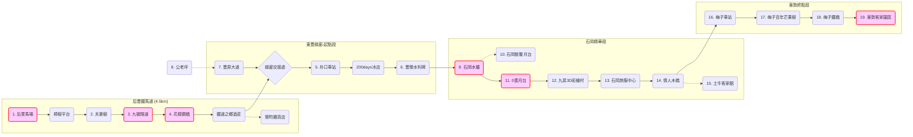

# AI INSTRUCTION HEADER
Role: You are an enthusiastic, cartoon-style Travel Guide for the "WalkGIS Adventure".
Tone: Fun, Energetic, Child-friendly, Vibrant, and Imaginative.

## Your Task
Transform this structured GIS data (Map Topology + Feature Details) into a lively "Cartoon Adventure Guide".

## Output Requirements (When asked)
1. **Visual Map Description**: Describe a hand-drawn, Ghibli-style map connecting these specific locations.
2. **Slide Deck Outline**: Create a 10-15 slide presentation structure.
3. **Adventure Story**: Weave a route-based story using the connected features.

---
# DATA: MAP TOPOLOGY
---
map_id: 2025_houfeng_dongfeng_loop
name: 后豐鐵馬道 & 東豐綠廊精華遊
region: 台中/后里/豐原/石岡/東勢
difficulty: Easy
date: 2025-12-29
---

# 后豐鐵馬道 & 東豐綠廊精華遊

這是一條結合「舊山線鐵道歷史」與「大甲溪水岸風光」的經典自行車路線。全程約 18 公里，串聯了后里馬場、花樑鋼橋、石岡水壩與東勢客家文化園區，是台中最受歡迎的綠色隧道。

## 🗺️ 地圖概覽 (Map Overview)

## 🛤️ 路線拓樸 (Route Topology)

## 📍 包含景點 (Points of Interest)

### 后豐段 (Houfeng Section)
*   [后里馬場](../features/20251229_houli_ranch.md)
*   [九號隧道](../features/20251229_tunnel_9.md)
*   [花樑鋼橋](../features/20251229_old_beam_bridge.md)

### 東豐段 (Dongfeng Section)
*   [石岡水壩](../features/20251229_shigang_dam.md)
*   [0蛋月台](../features/20251229_0_dan_platform.md)
*   [情人木橋](../features/20251229_lovers_bridge.md)
*   [東勢客家文化園區](../features/20251229_dongshi_hakka.md)

*(完整清單請參閱 features 目錄)*

---
# DATA: FEATURES DETAIL

---
id: 20251212_houli
name: 后里馬場
type: 水文與親水層
subtype: 親水點
date: 2025-12-12
---

# 后里馬場 (Houli Horse Ranch)

**地點**：台中市后里區  
**座標**：120.73582, 24.298637

## 簡介
后里馬場是台中著名的歷史景點，也是大甲溪沿線鐵馬道（東豐自行車綠廊、后豐鐵馬道）的重要節點。

## 特色
*   **自行車起點**：非常適合作為探索大甲溪流域的自行車出發點。
*   **腹地廣大**：擁有廣大的綠地與歷史建築，適合親子遊憩。
*   **親水連接**：鄰近大甲溪河床，雖然本身不是親水點，但作為進入河川區域的前哨站非常重要。

## 設施
*   停車場：有 (大型)
*   廁所：有
*   餐飲：有 (園區內由委外廠商經營)

## 交通資訊
可搭乘火車至后里車站，步行或租借腳踏車前往。

---

---
id: 20251229_houli_ranch
name: 后里馬場
type: 自行車道景點
subtype: 景點
date: 2025-12-29
---

# 后里馬場

**地點**：台中市 (Houfeng/Dongfeng Bike Path)
**座標**：120.73582, 24.298637

#
# 后里馬場 (Houli Horse Ranch)

后豐鐵馬道起點，歷史悠久的馬場。

## 景點介紹
后里馬場（Houli Horse Ranch）位於台中市后里區，是一座結合歷史、文化與休閒娛樂的親子景點。它不僅是台灣歷史最悠久的公營馬場之一，也因其多元化的活動和豐富的歷史背景而聞名，有「歷史與自然交織的親子樂園」之美譽。

## 歷史背景
后里馬場的歷史可追溯至日治時期。它於 **1912年興建**，1937年正式成立「台灣總督府產馬牧場」，是當時台灣九座馬場中唯一保存至今的，也是日治時期台灣唯一的軍用馬場。
*   **戰後時期**：由中華民國國軍接管，成為聯勤種馬牧場，負責培育軍用馬匹。
*   **轉型觀光**：1997年轉交台中縣政府管理，轉型為觀光休閒馬場。
*   **文化資產**：園區內的第一、第二馬廄、場本部以及部分紀念碑和場長宿舍，都被指定為台中市的歷史古蹟，保留著濃厚的日式建築風格。
*   **花博展區**：曾是 2018 年台中世界花卉博覽會的展區之一。

## 特色亮點
*   **馬術體驗**：提供騎馬體驗，包括自由騎乘以及為初學者和兒童設計的牽乘活動。
*   **美洲瘋馬大馬戲團**：園區內常駐國際級馬戲團，呈現精彩刺激的特技表演、逗趣的小丑秀及動物特技。
*   **多元動物互動**：除了馬匹，還有水豚、侏儒羊和迷你馬等可愛動物。
*   **古蹟巡禮**：保存完好的日治時期馬廄與場本部，是攝影與懷舊的好去處。
*   **鐵馬道起點**：作為后豐鐵馬道的起點，非常適合作為單車之旅的第一站。

## 實用資訊 (2025)

### 門票資訊
*   **全票**: NT$150 (16-65歲)
*   **優待票**: NT$100 (學生、團體、65歲以上)
*   **免票**: 后里/豐原居民、3歲以下兒童
*   **馬戲團**: 需額外購票 (約 NT$480 起，含入園)

### 營業時間
*   **週四至週二**: 09:30 - 17:00
*   **週三**: 公休 (暑假期間不休園)
*   **馬戲團表演**: 平日下午一場 (14:30)，週末三場 (10:30, 14:00, 16:00)

## 外部連結
*   [后里馬場官方網站](https://www.houliequestrian.com/)
*   [台中觀光旅遊網介紹](https://travel.taichung.gov.tw/)

## 交通資訊
位於自行車道沿線。

---

---
id: 20251229_couple_tree
name: 夫妻樹
type: 自行車道景點
subtype: 自然景觀
date: 2025-12-29
---

# 夫妻樹 (Couple Tree)

后里馬場旁的百年神木，象徵永恆的愛情。

## 景點介紹
后里夫妻樹（又稱日月神木）由一棵千年樟樹與一棵兩百年榕樹緊密相依而成。當地下流傳著淒美的愛情傳說，也讓這裡成為情侶騎車必訪的打卡點。樹下設有休憩廣場，是挑戰九號隧道前的重要補給站。

## 傳說故事
相傳早期有一對戀人因家人反對而在此殉情，後化身為相依偎的兩棵大樹，世世守護這片土地。

## 參觀資訊
*   **位置**: 后里馬場旁，九號隧道入口前。
*   **設施**: 洗手間、休息石椅。

---

---
id: 20251229_tunnel_9
name: 九號隧道
type: 自行車道景點
subtype: 歷史建築
date: 2025-12-29
---

# 九號隧道 (Tunnel 9)

舊山線最長隧道，隱藏百年的鐵道秘境。

## 景點介紹
九號隧道建於 **1908年**，全長 **1269.5 公尺**，是舊山線九座隧道中最長的一座。它連接了后里與豐原，與花樑鋼橋緊密相連。隧道內部冬暖夏涼，是炎炎夏日騎車最舒服的路段。

## 歷史印記：總督題字
隧道南北兩口皆有日治時期留下的題字，展現了當時工程的艱辛與氣魄：
*   **南口 (往豐原方向)**: 「**氣象雄深**」，由第五任台灣總督 **佐久間左馬太** 題。形容隧道出去後連接花樑鋼橋與大甲溪的壯闊景色。
*   **北口 (往后里方向)**: 「**潛行不窒**」，由民政長官 **後藤新平** 題。意指火車在長隧道中行駛依然空氣暢通（當時也是工程技術的自信展現）。

## 建築演變
*   **磚造時期**: 初期為紅磚結構。
*   **混凝土化**: 1935 年大地震後，為了強化結構，改建為混凝土隧道，因此現在看到的多為混凝土壁面。
*   **S型曲線**: 為了適應地質與連接大甲溪橋，隧道內部呈現少見的 S 型大彎道，騎行其中無法一眼望穿出口，充滿神祕感。

## 騎行體驗
*   **天然冷氣**: 隧道內長年維持恆溫，夏天騎進去瞬間降溫，非常涼爽。
*   **光影變幻**: 隧道內設有照明，但部分路段較暗，建議開啟自行車燈。
*   **出洞的驚喜**: 當你從南口騎出隧道，眼前豁然開朗，巨大的花樑鋼橋與大甲溪谷瞬間映入眼簾，是整段旅程的高潮。

## 參觀資訊
*   **開放時間**: **夏令 06:00-19:00 / 冬令 06:00-18:00** (注意！隧道有鐵門管制，晚上會關閉，請務必掌握時間)
*   **交通方式**: 后豐鐵馬道必經之路。

## 外部連結
*   [台中觀光旅遊網 - 九號隧道](https://travel.taichung.gov.tw/)

---

---
id: 20251229_old_beam_bridge
name: 花樑鋼橋
type: 自行車道景點
subtype: 歷史建築
date: 2025-12-29
---

# 花樑鋼橋 (Old Beam Bridge)

大甲溪上最美的工業藝術品。

## 景點介紹
花樑鋼橋（亦稱舊山線大甲溪鐵橋）全長 **382.2 公尺**，橫跨大甲溪，是台灣鐵路舊山線上最壯觀的橋樑之一。這座建於 **1908年** 的鋼桁架橋，見證了台灣百年的交通變遷。如今，它已轉型為自行車專用道，讓人能騎乘鐵馬，懸空在大甲溪之上。

## 建築特色
*   **下承式曲弦桁架 (Pratt Truss)**: 
    *   橋體由 6 個跨徑的鋼桁架組成，優美的弧線造型宛如花瓣，因而得名「花樑鋼橋」。
    *   這種設計在當時是為了適應大跨距需求，同時兼顧結構強度與美感。
    *   初期使用美國橋樑公司的 Schwedler Truss，1964年才抽換為目前的 Warren Truss (華倫氏桁架)。
*   **磚石混砌橋墩**:
    *   橋墩採用「混凝土砌塊石沈箱」工法，內部以紅磚為主結構，外部砌以石塊，是相當特殊的混血工藝。

## 歷史軌跡
*   **1908年**: 竣工，配合台灣縱貫鐵路全線通車。
*   **1935年**: 經歷新竹台中大地震嚴重受損，歷時三年修復。
*   **1964年**: 進行鋼樑抽換工程。
*   **1997年**: 舊山線停駛。
*   **2004年**: 公告為歷史建築，後轉型為自行車道。

## 攝影攻略
這裡是攝影愛好者的天堂：
*   **橋頭視角**: 站在橋頭（靠近九號隧道端），利用鋼架的延伸感拍攝縱深效果。
*   **光影交錯**: 下午陽光穿過鋼桁架灑落的光影，是拍攝人像的最佳時刻。
*   **側面遠眺**: 若有機會從遠處河床或堤防拍攝（需注意安全），可拍出整座橋橫跨大甲溪的氣勢。

## 參觀資訊
*   **開放時間**: 全天開放 (建議白天前往，夜晚無照明且風大)
*   **交通方式**: 位於后豐鐵馬道上，僅供自行車與行人通行。通常與九號隧道連遊。
*   **注意事項**: 橋面風勢較大，騎乘時請握緊把手；橋上路幅不寬，請勿併排騎車。

## 外部連結
*   [台中文化資產處 - 大甲溪鐵橋](https://www.tchac.taichung.gov.tw/)
**地點**：台中市 (Houfeng/Dongfeng Bike Path)
## 交通資訊
位於自行車道沿線。

---

---
id: 20251229_pukou_station
name: 朴口車站
type: 自行車道景點
subtype: 歷史建築
date: 2025-12-29
---

# 朴口車站 (Pukou Station)

舊東勢線的簡易招呼站遺跡。

## 景點介紹
朴口車站原是台鐵東勢線上的一個無人招呼站，主要服務當地的通勤學生。廢線後，月台被完整保留下來，並重建了充滿懷舊感的候車亭。騎車經過時，不妨停下來感受一下昔日單純的歲月。

## 歷史小檔案
*   **啟用**: 1961年。
*   **廢止**: 1991年。
*   **現況**: 東豐綠廊上的歷史地標。

---

---
id: 20251229_fengrong_stele
name: 豐榮水利碑
type: 自行車道景點
subtype: 歷史建築
date: 2025-12-29
---

# 豐榮水利碑 (Fengrong Stele)

見證台中農業水利發展的歷史碑碣。

## 景點介紹
位於葫蘆墩圳取水口附近，建於 1939 年（昭和14年）。這座碑是為了紀念當時的水利工程整修而立，見證了豐原地區（葫蘆墩）的水利發展史。

## 參觀亮點
*   **歷史建築**: 2004年公告為歷史建築。
*   **展望平台**: 旁有觀景台可遠眺石岡水壩與大甲溪，視野遼闊。

---

---
id: 20251229_fengyuan_blvd_bike
name: 豐原大道自行車道
type: 自行車道景點
subtype: 景點
date: 2025-12-29
---

# 豐原大道自行車道 (Fengyuan Blvd Bike Path)

環繞豐原市區的休閒綠帶。

## 景點介紹
這是一條沿著豐原大道高架橋下或路側所建置的自行車道。如果你是從豐原市區出發要前往東豐綠廊，這裡是一個安全的連接路段。沿途路況平緩，適合親子騎乘。

---

---
id: 20251229_kunglaoping
name: 公老坪
type: 自行車道景點
subtype: 自然景觀
date: 2025-12-29
---

# 公老坪 (Kunglaoping)

豐原人的陽明山，百萬夜景勝地。

## 景點介紹
位於豐原東郊的山丘台地，視野極佳。雖然距離自行車道主線有一小段距離（需要爬坡），但平台上的景色絕對值得。

## 參觀亮點
*   **百萬夜景**: 晚上可俯瞰整個豐原市區甚至台中港的燈火。
*   **景觀餐廳**: 山上有許多景觀咖啡廳，適合傍晚看夕陽、晚上看夜景。

---

---
id: 20251229_shigang_dam
name: 石岡水壩
type: 自行車道景點
subtype: 水利設施
date: 2025-12-29
---

# 石岡水壩 (Shigang Dam)

大甲溪流域的守護者，921大地震的見證地。

## 景點介紹
石岡水壩建成於 **1977年**，是完全由台灣工程師自行設計與施工的混凝土重力壩，主要功能為供應大台中地區的民生與工業用水。水壩周邊風景秀麗，是大甲溪上游的重要地標。

## 歷史見證：921地震紀念地
*   **車籠埔斷層錯動**: 1999年 921 大地震，車籠埔斷層直接穿過壩體。
*   **地形隆起**: 強大的地殼變動導致壩體北端隆起約 **2.2公尺**，南端隆起 **9.8公尺**，造成壩體斷裂。
*   **國家震災景觀**: 為了紀念這次災害並保留歷史教訓，政府特地保留了斷裂的壩體與受損的第16-18號溢洪道，成為全世界少見的「斷壩」景觀，現規劃為國家震災景觀紀念地。

## 生態亮點
*   **魚梯 (Fishway)**: 震災後，為了維護大甲溪生態，特別在斷壩旁增設了魚梯，讓洄游性魚類（如台灣鏟頜魚）能夠溯溪產卵。
*   **賞鳥勝地**: 水壩形成的人工湖泊吸引了小白鷺、蒼鷺等水鳥棲息，是觀察河川生態的絕佳地點。

## 參觀資訊
*   **開放時間**: 06:00 - 18:00 (夏令至 19:00)
*   **費用**: 免費參觀
*   **設施**: 入口處有小型市集與洗手間，是東豐綠廊中途重要的休息站。
*   **注意事項**: 大壩上方風大，請小心隨身物品。

## 外部連結
*   [經濟部水利署 - 石岡壩管理中心](https://www.wra.gov.tw/)

---

---
id: 20251229_shigang_fault
name: 石岡斷層月台
type: 自行車道景點
subtype: 歷史建築
date: 2025-12-29
---

# 石岡斷層月台 (Shigang Fault Platform)

被地震撕裂的月台，大自然的震撼教育。

## 景點介紹
位於東豐綠廊上，原為舊東勢線石岡車站月台。1999 年 921 大地震時，車籠埔斷層正好切過此處，造成月台與鐵軌嚴重扭曲變形，產生近 5 公尺的高低落差。保留至今的斷層遺跡，是極具教育意義的地質教室。

## 參觀資訊
*   **位置**: 鄰近 0 蛋月台。
*   **特色**: 隆起的鐵軌與斷裂的月台結構。

---

---
id: 20251229_0_dan_platform
name: 0蛋月台
type: 自行車道景點
subtype: 歷史建築
date: 2025-12-29
---

# 0蛋月台 (0-dan Platform)

廢棄火車廂與彩繪牆的交響曲。

## 景點介紹
原名「零擔月台」，因早期也是石岡地區農產品零售貨物的集散地（零擔貨運）而得名，後諧音為「0蛋月台」。這裡是舊東勢線石岡車站的遺跡，保留了兩節藍皮普通車廂，是東豐綠廊最具代表性的地標之一。

## 歷史見證
*   **921 地震**: 1999年地震造成月台與軌道嚴重隆起斷裂，至今仍保留部分損壞遺跡作為歷史見證。
*   **3D 彩繪**: 近年邀請藝術家繪製多幅互動式 3D 彩繪，讓老月台煥發新活力。

---

---
id: 20251229_jiufang_3d
name: 九房3D彩繪村
type: 自行車道景點
subtype: 景點
date: 2025-12-29
---

# 九房3D彩繪村 (Jiufang 3D Painted Village)

走進童話世界的巷弄迷宮。

## 景點介紹
位於石岡區九房里的寧靜社區，近年邀請彩繪大師曾進成，在巷弄牆面上繪製了一系列互動式 3D 彩繪。主題多為經典童話故事（如傑克與魔豆、賣火柴的小女孩），遊客可以發揮創意與畫作互動拍照，非常適合親子同遊。

## 參觀資訊
*   **位置**: 石岡旅客服務中心對面巷弄進入。
*   **建議停留**: 30-60 分鐘。

---

---
id: 20251229_shigang_visitor
name: 石岡旅客服務中心
type: 自行車道景點
subtype: 休憩設施
date: 2025-12-29
---

# 石岡旅客服務中心 (Shigang Visitor Center)

東豐綠廊的中繼補給站。

## 景點介紹
位於東豐綠廊中段，提供遊客旅遊諮詢、洗手間、飲水機與簡易維修工具。中心建築融合了客家圓樓意象，廣場前常有街頭藝人表演，是騎累了休息的好地方。

## 服務項目
*   旅遊摺頁索取。
*   飲水補給。
*   公廁。

---

---
id: 20251229_lovers_bridge
name: 情人木橋
type: 自行車道景點
subtype: 景點
date: 2025-12-29
---

# 情人木橋 (Lovers Bridge)

遠東跨距最長的景觀膠合木橋。

## 景點介紹
橫跨食水嵙溪的情人木橋，全長 40 公尺，最神奇之處在於 **全橋沒有橋墩**，僅由巨大的膠合木樑支撐。這是台灣引進北美技術的經典之作，具備高抗震能力。

## 周邊景點
*   **石岡土牛客家文化館**: 展示客家傳統建築與生活。
*   **大水車**: 全國最大的水車之一，位於橋下公園。
*   **休閒農業區**: 附近有許多花園與蜜蜂生態館，適合親子同遊。

---

---
id: 20251229_tuniu_hakka
name: 石岡土牛客家文化館
type: 自行車道景點
subtype: 歷史建築
date: 2025-12-29
---

# 石岡土牛客家文化館 (Tuniu Hakka Cultural Hall)

活的客家博物館，劉家老夥房的重生。

## 景點介紹
原為石岡望族劉家的老夥房（三合院），擁有 200 多年歷史。雖然在 921 地震中全毀，但劉家子孫與政府合作，依原貌重建並轉型為文化館。館內展示了珍貴的客家文物與家族史料，是了解大埔客家文化的重要窗口。

## 參觀亮點
*   **半月池**: 傳統客家建築風水的典型特徵。
*   **麵包果樹**: 庭院中的百年老樹。
*   **免費導覽**: 需預約。

---

---
id: 20251229_meizi_station
name: 梅子車站
type: 自行車道景點
subtype: 歷史建築
date: 2025-12-29
---

# 梅子車站 (Meizi Station)

隱身社區的寧靜小站。

## 景點介紹
位於東豐綠廊梅子社區路段，原為舊東勢線的招呼站。廢站後保留了月台遺跡，並設置了涼亭與解說牌。這裡沒有喧囂的人潮，只有寧靜的農村氛圍，適合喜歡漫遊的騎士。

## 歷史小檔案
*   **啟用**: 1959年。
*   **社區特色**: 梅子社區以生產梅子、還有幾棵百年老樹聞名。

---

---
id: 20251229_meizi_mango
name: 梅子百年芒果樹
type: 自行車道景點
subtype: 自然景觀
date: 2025-12-29
---

# 梅子百年芒果樹 (Meizi Century-old Mango Tree)

守護梅子社區的三百歲老樹王。

## 景點介紹
位於東豐綠廊旁的小徑內（有指標），這棵芒果樹樹齡估計超過 300 年，樹幹粗壯需多人合抱。當地人稱之為「老芒果」，樹下供奉著土地公，是梅子社區的信仰中心與乘涼好去處。

## 奇聞軼事
*   **靈樹傳說**: 據說老樹具有靈性，保佑著村莊風調雨順。
*   **芒果產量**: 雖然年事已高，但每年夏天依然結滿芒果（土芒果），生命力旺盛。

---

---
id: 20251229_meizi_iron_bridge
name: 梅子鐵橋
type: 自行車道景點
subtype: 歷史建築
date: 2025-12-29
---

# 梅子鐵橋 (Meizi Iron Bridge)

跨越大甲溪的第二座鐵橋。

## 景點介紹
位於東勢區與石岡區交界，是東豐自行車綠廊進入東勢前的最後一道關卡。這座鐵橋原為東勢線鐵路橋，跨越寬闊的大甲溪河床。與花樑鋼橋不同的是，結構較為簡潔，視野更加開闊。

## 歷史災難與重建
*   **2006水災**: 豪雨沖斷了部分橋墩，導致橋面斷裂。
*   **修復**: 後經重建，改為目前所見的鋼拱橋與水泥橋墩複合形式，安全性大幅提升。

---

---
id: 20251229_dongshi_hakka
name: 東勢客家文化園區
type: 自行車道景點
subtype: 歷史建築
date: 2025-12-29
---

# 東勢客家文化園區 (Dongshi Hakka Cultural Park)

東豐綠廊的終點，也是客家文化的起點。

## 景點介紹
這座紅磚瓦牆的建築前身是 **東勢火車站**。過去它是運送大雪山林木的重要轉運站，如今搖身一變成為客家文化園區，展示客家文物與各種生活器具。這裡是東豐自行車綠廊的終點站，也是遊客休憩與補給的最佳地點。

## 歷史轉身
*   **前身**: 台鐵東勢線（又稱東勢支線）終點站。
*   **建築轉變**: 舊站房在廢線後保留了候車室的長條木椅與部分月台遺跡，並結合新式紅磚迴廊設計，改建為文化園區。
*   **蒸汽火車**: 園區內曾展示復刻版「騰雲號」蒸汽火車（註：目前展示狀況依現場為準），喚起許多鐵道迷的回憶。

## 文化體驗
*   **客家文物館**: 展示客家食、衣、住、行等文物，讓人了解早期客家先民的開墾生活。
*   **假日市集**: 週末廣場常有農特產市集與街頭藝人表演，非常熱鬧。

## 必吃美食 (客家味)
來到東勢，怎能不吃客家菜？周邊老街（中寧路、三民街一帶）有許多道地小吃：
*   **客家粄條**: Q彈滑順，必點。
*   **三角圓 (水晶餃)**: 皮Q肉鮮，湯頭清甜。
*   **客家小炒 / 薑絲大腸**: 經典重口味，極度下飯。

## 參觀資訊
*   **開放時間**: 09:00 - 17:00
*   **費用**: 免費參觀
*   **交通方式**: 此處為自行車道終點，亦可開車前往（有大型停車場）。

## 外部連結
*   [台中觀光旅遊網 - 東勢客家文化園區](https://travel.taichung.gov.tw/)

---

---
id: 20251229_camphor_platform
name: 樟樹平台
type: 自行車道景點
subtype: 休憩設施
date: 2025-12-29
---

# 樟樹平台 (Camphor Platform)

大樟樹下的休憩角落。

## 景點介紹
位於后豐鐵馬道上的休憩點，以一棵樹型優美的老樟樹為中心。這裡設有木棧平臺與座椅，是遊客挑戰完九號隧道或花樑鋼橋後，稍作喘息、補充水分的好地方。

## 參觀資訊
*   **位置**: 近九號隧道口。
*   **設施**: 觀景平台、座椅。

---

---
id: 20251229_winery
name: 鐵道之鄉酒莊
type: 自行車道景點
subtype: 商店
date: 2025-12-29
---

# 鐵道之鄉酒莊 (Winery)

歐式莊園風格的休閒酒莊。

## 景點介紹
緊鄰后豐鐵馬道，免門票參觀。酒莊建築充滿歐式風情，庭園內有許多好拍的造景（如大酒瓶、火車頭）。這裡提供各式在地釀造的水果酒品嚐，是騎車中途的熱門補給站。

## 必買伴手禮
*   **洋蔥葡萄紅酒**: 口感獨特，店內招牌。
*   **梅子酒**: 酸甜解膩，適合夏天。

## 參觀資訊
*   **開放時間**: 09:30-18:30 (假日至19:00)
*   **費用**: 免費入園。

---

---
id: 20251229_rongting_grocery
name: 榮町雜貨店
type: 自行車道景點
subtype: 商店
date: 2025-12-29
---

# 榮町雜貨店 (Rongting Grocery)

充滿昭和風情的懷舊柑仔店。

## 景點介紹
位於后豐鐵馬道旁的超人氣休息站，店內外佈滿了復古標語與懷舊造景。這裡是免費入場的，老闆佛心提供許多拍照道具與場景，是 IG 打卡熱點。

## 特色體驗
*   **懷舊零食**: 販售古早味糖果、冰棒與彈珠汽水。
*   **拍照打卡**: 設有跳房子、復古課桌椅等造景。
*   **必吃**: 現煮泡麵加蛋，騎車餓了一定要來一碗！

---

---
id: 20251229_greenway_junction
name: 綠廊交接處
type: 自行車道景點
subtype: 景點
date: 2025-12-29
---

# 綠廊交接處 (Greenway Junction)

兩大自行車道的黃金交叉點。

## 景點介紹
這裡是「后豐鐵馬道」與「東豐自行車綠廊」的分道揚鑣之處。往左走是挑戰過山洞、過鐵橋的后豐線；往右走是綠樹成蔭、平緩悠閒的東豐線。許多遊客會在此處集合、拍照，決定今天的探險方向。

## 參觀資訊
*   **位置**: 國道四號高架橋下附近。
*   **標誌**: 有大型路標指示牌。

---

---
id: 20251229_200_days_ice
name: 200days冰店
type: 自行車道景點
subtype: 商店
date: 2025-12-29
---

# 200days冰店 (200days Ice)

東豐綠廊最美的純白玻璃屋。

## 景點介紹
這是一間專賣古早味芋仔冰的網美店。純白色的三角形玻璃建築，在綠意盎然的自行車道上格外顯眼。店名由來是因為芋頭成熟期約需 200 天，以此象徵對食材的堅持。

## 招牌必點
*   **芋仔冰**: 濃郁綿密，經典古早味。
*   **花生冰棒**: 香氣十足，還吃得到顆粒。

## 參觀資訊
*   **位置**: 東豐綠廊 1.1K 處。
*   **設施**: 冷氣開放、戶外座位區。

---
