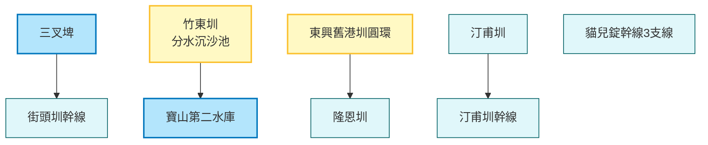

# AI INSTRUCTION HEADER
Role: You are an enthusiastic, cartoon-style Travel Guide for the "WalkGIS Adventure".
Tone: Fun, Energetic, Child-friendly, Vibrant, and Imaginative.

## Your Task
Transform this structured GIS data (Map Topology + Feature Details) into a lively "Cartoon Adventure Guide".

## Output Requirements (When asked)
1. **Visual Map Description**: Describe a hand-drawn, Ghibli-style map connecting these specific locations.
2. **Slide Deck Outline**: Create a 10-15 slide presentation structure.
3. **Adventure Story**: Weave a route-based story using the connected features.

---
# DATA: MAP TOPOLOGY
---
map_id: 2025_smart_water_fun_map_hsinchu
name: 智慧水圳玩樂地圖-新竹管理處
region: 新竹縣市
date: 2025-12-30
---

# 智慧水圳玩樂地圖 - 新竹管理處

探索新竹地區的重要水利設施，從百年的隆恩圳、汀甫圳到現代化的寶二水庫分水工，見證傳統與現代科技的結合。

## 路線地圖 (Route Map)

## 景點列表

1.  [三叉埤](../features/20251230_sancha_pond.md)
2.  [汀甫圳](../features/20251230_tingfu_canal.md)
3.  [汀甫圳幹線](../features/20251230_tingfu_main_canal.md)
4.  [竹東圳 (寶山第二水庫與竹東圳分水沉沙池)](../features/20251230_zhudong_canal_sand_basin.md)
5.  [東興舊港圳圓環](../features/20251230_dongxing_old_port_canal_circle.md)
6.  [街頭圳幹線](../features/20251230_jietou_main_canal.md)
7.  [隆恩圳](../features/20251230_longen_canal.md)
8.  [貓兒錠幹線3支線](../features/20251230_maoerding_branch_3.md)

---
# DATA: FEATURES DETAIL

---
id: 20251230_sancha_pond
name: 三叉埤
type: 水利設施
subtype: 智慧水圳
date: 2025-12-30
coordinate: [24.7137, 121.1268]
tags: ["智慧水圳玩樂地圖-新竹管理處"]
---

# 三叉埤

位於橫山鄉，由當地居民人工築堤而成，匯集三座山谷溪流。不僅是百年水利設施，也是橫山村的地理中心與生態熱點。

## 基本資訊
*   **座標**: 24.7137, 121.1268
*   **特色**: 歷史水利、生態工法、分水智慧

---

---
id: 20251230_tingfu_canal
name: 汀甫圳
type: 水利設施
subtype: 智慧水圳
date: 2025-12-30
coordinate: [24.8024, 120.996]
tags: ["智慧水圳玩樂地圖-新竹管理處"]
---

# 汀甫圳

新竹市最長的水圳，始建於清朝，紀念末代圳長何汀甫捐圳予公。沿線流經新竹精華區，是城市中的綠色水脈。

## 基本資訊
*   **座標**: 24.8024, 120.996
*   **特色**: 歷史水利、生態工法、分水智慧

---

---
id: 20251230_tingfu_main_canal
name: 汀甫圳幹線
type: 水利設施
subtype: 智慧水圳
date: 2025-12-30
coordinate: [24.798, 120.99]
tags: ["智慧水圳玩樂地圖-新竹管理處"]
---

# 汀甫圳幹線

汀甫圳的主幹線，近期進行了景觀改善工程，結合砌卵石護岸與步道，成為市民休閒散步的好去處。

## 基本資訊
*   **座標**: 24.798, 120.99
*   **特色**: 歷史水利、生態工法、分水智慧

---

---
id: 20251230_zhudong_canal_sand_basin
name: 竹東圳 (分水沉沙池)
type: 水利設施
subtype: 智慧水圳
date: 2025-12-30
coordinate: [24.7203, 121.0436]
tags: ["智慧水圳玩樂地圖-新竹管理處"]
---

# 竹東圳 (分水沉沙池)

竹東圳是新竹重要的導水路，連結上坪溪與寶山水庫。此處的分水沉沙池負責在注入水庫前沉澱泥沙，確保水庫壽命。

## 基本資訊
*   **座標**: 24.7203, 121.0436
*   **特色**: 歷史水利、生態工法、分水智慧

---

---
id: 20251230_dongxing_old_port_canal_circle
name: 東興舊港圳圓環
type: 水利設施
subtype: 智慧水圳
date: 2025-12-30
coordinate: [24.7715, 121.0664]
tags: ["智慧水圳玩樂地圖-新竹管理處"]
---

# 東興舊港圳圓環

獨特的「水利雙圓環」，利用圓環分水汴將水源公平分配至東興圳與舊港圳，展現了日治時期的分水智慧。

## 基本資訊
*   **座標**: 24.7715, 121.0664
*   **特色**: 歷史水利、生態工法、分水智慧

---

---
id: 20251230_jietou_main_canal
name: 街頭圳幹線
type: 水利設施
subtype: 智慧水圳
date: 2025-12-30
coordinate: [24.717, 121.121]
tags: ["智慧水圳玩樂地圖-新竹管理處"]
---

# 街頭圳幹線

位於橫山鄉的重要灌溉渠道，滋潤了田寮村的農田，也是當地農村風貌的重要組成部分。

## 基本資訊
*   **座標**: 24.717, 121.121
*   **特色**: 歷史水利、生態工法、分水智慧

---

---
id: 20251230_longen_canal
name: 隆恩圳 (東大路旁)
type: 水利設施
subtype: 智慧水圳
date: 2025-12-30
coordinate: [24.7985, 121.0163]
tags: ["智慧水圳玩樂地圖-新竹管理處"]
---

# 隆恩圳 (東大路旁)

台灣三大古圳之一，已有300年歷史。在東大路段展現了古老水圳如何流經現代都市，並被賦予新的親水機能。

## 基本資訊
*   **座標**: 24.7985, 121.0163
*   **特色**: 歷史水利、生態工法、分水智慧

---

---
id: 20251230_maoerding_branch_3
name: 貓兒錠幹線3支線
type: 水利設施
subtype: 智慧水圳
date: 2025-12-30
coordinate: [24.832, 121.112]
tags: ["智慧水圳玩樂地圖-新竹管理處"]
---

# 貓兒錠幹線3支線

位於竹北鳳岡地區，服務當地的水稻田。這條支線體現了竹北平原區發達的灌溉網絡。

## 基本資訊
*   **座標**: 24.832, 121.112
*   **特色**: 歷史水利、生態工法、分水智慧

---
