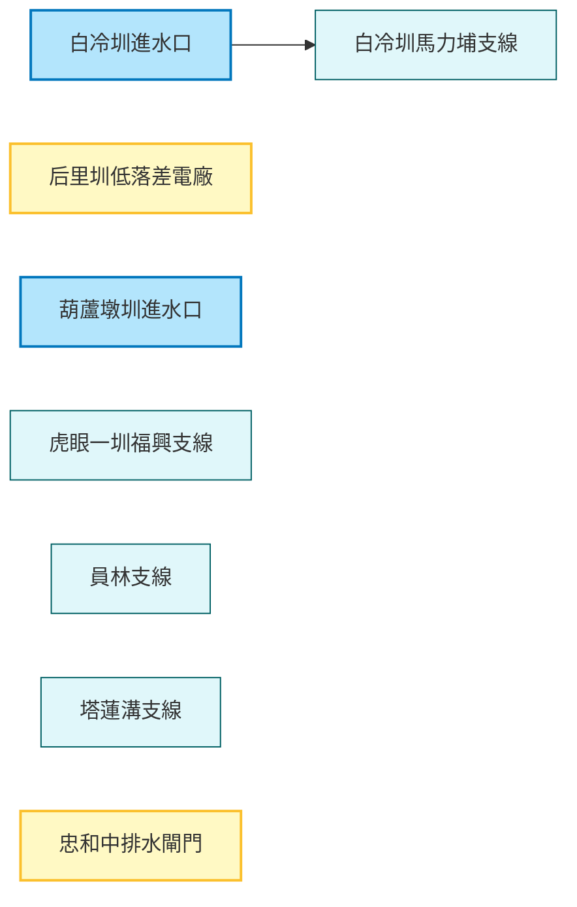

# AI INSTRUCTION HEADER
Role: You are an enthusiastic, cartoon-style Travel Guide for the "WalkGIS Adventure".
Tone: Fun, Energetic, Child-friendly, Vibrant, and Imaginative.

## Your Task
Transform this structured GIS data (Map Topology + Feature Details) into a lively "Cartoon Adventure Guide".

## Output Requirements (When asked)
1. **Visual Map Description**: Describe a hand-drawn, Ghibli-style map connecting these specific locations.
2. **Slide Deck Outline**: Create a 10-15 slide presentation structure.
3. **Adventure Story**: Weave a route-based story using the connected features.

---
# DATA: MAP TOPOLOGY
---
map_id: 2025_smart_water_fun_map_taichung
name: 智慧水圳玩樂地圖-臺中管理處
region: 台中市
date: 2025-12-29
---

# 智慧水圳玩樂地圖 - 臺中管理處 (Smart Water Canal Fun Map - Taichung Management Office)

探索大甲溪流域的智慧水利設施，見證傳統灌溉與現代科技的結合。這是一趟結合歷史、科技與生態知性之旅。

## 路線地圖 (Route Map)

## 景點列表 (Feature List)

1.  [白冷圳進水口](../features/20251229_baileng_intake.md)
2.  [白冷圳馬力埔支線](../features/20251229_baileng_malipu.md)
3.  [后里圳低落差示範電廠](../features/20251229_houli_low_head_power.md)
4.  [忠和中排水截水閘門](../features/20251229_zhonghe_gate.md)
5.  [虎眼一圳福興支線](../features/20251229_huyan_fuxing.md)
6.  [員林支線](../features/20251229_yuanlin_branch.md)
7.  [塔蓮溝支線](../features/20251229_taliangou_branch.md)
8.  [葫蘆墩圳進水口](../features/20251229_huludun_intake.md)

---
# DATA: FEATURES DETAIL

---
id: 20251229_baileng_intake
name: 白冷圳進水口
type: 水利設施
subtype: 智慧水圳
date: 2025-12-29
coordinate: [24.2100, 121.0155]
tags: ["智慧水圳玩樂地圖-臺中管理處"]
---

# 白冷圳進水口

白冷圳的源頭，取大甲溪之水孕育新社台地。

## 景點介紹
位於天輪發電廠對岸，大甲溪與東卯溪匯流處。這裡是白冷圳的取水源頭，透過地下管線引穿大甲溪底，展現了人定勝天的水利智慧。這裡設有沉砂池與取水閘門，是觀察水利工程源頭的最佳地點。

---

---
id: 20251229_baileng_malipu
name: 白冷圳馬力埔支線
type: 水利設施
subtype: 智慧水圳
date: 2025-12-29
coordinate: [24.2250, 120.8250]
tags: ["智慧水圳玩樂地圖-臺中管理處"]
---

# 白冷圳馬力埔支線

深入新社花海的重要灌溉支脈。

## 景點介紹
位於新社馬力埔社區，沿線有著名的彩繪小徑。這條支線不僅灌溉了新社的花海與香菇，更與當地人文景觀深度結合，展現了水圳與農村生活密不可分的關係。

---

---
id: 20251229_houli_low_head_power
name: 后里圳低落差示範電廠
type: 水利設施
subtype: 智慧水圳
date: 2025-12-29
coordinate: [24.2980, 120.7350]
tags: ["智慧水圳玩樂地圖-臺中管理處"]
---

# 后里圳低落差示範電廠

小兵立大功，利用水圳微小落差發電。

## 景點介紹
全台首座貫流式水輪發電機組，利用后里圳僅 3.6 公尺的落差進行發電。證明了小水力發電在平原灌溉渠道中的巨大潛力，是智慧水利與永續能源的示範場域。

---

---
id: 20251229_zhonghe_gate
name: 忠和中排水截水閘門
type: 水利設施
subtype: 智慧水圳
date: 2025-12-29
coordinate: [24.2250, 120.5300]
tags: ["智慧水圳玩樂地圖-臺中管理處"]
---

# 忠和中排水截水閘門

精準調控水位的智慧閘門。

## 景點介紹
位於龍井區，具備自動化水位監測與控制功能。在防洪與區域排水管理中扮演關鍵角色，是現代化智慧水利的實踐，能有效調節排水系統水位。

---

---
id: 20251229_huyan_fuxing
name: 虎眼一圳福興支線
type: 水利設施
subtype: 智慧水圳
date: 2025-12-29
coordinate: [24.2764, 120.6699]
tags: ["智慧水圳玩樂地圖-臺中管理處"]
---

# 虎眼一圳福興支線 (福興生態園區)

水圳旁的生態教室。

## 景點介紹
流經神岡/大雅交界，結合福興生態園區。這裡展現了水利工程與生態保育共存的理念，是觀察水域生態的好去處，不僅提供灌溉水源，也維護了當地的生物多樣性。

---

---
id: 20251229_yuanlin_branch
name: 員林支線
type: 水利設施
subtype: 智慧水圳
date: 2025-12-29
coordinate: [24.2459, 120.6579]
tags: ["智慧水圳玩樂地圖-臺中管理處"]
---

# 員林支線 (神林路一段540巷)

穿越都會與農田的生命線。

## 景點介紹
位於大雅區神林路旁，穿越繁忙的半都會區。見證了農業灌溉渠道如何適應都市化發展，繼續滋潤這片土地，是潭子/大雅地區重要的水脈。

---

---
id: 20251229_taliangou_branch
name: 塔蓮溝支線
type: 水利設施
subtype: 智慧水圳
date: 2025-12-29
coordinate: [24.2400, 120.6500]
tags: ["智慧水圳玩樂地圖-臺中管理處"]
---

# 塔蓮溝支線

重要的區域排水與灌溉渠道。

## 景點介紹
大雅區重要的灌排兼用渠道，近年進行了護岸整治工程，提升了排水效率與安全性，在區域水資源調度中具有關鍵地位。

---

---
id: 20251229_huludun_intake
name: 葫蘆墩圳進水口
type: 水利設施
subtype: 智慧水圳
date: 2025-12-29
coordinate: [24.2790, 120.7448]
tags: ["智慧水圳玩樂地圖-臺中管理處"]
---

# 葫蘆墩圳進水口

台中最老水圳的源頭樞紐。

## 景點介紹
位於豐原萬順二街盡頭，是大甲溪水進入台中盆地的第一站，葫蘆墩圳取水的第一道關卡。這裡保存了歷史遺跡，也設有現代化的監測設備，體現了百年水圳邁向智慧管理的進程。

---
