# AI INSTRUCTION HEADER
Role: You are an enthusiastic, cartoon-style Travel Guide for the "WalkGIS Adventure".
Tone: Fun, Energetic, Child-friendly, Vibrant, and Imaginative.

## Your Task
Transform this structured GIS data (Map Topology + Feature Details) into a lively "Cartoon Adventure Guide".

## Output Requirements (When asked)
1. **Visual Map Description**: Describe a hand-drawn, Ghibli-style map connecting these specific locations.
2. **Slide Deck Outline**: Create a 10-15 slide presentation structure.
3. **Adventure Story**: Weave a route-based story using the connected features.

---
# DATA: MAP TOPOLOGY
---
id: 20260111_ia_central_canals
name: 農田水利署中區圳路地圖
description: 彰化、雲林、南投管理處重要圳路設施
region: 中台灣
cover_image: assets/cover_images/placeholder.jpg
created_at: 2026-01-11
updated_at: 2026-01-11
tags: [水利設施, 圳路, 農田水利署]
---

# 農田水利署中區圳路地圖

## 地圖結構 (Topology)

```mermaid
graph TD
    八堡一圳["八堡一圳"]
    農田水利署彰化管理處_用水管制中心["農田水利署彰化管理處 用水管制中心"]
    葫蘆墩圳舊進水口["葫蘆墩圳舊進水口"]
    500彰化縣彰化市河濱路["500彰化縣彰化市河濱路"]
    義和共同制水埧管理站["義和共同制水埧管理站"]
    斗六大圳進水口["斗六大圳進水口"]
    水圳綠道起點__雲林農田水利文物館["水圳綠道起點 (雲林農田水利文物館)"]
    林內二號進水口["林內二號進水口"]
    林內分水工["林內分水工"]
    後庄埤親水公園["後庄埤親水公園"]
    新頂埤頭線大排["新頂埤頭線大排"]
    嘉南大圳濁幹線調蓄池["嘉南大圳濁幹線調蓄池"]
    北圳步道["北圳步道"]
    阿罩霧圳幹線["阿罩霧圳幹線"]
    鳳雛生態步道["鳳雛生態步道"]
    農業部農田水利署南投管理處土城工作站["農業部農田水利署南投管理處土城工作站"]
    頭社水庫["頭社水庫"]
    頭社水庫生態步道["頭社水庫生態步道"]
    水利設施_彰化管理處(水利設施-彰化管理處)
    水利設施_彰化管理處 --> 八堡一圳
    水利設施_彰化管理處 --> 農田水利署彰化管理處_用水管制中心
    水利設施_彰化管理處 --> 葫蘆墩圳舊進水口
    水利設施_彰化管理處 --> 500彰化縣彰化市河濱路
    水利設施_彰化管理處 --> 義和共同制水埧管理站
    水利設施_雲林管理處(水利設施-雲林管理處)
    水利設施_雲林管理處 --> 斗六大圳進水口
    水利設施_雲林管理處 --> 水圳綠道起點__雲林農田水利文物館
    水利設施_雲林管理處 --> 林內二號進水口
    水利設施_雲林管理處 --> 林內分水工
    水利設施_雲林管理處 --> 後庄埤親水公園
    水利設施_雲林管理處 --> 新頂埤頭線大排
    水利設施_雲林管理處 --> 嘉南大圳濁幹線調蓄池
    水利設施_南投管理處(水利設施-南投管理處)
    水利設施_南投管理處 --> 北圳步道
    水利設施_南投管理處 --> 阿罩霧圳幹線
    水利設施_南投管理處 --> 鳳雛生態步道
    水利設施_南投管理處 --> 農業部農田水利署南投管理處土城工作站
    水利設施_南投管理處 --> 頭社水庫
    水利設施_南投管理處 --> 頭社水庫生態步道
```


## 簡介 (Introduction)
本圖資彙整了農業部農田水利署（彰化、雲林、南投管理處）轄區內的重要圳路設施、取水口與相關景點。適合進行水利文化探索與考察。

## 使用者補充筆記 (User Notes)
### 重點觀察
- 彰化：八堡圳水系
- 雲林：濁幹線與水圳綠道
- 南投：埔里與頭社水庫生態

## 🗺️ AI 深度探索 (Deep Research)
如果您擁有 Gemini Advanced 或其他 Deep Research 工具，可以複製以下 Prompt，針對本工程地圖進行深度的文史與美食探索：

```markdown
# Context
一份名為「農田水利署中區圳路地圖」的導覽路線，探索中台灣重要的農田水利設施。

# Task
請針對以下景點列表，進行 Deep Research，挖掘背後的「歷史深度」、「生活溫度」與「在地美食」。

**景點列表：**
1. 八堡圳 (台灣最古老埤圳)
2. 斗六大圳
3. 頭社水庫
4. 水圳綠道

# Requirements (請分析以下維度)
1. **歷史與工程脈絡**: 該點在台灣水利/歷史的角色？
2. **在地文化與生態**: 周邊古蹟、廟宇、特殊生態景觀。
3. **順遊景點**: 步行/單車可達的隱藏景點。
4. **必吃在地美食**: 老字號小吃、在地人推薦 (非連鎖)。
```

## 📊 Dynamic View 視覺化
如果您已經產出了 Deep Research Report，接著在 Dynamic View 中，您的 Prompt 策略應該從「獲取資訊」轉向**「結構化與視覺化」**。

1. **生成時間軸 (Timeline View)**
   - Prompt: "基於這份研究報告，請以時間軸視圖呈現各水利設施的建造年代與演變。"
2. **生成比較表格 (Comparison Table View)**
   - Prompt: "請建立一個比較表格，分析不同管理處（彰化/雲林/南投）的灌溉特色與水源差異。"

## 下載與資源 (Resources)
- **[KML 地圖檔下載](./20260111_ia_central_canals.kml)**

## 景點列表 (Features)
- [八堡一圳](../features/20260111_ia_central_canals_00_八堡一圳.md)
- [農田水利署彰化管理處 用水管制中心](../features/20260111_ia_central_canals_01_農田水利署彰化管理處_用水管制中心.md)
- [葫蘆墩圳舊進水口](../features/20260111_ia_central_canals_02_葫蘆墩圳舊進水口.md)
- [500彰化縣彰化市河濱路](../features/20260111_ia_central_canals_03_500彰化縣彰化市河濱路.md)
- [義和共同制水埧管理站](../features/20260111_ia_central_canals_04_義和共同制水埧管理站.md)
- [斗六大圳進水口](../features/20260111_ia_central_canals_05_斗六大圳進水口.md)
- [水圳綠道起點 (雲林農田水利文物館)](../features/20260111_ia_central_canals_06_水圳綠道起點__雲林農田水利文物館.md)
- [林內二號進水口](../features/20260111_ia_central_canals_07_林內二號進水口.md)
- [林內分水工](../features/20260111_ia_central_canals_08_林內分水工.md)
- [後庄埤親水公園](../features/20260111_ia_central_canals_09_後庄埤親水公園.md)
- [新頂埤頭線大排](../features/20260111_ia_central_canals_10_新頂埤頭線大排.md)
- [嘉南大圳濁幹線調蓄池](../features/20260111_ia_central_canals_11_嘉南大圳濁幹線調蓄池.md)
- [北圳步道](../features/20260111_ia_central_canals_12_北圳步道.md)
- [阿罩霧圳幹線](../features/20260111_ia_central_canals_13_阿罩霧圳幹線.md)
- [鳳雛生態步道](../features/20260111_ia_central_canals_14_鳳雛生態步道.md)
- [農業部農田水利署南投管理處土城工作站](../features/20260111_ia_central_canals_15_農業部農田水利署南投管理處土城工作站.md)
- [頭社水庫](../features/20260111_ia_central_canals_16_頭社水庫.md)
- [頭社水庫生態步道](../features/20260111_ia_central_canals_17_頭社水庫生態步道.md)

---
# DATA: FEATURES DETAIL

---
id: 20260111_ia_central_canals_00_八堡一圳
name: 八堡一圳
description: 水利設施-彰化管理處 - 510台灣彰化縣員林市惠明街53巷26弄7號
geometry:
  type: Point
  coordinates: [120.5711887, 23.9499528]
properties:
  category: 水利設施-彰化管理處
  rating: 4.5
  place_id: ChIJe_ArEQA3aTQRnTf8VqLvlH4
---

# 八堡一圳

- **類別**: 水利設施-彰化管理處
- **地址**: 510台灣彰化縣員林市惠明街53巷26弄7號
- **評分**: 4.5

## 簡介
(待補充詳細資料)

## 相關連結
- [Google Maps](https://www.google.com/maps/search/?api=1&query=23.9499528,120.5711887&query_place_id=ChIJe_ArEQA3aTQRnTf8VqLvlH4)

---

---
id: 20260111_ia_central_canals_01_農田水利署彰化管理處_用水管制中心
name: 農田水利署彰化管理處 用水管制中心
description: 水利設施-彰化管理處 - 530台灣彰化縣二水鄉員集路二段227號
geometry:
  type: Point
  coordinates: [120.644819, 23.7991988]
properties:
  category: 水利設施-彰化管理處
  rating: 4
  place_id: ChIJf3zrHO3MbjQRrT7xnDiO5k4
---

# 農田水利署彰化管理處 用水管制中心

- **類別**: 水利設施-彰化管理處
- **地址**: 530台灣彰化縣二水鄉員集路二段227號
- **評分**: 4

## 簡介
(待補充詳細資料)

## 相關連結
- [Google Maps](https://www.google.com/maps/search/?api=1&query=23.7991988,120.644819&query_place_id=ChIJf3zrHO3MbjQRrT7xnDiO5k4)

---

---
id: 20260111_ia_central_canals_02_葫蘆墩圳舊進水口
name: 葫蘆墩圳舊進水口
description: 水利設施-彰化管理處 - 420台灣臺中市豐原區萬順二街
geometry:
  type: Point
  coordinates: [120.7448105, 24.2789675]
properties:
  category: 水利設施-彰化管理處
  rating: 4.3
  place_id: ChIJZ4izogEbaTQRjUrAvaNyoLk
---

# 葫蘆墩圳舊進水口

- **類別**: 水利設施-彰化管理處
- **地址**: 420台灣臺中市豐原區萬順二街
- **評分**: 4.3

## 簡介
(待補充詳細資料)

## 相關連結
- [Google Maps](https://www.google.com/maps/search/?api=1&query=24.2789675,120.7448105&query_place_id=ChIJZ4izogEbaTQRjUrAvaNyoLk)

---

---
id: 20260111_ia_central_canals_03_500彰化縣彰化市河濱路
name: 500彰化縣彰化市河濱路
description: 水利設施-彰化管理處 - 500台灣彰化縣彰化市河濱路
geometry:
  type: Point
  coordinates: [120.6125935, 24.0852657]
properties:
  category: 水利設施-彰化管理處
  rating: 0
  place_id: ChIJcyT3IlA5aTQRwYrSgg-JrKk
---

# 500彰化縣彰化市河濱路

- **類別**: 水利設施-彰化管理處
- **地址**: 500台灣彰化縣彰化市河濱路
- **評分**: 0

## 簡介
(待補充詳細資料)

## 相關連結
- [Google Maps](https://www.google.com/maps/search/?api=1&query=24.0852657,120.6125935&query_place_id=ChIJcyT3IlA5aTQRwYrSgg-JrKk)

---

---
id: 20260111_ia_central_canals_04_義和共同制水埧管理站
name: 義和共同制水埧管理站
description: 水利設施-彰化管理處 - 號, No. 32環河路一段溪湖鎮彰化縣台灣 514
geometry:
  type: Point
  coordinates: [120.4719921, 23.9270752]
properties:
  category: 水利設施-彰化管理處
  rating: 4.5
  place_id: ChIJf1FDFLdLaTQRrUZgz9KDOJI
---

# 義和共同制水埧管理站

- **類別**: 水利設施-彰化管理處
- **地址**: 號, No. 32環河路一段溪湖鎮彰化縣台灣 514
- **評分**: 4.5

## 簡介
(待補充詳細資料)

## 相關連結
- [Google Maps](https://www.google.com/maps/search/?api=1&query=23.9270752,120.4719921&query_place_id=ChIJf1FDFLdLaTQRrUZgz9KDOJI)

---

---
id: 20260111_ia_central_canals_05_斗六大圳進水口
name: 斗六大圳進水口
description: 水利設施-雲林管理處 - 號 堤防, No. 1新光路林內鄉雲林縣台灣 643
geometry:
  type: Point
  coordinates: [120.6444247, 23.7704728]
properties:
  category: 水利設施-雲林管理處
  rating: 3
  place_id: ChIJwU2mGELMbjQR2R2hFfCcTBY
---

# 斗六大圳進水口

- **類別**: 水利設施-雲林管理處
- **地址**: 號 堤防, No. 1新光路林內鄉雲林縣台灣 643
- **評分**: 3

## 簡介
(待補充詳細資料)

## 相關連結
- [Google Maps](https://www.google.com/maps/search/?api=1&query=23.7704728,120.6444247&query_place_id=ChIJwU2mGELMbjQR2R2hFfCcTBY)

---

---
id: 20260111_ia_central_canals_06_水圳綠道起點__雲林農田水利文物館
name: 水圳綠道起點 (雲林農田水利文物館)
description: 水利設施-雲林管理處 - 雲林縣林內鄉三星路9-2號 (農田水利文物館)
geometry:
  type: Point
  coordinates: [120.6155, 23.7595]
properties:
  category: 水利設施-雲林管理處
  rating: 4.5
  place_id: corrected_manual
---

# 水圳綠道起點 (雲林農田水利文物館)

- **類別**: 水利設施-雲林管理處
- **地址**: 雲林縣林內鄉三星路9-2號 (農田水利文物館)
- **評分**: 4.5

## 簡介
(待補充詳細資料)

## 相關連結
- [Google Maps](https://www.google.com/maps/search/?api=1&query=23.7595,120.6155&query_place_id=corrected_manual)

---

---
id: 20260111_ia_central_canals_07_林內二號進水口
name: 林內二號進水口
description: 水利設施-雲林管理處 - 643台灣雲林縣林內鄉林內二號堤防
geometry:
  type: Point
  coordinates: [120.6161865, 23.7829556]
properties:
  category: 水利設施-雲林管理處
  rating: 4.3
  place_id: ChIJ90MHR4bLbjQRogAWi5qwkP8
---

# 林內二號進水口

- **類別**: 水利設施-雲林管理處
- **地址**: 643台灣雲林縣林內鄉林內二號堤防
- **評分**: 4.3

## 簡介
(待補充詳細資料)

## 相關連結
- [Google Maps](https://www.google.com/maps/search/?api=1&query=23.7829556,120.6161865&query_place_id=ChIJ90MHR4bLbjQRogAWi5qwkP8)

---

---
id: 20260111_ia_central_canals_08_林內分水工
name: 林內分水工
description: 水利設施-雲林管理處 - 八卦 池, 林內鄉雲林縣台灣 643
geometry:
  type: Point
  coordinates: [120.6137271, 23.7801608]
properties:
  category: 水利設施-雲林管理處
  rating: 3.5
  place_id: ChIJxzPRMY_LbjQR_0hBNVzsXbE
---

# 林內分水工

- **類別**: 水利設施-雲林管理處
- **地址**: 八卦 池, 林內鄉雲林縣台灣 643
- **評分**: 3.5

## 簡介
(待補充詳細資料)

## 相關連結
- [Google Maps](https://www.google.com/maps/search/?api=1&query=23.7801608,120.6137271&query_place_id=ChIJxzPRMY_LbjQR_0hBNVzsXbE)

---

---
id: 20260111_ia_central_canals_09_後庄埤親水公園
name: 後庄埤親水公園
description: 水利設施-雲林管理處 - 640台灣雲林縣斗六市大學路三段
geometry:
  type: Point
  coordinates: [120.524815, 23.6941231]
properties:
  category: 水利設施-雲林管理處
  rating: 4.1
  place_id: ChIJBZaUHQC3bjQRRfJIMMZwNRk
---

# 後庄埤親水公園

- **類別**: 水利設施-雲林管理處
- **地址**: 640台灣雲林縣斗六市大學路三段
- **評分**: 4.1

## 簡介
(待補充詳細資料)

## 相關連結
- [Google Maps](https://www.google.com/maps/search/?api=1&query=23.6941231,120.524815&query_place_id=ChIJBZaUHQC3bjQRRfJIMMZwNRk)

---

---
id: 20260111_ia_central_canals_10_新頂埤頭線大排
name: 新頂埤頭線大排
description: 水利設施-雲林管理處 - 648台灣雲林縣西螺鎮新頂埤頭線大排
geometry:
  type: Point
  coordinates: [120.475997, 23.7804772]
properties:
  category: 水利設施-雲林管理處
  rating: 3.3
  place_id: ChIJKZbui9q1bjQRwhh-7Uj8Wi8
---

# 新頂埤頭線大排

- **類別**: 水利設施-雲林管理處
- **地址**: 648台灣雲林縣西螺鎮新頂埤頭線大排
- **評分**: 3.3

## 簡介
(待補充詳細資料)

## 相關連結
- [Google Maps](https://www.google.com/maps/search/?api=1&query=23.7804772,120.475997&query_place_id=ChIJKZbui9q1bjQRwhh-7Uj8Wi8)

---

---
id: 20260111_ia_central_canals_11_嘉南大圳濁幹線調蓄池
name: 嘉南大圳濁幹線調蓄池
description: 水利設施-雲林管理處 - 632台灣雲林縣虎尾鎮工專路281號
geometry:
  type: Point
  coordinates: [120.4217521, 23.7082724]
properties:
  category: 水利設施-雲林管理處
  rating: 0
  place_id: ChIJEXbWL7uxbjQR4lTPyhbE3wA
---

# 嘉南大圳濁幹線調蓄池

- **類別**: 水利設施-雲林管理處
- **地址**: 632台灣雲林縣虎尾鎮工專路281號
- **評分**: 0

## 簡介
(待補充詳細資料)

## 相關連結
- [Google Maps](https://www.google.com/maps/search/?api=1&query=23.7082724,120.4217521&query_place_id=ChIJEXbWL7uxbjQR4lTPyhbE3wA)

---

---
id: 20260111_ia_central_canals_12_北圳步道
name: 北圳步道
description: 水利設施-南投管理處 - 544台灣南投縣國姓鄉北圳巷28-1號
geometry:
  type: Point
  coordinates: [120.9229141, 24.0623798]
properties:
  category: 水利設施-南投管理處
  rating: 3.9
  place_id: ChIJxVyKlAvfaDQRk9iJYEi_yzY
---

# 北圳步道

- **類別**: 水利設施-南投管理處
- **地址**: 544台灣南投縣國姓鄉北圳巷28-1號
- **評分**: 3.9

## 簡介
(待補充詳細資料)

## 相關連結
- [Google Maps](https://www.google.com/maps/search/?api=1&query=24.0623798,120.9229141&query_place_id=ChIJxVyKlAvfaDQRk9iJYEi_yzY)

---

---
id: 20260111_ia_central_canals_13_阿罩霧圳幹線
name: 阿罩霧圳幹線
description: 水利設施-南投管理處 - 413台灣臺中市霧峰區阿罩霧圳幹線
geometry:
  type: Point
  coordinates: [120.700924, 24.0114824]
properties:
  category: 水利設施-南投管理處
  rating: 4.4
  place_id: ChIJ54GhN8Y6aTQRJtW3nohVIOM
---

# 阿罩霧圳幹線

- **類別**: 水利設施-南投管理處
- **地址**: 413台灣臺中市霧峰區阿罩霧圳幹線
- **評分**: 4.4

## 簡介
(待補充詳細資料)

## 相關連結
- [Google Maps](https://www.google.com/maps/search/?api=1&query=24.0114824,120.700924&query_place_id=ChIJ54GhN8Y6aTQRJtW3nohVIOM)

---

---
id: 20260111_ia_central_canals_14_鳳雛生態步道
name: 鳳雛生態步道
description: 水利設施-南投管理處 - 545台灣南投縣埔里鎮投72鄉道
geometry:
  type: Point
  coordinates: [120.972365, 23.9408611]
properties:
  category: 水利設施-南投管理處
  rating: 4.1
  place_id: ChIJHX_ZJu7ZaDQRuy0tavEqPy0
---

# 鳳雛生態步道

- **類別**: 水利設施-南投管理處
- **地址**: 545台灣南投縣埔里鎮投72鄉道
- **評分**: 4.1

## 簡介
(待補充詳細資料)

## 相關連結
- [Google Maps](https://www.google.com/maps/search/?api=1&query=23.9408611,120.972365&query_place_id=ChIJHX_ZJu7ZaDQRuy0tavEqPy0)

---

---
id: 20260111_ia_central_canals_15_農業部農田水利署南投管理處土城工作站
name: 農業部農田水利署南投管理處土城工作站
description: 水利設施-南投管理處 - 542台灣南投縣草屯鎮中正路128號
geometry:
  type: Point
  coordinates: [120.7490451, 23.9841342]
properties:
  category: 水利設施-南投管理處
  rating: 4.7
  place_id: ChIJR36uoHslaTQRrnK7Oopsdsg
---

# 農業部農田水利署南投管理處土城工作站

- **類別**: 水利設施-南投管理處
- **地址**: 542台灣南投縣草屯鎮中正路128號
- **評分**: 4.7

## 簡介
(待補充詳細資料)

## 相關連結
- [Google Maps](https://www.google.com/maps/search/?api=1&query=23.9841342,120.7490451&query_place_id=ChIJR36uoHslaTQRrnK7Oopsdsg)

---

---
id: 20260111_ia_central_canals_16_頭社水庫
name: 頭社水庫
description: 水利設施-南投管理處 - 555台灣南投縣魚池鄉頭社水庫
geometry:
  type: Point
  coordinates: [120.8967211, 23.8363861]
properties:
  category: 水利設施-南投管理處
  rating: 4.3
  place_id: ChIJOfdsuIrVaDQRzoMw46RoLTU
---

# 頭社水庫

- **類別**: 水利設施-南投管理處
- **地址**: 555台灣南投縣魚池鄉頭社水庫
- **評分**: 4.3

## 簡介
(待補充詳細資料)

## 相關連結
- [Google Maps](https://www.google.com/maps/search/?api=1&query=23.8363861,120.8967211&query_place_id=ChIJOfdsuIrVaDQRzoMw46RoLTU)

---

---
id: 20260111_ia_central_canals_17_頭社水庫生態步道
name: 頭社水庫生態步道
description: 水利設施-南投管理處 - 555台灣南投縣魚池鄉頭社村
geometry:
  type: Point
  coordinates: [120.8984715, 23.8387831]
properties:
  category: 水利設施-南投管理處
  rating: 4.3
  place_id: ChIJgyyOHvXVaDQRoGM2r74ANJw
---

# 頭社水庫生態步道

- **類別**: 水利設施-南投管理處
- **地址**: 555台灣南投縣魚池鄉頭社村
- **評分**: 4.3

## 簡介
(待補充詳細資料)

## 相關連結
- [Google Maps](https://www.google.com/maps/search/?api=1&query=23.8387831,120.8984715&query_place_id=ChIJgyyOHvXVaDQRoGM2r74ANJw)

---
