# AI INSTRUCTION HEADER
Role: You are an enthusiastic, cartoon-style Travel Guide for the "WalkGIS Adventure".
Tone: Fun, Energetic, Child-friendly, Vibrant, and Imaginative.

## Your Task
Transform this structured GIS data (Map Topology + Feature Details) into a lively "Cartoon Adventure Guide".

## Output Requirements (When asked)
1. **Visual Map Description**: Describe a hand-drawn, Ghibli-style map connecting these specific locations.
2. **Slide Deck Outline**: Create a 10-15 slide presentation structure.
3. **Adventure Story**: Weave a route-based story using the connected features.

---
# DATA: MAP TOPOLOGY
---
id: 20260111_zhuoshui_facilities
name: 濁水溪及其周邊景點設施地圖
description: 彙整濁水溪流域之交通、水利、人文與自然景點
region: 中台灣
cover_image: assets/cover_images/placeholder.jpg
created_at: 2026-01-11
updated_at: 2026-01-11
tags: [濁水溪, 景點, 設施]
---

# 濁水溪及其周邊景點設施地圖

## 簡介 (Introduction)
彙整濁水溪流域之交通、水利、人文與自然景點。本資料集包含水利、交通、人文、自然等多面向的景點。

## 地圖結構 (Topology)

```mermaid
graph TD
    Map["濁水溪及其周邊景點設施地圖"]

    Note["(Graph Truncated: Too many features to display in Mermaid)"]
    Map --> Note
```

## 🗺️ AI 深度探索 (Deep Research)
(由於景點眾多，建議針對特定分類進行搜尋)

## 下載與資源 (Resources)
- **[KML 地圖檔下載](./20260111_zhuoshui_facilities.kml)**

## 景點列表 (Features)
- [二水車站](../features/20260111_zhuoshui_facilities_000_二水車站.md)
- [源泉車站](../features/20260111_zhuoshui_facilities_001_源泉車站.md)
- [二水自行車道](../features/20260111_zhuoshui_facilities_002_二水自行車道.md)
- [二水登廟步道](../features/20260111_zhuoshui_facilities_003_二水登廟步道.md)
- [豐柏廣場](../features/20260111_zhuoshui_facilities_004_豐柏廣場.md)
- [龍仔頭山](../features/20260111_zhuoshui_facilities_005_龍仔頭山.md)
- [二水台灣獼猴保護區](../features/20260111_zhuoshui_facilities_006_二水台灣獼猴保護區.md)
- [林先生廟](../features/20260111_zhuoshui_facilities_007_林先生廟.md)
- [大丘園休閒農場](../features/20260111_zhuoshui_facilities_008_大丘園休閒農場.md)
- [二八彎農園](../features/20260111_zhuoshui_facilities_009_二八彎農園.md)
- [水車農園](../features/20260111_zhuoshui_facilities_010_水車農園.md)
- [鼻子頭休閒農園](../features/20260111_zhuoshui_facilities_011_鼻子頭休閒農園.md)
- [蓮荷果休閒農園](../features/20260111_zhuoshui_facilities_012_蓮荷果休閒農園.md)
- [螺溪石藝館](../features/20260111_zhuoshui_facilities_013_螺溪石藝館.md)
- [大義崙天后宮](../features/20260111_zhuoshui_facilities_014_大義崙天后宮.md)
- [張廖宗祠崇遠堂](../features/20260111_zhuoshui_facilities_015_張廖宗祠崇遠堂.md)
- [國興宮](../features/20260111_zhuoshui_facilities_016_國興宮.md)
- [定安宮](../features/20260111_zhuoshui_facilities_017_定安宮.md)
- [彌陀精舍](../features/20260111_zhuoshui_facilities_018_彌陀精舍.md)
- [二崙自然步道](../features/20260111_zhuoshui_facilities_019_二崙自然步道.md)
- [二崙故事屋](../features/20260111_zhuoshui_facilities_020_二崙故事屋.md)
- [興山公園](../features/20260111_zhuoshui_facilities_021_興山公園.md)
- [鷺鷥生態景觀公園](../features/20260111_zhuoshui_facilities_022_鷺鷥生態景觀公園.md)
- [龍鳳瀑布](../features/20260111_zhuoshui_facilities_023_龍鳳瀑布.md)
- [仙峰日月洞](../features/20260111_zhuoshui_facilities_024_仙峰日月洞.md)
- [仙洞坪棋盤石](../features/20260111_zhuoshui_facilities_025_仙洞坪棋盤石.md)
- [粗坑大峭壁](../features/20260111_zhuoshui_facilities_026_粗坑大峭壁.md)
- [石龍宮](../features/20260111_zhuoshui_facilities_027_石龍宮.md)
- [金龍山法華寺](../features/20260111_zhuoshui_facilities_028_金龍山法華寺.md)
- [白鶴嶺天恩宮](../features/20260111_zhuoshui_facilities_029_白鶴嶺天恩宮.md)
- [太魯閣國家公園](../features/20260111_zhuoshui_facilities_030_太魯閣國家公園.md)
- [合歡山國家森林遊樂區](../features/20260111_zhuoshui_facilities_031_合歡山國家森林遊樂區.md)
- [奧萬大國家森林遊樂區](../features/20260111_zhuoshui_facilities_032_奧萬大國家森林遊樂區.md)
- [翠峰風景特定區](../features/20260111_zhuoshui_facilities_033_翠峰風景特定區.md)
- [鳶峰觀景台](../features/20260111_zhuoshui_facilities_034_鳶峰觀景台.md)
- [霧社水庫](../features/20260111_zhuoshui_facilities_035_霧社水庫.md)
- [廬山溫泉](../features/20260111_zhuoshui_facilities_036_廬山溫泉.md)
- [清境農場](../features/20260111_zhuoshui_facilities_037_清境農場.md)
- [台大梅峰農場](../features/20260111_zhuoshui_facilities_038_台大梅峰農場.md)
- [興大惠蓀林場](../features/20260111_zhuoshui_facilities_039_興大惠蓀林場.md)
- [泰雅渡假村](../features/20260111_zhuoshui_facilities_040_泰雅渡假村.md)
- [南投縣自然史教育館](../features/20260111_zhuoshui_facilities_041_南投縣自然史教育館.md)
- [霧社事件紀念公園](../features/20260111_zhuoshui_facilities_042_霧社事件紀念公園.md)
- [撩溪](../features/20260111_zhuoshui_facilities_043_撩溪.md)
- [二水跑水節](../features/20260111_zhuoshui_facilities_044_二水跑水節.md)
- [溪州黑泥季](../features/20260111_zhuoshui_facilities_045_溪州黑泥季.md)
- [濁溪搶水文化節](../features/20260111_zhuoshui_facilities_046_濁溪搶水文化節.md)
- [明潭水庫](../features/20260111_zhuoshui_facilities_047_明潭水庫.md)
- [寧靜谷](../features/20260111_zhuoshui_facilities_048_寧靜谷.md)
- [仙鄉瀑布](../features/20260111_zhuoshui_facilities_049_仙鄉瀑布.md)
- [石觀音](../features/20260111_zhuoshui_facilities_050_石觀音.md)
- [水里蛇窯](../features/20260111_zhuoshui_facilities_051_水里蛇窯.md)
- [車埕雙土地公廟](../features/20260111_zhuoshui_facilities_052_車埕雙土地公廟.md)
- [車埕休閒園區](../features/20260111_zhuoshui_facilities_053_車埕休閒園區.md)
- [水里溪親水區及自行車道](../features/20260111_zhuoshui_facilities_054_水里溪親水區及自行車道.md)
- [阿本農場櫻花祕境](../features/20260111_zhuoshui_facilities_055_阿本農場櫻花祕境.md)
- [雨社山聚落](../features/20260111_zhuoshui_facilities_056_雨社山聚落.md)
- [益則坑](../features/20260111_zhuoshui_facilities_057_益則坑.md)
- [建安堂](../features/20260111_zhuoshui_facilities_058_建安堂.md)
- [水里虎爺廟](../features/20260111_zhuoshui_facilities_059_水里虎爺廟.md)
- [水里鵲橋](../features/20260111_zhuoshui_facilities_060_水里鵲橋.md)
- [登瀛書院](../features/20260111_zhuoshui_facilities_061_登瀛書院.md)
- [明新書院](../features/20260111_zhuoshui_facilities_062_明新書院.md)
- [林鳳池舉人墓](../features/20260111_zhuoshui_facilities_063_林鳳池舉人墓.md)
- [八通關古道](../features/20260111_zhuoshui_facilities_064_八通關古道.md)
- [楠仔腳蔓社學堂遺蹟](../features/20260111_zhuoshui_facilities_065_楠仔腳蔓社學堂遺蹟.md)
- [草屯燉倫堂](../features/20260111_zhuoshui_facilities_066_草屯燉倫堂.md)
- [國姓鄉北港溪石橋](../features/20260111_zhuoshui_facilities_067_國姓鄉北港溪石橋.md)
- [祭祀公業張琯溪公宗祠](../features/20260111_zhuoshui_facilities_068_祭祀公業張琯溪公宗祠.md)
- [旗杆厝](../features/20260111_zhuoshui_facilities_069_旗杆厝.md)
- [南投市農會](../features/20260111_zhuoshui_facilities_070_南投市農會.md)
- [武德殿及其附屬建築群](../features/20260111_zhuoshui_facilities_071_武德殿及其附屬建築群.md)
- [崇善堂](../features/20260111_zhuoshui_facilities_072_崇善堂.md)
- [敷榮堂](../features/20260111_zhuoshui_facilities_073_敷榮堂.md)
- [南投縣陳姓宗親會西水祠](../features/20260111_zhuoshui_facilities_074_南投縣陳姓宗親會西水祠.md)
- [賴家古厝](../features/20260111_zhuoshui_facilities_075_賴家古厝.md)
- [陳家古厝](../features/20260111_zhuoshui_facilities_076_陳家古厝.md)
- [草屯國民小學禮堂](../features/20260111_zhuoshui_facilities_077_草屯國民小學禮堂.md)
- [碧峰國民小學禮堂](../features/20260111_zhuoshui_facilities_078_碧峰國民小學禮堂.md)
- [埔里黃宅](../features/20260111_zhuoshui_facilities_079_埔里黃宅.md)
- [水蛙窟考古遺址](../features/20260111_zhuoshui_facilities_080_水蛙窟考古遺址.md)
- [南投市中山公園「聚芳館」](../features/20260111_zhuoshui_facilities_081_南投市中山公園「聚芳館」.md)
- [新庄國小禮堂](../features/20260111_zhuoshui_facilities_082_新庄國小禮堂.md)
- [集集火車站](../features/20260111_zhuoshui_facilities_083_集集火車站.md)
- [集集林尾陳宅永福堂](../features/20260111_zhuoshui_facilities_084_集集林尾陳宅永福堂.md)
- [振昌興業股份有限公司建築群](../features/20260111_zhuoshui_facilities_085_振昌興業股份有限公司建築群.md)
- [甘泉井及石頭公](../features/20260111_zhuoshui_facilities_086_甘泉井及石頭公.md)
- [竹山隆恩圳隧渠](../features/20260111_zhuoshui_facilities_087_竹山隆恩圳隧渠.md)
- [鹿谷聖蹟亭](../features/20260111_zhuoshui_facilities_088_鹿谷聖蹟亭.md)
- [新庄國小日治宿舍](../features/20260111_zhuoshui_facilities_089_新庄國小日治宿舍.md)
- [國姓鄉南港村–林屋伙房](../features/20260111_zhuoshui_facilities_090_國姓鄉南港村–林屋伙房.md)
- [添興窯及其附屬設施](../features/20260111_zhuoshui_facilities_091_添興窯及其附屬設施.md)
- [大馬璘考古遺址](../features/20260111_zhuoshui_facilities_092_大馬璘考古遺址.md)
- [中興新村文化景觀](../features/20260111_zhuoshui_facilities_093_中興新村文化景觀.md)
- [行政院農業委員會農糧署](../features/20260111_zhuoshui_facilities_094_行政院農業委員會農糧署.md)
- [經濟部中部辦公室](../features/20260111_zhuoshui_facilities_095_經濟部中部辦公室.md)
- [臺灣銀行中興新村分行](../features/20260111_zhuoshui_facilities_096_臺灣銀行中興新村分行.md)
- [行政院農業委員會水土保持局](../features/20260111_zhuoshui_facilities_097_行政院農業委員會水土保持局.md)
- [中興會堂](../features/20260111_zhuoshui_facilities_098_中興會堂.md)
- [臺灣新生報中興新村辦事處](../features/20260111_zhuoshui_facilities_099_臺灣新生報中興新村辦事處.md)
- [臺灣省政資料館](../features/20260111_zhuoshui_facilities_100_臺灣省政資料館.md)
- [中華電信中興服務中心](../features/20260111_zhuoshui_facilities_101_中華電信中興服務中心.md)
- [國家文官學院中區培訓中心中正堂](../features/20260111_zhuoshui_facilities_102_國家文官學院中區培訓中心中正堂.md)
- [行政院人事行政局地方人事行政處](../features/20260111_zhuoshui_facilities_103_行政院人事行政局地方人事行政處.md)
- [國立中興大學實驗林管理處埔里連絡站](../features/20260111_zhuoshui_facilities_104_國立中興大學實驗林管理處埔里連絡站.md)
- [行政院農業委員會茶業改良場魚池分場](../features/20260111_zhuoshui_facilities_105_行政院農業委員會茶業改良場魚池分場.md)
- [社寮穀倉](../features/20260111_zhuoshui_facilities_106_社寮穀倉.md)
- [臺灣省政府](../features/20260111_zhuoshui_facilities_107_臺灣省政府.md)
- [林圮公墓](../features/20260111_zhuoshui_facilities_108_林圮公墓.md)
- [集集館](../features/20260111_zhuoshui_facilities_109_集集館.md)
- [林淵石頭厝](../features/20260111_zhuoshui_facilities_110_林淵石頭厝.md)
- [縣定古蹟永濟義渡碑(名間鄉)](../features/20260111_zhuoshui_facilities_111_縣定古蹟永濟義渡碑(名間鄉).md)
- [集集樟腦出張所建築群](../features/20260111_zhuoshui_facilities_112_集集樟腦出張所建築群.md)
- [縣定古蹟永濟義渡碑(竹山鎮)](../features/20260111_zhuoshui_facilities_113_縣定古蹟永濟義渡碑(竹山鎮).md)
- [竹山郡役所作戰指揮所(防空壕)](../features/20260111_zhuoshui_facilities_114_竹山郡役所作戰指揮所(防空壕).md)
- [竹山社寮敬聖亭](../features/20260111_zhuoshui_facilities_115_竹山社寮敬聖亭.md)
- [竹山連興宮](../features/20260111_zhuoshui_facilities_116_竹山連興宮.md)
- [月眉厝龍德廟](../features/20260111_zhuoshui_facilities_117_月眉厝龍德廟.md)
- [藍田書院
「奏凱崇文」匾](../features/20260111_zhuoshui_facilities_118_藍田書院
「奏凱崇文」匾.md)
- [竹山神社鳥居及竹山神社附屬設施](../features/20260111_zhuoshui_facilities_119_竹山神社鳥居及竹山神社附屬設施.md)
- [台中菸葉場竹山輔導站](../features/20260111_zhuoshui_facilities_120_台中菸葉場竹山輔導站.md)
- [交通部交通事業管理小組](../features/20260111_zhuoshui_facilities_121_交通部交通事業管理小組.md)
- [南投稅務出張所](../features/20260111_zhuoshui_facilities_122_南投稅務出張所.md)
- [曲冰考古遺址](../features/20260111_zhuoshui_facilities_123_曲冰考古遺址.md)
- [霧社事件‧馬赫坡古戰場](../features/20260111_zhuoshui_facilities_124_霧社事件‧馬赫坡古戰場.md)
- [頭社古日潭浮田文化景觀](../features/20260111_zhuoshui_facilities_125_頭社古日潭浮田文化景觀.md)
- [藍田雅舍](../features/20260111_zhuoshui_facilities_126_藍田雅舍.md)
- [陳善述老宅](../features/20260111_zhuoshui_facilities_127_陳善述老宅.md)
- [埔里南村義民祠](../features/20260111_zhuoshui_facilities_128_埔里南村義民祠.md)
- [草屯朝陽宮
朝陽宮虎爺石雕香爐](../features/20260111_zhuoshui_facilities_129_草屯朝陽宮
朝陽宮虎爺石雕香爐.md)
- [覆鼎金考古遺址](../features/20260111_zhuoshui_facilities_130_覆鼎金考古遺址.md)
- [原手工業品陳列館](../features/20260111_zhuoshui_facilities_131_原手工業品陳列館.md)
- [草鞋墩雅舍](../features/20260111_zhuoshui_facilities_132_草鞋墩雅舍.md)
- [嚴禁勒索竹排船伕碑](../features/20260111_zhuoshui_facilities_133_嚴禁勒索竹排船伕碑.md)
- [配天宮正殿石獅](../features/20260111_zhuoshui_facilities_134_配天宮正殿石獅.md)
- [慶安宮土地公石雕香爐](../features/20260111_zhuoshui_facilities_135_慶安宮土地公石雕香爐.md)
- [近藤昌之碑](../features/20260111_zhuoshui_facilities_136_近藤昌之碑.md)
- [清代埔眉社古文書三件一組
毛格后蚋潘永成潘有明同立開墾合約字
泰雅貝珠衣](../features/20260111_zhuoshui_facilities_137_清代埔眉社古文書三件一組
毛格后蚋潘永成潘有明同立開墾合約字
泰雅貝珠衣.md)
- [「七將軍」匾](../features/20260111_zhuoshui_facilities_138_「七將軍」匾.md)
- [日治時期埔里地區神社手洗缽](../features/20260111_zhuoshui_facilities_139_日治時期埔里地區神社手洗缽.md)
- [簡姓惠宗祠堂陶製香爐](../features/20260111_zhuoshui_facilities_140_簡姓惠宗祠堂陶製香爐.md)
- [喜捐祝生廟祀田碑](../features/20260111_zhuoshui_facilities_141_喜捐祝生廟祀田碑.md)
- [刑期無刑匾](../features/20260111_zhuoshui_facilities_142_刑期無刑匾.md)
- [昭險圳改修諸首事人氏名記念碑](../features/20260111_zhuoshui_facilities_143_昭險圳改修諸首事人氏名記念碑.md)
- [萬丹山生命紀念園](../features/20260111_zhuoshui_facilities_144_萬丹山生命紀念園.md)
- [帝皇嶺紀念花園](../features/20260111_zhuoshui_facilities_145_帝皇嶺紀念花園.md)
- [皇穹陵紀念花園](../features/20260111_zhuoshui_facilities_146_皇穹陵紀念花園.md)
- [松柏嶺遊客中心](../features/20260111_zhuoshui_facilities_147_松柏嶺遊客中心.md)
- [七星陣地碉堡公園](../features/20260111_zhuoshui_facilities_148_七星陣地碉堡公園.md)
- [京麟雕塑文化園區](../features/20260111_zhuoshui_facilities_149_京麟雕塑文化園區.md)
- [茶香步道](../features/20260111_zhuoshui_facilities_150_茶香步道.md)
- [南投縣松柏嶺高爾夫球場](../features/20260111_zhuoshui_facilities_151_南投縣松柏嶺高爾夫球場.md)
- [茶二指故事館](../features/20260111_zhuoshui_facilities_152_茶二指故事館.md)
- [桂花森林休閒農莊](../features/20260111_zhuoshui_facilities_153_桂花森林休閒農莊.md)
- [緣園有機農場](../features/20260111_zhuoshui_facilities_154_緣園有機農場.md)
- [茶米香休閒農場](../features/20260111_zhuoshui_facilities_155_茶米香休閒農場.md)
- [森18休閒農場](../features/20260111_zhuoshui_facilities_156_森18休閒農場.md)
- [香茗園樹葡萄農場](../features/20260111_zhuoshui_facilities_157_香茗園樹葡萄農場.md)
- [南投肉品市場-豬樂園](../features/20260111_zhuoshui_facilities_158_南投肉品市場-豬樂園.md)
- [木協台灣檜木坊](../features/20260111_zhuoshui_facilities_159_木協台灣檜木坊.md)
- [杉林溪森林遊樂區](../features/20260111_zhuoshui_facilities_160_杉林溪森林遊樂區.md)
- [下坪自然教育園區](../features/20260111_zhuoshui_facilities_161_下坪自然教育園區.md)
- [竹山文化園區](../features/20260111_zhuoshui_facilities_162_竹山文化園區.md)
- [沙東宮國家地震公園](../features/20260111_zhuoshui_facilities_163_沙東宮國家地震公園.md)
- [青竹竹藝文化園區](../features/20260111_zhuoshui_facilities_164_青竹竹藝文化園區.md)
- [八通關社寮古道](../features/20260111_zhuoshui_facilities_165_八通關社寮古道.md)
- [林圮墓](../features/20260111_zhuoshui_facilities_166_林圮墓.md)
- [聖義廟「紅旗公」](../features/20260111_zhuoshui_facilities_167_聖義廟「紅旗公」.md)
- [桶頭吊橋](../features/20260111_zhuoshui_facilities_168_桶頭吊橋.md)
- [李勇廟](../features/20260111_zhuoshui_facilities_169_李勇廟.md)
- [竹山連興宮](../features/20260111_zhuoshui_facilities_170_竹山連興宮.md)
- [社寮紫南宮](../features/20260111_zhuoshui_facilities_171_社寮紫南宮.md)
- [大鞍竹海](../features/20260111_zhuoshui_facilities_172_大鞍竹海.md)
- [軟鞍八卦茶園](../features/20260111_zhuoshui_facilities_173_軟鞍八卦茶園.md)
- [太極峽谷](../features/20260111_zhuoshui_facilities_174_太極峽谷.md)
- [觀海坪](../features/20260111_zhuoshui_facilities_175_觀海坪.md)
- [車籠埔斷層保存園區](../features/20260111_zhuoshui_facilities_176_車籠埔斷層保存園區.md)
- [竹山天梯](../features/20260111_zhuoshui_facilities_177_竹山天梯.md)
- [頂崙天倫宮](../features/20260111_zhuoshui_facilities_178_頂崙天倫宮.md)
- [竹塘醒靈宮](../features/20260111_zhuoshui_facilities_179_竹塘醒靈宮.md)
- [明航寺](../features/20260111_zhuoshui_facilities_180_明航寺.md)
- [竹塘慈航宮](../features/20260111_zhuoshui_facilities_181_竹塘慈航宮.md)
- [九龍大榕公](../features/20260111_zhuoshui_facilities_182_九龍大榕公.md)
- [米香囍懷舊農村生活館](../features/20260111_zhuoshui_facilities_183_米香囍懷舊農村生活館.md)
- [鹿世界觀光牧場](../features/20260111_zhuoshui_facilities_184_鹿世界觀光牧場.md)
- [竹塘公園](../features/20260111_zhuoshui_facilities_185_竹塘公園.md)
- [西螺大橋](../features/20260111_zhuoshui_facilities_186_西螺大橋.md)
- [延平老街](../features/20260111_zhuoshui_facilities_187_延平老街.md)
- [西螺廣福宮](../features/20260111_zhuoshui_facilities_188_西螺廣福宮.md)
- [西螺福興宮](../features/20260111_zhuoshui_facilities_189_西螺福興宮.md)
- [西螺福天宮](../features/20260111_zhuoshui_facilities_190_西螺福天宮.md)
- [西螺果菜市場](../features/20260111_zhuoshui_facilities_191_西螺果菜市場.md)
- [西螺東市場](../features/20260111_zhuoshui_facilities_192_西螺東市場.md)
- [西螺泰山石敢當](../features/20260111_zhuoshui_facilities_193_西螺泰山石敢當.md)
- [農田水利文物陳列館](../features/20260111_zhuoshui_facilities_194_農田水利文物陳列館.md)
- [坪頂茶葉文化館](../features/20260111_zhuoshui_facilities_195_坪頂茶葉文化館.md)
- [玉山國家公園](../features/20260111_zhuoshui_facilities_196_玉山國家公園.md)
- [風櫃斗](../features/20260111_zhuoshui_facilities_197_風櫃斗.md)
- [東埔溫泉](../features/20260111_zhuoshui_facilities_198_東埔溫泉.md)
- [坪瀨風景區](../features/20260111_zhuoshui_facilities_199_坪瀨風景區.md)
- [彩虹瀑布情人谷](../features/20260111_zhuoshui_facilities_200_彩虹瀑布情人谷.md)
- [雲龍瀑布](../features/20260111_zhuoshui_facilities_201_雲龍瀑布.md)
- [雙龍瀑布](../features/20260111_zhuoshui_facilities_202_雙龍瀑布.md)
- [父不知子斷崖](../features/20260111_zhuoshui_facilities_203_父不知子斷崖.md)
- [丹大林道](../features/20260111_zhuoshui_facilities_204_丹大林道.md)
- [七彩湖](../features/20260111_zhuoshui_facilities_205_七彩湖.md)
- [木瓜坑大瀑布](../features/20260111_zhuoshui_facilities_206_木瓜坑大瀑布.md)
- [宇宙萬聖宮](../features/20260111_zhuoshui_facilities_207_宇宙萬聖宮.md)
- [神木樟樹公](../features/20260111_zhuoshui_facilities_208_神木樟樹公.md)
- [夫妻樹](../features/20260111_zhuoshui_facilities_209_夫妻樹.md)
- [南投市樟樹園](../features/20260111_zhuoshui_facilities_210_南投市樟樹園.md)
- [中山公園](../features/20260111_zhuoshui_facilities_211_中山公園.md)
- [南投酒廠](../features/20260111_zhuoshui_facilities_212_南投酒廠.md)
- [南投縣文化園區](../features/20260111_zhuoshui_facilities_213_南投縣文化園區.md)
- [中興新村](../features/20260111_zhuoshui_facilities_214_中興新村.md)
- [猴探井遊憩區](../features/20260111_zhuoshui_facilities_215_猴探井遊憩區.md)
- [南投荔枝王](../features/20260111_zhuoshui_facilities_216_南投荔枝王.md)
- [天空之橋](../features/20260111_zhuoshui_facilities_217_天空之橋.md)
- [橫山登山步道](../features/20260111_zhuoshui_facilities_218_橫山登山步道.md)
- [綠美橋](../features/20260111_zhuoshui_facilities_219_綠美橋.md)
- [八卦山青山茶園](../features/20260111_zhuoshui_facilities_220_八卦山青山茶園.md)
- [虎山藝術館](../features/20260111_zhuoshui_facilities_221_虎山藝術館.md)
- [藍田書院](../features/20260111_zhuoshui_facilities_222_藍田書院.md)
- [台灣麻糬主題館](../features/20260111_zhuoshui_facilities_223_台灣麻糬主題館.md)
- [埔里孔子廟](../features/20260111_zhuoshui_facilities_224_埔里孔子廟.md)
- [臺灣地理中心碑](../features/20260111_zhuoshui_facilities_225_臺灣地理中心碑.md)
- [埔里酒廠](../features/20260111_zhuoshui_facilities_226_埔里酒廠.md)
- [廣興紙寮](../features/20260111_zhuoshui_facilities_227_廣興紙寮.md)
- [造紙龍手創館](../features/20260111_zhuoshui_facilities_228_造紙龍手創館.md)
- [龍南漆藝文物館](../features/20260111_zhuoshui_facilities_229_龍南漆藝文物館.md)
- [木生昆蟲博物館](../features/20260111_zhuoshui_facilities_230_木生昆蟲博物館.md)
- [錦吉昆蟲館](../features/20260111_zhuoshui_facilities_231_錦吉昆蟲館.md)
- [中台世界博物館](../features/20260111_zhuoshui_facilities_232_中台世界博物館.md)
- [敲敲木工房](../features/20260111_zhuoshui_facilities_233_敲敲木工房.md)
- [桃米里](../features/20260111_zhuoshui_facilities_234_桃米里.md)
- [新故鄉貝學園區](../features/20260111_zhuoshui_facilities_235_新故鄉貝學園區.md)
- [草湳溼地](../features/20260111_zhuoshui_facilities_236_草湳溼地.md)
- [中路坑溼地](../features/20260111_zhuoshui_facilities_237_中路坑溼地.md)
- [牛耳藝術渡假村](../features/20260111_zhuoshui_facilities_238_牛耳藝術渡假村.md)
- [大黑松小倆口元首館](../features/20260111_zhuoshui_facilities_239_大黑松小倆口元首館.md)
- [暨大校園](../features/20260111_zhuoshui_facilities_240_暨大校園.md)
- [大馬璘遺址](../features/20260111_zhuoshui_facilities_241_大馬璘遺址.md)
- [打鐵街](../features/20260111_zhuoshui_facilities_242_打鐵街.md)
- [手抄紙](../features/20260111_zhuoshui_facilities_243_手抄紙.md)
- [埔里茄苳樹王公](../features/20260111_zhuoshui_facilities_244_埔里茄苳樹王公.md)
- [八幡崎古道](../features/20260111_zhuoshui_facilities_245_八幡崎古道.md)
- [虎頭山](../features/20260111_zhuoshui_facilities_246_虎頭山.md)
- [草湳濕地](../features/20260111_zhuoshui_facilities_247_草湳濕地.md)
- [鯉魚潭](../features/20260111_zhuoshui_facilities_248_鯉魚潭.md)
- [觀音瀑布](../features/20260111_zhuoshui_facilities_249_觀音瀑布.md)
- [北坑瀑布](../features/20260111_zhuoshui_facilities_250_北坑瀑布.md)
- [中坑瀑布](../features/20260111_zhuoshui_facilities_251_中坑瀑布.md)
- [草鞋墩遺址](../features/20260111_zhuoshui_facilities_252_草鞋墩遺址.md)
- [國立臺灣工藝研究發展中心](../features/20260111_zhuoshui_facilities_253_國立臺灣工藝研究發展中心.md)
- [雙十吊橋](../features/20260111_zhuoshui_facilities_254_雙十吊橋.md)
- [九九峰自然保留區](../features/20260111_zhuoshui_facilities_255_九九峰自然保留區.md)
- [坪頂七股神木](../features/20260111_zhuoshui_facilities_256_坪頂七股神木.md)
- [靈蛟瀑布](../features/20260111_zhuoshui_facilities_257_靈蛟瀑布.md)
- [欣隆休閒農場](../features/20260111_zhuoshui_facilities_258_欣隆休閒農場.md)
- [大虎山](../features/20260111_zhuoshui_facilities_259_大虎山.md)
- [寶島時代村](../features/20260111_zhuoshui_facilities_260_寶島時代村.md)
- [草屯老街](../features/20260111_zhuoshui_facilities_261_草屯老街.md)
- [上林里石榕公](../features/20260111_zhuoshui_facilities_262_上林里石榕公.md)
- [毓繡美術館](../features/20260111_zhuoshui_facilities_263_毓繡美術館.md)
- [九九峰動物樂園](../features/20260111_zhuoshui_facilities_264_九九峰動物樂園.md)
- [芙蓉谷瀑布](../features/20260111_zhuoshui_facilities_265_芙蓉谷瀑布.md)
- [北圳水橋](../features/20260111_zhuoshui_facilities_266_北圳水橋.md)
- [北圳步道](../features/20260111_zhuoshui_facilities_267_北圳步道.md)
- [北港溪橋](../features/20260111_zhuoshui_facilities_268_北港溪橋.md)
- [李董果醋莊園](../features/20260111_zhuoshui_facilities_269_李董果醋莊園.md)
- [勇春農家](../features/20260111_zhuoshui_facilities_270_勇春農家.md)
- [阿坤香茅工坊](../features/20260111_zhuoshui_facilities_271_阿坤香茅工坊.md)
- [新豐農場(冷泉米)](../features/20260111_zhuoshui_facilities_272_新豐農場(冷泉米).md)
- [九二咖啡故事館](../features/20260111_zhuoshui_facilities_273_九二咖啡故事館.md)
- [綠野仙境農場](../features/20260111_zhuoshui_facilities_274_綠野仙境農場.md)
- [綠恩有機棉花農場](../features/20260111_zhuoshui_facilities_275_綠恩有機棉花農場.md)
- [泰雅渡假村](../features/20260111_zhuoshui_facilities_276_泰雅渡假村.md)
- [北港溪沙八度假村](../features/20260111_zhuoshui_facilities_277_北港溪沙八度假村.md)
- [神仙島遊覽谷](../features/20260111_zhuoshui_facilities_278_神仙島遊覽谷.md)
- [北山養鹿天地休閒園區](../features/20260111_zhuoshui_facilities_279_北山養鹿天地休閒園區.md)
- [春水堂-秋山居(留香樓)](../features/20260111_zhuoshui_facilities_280_春水堂-秋山居(留香樓).md)
- [逸和園檸檬宿](../features/20260111_zhuoshui_facilities_281_逸和園檸檬宿.md)
- [達雅奇跡星球(蘋果屋)](../features/20260111_zhuoshui_facilities_282_達雅奇跡星球(蘋果屋).md)
- [聚合居露營區](../features/20260111_zhuoshui_facilities_283_聚合居露營區.md)
- [水長流露營區](../features/20260111_zhuoshui_facilities_284_水長流露營區.md)
- [山嵐謐靜](../features/20260111_zhuoshui_facilities_285_山嵐謐靜.md)
- [漾嵐山莊](../features/20260111_zhuoshui_facilities_286_漾嵐山莊.md)
- [小胖露營區](../features/20260111_zhuoshui_facilities_287_小胖露營區.md)
- [水秀農場](../features/20260111_zhuoshui_facilities_288_水秀農場.md)
- [逸和園檸檬宿](../features/20260111_zhuoshui_facilities_289_逸和園檸檬宿.md)
- [崙前順天宮](../features/20260111_zhuoshui_facilities_290_崙前順天宮.md)
- [崙背奉天宮](../features/20260111_zhuoshui_facilities_291_崙背奉天宮.md)
- [崙背天衡宮](../features/20260111_zhuoshui_facilities_292_崙背天衡宮.md)
- [水汴頭崇賢寺](../features/20260111_zhuoshui_facilities_293_水汴頭崇賢寺.md)
- [詔安客家文化園區](../features/20260111_zhuoshui_facilities_294_詔安客家文化園區.md)
- [千巧谷牛樂園牧場](../features/20260111_zhuoshui_facilities_295_千巧谷牛樂園牧場.md)
- [欣昌錦鯉養殖場](../features/20260111_zhuoshui_facilities_296_欣昌錦鯉養殖場.md)
- [老土藝術工作坊](../features/20260111_zhuoshui_facilities_297_老土藝術工作坊.md)
- [詔安客家文化館](../features/20260111_zhuoshui_facilities_298_詔安客家文化館.md)
- [崙背港尾開口獅藝術信箱](../features/20260111_zhuoshui_facilities_299_崙背港尾開口獅藝術信箱.md)
- [酪農專區](../features/20260111_zhuoshui_facilities_300_酪農專區.md)
- [崙背分駐所宿舍群](../features/20260111_zhuoshui_facilities_301_崙背分駐所宿舍群.md)
- [崙背夜市](../features/20260111_zhuoshui_facilities_302_崙背夜市.md)
- [日月潭](../features/20260111_zhuoshui_facilities_303_日月潭.md)
- [九族文化村](../features/20260111_zhuoshui_facilities_304_九族文化村.md)
- [竹廬](../features/20260111_zhuoshui_facilities_305_竹廬.md)
- [小半天](../features/20260111_zhuoshui_facilities_306_小半天.md)
- [凍頂山](../features/20260111_zhuoshui_facilities_307_凍頂山.md)
- [麒麟潭](../features/20260111_zhuoshui_facilities_308_麒麟潭.md)
- [德興瀑布](../features/20260111_zhuoshui_facilities_309_德興瀑布.md)
- [國立自然科學博物館鳳凰谷鳥園生態園區](../features/20260111_zhuoshui_facilities_310_國立自然科學博物館鳳凰谷鳥園生態園區.md)
- [永隆開山廟](../features/20260111_zhuoshui_facilities_311_永隆開山廟.md)
- [溪頭自然教育園區](../features/20260111_zhuoshui_facilities_312_溪頭自然教育園區.md)
- [孟宗竹林古戰場](../features/20260111_zhuoshui_facilities_313_孟宗竹林古戰場.md)
- [大崙山銀杏森林](../features/20260111_zhuoshui_facilities_314_大崙山銀杏森林.md)
- [萬年亨衢](../features/20260111_zhuoshui_facilities_315_萬年亨衢.md)
- [天林宮](../features/20260111_zhuoshui_facilities_316_天林宮.md)
- [鳳凰山鳳凰玉泉真元宮](../features/20260111_zhuoshui_facilities_317_鳳凰山鳳凰玉泉真元宮.md)
- [終南山淨律寺](../features/20260111_zhuoshui_facilities_318_終南山淨律寺.md)
- [石馬公園](../features/20260111_zhuoshui_facilities_319_石馬公園.md)
- [拱範宮](../features/20260111_zhuoshui_facilities_320_拱範宮.md)
- [麥寮港](../features/20260111_zhuoshui_facilities_321_麥寮港.md)
- [阿嬤公園](../features/20260111_zhuoshui_facilities_322_阿嬤公園.md)
- [麥寮公園](../features/20260111_zhuoshui_facilities_323_麥寮公園.md)
- [楊厝社區](../features/20260111_zhuoshui_facilities_324_楊厝社區.md)
- [六輕福德宮](../features/20260111_zhuoshui_facilities_325_六輕福德宮.md)
- [生菜物語館](../features/20260111_zhuoshui_facilities_326_生菜物語館.md)
- [後安福興宮](../features/20260111_zhuoshui_facilities_327_後安福興宮.md)
- [許厝寮泊地](../features/20260111_zhuoshui_facilities_328_許厝寮泊地.md)
- [臺塑六輕廠](../features/20260111_zhuoshui_facilities_329_臺塑六輕廠.md)
- [楊厝永安宮](../features/20260111_zhuoshui_facilities_330_楊厝永安宮.md)
- [橋頭泰安宮](../features/20260111_zhuoshui_facilities_331_橋頭泰安宮.md)
- [晁陽綠能園區](../features/20260111_zhuoshui_facilities_332_晁陽綠能園區.md)
- [麥仔簝鴉片牆](../features/20260111_zhuoshui_facilities_333_麥仔簝鴉片牆.md)
- [麥寮三角公園](../features/20260111_zhuoshui_facilities_334_麥寮三角公園.md)
- [麥寮運動公園](../features/20260111_zhuoshui_facilities_335_麥寮運動公園.md)
- [霄仁厝福興宮](../features/20260111_zhuoshui_facilities_336_霄仁厝福興宮.md)
- [濁水溪口濕地](../features/20260111_zhuoshui_facilities_337_濁水溪口濕地.md)
- [月光下友善農場](../features/20260111_zhuoshui_facilities_338_月光下友善農場.md)
- [麥寮風力發電站](../features/20260111_zhuoshui_facilities_339_麥寮風力發電站.md)
- [新吉紙漿藝術村](../features/20260111_zhuoshui_facilities_340_新吉紙漿藝術村.md)
- [鳳儀宮](../features/20260111_zhuoshui_facilities_341_鳳儀宮.md)
- [鎮華宮](../features/20260111_zhuoshui_facilities_342_鎮華宮.md)
- [福天宮](../features/20260111_zhuoshui_facilities_343_福天宮.md)
- [林本古厝](../features/20260111_zhuoshui_facilities_344_林本古厝.md)
- [農村生活實驗場](../features/20260111_zhuoshui_facilities_345_農村生活實驗場.md)
- [集集車站](../features/20260111_zhuoshui_facilities_346_集集車站.md)
- [綠色隧道](../features/20260111_zhuoshui_facilities_347_綠色隧道.md)
- [化及蠻貊碣](../features/20260111_zhuoshui_facilities_348_化及蠻貊碣.md)
- [集集大眾爺廟](../features/20260111_zhuoshui_facilities_349_集集大眾爺廟.md)
- [集集大樟樹](../features/20260111_zhuoshui_facilities_350_集集大樟樹.md)
- [集集攔河堰](../features/20260111_zhuoshui_facilities_351_集集攔河堰.md)
- [特有生物研究保育中心](../features/20260111_zhuoshui_facilities_352_特有生物研究保育中心.md)
- [軍史公園](../features/20260111_zhuoshui_facilities_353_軍史公園.md)
- [集集瀑布](../features/20260111_zhuoshui_facilities_354_集集瀑布.md)
- [集集樟腦出張所](../features/20260111_zhuoshui_facilities_355_集集樟腦出張所.md)
- [集元果觀光工廠](../features/20260111_zhuoshui_facilities_356_集元果觀光工廠.md)
- [溪州長老教會](../features/20260111_zhuoshui_facilities_357_溪州長老教會.md)
- [溪州聖智天主堂](../features/20260111_zhuoshui_facilities_358_溪州聖智天主堂.md)
- [西螺大橋](../features/20260111_zhuoshui_facilities_359_西螺大橋.md)
- [三條圳警察官吏派出所](../features/20260111_zhuoshui_facilities_360_三條圳警察官吏派出所.md)
- [溪州森林公園](../features/20260111_zhuoshui_facilities_361_溪州森林公園.md)
- [溪州公園區](../features/20260111_zhuoshui_facilities_362_溪州公園區.md)
- [苗木園區](../features/20260111_zhuoshui_facilities_363_苗木園區.md)
- [萬景藝術中心](../features/20260111_zhuoshui_facilities_364_萬景藝術中心.md)
- [純園](../features/20260111_zhuoshui_facilities_365_純園.md)
- [溪州尚水](../features/20260111_zhuoshui_facilities_366_溪州尚水.md)
- [玉蛉錦鯉園](../features/20260111_zhuoshui_facilities_367_玉蛉錦鯉園.md)
- [二水堤防國聖碑](../features/20260111_zhuoshui_facilities_368_二水堤防國聖碑.md)
- [舊眉村泰山石敢當](../features/20260111_zhuoshui_facilities_369_舊眉村泰山石敢當.md)
- [溪州石塔](../features/20260111_zhuoshui_facilities_370_溪州石塔.md)
- [坑厝村阿彌陀佛石碑](../features/20260111_zhuoshui_facilities_371_坑厝村阿彌陀佛石碑.md)
- [竹塘鄉阿彌陀佛碑](../features/20260111_zhuoshui_facilities_372_竹塘鄉阿彌陀佛碑.md)
- [莿桐麻園村石敢當](../features/20260111_zhuoshui_facilities_373_莿桐麻園村石敢當.md)
- [西螺泰山石敢當](../features/20260111_zhuoshui_facilities_374_西螺泰山石敢當.md)
- [百年舊堤_路段_01](../features/20260111_zhuoshui_facilities_375_百年舊堤_路段_01.md)
- [百年舊堤_路段_02](../features/20260111_zhuoshui_facilities_376_百年舊堤_路段_02.md)
- [百年舊堤_路段_03](../features/20260111_zhuoshui_facilities_377_百年舊堤_路段_03.md)
- [百年舊堤_路段_04](../features/20260111_zhuoshui_facilities_378_百年舊堤_路段_04.md)
- [百年舊堤_路段_05](../features/20260111_zhuoshui_facilities_379_百年舊堤_路段_05.md)
- [百年舊堤_路段_06](../features/20260111_zhuoshui_facilities_380_百年舊堤_路段_06.md)
- [百年舊堤_路段_07](../features/20260111_zhuoshui_facilities_381_百年舊堤_路段_07.md)
- [百年舊堤_路段_08](../features/20260111_zhuoshui_facilities_382_百年舊堤_路段_08.md)
- [百年舊堤_路段_09](../features/20260111_zhuoshui_facilities_383_百年舊堤_路段_09.md)
- [百年舊堤_路段_10](../features/20260111_zhuoshui_facilities_384_百年舊堤_路段_10.md)
- [百年舊堤_路段_11](../features/20260111_zhuoshui_facilities_385_百年舊堤_路段_11.md)
- [百年舊堤_路段_12](../features/20260111_zhuoshui_facilities_386_百年舊堤_路段_12.md)
- [百年舊堤_路段_13](../features/20260111_zhuoshui_facilities_387_百年舊堤_路段_13.md)
- [百年舊堤_路段_14](../features/20260111_zhuoshui_facilities_388_百年舊堤_路段_14.md)
- [百年舊堤_路段_15](../features/20260111_zhuoshui_facilities_389_百年舊堤_路段_15.md)
- [百年舊堤_路段_16](../features/20260111_zhuoshui_facilities_390_百年舊堤_路段_16.md)
- [百年舊堤_路段_17](../features/20260111_zhuoshui_facilities_391_百年舊堤_路段_17.md)
- [百年舊堤_路段_18](../features/20260111_zhuoshui_facilities_392_百年舊堤_路段_18.md)
- [百年舊堤_路段_19](../features/20260111_zhuoshui_facilities_393_百年舊堤_路段_19.md)
- [百年舊堤_路段_20](../features/20260111_zhuoshui_facilities_394_百年舊堤_路段_20.md)
- [百年舊堤_路段_21](../features/20260111_zhuoshui_facilities_395_百年舊堤_路段_21.md)
- [百年舊堤_路段_22](../features/20260111_zhuoshui_facilities_396_百年舊堤_路段_22.md)
- [百年舊堤_路段_23](../features/20260111_zhuoshui_facilities_397_百年舊堤_路段_23.md)
- [百年舊堤_路段_24](../features/20260111_zhuoshui_facilities_398_百年舊堤_路段_24.md)
- [百年舊堤_路段_25](../features/20260111_zhuoshui_facilities_399_百年舊堤_路段_25.md)
- [百年舊堤_路段_26](../features/20260111_zhuoshui_facilities_400_百年舊堤_路段_26.md)
- [百年舊堤_路段_27](../features/20260111_zhuoshui_facilities_401_百年舊堤_路段_27.md)
- [百年舊堤_路段_28](../features/20260111_zhuoshui_facilities_402_百年舊堤_路段_28.md)
- [百年舊堤_路段_29](../features/20260111_zhuoshui_facilities_403_百年舊堤_路段_29.md)
- [百年舊堤_路段_30](../features/20260111_zhuoshui_facilities_404_百年舊堤_路段_30.md)
- [百年舊堤_路段_31](../features/20260111_zhuoshui_facilities_405_百年舊堤_路段_31.md)
- [百年舊堤_路段_32](../features/20260111_zhuoshui_facilities_406_百年舊堤_路段_32.md)
- [百年舊堤_路段_33](../features/20260111_zhuoshui_facilities_407_百年舊堤_路段_33.md)
- [水門](../features/20260111_zhuoshui_facilities_408_水門.md)
- [水門](../features/20260111_zhuoshui_facilities_409_水門.md)
- [水門](../features/20260111_zhuoshui_facilities_410_水門.md)
- [水門](../features/20260111_zhuoshui_facilities_411_水門.md)
- [水門](../features/20260111_zhuoshui_facilities_412_水門.md)
- [水門](../features/20260111_zhuoshui_facilities_413_水門.md)
- [水門](../features/20260111_zhuoshui_facilities_414_水門.md)
- [水門](../features/20260111_zhuoshui_facilities_415_水門.md)
- [水門](../features/20260111_zhuoshui_facilities_416_水門.md)
- [水門](../features/20260111_zhuoshui_facilities_417_水門.md)
- [水門](../features/20260111_zhuoshui_facilities_418_水門.md)
- [水門](../features/20260111_zhuoshui_facilities_419_水門.md)
- [水門](../features/20260111_zhuoshui_facilities_420_水門.md)
- [水門](../features/20260111_zhuoshui_facilities_421_水門.md)
- [水門](../features/20260111_zhuoshui_facilities_422_水門.md)
- [水門](../features/20260111_zhuoshui_facilities_423_水門.md)
- [水門](../features/20260111_zhuoshui_facilities_424_水門.md)
- [水門](../features/20260111_zhuoshui_facilities_425_水門.md)
---
# DATA: FEATURES DETAIL

---
id: 20260111_zhuoshui_facilities_000_二水車站
name: 二水車站
map_id: 20260111_zhuoshui_facilities
layer_id: 20
geometry_wkt: POINT(120.618048299606 23.8134290585727)
---

## 簡介
(待補充詳細資料)

## 相關連結

---

---
id: 20260111_zhuoshui_facilities_001_源泉車站
name: 源泉車站
map_id: 20260111_zhuoshui_facilities
layer_id: 20
geometry_wkt: POINT(120.64204469938 23.7987298962459)
---

## 簡介
(待補充詳細資料)

## 相關連結

---

---
id: 20260111_zhuoshui_facilities_002_二水自行車道
name: 二水自行車道
map_id: 20260111_zhuoshui_facilities
layer_id: 21
geometry_wkt: POINT(120.61740859913 23.8146146837768)
---

## 簡介
(待補充詳細資料)

## 相關連結

---

---
id: 20260111_zhuoshui_facilities_003_二水登廟步道
name: 二水登廟步道
map_id: 20260111_zhuoshui_facilities
layer_id: 22
geometry_wkt: POINT(120.624238099174 23.825508256511)
---

## 簡介
(待補充詳細資料)

## 相關連結

---

---
id: 20260111_zhuoshui_facilities_004_豐柏廣場
name: 豐柏廣場
map_id: 20260111_zhuoshui_facilities
layer_id: 21
geometry_wkt: POINT(120.619205199399 23.8234263217891)
---

## 簡介
(待補充詳細資料)

## 相關連結

---

---
id: 20260111_zhuoshui_facilities_005_龍仔頭山
name: 龍仔頭山
map_id: 20260111_zhuoshui_facilities
layer_id: 23
geometry_wkt: POINT(120.666063799812 23.8076309227158)
---

## 簡介
(待補充詳細資料)

## 相關連結

---

---
id: 20260111_zhuoshui_facilities_006_二水台灣獼猴保護區
name: 二水台灣獼猴保護區
map_id: 20260111_zhuoshui_facilities
layer_id: 21
geometry_wkt: POINT(120.670523599362 23.8128170674582)
---

## 簡介
(待補充詳細資料)

## 相關連結

---

---
id: 20260111_zhuoshui_facilities_007_林先生廟
name: 林先生廟
map_id: 20260111_zhuoshui_facilities
layer_id: 22
geometry_wkt: POINT(120.644947099692 23.7994586522892)
---

## 簡介
(待補充詳細資料)

## 相關連結

---

---
id: 20260111_zhuoshui_facilities_008_大丘園休閒農場
name: 大丘園休閒農場
map_id: 20260111_zhuoshui_facilities
layer_id: 23
geometry_wkt: POINT(120.640445699598 23.8036971861184)
---

## 簡介
(待補充詳細資料)

## 相關連結

---

---
id: 20260111_zhuoshui_facilities_009_二八彎農園
name: 二八彎農園
map_id: 20260111_zhuoshui_facilities
layer_id: 21
geometry_wkt: POINT(120.639563899754 23.8152210374217)
---

## 簡介
(待補充詳細資料)

## 相關連結

---

---
id: 20260111_zhuoshui_facilities_010_水車農園
name: 水車農園
map_id: 20260111_zhuoshui_facilities
layer_id: 21
geometry_wkt: POINT(120.653114999466 23.799643891197)
---

## 簡介
(待補充詳細資料)

## 相關連結

---

---
id: 20260111_zhuoshui_facilities_011_鼻子頭休閒農園
name: 鼻子頭休閒農園
map_id: 20260111_zhuoshui_facilities
layer_id: 21
geometry_wkt: POINT(120.615909899771 23.8102163493197)
---

## 簡介
(待補充詳細資料)

## 相關連結

---

---
id: 20260111_zhuoshui_facilities_012_蓮荷果休閒農園
name: 蓮荷果休閒農園
map_id: 20260111_zhuoshui_facilities
layer_id: 21
geometry_wkt: POINT(120.632640199336 23.7931956729195)
---

## 簡介
(待補充詳細資料)

## 相關連結

---

---
id: 20260111_zhuoshui_facilities_013_螺溪石藝館
name: 螺溪石藝館
map_id: 20260111_zhuoshui_facilities
layer_id: 21
geometry_wkt: POINT(120.616751699008 23.8102570178096)
---

## 簡介
(待補充詳細資料)

## 相關連結

---

---
id: 20260111_zhuoshui_facilities_014_大義崙天后宮
name: 大義崙天后宮
map_id: 20260111_zhuoshui_facilities
layer_id: 22
geometry_wkt: POINT(120.398874746094 23.7865364232633)
---

## 簡介
(待補充詳細資料)

## 相關連結

---

---
id: 20260111_zhuoshui_facilities_015_張廖宗祠崇遠堂
name: 張廖宗祠崇遠堂
map_id: 20260111_zhuoshui_facilities
layer_id: 21
geometry_wkt: POINT(120.423505056475 23.7771237282127)
---

## 簡介
(待補充詳細資料)

## 相關連結

---

---
id: 20260111_zhuoshui_facilities_016_國興宮
name: 國興宮
map_id: 20260111_zhuoshui_facilities
layer_id: 22
geometry_wkt: POINT(120.41179101324 23.7709823849104)
---

## 簡介
(待補充詳細資料)

## 相關連結

---

---
id: 20260111_zhuoshui_facilities_017_定安宮
name: 定安宮
map_id: 20260111_zhuoshui_facilities
layer_id: 22
geometry_wkt: POINT(120.427398730672 23.7907743433316)
---

## 簡介
(待補充詳細資料)

## 相關連結

---

---
id: 20260111_zhuoshui_facilities_018_彌陀精舍
name: 彌陀精舍
map_id: 20260111_zhuoshui_facilities
layer_id: 21
geometry_wkt: POINT(120.399989896663 23.7830469885344)
---

## 簡介
(待補充詳細資料)

## 相關連結

---

---
id: 20260111_zhuoshui_facilities_019_二崙自然步道
name: 二崙自然步道
map_id: 20260111_zhuoshui_facilities
layer_id: 23
geometry_wkt: POINT(120.394214094379 23.8160494246372)
---

## 簡介
(待補充詳細資料)

## 相關連結

---

---
id: 20260111_zhuoshui_facilities_020_二崙故事屋
name: 二崙故事屋
map_id: 20260111_zhuoshui_facilities
layer_id: 21
geometry_wkt: POINT(120.413231624882 23.7706225844364)
---

## 簡介
(待補充詳細資料)

## 相關連結

---

---
id: 20260111_zhuoshui_facilities_021_興山公園
name: 興山公園
map_id: 20260111_zhuoshui_facilities
layer_id: 23
geometry_wkt: POINT(120.317089398517 23.831513315277)
---

## 簡介
(待補充詳細資料)

## 相關連結

---

---
id: 20260111_zhuoshui_facilities_022_鷺鷥生態景觀公園
name: 鷺鷥生態景觀公園
map_id: 20260111_zhuoshui_facilities
layer_id: 23
geometry_wkt: POINT(120.291467598737 23.8698755414348)
---

## 簡介
(待補充詳細資料)

## 相關連結

---

---
id: 20260111_zhuoshui_facilities_023_龍鳳瀑布
name: 龍鳳瀑布
map_id: 20260111_zhuoshui_facilities
layer_id: 21
geometry_wkt: POINT(120.811266884025 23.9406952672472)
---

## 簡介
(待補充詳細資料)

## 相關連結

---

---
id: 20260111_zhuoshui_facilities_024_仙峰日月洞
name: 仙峰日月洞
map_id: 20260111_zhuoshui_facilities
layer_id: 21
geometry_wkt: POINT(120.73188421087 23.8824446291869)
---

## 簡介
(待補充詳細資料)

## 相關連結

---

---
id: 20260111_zhuoshui_facilities_025_仙洞坪棋盤石
name: 仙洞坪棋盤石
map_id: 20260111_zhuoshui_facilities
layer_id: 21
geometry_wkt: POINT(120.799342341143 23.9019077482948)
---

## 簡介
(待補充詳細資料)

## 相關連結

---

---
id: 20260111_zhuoshui_facilities_026_粗坑大峭壁
name: 粗坑大峭壁
map_id: 20260111_zhuoshui_facilities
layer_id: 21
geometry_wkt: POINT(120.832583750521 23.8922257521093)
---

## 簡介
(待補充詳細資料)

## 相關連結

---

---
id: 20260111_zhuoshui_facilities_027_石龍宮
name: 石龍宮
map_id: 20260111_zhuoshui_facilities
layer_id: 22
geometry_wkt: POINT(120.738714110911 23.9239434108821)
---

## 簡介
(待補充詳細資料)

## 相關連結

---

---
id: 20260111_zhuoshui_facilities_028_金龍山法華寺
name: 金龍山法華寺
map_id: 20260111_zhuoshui_facilities
layer_id: 22
geometry_wkt: POINT(120.806935322398 23.8855235706645)
---

## 簡介
(待補充詳細資料)

## 相關連結

---

---
id: 20260111_zhuoshui_facilities_029_白鶴嶺天恩宮
name: 白鶴嶺天恩宮
map_id: 20260111_zhuoshui_facilities
layer_id: 22
geometry_wkt: POINT(120.802514979634 23.883879156331)
---

## 簡介
(待補充詳細資料)

## 相關連結

---

---
id: 20260111_zhuoshui_facilities_030_太魯閣國家公園
name: 太魯閣國家公園
map_id: 20260111_zhuoshui_facilities
layer_id: 23
geometry_wkt: POINT(121.287095379054 24.1623699949094)
---

## 簡介
(待補充詳細資料)

## 相關連結

---

---
id: 20260111_zhuoshui_facilities_031_合歡山國家森林遊樂區
name: 合歡山國家森林遊樂區
map_id: 20260111_zhuoshui_facilities
layer_id: 23
geometry_wkt: POINT(121.281709340749 24.1832077892845)
---

## 簡介
(待補充詳細資料)

## 相關連結

---

---
id: 20260111_zhuoshui_facilities_032_奧萬大國家森林遊樂區
name: 奧萬大國家森林遊樂區
map_id: 20260111_zhuoshui_facilities
layer_id: 21
geometry_wkt: POINT(121.178720224209 23.9649156833531)
---

## 簡介
(待補充詳細資料)

## 相關連結

---

---
id: 20260111_zhuoshui_facilities_033_翠峰風景特定區
name: 翠峰風景特定區
map_id: 20260111_zhuoshui_facilities
layer_id: 21
geometry_wkt: POINT(121.194780355492 24.1036467622158)
---

## 簡介
(待補充詳細資料)

## 相關連結

---

---
id: 20260111_zhuoshui_facilities_034_鳶峰觀景台
name: 鳶峰觀景台
map_id: 20260111_zhuoshui_facilities
layer_id: 21
geometry_wkt: POINT(121.237410868758 24.1179830738908)
---

## 簡介
(待補充詳細資料)

## 相關連結

---

---
id: 20260111_zhuoshui_facilities_035_霧社水庫
name: 霧社水庫
map_id: 20260111_zhuoshui_facilities
layer_id: 24
geometry_wkt: POINT(121.135326433232 24.0009890857554)
---

## 簡介
(待補充詳細資料)

## 相關連結

---

---
id: 20260111_zhuoshui_facilities_036_廬山溫泉
name: 廬山溫泉
map_id: 20260111_zhuoshui_facilities
layer_id: 23
geometry_wkt: POINT(121.186260113565 24.0234794884045)
---

## 簡介
(待補充詳細資料)

## 相關連結

---

---
id: 20260111_zhuoshui_facilities_037_清境農場
name: 清境農場
map_id: 20260111_zhuoshui_facilities
layer_id: 23
geometry_wkt: POINT(121.162790831177 24.0593047406324)
---

## 簡介
(待補充詳細資料)

## 相關連結

---

---
id: 20260111_zhuoshui_facilities_038_台大梅峰農場
name: 台大梅峰農場
map_id: 20260111_zhuoshui_facilities
layer_id: 23
geometry_wkt: POINT(121.174326284672 24.0897681964565)
---

## 簡介
(待補充詳細資料)

## 相關連結

---

---
id: 20260111_zhuoshui_facilities_039_興大惠蓀林場
name: 興大惠蓀林場
map_id: 20260111_zhuoshui_facilities
layer_id: 21
geometry_wkt: POINT(121.03373872679 24.0912853665819)
---

## 簡介
(待補充詳細資料)

## 相關連結

---

---
id: 20260111_zhuoshui_facilities_040_泰雅渡假村
name: 泰雅渡假村
map_id: 20260111_zhuoshui_facilities
layer_id: 21
geometry_wkt: POINT(120.946841539727 24.0690867108279)
---

## 簡介
(待補充詳細資料)

## 相關連結

---

---
id: 20260111_zhuoshui_facilities_041_南投縣自然史教育館
name: 南投縣自然史教育館
map_id: 20260111_zhuoshui_facilities
layer_id: 21
geometry_wkt: POINT(121.134094738629 24.0213186071095)
---

## 簡介
(待補充詳細資料)

## 相關連結

---

---
id: 20260111_zhuoshui_facilities_042_霧社事件紀念公園
name: 霧社事件紀念公園
map_id: 20260111_zhuoshui_facilities
layer_id: 23
geometry_wkt: POINT(121.132592993646 24.0206348519668)
---

## 簡介
(待補充詳細資料)

## 相關連結

---

---
id: 20260111_zhuoshui_facilities_043_撩溪
name: 撩溪
map_id: 20260111_zhuoshui_facilities
layer_id: 21
geometry_wkt: POINT(120.460677898756 23.8130320813334)
---

## 簡介
(待補充詳細資料)

## 相關連結

---

---
id: 20260111_zhuoshui_facilities_044_二水跑水節
name: 二水跑水節
map_id: 20260111_zhuoshui_facilities
layer_id: 21
geometry_wkt: POINT(120.647458999076 23.7998272428857)
---

## 簡介
(待補充詳細資料)

## 相關連結

---

---
id: 20260111_zhuoshui_facilities_045_溪州黑泥季
name: 溪州黑泥季
map_id: 20260111_zhuoshui_facilities
layer_id: 21
geometry_wkt: POINT(120.528104399228 23.8305482426479)
---

## 簡介
(待補充詳細資料)

## 相關連結

---

---
id: 20260111_zhuoshui_facilities_046_濁溪搶水文化節
name: 濁溪搶水文化節
map_id: 20260111_zhuoshui_facilities
layer_id: 21
geometry_wkt: POINT(120.593843199215 23.7691335331801)
---

## 簡介
(待補充詳細資料)

## 相關連結

---

---
id: 20260111_zhuoshui_facilities_047_明潭水庫
name: 明潭水庫
map_id: 20260111_zhuoshui_facilities
layer_id: 24
geometry_wkt: POINT(120.867815548997 23.8366738226827)
---

## 簡介
(待補充詳細資料)

## 相關連結

---

---
id: 20260111_zhuoshui_facilities_048_寧靜谷
name: 寧靜谷
map_id: 20260111_zhuoshui_facilities
layer_id: 21
geometry_wkt: POINT(120.878855250792 23.8193395852816)
---

## 簡介
(待補充詳細資料)

## 相關連結

---

---
id: 20260111_zhuoshui_facilities_049_仙鄉瀑布
name: 仙鄉瀑布
map_id: 20260111_zhuoshui_facilities
layer_id: 21
geometry_wkt: POINT(120.873104539492 23.8104103497234)
---

## 簡介
(待補充詳細資料)

## 相關連結

---

---
id: 20260111_zhuoshui_facilities_050_石觀音
name: 石觀音
map_id: 20260111_zhuoshui_facilities
layer_id: 21
geometry_wkt: POINT(120.875237677631 23.8793535228318)
---

## 簡介
(待補充詳細資料)

## 相關連結

---

---
id: 20260111_zhuoshui_facilities_051_水里蛇窯
name: 水里蛇窯
map_id: 20260111_zhuoshui_facilities
layer_id: 21
geometry_wkt: POINT(120.864628081485 23.801735016126)
---

## 簡介
(待補充詳細資料)

## 相關連結

---

---
id: 20260111_zhuoshui_facilities_052_車埕雙土地公廟
name: 車埕雙土地公廟
map_id: 20260111_zhuoshui_facilities
layer_id: 22
geometry_wkt: POINT(120.861890526277 23.8273079559865)
---

## 簡介
(待補充詳細資料)

## 相關連結

---

---
id: 20260111_zhuoshui_facilities_053_車埕休閒園區
name: 車埕休閒園區
map_id: 20260111_zhuoshui_facilities
layer_id: 21
geometry_wkt: POINT(120.861010611454 23.849770130891)
---

## 簡介
(待補充詳細資料)

## 相關連結

---

---
id: 20260111_zhuoshui_facilities_054_水里溪親水區及自行車道
name: 水里溪親水區及自行車道
map_id: 20260111_zhuoshui_facilities
layer_id: 21
geometry_wkt: POINT(120.848221829505 23.8138880048295)
---

## 簡介
(待補充詳細資料)

## 相關連結

---

---
id: 20260111_zhuoshui_facilities_055_阿本農場櫻花祕境
name: 阿本農場櫻花祕境
map_id: 20260111_zhuoshui_facilities
layer_id: 23
geometry_wkt: POINT(120.871966611061 23.746765042662)
---

## 簡介
(待補充詳細資料)

## 相關連結

---

---
id: 20260111_zhuoshui_facilities_056_雨社山聚落
name: 雨社山聚落
map_id: 20260111_zhuoshui_facilities
layer_id: 22
geometry_wkt: POINT(120.865718696894 23.8329292757779)
---

## 簡介
(待補充詳細資料)

## 相關連結

---

---
id: 20260111_zhuoshui_facilities_057_益則坑
name: 益則坑
map_id: 20260111_zhuoshui_facilities
layer_id: 21
geometry_wkt: POINT(120.923758169801 23.8120531457866)
---

## 簡介
(待補充詳細資料)

## 相關連結

---

---
id: 20260111_zhuoshui_facilities_058_建安堂
name: 建安堂
map_id: 20260111_zhuoshui_facilities
layer_id: 21
geometry_wkt: POINT(120.871104891643 23.8950071126438)
---

## 簡介
(待補充詳細資料)

## 相關連結

---

---
id: 20260111_zhuoshui_facilities_059_水里虎爺廟
name: 水里虎爺廟
map_id: 20260111_zhuoshui_facilities
layer_id: 22
geometry_wkt: POINT(120.85137158233 23.8164844144228)
---

## 簡介
(待補充詳細資料)

## 相關連結

---

---
id: 20260111_zhuoshui_facilities_060_水里鵲橋
name: 水里鵲橋
map_id: 20260111_zhuoshui_facilities
layer_id: 20
geometry_wkt: POINT(120.856879855313 23.7349480991304)
---

## 簡介
(待補充詳細資料)

## 相關連結

---

---
id: 20260111_zhuoshui_facilities_061_登瀛書院
name: 登瀛書院
map_id: 20260111_zhuoshui_facilities
layer_id: 21
geometry_wkt: POINT(120.667300099395 23.9891546600758)
---

## 簡介
(待補充詳細資料)

## 相關連結

---

---
id: 20260111_zhuoshui_facilities_062_明新書院
name: 明新書院
map_id: 20260111_zhuoshui_facilities
layer_id: 21
geometry_wkt: POINT(120.79963060006 23.8277529615707)
---

## 簡介
(待補充詳細資料)

## 相關連結

---

---
id: 20260111_zhuoshui_facilities_063_林鳳池舉人墓
name: 林鳳池舉人墓
map_id: 20260111_zhuoshui_facilities
layer_id: 21
geometry_wkt: POINT(120.734690499763 23.7657762211326)
---

## 簡介
(待補充詳細資料)

## 相關連結

---

---
id: 20260111_zhuoshui_facilities_064_八通關古道
name: 八通關古道
map_id: 20260111_zhuoshui_facilities
layer_id: 21
geometry_wkt: POINT(120.671796099286 23.7622077182672)
---

## 簡介
(待補充詳細資料)

## 相關連結

---

---
id: 20260111_zhuoshui_facilities_065_楠仔腳蔓社學堂遺蹟
name: 楠仔腳蔓社學堂遺蹟
map_id: 20260111_zhuoshui_facilities
layer_id: 21
geometry_wkt: POINT(120.884185499599 23.6182866968645)
---

## 簡介
(待補充詳細資料)

## 相關連結

---

---
id: 20260111_zhuoshui_facilities_066_草屯燉倫堂
name: 草屯燉倫堂
map_id: 20260111_zhuoshui_facilities
layer_id: 21
geometry_wkt: POINT(120.654833799469 24.0012847669694)
---

## 簡介
(待補充詳細資料)

## 相關連結

---

---
id: 20260111_zhuoshui_facilities_067_國姓鄉北港溪石橋
name: 國姓鄉北港溪石橋
map_id: 20260111_zhuoshui_facilities
layer_id: 20
geometry_wkt: POINT(120.906501800083 24.0587441459131)
---

## 簡介
(待補充詳細資料)

## 相關連結

---

---
id: 20260111_zhuoshui_facilities_068_祭祀公業張琯溪公宗祠
name: 祭祀公業張琯溪公宗祠
map_id: 20260111_zhuoshui_facilities
layer_id: 21
geometry_wkt: POINT(120.688147199771 23.9067150375466)
---

## 簡介
(待補充詳細資料)

## 相關連結

---

---
id: 20260111_zhuoshui_facilities_069_旗杆厝
name: 旗杆厝
map_id: 20260111_zhuoshui_facilities
layer_id: 21
geometry_wkt: POINT(120.685604799174 23.9107413306877)
---

## 簡介
(待補充詳細資料)

## 相關連結

---

---
id: 20260111_zhuoshui_facilities_070_南投市農會
name: 南投市農會
map_id: 20260111_zhuoshui_facilities
layer_id: 21
geometry_wkt: POINT(120.686934599628 23.9084349601577)
---

## 簡介
(待補充詳細資料)

## 相關連結

---

---
id: 20260111_zhuoshui_facilities_071_武德殿及其附屬建築群
name: 武德殿及其附屬建築群
map_id: 20260111_zhuoshui_facilities
layer_id: 21
geometry_wkt: POINT(120.684271299759 23.9097005475438)
---

## 簡介
(待補充詳細資料)

## 相關連結

---

---
id: 20260111_zhuoshui_facilities_072_崇善堂
name: 崇善堂
map_id: 20260111_zhuoshui_facilities
layer_id: 21
geometry_wkt: POINT(120.67485009987 23.961655344618)
---

## 簡介
(待補充詳細資料)

## 相關連結

---

---
id: 20260111_zhuoshui_facilities_073_敷榮堂
name: 敷榮堂
map_id: 20260111_zhuoshui_facilities
layer_id: 21
geometry_wkt: POINT(120.664990799101 23.9963108172303)
---

## 簡介
(待補充詳細資料)

## 相關連結

---

---
id: 20260111_zhuoshui_facilities_074_南投縣陳姓宗親會西水祠
name: 南投縣陳姓宗親會西水祠
map_id: 20260111_zhuoshui_facilities
layer_id: 21
geometry_wkt: POINT(120.694606798996 23.8770904813864)
---

## 簡介
(待補充詳細資料)

## 相關連結

---

---
id: 20260111_zhuoshui_facilities_075_賴家古厝
name: 賴家古厝
map_id: 20260111_zhuoshui_facilities
layer_id: 22
geometry_wkt: POINT(120.862191300185 23.7843300439322)
---

## 簡介
(待補充詳細資料)

## 相關連結

---

---
id: 20260111_zhuoshui_facilities_076_陳家古厝
name: 陳家古厝
map_id: 20260111_zhuoshui_facilities
layer_id: 22
geometry_wkt: POINT(120.73187119969 23.8218055133099)
---

## 簡介
(待補充詳細資料)

## 相關連結

---

---
id: 20260111_zhuoshui_facilities_077_草屯國民小學禮堂
name: 草屯國民小學禮堂
map_id: 20260111_zhuoshui_facilities
layer_id: 21
geometry_wkt: POINT(120.687461399187 23.9828867334531)
---

## 簡介
(待補充詳細資料)

## 相關連結

---

---
id: 20260111_zhuoshui_facilities_078_碧峰國民小學禮堂
name: 碧峰國民小學禮堂
map_id: 20260111_zhuoshui_facilities
layer_id: 21
geometry_wkt: POINT(120.66623209958 23.9697239908546)
---

## 簡介
(待補充詳細資料)

## 相關連結

---

---
id: 20260111_zhuoshui_facilities_079_埔里黃宅
name: 埔里黃宅
map_id: 20260111_zhuoshui_facilities
layer_id: 21
geometry_wkt: POINT(120.938758900346 23.9767322913103)
---

## 簡介
(待補充詳細資料)

## 相關連結

---

---
id: 20260111_zhuoshui_facilities_080_水蛙窟考古遺址
name: 水蛙窟考古遺址
map_id: 20260111_zhuoshui_facilities
layer_id: 22
geometry_wkt: POINT(120.952652099476 24.0036348592037)
---

## 簡介
(待補充詳細資料)

## 相關連結

---

---
id: 20260111_zhuoshui_facilities_081_南投市中山公園「聚芳館」
name: 南投市中山公園「聚芳館」
map_id: 20260111_zhuoshui_facilities
layer_id: 23
geometry_wkt: POINT(120.688460999885 23.9113676125366)
---

## 簡介
(待補充詳細資料)

## 相關連結

---

---
id: 20260111_zhuoshui_facilities_082_新庄國小禮堂
name: 新庄國小禮堂
map_id: 20260111_zhuoshui_facilities
layer_id: 22
geometry_wkt: POINT(120.667100099344 23.9955283650348)
---

## 簡介
(待補充詳細資料)

## 相關連結

---

---
id: 20260111_zhuoshui_facilities_083_集集火車站
name: 集集火車站
map_id: 20260111_zhuoshui_facilities
layer_id: 20
geometry_wkt: POINT(120.784900699175 23.8268241715355)
---

## 簡介
(待補充詳細資料)

## 相關連結

---

---
id: 20260111_zhuoshui_facilities_084_集集林尾陳宅永福堂
name: 集集林尾陳宅永福堂
map_id: 20260111_zhuoshui_facilities
layer_id: 21
geometry_wkt: POINT(120.770212699472 23.8238108418281)
---

## 簡介
(待補充詳細資料)

## 相關連結

---

---
id: 20260111_zhuoshui_facilities_085_振昌興業股份有限公司建築群
name: 振昌興業股份有限公司建築群
map_id: 20260111_zhuoshui_facilities
layer_id: 21
geometry_wkt: POINT(120.865494399931 23.8350351986549)
---

## 簡介
(待補充詳細資料)

## 相關連結

---

---
id: 20260111_zhuoshui_facilities_086_甘泉井及石頭公
name: 甘泉井及石頭公
map_id: 20260111_zhuoshui_facilities
layer_id: 21
geometry_wkt: POINT(120.727378799126 23.8056429659968)
---

## 簡介
(待補充詳細資料)

## 相關連結

---

---
id: 20260111_zhuoshui_facilities_087_竹山隆恩圳隧渠
name: 竹山隆恩圳隧渠
map_id: 20260111_zhuoshui_facilities
layer_id: 24
geometry_wkt: POINT(120.762163999938 23.8163850062758)
---

## 簡介
(待補充詳細資料)

## 相關連結

---

---
id: 20260111_zhuoshui_facilities_088_鹿谷聖蹟亭
name: 鹿谷聖蹟亭
map_id: 20260111_zhuoshui_facilities
layer_id: 21
geometry_wkt: POINT(120.748697499732 23.7517301910534)
---

## 簡介
(待補充詳細資料)

## 相關連結

---

---
id: 20260111_zhuoshui_facilities_089_新庄國小日治宿舍
name: 新庄國小日治宿舍
map_id: 20260111_zhuoshui_facilities
layer_id: 22
geometry_wkt: POINT(120.668004199461 23.9951692630853)
---

## 簡介
(待補充詳細資料)

## 相關連結

---

---
id: 20260111_zhuoshui_facilities_090_國姓鄉南港村–林屋伙房
name: 國姓鄉南港村–林屋伙房
map_id: 20260111_zhuoshui_facilities
layer_id: 21
geometry_wkt: POINT(120.865428699888 23.9445588632023)
---

## 簡介
(待補充詳細資料)

## 相關連結

---

---
id: 20260111_zhuoshui_facilities_091_添興窯及其附屬設施
name: 添興窯及其附屬設施
map_id: 20260111_zhuoshui_facilities
layer_id: 21
geometry_wkt: POINT(120.756032099947 23.8327232825357)
---

## 簡介
(待補充詳細資料)

## 相關連結

---

---
id: 20260111_zhuoshui_facilities_092_大馬璘考古遺址
name: 大馬璘考古遺址
map_id: 20260111_zhuoshui_facilities
layer_id: 22
geometry_wkt: POINT(120.945173199471 23.9693548011619)
---

## 簡介
(待補充詳細資料)

## 相關連結

---

---
id: 20260111_zhuoshui_facilities_093_中興新村文化景觀
name: 中興新村文化景觀
map_id: 20260111_zhuoshui_facilities
layer_id: 21
geometry_wkt: POINT(120.693829699713 23.9466477615032)
---

## 簡介
(待補充詳細資料)

## 相關連結

---

---
id: 20260111_zhuoshui_facilities_094_行政院農業委員會農糧署
name: 行政院農業委員會農糧署
map_id: 20260111_zhuoshui_facilities
layer_id: 21
geometry_wkt: POINT(120.687451499158 23.9554981175827)
---

## 簡介
(待補充詳細資料)

## 相關連結

---

---
id: 20260111_zhuoshui_facilities_095_經濟部中部辦公室
name: 經濟部中部辦公室
map_id: 20260111_zhuoshui_facilities
layer_id: 21
geometry_wkt: POINT(120.686550399187 23.9581011128142)
---

## 簡介
(待補充詳細資料)

## 相關連結

---

---
id: 20260111_zhuoshui_facilities_096_臺灣銀行中興新村分行
name: 臺灣銀行中興新村分行
map_id: 20260111_zhuoshui_facilities
layer_id: 21
geometry_wkt: POINT(120.688537798972 23.9561585512988)
---

## 簡介
(待補充詳細資料)

## 相關連結

---

---
id: 20260111_zhuoshui_facilities_097_行政院農業委員會水土保持局
name: 行政院農業委員會水土保持局
map_id: 20260111_zhuoshui_facilities
layer_id: 21
geometry_wkt: POINT(120.6873373995 23.9558599427427)
---

## 簡介
(待補充詳細資料)

## 相關連結

---

---
id: 20260111_zhuoshui_facilities_098_中興會堂
name: 中興會堂
map_id: 20260111_zhuoshui_facilities
layer_id: 21
geometry_wkt: POINT(120.696156698988 23.9495572531387)
---

## 簡介
(待補充詳細資料)

## 相關連結

---

---
id: 20260111_zhuoshui_facilities_099_臺灣新生報中興新村辦事處
name: 臺灣新生報中興新村辦事處
map_id: 20260111_zhuoshui_facilities
layer_id: 21
geometry_wkt: POINT(120.693719899285 23.9502463878515)
---

## 簡介
(待補充詳細資料)

## 相關連結

---

---
id: 20260111_zhuoshui_facilities_100_臺灣省政資料館
name: 臺灣省政資料館
map_id: 20260111_zhuoshui_facilities
layer_id: 21
geometry_wkt: POINT(120.685835399596 23.9558980425864)
---

## 簡介
(待補充詳細資料)

## 相關連結

---

---
id: 20260111_zhuoshui_facilities_101_中華電信中興服務中心
name: 中華電信中興服務中心
map_id: 20260111_zhuoshui_facilities
layer_id: 21
geometry_wkt: POINT(120.688293399586 23.9565638338201)
---

## 簡介
(待補充詳細資料)

## 相關連結

---

---
id: 20260111_zhuoshui_facilities_102_國家文官學院中區培訓中心中正堂
name: 國家文官學院中區培訓中心中正堂
map_id: 20260111_zhuoshui_facilities
layer_id: 21
geometry_wkt: POINT(120.701651099149 23.9382163853873)
---

## 簡介
(待補充詳細資料)

## 相關連結

---

---
id: 20260111_zhuoshui_facilities_103_行政院人事行政局地方人事行政處
name: 行政院人事行政局地方人事行政處
map_id: 20260111_zhuoshui_facilities
layer_id: 21
geometry_wkt: POINT(120.686412799415 23.9586678325192)
---

## 簡介
(待補充詳細資料)

## 相關連結

---

---
id: 20260111_zhuoshui_facilities_104_國立中興大學實驗林管理處埔里連絡站
name: 國立中興大學實驗林管理處埔里連絡站
map_id: 20260111_zhuoshui_facilities
layer_id: 22
geometry_wkt: POINT(120.967505399805 23.958694030813)
---

## 簡介
(待補充詳細資料)

## 相關連結

---

---
id: 20260111_zhuoshui_facilities_105_行政院農業委員會茶業改良場魚池分場
name: 行政院農業委員會茶業改良場魚池分場
map_id: 20260111_zhuoshui_facilities
layer_id: 21
geometry_wkt: POINT(120.913590700046 23.8764314950448)
---

## 簡介
(待補充詳細資料)

## 相關連結

---

---
id: 20260111_zhuoshui_facilities_106_社寮穀倉
name: 社寮穀倉
map_id: 20260111_zhuoshui_facilities
layer_id: 21
geometry_wkt: POINT(120.722134099728 23.8146415855109)
---

## 簡介
(待補充詳細資料)

## 相關連結

---

---
id: 20260111_zhuoshui_facilities_107_臺灣省政府
name: 臺灣省政府
map_id: 20260111_zhuoshui_facilities
layer_id: 21
geometry_wkt: POINT(120.687382398975 23.9587188311889)
---

## 簡介
(待補充詳細資料)

## 相關連結

---

---
id: 20260111_zhuoshui_facilities_108_林圮公墓
name: 林圮公墓
map_id: 20260111_zhuoshui_facilities
layer_id: 21
geometry_wkt: POINT(120.67974759967 23.7562009659583)
---

## 簡介
(待補充詳細資料)

## 相關連結

---

---
id: 20260111_zhuoshui_facilities_109_集集館
name: 集集館
map_id: 20260111_zhuoshui_facilities
layer_id: 21
geometry_wkt: POINT(120.781181299663 23.8281735514192)
---

## 簡介
(待補充詳細資料)

## 相關連結

---

---
id: 20260111_zhuoshui_facilities_110_林淵石頭厝
name: 林淵石頭厝
map_id: 20260111_zhuoshui_facilities
layer_id: 21
geometry_wkt: POINT(120.977387500329 23.9004229254117)
---

## 簡介
(待補充詳細資料)

## 相關連結

---

---
id: 20260111_zhuoshui_facilities_111_縣定古蹟永濟義渡碑(名間鄉)
name: 縣定古蹟永濟義渡碑(名間鄉)
map_id: 20260111_zhuoshui_facilities
layer_id: 21
geometry_wkt: POINT(120.711893199126 23.8310426078058)
---

## 簡介
(待補充詳細資料)

## 相關連結

---

---
id: 20260111_zhuoshui_facilities_112_集集樟腦出張所建築群
name: 集集樟腦出張所建築群
map_id: 20260111_zhuoshui_facilities
layer_id: 21
geometry_wkt: POINT(120.787055099356 23.8289418095)
---

## 簡介
(待補充詳細資料)

## 相關連結

---

---
id: 20260111_zhuoshui_facilities_113_縣定古蹟永濟義渡碑(竹山鎮)
name: 縣定古蹟永濟義渡碑(竹山鎮)
map_id: 20260111_zhuoshui_facilities
layer_id: 23
geometry_wkt: POINT(120.722841699921 23.8175118814537)
---

## 簡介
(待補充詳細資料)

## 相關連結

---

---
id: 20260111_zhuoshui_facilities_114_竹山郡役所作戰指揮所(防空壕)
name: 竹山郡役所作戰指揮所(防空壕)
map_id: 20260111_zhuoshui_facilities
layer_id: 23
geometry_wkt: POINT(120.682148299557 23.7575651378909)
---

## 簡介
(待補充詳細資料)

## 相關連結

---

---
id: 20260111_zhuoshui_facilities_115_竹山社寮敬聖亭
name: 竹山社寮敬聖亭
map_id: 20260111_zhuoshui_facilities
layer_id: 23
geometry_wkt: POINT(120.72219849995 23.8146121382043)
---

## 簡介
(待補充詳細資料)

## 相關連結

---

---
id: 20260111_zhuoshui_facilities_116_竹山連興宮
name: 竹山連興宮
map_id: 20260111_zhuoshui_facilities
layer_id: 22
geometry_wkt: POINT(120.68513999984 23.7562312813349)
---

## 簡介
(待補充詳細資料)

## 相關連結

---

---
id: 20260111_zhuoshui_facilities_117_月眉厝龍德廟
name: 月眉厝龍德廟
map_id: 20260111_zhuoshui_facilities
layer_id: 22
geometry_wkt: POINT(120.650326299381 23.9714357939477)
---

## 簡介
(待補充詳細資料)

## 相關連結

---

---
id: 20260111_zhuoshui_facilities_119_竹山神社鳥居及竹山神社附屬設施
name: 竹山神社鳥居及竹山神社附屬設施
map_id: 20260111_zhuoshui_facilities
layer_id: 23
geometry_wkt: POINT(120.674683499676 23.7549988013707)
---

## 簡介
(待補充詳細資料)

## 相關連結

---

---
id: 20260111_zhuoshui_facilities_120_台中菸葉場竹山輔導站
name: 台中菸葉場竹山輔導站
map_id: 20260111_zhuoshui_facilities
layer_id: 23
geometry_wkt: POINT(120.684939199866 23.7590972098847)
---

## 簡介
(待補充詳細資料)

## 相關連結

---

---
id: 20260111_zhuoshui_facilities_121_交通部交通事業管理小組
name: 交通部交通事業管理小組
map_id: 20260111_zhuoshui_facilities
layer_id: 21
geometry_wkt: POINT(120.686509499543 23.9576539950114)
---

## 簡介
(待補充詳細資料)

## 相關連結

---

---
id: 20260111_zhuoshui_facilities_122_南投稅務出張所
name: 南投稅務出張所
map_id: 20260111_zhuoshui_facilities
layer_id: 21
geometry_wkt: POINT(120.684295199557 23.910980523081)
---

## 簡介
(待補充詳細資料)

## 相關連結

---

---
id: 20260111_zhuoshui_facilities_123_曲冰考古遺址
name: 曲冰考古遺址
map_id: 20260111_zhuoshui_facilities
layer_id: 22
geometry_wkt: POINT(121.080421799837 23.9635694304773)
---

## 簡介
(待補充詳細資料)

## 相關連結

---

---
id: 20260111_zhuoshui_facilities_124_霧社事件‧馬赫坡古戰場
name: 霧社事件‧馬赫坡古戰場
map_id: 20260111_zhuoshui_facilities
layer_id: 21
geometry_wkt: POINT(121.188552099846 24.0162094187744)
---

## 簡介
(待補充詳細資料)

## 相關連結

---

---
id: 20260111_zhuoshui_facilities_125_頭社古日潭浮田文化景觀
name: 頭社古日潭浮田文化景觀
map_id: 20260111_zhuoshui_facilities
layer_id: 21
geometry_wkt: POINT(120.90308460025 23.8258590136378)
---

## 簡介
(待補充詳細資料)

## 相關連結

---

---
id: 20260111_zhuoshui_facilities_126_藍田雅舍
name: 藍田雅舍
map_id: 20260111_zhuoshui_facilities
layer_id: 21
geometry_wkt: POINT(120.683640299193 23.910228646541)
---

## 簡介
(待補充詳細資料)

## 相關連結

---

---
id: 20260111_zhuoshui_facilities_127_陳善述老宅
name: 陳善述老宅
map_id: 20260111_zhuoshui_facilities
layer_id: 21
geometry_wkt: POINT(120.732322699539 23.8130779391044)
---

## 簡介
(待補充詳細資料)

## 相關連結

---

---
id: 20260111_zhuoshui_facilities_128_埔里南村義民祠
name: 埔里南村義民祠
map_id: 20260111_zhuoshui_facilities
layer_id: 21
geometry_wkt: POINT(120.944582999813 23.9642339580167)
---

## 簡介
(待補充詳細資料)

## 相關連結

---

---
id: 20260111_zhuoshui_facilities_130_覆鼎金考古遺址
name: 覆鼎金考古遺址
map_id: 20260111_zhuoshui_facilities
layer_id: 22
geometry_wkt: POINT(120.948686300383 24.0312078767254)
---

## 簡介
(待補充詳細資料)

## 相關連結

---

---
id: 20260111_zhuoshui_facilities_131_原手工業品陳列館
name: 原手工業品陳列館
map_id: 20260111_zhuoshui_facilities
layer_id: 21
geometry_wkt: POINT(120.691845999518 23.9810199839136)
---

## 簡介
(待補充詳細資料)

## 相關連結

---

---
id: 20260111_zhuoshui_facilities_132_草鞋墩雅舍
name: 草鞋墩雅舍
map_id: 20260111_zhuoshui_facilities
layer_id: 21
geometry_wkt: POINT(120.68828719932 23.980126412864)
---

## 簡介
(待補充詳細資料)

## 相關連結

---

---
id: 20260111_zhuoshui_facilities_133_嚴禁勒索竹排船伕碑
name: 嚴禁勒索竹排船伕碑
map_id: 20260111_zhuoshui_facilities
layer_id: 21
geometry_wkt: POINT(120.68517099937 23.7562753917234)
---

## 簡介
(待補充詳細資料)

## 相關連結

---

---
id: 20260111_zhuoshui_facilities_134_配天宮正殿石獅
name: 配天宮正殿石獅
map_id: 20260111_zhuoshui_facilities
layer_id: 22
geometry_wkt: POINT(120.686063399644 23.9065993093599)
---

## 簡介
(待補充詳細資料)

## 相關連結

---

---
id: 20260111_zhuoshui_facilities_135_慶安宮土地公石雕香爐
name: 慶安宮土地公石雕香爐
map_id: 20260111_zhuoshui_facilities
layer_id: 22
geometry_wkt: POINT(120.657283299401 23.9841988323571)
---

## 簡介
(待補充詳細資料)

## 相關連結

---

---
id: 20260111_zhuoshui_facilities_136_近藤昌之碑
name: 近藤昌之碑
map_id: 20260111_zhuoshui_facilities
layer_id: 21
geometry_wkt: POINT(120.684237399045 23.9095046892935)
---

## 簡介
(待補充詳細資料)

## 相關連結

---

---
id: 20260111_zhuoshui_facilities_138_「七將軍」匾
name: 「七將軍」匾
map_id: 20260111_zhuoshui_facilities
layer_id: 21
geometry_wkt: POINT(120.67499679936 23.94442655213)
---

## 簡介
(待補充詳細資料)

## 相關連結

---

---
id: 20260111_zhuoshui_facilities_139_日治時期埔里地區神社手洗缽
name: 日治時期埔里地區神社手洗缽
map_id: 20260111_zhuoshui_facilities
layer_id: 21
geometry_wkt: POINT(120.971451599514 23.9704124889648)
---

## 簡介
(待補充詳細資料)

## 相關連結

---

---
id: 20260111_zhuoshui_facilities_140_簡姓惠宗祠堂陶製香爐
name: 簡姓惠宗祠堂陶製香爐
map_id: 20260111_zhuoshui_facilities
layer_id: 21
geometry_wkt: POINT(120.684219699485 23.9105902626512)
---

## 簡介
(待補充詳細資料)

## 相關連結

---

---
id: 20260111_zhuoshui_facilities_141_喜捐祝生廟祀田碑
name: 喜捐祝生廟祀田碑
map_id: 20260111_zhuoshui_facilities
layer_id: 22
geometry_wkt: POINT(120.755250899458 23.7459789631182)
---

## 簡介
(待補充詳細資料)

## 相關連結

---

---
id: 20260111_zhuoshui_facilities_142_刑期無刑匾
name: 刑期無刑匾
map_id: 20260111_zhuoshui_facilities
layer_id: 21
geometry_wkt: POINT(120.650358399607 23.9714259978407)
---

## 簡介
(待補充詳細資料)

## 相關連結

---

---
id: 20260111_zhuoshui_facilities_143_昭險圳改修諸首事人氏名記念碑
name: 昭險圳改修諸首事人氏名記念碑
map_id: 20260111_zhuoshui_facilities
layer_id: 24
geometry_wkt: POINT(120.688769799219 23.9829520039464)
---

## 簡介
(待補充詳細資料)

## 相關連結

---

---
id: 20260111_zhuoshui_facilities_144_萬丹山生命紀念園
name: 萬丹山生命紀念園
map_id: 20260111_zhuoshui_facilities
layer_id: 23
geometry_wkt: POINT(120.718634640695 23.881226806305)
---

## 簡介
(待補充詳細資料)

## 相關連結

---

---
id: 20260111_zhuoshui_facilities_145_帝皇嶺紀念花園
name: 帝皇嶺紀念花園
map_id: 20260111_zhuoshui_facilities
layer_id: 21
geometry_wkt: POINT(120.67354732601 23.8371282647373)
---

## 簡介
(待補充詳細資料)

## 相關連結

---

---
id: 20260111_zhuoshui_facilities_146_皇穹陵紀念花園
name: 皇穹陵紀念花園
map_id: 20260111_zhuoshui_facilities
layer_id: 21
geometry_wkt: POINT(120.655102795096 23.8468095891996)
---

## 簡介
(待補充詳細資料)

## 相關連結

---

---
id: 20260111_zhuoshui_facilities_147_松柏嶺遊客中心
name: 松柏嶺遊客中心
map_id: 20260111_zhuoshui_facilities
layer_id: 21
geometry_wkt: POINT(120.636069354879 23.8341516411192)
---

## 簡介
(待補充詳細資料)

## 相關連結

---

---
id: 20260111_zhuoshui_facilities_148_七星陣地碉堡公園
name: 七星陣地碉堡公園
map_id: 20260111_zhuoshui_facilities
layer_id: 23
geometry_wkt: POINT(120.640914105616 23.826613984685)
---

## 簡介
(待補充詳細資料)

## 相關連結

---

---
id: 20260111_zhuoshui_facilities_149_京麟雕塑文化園區
name: 京麟雕塑文化園區
map_id: 20260111_zhuoshui_facilities
layer_id: 21
geometry_wkt: POINT(120.667069396745 23.8612055194241)
---

## 簡介
(待補充詳細資料)

## 相關連結

---

---
id: 20260111_zhuoshui_facilities_150_茶香步道
name: 茶香步道
map_id: 20260111_zhuoshui_facilities
layer_id: 23
geometry_wkt: POINT(120.626099997141 23.8424802494304)
---

## 簡介
(待補充詳細資料)

## 相關連結

---

---
id: 20260111_zhuoshui_facilities_151_南投縣松柏嶺高爾夫球場
name: 南投縣松柏嶺高爾夫球場
map_id: 20260111_zhuoshui_facilities
layer_id: 21
geometry_wkt: POINT(120.661845538966 23.8162794932271)
---

## 簡介
(待補充詳細資料)

## 相關連結

---

---
id: 20260111_zhuoshui_facilities_152_茶二指故事館
name: 茶二指故事館
map_id: 20260111_zhuoshui_facilities
layer_id: 21
geometry_wkt: POINT(120.643870610001 23.8251823354992)
---

## 簡介
(待補充詳細資料)

## 相關連結

---

---
id: 20260111_zhuoshui_facilities_153_桂花森林休閒農莊
name: 桂花森林休閒農莊
map_id: 20260111_zhuoshui_facilities
layer_id: 21
geometry_wkt: POINT(120.64772006809 23.8311318312017)
---

## 簡介
(待補充詳細資料)

## 相關連結

---

---
id: 20260111_zhuoshui_facilities_154_緣園有機農場
name: 緣園有機農場
map_id: 20260111_zhuoshui_facilities
layer_id: 23
geometry_wkt: POINT(120.663968310046 23.8549086288015)
---

## 簡介
(待補充詳細資料)

## 相關連結

---

---
id: 20260111_zhuoshui_facilities_155_茶米香休閒農場
name: 茶米香休閒農場
map_id: 20260111_zhuoshui_facilities
layer_id: 23
geometry_wkt: POINT(120.628077044626 23.8404307737182)
---

## 簡介
(待補充詳細資料)

## 相關連結

---

---
id: 20260111_zhuoshui_facilities_156_森18休閒農場
name: 森18休閒農場
map_id: 20260111_zhuoshui_facilities
layer_id: 23
geometry_wkt: POINT(120.675000578192 23.8649362618181)
---

## 簡介
(待補充詳細資料)

## 相關連結

---

---
id: 20260111_zhuoshui_facilities_157_香茗園樹葡萄農場
name: 香茗園樹葡萄農場
map_id: 20260111_zhuoshui_facilities
layer_id: 23
geometry_wkt: POINT(120.696378111854 23.8496825869019)
---

## 簡介
(待補充詳細資料)

## 相關連結

---

---
id: 20260111_zhuoshui_facilities_158_南投肉品市場-豬樂園
name: 南投肉品市場-豬樂園
map_id: 20260111_zhuoshui_facilities
layer_id: 21
geometry_wkt: POINT(120.695834223585 23.8542710855692)
---

## 簡介
(待補充詳細資料)

## 相關連結

---

---
id: 20260111_zhuoshui_facilities_159_木協台灣檜木坊
name: 木協台灣檜木坊
map_id: 20260111_zhuoshui_facilities
layer_id: 21
geometry_wkt: POINT(120.635752470169 23.8563900019631)
---

## 簡介
(待補充詳細資料)

## 相關連結

---

---
id: 20260111_zhuoshui_facilities_160_杉林溪森林遊樂區
name: 杉林溪森林遊樂區
map_id: 20260111_zhuoshui_facilities
layer_id: 21
geometry_wkt: POINT(120.79471174157 23.6371110081436)
---

## 簡介
(待補充詳細資料)

## 相關連結

---

---
id: 20260111_zhuoshui_facilities_161_下坪自然教育園區
name: 下坪自然教育園區
map_id: 20260111_zhuoshui_facilities
layer_id: 21
geometry_wkt: POINT(120.672707039285 23.7739537709715)
---

## 簡介
(待補充詳細資料)

## 相關連結

---

---
id: 20260111_zhuoshui_facilities_162_竹山文化園區
name: 竹山文化園區
map_id: 20260111_zhuoshui_facilities
layer_id: 23
geometry_wkt: POINT(120.680017298924 23.747969134613)
---

## 簡介
(待補充詳細資料)

## 相關連結

---

---
id: 20260111_zhuoshui_facilities_163_沙東宮國家地震公園
name: 沙東宮國家地震公園
map_id: 20260111_zhuoshui_facilities
layer_id: 22
geometry_wkt: POINT(120.707841629906 23.7695814282322)
---

## 簡介
(待補充詳細資料)

## 相關連結

---

---
id: 20260111_zhuoshui_facilities_164_青竹竹藝文化園區
name: 青竹竹藝文化園區
map_id: 20260111_zhuoshui_facilities
layer_id: 21
geometry_wkt: POINT(120.748557212688 23.8113226346716)
---

## 簡介
(待補充詳細資料)

## 相關連結

---

---
id: 20260111_zhuoshui_facilities_165_八通關社寮古道
name: 八通關社寮古道
map_id: 20260111_zhuoshui_facilities
layer_id: 21
geometry_wkt: POINT(120.738874010133 23.7994901160957)
---

## 簡介
(待補充詳細資料)

## 相關連結

---

---
id: 20260111_zhuoshui_facilities_166_林圮墓
name: 林圮墓
map_id: 20260111_zhuoshui_facilities
layer_id: 21
geometry_wkt: POINT(120.679769083293 23.7561813165582)
---

## 簡介
(待補充詳細資料)

## 相關連結

---

---
id: 20260111_zhuoshui_facilities_167_聖義廟「紅旗公」
name: 聖義廟「紅旗公」
map_id: 20260111_zhuoshui_facilities
layer_id: 22
geometry_wkt: POINT(120.669756451022 23.7478448918431)
---

## 簡介
(待補充詳細資料)

## 相關連結

---

---
id: 20260111_zhuoshui_facilities_168_桶頭吊橋
name: 桶頭吊橋
map_id: 20260111_zhuoshui_facilities
layer_id: 20
geometry_wkt: POINT(120.659156412449 23.6450779301547)
---

## 簡介
(待補充詳細資料)

## 相關連結

---

---
id: 20260111_zhuoshui_facilities_169_李勇廟
name: 李勇廟
map_id: 20260111_zhuoshui_facilities
layer_id: 22
geometry_wkt: POINT(120.693104183006 23.7829099026925)
---

## 簡介
(待補充詳細資料)

## 相關連結

---

---
id: 20260111_zhuoshui_facilities_170_竹山連興宮
name: 竹山連興宮
map_id: 20260111_zhuoshui_facilities
layer_id: 22
geometry_wkt: POINT(120.685108510034 23.7565251813694)
---

## 簡介
(待補充詳細資料)

## 相關連結

---

---
id: 20260111_zhuoshui_facilities_171_社寮紫南宮
name: 社寮紫南宮
map_id: 20260111_zhuoshui_facilities
layer_id: 22
geometry_wkt: POINT(120.722523939052 23.8173908264939)
---

## 簡介
(待補充詳細資料)

## 相關連結

---

---
id: 20260111_zhuoshui_facilities_172_大鞍竹海
name: 大鞍竹海
map_id: 20260111_zhuoshui_facilities
layer_id: 21
geometry_wkt: POINT(120.739126296551 23.6789687454899)
---

## 簡介
(待補充詳細資料)

## 相關連結

---

---
id: 20260111_zhuoshui_facilities_173_軟鞍八卦茶園
name: 軟鞍八卦茶園
map_id: 20260111_zhuoshui_facilities
layer_id: 21
geometry_wkt: POINT(120.744531010915 23.6638550515662)
---

## 簡介
(待補充詳細資料)

## 相關連結

---

---
id: 20260111_zhuoshui_facilities_174_太極峽谷
name: 太極峽谷
map_id: 20260111_zhuoshui_facilities
layer_id: 21
geometry_wkt: POINT(120.733180116336 23.6647292172016)
---

## 簡介
(待補充詳細資料)

## 相關連結

---

---
id: 20260111_zhuoshui_facilities_175_觀海坪
name: 觀海坪
map_id: 20260111_zhuoshui_facilities
layer_id: 21
geometry_wkt: POINT(120.713286997239 23.6997180590291)
---

## 簡介
(待補充詳細資料)

## 相關連結

---

---
id: 20260111_zhuoshui_facilities_176_車籠埔斷層保存園區
name: 車籠埔斷層保存園區
map_id: 20260111_zhuoshui_facilities
layer_id: 23
geometry_wkt: POINT(120.711537425941 23.7947853944375)
---

## 簡介
(待補充詳細資料)

## 相關連結

---

---
id: 20260111_zhuoshui_facilities_177_竹山天梯
name: 竹山天梯
map_id: 20260111_zhuoshui_facilities
layer_id: 23
geometry_wkt: POINT(120.734131624014 23.6693196229012)
---

## 簡介
(待補充詳細資料)

## 相關連結

---

---
id: 20260111_zhuoshui_facilities_178_頂崙天倫宮
name: 頂崙天倫宮
map_id: 20260111_zhuoshui_facilities
layer_id: 22
geometry_wkt: POINT(120.399635998741 23.8513752391422)
---

## 簡介
(待補充詳細資料)

## 相關連結

---

---
id: 20260111_zhuoshui_facilities_179_竹塘醒靈宮
name: 竹塘醒靈宮
map_id: 20260111_zhuoshui_facilities
layer_id: 22
geometry_wkt: POINT(120.411973998804 23.8871052416107)
---

## 簡介
(待補充詳細資料)

## 相關連結

---

---
id: 20260111_zhuoshui_facilities_180_明航寺
name: 明航寺
map_id: 20260111_zhuoshui_facilities
layer_id: 22
geometry_wkt: POINT(120.430027998562 23.8613902336829)
---

## 簡介
(待補充詳細資料)

## 相關連結

---

---
id: 20260111_zhuoshui_facilities_181_竹塘慈航宮
name: 竹塘慈航宮
map_id: 20260111_zhuoshui_facilities
layer_id: 22
geometry_wkt: POINT(120.427666999046 23.8557112423122)
---

## 簡介
(待補充詳細資料)

## 相關連結

---

---
id: 20260111_zhuoshui_facilities_182_九龍大榕公
name: 九龍大榕公
map_id: 20260111_zhuoshui_facilities
layer_id: 21
geometry_wkt: POINT(120.449498998842 23.8289902436229)
---

## 簡介
(待補充詳細資料)

## 相關連結

---

---
id: 20260111_zhuoshui_facilities_183_米香囍懷舊農村生活館
name: 米香囍懷舊農村生活館
map_id: 20260111_zhuoshui_facilities
layer_id: 21
geometry_wkt: POINT(120.386120999023 23.8477202366414)
---

## 簡介
(待補充詳細資料)

## 相關連結

---

---
id: 20260111_zhuoshui_facilities_184_鹿世界觀光牧場
name: 鹿世界觀光牧場
map_id: 20260111_zhuoshui_facilities
layer_id: 21
geometry_wkt: POINT(120.411206998996 23.8889692337945)
---

## 簡介
(待補充詳細資料)

## 相關連結

---

---
id: 20260111_zhuoshui_facilities_185_竹塘公園
name: 竹塘公園
map_id: 20260111_zhuoshui_facilities
layer_id: 23
geometry_wkt: POINT(120.424347998805 23.8587522413942)
---

## 簡介
(待補充詳細資料)

## 相關連結

---

---
id: 20260111_zhuoshui_facilities_186_西螺大橋
name: 西螺大橋
map_id: 20260111_zhuoshui_facilities
layer_id: 20
geometry_wkt: POINT(120.461142824972 23.8139124688532)
---

## 簡介
(待補充詳細資料)

## 相關連結

---

---
id: 20260111_zhuoshui_facilities_187_延平老街
name: 延平老街
map_id: 20260111_zhuoshui_facilities
layer_id: 22
geometry_wkt: POINT(120.461861671519 23.8016541091508)
---

## 簡介
(待補充詳細資料)

## 相關連結

---

---
id: 20260111_zhuoshui_facilities_188_西螺廣福宮
name: 西螺廣福宮
map_id: 20260111_zhuoshui_facilities
layer_id: 22
geometry_wkt: POINT(120.464649852698 23.7974112534844)
---

## 簡介
(待補充詳細資料)

## 相關連結

---

---
id: 20260111_zhuoshui_facilities_189_西螺福興宮
name: 西螺福興宮
map_id: 20260111_zhuoshui_facilities
layer_id: 22
geometry_wkt: POINT(120.460521196652 23.8019223097962)
---

## 簡介
(待補充詳細資料)

## 相關連結

---

---
id: 20260111_zhuoshui_facilities_190_西螺福天宮
name: 西螺福天宮
map_id: 20260111_zhuoshui_facilities
layer_id: 22
geometry_wkt: POINT(120.43992945195 23.7884636227376)
---

## 簡介
(待補充詳細資料)

## 相關連結

---

---
id: 20260111_zhuoshui_facilities_191_西螺果菜市場
name: 西螺果菜市場
map_id: 20260111_zhuoshui_facilities
layer_id: 21
geometry_wkt: POINT(120.44790630964 23.7834348846392)
---

## 簡介
(待補充詳細資料)

## 相關連結

---

---
id: 20260111_zhuoshui_facilities_192_西螺東市場
name: 西螺東市場
map_id: 20260111_zhuoshui_facilities
layer_id: 21
geometry_wkt: POINT(120.463248409797 23.8024154977106)
---

## 簡介
(待補充詳細資料)

## 相關連結

---

---
id: 20260111_zhuoshui_facilities_193_西螺泰山石敢當
name: 西螺泰山石敢當
map_id: 20260111_zhuoshui_facilities
layer_id: 23
geometry_wkt: POINT(120.464775196107 23.8033280990289)
---

## 簡介
(待補充詳細資料)

## 相關連結

---

---
id: 20260111_zhuoshui_facilities_194_農田水利文物陳列館
name: 農田水利文物陳列館
map_id: 20260111_zhuoshui_facilities
layer_id: 24
geometry_wkt: POINT(120.61571935416 23.7806900930243)
---

## 簡介
(待補充詳細資料)

## 相關連結

---

---
id: 20260111_zhuoshui_facilities_195_坪頂茶葉文化館
name: 坪頂茶葉文化館
map_id: 20260111_zhuoshui_facilities
layer_id: 21
geometry_wkt: POINT(120.637501367616 23.7598125803095)
---

## 簡介
(待補充詳細資料)

## 相關連結

---

---
id: 20260111_zhuoshui_facilities_196_玉山國家公園
name: 玉山國家公園
map_id: 20260111_zhuoshui_facilities
layer_id: 23
geometry_wkt: POINT(120.954010868451 23.4857988733966)
---

## 簡介
(待補充詳細資料)

## 相關連結

---

---
id: 20260111_zhuoshui_facilities_197_風櫃斗
name: 風櫃斗
map_id: 20260111_zhuoshui_facilities
layer_id: 21
geometry_wkt: POINT(120.856499089056 23.6691304796152)
---

## 簡介
(待補充詳細資料)

## 相關連結

---

---
id: 20260111_zhuoshui_facilities_198_東埔溫泉
name: 東埔溫泉
map_id: 20260111_zhuoshui_facilities
layer_id: 21
geometry_wkt: POINT(120.93038378609 23.5652989991044)
---

## 簡介
(待補充詳細資料)

## 相關連結

---

---
id: 20260111_zhuoshui_facilities_199_坪瀨風景區
name: 坪瀨風景區
map_id: 20260111_zhuoshui_facilities
layer_id: 23
geometry_wkt: POINT(120.850831720877 23.6940287545002)
---

## 簡介
(待補充詳細資料)

## 相關連結

---

---
id: 20260111_zhuoshui_facilities_200_彩虹瀑布情人谷
name: 彩虹瀑布情人谷
map_id: 20260111_zhuoshui_facilities
layer_id: 21
geometry_wkt: POINT(120.935554651919 23.5979023140192)
---

## 簡介
(待補充詳細資料)

## 相關連結

---

---
id: 20260111_zhuoshui_facilities_201_雲龍瀑布
name: 雲龍瀑布
map_id: 20260111_zhuoshui_facilities
layer_id: 21
geometry_wkt: POINT(120.952594781538 23.5555247363476)
---

## 簡介
(待補充詳細資料)

## 相關連結

---

---
id: 20260111_zhuoshui_facilities_202_雙龍瀑布
name: 雙龍瀑布
map_id: 20260111_zhuoshui_facilities
layer_id: 21
geometry_wkt: POINT(120.950327404339 23.8459489769559)
---

## 簡介
(待補充詳細資料)

## 相關連結

---

---
id: 20260111_zhuoshui_facilities_203_父不知子斷崖
name: 父不知子斷崖
map_id: 20260111_zhuoshui_facilities
layer_id: 21
geometry_wkt: POINT(120.937013348125 23.6068999293255)
---

## 簡介
(待補充詳細資料)

## 相關連結

---

---
id: 20260111_zhuoshui_facilities_204_丹大林道
name: 丹大林道
map_id: 20260111_zhuoshui_facilities
layer_id: 21
geometry_wkt: POINT(121.077129404225 23.8917755071522)
---

## 簡介
(待補充詳細資料)

## 相關連結

---

---
id: 20260111_zhuoshui_facilities_205_七彩湖
name: 七彩湖
map_id: 20260111_zhuoshui_facilities
layer_id: 21
geometry_wkt: POINT(121.236391274034 23.8786487881119)
---

## 簡介
(待補充詳細資料)

## 相關連結

---

---
id: 20260111_zhuoshui_facilities_206_木瓜坑大瀑布
name: 木瓜坑大瀑布
map_id: 20260111_zhuoshui_facilities
layer_id: 21
geometry_wkt: POINT(120.828276912799 23.7019596076621)
---

## 簡介
(待補充詳細資料)

## 相關連結

---

---
id: 20260111_zhuoshui_facilities_207_宇宙萬聖宮
name: 宇宙萬聖宮
map_id: 20260111_zhuoshui_facilities
layer_id: 22
geometry_wkt: POINT(120.90754955717 23.5537856949024)
---

## 簡介
(待補充詳細資料)

## 相關連結

---

---
id: 20260111_zhuoshui_facilities_208_神木樟樹公
name: 神木樟樹公
map_id: 20260111_zhuoshui_facilities
layer_id: 21
geometry_wkt: POINT(120.863666581418 23.5215139532625)
---

## 簡介
(待補充詳細資料)

## 相關連結

---

---
id: 20260111_zhuoshui_facilities_209_夫妻樹
name: 夫妻樹
map_id: 20260111_zhuoshui_facilities
layer_id: 21
geometry_wkt: POINT(120.891060837629 23.512538567613)
---

## 簡介
(待補充詳細資料)

## 相關連結

---

---
id: 20260111_zhuoshui_facilities_210_南投市樟樹園
name: 南投市樟樹園
map_id: 20260111_zhuoshui_facilities
layer_id: 21
geometry_wkt: POINT(120.667732608446 23.9301019914234)
---

## 簡介
(待補充詳細資料)

## 相關連結

---

---
id: 20260111_zhuoshui_facilities_211_中山公園
name: 中山公園
map_id: 20260111_zhuoshui_facilities
layer_id: 23
geometry_wkt: POINT(120.687741281822 23.9147791750451)
---

## 簡介
(待補充詳細資料)

## 相關連結

---

---
id: 20260111_zhuoshui_facilities_212_南投酒廠
name: 南投酒廠
map_id: 20260111_zhuoshui_facilities
layer_id: 21
geometry_wkt: POINT(120.70554694157 23.9199071163417)
---

## 簡介
(待補充詳細資料)

## 相關連結

---

---
id: 20260111_zhuoshui_facilities_213_南投縣文化園區
name: 南投縣文化園區
map_id: 20260111_zhuoshui_facilities
layer_id: 21
geometry_wkt: POINT(120.684251725913 23.9097259437124)
---

## 簡介
(待補充詳細資料)

## 相關連結

---

---
id: 20260111_zhuoshui_facilities_214_中興新村
name: 中興新村
map_id: 20260111_zhuoshui_facilities
layer_id: 21
geometry_wkt: POINT(120.687266016791 23.9572721977997)
---

## 簡介
(待補充詳細資料)

## 相關連結

---

---
id: 20260111_zhuoshui_facilities_215_猴探井遊憩區
name: 猴探井遊憩區
map_id: 20260111_zhuoshui_facilities
layer_id: 21
geometry_wkt: POINT(120.63205962366 23.908968067894)
---

## 簡介
(待補充詳細資料)

## 相關連結

---

---
id: 20260111_zhuoshui_facilities_216_南投荔枝王
name: 南投荔枝王
map_id: 20260111_zhuoshui_facilities
layer_id: 21
geometry_wkt: POINT(120.639298325883 23.9174635045916)
---

## 簡介
(待補充詳細資料)

## 相關連結

---

---
id: 20260111_zhuoshui_facilities_217_天空之橋
name: 天空之橋
map_id: 20260111_zhuoshui_facilities
layer_id: 20
geometry_wkt: POINT(120.63162065463 23.908663804324)
---

## 簡介
(待補充詳細資料)

## 相關連結

---

---
id: 20260111_zhuoshui_facilities_218_橫山登山步道
name: 橫山登山步道
map_id: 20260111_zhuoshui_facilities
layer_id: 23
geometry_wkt: POINT(120.634030178711 23.8905925538262)
---

## 簡介
(待補充詳細資料)

## 相關連結

---

---
id: 20260111_zhuoshui_facilities_219_綠美橋
name: 綠美橋
map_id: 20260111_zhuoshui_facilities
layer_id: 20
geometry_wkt: POINT(120.694856581523 23.9150409808134)
---

## 簡介
(待補充詳細資料)

## 相關連結

---

---
id: 20260111_zhuoshui_facilities_220_八卦山青山茶園
name: 八卦山青山茶園
map_id: 20260111_zhuoshui_facilities
layer_id: 23
geometry_wkt: POINT(120.634155183732 23.9087702367361)
---

## 簡介
(待補充詳細資料)

## 相關連結

---

---
id: 20260111_zhuoshui_facilities_221_虎山藝術館
name: 虎山藝術館
map_id: 20260111_zhuoshui_facilities
layer_id: 23
geometry_wkt: POINT(120.698364327458 23.9503577857368)
---

## 簡介
(待補充詳細資料)

## 相關連結

---

---
id: 20260111_zhuoshui_facilities_222_藍田書院
name: 藍田書院
map_id: 20260111_zhuoshui_facilities
layer_id: 21
geometry_wkt: POINT(120.684482854057 23.9076133579087)
---

## 簡介
(待補充詳細資料)

## 相關連結

---

---
id: 20260111_zhuoshui_facilities_223_台灣麻糬主題館
name: 台灣麻糬主題館
map_id: 20260111_zhuoshui_facilities
layer_id: 21
geometry_wkt: POINT(120.668859752387 23.9217379017538)
---

## 簡介
(待補充詳細資料)

## 相關連結

---

---
id: 20260111_zhuoshui_facilities_224_埔里孔子廟
name: 埔里孔子廟
map_id: 20260111_zhuoshui_facilities
layer_id: 22
geometry_wkt: POINT(120.961487500095 23.9651800883183)
---

## 簡介
(待補充詳細資料)

## 相關連結

---

---
id: 20260111_zhuoshui_facilities_225_臺灣地理中心碑
name: 臺灣地理中心碑
map_id: 20260111_zhuoshui_facilities
layer_id: 21
geometry_wkt: POINT(120.979860399526 23.9742628115749)
---

## 簡介
(待補充詳細資料)

## 相關連結

---

---
id: 20260111_zhuoshui_facilities_226_埔里酒廠
name: 埔里酒廠
map_id: 20260111_zhuoshui_facilities
layer_id: 21
geometry_wkt: POINT(120.960282000353 23.968469161839)
---

## 簡介
(待補充詳細資料)

## 相關連結

---

---
id: 20260111_zhuoshui_facilities_227_廣興紙寮
name: 廣興紙寮
map_id: 20260111_zhuoshui_facilities
layer_id: 21
geometry_wkt: POINT(120.938642600082 23.9764356946503)
---

## 簡介
(待補充詳細資料)

## 相關連結

---

---
id: 20260111_zhuoshui_facilities_228_造紙龍手創館
name: 造紙龍手創館
map_id: 20260111_zhuoshui_facilities
layer_id: 21
geometry_wkt: POINT(120.958475299804 23.9481114827084)
---

## 簡介
(待補充詳細資料)

## 相關連結

---

---
id: 20260111_zhuoshui_facilities_229_龍南漆藝文物館
name: 龍南漆藝文物館
map_id: 20260111_zhuoshui_facilities
layer_id: 21
geometry_wkt: POINT(120.965746400208 23.9681332676393)
---

## 簡介
(待補充詳細資料)

## 相關連結

---

---
id: 20260111_zhuoshui_facilities_230_木生昆蟲博物館
name: 木生昆蟲博物館
map_id: 20260111_zhuoshui_facilities
layer_id: 21
geometry_wkt: POINT(120.94530919992 23.9644787585601)
---

## 簡介
(待補充詳細資料)

## 相關連結

---

---
id: 20260111_zhuoshui_facilities_231_錦吉昆蟲館
name: 錦吉昆蟲館
map_id: 20260111_zhuoshui_facilities
layer_id: 21
geometry_wkt: POINT(121.042282200116 23.9980067606706)
---

## 簡介
(待補充詳細資料)

## 相關連結

---

---
id: 20260111_zhuoshui_facilities_232_中台世界博物館
name: 中台世界博物館
map_id: 20260111_zhuoshui_facilities
layer_id: 21
geometry_wkt: POINT(120.949976599554 24.0123553248186)
---

## 簡介
(待補充詳細資料)

## 相關連結

---

---
id: 20260111_zhuoshui_facilities_233_敲敲木工房
name: 敲敲木工房
map_id: 20260111_zhuoshui_facilities
layer_id: 21
geometry_wkt: POINT(120.957190599885 23.9751341873278)
---

## 簡介
(待補充詳細資料)

## 相關連結

---

---
id: 20260111_zhuoshui_facilities_234_桃米里
name: 桃米里
map_id: 20260111_zhuoshui_facilities
layer_id: 21
geometry_wkt: POINT(120.933069700012 23.9455004421799)
---

## 簡介
(待補充詳細資料)

## 相關連結

---

---
id: 20260111_zhuoshui_facilities_235_新故鄉貝學園區
name: 新故鄉貝學園區
map_id: 20260111_zhuoshui_facilities
layer_id: 21
geometry_wkt: POINT(120.927015099957 23.9414961545361)
---

## 簡介
(待補充詳細資料)

## 相關連結

---

---
id: 20260111_zhuoshui_facilities_236_草湳溼地
name: 草湳溼地
map_id: 20260111_zhuoshui_facilities
layer_id: 23
geometry_wkt: POINT(120.915076399788 23.9488349231005)
---

## 簡介
(待補充詳細資料)

## 相關連結

---

---
id: 20260111_zhuoshui_facilities_237_中路坑溼地
name: 中路坑溼地
map_id: 20260111_zhuoshui_facilities
layer_id: 20
geometry_wkt: POINT(120.921250399513 23.9462008734737)
---

## 簡介
(待補充詳細資料)

## 相關連結

---

---
id: 20260111_zhuoshui_facilities_238_牛耳藝術渡假村
name: 牛耳藝術渡假村
map_id: 20260111_zhuoshui_facilities
layer_id: 21
geometry_wkt: POINT(120.943328800039 23.9658673550369)
---

## 簡介
(待補充詳細資料)

## 相關連結

---

---
id: 20260111_zhuoshui_facilities_239_大黑松小倆口元首館
name: 大黑松小倆口元首館
map_id: 20260111_zhuoshui_facilities
layer_id: 21
geometry_wkt: POINT(120.926805600235 23.9703688050172)
---

## 簡介
(待補充詳細資料)

## 相關連結

---

---
id: 20260111_zhuoshui_facilities_240_暨大校園
name: 暨大校園
map_id: 20260111_zhuoshui_facilities
layer_id: 21
geometry_wkt: POINT(120.937962799558 23.9504618072137)
---

## 簡介
(待補充詳細資料)

## 相關連結

---

---
id: 20260111_zhuoshui_facilities_241_大馬璘遺址
name: 大馬璘遺址
map_id: 20260111_zhuoshui_facilities
layer_id: 22
geometry_wkt: POINT(120.945216100189 23.9693449922634)
---

## 簡介
(待補充詳細資料)

## 相關連結

---

---
id: 20260111_zhuoshui_facilities_242_打鐵街
name: 打鐵街
map_id: 20260111_zhuoshui_facilities
layer_id: 21
geometry_wkt: POINT(120.962916000054 23.9652910077397)
---

## 簡介
(待補充詳細資料)

## 相關連結

---

---
id: 20260111_zhuoshui_facilities_243_手抄紙
name: 手抄紙
map_id: 20260111_zhuoshui_facilities
layer_id: 21
geometry_wkt: POINT(120.938906699932 23.9763993926671)
---

## 簡介
(待補充詳細資料)

## 相關連結

---

---
id: 20260111_zhuoshui_facilities_244_埔里茄苳樹王公
name: 埔里茄苳樹王公
map_id: 20260111_zhuoshui_facilities
layer_id: 21
geometry_wkt: POINT(120.967069700273 23.9588530309585)
---

## 簡介
(待補充詳細資料)

## 相關連結

---

---
id: 20260111_zhuoshui_facilities_245_八幡崎古道
name: 八幡崎古道
map_id: 20260111_zhuoshui_facilities
layer_id: 21
geometry_wkt: POINT(120.92443879941 24.0491173173428)
---

## 簡介
(待補充詳細資料)

## 相關連結

---

---
id: 20260111_zhuoshui_facilities_246_虎頭山
name: 虎頭山
map_id: 20260111_zhuoshui_facilities
layer_id: 23
geometry_wkt: POINT(120.981588100022 23.9669618644691)
---

## 簡介
(待補充詳細資料)

## 相關連結

---

---
id: 20260111_zhuoshui_facilities_247_草湳濕地
name: 草湳濕地
map_id: 20260111_zhuoshui_facilities
layer_id: 21
geometry_wkt: POINT(120.915130100276 23.9488839475669)
---

## 簡介
(待補充詳細資料)

## 相關連結

---

---
id: 20260111_zhuoshui_facilities_248_鯉魚潭
name: 鯉魚潭
map_id: 20260111_zhuoshui_facilities
layer_id: 21
geometry_wkt: POINT(120.998747799901 23.9629386337674)
---

## 簡介
(待補充詳細資料)

## 相關連結

---

---
id: 20260111_zhuoshui_facilities_249_觀音瀑布
name: 觀音瀑布
map_id: 20260111_zhuoshui_facilities
layer_id: 21
geometry_wkt: POINT(121.036248000458 23.9909211210575)
---

## 簡介
(待補充詳細資料)

## 相關連結

---

---
id: 20260111_zhuoshui_facilities_250_北坑瀑布
name: 北坑瀑布
map_id: 20260111_zhuoshui_facilities
layer_id: 21
geometry_wkt: POINT(120.99953720003 23.9287415780188)
---

## 簡介
(待補充詳細資料)

## 相關連結

---

---
id: 20260111_zhuoshui_facilities_251_中坑瀑布
name: 中坑瀑布
map_id: 20260111_zhuoshui_facilities
layer_id: 21
geometry_wkt: POINT(121.010391399999 23.9213504093884)
---

## 簡介
(待補充詳細資料)

## 相關連結

---

---
id: 20260111_zhuoshui_facilities_252_草鞋墩遺址
name: 草鞋墩遺址
map_id: 20260111_zhuoshui_facilities
layer_id: 22
geometry_wkt: POINT(120.685511399185 23.9919017035094)
---

## 簡介
(待補充詳細資料)

## 相關連結

---

---
id: 20260111_zhuoshui_facilities_253_國立臺灣工藝研究發展中心
name: 國立臺灣工藝研究發展中心
map_id: 20260111_zhuoshui_facilities
layer_id: 21
geometry_wkt: POINT(120.691824499154 23.9809709285345)
---

## 簡介
(待補充詳細資料)

## 相關連結

---

---
id: 20260111_zhuoshui_facilities_254_雙十吊橋
name: 雙十吊橋
map_id: 20260111_zhuoshui_facilities
layer_id: 20
geometry_wkt: POINT(120.780651499673 23.9847147703423)
---

## 簡介
(待補充詳細資料)

## 相關連結

---

---
id: 20260111_zhuoshui_facilities_255_九九峰自然保留區
name: 九九峰自然保留區
map_id: 20260111_zhuoshui_facilities
layer_id: 21
geometry_wkt: POINT(120.771725499361 23.9945849611173)
---

## 簡介
(待補充詳細資料)

## 相關連結

---

---
id: 20260111_zhuoshui_facilities_256_坪頂七股神木
name: 坪頂七股神木
map_id: 20260111_zhuoshui_facilities
layer_id: 21
geometry_wkt: POINT(120.72870709971 23.9640302303786)
---

## 簡介
(待補充詳細資料)

## 相關連結

---

---
id: 20260111_zhuoshui_facilities_257_靈蛟瀑布
name: 靈蛟瀑布
map_id: 20260111_zhuoshui_facilities
layer_id: 21
geometry_wkt: POINT(120.822372999188 23.9756444953446)
---

## 簡介
(待補充詳細資料)

## 相關連結

---

---
id: 20260111_zhuoshui_facilities_258_欣隆休閒農場
name: 欣隆休閒農場
map_id: 20260111_zhuoshui_facilities
layer_id: 23
geometry_wkt: POINT(120.730632899815 23.9762108857147)
---

## 簡介
(待補充詳細資料)

## 相關連結

---

---
id: 20260111_zhuoshui_facilities_259_大虎山
name: 大虎山
map_id: 20260111_zhuoshui_facilities
layer_id: 23
geometry_wkt: POINT(120.70041049935 23.9674043227085)
---

## 簡介
(待補充詳細資料)

## 相關連結

---

---
id: 20260111_zhuoshui_facilities_260_寶島時代村
name: 寶島時代村
map_id: 20260111_zhuoshui_facilities
layer_id: 21
geometry_wkt: POINT(120.686691598964 23.9882540794328)
---

## 簡介
(待補充詳細資料)

## 相關連結

---

---
id: 20260111_zhuoshui_facilities_261_草屯老街
name: 草屯老街
map_id: 20260111_zhuoshui_facilities
layer_id: 22
geometry_wkt: POINT(120.683395899654 23.9792132841214)
---

## 簡介
(待補充詳細資料)

## 相關連結

---

---
id: 20260111_zhuoshui_facilities_262_上林里石榕公
name: 上林里石榕公
map_id: 20260111_zhuoshui_facilities
layer_id: 21
geometry_wkt: POINT(120.675195999892 23.9638883106597)
---

## 簡介
(待補充詳細資料)

## 相關連結

---

---
id: 20260111_zhuoshui_facilities_263_毓繡美術館
name: 毓繡美術館
map_id: 20260111_zhuoshui_facilities
layer_id: 21
geometry_wkt: POINT(120.766584599974 23.9930324680292)
---

## 簡介
(待補充詳細資料)

## 相關連結

---

---
id: 20260111_zhuoshui_facilities_264_九九峰動物樂園
name: 九九峰動物樂園
map_id: 20260111_zhuoshui_facilities
layer_id: 21
geometry_wkt: POINT(120.707489899308 23.9624461138118)
---

## 簡介
(待補充詳細資料)

## 相關連結

---

---
id: 20260111_zhuoshui_facilities_265_芙蓉谷瀑布
name: 芙蓉谷瀑布
map_id: 20260111_zhuoshui_facilities
layer_id: 21
geometry_wkt: POINT(120.936184099811 24.0919086828928)
---

## 簡介
(待補充詳細資料)

## 相關連結

---

---
id: 20260111_zhuoshui_facilities_266_北圳水橋
name: 北圳水橋
map_id: 20260111_zhuoshui_facilities
layer_id: 24
geometry_wkt: POINT(120.910683699712 24.062120335405)
---

## 簡介
(待補充詳細資料)

## 相關連結

---

---
id: 20260111_zhuoshui_facilities_267_北圳步道
name: 北圳步道
map_id: 20260111_zhuoshui_facilities
layer_id: 24
geometry_wkt: POINT(120.922871200097 24.0626249308631)
---

## 簡介
(待補充詳細資料)

## 相關連結

---

---
id: 20260111_zhuoshui_facilities_268_北港溪橋
name: 北港溪橋
map_id: 20260111_zhuoshui_facilities
layer_id: 20
geometry_wkt: POINT(120.90645459949 24.0581687482189)
---

## 簡介
(待補充詳細資料)

## 相關連結

---

---
id: 20260111_zhuoshui_facilities_269_李董果醋莊園
name: 李董果醋莊園
map_id: 20260111_zhuoshui_facilities
layer_id: 21
geometry_wkt: POINT(120.872736800007 24.0599402303725)
---

## 簡介
(待補充詳細資料)

## 相關連結

---

---
id: 20260111_zhuoshui_facilities_270_勇春農家
name: 勇春農家
map_id: 20260111_zhuoshui_facilities
layer_id: 21
geometry_wkt: POINT(120.819689300128 24.0210156132252)
---

## 簡介
(待補充詳細資料)

## 相關連結

---

---
id: 20260111_zhuoshui_facilities_271_阿坤香茅工坊
name: 阿坤香茅工坊
map_id: 20260111_zhuoshui_facilities
layer_id: 21
geometry_wkt: POINT(120.892269299857 24.0615496450702)
---

## 簡介
(待補充詳細資料)

## 相關連結

---

---
id: 20260111_zhuoshui_facilities_272_新豐農場(冷泉米)
name: 新豐農場(冷泉米)
map_id: 20260111_zhuoshui_facilities
layer_id: 23
geometry_wkt: POINT(120.937692799589 24.0654175003222)
---

## 簡介
(待補充詳細資料)

## 相關連結

---

---
id: 20260111_zhuoshui_facilities_273_九二咖啡故事館
name: 九二咖啡故事館
map_id: 20260111_zhuoshui_facilities
layer_id: 21
geometry_wkt: POINT(120.846916399995 24.0240426029962)
---

## 簡介
(待補充詳細資料)

## 相關連結

---

---
id: 20260111_zhuoshui_facilities_274_綠野仙境農場
name: 綠野仙境農場
map_id: 20260111_zhuoshui_facilities
layer_id: 23
geometry_wkt: POINT(120.815766999859 24.0149866197008)
---

## 簡介
(待補充詳細資料)

## 相關連結

---

---
id: 20260111_zhuoshui_facilities_275_綠恩有機棉花農場
name: 綠恩有機棉花農場
map_id: 20260111_zhuoshui_facilities
layer_id: 23
geometry_wkt: POINT(120.8969995995 24.061773519462)
---

## 簡介
(待補充詳細資料)

## 相關連結

---

---
id: 20260111_zhuoshui_facilities_276_泰雅渡假村
name: 泰雅渡假村
map_id: 20260111_zhuoshui_facilities
layer_id: 21
geometry_wkt: POINT(120.940807299503 24.0666169239761)
---

## 簡介
(待補充詳細資料)

## 相關連結

---

---
id: 20260111_zhuoshui_facilities_277_北港溪沙八度假村
name: 北港溪沙八度假村
map_id: 20260111_zhuoshui_facilities
layer_id: 21
geometry_wkt: POINT(120.934424299611 24.0627849927928)
---

## 簡介
(待補充詳細資料)

## 相關連結

---

---
id: 20260111_zhuoshui_facilities_278_神仙島遊覽谷
name: 神仙島遊覽谷
map_id: 20260111_zhuoshui_facilities
layer_id: 21
geometry_wkt: POINT(120.925964700086 24.0604872255158)
---

## 簡介
(待補充詳細資料)

## 相關連結

---

---
id: 20260111_zhuoshui_facilities_279_北山養鹿天地休閒園區
name: 北山養鹿天地休閒園區
map_id: 20260111_zhuoshui_facilities
layer_id: 23
geometry_wkt: POINT(120.88457329962 23.9845523622588)
---

## 簡介
(待補充詳細資料)

## 相關連結

---

---
id: 20260111_zhuoshui_facilities_280_春水堂-秋山居(留香樓)
name: 春水堂-秋山居(留香樓)
map_id: 20260111_zhuoshui_facilities
layer_id: 23
geometry_wkt: POINT(120.931531099838 24.061482610766)
---

## 簡介
(待補充詳細資料)

## 相關連結

---

---
id: 20260111_zhuoshui_facilities_281_逸和園檸檬宿
name: 逸和園檸檬宿
map_id: 20260111_zhuoshui_facilities
layer_id: 21
geometry_wkt: POINT(120.861541300009 24.0498167718712)
---

## 簡介
(待補充詳細資料)

## 相關連結

---

---
id: 20260111_zhuoshui_facilities_282_達雅奇跡星球(蘋果屋)
name: 達雅奇跡星球(蘋果屋)
map_id: 20260111_zhuoshui_facilities
layer_id: 21
geometry_wkt: POINT(120.878182299321 24.0670001513569)
---

## 簡介
(待補充詳細資料)

## 相關連結

---

---
id: 20260111_zhuoshui_facilities_283_聚合居露營區
name: 聚合居露營區
map_id: 20260111_zhuoshui_facilities
layer_id: 21
geometry_wkt: POINT(120.878285599916 24.0681025079402)
---

## 簡介
(待補充詳細資料)

## 相關連結

---

---
id: 20260111_zhuoshui_facilities_284_水長流露營區
name: 水長流露營區
map_id: 20260111_zhuoshui_facilities
layer_id: 21
geometry_wkt: POINT(120.872403799909 24.0700357137772)
---

## 簡介
(待補充詳細資料)

## 相關連結

---

---
id: 20260111_zhuoshui_facilities_285_山嵐謐靜
name: 山嵐謐靜
map_id: 20260111_zhuoshui_facilities
layer_id: 23
geometry_wkt: POINT(120.877109599973 24.0757747835413)
---

## 簡介
(待補充詳細資料)

## 相關連結

---

---
id: 20260111_zhuoshui_facilities_286_漾嵐山莊
name: 漾嵐山莊
map_id: 20260111_zhuoshui_facilities
layer_id: 23
geometry_wkt: POINT(120.87413279992 24.0622858200752)
---

## 簡介
(待補充詳細資料)

## 相關連結

---

---
id: 20260111_zhuoshui_facilities_287_小胖露營區
name: 小胖露營區
map_id: 20260111_zhuoshui_facilities
layer_id: 21
geometry_wkt: POINT(120.893376399767 24.0575529353935)
---

## 簡介
(待補充詳細資料)

## 相關連結

---

---
id: 20260111_zhuoshui_facilities_288_水秀農場
name: 水秀農場
map_id: 20260111_zhuoshui_facilities
layer_id: 23
geometry_wkt: POINT(120.895468099631 24.061528928469)
---

## 簡介
(待補充詳細資料)

## 相關連結

---

---
id: 20260111_zhuoshui_facilities_289_逸和園檸檬宿
name: 逸和園檸檬宿
map_id: 20260111_zhuoshui_facilities
layer_id: 21
geometry_wkt: POINT(120.861562699868 24.0498853522308)
---

## 簡介
(待補充詳細資料)

## 相關連結

---

---
id: 20260111_zhuoshui_facilities_290_崙前順天宮
name: 崙前順天宮
map_id: 20260111_zhuoshui_facilities
layer_id: 22
geometry_wkt: POINT(120.353922211751 23.7571054580149)
---

## 簡介
(待補充詳細資料)

## 相關連結

---

---
id: 20260111_zhuoshui_facilities_291_崙背奉天宮
name: 崙背奉天宮
map_id: 20260111_zhuoshui_facilities
layer_id: 22
geometry_wkt: POINT(120.353472009709 23.7609961793542)
---

## 簡介
(待補充詳細資料)

## 相關連結

---

---
id: 20260111_zhuoshui_facilities_292_崙背天衡宮
name: 崙背天衡宮
map_id: 20260111_zhuoshui_facilities
layer_id: 22
geometry_wkt: POINT(120.357566026703 23.7621884076847)
---

## 簡介
(待補充詳細資料)

## 相關連結

---

---
id: 20260111_zhuoshui_facilities_293_水汴頭崇賢寺
name: 水汴頭崇賢寺
map_id: 20260111_zhuoshui_facilities
layer_id: 22
geometry_wkt: POINT(120.378838309842 23.7644983035671)
---

## 簡介
(待補充詳細資料)

## 相關連結

---

---
id: 20260111_zhuoshui_facilities_294_詔安客家文化園區
name: 詔安客家文化園區
map_id: 20260111_zhuoshui_facilities
layer_id: 21
geometry_wkt: POINT(120.355038810238 23.7639504251375)
---

## 簡介
(待補充詳細資料)

## 相關連結

---

---
id: 20260111_zhuoshui_facilities_295_千巧谷牛樂園牧場
name: 千巧谷牛樂園牧場
map_id: 20260111_zhuoshui_facilities
layer_id: 21
geometry_wkt: POINT(120.365989467189 23.7610840657426)
---

## 簡介
(待補充詳細資料)

## 相關連結

---

---
id: 20260111_zhuoshui_facilities_296_欣昌錦鯉養殖場
name: 欣昌錦鯉養殖場
map_id: 20260111_zhuoshui_facilities
layer_id: 21
geometry_wkt: POINT(120.348521330543 23.7813008726299)
---

## 簡介
(待補充詳細資料)

## 相關連結

---

---
id: 20260111_zhuoshui_facilities_297_老土藝術工作坊
name: 老土藝術工作坊
map_id: 20260111_zhuoshui_facilities
layer_id: 21
geometry_wkt: POINT(120.351386854041 23.7588882327185)
---

## 簡介
(待補充詳細資料)

## 相關連結

---

---
id: 20260111_zhuoshui_facilities_298_詔安客家文化館
name: 詔安客家文化館
map_id: 20260111_zhuoshui_facilities
layer_id: 21
geometry_wkt: POINT(120.355070996156 23.7639995263093)
---

## 簡介
(待補充詳細資料)

## 相關連結

---

---
id: 20260111_zhuoshui_facilities_299_崙背港尾開口獅藝術信箱
name: 崙背港尾開口獅藝術信箱
map_id: 20260111_zhuoshui_facilities
layer_id: 21
geometry_wkt: POINT(120.378648013459 23.752164649012)
---

## 簡介
(待補充詳細資料)

## 相關連結

---

---
id: 20260111_zhuoshui_facilities_300_酪農專區
name: 酪農專區
map_id: 20260111_zhuoshui_facilities
layer_id: 21
geometry_wkt: POINT(120.358504744215 23.7657624527178)
---

## 簡介
(待補充詳細資料)

## 相關連結

---

---
id: 20260111_zhuoshui_facilities_301_崙背分駐所宿舍群
name: 崙背分駐所宿舍群
map_id: 20260111_zhuoshui_facilities
layer_id: 21
geometry_wkt: POINT(120.355219412051 23.7619645336789)
---

## 簡介
(待補充詳細資料)

## 相關連結

---

---
id: 20260111_zhuoshui_facilities_302_崙背夜市
name: 崙背夜市
map_id: 20260111_zhuoshui_facilities
layer_id: 21
geometry_wkt: POINT(120.347070052559 23.7605707762531)
---

## 簡介
(待補充詳細資料)

## 相關連結

---

---
id: 20260111_zhuoshui_facilities_303_日月潭
name: 日月潭
map_id: 20260111_zhuoshui_facilities
layer_id: 21
geometry_wkt: POINT(120.912409700047 23.8710662712217)
---

## 簡介
(待補充詳細資料)

## 相關連結

---

---
id: 20260111_zhuoshui_facilities_304_九族文化村
name: 九族文化村
map_id: 20260111_zhuoshui_facilities
layer_id: 21
geometry_wkt: POINT(120.948193000047 23.865677626141)
---

## 簡介
(待補充詳細資料)

## 相關連結

---

---
id: 20260111_zhuoshui_facilities_305_竹廬
name: 竹廬
map_id: 20260111_zhuoshui_facilities
layer_id: 21
geometry_wkt: POINT(120.796877099487 23.669634060417)
---

## 簡介
(待補充詳細資料)

## 相關連結

---

---
id: 20260111_zhuoshui_facilities_306_小半天
name: 小半天
map_id: 20260111_zhuoshui_facilities
layer_id: 21
geometry_wkt: POINT(120.757651999838 23.7260432321021)
---

## 簡介
(待補充詳細資料)

## 相關連結

---

---
id: 20260111_zhuoshui_facilities_307_凍頂山
name: 凍頂山
map_id: 20260111_zhuoshui_facilities
layer_id: 23
geometry_wkt: POINT(120.764939499899 23.7514682121798)
---

## 簡介
(待補充詳細資料)

## 相關連結

---

---
id: 20260111_zhuoshui_facilities_308_麒麟潭
name: 麒麟潭
map_id: 20260111_zhuoshui_facilities
layer_id: 21
geometry_wkt: POINT(120.773470499117 23.7524716410408)
---

## 簡介
(待補充詳細資料)

## 相關連結

---

---
id: 20260111_zhuoshui_facilities_309_德興瀑布
name: 德興瀑布
map_id: 20260111_zhuoshui_facilities
layer_id: 21
geometry_wkt: POINT(120.755267899056 23.6953213169474)
---

## 簡介
(待補充詳細資料)

## 相關連結

---

---
id: 20260111_zhuoshui_facilities_310_國立自然科學博物館鳳凰谷鳥園生態園區
name: 國立自然科學博物館鳳凰谷鳥園生態園區
map_id: 20260111_zhuoshui_facilities
layer_id: 21
geometry_wkt: POINT(120.791223199554 23.7286283342579)
---

## 簡介
(待補充詳細資料)

## 相關連結

---

---
id: 20260111_zhuoshui_facilities_311_永隆開山廟
name: 永隆開山廟
map_id: 20260111_zhuoshui_facilities
layer_id: 22
geometry_wkt: POINT(120.774411699646 23.7543470034253)
---

## 簡介
(待補充詳細資料)

## 相關連結

---

---
id: 20260111_zhuoshui_facilities_312_溪頭自然教育園區
name: 溪頭自然教育園區
map_id: 20260111_zhuoshui_facilities
layer_id: 21
geometry_wkt: POINT(120.797176399286 23.6747636748421)
---

## 簡介
(待補充詳細資料)

## 相關連結

---

---
id: 20260111_zhuoshui_facilities_313_孟宗竹林古戰場
name: 孟宗竹林古戰場
map_id: 20260111_zhuoshui_facilities
layer_id: 21
geometry_wkt: POINT(120.772428899206 23.7170221794391)
---

## 簡介
(待補充詳細資料)

## 相關連結

---

---
id: 20260111_zhuoshui_facilities_314_大崙山銀杏森林
name: 大崙山銀杏森林
map_id: 20260111_zhuoshui_facilities
layer_id: 23
geometry_wkt: POINT(120.762325299976 23.6799617665332)
---

## 簡介
(待補充詳細資料)

## 相關連結

---

---
id: 20260111_zhuoshui_facilities_315_萬年亨衢
name: 萬年亨衢
map_id: 20260111_zhuoshui_facilities
layer_id: 21
geometry_wkt: POINT(120.796362899923 23.7264542233451)
---

## 簡介
(待補充詳細資料)

## 相關連結

---

---
id: 20260111_zhuoshui_facilities_316_天林宮
name: 天林宮
map_id: 20260111_zhuoshui_facilities
layer_id: 22
geometry_wkt: POINT(120.756446999167 23.7263160813519)
---

## 簡介
(待補充詳細資料)

## 相關連結

---

---
id: 20260111_zhuoshui_facilities_317_鳳凰山鳳凰玉泉真元宮
name: 鳳凰山鳳凰玉泉真元宮
map_id: 20260111_zhuoshui_facilities
layer_id: 22
geometry_wkt: POINT(120.772768699171 23.7356352690992)
---

## 簡介
(待補充詳細資料)

## 相關連結

---

---
id: 20260111_zhuoshui_facilities_318_終南山淨律寺
name: 終南山淨律寺
map_id: 20260111_zhuoshui_facilities
layer_id: 22
geometry_wkt: POINT(120.734399499537 23.7781102197738)
---

## 簡介
(待補充詳細資料)

## 相關連結

---

---
id: 20260111_zhuoshui_facilities_319_石馬公園
name: 石馬公園
map_id: 20260111_zhuoshui_facilities
layer_id: 23
geometry_wkt: POINT(120.758242599899 23.7264874494921)
---

## 簡介
(待補充詳細資料)

## 相關連結

---

---
id: 20260111_zhuoshui_facilities_320_拱範宮
name: 拱範宮
map_id: 20260111_zhuoshui_facilities
layer_id: 22
geometry_wkt: POINT(120.255601254221 23.748472736909)
---

## 簡介
(待補充詳細資料)

## 相關連結

---

---
id: 20260111_zhuoshui_facilities_321_麥寮港
name: 麥寮港
map_id: 20260111_zhuoshui_facilities
layer_id: 21
geometry_wkt: POINT(120.169086381042 23.7875367075381)
---

## 簡介
(待補充詳細資料)

## 相關連結

---

---
id: 20260111_zhuoshui_facilities_322_阿嬤公園
name: 阿嬤公園
map_id: 20260111_zhuoshui_facilities
layer_id: 23
geometry_wkt: POINT(120.218670725395 23.8002082231475)
---

## 簡介
(待補充詳細資料)

## 相關連結

---

---
id: 20260111_zhuoshui_facilities_323_麥寮公園
name: 麥寮公園
map_id: 20260111_zhuoshui_facilities
layer_id: 23
geometry_wkt: POINT(120.256849662235 23.7454828037886)
---

## 簡介
(待補充詳細資料)

## 相關連結

---

---
id: 20260111_zhuoshui_facilities_324_楊厝社區
name: 楊厝社區
map_id: 20260111_zhuoshui_facilities
layer_id: 21
geometry_wkt: POINT(120.244513767717 23.7760965572153)
---

## 簡介
(待補充詳細資料)

## 相關連結

---

---
id: 20260111_zhuoshui_facilities_325_六輕福德宮
name: 六輕福德宮
map_id: 20260111_zhuoshui_facilities
layer_id: 22
geometry_wkt: POINT(120.230703660659 23.7981926789656)
---

## 簡介
(待補充詳細資料)

## 相關連結

---

---
id: 20260111_zhuoshui_facilities_326_生菜物語館
name: 生菜物語館
map_id: 20260111_zhuoshui_facilities
layer_id: 21
geometry_wkt: POINT(120.294846382336 23.7483763525324)
---

## 簡介
(待補充詳細資料)

## 相關連結

---

---
id: 20260111_zhuoshui_facilities_327_後安福興宮
name: 後安福興宮
map_id: 20260111_zhuoshui_facilities
layer_id: 22
geometry_wkt: POINT(120.238327911579 23.7892802021149)
---

## 簡介
(待補充詳細資料)

## 相關連結

---

---
id: 20260111_zhuoshui_facilities_328_許厝寮泊地
name: 許厝寮泊地
map_id: 20260111_zhuoshui_facilities
layer_id: 21
geometry_wkt: POINT(120.243147461397 23.803567530176)
---

## 簡介
(待補充詳細資料)

## 相關連結

---

---
id: 20260111_zhuoshui_facilities_329_臺塑六輕廠
name: 臺塑六輕廠
map_id: 20260111_zhuoshui_facilities
layer_id: 21
geometry_wkt: POINT(120.191573080701 23.7878397531851)
---

## 簡介
(待補充詳細資料)

## 相關連結

---

---
id: 20260111_zhuoshui_facilities_330_楊厝永安宮
name: 楊厝永安宮
map_id: 20260111_zhuoshui_facilities
layer_id: 22
geometry_wkt: POINT(120.244887838958 23.7760885449852)
---

## 簡介
(待補充詳細資料)

## 相關連結

---

---
id: 20260111_zhuoshui_facilities_331_橋頭泰安宮
name: 橋頭泰安宮
map_id: 20260111_zhuoshui_facilities
layer_id: 20
geometry_wkt: POINT(120.271978567059 23.796277112695)
---

## 簡介
(待補充詳細資料)

## 相關連結

---

---
id: 20260111_zhuoshui_facilities_332_晁陽綠能園區
name: 晁陽綠能園區
map_id: 20260111_zhuoshui_facilities
layer_id: 21
geometry_wkt: POINT(120.296939825025 23.7516102104614)
---

## 簡介
(待補充詳細資料)

## 相關連結

---

---
id: 20260111_zhuoshui_facilities_333_麥仔簝鴉片牆
name: 麥仔簝鴉片牆
map_id: 20260111_zhuoshui_facilities
layer_id: 21
geometry_wkt: POINT(120.253786111192 23.7486878573451)
---

## 簡介
(待補充詳細資料)

## 相關連結

---

---
id: 20260111_zhuoshui_facilities_334_麥寮三角公園
name: 麥寮三角公園
map_id: 20260111_zhuoshui_facilities
layer_id: 23
geometry_wkt: POINT(120.251812995855 23.7466427592772)
---

## 簡介
(待補充詳細資料)

## 相關連結

---

---
id: 20260111_zhuoshui_facilities_335_麥寮運動公園
name: 麥寮運動公園
map_id: 20260111_zhuoshui_facilities
layer_id: 23
geometry_wkt: POINT(120.253892040819 23.7524235490029)
---

## 簡介
(待補充詳細資料)

## 相關連結

---

---
id: 20260111_zhuoshui_facilities_336_霄仁厝福興宮
name: 霄仁厝福興宮
map_id: 20260111_zhuoshui_facilities
layer_id: 22
geometry_wkt: POINT(120.26877764028 23.7541906253132)
---

## 簡介
(待補充詳細資料)

## 相關連結

---

---
id: 20260111_zhuoshui_facilities_337_濁水溪口濕地
name: 濁水溪口濕地
map_id: 20260111_zhuoshui_facilities
layer_id: 21
geometry_wkt: POINT(120.260149640786 23.8584741245332)
---

## 簡介
(待補充詳細資料)

## 相關連結

---

---
id: 20260111_zhuoshui_facilities_338_月光下友善農場
name: 月光下友善農場
map_id: 20260111_zhuoshui_facilities
layer_id: 23
geometry_wkt: POINT(120.252064810053 23.741437146359)
---

## 簡介
(待補充詳細資料)

## 相關連結

---

---
id: 20260111_zhuoshui_facilities_339_麥寮風力發電站
name: 麥寮風力發電站
map_id: 20260111_zhuoshui_facilities
layer_id: 21
geometry_wkt: POINT(120.263597667696 23.8169212583329)
---

## 簡介
(待補充詳細資料)

## 相關連結

---

---
id: 20260111_zhuoshui_facilities_340_新吉紙漿藝術村
name: 新吉紙漿藝術村
map_id: 20260111_zhuoshui_facilities
layer_id: 21
geometry_wkt: POINT(120.271493938035 23.817646568862)
---

## 簡介
(待補充詳細資料)

## 相關連結

---

---
id: 20260111_zhuoshui_facilities_341_鳳儀宮
name: 鳳儀宮
map_id: 20260111_zhuoshui_facilities
layer_id: 22
geometry_wkt: POINT(120.494555596552 23.7563051765115)
---

## 簡介
(待補充詳細資料)

## 相關連結

---

---
id: 20260111_zhuoshui_facilities_342_鎮華宮
name: 鎮華宮
map_id: 20260111_zhuoshui_facilities
layer_id: 22
geometry_wkt: POINT(120.562849555835 23.7784468626397)
---

## 簡介
(待補充詳細資料)

## 相關連結

---

---
id: 20260111_zhuoshui_facilities_343_福天宮
name: 福天宮
map_id: 20260111_zhuoshui_facilities
layer_id: 22
geometry_wkt: POINT(120.50290962145 23.7768786384745)
---

## 簡介
(待補充詳細資料)

## 相關連結

---

---
id: 20260111_zhuoshui_facilities_344_林本古厝
name: 林本古厝
map_id: 20260111_zhuoshui_facilities
layer_id: 22
geometry_wkt: POINT(120.499224325315 23.7579643391842)
---

## 簡介
(待補充詳細資料)

## 相關連結

---

---
id: 20260111_zhuoshui_facilities_345_農村生活實驗場
name: 農村生活實驗場
map_id: 20260111_zhuoshui_facilities
layer_id: 21
geometry_wkt: POINT(120.50305859619 23.7571473561093)
---

## 簡介
(待補充詳細資料)

## 相關連結

---

---
id: 20260111_zhuoshui_facilities_346_集集車站
name: 集集車站
map_id: 20260111_zhuoshui_facilities
layer_id: 20
geometry_wkt: POINT(120.784900699421 23.8266769597084)
---

## 簡介
(待補充詳細資料)

## 相關連結

---

---
id: 20260111_zhuoshui_facilities_347_綠色隧道
name: 綠色隧道
map_id: 20260111_zhuoshui_facilities
layer_id: 20
geometry_wkt: POINT(120.758379099079 23.8310442455882)
---

## 簡介
(待補充詳細資料)

## 相關連結

---

---
id: 20260111_zhuoshui_facilities_348_化及蠻貊碣
name: 化及蠻貊碣
map_id: 20260111_zhuoshui_facilities
layer_id: 21
geometry_wkt: POINT(120.807388499631 23.8265317965932)
---

## 簡介
(待補充詳細資料)

## 相關連結

---

---
id: 20260111_zhuoshui_facilities_349_集集大眾爺廟
name: 集集大眾爺廟
map_id: 20260111_zhuoshui_facilities
layer_id: 22
geometry_wkt: POINT(120.779846299898 23.8289094974909)
---

## 簡介
(待補充詳細資料)

## 相關連結

---

---
id: 20260111_zhuoshui_facilities_350_集集大樟樹
name: 集集大樟樹
map_id: 20260111_zhuoshui_facilities
layer_id: 21
geometry_wkt: POINT(120.780050599229 23.8290595201526)
---

## 簡介
(待補充詳細資料)

## 相關連結

---

---
id: 20260111_zhuoshui_facilities_351_集集攔河堰
name: 集集攔河堰
map_id: 20260111_zhuoshui_facilities
layer_id: 24
geometry_wkt: POINT(120.763253999558 23.818541341909)
---

## 簡介
(待補充詳細資料)

## 相關連結

---

---
id: 20260111_zhuoshui_facilities_352_特有生物研究保育中心
name: 特有生物研究保育中心
map_id: 20260111_zhuoshui_facilities
layer_id: 21
geometry_wkt: POINT(120.800815999266 23.8292761176231)
---

## 簡介
(待補充詳細資料)

## 相關連結

---

---
id: 20260111_zhuoshui_facilities_353_軍史公園
name: 軍史公園
map_id: 20260111_zhuoshui_facilities
layer_id: 23
geometry_wkt: POINT(120.795458799804 23.8271472130405)
---

## 簡介
(待補充詳細資料)

## 相關連結

---

---
id: 20260111_zhuoshui_facilities_354_集集瀑布
name: 集集瀑布
map_id: 20260111_zhuoshui_facilities
layer_id: 21
geometry_wkt: POINT(120.783755300088 23.8359862760373)
---

## 簡介
(待補充詳細資料)

## 相關連結

---

---
id: 20260111_zhuoshui_facilities_355_集集樟腦出張所
name: 集集樟腦出張所
map_id: 20260111_zhuoshui_facilities
layer_id: 21
geometry_wkt: POINT(120.787012199178 23.828912367473)
---

## 簡介
(待補充詳細資料)

## 相關連結

---

---
id: 20260111_zhuoshui_facilities_356_集元果觀光工廠
name: 集元果觀光工廠
map_id: 20260111_zhuoshui_facilities
layer_id: 21
geometry_wkt: POINT(120.814524699985 23.8258584032025)
---

## 簡介
(待補充詳細資料)

## 相關連結

---

---
id: 20260111_zhuoshui_facilities_357_溪州長老教會
name: 溪州長老教會
map_id: 20260111_zhuoshui_facilities
layer_id: 21
geometry_wkt: POINT(120.498670098741 23.8605005775262)
---

## 簡介
(待補充詳細資料)

## 相關連結

---

---
id: 20260111_zhuoshui_facilities_358_溪州聖智天主堂
name: 溪州聖智天主堂
map_id: 20260111_zhuoshui_facilities
layer_id: 21
geometry_wkt: POINT(120.498670098741 23.8605005775262)
---

## 簡介
(待補充詳細資料)

## 相關連結

---

---
id: 20260111_zhuoshui_facilities_359_西螺大橋
name: 西螺大橋
map_id: 20260111_zhuoshui_facilities
layer_id: 20
geometry_wkt: POINT(120.461142798585 23.8138732083831)
---

## 簡介
(待補充詳細資料)

## 相關連結

---

---
id: 20260111_zhuoshui_facilities_360_三條圳警察官吏派出所
name: 三條圳警察官吏派出所
map_id: 20260111_zhuoshui_facilities
layer_id: 24
geometry_wkt: POINT(120.495978699509 23.8315357671707)
---

## 簡介
(待補充詳細資料)

## 相關連結

---

---
id: 20260111_zhuoshui_facilities_361_溪州森林公園
name: 溪州森林公園
map_id: 20260111_zhuoshui_facilities
layer_id: 23
geometry_wkt: POINT(120.491757098905 23.8534733070071)
---

## 簡介
(待補充詳細資料)

## 相關連結

---

---
id: 20260111_zhuoshui_facilities_362_溪州公園區
name: 溪州公園區
map_id: 20260111_zhuoshui_facilities
layer_id: 23
geometry_wkt: POINT(120.496684399063 23.8418524372357)
---

## 簡介
(待補充詳細資料)

## 相關連結

---

---
id: 20260111_zhuoshui_facilities_363_苗木園區
name: 苗木園區
map_id: 20260111_zhuoshui_facilities
layer_id: 21
geometry_wkt: POINT(120.51536249873 23.8294573899323)
---

## 簡介
(待補充詳細資料)

## 相關連結

---

---
id: 20260111_zhuoshui_facilities_364_萬景藝術中心
name: 萬景藝術中心
map_id: 20260111_zhuoshui_facilities
layer_id: 21
geometry_wkt: POINT(120.505350799193 23.8600922215338)
---

## 簡介
(待補充詳細資料)

## 相關連結

---

---
id: 20260111_zhuoshui_facilities_365_純園
name: 純園
map_id: 20260111_zhuoshui_facilities
layer_id: 21
geometry_wkt: POINT(120.528136598631 23.8305678631429)
---

## 簡介
(待補充詳細資料)

## 相關連結

---

---
id: 20260111_zhuoshui_facilities_366_溪州尚水
name: 溪州尚水
map_id: 20260111_zhuoshui_facilities
layer_id: 21
geometry_wkt: POINT(120.527179798855 23.8322154551311)
---

## 簡介
(待補充詳細資料)

## 相關連結

---

---
id: 20260111_zhuoshui_facilities_367_玉蛉錦鯉園
name: 玉蛉錦鯉園
map_id: 20260111_zhuoshui_facilities
layer_id: 21
geometry_wkt: POINT(120.481408598918 23.851210379857)
---

## 簡介
(待補充詳細資料)

## 相關連結

---

---
id: 20260111_zhuoshui_facilities_368_二水堤防國聖碑
name: 二水堤防國聖碑
map_id: 20260111_zhuoshui_facilities
layer_id: 24
geometry_wkt: POINT(120.614395999106 23.8086512442216)
---

## 簡介
(待補充詳細資料)

## 相關連結

---

---
id: 20260111_zhuoshui_facilities_369_舊眉村泰山石敢當
name: 舊眉村泰山石敢當
map_id: 20260111_zhuoshui_facilities
layer_id: 23
geometry_wkt: POINT(120.509026998639 23.8493192384963)
---

## 簡介
(待補充詳細資料)

## 相關連結

---

---
id: 20260111_zhuoshui_facilities_370_溪州石塔
name: 溪州石塔
map_id: 20260111_zhuoshui_facilities
layer_id: 21
geometry_wkt: POINT(120.542822999062 23.8361752421763)
---

## 簡介
(待補充詳細資料)

## 相關連結

---

---
id: 20260111_zhuoshui_facilities_371_坑厝村阿彌陀佛石碑
name: 坑厝村阿彌陀佛石碑
map_id: 20260111_zhuoshui_facilities
layer_id: 21
geometry_wkt: POINT(120.482385998572 23.8509692383572)
---

## 簡介
(待補充詳細資料)

## 相關連結

---

---
id: 20260111_zhuoshui_facilities_372_竹塘鄉阿彌陀佛碑
name: 竹塘鄉阿彌陀佛碑
map_id: 20260111_zhuoshui_facilities
layer_id: 21
geometry_wkt: POINT(120.399128998585 23.8380912414911)
---

## 簡介
(待補充詳細資料)

## 相關連結

---

---
id: 20260111_zhuoshui_facilities_373_莿桐麻園村石敢當
name: 莿桐麻園村石敢當
map_id: 20260111_zhuoshui_facilities
layer_id: 21
geometry_wkt: POINT(120.54049699872 23.7721622437015)
---

## 簡介
(待補充詳細資料)

## 相關連結

---

---
id: 20260111_zhuoshui_facilities_374_西螺泰山石敢當
name: 西螺泰山石敢當
map_id: 20260111_zhuoshui_facilities
layer_id: 23
geometry_wkt: POINT(120.464820999071 23.8033272375764)
---

## 簡介
(待補充詳細資料)

## 相關連結

---

---
id: 20260111_zhuoshui_facilities_408_水門
name: 水門
map_id: 20260111_zhuoshui_facilities
layer_id: 24
geometry_wkt: POINT(120.857782759044 23.7603808368043)
---

## 簡介
(待補充詳細資料)

## 相關連結

---

---
id: 20260111_zhuoshui_facilities_409_水門
name: 水門
map_id: 20260111_zhuoshui_facilities
layer_id: 24
geometry_wkt: POINT(120.862811929631 23.791682358608)
---

## 簡介
(待補充詳細資料)

## 相關連結

---

---
id: 20260111_zhuoshui_facilities_410_水門
name: 水門
map_id: 20260111_zhuoshui_facilities
layer_id: 24
geometry_wkt: POINT(120.837037730129 23.8099096392784)
---

## 簡介
(待補充詳細資料)

## 相關連結

---

---
id: 20260111_zhuoshui_facilities_411_水門
name: 水門
map_id: 20260111_zhuoshui_facilities
layer_id: 24
geometry_wkt: POINT(120.731251768487 23.8265150716892)
---

## 簡介
(待補充詳細資料)

## 相關連結

---

---
id: 20260111_zhuoshui_facilities_412_水門
name: 水門
map_id: 20260111_zhuoshui_facilities
layer_id: 24
geometry_wkt: POINT(120.667170567025 23.7785182570003)
---

## 簡介
(待補充詳細資料)

## 相關連結

---

---
id: 20260111_zhuoshui_facilities_413_水門
name: 水門
map_id: 20260111_zhuoshui_facilities
layer_id: 24
geometry_wkt: POINT(120.664756843241 23.77837772432)
---

## 簡介
(待補充詳細資料)

## 相關連結

---

---
id: 20260111_zhuoshui_facilities_414_水門
name: 水門
map_id: 20260111_zhuoshui_facilities
layer_id: 24
geometry_wkt: POINT(120.653030569882 23.7781626285186)
---

## 簡介
(待補充詳細資料)

## 相關連結

---

---
id: 20260111_zhuoshui_facilities_415_水門
name: 水門
map_id: 20260111_zhuoshui_facilities
layer_id: 24
geometry_wkt: POINT(120.652176666886 23.7782419974744)
---

## 簡介
(待補充詳細資料)

## 相關連結

---

---
id: 20260111_zhuoshui_facilities_416_水門
name: 水門
map_id: 20260111_zhuoshui_facilities
layer_id: 24
geometry_wkt: POINT(120.573510173406 23.8135494428951)
---

## 簡介
(待補充詳細資料)

## 相關連結

---

---
id: 20260111_zhuoshui_facilities_417_水門
name: 水門
map_id: 20260111_zhuoshui_facilities
layer_id: 24
geometry_wkt: POINT(120.47659695285 23.8234983663168)
---

## 簡介
(待補充詳細資料)

## 相關連結

---

---
id: 20260111_zhuoshui_facilities_418_水門
name: 水門
map_id: 20260111_zhuoshui_facilities
layer_id: 24
geometry_wkt: POINT(120.529028628643 23.7867256163007)
---

## 簡介
(待補充詳細資料)

## 相關連結

---

---
id: 20260111_zhuoshui_facilities_419_水門
name: 水門
map_id: 20260111_zhuoshui_facilities
layer_id: 24
geometry_wkt: POINT(120.493127601918 23.7931857228616)
---

## 簡介
(待補充詳細資料)

## 相關連結

---

---
id: 20260111_zhuoshui_facilities_420_水門
name: 水門
map_id: 20260111_zhuoshui_facilities
layer_id: 24
geometry_wkt: POINT(120.334147256089 23.8043098765343)
---

## 簡介
(待補充詳細資料)

## 相關連結

---

---
id: 20260111_zhuoshui_facilities_421_水門
name: 水門
map_id: 20260111_zhuoshui_facilities
layer_id: 24
geometry_wkt: POINT(120.277239258549 23.8135334055689)
---

## 簡介
(待補充詳細資料)

## 相關連結

---

---
id: 20260111_zhuoshui_facilities_422_水門
name: 水門
map_id: 20260111_zhuoshui_facilities
layer_id: 24
geometry_wkt: POINT(120.316789226753 23.8319191234898)
---

## 簡介
(待補充詳細資料)

## 相關連結

---

---
id: 20260111_zhuoshui_facilities_423_水門
name: 水門
map_id: 20260111_zhuoshui_facilities
layer_id: 24
geometry_wkt: POINT(120.337889528305 23.8308289917393)
---

## 簡介
(待補充詳細資料)

## 相關連結

---

---
id: 20260111_zhuoshui_facilities_424_水門
name: 水門
map_id: 20260111_zhuoshui_facilities
layer_id: 24
geometry_wkt: POINT(120.399295018243 23.8378718812588)
---

## 簡介
(待補充詳細資料)

## 相關連結

---

---
id: 20260111_zhuoshui_facilities_425_水門
name: 水門
map_id: 20260111_zhuoshui_facilities
layer_id: 24
geometry_wkt: POINT(120.661125109226 23.7786771498028)
---

## 簡介
(待補充詳細資料)

## 相關連結

---

---
id: 20260111_zhuoshui_facilities_dike_000_勞水坑二號堤防
name: 勞水坑二號堤防
map_id: 20260111_zhuoshui_facilities
layer_id: 25
geometry_wkt: LINESTRING (23.6608884416943 120.658415051 0,23.6638897886944 120.6599758 0)
---

## 簡介
這是濁水溪流域中重要的百年歷史舊堤防：勞水坑二號堤防。

## 相關連結

---

---
id: 20260111_zhuoshui_facilities_dike_001_勞水坑護岸
name: 勞水坑護岸
map_id: 20260111_zhuoshui_facilities
layer_id: 25
geometry_wkt: LINESTRING (23.6535473186941 120.655920215 0,23.6541880736941 120.655509101 0)
---

## 簡介
這是濁水溪流域中重要的百年歷史舊堤防：勞水坑護岸。

## 相關連結

---

---
id: 20260111_zhuoshui_facilities_dike_002_貓兒干堤防
name: 貓兒干堤防
map_id: 20260111_zhuoshui_facilities
layer_id: 25
geometry_wkt: LINESTRING (23.8092227366976 120.294829201 0,23.8090879596976 120.295179785 0,23.8089931146976 120.295420766 0,23.8089552376976 120.295526887 0,23.8089483786975 120.295546105 0,23.8088696946976 120.295743484 0,23.8087639606976 120.296009409 0,23.8087601626976 120.296018962 0,23.8086946476976 120.296191528 0,23.8086381356975 120.29633858 0,23.8085049606975 120.296688886 0,23.8084114226976 120.296930349 0,23.8083764686976 120.29702058 0,23.8082571286975 120.297339877 0,23.8081408116975 120.297636969 0,23.8080272976975 120.297933162 0,23.8079319116975 120.298177273 0,23.8078301476976 120.298438524 0,23.8077547766975 120.298641078 0,23.8077520406975 120.298648429 0,23.8077170606976 120.298729826 0,23.8076001646976 120.299013248 0,23.8074898956975 120.299295014 0,23.8073821306976 120.299565481 0,23.8072750136975 120.29984352 0,23.8072091086975 120.300016527 0,23.8071750876975 120.300094562 0,23.8070616906975 120.300411702 0,23.8070062806975 120.300563729 0,23.8070378266975 120.300586018 0,23.8070277816975 120.300633959 0,23.8070036836975 120.30128575 0,23.8069938576975 120.301899564 0,23.8069892256975 120.302428442 0,23.8069878066975 120.302907655 0,23.8069823696975 120.303275012 0,23.8069790116975 120.303355257 0,23.8069415336975 120.303799961 0,23.8069799556975 120.303804408 0,23.8069781816975 120.303969475 0,23.8069360236975 120.304506079 0,23.8069187236975 120.305697158 0,23.8069183246975 120.30572458 0,23.8069167146975 120.305896427 0,23.8069208016975 120.306140512 0,23.8069169966975 120.306203959 0,23.8069126116975 120.306335221 0,23.8069091776975 120.306400369 0,23.8068930186975 120.306706903 0,23.8068827596976 120.307116652 0,23.8068780536975 120.307560592 0,23.8068695896975 120.307829533 0,23.8068631076975 120.308234434 0,23.8068580436975 120.308353452 0,23.8068630046975 120.308608073 0,23.8068158456975 120.308771613 0,23.8068296466975 120.309074942 0,23.8068355106975 120.309664737 0,23.8068283816975 120.310024968 0,23.8068164656975 120.310800243 0,23.8068158116975 120.310842775 0,23.8068076366975 120.311250333 0,23.8067993046975 120.311693998 0,23.8067880086975 120.312195962 0,23.8067778886975 120.312717046 0,23.8067734746975 120.312824815 0,23.8067784826975 120.312980169 0,23.8067500706975 120.313492066 0,23.8067492116975 120.313749515 0,23.8067582086975 120.313975704 0,23.8067471736975 120.314235227 0,23.8067057536975 120.314793621 0,23.8065616106975 120.316244994 0,23.8065214256975 120.316568017 0,23.8064116546975 120.317177455 0,23.8063590556975 120.317452259 0,23.8063569746975 120.317465846 0,23.8063291646975 120.317647413 0,23.8062610376975 120.318020818 0,23.8062491506975 120.318083224 0,23.8061468376975 120.318620384 0,23.8058845356975 120.319936443 0,23.8056744386975 120.320788706 0,23.8054497976975 120.321862507 0,23.8052214376975 120.323094549 0,23.8049894496975 120.324170452 0,23.8049859556975 120.324212806 0,23.8049714356975 120.324388819 0,23.8049083416975 120.324698864 0,23.8048894066975 120.324783388 0,23.8047815936974 120.325317443 0,23.8046240226975 120.326086151 0,23.8045459306975 120.326470169 0,23.8043757366975 120.327320634 0,23.8040627506975 120.328860623 0,23.8039705736975 120.329233217 0,23.8039611626975 120.329319889 0,23.8037254046974 120.330517125 0,23.8036118636975 120.331073781 0,23.8034923816975 120.331667917 0,23.8034485376975 120.33188593 0,23.8031874596975 120.333177319 0,23.8031663736975 120.333276189 0,23.8030945866974 120.333612796 0,23.8029753146974 120.334235335 0,23.8029562956974 120.3343539 0,23.8029452766975 120.334524995 0,23.8029570866974 120.334619037 0,23.8029798606974 120.334692797 0,23.8030233706975 120.334830317 0,23.8030570786974 120.334964669 0,23.8030741806974 120.335096721 0,23.8031139146974 120.335311454 0,23.8031163716974 120.335318779 0,23.8031418496974 120.33539474 0,23.8033446046975 120.336005091 0,23.8034938756975 120.336427374 0,23.8035342046975 120.336754889 0)
---

## 簡介
這是濁水溪流域中重要的百年歷史舊堤防：貓兒干堤防。

## 相關連結

---

---
id: 20260111_zhuoshui_facilities_dike_003_田頭堤防
name: 田頭堤防
map_id: 20260111_zhuoshui_facilities
layer_id: 25
geometry_wkt: LINESTRING (23.829513895698 120.44945 0,23.829322972698 120.449319744 0,23.829295432698 120.449289176 0,23.829243945698 120.449195547 0,23.829237409698 120.449178792 0,23.829026044698 120.448636992 0,23.829025561698 120.448635753 0,23.828874709698 120.448288546 0,23.828869606698 120.448276022 0,23.828751229698 120.447985463 0,23.828624715698 120.447654773 0,23.828535616698 120.447323296 0,23.828447409698 120.446893307 0,23.828342570698 120.446383305 0,23.828223924698 120.445803308 0,23.828114786698 120.445286416 0,23.828058336698 120.444945792 0,23.828043412698 120.444720678 0,23.828170281698 120.444373591 0,23.828352142698 120.444020017 0,23.828537233698 120.443683321 0,23.828784027698 120.443235631 0,23.829149618698 120.442569948 0,23.829502945698 120.441924229 0,23.829599937698 120.441746485 0,23.829695269698 120.441576542 0,23.829814777698 120.441350722 0,23.829940856698 120.441121595 0,23.829968973698 120.441076342 0,23.830018989698 120.44101212 0,23.830100760698 120.440912626 0,23.830101686698 120.440911499 0,23.830591091698 120.440278743 0,23.8309323676981 120.439843306 0,23.8314110226981 120.439191735 0,23.8314254926981 120.439172038 0,23.8314773296981 120.439114628 0,23.8315482686981 120.439031145 0,23.8316178696981 120.43893734 0,23.8316434226981 120.43890616 0,23.8316455756981 120.438903533 0,23.831755104698 120.438760223 0,23.8318261406981 120.438667226 0,23.8318380336981 120.438651657 0,23.8319380466981 120.438520971 0,23.8320459946981 120.438379895 0,23.8321314646981 120.438264907 0,23.8322236016981 120.438141185 0,23.8322850406981 120.438062619 0,23.8323151916981 120.438023275 0,23.8323665556981 120.437952822 0,23.8323907486981 120.437913964 0,23.8323933786981 120.437910436 0,23.8324833806981 120.437789699 0,23.8326195936981 120.437624873 0,23.8326651116981 120.437570543 0,23.8327509296981 120.437479494 0,23.8328997126981 120.43732222 0,23.8329403356981 120.437277638 0,23.8333525666981 120.43684714 0,23.8334209696981 120.43677671 0,23.8335885226981 120.436601833 0,23.8337491566981 120.436431382 0,23.8338675176981 120.436308574 0,23.8340166526981 120.436151748 0,23.8342035996981 120.435954453 0,23.8343066226981 120.435847642 0,23.8344782076982 120.435666747 0,23.8346497836981 120.435493763 0,23.8347835086981 120.43534296 0,23.8349163166981 120.435210419 0,23.8354045596981 120.434711004 0,23.8355995496982 120.434511197 0,23.8358111336982 120.434291243 0,23.8360139386982 120.434065545 0,23.8362061266981 120.433850632 0,23.8363365486982 120.433705768 0,23.8365260486982 120.433494066 0,23.8369833046982 120.432981854 0,23.8371168356982 120.432830527 0,23.8372126126982 120.432725244 0,23.8373513586982 120.43256818 0,23.8374309296982 120.432480813 0,23.8377832706982 120.432084314 0,23.8379644296982 120.43187867 0,23.8382162056982 120.431598968 0,23.8383494486982 120.431453312 0,23.8384504386982 120.431339455 0,23.8385443416982 120.431233461 0,23.8386413446982 120.43112551 0,23.8387199356982 120.431037027 0,23.8387650406982 120.430986394 0,23.8387906026983 120.430944828 0,23.8388122306982 120.430903859 0,23.8388299946982 120.430863073 0,23.8388334196982 120.430849354 0,23.8388486146982 120.430643568 0,23.8388528136983 120.430543492 0,23.8388695586982 120.4302831 0,23.8388828416982 120.430107409 0,23.8389034286982 120.429795013 0,23.8389208256982 120.429557568 0,23.8389360516983 120.429331304 0,23.8389521496983 120.429121342 0,23.8389631826982 120.428938209 0,23.8389792576982 120.428707524 0,23.8389910846982 120.428529404 0,23.8390055036982 120.428346404 0,23.8390177586983 120.428183773 0,23.8390256446982 120.428065569 0,23.8390332126983 120.427866265 0,23.8390401236983 120.427833311 0,23.8390436616982 120.427789171 0,23.8390519036982 120.427705951 0,23.8390606916982 120.427592347 0,23.8390712256982 120.427479423 0,23.8390820066983 120.427353128 0,23.8390967776982 120.427199831 0,23.8391125226982 120.427029124 0,23.8391272326982 120.426885928 0,23.8391369956982 120.426724014 0,23.8391435636982 120.426596324 0,23.8391496226982 120.426424207 0,23.8391499006982 120.426415704 0,23.8391578666982 120.426171764 0,23.8391385866982 120.426103301 0,23.8391424876983 120.426076839 0,23.8391559506982 120.426025921 0,23.8391701286982 120.425982785 0,23.8392051506982 120.425906701 0,23.8393040856982 120.425717517 0,23.8394409096983 120.425463152 0,23.8394745766982 120.425401748 0,23.8395721806983 120.425223732 0,23.8396854106983 120.425013192 0,23.8397819536982 120.424840752 0,23.8397939526982 120.424819321 0,23.8399177136982 120.424670361 0,23.8399756186982 120.424563627 0,23.8401961216983 120.42418276 0,23.8402825276983 120.424036082 0,23.8403310596983 120.423953696 0,23.8404352116983 120.423754807 0,23.8407157406983 120.423226807 0,23.8408564496983 120.422974344 0,23.8410086836983 120.42267951 0,23.8412163526983 120.422287031 0,23.8412350226983 120.422252204 0,23.8418845956983 120.42104044 0,23.8419141966983 120.42098371 0,23.8422390756983 120.420383193 0,23.8422436076983 120.420359063 0,23.8422391776983 120.420340687 0,23.8421274216983 120.420129784 0,23.8419754486983 120.419842522 0,23.8415903036983 120.419105927 0,23.8414371206982 120.418854964 0,23.8412092066983 120.41863185 0,23.8405912426983 120.41805843 0,23.8404404986983 120.417939578 0,23.8402495586983 120.417780777 0,23.8400417836983 120.417614119 0,23.8398676296982 120.417454585 0,23.8398222126983 120.417412981 0,23.8397799526983 120.417359818 0,23.8397422156983 120.417308844 0,23.8397132766983 120.41724926 0,23.8397018096983 120.417215788 0,23.8396603206983 120.416984789 0,23.8396001136983 120.416598608 0,23.8395493956983 120.416280822 0,23.8395436676982 120.416244932 0,23.8395023076982 120.415998138 0,23.8394610256982 120.415733622 0,23.8393380556982 120.41497512 0,23.8393349276982 120.414955362 0,23.8392995146982 120.414731681 0,23.8392423626982 120.414376322 0,23.8392066866983 120.414150233 0,23.8391723886983 120.413938756 0)
---

## 簡介
這是濁水溪流域中重要的百年歷史舊堤防：田頭堤防。

## 相關連結

---

---
id: 20260111_zhuoshui_facilities_dike_004_新庄堤防
name: 新庄堤防
map_id: 20260111_zhuoshui_facilities
layer_id: 25
geometry_wkt: LINESTRING (23.8198346956978 120.397804349 0,23.8198346916978 120.397804424 0,23.8199314566978 120.399214749 0,23.8199488856978 120.399468799 0,23.8199993836978 120.400193845 0,23.8200200976978 120.400625598 0,23.8200203126978 120.400630078 0,23.8200499996978 120.401041136 0,23.8201372136978 120.40266539 0,23.8201813396978 120.403290238 0,23.8201830376978 120.403526131 0,23.8201771806978 120.403993983 0,23.8201765006978 120.404119734 0,23.8201731126978 120.404746013 0,23.8201811196978 120.405470507 0,23.8201696126978 120.405765626 0,23.8201655916978 120.406384135 0,23.8201391346978 120.40693004 0,23.8201352676978 120.408063593 0,23.8201194176978 120.40881112 0,23.8201179836978 120.409285104 0,23.8201088566978 120.410084371 0,23.8200878786978 120.410824518 0,23.8200848176978 120.411325283 0,23.8201018556978 120.411510877 0,23.8200916106978 120.411869233 0,23.8200910346978 120.4120551 0,23.8200807386978 120.412711234 0,23.8200636686978 120.413578455 0,23.8200586126978 120.413873228 0,23.8200562576978 120.414039984 0,23.8200483386978 120.414508032 0,23.8200424906978 120.414813418 0,23.8200364916978 120.415200563 0,23.8200305476978 120.415530841 0,23.8200236366978 120.415768323 0,23.8200099726978 120.415946455 0,23.8199757996978 120.416324147 0,23.8199364206978 120.41675337 0,23.8199088986978 120.417063496 0,23.8198745176978 120.417511394 0,23.8198717616978 120.417551529 0,23.8198538246978 120.417648364 0,23.8197976066978 120.417966185 0,23.8197957426978 120.417982017 0,23.8197752156978 120.418156386 0,23.8197411226978 120.41844598 0,23.8197303906978 120.418533214 0,23.8197211326978 120.418604511 0,23.8197095336978 120.418701141 0,23.8196987726978 120.418816758 0,23.8196866406978 120.418959187 0,23.8196630576978 120.419132318 0,23.8196412196978 120.419298757 0,23.8196129526978 120.419494159 0,23.8195935966978 120.419614986 0,23.8193594666978 120.421076504 0,23.8193232266978 120.421352118 0,23.8192718156978 120.421639165 0,23.8192122086978 120.421989779 0,23.8191244816978 120.422509027 0,23.8190684816978 120.422786612 0,23.8189805896978 120.423158422 0,23.8189733976978 120.423268505 0,23.8189731086978 120.423272935 0,23.8183671616978 120.424419601 0,23.8182650196977 120.424591103 0,23.8181230406978 120.424804375 0,23.8179403916978 120.425068107 0,23.8174615676978 120.42580989 0,23.8172152206977 120.426233113 0,23.8170872936977 120.426457303 0,23.8168002826977 120.426950307 0,23.8166677406978 120.42723514 0,23.8165391886977 120.427546798 0,23.8165340636977 120.427561266 0,23.8165005856977 120.427655763 0,23.8164612866977 120.427749959 0,23.8164093576977 120.427873988 0,23.8163603536977 120.427992911 0,23.8163168906977 120.428101513 0,23.8162502396977 120.428268232 0,23.8162128786977 120.428359151 0,23.8161770596977 120.428447109 0,23.8161379946977 120.428533855 0,23.8161105036977 120.428595915 0,23.8159398766977 120.429037383 0,23.8159248666977 120.429076219 0,23.8158351396977 120.429307745 0,23.8157791656977 120.429449182 0,23.8156710506977 120.42968963 0,23.8156267756977 120.429901111 0,23.8155910206977 120.430080059 0,23.8155667346977 120.430213015 0,23.8155541766977 120.430278714 0,23.8155540146977 120.430279564 0,23.8154958356977 120.430584629 0,23.8154538716977 120.430801271 0,23.8154135436977 120.431030727 0,23.8154134816977 120.431031078 0,23.8153582286977 120.43132448 0,23.8153084046977 120.431589189 0,23.8152720026977 120.431779199 0,23.8152042926977 120.432142543 0,23.8151661266977 120.432346714 0,23.8151390476977 120.432488966 0,23.8151190506977 120.432595413 0,23.8150309386977 120.433066176 0,23.8149791596977 120.433338067 0,23.8149351576977 120.433578488 0,23.8148890476977 120.433820478 0,23.8148529056977 120.434020684 0,23.8147990846977 120.434304586 0,23.8147436256977 120.434600203 0,23.8146895516977 120.434872348 0,23.8146427916977 120.435127119 0,23.8146080036977 120.435317641 0,23.8145579546977 120.435577018 0,23.8145309666977 120.435723106 0,23.8144849246977 120.435974585 0,23.8144321736977 120.436251091 0,23.8144029356977 120.43641661 0,23.8143715016977 120.43658157 0,23.8143259776977 120.436826913 0,23.8142961076977 120.436958015 0,23.8142309446977 120.437215936 0,23.8141709416977 120.437425871 0,23.8141074726977 120.437631158 0,23.8140321066977 120.437845144 0,23.8139581066977 120.438047345 0,23.8139299746977 120.438122908 0,23.8138305856977 120.438360454 0,23.8137757466977 120.438478787 0,23.8135986456977 120.43884439 0,23.8134778366977 120.439069414 0,23.8133511176976 120.439288319 0,23.8132886046977 120.439379557 0,23.8132820176977 120.439395135 0,23.8132351516977 120.439505971 0,23.8132281926977 120.43952243 0,23.8131983816977 120.439606361 0,23.8131980536977 120.439607287 0,23.8131857776977 120.43960089 0,23.8130060536976 120.439931563 0,23.8129264416977 120.4400712 0,23.8129260086976 120.440072139 0,23.8128378106977 120.440263402 0,23.8125747476976 120.440742115 0,23.8123182376976 120.44119798 0,23.8120815666977 120.441604873 0,23.8118255596976 120.44205561 0,23.8115253896976 120.442594714 0,23.8112328636976 120.443135462 0,23.8110276786976 120.443493565 0,23.8107747116976 120.443977846 0,23.8106474936976 120.444194842 0,23.8106450316976 120.444199041 0,23.8106182626976 120.444262466 0,23.8104595486976 120.444515053 0,23.8103547376976 120.44466648 0,23.8102923316976 120.444708436 0,23.8102918686976 120.444709263 0,23.8100250076976 120.445186207 0,23.8097160556976 120.445731664 0,23.8095049386976 120.44611431 0,23.8094458886976 120.446233478 0,23.8093940856976 120.446361595 0,23.8093452526976 120.446509554 0,23.8093253586975 120.446589574 0,23.8092924426976 120.4467625 0,23.8092155176976 120.447172221 0,23.8090805506976 120.447867316 0,23.8089930276976 120.44832146 0,23.8088929536976 120.448846935 0,23.8087483426976 120.449607351 0,23.8086311896976 120.450223902 0,23.8085935736976 120.450411921 0,23.8085620876975 120.450525897 0,23.8085228706976 120.450629343 0,23.8085221726975 120.450631183 0,23.8083903636976 120.450959487 0,23.8083607626976 120.451057644 0,23.8082517816975 120.451348509 0,23.8082508506975 120.451351002 0,23.8080318566976 120.451937204 0,23.8077987616976 120.452560831 0,23.8075218086975 120.453296892 0,23.8072952276975 120.453905335 0,23.8071420456975 120.454314716 0,23.8069170686976 120.454913168 0,23.8068471966975 120.455099394 0,23.8065905556975 120.455786261 0,23.8063027406975 120.456557556 0,23.8059931386975 120.457376634 0,23.8058828666975 120.457671066 0,23.8057073906975 120.458137393 0,23.8055538126975 120.458550202 0,23.8055225956975 120.45863243 0,23.8054451976975 120.458836303 0,23.8053149116975 120.459186745 0,23.8052853816975 120.459247565 0,23.8052475836975 120.459345556 0,23.8052327186975 120.459443099 0)
---

## 簡介
這是濁水溪流域中重要的百年歷史舊堤防：新庄堤防。

## 相關連結

---

---
id: 20260111_zhuoshui_facilities_dike_005_大庄堤防
name: 大庄堤防
map_id: 20260111_zhuoshui_facilities
layer_id: 25
geometry_wkt: LINESTRING (23.8094423956976 120.297808503 0,23.8094593696975 120.297973464 0,23.8094768306976 120.298143149 0,23.8095018556976 120.298362601 0,23.8095311226976 120.298508464 0,23.8095315676976 120.298510681 0,23.8095377236976 120.298609406 0,23.8095873346976 120.299005554 0,23.8096289416976 120.299355334 0,23.8096565976976 120.299587747 0,23.8096894846976 120.299854716 0,23.8097161026976 120.300061638 0,23.8097493776976 120.300346535 0,23.8097965156976 120.300716111 0,23.8098370966976 120.30105531 0,23.8098962246976 120.301542541 0,23.8099486566976 120.301977118 0,23.8099665116976 120.302135694 0,23.8100096506976 120.302452288 0,23.8100552656976 120.302833534 0,23.8101072566976 120.303239123 0,23.8101495716976 120.303575958 0,23.8101946406976 120.303946677 0,23.8102388936976 120.304323102 0,23.8102621576976 120.304510946 0,23.8102808926976 120.304662227 0,23.8103333686976 120.305098582 0,23.8103634206976 120.305346438 0,23.8103644466976 120.305354906 0,23.8103873116976 120.305521838 0,23.8104173176976 120.305770984 0,23.8104461536976 120.306010989 0,23.8104656266976 120.30616473 0,23.8104945856976 120.306410074 0,23.8105351196976 120.306735762 0,23.8105784706976 120.307091673 0,23.8106202806976 120.307438397 0,23.8106373026976 120.307578051 0,23.8106582946976 120.307750291 0,23.8106995206976 120.308079735 0,23.8107465896976 120.308474177 0,23.8107886096976 120.308816003 0,23.8108159876976 120.30903002 0,23.8108361206976 120.309228952 0,23.8108842176976 120.309589443 0,23.8109116196976 120.309812891 0,23.8109436736976 120.310073315 0,23.8109647656976 120.310238707 0,23.8110081166976 120.310598321 0,23.8110091216976 120.310606581 0,23.8110761686976 120.311157628 0,23.8110966636976 120.311311041 0,23.8111312886976 120.311597655 0,23.8111823366976 120.312005642 0,23.8112154596976 120.312273676 0,23.8112317876976 120.312405943 0,23.8113152626976 120.313088593 0,23.8113830896976 120.31364393 0,23.8114369246977 120.314078637 0,23.8114468716976 120.31422914 0,23.8114468756976 120.314229211 0,23.8116690086976 120.315992613 0,23.8117594326976 120.316942882 0,23.8118407686976 120.318044603 0,23.8118661026976 120.318401597 0,23.8119194296976 120.319100743 0,23.8119611366976 120.319675693 0,23.8120048016976 120.320396433 0,23.8120328646976 120.321138717 0,23.8120549076976 120.321724096 0,23.8120592446977 120.321807339 0,23.8120665736976 120.321947984 0,23.8120933876976 120.322750849 0,23.8120936816977 120.322755342 0,23.8121031626976 120.32290015 0,23.8121175856977 120.323275202 0,23.8121374606976 120.323732606 0,23.8121562616976 120.32419242 0,23.8121687886977 120.324506565 0,23.8121847236976 120.324939189 0,23.8122133996976 120.325760477 0,23.8122390286977 120.326368755 0,23.8122509816976 120.32653579 0,23.8122714616976 120.327094719 0,23.8121774846977 120.327956525 0,23.8121190286976 120.32851427 0,23.8120628476976 120.329041109 0,23.8119734886976 120.32986897 0,23.8119202506976 120.330317848 0,23.8119069666976 120.330487986 0,23.8118791786976 120.330769765 0,23.8118456696976 120.331090251 0,23.8117867276976 120.331644748 0,23.8117293686976 120.332175241 0,23.8116910836976 120.332490029 0,23.8116766946976 120.332657807 0,23.8116335566976 120.333109772 0,23.8115666916976 120.333729837 0,23.8115086886976 120.334259369 0,23.8114645446976 120.334642444 0,23.8114520106976 120.334763467 0,23.8113806686976 120.335433742 0,23.8113245766976 120.335951104 0,23.8111793716976 120.337264568 0,23.8111721676976 120.337354769 0,23.8111681726976 120.337404799 0,23.8111045106976 120.338024118 0,23.8110478206976 120.338628378 0,23.8110386366976 120.338758044 0,23.8110011326976 120.339287559 0,23.8109831096976 120.339740895 0,23.8109801736976 120.340010424 0,23.8109818816976 120.340188139 0,23.8109906896976 120.340590296 0,23.8110138896976 120.341096155 0,23.8110248726976 120.341249003 0,23.8110249966976 120.341250483 0,23.8110491426976 120.341538642 0,23.8110673076976 120.341713605 0,23.8111346196976 120.342267704 0,23.8112787736976 120.343151269 0,23.8113635686976 120.343578833 0,23.8114069866976 120.343797767 0,23.8114134856976 120.343830534 0,23.8114361016976 120.343921483 0,23.8116010456976 120.3445848 0,23.8116624676977 120.344804663 0,23.8116984016976 120.344957997 0,23.8116989846976 120.344960485 0,23.8118108316976 120.34533461 0,23.8118822226976 120.345565532 0,23.8120900096976 120.346145324 0,23.8123101976976 120.346707007 0,23.8126240416976 120.347434398 0,23.8128912196977 120.348036149 0,23.8130387096977 120.348361668 0,23.8130956516976 120.348488586 0,23.8133372746977 120.349035165 0,23.8137289546977 120.349915509 0,23.8140734446977 120.350687223 0,23.8143916236977 120.35141052 0,23.8145904836977 120.351860885 0,23.8146010306977 120.351875977 0,23.8146565666977 120.35201057 0,23.8147279536977 120.352171928 0,23.8149781766977 120.352737478 0,23.8152384366977 120.353319793 0,23.8154948736977 120.353902139 0,23.8155531426977 120.354031863 0,23.8158829576977 120.354776628 0,23.8159625556977 120.354957856 0,23.8159758166977 120.354988485 0,23.8160633676977 120.355190698 0,23.8161955196978 120.35549242 0,23.8162298866977 120.355567308 0,23.8163097706977 120.35574138 0,23.8164315736977 120.356017392 0,23.8165439676977 120.356269405 0,23.8165862356977 120.356365833 0,23.8166951046978 120.3566142 0,23.8168384046978 120.356924527 0,23.8169774976977 120.357241765 0,23.8171723026978 120.357680607 0,23.8172995396977 120.357956851 0,23.8173641106977 120.358111535 0,23.8173665106978 120.358117285 0,23.8175152946977 120.358450819 0,23.8176759676978 120.358820855 0,23.8178253866978 120.35915538 0,23.8179562566978 120.359480839 0,23.8180225556977 120.359734399 0,23.8180394616978 120.35983624 0,23.8180559326978 120.359935465 0,23.8180769076978 120.360126846 0,23.8180871146977 120.360305307 0,23.8180885906978 120.36033111 0,23.8180917026978 120.360511047 0,23.8180843596978 120.360778464 0,23.8180902656977 120.360912786 0,23.8180903416978 120.360915281 0,23.8181060666978 120.361432377 0,23.8181027916978 120.361664264 0,23.8180984446978 120.362069101 0,23.8180935436978 120.36234474 0,23.8180965196978 120.362653984 0,23.8180975166977 120.362757594 0,23.8180957766978 120.363184511 0,23.8180982706978 120.363379995 0,23.8181008836978 120.3635849 0,23.8180620026978 120.36420757 0,23.8180977296978 120.364360289 0,23.8181123846978 120.364377893 0,23.8180940486977 120.364805961 0,23.8180814156978 120.364950406 0,23.8180601626978 120.365141885 0,23.8180233306978 120.365431028 0,23.8179864946977 120.36570643 0,23.8179685906978 120.365839333 0,23.8178991776978 120.366395577 0,23.8178630106978 120.366638558 0,23.8178334196978 120.366855801 0,23.8177626526978 120.367352186 0,23.8177468006978 120.367436748 0,23.8177207506977 120.367674565 0,23.8177184416978 120.367747017 0,23.8177385556978 120.368110376 0,23.8177499846978 120.368308292 0,23.8177774746977 120.368756973 0,23.8178113456978 120.369158807 0)
---

## 簡介
這是濁水溪流域中重要的百年歷史舊堤防：大庄堤防。

## 相關連結

---

---
id: 20260111_zhuoshui_facilities_dike_006_西螺堤防
name: 西螺堤防
map_id: 20260111_zhuoshui_facilities
layer_id: 25
geometry_wkt: LINESTRING (23.8052327186975 120.459443099 0,23.8052326846975 120.459443324 0,23.8052201896975 120.459567471 0,23.8051924606975 120.459792194 0,23.8051213676974 120.460379305 0,23.8050603036975 120.460850129 0,23.8050295446975 120.461034961 0,23.8049926036975 120.461218259 0,23.8049321716975 120.461477543 0,23.8048886716975 120.461631544 0,23.8048571816975 120.461720881 0,23.8048034356975 120.461857386 0,23.8047556456975 120.46195421 0,23.8046940256975 120.462065189 0,23.8046709616975 120.462106924 0,23.8045815876974 120.462268889 0,23.8043519916974 120.462685613 0,23.8040905056974 120.463157787 0,23.8038046946975 120.463669559 0,23.8033400666974 120.464510526 0,23.8030421746974 120.465044541 0,23.8030052416974 120.46511693 0,23.8028527956974 120.465507627 0,23.8025589266974 120.466054555 0,23.8025008046974 120.466164675 0,23.8022443786974 120.466640012 0,23.8019030506974 120.467272725 0,23.8017672036974 120.467535242 0,23.8015890576974 120.467879874 0,23.8012636646974 120.468510217 0,23.8008738616974 120.46926384 0,23.8008015126974 120.469404192 0,23.8005850656974 120.469819485 0,23.8003590676974 120.470259279 0,23.8001406696973 120.470677462 0,23.8000957976974 120.47075517 0,23.8000926626974 120.470761139 0,23.8000446996974 120.470852468 0,23.7998711296974 120.471187583 0,23.7998636356974 120.471202052 0,23.7996503856974 120.471626599 0,23.7996224546973 120.471681412 0,23.7995461596974 120.471833013 0,23.7994789626973 120.471954608 0,23.7993568926974 120.472163253 0,23.7992372556973 120.472370553 0,23.7991840076974 120.472465595 0,23.7991521306973 120.472522671 0,23.7989734366973 120.472832081 0,23.7987963716973 120.473137598 0,23.7987658546974 120.473194099 0,23.7987053406973 120.473313644 0,23.7986357746973 120.473471811 0,23.7985600346973 120.473651739 0,23.7985089406973 120.473777359 0,23.7984857666973 120.473828982 0,23.7984236836973 120.47397864 0,23.7982723306973 120.474344282 0,23.7982527606973 120.474335737 0)
---

## 簡介
這是濁水溪流域中重要的百年歷史舊堤防：西螺堤防。

## 相關連結

---

---
id: 20260111_zhuoshui_facilities_dike_007_林內一號堤防
name: 林內一號堤防
map_id: 20260111_zhuoshui_facilities
layer_id: 25
geometry_wkt: LINESTRING (23.7712627426967 120.643891262 0,23.7714042676967 120.643773726 0,23.7717146866968 120.643517225 0,23.7720965616968 120.643204458 0,23.7725796636968 120.642802315 0,23.7727269746967 120.642683219 0,23.7729103166968 120.64253506 0,23.7729696266968 120.642467631 0,23.7730289666967 120.642421499 0)
---

## 簡介
這是濁水溪流域中重要的百年歷史舊堤防：林內一號堤防。

## 相關連結

---

---
id: 20260111_zhuoshui_facilities_dike_008_新庄堤防
name: 新庄堤防
map_id: 20260111_zhuoshui_facilities
layer_id: 25
geometry_wkt: LINESTRING (23.8051812266975 120.459093223 0,23.8052799966975 120.458461589 0,23.8053952846975 120.457821152 0,23.8054255406975 120.457584278 0,23.8054652636975 120.457584711 0,23.8054603656975 120.457306284 0,23.8054639966975 120.457039735 0,23.8055094846975 120.456679909 0,23.8055311356975 120.456264389 0,23.8055470596975 120.456040362 0,23.8055456226975 120.455901265 0,23.8055493956975 120.455450825 0,23.8055756766975 120.455257962 0,23.8056088356975 120.455100057 0,23.8057679046975 120.454771836 0,23.8058578656975 120.454564712 0,23.8061153146975 120.453990105 0,23.8063025446975 120.453725829 0,23.8065278316975 120.453397043 0,23.8068751186975 120.452929026 0,23.8072750336975 120.45240145 0)
---

## 簡介
這是濁水溪流域中重要的百年歷史舊堤防：新庄堤防。

## 相關連結

---

---
id: 20260111_zhuoshui_facilities_dike_009_新虎尾堤防
name: 新虎尾堤防
map_id: 20260111_zhuoshui_facilities
layer_id: 25
geometry_wkt: LINESTRING (23.7794655906969 120.594254531 0,23.7794809066969 120.594069752 0,23.7794995716969 120.593918668 0,23.7795168146969 120.593731912 0,23.7795359566969 120.593601401 0,23.7795870016969 120.593340577 0,23.7796329736969 120.593190467 0,23.7796973086969 120.592987894 0,23.7797430436969 120.59280619 0,23.7797764016969 120.59270097 0,23.7798217026969 120.592502184 0,23.7798975596969 120.592187197 0,23.7799645976969 120.59187995 0,23.7800782966969 120.591295219 0,23.7801921516969 120.590756671 0,23.7803206326969 120.590119084 0,23.7803445826969 120.590014873 0,23.7804133446969 120.589706058 0,23.780503994697 120.589302252 0,23.7805808226969 120.589011661 0,23.7805748346969 120.588919446 0,23.780745539697 120.58806195 0,23.7808499256969 120.587555896 0,23.7809533466969 120.587030563 0,23.7809900956969 120.586871245 0,23.7810897566969 120.586193521 0,23.7810693076969 120.5861542 0,23.7810832796969 120.585985948 0,23.7810879286969 120.585929969 0,23.781091359697 120.585888653 0,23.781113649697 120.585601294 0,23.7811265756969 120.585192705 0,23.7811438786969 120.584434664 0,23.781152560697 120.583779275 0,23.781170583697 120.58330696 0,23.7811895446969 120.582928642 0,23.781195636697 120.582683486 0,23.781207037697 120.582331832 0,23.781221290697 120.581872687 0,23.781230390697 120.581602216 0,23.7812434296969 120.58120601 0,23.7812564216969 120.580799354 0,23.781272982697 120.580520244 0,23.781273280697 120.580513492 0,23.7812852776969 120.580030726 0,23.781299003697 120.57963279 0,23.781311317697 120.579164732 0,23.781333823697 120.578659756 0,23.7813419866969 120.578457855 0,23.7813483226969 120.578391995 0,23.7813536486969 120.578336621 0,23.781354893697 120.578323682 0,23.781412939697 120.578172829 0,23.781376689697 120.577975928 0,23.7814242256969 120.577442544 0,23.7814552436969 120.577133037 0,23.7815077046969 120.576592248 0,23.7815887826969 120.575773201 0,23.7816117176969 120.575543277 0,23.781747248697 120.574233002 0,23.781758299697 120.574101679 0,23.781853513697 120.573109555 0,23.781895748697 120.572683216 0,23.781943018697 120.572232987 0,23.7819803606969 120.57182092 0,23.782019430697 120.57137787 0,23.7820696306969 120.570908114 0,23.7821084006969 120.570526735 0,23.782164438697 120.569959014 0,23.782254238697 120.569113771 0,23.7822932976969 120.568854011 0,23.782326714697 120.56870455 0,23.782378633697 120.568093696 0,23.782382391697 120.568022649 0,23.782454240697 120.567407102 0,23.782455763697 120.567309407 0,23.7825002966969 120.566822829 0,23.7825408836969 120.566439351 0,23.782586029697 120.566024095 0,23.782588804697 120.565948012 0,23.782603208697 120.565884371 0,23.782611496697 120.565835979 0,23.782616736697 120.56571171 0,23.782645923697 120.565526388 0,23.782684456697 120.565222983 0,23.782715214697 120.56497604 0,23.782807654697 120.56420376 0,23.782832677697 120.564022023 0,23.782862464697 120.563772192 0,23.782908906697 120.563395915 0,23.782963112697 120.562968823 0,23.783009028697 120.562560794 0,23.783048780697 120.562243362 0,23.783094887697 120.561909523 0,23.783145816697 120.561471382 0,23.783192898697 120.561154043 0,23.783203136697 120.561048527 0,23.783245228697 120.560805689 0,23.783251988697 120.560690549 0,23.783312352697 120.560196171 0,23.783334059697 120.560031036 0,23.783378315697 120.559692874 0,23.783427420697 120.559304025 0,23.783457922697 120.55905104 0,23.783534344697 120.558572394 0,23.783568005697 120.558309517 0,23.783630127697 120.55779796 0,23.783652718697 120.55765901 0,23.783753945697 120.556892347 0,23.783790220697 120.556654031 0,23.783808904697 120.556463089 0,23.783833069697 120.556284531 0,23.783855643697 120.556121167 0,23.783874191697 120.555995929 0,23.783931391697 120.555565053 0,23.783965296697 120.555307512 0,23.784008093697 120.554986611 0,23.784037542697 120.554755932 0,23.784080820697 120.554454929 0,23.784108155697 120.554268303 0,23.784136171697 120.554060756 0,23.784168755697 120.553815592 0,23.784206498697 120.553555927 0,23.784241538697 120.553292317 0,23.784291548697 120.552900663 0,23.784325275697 120.552639206 0,23.784360049697 120.552377853 0,23.784391954697 120.552151992 0,23.784467790697 120.551599758 0,23.784479589697 120.551517951 0,23.784510588697 120.551170282 0,23.784544374697 120.550970328 0,23.7845944526971 120.550597796 0,23.7846560456971 120.550136453 0,23.784716684697 120.549661395 0,23.784753688697 120.549398394 0,23.784813122697 120.548972156 0,23.784852715697 120.548696547 0,23.784907740697 120.548285159 0,23.7849595976971 120.547875078 0,23.7849701486971 120.547795491 0,23.7850048716971 120.547533566 0,23.785043026697 120.547275626 0,23.785100099697 120.546868243 0,23.7851473806971 120.546471983 0,23.7851973366971 120.546092452 0,23.785249980697 120.545709203 0,23.785290666697 120.545417339 0,23.785333469697 120.545080831 0,23.7853547936971 120.544932154 0,23.785377000697 120.544777329 0,23.7854056046971 120.544519497 0,23.7854524956971 120.544204394 0,23.785510201697 120.543788137 0,23.785537729697 120.543585277 0,23.785571519697 120.543338171 0,23.7856083076971 120.54303059 0,23.7856374156971 120.542773304 0,23.785756577697 120.541904301 0,23.785826216697 120.54138229 0,23.7858725566971 120.540990287 0,23.7859675286971 120.540312885 0,23.7860491646971 120.539724636 0,23.786094792697 120.539386034 0,23.7861716246971 120.538826335 0,23.7862074776971 120.538537988 0,23.786221954697 120.538400022 0,23.7862325896971 120.538275337 0,23.7862405776971 120.538011638 0,23.7862610176971 120.537510257 0,23.7862873526971 120.537053795 0,23.7863447236971 120.536120191 0,23.786379326697 120.535343165 0,23.786413060697 120.534713448 0,23.7864607606971 120.533904023 0,23.7864956996971 120.533346285 0,23.7865399906971 120.53257048 0,23.7865691436971 120.532090308 0,23.7865777976971 120.531947772 0,23.786658201697 120.530619687 0,23.7866852466971 120.530044529 0,23.7867227106971 120.529459298 0,23.7867487106971 120.529053111 0,23.7867592906971 120.528865792 0,23.7868149726971 120.528484482 0,23.7868747126971 120.528075371 0,23.7869594836971 120.52747925 0,23.7870071876971 120.527137455 0,23.7870303546971 120.526973117 0,23.7870660456971 120.526719945 0,23.7870963466971 120.52650135 0,23.7871582266971 120.526074821 0,23.7871918596971 120.525835852 0,23.7872334976971 120.525560332 0,23.7872669716971 120.52533149 0,23.7873014756971 120.525085708 0,23.7873171146971 120.524974024 0,23.7873249496971 120.524934651 0,23.7873728056971 120.524694155 0,23.7874013966971 120.524536952 0,23.7874418906971 120.524315875 0,23.7874714156971 120.524145393 0,23.7875027546971 120.523916077 0,23.7875436316971 120.523626232 0,23.7875944326971 120.52326939 0,23.7876496066971 120.522873095 0,23.7877018656971 120.522494817 0,23.7877249216971 120.522306194 0,23.7877834256971 120.521904117 0,23.7878324926971 120.521539783 0,23.7878432776971 120.521459624 0,23.7878719496971 120.521259499 0,23.7879021086971 120.521047025 0,23.7879335326971 120.520826206 0,23.7879572866971 120.520653721 0,23.7879820576971 120.520474482 0,23.7880073216971 120.520296959 0,23.7880318296971 120.520114423 0,23.7880883226971 120.519714844 0,23.7883954796971 120.51750162 0,23.7884801936971 120.516912305 0,23.7885558256971 120.516352863 0,23.7886052726971 120.515990202 0,23.7886551346971 120.515636105 0,23.7887004546971 120.51532575 0,23.7887390066971 120.515033888 0,23.7890191966971 120.513035267 0,23.7890893566971 120.512528889 0,23.7890936946971 120.512497709 0,23.7891396466971 120.512167389 0,23.7891783606971 120.511900213 0,23.7892163776971 120.511629722 0,23.7892641726971 120.511284962 0,23.7893061206971 120.511002217 0,23.7893062986971 120.511000991 0,23.7893079106971 120.510989868 0,23.7893341136971 120.51080228 0,23.7893640516971 120.510593178 0,23.7894133276971 120.510246351 0,23.7894492236972 120.509991293 0,23.7895137126971 120.509547655 0,23.7895589796971 120.509229976 0,23.7895935666972 120.508992595 0,23.7896056576971 120.508879164 0,23.7896786066971 120.508399432 0,23.7897395486971 120.507974794 0,23.7897941366972 120.50759938 0,23.7898644916972 120.507199277 0,23.7899350206971 120.50680609 0,23.7899708946972 120.506641808 0,23.7899935916971 120.506536213 0,23.7900492696972 120.506277185 0,23.7901294016972 120.505922535 0,23.7902143486972 120.50557448 0,23.7902313486972 120.505505835 0,23.7902835316972 120.505295125 0,23.7903813936972 120.504942751 0,23.7904537576971 120.504690681 0,23.7904613776971 120.504664139 0,23.7905099246971 120.504502055 0,23.7905694316972 120.504297793 0,23.7905911706971 120.504223172 0,23.7907155586972 120.503805933 0,23.7908168206971 120.503464829 0,23.7908188286972 120.503457839 0,23.7908887746972 120.503214281 0,23.7909255186972 120.503090953 0,23.7909589886972 120.502978615 0,23.7910373996972 120.5027145 0,23.7911137006972 120.502461232 0,23.7911557716972 120.502328692 0,23.7911575846972 120.50232298 0,23.7911581136972 120.502321313 0,23.7912718176972 120.501944431 0,23.7913680006972 120.501622646 0,23.7915444976972 120.501042918 0,23.7916610286972 120.500647604 0,23.7916669126972 120.500627709 0,23.7918307656972 120.500073667 0,23.7919687186972 120.499621014 0,23.7921137696972 120.499153053 0,23.7921948766972 120.498880196 0,23.7923333486972 120.49841435 0,23.7923616206972 120.498332266 0)
---

## 簡介
這是濁水溪流域中重要的百年歷史舊堤防：新虎尾堤防。

## 相關連結

---

---
id: 20260111_zhuoshui_facilities_dike_010_新虎尾二號堤防
name: 新虎尾二號堤防
map_id: 20260111_zhuoshui_facilities
layer_id: 25
geometry_wkt: LINESTRING (23.7793387086969 120.593990305 0,23.7792647636969 120.594197018 0,23.7788371566969 120.595405647 0,23.7786508906969 120.59594642 0,23.7785874036969 120.596118984 0,23.7785867576969 120.596120741 0,23.7784368366969 120.596490152 0,23.7782970766969 120.596888251 0,23.7782242656969 120.597104259 0,23.7780977506969 120.597447016 0,23.7780598346969 120.597540689 0,23.7778733536969 120.598116063 0,23.7778247996968 120.598285683 0,23.7777066466969 120.59868846 0,23.7775950776969 120.598970786 0,23.7775653526969 120.599040541 0,23.7774654266969 120.599278364 0,23.7774616276968 120.599839643 0,23.7776630726969 120.600221616 0)
---

## 簡介
這是濁水溪流域中重要的百年歷史舊堤防：新虎尾二號堤防。

## 相關連結

---

---
id: 20260111_zhuoshui_facilities_dike_011_麻園堤防
name: 麻園堤防
map_id: 20260111_zhuoshui_facilities
layer_id: 25
geometry_wkt: LINESTRING (23.7774435506968 120.532603499 0,23.7775419726969 120.532263247 0,23.7776609276969 120.531818807 0,23.7777115796968 120.531706987 0,23.7777805866969 120.531591892 0,23.7779154876969 120.531409576 0,23.7779074186969 120.531387215 0,23.7782137536969 120.531144608 0,23.7782666346969 120.531151875 0,23.7783765446969 120.531065873 0,23.7784976446969 120.530971902 0,23.7786219446969 120.530876389 0,23.7787215536969 120.530785291 0,23.7788870366969 120.530647389 0,23.7789279956969 120.530608946 0,23.7789387496969 120.530594121 0,23.7789435416969 120.53058442 0,23.7790383586969 120.530515667 0,23.7791451656969 120.530462764 0,23.7792109476969 120.530441869 0,23.7792814126969 120.530421814 0,23.7794086306969 120.530397279 0,23.7795472826969 120.53037698 0,23.7796309976969 120.53035989 0,23.7796626546969 120.530294132 0,23.7797241396969 120.530300652 0,23.7797736136969 120.530301024 0,23.7798480826969 120.530292642 0,23.780000248697 120.530259539 0,23.7801541486969 120.530229491 0,23.7803126356969 120.530193706 0,23.7804873916969 120.530162681 0,23.780639816697 120.530137613 0,23.780773844697 120.530114269 0,23.7809228316969 120.5300899 0,23.7810107266969 120.530078261 0,23.7811659746969 120.530075986 0,23.7813123966969 120.53006604 0,23.7814095186969 120.530056939 0,23.781478866697 120.530048212 0,23.781572341697 120.530021786 0,23.781615755697 120.530003693 0,23.781707374697 120.529957816 0,23.781777343697 120.529930385 0,23.781944557697 120.529893067 0,23.782016537697 120.529876716 0,23.782066277697 120.529860749 0,23.782111910697 120.529832984 0,23.7821532286969 120.529796991 0,23.782181726697 120.52976755 0,23.782195712697 120.529743588 0,23.782209974697 120.529703277 0,23.782216881697 120.529667497 0,23.782222628697 120.52957119 0,23.782223333697 120.529366996 0,23.782229960697 120.52912369 0,23.782231031697 120.529007108 0,23.782251196697 120.528969248 0,23.782712876697 120.528964642 0,23.783365618697 120.528952654 0,23.783884500697 120.528962972 0,23.784097494697 120.528934327 0,23.784154330697 120.528923466 0,23.784251533697 120.528929278 0,23.784384760697 120.528942477 0,23.784464520697 120.528930915 0,23.784628512697 120.528932443 0,23.784696262697 120.52892381 0,23.784743536697 120.528931028 0,23.784827783697 120.528916663 0,23.7854976746971 120.528913965 0,23.7860949976971 120.528894837 0,23.7866074476971 120.528889202 0)
---

## 簡介
這是濁水溪流域中重要的百年歷史舊堤防：麻園堤防。

## 相關連結

---

---
id: 20260111_zhuoshui_facilities_dike_012_湖子內堤防
name: 湖子內堤防
map_id: 20260111_zhuoshui_facilities
layer_id: 25
geometry_wkt: LINESTRING (23.7856891606971 120.541162121 0,23.785655110697 120.541225562 0,23.7853729926971 120.541799541 0,23.785133032697 120.542162441 0,23.7847674276971 120.54267777 0,23.784593352697 120.542909638 0,23.784151279697 120.54337042 0,23.783889372697 120.543632067 0,23.783678585697 120.543824907 0,23.783365270697 120.544122969 0,23.783204247697 120.54427981 0,23.782988277697 120.544478956 0,23.782814743697 120.544655572 0,23.782623069697 120.544850845 0,23.7823888716969 120.545076025 0,23.782177656697 120.545268255 0,23.782012309697 120.545425795 0,23.781820262697 120.545596055 0,23.781242599697 120.546132444 0,23.780811227697 120.546559565 0,23.7806111386969 120.546762167 0,23.7804615066969 120.546861611 0,23.7800996126969 120.546955062 0,23.7800241146969 120.546985427 0,23.7799374136969 120.54703519 0,23.7798874736969 120.547063965 0,23.7798501586969 120.547096179 0,23.7798001226969 120.547147571 0,23.7797523666969 120.547212849 0,23.7797154506969 120.547273389 0,23.7796888026969 120.547334777 0,23.7796666186969 120.547409218 0,23.7796533636969 120.547476967 0,23.7796431676969 120.547572277 0,23.7796375646969 120.547684623 0,23.7796318516969 120.547830322 0,23.7796341466969 120.547904826 0,23.7796293756969 120.547974782 0,23.7796371656969 120.54806634 0,23.7796391476969 120.548105071 0,23.7796358206969 120.54817376 0,23.7796074876969 120.54830464 0,23.7795805266969 120.5483836 0,23.7794682246969 120.548699769 0,23.7793116306969 120.549171105 0,23.7792809076969 120.549386721 0,23.7792411356969 120.549724982 0,23.7791537936969 120.550405351 0,23.7791335396969 120.550796675 0,23.7791892176969 120.551323245 0,23.7793206096969 120.552059288 0,23.7793250116969 120.552214042 0,23.7793478946969 120.55260841 0,23.7793788456969 120.553457316 0,23.7793920406969 120.553539505 0,23.7793993286969 120.553726987 0,23.7794103756969 120.55395024 0,23.7794290186969 120.554230465 0,23.7794517886969 120.554507919 0,23.7794913496969 120.554978484 0,23.7795031086969 120.555139145 0,23.7795050726969 120.555287966 0,23.7794726066969 120.555647273 0,23.7794657376969 120.555775447 0,23.7795166386969 120.55585869 0,23.7794748886969 120.555979018 0,23.7793061556969 120.556436093 0,23.7792676746969 120.556550199 0,23.7792471656969 120.556646985 0,23.7792263436969 120.556905051 0,23.7792193826969 120.557251407 0,23.7791909656969 120.558496994 0,23.7791672206969 120.559073251 0,23.7791649046969 120.559375379 0,23.7791605646969 120.55977213 0,23.7791555266969 120.560041495 0,23.7792176196969 120.560176455 0,23.7792626146969 120.560217789 0,23.7792871406969 120.560246701 0,23.7793517076969 120.560340512 0,23.7793804266969 120.560392694 0,23.7794188276969 120.560468107 0,23.7794436706969 120.560532606 0,23.7794591846969 120.560628181 0,23.7794636716969 120.56074853 0,23.7794811696969 120.561008243 0,23.7794828086969 120.561175012 0,23.7794817066969 120.561289335 0,23.7794730756969 120.561372471 0,23.7795019776969 120.561479845 0,23.7794978106969 120.561564212 0,23.7795007496969 120.561727788 0,23.7795068926969 120.56208198 0,23.7795179586969 120.56213786 0,23.7795232476969 120.562296258 0,23.7795345656969 120.563273562 0,23.7795357206969 120.563445778 0,23.7795359586969 120.563641595 0,23.7795235896969 120.563840388 0,23.7794980596969 120.564021308 0,23.7794572756969 120.564208137 0,23.7794193166969 120.564343158 0,23.7793169056969 120.564693218 0,23.7792920046969 120.564767773 0,23.7792733616969 120.564807338 0,23.7792390646969 120.564860987 0,23.7791930616969 120.564913535 0,23.7791614566969 120.564945009 0,23.7791226596969 120.564975006 0,23.7790690966969 120.564994798 0,23.7787491226969 120.565072141 0,23.7784882836969 120.565129966 0)
---

## 簡介
這是濁水溪流域中重要的百年歷史舊堤防：湖子內堤防。

## 相關連結

---

---
id: 20260111_zhuoshui_facilities_dike_013_新虎尾三號堤防
name: 新虎尾三號堤防
map_id: 20260111_zhuoshui_facilities
layer_id: 25
geometry_wkt: LINESTRING (23.7769050886968 120.592085283 0,23.7770034356968 120.591923081 0,23.7772681376969 120.591488013 0,23.7775253496969 120.591058853 0,23.7775772146969 120.590969746 0,23.7777599576969 120.590683276 0,23.7782059786969 120.589945006 0,23.7782087946969 120.589940974 0,23.7782322876969 120.589885934 0,23.7783248416969 120.589746305 0,23.7784946046969 120.58945948 0,23.7786217646969 120.589250391 0,23.7787781666969 120.588998998 0,23.7789139856969 120.588783042 0,23.7789159796969 120.588779893 0,23.7789566086969 120.588715738 0,23.7789966456969 120.58868716 0,23.7792227186969 120.588618003 0,23.7792470586969 120.588586628 0,23.7793653216969 120.588063669 0,23.7793708846969 120.588043635 0,23.7793752126969 120.588034565 0,23.7793842076969 120.588021418 0,23.7796668336969 120.587749765 0,23.7798835536969 120.587536416 0,23.7802741246969 120.58715843 0,23.780592575697 120.586848422 0,23.7808621446969 120.586607939 0)
---

## 簡介
這是濁水溪流域中重要的百年歷史舊堤防：新虎尾三號堤防。

## 相關連結

---

---
id: 20260111_zhuoshui_facilities_dike_014_鼻子頭堤防
name: 鼻子頭堤防
map_id: 20260111_zhuoshui_facilities
layer_id: 25
geometry_wkt: LINESTRING (23.7948418536972 120.650128561 0,23.7948766696973 120.650163216 0,23.7949697296973 120.650238882 0,23.7950779706972 120.650331445 0,23.7951572186973 120.650396461 0,23.7952560566972 120.650479619 0,23.7953479666973 120.650550205 0,23.7954201546973 120.650603789 0,23.7955059436972 120.650666855 0,23.7956162536973 120.650747833 0,23.7957062836973 120.650813646 0,23.7958284176973 120.650904288 0,23.7959175866973 120.650968484 0,23.7960204706973 120.651044086 0,23.7960971886973 120.651100828 0,23.7961809446973 120.651163291 0,23.7962853526973 120.651237908 0,23.7963833616973 120.651310314 0,23.7964525656973 120.651362424 0,23.7965082896973 120.651406985 0,23.7965577126973 120.65144856 0,23.7965996236973 120.651494267 0,23.7966430666973 120.651539007 0,23.7967260466973 120.651625772 0,23.7967894816973 120.651694021 0,23.7968616766973 120.651771227 0,23.7969324146973 120.65184295 0,23.7970090166973 120.651924443 0,23.7970756016973 120.651992655 0,23.7971651436973 120.652086232 0,23.7972390726973 120.65216363 0,23.7973121756973 120.652239027 0,23.7973904496973 120.652321095 0,23.7974695166973 120.652402483 0,23.7975347596973 120.652476263 0,23.7976003916973 120.652558472 0,23.7976638346973 120.652638538 0,23.7977227696973 120.652718105 0,23.7977825416973 120.652808436 0,23.7978438616973 120.65290047 0,23.7978934686973 120.652987786 0,23.7979469306973 120.653086956 0,23.7980107236973 120.653202497 0,23.7980254576973 120.653229474 0,23.7980802426973 120.653327674 0,23.7980812236973 120.653329433 0,23.7980864146974 120.653344856 0,23.7981327136973 120.653451248 0,23.7981806496973 120.653570394 0,23.7982185546973 120.653674453 0,23.7982511126973 120.653773542 0,23.7982685996973 120.653832553 0,23.7983030896973 120.653951646 0,23.7983333556974 120.654055432 0,23.7983671396973 120.65416227 0,23.7983924036973 120.654242281 0,23.7984289756973 120.654367698 0,23.7984577206973 120.654466375 0,23.7984715906974 120.654510892 0,23.7986869876973 120.655220744 0,23.7988955166974 120.655762 0,23.7991115056973 120.656261035 0,23.7993182466974 120.656678361 0,23.7994563316973 120.656881201 0)
---

## 簡介
這是濁水溪流域中重要的百年歷史舊堤防：鼻子頭堤防。

## 相關連結

---

---
id: 20260111_zhuoshui_facilities_dike_015_二水堤防
name: 二水堤防
map_id: 20260111_zhuoshui_facilities
layer_id: 25
geometry_wkt: LINESTRING (23.8105153566976 120.613511044 0,23.8105125616976 120.613513985 0,23.8104311106976 120.613552237 0,23.8102382256976 120.613645357 0,23.8100315086976 120.613742011 0,23.8098078906976 120.613847352 0,23.8094560426976 120.614006765 0,23.8091240486976 120.614161801 0,23.8090854276976 120.614179385 0,23.8086609946975 120.614376923 0)
---

## 簡介
這是濁水溪流域中重要的百年歷史舊堤防：二水堤防。

## 相關連結

---

---
id: 20260111_zhuoshui_facilities_dike_016_下水埔導流堤防
name: 下水埔導流堤防
map_id: 20260111_zhuoshui_facilities
layer_id: 25
geometry_wkt: LINESTRING (23.8061786856975 120.54964598 0,23.8061230396975 120.550030712 0,23.8060595676975 120.550463452 0,23.8060579206975 120.550542715 0,23.8060621986975 120.550597737 0,23.8060823646975 120.550701097 0,23.8061339666975 120.550960921 0,23.8061742606975 120.55115136 0,23.8062340036975 120.551441178 0,23.8063338066975 120.55192224 0,23.8063618636975 120.552051994 0,23.8063745896975 120.552110892 0,23.8064490466975 120.552468141 0,23.8064631496975 120.552534775 0,23.8065057986975 120.552736291 0,23.8065621346975 120.553013599 0,23.8065976946975 120.553185477 0,23.8066356886975 120.553359065 0,23.8066680056975 120.5535059 0,23.8066807326975 120.55355104 0,23.8067013416975 120.553595643 0,23.8068172506975 120.553831441 0,23.8069303186975 120.554074688 0,23.8070335026975 120.554291393 0,23.8071404876975 120.554517065 0,23.8072424256975 120.554730595 0,23.8073384436975 120.554930052 0,23.8074574166975 120.555176961 0,23.8074586436976 120.555179494 0,23.8075301686975 120.555327144 0,23.8075540696975 120.555396232 0,23.8075585016976 120.555421314 0,23.8075644056975 120.555454728 0,23.8075671966975 120.555505153 0,23.8075723076975 120.55557404 0,23.8075684506976 120.555664638 0,23.8075623686975 120.555758382 0,23.8075617506975 120.555767914 0,23.8074849046975 120.555900203 0,23.8074819896975 120.55590522 0,23.8074764316976 120.555909753 0,23.8074726446975 120.555914928 0,23.8074705036975 120.555923935 0)
---

## 簡介
這是濁水溪流域中重要的百年歷史舊堤防：下水埔導流堤防。

## 相關連結

---

---
id: 20260111_zhuoshui_facilities_dike_017_下水埔堤防
name: 下水埔堤防
map_id: 20260111_zhuoshui_facilities
layer_id: 25
geometry_wkt: LINESTRING (23.8074705036975 120.555923935 0,23.8074713626975 120.555930507 0,23.8074777976975 120.555936136 0,23.8076981806975 120.555937921 0,23.8077077686975 120.555938046 0,23.8080946506975 120.55594308 0,23.8084467126975 120.555945415 0,23.8087454956976 120.555949061 0,23.8089799006976 120.555950983 0,23.8092642136976 120.555956415 0,23.8094907966976 120.555960581 0,23.8095029696976 120.555960703 0,23.8097012476976 120.555962692 0,23.8098921506976 120.555965546 0,23.8100682786976 120.555967332 0,23.8103248496976 120.555968442 0,23.8105632216976 120.555971272 0,23.8107423286976 120.555973038 0,23.8110516896976 120.555978425 0,23.8111888916976 120.55598052 0,23.8113189016976 120.555980882 0,23.8115370476976 120.555983978 0,23.8117009456976 120.555987434 0,23.8118724276976 120.555987823 0,23.8120218506977 120.555988247 0,23.8121492076977 120.555993154 0,23.8121496526977 120.555993171 0,23.8122560656976 120.555996195 0,23.8123151996977 120.555995631 0,23.8124003056976 120.555996353 0,23.8125319446977 120.555998143 0,23.8127152736976 120.556001651 0,23.8128939576976 120.556003762 0,23.8130469336977 120.55600543 0,23.8132070416977 120.5560068 0,23.8133699696977 120.556009327 0,23.8135457896977 120.556010683 0,23.8137366926977 120.556013527 0,23.8139789066977 120.556018062 0,23.8141059696977 120.556020476 0,23.8145576056977 120.556024172 0,23.8147606036977 120.556028565 0,23.8149884766977 120.556029253 0,23.8151573736977 120.55603174 0,23.8152573886977 120.556032735 0,23.8153672856977 120.556034992 0,23.8154710736977 120.556035659 0,23.8155272166977 120.556037549 0,23.8155324006977 120.556037806 0,23.8155335716977 120.556039962 0,23.8155061076977 120.556166841 0,23.8154662246977 120.556330489 0,23.8154268966977 120.556495411 0,23.8153154006977 120.556957904 0,23.8152784546977 120.557109803 0,23.8152378356977 120.557287881 0,23.8151810086977 120.557522418 0,23.8151383766977 120.557703878 0,23.8150896316977 120.557898275 0,23.8150325646977 120.55814408 0,23.8149770256977 120.558365471 0,23.8149627436977 120.558429579 0,23.8149053876977 120.55866924 0,23.8148406116977 120.558929115 0,23.8147988666977 120.559102161 0,23.8147573396977 120.55928551 0,23.8147032976977 120.559503872 0,23.8146508966977 120.55971787 0,23.8146021886977 120.559919754 0,23.8145571026977 120.560106089 0,23.8145206876977 120.560258662 0,23.8145061736977 120.560320838 0,23.8144575756977 120.560424849 0,23.8144556006977 120.560429077 0,23.8144392656977 120.560479569 0,23.8144016786977 120.560623548 0,23.8143756216977 120.560827063 0,23.8143627536977 120.560896554 0,23.8143458926977 120.56096232 0,23.8142974146977 120.561064613 0,23.8142722866977 120.561125342 0,23.8142521876977 120.561309581 0,23.8142507376977 120.56135187 0,23.8142503366977 120.561363597 0,23.8142385716977 120.561420963 0,23.8142063666977 120.561549495 0,23.8141518846977 120.561779222 0,23.8140903636977 120.562042351 0,23.8140296666977 120.56228731 0,23.8139793276977 120.56249755 0,23.8139423156977 120.562650615 0,23.8139171336977 120.562762067 0,23.8138789886977 120.562927009 0,23.8138316406977 120.563081216 0,23.8138128586977 120.563183037 0,23.8137596536977 120.563421257 0,23.8136624766977 120.563813702 0,23.8135463306977 120.564296917 0,23.8134380116977 120.564754233 0,23.8134253106977 120.564845178 0,23.8134213246977 120.564901212 0,23.8134171176976 120.564959328 0,23.8134196856977 120.565024577 0,23.8134245776976 120.565161483 0,23.8134297216977 120.565211696 0,23.8134357626977 120.565275736 0,23.8134453866977 120.565390622 0,23.8134551396977 120.565538593 0,23.8134582906977 120.565685781 0,23.8134583596977 120.565841871 0,23.8134479426977 120.565987435 0,23.8134392786976 120.566191292 0,23.8134289886977 120.566385272 0,23.8134168076977 120.566568147 0,23.8134050906977 120.566788169 0,23.8133973826977 120.567001425 0,23.8133831506977 120.56725503 0,23.8133729196977 120.567547999 0,23.8133568526976 120.567910836 0,23.8133479856977 120.568071941 0,23.8133373116977 120.568255607 0,23.8133302106977 120.568373679 0,23.8133172376976 120.568571288 0,23.8133081266976 120.568742611 0,23.8132939826977 120.569015767 0,23.8132778506977 120.56924656 0,23.8132723016977 120.569290272 0,23.8132629606976 120.569456832 0,23.8132595456977 120.569517717 0,23.8132502596976 120.56970068 0,23.8132403086977 120.569943446 0,23.8132310876977 120.570140493 0,23.8132205286977 120.570372739 0,23.8132094676977 120.570641909 0,23.8131976766977 120.570908569 0,23.8131859576976 120.571201375 0,23.8131814746976 120.57128967 0,23.8131750256977 120.571416692 0,23.8131701376977 120.571532667 0,23.8131750636977 120.571609253 0,23.8131846856977 120.571679582 0,23.8131889926977 120.571708501 0,23.8132181126977 120.571932716 0,23.8132700106977 120.572201366 0,23.8133395766976 120.572576524 0,23.8133737426977 120.572777993 0,23.8134715276977 120.57333032 0,23.8134827066977 120.573369542 0,23.8135143506977 120.57343338 0,23.8135288356977 120.573482661 0,23.8135403936977 120.573531597 0,23.8135774896977 120.573679499 0,23.8135816576977 120.573691273 0,23.8136575936977 120.574046184 0,23.8136777686977 120.574138866 0,23.8137054106977 120.574250976 0,23.8137233046977 120.574331692 0,23.8137563696977 120.574471863 0,23.8137775816977 120.574567486 0,23.8137832016977 120.574590869 0,23.8138156726977 120.574725985 0,23.8138494066977 120.574866636 0,23.8138975806977 120.575066637 0,23.8139360606977 120.575232437 0,23.8139397806977 120.575271566 0,23.8139497386977 120.575352945 0,23.8139941156977 120.575538797 0,23.8140412396977 120.575738273 0,23.8140809896977 120.575903019 0,23.8141311966977 120.576114144 0,23.8141773956977 120.576302631 0,23.8142134376977 120.576458851 0,23.8142985126977 120.576823246 0,23.8143686156977 120.577114994 0,23.8144552656977 120.577468334 0,23.8145229426977 120.577751787 0,23.8145798666977 120.577983091 0,23.8146686226977 120.578354337 0,23.8147332156977 120.578616847 0,23.8147462726977 120.578669911 0,23.8147665076977 120.578749001 0,23.8147955156977 120.578850008 0,23.8148251866977 120.578939196 0,23.8148936756977 120.579127279 0,23.8149052506977 120.57916338 0,23.8149374816977 120.579287559 0,23.8149782686977 120.579449762 0,23.8150171956977 120.579612177 0,23.8150732916977 120.579862133 0,23.8151324976977 120.58011044 0,23.8152061396977 120.58041437 0,23.8152699616977 120.580683195 0,23.8153170576977 120.580878533 0,23.8153507626977 120.58100844 0,23.8154475526977 120.581413221 0,23.8155398616977 120.581812393 0,23.8156022026977 120.582092433 0,23.8156537786977 120.582298485 0,23.8157394446977 120.582656173 0,23.8158009426977 120.582918628 0,23.8158251866977 120.583021028 0,23.8158768176977 120.583239102 0,23.8159432956977 120.583530456 0,23.8159624546977 120.583610208 0,23.8160026596977 120.583876236 0,23.8160660966977 120.584155578 0,23.8161599716977 120.584545415 0,23.8162530376977 120.584933469 0,23.8163459856977 120.585314752 0,23.8164353346977 120.58569168 0,23.8165406086977 120.586124502 0,23.8166257616978 120.586482373 0,23.8166388816978 120.58653964 0,23.8166417986977 120.586577153 0,23.8166428576977 120.58663173 0,23.8167009206978 120.586875178 0,23.8167930446978 120.587261139 0,23.8168485726977 120.587492514 0,23.8169024206978 120.587730343 0,23.8170188456978 120.588225938 0,23.8171212166977 120.588659794 0,23.8172365496977 120.589143449 0,23.8173622096978 120.589677207 0,23.8174489036978 120.590037307 0,23.8175375266977 120.590423498 0,23.8175423706978 120.590438667 0,23.8175496556978 120.590455231 0,23.8175657556977 120.59048107 0,23.8176059226978 120.590545535 0,23.8176690536977 120.590757665 0,23.8177502546978 120.59110365 0,23.8178108076978 120.591349038 0,23.8178875716978 120.591663973 0,23.8179757156978 120.592037793 0,23.8180674796978 120.592412033 0,23.8181552316978 120.592768334 0,23.8182273346977 120.593097037 0,23.8182952596977 120.593382783 0,23.8183359656978 120.593550687 0,23.8184998006978 120.59424053 0,23.8185808396978 120.594593204 0,23.8186239076978 120.594787809 0,23.8186505196978 120.594908941 0,23.8187254686978 120.595226477 0,23.8187686186978 120.595394042 0,23.8187963616978 120.595560575 0,23.8188021196978 120.595576879 0,23.8188762596978 120.5958307 0,23.8189938526978 120.596299433 0,23.8190654886978 120.596590736 0,23.8191425806978 120.59691448 0,23.8192314386978 120.597276154 0,23.8193396716978 120.59772039 0,23.8194064156978 120.59802391 0,23.8195697216978 120.598677833 0,23.8196403196978 120.598960358 0,23.8196920676978 120.599189331 0,23.8197339676978 120.599357049 0,23.8197618126978 120.599484902 0,23.8198085056978 120.599672678 0,23.8198402126978 120.599796211 0,23.8198669016978 120.599910003 0,23.8198998526978 120.600032482 0,23.8199218136978 120.600119838 0,23.8199493316978 120.600232931 0,23.8199916246978 120.600438103 0,23.8200276446978 120.600581057 0,23.8200707726978 120.600770336 0,23.8201262166978 120.601004923 0,23.8201863786978 120.601265928 0,23.8202275286978 120.601448284 0,23.8202729936978 120.601619605 0,23.8203129586978 120.60177356 0,23.8203446396978 120.601894297 0,23.8203448406978 120.601901971 0)
---

## 簡介
這是濁水溪流域中重要的百年歷史舊堤防：下水埔堤防。

## 相關連結

---

---
id: 20260111_zhuoshui_facilities_dike_018_下水埔導流堤防
name: 下水埔導流堤防
map_id: 20260111_zhuoshui_facilities
layer_id: 25
geometry_wkt: LINESTRING (23.8095713586976 120.53074126 0,23.8095652256976 120.530853351 0,23.8095355686976 120.531856646 0,23.8094931856976 120.532682212 0,23.8094152296975 120.533716446 0,23.8093788556976 120.534202664 0,23.8093279776976 120.534742547 0,23.8092890176975 120.535132732 0,23.8092574616976 120.535421352 0,23.8092310186976 120.535659901 0,23.8092084136976 120.535862556 0,23.8091775306976 120.53613234 0,23.8091310176975 120.536561415 0,23.8090769716976 120.537029213 0,23.8090260966975 120.53737443 0,23.8089154256976 120.538123466 0,23.8088334846976 120.538643387 0,23.8088092166976 120.538810441 0,23.8087960736976 120.53886316 0,23.8087939926976 120.538910187 0,23.8087438216976 120.539163343 0,23.8086934936976 120.539439191 0,23.8086423206976 120.53969873 0,23.8086031836976 120.539912728 0,23.8085553446976 120.540158171 0,23.8084967606975 120.540421769 0,23.8084521456975 120.540636984 0,23.8084069526975 120.540834289 0,23.8083051166975 120.541316923 0,23.8082596536976 120.541520775 0,23.8081876556976 120.541853147 0,23.8080910916976 120.542284737 0,23.8080218896975 120.542601652 0,23.8079248316975 120.543031545 0,23.8078521376975 120.543352897 0,23.8077999276976 120.543591575 0,23.8077665296975 120.543744258 0,23.8076655376975 120.544222095 0,23.8075747286976 120.544635447 0,23.8075313756975 120.544825673 0,23.8075219716975 120.54486694 0,23.8074810756975 120.545046384 0,23.8073911776975 120.545457023 0,23.8073024746975 120.545863271 0,23.8072283236975 120.546206913 0,23.8071427506975 120.546584687 0,23.8071129066975 120.546701146 0,23.8070981036975 120.546786069 0,23.8070871646975 120.54686775 0,23.8070776236975 120.54698567 0,23.8070714256975 120.547058138 0,23.8070388756975 120.547498656 0,23.8070172396975 120.547830946 0,23.8070040096975 120.548026694 0,23.8069926266975 120.548195112 0,23.8069648256975 120.548593442 0,23.8069623406975 120.548628163 0,23.8069391556975 120.548952135 0,23.8069033386975 120.549447475 0,23.8068802616975 120.549857025 0)
---

## 簡介
這是濁水溪流域中重要的百年歷史舊堤防：下水埔導流堤防。

## 相關連結

---

---
id: 20260111_zhuoshui_facilities_dike_019_潮洋厝堤防
name: 潮洋厝堤防
map_id: 20260111_zhuoshui_facilities
layer_id: 25
geometry_wkt: LINESTRING (23.8199335476978 120.474749041 0,23.8197317896978 120.475502482 0,23.8195452856978 120.476185358 0,23.8194277276978 120.476596868 0,23.8193545166978 120.476857658 0,23.8191974246978 120.477387872 0,23.8191662676978 120.477493032 0,23.8191440616978 120.477567725 0,23.8189773636978 120.478137379 0,23.8187376066978 120.478867503 0,23.8187266486978 120.478908916 0,23.8186887866978 120.479068211 0,23.8186867986978 120.479076575 0,23.8186510896978 120.479186752 0,23.8184631376978 120.479769413 0,23.8184013426978 120.479970614 0,23.8181990236978 120.48062934 0,23.8180911886978 120.480955218 0,23.8179380556978 120.481376361 0,23.8173563066978 120.482964883 0,23.8171912966977 120.483410959 0,23.8170942106977 120.483707277 0,23.8170142966977 120.48385764 0,23.8169328846977 120.484059635 0,23.8169158046978 120.484082276 0,23.8168739006978 120.484195248 0,23.8168597116977 120.484233502 0,23.8167302136977 120.484582627 0,23.8167040026977 120.484653495 0,23.8167166516977 120.484658283 0,23.8165988386977 120.484945887 0,23.8164755246977 120.485275049 0,23.8164388776977 120.48537278 0,23.8163603116977 120.485592065 0,23.8160688976977 120.486376638 0,23.8158270266977 120.487031191 0,23.8157832916977 120.487149546 0,23.8157264936977 120.487284642 0,23.8156259676977 120.487564478 0,23.8155268726977 120.487851238 0,23.8154962756977 120.48792327 0,23.8154507126977 120.48804566 0,23.8153417506977 120.488330613 0,23.8152665896977 120.488532283 0,23.8151960936977 120.488694922 0,23.8151542606977 120.488779737 0,23.8150959366977 120.488893481 0,23.8150714026977 120.488939617 0,23.8150490826977 120.488967254 0,23.8150099566977 120.489012061 0,23.8146955576977 120.48940355 0,23.8141435306977 120.490089751 0,23.8140115996977 120.490247927 0,23.8139370056977 120.490332525 0,23.8138089616977 120.490494846 0,23.8137410946977 120.490581012 0,23.8137253556976 120.490598796 0,23.8136493426977 120.490680488 0,23.8136292466977 120.49071388 0,23.8135666406976 120.490819237 0,23.8135417276977 120.490879222 0,23.8135260006976 120.490945502 0,23.8135022606977 120.491076696 0,23.8134880816977 120.491160488 0,23.8134733816977 120.491237305 0,23.8134678366977 120.491280726 0,23.8134419206977 120.491417326 0,23.8133948746977 120.491674354 0,23.8133699326977 120.491824141 0,23.8133563916977 120.491907362 0,23.8133026586977 120.492187666 0,23.8132960806977 120.492221983 0,23.8132868566977 120.492283604 0,23.8132807406977 120.492351318 0,23.8132746476977 120.49244508 0,23.8132755466977 120.492608536 0,23.8132883316976 120.49270985 0,23.8133107956977 120.492833091 0,23.8133395496977 120.492979892 0,23.8133512736976 120.493057861 0,23.8133824296977 120.493215537 0,23.8134200266977 120.493412878 0,23.8134765146977 120.493717761 0,23.8135132256977 120.49392335 0,23.8135560676977 120.494150654 0,23.8135640976977 120.494198336 0,23.8135890486977 120.494346499 0,23.8136446766977 120.494602954 0,23.8136877776977 120.494802443 0,23.8137335906976 120.495038452 0,23.8137544216977 120.495190192 0,23.8137663876977 120.495378309 0,23.8137450096977 120.495575555 0,23.8137127276977 120.495856953 0,23.8136334086977 120.496538835 0,23.8136015556977 120.496719397 0,23.8136007516976 120.496728472 0,23.8135830756977 120.496928164 0,23.8135628486977 120.497163181 0,23.8135462166977 120.497351879 0,23.8135261956977 120.497592205 0,23.8135037096977 120.497849322 0,23.8134936836977 120.49798432 0,23.8134858126977 120.498082271 0,23.8134671746976 120.498273477 0,23.8134528826977 120.498410003 0,23.8134312036977 120.498629802 0,23.8134217276977 120.498700631 0,23.8133880466977 120.498894978 0,23.8133649396977 120.49903668 0,23.8133340286976 120.499213694 0,23.8133199656977 120.499301558 0,23.8133137116977 120.49934986 0,23.8133130266977 120.499386284 0,23.8133157196977 120.499428809 0,23.8133205886977 120.49946269 0,23.8133465376977 120.499582003 0,23.8133924886976 120.499798766 0,23.8134413716977 120.500034567 0,23.8134888846977 120.50026004 0,23.8134943846976 120.500282651 0,23.8135016816977 120.500302635 0,23.8135114476977 120.500320911 0,23.8135214686977 120.500337184 0,23.8135483096977 120.500372227 0,23.8136545676977 120.500496828 0,23.8137763046977 120.500642048 0,23.8139218216977 120.500816661 0,23.8140595226977 120.500978506 0,23.8142332366977 120.501186293 0,23.8143633786977 120.501339472 0,23.8143970376977 120.501383096 0,23.8144565706977 120.501447743 0,23.8145022526977 120.501504071 0,23.8145943316977 120.501614408 0,23.8146172776977 120.501645845 0,23.8146489506977 120.501695062 0,23.8147015206977 120.501790072 0,23.8147335326977 120.501858034 0,23.8147686356977 120.501949136 0,23.8147797826977 120.501989588 0,23.8148063486977 120.502090528 0,23.8148067226977 120.502093328 0,23.8148132606977 120.502142205 0,23.8148264016977 120.502224039 0,23.8148297826977 120.502245097 0,23.8148511916977 120.502387621 0,23.8148822336977 120.502594355 0,23.8149237266977 120.502835763 0,23.8149475996977 120.502995257 0,23.8149644266977 120.503105669 0,23.8149813896977 120.503216968 0,23.8150023506977 120.503355578 0,23.8151193896977 120.504050684 0,23.8151635036977 120.504453818 0,23.8151638796977 120.504486676 0,23.8151641046977 120.504548281 0,23.8151509206977 120.504674253 0,23.8151167886977 120.504845725 0,23.8150705796977 120.505016125 0,23.8149821346977 120.505232558 0,23.8149262486977 120.505372706 0,23.8148843996977 120.505480551 0,23.8148355126977 120.505621212 0,23.8147955736977 120.505724868 0,23.8147696056977 120.505800793 0,23.8147077076977 120.505964862 0,23.8145577976977 120.506387318 0,23.8145028146977 120.506573208 0,23.8144223616977 120.506804861 0,23.8140562326977 120.507633274 0,23.8139639466977 120.507748227 0,23.8137687176977 120.507945969 0,23.8136135486977 120.50812297 0,23.8134389076976 120.508298374 0,23.8132880756977 120.508450655 0,23.8131499016976 120.508591276 0,23.8130880466977 120.508664421 0,23.8130310246977 120.508743475 0,23.8129556716977 120.508831048 0,23.8128890086977 120.508914162 0,23.8128196926977 120.508994852 0,23.8127515266977 120.509136142 0,23.8126897236977 120.509287752 0,23.8127008786976 120.509334279 0,23.8123499926977 120.510136433 0,23.8122253766977 120.510401369 0,23.8116259496976 120.511789939 0,23.8116245036977 120.511793288 0,23.8115466726977 120.511965164 0,23.8115442396976 120.511970538 0,23.8110275076976 120.513152589 0,23.8106923896976 120.513924652 0,23.8105833986976 120.514258625 0,23.8104958146976 120.514725324 0,23.8104939336976 120.514734406 0,23.8104323826976 120.51503154 0,23.8104307466976 120.515039437 0,23.8102925086976 120.515667974 0,23.8101970266976 120.516098467 0,23.8101122306976 120.516475854 0,23.8100192306976 120.516883969 0,23.8099015076976 120.517421999 0,23.8098191276976 120.517793261 0,23.8097883106976 120.517938174 0,23.8097642226976 120.518080559 0,23.8097607936976 120.518251918 0,23.8097628046976 120.51838982 0,23.8097946226976 120.518577075 0,23.8098152036976 120.518673483 0,23.8098294346976 120.51880976 0,23.8098517216976 120.518926045 0,23.8099081206976 120.519253308 0,23.8099200866976 120.519314947 0,23.8099226056976 120.519361084 0,23.8099522986976 120.519536335 0,23.8100146206976 120.519860996 0,23.8101113926976 120.520436471 0,23.8101795206976 120.520924303 0,23.8102455026976 120.521417011 0,23.8102624206976 120.521564212 0,23.8102995156976 120.521719323 0,23.8103151416976 120.521784663 0,23.8103375866976 120.52193524 0,23.8103550816976 120.52204751 0,23.8103702116976 120.522134873 0,23.8103797486976 120.522189942 0,23.8103923236976 120.522241185 0,23.8104100816976 120.522292842 0,23.8104444126976 120.522368619 0,23.8105009406976 120.522468587 0,23.8105380246976 120.522520104 0,23.8106043216976 120.522612204 0,23.8108858696976 120.522949611 0,23.8109710676976 120.523050053 0,23.8110729536976 120.523171477 0,23.8111441566976 120.523257514 0,23.8112042806976 120.523329332 0,23.8112419066976 120.52337592 0,23.8112733116976 120.523443211 0,23.8112888156976 120.523496004 0,23.8113098156976 120.523597319 0,23.8113433226976 120.52379262 0,23.8113751346976 120.524021129 0,23.8114016686976 120.524227674 0,23.8114397646976 120.524482374 0,23.8114417386976 120.524497062 0,23.8114834216976 120.524807207 0,23.8115129356976 120.524979087 0,23.8115132526976 120.524981099 0,23.8115523336976 120.525229082 0,23.8115678036976 120.525329613 0,23.8116067476976 120.525602369 0,23.8116335106976 120.525772227 0,23.8116706136976 120.526016185 0,23.8117040806976 120.526240793 0,23.8117328316976 120.526417338 0,23.8117870086977 120.526796869 0,23.8118210336976 120.527035736 0,23.8118573336976 120.527295303 0,23.8118924236977 120.527507814 0,23.8119236696976 120.527727121 0,23.8119473926976 120.527896019 0,23.8119772786976 120.528078439 0,23.8120038946976 120.528298715 0)
---

## 簡介
這是濁水溪流域中重要的百年歷史舊堤防：潮洋厝堤防。

## 相關連結

---

---
id: 20260111_zhuoshui_facilities_dike_020_三條圳堤防
name: 三條圳堤防
map_id: 20260111_zhuoshui_facilities
layer_id: 25
geometry_wkt: LINESTRING (23.8201626476978 120.547803358 0,23.8205379216978 120.546913311 0,23.8209003046979 120.546059467 0,23.8213764496979 120.544878081 0,23.8216606546978 120.544141234 0,23.8219285526978 120.543317963 0,23.8223008516978 120.542173228 0,23.8225426076979 120.541359528 0,23.8226170426979 120.540800876 0,23.8226476976979 120.539383812 0,23.8226633816978 120.539016324 0,23.8226357366979 120.538984277 0,23.8226321936979 120.538940995 0,23.8226730316979 120.538092326 0,23.8226958036979 120.537263803 0,23.8227055896979 120.53725411 0,23.8227608506979 120.535938058 0,23.8227456396979 120.535819368 0,23.8227812766979 120.535515804 0,23.8228178816979 120.534835332 0,23.8228421286979 120.534513081 0,23.8228836606979 120.533906298 0,23.8228895296979 120.533785595 0,23.8228959286979 120.5335488 0,23.8228992236979 120.533339351 0,23.8229265916979 120.532638633 0,23.8229511746978 120.532568592 0,23.8230019686979 120.531715418 0,23.8230265536979 120.531058083 0,23.8230212076979 120.530998357 0,23.8230230606979 120.530672642 0,23.8230413126979 120.530350529 0,23.8230687616979 120.529760732 0,23.8230761076979 120.529489982 0,23.8230913606979 120.529135705 0,23.8231061986979 120.528834913 0,23.8231254606979 120.528445719 0,23.8231514396979 120.528088763 0,23.8231551766979 120.528005918 0,23.8231671566979 120.527940201 0,23.8231630396979 120.527922784 0,23.8231541106979 120.527911205 0,23.8231283266979 120.527903967 0,23.8230194626979 120.527911712 0,23.8228755686979 120.527917916 0,23.8226823106979 120.527930432 0,23.8224848396978 120.527935181 0,23.8221058606979 120.527938623 0,23.8216815636978 120.527954517 0,23.8203905076978 120.528011196 0,23.8201449686978 120.528029673 0,23.8198849196978 120.528063238 0,23.8197588146978 120.528043083 0,23.8189346316978 120.52807329 0,23.8186942056978 120.528065836 0,23.8183518936978 120.528080481 0,23.8163317406977 120.528167066 0,23.8162451616977 120.528170777 0,23.8160018026978 120.528181618 0,23.8157902826977 120.528183963 0,23.8156947136977 120.528181069 0,23.8155319106977 120.528213144 0,23.8153988116977 120.528203957 0,23.8152575126977 120.528205753 0,23.8150487446977 120.528210129 0,23.8148600346977 120.528210036 0,23.8146545816977 120.528214881 0,23.8144460236977 120.528220503 0,23.8142857776977 120.528229777 0,23.8141732046977 120.528233771 0,23.8141693356977 120.528233908 0,23.8140886646977 120.528239892 0,23.8138952646977 120.528247285 0,23.8136765236977 120.528256339 0,23.8136681866977 120.528256279 0,23.8136015586977 120.528255805 0,23.8134545376977 120.528258417 0,23.8132733666976 120.528261024 0,23.8131649216977 120.528267119 0,23.8130777716977 120.528270957 0,23.8129438976976 120.528282374 0,23.8128622926976 120.528280892 0,23.8125642126976 120.528300205 0,23.8124932766977 120.528303503 0,23.8123137996976 120.528307587 0,23.8120488806977 120.52831085 0,23.8120111776976 120.52830342 0,23.8120038946976 120.528298715 0)
---

## 簡介
這是濁水溪流域中重要的百年歷史舊堤防：三條圳堤防。

## 相關連結

---

---
id: 20260111_zhuoshui_facilities_dike_021_水尾堤防
name: 水尾堤防
map_id: 20260111_zhuoshui_facilities
layer_id: 25
geometry_wkt: LINESTRING (23.8238416726979 120.481213889 0,23.8238636036979 120.481007336 0,23.8238969106979 120.480681966 0,23.8239165676979 120.480298593 0,23.8239516246979 120.479919742 0,23.8239550236979 120.479837791 0,23.8238958696979 120.479363814 0,23.8238231566979 120.479008714 0,23.8237325146979 120.478484354 0,23.8236659796979 120.477967849 0,23.8236218516979 120.477727484 0,23.8235451256979 120.477068778 0,23.8235206096979 120.476869 0,23.8234979346979 120.47670444 0,23.8234970956979 120.476698349 0,23.8234747076979 120.476479137 0,23.8234735876979 120.476471263 0,23.8234467066979 120.476282239 0,23.8234142006979 120.475923654 0,23.8233643596979 120.475502095 0,23.8233127046979 120.475261448 0,23.8232169686979 120.474361221 0,23.8232935146979 120.473835339 0,23.8233929686979 120.473259532 0,23.8234877736979 120.472711275 0,23.8236833026979 120.471620192 0,23.8238072016979 120.470921357 0,23.8239172006979 120.470319414 0,23.8239706296979 120.470025496 0,23.8239727656979 120.469940419 0,23.8239695856979 120.469556352 0,23.8239250156979 120.469186391 0,23.8238766216979 120.468584905 0,23.8238068656979 120.467738518 0,23.8237721776979 120.467276628 0,23.8237621606979 120.46716675 0,23.8237392196979 120.466915089 0,23.8237195066979 120.466698855 0,23.8236527496979 120.465975738 0,23.8236361366979 120.465720699 0,23.8236023356979 120.465294956 0,23.8235861436979 120.465036686 0,23.8235666036979 120.464735027 0,23.8235473176979 120.464482964 0,23.8235395126979 120.464370259 0,23.8235135116979 120.464108859 0,23.8235059806979 120.463950404 0,23.8234889796979 120.463556178 0,23.8234666876979 120.463236538 0,23.8234952926979 120.461748008 0,23.8234882266979 120.461707933 0,23.8235804546979 120.461333103 0,23.8236287686979 120.461162898 0,23.8236322066979 120.461150788 0,23.8237451886979 120.460749144 0,23.8238463236979 120.460404487 0,23.8239315706979 120.460079349 0,23.8240321816979 120.459732593 0,23.8241170526979 120.459413982 0,23.8241665366979 120.459199296 0,23.8241713696979 120.459178329 0,23.8242756646979 120.458806162 0,23.8242776796979 120.458798971 0,23.8243740966979 120.458429353 0,23.8243765226979 120.458420056 0,23.8246591616979 120.457405054 0,23.8247358446979 120.457124087 0,23.8250130476979 120.456195722 0,23.8251103496979 120.455822099 0,23.8251125116979 120.455813781 0,23.8251962016979 120.455491858 0,23.8253458546979 120.455008379 0,23.825362127698 120.454932399 0,23.8254325856979 120.454758874 0,23.8255819366979 120.454177811 0,23.825804832698 120.45340119 0,23.826100090698 120.452335712 0,23.8262756416979 120.451759028 0,23.8263604936979 120.451505444 0,23.826475006698 120.451327778 0)
---

## 簡介
這是濁水溪流域中重要的百年歷史舊堤防：水尾堤防。

## 相關連結

---

---
id: 20260111_zhuoshui_facilities_dike_022_田頭堤防
name: 田頭堤防
map_id: 20260111_zhuoshui_facilities
layer_id: 25
geometry_wkt: LINESTRING (23.8357127456981 120.456328797 0,23.8356272556982 120.456180891 0,23.8353874326982 120.455774062 0,23.8353715486982 120.455730418 0,23.8352851636981 120.45559248 0,23.8350951846982 120.455311788 0,23.8348683926981 120.454972609 0,23.8347828056981 120.454863832 0,23.8346950856982 120.454733862 0,23.8346345546981 120.454637653 0,23.8344525266981 120.454361514 0,23.8342732596981 120.454087338 0,23.8340837826981 120.453798933 0,23.8338859466981 120.453505842 0,23.8337279036981 120.453274396 0,23.8337349076981 120.453265955 0,23.8335934736981 120.453063299 0,23.8333874366981 120.452785381 0,23.8329792126981 120.452241467 0,23.8328699466981 120.452068647 0,23.8327559176981 120.451891949 0,23.8326723406981 120.45176759 0,23.8325138426981 120.451556165 0,23.8323424496981 120.451336559 0,23.8321206346981 120.451091773 0,23.8319384746981 120.4509017 0,23.8317405076981 120.450723268 0,23.8315706396981 120.45058987 0,23.8313609746981 120.450470903 0,23.831041967698 120.450302955 0,23.8310287976981 120.450296021 0,23.8306300736981 120.450073383 0,23.8306126206981 120.450063531 0,23.830489996698 120.449994309 0,23.8302409726981 120.44985524 0,23.8299749336981 120.449715301 0,23.8298988446981 120.44968324 0,23.829817357698 120.449643939 0,23.829704537698 120.449576471 0,23.829597187698 120.449529024 0,23.829536844698 120.449501382 0,23.829536425698 120.449501018 0)
---

## 簡介
這是濁水溪流域中重要的百年歷史舊堤防：田頭堤防。

## 相關連結

---

---
id: 20260111_zhuoshui_facilities_dike_023_九塊厝堤防
name: 九塊厝堤防
map_id: 20260111_zhuoshui_facilities
layer_id: 25
geometry_wkt: LINESTRING (23.8374668136982 120.399279095 0,23.8375258056982 120.3988968 0,23.8375502726982 120.398753799 0,23.8375611906982 120.398689986 0,23.8376023976982 120.398448762 0,23.8376240706982 120.398321884 0,23.8376798086982 120.397991155 0,23.8377164466982 120.397779762 0,23.8377554126982 120.397533716 0,23.8377785706982 120.397385237 0,23.8378193646982 120.397147232 0,23.8378726006982 120.396807541 0,23.8379246226982 120.396506356 0,23.8379593986982 120.396249099 0,23.8379661196982 120.39620495 0,23.8379912916982 120.396039581 0,23.8380270996982 120.395794806 0,23.8380780836982 120.395491739 0,23.8381001776982 120.395372745 0,23.8381055576982 120.39534377 0,23.8381395986982 120.395219643 0,23.8382014706982 120.395022443 0,23.8382526366982 120.394855761 0,23.8382773856982 120.394775134 0,23.8383702356982 120.394471912 0,23.8384626506982 120.394172755 0,23.8385397616982 120.393924792 0,23.8386253826982 120.393650285 0,23.8387012166982 120.3934038 0,23.8387577006982 120.39322286 0,23.8387644026982 120.393201389 0,23.8388368616982 120.392966915 0,23.8388912226982 120.392787275 0,23.8389497846983 120.392593753 0,23.8390052646982 120.39243186 0,23.8392010526983 120.391821582 0,23.8393697976983 120.391305479 0,23.8395173286982 120.390848204 0,23.8395888086982 120.390622743 0,23.8396410946983 120.390393621 0,23.8397188596983 120.390043109 0,23.8397487476982 120.389904216 0,23.8397989236982 120.38966459 0,23.8398684226983 120.389365927 0,23.8399034306983 120.389206777 0,23.8399367146982 120.389024872 0,23.8399405286983 120.38900539 0,23.8400044716983 120.388678813 0,23.8400662926983 120.388343599 0,23.8401117826983 120.388100146 0,23.8401982666983 120.387679473 0,23.8402759756983 120.387359889 0,23.8403027796983 120.387249653 0,23.8404180686983 120.386759726 0,23.8404451466983 120.386645925 0,23.8405031096983 120.386401514 0,23.8405139776983 120.386348813 0,23.8405592116982 120.386157563 0,23.8406057586982 120.385964845 0,23.8406359056983 120.385812667 0,23.8406572246983 120.3856926 0,23.8406779396983 120.385557243 0,23.8407011626983 120.385414413 0,23.8407223126982 120.385270081 0,23.8407308046982 120.38518077 0,23.8407317026983 120.385122898 0,23.8407276126982 120.385003089 0,23.8407178766983 120.384914198 0,23.8407021116983 120.384830637 0,23.8406634846983 120.384688482 0,23.8406119456982 120.384500987 0,23.8405488106982 120.384292618 0,23.8404853246983 120.384086058 0,23.8404398866983 120.383941942 0,23.8403784466983 120.383748918 0,23.8403453546983 120.383629511 0,23.8403340876982 120.383575859 0,23.8403327696983 120.383533017 0,23.8403383476983 120.383480463 0,23.8403406906983 120.383468064 0,23.8403665336983 120.383378083 0,23.8403860286983 120.38332618 0,23.8404206866983 120.383270632 0,23.8404699246983 120.383207643 0,23.8405533146983 120.383122661 0,23.8406589576983 120.383023114 0,23.8407766306983 120.382906311 0,23.8408747626983 120.38280943 0,23.8409721506983 120.382709539 0,23.8410958096983 120.382581281 0,23.8411945916983 120.382473392 0,23.8412900766983 120.382360374 0,23.8413395846983 120.382294949 0,23.8413762576983 120.382235288 0,23.8414008746983 120.382189558 0,23.8414125386983 120.382167893 0,23.8415071526983 120.381955124 0,23.8415153326983 120.381935218 0,23.8415655536983 120.38181299 0,23.8416082826983 120.381694106 0,23.8416393846983 120.381591691 0,23.8416575976983 120.381510835 0,23.8416777526983 120.381409944 0,23.8417055846983 120.38126015 0,23.8417394896983 120.381082341 0,23.8417782566983 120.380865399 0,23.8418170926983 120.380636334 0,23.8418938206983 120.380210886 0,23.8419047316983 120.380146537 0,23.8419304126983 120.379974126 0,23.8419596866983 120.379828467 0,23.8420026186983 120.379598969 0,23.8420513866983 120.379332141 0,23.8420856716983 120.379121532 0,23.8421116056983 120.378936034 0,23.8421279066983 120.378759829 0,23.8421526476983 120.378448597 0,23.8421704786983 120.378233216 0,23.8421926226983 120.377966092 0,23.8421970386983 120.37787195 0,23.8421975276983 120.377818762 0,23.8421951166983 120.377767237 0,23.8421825856983 120.377675906 0,23.8421697676983 120.377603089 0,23.8421368116983 120.377469241 0,23.8420895466983 120.377298297 0,23.8420339216983 120.377105109 0,23.8419824256983 120.376914984 0,23.8419276336983 120.376726898 0,23.8418839146983 120.376557674 0,23.8418376526983 120.376407105 0,23.8417780296983 120.376212533 0,23.8417312736983 120.376062712 0,23.8416578926983 120.375871162 0,23.8415592666983 120.375644285 0,23.8414667896983 120.375431073 0,23.8414457916983 120.375383492 0,23.8413053936983 120.375065361 0,23.8412063376983 120.374841196 0,23.8411185256983 120.374644984 0,23.8410498346983 120.37448833 0,23.8409882346983 120.374350067 0,23.8409609146983 120.374279549 0,23.8409341166983 120.374190869 0,23.8408931716983 120.373973799 0,23.8408884296983 120.373947729 0,23.8408500216983 120.373736538 0,23.8408059396983 120.37348547 0,23.8407614046983 120.373247195 0,23.8406875506983 120.372931492 0,23.8405965586983 120.372578197 0,23.8405100136982 120.372237191 0,23.8404259486983 120.371922157 0,23.8403251596982 120.371615695 0,23.8402157156983 120.371299449 0,23.8400998216982 120.370964967 0,23.8399899836983 120.370651953 0,23.8398859506982 120.370350044 0,23.8397882866982 120.370066766 0,23.8397602616982 120.369987831 0,23.8396697206983 120.369768364 0,23.8395746826982 120.369491621 0,23.8395141436982 120.369293831 0,23.8394894456982 120.36921595 0,23.8394251776983 120.369002767 0,23.8391701936982 120.368226357 0,23.8391603306982 120.368194748 0,23.8390931866983 120.367991935 0,23.8386754926982 120.366715231 0,23.8385095626982 120.366237251 0,23.8384085256982 120.365948047 0,23.8384044426982 120.365935852 0,23.8383532456982 120.365782952 0,23.8383209816982 120.365685939 0,23.8382446646982 120.365457701 0,23.8380945086982 120.365011187 0,23.8379501896982 120.364581049 0,23.8378138586982 120.36417715 0,23.8376754236982 120.36376008 0,23.8376309516982 120.363629969 0,23.8375405656982 120.363365531 0,23.8374412456982 120.363086531 0,23.8372952946982 120.362872605 0,23.8372222346982 120.362753893 0,23.8371609746982 120.36267273 0,23.8370592006982 120.362537891 0,23.8369504766982 120.362389228 0,23.8368129316982 120.36220368 0,23.8366706686982 120.36201682 0,23.8365395426982 120.361839929 0,23.8363774306981 120.361622472 0,23.8363352456982 120.361563964 0,23.8362431306982 120.361429185 0,23.8359612486982 120.361068943 0,23.8354309656982 120.360325656 0,23.8353122036982 120.360168528 0,23.8349943916982 120.359724746 0,23.8349204386981 120.359552456 0,23.8347054746981 120.359035212 0,23.8345447176981 120.358653624 0,23.8344640106981 120.358457821 0,23.8344068756981 120.358467074 0,23.8343672286982 120.358220282 0,23.8342236836981 120.357726965 0,23.8341466786981 120.357509668 0,23.8336363746981 120.356060137 0,23.8333549786981 120.35524064 0,23.8331126986981 120.354532216 0,23.8329815036981 120.354172616 0,23.8328954496981 120.35396794 0,23.8328573176981 120.353841468 0,23.8328352846981 120.353768391 0,23.8327270166981 120.35342676 0,23.8325431446981 120.352891438 0,23.8323856856981 120.352441069 0,23.8323373636981 120.35231502 0,23.8323217956981 120.352258617 0,23.8322388836981 120.352019408 0,23.8321240866981 120.351687304 0,23.8320225436981 120.351397853 0,23.8319463316981 120.351182385 0,23.8318850356981 120.351033286 0,23.8318661236981 120.351027746 0,23.831783736698 120.350784796 0,23.8316402046981 120.35033876 0,23.8315515496981 120.350078615 0,23.8313179116981 120.349363179 0,23.831300109698 120.349305616 0)
---

## 簡介
這是濁水溪流域中重要的百年歷史舊堤防：九塊厝堤防。

## 相關連結

---

---
id: 20260111_zhuoshui_facilities_dike_024_二水堤防
name: 二水堤防
map_id: 20260111_zhuoshui_facilities
layer_id: 25
geometry_wkt: LINESTRING (23.8203448406978 120.601901971 0,23.8203407876979 120.601916618 0,23.8203249866978 120.601948605 0,23.8202624756978 120.602036414 0,23.8201523696978 120.602183927 0,23.8200526956978 120.602318727 0,23.8198725466978 120.602564308 0,23.8197599406978 120.602705556 0,23.8196836326978 120.602783386 0,23.8196514366978 120.602812733 0,23.8195268256978 120.602920606 0,23.8194083946978 120.603026438 0,23.8193015816978 120.603103065 0,23.8190575516978 120.60329838 0,23.8188318146978 120.603471662 0,23.8187709986978 120.603520401 0,23.8186995906978 120.60357251 0,23.8184971836978 120.603727798 0,23.8183864886978 120.603815536 0,23.8182310516978 120.603938047 0,23.8180960386978 120.60404277 0,23.8179479276977 120.604163393 0,23.8178378836977 120.604251599 0,23.8177421426978 120.604346652 0,23.8176617716978 120.604442296 0,23.8175564716978 120.60458817 0,23.8174777216977 120.604721322 0,23.8173813816978 120.604928138 0,23.8173247016978 120.605072215 0,23.8172984636977 120.605157566 0,23.8172020066978 120.605520261 0,23.8171287086977 120.605794051 0,23.8170783316978 120.605995172 0,23.8170158556977 120.606221455 0,23.8170158116977 120.606221562 0,23.8169503706977 120.606379986 0,23.8168939296978 120.606469491 0,23.8168200606977 120.606587187 0,23.8167646526978 120.606664361 0,23.8166937626977 120.606750032 0,23.8166367456977 120.606815993 0,23.8164367596977 120.60704365 0,23.8163187866977 120.607178174 0,23.8161943336977 120.607321078 0,23.8160567136977 120.607477488 0,23.8158768106977 120.607684904 0,23.8156972786977 120.607895911 0,23.8155305666977 120.608106741 0,23.8153930766977 120.608296618 0,23.8152748336977 120.608460505 0,23.8150999636977 120.608705248 0,23.8149850796977 120.608865562 0,23.8149001116977 120.608987195 0,23.8147911176977 120.609120049 0,23.8147273326977 120.609187863 0,23.8145818346977 120.609329394 0,23.8144529656977 120.609451383 0,23.8143795766977 120.609516939 0,23.8142947846977 120.609580065 0,23.8141867616977 120.609650926 0,23.8140892746977 120.609710311 0,23.8139615016977 120.609787316 0,23.8138685256977 120.609845618 0,23.8137111546977 120.609937589 0,23.8135771186977 120.610026979 0,23.8134245996977 120.610145189 0,23.8133472356977 120.610210334 0,23.8132064856976 120.610326075 0,23.8130024186977 120.610524084 0,23.8128880896977 120.61064375 0,23.8128158236977 120.610729097 0,23.8127736136977 120.61078438 0,23.8127314326977 120.610850725 0,23.8126947486977 120.610920438 0,23.8126330106977 120.61105199 0,23.8125710116976 120.611201698 0,23.8125020906977 120.611374825 0,23.8124277806977 120.611562798 0,23.8123641956976 120.611713944 0,23.8123095896976 120.611823694 0,23.8122473086976 120.611926294 0,23.8121812016976 120.612019404 0,23.8121121696976 120.612109039 0,23.8120531766976 120.612172831 0,23.8119433386976 120.61229098 0,23.8118112586976 120.612429736 0,23.8116786316976 120.612566443 0,23.8115724486976 120.612676679 0,23.8114776906976 120.612773485 0,23.8113773126976 120.61287603 0,23.8113178936976 120.612941039 0,23.8112478596976 120.61300404 0,23.8112473266976 120.613004519 0,23.8111230636976 120.613106136 0,23.8109411516976 120.61323912 0,23.8106528086976 120.61341876 0,23.8105308616976 120.613494734 0,23.8105153566976 120.613511044 0)
---

## 簡介
這是濁水溪流域中重要的百年歷史舊堤防：二水堤防。

## 相關連結

---

---
id: 20260111_zhuoshui_facilities_dike_025_鼻子頭堤防
name: 鼻子頭堤防
map_id: 20260111_zhuoshui_facilities
layer_id: 25
geometry_wkt: LINESTRING (23.7947417846973 120.650277882 0,23.7947108486972 120.650275138 0,23.7946531156973 120.650264066 0,23.7945483036973 120.650250304 0,23.7943071836972 120.650214709 0,23.7941859366973 120.650200697 0,23.7940319746972 120.650174348 0,23.7939885976973 120.6501668 0,23.7939465906972 120.65015445 0,23.7939033036972 120.650135411 0,23.7938364306972 120.650100017 0,23.7937614056972 120.650061339 0,23.7937233796972 120.65004048 0,23.7936526846972 120.649996167 0,23.7935965156972 120.64995835 0,23.7935539936972 120.649931585 0,23.7935157856972 120.649903952 0,23.7934897066972 120.649884145 0,23.7933826446972 120.649798351 0,23.7933108816972 120.649748605 0,23.7932783226972 120.649721608 0,23.7932304286972 120.64967798 0,23.7931753486972 120.64962655 0,23.7931088086972 120.649559077 0,23.7930099616972 120.649459916 0,23.7929527996972 120.649410729 0,23.7928408236972 120.649299877 0,23.7927745086972 120.649236045 0,23.7927211626972 120.649185052 0,23.7926653956972 120.649133458 0,23.7926240256972 120.649091893 0,23.7925650996972 120.649037098 0,23.7925271676972 120.649004253 0)
---

## 簡介
這是濁水溪流域中重要的百年歷史舊堤防：鼻子頭堤防。

## 相關連結

---

---
id: 20260111_zhuoshui_facilities_dike_026_林內堤防
name: 林內堤防
map_id: 20260111_zhuoshui_facilities
layer_id: 25
geometry_wkt: LINESTRING (23.7792619786969 120.638059889 0,23.7793102156969 120.637786589 0,23.7794394556969 120.637000866 0,23.7795191726969 120.636518412 0,23.7795584446969 120.636273816 0,23.7796068546969 120.635987336 0,23.7796588806969 120.635687188 0,23.7796985476969 120.635442247 0,23.7797408626969 120.635182786 0,23.7797605886969 120.635063019 0,23.7797938646969 120.634860987 0,23.7797955106969 120.634850525 0,23.7798105766969 120.634753246 0,23.7799258486969 120.634081758 0,23.7799634276969 120.633863403 0,23.7799906066969 120.633684257 0,23.7799990066969 120.633635598 0,23.7800544716969 120.633314309 0,23.7800551746969 120.633310175 0,23.7801637296969 120.632671625 0,23.7801673826969 120.632650018 0,23.780224234697 120.632313697 0,23.7802772506969 120.631973755 0,23.7803719596969 120.631437101 0,23.7803820326969 120.631380024 0,23.7804184066969 120.631165272 0,23.7804604116969 120.63092299 0,23.7805333286969 120.6304786 0,23.7806220936969 120.629947974 0,23.7807353776969 120.629280625 0,23.7808121926969 120.628831376 0,23.780826079697 120.62875016 0,23.780893052697 120.628337369 0,23.7809460866969 120.628015723 0,23.780950727697 120.628000609 0,23.7809777066969 120.627831499 0,23.7810387676969 120.6274654 0,23.7811079506969 120.627052769 0,23.7811754186969 120.626663416 0,23.7812361996969 120.626320749 0,23.781288764697 120.625994129 0,23.781392914697 120.625402559 0,23.7814301806969 120.625160533 0,23.781482757697 120.624836266 0,23.781537538697 120.624497343 0,23.7815953406969 120.624182805 0,23.781651414697 120.623841366 0,23.781734722697 120.623360122 0,23.781795922697 120.6229778 0,23.781853496697 120.622637837 0,23.781905036697 120.62234184 0,23.781958795697 120.622019089 0,23.7820174326969 120.621671832 0,23.782053601697 120.621441885 0,23.782104222697 120.621132909 0,23.782139903697 120.620918154 0,23.782140162697 120.620916592 0,23.782174860697 120.620709522 0,23.782204601697 120.620539047 0,23.782232103697 120.620369156 0,23.782265771697 120.62018032 0,23.782298636697 120.619991879 0,23.782369477697 120.619568127 0,23.782444866697 120.619124728 0,23.782523065697 120.618660842 0,23.782577170697 120.618346515 0,23.782596720697 120.618237189 0,23.782653284697 120.617905683 0,23.782724310697 120.617452737 0,23.782785933697 120.617086706 0,23.782849222697 120.616711947 0,23.782902219697 120.616407336 0,23.782936402697 120.616194918 0,23.782946951697 120.616141388 0,23.782974811697 120.615975769 0,23.782981048697 120.615938695 0,23.782985506697 120.61591219 0,23.782989916697 120.615909822 0,23.783047184697 120.61552615 0,23.783130988697 120.615014693 0,23.783175320697 120.614742016 0,23.783218874697 120.614464945 0,23.783263313697 120.614177343 0,23.783311785697 120.613863372 0,23.783353599697 120.613588092 0,23.783372101697 120.613436467 0,23.783376756697 120.613322875 0,23.783375097697 120.613240908 0,23.783366361697 120.613138621 0,23.783360744697 120.613077154 0,23.783335633697 120.612914913 0,23.783273402697 120.612627763 0,23.783222658697 120.612391594 0,23.783204295697 120.612307871 0,23.783184769697 120.612218853 0,23.783154130697 120.612074546 0,23.783123559697 120.611932202 0,23.783087739697 120.611770905 0,23.783036913697 120.611552792 0,23.782994754697 120.611362627 0,23.782957573697 120.611195674 0,23.782922982697 120.611038427 0,23.782882232697 120.610923551 0,23.782746357697 120.610546083 0,23.782665197697 120.610323655 0,23.782594490697 120.61012505 0,23.782570782697 120.610055695 0,23.7825444096969 120.609978543 0,23.782536565697 120.609921824 0,23.782492199697 120.609688298 0,23.782464286697 120.609583635 0,23.782391782697 120.609324848 0,23.782300174697 120.608996235 0,23.782225037697 120.608728498 0,23.782159996697 120.60850048 0,23.782070122697 120.608175994 0,23.782020058697 120.607992892 0,23.781925269697 120.607653693 0,23.781837734697 120.607344067 0,23.781748607697 120.607016088 0,23.781655559697 120.606687355 0,23.781548785697 120.606309054 0,23.7814660856969 120.606020158 0,23.7814371246969 120.60590925 0,23.7813626756969 120.6056407 0,23.7813046306969 120.605456063 0,23.7812357546969 120.605245428 0,23.7812313246969 120.605243027 0,23.7812146726969 120.605185961 0,23.7811634006969 120.605007326 0,23.7811495206969 120.604958968 0,23.781080173697 120.604705347 0,23.781017045697 120.604472156 0,23.7809892046969 120.604344339 0,23.7809366156969 120.604101295 0,23.7808699076969 120.603807016 0,23.7807858616969 120.603452494 0,23.7807786266969 120.6034228 0,23.7806430126969 120.602866242 0,23.7806032476969 120.602638526 0,23.7805151826969 120.602116987 0,23.7804640456969 120.601832543 0,23.780410215697 120.601410659 0,23.7802984166969 120.600686408 0,23.7802651186969 120.600394551 0,23.7802218166969 120.600058012 0,23.7801938866969 120.599876545 0,23.780164516697 120.599672259 0,23.7801175366969 120.599345426 0,23.7800784496969 120.599089 0,23.7800544896969 120.598896149 0,23.7800281336969 120.598615487 0,23.7799980856969 120.598394298 0,23.7799893256969 120.598199615 0,23.779938978697 120.597995153 0,23.7799219936969 120.597926174 0,23.7798915536969 120.597783669 0,23.7798450666969 120.597446847 0,23.7797834766969 120.597018359 0,23.7797629206969 120.596895291 0,23.7797576496969 120.596838832 0,23.7797528406969 120.596787331 0,23.7797427896969 120.596731345 0,23.7797185316969 120.596579047 0,23.7797181126969 120.59657642 0,23.7796898706969 120.596390884 0,23.7796792346969 120.596320604 0,23.7796789636969 120.596318818 0,23.7795220536969 120.595238588 0,23.7794782686969 120.594877151 0,23.7794719146969 120.594833459 0,23.7794556076969 120.594709976 0,23.7794402656969 120.594499742 0,23.7794655906969 120.594254531 0)
---

## 簡介
這是濁水溪流域中重要的百年歷史舊堤防：林內堤防。

## 相關連結

---

---
id: 20260111_zhuoshui_facilities_dike_027_樹仔腳堤防
name: 樹仔腳堤防
map_id: 20260111_zhuoshui_facilities
layer_id: 25
geometry_wkt: LINESTRING (23.7920105166972 120.498286211 0,23.7915713576972 120.498127949 0,23.7914305386972 120.498131427 0,23.7913462806971 120.498168947 0,23.7912386586972 120.498266303 0,23.7910396806972 120.49899411 0,23.7909402776972 120.499393253 0,23.7908953556971 120.499588169 0,23.7908577376972 120.499760841 0,23.7908245326972 120.499974278 0,23.7907318796972 120.500501372 0,23.7907206136972 120.500605499 0,23.7906257286972 120.501096088 0,23.7904840696972 120.502004151 0,23.7904366586971 120.502562431 0,23.7904104776971 120.502622781 0,23.7903943886972 120.502781488 0,23.7903878276972 120.502846213 0,23.7903768196972 120.502954796 0,23.7903635456972 120.502994203 0,23.7903165626972 120.503133685 0,23.7899674226972 120.503534292 0,23.7896822146971 120.503860244 0,23.7894477196971 120.504234126 0,23.7894465206972 120.504235987 0,23.7893957386971 120.504314785 0,23.7892754896971 120.504567122 0,23.7891680526971 120.504872899 0,23.7891292186971 120.504961075 0,23.7891017156972 120.505003688 0,23.7890814046971 120.505027953 0,23.7890622746971 120.505048681 0,23.7890486096972 120.505061862 0,23.7890096936971 120.505087787 0,23.7889740206971 120.50510267 0,23.7888943766971 120.505132783 0,23.7886075616971 120.505242789 0,23.7885942946971 120.505248694 0,23.7884484696971 120.50531361 0,23.7883700426971 120.50534304 0,23.7882330196971 120.50539954 0,23.7880157816971 120.505502756 0,23.7878853726971 120.505569327 0,23.7877822716971 120.505636786 0,23.7876942786971 120.505715619 0,23.7876260516971 120.505783554 0,23.7875643166971 120.505849547 0,23.7875630236971 120.505850929 0,23.7874189436971 120.505982206 0,23.7868411126971 120.506546832 0,23.7866771016971 120.506703292 0,23.7865555936971 120.506839977 0,23.786485070697 120.506946807 0,23.7864117856971 120.507084987 0,23.7863379406971 120.507268533 0,23.7862671136971 120.507409391 0,23.7862127266971 120.507517553 0,23.786166876697 120.507608776 0,23.7861224196971 120.507692447 0,23.7860388666971 120.507870092 0,23.7859268446971 120.508102273 0,23.7858491286971 120.508275666 0,23.785120023697 120.509871218 0,23.7847645626971 120.510642004 0,23.784275437697 120.511714248 0,23.784245303697 120.511807832 0,23.783105180697 120.51453113 0,23.782673287697 120.51556989 0,23.7826429236969 120.51566839 0,23.7824607736969 120.516113457 0,23.782398336697 120.516278405 0,23.782324634697 120.516560227 0,23.7822794616969 120.516999498 0,23.782274163697 120.517108479 0,23.782268144697 120.517232274 0,23.782253665697 120.517294448 0,23.782224697697 120.517476187 0,23.782216903697 120.517583907 0,23.782214013697 120.517623854 0,23.782212977697 120.51763817 0,23.782205718697 120.517658557 0,23.782177893697 120.517709104 0,23.782098587697 120.517827819 0,23.782066610697 120.517871179 0,23.782015512697 120.517940741 0,23.781920647697 120.518067303 0,23.7818706666969 120.518124368 0,23.7818021946969 120.518199379 0,23.781768123697 120.518221954 0,23.781713077697 120.518299702 0,23.781628050697 120.518411118 0,23.7815849976969 120.518474839 0,23.781549806697 120.518546558 0,23.781531136697 120.51858819 0,23.781512475697 120.518644198 0,23.781491325697 120.518727335 0,23.781468038697 120.518843302 0,23.7814517066969 120.518974382 0,23.781432418697 120.519203212 0,23.781427575697 120.519312439 0,23.781427458697 120.519419901 0,23.7814331086969 120.519596027 0,23.7814372596969 120.519766683 0,23.7814435586969 120.519974421 0,23.7814436866969 120.520096856 0,23.781438285697 120.520145799 0,23.7814331686969 120.520178629 0,23.781426005697 120.52020713 0,23.7814129906969 120.520229167 0,23.7813498496969 120.520293981 0,23.781304122697 120.520340197 0,23.781265720697 120.520393068 0,23.7811911136969 120.520501952 0,23.7810164026969 120.520750141 0,23.780891541697 120.52092803 0,23.7808625846969 120.520963233 0,23.780835216697 120.52098652 0,23.7808179276969 120.520993422 0,23.780805626697 120.520992574 0,23.7807849416969 120.520981445 0,23.7807673316969 120.520969008 0)
---

## 簡介
這是濁水溪流域中重要的百年歷史舊堤防：樹仔腳堤防。

## 相關連結

---

---
id: 20260111_zhuoshui_facilities_dike_028_下海漧導流堤
name: 下海漧導流堤
map_id: 20260111_zhuoshui_facilities
layer_id: 25
geometry_wkt: LINESTRING (23.8387440806982 120.277672413 0,23.8387444476982 120.277671182 0,23.8387509136982 120.277649488 0,23.8388090216982 120.277457135 0,23.8388242346983 120.277399253 0,23.8388363406982 120.277359814 0,23.8388462466982 120.277327542 0,23.8388644246982 120.277277968 0,23.8388826356982 120.277235442 0,23.8389053366982 120.277195306 0,23.8389404086982 120.277153442 0,23.8389806636982 120.277113611 0,23.8390702206982 120.277018369 0,23.8391801836982 120.276905659 0,23.8392653436982 120.27682015 0,23.8393853836982 120.276697999 0,23.8395201026982 120.276575424 0,23.8396638126982 120.276440665 0,23.8397978736983 120.276312556 0,23.8399346106983 120.276179338 0,23.8399978636983 120.276118558 0,23.8400625906983 120.276058232 0,23.8401645636982 120.275959425 0,23.8402758796983 120.275854362 0,23.8404047056982 120.27573064 0,23.8405750026983 120.275568393 0,23.8407248596983 120.275419924 0,23.8408813906983 120.275279683 0,23.8410795526983 120.275092779 0,23.8412187256983 120.274959564 0,23.8412703906983 120.274910271 0,23.8413467826983 120.274837385 0,23.8415218886983 120.274668779 0,23.8416809796983 120.274512816 0,23.8417396796983 120.274451274 0,23.8418845416983 120.274314364 0,23.8420604586983 120.274151347 0,23.8421635086983 120.274053072 0,23.8422234296983 120.27398308 0,23.8423469816983 120.273863212 0,23.8424954656983 120.273719105 0,23.8426383496983 120.273582244 0,23.8428062916983 120.273424658 0,23.8429593736983 120.273277109 0,23.8430686876983 120.273175037 0,23.8431883826983 120.2730781 0,23.8432647946983 120.273018009 0,23.8433577336984 120.272951269 0,23.8434618906984 120.272891054 0,23.8435361146984 120.272857254 0,23.8436757036983 120.272810652 0,23.8437478406983 120.272793836 0,23.8438689916983 120.272773822 0,23.8439376226983 120.272766097 0,23.8441004176983 120.272750307 0,23.8441029856984 120.272749865 0,23.8442013826983 120.272732937 0,23.8443022666984 120.272704358 0,23.8443437336984 120.272680361 0,23.8443924576983 120.27264258 0,23.8445001616983 120.272572371 0,23.8445818106983 120.272539295 0,23.8446527136984 120.272513749 0,23.8447102226984 120.272494865 0,23.8448266896984 120.272465953 0,23.8449688776983 120.272432411 0,23.8451005666984 120.272403071 0,23.8452217246984 120.272375006 0,23.8453283456984 120.272350881 0,23.8454815306984 120.272315354 0,23.8456353396984 120.27228372 0,23.8457702236984 120.272252349 0,23.8459076306984 120.272221651 0,23.8460354436984 120.272193755 0,23.8461792006984 120.272165603 0,23.8463299526984 120.272140612 0,23.8464769856984 120.272115848 0,23.8466553616984 120.272085942 0,23.8468138316984 120.272058483 0,23.8469601366984 120.272030621 0,23.8472250786984 120.271986056 0,23.8473973056985 120.271953752 0,23.8474508906984 120.271943702 0,23.8475992516985 120.271917232 0,23.8477747896984 120.271867678 0,23.8478727136985 120.271848832 0,23.8480851416985 120.27180991 0,23.8482085076984 120.271792469 0,23.8483547126984 120.271767761 0,23.8483871856984 120.271761968 0,23.8484114126985 120.2717542 0,23.8484188556984 120.271739369 0,23.8484351916985 120.271694845 0)
---

## 簡介
這是濁水溪流域中重要的百年歷史舊堤防：下海漧導流堤。

## 相關連結

---

---
id: 20260111_zhuoshui_facilities_dike_029_下山腳堤防
name: 下山腳堤防
map_id: 20260111_zhuoshui_facilities
layer_id: 25
geometry_wkt: LINESTRING (23.831300109698 120.349305616 0,23.8312782306981 120.349234873 0,23.8311581456981 120.3488777 0,23.831023192698 120.348463182 0,23.830900200698 120.348086504 0,23.830709136698 120.347507731 0,23.830546493698 120.34701377 0,23.8304262716981 120.346635344 0,23.830381204698 120.346462531 0,23.830368530698 120.34639737 0,23.830361081698 120.346341871 0,23.8303592826981 120.346283939 0,23.830364068698 120.34614366 0,23.830374498698 120.345928755 0,23.8303963706981 120.345514743 0,23.830419344698 120.345085962 0,23.830473127698 120.344080293 0,23.8305078766981 120.343432241 0,23.830536250698 120.342881212 0,23.8305773456981 120.342097278 0,23.830599743698 120.341683978 0,23.830618948698 120.341345764 0,23.8306326476981 120.341134739 0,23.8306401566981 120.341013547 0,23.8306858136981 120.34031587 0,23.8306996536981 120.340055913 0,23.830734389698 120.339461404 0,23.830771273698 120.338850315 0,23.8307984106981 120.338404972 0,23.8308363206981 120.337774046 0,23.830844687698 120.337577057 0,23.8309030986981 120.337150764 0,23.8309265996981 120.337026163 0,23.8311213536981 120.336333771 0,23.8313221306981 120.335677586 0,23.831590395698 120.334786177 0,23.831671150698 120.334528105 0,23.8317637186981 120.334214209 0,23.8318624036981 120.333857524 0,23.8321154786981 120.33297446 0,23.8323860676981 120.332019447 0,23.8324259616981 120.331885822 0,23.8324678146981 120.33173637 0,23.8325133676981 120.331582383 0,23.8325606476981 120.331414126 0,23.8326095226981 120.331245428 0,23.8326615086981 120.331063247 0,23.8327117236981 120.330893206 0,23.8327594276981 120.330727164 0,23.8328113166981 120.330545798 0,23.8328607266981 120.330373455 0,23.8329013546981 120.330227051 0,23.8329214666981 120.330155244 0,23.8329286756981 120.330137332 0,23.8329593246981 120.33004047 0,23.8329984546981 120.329906706 0,23.8330244436981 120.329815905 0,23.8330628966981 120.329690753 0,23.8331293726981 120.329446117 0,23.8331978476981 120.329210903 0,23.8331990276981 120.329207197 0,23.8332146056981 120.329158252 0,23.8332307526981 120.329107521 0,23.8332566976981 120.328967297 0,23.8332851706981 120.328771258 0,23.8333132526981 120.328553723 0,23.8333429876981 120.328294994 0,23.8333653316981 120.3280641 0,23.8333860166981 120.327809009 0,23.8334028676981 120.327660538 0,23.8334090686981 120.327568494 0,23.8334129846981 120.327510363 0,23.8334617696981 120.327119169 0,23.8334720396981 120.327020733 0,23.8334736766981 120.326959336 0,23.8334639256981 120.32686651 0,23.8334553336981 120.32680548 0,23.8334432656981 120.326742378 0,23.8334327096981 120.32665946 0,23.8334206866981 120.326588034 0,23.8334004476981 120.326444416 0,23.8333918246981 120.326393793 0,23.8333895496981 120.326380434 0,23.8333716666981 120.326276028 0,23.8333519406981 120.32616105 0,23.8333493066981 120.326146872 0,23.8333346756981 120.326068105 0,23.8333257446981 120.325993336 0,23.8332845556981 120.325723723 0,23.8332309226981 120.325393877 0,23.8331905356981 120.325154788 0,23.8331631126981 120.32498553 0,23.8331035226981 120.324631774 0,23.8330515386981 120.324326362 0,23.8330119016981 120.324096104 0,23.8329761966981 120.323883503 0,23.8329398456981 120.323690371 0,23.8329216506981 120.323622059 0,23.8328881446981 120.323517706 0,23.8328611646981 120.323457862 0,23.8328175396981 120.323378885 0,23.8327802976981 120.323325872 0,23.8327352636981 120.323269928 0,23.8326615346981 120.32317006 0,23.8326283776981 120.323130645 0,23.8325477646981 120.32301782 0,23.8325456176981 120.32301528 0,23.8324316306981 120.322880454 0,23.8323529096981 120.322783 0,23.8322471666981 120.322659606 0,23.8321788736981 120.322568381 0,23.8321708046981 120.322515742 0,23.8321555996981 120.322431237 0,23.8321264806981 120.322269413 0,23.8320641726981 120.321923283 0,23.8320045036981 120.32159629 0,23.8319416496981 120.321235156 0,23.8318845196981 120.32091297 0,23.8318296056981 120.320597899 0,23.8317828626981 120.320315845 0,23.8317339976981 120.320035657 0,23.8316665906981 120.319627796 0,23.8316104206981 120.319305135 0,23.8315496256981 120.318938918 0,23.8315271476981 120.318811346 0,23.8315212386981 120.318777805 0,23.8315103136981 120.318700466 0,23.8314827096981 120.318550893 0,23.8314592406981 120.318399355 0,23.8314241256981 120.318181062 0,23.8313748476981 120.317859506 0,23.8313556066981 120.317726222 0,23.8313416776981 120.317629739 0,23.8313015316981 120.317354052 0,23.831283625698 120.317243917 0,23.831282963698 120.317218674 0,23.8312816376981 120.31720558 0,23.8312835086981 120.317186417 0,23.831269945698 120.317069191 0,23.8312835146981 120.317018081 0,23.8313372266981 120.316995763 0,23.8316505326981 120.316929879 0,23.8317925316981 120.316900992 0,23.8318036136981 120.316898737 0,23.8318364316981 120.316887808 0,23.8318564486981 120.316875472 0)
---

## 簡介
這是濁水溪流域中重要的百年歷史舊堤防：下山腳堤防。

## 相關連結

---

---
id: 20260111_zhuoshui_facilities_dike_030_下溪墘堤防
name: 下溪墘堤防
map_id: 20260111_zhuoshui_facilities
layer_id: 25
geometry_wkt: LINESTRING (23.8391723886983 120.413938756 0,23.8391672506982 120.413907076 0,23.8390898716982 120.413431592 0,23.8390327366982 120.413080706 0,23.8389760856983 120.412736959 0,23.8389061936983 120.412314447 0,23.8388270506983 120.41183147 0,23.8386830536982 120.410917881 0,23.8386258596982 120.410560719 0,23.8385446926982 120.410064825 0,23.8384655506982 120.409584206 0,23.8384001946982 120.409183361 0,23.8383356706982 120.408780991 0,23.8382810496982 120.408448556 0,23.8382334866982 120.408150908 0,23.8381753306982 120.407789798 0,23.8381313616982 120.407523124 0,23.8380983286982 120.407315504 0,23.8380635366982 120.407087484 0,23.8380293456982 120.406867785 0,23.8379892876982 120.406637012 0,23.8379499966982 120.406349997 0,23.8379507186982 120.406260873 0,23.8379669796982 120.406133875 0,23.8380165416982 120.405869122 0,23.8380501306982 120.405667521 0,23.8381055536982 120.405344628 0,23.8381928106982 120.404859387 0,23.8382366446982 120.404606105 0,23.8382568286982 120.404475948 0,23.8382624706982 120.404421982 0,23.8382686486982 120.4042635 0,23.8382738636982 120.404052241 0,23.8382690326982 120.403377809 0,23.8382664996982 120.402728428 0,23.8382617536982 120.402114582 0,23.8382596246982 120.402044883 0,23.8382754906982 120.402045265 0,23.8382776346982 120.401921041 0,23.8382737206982 120.40178959 0,23.8382629206982 120.401790935 0,23.8382570916982 120.401585676 0,23.8382580296982 120.401494803 0,23.8382519086982 120.401381188 0,23.8382453946982 120.401270815 0,23.8382371546982 120.401183695 0,23.8382302596982 120.401137924 0,23.8381991016982 120.401027261 0,23.8381688226982 120.40091258 0,23.8381280166982 120.400763208 0,23.8380596416982 120.400513925 0,23.8380226616982 120.400382744 0,23.8379967176982 120.400282218 0,23.8379627116982 120.400163785 0,23.8379263726982 120.400039689 0,23.8379017146982 120.399947157 0,23.8378872276982 120.39988599 0,23.8378772776982 120.399818834 0,23.8378731916982 120.399768889 0,23.8378655636982 120.399667434 0,23.8378628226982 120.399594198 0,23.8378664706982 120.399487617 0,23.8378720326982 120.39938086 0,23.8378786116982 120.399268876 0,23.8378781126982 120.399235866 0,23.8378708456982 120.399208581 0,23.8378603736982 120.399185826 0,23.8378442586982 120.39916562 0,23.8378219176982 120.39914669 0,23.8378015496982 120.399133355 0,23.8377425266982 120.399103933 0,23.8376928346982 120.399091352 0,23.8376545476982 120.399090959 0,23.8376144816982 120.399101853 0,23.8375765216982 120.399120433 0,23.8375167956982 120.399158442 0,23.8374985096982 120.39928538 0,23.8374668136982 120.399279095 0)
---

## 簡介
這是濁水溪流域中重要的百年歷史舊堤防：下溪墘堤防。

## 相關連結

---

---
id: 20260111_zhuoshui_facilities_dike_031_勞水坑一號堤防
name: 勞水坑一號堤防
map_id: 20260111_zhuoshui_facilities
layer_id: 25
geometry_wkt: LINESTRING (23.6527668856941 120.658296965 0,23.6534951446941 120.656626709 0,23.6536123466941 120.655953467 0)
---

## 簡介
這是濁水溪流域中重要的百年歷史舊堤防：勞水坑一號堤防。

## 相關連結

---

---
id: 20260111_zhuoshui_facilities_dike_032_下海漧堤防
name: 下海漧堤防
map_id: 20260111_zhuoshui_facilities
layer_id: 25
geometry_wkt: LINESTRING (23.8318564486981 120.316875472 0,23.8318775916981 120.31685627 0,23.8318851096981 120.316846022 0,23.8318924096981 120.316836071 0,23.8319107006981 120.3168048 0,23.8319314556981 120.316759616 0,23.831932109698 120.316758191 0,23.8320160916981 120.316546254 0,23.8321301866981 120.31625524 0,23.8322302956981 120.315998958 0,23.8322575876981 120.315926945 0,23.8323567456981 120.315666084 0,23.8323946946981 120.315574167 0,23.8324755856981 120.315374308 0,23.8325810026981 120.315111999 0,23.8325865296981 120.315085978 0,23.8327275666981 120.314713939 0,23.8328870556981 120.314300586 0,23.8330405496981 120.313907779 0,23.8331904416981 120.313513507 0,23.8333076796981 120.313211831 0,23.8333990186981 120.312986452 0,23.8335671296981 120.312533551 0,23.8336686686981 120.312267322 0,23.8338235176981 120.311871872 0,23.8339435186981 120.31156805 0,23.8339793276981 120.311473472 0,23.8340833946981 120.311203498 0,23.8341877026981 120.310931187 0,23.8342631896981 120.310723468 0,23.8343018006981 120.310618922 0,23.8343391876982 120.310505146 0,23.8343489956981 120.310465193 0,23.8343571726982 120.310420075 0,23.8343618716981 120.310372336 0,23.8343619906981 120.310338402 0,23.8343567786981 120.31029363 0,23.8343564086982 120.310291548 0,23.8343490606981 120.310250177 0,23.8343478216981 120.310243204 0,23.8342868226981 120.309971649 0,23.8342124146981 120.309651576 0,23.8341287176981 120.309328068 0,23.8341103956981 120.30925333 0,23.8340558626981 120.309008381 0,23.8340038486981 120.308814078 0,23.8339334236981 120.308534898 0,23.8338707096981 120.308286175 0,23.8337960306981 120.307985109 0,23.8337278946981 120.307715419 0,23.8336664636981 120.307475357 0,23.8335776186981 120.307122609 0,23.8335162966981 120.306870641 0,23.8334545736981 120.306628117 0,23.8333812726981 120.306342938 0,23.8333178346981 120.30609265 0,23.8332381806981 120.305776419 0,23.8331918046981 120.30558572 0,23.8331372616981 120.305361947 0,23.8330759756981 120.305126589 0,23.8329965816981 120.304822332 0,23.8329177286981 120.30450811 0,23.8328318006981 120.304163085 0,23.8327575736981 120.303877796 0,23.8327062486981 120.303677319 0,23.8326420656981 120.303429041 0,23.8325803166981 120.30317378 0,23.8325107786981 120.302893433 0,23.8324612466981 120.302652567 0,23.8324075736981 120.302408562 0,23.8323562956981 120.302181152 0,23.8323055076981 120.301950069 0,23.8322568576981 120.301722979 0,23.8322479696981 120.301667961 0,23.8322453086981 120.301645285 0,23.8322412146981 120.301610399 0,23.8322411366981 120.301585095 0,23.8322524316981 120.301465381 0,23.8322717506981 120.301351073 0,23.8323059646981 120.301176102 0,23.8323475326981 120.301020272 0,23.8323662846981 120.30093615 0,23.8324238956981 120.300702248 0,23.8324445576981 120.300615239 0,23.8325232096981 120.300288525 0,23.8326168866981 120.299920141 0,23.8326576066981 120.299755063 0,23.8326878486981 120.299632464 0,23.8326982416981 120.29959033 0,23.8328050636981 120.299180206 0,23.8328941146981 120.298829602 0,23.8329969606981 120.298429423 0,23.8330959506981 120.298046804 0,23.8331676176981 120.297769586 0,23.8332055966981 120.297621322 0,23.8332837216981 120.297330846 0,23.8333659756981 120.296999515 0,23.8334277496981 120.296747232 0,23.8335058896981 120.296438558 0,23.8335770576981 120.296161566 0,23.8336590476981 120.295850053 0,23.8337142116981 120.295643422 0,23.8337301736981 120.295583633 0,23.8338002196981 120.295306352 0,23.8338561966981 120.295085596 0,23.8339041156981 120.294887367 0,23.8339703826981 120.294634594 0,23.8340518666981 120.294326639 0,23.8340671646981 120.294268826 0,23.8341599686981 120.293904433 0,23.8342935406981 120.293392337 0,23.8343834336981 120.293051153 0,23.8344393116981 120.292827836 0,23.8345132856982 120.292541746 0,23.8345936076981 120.292232406 0,23.8346365536981 120.292066552 0,23.8346837466981 120.2918843 0,23.8347539816982 120.291622092 0,23.8348361666981 120.291303976 0,23.8348894046981 120.291092204 0,23.8349453526981 120.290876904 0,23.8349710556981 120.290778037 0,23.8349758746982 120.290759389 0,23.8350726016981 120.290385058 0,23.8350754976981 120.290373851 0,23.8351214146982 120.290200136 0,23.8351681126982 120.290023235 0,23.8351839256981 120.289962597 0,23.8352361016982 120.289768134 0,23.8352957446982 120.289537942 0,23.8353535816982 120.289303921 0,23.8353568256982 120.289291637 0,23.8354412506981 120.288971912 0,23.8354611086982 120.288901684 0,23.8354949746981 120.288781918 0,23.8355725196982 120.288480942 0,23.8356271876982 120.288258962 0,23.8357011486982 120.287956504 0,23.8357921816982 120.287602831 0,23.8358642006982 120.287317777 0,23.8359375506982 120.287030065 0,23.8359965096982 120.286803211 0,23.8360635366982 120.286538374 0,23.8361149856982 120.286325745 0,23.8362062826982 120.285979293 0,23.8362860906982 120.285696187 0,23.8363362236982 120.285499937 0,23.8364121176982 120.285218236 0,23.8364674366982 120.285042375 0,23.8365495606982 120.284737346 0,23.8366182286982 120.284519487 0,23.8366656896982 120.284376218 0,23.8367384606982 120.284184663 0,23.8368465466982 120.283907779 0,23.8369508156982 120.283548158 0,23.8370577476982 120.28321369 0,23.8371977746982 120.282769483 0,23.8372646216982 120.282548942 0,23.8373770126982 120.282188999 0,23.8374544706982 120.281932385 0,23.8375443866982 120.281646097 0,23.8376261546982 120.281372672 0,23.8377106076982 120.281111857 0,23.8378052246982 120.28080588 0,23.8379425676982 120.280349039 0,23.8380362006982 120.280045423 0,23.8381317106982 120.279737623 0,23.8382170566982 120.279454057 0,23.8382889066982 120.27920975 0,23.8383674746982 120.278946088 0,23.8384578736982 120.278636902 0,23.8385275686982 120.278403149 0,23.8385888816983 120.278195925 0,23.8386047206982 120.27814184 0,23.8386622006982 120.277945553 0,23.8387191806982 120.277755953 0,23.8387440806982 120.277672413 0)
---

## 簡介
這是濁水溪流域中重要的百年歷史舊堤防：下海漧堤防。

## 相關連結

---
