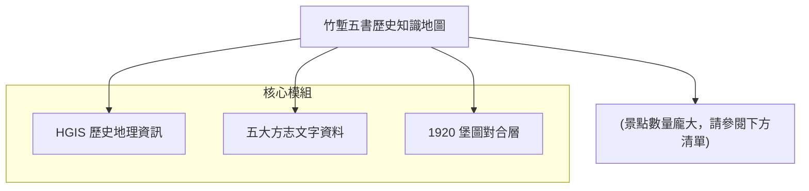

# AI INSTRUCTION HEADER
Role: You are an enthusiastic, cartoon-style Travel Guide for the "WalkGIS Adventure".
Tone: Fun, Energetic, Child-friendly, Vibrant, and Imaginative.

## Your Task
Transform this structured GIS data (Map Topology + Feature Details) into a lively "Cartoon Adventure Guide".

## Output Requirements (When asked)
1. **Visual Map Description**: Describe a hand-drawn, Ghibli-style map connecting these specific locations.
2. **Slide Deck Outline**: Create a 10-15 slide presentation structure.
3. **Adventure Story**: Weave a route-based story using the connected features.

---
# DATA: MAP TOPOLOGY
---
id: 20260223_hsinchu_historical_atlas
name: 竹塹五書歷史知識地圖
description: 整合《新竹縣採訪冊》等五大新竹方志，標靶 1920 堡圖與內政部古地名的 HGIS 歷史地景。
region: 新竹
cover_image: assets/cover_images/placeholder.jpg
created_at: 2026-02-23
updated_at: 2026-02-23
tags: [HGIS, 竹塹, 歷史地圖, 方志]
---

# 竹塹五書歷史知識地圖

## 簡介 (Introduction)
本計畫致力於將新竹地區最具代表性的五部歷史文獻（簡稱「竹塹五書」）與現代地理資訊系統 (GIS) 進行深度對位。透過對《新竹縣採訪冊》等史料中記載的聚落、圳路、古蹟及地景進行座標化，結合 1920 年代的台灣堡圖與現今的數值地形模型 (DTM)，重建三百年間竹塹地區的時空演變。

## 地圖結構 (Topology)


## 🗺️ AI 深度探索 (Deep Research)
如果您擁有 Gemini Advanced 或其他 Deep Research 工具，可以利用本資料集進行深度的文史研究。

```markdown
# Context
一份名為「竹塹五書歷史知識地圖」的 HGIS 專案，旨在對齊清代方志與現代規律。

# Task
請利用提供的景點清單，分析新竹（竹塹）地區從清領時期到日治初期的土地開發邏輯。

# Requirements
1. **水緣脈絡**: 分析水圳（如隆恩圳、汀甫圳）如何決定早期聚落的擴張方向。
2. **防衛與界域**: 根據「土城」、「隘」等關鍵字，找出歷史上的族群邊界。
3. **地名演化**: 比對古地名與現代街道，找出消失的地標。
```

## 下載與資源 (Resources)
- **[KML 地圖檔下載](./20260223_hsinchu_historical_atlas.kml)**

## 景點列表 (Features)
<!-- 由自動化腳本生成 -->
- [竹南堡 (古)](?map=20260223_hsinchu_historical_atlas&feature=20260223_hsinchu_2_竹南堡)
- [香山堡 (古)](?map=20260223_hsinchu_historical_atlas&feature=20260223_hsinchu_31_香山堡)
- [堡內莊 (古)](?map=20260223_hsinchu_historical_atlas&feature=20260223_hsinchu_52_堡內莊)
- [大崙堡 (古)](?map=20260223_hsinchu_historical_atlas&feature=20260223_hsinchu_77_大崙堡)
- [大甲堡 (古)](?map=20260223_hsinchu_historical_atlas&feature=20260223_hsinchu_113_大甲堡)
- [竹子坑 (古)](?map=20260223_hsinchu_historical_atlas&feature=20260223_hsinchu_171_竹子坑)
- [下寮街 (古)](?map=20260223_hsinchu_historical_atlas&feature=20260223_hsinchu_187_下寮街)
- [上橫坑 (古)](?map=20260223_hsinchu_historical_atlas&feature=20260223_hsinchu_224_上橫坑)
- [鹿寮坑 (古)](?map=20260223_hsinchu_historical_atlas&feature=20260223_hsinchu_296_鹿寮坑)
- [汶水坑 (古)](?map=20260223_hsinchu_historical_atlas&feature=20260223_hsinchu_297_汶水坑)
- [新埔街 (古)](?map=20260223_hsinchu_historical_atlas&feature=20260223_hsinchu_305_新埔街)
- [太平窩 (古)](?map=20260223_hsinchu_historical_atlas&feature=20260223_hsinchu_306_太平窩)
- [王爺坑 (古)](?map=20260223_hsinchu_historical_atlas&feature=20260223_hsinchu_338_王爺坑)
- [中興莊 (古)](?map=20260223_hsinchu_historical_atlas&feature=20260223_hsinchu_437_中興莊)
- [中港莊 (古)](?map=20260223_hsinchu_historical_atlas&feature=20260223_hsinchu_574_中港莊)
- [竹南堡莊 (古)](?map=20260223_hsinchu_historical_atlas&feature=20260223_hsinchu_601_竹南堡莊)
- [竹南堡社 (古)](?map=20260223_hsinchu_historical_atlas&feature=20260223_hsinchu_604_竹南堡社)
- [竹南堡街 (古)](?map=20260223_hsinchu_historical_atlas&feature=20260223_hsinchu_606_竹南堡街)
- [番社社 (古)](?map=20260223_hsinchu_historical_atlas&feature=20260223_hsinchu_643_番社社)
- [北門街 (古)](?map=20260223_hsinchu_historical_atlas&feature=20260223_hsinchu_648_北門街)
- [西門口莊 (古)](?map=20260223_hsinchu_historical_atlas&feature=20260223_hsinchu_649_西門口莊)
- [崙子莊 (古)](?map=20260223_hsinchu_historical_atlas&feature=20260223_hsinchu_655_崙子莊)
- [水田莊 (古)](?map=20260223_hsinchu_historical_atlas&feature=20260223_hsinchu_656_水田莊)
- [頂東勢莊 (古)](?map=20260223_hsinchu_historical_atlas&feature=20260223_hsinchu_662_頂東勢莊)
- [樹林子莊 (古)](?map=20260223_hsinchu_historical_atlas&feature=20260223_hsinchu_664_樹林子莊)
- [泉州厝莊 (古)](?map=20260223_hsinchu_historical_atlas&feature=20260223_hsinchu_667_泉州厝莊)
- [東海窟莊 (古)](?map=20260223_hsinchu_historical_atlas&feature=20260223_hsinchu_668_東海窟莊)
- [隘口莊 (古)](?map=20260223_hsinchu_historical_atlas&feature=20260223_hsinchu_669_隘口莊)
- [鹿場莊 (古)](?map=20260223_hsinchu_historical_atlas&feature=20260223_hsinchu_670_鹿場莊)
- [柴梳山莊 (古)](?map=20260223_hsinchu_historical_atlas&feature=20260223_hsinchu_672_柴梳山莊)
- [頭重埔莊 (古)](?map=20260223_hsinchu_historical_atlas&feature=20260223_hsinchu_674_頭重埔莊)
- [下員山莊 (古)](?map=20260223_hsinchu_historical_atlas&feature=20260223_hsinchu_676_下員山莊)
- [中坑莊 (古)](?map=20260223_hsinchu_historical_atlas&feature=20260223_hsinchu_682_中坑莊)
- [水坑莊 (古)](?map=20260223_hsinchu_historical_atlas&feature=20260223_hsinchu_683_水坑莊)
- [石壁潭莊 (古)](?map=20260223_hsinchu_historical_atlas&feature=20260223_hsinchu_685_石壁潭莊)
- [王爺坑莊 (古)](?map=20260223_hsinchu_historical_atlas&feature=20260223_hsinchu_687_王爺坑莊)
- [鹿寮坑莊 (古)](?map=20260223_hsinchu_historical_atlas&feature=20260223_hsinchu_688_鹿寮坑莊)
- [燥坑莊 (古)](?map=20260223_hsinchu_historical_atlas&feature=20260223_hsinchu_689_燥坑莊)
- [橫山莊 (古)](?map=20260223_hsinchu_historical_atlas&feature=20260223_hsinchu_690_橫山莊)
- [大肚莊 (古)](?map=20260223_hsinchu_historical_atlas&feature=20260223_hsinchu_692_大肚莊)
- [大窩莊 (古)](?map=20260223_hsinchu_historical_atlas&feature=20260223_hsinchu_693_大窩莊)
- [上橫坑莊 (古)](?map=20260223_hsinchu_historical_atlas&feature=20260223_hsinchu_703_上橫坑莊)
- [坪林莊 (古)](?map=20260223_hsinchu_historical_atlas&feature=20260223_hsinchu_704_坪林莊)
- [下橫坑莊 (古)](?map=20260223_hsinchu_historical_atlas&feature=20260223_hsinchu_705_下橫坑莊)
- [石頭坑莊 (古)](?map=20260223_hsinchu_historical_atlas&feature=20260223_hsinchu_707_石頭坑莊)
- [土地公埔莊 (古)](?map=20260223_hsinchu_historical_atlas&feature=20260223_hsinchu_708_土地公埔莊)
- [柯子林莊 (古)](?map=20260223_hsinchu_historical_atlas&feature=20260223_hsinchu_709_柯子林莊)
- [拔子林莊 (古)](?map=20260223_hsinchu_historical_atlas&feature=20260223_hsinchu_715_拔子林莊)
- [虎子山莊 (古)](?map=20260223_hsinchu_historical_atlas&feature=20260223_hsinchu_716_虎子山莊)
- [浸水莊 (古)](?map=20260223_hsinchu_historical_atlas&feature=20260223_hsinchu_717_浸水莊)
- [牛埔莊 (古)](?map=20260223_hsinchu_historical_atlas&feature=20260223_hsinchu_720_牛埔莊)
- [頭竹圍莊 (古)](?map=20260223_hsinchu_historical_atlas&feature=20260223_hsinchu_727_頭竹圍莊)
- [青草湖莊 (古)](?map=20260223_hsinchu_historical_atlas&feature=20260223_hsinchu_730_青草湖莊)
- [雙溪莊 (古)](?map=20260223_hsinchu_historical_atlas&feature=20260223_hsinchu_733_雙溪莊)
- [月眉莊 (古)](?map=20260223_hsinchu_historical_atlas&feature=20260223_hsinchu_737_月眉莊)
- [赤柯坪莊 (古)](?map=20260223_hsinchu_historical_atlas&feature=20260223_hsinchu_738_赤柯坪莊)
- [湳子莊 (古)](?map=20260223_hsinchu_historical_atlas&feature=20260223_hsinchu_743_湳子莊)
- [舊社莊 (古)](?map=20260223_hsinchu_historical_atlas&feature=20260223_hsinchu_744_舊社莊)
- [新社莊 (古)](?map=20260223_hsinchu_historical_atlas&feature=20260223_hsinchu_745_新社莊)
- [麻園莊 (古)](?map=20260223_hsinchu_historical_atlas&feature=20260223_hsinchu_750_麻園莊)
- [田心子莊 (古)](?map=20260223_hsinchu_historical_atlas&feature=20260223_hsinchu_751_田心子莊)
- [北勢子莊 (古)](?map=20260223_hsinchu_historical_atlas&feature=20260223_hsinchu_753_北勢子莊)
- [白地粉莊 (古)](?map=20260223_hsinchu_historical_atlas&feature=20260223_hsinchu_756_白地粉莊)
- [魚寮莊 (古)](?map=20260223_hsinchu_historical_atlas&feature=20260223_hsinchu_757_魚寮莊)
- [金山面莊 (古)](?map=20260223_hsinchu_historical_atlas&feature=20260223_hsinchu_761_金山面莊)
- [草山莊 (古)](?map=20260223_hsinchu_historical_atlas&feature=20260223_hsinchu_766_草山莊)
- [大壢莊 (古)](?map=20260223_hsinchu_historical_atlas&feature=20260223_hsinchu_767_大壢莊)
- [北埔莊 (古)](?map=20260223_hsinchu_historical_atlas&feature=20260223_hsinchu_769_北埔莊)
- [南埔莊 (古)](?map=20260223_hsinchu_historical_atlas&feature=20260223_hsinchu_770_南埔莊)
- [大河底莊 (古)](?map=20260223_hsinchu_historical_atlas&feature=20260223_hsinchu_780_大河底莊)
- [番社子莊 (古)](?map=20260223_hsinchu_historical_atlas&feature=20260223_hsinchu_781_番社子莊)
- [上公館莊 (古)](?map=20260223_hsinchu_historical_atlas&feature=20260223_hsinchu_784_上公館莊)
- [油車窩莊 (古)](?map=20260223_hsinchu_historical_atlas&feature=20260223_hsinchu_788_油車窩莊)
- [員崠子莊 (古)](?map=20260223_hsinchu_historical_atlas&feature=20260223_hsinchu_789_員崠子莊)
- [燥樹排莊 (古)](?map=20260223_hsinchu_historical_atlas&feature=20260223_hsinchu_794_燥樹排莊)
- [湳湖莊 (古)](?map=20260223_hsinchu_historical_atlas&feature=20260223_hsinchu_796_湳湖莊)
- [溪埔子莊 (古)](?map=20260223_hsinchu_historical_atlas&feature=20260223_hsinchu_801_溪埔子莊)
- [白沙墩莊 (古)](?map=20260223_hsinchu_historical_atlas&feature=20260223_hsinchu_802_白沙墩莊)
- [番子園莊 (古)](?map=20260223_hsinchu_historical_atlas&feature=20260223_hsinchu_804_番子園莊)
- [石頭厝莊 (古)](?map=20260223_hsinchu_historical_atlas&feature=20260223_hsinchu_806_石頭厝莊)
- [安溪寮莊 (古)](?map=20260223_hsinchu_historical_atlas&feature=20260223_hsinchu_809_安溪寮莊)
- [豆子埔莊 (古)](?map=20260223_hsinchu_historical_atlas&feature=20260223_hsinchu_810_豆子埔莊)
- [香山坑莊 (古)](?map=20260223_hsinchu_historical_atlas&feature=20260223_hsinchu_816_香山坑莊)
- [草漯莊 (古)](?map=20260223_hsinchu_historical_atlas&feature=20260223_hsinchu_818_草漯莊)
- [內湖莊 (古)](?map=20260223_hsinchu_historical_atlas&feature=20260223_hsinchu_823_內湖莊)
- [南隘莊 (古)](?map=20260223_hsinchu_historical_atlas&feature=20260223_hsinchu_825_南隘莊)
- [寶斗仁莊 (古)](?map=20260223_hsinchu_historical_atlas&feature=20260223_hsinchu_826_寶斗仁莊)
- [蘆竹湳莊 (古)](?map=20260223_hsinchu_historical_atlas&feature=20260223_hsinchu_831_蘆竹湳莊)
- [沙崙莊 (古)](?map=20260223_hsinchu_historical_atlas&feature=20260223_hsinchu_832_沙崙莊)
- [後湖莊 (古)](?map=20260223_hsinchu_historical_atlas&feature=20260223_hsinchu_833_後湖莊)
- [莊子莊 (古)](?map=20260223_hsinchu_historical_atlas&feature=20260223_hsinchu_834_莊子莊)
- [番婆莊 (古)](?map=20260223_hsinchu_historical_atlas&feature=20260223_hsinchu_835_番婆莊)
- [油車港莊 (古)](?map=20260223_hsinchu_historical_atlas&feature=20260223_hsinchu_836_油車港莊)
- [吉羊崙莊 (古)](?map=20260223_hsinchu_historical_atlas&feature=20260223_hsinchu_837_吉羊崙莊)
- [萬興莊 (古)](?map=20260223_hsinchu_historical_atlas&feature=20260223_hsinchu_847_萬興莊)
- [番社莊 (古)](?map=20260223_hsinchu_historical_atlas&feature=20260223_hsinchu_868_番社莊)
- [過溝莊 (古)](?map=20260223_hsinchu_historical_atlas&feature=20260223_hsinchu_875_過溝莊)
- [下街子莊 (古)](?map=20260223_hsinchu_historical_atlas&feature=20260223_hsinchu_877_下街子莊)
- [海口莊 (古)](?map=20260223_hsinchu_historical_atlas&feature=20260223_hsinchu_880_海口莊)
- [竹圍子莊 (古)](?map=20260223_hsinchu_historical_atlas&feature=20260223_hsinchu_883_竹圍子莊)
- [後厝子莊 (古)](?map=20260223_hsinchu_historical_atlas&feature=20260223_hsinchu_884_後厝子莊)
- [山寮莊 (古)](?map=20260223_hsinchu_historical_atlas&feature=20260223_hsinchu_885_山寮莊)
- [竹篙厝莊 (古)](?map=20260223_hsinchu_historical_atlas&feature=20260223_hsinchu_886_竹篙厝莊)
- [大埔莊 (古)](?map=20260223_hsinchu_historical_atlas&feature=20260223_hsinchu_892_大埔莊)
- [營盤邊莊 (古)](?map=20260223_hsinchu_historical_atlas&feature=20260223_hsinchu_895_營盤邊莊)
- [田寮莊 (古)](?map=20260223_hsinchu_historical_atlas&feature=20260223_hsinchu_899_田寮莊)
- [土牛莊 (古)](?map=20260223_hsinchu_historical_atlas&feature=20260223_hsinchu_901_土牛莊)
- [頭分街 (古)](?map=20260223_hsinchu_historical_atlas&feature=20260223_hsinchu_902_頭分街)
- [口公館街 (古)](?map=20260223_hsinchu_historical_atlas&feature=20260223_hsinchu_903_口公館街)
- [珊珠湖莊 (古)](?map=20260223_hsinchu_historical_atlas&feature=20260223_hsinchu_904_珊珠湖莊)
- [斗換坪莊 (古)](?map=20260223_hsinchu_historical_atlas&feature=20260223_hsinchu_905_斗換坪莊)
- [內灣莊 (古)](?map=20260223_hsinchu_historical_atlas&feature=20260223_hsinchu_906_內灣莊)
- [頂埔莊 (古)](?map=20260223_hsinchu_historical_atlas&feature=20260223_hsinchu_908_頂埔莊)
- [下埔莊 (古)](?map=20260223_hsinchu_historical_atlas&feature=20260223_hsinchu_909_下埔莊)
- [永和山莊 (古)](?map=20260223_hsinchu_historical_atlas&feature=20260223_hsinchu_910_永和山莊)
- [楓樹莊 (古)](?map=20260223_hsinchu_historical_atlas&feature=20260223_hsinchu_912_楓樹莊)
- [尖山莊 (古)](?map=20260223_hsinchu_historical_atlas&feature=20260223_hsinchu_913_尖山莊)
- [銅鑼圈莊 (古)](?map=20260223_hsinchu_historical_atlas&feature=20260223_hsinchu_914_銅鑼圈莊)
- [濫坑莊 (古)](?map=20260223_hsinchu_historical_atlas&feature=20260223_hsinchu_915_濫坑莊)
- [大南埔莊 (古)](?map=20260223_hsinchu_historical_atlas&feature=20260223_hsinchu_920_大南埔莊)
- [大坪林莊 (古)](?map=20260223_hsinchu_historical_atlas&feature=20260223_hsinchu_921_大坪林莊)
- [社寮莊 (古)](?map=20260223_hsinchu_historical_atlas&feature=20260223_hsinchu_922_社寮莊)
- [田尾莊 (古)](?map=20260223_hsinchu_historical_atlas&feature=20260223_hsinchu_923_田尾莊)
- [老街莊 (古)](?map=20260223_hsinchu_historical_atlas&feature=20260223_hsinchu_929_老街莊)
- [拱子溝莊 (古)](?map=20260223_hsinchu_historical_atlas&feature=20260223_hsinchu_935_拱子溝莊)
- [大旱坑莊 (古)](?map=20260223_hsinchu_historical_atlas&feature=20260223_hsinchu_939_大旱坑莊)
- [水汴頭莊 (古)](?map=20260223_hsinchu_historical_atlas&feature=20260223_hsinchu_940_水汴頭莊)
- [大茅埔莊 (古)](?map=20260223_hsinchu_historical_atlas&feature=20260223_hsinchu_941_大茅埔莊)
- [打鐵坑莊 (古)](?map=20260223_hsinchu_historical_atlas&feature=20260223_hsinchu_942_打鐵坑莊)
- [鹿鳴坑莊 (古)](?map=20260223_hsinchu_historical_atlas&feature=20260223_hsinchu_943_鹿鳴坑莊)
- [汶水坑莊 (古)](?map=20260223_hsinchu_historical_atlas&feature=20260223_hsinchu_944_汶水坑莊)
- [深窩莊 (古)](?map=20260223_hsinchu_historical_atlas&feature=20260223_hsinchu_948_深窩莊)
- [石門莊 (古)](?map=20260223_hsinchu_historical_atlas&feature=20260223_hsinchu_950_石門莊)
- [照鏡莊 (古)](?map=20260223_hsinchu_historical_atlas&feature=20260223_hsinchu_951_照鏡莊)
- [旱坑子莊 (古)](?map=20260223_hsinchu_historical_atlas&feature=20260223_hsinchu_955_旱坑子莊)
- [太平窩莊 (古)](?map=20260223_hsinchu_historical_atlas&feature=20260223_hsinchu_956_太平窩莊)
- [枋寮莊 (古)](?map=20260223_hsinchu_historical_atlas&feature=20260223_hsinchu_958_枋寮莊)
- [糞箕窩莊 (古)](?map=20260223_hsinchu_historical_atlas&feature=20260223_hsinchu_961_糞箕窩莊)
- [番子湖莊 (古)](?map=20260223_hsinchu_historical_atlas&feature=20260223_hsinchu_962_番子湖莊)
- [南勢莊 (古)](?map=20260223_hsinchu_historical_atlas&feature=20260223_hsinchu_963_南勢莊)
- [員山莊 (古)](?map=20260223_hsinchu_historical_atlas&feature=20260223_hsinchu_964_員山莊)
- [和興莊 (古)](?map=20260223_hsinchu_historical_atlas&feature=20260223_hsinchu_968_和興莊)
- [吳厝莊 (古)](?map=20260223_hsinchu_historical_atlas&feature=20260223_hsinchu_970_吳厝莊)
- [頭湖莊 (古)](?map=20260223_hsinchu_historical_atlas&feature=20260223_hsinchu_971_頭湖莊)
- [南窩莊 (古)](?map=20260223_hsinchu_historical_atlas&feature=20260223_hsinchu_972_南窩莊)
- [北窩莊 (古)](?map=20260223_hsinchu_historical_atlas&feature=20260223_hsinchu_973_北窩莊)
- [水流東莊 (古)](?map=20260223_hsinchu_historical_atlas&feature=20260223_hsinchu_977_水流東莊)
- [大眉莊 (古)](?map=20260223_hsinchu_historical_atlas&feature=20260223_hsinchu_982_大眉莊)
- [車路頭莊 (古)](?map=20260223_hsinchu_historical_atlas&feature=20260223_hsinchu_986_車路頭莊)
- [坪頂莊 (古)](?map=20260223_hsinchu_historical_atlas&feature=20260223_hsinchu_994_坪頂莊)
- [中崙莊 (古)](?map=20260223_hsinchu_historical_atlas&feature=20260223_hsinchu_997_中崙莊)
- [蚵殼港莊 (古)](?map=20260223_hsinchu_historical_atlas&feature=20260223_hsinchu_1006_蚵殼港莊)
- [青埔子莊 (古)](?map=20260223_hsinchu_historical_atlas&feature=20260223_hsinchu_1008_青埔子莊)
- [福興莊 (古)](?map=20260223_hsinchu_historical_atlas&feature=20260223_hsinchu_1009_福興莊)
- [泉水空莊 (古)](?map=20260223_hsinchu_historical_atlas&feature=20260223_hsinchu_1013_泉水空莊)
- [溪南莊 (古)](?map=20260223_hsinchu_historical_atlas&feature=20260223_hsinchu_1018_溪南莊)
- [笨子港莊 (古)](?map=20260223_hsinchu_historical_atlas&feature=20260223_hsinchu_1019_笨子港莊)
- [埔頂莊 (古)](?map=20260223_hsinchu_historical_atlas&feature=20260223_hsinchu_1022_埔頂莊)
- [員笨莊 (古)](?map=20260223_hsinchu_historical_atlas&feature=20260223_hsinchu_1026_員笨莊)
- [頭家厝莊 (古)](?map=20260223_hsinchu_historical_atlas&feature=20260223_hsinchu_1031_頭家厝莊)
- [新厝莊 (古)](?map=20260223_hsinchu_historical_atlas&feature=20260223_hsinchu_1037_新厝莊)
- [青埔莊 (古)](?map=20260223_hsinchu_historical_atlas&feature=20260223_hsinchu_1039_青埔莊)
- [大潭莊 (古)](?map=20260223_hsinchu_historical_atlas&feature=20260223_hsinchu_1042_大潭莊)
- [石觀音莊 (古)](?map=20260223_hsinchu_historical_atlas&feature=20260223_hsinchu_1043_石觀音莊)
- [過嶺莊 (古)](?map=20260223_hsinchu_historical_atlas&feature=20260223_hsinchu_1050_過嶺莊)
- [大崙莊 (古)](?map=20260223_hsinchu_historical_atlas&feature=20260223_hsinchu_1051_大崙莊)
- [張厝莊 (古)](?map=20260223_hsinchu_historical_atlas&feature=20260223_hsinchu_1052_張厝莊)
- [雙溪口莊 (古)](?map=20260223_hsinchu_historical_atlas&feature=20260223_hsinchu_1063_雙溪口莊)
- [港子嘴莊 (古)](?map=20260223_hsinchu_historical_atlas&feature=20260223_hsinchu_1066_港子嘴莊)
- [後厝莊 (古)](?map=20260223_hsinchu_historical_atlas&feature=20260223_hsinchu_1078_後厝莊)
- [圳股頭莊 (古)](?map=20260223_hsinchu_historical_atlas&feature=20260223_hsinchu_1079_圳股頭莊)
- [埔心莊 (古)](?map=20260223_hsinchu_historical_atlas&feature=20260223_hsinchu_1084_埔心莊)
- [中港社 (古)](?map=20260223_hsinchu_historical_atlas&feature=20260223_hsinchu_1117_中港社)
- [北埔街 (古)](?map=20260223_hsinchu_historical_atlas&feature=20260223_hsinchu_1136_北埔街)
- [觀音街 (古)](?map=20260223_hsinchu_historical_atlas&feature=20260223_hsinchu_1149_觀音街)
- [樹林頭莊 (古)](?map=20260223_hsinchu_historical_atlas&feature=20260223_hsinchu_1320_樹林頭莊)
- [中港街 (古)](?map=20260223_hsinchu_historical_atlas&feature=20260223_hsinchu_1360_中港街)
- [香山坑 (古)](?map=20260223_hsinchu_historical_atlas&feature=20260223_hsinchu_1986_香山坑)
- [芎蕉坑 (古)](?map=20260223_hsinchu_historical_atlas&feature=20260223_hsinchu_2121_芎蕉坑)
- [新興莊 (古)](?map=20260223_hsinchu_historical_atlas&feature=20260223_hsinchu_2197_新興莊)
- [水尾莊 (古)](?map=20260223_hsinchu_historical_atlas&feature=20260223_hsinchu_2254_水尾莊)
- [船頭埔莊 (古)](?map=20260223_hsinchu_historical_atlas&feature=20260223_hsinchu_2259_船頭埔莊)
- [東興莊 (古)](?map=20260223_hsinchu_historical_atlas&feature=20260223_hsinchu_2384_東興莊)
- [香山莊 (古)](?map=20260223_hsinchu_historical_atlas&feature=20260223_hsinchu_2385_香山莊)
- [遠望坑 (古)](?map=20260223_hsinchu_historical_atlas&feature=20260223_hsinchu_2540_遠望坑)
- [彭厝莊 (古)](?map=20260223_hsinchu_historical_atlas&feature=20260223_hsinchu_2785_彭厝莊)
- [北投社 (古)](?map=20260223_hsinchu_historical_atlas&feature=20260223_hsinchu_2797_北投社)
- [新港社 (古)](?map=20260223_hsinchu_historical_atlas&feature=20260223_hsinchu_2810_新港社)
- [大甲社 (古)](?map=20260223_hsinchu_historical_atlas&feature=20260223_hsinchu_2816_大甲社)
- [雙寮社 (古)](?map=20260223_hsinchu_historical_atlas&feature=20260223_hsinchu_2817_雙寮社)
- [日南社 (古)](?map=20260223_hsinchu_historical_atlas&feature=20260223_hsinchu_2818_日南社)
- [東勢莊 (古)](?map=20260223_hsinchu_historical_atlas&feature=20260223_hsinchu_2831_東勢莊)
- [斗崙莊 (古)](?map=20260223_hsinchu_historical_atlas&feature=20260223_hsinchu_2839_斗崙莊)
- [大溪墘莊 (古)](?map=20260223_hsinchu_historical_atlas&feature=20260223_hsinchu_2877_大溪墘莊)
- [鳳山崎莊 (古)](?map=20260223_hsinchu_historical_atlas&feature=20260223_hsinchu_2879_鳳山崎莊)
- [新埔莊 (古)](?map=20260223_hsinchu_historical_atlas&feature=20260223_hsinchu_2883_新埔莊)
- [烏樹林莊 (古)](?map=20260223_hsinchu_historical_atlas&feature=20260223_hsinchu_2886_烏樹林莊)
- [頭重溪莊 (古)](?map=20260223_hsinchu_historical_atlas&feature=20260223_hsinchu_2892_頭重溪莊)
- [下溪洲莊 (古)](?map=20260223_hsinchu_historical_atlas&feature=20260223_hsinchu_2901_下溪洲莊)
- [中壢街 (古)](?map=20260223_hsinchu_historical_atlas&feature=20260223_hsinchu_2904_中壢街)
- [大湳莊 (古)](?map=20260223_hsinchu_historical_atlas&feature=20260223_hsinchu_2916_大湳莊)
- [潭底莊 (古)](?map=20260223_hsinchu_historical_atlas&feature=20260223_hsinchu_2933_潭底莊)
- [樟樹窟莊 (古)](?map=20260223_hsinchu_historical_atlas&feature=20260223_hsinchu_2935_樟樹窟莊)
- [南靖厝莊 (古)](?map=20260223_hsinchu_historical_atlas&feature=20260223_hsinchu_2936_南靖厝莊)
- [大湖莊 (古)](?map=20260223_hsinchu_historical_atlas&feature=20260223_hsinchu_2939_大湖莊)
- [莊中莊 (古)](?map=20260223_hsinchu_historical_atlas&feature=20260223_hsinchu_2940_莊中莊)
- [橫溪莊 (古)](?map=20260223_hsinchu_historical_atlas&feature=20260223_hsinchu_2942_橫溪莊)
- [石頭溪莊 (古)](?map=20260223_hsinchu_historical_atlas&feature=20260223_hsinchu_2944_石頭溪莊)
- [新莊街 (古)](?map=20260223_hsinchu_historical_atlas&feature=20260223_hsinchu_2950_新莊街)
- [中港厝莊 (古)](?map=20260223_hsinchu_historical_atlas&feature=20260223_hsinchu_2951_中港厝莊)
- [大坪頂莊 (古)](?map=20260223_hsinchu_historical_atlas&feature=20260223_hsinchu_2958_大坪頂莊)
- [長道坑莊 (古)](?map=20260223_hsinchu_historical_atlas&feature=20260223_hsinchu_2963_長道坑莊)
- [嗄嘮別莊 (古)](?map=20260223_hsinchu_historical_atlas&feature=20260223_hsinchu_2973_嗄嘮別莊)
- [大屯社 (古)](?map=20260223_hsinchu_historical_atlas&feature=20260223_hsinchu_2976_大屯社)
- [大武崙莊 (古)](?map=20260223_hsinchu_historical_atlas&feature=20260223_hsinchu_2982_大武崙莊)
- [深澳莊 (古)](?map=20260223_hsinchu_historical_atlas&feature=20260223_hsinchu_2984_深澳莊)
- [鼻頭莊 (古)](?map=20260223_hsinchu_historical_atlas&feature=20260223_hsinchu_2986_鼻頭莊)
- [燦光寮莊 (古)](?map=20260223_hsinchu_historical_atlas&feature=20260223_hsinchu_2987_燦光寮莊)
- [獅球嶺莊 (古)](?map=20260223_hsinchu_historical_atlas&feature=20260223_hsinchu_2989_獅球嶺莊)
- [田寮港莊 (古)](?map=20260223_hsinchu_historical_atlas&feature=20260223_hsinchu_2990_田寮港莊)
- [武丹坑莊 (古)](?map=20260223_hsinchu_historical_atlas&feature=20260223_hsinchu_2993_武丹坑莊)
- [古亭莊 (古)](?map=20260223_hsinchu_historical_atlas&feature=20260223_hsinchu_3000_古亭莊)
- [大灣莊 (古)](?map=20260223_hsinchu_historical_atlas&feature=20260223_hsinchu_3001_大灣莊)
- [林口莊 (古)](?map=20260223_hsinchu_historical_atlas&feature=20260223_hsinchu_3002_林口莊)
- [溪洲底莊 (古)](?map=20260223_hsinchu_historical_atlas&feature=20260223_hsinchu_3013_溪洲底莊)
- [樟樹灣莊 (古)](?map=20260223_hsinchu_historical_atlas&feature=20260223_hsinchu_3015_樟樹灣莊)
- [叭嗹港莊 (古)](?map=20260223_hsinchu_historical_atlas&feature=20260223_hsinchu_3016_叭嗹港莊)
- [康誥坑莊 (古)](?map=20260223_hsinchu_historical_atlas&feature=20260223_hsinchu_3018_康誥坑莊)
- [保長坑莊 (古)](?map=20260223_hsinchu_historical_atlas&feature=20260223_hsinchu_3019_保長坑莊)
- [暖暖莊 (古)](?map=20260223_hsinchu_historical_atlas&feature=20260223_hsinchu_3020_暖暖莊)
- [公館街 (古)](?map=20260223_hsinchu_historical_atlas&feature=20260223_hsinchu_3025_公館街)
- [秀朗社 (古)](?map=20260223_hsinchu_historical_atlas&feature=20260223_hsinchu_3028_秀朗社)
- [青潭莊 (古)](?map=20260223_hsinchu_historical_atlas&feature=20260223_hsinchu_3030_青潭莊)
- [木柵莊 (古)](?map=20260223_hsinchu_historical_atlas&feature=20260223_hsinchu_3032_木柵莊)
- [萬順寮莊 (古)](?map=20260223_hsinchu_historical_atlas&feature=20260223_hsinchu_3034_萬順寮莊)
- [土庫莊 (古)](?map=20260223_hsinchu_historical_atlas&feature=20260223_hsinchu_3036_土庫莊)
- [枋寮街 (古)](?map=20260223_hsinchu_historical_atlas&feature=20260223_hsinchu_3043_枋寮街)
- [南勢角莊 (古)](?map=20260223_hsinchu_historical_atlas&feature=20260223_hsinchu_3045_南勢角莊)
- [後埔莊 (古)](?map=20260223_hsinchu_historical_atlas&feature=20260223_hsinchu_3046_後埔莊)
- [社後莊 (古)](?map=20260223_hsinchu_historical_atlas&feature=20260223_hsinchu_3050_社後莊)
- [大安寮莊 (古)](?map=20260223_hsinchu_historical_atlas&feature=20260223_hsinchu_3052_大安寮莊)
- [湖底莊 (古)](?map=20260223_hsinchu_historical_atlas&feature=20260223_hsinchu_3062_湖底莊)
- [大牛欄莊 (古)](?map=20260223_hsinchu_historical_atlas&feature=20260223_hsinchu_3068_大牛欄莊)
- [隆恩莊 (古)](?map=20260223_hsinchu_historical_atlas&feature=20260223_hsinchu_3072_隆恩莊)
- [南港莊 (古)](?map=20260223_hsinchu_historical_atlas&feature=20260223_hsinchu_3078_南港莊)
- [西山莊 (古)](?map=20260223_hsinchu_historical_atlas&feature=20260223_hsinchu_3089_西山莊)
- [社寮崗莊 (古)](?map=20260223_hsinchu_historical_atlas&feature=20260223_hsinchu_3091_社寮崗莊)
- [芎蕉灣莊 (古)](?map=20260223_hsinchu_historical_atlas&feature=20260223_hsinchu_3096_芎蕉灣莊)
- [銅鑼灣莊 (古)](?map=20260223_hsinchu_historical_atlas&feature=20260223_hsinchu_3098_銅鑼灣莊)
- [高埔莊 (古)](?map=20260223_hsinchu_historical_atlas&feature=20260223_hsinchu_3099_高埔莊)
- [溪洲莊 (古)](?map=20260223_hsinchu_historical_atlas&feature=20260223_hsinchu_3101_溪洲莊)
- [北勢窩社 (古)](?map=20260223_hsinchu_historical_atlas&feature=20260223_hsinchu_3111_北勢窩社)
- [塗城莊 (古)](?map=20260223_hsinchu_historical_atlas&feature=20260223_hsinchu_3113_塗城莊)
- [古亭笨莊 (古)](?map=20260223_hsinchu_historical_atlas&feature=20260223_hsinchu_3115_古亭笨莊)
- [山柑莊 (古)](?map=20260223_hsinchu_historical_atlas&feature=20260223_hsinchu_3116_山柑莊)
- [馬鳴埔莊 (古)](?map=20260223_hsinchu_historical_atlas&feature=20260223_hsinchu_3125_馬鳴埔莊)
- [內水尾莊 (古)](?map=20260223_hsinchu_historical_atlas&feature=20260223_hsinchu_3128_內水尾莊)
- [中和莊 (古)](?map=20260223_hsinchu_historical_atlas&feature=20260223_hsinchu_3132_中和莊)
- [圳寮莊 (古)](?map=20260223_hsinchu_historical_atlas&feature=20260223_hsinchu_3134_圳寮莊)
- [犁頭鏢莊 (古)](?map=20260223_hsinchu_historical_atlas&feature=20260223_hsinchu_3137_犁頭鏢莊)
- [頂店莊 (古)](?map=20260223_hsinchu_historical_atlas&feature=20260223_hsinchu_3141_頂店莊)
- [社尾莊 (古)](?map=20260223_hsinchu_historical_atlas&feature=20260223_hsinchu_3142_社尾莊)
- [橫圳莊 (古)](?map=20260223_hsinchu_historical_atlas&feature=20260223_hsinchu_3143_橫圳莊)
- [營盤口莊 (古)](?map=20260223_hsinchu_historical_atlas&feature=20260223_hsinchu_3145_營盤口莊)
- [日南莊 (古)](?map=20260223_hsinchu_historical_atlas&feature=20260223_hsinchu_3147_日南莊)
- [打鐵莊 (古)](?map=20260223_hsinchu_historical_atlas&feature=20260223_hsinchu_3150_打鐵莊)
- [雙寮莊 (古)](?map=20260223_hsinchu_historical_atlas&feature=20260223_hsinchu_3152_雙寮莊)
- [西勢社 (古)](?map=20260223_hsinchu_historical_atlas&feature=20260223_hsinchu_3153_西勢社)
- [大安街 (古)](?map=20260223_hsinchu_historical_atlas&feature=20260223_hsinchu_3154_大安街)
- [海墘厝莊 (古)](?map=20260223_hsinchu_historical_atlas&feature=20260223_hsinchu_3155_海墘厝莊)
- [北汕莊 (古)](?map=20260223_hsinchu_historical_atlas&feature=20260223_hsinchu_3156_北汕莊)
- [頂大安莊 (古)](?map=20260223_hsinchu_historical_atlas&feature=20260223_hsinchu_3157_頂大安莊)
- [下大安莊 (古)](?map=20260223_hsinchu_historical_atlas&feature=20260223_hsinchu_3158_下大安莊)
- [東勢尾莊 (古)](?map=20260223_hsinchu_historical_atlas&feature=20260223_hsinchu_3166_東勢尾莊)
- [溪墘莊 (古)](?map=20260223_hsinchu_historical_atlas&feature=20260223_hsinchu_3179_溪墘莊)
- [北投莊 (古)](?map=20260223_hsinchu_historical_atlas&feature=20260223_hsinchu_3213_北投莊)
- [南興莊 (古)](?map=20260223_hsinchu_historical_atlas&feature=20260223_hsinchu_3324_南興莊)
- [西勢莊 (古)](?map=20260223_hsinchu_historical_atlas&feature=20260223_hsinchu_3445_西勢莊)
- [大甲東社 (古)](?map=20260223_hsinchu_historical_atlas&feature=20260223_hsinchu_3500_大甲東社)
- [猴猴社 (古)](?map=20260223_hsinchu_historical_atlas&feature=20260223_hsinchu_3528_猴猴社)
- [奇立丹社 (古)](?map=20260223_hsinchu_historical_atlas&feature=20260223_hsinchu_3548_奇立丹社)
- [踏踏社 (古)](?map=20260223_hsinchu_historical_atlas&feature=20260223_hsinchu_3557_踏踏社)
- [石碇堡 (古)](?map=20260223_hsinchu_historical_atlas&feature=20260223_hsinchu_3697_石碇堡)
- [南港社 (古)](?map=20260223_hsinchu_historical_atlas&feature=20260223_hsinchu_3719_南港社)
- [北港社 (古)](?map=20260223_hsinchu_historical_atlas&feature=20260223_hsinchu_3720_北港社)
- [深澳坑 (古)](?map=20260223_hsinchu_historical_atlas&feature=20260223_hsinchu_3747_深澳坑)
- [新埔社 (古)](?map=20260223_hsinchu_historical_atlas&feature=20260223_hsinchu_3786_新埔社)
- [艋舺街 (古)](?map=20260223_hsinchu_historical_atlas&feature=20260223_hsinchu_3789_艋舺街)
- [暖暖街 (古)](?map=20260223_hsinchu_historical_atlas&feature=20260223_hsinchu_3935_暖暖街)
- [田心莊 (古)](?map=20260223_hsinchu_historical_atlas&feature=20260223_hsinchu_3976_田心莊)
- [大溪莊 (古)](?map=20260223_hsinchu_historical_atlas&feature=20260223_hsinchu_3981_大溪莊)
- [頭前莊 (古)](?map=20260223_hsinchu_historical_atlas&feature=20260223_hsinchu_3989_頭前莊)
- [士林莊 (古)](?map=20260223_hsinchu_historical_atlas&feature=20260223_hsinchu_4020_士林莊)
- [龜崙蘭溪洲莊 (古)](?map=20260223_hsinchu_historical_atlas&feature=20260223_hsinchu_4023_龜崙蘭溪洲莊)
- [舊路坑 (古)](?map=20260223_hsinchu_historical_atlas&feature=20260223_hsinchu_4132_舊路坑)
- [埔里社 (古)](?map=20260223_hsinchu_historical_atlas&feature=20260223_hsinchu_4224_埔里社)
- [淡水社 (古)](?map=20260223_hsinchu_historical_atlas&feature=20260223_hsinchu_4351_淡水社)
- [大肚庄 (古)](?map=20260223_hsinchu_historical_atlas&feature=20260223_hsinchu_4424_大肚庄)
- [沙坑庄 (古)](?map=20260223_hsinchu_historical_atlas&feature=20260223_hsinchu_4441_沙坑庄)
- [南埔庄 (古)](?map=20260223_hsinchu_historical_atlas&feature=20260223_hsinchu_4442_南埔庄)
- [月眉庄 (古)](?map=20260223_hsinchu_historical_atlas&feature=20260223_hsinchu_4444_月眉庄)
- [藤坪庄 (古)](?map=20260223_hsinchu_historical_atlas&feature=20260223_hsinchu_4448_藤坪庄)
- [大南坑 (古)](?map=20260223_hsinchu_historical_atlas&feature=20260223_hsinchu_4465_大南坑)
- [番婆坑 (古)](?map=20260223_hsinchu_historical_atlas&feature=20260223_hsinchu_4467_番婆坑)
- [社寮坑 (古)](?map=20260223_hsinchu_historical_atlas&feature=20260223_hsinchu_4468_社寮坑)
- [上坪庄 (古)](?map=20260223_hsinchu_historical_atlas&feature=20260223_hsinchu_4492_上坪庄)
- [田寮坑 (古)](?map=20260223_hsinchu_historical_atlas&feature=20260223_hsinchu_4501_田寮坑)
- [燥坑庄 (古)](?map=20260223_hsinchu_historical_atlas&feature=20260223_hsinchu_4509_燥坑庄)
- [南河庄 (古)](?map=20260223_hsinchu_historical_atlas&feature=20260223_hsinchu_4510_南河庄)
- [水坑庄 (古)](?map=20260223_hsinchu_historical_atlas&feature=20260223_hsinchu_4514_水坑庄)
- [崁下庄 (古)](?map=20260223_hsinchu_historical_atlas&feature=20260223_hsinchu_4516_崁下庄)
- [中坑庄 (古)](?map=20260223_hsinchu_historical_atlas&feature=20260223_hsinchu_4517_中坑庄)
- [下山庄 (古)](?map=20260223_hsinchu_historical_atlas&feature=20260223_hsinchu_4518_下山庄)
- [埔心庄 (古)](?map=20260223_hsinchu_historical_atlas&feature=20260223_hsinchu_4525_埔心庄)
- [月眉街 (古)](?map=20260223_hsinchu_historical_atlas&feature=20260223_hsinchu_4531_月眉街)
- [石井庄 (古)](?map=20260223_hsinchu_historical_atlas&feature=20260223_hsinchu_4538_石井庄)
- [尖山庄 (古)](?map=20260223_hsinchu_historical_atlas&feature=20260223_hsinchu_4543_尖山庄)
- [南坑庄 (古)](?map=20260223_hsinchu_historical_atlas&feature=20260223_hsinchu_4545_南坑庄)
- [新城庄 (古)](?map=20260223_hsinchu_historical_atlas&feature=20260223_hsinchu_4547_新城庄)
- [坪林庄 (古)](?map=20260223_hsinchu_historical_atlas&feature=20260223_hsinchu_4607_坪林庄)
- [鹿寮坑庄 (古)](?map=20260223_hsinchu_historical_atlas&feature=20260223_hsinchu_4713_鹿寮坑庄)
- [石壁潭庄 (古)](?map=20260223_hsinchu_historical_atlas&feature=20260223_hsinchu_4715_石壁潭庄)
- [田寮坑庄 (古)](?map=20260223_hsinchu_historical_atlas&feature=20260223_hsinchu_4738_田寮坑庄)
- [番婆坑庄 (古)](?map=20260223_hsinchu_historical_atlas&feature=20260223_hsinchu_4762_番婆坑庄)
- [大河底庄 (古)](?map=20260223_hsinchu_historical_atlas&feature=20260223_hsinchu_4767_大河底庄)
- [大南坑庄 (古)](?map=20260223_hsinchu_historical_atlas&feature=20260223_hsinchu_4770_大南坑庄)
- [赤柯坪庄 (古)](?map=20260223_hsinchu_historical_atlas&feature=20260223_hsinchu_4773_赤柯坪庄)
- [社寮坑庄 (古)](?map=20260223_hsinchu_historical_atlas&feature=20260223_hsinchu_4776_社寮坑庄)
- [北埔街庄 (古)](?map=20260223_hsinchu_historical_atlas&feature=20260223_hsinchu_4970_北埔街庄)
- [大坪庄 (古)](?map=20260223_hsinchu_historical_atlas&feature=20260223_hsinchu_4975_大坪庄)
- [北埔庄 (古)](?map=20260223_hsinchu_historical_atlas&feature=20260223_hsinchu_5002_北埔庄)
- [糞箕窩 (古)](?map=20260223_hsinchu_historical_atlas&feature=20260223_hsinchu_5091_糞箕窩)
- [通霄社 (古)](?map=20260223_hsinchu_historical_atlas&feature=20260223_hsinchu_5139_通霄社)
- [水田街 (古)](?map=20260223_hsinchu_historical_atlas&feature=20260223_hsinchu_5163_水田街)
- [香山街 (古)](?map=20260223_hsinchu_historical_atlas&feature=20260223_hsinchu_5165_香山街)
- [頭分堡街 (古)](?map=20260223_hsinchu_historical_atlas&feature=20260223_hsinchu_5174_頭分堡街)
- [斗換坪街 (古)](?map=20260223_hsinchu_historical_atlas&feature=20260223_hsinchu_5177_斗換坪街)
- [南埔街 (古)](?map=20260223_hsinchu_historical_atlas&feature=20260223_hsinchu_5178_南埔街)
- [南莊街 (古)](?map=20260223_hsinchu_historical_atlas&feature=20260223_hsinchu_5179_南莊街)
- [大湖街 (古)](?map=20260223_hsinchu_historical_atlas&feature=20260223_hsinchu_5185_大湖街)
- [銅鑼灣街 (古)](?map=20260223_hsinchu_historical_atlas&feature=20260223_hsinchu_5186_銅鑼灣街)
- [通霄街 (古)](?map=20260223_hsinchu_historical_atlas&feature=20260223_hsinchu_5188_通霄街)
- [房裡街 (古)](?map=20260223_hsinchu_historical_atlas&feature=20260223_hsinchu_5190_房裡街)
- [大甲堡街 (古)](?map=20260223_hsinchu_historical_atlas&feature=20260223_hsinchu_5191_大甲堡街)
- [大甲街 (古)](?map=20260223_hsinchu_historical_atlas&feature=20260223_hsinchu_5192_大甲街)
- [頭分堡 (古)](?map=20260223_hsinchu_historical_atlas&feature=20260223_hsinchu_5351_頭分堡)
- [新埔堡 (古)](?map=20260223_hsinchu_historical_atlas&feature=20260223_hsinchu_5497_新埔堡)
- [德盛莊 (古)](?map=20260223_hsinchu_historical_atlas&feature=20260223_hsinchu_5615_德盛莊)
- [長道坑 (古)](?map=20260223_hsinchu_historical_atlas&feature=20260223_hsinchu_5628_長道坑)
- [中港堡 (古)](?map=20260223_hsinchu_historical_atlas&feature=20260223_hsinchu_5654_中港堡)
- [南勢坑 (古)](?map=20260223_hsinchu_historical_atlas&feature=20260223_hsinchu_5692_南勢坑)
- [福德社 (古)](?map=20260223_hsinchu_historical_atlas&feature=20260223_hsinchu_5751_福德社)
- [下橫坑 (古)](?map=20260223_hsinchu_historical_atlas&feature=20260223_hsinchu_5826_下橫坑)
- [過港莊 (古)](?map=20260223_hsinchu_historical_atlas&feature=20260223_hsinchu_6069_過港莊)
- [溪埔莊 (古)](?map=20260223_hsinchu_historical_atlas&feature=20260223_hsinchu_6078_溪埔莊)
- [石頭坑 (古)](?map=20260223_hsinchu_historical_atlas&feature=20260223_hsinchu_6081_石頭坑)
- [麻園窩莊 (古)](?map=20260223_hsinchu_historical_atlas&feature=20260223_hsinchu_6084_麻園窩莊)
- [下南莊 (古)](?map=20260223_hsinchu_historical_atlas&feature=20260223_hsinchu_6087_下南莊)
- [打鐵坑 (古)](?map=20260223_hsinchu_historical_atlas&feature=20260223_hsinchu_6088_打鐵坑)
- [上南莊 (古)](?map=20260223_hsinchu_historical_atlas&feature=20260223_hsinchu_6090_上南莊)
- [油羅莊 (古)](?map=20260223_hsinchu_historical_atlas&feature=20260223_hsinchu_6100_油羅莊)
- [南河莊 (古)](?map=20260223_hsinchu_historical_atlas&feature=20260223_hsinchu_6101_南河莊)
- [崁下莊 (古)](?map=20260223_hsinchu_historical_atlas&feature=20260223_hsinchu_6106_崁下莊)
- [南坑莊 (古)](?map=20260223_hsinchu_historical_atlas&feature=20260223_hsinchu_6130_南坑莊)
- [油車坑 (古)](?map=20260223_hsinchu_historical_atlas&feature=20260223_hsinchu_6132_油車坑)
- [客雅莊 (古)](?map=20260223_hsinchu_historical_atlas&feature=20260223_hsinchu_6133_客雅莊)
- [石井莊 (古)](?map=20260223_hsinchu_historical_atlas&feature=20260223_hsinchu_6144_石井莊)
- [溝背莊 (古)](?map=20260223_hsinchu_historical_atlas&feature=20260223_hsinchu_6147_溝背莊)
- [富興莊 (古)](?map=20260223_hsinchu_historical_atlas&feature=20260223_hsinchu_6153_富興莊)
- [上坪莊 (古)](?map=20260223_hsinchu_historical_atlas&feature=20260223_hsinchu_6155_上坪莊)
- [老坑莊 (古)](?map=20260223_hsinchu_historical_atlas&feature=20260223_hsinchu_6160_老坑莊)
- [秀才窩 (古)](?map=20260223_hsinchu_historical_atlas&feature=20260223_hsinchu_6161_秀才窩)
- [老寮坑 (古)](?map=20260223_hsinchu_historical_atlas&feature=20260223_hsinchu_6163_老寮坑)
- [新堡街 (古)](?map=20260223_hsinchu_historical_atlas&feature=20260223_hsinchu_6165_新堡街)
- [大平莊 (古)](?map=20260223_hsinchu_historical_atlas&feature=20260223_hsinchu_6170_大平莊)
- [鹿鳴坑 (古)](?map=20260223_hsinchu_historical_atlas&feature=20260223_hsinchu_6173_鹿鳴坑)
- [北坑莊 (古)](?map=20260223_hsinchu_historical_atlas&feature=20260223_hsinchu_6176_北坑莊)
- [大旱坑 (古)](?map=20260223_hsinchu_historical_atlas&feature=20260223_hsinchu_6182_大旱坑)
- [茄苳坑 (古)](?map=20260223_hsinchu_historical_atlas&feature=20260223_hsinchu_6184_茄苳坑)
- [南湖莊 (古)](?map=20260223_hsinchu_historical_atlas&feature=20260223_hsinchu_6185_南湖莊)
- [湖肚莊 (古)](?map=20260223_hsinchu_historical_atlas&feature=20260223_hsinchu_6188_湖肚莊)
- [下青埔莊 (古)](?map=20260223_hsinchu_historical_atlas&feature=20260223_hsinchu_6204_下青埔莊)
- [坡寮莊 (古)](?map=20260223_hsinchu_historical_atlas&feature=20260223_hsinchu_6214_坡寮莊)
- [新坡莊 (古)](?map=20260223_hsinchu_historical_atlas&feature=20260223_hsinchu_6215_新坡莊)
- [北勢莊 (古)](?map=20260223_hsinchu_historical_atlas&feature=20260223_hsinchu_6220_北勢莊)
- [溪州莊 (古)](?map=20260223_hsinchu_historical_atlas&feature=20260223_hsinchu_6223_溪州莊)
- [崩坡莊 (古)](?map=20260223_hsinchu_historical_atlas&feature=20260223_hsinchu_6225_崩坡莊)
- [崙坪莊 (古)](?map=20260223_hsinchu_historical_atlas&feature=20260223_hsinchu_6233_崙坪莊)
- [圳頭莊 (古)](?map=20260223_hsinchu_historical_atlas&feature=20260223_hsinchu_6239_圳頭莊)
- [崁頂莊 (古)](?map=20260223_hsinchu_historical_atlas&feature=20260223_hsinchu_6251_崁頂莊)
- [中興莊街 (古)](?map=20260223_hsinchu_historical_atlas&feature=20260223_hsinchu_6306_中興莊街)
- [獅潭莊 (古)](?map=20260223_hsinchu_historical_atlas&feature=20260223_hsinchu_6321_獅潭莊)
- [貓兒錠莊 (古)](?map=20260223_hsinchu_historical_atlas&feature=20260223_hsinchu_6394_貓兒錠莊)
- [湳底莊 (古)](?map=20260223_hsinchu_historical_atlas&feature=20260223_hsinchu_6493_湳底莊)
- [石觀音街 (古)](?map=20260223_hsinchu_historical_atlas&feature=20260223_hsinchu_6578_石觀音街)
- [大厝坑 (古)](?map=20260223_hsinchu_historical_atlas&feature=20260223_hsinchu_16_大厝坑)
- [冷水坑 (古)](?map=20260223_hsinchu_historical_atlas&feature=20260223_hsinchu_142_冷水坑)
- [火燒坑 (古)](?map=20260223_hsinchu_historical_atlas&feature=20260223_hsinchu_170_火燒坑)
- [小份坑 (古)](?map=20260223_hsinchu_historical_atlas&feature=20260223_hsinchu_236_小份坑)
- [鹿廚坑 (古)](?map=20260223_hsinchu_historical_atlas&feature=20260223_hsinchu_239_鹿廚坑)
- [土地公坑 (古)](?map=20260223_hsinchu_historical_atlas&feature=20260223_hsinchu_570_土地公坑)
- [樹杞林莊 (古)](?map=20260223_hsinchu_historical_atlas&feature=20260223_hsinchu_632_樹杞林莊)
- [東門街 (古)](?map=20260223_hsinchu_historical_atlas&feature=20260223_hsinchu_645_東門街)
- [西門街 (古)](?map=20260223_hsinchu_historical_atlas&feature=20260223_hsinchu_646_西門街)
- [南門街 (古)](?map=20260223_hsinchu_historical_atlas&feature=20260223_hsinchu_647_南門街)
- [巡司埔莊 (古)](?map=20260223_hsinchu_historical_atlas&feature=20260223_hsinchu_653_巡司埔莊)
- [園中央莊 (古)](?map=20260223_hsinchu_historical_atlas&feature=20260223_hsinchu_654_園中央莊)
- [下東店莊 (古)](?map=20260223_hsinchu_historical_atlas&feature=20260223_hsinchu_659_下東店莊)
- [潭後莊 (古)](?map=20260223_hsinchu_historical_atlas&feature=20260223_hsinchu_663_潭後莊)
- [界址莊 (古)](?map=20260223_hsinchu_historical_atlas&feature=20260223_hsinchu_671_界址莊)
- [牛路頭莊 (古)](?map=20260223_hsinchu_historical_atlas&feature=20260223_hsinchu_673_牛路頭莊)
- [伯公窩莊 (古)](?map=20260223_hsinchu_historical_atlas&feature=20260223_hsinchu_679_伯公窩莊)
- [赤柯寮莊 (古)](?map=20260223_hsinchu_historical_atlas&feature=20260223_hsinchu_681_赤柯寮莊)
- [猴洞莊 (古)](?map=20260223_hsinchu_historical_atlas&feature=20260223_hsinchu_691_猴洞莊)
- [麻竹窩莊 (古)](?map=20260223_hsinchu_historical_atlas&feature=20260223_hsinchu_695_麻竹窩莊)
- [白石湖莊 (古)](?map=20260223_hsinchu_historical_atlas&feature=20260223_hsinchu_697_白石湖莊)
- [河壩莊 (古)](?map=20260223_hsinchu_historical_atlas&feature=20260223_hsinchu_702_河壩莊)
- [大南勢莊 (古)](?map=20260223_hsinchu_historical_atlas&feature=20260223_hsinchu_713_大南勢莊)
- [小南勢莊 (古)](?map=20260223_hsinchu_historical_atlas&feature=20260223_hsinchu_714_小南勢莊)
- [羊寮莊 (古)](?map=20260223_hsinchu_historical_atlas&feature=20260223_hsinchu_718_羊寮莊)
- [埔姜圍莊 (古)](?map=20260223_hsinchu_historical_atlas&feature=20260223_hsinchu_719_埔姜圍莊)
- [香山塘莊 (古)](?map=20260223_hsinchu_historical_atlas&feature=20260223_hsinchu_722_香山塘莊)
- [石屑崙莊 (古)](?map=20260223_hsinchu_historical_atlas&feature=20260223_hsinchu_731_石屑崙莊)
- [水尾溝莊 (古)](?map=20260223_hsinchu_historical_atlas&feature=20260223_hsinchu_732_水尾溝莊)
- [大崎莊 (古)](?map=20260223_hsinchu_historical_atlas&feature=20260223_hsinchu_735_大崎莊)
- [新藤坪莊 (古)](?map=20260223_hsinchu_historical_atlas&feature=20260223_hsinchu_739_新藤坪莊)
- [水田尾莊 (古)](?map=20260223_hsinchu_historical_atlas&feature=20260223_hsinchu_742_水田尾莊)
- [新社南勢角莊 (古)](?map=20260223_hsinchu_historical_atlas&feature=20260223_hsinchu_746_新社南勢角莊)
- [金門厝莊 (古)](?map=20260223_hsinchu_historical_atlas&feature=20260223_hsinchu_747_金門厝莊)
- [下油車莊 (古)](?map=20260223_hsinchu_historical_atlas&feature=20260223_hsinchu_749_下油車莊)
- [上新莊 (古)](?map=20260223_hsinchu_historical_atlas&feature=20260223_hsinchu_754_上新莊)
- [下新莊 (古)](?map=20260223_hsinchu_historical_atlas&feature=20260223_hsinchu_755_下新莊)
- [觀音坐蓮莊 (古)](?map=20260223_hsinchu_historical_atlas&feature=20260223_hsinchu_771_觀音坐蓮莊)
- [大分林莊 (古)](?map=20260223_hsinchu_historical_atlas&feature=20260223_hsinchu_773_大分林莊)
- [面盆寮莊 (古)](?map=20260223_hsinchu_historical_atlas&feature=20260223_hsinchu_774_面盆寮莊)
- [煙寮坪莊 (古)](?map=20260223_hsinchu_historical_atlas&feature=20260223_hsinchu_775_煙寮坪莊)
- [南坑尾莊 (古)](?map=20260223_hsinchu_historical_atlas&feature=20260223_hsinchu_778_南坑尾莊)
- [山豬湖莊 (古)](?map=20260223_hsinchu_historical_atlas&feature=20260223_hsinchu_783_山豬湖莊)
- [水頭厝莊 (古)](?map=20260223_hsinchu_historical_atlas&feature=20260223_hsinchu_786_水頭厝莊)
- [花草林莊 (古)](?map=20260223_hsinchu_historical_atlas&feature=20260223_hsinchu_790_花草林莊)
- [軟橋莊 (古)](?map=20260223_hsinchu_historical_atlas&feature=20260223_hsinchu_791_軟橋莊)
- [上薯園莊 (古)](?map=20260223_hsinchu_historical_atlas&feature=20260223_hsinchu_795_上薯園莊)
- [中央寮莊 (古)](?map=20260223_hsinchu_historical_atlas&feature=20260223_hsinchu_797_中央寮莊)
- [汫水港莊 (古)](?map=20260223_hsinchu_historical_atlas&feature=20260223_hsinchu_819_汫水港莊)
- [大店莊 (古)](?map=20260223_hsinchu_historical_atlas&feature=20260223_hsinchu_840_大店莊)
- [槺榔莊 (古)](?map=20260223_hsinchu_historical_atlas&feature=20260223_hsinchu_843_槺榔莊)
- [頂牛埔莊 (古)](?map=20260223_hsinchu_historical_atlas&feature=20260223_hsinchu_844_頂牛埔莊)
- [南寮莊 (古)](?map=20260223_hsinchu_historical_atlas&feature=20260223_hsinchu_849_南寮莊)
- [船頭溪洲莊 (古)](?map=20260223_hsinchu_historical_atlas&feature=20260223_hsinchu_850_船頭溪洲莊)
- [海子尾莊 (古)](?map=20260223_hsinchu_historical_atlas&feature=20260223_hsinchu_851_海子尾莊)
- [社寮前莊 (古)](?map=20260223_hsinchu_historical_atlas&feature=20260223_hsinchu_864_社寮前莊)
- [公地莊 (古)](?map=20260223_hsinchu_historical_atlas&feature=20260223_hsinchu_866_公地莊)
- [澎湖厝莊 (古)](?map=20260223_hsinchu_historical_atlas&feature=20260223_hsinchu_872_澎湖厝莊)
- [香山厝莊 (古)](?map=20260223_hsinchu_historical_atlas&feature=20260223_hsinchu_873_香山厝莊)
- [海口尾莊 (古)](?map=20260223_hsinchu_historical_atlas&feature=20260223_hsinchu_878_海口尾莊)
- [大厝莊 (古)](?map=20260223_hsinchu_historical_atlas&feature=20260223_hsinchu_897_大厝莊)
- [牛欄肚莊 (古)](?map=20260223_hsinchu_historical_atlas&feature=20260223_hsinchu_907_牛欄肚莊)
- [鹿廚坑莊 (古)](?map=20260223_hsinchu_historical_atlas&feature=20260223_hsinchu_916_鹿廚坑莊)
- [小南埔莊 (古)](?map=20260223_hsinchu_historical_atlas&feature=20260223_hsinchu_919_小南埔莊)
- [山下莊 (古)](?map=20260223_hsinchu_historical_atlas&feature=20260223_hsinchu_925_山下莊)
- [橫街莊 (古)](?map=20260223_hsinchu_historical_atlas&feature=20260223_hsinchu_930_橫街莊)
- [車路坑莊 (古)](?map=20260223_hsinchu_historical_atlas&feature=20260223_hsinchu_932_車路坑莊)
- [暗潭莊 (古)](?map=20260223_hsinchu_historical_atlas&feature=20260223_hsinchu_934_暗潭莊)
- [店子岡莊 (古)](?map=20260223_hsinchu_historical_atlas&feature=20260223_hsinchu_936_店子岡莊)
- [焿寮莊 (古)](?map=20260223_hsinchu_historical_atlas&feature=20260223_hsinchu_937_焿寮莊)
- [石岡子莊 (古)](?map=20260223_hsinchu_historical_atlas&feature=20260223_hsinchu_938_石岡子莊)
- [大湖口莊 (古)](?map=20260223_hsinchu_historical_atlas&feature=20260223_hsinchu_960_大湖口莊)
- [德勝莊 (古)](?map=20260223_hsinchu_historical_atlas&feature=20260223_hsinchu_967_德勝莊)
- [下鳳山崎莊 (古)](?map=20260223_hsinchu_historical_atlas&feature=20260223_hsinchu_981_下鳳山崎莊)
- [茄冬坑莊 (古)](?map=20260223_hsinchu_historical_atlas&feature=20260223_hsinchu_983_茄冬坑莊)
- [後面莊 (古)](?map=20260223_hsinchu_historical_atlas&feature=20260223_hsinchu_984_後面莊)
- [山邊莊 (古)](?map=20260223_hsinchu_historical_atlas&feature=20260223_hsinchu_987_山邊莊)
- [鳳鼻尾莊 (古)](?map=20260223_hsinchu_historical_atlas&feature=20260223_hsinchu_993_鳳鼻尾莊)
- [山背莊 (古)](?map=20260223_hsinchu_historical_atlas&feature=20260223_hsinchu_995_山背莊)
- [外湖莊 (古)](?map=20260223_hsinchu_historical_atlas&feature=20260223_hsinchu_1002_外湖莊)
- [陂腳莊 (古)](?map=20260223_hsinchu_historical_atlas&feature=20260223_hsinchu_1004_陂腳莊)
- [陰影窩莊 (古)](?map=20260223_hsinchu_historical_atlas&feature=20260223_hsinchu_1012_陰影窩莊)
- [深圳莊 (古)](?map=20260223_hsinchu_historical_atlas&feature=20260223_hsinchu_1014_深圳莊)
- [上槺榔莊 (古)](?map=20260223_hsinchu_historical_atlas&feature=20260223_hsinchu_1015_上槺榔莊)
- [下槺榔莊 (古)](?map=20260223_hsinchu_historical_atlas&feature=20260223_hsinchu_1016_下槺榔莊)
- [紅瓦厝莊 (古)](?map=20260223_hsinchu_historical_atlas&feature=20260223_hsinchu_1020_紅瓦厝莊)
- [營盤腳莊 (古)](?map=20260223_hsinchu_historical_atlas&feature=20260223_hsinchu_1021_營盤腳莊)
- [圓山莊 (古)](?map=20260223_hsinchu_historical_atlas&feature=20260223_hsinchu_1029_圓山莊)
- [榕樹下莊 (古)](?map=20260223_hsinchu_historical_atlas&feature=20260223_hsinchu_1030_榕樹下莊)
- [水流莊 (古)](?map=20260223_hsinchu_historical_atlas&feature=20260223_hsinchu_1035_水流莊)
- [對面厝莊 (古)](?map=20260223_hsinchu_historical_atlas&feature=20260223_hsinchu_1045_對面厝莊)
- [大崙尾莊 (古)](?map=20260223_hsinchu_historical_atlas&feature=20260223_hsinchu_1065_大崙尾莊)
- [衙門口街 (古)](?map=20260223_hsinchu_historical_atlas&feature=20260223_hsinchu_1134_衙門口街)
- [樹杞林街 (古)](?map=20260223_hsinchu_historical_atlas&feature=20260223_hsinchu_1135_樹杞林街)
- [草店尾街 (古)](?map=20260223_hsinchu_historical_atlas&feature=20260223_hsinchu_1141_草店尾街)
- [南片莊 (古)](?map=20260223_hsinchu_historical_atlas&feature=20260223_hsinchu_1627_南片莊)
- [蜈蜞窩 (古)](?map=20260223_hsinchu_historical_atlas&feature=20260223_hsinchu_1658_蜈蜞窩)
- [畚箕窩 (古)](?map=20260223_hsinchu_historical_atlas&feature=20260223_hsinchu_1976_畚箕窩)
- [茄冬坑 (古)](?map=20260223_hsinchu_historical_atlas&feature=20260223_hsinchu_2031_茄冬坑)
- [湳仔莊 (古)](?map=20260223_hsinchu_historical_atlas&feature=20260223_hsinchu_2224_湳仔莊)
- [鹿仔坑 (古)](?map=20260223_hsinchu_historical_atlas&feature=20260223_hsinchu_2480_鹿仔坑)
- [松仔腳莊 (古)](?map=20260223_hsinchu_historical_atlas&feature=20260223_hsinchu_2606_松仔腳莊)
- [坑仔口社 (古)](?map=20260223_hsinchu_historical_atlas&feature=20260223_hsinchu_2804_坑仔口社)
- [嘉志閣社 (古)](?map=20260223_hsinchu_historical_atlas&feature=20260223_hsinchu_2811_嘉志閣社)
- [番仔寮莊 (古)](?map=20260223_hsinchu_historical_atlas&feature=20260223_hsinchu_2841_番仔寮莊)
- [虎仔山莊 (古)](?map=20260223_hsinchu_historical_atlas&feature=20260223_hsinchu_2854_虎仔山莊)
- [頂溪洲莊 (古)](?map=20260223_hsinchu_historical_atlas&feature=20260223_hsinchu_2868_頂溪洲莊)
- [新莊仔莊 (古)](?map=20260223_hsinchu_historical_atlas&feature=20260223_hsinchu_2869_新莊仔莊)
- [紅毛港莊 (古)](?map=20260223_hsinchu_historical_atlas&feature=20260223_hsinchu_2874_紅毛港莊)
- [笨仔港莊 (古)](?map=20260223_hsinchu_historical_atlas&feature=20260223_hsinchu_2876_笨仔港莊)
- [崙仔莊 (古)](?map=20260223_hsinchu_historical_atlas&feature=20260223_hsinchu_2893_崙仔莊)
- [苦苓腳莊 (古)](?map=20260223_hsinchu_historical_atlas&feature=20260223_hsinchu_2896_苦苓腳莊)
- [坑仔口莊 (古)](?map=20260223_hsinchu_historical_atlas&feature=20260223_hsinchu_2911_坑仔口莊)
- [過溪仔莊 (古)](?map=20260223_hsinchu_historical_atlas&feature=20260223_hsinchu_2912_過溪仔莊)
- [龜崙口莊 (古)](?map=20260223_hsinchu_historical_atlas&feature=20260223_hsinchu_2915_龜崙口莊)
- [山仔頂莊 (古)](?map=20260223_hsinchu_historical_atlas&feature=20260223_hsinchu_2925_山仔頂莊)
- [山仔腳莊 (古)](?map=20260223_hsinchu_historical_atlas&feature=20260223_hsinchu_2934_山仔腳莊)
- [柑園莊 (古)](?map=20260223_hsinchu_historical_atlas&feature=20260223_hsinchu_2943_柑園莊)
- [龜崙頂莊 (古)](?map=20260223_hsinchu_historical_atlas&feature=20260223_hsinchu_2947_龜崙頂莊)
- [山腳莊 (古)](?map=20260223_hsinchu_historical_atlas&feature=20260223_hsinchu_2960_山腳莊)
- [劍潭莊 (古)](?map=20260223_hsinchu_historical_atlas&feature=20260223_hsinchu_2966_劍潭莊)
- [新南莊 (古)](?map=20260223_hsinchu_historical_atlas&feature=20260223_hsinchu_3005_新南莊)
- [社仔莊 (古)](?map=20260223_hsinchu_historical_atlas&feature=20260223_hsinchu_3012_社仔莊)
- [暗坑仔莊 (古)](?map=20260223_hsinchu_historical_atlas&feature=20260223_hsinchu_3029_暗坑仔莊)
- [深坑仔莊 (古)](?map=20260223_hsinchu_historical_atlas&feature=20260223_hsinchu_3035_深坑仔莊)
- [楓林莊 (古)](?map=20260223_hsinchu_historical_atlas&feature=20260223_hsinchu_3037_楓林莊)
- [員山仔莊 (古)](?map=20260223_hsinchu_historical_atlas&feature=20260223_hsinchu_3047_員山仔莊)
- [冷水坑莊 (古)](?map=20260223_hsinchu_historical_atlas&feature=20260223_hsinchu_3049_冷水坑莊)
- [火燒莊 (古)](?map=20260223_hsinchu_historical_atlas&feature=20260223_hsinchu_3054_火燒莊)
- [水流潭莊 (古)](?map=20260223_hsinchu_historical_atlas&feature=20260223_hsinchu_3075_水流潭莊)
- [新港埔莊 (古)](?map=20260223_hsinchu_historical_atlas&feature=20260223_hsinchu_3086_新港埔莊)
- [嘉志閣莊 (古)](?map=20260223_hsinchu_historical_atlas&feature=20260223_hsinchu_3092_嘉志閣莊)
- [竹仔林莊 (古)](?map=20260223_hsinchu_historical_atlas&feature=20260223_hsinchu_3112_竹仔林莊)
- [新厝仔莊 (古)](?map=20260223_hsinchu_historical_atlas&feature=20260223_hsinchu_3127_新厝仔莊)
- [泉洲厝莊 (古)](?map=20260223_hsinchu_historical_atlas&feature=20260223_hsinchu_3136_泉洲厝莊)
- [中厝莊 (古)](?map=20260223_hsinchu_historical_atlas&feature=20260223_hsinchu_3139_中厝莊)
- [樹仔腳莊 (古)](?map=20260223_hsinchu_historical_atlas&feature=20260223_hsinchu_3146_樹仔腳莊)
- [田心仔莊 (古)](?map=20260223_hsinchu_historical_atlas&feature=20260223_hsinchu_3159_田心仔莊)
- [田寮仔莊 (古)](?map=20260223_hsinchu_historical_atlas&feature=20260223_hsinchu_3227_田寮仔莊)
- [坑仔社 (古)](?map=20260223_hsinchu_historical_atlas&feature=20260223_hsinchu_3515_坑仔社)
- [瓦窯莊 (古)](?map=20260223_hsinchu_historical_atlas&feature=20260223_hsinchu_3929_瓦窯莊)
- [流水潭莊 (古)](?map=20260223_hsinchu_historical_atlas&feature=20260223_hsinchu_3956_流水潭莊)
- [河背莊 (古)](?map=20260223_hsinchu_historical_atlas&feature=20260223_hsinchu_3975_河背莊)
- [中灣莊 (古)](?map=20260223_hsinchu_historical_atlas&feature=20260223_hsinchu_3985_中灣莊)
- [大南勢莊莊 (古)](?map=20260223_hsinchu_historical_atlas&feature=20260223_hsinchu_4001_大南勢莊莊)
- [埔仔莊 (古)](?map=20260223_hsinchu_historical_atlas&feature=20260223_hsinchu_4033_埔仔莊)
- [石厝坑 (古)](?map=20260223_hsinchu_historical_atlas&feature=20260223_hsinchu_4407_石厝坑)
- [西河排庄 (古)](?map=20260223_hsinchu_historical_atlas&feature=20260223_hsinchu_4446_西河排庄)
- [小南坑庄 (古)](?map=20260223_hsinchu_historical_atlas&feature=20260223_hsinchu_4447_小南坑庄)
- [小南坑 (古)](?map=20260223_hsinchu_historical_atlas&feature=20260223_hsinchu_4466_小南坑)
- [石嘴庄 (古)](?map=20260223_hsinchu_historical_atlas&feature=20260223_hsinchu_4493_石嘴庄)
- [下坪庄 (古)](?map=20260223_hsinchu_historical_atlas&feature=20260223_hsinchu_4496_下坪庄)
- [麻耀庄 (古)](?map=20260223_hsinchu_historical_atlas&feature=20260223_hsinchu_4498_麻耀庄)
- [埔尾庄 (古)](?map=20260223_hsinchu_historical_atlas&feature=20260223_hsinchu_4523_埔尾庄)
- [河背庄 (古)](?map=20260223_hsinchu_historical_atlas&feature=20260223_hsinchu_4533_河背庄)
- [茅坪庄 (古)](?map=20260223_hsinchu_historical_atlas&feature=20260223_hsinchu_4534_茅坪庄)
- [焿寮坑 (古)](?map=20260223_hsinchu_historical_atlas&feature=20260223_hsinchu_4537_焿寮坑)
- [大崎庄 (古)](?map=20260223_hsinchu_historical_atlas&feature=20260223_hsinchu_4539_大崎庄)
- [崎林庄 (古)](?map=20260223_hsinchu_historical_atlas&feature=20260223_hsinchu_4549_崎林庄)
- [深井庄 (古)](?map=20260223_hsinchu_historical_atlas&feature=20260223_hsinchu_4551_深井庄)
- [花草林庄 (古)](?map=20260223_hsinchu_historical_atlas&feature=20260223_hsinchu_4677_花草林庄)
- [中央寮庄 (古)](?map=20260223_hsinchu_historical_atlas&feature=20260223_hsinchu_4681_中央寮庄)
- [崩山下庄 (古)](?map=20260223_hsinchu_historical_atlas&feature=20260223_hsinchu_4682_崩山下庄)
- [番社仔庄 (古)](?map=20260223_hsinchu_historical_atlas&feature=20260223_hsinchu_4689_番社仔庄)
- [沙坑仔庄 (古)](?map=20260223_hsinchu_historical_atlas&feature=20260223_hsinchu_4692_沙坑仔庄)
- [柯仔湖庄 (古)](?map=20260223_hsinchu_historical_atlas&feature=20260223_hsinchu_4701_柯仔湖庄)
- [赤柯寮庄 (古)](?map=20260223_hsinchu_historical_atlas&feature=20260223_hsinchu_4708_赤柯寮庄)
- [柯仔林庄 (古)](?map=20260223_hsinchu_historical_atlas&feature=20260223_hsinchu_4709_柯仔林庄)
- [白石湖庄 (古)](?map=20260223_hsinchu_historical_atlas&feature=20260223_hsinchu_4722_白石湖庄)
- [太平地庄 (古)](?map=20260223_hsinchu_historical_atlas&feature=20260223_hsinchu_4729_太平地庄)
- [新庄仔庄 (古)](?map=20260223_hsinchu_historical_atlas&feature=20260223_hsinchu_4732_新庄仔庄)
- [芎蕉湖庄 (古)](?map=20260223_hsinchu_historical_atlas&feature=20260223_hsinchu_4741_芎蕉湖庄)
- [尾隘仔庄 (古)](?map=20260223_hsinchu_historical_atlas&feature=20260223_hsinchu_4754_尾隘仔庄)
- [上大湖庄 (古)](?map=20260223_hsinchu_historical_atlas&feature=20260223_hsinchu_4755_上大湖庄)
- [下大湖庄 (古)](?map=20260223_hsinchu_historical_atlas&feature=20260223_hsinchu_4756_下大湖庄)
- [焿寮坪庄 (古)](?map=20260223_hsinchu_historical_atlas&feature=20260223_hsinchu_4768_焿寮坪庄)
- [梯仔桄庄 (古)](?map=20260223_hsinchu_historical_atlas&feature=20260223_hsinchu_4774_梯仔桄庄)
- [赤柯山庄 (古)](?map=20260223_hsinchu_historical_atlas&feature=20260223_hsinchu_4775_赤柯山庄)
- [焿寮坑庄 (古)](?map=20260223_hsinchu_historical_atlas&feature=20260223_hsinchu_4783_焿寮坑庄)
- [北坑仔庄 (古)](?map=20260223_hsinchu_historical_atlas&feature=20260223_hsinchu_4803_北坑仔庄)
- [柑仔崎庄 (古)](?map=20260223_hsinchu_historical_atlas&feature=20260223_hsinchu_4811_柑仔崎庄)
- [樹杞林堡街 (古)](?map=20260223_hsinchu_historical_atlas&feature=20260223_hsinchu_5166_樹杞林堡街)
- [樹杞林堡 (古)](?map=20260223_hsinchu_historical_atlas&feature=20260223_hsinchu_5453_樹杞林堡)
- [燒炭窩 (古)](?map=20260223_hsinchu_historical_atlas&feature=20260223_hsinchu_5454_燒炭窩)
- [山尾莊 (古)](?map=20260223_hsinchu_historical_atlas&feature=20260223_hsinchu_5461_山尾莊)
- [鬼仔窩 (古)](?map=20260223_hsinchu_historical_atlas&feature=20260223_hsinchu_5490_鬼仔窩)
- [店仔窩 (古)](?map=20260223_hsinchu_historical_atlas&feature=20260223_hsinchu_5494_店仔窩)
- [北門外街 (古)](?map=20260223_hsinchu_historical_atlas&feature=20260223_hsinchu_5614_北門外街)
- [坑仔底莊 (古)](?map=20260223_hsinchu_historical_atlas&feature=20260223_hsinchu_5617_坑仔底莊)
- [水坑口莊 (古)](?map=20260223_hsinchu_historical_atlas&feature=20260223_hsinchu_5824_水坑口莊)
- [大南勢社 (古)](?map=20260223_hsinchu_historical_atlas&feature=20260223_hsinchu_5861_大南勢社)
- [楊寮莊 (古)](?map=20260223_hsinchu_historical_atlas&feature=20260223_hsinchu_6070_楊寮莊)
- [焿寮窩 (古)](?map=20260223_hsinchu_historical_atlas&feature=20260223_hsinchu_6083_焿寮窩)
- [流民窩 (古)](?map=20260223_hsinchu_historical_atlas&feature=20260223_hsinchu_6089_流民窩)
- [牛角窩 (古)](?map=20260223_hsinchu_historical_atlas&feature=20260223_hsinchu_6094_牛角窩)
- [新打坑 (古)](?map=20260223_hsinchu_historical_atlas&feature=20260223_hsinchu_6097_新打坑)
- [矺仔莊 (古)](?map=20260223_hsinchu_historical_atlas&feature=20260223_hsinchu_6099_矺仔莊)
- [火炭坑 (古)](?map=20260223_hsinchu_historical_atlas&feature=20260223_hsinchu_6109_火炭坑)
- [直窩莊 (古)](?map=20260223_hsinchu_historical_atlas&feature=20260223_hsinchu_6112_直窩莊)
- [伯公窩 (古)](?map=20260223_hsinchu_historical_atlas&feature=20260223_hsinchu_6113_伯公窩)
- [中隘莊 (古)](?map=20260223_hsinchu_historical_atlas&feature=20260223_hsinchu_6119_中隘莊)
- [矺仔坑 (古)](?map=20260223_hsinchu_historical_atlas&feature=20260223_hsinchu_6127_矺仔坑)
- [深井莊 (古)](?map=20260223_hsinchu_historical_atlas&feature=20260223_hsinchu_6128_深井莊)
- [崎林莊 (古)](?map=20260223_hsinchu_historical_atlas&feature=20260223_hsinchu_6129_崎林莊)
- [東坑莊 (古)](?map=20260223_hsinchu_historical_atlas&feature=20260223_hsinchu_6131_東坑莊)
- [竹仔坑 (古)](?map=20260223_hsinchu_historical_atlas&feature=20260223_hsinchu_6134_竹仔坑)
- [洽水莊 (古)](?map=20260223_hsinchu_historical_atlas&feature=20260223_hsinchu_6135_洽水莊)
- [軟埤坑 (古)](?map=20260223_hsinchu_historical_atlas&feature=20260223_hsinchu_6136_軟埤坑)
- [枋屋坑 (古)](?map=20260223_hsinchu_historical_atlas&feature=20260223_hsinchu_6143_枋屋坑)
- [大沙坑 (古)](?map=20260223_hsinchu_historical_atlas&feature=20260223_hsinchu_6145_大沙坑)
- [崗頂莊 (古)](?map=20260223_hsinchu_historical_atlas&feature=20260223_hsinchu_6164_崗頂莊)
- [箭竹窩 (古)](?map=20260223_hsinchu_historical_atlas&feature=20260223_hsinchu_6171_箭竹窩)
- [旱坑莊 (古)](?map=20260223_hsinchu_historical_atlas&feature=20260223_hsinchu_6181_旱坑莊)
- [溝尾莊 (古)](?map=20260223_hsinchu_historical_atlas&feature=20260223_hsinchu_6213_溝尾莊)
- [大堀莊 (古)](?map=20260223_hsinchu_historical_atlas&feature=20260223_hsinchu_6227_大堀莊)
- [陰影窩 (古)](?map=20260223_hsinchu_historical_atlas&feature=20260223_hsinchu_6229_陰影窩)
- [永興莊 (古)](?map=20260223_hsinchu_historical_atlas&feature=20260223_hsinchu_6240_永興莊)
- [車坪莊 (古)](?map=20260223_hsinchu_historical_atlas&feature=20260223_hsinchu_6252_車坪莊)
- [中肚莊 (古)](?map=20260223_hsinchu_historical_atlas&feature=20260223_hsinchu_6258_中肚莊)
- [老崎坑 (古)](?map=20260223_hsinchu_historical_atlas&feature=20260223_hsinchu_6260_老崎坑)
- [坪潭莊 (古)](?map=20260223_hsinchu_historical_atlas&feature=20260223_hsinchu_6264_坪潭莊)
- [牛欄窩 (古)](?map=20260223_hsinchu_historical_atlas&feature=20260223_hsinchu_6267_牛欄窩)
- [屯營莊 (古)](?map=20260223_hsinchu_historical_atlas&feature=20260223_hsinchu_6268_屯營莊)
- [雙坑莊 (古)](?map=20260223_hsinchu_historical_atlas&feature=20260223_hsinchu_6270_雙坑莊)
- [坡塘窩 (古)](?map=20260223_hsinchu_historical_atlas&feature=20260223_hsinchu_6275_坡塘窩)
- [大北坑 (古)](?map=20260223_hsinchu_historical_atlas&feature=20260223_hsinchu_6278_大北坑)
- [隘寮下街 (古)](?map=20260223_hsinchu_historical_atlas&feature=20260223_hsinchu_6312_隘寮下街)
- [埔尾莊 (古)](?map=20260223_hsinchu_historical_atlas&feature=20260223_hsinchu_6514_埔尾莊)
- [番仔湖莊 (古)](?map=20260223_hsinchu_historical_atlas&feature=20260223_hsinchu_6568_番仔湖莊)
- [石壁潭 (古)](?map=20260223_hsinchu_historical_atlas&feature=20260223_hsinchu_214_石壁潭)
- [引水入花草林圳 (古)](?map=20260223_hsinchu_historical_atlas&feature=20260223_hsinchu_351_引水入花草林圳)
- [引水入樹杞林圳 (古)](?map=20260223_hsinchu_historical_atlas&feature=20260223_hsinchu_356_引水入樹杞林圳)
- [引水入雞油林圳 (古)](?map=20260223_hsinchu_historical_atlas&feature=20260223_hsinchu_357_引水入雞油林圳)
- [引水入菜頭寮圳 (古)](?map=20260223_hsinchu_historical_atlas&feature=20260223_hsinchu_365_引水入菜頭寮圳)
- [引水入下員山圳 (古)](?map=20260223_hsinchu_historical_atlas&feature=20260223_hsinchu_367_引水入下員山圳)
- [引水入七分子圳 (古)](?map=20260223_hsinchu_historical_atlas&feature=20260223_hsinchu_368_引水入七分子圳)
- [引水入九甲埔圳 (古)](?map=20260223_hsinchu_historical_atlas&feature=20260223_hsinchu_384_引水入九甲埔圳)
- [引水入烏瓦窯圳 (古)](?map=20260223_hsinchu_historical_atlas&feature=20260223_hsinchu_386_引水入烏瓦窯圳)
- [引水入茄冬坑圳 (古)](?map=20260223_hsinchu_historical_atlas&feature=20260223_hsinchu_472_引水入茄冬坑圳)
- [引水入大茅埔圳 (古)](?map=20260223_hsinchu_historical_atlas&feature=20260223_hsinchu_493_引水入大茅埔圳)
- [引水入四座屋圳 (古)](?map=20260223_hsinchu_historical_atlas&feature=20260223_hsinchu_494_引水入四座屋圳)
- [引水入石岡子圳 (古)](?map=20260223_hsinchu_historical_atlas&feature=20260223_hsinchu_521_引水入石岡子圳)
- [引水入水汴頭圳 (古)](?map=20260223_hsinchu_historical_atlas&feature=20260223_hsinchu_522_引水入水汴頭圳)
- [引水入五份埔圳 (古)](?map=20260223_hsinchu_historical_atlas&feature=20260223_hsinchu_523_引水入五份埔圳)
- [引水入田心子圳 (古)](?map=20260223_hsinchu_historical_atlas&feature=20260223_hsinchu_525_引水入田心子圳)
- [引水入貓兒錠圳 (古)](?map=20260223_hsinchu_historical_atlas&feature=20260223_hsinchu_528_引水入貓兒錠圳)
- [二十五里石壁潭 (古)](?map=20260223_hsinchu_historical_atlas&feature=20260223_hsinchu_561_二十五里石壁潭)
- [東勢陂 (古)](?map=20260223_hsinchu_historical_atlas&feature=20260223_hsinchu_661_東勢陂)
- [番子陂 (古)](?map=20260223_hsinchu_historical_atlas&feature=20260223_hsinchu_812_番子陂)
- [隆恩圳 (古)](?map=20260223_hsinchu_historical_atlas&feature=20260223_hsinchu_1753_隆恩圳)
- [花草林圳 (古)](?map=20260223_hsinchu_historical_atlas&feature=20260223_hsinchu_1814_花草林圳)
- [油羅溪水瀦為陂 (古)](?map=20260223_hsinchu_historical_atlas&feature=20260223_hsinchu_1823_油羅溪水瀦為陂)
- [猴洞圳 (古)](?map=20260223_hsinchu_historical_atlas&feature=20260223_hsinchu_1831_猴洞圳)
- [坪林圳 (古)](?map=20260223_hsinchu_historical_atlas&feature=20260223_hsinchu_1832_坪林圳)
- [樹杞林圳 (古)](?map=20260223_hsinchu_historical_atlas&feature=20260223_hsinchu_1835_樹杞林圳)
- [雞油林圳 (古)](?map=20260223_hsinchu_historical_atlas&feature=20260223_hsinchu_1839_雞油林圳)
- [大窩圳 (古)](?map=20260223_hsinchu_historical_atlas&feature=20260223_hsinchu_1843_大窩圳)
- [石壁潭圳 (古)](?map=20260223_hsinchu_historical_atlas&feature=20260223_hsinchu_1844_石壁潭圳)
- [芎林溪水瀦為陂 (古)](?map=20260223_hsinchu_historical_atlas&feature=20260223_hsinchu_1855_芎林溪水瀦為陂)
- [引水入五塊厝圳 (古)](?map=20260223_hsinchu_historical_atlas&feature=20260223_hsinchu_1856_引水入五塊厝圳)
- [五塊厝圳 (古)](?map=20260223_hsinchu_historical_atlas&feature=20260223_hsinchu_1858_五塊厝圳)
- [下員山圳 (古)](?map=20260223_hsinchu_historical_atlas&feature=20260223_hsinchu_1866_下員山圳)
- [七分子圳 (古)](?map=20260223_hsinchu_historical_atlas&feature=20260223_hsinchu_1872_七分子圳)
- [菜頭寮圳 (古)](?map=20260223_hsinchu_historical_atlas&feature=20260223_hsinchu_1876_菜頭寮圳)
- [隘口圳 (古)](?map=20260223_hsinchu_historical_atlas&feature=20260223_hsinchu_1885_隘口圳)
- [引水入六張犁圳 (古)](?map=20260223_hsinchu_historical_atlas&feature=20260223_hsinchu_1886_引水入六張犁圳)
- [六張犁圳 (古)](?map=20260223_hsinchu_historical_atlas&feature=20260223_hsinchu_1890_六張犁圳)
- [九甲埔圳 (古)](?map=20260223_hsinchu_historical_atlas&feature=20260223_hsinchu_1900_九甲埔圳)
- [番子陂圳 (古)](?map=20260223_hsinchu_historical_atlas&feature=20260223_hsinchu_1931_番子陂圳)
- [引水入翁厝圳 (古)](?map=20260223_hsinchu_historical_atlas&feature=20260223_hsinchu_1936_引水入翁厝圳)
- [翁厝圳 (古)](?map=20260223_hsinchu_historical_atlas&feature=20260223_hsinchu_1937_翁厝圳)
- [引水入魚寮圳 (古)](?map=20260223_hsinchu_historical_atlas&feature=20260223_hsinchu_1943_引水入魚寮圳)
- [魚寮圳 (古)](?map=20260223_hsinchu_historical_atlas&feature=20260223_hsinchu_1945_魚寮圳)
- [土地公埔圳 (古)](?map=20260223_hsinchu_historical_atlas&feature=20260223_hsinchu_1954_土地公埔圳)
- [河背圳 (古)](?map=20260223_hsinchu_historical_atlas&feature=20260223_hsinchu_1961_河背圳)
- [南埔圳 (古)](?map=20260223_hsinchu_historical_atlas&feature=20260223_hsinchu_1963_南埔圳)
- [月眉圳 (古)](?map=20260223_hsinchu_historical_atlas&feature=20260223_hsinchu_1974_月眉圳)
- [畚箕窩圳 (古)](?map=20260223_hsinchu_historical_atlas&feature=20260223_hsinchu_1977_畚箕窩圳)
- [香山坑圳 (古)](?map=20260223_hsinchu_historical_atlas&feature=20260223_hsinchu_1991_香山坑圳)
- [隆恩陂 (古)](?map=20260223_hsinchu_historical_atlas&feature=20260223_hsinchu_2012_隆恩陂)
- [田尾圳 (古)](?map=20260223_hsinchu_historical_atlas&feature=20260223_hsinchu_2017_田尾圳)
- [北埔圳 (古)](?map=20260223_hsinchu_historical_atlas&feature=20260223_hsinchu_2023_北埔圳)
- [三灣圳 (古)](?map=20260223_hsinchu_historical_atlas&feature=20260223_hsinchu_2026_三灣圳)
- [內灣圳 (古)](?map=20260223_hsinchu_historical_atlas&feature=20260223_hsinchu_2029_內灣圳)
- [茄冬坑圳 (古)](?map=20260223_hsinchu_historical_atlas&feature=20260223_hsinchu_2033_茄冬坑圳)
- [引水入五分埔圳 (古)](?map=20260223_hsinchu_historical_atlas&feature=20260223_hsinchu_2055_引水入五分埔圳)
- [石岡子圳 (古)](?map=20260223_hsinchu_historical_atlas&feature=20260223_hsinchu_2056_石岡子圳)
- [水汴頭圳 (古)](?map=20260223_hsinchu_historical_atlas&feature=20260223_hsinchu_2058_水汴頭圳)
- [五分埔圳 (古)](?map=20260223_hsinchu_historical_atlas&feature=20260223_hsinchu_2061_五分埔圳)
- [新埔圳 (古)](?map=20260223_hsinchu_historical_atlas&feature=20260223_hsinchu_2067_新埔圳)
- [田心子圳 (古)](?map=20260223_hsinchu_historical_atlas&feature=20260223_hsinchu_2072_田心子圳)
- [大茅埔圳 (古)](?map=20260223_hsinchu_historical_atlas&feature=20260223_hsinchu_2074_大茅埔圳)
- [四座屋圳 (古)](?map=20260223_hsinchu_historical_atlas&feature=20260223_hsinchu_2082_四座屋圳)
- [引水入枋寮圳 (古)](?map=20260223_hsinchu_historical_atlas&feature=20260223_hsinchu_2084_引水入枋寮圳)
- [枋寮圳 (古)](?map=20260223_hsinchu_historical_atlas&feature=20260223_hsinchu_2086_枋寮圳)
- [山崎溪水瀦為陂 (古)](?map=20260223_hsinchu_historical_atlas&feature=20260223_hsinchu_2096_山崎溪水瀦為陂)
- [青埔子圳 (古)](?map=20260223_hsinchu_historical_atlas&feature=20260223_hsinchu_2098_青埔子圳)
- [雙連陂 (古)](?map=20260223_hsinchu_historical_atlas&feature=20260223_hsinchu_2112_雙連陂)
- [員崠子陂 (古)](?map=20260223_hsinchu_historical_atlas&feature=20260223_hsinchu_2119_員崠子陂)
- [芎蕉坑陂 (古)](?map=20260223_hsinchu_historical_atlas&feature=20260223_hsinchu_2123_芎蕉坑陂)
- [赤柯坪陂 (古)](?map=20260223_hsinchu_historical_atlas&feature=20260223_hsinchu_2134_赤柯坪陂)
- [鹿廚坑陂 (古)](?map=20260223_hsinchu_historical_atlas&feature=20260223_hsinchu_2144_鹿廚坑陂)
- [湳坑陂 (古)](?map=20260223_hsinchu_historical_atlas&feature=20260223_hsinchu_2147_湳坑陂)
- [茄冬坑陂 (古)](?map=20260223_hsinchu_historical_atlas&feature=20260223_hsinchu_2153_茄冬坑陂)
- [後湖陂 (古)](?map=20260223_hsinchu_historical_atlas&feature=20260223_hsinchu_2177_後湖陂)
- [秀才潭 (古)](?map=20260223_hsinchu_historical_atlas&feature=20260223_hsinchu_2541_秀才潭)
- [獅頭潭 (古)](?map=20260223_hsinchu_historical_atlas&feature=20260223_hsinchu_2542_獅頭潭)
- [水流潭 (古)](?map=20260223_hsinchu_historical_atlas&feature=20260223_hsinchu_3079_水流潭)
- [永安陂 (古)](?map=20260223_hsinchu_historical_atlas&feature=20260223_hsinchu_3333_永安陂)
- [大安陂圳 (古)](?map=20260223_hsinchu_historical_atlas&feature=20260223_hsinchu_3366_大安陂圳)
- [暗坑圳 (古)](?map=20260223_hsinchu_historical_atlas&feature=20260223_hsinchu_3376_暗坑圳)
- [大坪林圳 (古)](?map=20260223_hsinchu_historical_atlas&feature=20260223_hsinchu_3391_大坪林圳)
- [內湖陂 (古)](?map=20260223_hsinchu_historical_atlas&feature=20260223_hsinchu_3399_內湖陂)
- [番仔陂 (古)](?map=20260223_hsinchu_historical_atlas&feature=20260223_hsinchu_3426_番仔陂)
- [嘉志閣圳 (古)](?map=20260223_hsinchu_historical_atlas&feature=20260223_hsinchu_3439_嘉志閣圳)
- [古亭笨圳 (古)](?map=20260223_hsinchu_historical_atlas&feature=20260223_hsinchu_3452_古亭笨圳)
- [大安溪圳 (古)](?map=20260223_hsinchu_historical_atlas&feature=20260223_hsinchu_3456_大安溪圳)
- [土地後陂 (古)](?map=20260223_hsinchu_historical_atlas&feature=20260223_hsinchu_3492_土地後陂)
- [埔心圳 (古)](?map=20260223_hsinchu_historical_atlas&feature=20260223_hsinchu_4613_埔心圳)
- [崁下圳 (古)](?map=20260223_hsinchu_historical_atlas&feature=20260223_hsinchu_4616_崁下圳)
- [沙坑圳 (古)](?map=20260223_hsinchu_historical_atlas&feature=20260223_hsinchu_4620_沙坑圳)
- [八十份圳 (古)](?map=20260223_hsinchu_historical_atlas&feature=20260223_hsinchu_4621_八十份圳)
- [九芎林圳 (古)](?map=20260223_hsinchu_historical_atlas&feature=20260223_hsinchu_4624_九芎林圳)
- [下山圳 (古)](?map=20260223_hsinchu_historical_atlas&feature=20260223_hsinchu_4625_下山圳)
- [埔尾圳 (古)](?map=20260223_hsinchu_historical_atlas&feature=20260223_hsinchu_4628_埔尾圳)
- [十二寮圳 (古)](?map=20260223_hsinchu_historical_atlas&feature=20260223_hsinchu_4638_十二寮圳)
- [西河排圳 (古)](?map=20260223_hsinchu_historical_atlas&feature=20260223_hsinchu_4642_西河排圳)
- [柑仔崎圳 (古)](?map=20260223_hsinchu_historical_atlas&feature=20260223_hsinchu_4646_柑仔崎圳)
- [番仔埤 (古)](?map=20260223_hsinchu_historical_atlas&feature=20260223_hsinchu_6114_番仔埤)
- [中港土城 (古)](?map=20260223_hsinchu_historical_atlas&feature=20260223_hsinchu_4_中港土城)
- [大崙嶺 (古)](?map=20260223_hsinchu_historical_atlas&feature=20260223_hsinchu_166_大崙嶺)
- [番子嶺 (古)](?map=20260223_hsinchu_historical_atlas&feature=20260223_hsinchu_168_番子嶺)
- [二十五里中港土城 (古)](?map=20260223_hsinchu_historical_atlas&feature=20260223_hsinchu_855_二十五里中港土城)
- [萬年橋 (古)](?map=20260223_hsinchu_historical_atlas&feature=20260223_hsinchu_1222_萬年橋)
- [東門土城外橋 (古)](?map=20260223_hsinchu_historical_atlas&feature=20260223_hsinchu_1248_東門土城外橋)
- [六張犁橋 (古)](?map=20260223_hsinchu_historical_atlas&feature=20260223_hsinchu_1258_六張犁橋)
- [石壁潭橋 (古)](?map=20260223_hsinchu_historical_atlas&feature=20260223_hsinchu_1273_石壁潭橋)
- [西門外橋 (古)](?map=20260223_hsinchu_historical_atlas&feature=20260223_hsinchu_1277_西門外橋)
- [西門土城外橋 (古)](?map=20260223_hsinchu_historical_atlas&feature=20260223_hsinchu_1280_西門土城外橋)
- [永安橋 (古)](?map=20260223_hsinchu_historical_atlas&feature=20260223_hsinchu_1291_永安橋)
- [北門土城外橋 (古)](?map=20260223_hsinchu_historical_atlas&feature=20260223_hsinchu_1294_北門土城外橋)
- [三重埔橋 (古)](?map=20260223_hsinchu_historical_atlas&feature=20260223_hsinchu_1300_三重埔橋)
- [樹杞林橋 (古)](?map=20260223_hsinchu_historical_atlas&feature=20260223_hsinchu_1302_樹杞林橋)
- [石井橋 (古)](?map=20260223_hsinchu_historical_atlas&feature=20260223_hsinchu_1305_石井橋)
- [鴨母寮橋 (古)](?map=20260223_hsinchu_historical_atlas&feature=20260223_hsinchu_1317_鴨母寮橋)
- [流水潭橋 (古)](?map=20260223_hsinchu_historical_atlas&feature=20260223_hsinchu_1387_流水潭橋)
- [斗崙渡 (古)](?map=20260223_hsinchu_historical_atlas&feature=20260223_hsinchu_1497_斗崙渡)
- [魚寮渡 (古)](?map=20260223_hsinchu_historical_atlas&feature=20260223_hsinchu_1510_魚寮渡)
- [菜頭寮渡 (古)](?map=20260223_hsinchu_historical_atlas&feature=20260223_hsinchu_1514_菜頭寮渡)
- [水坑口渡 (古)](?map=20260223_hsinchu_historical_atlas&feature=20260223_hsinchu_1520_水坑口渡)
- [五座屋渡 (古)](?map=20260223_hsinchu_historical_atlas&feature=20260223_hsinchu_1522_五座屋渡)
- [石壁潭渡 (古)](?map=20260223_hsinchu_historical_atlas&feature=20260223_hsinchu_1526_石壁潭渡)
- [鹿寮坑口渡 (古)](?map=20260223_hsinchu_historical_atlas&feature=20260223_hsinchu_1552_鹿寮坑口渡)
- [田尾渡 (古)](?map=20260223_hsinchu_historical_atlas&feature=20260223_hsinchu_1578_田尾渡)
- [新埔口渡 (古)](?map=20260223_hsinchu_historical_atlas&feature=20260223_hsinchu_1634_新埔口渡)
- [枋寮渡 (古)](?map=20260223_hsinchu_historical_atlas&feature=20260223_hsinchu_1639_枋寮渡)
- [北勢子渡 (古)](?map=20260223_hsinchu_historical_atlas&feature=20260223_hsinchu_1648_北勢子渡)
- [鹽水港渡 (古)](?map=20260223_hsinchu_historical_atlas&feature=20260223_hsinchu_2236_鹽水港渡)
- [中崙嶺 (古)](?map=20260223_hsinchu_historical_atlas&feature=20260223_hsinchu_2478_中崙嶺)
- [烏眉崎 (古)](?map=20260223_hsinchu_historical_atlas&feature=20260223_hsinchu_2484_烏眉崎)
- [銅鑼灣隘 (古)](?map=20260223_hsinchu_historical_atlas&feature=20260223_hsinchu_2660_銅鑼灣隘)
- [大坑口隘 (古)](?map=20260223_hsinchu_historical_atlas&feature=20260223_hsinchu_2666_大坑口隘)
- [嘉志閣隘 (古)](?map=20260223_hsinchu_historical_atlas&feature=20260223_hsinchu_2676_嘉志閣隘)
- [三灣隘 (古)](?map=20260223_hsinchu_historical_atlas&feature=20260223_hsinchu_2684_三灣隘)
- [樹杞林隘 (古)](?map=20260223_hsinchu_historical_atlas&feature=20260223_hsinchu_2699_樹杞林隘)
- [矺仔隘 (古)](?map=20260223_hsinchu_historical_atlas&feature=20260223_hsinchu_2702_矺仔隘)
- [猴洞隘 (古)](?map=20260223_hsinchu_historical_atlas&feature=20260223_hsinchu_2705_猴洞隘)
- [九芎林隘 (古)](?map=20260223_hsinchu_historical_atlas&feature=20260223_hsinchu_2708_九芎林隘)
- [三坑仔隘 (古)](?map=20260223_hsinchu_historical_atlas&feature=20260223_hsinchu_2721_三坑仔隘)
- [大坪隘 (古)](?map=20260223_hsinchu_historical_atlas&feature=20260223_hsinchu_2724_大坪隘)
- [溪洲隘 (古)](?map=20260223_hsinchu_historical_atlas&feature=20260223_hsinchu_2728_溪洲隘)
- [萬順寮隘 (古)](?map=20260223_hsinchu_historical_atlas&feature=20260223_hsinchu_2748_萬順寮隘)
- [十分寮隘 (古)](?map=20260223_hsinchu_historical_atlas&feature=20260223_hsinchu_2752_十分寮隘)
- [在大甲土城 (古)](?map=20260223_hsinchu_historical_atlas&feature=20260223_hsinchu_2779_在大甲土城)
- [大甲土城 (古)](?map=20260223_hsinchu_historical_atlas&feature=20260223_hsinchu_3122_大甲土城)
- [媽祖宮橋 (古)](?map=20260223_hsinchu_historical_atlas&feature=20260223_hsinchu_3176_媽祖宮橋)
- [湳仔橋 (古)](?map=20260223_hsinchu_historical_atlas&feature=20260223_hsinchu_3181_湳仔橋)
- [太平橋 (古)](?map=20260223_hsinchu_historical_atlas&feature=20260223_hsinchu_3201_太平橋)
- [金門厝渡 (古)](?map=20260223_hsinchu_historical_atlas&feature=20260223_hsinchu_3240_金門厝渡)
- [五堵渡 (古)](?map=20260223_hsinchu_historical_atlas&feature=20260223_hsinchu_3248_五堵渡)
- [六堵渡 (古)](?map=20260223_hsinchu_historical_atlas&feature=20260223_hsinchu_3249_六堵渡)
- [八堵渡 (古)](?map=20260223_hsinchu_historical_atlas&feature=20260223_hsinchu_3250_八堵渡)
- [粗坑口渡 (古)](?map=20260223_hsinchu_historical_atlas&feature=20260223_hsinchu_3258_粗坑口渡)
- [遠望坑渡 (古)](?map=20260223_hsinchu_historical_atlas&feature=20260223_hsinchu_3260_遠望坑渡)
- [獅頭渡 (古)](?map=20260223_hsinchu_historical_atlas&feature=20260223_hsinchu_3266_獅頭渡)
- [橫溪渡 (古)](?map=20260223_hsinchu_historical_atlas&feature=20260223_hsinchu_3277_橫溪渡)
- [劍潭渡 (古)](?map=20260223_hsinchu_historical_atlas&feature=20260223_hsinchu_3283_劍潭渡)
- [白石湖渡 (古)](?map=20260223_hsinchu_historical_atlas&feature=20260223_hsinchu_3286_白石湖渡)
- [樟樹灣渡 (古)](?map=20260223_hsinchu_historical_atlas&feature=20260223_hsinchu_3289_樟樹灣渡)
- [龜山頭渡 (古)](?map=20260223_hsinchu_historical_atlas&feature=20260223_hsinchu_3295_龜山頭渡)
- [黃泥塘隘 (古)](?map=20260223_hsinchu_historical_atlas&feature=20260223_hsinchu_3765_黃泥塘隘)
- [觀音嶺 (古)](?map=20260223_hsinchu_historical_atlas&feature=20260223_hsinchu_3930_觀音嶺)
- [月眉崎 (古)](?map=20260223_hsinchu_historical_atlas&feature=20260223_hsinchu_4082_月眉崎)
- [連城橋 (古)](?map=20260223_hsinchu_historical_atlas&feature=20260223_hsinchu_4354_連城橋)
- [楓林隘 (古)](?map=20260223_hsinchu_historical_atlas&feature=20260223_hsinchu_4379_楓林隘)
- [白石隘 (古)](?map=20260223_hsinchu_historical_atlas&feature=20260223_hsinchu_4381_白石隘)
- [龍岡隘 (古)](?map=20260223_hsinchu_historical_atlas&feature=20260223_hsinchu_4382_龍岡隘)
- [鳳岡隘 (古)](?map=20260223_hsinchu_historical_atlas&feature=20260223_hsinchu_4393_鳳岡隘)
- [太平隘 (古)](?map=20260223_hsinchu_historical_atlas&feature=20260223_hsinchu_4398_太平隘)
- [小坑隘 (古)](?map=20260223_hsinchu_historical_atlas&feature=20260223_hsinchu_4405_小坑隘)
- [洽水渡 (古)](?map=20260223_hsinchu_historical_atlas&feature=20260223_hsinchu_4579_洽水渡)
- [三叉凸隘 (古)](?map=20260223_hsinchu_historical_atlas&feature=20260223_hsinchu_4847_三叉凸隘)
- [石嘴隘 (古)](?map=20260223_hsinchu_historical_atlas&feature=20260223_hsinchu_4854_石嘴隘)
- [上坪隘 (古)](?map=20260223_hsinchu_historical_atlas&feature=20260223_hsinchu_4880_上坪隘)
- [六股隘 (古)](?map=20260223_hsinchu_historical_atlas&feature=20260223_hsinchu_4891_六股隘)
- [大河底隘 (古)](?map=20260223_hsinchu_historical_atlas&feature=20260223_hsinchu_4893_大河底隘)
- [小南坑隘 (古)](?map=20260223_hsinchu_historical_atlas&feature=20260223_hsinchu_4894_小南坑隘)
- [大南坑隘 (古)](?map=20260223_hsinchu_historical_atlas&feature=20260223_hsinchu_4895_大南坑隘)
- [藤坪隘 (古)](?map=20260223_hsinchu_historical_atlas&feature=20260223_hsinchu_4896_藤坪隘)
- [六寮隘 (古)](?map=20260223_hsinchu_historical_atlas&feature=20260223_hsinchu_4899_六寮隘)
- [八寮隘 (古)](?map=20260223_hsinchu_historical_atlas&feature=20260223_hsinchu_4900_八寮隘)
- [九寮隘 (古)](?map=20260223_hsinchu_historical_atlas&feature=20260223_hsinchu_4901_九寮隘)
- [十寮坑隘 (古)](?map=20260223_hsinchu_historical_atlas&feature=20260223_hsinchu_4902_十寮坑隘)
- [十二寮隘 (古)](?map=20260223_hsinchu_historical_atlas&feature=20260223_hsinchu_4904_十二寮隘)
- [十四寮隘 (古)](?map=20260223_hsinchu_historical_atlas&feature=20260223_hsinchu_4905_十四寮隘)
- [十五寮隘 (古)](?map=20260223_hsinchu_historical_atlas&feature=20260223_hsinchu_4906_十五寮隘)
- [雙坑隘隘 (古)](?map=20260223_hsinchu_historical_atlas&feature=20260223_hsinchu_5243_雙坑隘隘)
- [圓山仔隘隘 (古)](?map=20260223_hsinchu_historical_atlas&feature=20260223_hsinchu_5245_圓山仔隘隘)
- [九芎林渡 (古)](?map=20260223_hsinchu_historical_atlas&feature=20260223_hsinchu_5308_九芎林渡)
- [九甲埔渡 (古)](?map=20260223_hsinchu_historical_atlas&feature=20260223_hsinchu_5310_九甲埔渡)
- [大甲渡 (古)](?map=20260223_hsinchu_historical_atlas&feature=20260223_hsinchu_5348_大甲渡)
- [中港渡 (古)](?map=20260223_hsinchu_historical_atlas&feature=20260223_hsinchu_5352_中港渡)
- [鶴子岡橋 (古)](?map=20260223_hsinchu_historical_atlas&feature=20260223_hsinchu_5433_鶴子岡橋)
- [新店橋 (古)](?map=20260223_hsinchu_historical_atlas&feature=20260223_hsinchu_5439_新店橋)
- [枋寮橋 (古)](?map=20260223_hsinchu_historical_atlas&feature=20260223_hsinchu_5443_枋寮橋)
- [西門城門 (古)](?map=20260223_hsinchu_historical_atlas&feature=20260223_hsinchu_6522_西門城門)

---
# DATA: FEATURES DETAIL

---
name: "竹南堡 (古)"
description: "【類別】: Location
【對合來源】: 1920_Oaza
【對合大字】: 口公館 (竹南庄)

=== 史料記載 ===
[目錄] 竹南堡總括...
[目錄] 竹南堡山...
[目錄] 竹南堡川...
[目錄] 竹南堡紀勝...
[目錄] 竹南堡總括..."
geometry:
  type: Point
  coordinates: [120.89925035731015, 24.727428410765288]
properties:
{
  "category": "歷史與文化",
  "subcategory": "Location",
  "accuracy": "1920_Oaza",
  "dataset_version": "v260223.1-Hsinchu"
}
---

【類別】: Location
【對合來源】: 1920_Oaza
【對合大字】: 口公館 (竹南庄)

=== 史料記載 ===
[目錄] 竹南堡總括...
[目錄] 竹南堡山...
[目錄] 竹南堡川...
[目錄] 竹南堡紀勝...
[目錄] 竹南堡總括...

---

---
name: "香山堡 (古)"
description: "【類別】: Location
【對合來源】: 1920_Oaza
【對合大字】: 揚寮 (香山庄)

=== 史料記載 ===
[目錄] 竹塹堡舊稱竹北一堡。光緒十五年新、苗分治，析其地為兩堡，更名曰竹北上一堡、竹北下一堡。新、苗分治卷內，又別名曰竹塹堡、香山堡。今查光緒十五年所分界限難以清晢，因不複分兩堡，仍照舊時竹北一堡界限，直稱曰...
[目錄] 光緒五年淡、新分治，本縣所轄六堡皆仍舊稱：在北者曰竹北一堡、竹北二堡，在南者曰竹南一堡、竹南二堡、竹南三堡、竹南四堡。十五年新、苗分治，析竹南一堡二十分之一，自中港南條溪以南之地，更名中港南堡，並竹南...
[●竹城沿革] 香山堡..."
geometry:
  type: Point
  coordinates: [120.91857426552185, 24.817612693452624]
properties:
{
  "category": "歷史與文化",
  "subcategory": "Location",
  "accuracy": "1920_Oaza",
  "dataset_version": "v260223.1-Hsinchu"
}
---

【類別】: Location
【對合來源】: 1920_Oaza
【對合大字】: 揚寮 (香山庄)

=== 史料記載 ===
[目錄] 竹塹堡舊稱竹北一堡。光緒十五年新、苗分治，析其地為兩堡，更名曰竹北上一堡、竹北下一堡。新、苗分治卷內，又別名曰竹塹堡、香山堡。今查光緒十五年所分界限難以清晢，因不複分兩堡，仍照舊時竹北一堡界限，直稱曰...
[目錄] 光緒五年淡、新分治，本縣所轄六堡皆仍舊稱：在北者曰竹北一堡、竹北二堡，在南者曰竹南一堡、竹南二堡、竹南三堡、竹南四堡。十五年新、苗分治，析竹南一堡二十分之一，自中港南條溪以南之地，更名中港南堡，並竹南...
[●竹城沿革] 香山堡...

---

---
name: "堡內莊 (古)"
description: "【類別】: Location
【對合來源】: 1920_Oaza
【對合大字】: 社內 (新市庄)

=== 史料記載 ===
[目錄] 堡內莊二百一十五，戶九千七百三十一，丁口六萬二千零四十八；社一，屯丁九十四名，餘丁口三百九十。...
[目錄] 堡內莊六十六，戶三千四百一十九，丁口二萬五千零七十六；社一，屯丁三十三名，餘丁口一百三十六。...
[目錄] 堡內莊一百八十一，戶七千八百六十八，丁口六萬零五百七十七；社無。..."
geometry:
  type: Point
  coordinates: [120.27087532276305, 23.07119339690009]
properties:
{
  "category": "歷史與文化",
  "subcategory": "Location",
  "accuracy": "1920_Oaza",
  "dataset_version": "v260223.1-Hsinchu"
}
---

【類別】: Location
【對合來源】: 1920_Oaza
【對合大字】: 社內 (新市庄)

=== 史料記載 ===
[目錄] 堡內莊二百一十五，戶九千七百三十一，丁口六萬二千零四十八；社一，屯丁九十四名，餘丁口三百九十。...
[目錄] 堡內莊六十六，戶三千四百一十九，丁口二萬五千零七十六；社一，屯丁三十三名，餘丁口一百三十六。...
[目錄] 堡內莊一百八十一，戶七千八百六十八，丁口六萬零五百七十七；社無。...

---

---
name: "大崙堡 (古)"
description: "【類別】: Location
【對合來源】: 1920_Oaza
【對合大字】: 大崙 (中壢庄)

=== 史料記載 ===
[目錄] 竹北堡舊稱竹北二堡。光緒十五年新、苗分治，析為兩堡，更名曰竹北上二堡、竹北下二堡，又別名曰新埔堡、大崙堡。今查光緒十五年所分界限難以清晰，因不複分兩堡，仍照舊時竹北二堡界限直稱曰竹北堡，在縣北方。東以...
[目錄] 光緒五年淡、新分治，本縣所轄六堡皆仍舊稱：在北者曰竹北一堡、竹北二堡，在南者曰竹南一堡、竹南二堡、竹南三堡、竹南四堡。十五年新、苗分治，析竹南一堡二十分之一，自中港南條溪以南之地，更名中港南堡，並竹南...
[●竹城沿革] 大崙堡..."
geometry:
  type: Point
  coordinates: [121.17212207056129, 25.002578897670958]
properties:
{
  "category": "歷史與文化",
  "subcategory": "Location",
  "accuracy": "1920_Oaza",
  "dataset_version": "v260223.1-Hsinchu"
}
---

【類別】: Location
【對合來源】: 1920_Oaza
【對合大字】: 大崙 (中壢庄)

=== 史料記載 ===
[目錄] 竹北堡舊稱竹北二堡。光緒十五年新、苗分治，析為兩堡，更名曰竹北上二堡、竹北下二堡，又別名曰新埔堡、大崙堡。今查光緒十五年所分界限難以清晰，因不複分兩堡，仍照舊時竹北二堡界限直稱曰竹北堡，在縣北方。東以...
[目錄] 光緒五年淡、新分治，本縣所轄六堡皆仍舊稱：在北者曰竹北一堡、竹北二堡，在南者曰竹南一堡、竹南二堡、竹南三堡、竹南四堡。十五年新、苗分治，析竹南一堡二十分之一，自中港南條溪以南之地，更名中港南堡，並竹南...
[●竹城沿革] 大崙堡...

---

---
name: "大甲堡 (古)"
description: "【類別】: Location
【對合來源】: 1920_Oaza
【對合大字】: 船頭埔 (大甲庄)

=== 史料記載 ===
[目錄] 「府志」卷三「風俗一」：『淡水廳所屬為竹塹、淡水二保』。又卷二「規制」「街里」：『淡水廳舊二堡，管三十五莊；今分一百三十二莊』以上「府志」。是淡水廳建置之初，只有兩堡名目也。「廳志」卷三「建置志」「街...
[封域志] 光緒二十一年創設新竹支廳，仍以竹塹堡為竹北一堡、竹北堡為竹北二堡、竹南堡為竹南一堡。二十三年六月十日，再改新、苗兩支廳為新竹縣。竹北一堡添設辦務署二：一在新竹縣城、一在樹杞林街；竹南一堡添設辦務署一：...
[封域志] 大甲堡溪...
[封域志] 大甲堡津渡...
[封域志] 大甲堡橋梁..."
geometry:
  type: Point
  coordinates: [120.61756929895765, 24.43267866301686]
properties:
{
  "category": "歷史與文化",
  "subcategory": "Location",
  "accuracy": "1920_Oaza",
  "dataset_version": "v260223.1-Hsinchu"
}
---

【類別】: Location
【對合來源】: 1920_Oaza
【對合大字】: 船頭埔 (大甲庄)

=== 史料記載 ===
[目錄] 「府志」卷三「風俗一」：『淡水廳所屬為竹塹、淡水二保』。又卷二「規制」「街里」：『淡水廳舊二堡，管三十五莊；今分一百三十二莊』以上「府志」。是淡水廳建置之初，只有兩堡名目也。「廳志」卷三「建置志」「街...
[封域志] 光緒二十一年創設新竹支廳，仍以竹塹堡為竹北一堡、竹北堡為竹北二堡、竹南堡為竹南一堡。二十三年六月十日，再改新、苗兩支廳為新竹縣。竹北一堡添設辦務署二：一在新竹縣城、一在樹杞林街；竹南一堡添設辦務署一：...
[封域志] 大甲堡溪...
[封域志] 大甲堡津渡...
[封域志] 大甲堡橋梁...

---

---
name: "竹子坑 (古)"
description: "【類別】: Location
【對合來源】: 1920_Oaza
【對合大字】: 竹窩子 (龍潭庄)

=== 史料記載 ===
[目錄] 大崙嶺在縣南五里。其山自出粟湖分支直趨至澗，略起劍脊形；迤東曰雙溪崎、中心崙、番子嶺、火燒坑諸山，迤西曰姜母排山、御史崎、竹子坑諸山，皆平列於隙子溪之北，亙連六、七里。..."
geometry:
  type: Point
  coordinates: [121.19177907245856, 24.86747087153232]
properties:
{
  "category": "歷史與文化",
  "subcategory": "Location",
  "accuracy": "1920_Oaza",
  "dataset_version": "v260223.1-Hsinchu"
}
---

【類別】: Location
【對合來源】: 1920_Oaza
【對合大字】: 竹窩子 (龍潭庄)

=== 史料記載 ===
[目錄] 大崙嶺在縣南五里。其山自出粟湖分支直趨至澗，略起劍脊形；迤東曰雙溪崎、中心崙、番子嶺、火燒坑諸山，迤西曰姜母排山、御史崎、竹子坑諸山，皆平列於隙子溪之北，亙連六、七里。...

---

---
name: "下寮街 (古)"
description: "【類別】: Location
【對合來源】: 1920_Oaza
【對合大字】: 下寮 (四湖庄)

=== 史料記載 ===
[目錄] 香山在縣西十里。其山自茄冬湖山東方來，形頗平坦，直如屏障；延袤七、八里，高五、六丈。諸山羅列，俯臨大海；每當潮回之候，濁浪排空、驚濤舄地。登高而望，汪洋萬頃，雪卷銀翻，別開世界；為「廳志」八景之一。山..."
geometry:
  type: Point
  coordinates: [120.20896826818034, 23.62485387166178]
properties:
{
  "category": "歷史與文化",
  "subcategory": "Location",
  "accuracy": "1920_Oaza",
  "dataset_version": "v260223.1-Hsinchu"
}
---

【類別】: Location
【對合來源】: 1920_Oaza
【對合大字】: 下寮 (四湖庄)

=== 史料記載 ===
[目錄] 香山在縣西十里。其山自茄冬湖山東方來，形頗平坦，直如屏障；延袤七、八里，高五、六丈。諸山羅列，俯臨大海；每當潮回之候，濁浪排空、驚濤舄地。登高而望，汪洋萬頃，雪卷銀翻，別開世界；為「廳志」八景之一。山...

---

---
name: "上橫坑 (古)"
description: "【類別】: Location
【對合來源】: 1920_Oaza
【對合大字】: 上橫坑 (關西庄)

=== 史料記載 ===
[目錄] 上橫坑山在縣東三十六里。其山自五虎山東方來，山上民居七十戶；高二十餘丈，曲折周回，岩岫重迭。山南盤旋圍繞七、八里，即石壁潭、九芎林一帶諸山。又西行三里為下橫坑山，又四里為上南片山，又三里為下南片山，又...
[●竹城沿革] 隙仔溪、油車港、十塊寮、楊寮埔、蟹仔埔、槺榔莊、新莊仔、魚寮、麻園、外田心仔、下鬥崙、番仔埤、南仔莊、豆仔埔、中鬥崙、紅毛田、番仔寮、湳仔莊、新社莊、溪洲莊、過港莊、金門厝、苦苓腳、楊寮莊、虎仔山、拔..."
geometry:
  type: Point
  coordinates: [121.13732412072567, 24.783237553853674]
properties:
{
  "category": "歷史與文化",
  "subcategory": "Location",
  "accuracy": "1920_Oaza",
  "dataset_version": "v260223.1-Hsinchu"
}
---

【類別】: Location
【對合來源】: 1920_Oaza
【對合大字】: 上橫坑 (關西庄)

=== 史料記載 ===
[目錄] 上橫坑山在縣東三十六里。其山自五虎山東方來，山上民居七十戶；高二十餘丈，曲折周回，岩岫重迭。山南盤旋圍繞七、八里，即石壁潭、九芎林一帶諸山。又西行三里為下橫坑山，又四里為上南片山，又三里為下南片山，又...
[●竹城沿革] 隙仔溪、油車港、十塊寮、楊寮埔、蟹仔埔、槺榔莊、新莊仔、魚寮、麻園、外田心仔、下鬥崙、番仔埤、南仔莊、豆仔埔、中鬥崙、紅毛田、番仔寮、湳仔莊、新社莊、溪洲莊、過港莊、金門厝、苦苓腳、楊寮莊、虎仔山、拔...

---

---
name: "鹿寮坑 (古)"
description: "【類別】: Location
【對合來源】: 1920_Oaza
【對合大字】: 鹿寮坑 (芎林庄)

=== 史料記載 ===
[目錄] 涼傘頂山在縣東四十里。其山自淡水縣桃澗堡東北方來，高三十餘丈，勢甚聳拔，以象形得名。山之東為北坑，即淡水、新竹兩縣交界之處坑東屬淡水縣桃澗堡，坑西屬新竹縣竹北堡。山之南為三夾水，即直坑、南坑、北坑三水...
[目錄] 鹿寮坑口渡在縣東三十一里油羅溪，為山豬湖適鹿寮坑各莊之所。兩岸相距三十餘丈。民渡船一，光緒十八年莊民捐設。渡船錢四文。...
[目錄] 咸菜甕渡在縣東四十二里咸菜甕溪，為咸菜甕適竹塹堡鹿寮坑、北埔各莊之所。兩岸相距二十餘丈。北岸屬竹北堡，南岸屬竹塹堡。民渡船一，道光間設。渡船錢四文。...
[樹杞林志] 堑厢之东有树杞林焉。南达北埔，击柝相闻，并之祗一弹丸耳。为稽其界：北与新埔连，西与头份连。其由北而东也，则有石壁潭山、鹿寮坑冈、马鞍凹等处为之藩篱；其由北而西也，则有员山仔、水仙仑、福龙冈等处为之络绎...
[樹杞林志] 鹿寮坑山署东北十九里。..."
geometry:
  type: Point
  coordinates: [121.12672149416348, 24.74743006078533]
properties:
{
  "category": "歷史與文化",
  "subcategory": "Location",
  "accuracy": "1920_Oaza",
  "dataset_version": "v260223.1-Hsinchu"
}
---

【類別】: Location
【對合來源】: 1920_Oaza
【對合大字】: 鹿寮坑 (芎林庄)

=== 史料記載 ===
[目錄] 涼傘頂山在縣東四十里。其山自淡水縣桃澗堡東北方來，高三十餘丈，勢甚聳拔，以象形得名。山之東為北坑，即淡水、新竹兩縣交界之處坑東屬淡水縣桃澗堡，坑西屬新竹縣竹北堡。山之南為三夾水，即直坑、南坑、北坑三水...
[目錄] 鹿寮坑口渡在縣東三十一里油羅溪，為山豬湖適鹿寮坑各莊之所。兩岸相距三十餘丈。民渡船一，光緒十八年莊民捐設。渡船錢四文。...
[目錄] 咸菜甕渡在縣東四十二里咸菜甕溪，為咸菜甕適竹塹堡鹿寮坑、北埔各莊之所。兩岸相距二十餘丈。北岸屬竹北堡，南岸屬竹塹堡。民渡船一，道光間設。渡船錢四文。...
[樹杞林志] 堑厢之东有树杞林焉。南达北埔，击柝相闻，并之祗一弹丸耳。为稽其界：北与新埔连，西与头份连。其由北而东也，则有石壁潭山、鹿寮坑冈、马鞍凹等处为之藩篱；其由北而西也，则有员山仔、水仙仑、福龙冈等处为之络绎...
[樹杞林志] 鹿寮坑山署东北十九里。...

---

---
name: "汶水坑 (古)"
description: "【類別】: Location
【對合來源】: 1920_Oaza
【對合大字】: 汶水坑 (新埔庄)

=== 史料記載 ===
[目錄] 涼傘頂山在縣東四十里。其山自淡水縣桃澗堡東北方來，高三十餘丈，勢甚聳拔，以象形得名。山之東為北坑，即淡水、新竹兩縣交界之處坑東屬淡水縣桃澗堡，坑西屬新竹縣竹北堡。山之南為三夾水，即直坑、南坑、北坑三水...
[列傳四列女] 鍾氏，汶水坑邱俊妻。年二十三寡。姑瞽，每飯必親侍同治六年舉報。年六十四。...
[●竹城沿革] 枋寮莊、水汴頭、老坑莊、秀才窩、糞箕窩、大湖口、四腳亭、水流東、老寮坑、三礅仔、六股莊、崗頂莊、水坑口、旱抗口、火墘耳、老焿寮、新堡街、四座厝、五份埔、太平窩、楊梅壢、照鏡莊、九芎湖、廣和莊、大平莊、..."
geometry:
  type: Point
  coordinates: [121.12913321654334, 24.87334240221946]
properties:
{
  "category": "歷史與文化",
  "subcategory": "Location",
  "accuracy": "1920_Oaza",
  "dataset_version": "v260223.1-Hsinchu"
}
---

【類別】: Location
【對合來源】: 1920_Oaza
【對合大字】: 汶水坑 (新埔庄)

=== 史料記載 ===
[目錄] 涼傘頂山在縣東四十里。其山自淡水縣桃澗堡東北方來，高三十餘丈，勢甚聳拔，以象形得名。山之東為北坑，即淡水、新竹兩縣交界之處坑東屬淡水縣桃澗堡，坑西屬新竹縣竹北堡。山之南為三夾水，即直坑、南坑、北坑三水...
[列傳四列女] 鍾氏，汶水坑邱俊妻。年二十三寡。姑瞽，每飯必親侍同治六年舉報。年六十四。...
[●竹城沿革] 枋寮莊、水汴頭、老坑莊、秀才窩、糞箕窩、大湖口、四腳亭、水流東、老寮坑、三礅仔、六股莊、崗頂莊、水坑口、旱抗口、火墘耳、老焿寮、新堡街、四座厝、五份埔、太平窩、楊梅壢、照鏡莊、九芎湖、廣和莊、大平莊、...

---

---
name: "新埔街 (古)"
description: "【類別】: Location
【對合來源】: 1920_Oaza
【對合大字】: 新埔 (板橋庄)

=== 史料記載 ===
[目錄] 大屏山在縣東二十二里。其山自獅頭山東方來，高三十餘丈，長一里許。形平而直，兩端圓而下垂，為新埔街之屏帳。左為獅頭山、右為大墩山，形家目為旗鼓。山之東半名上樟樹林、西半名下樟樹林，各有義塚一所，周廣一里...
[目錄] 新埔街在縣東二十二里。戶二百零二，丁口一千五百二十五。...
[目錄] 新埔街在縣東二十二里。...
[目錄] 同治元年仲秋月穀旦，新埔街貢生潘榮光敬立。...
[列傳四列女] 林氏，新埔街天喜女，賴雙喜妻。年二十三寡六年舉報，年七十一。..."
geometry:
  type: Point
  coordinates: [121.45407067832004, 25.027402681201956]
properties:
{
  "category": "歷史與文化",
  "subcategory": "Location",
  "accuracy": "1920_Oaza",
  "dataset_version": "v260223.1-Hsinchu"
}
---

【類別】: Location
【對合來源】: 1920_Oaza
【對合大字】: 新埔 (板橋庄)

=== 史料記載 ===
[目錄] 大屏山在縣東二十二里。其山自獅頭山東方來，高三十餘丈，長一里許。形平而直，兩端圓而下垂，為新埔街之屏帳。左為獅頭山、右為大墩山，形家目為旗鼓。山之東半名上樟樹林、西半名下樟樹林，各有義塚一所，周廣一里...
[目錄] 新埔街在縣東二十二里。戶二百零二，丁口一千五百二十五。...
[目錄] 新埔街在縣東二十二里。...
[目錄] 同治元年仲秋月穀旦，新埔街貢生潘榮光敬立。...
[列傳四列女] 林氏，新埔街天喜女，賴雙喜妻。年二十三寡六年舉報，年七十一。...

---

---
name: "太平窩 (古)"
description: "【類別】: Location
【對合來源】: 1920_Oaza
【對合大字】: 太平 (坡心庄)

=== 史料記載 ===
[目錄] 太平窩山在縣東二十二里。其山自北窩分支東北而來，在大屏山之北，高二十餘丈。相傳□□年間，新社化番偷入此山殺人，故俗名殺人窩。又西南行為枋寮山。...
[●竹城沿革] 枋寮莊、水汴頭、老坑莊、秀才窩、糞箕窩、大湖口、四腳亭、水流東、老寮坑、三礅仔、六股莊、崗頂莊、水坑口、旱抗口、火墘耳、老焿寮、新堡街、四座厝、五份埔、太平窩、楊梅壢、照鏡莊、九芎湖、廣和莊、大平莊、..."
geometry:
  type: Point
  coordinates: [120.54403290622322, 23.943000258980884]
properties:
{
  "category": "歷史與文化",
  "subcategory": "Location",
  "accuracy": "1920_Oaza",
  "dataset_version": "v260223.1-Hsinchu"
}
---

【類別】: Location
【對合來源】: 1920_Oaza
【對合大字】: 太平 (坡心庄)

=== 史料記載 ===
[目錄] 太平窩山在縣東二十二里。其山自北窩分支東北而來，在大屏山之北，高二十餘丈。相傳□□年間，新社化番偷入此山殺人，故俗名殺人窩。又西南行為枋寮山。...
[●竹城沿革] 枋寮莊、水汴頭、老坑莊、秀才窩、糞箕窩、大湖口、四腳亭、水流東、老寮坑、三礅仔、六股莊、崗頂莊、水坑口、旱抗口、火墘耳、老焿寮、新堡街、四座厝、五份埔、太平窩、楊梅壢、照鏡莊、九芎湖、廣和莊、大平莊、...

---

---
name: "王爺坑 (古)"
description: "【類別】: Location
【對合來源】: 1920_Oaza
【對合大字】: 王爺坑 (芎林庄)

=== 史料記載 ===
[目錄] 竹塹港一名舊港在縣北十里。源出東南五指山後番界中五指山在縣東南五十五里，西北行三十里至五指山，有中峰一水自西南方來注之；折而北行三里至新甲壢口，有新甲壢一水自東方來注之；折而西北行一里許至五指山前，有...
[●竹城沿革] 隙仔溪、油車港、十塊寮、楊寮埔、蟹仔埔、槺榔莊、新莊仔、魚寮、麻園、外田心仔、下鬥崙、番仔埤、南仔莊、豆仔埔、中鬥崙、紅毛田、番仔寮、湳仔莊、新社莊、溪洲莊、過港莊、金門厝、苦苓腳、楊寮莊、虎仔山、拔..."
geometry:
  type: Point
  coordinates: [121.11313738543744, 24.756946840832022]
properties:
{
  "category": "歷史與文化",
  "subcategory": "Location",
  "accuracy": "1920_Oaza",
  "dataset_version": "v260223.1-Hsinchu"
}
---

【類別】: Location
【對合來源】: 1920_Oaza
【對合大字】: 王爺坑 (芎林庄)

=== 史料記載 ===
[目錄] 竹塹港一名舊港在縣北十里。源出東南五指山後番界中五指山在縣東南五十五里，西北行三十里至五指山，有中峰一水自西南方來注之；折而北行三里至新甲壢口，有新甲壢一水自東方來注之；折而西北行一里許至五指山前，有...
[●竹城沿革] 隙仔溪、油車港、十塊寮、楊寮埔、蟹仔埔、槺榔莊、新莊仔、魚寮、麻園、外田心仔、下鬥崙、番仔埤、南仔莊、豆仔埔、中鬥崙、紅毛田、番仔寮、湳仔莊、新社莊、溪洲莊、過港莊、金門厝、苦苓腳、楊寮莊、虎仔山、拔...

---

---
name: "中興莊 (古)"
description: "【類別】: Location
【對合來源】: 1920_Oaza
【對合大字】: 中興 (蘆竹庄)

=== 史料記載 ===
[目錄] 中港在縣西南三十里。源從三條匯合：南條名南港溪，為新竹、曲慄兩縣分界之處。源出誥軸山誥軸山與曲慄縣中港南堡西潭山分界，北行六里至大溪底折而西北行三里至六分寮分俗作份，非，又西行二里至八股，又曲折南行二...
[目錄] 中興莊在縣東南三十里。戶六十一，丁口四百三十二。...
[目錄] 中興莊圳在縣東南三十里。於上游三里北埔嵌下引五指山後溪水西行，鑿山十六丈引水出；折而南行二里，又鑿山八丈引水出，南行一里至中興莊。溉田六十餘甲。道光中，墾戶金廣福開浚。又南行一里，於月眉圳。..."
geometry:
  type: Point
  coordinates: [121.24774085097255, 25.014795441159794]
properties:
{
  "category": "歷史與文化",
  "subcategory": "Location",
  "accuracy": "1920_Oaza",
  "dataset_version": "v260223.1-Hsinchu"
}
---

【類別】: Location
【對合來源】: 1920_Oaza
【對合大字】: 中興 (蘆竹庄)

=== 史料記載 ===
[目錄] 中港在縣西南三十里。源從三條匯合：南條名南港溪，為新竹、曲慄兩縣分界之處。源出誥軸山誥軸山與曲慄縣中港南堡西潭山分界，北行六里至大溪底折而西北行三里至六分寮分俗作份，非，又西行二里至八股，又曲折南行二...
[目錄] 中興莊在縣東南三十里。戶六十一，丁口四百三十二。...
[目錄] 中興莊圳在縣東南三十里。於上游三里北埔嵌下引五指山後溪水西行，鑿山十六丈引水出；折而南行二里，又鑿山八丈引水出，南行一里至中興莊。溉田六十餘甲。道光中，墾戶金廣福開浚。又南行一里，於月眉圳。...

---

---
name: "中港莊 (古)"
description: "【類別】: Location
【對合來源】: 1920_Oaza
【對合大字】: 中港 (竹南庄)

=== 史料記載 ===
[目錄] 查同治七、八年間，中港莊民柯戇、柯再生、柯添、柯水湧兄弟四人耕於溪南之蚵殼坪，偶掘園得古劍數百，各長四、五尺，寬三、四寸，鋒棱宛然。及謀諸治人，而鐵質已朽壞不堪用矣。今柯戇兄弟，其人猶在，此近事之可訪...
[目錄] 欽加知府銜同知淡水廳事山陰婁云捐廉銀三百兩。加主簿銜淡水竹塹巡政廳汪昱捐廉銀五十兩。禮部正郎鄭用錫捐洋一百圓。加五品銜林祥雲捐洋一千圓。職員周智仁捐洋五十圓。舉人劉獻廷捐洋三十圓。新艋泉廈郊公捐洋銀一...
[志二建置志] 城南中港堡二十六莊西臨海：山寮莊距城二十二里、後厝莊二十二里、中港莊二十五里、中港社二十五里、湖底莊二十六里、澎湖厝莊二十六里、海口莊二十八里、瘟仔頭莊二十八里、番婆莊二十六里、香山厝莊二十六里、三角..."
geometry:
  type: Point
  coordinates: [120.84882202678894, 24.688508927747037]
properties:
{
  "category": "歷史與文化",
  "subcategory": "Location",
  "accuracy": "1920_Oaza",
  "dataset_version": "v260223.1-Hsinchu"
}
---

【類別】: Location
【對合來源】: 1920_Oaza
【對合大字】: 中港 (竹南庄)

=== 史料記載 ===
[目錄] 查同治七、八年間，中港莊民柯戇、柯再生、柯添、柯水湧兄弟四人耕於溪南之蚵殼坪，偶掘園得古劍數百，各長四、五尺，寬三、四寸，鋒棱宛然。及謀諸治人，而鐵質已朽壞不堪用矣。今柯戇兄弟，其人猶在，此近事之可訪...
[目錄] 欽加知府銜同知淡水廳事山陰婁云捐廉銀三百兩。加主簿銜淡水竹塹巡政廳汪昱捐廉銀五十兩。禮部正郎鄭用錫捐洋一百圓。加五品銜林祥雲捐洋一千圓。職員周智仁捐洋五十圓。舉人劉獻廷捐洋三十圓。新艋泉廈郊公捐洋銀一...
[志二建置志] 城南中港堡二十六莊西臨海：山寮莊距城二十二里、後厝莊二十二里、中港莊二十五里、中港社二十五里、湖底莊二十六里、澎湖厝莊二十六里、海口莊二十八里、瘟仔頭莊二十八里、番婆莊二十六里、香山厝莊二十六里、三角...

---

---
name: "竹南堡莊 (古)"
description: "【類別】: Location
【對合來源】: 1920_Oaza
【對合大字】: 口公館 (竹南庄)

=== 史料記載 ===
[目錄] 竹南堡莊...
[目錄] 竹南堡莊..."
geometry:
  type: Point
  coordinates: [120.89925035731015, 24.727428410765288]
properties:
{
  "category": "歷史與文化",
  "subcategory": "Location",
  "accuracy": "1920_Oaza",
  "dataset_version": "v260223.1-Hsinchu"
}
---

【類別】: Location
【對合來源】: 1920_Oaza
【對合大字】: 口公館 (竹南庄)

=== 史料記載 ===
[目錄] 竹南堡莊...
[目錄] 竹南堡莊...

---

---
name: "竹南堡社 (古)"
description: "【類別】: Location
【對合來源】: 1920_Oaza
【對合大字】: 口公館 (竹南庄)

=== 史料記載 ===
[目錄] 竹南堡社...
[目錄] 竹南堡社..."
geometry:
  type: Point
  coordinates: [120.89925035731015, 24.727428410765288]
properties:
{
  "category": "歷史與文化",
  "subcategory": "Location",
  "accuracy": "1920_Oaza",
  "dataset_version": "v260223.1-Hsinchu"
}
---

【類別】: Location
【對合來源】: 1920_Oaza
【對合大字】: 口公館 (竹南庄)

=== 史料記載 ===
[目錄] 竹南堡社...
[目錄] 竹南堡社...

---

---
name: "竹南堡街 (古)"
description: "【類別】: Location
【對合來源】: 1920_Oaza
【對合大字】: 口公館 (竹南庄)

=== 史料記載 ===
[目錄] 竹南堡街...
[目錄] 竹南堡街..."
geometry:
  type: Point
  coordinates: [120.89925035731015, 24.727428410765288]
properties:
{
  "category": "歷史與文化",
  "subcategory": "Location",
  "accuracy": "1920_Oaza",
  "dataset_version": "v260223.1-Hsinchu"
}
---

【類別】: Location
【對合來源】: 1920_Oaza
【對合大字】: 口公館 (竹南庄)

=== 史料記載 ===
[目錄] 竹南堡街...
[目錄] 竹南堡街...

---

---
name: "番社社 (古)"
description: "【類別】: Location
【對合來源】: 1920_Oaza
【對合大字】: 番社 (通霄庄)

=== 史料記載 ===
[目錄] 「廳志」卷三「建置志」引「府志」云：『番社社倉三十四所。一竹塹社，一中港社。今俱廢』「廳志」。...
[志二建置志] 番社社倉三十四所：「府志」云：一、搭搭攸社，一、峰仔峙社，一、擺接社，一、雷里社，一、武朥灣社，一、雞柔山社，一、大浪泵社，一、八里坌仔社，一、毛少翁社，一、北投社，一、奇裏岸社，一、小雞籠社，一、金...
[封域志] 番社社倉..."
geometry:
  type: Point
  coordinates: [120.68323273884192, 24.501235162243706]
properties:
{
  "category": "歷史與文化",
  "subcategory": "Location",
  "accuracy": "1920_Oaza",
  "dataset_version": "v260223.1-Hsinchu"
}
---

【類別】: Location
【對合來源】: 1920_Oaza
【對合大字】: 番社 (通霄庄)

=== 史料記載 ===
[目錄] 「廳志」卷三「建置志」引「府志」云：『番社社倉三十四所。一竹塹社，一中港社。今俱廢』「廳志」。...
[志二建置志] 番社社倉三十四所：「府志」云：一、搭搭攸社，一、峰仔峙社，一、擺接社，一、雷里社，一、武朥灣社，一、雞柔山社，一、大浪泵社，一、八里坌仔社，一、毛少翁社，一、北投社，一、奇裏岸社，一、小雞籠社，一、金...
[封域志] 番社社倉...

---

---
name: "北門街 (古)"
description: "【類別】: Location
【對合來源】: 1920_Oaza
【對合大字】: 渡子頭 (北門庄)

=== 史料記載 ===
[目錄] 北門街在縣城內。戶五百二十四，丁口四千零零八。...
[目錄] 北門街在縣城北門內。...
[封域志] 北門街在縣城北門內。...
[封域志] 米市一在縣城內米市街；一在北城外水田街；一在竹北一堡九芎林街，距縣東二十五里；一在竹北一堡樹杞林街，距縣東二十五里；一在竹北二堡新埔街，距縣東北二十二里；一在竹北二堡咸菜甕街，距縣東四十二里；一在竹南...
[●竹城沿革] 一、北門街店一座，現稅林水生，全年稅銀六十元。..."
geometry:
  type: Point
  coordinates: [120.1295098247815, 23.30822441362104]
properties:
{
  "category": "歷史與文化",
  "subcategory": "Location",
  "accuracy": "1920_Oaza",
  "dataset_version": "v260223.1-Hsinchu"
}
---

【類別】: Location
【對合來源】: 1920_Oaza
【對合大字】: 渡子頭 (北門庄)

=== 史料記載 ===
[目錄] 北門街在縣城內。戶五百二十四，丁口四千零零八。...
[目錄] 北門街在縣城北門內。...
[封域志] 北門街在縣城北門內。...
[封域志] 米市一在縣城內米市街；一在北城外水田街；一在竹北一堡九芎林街，距縣東二十五里；一在竹北一堡樹杞林街，距縣東二十五里；一在竹北二堡新埔街，距縣東北二十二里；一在竹北二堡咸菜甕街，距縣東四十二里；一在竹南...
[●竹城沿革] 一、北門街店一座，現稅林水生，全年稅銀六十元。...

---

---
name: "西門口莊 (古)"
description: "【類別】: Location
【對合來源】: 1920_Oaza
【對合大字】: 西門口 (南郭庄)

=== 史料記載 ===
[目錄] 西門口莊在縣城西門外。戶二百二十，丁口六百九十一。..."
geometry:
  type: Point
  coordinates: [120.5126945875914, 24.074461585021297]
properties:
{
  "category": "歷史與文化",
  "subcategory": "Location",
  "accuracy": "1920_Oaza",
  "dataset_version": "v260223.1-Hsinchu"
}
---

【類別】: Location
【對合來源】: 1920_Oaza
【對合大字】: 西門口 (南郭庄)

=== 史料記載 ===
[目錄] 西門口莊在縣城西門外。戶二百二十，丁口六百九十一。...

---

---
name: "崙子莊 (古)"
description: "【類別】: Location
【對合來源】: 1920_Oaza
【對合大字】: 崙子 (鶯歌庄)

=== 史料記載 ===
[目錄] 崙子莊在縣城北門外。戶一百五十三，丁口八百零九。...
[目錄] 隆恩圳一名四百甲圳，又名大南北圳在縣東七里。於上游十一里九芎林溪口引九芎林南溪水西南行此處溪分南北，本圳屬南溪；其北溪西行為新社溪，即新社等圳引水之源三里至菜頭寮北岸沿溪引水入菜頭寮、旱溪子、大埒、隘..."
geometry:
  type: Point
  coordinates: [121.38154743091948, 24.96702843698489]
properties:
{
  "category": "歷史與文化",
  "subcategory": "Location",
  "accuracy": "1920_Oaza",
  "dataset_version": "v260223.1-Hsinchu"
}
---

【類別】: Location
【對合來源】: 1920_Oaza
【對合大字】: 崙子 (鶯歌庄)

=== 史料記載 ===
[目錄] 崙子莊在縣城北門外。戶一百五十三，丁口八百零九。...
[目錄] 隆恩圳一名四百甲圳，又名大南北圳在縣東七里。於上游十一里九芎林溪口引九芎林南溪水西南行此處溪分南北，本圳屬南溪；其北溪西行為新社溪，即新社等圳引水之源三里至菜頭寮北岸沿溪引水入菜頭寮、旱溪子、大埒、隘...

---

---
name: "水田莊 (古)"
description: "【類別】: Location
【對合來源】: 1920_Oaza
【對合大字】: 水田 (新竹街)

=== 史料記載 ===
[目錄] 水田莊在縣城北門外。戶二百八十，丁口一千六百四十九。...
[志二建置志] 城外北廂一十七莊西臨海：水田莊附郭、湳仔莊距城三里、金門厝莊四里、舊社莊四里、麻園莊七里、頂溪洲莊七里、新莊仔莊八里、白地粉莊八里、溪心灞莊九里、嵌頂莊十里、鳳鼻尾莊十一里、紅毛港莊二十里、蚝殼港莊三..."
geometry:
  type: Point
  coordinates: [120.9662458808197, 24.814222859305847]
properties:
{
  "category": "歷史與文化",
  "subcategory": "Location",
  "accuracy": "1920_Oaza",
  "dataset_version": "v260223.1-Hsinchu"
}
---

【類別】: Location
【對合來源】: 1920_Oaza
【對合大字】: 水田 (新竹街)

=== 史料記載 ===
[目錄] 水田莊在縣城北門外。戶二百八十，丁口一千六百四十九。...
[志二建置志] 城外北廂一十七莊西臨海：水田莊附郭、湳仔莊距城三里、金門厝莊四里、舊社莊四里、麻園莊七里、頂溪洲莊七里、新莊仔莊八里、白地粉莊八里、溪心灞莊九里、嵌頂莊十里、鳳鼻尾莊十一里、紅毛港莊二十里、蚝殼港莊三...

---

---
name: "頂東勢莊 (古)"
description: "【類別】: Location
【對合來源】: 1920_Oaza
【對合大字】: 頂東勢 (松山庄)

=== 史料記載 ===
[目錄] 頂東勢莊在縣東三里。戶八十九，丁口五百七十一。..."
geometry:
  type: Point
  coordinates: [121.54857417176027, 25.057226952996697]
properties:
{
  "category": "歷史與文化",
  "subcategory": "Location",
  "accuracy": "1920_Oaza",
  "dataset_version": "v260223.1-Hsinchu"
}
---

【類別】: Location
【對合來源】: 1920_Oaza
【對合大字】: 頂東勢 (松山庄)

=== 史料記載 ===
[目錄] 頂東勢莊在縣東三里。戶八十九，丁口五百七十一。...

---

---
name: "樹林子莊 (古)"
description: "【類別】: Location
【對合來源】: 1920_Oaza
【對合大字】: 樹林子 (觀音庄)

=== 史料記載 ===
[目錄] 樹林子莊在縣東四里，戶一十九，丁口九十八。...
[目錄] 樹林子莊在縣北二十里。戶二十七，丁口一百三十五。...
[目錄] 樹林子莊在縣北五十八里。戶三十二，丁口一百六十。..."
geometry:
  type: Point
  coordinates: [121.10970680755689, 25.052453047107786]
properties:
{
  "category": "歷史與文化",
  "subcategory": "Location",
  "accuracy": "1920_Oaza",
  "dataset_version": "v260223.1-Hsinchu"
}
---

【類別】: Location
【對合來源】: 1920_Oaza
【對合大字】: 樹林子 (觀音庄)

=== 史料記載 ===
[目錄] 樹林子莊在縣東四里，戶一十九，丁口九十八。...
[目錄] 樹林子莊在縣北二十里。戶二十七，丁口一百三十五。...
[目錄] 樹林子莊在縣北五十八里。戶三十二，丁口一百六十。...

---

---
name: "泉州厝莊 (古)"
description: "【類別】: Location
【對合來源】: 1920_Oaza
【對合大字】: 泉州厝 (線西庄)

=== 史料記載 ===
[目錄] 泉州厝莊在縣東七里。戶二十七，丁口二百三十七。...
[目錄] 泉州厝莊在縣北四十五里。戶三十六，丁口三百七十七。...
[●竹城沿革] 泉州厝莊佃戶...
[●竹城沿革] 一、泉州厝莊年贌小租榖五十五石。同鄭青山。..."
geometry:
  type: Point
  coordinates: [120.46366538569004, 24.150673559796644]
properties:
{
  "category": "歷史與文化",
  "subcategory": "Location",
  "accuracy": "1920_Oaza",
  "dataset_version": "v260223.1-Hsinchu"
}
---

【類別】: Location
【對合來源】: 1920_Oaza
【對合大字】: 泉州厝 (線西庄)

=== 史料記載 ===
[目錄] 泉州厝莊在縣東七里。戶二十七，丁口二百三十七。...
[目錄] 泉州厝莊在縣北四十五里。戶三十六，丁口三百七十七。...
[●竹城沿革] 泉州厝莊佃戶...
[●竹城沿革] 一、泉州厝莊年贌小租榖五十五石。同鄭青山。...

---

---
name: "東海窟莊 (古)"
description: "【類別】: Location
【對合來源】: 1920_Oaza
【對合大字】: 東海窟 (六家庄)

=== 史料記載 ===
[目錄] 東海窟莊在縣東十里。戶四十六，丁口二百九十七。..."
geometry:
  type: Point
  coordinates: [121.0389580643817, 24.810957924833343]
properties:
{
  "category": "歷史與文化",
  "subcategory": "Location",
  "accuracy": "1920_Oaza",
  "dataset_version": "v260223.1-Hsinchu"
}
---

【類別】: Location
【對合來源】: 1920_Oaza
【對合大字】: 東海窟 (六家庄)

=== 史料記載 ===
[目錄] 東海窟莊在縣東十里。戶四十六，丁口二百九十七。...

---

---
name: "隘口莊 (古)"
description: "【類別】: Location
【對合來源】: 1920_Oaza
【對合大字】: 隘口 (六家庄)

=== 史料記載 ===
[目錄] 隘口莊在縣東十里。戶三十五，丁口一百五十九。...
[志二建置志] 城外東廂二十五莊東接內山生番界：東勢莊距城二里、下車店莊三里、大陂坪莊四里、埔仔頂莊五里、牛路頭莊六里、柴梳山莊六里、麻園堵莊八里、二十張犁莊五里、白沙墩莊五里、斗崙莊六里、八張犁莊七里、六張犁莊七里..."
geometry:
  type: Point
  coordinates: [121.03748041880803, 24.802808707033684]
properties:
{
  "category": "歷史與文化",
  "subcategory": "Location",
  "accuracy": "1920_Oaza",
  "dataset_version": "v260223.1-Hsinchu"
}
---

【類別】: Location
【對合來源】: 1920_Oaza
【對合大字】: 隘口 (六家庄)

=== 史料記載 ===
[目錄] 隘口莊在縣東十里。戶三十五，丁口一百五十九。...
[志二建置志] 城外東廂二十五莊東接內山生番界：東勢莊距城二里、下車店莊三里、大陂坪莊四里、埔仔頂莊五里、牛路頭莊六里、柴梳山莊六里、麻園堵莊八里、二十張犁莊五里、白沙墩莊五里、斗崙莊六里、八張犁莊七里、六張犁莊七里...

---

---
name: "鹿場莊 (古)"
description: "【類別】: Location
【對合來源】: 1920_Oaza
【對合大字】: 鹿場 (六家庄)

=== 史料記載 ===
[目錄] 鹿場莊在縣東九里。戶一十二，丁口八十九。...
[志二建置志] 城外東廂二十五莊東接內山生番界：東勢莊距城二里、下車店莊三里、大陂坪莊四里、埔仔頂莊五里、牛路頭莊六里、柴梳山莊六里、麻園堵莊八里、二十張犁莊五里、白沙墩莊五里、斗崙莊六里、八張犁莊七里、六張犁莊七里..."
geometry:
  type: Point
  coordinates: [121.01133136931502, 24.81664393996619]
properties:
{
  "category": "歷史與文化",
  "subcategory": "Location",
  "accuracy": "1920_Oaza",
  "dataset_version": "v260223.1-Hsinchu"
}
---

【類別】: Location
【對合來源】: 1920_Oaza
【對合大字】: 鹿場 (六家庄)

=== 史料記載 ===
[目錄] 鹿場莊在縣東九里。戶一十二，丁口八十九。...
[志二建置志] 城外東廂二十五莊東接內山生番界：東勢莊距城二里、下車店莊三里、大陂坪莊四里、埔仔頂莊五里、牛路頭莊六里、柴梳山莊六里、麻園堵莊八里、二十張犁莊五里、白沙墩莊五里、斗崙莊六里、八張犁莊七里、六張犁莊七里...

---

---
name: "柴梳山莊 (古)"
description: "【類別】: Location
【對合來源】: 1920_Oaza
【對合大字】: 柴梳山 (新竹街)

=== 史料記載 ===
[目錄] 柴梳山莊在縣東十里。戶九，丁口八十八。...
[志二建置志] 城外東廂二十五莊東接內山生番界：東勢莊距城二里、下車店莊三里、大陂坪莊四里、埔仔頂莊五里、牛路頭莊六里、柴梳山莊六里、麻園堵莊八里、二十張犁莊五里、白沙墩莊五里、斗崙莊六里、八張犁莊七里、六張犁莊七里..."
geometry:
  type: Point
  coordinates: [121.01215536573002, 24.79048121519177]
properties:
{
  "category": "歷史與文化",
  "subcategory": "Location",
  "accuracy": "1920_Oaza",
  "dataset_version": "v260223.1-Hsinchu"
}
---

【類別】: Location
【對合來源】: 1920_Oaza
【對合大字】: 柴梳山 (新竹街)

=== 史料記載 ===
[目錄] 柴梳山莊在縣東十里。戶九，丁口八十八。...
[志二建置志] 城外東廂二十五莊東接內山生番界：東勢莊距城二里、下車店莊三里、大陂坪莊四里、埔仔頂莊五里、牛路頭莊六里、柴梳山莊六里、麻園堵莊八里、二十張犁莊五里、白沙墩莊五里、斗崙莊六里、八張犁莊七里、六張犁莊七里...

---

---
name: "頭重埔莊 (古)"
description: "【類別】: Location
【對合來源】: 1920_Oaza
【對合大字】: 頭重埔 (竹東庄)

=== 史料記載 ===
[目錄] 頭重埔莊在縣東十二里。戶二十四，丁口一百八十八。..."
geometry:
  type: Point
  coordinates: [121.03151730439649, 24.77988347988635]
properties:
{
  "category": "歷史與文化",
  "subcategory": "Location",
  "accuracy": "1920_Oaza",
  "dataset_version": "v260223.1-Hsinchu"
}
---

【類別】: Location
【對合來源】: 1920_Oaza
【對合大字】: 頭重埔 (竹東庄)

=== 史料記載 ===
[目錄] 頭重埔莊在縣東十二里。戶二十四，丁口一百八十八。...

---

---
name: "下員山莊 (古)"
description: "【類別】: Location
【對合來源】: 1920_Oaza
【對合大字】: 下員山 (竹東庄)

=== 史料記載 ===
[目錄] 下員山莊在縣東十三里。戶三十五，丁口二百二十七。..."
geometry:
  type: Point
  coordinates: [121.02362932038554, 24.791559486248918]
properties:
{
  "category": "歷史與文化",
  "subcategory": "Location",
  "accuracy": "1920_Oaza",
  "dataset_version": "v260223.1-Hsinchu"
}
---

【類別】: Location
【對合來源】: 1920_Oaza
【對合大字】: 下員山 (竹東庄)

=== 史料記載 ===
[目錄] 下員山莊在縣東十三里。戶三十五，丁口二百二十七。...

---

---
name: "中坑莊 (古)"
description: "【類別】: Location
【對合來源】: 1920_Oaza
【對合大字】: 中坑 (中和庄)

=== 史料記載 ===
[目錄] 中坑莊在縣東二十二里。戶二十八，丁口一百七十五。..."
geometry:
  type: Point
  coordinates: [121.47793372608882, 24.986932213867508]
properties:
{
  "category": "歷史與文化",
  "subcategory": "Location",
  "accuracy": "1920_Oaza",
  "dataset_version": "v260223.1-Hsinchu"
}
---

【類別】: Location
【對合來源】: 1920_Oaza
【對合大字】: 中坑 (中和庄)

=== 史料記載 ===
[目錄] 中坑莊在縣東二十二里。戶二十八，丁口一百七十五。...

---

---
name: "水坑莊 (古)"
description: "【類別】: Location
【對合來源】: 1920_Oaza
【對合大字】: 水坑 (關西庄)

=== 史料記載 ===
[目錄] 水坑莊在縣東二十三里。戶一十一，丁口一百零九。..."
geometry:
  type: Point
  coordinates: [121.14920640654302, 24.819364620112328]
properties:
{
  "category": "歷史與文化",
  "subcategory": "Location",
  "accuracy": "1920_Oaza",
  "dataset_version": "v260223.1-Hsinchu"
}
---

【類別】: Location
【對合來源】: 1920_Oaza
【對合大字】: 水坑 (關西庄)

=== 史料記載 ===
[目錄] 水坑莊在縣東二十三里。戶一十一，丁口一百零九。...

---

---
name: "石壁潭莊 (古)"
description: "【類別】: Location
【對合來源】: 1920_Oaza
【對合大字】: 石壁潭 (芎林庄)

=== 史料記載 ===
[目錄] 石壁潭莊在縣東二十五里。戶二十五，丁口二百零八。...
[志二建置志] 城外東廂二十五莊東接內山生番界：東勢莊距城二里、下車店莊三里、大陂坪莊四里、埔仔頂莊五里、牛路頭莊六里、柴梳山莊六里、麻園堵莊八里、二十張犁莊五里、白沙墩莊五里、斗崙莊六里、八張犁莊七里、六張犁莊七里..."
geometry:
  type: Point
  coordinates: [121.09348502953297, 24.755969522037404]
properties:
{
  "category": "歷史與文化",
  "subcategory": "Location",
  "accuracy": "1920_Oaza",
  "dataset_version": "v260223.1-Hsinchu"
}
---

【類別】: Location
【對合來源】: 1920_Oaza
【對合大字】: 石壁潭 (芎林庄)

=== 史料記載 ===
[目錄] 石壁潭莊在縣東二十五里。戶二十五，丁口二百零八。...
[志二建置志] 城外東廂二十五莊東接內山生番界：東勢莊距城二里、下車店莊三里、大陂坪莊四里、埔仔頂莊五里、牛路頭莊六里、柴梳山莊六里、麻園堵莊八里、二十張犁莊五里、白沙墩莊五里、斗崙莊六里、八張犁莊七里、六張犁莊七里...

---

---
name: "王爺坑莊 (古)"
description: "【類別】: Location
【對合來源】: 1920_Oaza
【對合大字】: 王爺坑 (芎林庄)

=== 史料記載 ===
[目錄] 王爺坑莊在縣東二十八里。戶九，丁口七十二。..."
geometry:
  type: Point
  coordinates: [121.11313738543744, 24.756946840832022]
properties:
{
  "category": "歷史與文化",
  "subcategory": "Location",
  "accuracy": "1920_Oaza",
  "dataset_version": "v260223.1-Hsinchu"
}
---

【類別】: Location
【對合來源】: 1920_Oaza
【對合大字】: 王爺坑 (芎林庄)

=== 史料記載 ===
[目錄] 王爺坑莊在縣東二十八里。戶九，丁口七十二。...

---

---
name: "鹿寮坑莊 (古)"
description: "【類別】: Location
【對合來源】: 1920_Oaza
【對合大字】: 鹿寮坑 (芎林庄)

=== 史料記載 ===
[目錄] 鹿寮坑莊在縣東二十九里。戶八，丁口七十一。...
[志二建置志] 城外東廂二十五莊東接內山生番界：東勢莊距城二里、下車店莊三里、大陂坪莊四里、埔仔頂莊五里、牛路頭莊六里、柴梳山莊六里、麻園堵莊八里、二十張犁莊五里、白沙墩莊五里、斗崙莊六里、八張犁莊七里、六張犁莊七里..."
geometry:
  type: Point
  coordinates: [121.12672149416348, 24.74743006078533]
properties:
{
  "category": "歷史與文化",
  "subcategory": "Location",
  "accuracy": "1920_Oaza",
  "dataset_version": "v260223.1-Hsinchu"
}
---

【類別】: Location
【對合來源】: 1920_Oaza
【對合大字】: 鹿寮坑 (芎林庄)

=== 史料記載 ===
[目錄] 鹿寮坑莊在縣東二十九里。戶八，丁口七十一。...
[志二建置志] 城外東廂二十五莊東接內山生番界：東勢莊距城二里、下車店莊三里、大陂坪莊四里、埔仔頂莊五里、牛路頭莊六里、柴梳山莊六里、麻園堵莊八里、二十張犁莊五里、白沙墩莊五里、斗崙莊六里、八張犁莊七里、六張犁莊七里...

---

---
name: "燥坑莊 (古)"
description: "【類別】: Location
【對合來源】: 1920_Oaza
【對合大字】: 燥坑 (關西庄)

=== 史料記載 ===
[目錄] 燥坑莊在縣東三十二里。戶二十七，丁口二百八十二。...
[目錄] 燥坑莊在縣東四十二里。戶四十七，丁口三百四十二。..."
geometry:
  type: Point
  coordinates: [121.1499310850747, 24.77401417465855]
properties:
{
  "category": "歷史與文化",
  "subcategory": "Location",
  "accuracy": "1920_Oaza",
  "dataset_version": "v260223.1-Hsinchu"
}
---

【類別】: Location
【對合來源】: 1920_Oaza
【對合大字】: 燥坑 (關西庄)

=== 史料記載 ===
[目錄] 燥坑莊在縣東三十二里。戶二十七，丁口二百八十二。...
[目錄] 燥坑莊在縣東四十二里。戶四十七，丁口三百四十二。...

---

---
name: "橫山莊 (古)"
description: "【類別】: Location
【對合來源】: 1920_Oaza
【對合大字】: 橫山 (大園庄)

=== 史料記載 ===
[目錄] 橫山莊在縣東三十三里。戶五十七，丁口五百九十二。...
[目錄] 橫山莊在縣北七十五里。戶一十七，丁口一百四十三。...
[志二建置志] 城外東廂二十五莊東接內山生番界：東勢莊距城二里、下車店莊三里、大陂坪莊四里、埔仔頂莊五里、牛路頭莊六里、柴梳山莊六里、麻園堵莊八里、二十張犁莊五里、白沙墩莊五里、斗崙莊六里、八張犁莊七里、六張犁莊七里...
[●竹城沿革] 隙仔溪、油車港、十塊寮、楊寮埔、蟹仔埔、槺榔莊、新莊仔、魚寮、麻園、外田心仔、下鬥崙、番仔埤、南仔莊、豆仔埔、中鬥崙、紅毛田、番仔寮、湳仔莊、新社莊、溪洲莊、過港莊、金門厝、苦苓腳、楊寮莊、虎仔山、拔...
[●竹城沿革] 貓兒錠、崁頂後、竹圍仔、崁仔下、大丘園、松柏樹下、番仔湖、吳厝莊、下番仔湖、新莊仔、福興圓山仔、外湖莊、青埔莊、青埔後湖、圓山仔、甲頭厝、新莊下莊、圓笨莊、三座厝、上石排嶺、赤牛欄思仔、紅尾港後湖、蚵..."
geometry:
  type: Point
  coordinates: [121.20221587525008, 25.040512591534668]
properties:
{
  "category": "歷史與文化",
  "subcategory": "Location",
  "accuracy": "1920_Oaza",
  "dataset_version": "v260223.1-Hsinchu"
}
---

【類別】: Location
【對合來源】: 1920_Oaza
【對合大字】: 橫山 (大園庄)

=== 史料記載 ===
[目錄] 橫山莊在縣東三十三里。戶五十七，丁口五百九十二。...
[目錄] 橫山莊在縣北七十五里。戶一十七，丁口一百四十三。...
[志二建置志] 城外東廂二十五莊東接內山生番界：東勢莊距城二里、下車店莊三里、大陂坪莊四里、埔仔頂莊五里、牛路頭莊六里、柴梳山莊六里、麻園堵莊八里、二十張犁莊五里、白沙墩莊五里、斗崙莊六里、八張犁莊七里、六張犁莊七里...
[●竹城沿革] 隙仔溪、油車港、十塊寮、楊寮埔、蟹仔埔、槺榔莊、新莊仔、魚寮、麻園、外田心仔、下鬥崙、番仔埤、南仔莊、豆仔埔、中鬥崙、紅毛田、番仔寮、湳仔莊、新社莊、溪洲莊、過港莊、金門厝、苦苓腳、楊寮莊、虎仔山、拔...
[●竹城沿革] 貓兒錠、崁頂後、竹圍仔、崁仔下、大丘園、松柏樹下、番仔湖、吳厝莊、下番仔湖、新莊仔、福興圓山仔、外湖莊、青埔莊、青埔後湖、圓山仔、甲頭厝、新莊下莊、圓笨莊、三座厝、上石排嶺、赤牛欄思仔、紅尾港後湖、蚵...

---

---
name: "大肚莊 (古)"
description: "【類別】: Location
【對合來源】: 1920_Oaza
【對合大字】: 大肚 (橫山庄)

=== 史料記載 ===
[目錄] 大肚莊在縣東四十里。戶三十五，丁口三百七十五。...
[●竹城沿革] 隙仔溪、油車港、十塊寮、楊寮埔、蟹仔埔、槺榔莊、新莊仔、魚寮、麻園、外田心仔、下鬥崙、番仔埤、南仔莊、豆仔埔、中鬥崙、紅毛田、番仔寮、湳仔莊、新社莊、溪洲莊、過港莊、金門厝、苦苓腳、楊寮莊、虎仔山、拔..."
geometry:
  type: Point
  coordinates: [121.13197719986351, 24.72154061291994]
properties:
{
  "category": "歷史與文化",
  "subcategory": "Location",
  "accuracy": "1920_Oaza",
  "dataset_version": "v260223.1-Hsinchu"
}
---

【類別】: Location
【對合來源】: 1920_Oaza
【對合大字】: 大肚 (橫山庄)

=== 史料記載 ===
[目錄] 大肚莊在縣東四十里。戶三十五，丁口三百七十五。...
[●竹城沿革] 隙仔溪、油車港、十塊寮、楊寮埔、蟹仔埔、槺榔莊、新莊仔、魚寮、麻園、外田心仔、下鬥崙、番仔埤、南仔莊、豆仔埔、中鬥崙、紅毛田、番仔寮、湳仔莊、新社莊、溪洲莊、過港莊、金門厝、苦苓腳、楊寮莊、虎仔山、拔...

---

---
name: "大窩莊 (古)"
description: "【類別】: Location
【對合來源】: 1920_Oaza
【對合大字】: 大坑 (公館庄)

=== 史料記載 ===
[目錄] 大窩莊在縣東三十里。戶五十，丁口二百四十一。..."
geometry:
  type: Point
  coordinates: [120.84362310569769, 24.49549912589561]
properties:
{
  "category": "歷史與文化",
  "subcategory": "Location",
  "accuracy": "1920_Oaza",
  "dataset_version": "v260223.1-Hsinchu"
}
---

【類別】: Location
【對合來源】: 1920_Oaza
【對合大字】: 大坑 (公館庄)

=== 史料記載 ===
[目錄] 大窩莊在縣東三十里。戶五十，丁口二百四十一。...

---

---
name: "上橫坑莊 (古)"
description: "【類別】: Location
【對合來源】: 1920_Oaza
【對合大字】: 上橫坑 (關西庄)

=== 史料記載 ===
[目錄] 上橫坑莊在縣東三十八里。戶七十，丁口五百二十五。..."
geometry:
  type: Point
  coordinates: [121.13732412072567, 24.783237553853674]
properties:
{
  "category": "歷史與文化",
  "subcategory": "Location",
  "accuracy": "1920_Oaza",
  "dataset_version": "v260223.1-Hsinchu"
}
---

【類別】: Location
【對合來源】: 1920_Oaza
【對合大字】: 上橫坑 (關西庄)

=== 史料記載 ===
[目錄] 上橫坑莊在縣東三十八里。戶七十，丁口五百二十五。...

---

---
name: "坪林莊 (古)"
description: "【類別】: Location
【對合來源】: 1920_Oaza
【對合大字】: 闊瀨 (坪林庄)

=== 史料記載 ===
[目錄] 坪林莊在縣東三十六里。戶三十，丁口二百一十八。...
[●竹城沿革] 隙仔溪、油車港、十塊寮、楊寮埔、蟹仔埔、槺榔莊、新莊仔、魚寮、麻園、外田心仔、下鬥崙、番仔埤、南仔莊、豆仔埔、中鬥崙、紅毛田、番仔寮、湳仔莊、新社莊、溪洲莊、過港莊、金門厝、苦苓腳、楊寮莊、虎仔山、拔..."
geometry:
  type: Point
  coordinates: [121.77418385138195, 24.975329958416637]
properties:
{
  "category": "歷史與文化",
  "subcategory": "Location",
  "accuracy": "1920_Oaza",
  "dataset_version": "v260223.1-Hsinchu"
}
---

【類別】: Location
【對合來源】: 1920_Oaza
【對合大字】: 闊瀨 (坪林庄)

=== 史料記載 ===
[目錄] 坪林莊在縣東三十六里。戶三十，丁口二百一十八。...
[●竹城沿革] 隙仔溪、油車港、十塊寮、楊寮埔、蟹仔埔、槺榔莊、新莊仔、魚寮、麻園、外田心仔、下鬥崙、番仔埤、南仔莊、豆仔埔、中鬥崙、紅毛田、番仔寮、湳仔莊、新社莊、溪洲莊、過港莊、金門厝、苦苓腳、楊寮莊、虎仔山、拔...

---

---
name: "下橫坑莊 (古)"
description: "【類別】: Location
【對合來源】: 1920_Oaza
【對合大字】: 下橫坑 (關西庄)

=== 史料記載 ===
[目錄] 下橫坑莊在縣東三十五里。戶一百一十七，丁口八百二十五。..."
geometry:
  type: Point
  coordinates: [121.11786517590762, 24.78583253596574]
properties:
{
  "category": "歷史與文化",
  "subcategory": "Location",
  "accuracy": "1920_Oaza",
  "dataset_version": "v260223.1-Hsinchu"
}
---

【類別】: Location
【對合來源】: 1920_Oaza
【對合大字】: 下橫坑 (關西庄)

=== 史料記載 ===
[目錄] 下橫坑莊在縣東三十五里。戶一百一十七，丁口八百二十五。...

---

---
name: "石頭坑莊 (古)"
description: "【類別】: Location
【對合來源】: 1920_Oaza
【對合大字】: 石頭 (中壢庄)

=== 史料記載 ===
[目錄] 石頭坑莊在縣東二十五里。戶一十三，丁口一百三十九。..."
geometry:
  type: Point
  coordinates: [121.2191566649268, 24.94880136105903]
properties:
{
  "category": "歷史與文化",
  "subcategory": "Location",
  "accuracy": "1920_Oaza",
  "dataset_version": "v260223.1-Hsinchu"
}
---

【類別】: Location
【對合來源】: 1920_Oaza
【對合大字】: 石頭 (中壢庄)

=== 史料記載 ===
[目錄] 石頭坑莊在縣東二十五里。戶一十三，丁口一百三十九。...

---

---
name: "土地公埔莊 (古)"
description: "【類別】: Location
【對合來源】: 1920_Oaza
【對合大字】: 土地公埔 (三芝庄)

=== 史料記載 ===
[目錄] 土地公埔莊在縣東十五里。戶一百零三，丁口六百八十八。..."
geometry:
  type: Point
  coordinates: [121.52275815045661, 25.218460228542238]
properties:
{
  "category": "歷史與文化",
  "subcategory": "Location",
  "accuracy": "1920_Oaza",
  "dataset_version": "v260223.1-Hsinchu"
}
---

【類別】: Location
【對合來源】: 1920_Oaza
【對合大字】: 土地公埔 (三芝庄)

=== 史料記載 ===
[目錄] 土地公埔莊在縣東十五里。戶一百零三，丁口六百八十八。...

---

---
name: "柯子林莊 (古)"
description: "【類別】: Location
【對合來源】: 1920_Oaza
【對合大字】: 柯子林 (芎林庄)

=== 史料記載 ===
[目錄] 柯子林莊在縣東三十里。戶八，丁口三十六。..."
geometry:
  type: Point
  coordinates: [121.07816868160043, 24.762790913025068]
properties:
{
  "category": "歷史與文化",
  "subcategory": "Location",
  "accuracy": "1920_Oaza",
  "dataset_version": "v260223.1-Hsinchu"
}
---

【類別】: Location
【對合來源】: 1920_Oaza
【對合大字】: 柯子林 (芎林庄)

=== 史料記載 ===
[目錄] 柯子林莊在縣東三十里。戶八，丁口三十六。...

---

---
name: "拔子林莊 (古)"
description: "【類別】: Location
【對合來源】: 1920_Oaza
【對合大字】: 拔子林 (官田庄)

=== 史料記載 ===
[目錄] 拔子林莊在縣西四里。戶二十，丁口一百四十八。..."
geometry:
  type: Point
  coordinates: [120.31506298003842, 23.177877745074127]
properties:
{
  "category": "歷史與文化",
  "subcategory": "Location",
  "accuracy": "1920_Oaza",
  "dataset_version": "v260223.1-Hsinchu"
}
---

【類別】: Location
【對合來源】: 1920_Oaza
【對合大字】: 拔子林 (官田庄)

=== 史料記載 ===
[目錄] 拔子林莊在縣西四里。戶二十，丁口一百四十八。...

---

---
name: "虎子山莊 (古)"
description: "【類別】: Location
【對合來源】: 1920_Oaza
【對合大字】: 虎子山 (香山庄)

=== 史料記載 ===
[目錄] 虎子山莊在縣西六里。戶一百二十，丁口三百五十。..."
geometry:
  type: Point
  coordinates: [120.92956586714308, 24.810327391023222]
properties:
{
  "category": "歷史與文化",
  "subcategory": "Location",
  "accuracy": "1920_Oaza",
  "dataset_version": "v260223.1-Hsinchu"
}
---

【類別】: Location
【對合來源】: 1920_Oaza
【對合大字】: 虎子山 (香山庄)

=== 史料記載 ===
[目錄] 虎子山莊在縣西六里。戶一百二十，丁口三百五十。...

---

---
name: "浸水莊 (古)"
description: "【類別】: Location
【對合來源】: 1920_Oaza
【對合大字】: 浸水 (香山庄)

=== 史料記載 ===
[目錄] 浸水莊在縣西七里。戶九十二，丁口三百一十一。...
[志二建置志] 城外西廂一十莊西臨海：隙仔莊距城二里、南勢莊三里、牛埔莊四里、茇仔林莊四里、虎仔山莊五里、浸水莊五里、三塊厝莊六里、羊寮莊六里、香山莊八里、汧水港莊十里。...
[封域志] 一、收竹北一堡浸水莊小租榖二十九石。...
[學校志] 一、浸水莊水田年納小租榖九十三石。...
[●竹城沿革] 口牆圍、中隘莊、頂寮、浸水莊、內湖莊、沸水港、香山塘、香山莊、南隘莊、海山署、韭菜坑、三塊厝、牛埔莊、鹿仔坑、茄苳湖、矺仔坑、中坑、新城、豎林、八股湖、寶斗仁、深井莊、崎林莊、南坑莊、東坑莊、南坑、八..."
geometry:
  type: Point
  coordinates: [120.91974164422781, 24.801599860437072]
properties:
{
  "category": "歷史與文化",
  "subcategory": "Location",
  "accuracy": "1920_Oaza",
  "dataset_version": "v260223.1-Hsinchu"
}
---

【類別】: Location
【對合來源】: 1920_Oaza
【對合大字】: 浸水 (香山庄)

=== 史料記載 ===
[目錄] 浸水莊在縣西七里。戶九十二，丁口三百一十一。...
[志二建置志] 城外西廂一十莊西臨海：隙仔莊距城二里、南勢莊三里、牛埔莊四里、茇仔林莊四里、虎仔山莊五里、浸水莊五里、三塊厝莊六里、羊寮莊六里、香山莊八里、汧水港莊十里。...
[封域志] 一、收竹北一堡浸水莊小租榖二十九石。...
[學校志] 一、浸水莊水田年納小租榖九十三石。...
[●竹城沿革] 口牆圍、中隘莊、頂寮、浸水莊、內湖莊、沸水港、香山塘、香山莊、南隘莊、海山署、韭菜坑、三塊厝、牛埔莊、鹿仔坑、茄苳湖、矺仔坑、中坑、新城、豎林、八股湖、寶斗仁、深井莊、崎林莊、南坑莊、東坑莊、南坑、八...

---

---
name: "牛埔莊 (古)"
description: "【類別】: Location
【對合來源】: 1920_Oaza
【對合大字】: 牛埔 (臺北市)

=== 史料記載 ===
[目錄] 牛埔莊在縣西四里。戶一百五十九，丁口七百八十三。...
[志二建置志] 城外西廂一十莊西臨海：隙仔莊距城二里、南勢莊三里、牛埔莊四里、茇仔林莊四里、虎仔山莊五里、浸水莊五里、三塊厝莊六里、羊寮莊六里、香山莊八里、汧水港莊十里。...
[列傳四列女] 曾妹娘，牛埔莊婁女，魚寮莊戴忠妻。年二十四寡，卒年五十九。...
[封域志] 隆恩牛埔橋在牛埔莊，距縣西三里；為西城外往香山通衢。橋長二丈有奇。牛埔莊居民造。...
[●竹城沿革] 口牆圍、中隘莊、頂寮、浸水莊、內湖莊、沸水港、香山塘、香山莊、南隘莊、海山署、韭菜坑、三塊厝、牛埔莊、鹿仔坑、茄苳湖、矺仔坑、中坑、新城、豎林、八股湖、寶斗仁、深井莊、崎林莊、南坑莊、東坑莊、南坑、八..."
geometry:
  type: Point
  coordinates: [121.51459849127286, 25.064291829076865]
properties:
{
  "category": "歷史與文化",
  "subcategory": "Location",
  "accuracy": "1920_Oaza",
  "dataset_version": "v260223.1-Hsinchu"
}
---

【類別】: Location
【對合來源】: 1920_Oaza
【對合大字】: 牛埔 (臺北市)

=== 史料記載 ===
[目錄] 牛埔莊在縣西四里。戶一百五十九，丁口七百八十三。...
[志二建置志] 城外西廂一十莊西臨海：隙仔莊距城二里、南勢莊三里、牛埔莊四里、茇仔林莊四里、虎仔山莊五里、浸水莊五里、三塊厝莊六里、羊寮莊六里、香山莊八里、汧水港莊十里。...
[列傳四列女] 曾妹娘，牛埔莊婁女，魚寮莊戴忠妻。年二十四寡，卒年五十九。...
[封域志] 隆恩牛埔橋在牛埔莊，距縣西三里；為西城外往香山通衢。橋長二丈有奇。牛埔莊居民造。...
[●竹城沿革] 口牆圍、中隘莊、頂寮、浸水莊、內湖莊、沸水港、香山塘、香山莊、南隘莊、海山署、韭菜坑、三塊厝、牛埔莊、鹿仔坑、茄苳湖、矺仔坑、中坑、新城、豎林、八股湖、寶斗仁、深井莊、崎林莊、南坑莊、東坑莊、南坑、八...

---

---
name: "頭竹圍莊 (古)"
description: "【類別】: Location
【對合來源】: 1920_Oaza
【對合大字】: 頭竹圍 (義竹庄)

=== 史料記載 ===
[目錄] 頭竹圍莊在縣南二里。戶二十二，丁口一百一十七。..."
geometry:
  type: Point
  coordinates: [120.21986401368318, 23.33448480203019]
properties:
{
  "category": "歷史與文化",
  "subcategory": "Location",
  "accuracy": "1920_Oaza",
  "dataset_version": "v260223.1-Hsinchu"
}
---

【類別】: Location
【對合來源】: 1920_Oaza
【對合大字】: 頭竹圍 (義竹庄)

=== 史料記載 ===
[目錄] 頭竹圍莊在縣南二里。戶二十二，丁口一百一十七。...

---

---
name: "青草湖莊 (古)"
description: "【類別】: Location
【對合來源】: 1920_Oaza
【對合大字】: 青草湖 (香山庄)

=== 史料記載 ===
[目錄] 青草湖莊在縣南六里。戶九十五，丁口五百八十七。..."
geometry:
  type: Point
  coordinates: [120.96478376174052, 24.776392716584425]
properties:
{
  "category": "歷史與文化",
  "subcategory": "Location",
  "accuracy": "1920_Oaza",
  "dataset_version": "v260223.1-Hsinchu"
}
---

【類別】: Location
【對合來源】: 1920_Oaza
【對合大字】: 青草湖 (香山庄)

=== 史料記載 ===
[目錄] 青草湖莊在縣南六里。戶九十五，丁口五百八十七。...

---

---
name: "雙溪莊 (古)"
description: "【類別】: Location
【對合來源】: 1920_Oaza
【對合大字】: 大平 (雙溪庄)

=== 史料記載 ===
[目錄] 雙溪莊在縣南九里。戶二十八，丁口一百五十五。...
[列傳四列女] 葉畏娘，同安庠生夢熙女，雙溪莊監生連兆熊妻。年二十五寡，現年七十五。...
[●竹城沿革] 口牆圍、中隘莊、頂寮、浸水莊、內湖莊、沸水港、香山塘、香山莊、南隘莊、海山署、韭菜坑、三塊厝、牛埔莊、鹿仔坑、茄苳湖、矺仔坑、中坑、新城、豎林、八股湖、寶斗仁、深井莊、崎林莊、南坑莊、東坑莊、南坑、八..."
geometry:
  type: Point
  coordinates: [121.83356536029446, 24.976428152798846]
properties:
{
  "category": "歷史與文化",
  "subcategory": "Location",
  "accuracy": "1920_Oaza",
  "dataset_version": "v260223.1-Hsinchu"
}
---

【類別】: Location
【對合來源】: 1920_Oaza
【對合大字】: 大平 (雙溪庄)

=== 史料記載 ===
[目錄] 雙溪莊在縣南九里。戶二十八，丁口一百五十五。...
[列傳四列女] 葉畏娘，同安庠生夢熙女，雙溪莊監生連兆熊妻。年二十五寡，現年七十五。...
[●竹城沿革] 口牆圍、中隘莊、頂寮、浸水莊、內湖莊、沸水港、香山塘、香山莊、南隘莊、海山署、韭菜坑、三塊厝、牛埔莊、鹿仔坑、茄苳湖、矺仔坑、中坑、新城、豎林、八股湖、寶斗仁、深井莊、崎林莊、南坑莊、東坑莊、南坑、八...

---

---
name: "月眉莊 (古)"
description: "【類別】: Location
【對合來源】: 1920_Oaza
【對合大字】: 月眉 (羅東街)

=== 史料記載 ===
[目錄] 月眉莊在縣南二十八里。戶九十二，丁口三百六十二。...
[志一封域志] 大甲溪，在大安口南，距城一百零二里。其源在內山，經石壁舊社、月眉莊、鐵砧山，由大甲城南西入海。溪闊三里許，無水時小石嵂崒可履，或外陰晴而內山暴雨，則橫流猝至。惟視內山昏黑，及有巨石衝擊聲，須急渡，稍遲...
[列傳四列女] 梁懿娘，月眉莊丁尚女，孫陳複姓長妻。年二十八寡，卒年七十七。...
[列傳四列女] 黃氏，月眉莊祿女，李有權妻。年二十九寡六年舉報，年四十八。..."
geometry:
  type: Point
  coordinates: [121.78416967433579, 24.669811821529528]
properties:
{
  "category": "歷史與文化",
  "subcategory": "Location",
  "accuracy": "1920_Oaza",
  "dataset_version": "v260223.1-Hsinchu"
}
---

【類別】: Location
【對合來源】: 1920_Oaza
【對合大字】: 月眉 (羅東街)

=== 史料記載 ===
[目錄] 月眉莊在縣南二十八里。戶九十二，丁口三百六十二。...
[志一封域志] 大甲溪，在大安口南，距城一百零二里。其源在內山，經石壁舊社、月眉莊、鐵砧山，由大甲城南西入海。溪闊三里許，無水時小石嵂崒可履，或外陰晴而內山暴雨，則橫流猝至。惟視內山昏黑，及有巨石衝擊聲，須急渡，稍遲...
[列傳四列女] 梁懿娘，月眉莊丁尚女，孫陳複姓長妻。年二十八寡，卒年七十七。...
[列傳四列女] 黃氏，月眉莊祿女，李有權妻。年二十九寡六年舉報，年四十八。...

---

---
name: "赤柯坪莊 (古)"
description: "【類別】: Location
【對合來源】: 1920_Oaza
【對合大字】: 赤柯坪 (峨眉庄)

=== 史料記載 ===
[目錄] 赤柯坪莊在縣南二十五里。戶六十三，丁口三百九十。...
[●竹城沿革] 一、赤柯坪莊紳董黃廷亮糴存新榖一百七十石零八斗六升。..."
geometry:
  type: Point
  coordinates: [120.99282969604913, 24.686307997997194]
properties:
{
  "category": "歷史與文化",
  "subcategory": "Location",
  "accuracy": "1920_Oaza",
  "dataset_version": "v260223.1-Hsinchu"
}
---

【類別】: Location
【對合來源】: 1920_Oaza
【對合大字】: 赤柯坪 (峨眉庄)

=== 史料記載 ===
[目錄] 赤柯坪莊在縣南二十五里。戶六十三，丁口三百九十。...
[●竹城沿革] 一、赤柯坪莊紳董黃廷亮糴存新榖一百七十石零八斗六升。...

---

---
name: "湳子莊 (古)"
description: "【類別】: Location
【對合來源】: 1920_Oaza
【對合大字】: 湳子 (板橋庄)

=== 史料記載 ===
[目錄] 湳子莊一作南雅莊在縣北三里。戶七十四，丁口三百五十二。...
[目錄] 湳子莊在縣北七十五里。戶一十七，丁口一百四十三。...
[目錄] 萬年橋舊名湳子橋在縣北二里湳子溝，為南北往來孔道、縣城適湳子舊社各莊之所。長一丈八尺，寬八尺。嘉慶間，竹塹社屯千總錢茂祖創建木橋，並於橋南北各砌石塊為路，共計長一里許。道光二十二年，舊橋朽壞，郊鋪金長...
[目錄] 湳子莊萬年橋碑..."
geometry:
  type: Point
  coordinates: [121.44500379766298, 25.002218501898824]
properties:
{
  "category": "歷史與文化",
  "subcategory": "Location",
  "accuracy": "1920_Oaza",
  "dataset_version": "v260223.1-Hsinchu"
}
---

【類別】: Location
【對合來源】: 1920_Oaza
【對合大字】: 湳子 (板橋庄)

=== 史料記載 ===
[目錄] 湳子莊一作南雅莊在縣北三里。戶七十四，丁口三百五十二。...
[目錄] 湳子莊在縣北七十五里。戶一十七，丁口一百四十三。...
[目錄] 萬年橋舊名湳子橋在縣北二里湳子溝，為南北往來孔道、縣城適湳子舊社各莊之所。長一丈八尺，寬八尺。嘉慶間，竹塹社屯千總錢茂祖創建木橋，並於橋南北各砌石塊為路，共計長一里許。道光二十二年，舊橋朽壞，郊鋪金長...
[目錄] 湳子莊萬年橋碑...

---

---
name: "舊社莊 (古)"
description: "【類別】: Location
【對合來源】: 1920_Oaza
【對合大字】: 舊社 (苑裡庄)

=== 史料記載 ===
[目錄] 舊社莊在縣北三里。戶七十八，丁口四百四十。...
[志二建置志] 城外北廂一十七莊西臨海：水田莊附郭、湳仔莊距城三里、金門厝莊四里、舊社莊四里、麻園莊七里、頂溪洲莊七里、新莊仔莊八里、白地粉莊八里、溪心灞莊九里、嵌頂莊十里、鳳鼻尾莊十一里、紅毛港莊二十里、蚝殼港莊三...
[志二建置志] 城南大甲堡六十三莊西臨海、南連彰化：大甲土城距城一百里、東莊離大甲三里、六分莊五里、磁磘莊五里、馬鳴埔莊五里、鐵砧山腳莊四里、新厝仔莊五里、內水尾莊三里、頭分田莊一里、大甲東番社三里、墩仔腳莊十五里、..."
geometry:
  type: Point
  coordinates: [120.67357019580649, 24.415086192584255]
properties:
{
  "category": "歷史與文化",
  "subcategory": "Location",
  "accuracy": "1920_Oaza",
  "dataset_version": "v260223.1-Hsinchu"
}
---

【類別】: Location
【對合來源】: 1920_Oaza
【對合大字】: 舊社 (苑裡庄)

=== 史料記載 ===
[目錄] 舊社莊在縣北三里。戶七十八，丁口四百四十。...
[志二建置志] 城外北廂一十七莊西臨海：水田莊附郭、湳仔莊距城三里、金門厝莊四里、舊社莊四里、麻園莊七里、頂溪洲莊七里、新莊仔莊八里、白地粉莊八里、溪心灞莊九里、嵌頂莊十里、鳳鼻尾莊十一里、紅毛港莊二十里、蚝殼港莊三...
[志二建置志] 城南大甲堡六十三莊西臨海、南連彰化：大甲土城距城一百里、東莊離大甲三里、六分莊五里、磁磘莊五里、馬鳴埔莊五里、鐵砧山腳莊四里、新厝仔莊五里、內水尾莊三里、頭分田莊一里、大甲東番社三里、墩仔腳莊十五里、...

---

---
name: "新社莊 (古)"
description: "【類別】: Location
【對合來源】: 1920_Oaza
【對合大字】: 大窠坑 (新莊街)

=== 史料記載 ===
[目錄] 新社莊在縣北八里。戶一百六十二，丁口八百一十四。...
[志二建置志] 城外東北廂一十六莊東接內山生番界：新社莊距城七里、豆仔埔莊八里、枋寮莊十里、新埔莊二十里、大茅埔莊二十一里、五份埔莊二十一里、六股莊二十二里、石崗仔莊二十四里、烏樹林莊二十六里、鹽菜甕莊三十五里、三峽...
[●竹城沿革] 隙仔溪、油車港、十塊寮、楊寮埔、蟹仔埔、槺榔莊、新莊仔、魚寮、麻園、外田心仔、下鬥崙、番仔埤、南仔莊、豆仔埔、中鬥崙、紅毛田、番仔寮、湳仔莊、新社莊、溪洲莊、過港莊、金門厝、苦苓腳、楊寮莊、虎仔山、拔..."
geometry:
  type: Point
  coordinates: [121.3989251706203, 25.061703844611653]
properties:
{
  "category": "歷史與文化",
  "subcategory": "Location",
  "accuracy": "1920_Oaza",
  "dataset_version": "v260223.1-Hsinchu"
}
---

【類別】: Location
【對合來源】: 1920_Oaza
【對合大字】: 大窠坑 (新莊街)

=== 史料記載 ===
[目錄] 新社莊在縣北八里。戶一百六十二，丁口八百一十四。...
[志二建置志] 城外東北廂一十六莊東接內山生番界：新社莊距城七里、豆仔埔莊八里、枋寮莊十里、新埔莊二十里、大茅埔莊二十一里、五份埔莊二十一里、六股莊二十二里、石崗仔莊二十四里、烏樹林莊二十六里、鹽菜甕莊三十五里、三峽...
[●竹城沿革] 隙仔溪、油車港、十塊寮、楊寮埔、蟹仔埔、槺榔莊、新莊仔、魚寮、麻園、外田心仔、下鬥崙、番仔埤、南仔莊、豆仔埔、中鬥崙、紅毛田、番仔寮、湳仔莊、新社莊、溪洲莊、過港莊、金門厝、苦苓腳、楊寮莊、虎仔山、拔...

---

---
name: "麻園莊 (古)"
description: "【類別】: Location
【對合來源】: 1920_Oaza
【對合大字】: 麻園 (舊港庄)

=== 史料記載 ===
[目錄] 麻園莊在縣北七里。戶四十八，丁口一百七十五。...
[志二建置志] 城外北廂一十七莊西臨海：水田莊附郭、湳仔莊距城三里、金門厝莊四里、舊社莊四里、麻園莊七里、頂溪洲莊七里、新莊仔莊八里、白地粉莊八里、溪心灞莊九里、嵌頂莊十里、鳳鼻尾莊十一里、紅毛港莊二十里、蚝殼港莊三...
[●竹城沿革] 一、麻園莊，陳欽云。...
[●竹城沿革] 一、麻園莊民劉萬明請丈量升科。..."
geometry:
  type: Point
  coordinates: [120.96773388670078, 24.851837596555004]
properties:
{
  "category": "歷史與文化",
  "subcategory": "Location",
  "accuracy": "1920_Oaza",
  "dataset_version": "v260223.1-Hsinchu"
}
---

【類別】: Location
【對合來源】: 1920_Oaza
【對合大字】: 麻園 (舊港庄)

=== 史料記載 ===
[目錄] 麻園莊在縣北七里。戶四十八，丁口一百七十五。...
[志二建置志] 城外北廂一十七莊西臨海：水田莊附郭、湳仔莊距城三里、金門厝莊四里、舊社莊四里、麻園莊七里、頂溪洲莊七里、新莊仔莊八里、白地粉莊八里、溪心灞莊九里、嵌頂莊十里、鳳鼻尾莊十一里、紅毛港莊二十里、蚝殼港莊三...
[●竹城沿革] 一、麻園莊，陳欽云。...
[●竹城沿革] 一、麻園莊民劉萬明請丈量升科。...

---

---
name: "田心子莊 (古)"
description: "【類別】: Location
【對合來源】: 1920_Oaza
【對合大字】: 田心子 (大園庄)

=== 史料記載 ===
[目錄] 田心子莊在縣北八里。戶六，丁口四十九。...
[目錄] 田心子莊在縣北四十五里。戶九，丁口七十五。...
[目錄] 田心子莊在縣北七十五里。戶二十，丁口一百五十七。..."
geometry:
  type: Point
  coordinates: [121.18483151958411, 25.06128375499433]
properties:
{
  "category": "歷史與文化",
  "subcategory": "Location",
  "accuracy": "1920_Oaza",
  "dataset_version": "v260223.1-Hsinchu"
}
---

【類別】: Location
【對合來源】: 1920_Oaza
【對合大字】: 田心子 (大園庄)

=== 史料記載 ===
[目錄] 田心子莊在縣北八里。戶六，丁口四十九。...
[目錄] 田心子莊在縣北四十五里。戶九，丁口七十五。...
[目錄] 田心子莊在縣北七十五里。戶二十，丁口一百五十七。...

---

---
name: "北勢子莊 (古)"
description: "【類別】: Location
【對合來源】: 1920_Oaza
【對合大字】: 北勢子 (民雄庄)

=== 史料記載 ===
[目錄] 北勢子莊在縣北九里。戶一十，丁口五十八。..."
geometry:
  type: Point
  coordinates: [120.44764104965556, 23.528871266696395]
properties:
{
  "category": "歷史與文化",
  "subcategory": "Location",
  "accuracy": "1920_Oaza",
  "dataset_version": "v260223.1-Hsinchu"
}
---

【類別】: Location
【對合來源】: 1920_Oaza
【對合大字】: 北勢子 (民雄庄)

=== 史料記載 ===
[目錄] 北勢子莊在縣北九里。戶一十，丁口五十八。...

---

---
name: "白地粉莊 (古)"
description: "【類別】: Location
【對合來源】: 1920_Oaza
【對合大字】: 白地粉 (舊港庄)

=== 史料記載 ===
[目錄] 白地粉莊在縣北九里。戶三十，丁口一百八十一。...
[志二建置志] 城外北廂一十七莊西臨海：水田莊附郭、湳仔莊距城三里、金門厝莊四里、舊社莊四里、麻園莊七里、頂溪洲莊七里、新莊仔莊八里、白地粉莊八里、溪心灞莊九里、嵌頂莊十里、鳳鼻尾莊十一里、紅毛港莊二十里、蚝殼港莊三..."
geometry:
  type: Point
  coordinates: [120.95507337037836, 24.85493691990298]
properties:
{
  "category": "歷史與文化",
  "subcategory": "Location",
  "accuracy": "1920_Oaza",
  "dataset_version": "v260223.1-Hsinchu"
}
---

【類別】: Location
【對合來源】: 1920_Oaza
【對合大字】: 白地粉 (舊港庄)

=== 史料記載 ===
[目錄] 白地粉莊在縣北九里。戶三十，丁口一百八十一。...
[志二建置志] 城外北廂一十七莊西臨海：水田莊附郭、湳仔莊距城三里、金門厝莊四里、舊社莊四里、麻園莊七里、頂溪洲莊七里、新莊仔莊八里、白地粉莊八里、溪心灞莊九里、嵌頂莊十里、鳳鼻尾莊十一里、紅毛港莊二十里、蚝殼港莊三...

---

---
name: "魚寮莊 (古)"
description: "【類別】: Location
【對合來源】: 1920_Oaza
【對合大字】: 魚寮 (大城庄)

=== 史料記載 ===
[目錄] 魚寮莊在縣北十一里。戶九十三，丁口五百零一。...
[目錄] 魚寮莊在縣北五十里。戶二十一，丁口一百二十六。...
[志二建置志] 城外西北廂一十莊西臨海：崙仔莊附郭、沙崙仔莊距城三里、樹林頭莊三里、苦苓腳莊五里、槺榔莊七里、油車港莊七里、船頭莊七里、南北汕莊十里、下溪洲莊十里、魚寮莊十里。...
[列傳四列女] 曾妹娘，牛埔莊婁女，魚寮莊戴忠妻。年二十四寡，卒年五十九。..."
geometry:
  type: Point
  coordinates: [120.32824710869639, 23.8710789159702]
properties:
{
  "category": "歷史與文化",
  "subcategory": "Location",
  "accuracy": "1920_Oaza",
  "dataset_version": "v260223.1-Hsinchu"
}
---

【類別】: Location
【對合來源】: 1920_Oaza
【對合大字】: 魚寮 (大城庄)

=== 史料記載 ===
[目錄] 魚寮莊在縣北十一里。戶九十三，丁口五百零一。...
[目錄] 魚寮莊在縣北五十里。戶二十一，丁口一百二十六。...
[志二建置志] 城外西北廂一十莊西臨海：崙仔莊附郭、沙崙仔莊距城三里、樹林頭莊三里、苦苓腳莊五里、槺榔莊七里、油車港莊七里、船頭莊七里、南北汕莊十里、下溪洲莊十里、魚寮莊十里。...
[列傳四列女] 曾妹娘，牛埔莊婁女，魚寮莊戴忠妻。年二十四寡，卒年五十九。...

---

---
name: "金山面莊 (古)"
description: "【類別】: Location
【對合來源】: 1920_Oaza
【對合大字】: 金山面 (新竹街)

=== 史料記載 ===
[目錄] 金山面莊在縣東南十里。戶二十，丁口一百。..."
geometry:
  type: Point
  coordinates: [121.01340825716893, 24.772478963278637]
properties:
{
  "category": "歷史與文化",
  "subcategory": "Location",
  "accuracy": "1920_Oaza",
  "dataset_version": "v260223.1-Hsinchu"
}
---

【類別】: Location
【對合來源】: 1920_Oaza
【對合大字】: 金山面 (新竹街)

=== 史料記載 ===
[目錄] 金山面莊在縣東南十里。戶二十，丁口一百。...

---

---
name: "草山莊 (古)"
description: "【類別】: Location
【對合來源】: 1920_Oaza
【對合大字】: 草山 (士林庄)

=== 史料記載 ===
[目錄] 草山莊在縣東南十六里。戶一十二，丁口五十八。...
[●竹城沿革] 口牆圍、中隘莊、頂寮、浸水莊、內湖莊、沸水港、香山塘、香山莊、南隘莊、海山署、韭菜坑、三塊厝、牛埔莊、鹿仔坑、茄苳湖、矺仔坑、中坑、新城、豎林、八股湖、寶斗仁、深井莊、崎林莊、南坑莊、東坑莊、南坑、八..."
geometry:
  type: Point
  coordinates: [121.5487503525839, 25.15137373488671]
properties:
{
  "category": "歷史與文化",
  "subcategory": "Location",
  "accuracy": "1920_Oaza",
  "dataset_version": "v260223.1-Hsinchu"
}
---

【類別】: Location
【對合來源】: 1920_Oaza
【對合大字】: 草山 (士林庄)

=== 史料記載 ===
[目錄] 草山莊在縣東南十六里。戶一十二，丁口五十八。...
[●竹城沿革] 口牆圍、中隘莊、頂寮、浸水莊、內湖莊、沸水港、香山塘、香山莊、南隘莊、海山署、韭菜坑、三塊厝、牛埔莊、鹿仔坑、茄苳湖、矺仔坑、中坑、新城、豎林、八股湖、寶斗仁、深井莊、崎林莊、南坑莊、東坑莊、南坑、八...

---

---
name: "大壢莊 (古)"
description: "【類別】: Location
【對合來源】: 1920_Oaza
【對合大字】: 大壢 (峨眉庄)

=== 史料記載 ===
[目錄] 大壢莊在縣東南二十五里。戶四十八，丁口五百零四。...
[●竹城沿革] 口牆圍、中隘莊、頂寮、浸水莊、內湖莊、沸水港、香山塘、香山莊、南隘莊、海山署、韭菜坑、三塊厝、牛埔莊、鹿仔坑、茄苳湖、矺仔坑、中坑、新城、豎林、八股湖、寶斗仁、深井莊、崎林莊、南坑莊、東坑莊、南坑、八..."
geometry:
  type: Point
  coordinates: [121.02724495876689, 24.723175505978517]
properties:
{
  "category": "歷史與文化",
  "subcategory": "Location",
  "accuracy": "1920_Oaza",
  "dataset_version": "v260223.1-Hsinchu"
}
---

【類別】: Location
【對合來源】: 1920_Oaza
【對合大字】: 大壢 (峨眉庄)

=== 史料記載 ===
[目錄] 大壢莊在縣東南二十五里。戶四十八，丁口五百零四。...
[●竹城沿革] 口牆圍、中隘莊、頂寮、浸水莊、內湖莊、沸水港、香山塘、香山莊、南隘莊、海山署、韭菜坑、三塊厝、牛埔莊、鹿仔坑、茄苳湖、矺仔坑、中坑、新城、豎林、八股湖、寶斗仁、深井莊、崎林莊、南坑莊、東坑莊、南坑、八...

---

---
name: "北埔莊 (古)"
description: "【類別】: Location
【對合來源】: 1920_Oaza
【對合大字】: 水子 (北埔庄)

=== 史料記載 ===
[目錄] 北埔莊在縣東南三十二里。戶九十三，丁口七百二十八。...
[●竹城沿革] 口牆圍、中隘莊、頂寮、浸水莊、內湖莊、沸水港、香山塘、香山莊、南隘莊、海山署、韭菜坑、三塊厝、牛埔莊、鹿仔坑、茄苳湖、矺仔坑、中坑、新城、豎林、八股湖、寶斗仁、深井莊、崎林莊、南坑莊、東坑莊、南坑、八...
[●竹城沿革] 一、北埔莊，何廷輝。...
[●竹城沿革] 一、北埔莊紳董姜紹祖糴存新榖一百二十四石。..."
geometry:
  type: Point
  coordinates: [121.05432460368455, 24.716651983329488]
properties:
{
  "category": "歷史與文化",
  "subcategory": "Location",
  "accuracy": "1920_Oaza",
  "dataset_version": "v260223.1-Hsinchu"
}
---

【類別】: Location
【對合來源】: 1920_Oaza
【對合大字】: 水子 (北埔庄)

=== 史料記載 ===
[目錄] 北埔莊在縣東南三十二里。戶九十三，丁口七百二十八。...
[●竹城沿革] 口牆圍、中隘莊、頂寮、浸水莊、內湖莊、沸水港、香山塘、香山莊、南隘莊、海山署、韭菜坑、三塊厝、牛埔莊、鹿仔坑、茄苳湖、矺仔坑、中坑、新城、豎林、八股湖、寶斗仁、深井莊、崎林莊、南坑莊、東坑莊、南坑、八...
[●竹城沿革] 一、北埔莊，何廷輝。...
[●竹城沿革] 一、北埔莊紳董姜紹祖糴存新榖一百二十四石。...

---

---
name: "南埔莊 (古)"
description: "【類別】: Location
【對合來源】: 1920_Oaza
【對合大字】: 南埔 (北埔庄)

=== 史料記載 ===
[目錄] 南埔莊在縣東南三十里。戶五十九，丁口四百一十一。...
[志二建置志] 城南大甲堡六十三莊西臨海、南連彰化：大甲土城距城一百里、東莊離大甲三里、六分莊五里、磁磘莊五里、馬鳴埔莊五里、鐵砧山腳莊四里、新厝仔莊五里、內水尾莊三里、頭分田莊一里、大甲東番社三里、墩仔腳莊十五里、...
[●竹城沿革] 海口尾、澎湖厝、竹圍仔、過溝仔、海口莊、水鏡頭、湖尾莊、大牛欄、山寮莊、頂橋仔頭、草橋莊、中港街、營盤邊、大丘園、爐竹湳、大莊口、營盤埔、崁頂莊、圓潭溪、後厝仔、後莊埔、車坪莊、滾水仔、公館仔、內公館..."
geometry:
  type: Point
  coordinates: [121.0376319708505, 24.686556648642473]
properties:
{
  "category": "歷史與文化",
  "subcategory": "Location",
  "accuracy": "1920_Oaza",
  "dataset_version": "v260223.1-Hsinchu"
}
---

【類別】: Location
【對合來源】: 1920_Oaza
【對合大字】: 南埔 (北埔庄)

=== 史料記載 ===
[目錄] 南埔莊在縣東南三十里。戶五十九，丁口四百一十一。...
[志二建置志] 城南大甲堡六十三莊西臨海、南連彰化：大甲土城距城一百里、東莊離大甲三里、六分莊五里、磁磘莊五里、馬鳴埔莊五里、鐵砧山腳莊四里、新厝仔莊五里、內水尾莊三里、頭分田莊一里、大甲東番社三里、墩仔腳莊十五里、...
[●竹城沿革] 海口尾、澎湖厝、竹圍仔、過溝仔、海口莊、水鏡頭、湖尾莊、大牛欄、山寮莊、頂橋仔頭、草橋莊、中港街、營盤邊、大丘園、爐竹湳、大莊口、營盤埔、崁頂莊、圓潭溪、後厝仔、後莊埔、車坪莊、滾水仔、公館仔、內公館...

---

---
name: "大河底莊 (古)"
description: "【類別】: Location
【對合來源】: 1920_Oaza
【對合大字】: 大河底 (三灣庄)

=== 史料記載 ===
[目錄] 大河底莊在縣東南四十三里。戶一十八，丁口一百五十八。..."
geometry:
  type: Point
  coordinates: [120.9499960053157, 24.612299443064003]
properties:
{
  "category": "歷史與文化",
  "subcategory": "Location",
  "accuracy": "1920_Oaza",
  "dataset_version": "v260223.1-Hsinchu"
}
---

【類別】: Location
【對合來源】: 1920_Oaza
【對合大字】: 大河底 (三灣庄)

=== 史料記載 ===
[目錄] 大河底莊在縣東南四十三里。戶一十八，丁口一百五十八。...

---

---
name: "番社子莊 (古)"
description: "【類別】: Location
【對合來源】: 1920_Oaza
【對合大字】: 番子 (莿桐庄)

=== 史料記載 ===
[目錄] 番社子莊在縣東南二十里。戶二十，丁口一百二十七。..."
geometry:
  type: Point
  coordinates: [120.49306829029351, 23.78096419947855]
properties:
{
  "category": "歷史與文化",
  "subcategory": "Location",
  "accuracy": "1920_Oaza",
  "dataset_version": "v260223.1-Hsinchu"
}
---

【類別】: Location
【對合來源】: 1920_Oaza
【對合大字】: 番子 (莿桐庄)

=== 史料記載 ===
[目錄] 番社子莊在縣東南二十里。戶二十，丁口一百二十七。...

---

---
name: "上公館莊 (古)"
description: "【類別】: Location
【對合來源】: 1920_Oaza
【對合大字】: 上公館 (竹東庄)

=== 史料記載 ===
[目錄] 上公館莊在縣東南二十八里。戶五，丁口三十九。..."
geometry:
  type: Point
  coordinates: [121.07644120912752, 24.723078175481003]
properties:
{
  "category": "歷史與文化",
  "subcategory": "Location",
  "accuracy": "1920_Oaza",
  "dataset_version": "v260223.1-Hsinchu"
}
---

【類別】: Location
【對合來源】: 1920_Oaza
【對合大字】: 上公館 (竹東庄)

=== 史料記載 ===
[目錄] 上公館莊在縣東南二十八里。戶五，丁口三十九。...

---

---
name: "油車窩莊 (古)"
description: "【類別】: Location
【對合來源】: 1920_Oaza
【對合大字】: 油車 (二崙庄)

=== 史料記載 ===
[目錄] 油車窩莊在縣東南三十里。戶五，丁口三十六。..."
geometry:
  type: Point
  coordinates: [120.37640406036122, 23.79858948482755]
properties:
{
  "category": "歷史與文化",
  "subcategory": "Location",
  "accuracy": "1920_Oaza",
  "dataset_version": "v260223.1-Hsinchu"
}
---

【類別】: Location
【對合來源】: 1920_Oaza
【對合大字】: 油車 (二崙庄)

=== 史料記載 ===
[目錄] 油車窩莊在縣東南三十里。戶五，丁口三十六。...

---

---
name: "員崠子莊 (古)"
description: "【類別】: Location
【對合來源】: 1920_Oaza
【對合大字】: 員崠子 (竹東庄)

=== 史料記載 ===
[目錄] 員崠子莊在縣東南三十六里。戶三十二，丁口二百二十三。..."
geometry:
  type: Point
  coordinates: [121.0875696165085, 24.703102620902833]
properties:
{
  "category": "歷史與文化",
  "subcategory": "Location",
  "accuracy": "1920_Oaza",
  "dataset_version": "v260223.1-Hsinchu"
}
---

【類別】: Location
【對合來源】: 1920_Oaza
【對合大字】: 員崠子 (竹東庄)

=== 史料記載 ===
[目錄] 員崠子莊在縣東南三十六里。戶三十二，丁口二百二十三。...

---

---
name: "燥樹排莊 (古)"
description: "【類別】: Location
【對合來源】: 1920_Oaza
【對合大字】: 燥樹排 (竹東庄)

=== 史料記載 ===
[目錄] 燥樹排莊在縣東南四十五里。戶四十五，丁口一百六十三。..."
geometry:
  type: Point
  coordinates: [121.08681572041523, 24.680273777014293]
properties:
{
  "category": "歷史與文化",
  "subcategory": "Location",
  "accuracy": "1920_Oaza",
  "dataset_version": "v260223.1-Hsinchu"
}
---

【類別】: Location
【對合來源】: 1920_Oaza
【對合大字】: 燥樹排 (竹東庄)

=== 史料記載 ===
[目錄] 燥樹排莊在縣東南四十五里。戶四十五，丁口一百六十三。...

---

---
name: "湳湖莊 (古)"
description: "【類別】: Location
【對合來源】: 1920_Oaza
【對合大字】: 湳湖 (關西庄)

=== 史料記載 ===
[目錄] 湳湖莊在縣東南五十里。戶二十五，丁口一百一十七。...
[●竹城沿革] 海口尾、澎湖厝、竹圍仔、過溝仔、海口莊、水鏡頭、湖尾莊、大牛欄、山寮莊、頂橋仔頭、草橋莊、中港街、營盤邊、大丘園、爐竹湳、大莊口、營盤埔、崁頂莊、圓潭溪、後厝仔、後莊埔、車坪莊、滾水仔、公館仔、內公館..."
geometry:
  type: Point
  coordinates: [121.19623146185761, 24.777030061026576]
properties:
{
  "category": "歷史與文化",
  "subcategory": "Location",
  "accuracy": "1920_Oaza",
  "dataset_version": "v260223.1-Hsinchu"
}
---

【類別】: Location
【對合來源】: 1920_Oaza
【對合大字】: 湳湖 (關西庄)

=== 史料記載 ===
[目錄] 湳湖莊在縣東南五十里。戶二十五，丁口一百一十七。...
[●竹城沿革] 海口尾、澎湖厝、竹圍仔、過溝仔、海口莊、水鏡頭、湖尾莊、大牛欄、山寮莊、頂橋仔頭、草橋莊、中港街、營盤邊、大丘園、爐竹湳、大莊口、營盤埔、崁頂莊、圓潭溪、後厝仔、後莊埔、車坪莊、滾水仔、公館仔、內公館...

---

---
name: "溪埔子莊 (古)"
description: "【類別】: Location
【對合來源】: 1920_Oaza
【對合大字】: 溪埔子 (新竹街)

=== 史料記載 ===
[目錄] 溪埔子莊在縣東北四里。戶四十二，丁口二百。..."
geometry:
  type: Point
  coordinates: [120.97980036670124, 24.822311776743877]
properties:
{
  "category": "歷史與文化",
  "subcategory": "Location",
  "accuracy": "1920_Oaza",
  "dataset_version": "v260223.1-Hsinchu"
}
---

【類別】: Location
【對合來源】: 1920_Oaza
【對合大字】: 溪埔子 (新竹街)

=== 史料記載 ===
[目錄] 溪埔子莊在縣東北四里。戶四十二，丁口二百。...

---

---
name: "白沙墩莊 (古)"
description: "【類別】: Location
【對合來源】: 1920_Oaza
【對合大字】: 白沙墩 (觀音庄)

=== 史料記載 ===
[目錄] 白沙墩莊在縣東北四里。戶二十三，丁口一百零八。...
[目錄] 白沙墩莊在縣北五十五里。戶三十五，丁口二百九十六。...
[志二建置志] 城外東廂二十五莊東接內山生番界：東勢莊距城二里、下車店莊三里、大陂坪莊四里、埔仔頂莊五里、牛路頭莊六里、柴梳山莊六里、麻園堵莊八里、二十張犁莊五里、白沙墩莊五里、斗崙莊六里、八張犁莊七里、六張犁莊七里...
[志二建置志] 城南後壟堡三十三莊西臨海：山仔頂莊距城三十五里、百三莊三十六里、圓寶莊三十六里、後壟街四十里、大莊四十里、海豐莊四十二里、溝仔背莊四十二里、新港埔莊四十里、車路頭莊四十二里、田寮莊四十五里、西山莊四十...
[志二建置志] 後壟義塚，在赤塗崎。乾隆五十三年，白沙墩莊民陳伯樹獻給。..."
geometry:
  type: Point
  coordinates: [121.08685743495558, 25.043855689751183]
properties:
{
  "category": "歷史與文化",
  "subcategory": "Location",
  "accuracy": "1920_Oaza",
  "dataset_version": "v260223.1-Hsinchu"
}
---

【類別】: Location
【對合來源】: 1920_Oaza
【對合大字】: 白沙墩 (觀音庄)

=== 史料記載 ===
[目錄] 白沙墩莊在縣東北四里。戶二十三，丁口一百零八。...
[目錄] 白沙墩莊在縣北五十五里。戶三十五，丁口二百九十六。...
[志二建置志] 城外東廂二十五莊東接內山生番界：東勢莊距城二里、下車店莊三里、大陂坪莊四里、埔仔頂莊五里、牛路頭莊六里、柴梳山莊六里、麻園堵莊八里、二十張犁莊五里、白沙墩莊五里、斗崙莊六里、八張犁莊七里、六張犁莊七里...
[志二建置志] 城南後壟堡三十三莊西臨海：山仔頂莊距城三十五里、百三莊三十六里、圓寶莊三十六里、後壟街四十里、大莊四十里、海豐莊四十二里、溝仔背莊四十二里、新港埔莊四十里、車路頭莊四十二里、田寮莊四十五里、西山莊四十...
[志二建置志] 後壟義塚，在赤塗崎。乾隆五十三年，白沙墩莊民陳伯樹獻給。...

---

---
name: "番子園莊 (古)"
description: "【類別】: Location
【對合來源】: 1920_Oaza
【對合大字】: 番子園 (板橋庄)

=== 史料記載 ===
[目錄] 番子園莊在縣東北六里。戶二十一，丁口一百二十九。..."
geometry:
  type: Point
  coordinates: [121.43646873794444, 25.0078448312537]
properties:
{
  "category": "歷史與文化",
  "subcategory": "Location",
  "accuracy": "1920_Oaza",
  "dataset_version": "v260223.1-Hsinchu"
}
---

【類別】: Location
【對合來源】: 1920_Oaza
【對合大字】: 番子園 (板橋庄)

=== 史料記載 ===
[目錄] 番子園莊在縣東北六里。戶二十一，丁口一百二十九。...

---

---
name: "石頭厝莊 (古)"
description: "【類別】: Location
【對合來源】: 1920_Oaza
【對合大字】: 石頭厝 (中埔庄)

=== 史料記載 ===
[目錄] 石頭厝莊在縣東北七里。戶一十，丁口五十八。..."
geometry:
  type: Point
  coordinates: [120.4971928261669, 23.433104991531703]
properties:
{
  "category": "歷史與文化",
  "subcategory": "Location",
  "accuracy": "1920_Oaza",
  "dataset_version": "v260223.1-Hsinchu"
}
---

【類別】: Location
【對合來源】: 1920_Oaza
【對合大字】: 石頭厝 (中埔庄)

=== 史料記載 ===
[目錄] 石頭厝莊在縣東北七里。戶一十，丁口五十八。...

---

---
name: "安溪寮莊 (古)"
description: "【類別】: Location
【對合來源】: 1920_Oaza
【對合大字】: 安溪寮 (六家庄)

=== 史料記載 ===
[目錄] 安溪寮莊在縣東北十里。戶五十，丁口二百三十五。..."
geometry:
  type: Point
  coordinates: [121.01373206096271, 24.82899741686139]
properties:
{
  "category": "歷史與文化",
  "subcategory": "Location",
  "accuracy": "1920_Oaza",
  "dataset_version": "v260223.1-Hsinchu"
}
---

【類別】: Location
【對合來源】: 1920_Oaza
【對合大字】: 安溪寮 (六家庄)

=== 史料記載 ===
[目錄] 安溪寮莊在縣東北十里。戶五十，丁口二百三十五。...

---

---
name: "豆子埔莊 (古)"
description: "【類別】: Location
【對合來源】: 1920_Oaza
【對合大字】: 豆子埔 (舊港庄)

=== 史料記載 ===
[目錄] 豆子埔莊在縣東北十里。戶五十五，丁口二百九十八。..."
geometry:
  type: Point
  coordinates: [121.00573335441145, 24.838567952350118]
properties:
{
  "category": "歷史與文化",
  "subcategory": "Location",
  "accuracy": "1920_Oaza",
  "dataset_version": "v260223.1-Hsinchu"
}
---

【類別】: Location
【對合來源】: 1920_Oaza
【對合大字】: 豆子埔 (舊港庄)

=== 史料記載 ===
[目錄] 豆子埔莊在縣東北十里。戶五十五，丁口二百九十八。...

---

---
name: "香山坑莊 (古)"
description: "【類別】: Location
【對合來源】: 1920_Oaza
【對合大字】: 揚寮 (香山庄)

=== 史料記載 ===
[目錄] 香山坑莊在縣西南六里。戶二十，丁口一百一十。..."
geometry:
  type: Point
  coordinates: [120.91857426552185, 24.817612693452624]
properties:
{
  "category": "歷史與文化",
  "subcategory": "Location",
  "accuracy": "1920_Oaza",
  "dataset_version": "v260223.1-Hsinchu"
}
---

【類別】: Location
【對合來源】: 1920_Oaza
【對合大字】: 揚寮 (香山庄)

=== 史料記載 ===
[目錄] 香山坑莊在縣西南六里。戶二十，丁口一百一十。...

---

---
name: "草漯莊 (古)"
description: "【類別】: Location
【對合來源】: 1920_Oaza
【對合大字】: 草漯 (觀音庄)

=== 史料記載 ===
[目錄] 草漯莊在縣西南十里。戶二十八，丁口一百四十三。...
[目錄] 草漯莊在縣北六十里。戶一百二十九，丁口八百二十三。...
[●竹城沿革] 貓兒錠、崁頂後、竹圍仔、崁仔下、大丘園、松柏樹下、番仔湖、吳厝莊、下番仔湖、新莊仔、福興圓山仔、外湖莊、青埔莊、青埔後湖、圓山仔、甲頭厝、新莊下莊、圓笨莊、三座厝、上石排嶺、赤牛欄思仔、紅尾港後湖、蚵..."
geometry:
  type: Point
  coordinates: [121.1338929411976, 25.05997280801451]
properties:
{
  "category": "歷史與文化",
  "subcategory": "Location",
  "accuracy": "1920_Oaza",
  "dataset_version": "v260223.1-Hsinchu"
}
---

【類別】: Location
【對合來源】: 1920_Oaza
【對合大字】: 草漯 (觀音庄)

=== 史料記載 ===
[目錄] 草漯莊在縣西南十里。戶二十八，丁口一百四十三。...
[目錄] 草漯莊在縣北六十里。戶一百二十九，丁口八百二十三。...
[●竹城沿革] 貓兒錠、崁頂後、竹圍仔、崁仔下、大丘園、松柏樹下、番仔湖、吳厝莊、下番仔湖、新莊仔、福興圓山仔、外湖莊、青埔莊、青埔後湖、圓山仔、甲頭厝、新莊下莊、圓笨莊、三座厝、上石排嶺、赤牛欄思仔、紅尾港後湖、蚵...

---

---
name: "內湖莊 (古)"
description: "【類別】: Location
【對合來源】: 1920_Oaza
【對合大字】: 內湖 (內湖庄)

=== 史料記載 ===
[目錄] 內湖莊在縣西南十五里。戶三十三，丁口一百八十六。...
[志二建置志] 城外兼東芝蘭堡三十二莊東北接噶瑪蘭界、西北臨海：劍潭莊距城百二十里、內湖莊百二十五里、角角溝百三十里、有臘莊百三十五里、芝蘭街百二十五里、毛少翁社百二十七里、淇裏岸莊百三十五里、北投社百三十五里、嗄嘮...
[志二建置志] 城北兼東拳山堡一十四莊東北接內山生番界：公館街距城百二十里、溪仔口莊百二十五里、大坪林莊百三十里、秀朗社百二十里、暗坑仔莊百二十五里、青潭莊百三十五里、十五分莊百二十五里、內湖莊百二十八里、木柵莊百三...
[附錄二文征下] 林云村方伯「聞警戒嚴」、「登埤誓眾」諸詩，英氣勃發；餘以有關時事，故亟登之。至吟詠園中景物，則美不勝收；嚴選數首，以見其概。乃培桂概從刪去，僅錄其「內湖莊」一首；此則「潛園琴餘草」中率爾之作也。鄭儀部...
[●竹城沿革] 口牆圍、中隘莊、頂寮、浸水莊、內湖莊、沸水港、香山塘、香山莊、南隘莊、海山署、韭菜坑、三塊厝、牛埔莊、鹿仔坑、茄苳湖、矺仔坑、中坑、新城、豎林、八股湖、寶斗仁、深井莊、崎林莊、南坑莊、東坑莊、南坑、八..."
geometry:
  type: Point
  coordinates: [121.5747372584877, 25.08903103734876]
properties:
{
  "category": "歷史與文化",
  "subcategory": "Location",
  "accuracy": "1920_Oaza",
  "dataset_version": "v260223.1-Hsinchu"
}
---

【類別】: Location
【對合來源】: 1920_Oaza
【對合大字】: 內湖 (內湖庄)

=== 史料記載 ===
[目錄] 內湖莊在縣西南十五里。戶三十三，丁口一百八十六。...
[志二建置志] 城外兼東芝蘭堡三十二莊東北接噶瑪蘭界、西北臨海：劍潭莊距城百二十里、內湖莊百二十五里、角角溝百三十里、有臘莊百三十五里、芝蘭街百二十五里、毛少翁社百二十七里、淇裏岸莊百三十五里、北投社百三十五里、嗄嘮...
[志二建置志] 城北兼東拳山堡一十四莊東北接內山生番界：公館街距城百二十里、溪仔口莊百二十五里、大坪林莊百三十里、秀朗社百二十里、暗坑仔莊百二十五里、青潭莊百三十五里、十五分莊百二十五里、內湖莊百二十八里、木柵莊百三...
[附錄二文征下] 林云村方伯「聞警戒嚴」、「登埤誓眾」諸詩，英氣勃發；餘以有關時事，故亟登之。至吟詠園中景物，則美不勝收；嚴選數首，以見其概。乃培桂概從刪去，僅錄其「內湖莊」一首；此則「潛園琴餘草」中率爾之作也。鄭儀部...
[●竹城沿革] 口牆圍、中隘莊、頂寮、浸水莊、內湖莊、沸水港、香山塘、香山莊、南隘莊、海山署、韭菜坑、三塊厝、牛埔莊、鹿仔坑、茄苳湖、矺仔坑、中坑、新城、豎林、八股湖、寶斗仁、深井莊、崎林莊、南坑莊、東坑莊、南坑、八...

---

---
name: "南隘莊 (古)"
description: "【類別】: Location
【對合來源】: 1920_Oaza
【對合大字】: 南隘 (香山庄)

=== 史料記載 ===
[目錄] 南隘莊在縣西南十五里。戶一十九，丁口一百八十九。...
[●竹城沿革] 口牆圍、中隘莊、頂寮、浸水莊、內湖莊、沸水港、香山塘、香山莊、南隘莊、海山署、韭菜坑、三塊厝、牛埔莊、鹿仔坑、茄苳湖、矺仔坑、中坑、新城、豎林、八股湖、寶斗仁、深井莊、崎林莊、南坑莊、東坑莊、南坑、八...
[●竹城沿革] 一、南隘莊，範克昌。..."
geometry:
  type: Point
  coordinates: [120.92073825262113, 24.72834089296537]
properties:
{
  "category": "歷史與文化",
  "subcategory": "Location",
  "accuracy": "1920_Oaza",
  "dataset_version": "v260223.1-Hsinchu"
}
---

【類別】: Location
【對合來源】: 1920_Oaza
【對合大字】: 南隘 (香山庄)

=== 史料記載 ===
[目錄] 南隘莊在縣西南十五里。戶一十九，丁口一百八十九。...
[●竹城沿革] 口牆圍、中隘莊、頂寮、浸水莊、內湖莊、沸水港、香山塘、香山莊、南隘莊、海山署、韭菜坑、三塊厝、牛埔莊、鹿仔坑、茄苳湖、矺仔坑、中坑、新城、豎林、八股湖、寶斗仁、深井莊、崎林莊、南坑莊、東坑莊、南坑、八...
[●竹城沿革] 一、南隘莊，範克昌。...

---

---
name: "寶斗仁莊 (古)"
description: "【類別】: Location
【對合來源】: 1920_Oaza
【對合大字】: 寶斗仁 (寶山庄)

=== 史料記載 ===
[目錄] 寶斗仁莊在縣西南十六里。戶一十七，丁口八十一。..."
geometry:
  type: Point
  coordinates: [120.94640832098199, 24.727309148556166]
properties:
{
  "category": "歷史與文化",
  "subcategory": "Location",
  "accuracy": "1920_Oaza",
  "dataset_version": "v260223.1-Hsinchu"
}
---

【類別】: Location
【對合來源】: 1920_Oaza
【對合大字】: 寶斗仁 (寶山庄)

=== 史料記載 ===
[目錄] 寶斗仁莊在縣西南十六里。戶一十七，丁口八十一。...

---

---
name: "蘆竹湳莊 (古)"
description: "【類別】: Location
【對合來源】: 1920_Oaza
【對合大字】: 蘆竹湳 (頭分庄)

=== 史料記載 ===
[目錄] 蘆竹湳莊在縣西北三里。戶四十一，丁口二百三十三。...
[目錄] 蘆竹湳莊在縣西南二十七里。戶六十一，丁口三百七十八。...
[志二建置志] 城南中港堡二十六莊西臨海：山寮莊距城二十二里、後厝莊二十二里、中港莊二十五里、中港社二十五里、湖底莊二十六里、澎湖厝莊二十六里、海口莊二十八里、瘟仔頭莊二十八里、番婆莊二十六里、香山厝莊二十六里、三角..."
geometry:
  type: Point
  coordinates: [120.88026966577173, 24.67495751732722]
properties:
{
  "category": "歷史與文化",
  "subcategory": "Location",
  "accuracy": "1920_Oaza",
  "dataset_version": "v260223.1-Hsinchu"
}
---

【類別】: Location
【對合來源】: 1920_Oaza
【對合大字】: 蘆竹湳 (頭分庄)

=== 史料記載 ===
[目錄] 蘆竹湳莊在縣西北三里。戶四十一，丁口二百三十三。...
[目錄] 蘆竹湳莊在縣西南二十七里。戶六十一，丁口三百七十八。...
[志二建置志] 城南中港堡二十六莊西臨海：山寮莊距城二十二里、後厝莊二十二里、中港莊二十五里、中港社二十五里、湖底莊二十六里、澎湖厝莊二十六里、海口莊二十八里、瘟仔頭莊二十八里、番婆莊二十六里、香山厝莊二十六里、三角...

---

---
name: "沙崙莊 (古)"
description: "【類別】: Location
【對合來源】: 1920_Oaza
【對合大字】: 沙崙 (淡水街)

=== 史料記載 ===
[目錄] 沙崙莊在縣西北四里。戶三十五，丁口三百一十九。...
[目錄] 沙崙莊在縣北八十里。戶三十二，丁口一百七十。...
[列傳四列女] 陳燦娘，沙崙莊財女，水田蕭願妻。年二十八寡，卒年四十八。停柩宅中，左右火發，獨氏宅存。...
[列傳四列女] 杜■〈毛上火下〉娘，竹仔崙德成女，沙崙莊楊文通繼室。年三十二，夫歿，既殯，亦自經死。咸豐五年事。...
[●竹城沿革] 貓兒錠、崁頂後、竹圍仔、崁仔下、大丘園、松柏樹下、番仔湖、吳厝莊、下番仔湖、新莊仔、福興圓山仔、外湖莊、青埔莊、青埔後湖、圓山仔、甲頭厝、新莊下莊、圓笨莊、三座厝、上石排嶺、赤牛欄思仔、紅尾港後湖、蚵..."
geometry:
  type: Point
  coordinates: [121.4104518188504, 25.186441383395277]
properties:
{
  "category": "歷史與文化",
  "subcategory": "Location",
  "accuracy": "1920_Oaza",
  "dataset_version": "v260223.1-Hsinchu"
}
---

【類別】: Location
【對合來源】: 1920_Oaza
【對合大字】: 沙崙 (淡水街)

=== 史料記載 ===
[目錄] 沙崙莊在縣西北四里。戶三十五，丁口三百一十九。...
[目錄] 沙崙莊在縣北八十里。戶三十二，丁口一百七十。...
[列傳四列女] 陳燦娘，沙崙莊財女，水田蕭願妻。年二十八寡，卒年四十八。停柩宅中，左右火發，獨氏宅存。...
[列傳四列女] 杜■〈毛上火下〉娘，竹仔崙德成女，沙崙莊楊文通繼室。年三十二，夫歿，既殯，亦自經死。咸豐五年事。...
[●竹城沿革] 貓兒錠、崁頂後、竹圍仔、崁仔下、大丘園、松柏樹下、番仔湖、吳厝莊、下番仔湖、新莊仔、福興圓山仔、外湖莊、青埔莊、青埔後湖、圓山仔、甲頭厝、新莊下莊、圓笨莊、三座厝、上石排嶺、赤牛欄思仔、紅尾港後湖、蚵...

---

---
name: "後湖莊 (古)"
description: "【類別】: Location
【對合來源】: 1920_Oaza
【對合大字】: 後湖 (紅毛庄)

=== 史料記載 ===
[目錄] 後湖莊在縣西北五里。戶一十六，丁口八十五。...
[目錄] 後湖莊在縣北四十里。戶一十三，丁口一百五十八。...
[目錄] 隆恩圳一名四百甲圳，又名大南北圳在縣東七里。於上游十一里九芎林溪口引九芎林南溪水西南行此處溪分南北，本圳屬南溪；其北溪西行為新社溪，即新社等圳引水之源三里至菜頭寮北岸沿溪引水入菜頭寮、旱溪子、大埒、隘...
[●竹城沿革] 貓兒錠、崁頂後、竹圍仔、崁仔下、大丘園、松柏樹下、番仔湖、吳厝莊、下番仔湖、新莊仔、福興圓山仔、外湖莊、青埔莊、青埔後湖、圓山仔、甲頭厝、新莊下莊、圓笨莊、三座厝、上石排嶺、赤牛欄思仔、紅尾港後湖、蚵...
[●竹城沿革] 貓兒錠、崁頂後、竹圍仔、崁仔下、大丘園、松柏樹下、番仔湖、吳厝莊、下番仔湖、新莊仔、福興圓山仔、外湖莊、青埔莊、青埔後湖、圓山仔、甲頭厝、新莊下莊、圓笨莊、三座厝、上石排嶺、赤牛欄思仔、紅尾港後湖、蚵..."
geometry:
  type: Point
  coordinates: [120.98220448849426, 24.928978683203468]
properties:
{
  "category": "歷史與文化",
  "subcategory": "Location",
  "accuracy": "1920_Oaza",
  "dataset_version": "v260223.1-Hsinchu"
}
---

【類別】: Location
【對合來源】: 1920_Oaza
【對合大字】: 後湖 (紅毛庄)

=== 史料記載 ===
[目錄] 後湖莊在縣西北五里。戶一十六，丁口八十五。...
[目錄] 後湖莊在縣北四十里。戶一十三，丁口一百五十八。...
[目錄] 隆恩圳一名四百甲圳，又名大南北圳在縣東七里。於上游十一里九芎林溪口引九芎林南溪水西南行此處溪分南北，本圳屬南溪；其北溪西行為新社溪，即新社等圳引水之源三里至菜頭寮北岸沿溪引水入菜頭寮、旱溪子、大埒、隘...
[●竹城沿革] 貓兒錠、崁頂後、竹圍仔、崁仔下、大丘園、松柏樹下、番仔湖、吳厝莊、下番仔湖、新莊仔、福興圓山仔、外湖莊、青埔莊、青埔後湖、圓山仔、甲頭厝、新莊下莊、圓笨莊、三座厝、上石排嶺、赤牛欄思仔、紅尾港後湖、蚵...
[●竹城沿革] 貓兒錠、崁頂後、竹圍仔、崁仔下、大丘園、松柏樹下、番仔湖、吳厝莊、下番仔湖、新莊仔、福興圓山仔、外湖莊、青埔莊、青埔後湖、圓山仔、甲頭厝、新莊下莊、圓笨莊、三座厝、上石排嶺、赤牛欄思仔、紅尾港後湖、蚵...

---

---
name: "莊子莊 (古)"
description: "【類別】: Location
【對合來源】: 1920_Oaza
【對合大字】: 社子 (士林庄)

=== 史料記載 ===
[目錄] 莊子莊在縣西北五里。戶三十二，丁口一百三十五。..."
geometry:
  type: Point
  coordinates: [121.50391209341609, 25.090083579645658]
properties:
{
  "category": "歷史與文化",
  "subcategory": "Location",
  "accuracy": "1920_Oaza",
  "dataset_version": "v260223.1-Hsinchu"
}
---

【類別】: Location
【對合來源】: 1920_Oaza
【對合大字】: 社子 (士林庄)

=== 史料記載 ===
[目錄] 莊子莊在縣西北五里。戶三十二，丁口一百三十五。...

---

---
name: "番婆莊 (古)"
description: "【類別】: Location
【對合來源】: 1920_Oaza
【對合大字】: 番婆 (臺中市)

=== 史料記載 ===
[目錄] 番婆莊在縣西北六里。戶一十，丁口六十八。...
[目錄] 番婆莊在縣西南二十七里。戶三十八，丁口三百二十五。...
[志二建置志] 城南中港堡二十六莊西臨海：山寮莊距城二十二里、後厝莊二十二里、中港莊二十五里、中港社二十五里、湖底莊二十六里、澎湖厝莊二十六里、海口莊二十八里、瘟仔頭莊二十八里、番婆莊二十六里、香山厝莊二十六里、三角...
[●竹城沿革] 海口尾、澎湖厝、竹圍仔、過溝仔、海口莊、水鏡頭、湖尾莊、大牛欄、山寮莊、頂橋仔頭、草橋莊、中港街、營盤邊、大丘園、爐竹湳、大莊口、營盤埔、崁頂莊、圓潭溪、後厝仔、後莊埔、車坪莊、滾水仔、公館仔、內公館..."
geometry:
  type: Point
  coordinates: [120.64119620127654, 24.121578210809513]
properties:
{
  "category": "歷史與文化",
  "subcategory": "Location",
  "accuracy": "1920_Oaza",
  "dataset_version": "v260223.1-Hsinchu"
}
---

【類別】: Location
【對合來源】: 1920_Oaza
【對合大字】: 番婆 (臺中市)

=== 史料記載 ===
[目錄] 番婆莊在縣西北六里。戶一十，丁口六十八。...
[目錄] 番婆莊在縣西南二十七里。戶三十八，丁口三百二十五。...
[志二建置志] 城南中港堡二十六莊西臨海：山寮莊距城二十二里、後厝莊二十二里、中港莊二十五里、中港社二十五里、湖底莊二十六里、澎湖厝莊二十六里、海口莊二十八里、瘟仔頭莊二十八里、番婆莊二十六里、香山厝莊二十六里、三角...
[●竹城沿革] 海口尾、澎湖厝、竹圍仔、過溝仔、海口莊、水鏡頭、湖尾莊、大牛欄、山寮莊、頂橋仔頭、草橋莊、中港街、營盤邊、大丘園、爐竹湳、大莊口、營盤埔、崁頂莊、圓潭溪、後厝仔、後莊埔、車坪莊、滾水仔、公館仔、內公館...

---

---
name: "油車港莊 (古)"
description: "【類別】: Location
【對合來源】: 1920_Oaza
【對合大字】: 油車港 (舊港庄)

=== 史料記載 ===
[目錄] 油車港莊在縣西北八里。戶一百，丁口六百七十。...
[志二建置志] 城外西北廂一十莊西臨海：崙仔莊附郭、沙崙仔莊距城三里、樹林頭莊三里、苦苓腳莊五里、槺榔莊七里、油車港莊七里、船頭莊七里、南北汕莊十里、下溪洲莊十里、魚寮莊十里。...
[列傳四列女] 曾晟娘，九鯉女，油車港莊陳濤妻。年二十四寡，現年六十三。..."
geometry:
  type: Point
  coordinates: [120.9184757607581, 24.830938241909504]
properties:
{
  "category": "歷史與文化",
  "subcategory": "Location",
  "accuracy": "1920_Oaza",
  "dataset_version": "v260223.1-Hsinchu"
}
---

【類別】: Location
【對合來源】: 1920_Oaza
【對合大字】: 油車港 (舊港庄)

=== 史料記載 ===
[目錄] 油車港莊在縣西北八里。戶一百，丁口六百七十。...
[志二建置志] 城外西北廂一十莊西臨海：崙仔莊附郭、沙崙仔莊距城三里、樹林頭莊三里、苦苓腳莊五里、槺榔莊七里、油車港莊七里、船頭莊七里、南北汕莊十里、下溪洲莊十里、魚寮莊十里。...
[列傳四列女] 曾晟娘，九鯉女，油車港莊陳濤妻。年二十四寡，現年六十三。...

---

---
name: "吉羊崙莊 (古)"
description: "【類別】: Location
【對合來源】: 1920_Oaza
【對合大字】: 吉羊崙 (新竹街)

=== 史料記載 ===
[目錄] 吉羊崙莊在縣西北五里。戶一十五，丁口一百零一。..."
geometry:
  type: Point
  coordinates: [120.93614677691339, 24.825693844482448]
properties:
{
  "category": "歷史與文化",
  "subcategory": "Location",
  "accuracy": "1920_Oaza",
  "dataset_version": "v260223.1-Hsinchu"
}
---

【類別】: Location
【對合來源】: 1920_Oaza
【對合大字】: 吉羊崙 (新竹街)

=== 史料記載 ===
[目錄] 吉羊崙莊在縣西北五里。戶一十五，丁口一百零一。...

---

---
name: "萬興莊 (古)"
description: "【類別】: Location
【對合來源】: 1920_Oaza
【對合大字】: 萬興 (二林庄)

=== 史料記載 ===
[目錄] 萬興莊在縣西北九里。戶九，丁口九十三。..."
geometry:
  type: Point
  coordinates: [120.41239381415983, 23.962319326011297]
properties:
{
  "category": "歷史與文化",
  "subcategory": "Location",
  "accuracy": "1920_Oaza",
  "dataset_version": "v260223.1-Hsinchu"
}
---

【類別】: Location
【對合來源】: 1920_Oaza
【對合大字】: 萬興 (二林庄)

=== 史料記載 ===
[目錄] 萬興莊在縣西北九里。戶九，丁口九十三。...

---

---
name: "番社莊 (古)"
description: "【類別】: Location
【對合來源】: 1920_Oaza
【對合大字】: 番社 (通霄庄)

=== 史料記載 ===
[目錄] 番社莊在縣西南二十五里中港土城南門內。戶三十二，丁口一百九十五。..."
geometry:
  type: Point
  coordinates: [120.68323273884192, 24.501235162243706]
properties:
{
  "category": "歷史與文化",
  "subcategory": "Location",
  "accuracy": "1920_Oaza",
  "dataset_version": "v260223.1-Hsinchu"
}
---

【類別】: Location
【對合來源】: 1920_Oaza
【對合大字】: 番社 (通霄庄)

=== 史料記載 ===
[目錄] 番社莊在縣西南二十五里中港土城南門內。戶三十二，丁口一百九十五。...

---

---
name: "過溝莊 (古)"
description: "【類別】: Location
【對合來源】: 1920_Oaza
【對合大字】: 過溝 (大村庄)

=== 史料記載 ===
[目錄] 過溝莊在縣西南二十五里中港土城外。戶二十二，丁口一百零一。..."
geometry:
  type: Point
  coordinates: [120.54743453086309, 23.99921269907982]
properties:
{
  "category": "歷史與文化",
  "subcategory": "Location",
  "accuracy": "1920_Oaza",
  "dataset_version": "v260223.1-Hsinchu"
}
---

【類別】: Location
【對合來源】: 1920_Oaza
【對合大字】: 過溝 (大村庄)

=== 史料記載 ===
[目錄] 過溝莊在縣西南二十五里中港土城外。戶二十二，丁口一百零一。...

---

---
name: "下街子莊 (古)"
description: "【類別】: Location
【對合來源】: 1920_Oaza
【對合大字】: 下庄子 (八塊庄)

=== 史料記載 ===
[目錄] 下街子莊在縣西南二十五里中港土城南門外。戶五十九，丁口三百六十六。..."
geometry:
  type: Point
  coordinates: [121.27658090376725, 24.952752644342898]
properties:
{
  "category": "歷史與文化",
  "subcategory": "Location",
  "accuracy": "1920_Oaza",
  "dataset_version": "v260223.1-Hsinchu"
}
---

【類別】: Location
【對合來源】: 1920_Oaza
【對合大字】: 下庄子 (八塊庄)

=== 史料記載 ===
[目錄] 下街子莊在縣西南二十五里中港土城南門外。戶五十九，丁口三百六十六。...

---

---
name: "海口莊 (古)"
description: "【類別】: Location
【對合來源】: 1920_Oaza
【對合大字】: 海口 (竹南庄)

=== 史料記載 ===
[目錄] 海口莊在縣西南二十八里。戶五十九，丁口二百九十二。...
[目錄] 乾隆五十三年十二月吉旦，竹南一堡中港、田寮莊、三座屋、流水潭、海口莊、東興莊、香山莊眾番佃同立。...
[志二建置志] 城南中港堡二十六莊西臨海：山寮莊距城二十二里、後厝莊二十二里、中港莊二十五里、中港社二十五里、湖底莊二十六里、澎湖厝莊二十六里、海口莊二十八里、瘟仔頭莊二十八里、番婆莊二十六里、香山厝莊二十六里、三角...
[列傳四列女] 王氏，中港人，海口莊林職妻。年二十五寡。知書明大義，夫兄強之嫁，不從，以死自誓六年舉報。年六十七，子二。...
[●竹城沿革] 海口尾、澎湖厝、竹圍仔、過溝仔、海口莊、水鏡頭、湖尾莊、大牛欄、山寮莊、頂橋仔頭、草橋莊、中港街、營盤邊、大丘園、爐竹湳、大莊口、營盤埔、崁頂莊、圓潭溪、後厝仔、後莊埔、車坪莊、滾水仔、公館仔、內公館..."
geometry:
  type: Point
  coordinates: [120.84340148699545, 24.676286261692564]
properties:
{
  "category": "歷史與文化",
  "subcategory": "Location",
  "accuracy": "1920_Oaza",
  "dataset_version": "v260223.1-Hsinchu"
}
---

【類別】: Location
【對合來源】: 1920_Oaza
【對合大字】: 海口 (竹南庄)

=== 史料記載 ===
[目錄] 海口莊在縣西南二十八里。戶五十九，丁口二百九十二。...
[目錄] 乾隆五十三年十二月吉旦，竹南一堡中港、田寮莊、三座屋、流水潭、海口莊、東興莊、香山莊眾番佃同立。...
[志二建置志] 城南中港堡二十六莊西臨海：山寮莊距城二十二里、後厝莊二十二里、中港莊二十五里、中港社二十五里、湖底莊二十六里、澎湖厝莊二十六里、海口莊二十八里、瘟仔頭莊二十八里、番婆莊二十六里、香山厝莊二十六里、三角...
[列傳四列女] 王氏，中港人，海口莊林職妻。年二十五寡。知書明大義，夫兄強之嫁，不從，以死自誓六年舉報。年六十七，子二。...
[●竹城沿革] 海口尾、澎湖厝、竹圍仔、過溝仔、海口莊、水鏡頭、湖尾莊、大牛欄、山寮莊、頂橋仔頭、草橋莊、中港街、營盤邊、大丘園、爐竹湳、大莊口、營盤埔、崁頂莊、圓潭溪、後厝仔、後莊埔、車坪莊、滾水仔、公館仔、內公館...

---

---
name: "竹圍子莊 (古)"
description: "【類別】: Location
【對合來源】: 1920_Oaza
【對合大字】: 竹圍子 (二林庄)

=== 史料記載 ===
[目錄] 竹圍子莊在縣西南二十五里中港土城北門外。戶一十九，丁口九十九。...
[目錄] 竹圍子莊在縣北十里。戶六，丁口四十三。...
[目錄] 竹圍子莊在縣北五十五里。戶九，丁口五十一。..."
geometry:
  type: Point
  coordinates: [120.36400717811135, 23.879849777686164]
properties:
{
  "category": "歷史與文化",
  "subcategory": "Location",
  "accuracy": "1920_Oaza",
  "dataset_version": "v260223.1-Hsinchu"
}
---

【類別】: Location
【對合來源】: 1920_Oaza
【對合大字】: 竹圍子 (二林庄)

=== 史料記載 ===
[目錄] 竹圍子莊在縣西南二十五里中港土城北門外。戶一十九，丁口九十九。...
[目錄] 竹圍子莊在縣北十里。戶六，丁口四十三。...
[目錄] 竹圍子莊在縣北五十五里。戶九，丁口五十一。...

---

---
name: "後厝子莊 (古)"
description: "【類別】: Location
【對合來源】: 1920_Oaza
【對合大字】: 後厝子 (大甲庄)

=== 史料記載 ===
[目錄] 後厝子莊在縣西南二十四里。戶二十，丁口一百一十三。...
[目錄] 後厝子莊在縣北二十二里。戶三十四，丁口一百九十四。..."
geometry:
  type: Point
  coordinates: [120.59663266249157, 24.340257230444898]
properties:
{
  "category": "歷史與文化",
  "subcategory": "Location",
  "accuracy": "1920_Oaza",
  "dataset_version": "v260223.1-Hsinchu"
}
---

【類別】: Location
【對合來源】: 1920_Oaza
【對合大字】: 後厝子 (大甲庄)

=== 史料記載 ===
[目錄] 後厝子莊在縣西南二十四里。戶二十，丁口一百一十三。...
[目錄] 後厝子莊在縣北二十二里。戶三十四，丁口一百九十四。...

---

---
name: "山寮莊 (古)"
description: "【類別】: Location
【對合來源】: 1920_Oaza
【對合大字】: 山寮 (二林庄)

=== 史料記載 ===
[目錄] 山寮莊在縣西南二十二里。戶二十四，丁口一百九十五。...
[志二建置志] 城南中港堡二十六莊西臨海：山寮莊距城二十二里、後厝莊二十二里、中港莊二十五里、中港社二十五里、湖底莊二十六里、澎湖厝莊二十六里、海口莊二十八里、瘟仔頭莊二十八里、番婆莊二十六里、香山厝莊二十六里、三角...
[●竹城沿革] 海口尾、澎湖厝、竹圍仔、過溝仔、海口莊、水鏡頭、湖尾莊、大牛欄、山寮莊、頂橋仔頭、草橋莊、中港街、營盤邊、大丘園、爐竹湳、大莊口、營盤埔、崁頂莊、圓潭溪、後厝仔、後莊埔、車坪莊、滾水仔、公館仔、內公館..."
geometry:
  type: Point
  coordinates: [120.38204763054831, 23.912814540895393]
properties:
{
  "category": "歷史與文化",
  "subcategory": "Location",
  "accuracy": "1920_Oaza",
  "dataset_version": "v260223.1-Hsinchu"
}
---

【類別】: Location
【對合來源】: 1920_Oaza
【對合大字】: 山寮 (二林庄)

=== 史料記載 ===
[目錄] 山寮莊在縣西南二十二里。戶二十四，丁口一百九十五。...
[志二建置志] 城南中港堡二十六莊西臨海：山寮莊距城二十二里、後厝莊二十二里、中港莊二十五里、中港社二十五里、湖底莊二十六里、澎湖厝莊二十六里、海口莊二十八里、瘟仔頭莊二十八里、番婆莊二十六里、香山厝莊二十六里、三角...
[●竹城沿革] 海口尾、澎湖厝、竹圍仔、過溝仔、海口莊、水鏡頭、湖尾莊、大牛欄、山寮莊、頂橋仔頭、草橋莊、中港街、營盤邊、大丘園、爐竹湳、大莊口、營盤埔、崁頂莊、圓潭溪、後厝仔、後莊埔、車坪莊、滾水仔、公館仔、內公館...

---

---
name: "竹篙厝莊 (古)"
description: "【類別】: Location
【對合來源】: 1920_Oaza
【對合大字】: 竹篙厝 (臺南市)

=== 史料記載 ===
[目錄] 竹篙厝莊在縣西南二十一里。戶二十六，丁口一百三十三。..."
geometry:
  type: Point
  coordinates: [120.21671681710782, 22.974193345274955]
properties:
{
  "category": "歷史與文化",
  "subcategory": "Location",
  "accuracy": "1920_Oaza",
  "dataset_version": "v260223.1-Hsinchu"
}
---

【類別】: Location
【對合來源】: 1920_Oaza
【對合大字】: 竹篙厝 (臺南市)

=== 史料記載 ===
[目錄] 竹篙厝莊在縣西南二十一里。戶二十六，丁口一百三十三。...

---

---
name: "大埔莊 (古)"
description: "【類別】: Location
【對合來源】: 1920_Oaza
【對合大字】: 大庄埔 (淡水街)

=== 史料記載 ===
[目錄] 大埔莊在縣西南二十里。戶三十二，丁口一百九十九。...
[目錄] 大埔莊在縣北十七里。戶四十二，丁口三百四十七。...
[目錄] 大埔莊在縣北七十六里。戶四十九，丁口三百四十一。...
[志二建置志] 城北兼東桃澗堡二十九莊西近海：中壢街距城五十五里、內壢溪莊五十七里、嵌腳莊六十五里、下茄冬莊七十里、新莊仔莊七十里、赤嵌莊七十五里、大埔莊七十五里、坑仔口莊八十里、過溪仔莊八十里、南嵌街八十里、桃仔園..."
geometry:
  type: Point
  coordinates: [121.42002944700347, 25.18996414480088]
properties:
{
  "category": "歷史與文化",
  "subcategory": "Location",
  "accuracy": "1920_Oaza",
  "dataset_version": "v260223.1-Hsinchu"
}
---

【類別】: Location
【對合來源】: 1920_Oaza
【對合大字】: 大庄埔 (淡水街)

=== 史料記載 ===
[目錄] 大埔莊在縣西南二十里。戶三十二，丁口一百九十九。...
[目錄] 大埔莊在縣北十七里。戶四十二，丁口三百四十七。...
[目錄] 大埔莊在縣北七十六里。戶四十九，丁口三百四十一。...
[志二建置志] 城北兼東桃澗堡二十九莊西近海：中壢街距城五十五里、內壢溪莊五十七里、嵌腳莊六十五里、下茄冬莊七十里、新莊仔莊七十里、赤嵌莊七十五里、大埔莊七十五里、坑仔口莊八十里、過溪仔莊八十里、南嵌街八十里、桃仔園...

---

---
name: "營盤邊莊 (古)"
description: "【類別】: Location
【對合來源】: 1920_Oaza
【對合大字】: 營盤邊 (竹南庄)

=== 史料記載 ===
[目錄] 營盤邊莊在縣西南二十四里。戶四十六，丁口五百四十七。..."
geometry:
  type: Point
  coordinates: [120.86297897160763, 24.698378085180703]
properties:
{
  "category": "歷史與文化",
  "subcategory": "Location",
  "accuracy": "1920_Oaza",
  "dataset_version": "v260223.1-Hsinchu"
}
---

【類別】: Location
【對合來源】: 1920_Oaza
【對合大字】: 營盤邊 (竹南庄)

=== 史料記載 ===
[目錄] 營盤邊莊在縣西南二十四里。戶四十六，丁口五百四十七。...

---

---
name: "田寮莊 (古)"
description: "【類別】: Location
【對合來源】: 1920_Oaza
【對合大字】: 田寮坑 (橫山庄)

=== 史料記載 ===
[目錄] 田寮莊在縣西南二十七里。戶六十九，丁口五百七十九。...
[目錄] 欽加知府銜同知淡水廳事山陰婁云捐廉銀三百兩。加主簿銜淡水竹塹巡政廳汪昱捐廉銀五十兩。禮部正郎鄭用錫捐洋一百圓。加五品銜林祥雲捐洋一千圓。職員周智仁捐洋五十圓。舉人劉獻廷捐洋三十圓。新艋泉廈郊公捐洋銀一...
[目錄] 乾隆五十三年十二月吉旦，竹南一堡中港、田寮莊、三座屋、流水潭、海口莊、東興莊、香山莊眾番佃同立。...
[志二建置志] 城南中港堡二十六莊西臨海：山寮莊距城二十二里、後厝莊二十二里、中港莊二十五里、中港社二十五里、湖底莊二十六里、澎湖厝莊二十六里、海口莊二十八里、瘟仔頭莊二十八里、番婆莊二十六里、香山厝莊二十六里、三角...
[志二建置志] 城南後壟堡三十三莊西臨海：山仔頂莊距城三十五里、百三莊三十六里、圓寶莊三十六里、後壟街四十里、大莊四十里、海豐莊四十二里、溝仔背莊四十二里、新港埔莊四十里、車路頭莊四十二里、田寮莊四十五里、西山莊四十..."
geometry:
  type: Point
  coordinates: [121.10340815879572, 24.69670714033978]
properties:
{
  "category": "歷史與文化",
  "subcategory": "Location",
  "accuracy": "1920_Oaza",
  "dataset_version": "v260223.1-Hsinchu"
}
---

【類別】: Location
【對合來源】: 1920_Oaza
【對合大字】: 田寮坑 (橫山庄)

=== 史料記載 ===
[目錄] 田寮莊在縣西南二十七里。戶六十九，丁口五百七十九。...
[目錄] 欽加知府銜同知淡水廳事山陰婁云捐廉銀三百兩。加主簿銜淡水竹塹巡政廳汪昱捐廉銀五十兩。禮部正郎鄭用錫捐洋一百圓。加五品銜林祥雲捐洋一千圓。職員周智仁捐洋五十圓。舉人劉獻廷捐洋三十圓。新艋泉廈郊公捐洋銀一...
[目錄] 乾隆五十三年十二月吉旦，竹南一堡中港、田寮莊、三座屋、流水潭、海口莊、東興莊、香山莊眾番佃同立。...
[志二建置志] 城南中港堡二十六莊西臨海：山寮莊距城二十二里、後厝莊二十二里、中港莊二十五里、中港社二十五里、湖底莊二十六里、澎湖厝莊二十六里、海口莊二十八里、瘟仔頭莊二十八里、番婆莊二十六里、香山厝莊二十六里、三角...
[志二建置志] 城南後壟堡三十三莊西臨海：山仔頂莊距城三十五里、百三莊三十六里、圓寶莊三十六里、後壟街四十里、大莊四十里、海豐莊四十二里、溝仔背莊四十二里、新港埔莊四十里、車路頭莊四十二里、田寮莊四十五里、西山莊四十...

---

---
name: "土牛莊 (古)"
description: "【類別】: Location
【對合來源】: 1920_Oaza
【對合大字】: 土牛 (石岡庄)

=== 史料記載 ===
[目錄] 土牛莊在縣西南二十五里。戶五十七，丁口七百五十二。...
[●竹城沿革] 海口尾、澎湖厝、竹圍仔、過溝仔、海口莊、水鏡頭、湖尾莊、大牛欄、山寮莊、頂橋仔頭、草橋莊、中港街、營盤邊、大丘園、爐竹湳、大莊口、營盤埔、崁頂莊、圓潭溪、後厝仔、後莊埔、車坪莊、滾水仔、公館仔、內公館..."
geometry:
  type: Point
  coordinates: [120.80671934447213, 24.261173842390452]
properties:
{
  "category": "歷史與文化",
  "subcategory": "Location",
  "accuracy": "1920_Oaza",
  "dataset_version": "v260223.1-Hsinchu"
}
---

【類別】: Location
【對合來源】: 1920_Oaza
【對合大字】: 土牛 (石岡庄)

=== 史料記載 ===
[目錄] 土牛莊在縣西南二十五里。戶五十七，丁口七百五十二。...
[●竹城沿革] 海口尾、澎湖厝、竹圍仔、過溝仔、海口莊、水鏡頭、湖尾莊、大牛欄、山寮莊、頂橋仔頭、草橋莊、中港街、營盤邊、大丘園、爐竹湳、大莊口、營盤埔、崁頂莊、圓潭溪、後厝仔、後莊埔、車坪莊、滾水仔、公館仔、內公館...

---

---
name: "頭分街 (古)"
description: "【類別】: Location
【對合來源】: 1920_Oaza
【對合大字】: 珊珠湖 (頭分庄)

=== 史料記載 ===
[目錄] 頭分街分去聲；俗作份，非在縣西南五十五里。戶一百四十，丁口九百七十。...
[目錄] 頭分街分俗作份，非在縣西南二十五里。...
[目錄] 新車路橋在縣南三十二里尖山腳，為尖山腳莊適頭分各莊之所。長四丈八尺，寬三尺二寸。光緒十二年，頭分街鋪戶陳義發建。...
[封域志] 頭分街在縣南二十八里。...
[封域志] 米市一在縣城內米市街；一在北城外水田街；一在竹北一堡九芎林街，距縣東二十五里；一在竹北一堡樹杞林街，距縣東二十五里；一在竹北二堡新埔街，距縣東北二十二里；一在竹北二堡咸菜甕街，距縣東四十二里；一在竹南..."
geometry:
  type: Point
  coordinates: [120.95523638940203, 24.694387501658333]
properties:
{
  "category": "歷史與文化",
  "subcategory": "Location",
  "accuracy": "1920_Oaza",
  "dataset_version": "v260223.1-Hsinchu"
}
---

【類別】: Location
【對合來源】: 1920_Oaza
【對合大字】: 珊珠湖 (頭分庄)

=== 史料記載 ===
[目錄] 頭分街分去聲；俗作份，非在縣西南五十五里。戶一百四十，丁口九百七十。...
[目錄] 頭分街分俗作份，非在縣西南二十五里。...
[目錄] 新車路橋在縣南三十二里尖山腳，為尖山腳莊適頭分各莊之所。長四丈八尺，寬三尺二寸。光緒十二年，頭分街鋪戶陳義發建。...
[封域志] 頭分街在縣南二十八里。...
[封域志] 米市一在縣城內米市街；一在北城外水田街；一在竹北一堡九芎林街，距縣東二十五里；一在竹北一堡樹杞林街，距縣東二十五里；一在竹北二堡新埔街，距縣東北二十二里；一在竹北二堡咸菜甕街，距縣東四十二里；一在竹南...

---

---
name: "口公館街 (古)"
description: "【類別】: Location
【對合來源】: 1920_Oaza
【對合大字】: 口公館 (竹南庄)

=== 史料記載 ===
[目錄] 口公館街在縣西南二十八里。戶六十六，丁口三百五十六。..."
geometry:
  type: Point
  coordinates: [120.89925035731015, 24.727428410765288]
properties:
{
  "category": "歷史與文化",
  "subcategory": "Location",
  "accuracy": "1920_Oaza",
  "dataset_version": "v260223.1-Hsinchu"
}
---

【類別】: Location
【對合來源】: 1920_Oaza
【對合大字】: 口公館 (竹南庄)

=== 史料記載 ===
[目錄] 口公館街在縣西南二十八里。戶六十六，丁口三百五十六。...

---

---
name: "珊珠湖莊 (古)"
description: "【類別】: Location
【對合來源】: 1920_Oaza
【對合大字】: 珊珠湖 (頭分庄)

=== 史料記載 ===
[目錄] 珊珠湖莊在縣南二十二里。戶八十八，丁口六百四十二。..."
geometry:
  type: Point
  coordinates: [120.95523638940203, 24.694387501658333]
properties:
{
  "category": "歷史與文化",
  "subcategory": "Location",
  "accuracy": "1920_Oaza",
  "dataset_version": "v260223.1-Hsinchu"
}
---

【類別】: Location
【對合來源】: 1920_Oaza
【對合大字】: 珊珠湖 (頭分庄)

=== 史料記載 ===
[目錄] 珊珠湖莊在縣南二十二里。戶八十八，丁口六百四十二。...

---

---
name: "斗換坪莊 (古)"
description: "【類別】: Location
【對合來源】: 1920_Oaza
【對合大字】: 斗換坪 (頭分庄)

=== 史料記載 ===
[目錄] 斗換坪莊在縣南二十七里。戶一百二十五，丁口六百七十一。...
[志二建置志] 城南中港堡二十六莊西臨海：山寮莊距城二十二里、後厝莊二十二里、中港莊二十五里、中港社二十五里、湖底莊二十六里、澎湖厝莊二十六里、海口莊二十八里、瘟仔頭莊二十八里、番婆莊二十六里、香山厝莊二十六里、三角..."
geometry:
  type: Point
  coordinates: [120.93045857747134, 24.68276395956363]
properties:
{
  "category": "歷史與文化",
  "subcategory": "Location",
  "accuracy": "1920_Oaza",
  "dataset_version": "v260223.1-Hsinchu"
}
---

【類別】: Location
【對合來源】: 1920_Oaza
【對合大字】: 斗換坪 (頭分庄)

=== 史料記載 ===
[目錄] 斗換坪莊在縣南二十七里。戶一百二十五，丁口六百七十一。...
[志二建置志] 城南中港堡二十六莊西臨海：山寮莊距城二十二里、後厝莊二十二里、中港莊二十五里、中港社二十五里、湖底莊二十六里、澎湖厝莊二十六里、海口莊二十八里、瘟仔頭莊二十八里、番婆莊二十六里、香山厝莊二十六里、三角...

---

---
name: "內灣莊 (古)"
description: "【類別】: Location
【對合來源】: 1920_Oaza
【對合大字】: 內灣 (三灣庄)

=== 史料記載 ===
[目錄] 內灣莊在縣南二十八里。戶七十七，丁口五百四十。...
[●竹城沿革] 海口尾、澎湖厝、竹圍仔、過溝仔、海口莊、水鏡頭、湖尾莊、大牛欄、山寮莊、頂橋仔頭、草橋莊、中港街、營盤邊、大丘園、爐竹湳、大莊口、營盤埔、崁頂莊、圓潭溪、後厝仔、後莊埔、車坪莊、滾水仔、公館仔、內公館..."
geometry:
  type: Point
  coordinates: [120.94305025110043, 24.667156556970628]
properties:
{
  "category": "歷史與文化",
  "subcategory": "Location",
  "accuracy": "1920_Oaza",
  "dataset_version": "v260223.1-Hsinchu"
}
---

【類別】: Location
【對合來源】: 1920_Oaza
【對合大字】: 內灣 (三灣庄)

=== 史料記載 ===
[目錄] 內灣莊在縣南二十八里。戶七十七，丁口五百四十。...
[●竹城沿革] 海口尾、澎湖厝、竹圍仔、過溝仔、海口莊、水鏡頭、湖尾莊、大牛欄、山寮莊、頂橋仔頭、草橋莊、中港街、營盤邊、大丘園、爐竹湳、大莊口、營盤埔、崁頂莊、圓潭溪、後厝仔、後莊埔、車坪莊、滾水仔、公館仔、內公館...

---

---
name: "頂埔莊 (古)"
description: "【類別】: Location
【對合來源】: 1920_Oaza
【對合大字】: 頂埔 (土城庄)

=== 史料記載 ===
[目錄] 頂埔莊在縣南二十八里。戶九十九，丁口九百一十一。..."
geometry:
  type: Point
  coordinates: [121.40806543632543, 24.957143243969576]
properties:
{
  "category": "歷史與文化",
  "subcategory": "Location",
  "accuracy": "1920_Oaza",
  "dataset_version": "v260223.1-Hsinchu"
}
---

【類別】: Location
【對合來源】: 1920_Oaza
【對合大字】: 頂埔 (土城庄)

=== 史料記載 ===
[目錄] 頂埔莊在縣南二十八里。戶九十九，丁口九百一十一。...

---

---
name: "下埔莊 (古)"
description: "【類別】: Location
【對合來源】: 1920_Oaza
【對合大字】: 下埔 (頭圍庄)

=== 史料記載 ===
[目錄] 下埔莊在縣南二十八里。戶七十二，丁口八百零六。..."
geometry:
  type: Point
  coordinates: [121.8055902238343, 24.84024686596941]
properties:
{
  "category": "歷史與文化",
  "subcategory": "Location",
  "accuracy": "1920_Oaza",
  "dataset_version": "v260223.1-Hsinchu"
}
---

【類別】: Location
【對合來源】: 1920_Oaza
【對合大字】: 下埔 (頭圍庄)

=== 史料記載 ===
[目錄] 下埔莊在縣南二十八里。戶七十二，丁口八百零六。...

---

---
name: "永和山莊 (古)"
description: "【類別】: Location
【對合來源】: 1920_Oaza
【對合大字】: 永和山 (三灣庄)

=== 史料記載 ===
[目錄] 永和山莊在縣南三十里。戶五十三，丁口四百三十六。..."
geometry:
  type: Point
  coordinates: [120.9214943393377, 24.64290126428599]
properties:
{
  "category": "歷史與文化",
  "subcategory": "Location",
  "accuracy": "1920_Oaza",
  "dataset_version": "v260223.1-Hsinchu"
}
---

【類別】: Location
【對合來源】: 1920_Oaza
【對合大字】: 永和山 (三灣庄)

=== 史料記載 ===
[目錄] 永和山莊在縣南三十里。戶五十三，丁口四百三十六。...

---

---
name: "楓樹莊 (古)"
description: "【類別】: Location
【對合來源】: 1920_Oaza
【對合大字】: 楓樹坑 (龜山庄)

=== 史料記載 ===
[目錄] 楓樹莊在縣南□□□里。戶五十四，丁口三百九十三。..."
geometry:
  type: Point
  coordinates: [121.33661410983852, 25.025943430024086]
properties:
{
  "category": "歷史與文化",
  "subcategory": "Location",
  "accuracy": "1920_Oaza",
  "dataset_version": "v260223.1-Hsinchu"
}
---

【類別】: Location
【對合來源】: 1920_Oaza
【對合大字】: 楓樹坑 (龜山庄)

=== 史料記載 ===
[目錄] 楓樹莊在縣南□□□里。戶五十四，丁口三百九十三。...

---

---
name: "尖山莊 (古)"
description: "【類別】: Location
【對合來源】: 1920_Oaza
【對合大字】: 尖山 (鶯歌庄)

=== 史料記載 ===
[目錄] 尖山莊在縣南三十一里。戶六十，丁口三百三十一。...
[志二建置志] 城北兼東海山堡一十七莊東北接內山生番界：風櫃店莊距城百一十里、潭底莊百一十五里、山仔腳莊百十里、樟樹窟莊百零六里、南靖厝莊百里、尖山莊九十里、鷹哥石莊九十里、大湖莊八十五里、二甲九九十里、莊中莊九十里..."
geometry:
  type: Point
  coordinates: [121.33261886702257, 24.949271220219554]
properties:
{
  "category": "歷史與文化",
  "subcategory": "Location",
  "accuracy": "1920_Oaza",
  "dataset_version": "v260223.1-Hsinchu"
}
---

【類別】: Location
【對合來源】: 1920_Oaza
【對合大字】: 尖山 (鶯歌庄)

=== 史料記載 ===
[目錄] 尖山莊在縣南三十一里。戶六十，丁口三百三十一。...
[志二建置志] 城北兼東海山堡一十七莊東北接內山生番界：風櫃店莊距城百一十里、潭底莊百一十五里、山仔腳莊百十里、樟樹窟莊百零六里、南靖厝莊百里、尖山莊九十里、鷹哥石莊九十里、大湖莊八十五里、二甲九九十里、莊中莊九十里...

---

---
name: "銅鑼圈莊 (古)"
description: "【類別】: Location
【對合來源】: 1920_Oaza
【對合大字】: 銅鑼圈 (龍潭庄)

=== 史料記載 ===
[目錄] 銅鑼圈莊在縣南三十□里。戶五十八，丁口五百二十八。...
[志二建置志] 城北兼東桃澗堡二十九莊西近海：中壢街距城五十五里、內壢溪莊五十七里、嵌腳莊六十五里、下茄冬莊七十里、新莊仔莊七十里、赤嵌莊七十五里、大埔莊七十五里、坑仔口莊八十里、過溪仔莊八十里、南嵌街八十里、桃仔園..."
geometry:
  type: Point
  coordinates: [121.19699095507734, 24.829050740777337]
properties:
{
  "category": "歷史與文化",
  "subcategory": "Location",
  "accuracy": "1920_Oaza",
  "dataset_version": "v260223.1-Hsinchu"
}
---

【類別】: Location
【對合來源】: 1920_Oaza
【對合大字】: 銅鑼圈 (龍潭庄)

=== 史料記載 ===
[目錄] 銅鑼圈莊在縣南三十□里。戶五十八，丁口五百二十八。...
[志二建置志] 城北兼東桃澗堡二十九莊西近海：中壢街距城五十五里、內壢溪莊五十七里、嵌腳莊六十五里、下茄冬莊七十里、新莊仔莊七十里、赤嵌莊七十五里、大埔莊七十五里、坑仔口莊八十里、過溪仔莊八十里、南嵌街八十里、桃仔園...

---

---
name: "濫坑莊 (古)"
description: "【類別】: Location
【對合來源】: 1920_Oaza
【對合大字】: 濫坑 (頭分庄)

=== 史料記載 ===
[目錄] 濫坑莊在縣南三十五里。戶四十九，丁口三百三十九。..."
geometry:
  type: Point
  coordinates: [120.88769694026314, 24.639864564901746]
properties:
{
  "category": "歷史與文化",
  "subcategory": "Location",
  "accuracy": "1920_Oaza",
  "dataset_version": "v260223.1-Hsinchu"
}
---

【類別】: Location
【對合來源】: 1920_Oaza
【對合大字】: 濫坑 (頭分庄)

=== 史料記載 ===
[目錄] 濫坑莊在縣南三十五里。戶四十九，丁口三百三十九。...

---

---
name: "大南埔莊 (古)"
description: "【類別】: Location
【對合來源】: 1920_Oaza
【對合大字】: 大南埔 (南庄)

=== 史料記載 ===
[目錄] 大南埔莊在縣南四十里。戶六十五，丁口六百八十二。..."
geometry:
  type: Point
  coordinates: [120.97091720067542, 24.635198433878234]
properties:
{
  "category": "歷史與文化",
  "subcategory": "Location",
  "accuracy": "1920_Oaza",
  "dataset_version": "v260223.1-Hsinchu"
}
---

【類別】: Location
【對合來源】: 1920_Oaza
【對合大字】: 大南埔 (南庄)

=== 史料記載 ===
[目錄] 大南埔莊在縣南四十里。戶六十五，丁口六百八十二。...

---

---
name: "大坪林莊 (古)"
description: "【類別】: Location
【對合來源】: 1920_Oaza
【對合大字】: 大坪林 (新店庄)

=== 史料記載 ===
[目錄] 大坪林莊在縣南四十五里。戶七十九，丁口五百二十一。...
[志二建置志] 城北兼東拳山堡一十四莊東北接內山生番界：公館街距城百二十里、溪仔口莊百二十五里、大坪林莊百三十里、秀朗社百二十里、暗坑仔莊百二十五里、青潭莊百三十五里、十五分莊百二十五里、內湖莊百二十八里、木柵莊百三...
[●竹城沿革] 一、大坪林莊〔至〕隘寮下街四十里。..."
geometry:
  type: Point
  coordinates: [121.5312658717337, 24.97564996585649]
properties:
{
  "category": "歷史與文化",
  "subcategory": "Location",
  "accuracy": "1920_Oaza",
  "dataset_version": "v260223.1-Hsinchu"
}
---

【類別】: Location
【對合來源】: 1920_Oaza
【對合大字】: 大坪林 (新店庄)

=== 史料記載 ===
[目錄] 大坪林莊在縣南四十五里。戶七十九，丁口五百二十一。...
[志二建置志] 城北兼東拳山堡一十四莊東北接內山生番界：公館街距城百二十里、溪仔口莊百二十五里、大坪林莊百三十里、秀朗社百二十里、暗坑仔莊百二十五里、青潭莊百三十五里、十五分莊百二十五里、內湖莊百二十八里、木柵莊百三...
[●竹城沿革] 一、大坪林莊〔至〕隘寮下街四十里。...

---

---
name: "社寮莊 (古)"
description: "【類別】: Location
【對合來源】: 1920_Oaza
【對合大字】: 社寮 (竹山庄)

=== 史料記載 ===
[目錄] 社寮莊在縣南四十里。戶八十四，丁口五百九十。...
[●竹城沿革] 口牆圍、中隘莊、頂寮、浸水莊、內湖莊、沸水港、香山塘、香山莊、南隘莊、海山署、韭菜坑、三塊厝、牛埔莊、鹿仔坑、茄苳湖、矺仔坑、中坑、新城、豎林、八股湖、寶斗仁、深井莊、崎林莊、南坑莊、東坑莊、南坑、八..."
geometry:
  type: Point
  coordinates: [120.71088404692054, 23.80667244616314]
properties:
{
  "category": "歷史與文化",
  "subcategory": "Location",
  "accuracy": "1920_Oaza",
  "dataset_version": "v260223.1-Hsinchu"
}
---

【類別】: Location
【對合來源】: 1920_Oaza
【對合大字】: 社寮 (竹山庄)

=== 史料記載 ===
[目錄] 社寮莊在縣南四十里。戶八十四，丁口五百九十。...
[●竹城沿革] 口牆圍、中隘莊、頂寮、浸水莊、內湖莊、沸水港、香山塘、香山莊、南隘莊、海山署、韭菜坑、三塊厝、牛埔莊、鹿仔坑、茄苳湖、矺仔坑、中坑、新城、豎林、八股湖、寶斗仁、深井莊、崎林莊、南坑莊、東坑莊、南坑、八...

---

---
name: "田尾莊 (古)"
description: "【類別】: Location
【對合來源】: 1920_Oaza
【對合大字】: 田尾 (南庄)

=== 史料記載 ===
[目錄] 田尾莊在縣南四十里。戶八十七，丁口六百六十八。...
[●竹城沿革] 海口尾、澎湖厝、竹圍仔、過溝仔、海口莊、水鏡頭、湖尾莊、大牛欄、山寮莊、頂橋仔頭、草橋莊、中港街、營盤邊、大丘園、爐竹湳、大莊口、營盤埔、崁頂莊、圓潭溪、後厝仔、後莊埔、車坪莊、滾水仔、公館仔、內公館..."
geometry:
  type: Point
  coordinates: [121.00840191411258, 24.627815159820788]
properties:
{
  "category": "歷史與文化",
  "subcategory": "Location",
  "accuracy": "1920_Oaza",
  "dataset_version": "v260223.1-Hsinchu"
}
---

【類別】: Location
【對合來源】: 1920_Oaza
【對合大字】: 田尾 (南庄)

=== 史料記載 ===
[目錄] 田尾莊在縣南四十里。戶八十七，丁口六百六十八。...
[●竹城沿革] 海口尾、澎湖厝、竹圍仔、過溝仔、海口莊、水鏡頭、湖尾莊、大牛欄、山寮莊、頂橋仔頭、草橋莊、中港街、營盤邊、大丘園、爐竹湳、大莊口、營盤埔、崁頂莊、圓潭溪、後厝仔、後莊埔、車坪莊、滾水仔、公館仔、內公館...

---

---
name: "老街莊 (古)"
description: "【類別】: Location
【對合來源】: 1920_Oaza
【對合大字】: 老坑 (楊梅庄)

=== 史料記載 ===
[目錄] 老街莊在縣東四十二里。戶三十九，丁口二百七十一。..."
geometry:
  type: Point
  coordinates: [121.15490231874452, 24.886241254246013]
properties:
{
  "category": "歷史與文化",
  "subcategory": "Location",
  "accuracy": "1920_Oaza",
  "dataset_version": "v260223.1-Hsinchu"
}
---

【類別】: Location
【對合來源】: 1920_Oaza
【對合大字】: 老坑 (楊梅庄)

=== 史料記載 ===
[目錄] 老街莊在縣東四十二里。戶三十九，丁口二百七十一。...

---

---
name: "拱子溝莊 (古)"
description: "【類別】: Location
【對合來源】: 1920_Oaza
【對合大字】: 拱子溝 (關西庄)

=== 史料記載 ===
[目錄] 拱子溝莊在縣東四十七里。戶三十三，丁口二百四十七。..."
geometry:
  type: Point
  coordinates: [121.17478369051511, 24.81666553929256]
properties:
{
  "category": "歷史與文化",
  "subcategory": "Location",
  "accuracy": "1920_Oaza",
  "dataset_version": "v260223.1-Hsinchu"
}
---

【類別】: Location
【對合來源】: 1920_Oaza
【對合大字】: 拱子溝 (關西庄)

=== 史料記載 ===
[目錄] 拱子溝莊在縣東四十七里。戶三十三，丁口二百四十七。...

---

---
name: "大旱坑莊 (古)"
description: "【類別】: Location
【對合來源】: 1920_Oaza
【對合大字】: 大旱坑 (關西庄)

=== 史料記載 ===
[目錄] 大旱坑莊在縣東二十九里。戶六，丁口七十八。..."
geometry:
  type: Point
  coordinates: [121.1356283425758, 24.831189527154443]
properties:
{
  "category": "歷史與文化",
  "subcategory": "Location",
  "accuracy": "1920_Oaza",
  "dataset_version": "v260223.1-Hsinchu"
}
---

【類別】: Location
【對合來源】: 1920_Oaza
【對合大字】: 大旱坑 (關西庄)

=== 史料記載 ===
[目錄] 大旱坑莊在縣東二十九里。戶六，丁口七十八。...

---

---
name: "水汴頭莊 (古)"
description: "【類別】: Location
【對合來源】: 1920_Oaza
【對合大字】: 水汴頭 (桃園街)

=== 史料記載 ===
[目錄] 水汴頭莊在縣東二十八里。戶二十，丁口一百七十五。..."
geometry:
  type: Point
  coordinates: [121.30222781031502, 25.028184999207962]
properties:
{
  "category": "歷史與文化",
  "subcategory": "Location",
  "accuracy": "1920_Oaza",
  "dataset_version": "v260223.1-Hsinchu"
}
---

【類別】: Location
【對合來源】: 1920_Oaza
【對合大字】: 水汴頭 (桃園街)

=== 史料記載 ===
[目錄] 水汴頭莊在縣東二十八里。戶二十，丁口一百七十五。...

---

---
name: "大茅埔莊 (古)"
description: "【類別】: Location
【對合來源】: 1920_Oaza
【對合大字】: 大茅埔 (新埔庄)

=== 史料記載 ===
[目錄] 大茅埔莊在縣東二十九里。戶七十二，丁口五百五十六。...
[志二建置志] 城外東北廂一十六莊東接內山生番界：新社莊距城七里、豆仔埔莊八里、枋寮莊十里、新埔莊二十里、大茅埔莊二十一里、五份埔莊二十一里、六股莊二十二里、石崗仔莊二十四里、烏樹林莊二十六里、鹽菜甕莊三十五里、三峽...
[列傳四列女] 鄧氏，大茅埔莊慶榮女，新埔五分埔莊陳昌興妻。年二十五寡六年舉報，年五十一。..."
geometry:
  type: Point
  coordinates: [121.1127876224428, 24.841024719301153]
properties:
{
  "category": "歷史與文化",
  "subcategory": "Location",
  "accuracy": "1920_Oaza",
  "dataset_version": "v260223.1-Hsinchu"
}
---

【類別】: Location
【對合來源】: 1920_Oaza
【對合大字】: 大茅埔 (新埔庄)

=== 史料記載 ===
[目錄] 大茅埔莊在縣東二十九里。戶七十二，丁口五百五十六。...
[志二建置志] 城外東北廂一十六莊東接內山生番界：新社莊距城七里、豆仔埔莊八里、枋寮莊十里、新埔莊二十里、大茅埔莊二十一里、五份埔莊二十一里、六股莊二十二里、石崗仔莊二十四里、烏樹林莊二十六里、鹽菜甕莊三十五里、三峽...
[列傳四列女] 鄧氏，大茅埔莊慶榮女，新埔五分埔莊陳昌興妻。年二十五寡六年舉報，年五十一。...

---

---
name: "打鐵坑莊 (古)"
description: "【類別】: Location
【對合來源】: 1920_Oaza
【對合大字】: 打鐵坑 (龍潭庄)

=== 史料記載 ===
[目錄] 打鐵坑莊在縣東三十里。戶四十，丁口三百三十四。..."
geometry:
  type: Point
  coordinates: [121.22345225692821, 24.823238126124966]
properties:
{
  "category": "歷史與文化",
  "subcategory": "Location",
  "accuracy": "1920_Oaza",
  "dataset_version": "v260223.1-Hsinchu"
}
---

【類別】: Location
【對合來源】: 1920_Oaza
【對合大字】: 打鐵坑 (龍潭庄)

=== 史料記載 ===
[目錄] 打鐵坑莊在縣東三十里。戶四十，丁口三百三十四。...

---

---
name: "鹿鳴坑莊 (古)"
description: "【類別】: Location
【對合來源】: 1920_Oaza
【對合大字】: 鹿鳴坑 (新埔庄)

=== 史料記載 ===
[目錄] 鹿鳴坑莊在縣東三十里。戶二十五，丁口二百六十五。..."
geometry:
  type: Point
  coordinates: [121.12782652446998, 24.854615486194053]
properties:
{
  "category": "歷史與文化",
  "subcategory": "Location",
  "accuracy": "1920_Oaza",
  "dataset_version": "v260223.1-Hsinchu"
}
---

【類別】: Location
【對合來源】: 1920_Oaza
【對合大字】: 鹿鳴坑 (新埔庄)

=== 史料記載 ===
[目錄] 鹿鳴坑莊在縣東三十里。戶二十五，丁口二百六十五。...

---

---
name: "汶水坑莊 (古)"
description: "【類別】: Location
【對合來源】: 1920_Oaza
【對合大字】: 汶水坑 (新埔庄)

=== 史料記載 ===
[目錄] 汶水坑莊在縣東三十里。戶二十二，丁口一百三十二。..."
geometry:
  type: Point
  coordinates: [121.12913321654334, 24.87334240221946]
properties:
{
  "category": "歷史與文化",
  "subcategory": "Location",
  "accuracy": "1920_Oaza",
  "dataset_version": "v260223.1-Hsinchu"
}
---

【類別】: Location
【對合來源】: 1920_Oaza
【對合大字】: 汶水坑 (新埔庄)

=== 史料記載 ===
[目錄] 汶水坑莊在縣東三十里。戶二十二，丁口一百三十二。...

---

---
name: "深窩莊 (古)"
description: "【類別】: Location
【對合來源】: 1920_Oaza
【對合大字】: 坡內坑 (深坑庄)

=== 史料記載 ===
[目錄] 深窩莊在縣東三十里。戶二十，丁口一百二十五。..."
geometry:
  type: Point
  coordinates: [121.57644401803762, 24.999224827400024]
properties:
{
  "category": "歷史與文化",
  "subcategory": "Location",
  "accuracy": "1920_Oaza",
  "dataset_version": "v260223.1-Hsinchu"
}
---

【類別】: Location
【對合來源】: 1920_Oaza
【對合大字】: 坡內坑 (深坑庄)

=== 史料記載 ===
[目錄] 深窩莊在縣東三十里。戶二十，丁口一百二十五。...

---

---
name: "石門莊 (古)"
description: "【類別】: Location
【對合來源】: 1920_Oaza
【對合大字】: 頭圍 (石門庄)

=== 史料記載 ===
[目錄] 石門莊在縣東二十九里。戶一十七，丁口八十四。...
[●竹城沿革] 隙仔溪、油車港、十塊寮、楊寮埔、蟹仔埔、槺榔莊、新莊仔、魚寮、麻園、外田心仔、下鬥崙、番仔埤、南仔莊、豆仔埔、中鬥崙、紅毛田、番仔寮、湳仔莊、新社莊、溪洲莊、過港莊、金門厝、苦苓腳、楊寮莊、虎仔山、拔...
[●竹城沿革] 枋寮莊、水汴頭、老坑莊、秀才窩、糞箕窩、大湖口、四腳亭、水流東、老寮坑、三礅仔、六股莊、崗頂莊、水坑口、旱抗口、火墘耳、老焿寮、新堡街、四座厝、五份埔、太平窩、楊梅壢、照鏡莊、九芎湖、廣和莊、大平莊、..."
geometry:
  type: Point
  coordinates: [121.52267101391966, 25.27998739618374]
properties:
{
  "category": "歷史與文化",
  "subcategory": "Location",
  "accuracy": "1920_Oaza",
  "dataset_version": "v260223.1-Hsinchu"
}
---

【類別】: Location
【對合來源】: 1920_Oaza
【對合大字】: 頭圍 (石門庄)

=== 史料記載 ===
[目錄] 石門莊在縣東二十九里。戶一十七，丁口八十四。...
[●竹城沿革] 隙仔溪、油車港、十塊寮、楊寮埔、蟹仔埔、槺榔莊、新莊仔、魚寮、麻園、外田心仔、下鬥崙、番仔埤、南仔莊、豆仔埔、中鬥崙、紅毛田、番仔寮、湳仔莊、新社莊、溪洲莊、過港莊、金門厝、苦苓腳、楊寮莊、虎仔山、拔...
[●竹城沿革] 枋寮莊、水汴頭、老坑莊、秀才窩、糞箕窩、大湖口、四腳亭、水流東、老寮坑、三礅仔、六股莊、崗頂莊、水坑口、旱抗口、火墘耳、老焿寮、新堡街、四座厝、五份埔、太平窩、楊梅壢、照鏡莊、九芎湖、廣和莊、大平莊、...

---

---
name: "照鏡莊 (古)"
description: "【類別】: Location
【對合來源】: 1920_Oaza
【對合大字】: 照鏡 (大園庄)

=== 史料記載 ===
[目錄] 照鏡莊在縣東二十八里。戶三十五，丁口一百九十五。...
[目錄] 照鏡莊在縣北七十五里。戶一十七，丁口一百四十二。...
[●竹城沿革] 枋寮莊、水汴頭、老坑莊、秀才窩、糞箕窩、大湖口、四腳亭、水流東、老寮坑、三礅仔、六股莊、崗頂莊、水坑口、旱抗口、火墘耳、老焿寮、新堡街、四座厝、五份埔、太平窩、楊梅壢、照鏡莊、九芎湖、廣和莊、大平莊、...
[●竹城沿革] 貓兒錠、崁頂後、竹圍仔、崁仔下、大丘園、松柏樹下、番仔湖、吳厝莊、下番仔湖、新莊仔、福興圓山仔、外湖莊、青埔莊、青埔後湖、圓山仔、甲頭厝、新莊下莊、圓笨莊、三座厝、上石排嶺、赤牛欄思仔、紅尾港後湖、蚵..."
geometry:
  type: Point
  coordinates: [121.1954388149821, 25.034163381094043]
properties:
{
  "category": "歷史與文化",
  "subcategory": "Location",
  "accuracy": "1920_Oaza",
  "dataset_version": "v260223.1-Hsinchu"
}
---

【類別】: Location
【對合來源】: 1920_Oaza
【對合大字】: 照鏡 (大園庄)

=== 史料記載 ===
[目錄] 照鏡莊在縣東二十八里。戶三十五，丁口一百九十五。...
[目錄] 照鏡莊在縣北七十五里。戶一十七，丁口一百四十二。...
[●竹城沿革] 枋寮莊、水汴頭、老坑莊、秀才窩、糞箕窩、大湖口、四腳亭、水流東、老寮坑、三礅仔、六股莊、崗頂莊、水坑口、旱抗口、火墘耳、老焿寮、新堡街、四座厝、五份埔、太平窩、楊梅壢、照鏡莊、九芎湖、廣和莊、大平莊、...
[●竹城沿革] 貓兒錠、崁頂後、竹圍仔、崁仔下、大丘園、松柏樹下、番仔湖、吳厝莊、下番仔湖、新莊仔、福興圓山仔、外湖莊、青埔莊、青埔後湖、圓山仔、甲頭厝、新莊下莊、圓笨莊、三座厝、上石排嶺、赤牛欄思仔、紅尾港後湖、蚵...

---

---
name: "旱坑子莊 (古)"
description: "【類別】: Location
【對合來源】: 1920_Oaza
【對合大字】: 旱坑子 (新埔庄)

=== 史料記載 ===
[目錄] 旱坑子莊在縣東二十二里。戶三十六，丁口三百七十五。..."
geometry:
  type: Point
  coordinates: [121.06767353198234, 24.841638154271877]
properties:
{
  "category": "歷史與文化",
  "subcategory": "Location",
  "accuracy": "1920_Oaza",
  "dataset_version": "v260223.1-Hsinchu"
}
---

【類別】: Location
【對合來源】: 1920_Oaza
【對合大字】: 旱坑子 (新埔庄)

=== 史料記載 ===
[目錄] 旱坑子莊在縣東二十二里。戶三十六，丁口三百七十五。...

---

---
name: "太平窩莊 (古)"
description: "【類別】: Location
【對合來源】: 1920_Oaza
【對合大字】: 太平 (坡心庄)

=== 史料記載 ===
[目錄] 太平窩莊在縣東二十二里。戶一百五十八，丁口一千三百三十。...
[列傳四列女] 謝氏，太平窩莊魁章女，大湖口莊呂衍逃妻。年二十二寡六年舉報，年五十一。..."
geometry:
  type: Point
  coordinates: [120.54403290622322, 23.943000258980884]
properties:
{
  "category": "歷史與文化",
  "subcategory": "Location",
  "accuracy": "1920_Oaza",
  "dataset_version": "v260223.1-Hsinchu"
}
---

【類別】: Location
【對合來源】: 1920_Oaza
【對合大字】: 太平 (坡心庄)

=== 史料記載 ===
[目錄] 太平窩莊在縣東二十二里。戶一百五十八，丁口一千三百三十。...
[列傳四列女] 謝氏，太平窩莊魁章女，大湖口莊呂衍逃妻。年二十二寡六年舉報，年五十一。...

---

---
name: "枋寮莊 (古)"
description: "【類別】: Location
【對合來源】: 1920_Oaza
【對合大字】: 枋寮 (新埔庄)

=== 史料記載 ===
[目錄] 枋寮莊在縣東北十五里。戶六十四，丁口五百一十八。...
[志二建置志] 城外東北廂一十六莊東接內山生番界：新社莊距城七里、豆仔埔莊八里、枋寮莊十里、新埔莊二十里、大茅埔莊二十一里、五份埔莊二十一里、六股莊二十二里、石崗仔莊二十四里、烏樹林莊二十六里、鹽菜甕莊三十五里、三峽...
[志五典禮志] 義民亭，在竹北二堡枋寮莊。乾隆間，林逆亂後，林先坤等捐建，祀粵之陣亡義民。巡撫徐宗乾賞給「同心報國」扁額。...
[封域志] 三板橋在竹北二堡枋寮莊，距縣東北一十七里；為枋藔往新埔之所。橋長二丈餘，寬七、八尺。□□年間，莊民創建。...
[●竹城沿革] 枋寮莊、水汴頭、老坑莊、秀才窩、糞箕窩、大湖口、四腳亭、水流東、老寮坑、三礅仔、六股莊、崗頂莊、水坑口、旱抗口、火墘耳、老焿寮、新堡街、四座厝、五份埔、太平窩、楊梅壢、照鏡莊、九芎湖、廣和莊、大平莊、..."
geometry:
  type: Point
  coordinates: [121.0387270027272, 24.848291405405025]
properties:
{
  "category": "歷史與文化",
  "subcategory": "Location",
  "accuracy": "1920_Oaza",
  "dataset_version": "v260223.1-Hsinchu"
}
---

【類別】: Location
【對合來源】: 1920_Oaza
【對合大字】: 枋寮 (新埔庄)

=== 史料記載 ===
[目錄] 枋寮莊在縣東北十五里。戶六十四，丁口五百一十八。...
[志二建置志] 城外東北廂一十六莊東接內山生番界：新社莊距城七里、豆仔埔莊八里、枋寮莊十里、新埔莊二十里、大茅埔莊二十一里、五份埔莊二十一里、六股莊二十二里、石崗仔莊二十四里、烏樹林莊二十六里、鹽菜甕莊三十五里、三峽...
[志五典禮志] 義民亭，在竹北二堡枋寮莊。乾隆間，林逆亂後，林先坤等捐建，祀粵之陣亡義民。巡撫徐宗乾賞給「同心報國」扁額。...
[封域志] 三板橋在竹北二堡枋寮莊，距縣東北一十七里；為枋藔往新埔之所。橋長二丈餘，寬七、八尺。□□年間，莊民創建。...
[●竹城沿革] 枋寮莊、水汴頭、老坑莊、秀才窩、糞箕窩、大湖口、四腳亭、水流東、老寮坑、三礅仔、六股莊、崗頂莊、水坑口、旱抗口、火墘耳、老焿寮、新堡街、四座厝、五份埔、太平窩、楊梅壢、照鏡莊、九芎湖、廣和莊、大平莊、...

---

---
name: "糞箕窩莊 (古)"
description: "【類別】: Location
【對合來源】: 1920_Oaza
【對合大字】: 糞箕窩 (湖口庄)

=== 史料記載 ===
[目錄] 糞箕窩莊在縣東北十九里。戶六十五，丁口三百三十四。..."
geometry:
  type: Point
  coordinates: [121.05954045050103, 24.870429178628424]
properties:
{
  "category": "歷史與文化",
  "subcategory": "Location",
  "accuracy": "1920_Oaza",
  "dataset_version": "v260223.1-Hsinchu"
}
---

【類別】: Location
【對合來源】: 1920_Oaza
【對合大字】: 糞箕窩 (湖口庄)

=== 史料記載 ===
[目錄] 糞箕窩莊在縣東北十九里。戶六十五，丁口三百三十四。...

---

---
name: "番子湖莊 (古)"
description: "【類別】: Location
【對合來源】: 1920_Oaza
【對合大字】: 番子湖 (湖口庄)

=== 史料記載 ===
[目錄] 番子湖莊在縣東北十五里。戶一十，丁口一百二十三。..."
geometry:
  type: Point
  coordinates: [121.02407245327163, 24.873629309713145]
properties:
{
  "category": "歷史與文化",
  "subcategory": "Location",
  "accuracy": "1920_Oaza",
  "dataset_version": "v260223.1-Hsinchu"
}
---

【類別】: Location
【對合來源】: 1920_Oaza
【對合大字】: 番子湖 (湖口庄)

=== 史料記載 ===
[目錄] 番子湖莊在縣東北十五里。戶一十，丁口一百二十三。...

---

---
name: "南勢莊 (古)"
description: "【類別】: Location
【對合來源】: 1920_Oaza
【對合大字】: 南勢 (平鎮庄)

=== 史料記載 ===
[目錄] 南勢莊在縣東北十七里。戶四十九，丁口四百四十九。...
[志二建置志] 城外西廂一十莊西臨海：隙仔莊距城二里、南勢莊三里、牛埔莊四里、茇仔林莊四里、虎仔山莊五里、浸水莊五里、三塊厝莊六里、羊寮莊六里、香山莊八里、汧水港莊十里。...
[志二建置志] 城北兼東桃澗堡二十九莊西近海：中壢街距城五十五里、內壢溪莊五十七里、嵌腳莊六十五里、下茄冬莊七十里、新莊仔莊七十里、赤嵌莊七十五里、大埔莊七十五里、坑仔口莊八十里、過溪仔莊八十里、南嵌街八十里、桃仔園...
[志二建置志] 城南後壟堡三十三莊西臨海：山仔頂莊距城三十五里、百三莊三十六里、圓寶莊三十六里、後壟街四十里、大莊四十里、海豐莊四十二里、溝仔背莊四十二里、新港埔莊四十里、車路頭莊四十二里、田寮莊四十五里、西山莊四十...
[●竹城沿革] 南勢莊..."
geometry:
  type: Point
  coordinates: [121.20827816061552, 24.916491664453932]
properties:
{
  "category": "歷史與文化",
  "subcategory": "Location",
  "accuracy": "1920_Oaza",
  "dataset_version": "v260223.1-Hsinchu"
}
---

【類別】: Location
【對合來源】: 1920_Oaza
【對合大字】: 南勢 (平鎮庄)

=== 史料記載 ===
[目錄] 南勢莊在縣東北十七里。戶四十九，丁口四百四十九。...
[志二建置志] 城外西廂一十莊西臨海：隙仔莊距城二里、南勢莊三里、牛埔莊四里、茇仔林莊四里、虎仔山莊五里、浸水莊五里、三塊厝莊六里、羊寮莊六里、香山莊八里、汧水港莊十里。...
[志二建置志] 城北兼東桃澗堡二十九莊西近海：中壢街距城五十五里、內壢溪莊五十七里、嵌腳莊六十五里、下茄冬莊七十里、新莊仔莊七十里、赤嵌莊七十五里、大埔莊七十五里、坑仔口莊八十里、過溪仔莊八十里、南嵌街八十里、桃仔園...
[志二建置志] 城南後壟堡三十三莊西臨海：山仔頂莊距城三十五里、百三莊三十六里、圓寶莊三十六里、後壟街四十里、大莊四十里、海豐莊四十二里、溝仔背莊四十二里、新港埔莊四十里、車路頭莊四十二里、田寮莊四十五里、西山莊四十...
[●竹城沿革] 南勢莊...

---

---
name: "員山莊 (古)"
description: "【類別】: Location
【對合來源】: 1920_Oaza
【對合大字】: 員山 (紅毛庄)

=== 史料記載 ===
[目錄] 員山莊在縣東北十七里。戶三十四，丁口三百零二。..."
geometry:
  type: Point
  coordinates: [120.9916296250985, 24.882865776340807]
properties:
{
  "category": "歷史與文化",
  "subcategory": "Location",
  "accuracy": "1920_Oaza",
  "dataset_version": "v260223.1-Hsinchu"
}
---

【類別】: Location
【對合來源】: 1920_Oaza
【對合大字】: 員山 (紅毛庄)

=== 史料記載 ===
[目錄] 員山莊在縣東北十七里。戶三十四，丁口三百零二。...

---

---
name: "和興莊 (古)"
description: "【類別】: Location
【對合來源】: 1920_Oaza
【對合大字】: 和興 (湖口庄)

=== 史料記載 ===
[目錄] 和興莊在縣東北二十二里。戶四十五，丁口二百四十七。..."
geometry:
  type: Point
  coordinates: [121.03982291292543, 24.924663249280812]
properties:
{
  "category": "歷史與文化",
  "subcategory": "Location",
  "accuracy": "1920_Oaza",
  "dataset_version": "v260223.1-Hsinchu"
}
---

【類別】: Location
【對合來源】: 1920_Oaza
【對合大字】: 和興 (湖口庄)

=== 史料記載 ===
[目錄] 和興莊在縣東北二十二里。戶四十五，丁口二百四十七。...

---

---
name: "吳厝莊 (古)"
description: "【類別】: Location
【對合來源】: 1920_Oaza
【對合大字】: 吳厝 (清水街)

=== 史料記載 ===
[目錄] 吳厝莊在縣東北二十四里。戶一十四，丁口一百零一。...
[●竹城沿革] 貓兒錠、崁頂後、竹圍仔、崁仔下、大丘園、松柏樹下、番仔湖、吳厝莊、下番仔湖、新莊仔、福興圓山仔、外湖莊、青埔莊、青埔後湖、圓山仔、甲頭厝、新莊下莊、圓笨莊、三座厝、上石排嶺、赤牛欄思仔、紅尾港後湖、蚵..."
geometry:
  type: Point
  coordinates: [120.59839656733799, 24.274489940988218]
properties:
{
  "category": "歷史與文化",
  "subcategory": "Location",
  "accuracy": "1920_Oaza",
  "dataset_version": "v260223.1-Hsinchu"
}
---

【類別】: Location
【對合來源】: 1920_Oaza
【對合大字】: 吳厝 (清水街)

=== 史料記載 ===
[目錄] 吳厝莊在縣東北二十四里。戶一十四，丁口一百零一。...
[●竹城沿革] 貓兒錠、崁頂後、竹圍仔、崁仔下、大丘園、松柏樹下、番仔湖、吳厝莊、下番仔湖、新莊仔、福興圓山仔、外湖莊、青埔莊、青埔後湖、圓山仔、甲頭厝、新莊下莊、圓笨莊、三座厝、上石排嶺、赤牛欄思仔、紅尾港後湖、蚵...

---

---
name: "頭湖莊 (古)"
description: "【類別】: Location
【對合來源】: 1920_Oaza
【對合大字】: 頭湖 (楊梅庄)

=== 史料記載 ===
[目錄] 頭湖莊在縣東北二十八里。戶一十四，丁口六十三。...
[志二建置志] 城南後壟堡三十三莊西臨海：山仔頂莊距城三十五里、百三莊三十六里、圓寶莊三十六里、後壟街四十里、大莊四十里、海豐莊四十二里、溝仔背莊四十二里、新港埔莊四十里、車路頭莊四十二里、田寮莊四十五里、西山莊四十..."
geometry:
  type: Point
  coordinates: [121.1079876943973, 24.914625800543508]
properties:
{
  "category": "歷史與文化",
  "subcategory": "Location",
  "accuracy": "1920_Oaza",
  "dataset_version": "v260223.1-Hsinchu"
}
---

【類別】: Location
【對合來源】: 1920_Oaza
【對合大字】: 頭湖 (楊梅庄)

=== 史料記載 ===
[目錄] 頭湖莊在縣東北二十八里。戶一十四，丁口六十三。...
[志二建置志] 城南後壟堡三十三莊西臨海：山仔頂莊距城三十五里、百三莊三十六里、圓寶莊三十六里、後壟街四十里、大莊四十里、海豐莊四十二里、溝仔背莊四十二里、新港埔莊四十里、車路頭莊四十二里、田寮莊四十五里、西山莊四十...

---

---
name: "南窩莊 (古)"
description: "【類別】: Location
【對合來源】: 1920_Oaza
【對合大字】: 南坑 (北埔庄)

=== 史料記載 ===
[目錄] 南窩莊在縣東北二十九里。戶一十七，丁口一百五十八。...
[●竹城沿革] 隙仔溪、油車港、十塊寮、楊寮埔、蟹仔埔、槺榔莊、新莊仔、魚寮、麻園、外田心仔、下鬥崙、番仔埤、南仔莊、豆仔埔、中鬥崙、紅毛田、番仔寮、湳仔莊、新社莊、溪洲莊、過港莊、金門厝、苦苓腳、楊寮莊、虎仔山、拔..."
geometry:
  type: Point
  coordinates: [121.0445531232613, 24.659860069019636]
properties:
{
  "category": "歷史與文化",
  "subcategory": "Location",
  "accuracy": "1920_Oaza",
  "dataset_version": "v260223.1-Hsinchu"
}
---

【類別】: Location
【對合來源】: 1920_Oaza
【對合大字】: 南坑 (北埔庄)

=== 史料記載 ===
[目錄] 南窩莊在縣東北二十九里。戶一十七，丁口一百五十八。...
[●竹城沿革] 隙仔溪、油車港、十塊寮、楊寮埔、蟹仔埔、槺榔莊、新莊仔、魚寮、麻園、外田心仔、下鬥崙、番仔埤、南仔莊、豆仔埔、中鬥崙、紅毛田、番仔寮、湳仔莊、新社莊、溪洲莊、過港莊、金門厝、苦苓腳、楊寮莊、虎仔山、拔...

---

---
name: "北窩莊 (古)"
description: "【類別】: Location
【對合來源】: 1920_Oaza
【對合大字】: 北窩 (湖口庄)

=== 史料記載 ===
[目錄] 北窩莊在縣東北三十里。戶三十二，丁口一百四十六。...
[列傳四列女] 姜氏，埔頂莊苟二女，北窩莊黃志云妻。年二十五寡，卒年七十九。...
[●竹城沿革] 隙仔溪、油車港、十塊寮、楊寮埔、蟹仔埔、槺榔莊、新莊仔、魚寮、麻園、外田心仔、下鬥崙、番仔埤、南仔莊、豆仔埔、中鬥崙、紅毛田、番仔寮、湳仔莊、新社莊、溪洲莊、過港莊、金門厝、苦苓腳、楊寮莊、虎仔山、拔..."
geometry:
  type: Point
  coordinates: [121.09557360980362, 24.881869871365378]
properties:
{
  "category": "歷史與文化",
  "subcategory": "Location",
  "accuracy": "1920_Oaza",
  "dataset_version": "v260223.1-Hsinchu"
}
---

【類別】: Location
【對合來源】: 1920_Oaza
【對合大字】: 北窩 (湖口庄)

=== 史料記載 ===
[目錄] 北窩莊在縣東北三十里。戶三十二，丁口一百四十六。...
[列傳四列女] 姜氏，埔頂莊苟二女，北窩莊黃志云妻。年二十五寡，卒年七十九。...
[●竹城沿革] 隙仔溪、油車港、十塊寮、楊寮埔、蟹仔埔、槺榔莊、新莊仔、魚寮、麻園、外田心仔、下鬥崙、番仔埤、南仔莊、豆仔埔、中鬥崙、紅毛田、番仔寮、湳仔莊、新社莊、溪洲莊、過港莊、金門厝、苦苓腳、楊寮莊、虎仔山、拔...

---

---
name: "水流東莊 (古)"
description: "【類別】: Location
【對合來源】: 1920_Oaza
【對合大字】: 水流東 (楊梅庄)

=== 史料記載 ===
[目錄] 水流東莊在縣東北四十里。戶三十二，丁口二百三十七。..."
geometry:
  type: Point
  coordinates: [121.11885697161584, 24.898664877444872]
properties:
{
  "category": "歷史與文化",
  "subcategory": "Location",
  "accuracy": "1920_Oaza",
  "dataset_version": "v260223.1-Hsinchu"
}
---

【類別】: Location
【對合來源】: 1920_Oaza
【對合大字】: 水流東 (楊梅庄)

=== 史料記載 ===
[目錄] 水流東莊在縣東北四十里。戶三十二，丁口二百三十七。...

---

---
name: "大眉莊 (古)"
description: "【類別】: Location
【對合來源】: 1920_Oaza
【對合大字】: 大眉 (舊港庄)

=== 史料記載 ===
[目錄] 大眉莊在縣北十二里。戶四十，丁口一百七十。...
[●竹城沿革] 貓兒錠、崁頂後、竹圍仔、崁仔下、大丘園、松柏樹下、番仔湖、吳厝莊、下番仔湖、新莊仔、福興圓山仔、外湖莊、青埔莊、青埔後湖、圓山仔、甲頭厝、新莊下莊、圓笨莊、三座厝、上石排嶺、赤牛欄思仔、紅尾港後湖、蚵..."
geometry:
  type: Point
  coordinates: [120.98300274554114, 24.865246233582162]
properties:
{
  "category": "歷史與文化",
  "subcategory": "Location",
  "accuracy": "1920_Oaza",
  "dataset_version": "v260223.1-Hsinchu"
}
---

【類別】: Location
【對合來源】: 1920_Oaza
【對合大字】: 大眉 (舊港庄)

=== 史料記載 ===
[目錄] 大眉莊在縣北十二里。戶四十，丁口一百七十。...
[●竹城沿革] 貓兒錠、崁頂後、竹圍仔、崁仔下、大丘園、松柏樹下、番仔湖、吳厝莊、下番仔湖、新莊仔、福興圓山仔、外湖莊、青埔莊、青埔後湖、圓山仔、甲頭厝、新莊下莊、圓笨莊、三座厝、上石排嶺、赤牛欄思仔、紅尾港後湖、蚵...

---

---
name: "車路頭莊 (古)"
description: "【類別】: Location
【對合來源】: 1920_Oaza
【對合大字】: 車路頭 (礁溪庄)

=== 史料記載 ===
[目錄] 車路頭莊在縣北十里。戶一十五，丁口四十七。...
[志二建置志] 城南後壟堡三十三莊西臨海：山仔頂莊距城三十五里、百三莊三十六里、圓寶莊三十六里、後壟街四十里、大莊四十里、海豐莊四十二里、溝仔背莊四十二里、新港埔莊四十里、車路頭莊四十二里、田寮莊四十五里、西山莊四十..."
geometry:
  type: Point
  coordinates: [121.79308603145309, 24.80073079167784]
properties:
{
  "category": "歷史與文化",
  "subcategory": "Location",
  "accuracy": "1920_Oaza",
  "dataset_version": "v260223.1-Hsinchu"
}
---

【類別】: Location
【對合來源】: 1920_Oaza
【對合大字】: 車路頭 (礁溪庄)

=== 史料記載 ===
[目錄] 車路頭莊在縣北十里。戶一十五，丁口四十七。...
[志二建置志] 城南後壟堡三十三莊西臨海：山仔頂莊距城三十五里、百三莊三十六里、圓寶莊三十六里、後壟街四十里、大莊四十里、海豐莊四十二里、溝仔背莊四十二里、新港埔莊四十里、車路頭莊四十二里、田寮莊四十五里、西山莊四十...

---

---
name: "坪頂莊 (古)"
description: "【類別】: Location
【對合來源】: 1920_Oaza
【對合大字】: 坪頂 (士林庄)

=== 史料記載 ===
[目錄] 坪頂莊在縣北十二里。戶三十，丁口一百一十五。..."
geometry:
  type: Point
  coordinates: [121.57233368259661, 25.14835708244594]
properties:
{
  "category": "歷史與文化",
  "subcategory": "Location",
  "accuracy": "1920_Oaza",
  "dataset_version": "v260223.1-Hsinchu"
}
---

【類別】: Location
【對合來源】: 1920_Oaza
【對合大字】: 坪頂 (士林庄)

=== 史料記載 ===
[目錄] 坪頂莊在縣北十二里。戶三十，丁口一百一十五。...

---

---
name: "中崙莊 (古)"
description: "【類別】: Location
【對合來源】: 1920_Oaza
【對合大字】: 中崙 (臺北市)

=== 史料記載 ===
[目錄] 中崙莊在縣北十八里。戶四十五，丁口四百二十二。..."
geometry:
  type: Point
  coordinates: [121.53991919907342, 25.05103089111362]
properties:
{
  "category": "歷史與文化",
  "subcategory": "Location",
  "accuracy": "1920_Oaza",
  "dataset_version": "v260223.1-Hsinchu"
}
---

【類別】: Location
【對合來源】: 1920_Oaza
【對合大字】: 中崙 (臺北市)

=== 史料記載 ===
[目錄] 中崙莊在縣北十八里。戶四十五，丁口四百二十二。...

---

---
name: "蚵殼港莊 (古)"
description: "【類別】: Location
【對合來源】: 1920_Oaza
【對合大字】: 蚵殼港 (新屋庄)

=== 史料記載 ===
[目錄] 蚵殼港莊在縣北二十八里。戶三十一，丁口二百一十二。..."
geometry:
  type: Point
  coordinates: [120.99654754703526, 24.95478366813022]
properties:
{
  "category": "歷史與文化",
  "subcategory": "Location",
  "accuracy": "1920_Oaza",
  "dataset_version": "v260223.1-Hsinchu"
}
---

【類別】: Location
【對合來源】: 1920_Oaza
【對合大字】: 蚵殼港 (新屋庄)

=== 史料記載 ===
[目錄] 蚵殼港莊在縣北二十八里。戶三十一，丁口二百一十二。...

---

---
name: "青埔子莊 (古)"
description: "【類別】: Location
【對合來源】: 1920_Oaza
【對合大字】: 青埔子 (紅毛庄)

=== 史料記載 ===
[目錄] 青埔子莊在縣北二十三里。戶二十八，丁口二百二十四。...
[目錄] 青埔子莊在縣北六十五里。戶二十一，丁口一百六十。..."
geometry:
  type: Point
  coordinates: [121.00324840044347, 24.921808660525436]
properties:
{
  "category": "歷史與文化",
  "subcategory": "Location",
  "accuracy": "1920_Oaza",
  "dataset_version": "v260223.1-Hsinchu"
}
---

【類別】: Location
【對合來源】: 1920_Oaza
【對合大字】: 青埔子 (紅毛庄)

=== 史料記載 ===
[目錄] 青埔子莊在縣北二十三里。戶二十八，丁口二百二十四。...
[目錄] 青埔子莊在縣北六十五里。戶二十一，丁口一百六十。...

---

---
name: "福興莊 (古)"
description: "【類別】: Location
【對合來源】: 1920_Oaza
【對合大字】: 福興 (蘆竹庄)

=== 史料記載 ===
[目錄] 福興莊在縣北三十二里。戶一十八，丁口一百二十二。...
[志二建置志] 城南大甲堡六十三莊西臨海、南連彰化：大甲土城距城一百里、東莊離大甲三里、六分莊五里、磁磘莊五里、馬鳴埔莊五里、鐵砧山腳莊四里、新厝仔莊五里、內水尾莊三里、頭分田莊一里、大甲東番社三里、墩仔腳莊十五里、...
[●竹城沿革] 口牆圍、中隘莊、頂寮、浸水莊、內湖莊、沸水港、香山塘、香山莊、南隘莊、海山署、韭菜坑、三塊厝、牛埔莊、鹿仔坑、茄苳湖、矺仔坑、中坑、新城、豎林、八股湖、寶斗仁、深井莊、崎林莊、南坑莊、東坑莊、南坑、八..."
geometry:
  type: Point
  coordinates: [121.25404847781321, 24.998591337971312]
properties:
{
  "category": "歷史與文化",
  "subcategory": "Location",
  "accuracy": "1920_Oaza",
  "dataset_version": "v260223.1-Hsinchu"
}
---

【類別】: Location
【對合來源】: 1920_Oaza
【對合大字】: 福興 (蘆竹庄)

=== 史料記載 ===
[目錄] 福興莊在縣北三十二里。戶一十八，丁口一百二十二。...
[志二建置志] 城南大甲堡六十三莊西臨海、南連彰化：大甲土城距城一百里、東莊離大甲三里、六分莊五里、磁磘莊五里、馬鳴埔莊五里、鐵砧山腳莊四里、新厝仔莊五里、內水尾莊三里、頭分田莊一里、大甲東番社三里、墩仔腳莊十五里、...
[●竹城沿革] 口牆圍、中隘莊、頂寮、浸水莊、內湖莊、沸水港、香山塘、香山莊、南隘莊、海山署、韭菜坑、三塊厝、牛埔莊、鹿仔坑、茄苳湖、矺仔坑、中坑、新城、豎林、八股湖、寶斗仁、深井莊、崎林莊、南坑莊、東坑莊、南坑、八...

---

---
name: "泉水空莊 (古)"
description: "【類別】: Location
【對合來源】: 1920_Oaza
【對合大字】: 泉水空 (龍潭庄)

=== 史料記載 ===
[目錄] 泉水空莊在縣北二十九里。戶一十九，丁口一百三十三。..."
geometry:
  type: Point
  coordinates: [121.23714238563288, 24.85740431459767]
properties:
{
  "category": "歷史與文化",
  "subcategory": "Location",
  "accuracy": "1920_Oaza",
  "dataset_version": "v260223.1-Hsinchu"
}
---

【類別】: Location
【對合來源】: 1920_Oaza
【對合大字】: 泉水空 (龍潭庄)

=== 史料記載 ===
[目錄] 泉水空莊在縣北二十九里。戶一十九，丁口一百三十三。...

---

---
name: "溪南莊 (古)"
description: "【類別】: Location
【對合來源】: 1920_Oaza
【對合大字】: 溪南 (太保庄)

=== 史料記載 ===
[目錄] 溪南莊在縣北三十五里。戶四十五，丁口三百九十九。..."
geometry:
  type: Point
  coordinates: [120.33088384694825, 23.504995380186813]
properties:
{
  "category": "歷史與文化",
  "subcategory": "Location",
  "accuracy": "1920_Oaza",
  "dataset_version": "v260223.1-Hsinchu"
}
---

【類別】: Location
【對合來源】: 1920_Oaza
【對合大字】: 溪南 (太保庄)

=== 史料記載 ===
[目錄] 溪南莊在縣北三十五里。戶四十五，丁口三百九十九。...

---

---
name: "笨子港莊 (古)"
description: "【類別】: Location
【對合來源】: 1920_Oaza
【對合大字】: 笨子港 (新屋庄)

=== 史料記載 ===
[目錄] 笨子港莊在縣北三十五里。戶四十，丁口三百三十九。..."
geometry:
  type: Point
  coordinates: [121.01655239674587, 24.97734973189292]
properties:
{
  "category": "歷史與文化",
  "subcategory": "Location",
  "accuracy": "1920_Oaza",
  "dataset_version": "v260223.1-Hsinchu"
}
---

【類別】: Location
【對合來源】: 1920_Oaza
【對合大字】: 笨子港 (新屋庄)

=== 史料記載 ===
[目錄] 笨子港莊在縣北三十五里。戶四十，丁口三百三十九。...

---

---
name: "埔頂莊 (古)"
description: "【類別】: Location
【對合來源】: 1920_Oaza
【對合大字】: 埔頂 (新屋庄)

=== 史料記載 ===
[目錄] 埔頂莊在縣北四十二里。戶二十三，丁口一百八十三。...
[目錄] 埔頂莊在縣北七十六里。戶二十七，丁口一百八十。...
[志二建置志] 城北兼東桃澗堡二十九莊西近海：中壢街距城五十五里、內壢溪莊五十七里、嵌腳莊六十五里、下茄冬莊七十里、新莊仔莊七十里、赤嵌莊七十五里、大埔莊七十五里、坑仔口莊八十里、過溪仔莊八十里、南嵌街八十里、桃仔園...
[列傳四列女] 姜氏，埔頂莊苟二女，北窩莊黃志云妻。年二十五寡，卒年七十九。...
[●竹城沿革] 貓兒錠、崁頂後、竹圍仔、崁仔下、大丘園、松柏樹下、番仔湖、吳厝莊、下番仔湖、新莊仔、福興圓山仔、外湖莊、青埔莊、青埔後湖、圓山仔、甲頭厝、新莊下莊、圓笨莊、三座厝、上石排嶺、赤牛欄思仔、紅尾港後湖、蚵..."
geometry:
  type: Point
  coordinates: [121.09868236402802, 24.957885749523804]
properties:
{
  "category": "歷史與文化",
  "subcategory": "Location",
  "accuracy": "1920_Oaza",
  "dataset_version": "v260223.1-Hsinchu"
}
---

【類別】: Location
【對合來源】: 1920_Oaza
【對合大字】: 埔頂 (新屋庄)

=== 史料記載 ===
[目錄] 埔頂莊在縣北四十二里。戶二十三，丁口一百八十三。...
[目錄] 埔頂莊在縣北七十六里。戶二十七，丁口一百八十。...
[志二建置志] 城北兼東桃澗堡二十九莊西近海：中壢街距城五十五里、內壢溪莊五十七里、嵌腳莊六十五里、下茄冬莊七十里、新莊仔莊七十里、赤嵌莊七十五里、大埔莊七十五里、坑仔口莊八十里、過溪仔莊八十里、南嵌街八十里、桃仔園...
[列傳四列女] 姜氏，埔頂莊苟二女，北窩莊黃志云妻。年二十五寡，卒年七十九。...
[●竹城沿革] 貓兒錠、崁頂後、竹圍仔、崁仔下、大丘園、松柏樹下、番仔湖、吳厝莊、下番仔湖、新莊仔、福興圓山仔、外湖莊、青埔莊、青埔後湖、圓山仔、甲頭厝、新莊下莊、圓笨莊、三座厝、上石排嶺、赤牛欄思仔、紅尾港後湖、蚵...

---

---
name: "員笨莊 (古)"
description: "【類別】: Location
【對合來源】: 1920_Oaza
【對合大字】: 員笨 (楊梅庄)

=== 史料記載 ===
[目錄] 員笨莊在縣北四十二里。戶三十四，丁口二百六十八。..."
geometry:
  type: Point
  coordinates: [121.0912449196732, 24.949169745291233]
properties:
{
  "category": "歷史與文化",
  "subcategory": "Location",
  "accuracy": "1920_Oaza",
  "dataset_version": "v260223.1-Hsinchu"
}
---

【類別】: Location
【對合來源】: 1920_Oaza
【對合大字】: 員笨 (楊梅庄)

=== 史料記載 ===
[目錄] 員笨莊在縣北四十二里。戶三十四，丁口二百六十八。...

---

---
name: "頭家厝莊 (古)"
description: "【類別】: Location
【對合來源】: 1920_Oaza
【對合大字】: 頭家厝 (潭子庄)

=== 史料記載 ===
[目錄] 頭家厝莊在縣北四十里。戶四十五，丁口五百八十五。..."
geometry:
  type: Point
  coordinates: [120.6925499265976, 24.19630841018991]
properties:
{
  "category": "歷史與文化",
  "subcategory": "Location",
  "accuracy": "1920_Oaza",
  "dataset_version": "v260223.1-Hsinchu"
}
---

【類別】: Location
【對合來源】: 1920_Oaza
【對合大字】: 頭家厝 (潭子庄)

=== 史料記載 ===
[目錄] 頭家厝莊在縣北四十里。戶四十五，丁口五百八十五。...

---

---
name: "新厝莊 (古)"
description: "【類別】: Location
【對合來源】: 1920_Oaza
【對合大字】: 新厝 (柳營庄)

=== 史料記載 ===
[目錄] 新厝莊在縣北四十五里。戶一百九十三，丁口一千九百九十三。...
[●竹城沿革] 貓兒錠、崁頂後、竹圍仔、崁仔下、大丘園、松柏樹下、番仔湖、吳厝莊、下番仔湖、新莊仔、福興圓山仔、外湖莊、青埔莊、青埔後湖、圓山仔、甲頭厝、新莊下莊、圓笨莊、三座厝、上石排嶺、赤牛欄思仔、紅尾港後湖、蚵...
[●竹城沿革] 貓兒錠、崁頂後、竹圍仔、崁仔下、大丘園、松柏樹下、番仔湖、吳厝莊、下番仔湖、新莊仔、福興圓山仔、外湖莊、青埔莊、青埔後湖、圓山仔、甲頭厝、新莊下莊、圓笨莊、三座厝、上石排嶺、赤牛欄思仔、紅尾港後湖、蚵..."
geometry:
  type: Point
  coordinates: [120.34011397170997, 23.263287094522894]
properties:
{
  "category": "歷史與文化",
  "subcategory": "Location",
  "accuracy": "1920_Oaza",
  "dataset_version": "v260223.1-Hsinchu"
}
---

【類別】: Location
【對合來源】: 1920_Oaza
【對合大字】: 新厝 (柳營庄)

=== 史料記載 ===
[目錄] 新厝莊在縣北四十五里。戶一百九十三，丁口一千九百九十三。...
[●竹城沿革] 貓兒錠、崁頂後、竹圍仔、崁仔下、大丘園、松柏樹下、番仔湖、吳厝莊、下番仔湖、新莊仔、福興圓山仔、外湖莊、青埔莊、青埔後湖、圓山仔、甲頭厝、新莊下莊、圓笨莊、三座厝、上石排嶺、赤牛欄思仔、紅尾港後湖、蚵...
[●竹城沿革] 貓兒錠、崁頂後、竹圍仔、崁仔下、大丘園、松柏樹下、番仔湖、吳厝莊、下番仔湖、新莊仔、福興圓山仔、外湖莊、青埔莊、青埔後湖、圓山仔、甲頭厝、新莊下莊、圓笨莊、三座厝、上石排嶺、赤牛欄思仔、紅尾港後湖、蚵...

---

---
name: "青埔莊 (古)"
description: "【類別】: Location
【對合來源】: 1920_Oaza
【對合大字】: 青埔 (中壢庄)

=== 史料記載 ===
[目錄] 青埔莊在縣北四十八里。戶一十九，丁口二百一十四。...
[●竹城沿革] 貓兒錠、崁頂後、竹圍仔、崁仔下、大丘園、松柏樹下、番仔湖、吳厝莊、下番仔湖、新莊仔、福興圓山仔、外湖莊、青埔莊、青埔後湖、圓山仔、甲頭厝、新莊下莊、圓笨莊、三座厝、上石排嶺、赤牛欄思仔、紅尾港後湖、蚵..."
geometry:
  type: Point
  coordinates: [121.21014786936011, 25.010049860590765]
properties:
{
  "category": "歷史與文化",
  "subcategory": "Location",
  "accuracy": "1920_Oaza",
  "dataset_version": "v260223.1-Hsinchu"
}
---

【類別】: Location
【對合來源】: 1920_Oaza
【對合大字】: 青埔 (中壢庄)

=== 史料記載 ===
[目錄] 青埔莊在縣北四十八里。戶一十九，丁口二百一十四。...
[●竹城沿革] 貓兒錠、崁頂後、竹圍仔、崁仔下、大丘園、松柏樹下、番仔湖、吳厝莊、下番仔湖、新莊仔、福興圓山仔、外湖莊、青埔莊、青埔後湖、圓山仔、甲頭厝、新莊下莊、圓笨莊、三座厝、上石排嶺、赤牛欄思仔、紅尾港後湖、蚵...

---

---
name: "大潭莊 (古)"
description: "【類別】: Location
【對合來源】: 1920_Oaza
【對合大字】: 大潭 (觀音庄)

=== 史料記載 ===
[目錄] 大潭莊在縣北五十里。戶九十三，丁口九百五十四。...
[●竹城沿革] 貓兒錠、崁頂後、竹圍仔、崁仔下、大丘園、松柏樹下、番仔湖、吳厝莊、下番仔湖、新莊仔、福興圓山仔、外湖莊、青埔莊、青埔後湖、圓山仔、甲頭厝、新莊下莊、圓笨莊、三座厝、上石排嶺、赤牛欄思仔、紅尾港後湖、蚵...
[●竹城沿革] 一、大潭莊紳董廖有化糴存新榖一十二石二斗。..."
geometry:
  type: Point
  coordinates: [121.05795944009024, 25.029595008697566]
properties:
{
  "category": "歷史與文化",
  "subcategory": "Location",
  "accuracy": "1920_Oaza",
  "dataset_version": "v260223.1-Hsinchu"
}
---

【類別】: Location
【對合來源】: 1920_Oaza
【對合大字】: 大潭 (觀音庄)

=== 史料記載 ===
[目錄] 大潭莊在縣北五十里。戶九十三，丁口九百五十四。...
[●竹城沿革] 貓兒錠、崁頂後、竹圍仔、崁仔下、大丘園、松柏樹下、番仔湖、吳厝莊、下番仔湖、新莊仔、福興圓山仔、外湖莊、青埔莊、青埔後湖、圓山仔、甲頭厝、新莊下莊、圓笨莊、三座厝、上石排嶺、赤牛欄思仔、紅尾港後湖、蚵...
[●竹城沿革] 一、大潭莊紳董廖有化糴存新榖一十二石二斗。...

---

---
name: "石觀音莊 (古)"
description: "【類別】: Location
【對合來源】: 1920_Oaza
【對合大字】: 石觀音 (觀音庄)

=== 史料記載 ===
[目錄] 石觀音莊在縣北五十里。戶九十五，丁口九百六十八。..."
geometry:
  type: Point
  coordinates: [121.07003085913944, 25.03736914735666]
properties:
{
  "category": "歷史與文化",
  "subcategory": "Location",
  "accuracy": "1920_Oaza",
  "dataset_version": "v260223.1-Hsinchu"
}
---

【類別】: Location
【對合來源】: 1920_Oaza
【對合大字】: 石觀音 (觀音庄)

=== 史料記載 ===
[目錄] 石觀音莊在縣北五十里。戶九十五，丁口九百六十八。...

---

---
name: "過嶺莊 (古)"
description: "【類別】: Location
【對合來源】: 1920_Oaza
【對合大字】: 過嶺 (中壢庄)

=== 史料記載 ===
[目錄] 過嶺莊在縣北五十里。戶三十八，丁口三百六十七。...
[●竹城沿革] 貓兒錠、崁頂後、竹圍仔、崁仔下、大丘園、松柏樹下、番仔湖、吳厝莊、下番仔湖、新莊仔、福興圓山仔、外湖莊、青埔莊、青埔後湖、圓山仔、甲頭厝、新莊下莊、圓笨莊、三座厝、上石排嶺、赤牛欄思仔、紅尾港後湖、蚵..."
geometry:
  type: Point
  coordinates: [121.15999563030199, 24.97212012005468]
properties:
{
  "category": "歷史與文化",
  "subcategory": "Location",
  "accuracy": "1920_Oaza",
  "dataset_version": "v260223.1-Hsinchu"
}
---

【類別】: Location
【對合來源】: 1920_Oaza
【對合大字】: 過嶺 (中壢庄)

=== 史料記載 ===
[目錄] 過嶺莊在縣北五十里。戶三十八，丁口三百六十七。...
[●竹城沿革] 貓兒錠、崁頂後、竹圍仔、崁仔下、大丘園、松柏樹下、番仔湖、吳厝莊、下番仔湖、新莊仔、福興圓山仔、外湖莊、青埔莊、青埔後湖、圓山仔、甲頭厝、新莊下莊、圓笨莊、三座厝、上石排嶺、赤牛欄思仔、紅尾港後湖、蚵...

---

---
name: "大崙莊 (古)"
description: "【類別】: Location
【對合來源】: 1920_Oaza
【對合大字】: 大崙 (中壢庄)

=== 史料記載 ===
[目錄] 大崙莊在縣北六十里。戶一百七十一，丁口一千二百四十三。...
[●竹城沿革] 貓兒錠、崁頂後、竹圍仔、崁仔下、大丘園、松柏樹下、番仔湖、吳厝莊、下番仔湖、新莊仔、福興圓山仔、外湖莊、青埔莊、青埔後湖、圓山仔、甲頭厝、新莊下莊、圓笨莊、三座厝、上石排嶺、赤牛欄思仔、紅尾港後湖、蚵..."
geometry:
  type: Point
  coordinates: [121.17212207056129, 25.002578897670958]
properties:
{
  "category": "歷史與文化",
  "subcategory": "Location",
  "accuracy": "1920_Oaza",
  "dataset_version": "v260223.1-Hsinchu"
}
---

【類別】: Location
【對合來源】: 1920_Oaza
【對合大字】: 大崙 (中壢庄)

=== 史料記載 ===
[目錄] 大崙莊在縣北六十里。戶一百七十一，丁口一千二百四十三。...
[●竹城沿革] 貓兒錠、崁頂後、竹圍仔、崁仔下、大丘園、松柏樹下、番仔湖、吳厝莊、下番仔湖、新莊仔、福興圓山仔、外湖莊、青埔莊、青埔後湖、圓山仔、甲頭厝、新莊下莊、圓笨莊、三座厝、上石排嶺、赤牛欄思仔、紅尾港後湖、蚵...

---

---
name: "張厝莊 (古)"
description: "【類別】: Location
【對合來源】: 1920_Oaza
【對合大字】: 張厝 (社頭庄)

=== 史料記載 ===
[目錄] 張厝莊在縣北六十五里。戶二十一，丁口一百三十六。..."
geometry:
  type: Point
  coordinates: [120.56371481679597, 23.902121545371926]
properties:
{
  "category": "歷史與文化",
  "subcategory": "Location",
  "accuracy": "1920_Oaza",
  "dataset_version": "v260223.1-Hsinchu"
}
---

【類別】: Location
【對合來源】: 1920_Oaza
【對合大字】: 張厝 (社頭庄)

=== 史料記載 ===
[目錄] 張厝莊在縣北六十五里。戶二十一，丁口一百三十六。...

---

---
name: "雙溪口莊 (古)"
description: "【類別】: Location
【對合來源】: 1920_Oaza
【對合大字】: 雙溪口 (大園庄)

=== 史料記載 ===
[目錄] 雙溪口莊在縣北七十里。戶五十二，丁口四百四十。..."
geometry:
  type: Point
  coordinates: [121.17503536540332, 25.040660354981465]
properties:
{
  "category": "歷史與文化",
  "subcategory": "Location",
  "accuracy": "1920_Oaza",
  "dataset_version": "v260223.1-Hsinchu"
}
---

【類別】: Location
【對合來源】: 1920_Oaza
【對合大字】: 雙溪口 (大園庄)

=== 史料記載 ===
[目錄] 雙溪口莊在縣北七十里。戶五十二，丁口四百四十。...

---

---
name: "港子嘴莊 (古)"
description: "【類別】: Location
【對合來源】: 1920_Oaza
【對合大字】: 港子嘴 (板橋庄)

=== 史料記載 ===
[目錄] 港子嘴莊在縣北六十五里。戶二十二，丁口一百五十八。..."
geometry:
  type: Point
  coordinates: [121.4752812195549, 25.025259284335945]
properties:
{
  "category": "歷史與文化",
  "subcategory": "Location",
  "accuracy": "1920_Oaza",
  "dataset_version": "v260223.1-Hsinchu"
}
---

【類別】: Location
【對合來源】: 1920_Oaza
【對合大字】: 港子嘴 (板橋庄)

=== 史料記載 ===
[目錄] 港子嘴莊在縣北六十五里。戶二十二，丁口一百五十八。...

---

---
name: "後厝莊 (古)"
description: "【類別】: Location
【對合來源】: 1920_Oaza
【對合大字】: 後厝 (三芝庄)

=== 史料記載 ===
[目錄] 後厝莊在縣北七十六里。戶一十三，丁口一百二十八。...
[志二建置志] 城南中港堡二十六莊西臨海：山寮莊距城二十二里、後厝莊二十二里、中港莊二十五里、中港社二十五里、湖底莊二十六里、澎湖厝莊二十六里、海口莊二十八里、瘟仔頭莊二十八里、番婆莊二十六里、香山厝莊二十六里、三角..."
geometry:
  type: Point
  coordinates: [121.46637606688859, 25.24579864728502]
properties:
{
  "category": "歷史與文化",
  "subcategory": "Location",
  "accuracy": "1920_Oaza",
  "dataset_version": "v260223.1-Hsinchu"
}
---

【類別】: Location
【對合來源】: 1920_Oaza
【對合大字】: 後厝 (三芝庄)

=== 史料記載 ===
[目錄] 後厝莊在縣北七十六里。戶一十三，丁口一百二十八。...
[志二建置志] 城南中港堡二十六莊西臨海：山寮莊距城二十二里、後厝莊二十二里、中港莊二十五里、中港社二十五里、湖底莊二十六里、澎湖厝莊二十六里、海口莊二十八里、瘟仔頭莊二十八里、番婆莊二十六里、香山厝莊二十六里、三角...

---

---
name: "圳股頭莊 (古)"
description: "【類別】: Location
【對合來源】: 1920_Oaza
【對合大字】: 圳股頭 (大園庄)

=== 史料記載 ===
[目錄] 圳股頭莊在縣北七十六里。戶三十一，丁口二百九十八。..."
geometry:
  type: Point
  coordinates: [121.1924723380224, 25.088026579272764]
properties:
{
  "category": "歷史與文化",
  "subcategory": "Location",
  "accuracy": "1920_Oaza",
  "dataset_version": "v260223.1-Hsinchu"
}
---

【類別】: Location
【對合來源】: 1920_Oaza
【對合大字】: 圳股頭 (大園庄)

=== 史料記載 ===
[目錄] 圳股頭莊在縣北七十六里。戶三十一，丁口二百九十八。...

---

---
name: "埔心莊 (古)"
description: "【類別】: Location
【對合來源】: 1920_Oaza
【對合大字】: 埔心 (大園庄)

=== 史料記載 ===
[目錄] 埔心莊在縣〔北〕七十五里。戶四十九，丁口四百三十八。...
[●竹城沿革] 貓兒錠、崁頂後、竹圍仔、崁仔下、大丘園、松柏樹下、番仔湖、吳厝莊、下番仔湖、新莊仔、福興圓山仔、外湖莊、青埔莊、青埔後湖、圓山仔、甲頭厝、新莊下莊、圓笨莊、三座厝、上石排嶺、赤牛欄思仔、紅尾港後湖、蚵..."
geometry:
  type: Point
  coordinates: [121.2131717607332, 25.0520618143218]
properties:
{
  "category": "歷史與文化",
  "subcategory": "Location",
  "accuracy": "1920_Oaza",
  "dataset_version": "v260223.1-Hsinchu"
}
---

【類別】: Location
【對合來源】: 1920_Oaza
【對合大字】: 埔心 (大園庄)

=== 史料記載 ===
[目錄] 埔心莊在縣〔北〕七十五里。戶四十九，丁口四百三十八。...
[●竹城沿革] 貓兒錠、崁頂後、竹圍仔、崁仔下、大丘園、松柏樹下、番仔湖、吳厝莊、下番仔湖、新莊仔、福興圓山仔、外湖莊、青埔莊、青埔後湖、圓山仔、甲頭厝、新莊下莊、圓笨莊、三座厝、上石排嶺、赤牛欄思仔、紅尾港後湖、蚵...

---

---
name: "中港社 (古)"
description: "【類別】: Location
【對合來源】: 1920_Oaza
【對合大字】: 中港 (竹南庄)

=== 史料記載 ===
[目錄] 中港社在縣西南二十五里中港土城內。土名番社「府志」「廳志」皆作距城三十里。今俗皆稱二十五里，非經丈量難得實在裏數。故冊中所載里數，皆據俗稱而言。屯丁三十三名，餘丁口一百三十六。...
[目錄] 中港社，原在中港土城內東北隅今土名社寮前。嘉慶末，始遷西南隅，即今所也。其從前未歸化之番，散入內山。今曲慄縣屬之獅潭底一帶生番，蓋皆其種類。...
[目錄] 中港社番歸化已久，與齊民無別；謹據實登載。此外，如獅里興、南莊、田尾一帶生熟各番及後山生番之在竹南堡界內者，其社名及丁口若干？訪查未確，未敢登載；亦偶於敘山處就見聞所及，略舉大概。欲得詳細，應請總局憲...
[志二建置志] 番社社倉三十四所：「府志」云：一、搭搭攸社，一、峰仔峙社，一、擺接社，一、雷里社，一、武朥灣社，一、雞柔山社，一、大浪泵社，一、八里坌仔社，一、毛少翁社，一、北投社，一、奇裏岸社，一、小雞籠社，一、金...
[志二建置志] 城南中港堡二十六莊西臨海：山寮莊距城二十二里、後厝莊二十二里、中港莊二十五里、中港社二十五里、湖底莊二十六里、澎湖厝莊二十六里、海口莊二十八里、瘟仔頭莊二十八里、番婆莊二十六里、香山厝莊二十六里、三角..."
geometry:
  type: Point
  coordinates: [120.84882202678894, 24.688508927747037]
properties:
{
  "category": "歷史與文化",
  "subcategory": "Location",
  "accuracy": "1920_Oaza",
  "dataset_version": "v260223.1-Hsinchu"
}
---

【類別】: Location
【對合來源】: 1920_Oaza
【對合大字】: 中港 (竹南庄)

=== 史料記載 ===
[目錄] 中港社在縣西南二十五里中港土城內。土名番社「府志」「廳志」皆作距城三十里。今俗皆稱二十五里，非經丈量難得實在裏數。故冊中所載里數，皆據俗稱而言。屯丁三十三名，餘丁口一百三十六。...
[目錄] 中港社，原在中港土城內東北隅今土名社寮前。嘉慶末，始遷西南隅，即今所也。其從前未歸化之番，散入內山。今曲慄縣屬之獅潭底一帶生番，蓋皆其種類。...
[目錄] 中港社番歸化已久，與齊民無別；謹據實登載。此外，如獅里興、南莊、田尾一帶生熟各番及後山生番之在竹南堡界內者，其社名及丁口若干？訪查未確，未敢登載；亦偶於敘山處就見聞所及，略舉大概。欲得詳細，應請總局憲...
[志二建置志] 番社社倉三十四所：「府志」云：一、搭搭攸社，一、峰仔峙社，一、擺接社，一、雷里社，一、武朥灣社，一、雞柔山社，一、大浪泵社，一、八里坌仔社，一、毛少翁社，一、北投社，一、奇裏岸社，一、小雞籠社，一、金...
[志二建置志] 城南中港堡二十六莊西臨海：山寮莊距城二十二里、後厝莊二十二里、中港莊二十五里、中港社二十五里、湖底莊二十六里、澎湖厝莊二十六里、海口莊二十八里、瘟仔頭莊二十八里、番婆莊二十六里、香山厝莊二十六里、三角...

---

---
name: "北埔街 (古)"
description: "【類別】: Location
【對合來源】: 1920_Oaza
【對合大字】: 水子 (北埔庄)

=== 史料記載 ===
[目錄] 北埔街在縣東南三十二里。...
[樹杞林志] 北埔街何衮卿...
[樹杞林志] 北埔街彭文杰...
[樹杞林志] 北埔街、埔尾庄（距署西三里）、下面盆寮（距署北四里）、四寮坪（距署东南八里）、上大湖（距署南八里）、下大湖（距署南四里）、福兴庄（距署西二里）、石仔林（距署东十一里）、埔心庄（距署西一里）、上面盆寮（...
[樹杞林志] 北埔街，设街长一名，管辖以下一街、三十一庄；户数一千四百六十八，男三千九百三，女三千二百五十五；计共七千一百五十八。..."
geometry:
  type: Point
  coordinates: [121.05432460368455, 24.716651983329488]
properties:
{
  "category": "歷史與文化",
  "subcategory": "Location",
  "accuracy": "1920_Oaza",
  "dataset_version": "v260223.1-Hsinchu"
}
---

【類別】: Location
【對合來源】: 1920_Oaza
【對合大字】: 水子 (北埔庄)

=== 史料記載 ===
[目錄] 北埔街在縣東南三十二里。...
[樹杞林志] 北埔街何衮卿...
[樹杞林志] 北埔街彭文杰...
[樹杞林志] 北埔街、埔尾庄（距署西三里）、下面盆寮（距署北四里）、四寮坪（距署东南八里）、上大湖（距署南八里）、下大湖（距署南四里）、福兴庄（距署西二里）、石仔林（距署东十一里）、埔心庄（距署西一里）、上面盆寮（...
[樹杞林志] 北埔街，设街长一名，管辖以下一街、三十一庄；户数一千四百六十八，男三千九百三，女三千二百五十五；计共七千一百五十八。...

---

---
name: "觀音街 (古)"
description: "【類別】: Location
【對合來源】: 1920_Oaza
【對合大字】: 觀音坑 (五股庄)

=== 史料記載 ===
[目錄] 觀音街在縣北五十里。...
[封域志] 觀音街在縣北五十里。..."
geometry:
  type: Point
  coordinates: [121.4208347997436, 25.118106895531902]
properties:
{
  "category": "歷史與文化",
  "subcategory": "Location",
  "accuracy": "1920_Oaza",
  "dataset_version": "v260223.1-Hsinchu"
}
---

【類別】: Location
【對合來源】: 1920_Oaza
【對合大字】: 觀音坑 (五股庄)

=== 史料記載 ===
[目錄] 觀音街在縣北五十里。...
[封域志] 觀音街在縣北五十里。...

---

---
name: "樹林頭莊 (古)"
description: "【類別】: Location
【對合來源】: 1920_Oaza
【對合大字】: 樹林頭 (新竹街)

=== 史料記載 ===
[目錄] 樹林頭莊尾橋在縣西北三里樹林頂莊尾，為樹林頭莊適苦楝腳各莊之所。長一丈五尺二寸，寬四尺二寸。莊民捐建年月無考。...
[志二建置志] 城外西北廂一十莊西臨海：崙仔莊附郭、沙崙仔莊距城三里、樹林頭莊三里、苦苓腳莊五里、槺榔莊七里、油車港莊七里、船頭莊七里、南北汕莊十里、下溪洲莊十里、魚寮莊十里。..."
geometry:
  type: Point
  coordinates: [120.95081691064814, 24.821138802234664]
properties:
{
  "category": "歷史與文化",
  "subcategory": "Location",
  "accuracy": "1920_Oaza",
  "dataset_version": "v260223.1-Hsinchu"
}
---

【類別】: Location
【對合來源】: 1920_Oaza
【對合大字】: 樹林頭 (新竹街)

=== 史料記載 ===
[目錄] 樹林頭莊尾橋在縣西北三里樹林頂莊尾，為樹林頭莊適苦楝腳各莊之所。長一丈五尺二寸，寬四尺二寸。莊民捐建年月無考。...
[志二建置志] 城外西北廂一十莊西臨海：崙仔莊附郭、沙崙仔莊距城三里、樹林頭莊三里、苦苓腳莊五里、槺榔莊七里、油車港莊七里、船頭莊七里、南北汕莊十里、下溪洲莊十里、魚寮莊十里。...

---

---
name: "中港街 (古)"
description: "【類別】: Location
【對合來源】: 1920_Oaza
【對合大字】: 中港 (竹南庄)

=== 史料記載 ===
[目錄] 中港北門橋「廳志」作中港大橋在縣西南二十五里中港土城北門外「廳志」作廳南二十五里中港新街頂，為南北往來孔道、咸水港適中港街之所。長四丈五尺，寬四尺五寸。創建年月無考；同治二年、光緒十年，中港街紳商先後...
[目錄] 中港南門橋在縣西南二十五里中港土城南門外未建土城以前，其地名媽祖宮口，故「廳志」作媽祖宮橋，為南北往來孔道、中港街適曲慄縣後壟街之所。長一丈五尺，寬一丈。創建年月無考；光緒十七年，中港街紳商捐修。...
[目錄] 中港南門橋在縣西南二十五里中港土城南門外未建土城以前，其地名媽祖宮口，故「廳志」作媽祖宮橋，為南北往來孔道、中港街適曲慄縣後壟街之所。長一丈五尺，寬一丈。創建年月無考；光緒十七年，中港街紳商捐修。...
[目錄] 五福橋「廳志」作瘟仔頭橋在縣西南三十里中港渡船頭「廳志」作廳南中港溪墘，為南北往來孔道、中港街適曲慄縣後壟之所。長九丈五尺，寬三尺六寸。橋之南壘石塊為長堤，長一里許；底寬一丈一尺，面寬八尺。同治十一年...
[目錄] 陳緝熙道光二十五年，中港街人，移居竹塹城內；原籍惠安縣。五品藍翎、候選教諭。..."
geometry:
  type: Point
  coordinates: [120.84882202678894, 24.688508927747037]
properties:
{
  "category": "歷史與文化",
  "subcategory": "Location",
  "accuracy": "1920_Oaza",
  "dataset_version": "v260223.1-Hsinchu"
}
---

【類別】: Location
【對合來源】: 1920_Oaza
【對合大字】: 中港 (竹南庄)

=== 史料記載 ===
[目錄] 中港北門橋「廳志」作中港大橋在縣西南二十五里中港土城北門外「廳志」作廳南二十五里中港新街頂，為南北往來孔道、咸水港適中港街之所。長四丈五尺，寬四尺五寸。創建年月無考；同治二年、光緒十年，中港街紳商先後...
[目錄] 中港南門橋在縣西南二十五里中港土城南門外未建土城以前，其地名媽祖宮口，故「廳志」作媽祖宮橋，為南北往來孔道、中港街適曲慄縣後壟街之所。長一丈五尺，寬一丈。創建年月無考；光緒十七年，中港街紳商捐修。...
[目錄] 中港南門橋在縣西南二十五里中港土城南門外未建土城以前，其地名媽祖宮口，故「廳志」作媽祖宮橋，為南北往來孔道、中港街適曲慄縣後壟街之所。長一丈五尺，寬一丈。創建年月無考；光緒十七年，中港街紳商捐修。...
[目錄] 五福橋「廳志」作瘟仔頭橋在縣西南三十里中港渡船頭「廳志」作廳南中港溪墘，為南北往來孔道、中港街適曲慄縣後壟之所。長九丈五尺，寬三尺六寸。橋之南壘石塊為長堤，長一里許；底寬一丈一尺，面寬八尺。同治十一年...
[目錄] 陳緝熙道光二十五年，中港街人，移居竹塹城內；原籍惠安縣。五品藍翎、候選教諭。...

---

---
name: "香山坑 (古)"
description: "【類別】: Location
【對合來源】: 1920_Oaza
【對合大字】: 揚寮 (香山庄)

=== 史料記載 ===
[目錄] 香山坑圳在縣西南六里。於香山坑口引香山坑水西北行半里許至振爐陂，折而北行一里許，至三塊厝莊；又折而西南行半里許，至鱟殼莿墓；又折而西北行二里，至浸水莊後。溉隆恩莊佃田三十徐甲俗名香山田。陂長年收水租榖..."
geometry:
  type: Point
  coordinates: [120.91857426552185, 24.817612693452624]
properties:
{
  "category": "歷史與文化",
  "subcategory": "Location",
  "accuracy": "1920_Oaza",
  "dataset_version": "v260223.1-Hsinchu"
}
---

【類別】: Location
【對合來源】: 1920_Oaza
【對合大字】: 揚寮 (香山庄)

=== 史料記載 ===
[目錄] 香山坑圳在縣西南六里。於香山坑口引香山坑水西北行半里許至振爐陂，折而北行一里許，至三塊厝莊；又折而西南行半里許，至鱟殼莿墓；又折而西北行二里，至浸水莊後。溉隆恩莊佃田三十徐甲俗名香山田。陂長年收水租榖...

---

---
name: "芎蕉坑 (古)"
description: "【類別】: Location
【對合來源】: 1920_Oaza
【對合大字】: 芎蕉坑 (苑裡庄)

=== 史料記載 ===
[目錄] 芎蕉坑陂在縣東九里。於芎蕉坑口引山泉水西南行瀦為陂。周廣五十餘丈，溉田十餘甲。同治間，鄭穎記開築。..."
geometry:
  type: Point
  coordinates: [120.72435400441933, 24.40478099786844]
properties:
{
  "category": "歷史與文化",
  "subcategory": "Location",
  "accuracy": "1920_Oaza",
  "dataset_version": "v260223.1-Hsinchu"
}
---

【類別】: Location
【對合來源】: 1920_Oaza
【對合大字】: 芎蕉坑 (苑裡庄)

=== 史料記載 ===
[目錄] 芎蕉坑陂在縣東九里。於芎蕉坑口引山泉水西南行瀦為陂。周廣五十餘丈，溉田十餘甲。同治間，鄭穎記開築。...

---

---
name: "新興莊 (古)"
description: "【類別】: Location
【對合來源】: 1920_Oaza
【對合大字】: 新興 (蘆竹庄)

=== 史料記載 ===
[目錄] 自我塹開創之始，農人築一小庵於御史崎之平埔，朝夕供奉世尊，甚有靈感。時有土番擾境，出沒無常；世尊慈航普濟，預先指點近處居民，出入無虞，得保於其間，至今遺跡著為觀音埔焉。迨嘉慶年間，新興莊居民雜處，朝廷..."
geometry:
  type: Point
  coordinates: [121.26279703460274, 25.007076167552174]
properties:
{
  "category": "歷史與文化",
  "subcategory": "Location",
  "accuracy": "1920_Oaza",
  "dataset_version": "v260223.1-Hsinchu"
}
---

【類別】: Location
【對合來源】: 1920_Oaza
【對合大字】: 新興 (蘆竹庄)

=== 史料記載 ===
[目錄] 自我塹開創之始，農人築一小庵於御史崎之平埔，朝夕供奉世尊，甚有靈感。時有土番擾境，出沒無常；世尊慈航普濟，預先指點近處居民，出入無虞，得保於其間，至今遺跡著為觀音埔焉。迨嘉慶年間，新興莊居民雜處，朝廷...

---

---
name: "水尾莊 (古)"
description: "【類別】: Location
【對合來源】: 1920_Oaza
【對合大字】: 水尾 (中壢庄)

=== 史料記載 ===
[目錄] 欽加知府銜同知淡水廳事山陰婁云捐廉銀三百兩。加主簿銜淡水竹塹巡政廳汪昱捐廉銀五十兩。禮部正郎鄭用錫捐洋一百圓。加五品銜林祥雲捐洋一千圓。職員周智仁捐洋五十圓。舉人劉獻廷捐洋三十圓。新艋泉廈郊公捐洋銀一..."
geometry:
  type: Point
  coordinates: [121.22228774642329, 24.98383141997985]
properties:
{
  "category": "歷史與文化",
  "subcategory": "Location",
  "accuracy": "1920_Oaza",
  "dataset_version": "v260223.1-Hsinchu"
}
---

【類別】: Location
【對合來源】: 1920_Oaza
【對合大字】: 水尾 (中壢庄)

=== 史料記載 ===
[目錄] 欽加知府銜同知淡水廳事山陰婁云捐廉銀三百兩。加主簿銜淡水竹塹巡政廳汪昱捐廉銀五十兩。禮部正郎鄭用錫捐洋一百圓。加五品銜林祥雲捐洋一千圓。職員周智仁捐洋五十圓。舉人劉獻廷捐洋三十圓。新艋泉廈郊公捐洋銀一...

---

---
name: "船頭埔莊 (古)"
description: "【類別】: Location
【對合來源】: 1920_Oaza
【對合大字】: 船頭埔 (大甲庄)

=== 史料記載 ===
[目錄] 欽加知府銜同知淡水廳事山陰婁云捐廉銀三百兩。加主簿銜淡水竹塹巡政廳汪昱捐廉銀五十兩。禮部正郎鄭用錫捐洋一百圓。加五品銜林祥雲捐洋一千圓。職員周智仁捐洋五十圓。舉人劉獻廷捐洋三十圓。新艋泉廈郊公捐洋銀一..."
geometry:
  type: Point
  coordinates: [120.61756929895765, 24.43267866301686]
properties:
{
  "category": "歷史與文化",
  "subcategory": "Location",
  "accuracy": "1920_Oaza",
  "dataset_version": "v260223.1-Hsinchu"
}
---

【類別】: Location
【對合來源】: 1920_Oaza
【對合大字】: 船頭埔 (大甲庄)

=== 史料記載 ===
[目錄] 欽加知府銜同知淡水廳事山陰婁云捐廉銀三百兩。加主簿銜淡水竹塹巡政廳汪昱捐廉銀五十兩。禮部正郎鄭用錫捐洋一百圓。加五品銜林祥雲捐洋一千圓。職員周智仁捐洋五十圓。舉人劉獻廷捐洋三十圓。新艋泉廈郊公捐洋銀一...

---

---
name: "東興莊 (古)"
description: "【類別】: Location
【對合來源】: 1920_Oaza
【對合大字】: 東興 (頭分庄)

=== 史料記載 ===
[目錄] 乾隆五十三年十二月吉旦，竹南一堡中港、田寮莊、三座屋、流水潭、海口莊、東興莊、香山莊眾番佃同立。...
[列傳四列女] 劉氏，流水潭莊英揚女，東興莊徐瑞龍妻。年二十四寡，卒年八十二。...
[●竹城沿革] 一、大租戶高指一。管下竹北一堡東興莊小租戶共三十戶。..."
geometry:
  type: Point
  coordinates: [120.91116146635511, 24.671418004954305]
properties:
{
  "category": "歷史與文化",
  "subcategory": "Location",
  "accuracy": "1920_Oaza",
  "dataset_version": "v260223.1-Hsinchu"
}
---

【類別】: Location
【對合來源】: 1920_Oaza
【對合大字】: 東興 (頭分庄)

=== 史料記載 ===
[目錄] 乾隆五十三年十二月吉旦，竹南一堡中港、田寮莊、三座屋、流水潭、海口莊、東興莊、香山莊眾番佃同立。...
[列傳四列女] 劉氏，流水潭莊英揚女，東興莊徐瑞龍妻。年二十四寡，卒年八十二。...
[●竹城沿革] 一、大租戶高指一。管下竹北一堡東興莊小租戶共三十戶。...

---

---
name: "香山莊 (古)"
description: "【類別】: Location
【對合來源】: 1920_Oaza
【對合大字】: 揚寮 (香山庄)

=== 史料記載 ===
[目錄] 乾隆五十三年十二月吉旦，竹南一堡中港、田寮莊、三座屋、流水潭、海口莊、東興莊、香山莊眾番佃同立。...
[志二建置志] 城外西廂一十莊西臨海：隙仔莊距城二里、南勢莊三里、牛埔莊四里、茇仔林莊四里、虎仔山莊五里、浸水莊五里、三塊厝莊六里、羊寮莊六里、香山莊八里、汧水港莊十里。...
[列傳四列女] 林氏，香山莊自女，中港葉攀山妻。年二十八寡，卒年四十三。...
[●竹城沿革] 口牆圍、中隘莊、頂寮、浸水莊、內湖莊、沸水港、香山塘、香山莊、南隘莊、海山署、韭菜坑、三塊厝、牛埔莊、鹿仔坑、茄苳湖、矺仔坑、中坑、新城、豎林、八股湖、寶斗仁、深井莊、崎林莊、南坑莊、東坑莊、南坑、八..."
geometry:
  type: Point
  coordinates: [120.91857426552185, 24.817612693452624]
properties:
{
  "category": "歷史與文化",
  "subcategory": "Location",
  "accuracy": "1920_Oaza",
  "dataset_version": "v260223.1-Hsinchu"
}
---

【類別】: Location
【對合來源】: 1920_Oaza
【對合大字】: 揚寮 (香山庄)

=== 史料記載 ===
[目錄] 乾隆五十三年十二月吉旦，竹南一堡中港、田寮莊、三座屋、流水潭、海口莊、東興莊、香山莊眾番佃同立。...
[志二建置志] 城外西廂一十莊西臨海：隙仔莊距城二里、南勢莊三里、牛埔莊四里、茇仔林莊四里、虎仔山莊五里、浸水莊五里、三塊厝莊六里、羊寮莊六里、香山莊八里、汧水港莊十里。...
[列傳四列女] 林氏，香山莊自女，中港葉攀山妻。年二十八寡，卒年四十三。...
[●竹城沿革] 口牆圍、中隘莊、頂寮、浸水莊、內湖莊、沸水港、香山塘、香山莊、南隘莊、海山署、韭菜坑、三塊厝、牛埔莊、鹿仔坑、茄苳湖、矺仔坑、中坑、新城、豎林、八股湖、寶斗仁、深井莊、崎林莊、南坑莊、東坑莊、南坑、八...

---

---
name: "遠望坑 (古)"
description: "【類別】: Location
【對合來源】: 1920_Oaza
【對合大字】: 遠望坑 (貢寮庄)

=== 史料記載 ===
[志一封域志] 北路溪：竹塹溪、眩眩溪、金門厝溪、鳳山崎溪、魚寮港、紅毛港溪、楊梅壢溪、頭重溪、中壢溪、大溪墘、蚝殼港、咬吧里溪、田厝溪、茄冬溪、霄裏溪、南嵌溪、九十九溪、南溪、秀才潭、石頭溪、三角湧溪、橫溪、獅頭潭...
[志一封域志] 遠望坑溪，在頂雙溪東南，距城三百四十里；為淡蘭交界。溪南屬蘭，溪北屬淡。其源出於噶瑪蘭東面諸山，由東南至蘭界入海。...
[志二建置志] 遠望坑渡，廳北二百五十三里。官渡；船一以上三渡，均在三貂嶺東面；往噶瑪蘭要路。..."
geometry:
  type: Point
  coordinates: [121.92130260706635, 24.994733310555972]
properties:
{
  "category": "歷史與文化",
  "subcategory": "Location",
  "accuracy": "1920_Oaza",
  "dataset_version": "v260223.1-Hsinchu"
}
---

【類別】: Location
【對合來源】: 1920_Oaza
【對合大字】: 遠望坑 (貢寮庄)

=== 史料記載 ===
[志一封域志] 北路溪：竹塹溪、眩眩溪、金門厝溪、鳳山崎溪、魚寮港、紅毛港溪、楊梅壢溪、頭重溪、中壢溪、大溪墘、蚝殼港、咬吧里溪、田厝溪、茄冬溪、霄裏溪、南嵌溪、九十九溪、南溪、秀才潭、石頭溪、三角湧溪、橫溪、獅頭潭...
[志一封域志] 遠望坑溪，在頂雙溪東南，距城三百四十里；為淡蘭交界。溪南屬蘭，溪北屬淡。其源出於噶瑪蘭東面諸山，由東南至蘭界入海。...
[志二建置志] 遠望坑渡，廳北二百五十三里。官渡；船一以上三渡，均在三貂嶺東面；往噶瑪蘭要路。...

---

---
name: "彭厝莊 (古)"
description: "【類別】: Location
【對合來源】: 1920_Oaza
【對合大字】: 彭厝 (鹽埔庄)

=== 史料記載 ===
[志二建置志] 隆恩息莊公館三座：一在城內武營頭，台灣城守營參將設。一在海山堡彭厝莊，彰化北路協副將設。一在中港街，艋舺營參將設。每年各派一弁駐此，監收租息。...
[志二建置志] 城北兼東海山堡一十七莊東北接內山生番界：風櫃店莊距城百一十里、潭底莊百一十五里、山仔腳莊百十里、樟樹窟莊百零六里、南靖厝莊百里、尖山莊九十里、鷹哥石莊九十里、大湖莊八十五里、二甲九九十里、莊中莊九十里..."
geometry:
  type: Point
  coordinates: [120.51985146038633, 22.745114231413723]
properties:
{
  "category": "歷史與文化",
  "subcategory": "Location",
  "accuracy": "1920_Oaza",
  "dataset_version": "v260223.1-Hsinchu"
}
---

【類別】: Location
【對合來源】: 1920_Oaza
【對合大字】: 彭厝 (鹽埔庄)

=== 史料記載 ===
[志二建置志] 隆恩息莊公館三座：一在城內武營頭，台灣城守營參將設。一在海山堡彭厝莊，彰化北路協副將設。一在中港街，艋舺營參將設。每年各派一弁駐此，監收租息。...
[志二建置志] 城北兼東海山堡一十七莊東北接內山生番界：風櫃店莊距城百一十里、潭底莊百一十五里、山仔腳莊百十里、樟樹窟莊百零六里、南靖厝莊百里、尖山莊九十里、鷹哥石莊九十里、大湖莊八十五里、二甲九九十里、莊中莊九十里...

---

---
name: "北投社 (古)"
description: "【類別】: Location
【對合來源】: 1920_Oaza
【對合大字】: 竹子湖 (北投庄)

=== 史料記載 ===
[志二建置志] 番社社倉三十四所：「府志」云：一、搭搭攸社，一、峰仔峙社，一、擺接社，一、雷里社，一、武朥灣社，一、雞柔山社，一、大浪泵社，一、八里坌仔社，一、毛少翁社，一、北投社，一、奇裏岸社，一、小雞籠社，一、金...
[志二建置志] 城外兼東芝蘭堡三十二莊東北接噶瑪蘭界、西北臨海：劍潭莊距城百二十里、內湖莊百二十五里、角角溝百三十里、有臘莊百三十五里、芝蘭街百二十五里、毛少翁社百二十七里、淇裏岸莊百三十五里、北投社百三十五里、嗄嘮...
[志二建置志] 岸裡舊社距城一百二十里、大甲德化社距城一百里、大甲東社距城一百里、日南社距城九十里、日北社距城九十里、雙寮社距城九十里、房裏社距城八十五里貓盂社距城八十五里、苑裏社距城八十二里、吞霄社距城七十五里、後...
[志二建置志] 淡北武朥灣社屯管下大小一十九社，屯丁三百名：武朥灣社屯丁三十二名，擺接社屯丁一十三名，雷朗社屯丁二十二名，龜崙社屯丁二十三名，南嵌社屯丁一十四名，坑仔社屯丁一十六名，圭泵社屯丁一十五名，搭搭攸社屯丁一...
[考二物產考] 淡北之金包里、北投社等處，皆產硫磺詳載「稗海紀游」。向來封禁，設屯番守之。艋舺營會同新莊縣丞，四季仲月焚燒，年終結報，杜私採也。同治二年，督、撫憲左、徐會奏，請試行開採硫磺以裨軍務。如不甚多，隨時停止..."
geometry:
  type: Point
  coordinates: [121.54047842498125, 25.184304580057997]
properties:
{
  "category": "歷史與文化",
  "subcategory": "Location",
  "accuracy": "1920_Oaza",
  "dataset_version": "v260223.1-Hsinchu"
}
---

【類別】: Location
【對合來源】: 1920_Oaza
【對合大字】: 竹子湖 (北投庄)

=== 史料記載 ===
[志二建置志] 番社社倉三十四所：「府志」云：一、搭搭攸社，一、峰仔峙社，一、擺接社，一、雷里社，一、武朥灣社，一、雞柔山社，一、大浪泵社，一、八里坌仔社，一、毛少翁社，一、北投社，一、奇裏岸社，一、小雞籠社，一、金...
[志二建置志] 城外兼東芝蘭堡三十二莊東北接噶瑪蘭界、西北臨海：劍潭莊距城百二十里、內湖莊百二十五里、角角溝百三十里、有臘莊百三十五里、芝蘭街百二十五里、毛少翁社百二十七里、淇裏岸莊百三十五里、北投社百三十五里、嗄嘮...
[志二建置志] 岸裡舊社距城一百二十里、大甲德化社距城一百里、大甲東社距城一百里、日南社距城九十里、日北社距城九十里、雙寮社距城九十里、房裏社距城八十五里貓盂社距城八十五里、苑裏社距城八十二里、吞霄社距城七十五里、後...
[志二建置志] 淡北武朥灣社屯管下大小一十九社，屯丁三百名：武朥灣社屯丁三十二名，擺接社屯丁一十三名，雷朗社屯丁二十二名，龜崙社屯丁二十三名，南嵌社屯丁一十四名，坑仔社屯丁一十六名，圭泵社屯丁一十五名，搭搭攸社屯丁一...
[考二物產考] 淡北之金包里、北投社等處，皆產硫磺詳載「稗海紀游」。向來封禁，設屯番守之。艋舺營會同新莊縣丞，四季仲月焚燒，年終結報，杜私採也。同治二年，督、撫憲左、徐會奏，請試行開採硫磺以裨軍務。如不甚多，隨時停止...

---

---
name: "新港社 (古)"
description: "【類別】: Location
【對合來源】: 1920_Oaza
【對合大字】: 新港 (口湖庄)

=== 史料記載 ===
[志二建置志] 番社社倉三十四所：「府志」云：一、搭搭攸社，一、峰仔峙社，一、擺接社，一、雷里社，一、武朥灣社，一、雞柔山社，一、大浪泵社，一、八里坌仔社，一、毛少翁社，一、北投社，一、奇裏岸社，一、小雞籠社，一、金...
[志二建置志] 岸裡舊社距城一百二十里、大甲德化社距城一百里、大甲東社距城一百里、日南社距城九十里、日北社距城九十里、雙寮社距城九十里、房裏社距城八十五里貓盂社距城八十五里、苑裏社距城八十二里、吞霄社距城七十五里、後...
[志二建置志] 淡南竹塹社屯管下大小一十一社，屯丁四百名：竹塹社屯丁九十四名，新港社屯丁五十一名，霄裏社屯丁二十名，後壟社屯丁三十九名，貓閣社屯丁三十名，中港社屯丁三十三名，吞霄社屯丁二十五名，貓盂社屯丁八名，苑裏社...
[志三賦役志] 同治九年查，各社番丁：德化社管大甲東西、日南北、雙寮等五社二百三十七丁，內應徵銀大甲東社六兩九錢二分四厘六毫、大甲西社一十六兩零五分五厘一亳、日南社一十兩零四錢二分三厘五毫、日北社七兩二錢七分一厘六毫...
[封域志] 一、新港社：在苗慄西北，距竹城南四十里。..."
geometry:
  type: Point
  coordinates: [120.14496539721985, 23.58106212757129]
properties:
{
  "category": "歷史與文化",
  "subcategory": "Location",
  "accuracy": "1920_Oaza",
  "dataset_version": "v260223.1-Hsinchu"
}
---

【類別】: Location
【對合來源】: 1920_Oaza
【對合大字】: 新港 (口湖庄)

=== 史料記載 ===
[志二建置志] 番社社倉三十四所：「府志」云：一、搭搭攸社，一、峰仔峙社，一、擺接社，一、雷里社，一、武朥灣社，一、雞柔山社，一、大浪泵社，一、八里坌仔社，一、毛少翁社，一、北投社，一、奇裏岸社，一、小雞籠社，一、金...
[志二建置志] 岸裡舊社距城一百二十里、大甲德化社距城一百里、大甲東社距城一百里、日南社距城九十里、日北社距城九十里、雙寮社距城九十里、房裏社距城八十五里貓盂社距城八十五里、苑裏社距城八十二里、吞霄社距城七十五里、後...
[志二建置志] 淡南竹塹社屯管下大小一十一社，屯丁四百名：竹塹社屯丁九十四名，新港社屯丁五十一名，霄裏社屯丁二十名，後壟社屯丁三十九名，貓閣社屯丁三十名，中港社屯丁三十三名，吞霄社屯丁二十五名，貓盂社屯丁八名，苑裏社...
[志三賦役志] 同治九年查，各社番丁：德化社管大甲東西、日南北、雙寮等五社二百三十七丁，內應徵銀大甲東社六兩九錢二分四厘六毫、大甲西社一十六兩零五分五厘一亳、日南社一十兩零四錢二分三厘五毫、日北社七兩二錢七分一厘六毫...
[封域志] 一、新港社：在苗慄西北，距竹城南四十里。...

---

---
name: "大甲社 (古)"
description: "【類別】: Location
【對合來源】: 1920_Oaza
【對合大字】: 船頭埔 (大甲庄)

=== 史料記載 ===
[志二建置志] 番社社倉三十四所：「府志」云：一、搭搭攸社，一、峰仔峙社，一、擺接社，一、雷里社，一、武朥灣社，一、雞柔山社，一、大浪泵社，一、八里坌仔社，一、毛少翁社，一、北投社，一、奇裏岸社，一、小雞籠社，一、金...
[志四學校志] 竹塹城四設四城內，中港社一廢，後壟社一今廢，貓里社一今廢，吞霄社一今廢，大甲社一，新埔社一今廢，桃仔園社一廢，大姑嵌社一今廢，艋舺街二，大稻埕一以上系同治六年同知嚴金清設互詳「義倉」。塹城外二一在舊社..."
geometry:
  type: Point
  coordinates: [120.61756929895765, 24.43267866301686]
properties:
{
  "category": "歷史與文化",
  "subcategory": "Location",
  "accuracy": "1920_Oaza",
  "dataset_version": "v260223.1-Hsinchu"
}
---

【類別】: Location
【對合來源】: 1920_Oaza
【對合大字】: 船頭埔 (大甲庄)

=== 史料記載 ===
[志二建置志] 番社社倉三十四所：「府志」云：一、搭搭攸社，一、峰仔峙社，一、擺接社，一、雷里社，一、武朥灣社，一、雞柔山社，一、大浪泵社，一、八里坌仔社，一、毛少翁社，一、北投社，一、奇裏岸社，一、小雞籠社，一、金...
[志四學校志] 竹塹城四設四城內，中港社一廢，後壟社一今廢，貓里社一今廢，吞霄社一今廢，大甲社一，新埔社一今廢，桃仔園社一廢，大姑嵌社一今廢，艋舺街二，大稻埕一以上系同治六年同知嚴金清設互詳「義倉」。塹城外二一在舊社...

---

---
name: "雙寮社 (古)"
description: "【類別】: Location
【對合來源】: 1920_Oaza
【對合大字】: 雙寮 (大甲庄)

=== 史料記載 ===
[志二建置志] 番社社倉三十四所：「府志」云：一、搭搭攸社，一、峰仔峙社，一、擺接社，一、雷里社，一、武朥灣社，一、雞柔山社，一、大浪泵社，一、八里坌仔社，一、毛少翁社，一、北投社，一、奇裏岸社，一、小雞籠社，一、金...
[志二建置志] 岸裡舊社距城一百二十里、大甲德化社距城一百里、大甲東社距城一百里、日南社距城九十里、日北社距城九十里、雙寮社距城九十里、房裏社距城八十五里貓盂社距城八十五里、苑裏社距城八十二里、吞霄社距城七十五里、後...
[志二建置志] 淡南日北社屯管下大小五社，屯丁三百名：大甲東社屯丁七十二名，大甲西社屯丁四十名，雙寮社屯丁四十四名，日南社屯丁七十四名，日北社屯丁七十名。...
[志二建置志] 淡南竹塹社屯管下大小一十一社，屯丁四百名：竹塹社屯丁九十四名，新港社屯丁五十一名，霄裏社屯丁二十名，後壟社屯丁三十九名，貓閣社屯丁三十名，中港社屯丁三十三名，吞霄社屯丁二十五名，貓盂社屯丁八名，苑裏社...
[志三賦役志] 同治九年查，各社番丁：德化社管大甲東西、日南北、雙寮等五社二百三十七丁，內應徵銀大甲東社六兩九錢二分四厘六毫、大甲西社一十六兩零五分五厘一亳、日南社一十兩零四錢二分三厘五毫、日北社七兩二錢七分一厘六毫..."
geometry:
  type: Point
  coordinates: [120.60608606583202, 24.407937747456174]
properties:
{
  "category": "歷史與文化",
  "subcategory": "Location",
  "accuracy": "1920_Oaza",
  "dataset_version": "v260223.1-Hsinchu"
}
---

【類別】: Location
【對合來源】: 1920_Oaza
【對合大字】: 雙寮 (大甲庄)

=== 史料記載 ===
[志二建置志] 番社社倉三十四所：「府志」云：一、搭搭攸社，一、峰仔峙社，一、擺接社，一、雷里社，一、武朥灣社，一、雞柔山社，一、大浪泵社，一、八里坌仔社，一、毛少翁社，一、北投社，一、奇裏岸社，一、小雞籠社，一、金...
[志二建置志] 岸裡舊社距城一百二十里、大甲德化社距城一百里、大甲東社距城一百里、日南社距城九十里、日北社距城九十里、雙寮社距城九十里、房裏社距城八十五里貓盂社距城八十五里、苑裏社距城八十二里、吞霄社距城七十五里、後...
[志二建置志] 淡南日北社屯管下大小五社，屯丁三百名：大甲東社屯丁七十二名，大甲西社屯丁四十名，雙寮社屯丁四十四名，日南社屯丁七十四名，日北社屯丁七十名。...
[志二建置志] 淡南竹塹社屯管下大小一十一社，屯丁四百名：竹塹社屯丁九十四名，新港社屯丁五十一名，霄裏社屯丁二十名，後壟社屯丁三十九名，貓閣社屯丁三十名，中港社屯丁三十三名，吞霄社屯丁二十五名，貓盂社屯丁八名，苑裏社...
[志三賦役志] 同治九年查，各社番丁：德化社管大甲東西、日南北、雙寮等五社二百三十七丁，內應徵銀大甲東社六兩九錢二分四厘六毫、大甲西社一十六兩零五分五厘一亳、日南社一十兩零四錢二分三厘五毫、日北社七兩二錢七分一厘六毫...

---

---
name: "日南社 (古)"
description: "【類別】: Location
【對合來源】: 1920_Oaza
【對合大字】: 日南 (大甲庄)

=== 史料記載 ===
[志二建置志] 番社社倉三十四所：「府志」云：一、搭搭攸社，一、峰仔峙社，一、擺接社，一、雷里社，一、武朥灣社，一、雞柔山社，一、大浪泵社，一、八里坌仔社，一、毛少翁社，一、北投社，一、奇裏岸社，一、小雞籠社，一、金...
[志二建置志] 岸裡舊社距城一百二十里、大甲德化社距城一百里、大甲東社距城一百里、日南社距城九十里、日北社距城九十里、雙寮社距城九十里、房裏社距城八十五里貓盂社距城八十五里、苑裏社距城八十二里、吞霄社距城七十五里、後...
[志二建置志] 淡南日北社屯管下大小五社，屯丁三百名：大甲東社屯丁七十二名，大甲西社屯丁四十名，雙寮社屯丁四十四名，日南社屯丁七十四名，日北社屯丁七十名。...
[志三賦役志] 同治九年查，各社番丁：德化社管大甲東西、日南北、雙寮等五社二百三十七丁，內應徵銀大甲東社六兩九錢二分四厘六毫、大甲西社一十六兩零五分五厘一亳、日南社一十兩零四錢二分三厘五毫、日北社七兩二錢七分一厘六毫...
[封域志] 一、日南社：在大甲城東北，距竹城西南九十里。..."
geometry:
  type: Point
  coordinates: [120.64186221901899, 24.40169110239376]
properties:
{
  "category": "歷史與文化",
  "subcategory": "Location",
  "accuracy": "1920_Oaza",
  "dataset_version": "v260223.1-Hsinchu"
}
---

【類別】: Location
【對合來源】: 1920_Oaza
【對合大字】: 日南 (大甲庄)

=== 史料記載 ===
[志二建置志] 番社社倉三十四所：「府志」云：一、搭搭攸社，一、峰仔峙社，一、擺接社，一、雷里社，一、武朥灣社，一、雞柔山社，一、大浪泵社，一、八里坌仔社，一、毛少翁社，一、北投社，一、奇裏岸社，一、小雞籠社，一、金...
[志二建置志] 岸裡舊社距城一百二十里、大甲德化社距城一百里、大甲東社距城一百里、日南社距城九十里、日北社距城九十里、雙寮社距城九十里、房裏社距城八十五里貓盂社距城八十五里、苑裏社距城八十二里、吞霄社距城七十五里、後...
[志二建置志] 淡南日北社屯管下大小五社，屯丁三百名：大甲東社屯丁七十二名，大甲西社屯丁四十名，雙寮社屯丁四十四名，日南社屯丁七十四名，日北社屯丁七十名。...
[志三賦役志] 同治九年查，各社番丁：德化社管大甲東西、日南北、雙寮等五社二百三十七丁，內應徵銀大甲東社六兩九錢二分四厘六毫、大甲西社一十六兩零五分五厘一亳、日南社一十兩零四錢二分三厘五毫、日北社七兩二錢七分一厘六毫...
[封域志] 一、日南社：在大甲城東北，距竹城西南九十里。...

---

---
name: "東勢莊 (古)"
description: "【類別】: Location
【對合來源】: 1920_Oaza
【對合大字】: 東勢 (士林庄)

=== 史料記載 ===
[志二建置志] 城外東廂二十五莊東接內山生番界：東勢莊距城二里、下車店莊三里、大陂坪莊四里、埔仔頂莊五里、牛路頭莊六里、柴梳山莊六里、麻園堵莊八里、二十張犁莊五里、白沙墩莊五里、斗崙莊六里、八張犁莊七里、六張犁莊七里...
[志二建置志] 城北兼東桃澗堡二十九莊西近海：中壢街距城五十五里、內壢溪莊五十七里、嵌腳莊六十五里、下茄冬莊七十里、新莊仔莊七十里、赤嵌莊七十五里、大埔莊七十五里、坑仔口莊八十里、過溪仔莊八十里、南嵌街八十里、桃仔園...
[志二建置志] 城北兼東大加臘堡一十六莊：艋舺下嵌莊距城百十里、三板橋莊百十三里、古亭莊百十五里、大灣莊百十六里、林口莊百七十里、上陂頭莊百十七里、錫口街百二十二里、新南莊百二十七里、南港仔街百三十里、搭搭攸莊百二十...
[列傳四列女] 蔡氏，貓兒錠陴仔頭莊琴女，東勢莊林媽成妻。年二十一寡，卒年四十九。...
[列傳四列女] 鄭於娘，八甲鄉安女，東勢莊蕭寶志妻。年十九寡，卒年三十一。..."
geometry:
  type: Point
  coordinates: [121.53585630218994, 25.119694120836595]
properties:
{
  "category": "歷史與文化",
  "subcategory": "Location",
  "accuracy": "1920_Oaza",
  "dataset_version": "v260223.1-Hsinchu"
}
---

【類別】: Location
【對合來源】: 1920_Oaza
【對合大字】: 東勢 (士林庄)

=== 史料記載 ===
[志二建置志] 城外東廂二十五莊東接內山生番界：東勢莊距城二里、下車店莊三里、大陂坪莊四里、埔仔頂莊五里、牛路頭莊六里、柴梳山莊六里、麻園堵莊八里、二十張犁莊五里、白沙墩莊五里、斗崙莊六里、八張犁莊七里、六張犁莊七里...
[志二建置志] 城北兼東桃澗堡二十九莊西近海：中壢街距城五十五里、內壢溪莊五十七里、嵌腳莊六十五里、下茄冬莊七十里、新莊仔莊七十里、赤嵌莊七十五里、大埔莊七十五里、坑仔口莊八十里、過溪仔莊八十里、南嵌街八十里、桃仔園...
[志二建置志] 城北兼東大加臘堡一十六莊：艋舺下嵌莊距城百十里、三板橋莊百十三里、古亭莊百十五里、大灣莊百十六里、林口莊百七十里、上陂頭莊百十七里、錫口街百二十二里、新南莊百二十七里、南港仔街百三十里、搭搭攸莊百二十...
[列傳四列女] 蔡氏，貓兒錠陴仔頭莊琴女，東勢莊林媽成妻。年二十一寡，卒年四十九。...
[列傳四列女] 鄭於娘，八甲鄉安女，東勢莊蕭寶志妻。年十九寡，卒年三十一。...

---

---
name: "斗崙莊 (古)"
description: "【類別】: Location
【對合來源】: 1920_Oaza
【對合大字】: 斗崙 (六家庄)

=== 史料記載 ===
[志二建置志] 城外東廂二十五莊東接內山生番界：東勢莊距城二里、下車店莊三里、大陂坪莊四里、埔仔頂莊五里、牛路頭莊六里、柴梳山莊六里、麻園堵莊八里、二十張犁莊五里、白沙墩莊五里、斗崙莊六里、八張犁莊七里、六張犁莊七里..."
geometry:
  type: Point
  coordinates: [120.99659759345406, 24.82721577795454]
properties:
{
  "category": "歷史與文化",
  "subcategory": "Location",
  "accuracy": "1920_Oaza",
  "dataset_version": "v260223.1-Hsinchu"
}
---

【類別】: Location
【對合來源】: 1920_Oaza
【對合大字】: 斗崙 (六家庄)

=== 史料記載 ===
[志二建置志] 城外東廂二十五莊東接內山生番界：東勢莊距城二里、下車店莊三里、大陂坪莊四里、埔仔頂莊五里、牛路頭莊六里、柴梳山莊六里、麻園堵莊八里、二十張犁莊五里、白沙墩莊五里、斗崙莊六里、八張犁莊七里、六張犁莊七里...

---

---
name: "大溪墘莊 (古)"
description: "【類別】: Location
【對合來源】: 1920_Oaza
【對合大字】: 大溪墘 (石碇庄)

=== 史料記載 ===
[志二建置志] 城外北廂一十七莊西臨海：水田莊附郭、湳仔莊距城三里、金門厝莊四里、舊社莊四里、麻園莊七里、頂溪洲莊七里、新莊仔莊八里、白地粉莊八里、溪心灞莊九里、嵌頂莊十里、鳳鼻尾莊十一里、紅毛港莊二十里、蚝殼港莊三...
[●竹城沿革] 一、大溪墘莊紳董彭大福糴存新榖六十石。...
[●竹城沿革] 一、大溪墘莊紳董範姜俊糴存新榖一百二十八石。又糴存新榖九十石。..."
geometry:
  type: Point
  coordinates: [121.68861508669154, 25.011174979774182]
properties:
{
  "category": "歷史與文化",
  "subcategory": "Location",
  "accuracy": "1920_Oaza",
  "dataset_version": "v260223.1-Hsinchu"
}
---

【類別】: Location
【對合來源】: 1920_Oaza
【對合大字】: 大溪墘 (石碇庄)

=== 史料記載 ===
[志二建置志] 城外北廂一十七莊西臨海：水田莊附郭、湳仔莊距城三里、金門厝莊四里、舊社莊四里、麻園莊七里、頂溪洲莊七里、新莊仔莊八里、白地粉莊八里、溪心灞莊九里、嵌頂莊十里、鳳鼻尾莊十一里、紅毛港莊二十里、蚝殼港莊三...
[●竹城沿革] 一、大溪墘莊紳董彭大福糴存新榖六十石。...
[●竹城沿革] 一、大溪墘莊紳董範姜俊糴存新榖一百二十八石。又糴存新榖九十石。...

---

---
name: "鳳山崎莊 (古)"
description: "【類別】: Location
【對合來源】: 1920_Oaza
【對合大字】: 鳳山崎 (湖口庄)

=== 史料記載 ===
[志二建置志] 城外北廂一十七莊西臨海：水田莊附郭、湳仔莊距城三里、金門厝莊四里、舊社莊四里、麻園莊七里、頂溪洲莊七里、新莊仔莊八里、白地粉莊八里、溪心灞莊九里、嵌頂莊十里、鳳鼻尾莊十一里、紅毛港莊二十里、蚝殼港莊三..."
geometry:
  type: Point
  coordinates: [121.0020091213298, 24.866446778278743]
properties:
{
  "category": "歷史與文化",
  "subcategory": "Location",
  "accuracy": "1920_Oaza",
  "dataset_version": "v260223.1-Hsinchu"
}
---

【類別】: Location
【對合來源】: 1920_Oaza
【對合大字】: 鳳山崎 (湖口庄)

=== 史料記載 ===
[志二建置志] 城外北廂一十七莊西臨海：水田莊附郭、湳仔莊距城三里、金門厝莊四里、舊社莊四里、麻園莊七里、頂溪洲莊七里、新莊仔莊八里、白地粉莊八里、溪心灞莊九里、嵌頂莊十里、鳳鼻尾莊十一里、紅毛港莊二十里、蚝殼港莊三...

---

---
name: "新埔莊 (古)"
description: "【類別】: Location
【對合來源】: 1920_Oaza
【對合大字】: 新埔 (板橋庄)

=== 史料記載 ===
[志二建置志] 城外東北廂一十六莊東接內山生番界：新社莊距城七里、豆仔埔莊八里、枋寮莊十里、新埔莊二十里、大茅埔莊二十一里、五份埔莊二十一里、六股莊二十二里、石崗仔莊二十四里、烏樹林莊二十六里、鹽菜甕莊三十五里、三峽...
[考四祥異考] 江氏，新埔莊內山人，陳萬成妻，年一百三歲。...
[職官表] 江氏，新埔莊內山人；陳萬成妻。一百三歲。...
[●竹城沿革] 一、新埔莊紳董陳朝綱原存舊榖二百一十二石八斗。...
[●竹城沿革] 一、新埔莊紳董潘澄漢原存舊榖三百零八石四斗。..."
geometry:
  type: Point
  coordinates: [121.45407067832004, 25.027402681201956]
properties:
{
  "category": "歷史與文化",
  "subcategory": "Location",
  "accuracy": "1920_Oaza",
  "dataset_version": "v260223.1-Hsinchu"
}
---

【類別】: Location
【對合來源】: 1920_Oaza
【對合大字】: 新埔 (板橋庄)

=== 史料記載 ===
[志二建置志] 城外東北廂一十六莊東接內山生番界：新社莊距城七里、豆仔埔莊八里、枋寮莊十里、新埔莊二十里、大茅埔莊二十一里、五份埔莊二十一里、六股莊二十二里、石崗仔莊二十四里、烏樹林莊二十六里、鹽菜甕莊三十五里、三峽...
[考四祥異考] 江氏，新埔莊內山人，陳萬成妻，年一百三歲。...
[職官表] 江氏，新埔莊內山人；陳萬成妻。一百三歲。...
[●竹城沿革] 一、新埔莊紳董陳朝綱原存舊榖二百一十二石八斗。...
[●竹城沿革] 一、新埔莊紳董潘澄漢原存舊榖三百零八石四斗。...

---

---
name: "烏樹林莊 (古)"
description: "【類別】: Location
【對合來源】: 1920_Oaza
【對合大字】: 烏樹林 (龍潭庄)

=== 史料記載 ===
[志二建置志] 城外東北廂一十六莊東接內山生番界：新社莊距城七里、豆仔埔莊八里、枋寮莊十里、新埔莊二十里、大茅埔莊二十一里、五份埔莊二十一里、六股莊二十二里、石崗仔莊二十四里、烏樹林莊二十六里、鹽菜甕莊三十五里、三峽..."
geometry:
  type: Point
  coordinates: [121.20379505688113, 24.883309092701882]
properties:
{
  "category": "歷史與文化",
  "subcategory": "Location",
  "accuracy": "1920_Oaza",
  "dataset_version": "v260223.1-Hsinchu"
}
---

【類別】: Location
【對合來源】: 1920_Oaza
【對合大字】: 烏樹林 (龍潭庄)

=== 史料記載 ===
[志二建置志] 城外東北廂一十六莊東接內山生番界：新社莊距城七里、豆仔埔莊八里、枋寮莊十里、新埔莊二十里、大茅埔莊二十一里、五份埔莊二十一里、六股莊二十二里、石崗仔莊二十四里、烏樹林莊二十六里、鹽菜甕莊三十五里、三峽...

---

---
name: "頭重溪莊 (古)"
description: "【類別】: Location
【對合來源】: 1920_Oaza
【對合大字】: 頭重溪 (楊梅庄)

=== 史料記載 ===
[志二建置志] 城外東北廂一十六莊東接內山生番界：新社莊距城七里、豆仔埔莊八里、枋寮莊十里、新埔莊二十里、大茅埔莊二十一里、五份埔莊二十一里、六股莊二十二里、石崗仔莊二十四里、烏樹林莊二十六里、鹽菜甕莊三十五里、三峽...
[志二建置志] 城北兼東拳山堡一十四莊東北接內山生番界：公館街距城百二十里、溪仔口莊百二十五里、大坪林莊百三十里、秀朗社百二十里、暗坑仔莊百二十五里、青潭莊百三十五里、十五分莊百二十五里、內湖莊百二十八里、木柵莊百三..."
geometry:
  type: Point
  coordinates: [121.16319666722285, 24.908273385095395]
properties:
{
  "category": "歷史與文化",
  "subcategory": "Location",
  "accuracy": "1920_Oaza",
  "dataset_version": "v260223.1-Hsinchu"
}
---

【類別】: Location
【對合來源】: 1920_Oaza
【對合大字】: 頭重溪 (楊梅庄)

=== 史料記載 ===
[志二建置志] 城外東北廂一十六莊東接內山生番界：新社莊距城七里、豆仔埔莊八里、枋寮莊十里、新埔莊二十里、大茅埔莊二十一里、五份埔莊二十一里、六股莊二十二里、石崗仔莊二十四里、烏樹林莊二十六里、鹽菜甕莊三十五里、三峽...
[志二建置志] 城北兼東拳山堡一十四莊東北接內山生番界：公館街距城百二十里、溪仔口莊百二十五里、大坪林莊百三十里、秀朗社百二十里、暗坑仔莊百二十五里、青潭莊百三十五里、十五分莊百二十五里、內湖莊百二十八里、木柵莊百三...

---

---
name: "下溪洲莊 (古)"
description: "【類別】: Location
【對合來源】: 1920_Oaza
【對合大字】: 下溪洲 (神岡庄)

=== 史料記載 ===
[志二建置志] 城外西北廂一十莊西臨海：崙仔莊附郭、沙崙仔莊距城三里、樹林頭莊三里、苦苓腳莊五里、槺榔莊七里、油車港莊七里、船頭莊七里、南北汕莊十里、下溪洲莊十里、魚寮莊十里。..."
geometry:
  type: Point
  coordinates: [120.68467036881238, 24.272008547068495]
properties:
{
  "category": "歷史與文化",
  "subcategory": "Location",
  "accuracy": "1920_Oaza",
  "dataset_version": "v260223.1-Hsinchu"
}
---

【類別】: Location
【對合來源】: 1920_Oaza
【對合大字】: 下溪洲 (神岡庄)

=== 史料記載 ===
[志二建置志] 城外西北廂一十莊西臨海：崙仔莊附郭、沙崙仔莊距城三里、樹林頭莊三里、苦苓腳莊五里、槺榔莊七里、油車港莊七里、船頭莊七里、南北汕莊十里、下溪洲莊十里、魚寮莊十里。...

---

---
name: "中壢街 (古)"
description: "【類別】: Location
【對合來源】: 1920_Oaza
【對合大字】: 大崙 (中壢庄)

=== 史料記載 ===
[志二建置志] 城北兼東桃澗堡二十九莊西近海：中壢街距城五十五里、內壢溪莊五十七里、嵌腳莊六十五里、下茄冬莊七十里、新莊仔莊七十里、赤嵌莊七十五里、大埔莊七十五里、坑仔口莊八十里、過溪仔莊八十里、南嵌街八十里、桃仔園...
[文征] 竹塹北行三里，金門厝。有溪渡。十里，鳳山崎。山甚平，廣袤十里，為大湖口又名糞箕湖，涸湖也。十里，枋碑。十里，楊梅壢。大村市，有汛；駐把總一員。五里，頭重溪。十里，中壢街。民〔居〕稠密，有汛。十里，內崁..."
geometry:
  type: Point
  coordinates: [121.17212207056129, 25.002578897670958]
properties:
{
  "category": "歷史與文化",
  "subcategory": "Location",
  "accuracy": "1920_Oaza",
  "dataset_version": "v260223.1-Hsinchu"
}
---

【類別】: Location
【對合來源】: 1920_Oaza
【對合大字】: 大崙 (中壢庄)

=== 史料記載 ===
[志二建置志] 城北兼東桃澗堡二十九莊西近海：中壢街距城五十五里、內壢溪莊五十七里、嵌腳莊六十五里、下茄冬莊七十里、新莊仔莊七十里、赤嵌莊七十五里、大埔莊七十五里、坑仔口莊八十里、過溪仔莊八十里、南嵌街八十里、桃仔園...
[文征] 竹塹北行三里，金門厝。有溪渡。十里，鳳山崎。山甚平，廣袤十里，為大湖口又名糞箕湖，涸湖也。十里，枋碑。十里，楊梅壢。大村市，有汛；駐把總一員。五里，頭重溪。十里，中壢街。民〔居〕稠密，有汛。十里，內崁...

---

---
name: "大湳莊 (古)"
description: "【類別】: Location
【對合來源】: 1920_Oaza
【對合大字】: 大湳 (八塊庄)

=== 史料記載 ===
[志二建置志] 城北兼東桃澗堡二十九莊西近海：中壢街距城五十五里、內壢溪莊五十七里、嵌腳莊六十五里、下茄冬莊七十里、新莊仔莊七十里、赤嵌莊七十五里、大埔莊七十五里、坑仔口莊八十里、過溪仔莊八十里、南嵌街八十里、桃仔園...
[列傳四列女] 薛養娘，大湳莊琳女，竹塹鍾文裕妻。年二十五寡，卒年五十九。..."
geometry:
  type: Point
  coordinates: [121.30557046843107, 24.953641034796547]
properties:
{
  "category": "歷史與文化",
  "subcategory": "Location",
  "accuracy": "1920_Oaza",
  "dataset_version": "v260223.1-Hsinchu"
}
---

【類別】: Location
【對合來源】: 1920_Oaza
【對合大字】: 大湳 (八塊庄)

=== 史料記載 ===
[志二建置志] 城北兼東桃澗堡二十九莊西近海：中壢街距城五十五里、內壢溪莊五十七里、嵌腳莊六十五里、下茄冬莊七十里、新莊仔莊七十里、赤嵌莊七十五里、大埔莊七十五里、坑仔口莊八十里、過溪仔莊八十里、南嵌街八十里、桃仔園...
[列傳四列女] 薛養娘，大湳莊琳女，竹塹鍾文裕妻。年二十五寡，卒年五十九。...

---

---
name: "潭底莊 (古)"
description: "【類別】: Location
【對合來源】: 1920_Oaza
【對合大字】: 潭底 (鶯歌庄)

=== 史料記載 ===
[志二建置志] 城北兼東海山堡一十七莊東北接內山生番界：風櫃店莊距城百一十里、潭底莊百一十五里、山仔腳莊百十里、樟樹窟莊百零六里、南靖厝莊百里、尖山莊九十里、鷹哥石莊九十里、大湖莊八十五里、二甲九九十里、莊中莊九十里...
[志二建置志] 榕樹橋，廳北百二十里海山堡潭底莊。道光四年，張必榮等捐修。..."
geometry:
  type: Point
  coordinates: [121.41195231812853, 24.998340474712244]
properties:
{
  "category": "歷史與文化",
  "subcategory": "Location",
  "accuracy": "1920_Oaza",
  "dataset_version": "v260223.1-Hsinchu"
}
---

【類別】: Location
【對合來源】: 1920_Oaza
【對合大字】: 潭底 (鶯歌庄)

=== 史料記載 ===
[志二建置志] 城北兼東海山堡一十七莊東北接內山生番界：風櫃店莊距城百一十里、潭底莊百一十五里、山仔腳莊百十里、樟樹窟莊百零六里、南靖厝莊百里、尖山莊九十里、鷹哥石莊九十里、大湖莊八十五里、二甲九九十里、莊中莊九十里...
[志二建置志] 榕樹橋，廳北百二十里海山堡潭底莊。道光四年，張必榮等捐修。...

---

---
name: "樟樹窟莊 (古)"
description: "【類別】: Location
【對合來源】: 1920_Oaza
【對合大字】: 樟樹窟 (鶯歌庄)

=== 史料記載 ===
[志二建置志] 城北兼東海山堡一十七莊東北接內山生番界：風櫃店莊距城百一十里、潭底莊百一十五里、山仔腳莊百十里、樟樹窟莊百零六里、南靖厝莊百里、尖山莊九十里、鷹哥石莊九十里、大湖莊八十五里、二甲九九十里、莊中莊九十里..."
geometry:
  type: Point
  coordinates: [121.36592381991673, 24.956598285728447]
properties:
{
  "category": "歷史與文化",
  "subcategory": "Location",
  "accuracy": "1920_Oaza",
  "dataset_version": "v260223.1-Hsinchu"
}
---

【類別】: Location
【對合來源】: 1920_Oaza
【對合大字】: 樟樹窟 (鶯歌庄)

=== 史料記載 ===
[志二建置志] 城北兼東海山堡一十七莊東北接內山生番界：風櫃店莊距城百一十里、潭底莊百一十五里、山仔腳莊百十里、樟樹窟莊百零六里、南靖厝莊百里、尖山莊九十里、鷹哥石莊九十里、大湖莊八十五里、二甲九九十里、莊中莊九十里...

---

---
name: "南靖厝莊 (古)"
description: "【類別】: Location
【對合來源】: 1920_Oaza
【對合大字】: 南靖厝 (鶯歌庄)

=== 史料記載 ===
[志二建置志] 城北兼東海山堡一十七莊東北接內山生番界：風櫃店莊距城百一十里、潭底莊百一十五里、山仔腳莊百十里、樟樹窟莊百零六里、南靖厝莊百里、尖山莊九十里、鷹哥石莊九十里、大湖莊八十五里、二甲九九十里、莊中莊九十里...
[考四祥異考] 二十有四年秋八月大水。南靖厝莊居民漂沒。..."
geometry:
  type: Point
  coordinates: [121.34850311617033, 24.94790475397799]
properties:
{
  "category": "歷史與文化",
  "subcategory": "Location",
  "accuracy": "1920_Oaza",
  "dataset_version": "v260223.1-Hsinchu"
}
---

【類別】: Location
【對合來源】: 1920_Oaza
【對合大字】: 南靖厝 (鶯歌庄)

=== 史料記載 ===
[志二建置志] 城北兼東海山堡一十七莊東北接內山生番界：風櫃店莊距城百一十里、潭底莊百一十五里、山仔腳莊百十里、樟樹窟莊百零六里、南靖厝莊百里、尖山莊九十里、鷹哥石莊九十里、大湖莊八十五里、二甲九九十里、莊中莊九十里...
[考四祥異考] 二十有四年秋八月大水。南靖厝莊居民漂沒。...

---

---
name: "大湖莊 (古)"
description: "【類別】: Location
【對合來源】: 1920_Oaza
【對合大字】: 大湖 (鶯歌庄)

=== 史料記載 ===
[志二建置志] 城北兼東海山堡一十七莊東北接內山生番界：風櫃店莊距城百一十里、潭底莊百一十五里、山仔腳莊百十里、樟樹窟莊百零六里、南靖厝莊百里、尖山莊九十里、鷹哥石莊九十里、大湖莊八十五里、二甲九九十里、莊中莊九十里...
[●竹城沿革] 口牆圍、中隘莊、頂寮、浸水莊、內湖莊、沸水港、香山塘、香山莊、南隘莊、海山署、韭菜坑、三塊厝、牛埔莊、鹿仔坑、茄苳湖、矺仔坑、中坑、新城、豎林、八股湖、寶斗仁、深井莊、崎林莊、南坑莊、東坑莊、南坑、八..."
geometry:
  type: Point
  coordinates: [121.33655141930981, 24.970546508610614]
properties:
{
  "category": "歷史與文化",
  "subcategory": "Location",
  "accuracy": "1920_Oaza",
  "dataset_version": "v260223.1-Hsinchu"
}
---

【類別】: Location
【對合來源】: 1920_Oaza
【對合大字】: 大湖 (鶯歌庄)

=== 史料記載 ===
[志二建置志] 城北兼東海山堡一十七莊東北接內山生番界：風櫃店莊距城百一十里、潭底莊百一十五里、山仔腳莊百十里、樟樹窟莊百零六里、南靖厝莊百里、尖山莊九十里、鷹哥石莊九十里、大湖莊八十五里、二甲九九十里、莊中莊九十里...
[●竹城沿革] 口牆圍、中隘莊、頂寮、浸水莊、內湖莊、沸水港、香山塘、香山莊、南隘莊、海山署、韭菜坑、三塊厝、牛埔莊、鹿仔坑、茄苳湖、矺仔坑、中坑、新城、豎林、八股湖、寶斗仁、深井莊、崎林莊、南坑莊、東坑莊、南坑、八...

---

---
name: "莊中莊 (古)"
description: "【類別】: Location
【對合來源】: 1920_Oaza
【對合大字】: 中坑 (中和庄)

=== 史料記載 ===
[志二建置志] 城北兼東海山堡一十七莊東北接內山生番界：風櫃店莊距城百一十里、潭底莊百一十五里、山仔腳莊百十里、樟樹窟莊百零六里、南靖厝莊百里、尖山莊九十里、鷹哥石莊九十里、大湖莊八十五里、二甲九九十里、莊中莊九十里..."
geometry:
  type: Point
  coordinates: [121.47793372608882, 24.986932213867508]
properties:
{
  "category": "歷史與文化",
  "subcategory": "Location",
  "accuracy": "1920_Oaza",
  "dataset_version": "v260223.1-Hsinchu"
}
---

【類別】: Location
【對合來源】: 1920_Oaza
【對合大字】: 中坑 (中和庄)

=== 史料記載 ===
[志二建置志] 城北兼東海山堡一十七莊東北接內山生番界：風櫃店莊距城百一十里、潭底莊百一十五里、山仔腳莊百十里、樟樹窟莊百零六里、南靖厝莊百里、尖山莊九十里、鷹哥石莊九十里、大湖莊八十五里、二甲九九十里、莊中莊九十里...

---

---
name: "橫溪莊 (古)"
description: "【類別】: Location
【對合來源】: 1920_Oaza
【對合大字】: 橫溪 (三峽庄)

=== 史料記載 ===
[志二建置志] 城北兼東海山堡一十七莊東北接內山生番界：風櫃店莊距城百一十里、潭底莊百一十五里、山仔腳莊百十里、樟樹窟莊百零六里、南靖厝莊百里、尖山莊九十里、鷹哥石莊九十里、大湖莊八十五里、二甲九九十里、莊中莊九十里..."
geometry:
  type: Point
  coordinates: [121.39380610002047, 24.93193499734094]
properties:
{
  "category": "歷史與文化",
  "subcategory": "Location",
  "accuracy": "1920_Oaza",
  "dataset_version": "v260223.1-Hsinchu"
}
---

【類別】: Location
【對合來源】: 1920_Oaza
【對合大字】: 橫溪 (三峽庄)

=== 史料記載 ===
[志二建置志] 城北兼東海山堡一十七莊東北接內山生番界：風櫃店莊距城百一十里、潭底莊百一十五里、山仔腳莊百十里、樟樹窟莊百零六里、南靖厝莊百里、尖山莊九十里、鷹哥石莊九十里、大湖莊八十五里、二甲九九十里、莊中莊九十里...

---

---
name: "石頭溪莊 (古)"
description: "【類別】: Location
【對合來源】: 1920_Oaza
【對合大字】: 石頭溪 (鶯歌庄)

=== 史料記載 ===
[志二建置志] 城北兼東海山堡一十七莊東北接內山生番界：風櫃店莊距城百一十里、潭底莊百一十五里、山仔腳莊百十里、樟樹窟莊百零六里、南靖厝莊百里、尖山莊九十里、鷹哥石莊九十里、大湖莊八十五里、二甲九九十里、莊中莊九十里..."
geometry:
  type: Point
  coordinates: [121.39104972630763, 24.95758050373027]
properties:
{
  "category": "歷史與文化",
  "subcategory": "Location",
  "accuracy": "1920_Oaza",
  "dataset_version": "v260223.1-Hsinchu"
}
---

【類別】: Location
【對合來源】: 1920_Oaza
【對合大字】: 石頭溪 (鶯歌庄)

=== 史料記載 ===
[志二建置志] 城北兼東海山堡一十七莊東北接內山生番界：風櫃店莊距城百一十里、潭底莊百一十五里、山仔腳莊百十里、樟樹窟莊百零六里、南靖厝莊百里、尖山莊九十里、鷹哥石莊九十里、大湖莊八十五里、二甲九九十里、莊中莊九十里...

---

---
name: "新莊街 (古)"
description: "【類別】: Location
【對合來源】: 1920_Oaza
【對合大字】: 大窠坑 (新莊街)

=== 史料記載 ===
[志二建置志] 城北兼東興直堡一十九莊西臨海：龜崙頂莊距城九十里、搭寮坑莊九十二里、陂角店莊九十五里、新莊街百十里、中港厝莊百十五里、中瘟莊百十五里、頭重莊百十三里、和尚洲莊百二十五里、武朥灣莊百十里、三重埔莊百二十..."
geometry:
  type: Point
  coordinates: [121.3989251706203, 25.061703844611653]
properties:
{
  "category": "歷史與文化",
  "subcategory": "Location",
  "accuracy": "1920_Oaza",
  "dataset_version": "v260223.1-Hsinchu"
}
---

【類別】: Location
【對合來源】: 1920_Oaza
【對合大字】: 大窠坑 (新莊街)

=== 史料記載 ===
[志二建置志] 城北兼東興直堡一十九莊西臨海：龜崙頂莊距城九十里、搭寮坑莊九十二里、陂角店莊九十五里、新莊街百十里、中港厝莊百十五里、中瘟莊百十五里、頭重莊百十三里、和尚洲莊百二十五里、武朥灣莊百十里、三重埔莊百二十...

---

---
name: "中港厝莊 (古)"
description: "【類別】: Location
【對合來源】: 1920_Oaza
【對合大字】: 中港厝 (新莊街)

=== 史料記載 ===
[志二建置志] 城北兼東興直堡一十九莊西臨海：龜崙頂莊距城九十里、搭寮坑莊九十二里、陂角店莊九十五里、新莊街百十里、中港厝莊百十五里、中瘟莊百十五里、頭重莊百十三里、和尚洲莊百二十五里、武朥灣莊百十里、三重埔莊百二十..."
geometry:
  type: Point
  coordinates: [121.43994445626907, 25.049972409178046]
properties:
{
  "category": "歷史與文化",
  "subcategory": "Location",
  "accuracy": "1920_Oaza",
  "dataset_version": "v260223.1-Hsinchu"
}
---

【類別】: Location
【對合來源】: 1920_Oaza
【對合大字】: 中港厝 (新莊街)

=== 史料記載 ===
[志二建置志] 城北兼東興直堡一十九莊西臨海：龜崙頂莊距城九十里、搭寮坑莊九十二里、陂角店莊九十五里、新莊街百十里、中港厝莊百十五里、中瘟莊百十五里、頭重莊百十三里、和尚洲莊百二十五里、武朥灣莊百十里、三重埔莊百二十...

---

---
name: "大坪頂莊 (古)"
description: "【類別】: Location
【對合來源】: 1920_Oaza
【對合大字】: 大坪頂 (通霄庄)

=== 史料記載 ===
[志二建置志] 城北兼東興直堡一十九莊西臨海：龜崙頂莊距城九十里、搭寮坑莊九十二里、陂角店莊九十五里、新莊街百十里、中港厝莊百十五里、中瘟莊百十五里、頭重莊百十三里、和尚洲莊百二十五里、武朥灣莊百十里、三重埔莊百二十..."
geometry:
  type: Point
  coordinates: [120.69607702961191, 24.44530818436576]
properties:
{
  "category": "歷史與文化",
  "subcategory": "Location",
  "accuracy": "1920_Oaza",
  "dataset_version": "v260223.1-Hsinchu"
}
---

【類別】: Location
【對合來源】: 1920_Oaza
【對合大字】: 大坪頂 (通霄庄)

=== 史料記載 ===
[志二建置志] 城北兼東興直堡一十九莊西臨海：龜崙頂莊距城九十里、搭寮坑莊九十二里、陂角店莊九十五里、新莊街百十里、中港厝莊百十五里、中瘟莊百十五里、頭重莊百十三里、和尚洲莊百二十五里、武朥灣莊百十里、三重埔莊百二十...

---

---
name: "長道坑莊 (古)"
description: "【類別】: Location
【對合來源】: 1920_Oaza
【對合大字】: 長道坑 (八里庄)

=== 史料記載 ===
[志二建置志] 城北兼東興直堡一十九莊西臨海：龜崙頂莊距城九十里、搭寮坑莊九十二里、陂角店莊九十五里、新莊街百十里、中港厝莊百十五里、中瘟莊百十五里、頭重莊百十三里、和尚洲莊百二十五里、武朥灣莊百十里、三重埔莊百二十..."
geometry:
  type: Point
  coordinates: [121.38970310138413, 25.099465670927344]
properties:
{
  "category": "歷史與文化",
  "subcategory": "Location",
  "accuracy": "1920_Oaza",
  "dataset_version": "v260223.1-Hsinchu"
}
---

【類別】: Location
【對合來源】: 1920_Oaza
【對合大字】: 長道坑 (八里庄)

=== 史料記載 ===
[志二建置志] 城北兼東興直堡一十九莊西臨海：龜崙頂莊距城九十里、搭寮坑莊九十二里、陂角店莊九十五里、新莊街百十里、中港厝莊百十五里、中瘟莊百十五里、頭重莊百十三里、和尚洲莊百二十五里、武朥灣莊百十里、三重埔莊百二十...

---

---
name: "嗄嘮別莊 (古)"
description: "【類別】: Location
【對合來源】: 1920_Oaza
【對合大字】: 嗄嘮別 (北投庄)

=== 史料記載 ===
[志二建置志] 城外兼東芝蘭堡三十二莊東北接噶瑪蘭界、西北臨海：劍潭莊距城百二十里、內湖莊百二十五里、角角溝百三十里、有臘莊百三十五里、芝蘭街百二十五里、毛少翁社百二十七里、淇裏岸莊百三十五里、北投社百三十五里、嗄嘮..."
geometry:
  type: Point
  coordinates: [121.47080938159564, 25.13429991948517]
properties:
{
  "category": "歷史與文化",
  "subcategory": "Location",
  "accuracy": "1920_Oaza",
  "dataset_version": "v260223.1-Hsinchu"
}
---

【類別】: Location
【對合來源】: 1920_Oaza
【對合大字】: 嗄嘮別 (北投庄)

=== 史料記載 ===
[志二建置志] 城外兼東芝蘭堡三十二莊東北接噶瑪蘭界、西北臨海：劍潭莊距城百二十里、內湖莊百二十五里、角角溝百三十里、有臘莊百三十五里、芝蘭街百二十五里、毛少翁社百二十七里、淇裏岸莊百三十五里、北投社百三十五里、嗄嘮...

---

---
name: "大屯社 (古)"
description: "【類別】: Location
【對合來源】: 1920_Oaza
【對合大字】: 大屯 (淡水街)

=== 史料記載 ===
[志二建置志] 城外兼東芝蘭堡三十二莊東北接噶瑪蘭界、西北臨海：劍潭莊距城百二十里、內湖莊百二十五里、角角溝百三十里、有臘莊百三十五里、芝蘭街百二十五里、毛少翁社百二十七里、淇裏岸莊百三十五里、北投社百三十五里、嗄嘮..."
geometry:
  type: Point
  coordinates: [121.45376185435512, 25.238871610675638]
properties:
{
  "category": "歷史與文化",
  "subcategory": "Location",
  "accuracy": "1920_Oaza",
  "dataset_version": "v260223.1-Hsinchu"
}
---

【類別】: Location
【對合來源】: 1920_Oaza
【對合大字】: 大屯 (淡水街)

=== 史料記載 ===
[志二建置志] 城外兼東芝蘭堡三十二莊東北接噶瑪蘭界、西北臨海：劍潭莊距城百二十里、內湖莊百二十五里、角角溝百三十里、有臘莊百三十五里、芝蘭街百二十五里、毛少翁社百二十七里、淇裏岸莊百三十五里、北投社百三十五里、嗄嘮...

---

---
name: "大武崙莊 (古)"
description: "【類別】: Location
【對合來源】: 1920_Oaza
【對合大字】: 大武崙 (基隆街)

=== 史料記載 ===
[志二建置志] 城外兼東芝蘭堡三十二莊東北接噶瑪蘭界、西北臨海：劍潭莊距城百二十里、內湖莊百二十五里、角角溝百三十里、有臘莊百三十五里、芝蘭街百二十五里、毛少翁社百二十七里、淇裏岸莊百三十五里、北投社百三十五里、嗄嘮..."
geometry:
  type: Point
  coordinates: [121.69320577129984, 25.15215438541852]
properties:
{
  "category": "歷史與文化",
  "subcategory": "Location",
  "accuracy": "1920_Oaza",
  "dataset_version": "v260223.1-Hsinchu"
}
---

【類別】: Location
【對合來源】: 1920_Oaza
【對合大字】: 大武崙 (基隆街)

=== 史料記載 ===
[志二建置志] 城外兼東芝蘭堡三十二莊東北接噶瑪蘭界、西北臨海：劍潭莊距城百二十里、內湖莊百二十五里、角角溝百三十里、有臘莊百三十五里、芝蘭街百二十五里、毛少翁社百二十七里、淇裏岸莊百三十五里、北投社百三十五里、嗄嘮...

---

---
name: "深澳莊 (古)"
description: "【類別】: Location
【對合來源】: 1920_Oaza
【對合大字】: 深澳 (瑞芳庄)

=== 史料記載 ===
[志二建置志] 城外兼東芝蘭堡三十二莊東北接噶瑪蘭界、西北臨海：劍潭莊距城百二十里、內湖莊百二十五里、角角溝百三十里、有臘莊百三十五里、芝蘭街百二十五里、毛少翁社百二十七里、淇裏岸莊百三十五里、北投社百三十五里、嗄嘮..."
geometry:
  type: Point
  coordinates: [121.8061233816997, 25.12608305815483]
properties:
{
  "category": "歷史與文化",
  "subcategory": "Location",
  "accuracy": "1920_Oaza",
  "dataset_version": "v260223.1-Hsinchu"
}
---

【類別】: Location
【對合來源】: 1920_Oaza
【對合大字】: 深澳 (瑞芳庄)

=== 史料記載 ===
[志二建置志] 城外兼東芝蘭堡三十二莊東北接噶瑪蘭界、西北臨海：劍潭莊距城百二十里、內湖莊百二十五里、角角溝百三十里、有臘莊百三十五里、芝蘭街百二十五里、毛少翁社百二十七里、淇裏岸莊百三十五里、北投社百三十五里、嗄嘮...

---

---
name: "鼻頭莊 (古)"
description: "【類別】: Location
【對合來源】: 1920_Oaza
【對合大字】: 鼻頭 (瑞芳庄)

=== 史料記載 ===
[志二建置志] 城外兼東芝蘭堡三十二莊東北接噶瑪蘭界、西北臨海：劍潭莊距城百二十里、內湖莊百二十五里、角角溝百三十里、有臘莊百三十五里、芝蘭街百二十五里、毛少翁社百二十七里、淇裏岸莊百三十五里、北投社百三十五里、嗄嘮...
[志二建置志] 鼻頭莊義塚，乾隆六十年，黃意使獻給。..."
geometry:
  type: Point
  coordinates: [121.90435590762786, 25.122395906502856]
properties:
{
  "category": "歷史與文化",
  "subcategory": "Location",
  "accuracy": "1920_Oaza",
  "dataset_version": "v260223.1-Hsinchu"
}
---

【類別】: Location
【對合來源】: 1920_Oaza
【對合大字】: 鼻頭 (瑞芳庄)

=== 史料記載 ===
[志二建置志] 城外兼東芝蘭堡三十二莊東北接噶瑪蘭界、西北臨海：劍潭莊距城百二十里、內湖莊百二十五里、角角溝百三十里、有臘莊百三十五里、芝蘭街百二十五里、毛少翁社百二十七里、淇裏岸莊百三十五里、北投社百三十五里、嗄嘮...
[志二建置志] 鼻頭莊義塚，乾隆六十年，黃意使獻給。...

---

---
name: "燦光寮莊 (古)"
description: "【類別】: Location
【對合來源】: 1920_Oaza
【對合大字】: 燦光寮 (雙溪庄)

=== 史料記載 ===
[志二建置志] 城外兼東芝蘭堡三十二莊東北接噶瑪蘭界、西北臨海：劍潭莊距城百二十里、內湖莊百二十五里、角角溝百三十里、有臘莊百三十五里、芝蘭街百二十五里、毛少翁社百二十七里、淇裏岸莊百三十五里、北投社百三十五里、嗄嘮..."
geometry:
  type: Point
  coordinates: [121.86187878698347, 25.086902327739818]
properties:
{
  "category": "歷史與文化",
  "subcategory": "Location",
  "accuracy": "1920_Oaza",
  "dataset_version": "v260223.1-Hsinchu"
}
---

【類別】: Location
【對合來源】: 1920_Oaza
【對合大字】: 燦光寮 (雙溪庄)

=== 史料記載 ===
[志二建置志] 城外兼東芝蘭堡三十二莊東北接噶瑪蘭界、西北臨海：劍潭莊距城百二十里、內湖莊百二十五里、角角溝百三十里、有臘莊百三十五里、芝蘭街百二十五里、毛少翁社百二十七里、淇裏岸莊百三十五里、北投社百三十五里、嗄嘮...

---

---
name: "獅球嶺莊 (古)"
description: "【類別】: Location
【對合來源】: 1920_Oaza
【對合大字】: 獅球嶺 (基隆街)

=== 史料記載 ===
[志二建置志] 城外兼東芝蘭堡三十二莊東北接噶瑪蘭界、西北臨海：劍潭莊距城百二十里、內湖莊百二十五里、角角溝百三十里、有臘莊百三十五里、芝蘭街百二十五里、毛少翁社百二十七里、淇裏岸莊百三十五里、北投社百三十五里、嗄嘮..."
geometry:
  type: Point
  coordinates: [121.7292139830757, 25.123589698436938]
properties:
{
  "category": "歷史與文化",
  "subcategory": "Location",
  "accuracy": "1920_Oaza",
  "dataset_version": "v260223.1-Hsinchu"
}
---

【類別】: Location
【對合來源】: 1920_Oaza
【對合大字】: 獅球嶺 (基隆街)

=== 史料記載 ===
[志二建置志] 城外兼東芝蘭堡三十二莊東北接噶瑪蘭界、西北臨海：劍潭莊距城百二十里、內湖莊百二十五里、角角溝百三十里、有臘莊百三十五里、芝蘭街百二十五里、毛少翁社百二十七里、淇裏岸莊百三十五里、北投社百三十五里、嗄嘮...

---

---
name: "田寮港莊 (古)"
description: "【類別】: Location
【對合來源】: 1920_Oaza
【對合大字】: 田寮港 (基隆街)

=== 史料記載 ===
[志二建置志] 城外兼東芝蘭堡三十二莊東北接噶瑪蘭界、西北臨海：劍潭莊距城百二十里、內湖莊百二十五里、角角溝百三十里、有臘莊百三十五里、芝蘭街百二十五里、毛少翁社百二十七里、淇裏岸莊百三十五里、北投社百三十五里、嗄嘮..."
geometry:
  type: Point
  coordinates: [121.75234075512407, 25.129922970093467]
properties:
{
  "category": "歷史與文化",
  "subcategory": "Location",
  "accuracy": "1920_Oaza",
  "dataset_version": "v260223.1-Hsinchu"
}
---

【類別】: Location
【對合來源】: 1920_Oaza
【對合大字】: 田寮港 (基隆街)

=== 史料記載 ===
[志二建置志] 城外兼東芝蘭堡三十二莊東北接噶瑪蘭界、西北臨海：劍潭莊距城百二十里、內湖莊百二十五里、角角溝百三十里、有臘莊百三十五里、芝蘭街百二十五里、毛少翁社百二十七里、淇裏岸莊百三十五里、北投社百三十五里、嗄嘮...

---

---
name: "武丹坑莊 (古)"
description: "【類別】: Location
【對合來源】: 1920_Oaza
【對合大字】: 武丹坑 (雙溪庄)

=== 史料記載 ===
[志二建置志] 城外兼東芝蘭堡三十二莊東北接噶瑪蘭界、西北臨海：劍潭莊距城百二十里、內湖莊百二十五里、角角溝百三十里、有臘莊百三十五里、芝蘭街百二十五里、毛少翁社百二十七里、淇裏岸莊百三十五里、北投社百三十五里、嗄嘮..."
geometry:
  type: Point
  coordinates: [121.84384273733336, 25.0662901741234]
properties:
{
  "category": "歷史與文化",
  "subcategory": "Location",
  "accuracy": "1920_Oaza",
  "dataset_version": "v260223.1-Hsinchu"
}
---

【類別】: Location
【對合來源】: 1920_Oaza
【對合大字】: 武丹坑 (雙溪庄)

=== 史料記載 ===
[志二建置志] 城外兼東芝蘭堡三十二莊東北接噶瑪蘭界、西北臨海：劍潭莊距城百二十里、內湖莊百二十五里、角角溝百三十里、有臘莊百三十五里、芝蘭街百二十五里、毛少翁社百二十七里、淇裏岸莊百三十五里、北投社百三十五里、嗄嘮...

---

---
name: "古亭莊 (古)"
description: "【類別】: Location
【對合來源】: 1920_Oaza
【對合大字】: 古亭坑 (田寮庄)

=== 史料記載 ===
[志二建置志] 城北兼東大加臘堡一十六莊：艋舺下嵌莊距城百十里、三板橋莊百十三里、古亭莊百十五里、大灣莊百十六里、林口莊百七十里、上陂頭莊百十七里、錫口街百二十二里、新南莊百二十七里、南港仔街百三十里、搭搭攸莊百二十..."
geometry:
  type: Point
  coordinates: [120.39275135012518, 22.90532953208392]
properties:
{
  "category": "歷史與文化",
  "subcategory": "Location",
  "accuracy": "1920_Oaza",
  "dataset_version": "v260223.1-Hsinchu"
}
---

【類別】: Location
【對合來源】: 1920_Oaza
【對合大字】: 古亭坑 (田寮庄)

=== 史料記載 ===
[志二建置志] 城北兼東大加臘堡一十六莊：艋舺下嵌莊距城百十里、三板橋莊百十三里、古亭莊百十五里、大灣莊百十六里、林口莊百七十里、上陂頭莊百十七里、錫口街百二十二里、新南莊百二十七里、南港仔街百三十里、搭搭攸莊百二十...

---

---
name: "大灣莊 (古)"
description: "【類別】: Location
【對合來源】: 1920_Oaza
【對合大字】: 大灣 (永康庄)

=== 史料記載 ===
[志二建置志] 城北兼東大加臘堡一十六莊：艋舺下嵌莊距城百十里、三板橋莊百十三里、古亭莊百十五里、大灣莊百十六里、林口莊百七十里、上陂頭莊百十七里、錫口街百二十二里、新南莊百二十七里、南港仔街百三十里、搭搭攸莊百二十...
[志二建置志] 內湖陂又名霧裡薛圳，在拳山堡，距廳北一百餘里。莊民所置。其水由內湖溝仔口、鯉魚山腳築陂鑿穿石門過見尾街、後溪仔口、公館街後通流，灌溉大加蠟西畔古亭倉、陂仔腳、三板橋、大灣莊、下陂頭及艋舺街一帶等田七百..."
geometry:
  type: Point
  coordinates: [120.25433075676416, 23.006698247303625]
properties:
{
  "category": "歷史與文化",
  "subcategory": "Location",
  "accuracy": "1920_Oaza",
  "dataset_version": "v260223.1-Hsinchu"
}
---

【類別】: Location
【對合來源】: 1920_Oaza
【對合大字】: 大灣 (永康庄)

=== 史料記載 ===
[志二建置志] 城北兼東大加臘堡一十六莊：艋舺下嵌莊距城百十里、三板橋莊百十三里、古亭莊百十五里、大灣莊百十六里、林口莊百七十里、上陂頭莊百十七里、錫口街百二十二里、新南莊百二十七里、南港仔街百三十里、搭搭攸莊百二十...
[志二建置志] 內湖陂又名霧裡薛圳，在拳山堡，距廳北一百餘里。莊民所置。其水由內湖溝仔口、鯉魚山腳築陂鑿穿石門過見尾街、後溪仔口、公館街後通流，灌溉大加蠟西畔古亭倉、陂仔腳、三板橋、大灣莊、下陂頭及艋舺街一帶等田七百...

---

---
name: "林口莊 (古)"
description: "【類別】: Location
【對合來源】: 1920_Oaza
【對合大字】: 瑞樹坑 (林口庄)

=== 史料記載 ===
[志二建置志] 城北兼東大加臘堡一十六莊：艋舺下嵌莊距城百十里、三板橋莊百十三里、古亭莊百十五里、大灣莊百十六里、林口莊百七十里、上陂頭莊百十七里、錫口街百二十二里、新南莊百二十七里、南港仔街百三十里、搭搭攸莊百二十..."
geometry:
  type: Point
  coordinates: [121.35162798598478, 25.12042327488723]
properties:
{
  "category": "歷史與文化",
  "subcategory": "Location",
  "accuracy": "1920_Oaza",
  "dataset_version": "v260223.1-Hsinchu"
}
---

【類別】: Location
【對合來源】: 1920_Oaza
【對合大字】: 瑞樹坑 (林口庄)

=== 史料記載 ===
[志二建置志] 城北兼東大加臘堡一十六莊：艋舺下嵌莊距城百十里、三板橋莊百十三里、古亭莊百十五里、大灣莊百十六里、林口莊百七十里、上陂頭莊百十七里、錫口街百二十二里、新南莊百二十七里、南港仔街百三十里、搭搭攸莊百二十...

---

---
name: "溪洲底莊 (古)"
description: "【類別】: Location
【對合來源】: 1920_Oaza
【對合大字】: 溪洲底 (士林庄)

=== 史料記載 ===
[志二建置志] 城北兼東大加臘堡一十六莊：艋舺下嵌莊距城百十里、三板橋莊百十三里、古亭莊百十五里、大灣莊百十六里、林口莊百七十里、上陂頭莊百十七里、錫口街百二十二里、新南莊百二十七里、南港仔街百三十里、搭搭攸莊百二十...
[列傳四列女] 郭井娘，溪洲底莊珍女，加蠟仔莊石陽妻。年二十六寡，現年五十四，子一。..."
geometry:
  type: Point
  coordinates: [121.48128976631718, 25.105361843491096]
properties:
{
  "category": "歷史與文化",
  "subcategory": "Location",
  "accuracy": "1920_Oaza",
  "dataset_version": "v260223.1-Hsinchu"
}
---

【類別】: Location
【對合來源】: 1920_Oaza
【對合大字】: 溪洲底 (士林庄)

=== 史料記載 ===
[志二建置志] 城北兼東大加臘堡一十六莊：艋舺下嵌莊距城百十里、三板橋莊百十三里、古亭莊百十五里、大灣莊百十六里、林口莊百七十里、上陂頭莊百十七里、錫口街百二十二里、新南莊百二十七里、南港仔街百三十里、搭搭攸莊百二十...
[列傳四列女] 郭井娘，溪洲底莊珍女，加蠟仔莊石陽妻。年二十六寡，現年五十四，子一。...

---

---
name: "樟樹灣莊 (古)"
description: "【類別】: Location
【對合來源】: 1920_Oaza
【對合大字】: 樟樹灣 (汐止街)

=== 史料記載 ===
[志二建置志] 城北兼東石碇堡一十四莊東接內山：樟樹灣莊距城百三十五里、叭嗹港莊百三十八里、水返腳街百四十里、康誥坑莊百四十里、保長坑莊百四十二里、五堵莊百四十五里、六堵莊百四十七里、七堵莊百五十里、八堵莊百五十餘里...
[志二建置志] 城南後壟堡三十三莊西臨海：山仔頂莊距城三十五里、百三莊三十六里、圓寶莊三十六里、後壟街四十里、大莊四十里、海豐莊四十二里、溝仔背莊四十二里、新港埔莊四十里、車路頭莊四十二里、田寮莊四十五里、西山莊四十..."
geometry:
  type: Point
  coordinates: [121.63063870954447, 25.062850339375323]
properties:
{
  "category": "歷史與文化",
  "subcategory": "Location",
  "accuracy": "1920_Oaza",
  "dataset_version": "v260223.1-Hsinchu"
}
---

【類別】: Location
【對合來源】: 1920_Oaza
【對合大字】: 樟樹灣 (汐止街)

=== 史料記載 ===
[志二建置志] 城北兼東石碇堡一十四莊東接內山：樟樹灣莊距城百三十五里、叭嗹港莊百三十八里、水返腳街百四十里、康誥坑莊百四十里、保長坑莊百四十二里、五堵莊百四十五里、六堵莊百四十七里、七堵莊百五十里、八堵莊百五十餘里...
[志二建置志] 城南後壟堡三十三莊西臨海：山仔頂莊距城三十五里、百三莊三十六里、圓寶莊三十六里、後壟街四十里、大莊四十里、海豐莊四十二里、溝仔背莊四十二里、新港埔莊四十里、車路頭莊四十二里、田寮莊四十五里、西山莊四十...

---

---
name: "叭嗹港莊 (古)"
description: "【類別】: Location
【對合來源】: 1920_Oaza
【對合大字】: 叭嗹港 (汐止街)

=== 史料記載 ===
[志二建置志] 城北兼東石碇堡一十四莊東接內山：樟樹灣莊距城百三十五里、叭嗹港莊百三十八里、水返腳街百四十里、康誥坑莊百四十里、保長坑莊百四十二里、五堵莊百四十五里、六堵莊百四十七里、七堵莊百五十里、八堵莊百五十餘里..."
geometry:
  type: Point
  coordinates: [121.61262300852384, 25.11047246272864]
properties:
{
  "category": "歷史與文化",
  "subcategory": "Location",
  "accuracy": "1920_Oaza",
  "dataset_version": "v260223.1-Hsinchu"
}
---

【類別】: Location
【對合來源】: 1920_Oaza
【對合大字】: 叭嗹港 (汐止街)

=== 史料記載 ===
[志二建置志] 城北兼東石碇堡一十四莊東接內山：樟樹灣莊距城百三十五里、叭嗹港莊百三十八里、水返腳街百四十里、康誥坑莊百四十里、保長坑莊百四十二里、五堵莊百四十五里、六堵莊百四十七里、七堵莊百五十里、八堵莊百五十餘里...

---

---
name: "康誥坑莊 (古)"
description: "【類別】: Location
【對合來源】: 1920_Oaza
【對合大字】: 康誥坑 (汐止街)

=== 史料記載 ===
[志二建置志] 城北兼東石碇堡一十四莊東接內山：樟樹灣莊距城百三十五里、叭嗹港莊百三十八里、水返腳街百四十里、康誥坑莊百四十里、保長坑莊百四十二里、五堵莊百四十五里、六堵莊百四十七里、七堵莊百五十里、八堵莊百五十餘里..."
geometry:
  type: Point
  coordinates: [121.65567681554754, 25.045937670228952]
properties:
{
  "category": "歷史與文化",
  "subcategory": "Location",
  "accuracy": "1920_Oaza",
  "dataset_version": "v260223.1-Hsinchu"
}
---

【類別】: Location
【對合來源】: 1920_Oaza
【對合大字】: 康誥坑 (汐止街)

=== 史料記載 ===
[志二建置志] 城北兼東石碇堡一十四莊東接內山：樟樹灣莊距城百三十五里、叭嗹港莊百三十八里、水返腳街百四十里、康誥坑莊百四十里、保長坑莊百四十二里、五堵莊百四十五里、六堵莊百四十七里、七堵莊百五十里、八堵莊百五十餘里...

---

---
name: "保長坑莊 (古)"
description: "【類別】: Location
【對合來源】: 1920_Oaza
【對合大字】: 保長坑 (汐止街)

=== 史料記載 ===
[志二建置志] 城北兼東石碇堡一十四莊東接內山：樟樹灣莊距城百三十五里、叭嗹港莊百三十八里、水返腳街百四十里、康誥坑莊百四十里、保長坑莊百四十二里、五堵莊百四十五里、六堵莊百四十七里、七堵莊百五十里、八堵莊百五十餘里..."
geometry:
  type: Point
  coordinates: [121.66922885999465, 25.07523388101907]
properties:
{
  "category": "歷史與文化",
  "subcategory": "Location",
  "accuracy": "1920_Oaza",
  "dataset_version": "v260223.1-Hsinchu"
}
---

【類別】: Location
【對合來源】: 1920_Oaza
【對合大字】: 保長坑 (汐止街)

=== 史料記載 ===
[志二建置志] 城北兼東石碇堡一十四莊東接內山：樟樹灣莊距城百三十五里、叭嗹港莊百三十八里、水返腳街百四十里、康誥坑莊百四十里、保長坑莊百四十二里、五堵莊百四十五里、六堵莊百四十七里、七堵莊百五十里、八堵莊百五十餘里...

---

---
name: "暖暖莊 (古)"
description: "【類別】: Location
【對合來源】: 1920_Oaza
【對合大字】: 暖暖 (七堵庄)

=== 史料記載 ===
[志二建置志] 城北兼東石碇堡一十四莊東接內山：樟樹灣莊距城百三十五里、叭嗹港莊百三十八里、水返腳街百四十里、康誥坑莊百四十里、保長坑莊百四十二里、五堵莊百四十五里、六堵莊百四十七里、七堵莊百五十里、八堵莊百五十餘里..."
geometry:
  type: Point
  coordinates: [121.73797386389856, 25.07803254300708]
properties:
{
  "category": "歷史與文化",
  "subcategory": "Location",
  "accuracy": "1920_Oaza",
  "dataset_version": "v260223.1-Hsinchu"
}
---

【類別】: Location
【對合來源】: 1920_Oaza
【對合大字】: 暖暖 (七堵庄)

=== 史料記載 ===
[志二建置志] 城北兼東石碇堡一十四莊東接內山：樟樹灣莊距城百三十五里、叭嗹港莊百三十八里、水返腳街百四十里、康誥坑莊百四十里、保長坑莊百四十二里、五堵莊百四十五里、六堵莊百四十七里、七堵莊百五十里、八堵莊百五十餘里...

---

---
name: "公館街 (古)"
description: "【類別】: Location
【對合來源】: 1920_Oaza
【對合大字】: 公館 (壯圍庄)

=== 史料記載 ===
[志二建置志] 城北兼東拳山堡一十四莊東北接內山生番界：公館街距城百二十里、溪仔口莊百二十五里、大坪林莊百三十里、秀朗社百二十里、暗坑仔莊百二十五里、青潭莊百三十五里、十五分莊百二十五里、內湖莊百二十八里、木柵莊百三...
[志二建置志] 內湖陂又名霧裡薛圳，在拳山堡，距廳北一百餘里。莊民所置。其水由內湖溝仔口、鯉魚山腳築陂鑿穿石門過見尾街、後溪仔口、公館街後通流，灌溉大加蠟西畔古亭倉、陂仔腳、三板橋、大灣莊、下陂頭及艋舺街一帶等田七百..."
geometry:
  type: Point
  coordinates: [121.80570853090438, 24.743857284931142]
properties:
{
  "category": "歷史與文化",
  "subcategory": "Location",
  "accuracy": "1920_Oaza",
  "dataset_version": "v260223.1-Hsinchu"
}
---

【類別】: Location
【對合來源】: 1920_Oaza
【對合大字】: 公館 (壯圍庄)

=== 史料記載 ===
[志二建置志] 城北兼東拳山堡一十四莊東北接內山生番界：公館街距城百二十里、溪仔口莊百二十五里、大坪林莊百三十里、秀朗社百二十里、暗坑仔莊百二十五里、青潭莊百三十五里、十五分莊百二十五里、內湖莊百二十八里、木柵莊百三...
[志二建置志] 內湖陂又名霧裡薛圳，在拳山堡，距廳北一百餘里。莊民所置。其水由內湖溝仔口、鯉魚山腳築陂鑿穿石門過見尾街、後溪仔口、公館街後通流，灌溉大加蠟西畔古亭倉、陂仔腳、三板橋、大灣莊、下陂頭及艋舺街一帶等田七百...

---

---
name: "秀朗社 (古)"
description: "【類別】: Location
【對合來源】: 1920_Oaza
【對合大字】: 秀朗 (中和庄)

=== 史料記載 ===
[志二建置志] 城北兼東拳山堡一十四莊東北接內山生番界：公館街距城百二十里、溪仔口莊百二十五里、大坪林莊百三十里、秀朗社百二十里、暗坑仔莊百二十五里、青潭莊百三十五里、十五分莊百二十五里、內湖莊百二十八里、木柵莊百三..."
geometry:
  type: Point
  coordinates: [121.51592877969301, 25.00118795814991]
properties:
{
  "category": "歷史與文化",
  "subcategory": "Location",
  "accuracy": "1920_Oaza",
  "dataset_version": "v260223.1-Hsinchu"
}
---

【類別】: Location
【對合來源】: 1920_Oaza
【對合大字】: 秀朗 (中和庄)

=== 史料記載 ===
[志二建置志] 城北兼東拳山堡一十四莊東北接內山生番界：公館街距城百二十里、溪仔口莊百二十五里、大坪林莊百三十里、秀朗社百二十里、暗坑仔莊百二十五里、青潭莊百三十五里、十五分莊百二十五里、內湖莊百二十八里、木柵莊百三...

---

---
name: "青潭莊 (古)"
description: "【類別】: Location
【對合來源】: 1920_Oaza
【對合大字】: 青潭 (新店庄)

=== 史料記載 ===
[志二建置志] 城北兼東拳山堡一十四莊東北接內山生番界：公館街距城百二十里、溪仔口莊百二十五里、大坪林莊百三十里、秀朗社百二十里、暗坑仔莊百二十五里、青潭莊百三十五里、十五分莊百二十五里、內湖莊百二十八里、木柵莊百三..."
geometry:
  type: Point
  coordinates: [121.5724513029626, 24.947952801983266]
properties:
{
  "category": "歷史與文化",
  "subcategory": "Location",
  "accuracy": "1920_Oaza",
  "dataset_version": "v260223.1-Hsinchu"
}
---

【類別】: Location
【對合來源】: 1920_Oaza
【對合大字】: 青潭 (新店庄)

=== 史料記載 ===
[志二建置志] 城北兼東拳山堡一十四莊東北接內山生番界：公館街距城百二十里、溪仔口莊百二十五里、大坪林莊百三十里、秀朗社百二十里、暗坑仔莊百二十五里、青潭莊百三十五里、十五分莊百二十五里、內湖莊百二十八里、木柵莊百三...

---

---
name: "木柵莊 (古)"
description: "【類別】: Location
【對合來源】: 1920_Oaza
【對合大字】: 木柵 (內門庄)

=== 史料記載 ===
[志二建置志] 城北兼東拳山堡一十四莊東北接內山生番界：公館街距城百二十里、溪仔口莊百二十五里、大坪林莊百三十里、秀朗社百二十里、暗坑仔莊百二十五里、青潭莊百三十五里、十五分莊百二十五里、內湖莊百二十八里、木柵莊百三..."
geometry:
  type: Point
  coordinates: [120.45345925311292, 22.97649486851432]
properties:
{
  "category": "歷史與文化",
  "subcategory": "Location",
  "accuracy": "1920_Oaza",
  "dataset_version": "v260223.1-Hsinchu"
}
---

【類別】: Location
【對合來源】: 1920_Oaza
【對合大字】: 木柵 (內門庄)

=== 史料記載 ===
[志二建置志] 城北兼東拳山堡一十四莊東北接內山生番界：公館街距城百二十里、溪仔口莊百二十五里、大坪林莊百三十里、秀朗社百二十里、暗坑仔莊百二十五里、青潭莊百三十五里、十五分莊百二十五里、內湖莊百二十八里、木柵莊百三...

---

---
name: "萬順寮莊 (古)"
description: "【類別】: Location
【對合來源】: 1920_Oaza
【對合大字】: 萬順寮 (深坑庄)

=== 史料記載 ===
[志二建置志] 城北兼東拳山堡一十四莊東北接內山生番界：公館街距城百二十里、溪仔口莊百二十五里、大坪林莊百三十里、秀朗社百二十里、暗坑仔莊百二十五里、青潭莊百三十五里、十五分莊百二十五里、內湖莊百二十八里、木柵莊百三...
[●竹城沿革] 一、據拳山堡萬順寮莊董事胡文貨、莊正林服、莊耆陳藍、林德、黃良寬、高派貞、隘首高陽等呈請，自道光十八年起，每年配納義渡租榖四十石折繳番銀五十二元，由耕佃曾綿按年起廳完納。..."
geometry:
  type: Point
  coordinates: [121.59941702854388, 25.013158303831926]
properties:
{
  "category": "歷史與文化",
  "subcategory": "Location",
  "accuracy": "1920_Oaza",
  "dataset_version": "v260223.1-Hsinchu"
}
---

【類別】: Location
【對合來源】: 1920_Oaza
【對合大字】: 萬順寮 (深坑庄)

=== 史料記載 ===
[志二建置志] 城北兼東拳山堡一十四莊東北接內山生番界：公館街距城百二十里、溪仔口莊百二十五里、大坪林莊百三十里、秀朗社百二十里、暗坑仔莊百二十五里、青潭莊百三十五里、十五分莊百二十五里、內湖莊百二十八里、木柵莊百三...
[●竹城沿革] 一、據拳山堡萬順寮莊董事胡文貨、莊正林服、莊耆陳藍、林德、黃良寬、高派貞、隘首高陽等呈請，自道光十八年起，每年配納義渡租榖四十石折繳番銀五十二元，由耕佃曾綿按年起廳完納。...

---

---
name: "土庫莊 (古)"
description: "【類別】: Location
【對合來源】: 1920_Oaza
【對合大字】: 土庫 (南屯庄)

=== 史料記載 ===
[志二建置志] 城北兼東拳山堡一十四莊東北接內山生番界：公館街距城百二十里、溪仔口莊百二十五里、大坪林莊百三十里、秀朗社百二十里、暗坑仔莊百二十五里、青潭莊百三十五里、十五分莊百二十五里、內湖莊百二十八里、木柵莊百三..."
geometry:
  type: Point
  coordinates: [120.65128860733326, 24.143253907094955]
properties:
{
  "category": "歷史與文化",
  "subcategory": "Location",
  "accuracy": "1920_Oaza",
  "dataset_version": "v260223.1-Hsinchu"
}
---

【類別】: Location
【對合來源】: 1920_Oaza
【對合大字】: 土庫 (南屯庄)

=== 史料記載 ===
[志二建置志] 城北兼東拳山堡一十四莊東北接內山生番界：公館街距城百二十里、溪仔口莊百二十五里、大坪林莊百三十里、秀朗社百二十里、暗坑仔莊百二十五里、青潭莊百三十五里、十五分莊百二十五里、內湖莊百二十八里、木柵莊百三...

---

---
name: "枋寮街 (古)"
description: "【類別】: Location
【對合來源】: 1920_Oaza
【對合大字】: 枋寮 (新埔庄)

=== 史料記載 ===
[志二建置志] 城北兼東擺接堡一十七莊東北連內山生番界：加蠟仔莊距城百十五里、港仔嘴莊百十五里、芎蕉腳莊百十八里、龜崙蘭莊百十七里、枋寮街百十七里、新埔墘莊百十八里、南勢角莊百二十里、後埔莊百二十里、員山仔莊百二十八...
[考一　風俗] 是日，枋寮街火，漳、同互斗，並燒港仔嘴、瓦窖、加蠟仔等莊；旋而擺接、芝蘭一二堡亦斗，縱火焚房屋。..."
geometry:
  type: Point
  coordinates: [121.0387270027272, 24.848291405405025]
properties:
{
  "category": "歷史與文化",
  "subcategory": "Location",
  "accuracy": "1920_Oaza",
  "dataset_version": "v260223.1-Hsinchu"
}
---

【類別】: Location
【對合來源】: 1920_Oaza
【對合大字】: 枋寮 (新埔庄)

=== 史料記載 ===
[志二建置志] 城北兼東擺接堡一十七莊東北連內山生番界：加蠟仔莊距城百十五里、港仔嘴莊百十五里、芎蕉腳莊百十八里、龜崙蘭莊百十七里、枋寮街百十七里、新埔墘莊百十八里、南勢角莊百二十里、後埔莊百二十里、員山仔莊百二十八...
[考一　風俗] 是日，枋寮街火，漳、同互斗，並燒港仔嘴、瓦窖、加蠟仔等莊；旋而擺接、芝蘭一二堡亦斗，縱火焚房屋。...

---

---
name: "南勢角莊 (古)"
description: "【類別】: Location
【對合來源】: 1920_Oaza
【對合大字】: 南勢角 (中和庄)

=== 史料記載 ===
[志二建置志] 城北兼東擺接堡一十七莊東北連內山生番界：加蠟仔莊距城百十五里、港仔嘴莊百十五里、芎蕉腳莊百十八里、龜崙蘭莊百十七里、枋寮街百十七里、新埔墘莊百十八里、南勢角莊百二十里、後埔莊百二十里、員山仔莊百二十八..."
geometry:
  type: Point
  coordinates: [121.49164834576906, 24.982060995042204]
properties:
{
  "category": "歷史與文化",
  "subcategory": "Location",
  "accuracy": "1920_Oaza",
  "dataset_version": "v260223.1-Hsinchu"
}
---

【類別】: Location
【對合來源】: 1920_Oaza
【對合大字】: 南勢角 (中和庄)

=== 史料記載 ===
[志二建置志] 城北兼東擺接堡一十七莊東北連內山生番界：加蠟仔莊距城百十五里、港仔嘴莊百十五里、芎蕉腳莊百十八里、龜崙蘭莊百十七里、枋寮街百十七里、新埔墘莊百十八里、南勢角莊百二十里、後埔莊百二十里、員山仔莊百二十八...

---

---
name: "後埔莊 (古)"
description: "【類別】: Location
【對合來源】: 1920_Oaza
【對合大字】: 後埔 (東石庄)

=== 史料記載 ===
[志二建置志] 城北兼東擺接堡一十七莊東北連內山生番界：加蠟仔莊距城百十五里、港仔嘴莊百十五里、芎蕉腳莊百十八里、龜崙蘭莊百十七里、枋寮街百十七里、新埔墘莊百十八里、南勢角莊百二十里、後埔莊百二十里、員山仔莊百二十八...
[列傳四列女] 陳氏，後埔莊沃田女，大龍峒蘇鳳蘭妻。年二十二寡，卒年四十三。..."
geometry:
  type: Point
  coordinates: [120.17264018769083, 23.4488729693807]
properties:
{
  "category": "歷史與文化",
  "subcategory": "Location",
  "accuracy": "1920_Oaza",
  "dataset_version": "v260223.1-Hsinchu"
}
---

【類別】: Location
【對合來源】: 1920_Oaza
【對合大字】: 後埔 (東石庄)

=== 史料記載 ===
[志二建置志] 城北兼東擺接堡一十七莊東北連內山生番界：加蠟仔莊距城百十五里、港仔嘴莊百十五里、芎蕉腳莊百十八里、龜崙蘭莊百十七里、枋寮街百十七里、新埔墘莊百十八里、南勢角莊百二十里、後埔莊百二十里、員山仔莊百二十八...
[列傳四列女] 陳氏，後埔莊沃田女，大龍峒蘇鳳蘭妻。年二十二寡，卒年四十三。...

---

---
name: "社後莊 (古)"
description: "【類別】: Location
【對合來源】: 1920_Oaza
【對合大字】: 社後 (板橋庄)

=== 史料記載 ===
[志二建置志] 城北兼東擺接堡一十七莊東北連內山生番界：加蠟仔莊距城百十五里、港仔嘴莊百十五里、芎蕉腳莊百十八里、龜崙蘭莊百十七里、枋寮街百十七里、新埔墘莊百十八里、南勢角莊百二十里、後埔莊百二十里、員山仔莊百二十八..."
geometry:
  type: Point
  coordinates: [121.44626402375596, 25.021205673702845]
properties:
{
  "category": "歷史與文化",
  "subcategory": "Location",
  "accuracy": "1920_Oaza",
  "dataset_version": "v260223.1-Hsinchu"
}
---

【類別】: Location
【對合來源】: 1920_Oaza
【對合大字】: 社後 (板橋庄)

=== 史料記載 ===
[志二建置志] 城北兼東擺接堡一十七莊東北連內山生番界：加蠟仔莊距城百十五里、港仔嘴莊百十五里、芎蕉腳莊百十八里、龜崙蘭莊百十七里、枋寮街百十七里、新埔墘莊百十八里、南勢角莊百二十里、後埔莊百二十里、員山仔莊百二十八...

---

---
name: "大安寮莊 (古)"
description: "【類別】: Location
【對合來源】: 1920_Oaza
【對合大字】: 大安寮 (土城庄)

=== 史料記載 ===
[志二建置志] 城北兼東擺接堡一十七莊東北連內山生番界：加蠟仔莊距城百十五里、港仔嘴莊百十五里、芎蕉腳莊百十八里、龜崙蘭莊百十七里、枋寮街百十七里、新埔墘莊百十八里、南勢角莊百二十里、後埔莊百二十里、員山仔莊百二十八..."
geometry:
  type: Point
  coordinates: [121.42887220313528, 24.957048707737865]
properties:
{
  "category": "歷史與文化",
  "subcategory": "Location",
  "accuracy": "1920_Oaza",
  "dataset_version": "v260223.1-Hsinchu"
}
---

【類別】: Location
【對合來源】: 1920_Oaza
【對合大字】: 大安寮 (土城庄)

=== 史料記載 ===
[志二建置志] 城北兼東擺接堡一十七莊東北連內山生番界：加蠟仔莊距城百十五里、港仔嘴莊百十五里、芎蕉腳莊百十八里、龜崙蘭莊百十七里、枋寮街百十七里、新埔墘莊百十八里、南勢角莊百二十里、後埔莊百二十里、員山仔莊百二十八...

---

---
name: "湖底莊 (古)"
description: "【類別】: Location
【對合來源】: 1920_Oaza
【對合大字】: 湖底 (東石庄)

=== 史料記載 ===
[志二建置志] 城南中港堡二十六莊西臨海：山寮莊距城二十二里、後厝莊二十二里、中港莊二十五里、中港社二十五里、湖底莊二十六里、澎湖厝莊二十六里、海口莊二十八里、瘟仔頭莊二十八里、番婆莊二十六里、香山厝莊二十六里、三角..."
geometry:
  type: Point
  coordinates: [120.21329070098444, 23.470391994541547]
properties:
{
  "category": "歷史與文化",
  "subcategory": "Location",
  "accuracy": "1920_Oaza",
  "dataset_version": "v260223.1-Hsinchu"
}
---

【類別】: Location
【對合來源】: 1920_Oaza
【對合大字】: 湖底 (東石庄)

=== 史料記載 ===
[志二建置志] 城南中港堡二十六莊西臨海：山寮莊距城二十二里、後厝莊二十二里、中港莊二十五里、中港社二十五里、湖底莊二十六里、澎湖厝莊二十六里、海口莊二十八里、瘟仔頭莊二十八里、番婆莊二十六里、香山厝莊二十六里、三角...

---

---
name: "大牛欄莊 (古)"
description: "【類別】: Location
【對合來源】: 1920_Oaza
【對合大字】: 大牛欄 (新屋庄)

=== 史料記載 ===
[志二建置志] 城南中港堡二十六莊西臨海：山寮莊距城二十二里、後厝莊二十二里、中港莊二十五里、中港社二十五里、湖底莊二十六里、澎湖厝莊二十六里、海口莊二十八里、瘟仔頭莊二十八里、番婆莊二十六里、香山厝莊二十六里、三角..."
geometry:
  type: Point
  coordinates: [121.03080724099644, 25.00770665916766]
properties:
{
  "category": "歷史與文化",
  "subcategory": "Location",
  "accuracy": "1920_Oaza",
  "dataset_version": "v260223.1-Hsinchu"
}
---

【類別】: Location
【對合來源】: 1920_Oaza
【對合大字】: 大牛欄 (新屋庄)

=== 史料記載 ===
[志二建置志] 城南中港堡二十六莊西臨海：山寮莊距城二十二里、後厝莊二十二里、中港莊二十五里、中港社二十五里、湖底莊二十六里、澎湖厝莊二十六里、海口莊二十八里、瘟仔頭莊二十八里、番婆莊二十六里、香山厝莊二十六里、三角...

---

---
name: "隆恩莊 (古)"
description: "【類別】: Location
【對合來源】: 1920_Oaza
【對合大字】: 隆恩 (蘇澳庄)

=== 史料記載 ===
[志二建置志] 城南中港堡二十六莊西臨海：山寮莊距城二十二里、後厝莊二十二里、中港莊二十五里、中港社二十五里、湖底莊二十六里、澎湖厝莊二十六里、海口莊二十八里、瘟仔頭莊二十八里、番婆莊二十六里、香山厝莊二十六里、三角..."
geometry:
  type: Point
  coordinates: [121.81434073537065, 24.64639834145502]
properties:
{
  "category": "歷史與文化",
  "subcategory": "Location",
  "accuracy": "1920_Oaza",
  "dataset_version": "v260223.1-Hsinchu"
}
---

【類別】: Location
【對合來源】: 1920_Oaza
【對合大字】: 隆恩 (蘇澳庄)

=== 史料記載 ===
[志二建置志] 城南中港堡二十六莊西臨海：山寮莊距城二十二里、後厝莊二十二里、中港莊二十五里、中港社二十五里、湖底莊二十六里、澎湖厝莊二十六里、海口莊二十八里、瘟仔頭莊二十八里、番婆莊二十六里、香山厝莊二十六里、三角...

---

---
name: "南港莊 (古)"
description: "【類別】: Location
【對合來源】: 1920_Oaza
【對合大字】: 南港 (埔鹽庄)

=== 史料記載 ===
[志二建置志] 城南中港堡二十六莊西臨海：山寮莊距城二十二里、後厝莊二十二里、中港莊二十五里、中港社二十五里、湖底莊二十六里、澎湖厝莊二十六里、海口莊二十八里、瘟仔頭莊二十八里、番婆莊二十六里、香山厝莊二十六里、三角..."
geometry:
  type: Point
  coordinates: [120.48964313607785, 23.986253387465485]
properties:
{
  "category": "歷史與文化",
  "subcategory": "Location",
  "accuracy": "1920_Oaza",
  "dataset_version": "v260223.1-Hsinchu"
}
---

【類別】: Location
【對合來源】: 1920_Oaza
【對合大字】: 南港 (埔鹽庄)

=== 史料記載 ===
[志二建置志] 城南中港堡二十六莊西臨海：山寮莊距城二十二里、後厝莊二十二里、中港莊二十五里、中港社二十五里、湖底莊二十六里、澎湖厝莊二十六里、海口莊二十八里、瘟仔頭莊二十八里、番婆莊二十六里、香山厝莊二十六里、三角...

---

---
name: "西山莊 (古)"
description: "【類別】: Location
【對合來源】: 1920_Oaza
【對合大字】: 西山 (苗栗街)

=== 史料記載 ===
[志二建置志] 城南後壟堡三十三莊西臨海：山仔頂莊距城三十五里、百三莊三十六里、圓寶莊三十六里、後壟街四十里、大莊四十里、海豐莊四十二里、溝仔背莊四十二里、新港埔莊四十里、車路頭莊四十二里、田寮莊四十五里、西山莊四十..."
geometry:
  type: Point
  coordinates: [120.80420827088928, 24.57997908566915]
properties:
{
  "category": "歷史與文化",
  "subcategory": "Location",
  "accuracy": "1920_Oaza",
  "dataset_version": "v260223.1-Hsinchu"
}
---

【類別】: Location
【對合來源】: 1920_Oaza
【對合大字】: 西山 (苗栗街)

=== 史料記載 ===
[志二建置志] 城南後壟堡三十三莊西臨海：山仔頂莊距城三十五里、百三莊三十六里、圓寶莊三十六里、後壟街四十里、大莊四十里、海豐莊四十二里、溝仔背莊四十二里、新港埔莊四十里、車路頭莊四十二里、田寮莊四十五里、西山莊四十...

---

---
name: "社寮崗莊 (古)"
description: "【類別】: Location
【對合來源】: 1920_Oaza
【對合大字】: 社寮崗 (苗栗街)

=== 史料記載 ===
[志二建置志] 城南後壟堡三十三莊西臨海：山仔頂莊距城三十五里、百三莊三十六里、圓寶莊三十六里、後壟街四十里、大莊四十里、海豐莊四十二里、溝仔背莊四十二里、新港埔莊四十里、車路頭莊四十二里、田寮莊四十五里、西山莊四十..."
geometry:
  type: Point
  coordinates: [120.81355921448844, 24.572308185727206]
properties:
{
  "category": "歷史與文化",
  "subcategory": "Location",
  "accuracy": "1920_Oaza",
  "dataset_version": "v260223.1-Hsinchu"
}
---

【類別】: Location
【對合來源】: 1920_Oaza
【對合大字】: 社寮崗 (苗栗街)

=== 史料記載 ===
[志二建置志] 城南後壟堡三十三莊西臨海：山仔頂莊距城三十五里、百三莊三十六里、圓寶莊三十六里、後壟街四十里、大莊四十里、海豐莊四十二里、溝仔背莊四十二里、新港埔莊四十里、車路頭莊四十二里、田寮莊四十五里、西山莊四十...

---

---
name: "芎蕉灣莊 (古)"
description: "【類別】: Location
【對合來源】: 1920_Oaza
【對合大字】: 芎蕉灣 (銅鑼庄)

=== 史料記載 ===
[志二建置志] 城南後壟堡三十三莊西臨海：山仔頂莊距城三十五里、百三莊三十六里、圓寶莊三十六里、後壟街四十里、大莊四十里、海豐莊四十二里、溝仔背莊四十二里、新港埔莊四十里、車路頭莊四十二里、田寮莊四十五里、西山莊四十..."
geometry:
  type: Point
  coordinates: [120.78891084496357, 24.515443441967687]
properties:
{
  "category": "歷史與文化",
  "subcategory": "Location",
  "accuracy": "1920_Oaza",
  "dataset_version": "v260223.1-Hsinchu"
}
---

【類別】: Location
【對合來源】: 1920_Oaza
【對合大字】: 芎蕉灣 (銅鑼庄)

=== 史料記載 ===
[志二建置志] 城南後壟堡三十三莊西臨海：山仔頂莊距城三十五里、百三莊三十六里、圓寶莊三十六里、後壟街四十里、大莊四十里、海豐莊四十二里、溝仔背莊四十二里、新港埔莊四十里、車路頭莊四十二里、田寮莊四十五里、西山莊四十...

---

---
name: "銅鑼灣莊 (古)"
description: "【類別】: Location
【對合來源】: 1920_Oaza
【對合大字】: 銅鑼灣 (銅鑼庄)

=== 史料記載 ===
[志二建置志] 城南後壟堡三十三莊西臨海：山仔頂莊距城三十五里、百三莊三十六里、圓寶莊三十六里、後壟街四十里、大莊四十里、海豐莊四十二里、溝仔背莊四十二里、新港埔莊四十里、車路頭莊四十二里、田寮莊四十五里、西山莊四十..."
geometry:
  type: Point
  coordinates: [120.7802640174959, 24.48696089273145]
properties:
{
  "category": "歷史與文化",
  "subcategory": "Location",
  "accuracy": "1920_Oaza",
  "dataset_version": "v260223.1-Hsinchu"
}
---

【類別】: Location
【對合來源】: 1920_Oaza
【對合大字】: 銅鑼灣 (銅鑼庄)

=== 史料記載 ===
[志二建置志] 城南後壟堡三十三莊西臨海：山仔頂莊距城三十五里、百三莊三十六里、圓寶莊三十六里、後壟街四十里、大莊四十里、海豐莊四十二里、溝仔背莊四十二里、新港埔莊四十里、車路頭莊四十二里、田寮莊四十五里、西山莊四十...

---

---
name: "高埔莊 (古)"
description: "【類別】: Location
【對合來源】: 1920_Oaza
【對合大字】: 高埔庄 (四湖庄)

=== 史料記載 ===
[志二建置志] 城南後壟堡三十三莊西臨海：山仔頂莊距城三十五里、百三莊三十六里、圓寶莊三十六里、後壟街四十里、大莊四十里、海豐莊四十二里、溝仔背莊四十二里、新港埔莊四十里、車路頭莊四十二里、田寮莊四十五里、西山莊四十..."
geometry:
  type: Point
  coordinates: [120.75552620612115, 24.512357542411348]
properties:
{
  "category": "歷史與文化",
  "subcategory": "Location",
  "accuracy": "1920_Oaza",
  "dataset_version": "v260223.1-Hsinchu"
}
---

【類別】: Location
【對合來源】: 1920_Oaza
【對合大字】: 高埔庄 (四湖庄)

=== 史料記載 ===
[志二建置志] 城南後壟堡三十三莊西臨海：山仔頂莊距城三十五里、百三莊三十六里、圓寶莊三十六里、後壟街四十里、大莊四十里、海豐莊四十二里、溝仔背莊四十二里、新港埔莊四十里、車路頭莊四十二里、田寮莊四十五里、西山莊四十...

---

---
name: "溪洲莊 (古)"
description: "【類別】: Location
【對合來源】: 1920_Oaza
【對合大字】: 溪洲 (板橋庄)

=== 史料記載 ===
[志二建置志] 城南後壟堡三十三莊西臨海：山仔頂莊距城三十五里、百三莊三十六里、圓寶莊三十六里、後壟街四十里、大莊四十里、海豐莊四十二里、溝仔背莊四十二里、新港埔莊四十里、車路頭莊四十二里、田寮莊四十五里、西山莊四十...
[列傳四列女] 黃束娘，苦苓腳莊賀女，溪洲莊王宰妻。年二十一寡，卒年五十六。...
[●竹城沿革] 隙仔溪、油車港、十塊寮、楊寮埔、蟹仔埔、槺榔莊、新莊仔、魚寮、麻園、外田心仔、下鬥崙、番仔埤、南仔莊、豆仔埔、中鬥崙、紅毛田、番仔寮、湳仔莊、新社莊、溪洲莊、過港莊、金門厝、苦苓腳、楊寮莊、虎仔山、拔..."
geometry:
  type: Point
  coordinates: [121.42343986516157, 24.98435473540195]
properties:
{
  "category": "歷史與文化",
  "subcategory": "Location",
  "accuracy": "1920_Oaza",
  "dataset_version": "v260223.1-Hsinchu"
}
---

【類別】: Location
【對合來源】: 1920_Oaza
【對合大字】: 溪洲 (板橋庄)

=== 史料記載 ===
[志二建置志] 城南後壟堡三十三莊西臨海：山仔頂莊距城三十五里、百三莊三十六里、圓寶莊三十六里、後壟街四十里、大莊四十里、海豐莊四十二里、溝仔背莊四十二里、新港埔莊四十里、車路頭莊四十二里、田寮莊四十五里、西山莊四十...
[列傳四列女] 黃束娘，苦苓腳莊賀女，溪洲莊王宰妻。年二十一寡，卒年五十六。...
[●竹城沿革] 隙仔溪、油車港、十塊寮、楊寮埔、蟹仔埔、槺榔莊、新莊仔、魚寮、麻園、外田心仔、下鬥崙、番仔埤、南仔莊、豆仔埔、中鬥崙、紅毛田、番仔寮、湳仔莊、新社莊、溪洲莊、過港莊、金門厝、苦苓腳、楊寮莊、虎仔山、拔...

---

---
name: "北勢窩社 (古)"
description: "【類別】: Location
【對合來源】: 1920_Oaza
【對合大字】: 北勢 (新屋庄)

=== 史料記載 ===
[志二建置志] 城南苑裏堡十五莊西南臨海：吞霄街距城七十里、吞霄社七十里、北勢窩社七十里、竹仔林莊七十二里、五里牌莊七十五里、塗城莊七十五里、苑裏街八十里、古亭笨莊八十里、山柑莊八十二里、榭苓莊八十二里、日北莊八十三..."
geometry:
  type: Point
  coordinates: [121.11221249188885, 24.982851762704]
properties:
{
  "category": "歷史與文化",
  "subcategory": "Location",
  "accuracy": "1920_Oaza",
  "dataset_version": "v260223.1-Hsinchu"
}
---

【類別】: Location
【對合來源】: 1920_Oaza
【對合大字】: 北勢 (新屋庄)

=== 史料記載 ===
[志二建置志] 城南苑裏堡十五莊西南臨海：吞霄街距城七十里、吞霄社七十里、北勢窩社七十里、竹仔林莊七十二里、五里牌莊七十五里、塗城莊七十五里、苑裏街八十里、古亭笨莊八十里、山柑莊八十二里、榭苓莊八十二里、日北莊八十三...

---

---
name: "塗城莊 (古)"
description: "【類別】: Location
【對合來源】: 1920_Oaza
【對合大字】: 塗城 (大里庄)

=== 史料記載 ===
[志二建置志] 城南苑裏堡十五莊西南臨海：吞霄街距城七十里、吞霄社七十里、北勢窩社七十里、竹仔林莊七十二里、五里牌莊七十五里、塗城莊七十五里、苑裏街八十里、古亭笨莊八十里、山柑莊八十二里、榭苓莊八十二里、日北莊八十三..."
geometry:
  type: Point
  coordinates: [120.7065159649675, 24.088522539961915]
properties:
{
  "category": "歷史與文化",
  "subcategory": "Location",
  "accuracy": "1920_Oaza",
  "dataset_version": "v260223.1-Hsinchu"
}
---

【類別】: Location
【對合來源】: 1920_Oaza
【對合大字】: 塗城 (大里庄)

=== 史料記載 ===
[志二建置志] 城南苑裏堡十五莊西南臨海：吞霄街距城七十里、吞霄社七十里、北勢窩社七十里、竹仔林莊七十二里、五里牌莊七十五里、塗城莊七十五里、苑裏街八十里、古亭笨莊八十里、山柑莊八十二里、榭苓莊八十二里、日北莊八十三...

---

---
name: "古亭笨莊 (古)"
description: "【類別】: Location
【對合來源】: 1920_Oaza
【對合大字】: 古亭笨 (壯圍庄)

=== 史料記載 ===
[志二建置志] 城南苑裏堡十五莊西南臨海：吞霄街距城七十里、吞霄社七十里、北勢窩社七十里、竹仔林莊七十二里、五里牌莊七十五里、塗城莊七十五里、苑裏街八十里、古亭笨莊八十里、山柑莊八十二里、榭苓莊八十二里、日北莊八十三..."
geometry:
  type: Point
  coordinates: [121.79152753307596, 24.77655888982596]
properties:
{
  "category": "歷史與文化",
  "subcategory": "Location",
  "accuracy": "1920_Oaza",
  "dataset_version": "v260223.1-Hsinchu"
}
---

【類別】: Location
【對合來源】: 1920_Oaza
【對合大字】: 古亭笨 (壯圍庄)

=== 史料記載 ===
[志二建置志] 城南苑裏堡十五莊西南臨海：吞霄街距城七十里、吞霄社七十里、北勢窩社七十里、竹仔林莊七十二里、五里牌莊七十五里、塗城莊七十五里、苑裏街八十里、古亭笨莊八十里、山柑莊八十二里、榭苓莊八十二里、日北莊八十三...

---

---
name: "山柑莊 (古)"
description: "【類別】: Location
【對合來源】: 1920_Oaza
【對合大字】: 山柑 (苑裡庄)

=== 史料記載 ===
[志二建置志] 城南苑裏堡十五莊西南臨海：吞霄街距城七十里、吞霄社七十里、北勢窩社七十里、竹仔林莊七十二里、五里牌莊七十五里、塗城莊七十五里、苑裏街八十里、古亭笨莊八十里、山柑莊八十二里、榭苓莊八十二里、日北莊八十三..."
geometry:
  type: Point
  coordinates: [120.65121698748793, 24.413870005025977]
properties:
{
  "category": "歷史與文化",
  "subcategory": "Location",
  "accuracy": "1920_Oaza",
  "dataset_version": "v260223.1-Hsinchu"
}
---

【類別】: Location
【對合來源】: 1920_Oaza
【對合大字】: 山柑 (苑裡庄)

=== 史料記載 ===
[志二建置志] 城南苑裏堡十五莊西南臨海：吞霄街距城七十里、吞霄社七十里、北勢窩社七十里、竹仔林莊七十二里、五里牌莊七十五里、塗城莊七十五里、苑裏街八十里、古亭笨莊八十里、山柑莊八十二里、榭苓莊八十二里、日北莊八十三...

---

---
name: "馬鳴埔莊 (古)"
description: "【類別】: Location
【對合來源】: 1920_Oaza
【對合大字】: 馬鳴埔 (外埔庄)

=== 史料記載 ===
[志二建置志] 城南大甲堡六十三莊西臨海、南連彰化：大甲土城距城一百里、東莊離大甲三里、六分莊五里、磁磘莊五里、馬鳴埔莊五里、鐵砧山腳莊四里、新厝仔莊五里、內水尾莊三里、頭分田莊一里、大甲東番社三里、墩仔腳莊十五里、..."
geometry:
  type: Point
  coordinates: [120.66174939817148, 24.34149520487212]
properties:
{
  "category": "歷史與文化",
  "subcategory": "Location",
  "accuracy": "1920_Oaza",
  "dataset_version": "v260223.1-Hsinchu"
}
---

【類別】: Location
【對合來源】: 1920_Oaza
【對合大字】: 馬鳴埔 (外埔庄)

=== 史料記載 ===
[志二建置志] 城南大甲堡六十三莊西臨海、南連彰化：大甲土城距城一百里、東莊離大甲三里、六分莊五里、磁磘莊五里、馬鳴埔莊五里、鐵砧山腳莊四里、新厝仔莊五里、內水尾莊三里、頭分田莊一里、大甲東番社三里、墩仔腳莊十五里、...

---

---
name: "內水尾莊 (古)"
description: "【類別】: Location
【對合來源】: 1920_Oaza
【對合大字】: 內水尾 (外埔庄)

=== 史料記載 ===
[志二建置志] 城南大甲堡六十三莊西臨海、南連彰化：大甲土城距城一百里、東莊離大甲三里、六分莊五里、磁磘莊五里、馬鳴埔莊五里、鐵砧山腳莊四里、新厝仔莊五里、內水尾莊三里、頭分田莊一里、大甲東番社三里、墩仔腳莊十五里、..."
geometry:
  type: Point
  coordinates: [120.61841846748722, 24.32692821316011]
properties:
{
  "category": "歷史與文化",
  "subcategory": "Location",
  "accuracy": "1920_Oaza",
  "dataset_version": "v260223.1-Hsinchu"
}
---

【類別】: Location
【對合來源】: 1920_Oaza
【對合大字】: 內水尾 (外埔庄)

=== 史料記載 ===
[志二建置志] 城南大甲堡六十三莊西臨海、南連彰化：大甲土城距城一百里、東莊離大甲三里、六分莊五里、磁磘莊五里、馬鳴埔莊五里、鐵砧山腳莊四里、新厝仔莊五里、內水尾莊三里、頭分田莊一里、大甲東番社三里、墩仔腳莊十五里、...

---

---
name: "中和莊 (古)"
description: "【類別】: Location
【對合來源】: 1920_Oaza
【對合大字】: 永和 (中和庄)

=== 史料記載 ===
[志二建置志] 城南大甲堡六十三莊西臨海、南連彰化：大甲土城距城一百里、東莊離大甲三里、六分莊五里、磁磘莊五里、馬鳴埔莊五里、鐵砧山腳莊四里、新厝仔莊五里、內水尾莊三里、頭分田莊一里、大甲東番社三里、墩仔腳莊十五里、..."
geometry:
  type: Point
  coordinates: [121.48088343944752, 25.010247575735214]
properties:
{
  "category": "歷史與文化",
  "subcategory": "Location",
  "accuracy": "1920_Oaza",
  "dataset_version": "v260223.1-Hsinchu"
}
---

【類別】: Location
【對合來源】: 1920_Oaza
【對合大字】: 永和 (中和庄)

=== 史料記載 ===
[志二建置志] 城南大甲堡六十三莊西臨海、南連彰化：大甲土城距城一百里、東莊離大甲三里、六分莊五里、磁磘莊五里、馬鳴埔莊五里、鐵砧山腳莊四里、新厝仔莊五里、內水尾莊三里、頭分田莊一里、大甲東番社三里、墩仔腳莊十五里、...

---

---
name: "圳寮莊 (古)"
description: "【類別】: Location
【對合來源】: 1920_Oaza
【對合大字】: 圳寮 (內埔庄)

=== 史料記載 ===
[志二建置志] 城南大甲堡六十三莊西臨海、南連彰化：大甲土城距城一百里、東莊離大甲三里、六分莊五里、磁磘莊五里、馬鳴埔莊五里、鐵砧山腳莊四里、新厝仔莊五里、內水尾莊三里、頭分田莊一里、大甲東番社三里、墩仔腳莊十五里、..."
geometry:
  type: Point
  coordinates: [120.73813700166356, 24.313795050606338]
properties:
{
  "category": "歷史與文化",
  "subcategory": "Location",
  "accuracy": "1920_Oaza",
  "dataset_version": "v260223.1-Hsinchu"
}
---

【類別】: Location
【對合來源】: 1920_Oaza
【對合大字】: 圳寮 (內埔庄)

=== 史料記載 ===
[志二建置志] 城南大甲堡六十三莊西臨海、南連彰化：大甲土城距城一百里、東莊離大甲三里、六分莊五里、磁磘莊五里、馬鳴埔莊五里、鐵砧山腳莊四里、新厝仔莊五里、內水尾莊三里、頭分田莊一里、大甲東番社三里、墩仔腳莊十五里、...

---

---
name: "犁頭鏢莊 (古)"
description: "【類別】: Location
【對合來源】: 1920_Oaza
【對合大字】: 犁頭鏢 (內埔庄)

=== 史料記載 ===
[志二建置志] 城南大甲堡六十三莊西臨海、南連彰化：大甲土城距城一百里、東莊離大甲三里、六分莊五里、磁磘莊五里、馬鳴埔莊五里、鐵砧山腳莊四里、新厝仔莊五里、內水尾莊三里、頭分田莊一里、大甲東番社三里、墩仔腳莊十五里、..."
geometry:
  type: Point
  coordinates: [120.60363945515067, 22.688856459463643]
properties:
{
  "category": "歷史與文化",
  "subcategory": "Location",
  "accuracy": "1920_Oaza",
  "dataset_version": "v260223.1-Hsinchu"
}
---

【類別】: Location
【對合來源】: 1920_Oaza
【對合大字】: 犁頭鏢 (內埔庄)

=== 史料記載 ===
[志二建置志] 城南大甲堡六十三莊西臨海、南連彰化：大甲土城距城一百里、東莊離大甲三里、六分莊五里、磁磘莊五里、馬鳴埔莊五里、鐵砧山腳莊四里、新厝仔莊五里、內水尾莊三里、頭分田莊一里、大甲東番社三里、墩仔腳莊十五里、...

---

---
name: "頂店莊 (古)"
description: "【類別】: Location
【對合來源】: 1920_Oaza
【對合大字】: 頂店 (大甲庄)

=== 史料記載 ===
[志二建置志] 城南大甲堡六十三莊西臨海、南連彰化：大甲土城距城一百里、東莊離大甲三里、六分莊五里、磁磘莊五里、馬鳴埔莊五里、鐵砧山腳莊四里、新厝仔莊五里、內水尾莊三里、頭分田莊一里、大甲東番社三里、墩仔腳莊十五里、..."
geometry:
  type: Point
  coordinates: [120.63439688107601, 24.36041176245748]
properties:
{
  "category": "歷史與文化",
  "subcategory": "Location",
  "accuracy": "1920_Oaza",
  "dataset_version": "v260223.1-Hsinchu"
}
---

【類別】: Location
【對合來源】: 1920_Oaza
【對合大字】: 頂店 (大甲庄)

=== 史料記載 ===
[志二建置志] 城南大甲堡六十三莊西臨海、南連彰化：大甲土城距城一百里、東莊離大甲三里、六分莊五里、磁磘莊五里、馬鳴埔莊五里、鐵砧山腳莊四里、新厝仔莊五里、內水尾莊三里、頭分田莊一里、大甲東番社三里、墩仔腳莊十五里、...

---

---
name: "社尾莊 (古)"
description: "【類別】: Location
【對合來源】: 1920_Oaza
【對合大字】: 坑尾 (觀音庄)

=== 史料記載 ===
[志二建置志] 城南大甲堡六十三莊西臨海、南連彰化：大甲土城距城一百里、東莊離大甲三里、六分莊五里、磁磘莊五里、馬鳴埔莊五里、鐵砧山腳莊四里、新厝仔莊五里、內水尾莊三里、頭分田莊一里、大甲東番社三里、墩仔腳莊十五里、...
[●竹城沿革] 社尾莊佃戶..."
geometry:
  type: Point
  coordinates: [121.09087222744262, 25.01588890062817]
properties:
{
  "category": "歷史與文化",
  "subcategory": "Location",
  "accuracy": "1920_Oaza",
  "dataset_version": "v260223.1-Hsinchu"
}
---

【類別】: Location
【對合來源】: 1920_Oaza
【對合大字】: 坑尾 (觀音庄)

=== 史料記載 ===
[志二建置志] 城南大甲堡六十三莊西臨海、南連彰化：大甲土城距城一百里、東莊離大甲三里、六分莊五里、磁磘莊五里、馬鳴埔莊五里、鐵砧山腳莊四里、新厝仔莊五里、內水尾莊三里、頭分田莊一里、大甲東番社三里、墩仔腳莊十五里、...
[●竹城沿革] 社尾莊佃戶...

---

---
name: "橫圳莊 (古)"
description: "【類別】: Location
【對合來源】: 1920_Oaza
【對合大字】: 橫圳 (大甲庄)

=== 史料記載 ===
[志二建置志] 城南大甲堡六十三莊西臨海、南連彰化：大甲土城距城一百里、東莊離大甲三里、六分莊五里、磁磘莊五里、馬鳴埔莊五里、鐵砧山腳莊四里、新厝仔莊五里、內水尾莊三里、頭分田莊一里、大甲東番社三里、墩仔腳莊十五里、...
[●竹城沿革] 橫圳莊佃戶..."
geometry:
  type: Point
  coordinates: [120.60397528513393, 24.358092675395426]
properties:
{
  "category": "歷史與文化",
  "subcategory": "Location",
  "accuracy": "1920_Oaza",
  "dataset_version": "v260223.1-Hsinchu"
}
---

【類別】: Location
【對合來源】: 1920_Oaza
【對合大字】: 橫圳 (大甲庄)

=== 史料記載 ===
[志二建置志] 城南大甲堡六十三莊西臨海、南連彰化：大甲土城距城一百里、東莊離大甲三里、六分莊五里、磁磘莊五里、馬鳴埔莊五里、鐵砧山腳莊四里、新厝仔莊五里、內水尾莊三里、頭分田莊一里、大甲東番社三里、墩仔腳莊十五里、...
[●竹城沿革] 橫圳莊佃戶...

---

---
name: "營盤口莊 (古)"
description: "【類別】: Location
【對合來源】: 1920_Oaza
【對合大字】: 營盤口 (大甲庄)

=== 史料記載 ===
[志二建置志] 城南大甲堡六十三莊西臨海、南連彰化：大甲土城距城一百里、東莊離大甲三里、六分莊五里、磁磘莊五里、馬鳴埔莊五里、鐵砧山腳莊四里、新厝仔莊五里、內水尾莊三里、頭分田莊一里、大甲東番社三里、墩仔腳莊十五里、..."
geometry:
  type: Point
  coordinates: [120.61381839463711, 24.354069539309553]
properties:
{
  "category": "歷史與文化",
  "subcategory": "Location",
  "accuracy": "1920_Oaza",
  "dataset_version": "v260223.1-Hsinchu"
}
---

【類別】: Location
【對合來源】: 1920_Oaza
【對合大字】: 營盤口 (大甲庄)

=== 史料記載 ===
[志二建置志] 城南大甲堡六十三莊西臨海、南連彰化：大甲土城距城一百里、東莊離大甲三里、六分莊五里、磁磘莊五里、馬鳴埔莊五里、鐵砧山腳莊四里、新厝仔莊五里、內水尾莊三里、頭分田莊一里、大甲東番社三里、墩仔腳莊十五里、...

---

---
name: "日南莊 (古)"
description: "【類別】: Location
【對合來源】: 1920_Oaza
【對合大字】: 日南 (大甲庄)

=== 史料記載 ===
[志二建置志] 城南大甲堡六十三莊西臨海、南連彰化：大甲土城距城一百里、東莊離大甲三里、六分莊五里、磁磘莊五里、馬鳴埔莊五里、鐵砧山腳莊四里、新厝仔莊五里、內水尾莊三里、頭分田莊一里、大甲東番社三里、墩仔腳莊十五里、...
[志二建置志] 日南莊圳，在大甲堡，距廳南九十五里。灌溉田七十五甲。每甲年納水租七斗。..."
geometry:
  type: Point
  coordinates: [120.64186221901899, 24.40169110239376]
properties:
{
  "category": "歷史與文化",
  "subcategory": "Location",
  "accuracy": "1920_Oaza",
  "dataset_version": "v260223.1-Hsinchu"
}
---

【類別】: Location
【對合來源】: 1920_Oaza
【對合大字】: 日南 (大甲庄)

=== 史料記載 ===
[志二建置志] 城南大甲堡六十三莊西臨海、南連彰化：大甲土城距城一百里、東莊離大甲三里、六分莊五里、磁磘莊五里、馬鳴埔莊五里、鐵砧山腳莊四里、新厝仔莊五里、內水尾莊三里、頭分田莊一里、大甲東番社三里、墩仔腳莊十五里、...
[志二建置志] 日南莊圳，在大甲堡，距廳南九十五里。灌溉田七十五甲。每甲年納水租七斗。...

---

---
name: "打鐵莊 (古)"
description: "【類別】: Location
【對合來源】: 1920_Oaza
【對合大字】: 打鐵坑 (龍潭庄)

=== 史料記載 ===
[志二建置志] 城南大甲堡六十三莊西臨海、南連彰化：大甲土城距城一百里、東莊離大甲三里、六分莊五里、磁磘莊五里、馬鳴埔莊五里、鐵砧山腳莊四里、新厝仔莊五里、內水尾莊三里、頭分田莊一里、大甲東番社三里、墩仔腳莊十五里、..."
geometry:
  type: Point
  coordinates: [121.22345225692821, 24.823238126124966]
properties:
{
  "category": "歷史與文化",
  "subcategory": "Location",
  "accuracy": "1920_Oaza",
  "dataset_version": "v260223.1-Hsinchu"
}
---

【類別】: Location
【對合來源】: 1920_Oaza
【對合大字】: 打鐵坑 (龍潭庄)

=== 史料記載 ===
[志二建置志] 城南大甲堡六十三莊西臨海、南連彰化：大甲土城距城一百里、東莊離大甲三里、六分莊五里、磁磘莊五里、馬鳴埔莊五里、鐵砧山腳莊四里、新厝仔莊五里、內水尾莊三里、頭分田莊一里、大甲東番社三里、墩仔腳莊十五里、...

---

---
name: "雙寮莊 (古)"
description: "【類別】: Location
【對合來源】: 1920_Oaza
【對合大字】: 雙寮 (大甲庄)

=== 史料記載 ===
[志二建置志] 城南大甲堡六十三莊西臨海、南連彰化：大甲土城距城一百里、東莊離大甲三里、六分莊五里、磁磘莊五里、馬鳴埔莊五里、鐵砧山腳莊四里、新厝仔莊五里、內水尾莊三里、頭分田莊一里、大甲東番社三里、墩仔腳莊十五里、..."
geometry:
  type: Point
  coordinates: [120.60608606583202, 24.407937747456174]
properties:
{
  "category": "歷史與文化",
  "subcategory": "Location",
  "accuracy": "1920_Oaza",
  "dataset_version": "v260223.1-Hsinchu"
}
---

【類別】: Location
【對合來源】: 1920_Oaza
【對合大字】: 雙寮 (大甲庄)

=== 史料記載 ===
[志二建置志] 城南大甲堡六十三莊西臨海、南連彰化：大甲土城距城一百里、東莊離大甲三里、六分莊五里、磁磘莊五里、馬鳴埔莊五里、鐵砧山腳莊四里、新厝仔莊五里、內水尾莊三里、頭分田莊一里、大甲東番社三里、墩仔腳莊十五里、...

---

---
name: "西勢社 (古)"
description: "【類別】: Location
【對合來源】: 1920_Oaza
【對合大字】: 西勢 (大甲庄)

=== 史料記載 ===
[志二建置志] 城南大甲堡六十三莊西臨海、南連彰化：大甲土城距城一百里、東莊離大甲三里、六分莊五里、磁磘莊五里、馬鳴埔莊五里、鐵砧山腳莊四里、新厝仔莊五里、內水尾莊三里、頭分田莊一里、大甲東番社三里、墩仔腳莊十五里、..."
geometry:
  type: Point
  coordinates: [120.60902493927857, 24.415642023277194]
properties:
{
  "category": "歷史與文化",
  "subcategory": "Location",
  "accuracy": "1920_Oaza",
  "dataset_version": "v260223.1-Hsinchu"
}
---

【類別】: Location
【對合來源】: 1920_Oaza
【對合大字】: 西勢 (大甲庄)

=== 史料記載 ===
[志二建置志] 城南大甲堡六十三莊西臨海、南連彰化：大甲土城距城一百里、東莊離大甲三里、六分莊五里、磁磘莊五里、馬鳴埔莊五里、鐵砧山腳莊四里、新厝仔莊五里、內水尾莊三里、頭分田莊一里、大甲東番社三里、墩仔腳莊十五里、...

---

---
name: "大安街 (古)"
description: "【類別】: Location
【對合來源】: 1920_Oaza
【對合大字】: 大安 (臺北市)

=== 史料記載 ===
[志二建置志] 城南大甲堡六十三莊西臨海、南連彰化：大甲土城距城一百里、東莊離大甲三里、六分莊五里、磁磘莊五里、馬鳴埔莊五里、鐵砧山腳莊四里、新厝仔莊五里、內水尾莊三里、頭分田莊一里、大甲東番社三里、墩仔腳莊十五里、...
[封域志] 大安街在縣西南九十七里。..."
geometry:
  type: Point
  coordinates: [121.53432424555335, 25.03418050168109]
properties:
{
  "category": "歷史與文化",
  "subcategory": "Location",
  "accuracy": "1920_Oaza",
  "dataset_version": "v260223.1-Hsinchu"
}
---

【類別】: Location
【對合來源】: 1920_Oaza
【對合大字】: 大安 (臺北市)

=== 史料記載 ===
[志二建置志] 城南大甲堡六十三莊西臨海、南連彰化：大甲土城距城一百里、東莊離大甲三里、六分莊五里、磁磘莊五里、馬鳴埔莊五里、鐵砧山腳莊四里、新厝仔莊五里、內水尾莊三里、頭分田莊一里、大甲東番社三里、墩仔腳莊十五里、...
[封域志] 大安街在縣西南九十七里。...

---

---
name: "海墘厝莊 (古)"
description: "【類別】: Location
【對合來源】: 1920_Oaza
【對合大字】: 海墘厝 (大安庄)

=== 史料記載 ===
[志二建置志] 城南大甲堡六十三莊西臨海、南連彰化：大甲土城距城一百里、東莊離大甲三里、六分莊五里、磁磘莊五里、馬鳴埔莊五里、鐵砧山腳莊四里、新厝仔莊五里、內水尾莊三里、頭分田莊一里、大甲東番社三里、墩仔腳莊十五里、..."
geometry:
  type: Point
  coordinates: [120.58111777050847, 24.378955092742412]
properties:
{
  "category": "歷史與文化",
  "subcategory": "Location",
  "accuracy": "1920_Oaza",
  "dataset_version": "v260223.1-Hsinchu"
}
---

【類別】: Location
【對合來源】: 1920_Oaza
【對合大字】: 海墘厝 (大安庄)

=== 史料記載 ===
[志二建置志] 城南大甲堡六十三莊西臨海、南連彰化：大甲土城距城一百里、東莊離大甲三里、六分莊五里、磁磘莊五里、馬鳴埔莊五里、鐵砧山腳莊四里、新厝仔莊五里、內水尾莊三里、頭分田莊一里、大甲東番社三里、墩仔腳莊十五里、...

---

---
name: "北汕莊 (古)"
description: "【類別】: Location
【對合來源】: 1920_Oaza
【對合大字】: 北汕 (大安庄)

=== 史料記載 ===
[志二建置志] 城南大甲堡六十三莊西臨海、南連彰化：大甲土城距城一百里、東莊離大甲三里、六分莊五里、磁磘莊五里、馬鳴埔莊五里、鐵砧山腳莊四里、新厝仔莊五里、內水尾莊三里、頭分田莊一里、大甲東番社三里、墩仔腳莊十五里、..."
geometry:
  type: Point
  coordinates: [120.59389113998817, 24.382728144009715]
properties:
{
  "category": "歷史與文化",
  "subcategory": "Location",
  "accuracy": "1920_Oaza",
  "dataset_version": "v260223.1-Hsinchu"
}
---

【類別】: Location
【對合來源】: 1920_Oaza
【對合大字】: 北汕 (大安庄)

=== 史料記載 ===
[志二建置志] 城南大甲堡六十三莊西臨海、南連彰化：大甲土城距城一百里、東莊離大甲三里、六分莊五里、磁磘莊五里、馬鳴埔莊五里、鐵砧山腳莊四里、新厝仔莊五里、內水尾莊三里、頭分田莊一里、大甲東番社三里、墩仔腳莊十五里、...

---

---
name: "頂大安莊 (古)"
description: "【類別】: Location
【對合來源】: 1920_Oaza
【對合大字】: 頂大安 (大安庄)

=== 史料記載 ===
[志二建置志] 城南大甲堡六十三莊西臨海、南連彰化：大甲土城距城一百里、東莊離大甲三里、六分莊五里、磁磘莊五里、馬鳴埔莊五里、鐵砧山腳莊四里、新厝仔莊五里、內水尾莊三里、頭分田莊一里、大甲東番社三里、墩仔腳莊十五里、...
[●竹城沿革] 頂大安莊佃戶..."
geometry:
  type: Point
  coordinates: [120.60320452967335, 24.391711621174284]
properties:
{
  "category": "歷史與文化",
  "subcategory": "Location",
  "accuracy": "1920_Oaza",
  "dataset_version": "v260223.1-Hsinchu"
}
---

【類別】: Location
【對合來源】: 1920_Oaza
【對合大字】: 頂大安 (大安庄)

=== 史料記載 ===
[志二建置志] 城南大甲堡六十三莊西臨海、南連彰化：大甲土城距城一百里、東莊離大甲三里、六分莊五里、磁磘莊五里、馬鳴埔莊五里、鐵砧山腳莊四里、新厝仔莊五里、內水尾莊三里、頭分田莊一里、大甲東番社三里、墩仔腳莊十五里、...
[●竹城沿革] 頂大安莊佃戶...

---

---
name: "下大安莊 (古)"
description: "【類別】: Location
【對合來源】: 1920_Oaza
【對合大字】: 下大安 (大安庄)

=== 史料記載 ===
[志二建置志] 城南大甲堡六十三莊西臨海、南連彰化：大甲土城距城一百里、東莊離大甲三里、六分莊五里、磁磘莊五里、馬鳴埔莊五里、鐵砧山腳莊四里、新厝仔莊五里、內水尾莊三里、頭分田莊一里、大甲東番社三里、墩仔腳莊十五里、...
[●竹城沿革] 下大安莊佃戶..."
geometry:
  type: Point
  coordinates: [120.59961131216512, 24.387179229048197]
properties:
{
  "category": "歷史與文化",
  "subcategory": "Location",
  "accuracy": "1920_Oaza",
  "dataset_version": "v260223.1-Hsinchu"
}
---

【類別】: Location
【對合來源】: 1920_Oaza
【對合大字】: 下大安 (大安庄)

=== 史料記載 ===
[志二建置志] 城南大甲堡六十三莊西臨海、南連彰化：大甲土城距城一百里、東莊離大甲三里、六分莊五里、磁磘莊五里、馬鳴埔莊五里、鐵砧山腳莊四里、新厝仔莊五里、內水尾莊三里、頭分田莊一里、大甲東番社三里、墩仔腳莊十五里、...
[●竹城沿革] 下大安莊佃戶...

---

---
name: "東勢尾莊 (古)"
description: "【類別】: Location
【對合來源】: 1920_Oaza
【對合大字】: 東勢尾 (大安庄)

=== 史料記載 ===
[志二建置志] 城南大甲堡六十三莊西臨海、南連彰化：大甲土城距城一百里、東莊離大甲三里、六分莊五里、磁磘莊五里、馬鳴埔莊五里、鐵砧山腳莊四里、新厝仔莊五里、內水尾莊三里、頭分田莊一里、大甲東番社三里、墩仔腳莊十五里、..."
geometry:
  type: Point
  coordinates: [120.57871248380287, 24.336497641907062]
properties:
{
  "category": "歷史與文化",
  "subcategory": "Location",
  "accuracy": "1920_Oaza",
  "dataset_version": "v260223.1-Hsinchu"
}
---

【類別】: Location
【對合來源】: 1920_Oaza
【對合大字】: 東勢尾 (大安庄)

=== 史料記載 ===
[志二建置志] 城南大甲堡六十三莊西臨海、南連彰化：大甲土城距城一百里、東莊離大甲三里、六分莊五里、磁磘莊五里、馬鳴埔莊五里、鐵砧山腳莊四里、新厝仔莊五里、內水尾莊三里、頭分田莊一里、大甲東番社三里、墩仔腳莊十五里、...

---

---
name: "溪墘莊 (古)"
description: "【類別】: Location
【對合來源】: 1920_Oaza
【對合大字】: 溪墘 (布袋庄)

=== 史料記載 ===
[志二建置志] 瘟仔頭橋，廳南中港。溪墘莊民建造。..."
geometry:
  type: Point
  coordinates: [120.21690110230745, 23.40688180027626]
properties:
{
  "category": "歷史與文化",
  "subcategory": "Location",
  "accuracy": "1920_Oaza",
  "dataset_version": "v260223.1-Hsinchu"
}
---

【類別】: Location
【對合來源】: 1920_Oaza
【對合大字】: 溪墘 (布袋庄)

=== 史料記載 ===
[志二建置志] 瘟仔頭橋，廳南中港。溪墘莊民建造。...

---

---
name: "北投莊 (古)"
description: "【類別】: Location
【對合來源】: 1920_Oaza
【對合大字】: 竹子湖 (北投庄)

=== 史料記載 ===
[志二建置志] 北投莊石橋，廳北百三十里芝蘭街。原系木橋；道光二年，李錦節等修換。..."
geometry:
  type: Point
  coordinates: [121.54047842498125, 25.184304580057997]
properties:
{
  "category": "歷史與文化",
  "subcategory": "Location",
  "accuracy": "1920_Oaza",
  "dataset_version": "v260223.1-Hsinchu"
}
---

【類別】: Location
【對合來源】: 1920_Oaza
【對合大字】: 竹子湖 (北投庄)

=== 史料記載 ===
[志二建置志] 北投莊石橋，廳北百三十里芝蘭街。原系木橋；道光二年，李錦節等修換。...

---

---
name: "南興莊 (古)"
description: "【類別】: Location
【對合來源】: 1920_Oaza
【對合大字】: 南興 (大溪街)

=== 史料記載 ===
[志二建置志] 霄裏大圳，在桃澗堡，距廳北六十餘里。乾隆六年，業戶薛奇龍同通事知母六集佃所置。其水由山腳泉水孔開導水源，灌溉番仔寮、三塊厝、南興莊、棋盤厝、八塊厝、山腳莊共六莊田甲。水額十分勻攤，番佃六、漢佃四。內有..."
geometry:
  type: Point
  coordinates: [121.25381680817334, 24.90523201608675]
properties:
{
  "category": "歷史與文化",
  "subcategory": "Location",
  "accuracy": "1920_Oaza",
  "dataset_version": "v260223.1-Hsinchu"
}
---

【類別】: Location
【對合來源】: 1920_Oaza
【對合大字】: 南興 (大溪街)

=== 史料記載 ===
[志二建置志] 霄裏大圳，在桃澗堡，距廳北六十餘里。乾隆六年，業戶薛奇龍同通事知母六集佃所置。其水由山腳泉水孔開導水源，灌溉番仔寮、三塊厝、南興莊、棋盤厝、八塊厝、山腳莊共六莊田甲。水額十分勻攤，番佃六、漢佃四。內有...

---

---
name: "西勢莊 (古)"
description: "【類別】: Location
【對合來源】: 1920_Oaza
【對合大字】: 西勢 (大甲庄)

=== 史料記載 ===
[志二建置志] 西勢莊圳，在苑裏堡，距廳南八十里。灌溉田五十甲。每甲年納水租穀五斗六升。..."
geometry:
  type: Point
  coordinates: [120.60902493927857, 24.415642023277194]
properties:
{
  "category": "歷史與文化",
  "subcategory": "Location",
  "accuracy": "1920_Oaza",
  "dataset_version": "v260223.1-Hsinchu"
}
---

【類別】: Location
【對合來源】: 1920_Oaza
【對合大字】: 西勢 (大甲庄)

=== 史料記載 ===
[志二建置志] 西勢莊圳，在苑裏堡，距廳南八十里。灌溉田五十甲。每甲年納水租穀五斗六升。...

---

---
name: "大甲東社 (古)"
description: "【類別】: Location
【對合來源】: 1920_Oaza
【對合大字】: 大甲東 (外埔庄)

=== 史料記載 ===
[志二建置志] 岸裡舊社距城一百二十里、大甲德化社距城一百里、大甲東社距城一百里、日南社距城九十里、日北社距城九十里、雙寮社距城九十里、房裏社距城八十五里貓盂社距城八十五里、苑裏社距城八十二里、吞霄社距城七十五里、後...
[志二建置志] 淡南日北社屯管下大小五社，屯丁三百名：大甲東社屯丁七十二名，大甲西社屯丁四十名，雙寮社屯丁四十四名，日南社屯丁七十四名，日北社屯丁七十名。...
[封域志] 一、大甲東社：在大甲城東，距竹城九十五里。...
[封域志] 大甲東社距竹城西南一百里。...
[封域志] 日北社小屯外委一員，給武陵埔埔地三甲。管下各屯五社，合計屯丁三百名：一、日北社：屯丁七十名，分給武陵埔埔地一百十八甲；每名計一甲六分八厘五毫五絲。一、日南社：屯丁七十四名，分給武陵埔埔地七十五甲五分、..."
geometry:
  type: Point
  coordinates: [120.63367158340178, 24.342243935053297]
properties:
{
  "category": "歷史與文化",
  "subcategory": "Location",
  "accuracy": "1920_Oaza",
  "dataset_version": "v260223.1-Hsinchu"
}
---

【類別】: Location
【對合來源】: 1920_Oaza
【對合大字】: 大甲東 (外埔庄)

=== 史料記載 ===
[志二建置志] 岸裡舊社距城一百二十里、大甲德化社距城一百里、大甲東社距城一百里、日南社距城九十里、日北社距城九十里、雙寮社距城九十里、房裏社距城八十五里貓盂社距城八十五里、苑裏社距城八十二里、吞霄社距城七十五里、後...
[志二建置志] 淡南日北社屯管下大小五社，屯丁三百名：大甲東社屯丁七十二名，大甲西社屯丁四十名，雙寮社屯丁四十四名，日南社屯丁七十四名，日北社屯丁七十名。...
[封域志] 一、大甲東社：在大甲城東，距竹城九十五里。...
[封域志] 大甲東社距竹城西南一百里。...
[封域志] 日北社小屯外委一員，給武陵埔埔地三甲。管下各屯五社，合計屯丁三百名：一、日北社：屯丁七十名，分給武陵埔埔地一百十八甲；每名計一甲六分八厘五毫五絲。一、日南社：屯丁七十四名，分給武陵埔埔地七十五甲五分、...

---

---
name: "猴猴社 (古)"
description: "【類別】: Location
【對合來源】: 1920_Oaza
【對合大字】: 猴猴 (蘇澳庄)

=== 史料記載 ===
[志二建置志] 岸裡舊社距城一百二十里、大甲德化社距城一百里、大甲東社距城一百里、日南社距城九十里、日北社距城九十里、雙寮社距城九十里、房裏社距城八十五里貓盂社距城八十五里、苑裏社距城八十二里、吞霄社距城七十五里、後..."
geometry:
  type: Point
  coordinates: [121.82791072985563, 24.640932264819508]
properties:
{
  "category": "歷史與文化",
  "subcategory": "Location",
  "accuracy": "1920_Oaza",
  "dataset_version": "v260223.1-Hsinchu"
}
---

【類別】: Location
【對合來源】: 1920_Oaza
【對合大字】: 猴猴 (蘇澳庄)

=== 史料記載 ===
[志二建置志] 岸裡舊社距城一百二十里、大甲德化社距城一百里、大甲東社距城一百里、日南社距城九十里、日北社距城九十里、雙寮社距城九十里、房裏社距城八十五里貓盂社距城八十五里、苑裏社距城八十二里、吞霄社距城七十五里、後...

---

---
name: "奇立丹社 (古)"
description: "【類別】: Location
【對合來源】: 1920_Oaza
【對合大字】: 奇立丹 (礁溪庄)

=== 史料記載 ===
[志二建置志] 岸裡舊社距城一百二十里、大甲德化社距城一百里、大甲東社距城一百里、日南社距城九十里、日北社距城九十里、雙寮社距城九十里、房裏社距城八十五里貓盂社距城八十五里、苑裏社距城八十二里、吞霄社距城七十五里、後..."
geometry:
  type: Point
  coordinates: [121.77139657810572, 24.822699373653176]
properties:
{
  "category": "歷史與文化",
  "subcategory": "Location",
  "accuracy": "1920_Oaza",
  "dataset_version": "v260223.1-Hsinchu"
}
---

【類別】: Location
【對合來源】: 1920_Oaza
【對合大字】: 奇立丹 (礁溪庄)

=== 史料記載 ===
[志二建置志] 岸裡舊社距城一百二十里、大甲德化社距城一百里、大甲東社距城一百里、日南社距城九十里、日北社距城九十里、雙寮社距城九十里、房裏社距城八十五里貓盂社距城八十五里、苑裏社距城八十二里、吞霄社距城七十五里、後...

---

---
name: "踏踏社 (古)"
description: "【類別】: Location
【對合來源】: 1920_Oaza
【對合大字】: 踏踏 (礁溪庄)

=== 史料記載 ===
[志二建置志] 岸裡舊社距城一百二十里、大甲德化社距城一百里、大甲東社距城一百里、日南社距城九十里、日北社距城九十里、雙寮社距城九十里、房裏社距城八十五里貓盂社距城八十五里、苑裏社距城八十二里、吞霄社距城七十五里、後..."
geometry:
  type: Point
  coordinates: [121.77742018237605, 24.795324633593307]
properties:
{
  "category": "歷史與文化",
  "subcategory": "Location",
  "accuracy": "1920_Oaza",
  "dataset_version": "v260223.1-Hsinchu"
}
---

【類別】: Location
【對合來源】: 1920_Oaza
【對合大字】: 踏踏 (礁溪庄)

=== 史料記載 ===
[志二建置志] 岸裡舊社距城一百二十里、大甲德化社距城一百里、大甲東社距城一百里、日南社距城九十里、日北社距城九十里、雙寮社距城九十里、房裏社距城八十五里貓盂社距城八十五里、苑裏社距城八十二里、吞霄社距城七十五里、後...

---

---
name: "石碇堡 (古)"
description: "【類別】: Location
【對合來源】: 1920_Oaza
【對合大字】: 員潭仔坑 (石碇庄)

=== 史料記載 ===
[志三賦役志] 道光二十一年，同知曹謹編查戶口：廳治城廂八千五百二十三丁口，城南四堡一萬三千一百三十丁口，城南三堡八千七百三十二丁口，城南二堡一萬四千一百五十八丁口，城南一堡一萬二千三百八十二丁口，城北一堡一萬八千九...
[志三賦役志] 石碇堡暖暖、四腳亭，周圍一里許，暖暖距雞籠街八里，四腳亭距暖暖一十二里、溪河水口一里。凡四洞，現開。..."
geometry:
  type: Point
  coordinates: [121.65487063270783, 24.991070219322086]
properties:
{
  "category": "歷史與文化",
  "subcategory": "Location",
  "accuracy": "1920_Oaza",
  "dataset_version": "v260223.1-Hsinchu"
}
---

【類別】: Location
【對合來源】: 1920_Oaza
【對合大字】: 員潭仔坑 (石碇庄)

=== 史料記載 ===
[志三賦役志] 道光二十一年，同知曹謹編查戶口：廳治城廂八千五百二十三丁口，城南四堡一萬三千一百三十丁口，城南三堡八千七百三十二丁口，城南二堡一萬四千一百五十八丁口，城南一堡一萬二千三百八十二丁口，城北一堡一萬八千九...
[志三賦役志] 石碇堡暖暖、四腳亭，周圍一里許，暖暖距雞籠街八里，四腳亭距暖暖一十二里、溪河水口一里。凡四洞，現開。...

---

---
name: "南港社 (古)"
description: "【類別】: Location
【對合來源】: 1920_Oaza
【對合大字】: 南港 (埔鹽庄)

=== 史料記載 ===
[志三賦役志] 同治九年查，各社番丁：德化社管大甲東西、日南北、雙寮等五社二百三十七丁，內應徵銀大甲東社六兩九錢二分四厘六毫、大甲西社一十六兩零五分五厘一亳、日南社一十兩零四錢二分三厘五毫、日北社七兩二錢七分一厘六毫..."
geometry:
  type: Point
  coordinates: [120.48964313607785, 23.986253387465485]
properties:
{
  "category": "歷史與文化",
  "subcategory": "Location",
  "accuracy": "1920_Oaza",
  "dataset_version": "v260223.1-Hsinchu"
}
---

【類別】: Location
【對合來源】: 1920_Oaza
【對合大字】: 南港 (埔鹽庄)

=== 史料記載 ===
[志三賦役志] 同治九年查，各社番丁：德化社管大甲東西、日南北、雙寮等五社二百三十七丁，內應徵銀大甲東社六兩九錢二分四厘六毫、大甲西社一十六兩零五分五厘一亳、日南社一十兩零四錢二分三厘五毫、日北社七兩二錢七分一厘六毫...

---

---
name: "北港社 (古)"
description: "【類別】: Location
【對合來源】: 1920_Oaza
【對合大字】: 溝皂 (北港街)

=== 史料記載 ===
[志三賦役志] 同治九年查，各社番丁：德化社管大甲東西、日南北、雙寮等五社二百三十七丁，內應徵銀大甲東社六兩九錢二分四厘六毫、大甲西社一十六兩零五分五厘一亳、日南社一十兩零四錢二分三厘五毫、日北社七兩二錢七分一厘六毫..."
geometry:
  type: Point
  coordinates: [120.28479194739451, 23.615363138000163]
properties:
{
  "category": "歷史與文化",
  "subcategory": "Location",
  "accuracy": "1920_Oaza",
  "dataset_version": "v260223.1-Hsinchu"
}
---

【類別】: Location
【對合來源】: 1920_Oaza
【對合大字】: 溝皂 (北港街)

=== 史料記載 ===
[志三賦役志] 同治九年查，各社番丁：德化社管大甲東西、日南北、雙寮等五社二百三十七丁，內應徵銀大甲東社六兩九錢二分四厘六毫、大甲西社一十六兩零五分五厘一亳、日南社一十兩零四錢二分三厘五毫、日北社七兩二錢七分一厘六毫...

---

---
name: "深澳坑 (古)"
description: "【類別】: Location
【對合來源】: 1920_Oaza
【對合大字】: 深澳 (瑞芳庄)

=== 史料記載 ===
[志三賦役志] 深澳坑，周圍五里，距雞籠街八里、海口七里。凡六洞，現開五、閉歇一。..."
geometry:
  type: Point
  coordinates: [121.8061233816997, 25.12608305815483]
properties:
{
  "category": "歷史與文化",
  "subcategory": "Location",
  "accuracy": "1920_Oaza",
  "dataset_version": "v260223.1-Hsinchu"
}
---

【類別】: Location
【對合來源】: 1920_Oaza
【對合大字】: 深澳 (瑞芳庄)

=== 史料記載 ===
[志三賦役志] 深澳坑，周圍五里，距雞籠街八里、海口七里。凡六洞，現開五、閉歇一。...

---

---
name: "新埔社 (古)"
description: "【類別】: Location
【對合來源】: 1920_Oaza
【對合大字】: 新埔 (板橋庄)

=== 史料記載 ===
[志四學校志] 竹塹城四設四城內，中港社一廢，後壟社一今廢，貓里社一今廢，吞霄社一今廢，大甲社一，新埔社一今廢，桃仔園社一廢，大姑嵌社一今廢，艋舺街二，大稻埕一以上系同治六年同知嚴金清設互詳「義倉」。塹城外二一在舊社...
[學校志] 「廳志」載云：『社學凡六』。今將劃歸淡屬而外，屬新竹轄下者凡四：一、竹塹社；一、後壟社；一、蓬山社；一、大甲東社。又「廳志」列於義塾者，如中港社、貓里社、通霄社、新埔社，計四處。同治年間，即多廢弛；以..."
geometry:
  type: Point
  coordinates: [121.45407067832004, 25.027402681201956]
properties:
{
  "category": "歷史與文化",
  "subcategory": "Location",
  "accuracy": "1920_Oaza",
  "dataset_version": "v260223.1-Hsinchu"
}
---

【類別】: Location
【對合來源】: 1920_Oaza
【對合大字】: 新埔 (板橋庄)

=== 史料記載 ===
[志四學校志] 竹塹城四設四城內，中港社一廢，後壟社一今廢，貓里社一今廢，吞霄社一今廢，大甲社一，新埔社一今廢，桃仔園社一廢，大姑嵌社一今廢，艋舺街二，大稻埕一以上系同治六年同知嚴金清設互詳「義倉」。塹城外二一在舊社...
[學校志] 「廳志」載云：『社學凡六』。今將劃歸淡屬而外，屬新竹轄下者凡四：一、竹塹社；一、後壟社；一、蓬山社；一、大甲東社。又「廳志」列於義塾者，如中港社、貓里社、通霄社、新埔社，計四處。同治年間，即多廢弛；以...

---

---
name: "艋舺街 (古)"
description: "【類別】: Location
【對合來源】: 1920_Oaza
【對合大字】: 艋舺 (臺北市)

=== 史料記載 ===
[志四學校志] 竹塹城四設四城內，中港社一廢，後壟社一今廢，貓里社一今廢，吞霄社一今廢，大甲社一，新埔社一今廢，桃仔園社一廢，大姑嵌社一今廢，艋舺街二，大稻埕一以上系同治六年同知嚴金清設互詳「義倉」。塹城外二一在舊社...
[考四祥異考] 十有八年秋七月，艋舺街火。...
[考四祥異考] 三年夏五月，艋舺街雌雞變雄。飢。...
[考四祥異考] 六年夏四月，艋舺街火，六月有年。冬十一月，地大震：二十三日雞籠頭金包里沿海山傾地裂，海水暴漲，屋宇傾壞，溺數百人。桃仔園火。..."
geometry:
  type: Point
  coordinates: [121.49535739701852, 25.043737328744136]
properties:
{
  "category": "歷史與文化",
  "subcategory": "Location",
  "accuracy": "1920_Oaza",
  "dataset_version": "v260223.1-Hsinchu"
}
---

【類別】: Location
【對合來源】: 1920_Oaza
【對合大字】: 艋舺 (臺北市)

=== 史料記載 ===
[志四學校志] 竹塹城四設四城內，中港社一廢，後壟社一今廢，貓里社一今廢，吞霄社一今廢，大甲社一，新埔社一今廢，桃仔園社一廢，大姑嵌社一今廢，艋舺街二，大稻埕一以上系同治六年同知嚴金清設互詳「義倉」。塹城外二一在舊社...
[考四祥異考] 十有八年秋七月，艋舺街火。...
[考四祥異考] 三年夏五月，艋舺街雌雞變雄。飢。...
[考四祥異考] 六年夏四月，艋舺街火，六月有年。冬十一月，地大震：二十三日雞籠頭金包里沿海山傾地裂，海水暴漲，屋宇傾壞，溺數百人。桃仔園火。...

---

---
name: "暖暖街 (古)"
description: "【類別】: Location
【對合來源】: 1920_Oaza
【對合大字】: 暖暖 (七堵庄)

=== 史料記載 ===
[列傳四列女] 陳梅娘，石錠堡留女，暖暖街周開基妻。年二十三寡，卒年四十。..."
geometry:
  type: Point
  coordinates: [121.73797386389856, 25.07803254300708]
properties:
{
  "category": "歷史與文化",
  "subcategory": "Location",
  "accuracy": "1920_Oaza",
  "dataset_version": "v260223.1-Hsinchu"
}
---

【類別】: Location
【對合來源】: 1920_Oaza
【對合大字】: 暖暖 (七堵庄)

=== 史料記載 ===
[列傳四列女] 陳梅娘，石錠堡留女，暖暖街周開基妻。年二十三寡，卒年四十。...

---

---
name: "田心莊 (古)"
description: "【類別】: Location
【對合來源】: 1920_Oaza
【對合大字】: 田心 (南屯庄)

=== 史料記載 ===
[列傳四列女] 餘氏，田心莊榮女，竹塹陳光賜妻。年二十七寡，六年舉報，年五十三。..."
geometry:
  type: Point
  coordinates: [120.64068502699165, 24.1407334494293]
properties:
{
  "category": "歷史與文化",
  "subcategory": "Location",
  "accuracy": "1920_Oaza",
  "dataset_version": "v260223.1-Hsinchu"
}
---

【類別】: Location
【對合來源】: 1920_Oaza
【對合大字】: 田心 (南屯庄)

=== 史料記載 ===
[列傳四列女] 餘氏，田心莊榮女，竹塹陳光賜妻。年二十七寡，六年舉報，年五十三。...

---

---
name: "大溪莊 (古)"
description: "【類別】: Location
【對合來源】: 1920_Oaza
【對合大字】: 大溪 (頭圍庄)

=== 史料記載 ===
[列傳四列女] 楊氏，大溪莊辛貴女，大湖口莊羅阿石妻。年三十寡六年舉報，年六十。..."
geometry:
  type: Point
  coordinates: [121.86216834551162, 24.9445576799929]
properties:
{
  "category": "歷史與文化",
  "subcategory": "Location",
  "accuracy": "1920_Oaza",
  "dataset_version": "v260223.1-Hsinchu"
}
---

【類別】: Location
【對合來源】: 1920_Oaza
【對合大字】: 大溪 (頭圍庄)

=== 史料記載 ===
[列傳四列女] 楊氏，大溪莊辛貴女，大湖口莊羅阿石妻。年三十寡六年舉報，年六十。...

---

---
name: "頭前莊 (古)"
description: "【類別】: Location
【對合來源】: 1920_Oaza
【對合大字】: 頭前 (新莊街)

=== 史料記載 ===
[列傳四列女] 林柔娘，艋舺天賜女，頭前莊陳媽德妻。年二十四寡六年舉報，年六十二。..."
geometry:
  type: Point
  coordinates: [121.45229002872296, 25.05520908999195]
properties:
{
  "category": "歷史與文化",
  "subcategory": "Location",
  "accuracy": "1920_Oaza",
  "dataset_version": "v260223.1-Hsinchu"
}
---

【類別】: Location
【對合來源】: 1920_Oaza
【對合大字】: 頭前 (新莊街)

=== 史料記載 ===
[列傳四列女] 林柔娘，艋舺天賜女，頭前莊陳媽德妻。年二十四寡六年舉報，年六十二。...

---

---
name: "士林莊 (古)"
description: "【類別】: Location
【對合來源】: 1920_Oaza
【對合大字】: 七股 (士林庄)

=== 史料記載 ===
[列傳四列女] 林敏娘，白沙墩青雲女，士林莊鄭德傳妻。年二十五寡，現年六十九。..."
geometry:
  type: Point
  coordinates: [121.56669542525205, 25.182106162442956]
properties:
{
  "category": "歷史與文化",
  "subcategory": "Location",
  "accuracy": "1920_Oaza",
  "dataset_version": "v260223.1-Hsinchu"
}
---

【類別】: Location
【對合來源】: 1920_Oaza
【對合大字】: 七股 (士林庄)

=== 史料記載 ===
[列傳四列女] 林敏娘，白沙墩青雲女，士林莊鄭德傳妻。年二十五寡，現年六十九。...

---

---
name: "龜崙蘭溪洲莊 (古)"
description: "【類別】: Location
【對合來源】: 1920_Oaza
【對合大字】: 龜崙蘭溪洲 (中和庄)

=== 史料記載 ===
[列傳四列女] 許鴦娘，龜崙蘭溪洲莊居女，加蠟仔莊石返妻。年二十三寡，現年六十一。..."
geometry:
  type: Point
  coordinates: [121.50351012209497, 25.014811351460146]
properties:
{
  "category": "歷史與文化",
  "subcategory": "Location",
  "accuracy": "1920_Oaza",
  "dataset_version": "v260223.1-Hsinchu"
}
---

【類別】: Location
【對合來源】: 1920_Oaza
【對合大字】: 龜崙蘭溪洲 (中和庄)

=== 史料記載 ===
[列傳四列女] 許鴦娘，龜崙蘭溪洲莊居女，加蠟仔莊石返妻。年二十三寡，現年六十一。...

---

---
name: "舊路坑 (古)"
description: "【類別】: Location
【對合來源】: 1920_Oaza
【對合大字】: 舊路坑 (龜山庄)

=== 史料記載 ===
[考四祥異考] 周忽，舊路坑人，年一百一歲。..."
geometry:
  type: Point
  coordinates: [121.3600695656281, 25.026765151932878]
properties:
{
  "category": "歷史與文化",
  "subcategory": "Location",
  "accuracy": "1920_Oaza",
  "dataset_version": "v260223.1-Hsinchu"
}
---

【類別】: Location
【對合來源】: 1920_Oaza
【對合大字】: 舊路坑 (龜山庄)

=== 史料記載 ===
[考四祥異考] 周忽，舊路坑人，年一百一歲。...

---

---
name: "埔里社 (古)"
description: "【類別】: Location
【對合來源】: 1920_Oaza
【對合大字】: 水尾 (埔里街)

=== 史料記載 ===
[附錄一文征上] 界外不通語言，焉解文字？互市或有賒貨，皆以結繩代券，如期而償則去之。蓋風之似上古者如此。然而民分番漢，漢恆欺番。番分外內，內能和外。即如水沙連之社仔社，曩皆生番聚居，不知如何為漢人所餌，遂奪其地而墟其...
[文征] 界外不通語言，焉解文字？互市或有賒貨，皆以結繩代券；如期而償，則去之。蓋風之似上古者如此。然而民分番、漢，漢恆欺番；番分外、內，內能和外。即如水沙連之社仔社，曩皆生番聚居，不知如何為漢人所餌，遂奪其地..."
geometry:
  type: Point
  coordinates: [120.9108774786124, 24.014292041206527]
properties:
{
  "category": "歷史與文化",
  "subcategory": "Location",
  "accuracy": "1920_Oaza",
  "dataset_version": "v260223.1-Hsinchu"
}
---

【類別】: Location
【對合來源】: 1920_Oaza
【對合大字】: 水尾 (埔里街)

=== 史料記載 ===
[附錄一文征上] 界外不通語言，焉解文字？互市或有賒貨，皆以結繩代券，如期而償則去之。蓋風之似上古者如此。然而民分番漢，漢恆欺番。番分外內，內能和外。即如水沙連之社仔社，曩皆生番聚居，不知如何為漢人所餌，遂奪其地而墟其...
[文征] 界外不通語言，焉解文字？互市或有賒貨，皆以結繩代券；如期而償，則去之。蓋風之似上古者如此。然而民分番、漢，漢恆欺番；番分外、內，內能和外。即如水沙連之社仔社，曩皆生番聚居，不知如何為漢人所餌，遂奪其地...

---

---
name: "淡水社 (古)"
description: "【類別】: Location
【對合來源】: 1920_Oaza
【對合大字】: 大屯 (淡水街)

=== 史料記載 ===
[附錄二文征下] 羅山山水海東雄，綿亙千里蹤難窮。朝盤赤日三千丈，浩氣直與瀛壖烘。南抵蔦松地名北半線地名，宛然塊玉橫當中。職方、禹貢雖未載，厥壤上上將毋同？惜哉大甲與中港二社名，逼窄將次登樊籠。後壟、吞霄二社名勿複道，..."
geometry:
  type: Point
  coordinates: [121.45376185435512, 25.238871610675638]
properties:
{
  "category": "歷史與文化",
  "subcategory": "Location",
  "accuracy": "1920_Oaza",
  "dataset_version": "v260223.1-Hsinchu"
}
---

【類別】: Location
【對合來源】: 1920_Oaza
【對合大字】: 大屯 (淡水街)

=== 史料記載 ===
[附錄二文征下] 羅山山水海東雄，綿亙千里蹤難窮。朝盤赤日三千丈，浩氣直與瀛壖烘。南抵蔦松地名北半線地名，宛然塊玉橫當中。職方、禹貢雖未載，厥壤上上將毋同？惜哉大甲與中港二社名，逼窄將次登樊籠。後壟、吞霄二社名勿複道，...

---

---
name: "大肚庄 (古)"
description: "【類別】: Location
【對合來源】: 1920_Oaza
【對合大字】: 大肚 (橫山庄)

=== 史料記載 ===
[樹杞林志] 大肚庄刘家骥...
[樹杞林志] 办务署由东出三里，店仔岗。四里，上公馆。五里，横山庄。三里，大肚庄。二里，九钻头。九里，沙坑庄。以上计东路二十九里。...
[樹杞林志] 沙坑庄（距署东二十六里）、燥坑庄（距署东二十五里）、白石湖（距署东二十五里）、十份寮（距署东二十三里）、下四股（距署东二十四里）、矮梘仔（距署东二十四里）、九芎坪（距署东二十四里）、南河庄（距署东二十...
[樹杞林志] 一、九钻头圳引溉九钻头、田心、大肚庄等处之田。...
[樹杞林志] 大肚庄（附河坝庄、田心子、香员窝）：户数一百一十五，男三百五十，女三百二十；计丁口六百七十。..."
geometry:
  type: Point
  coordinates: [121.13197719986351, 24.72154061291994]
properties:
{
  "category": "歷史與文化",
  "subcategory": "Location",
  "accuracy": "1920_Oaza",
  "dataset_version": "v260223.1-Hsinchu"
}
---

【類別】: Location
【對合來源】: 1920_Oaza
【對合大字】: 大肚 (橫山庄)

=== 史料記載 ===
[樹杞林志] 大肚庄刘家骥...
[樹杞林志] 办务署由东出三里，店仔岗。四里，上公馆。五里，横山庄。三里，大肚庄。二里，九钻头。九里，沙坑庄。以上计东路二十九里。...
[樹杞林志] 沙坑庄（距署东二十六里）、燥坑庄（距署东二十五里）、白石湖（距署东二十五里）、十份寮（距署东二十三里）、下四股（距署东二十四里）、矮梘仔（距署东二十四里）、九芎坪（距署东二十四里）、南河庄（距署东二十...
[樹杞林志] 一、九钻头圳引溉九钻头、田心、大肚庄等处之田。...
[樹杞林志] 大肚庄（附河坝庄、田心子、香员窝）：户数一百一十五，男三百五十，女三百二十；计丁口六百七十。...

---

---
name: "沙坑庄 (古)"
description: "【類別】: Location
【對合來源】: 1920_Oaza
【對合大字】: 沙坑 (橫山庄)

=== 史料記載 ===
[樹杞林志] 办务署由东出三里，店仔岗。四里，上公馆。五里，横山庄。三里，大肚庄。二里，九钻头。九里，沙坑庄。以上计东路二十九里。...
[樹杞林志] 沙坑庄（距署东二十六里）、燥坑庄（距署东二十五里）、白石湖（距署东二十五里）、十份寮（距署东二十三里）、下四股（距署东二十四里）、矮梘仔（距署东二十四里）、九芎坪（距署东二十四里）、南河庄（距署东二十...
[樹杞林志] 月眉街（距署西北八里）、赤柯坪（距署西北十一里）、梯仔桄（距署西十里）、粪箕湖（距署西十里）、赤柯山（距署西北十二里）、十五寮（距署西北十四里）、十四寮（距署西北十五里）、十二寮（距署西北十七里）、社...
[樹杞林志] 沙坑庄，设庄长一名，管辖以下一十庄；户数计共七百四十八，男二千三百一十一，女二千三百七；计共四千六百一十八。...
[樹杞林志] 沙坑庄：户数一百二十六，男三百五十，女三百二十二；计丁口六百七十二。..."
geometry:
  type: Point
  coordinates: [121.15011295115957, 24.74065373588924]
properties:
{
  "category": "歷史與文化",
  "subcategory": "Location",
  "accuracy": "1920_Oaza",
  "dataset_version": "v260223.1-Hsinchu"
}
---

【類別】: Location
【對合來源】: 1920_Oaza
【對合大字】: 沙坑 (橫山庄)

=== 史料記載 ===
[樹杞林志] 办务署由东出三里，店仔岗。四里，上公馆。五里，横山庄。三里，大肚庄。二里，九钻头。九里，沙坑庄。以上计东路二十九里。...
[樹杞林志] 沙坑庄（距署东二十六里）、燥坑庄（距署东二十五里）、白石湖（距署东二十五里）、十份寮（距署东二十三里）、下四股（距署东二十四里）、矮梘仔（距署东二十四里）、九芎坪（距署东二十四里）、南河庄（距署东二十...
[樹杞林志] 月眉街（距署西北八里）、赤柯坪（距署西北十一里）、梯仔桄（距署西十里）、粪箕湖（距署西十里）、赤柯山（距署西北十二里）、十五寮（距署西北十四里）、十四寮（距署西北十五里）、十二寮（距署西北十七里）、社...
[樹杞林志] 沙坑庄，设庄长一名，管辖以下一十庄；户数计共七百四十八，男二千三百一十一，女二千三百七；计共四千六百一十八。...
[樹杞林志] 沙坑庄：户数一百二十六，男三百五十，女三百二十二；计丁口六百七十二。...

---

---
name: "南埔庄 (古)"
description: "【類別】: Location
【對合來源】: 1920_Oaza
【對合大字】: 南埔 (北埔庄)

=== 史料記載 ===
[樹杞林志] 办务署由西出一里，埔心。二里，南埔庄。三里，中兴庄。四里，月眉庄。三里，赤柯坪。四里，富兴庄。二里，西河排庄。以上计西路十九里。...
[樹杞林志] 北埔街、埔尾庄（距署西三里）、下面盆寮（距署北四里）、四寮坪（距署东南八里）、上大湖（距署南八里）、下大湖（距署南四里）、福兴庄（距署西二里）、石仔林（距署东十一里）、埔心庄（距署西一里）、上面盆寮（...
[樹杞林志] 南埔庄：户数八十，男二百五十二，女二百八；计丁口五百三十二。..."
geometry:
  type: Point
  coordinates: [121.0376319708505, 24.686556648642473]
properties:
{
  "category": "歷史與文化",
  "subcategory": "Location",
  "accuracy": "1920_Oaza",
  "dataset_version": "v260223.1-Hsinchu"
}
---

【類別】: Location
【對合來源】: 1920_Oaza
【對合大字】: 南埔 (北埔庄)

=== 史料記載 ===
[樹杞林志] 办务署由西出一里，埔心。二里，南埔庄。三里，中兴庄。四里，月眉庄。三里，赤柯坪。四里，富兴庄。二里，西河排庄。以上计西路十九里。...
[樹杞林志] 北埔街、埔尾庄（距署西三里）、下面盆寮（距署北四里）、四寮坪（距署东南八里）、上大湖（距署南八里）、下大湖（距署南四里）、福兴庄（距署西二里）、石仔林（距署东十一里）、埔心庄（距署西一里）、上面盆寮（...
[樹杞林志] 南埔庄：户数八十，男二百五十二，女二百八；计丁口五百三十二。...

---

---
name: "月眉庄 (古)"
description: "【類別】: Location
【對合來源】: 1920_Oaza
【對合大字】: 月眉 (羅東街)

=== 史料記載 ===
[樹杞林志] 办务署由西出一里，埔心。二里，南埔庄。三里，中兴庄。四里，月眉庄。三里，赤柯坪。四里，富兴庄。二里，西河排庄。以上计西路十九里。..."
geometry:
  type: Point
  coordinates: [121.78416967433579, 24.669811821529528]
properties:
{
  "category": "歷史與文化",
  "subcategory": "Location",
  "accuracy": "1920_Oaza",
  "dataset_version": "v260223.1-Hsinchu"
}
---

【類別】: Location
【對合來源】: 1920_Oaza
【對合大字】: 月眉 (羅東街)

=== 史料記載 ===
[樹杞林志] 办务署由西出一里，埔心。二里，南埔庄。三里，中兴庄。四里，月眉庄。三里，赤柯坪。四里，富兴庄。二里，西河排庄。以上计西路十九里。...

---

---
name: "藤坪庄 (古)"
description: "【類別】: Location
【對合來源】: 1920_Oaza
【對合大字】: 藤坪 (峨眉庄)

=== 史料記載 ===
[樹杞林志] 办务署由南出三里，大份林。二里，九份仔。四里，小南坑庄。二里，十四份庄。三里，藤坪庄。六里，狮头山。以上计南路二十里。...
[樹杞林志] 月眉街（距署西北八里）、赤柯坪（距署西北十一里）、梯仔桄（距署西十里）、粪箕湖（距署西十里）、赤柯山（距署西北十二里）、十五寮（距署西北十四里）、十四寮（距署西北十五里）、十二寮（距署西北十七里）、社...
[樹杞林志] 藤坪庄：户数九十九，男一百七十四，女一百一十七；计丁口二百九十一。..."
geometry:
  type: Point
  coordinates: [121.01994382628725, 24.647755475172502]
properties:
{
  "category": "歷史與文化",
  "subcategory": "Location",
  "accuracy": "1920_Oaza",
  "dataset_version": "v260223.1-Hsinchu"
}
---

【類別】: Location
【對合來源】: 1920_Oaza
【對合大字】: 藤坪 (峨眉庄)

=== 史料記載 ===
[樹杞林志] 办务署由南出三里，大份林。二里，九份仔。四里，小南坑庄。二里，十四份庄。三里，藤坪庄。六里，狮头山。以上计南路二十里。...
[樹杞林志] 月眉街（距署西北八里）、赤柯坪（距署西北十一里）、梯仔桄（距署西十里）、粪箕湖（距署西十里）、赤柯山（距署西北十二里）、十五寮（距署西北十四里）、十四寮（距署西北十五里）、十二寮（距署西北十七里）、社...
[樹杞林志] 藤坪庄：户数九十九，男一百七十四，女一百一十七；计丁口二百九十一。...

---

---
name: "大南坑 (古)"
description: "【類別】: Location
【對合來源】: 1920_Oaza
【對合大字】: 大南 (新社庄)

=== 史料記載 ===
[樹杞林志] 大南坑溪署南八里。...
[樹杞林志] 北埔街、埔尾庄（距署西三里）、下面盆寮（距署北四里）、四寮坪（距署东南八里）、上大湖（距署南八里）、下大湖（距署南四里）、福兴庄（距署西二里）、石仔林（距署东十一里）、埔心庄（距署西一里）、上面盆寮（...
[樹杞林志] 前垦户金广福，沿山联络隘藔炮柜三十六座，计共隘丁一百二十一名，每座隘丁多寡不拘。兹将地方十九处列明于下：丰尾隘、六股隘、大坪隘、大河底隘、小南坑隘、大南坑隘、藤坪隘、石梗仔隘、芎蕉窝隘、六寮隘、八寮隘..."
geometry:
  type: Point
  coordinates: [120.79723564684016, 24.207155874950875]
properties:
{
  "category": "歷史與文化",
  "subcategory": "Location",
  "accuracy": "1920_Oaza",
  "dataset_version": "v260223.1-Hsinchu"
}
---

【類別】: Location
【對合來源】: 1920_Oaza
【對合大字】: 大南 (新社庄)

=== 史料記載 ===
[樹杞林志] 大南坑溪署南八里。...
[樹杞林志] 北埔街、埔尾庄（距署西三里）、下面盆寮（距署北四里）、四寮坪（距署东南八里）、上大湖（距署南八里）、下大湖（距署南四里）、福兴庄（距署西二里）、石仔林（距署东十一里）、埔心庄（距署西一里）、上面盆寮（...
[樹杞林志] 前垦户金广福，沿山联络隘藔炮柜三十六座，计共隘丁一百二十一名，每座隘丁多寡不拘。兹将地方十九处列明于下：丰尾隘、六股隘、大坪隘、大河底隘、小南坑隘、大南坑隘、藤坪隘、石梗仔隘、芎蕉窝隘、六寮隘、八寮隘...

---

---
name: "番婆坑 (古)"
description: "【類別】: Location
【對合來源】: 1920_Oaza
【對合大字】: 番婆 (臺中市)

=== 史料記載 ===
[樹杞林志] 番婆坑溪署西南五里。...
[樹杞林志] 北埔街、埔尾庄（距署西三里）、下面盆寮（距署北四里）、四寮坪（距署东南八里）、上大湖（距署南八里）、下大湖（距署南四里）、福兴庄（距署西二里）、石仔林（距署东十一里）、埔心庄（距署西一里）、上面盆寮（...
[●竹城沿革] 口牆圍、中隘莊、頂寮、浸水莊、內湖莊、沸水港、香山塘、香山莊、南隘莊、海山署、韭菜坑、三塊厝、牛埔莊、鹿仔坑、茄苳湖、矺仔坑、中坑、新城、豎林、八股湖、寶斗仁、深井莊、崎林莊、南坑莊、東坑莊、南坑、八..."
geometry:
  type: Point
  coordinates: [120.64119620127654, 24.121578210809513]
properties:
{
  "category": "歷史與文化",
  "subcategory": "Location",
  "accuracy": "1920_Oaza",
  "dataset_version": "v260223.1-Hsinchu"
}
---

【類別】: Location
【對合來源】: 1920_Oaza
【對合大字】: 番婆 (臺中市)

=== 史料記載 ===
[樹杞林志] 番婆坑溪署西南五里。...
[樹杞林志] 北埔街、埔尾庄（距署西三里）、下面盆寮（距署北四里）、四寮坪（距署东南八里）、上大湖（距署南八里）、下大湖（距署南四里）、福兴庄（距署西二里）、石仔林（距署东十一里）、埔心庄（距署西一里）、上面盆寮（...
[●竹城沿革] 口牆圍、中隘莊、頂寮、浸水莊、內湖莊、沸水港、香山塘、香山莊、南隘莊、海山署、韭菜坑、三塊厝、牛埔莊、鹿仔坑、茄苳湖、矺仔坑、中坑、新城、豎林、八股湖、寶斗仁、深井莊、崎林莊、南坑莊、東坑莊、南坑、八...

---

---
name: "社寮坑 (古)"
description: "【類別】: Location
【對合來源】: 1920_Oaza
【對合大字】: 社寮 (竹山庄)

=== 史料記載 ===
[樹杞林志] 社寮坑溪署西南十里。...
[樹杞林志] 月眉街（距署西北八里）、赤柯坪（距署西北十一里）、梯仔桄（距署西十里）、粪箕湖（距署西十里）、赤柯山（距署西北十二里）、十五寮（距署西北十四里）、十四寮（距署西北十五里）、十二寮（距署西北十七里）、社..."
geometry:
  type: Point
  coordinates: [120.71088404692054, 23.80667244616314]
properties:
{
  "category": "歷史與文化",
  "subcategory": "Location",
  "accuracy": "1920_Oaza",
  "dataset_version": "v260223.1-Hsinchu"
}
---

【類別】: Location
【對合來源】: 1920_Oaza
【對合大字】: 社寮 (竹山庄)

=== 史料記載 ===
[樹杞林志] 社寮坑溪署西南十里。...
[樹杞林志] 月眉街（距署西北八里）、赤柯坪（距署西北十一里）、梯仔桄（距署西十里）、粪箕湖（距署西十里）、赤柯山（距署西北十二里）、十五寮（距署西北十四里）、十四寮（距署西北十五里）、十二寮（距署西北十七里）、社...

---

---
name: "上坪庄 (古)"
description: "【類別】: Location
【對合來源】: 1920_Oaza
【對合大字】: 上坪 (竹東庄)

=== 史料記載 ===
[樹杞林志] 树杞林堡辖内四街、一百七十三庄：树杞林街（距署北十二里）、软坡仔庄（距署北十一里）、上公馆崁下（距署东北十里）、下荳仔埔（距署北十四里）、鸡油林庄（距署东北十一里）、上公馆庄（距署东北十里）、大窝庄（...
[樹杞林志] 上坪庄：户数十五，男三十九，女三十九；计丁口七十八。..."
geometry:
  type: Point
  coordinates: [121.09633762998934, 24.66113282762866]
properties:
{
  "category": "歷史與文化",
  "subcategory": "Location",
  "accuracy": "1920_Oaza",
  "dataset_version": "v260223.1-Hsinchu"
}
---

【類別】: Location
【對合來源】: 1920_Oaza
【對合大字】: 上坪 (竹東庄)

=== 史料記載 ===
[樹杞林志] 树杞林堡辖内四街、一百七十三庄：树杞林街（距署北十二里）、软坡仔庄（距署北十一里）、上公馆崁下（距署东北十里）、下荳仔埔（距署北十四里）、鸡油林庄（距署东北十一里）、上公馆庄（距署东北十里）、大窝庄（...
[樹杞林志] 上坪庄：户数十五，男三十九，女三十九；计丁口七十八。...

---

---
name: "田寮坑 (古)"
description: "【類別】: Location
【對合來源】: 1920_Oaza
【對合大字】: 田寮坑 (橫山庄)

=== 史料記載 ===
[樹杞林志] 横山庄（距署东十七里）、二十份（距署东三十二里）、田寮坑尾（距署东二十三里）、苎仔园（距署东二十五里）、新庄仔（距署东十六里）、滥仔庄（距署东二十五里）、上下署园（距署东三十里）、外湾仔（距署东十七里...
[樹杞林志] 横山庄（距署东十七里）、二十份（距署东三十二里）、田寮坑尾（距署东二十三里）、苎仔园（距署东二十五里）、新庄仔（距署东十六里）、滥仔庄（距署东二十五里）、上下署园（距署东三十里）、外湾仔（距署东十七里..."
geometry:
  type: Point
  coordinates: [121.10340815879572, 24.69670714033978]
properties:
{
  "category": "歷史與文化",
  "subcategory": "Location",
  "accuracy": "1920_Oaza",
  "dataset_version": "v260223.1-Hsinchu"
}
---

【類別】: Location
【對合來源】: 1920_Oaza
【對合大字】: 田寮坑 (橫山庄)

=== 史料記載 ===
[樹杞林志] 横山庄（距署东十七里）、二十份（距署东三十二里）、田寮坑尾（距署东二十三里）、苎仔园（距署东二十五里）、新庄仔（距署东十六里）、滥仔庄（距署东二十五里）、上下署园（距署东三十里）、外湾仔（距署东十七里...
[樹杞林志] 横山庄（距署东十七里）、二十份（距署东三十二里）、田寮坑尾（距署东二十三里）、苎仔园（距署东二十五里）、新庄仔（距署东十六里）、滥仔庄（距署东二十五里）、上下署园（距署东三十里）、外湾仔（距署东十七里...

---

---
name: "燥坑庄 (古)"
description: "【類別】: Location
【對合來源】: 1920_Oaza
【對合大字】: 燥坑 (關西庄)

=== 史料記載 ===
[樹杞林志] 沙坑庄（距署东二十六里）、燥坑庄（距署东二十五里）、白石湖（距署东二十五里）、十份寮（距署东二十三里）、下四股（距署东二十四里）、矮梘仔（距署东二十四里）、九芎坪（距署东二十四里）、南河庄（距署东二十...
[樹杞林志] 九芎林街（距署北二十里）、高梘头（距署北二十一里）、水坑庄（距署北二十三里）、赤柯寮（距署北二十七里）、到别牛（距署北二十里）、燥坑庄（距署北十七里）、崁下庄（距署北十九里）、伯公窝（距署北二十二里）...
[樹杞林志] 燥坑庄：户数三十八，男一百六，女八十六；计丁口一百九十二。...
[樹杞林志] 燥坑庄：户数八十二，男二百八十四，女二百三十七；计丁口五百二十一。..."
geometry:
  type: Point
  coordinates: [121.1499310850747, 24.77401417465855]
properties:
{
  "category": "歷史與文化",
  "subcategory": "Location",
  "accuracy": "1920_Oaza",
  "dataset_version": "v260223.1-Hsinchu"
}
---

【類別】: Location
【對合來源】: 1920_Oaza
【對合大字】: 燥坑 (關西庄)

=== 史料記載 ===
[樹杞林志] 沙坑庄（距署东二十六里）、燥坑庄（距署东二十五里）、白石湖（距署东二十五里）、十份寮（距署东二十三里）、下四股（距署东二十四里）、矮梘仔（距署东二十四里）、九芎坪（距署东二十四里）、南河庄（距署东二十...
[樹杞林志] 九芎林街（距署北二十里）、高梘头（距署北二十一里）、水坑庄（距署北二十三里）、赤柯寮（距署北二十七里）、到别牛（距署北二十里）、燥坑庄（距署北十七里）、崁下庄（距署北十九里）、伯公窝（距署北二十二里）...
[樹杞林志] 燥坑庄：户数三十八，男一百六，女八十六；计丁口一百九十二。...
[樹杞林志] 燥坑庄：户数八十二，男二百八十四，女二百三十七；计丁口五百二十一。...

---

---
name: "南河庄 (古)"
description: "【類別】: Location
【對合來源】: 1920_Oaza
【對合大字】: 南河 (橫山庄)

=== 史料記載 ===
[樹杞林志] 沙坑庄（距署东二十六里）、燥坑庄（距署东二十五里）、白石湖（距署东二十五里）、十份寮（距署东二十三里）、下四股（距署东二十四里）、矮梘仔（距署东二十四里）、九芎坪（距署东二十四里）、南河庄（距署东二十...
[樹杞林志] 南河庄：户数二十三，男六十四，女六十三；计丁口一百二十七。..."
geometry:
  type: Point
  coordinates: [121.1670998556078, 24.717879654269613]
properties:
{
  "category": "歷史與文化",
  "subcategory": "Location",
  "accuracy": "1920_Oaza",
  "dataset_version": "v260223.1-Hsinchu"
}
---

【類別】: Location
【對合來源】: 1920_Oaza
【對合大字】: 南河 (橫山庄)

=== 史料記載 ===
[樹杞林志] 沙坑庄（距署东二十六里）、燥坑庄（距署东二十五里）、白石湖（距署东二十五里）、十份寮（距署东二十三里）、下四股（距署东二十四里）、矮梘仔（距署东二十四里）、九芎坪（距署东二十四里）、南河庄（距署东二十...
[樹杞林志] 南河庄：户数二十三，男六十四，女六十三；计丁口一百二十七。...

---

---
name: "水坑庄 (古)"
description: "【類別】: Location
【對合來源】: 1920_Oaza
【對合大字】: 水坑 (關西庄)

=== 史料記載 ===
[樹杞林志] 九芎林街（距署北二十里）、高梘头（距署北二十一里）、水坑庄（距署北二十三里）、赤柯寮（距署北二十七里）、到别牛（距署北二十里）、燥坑庄（距署北十七里）、崁下庄（距署北十九里）、伯公窝（距署北二十二里）...
[樹杞林志] 水坑庄：户数一百二十三，男三百七十四，女三百四十六；计丁口七百二十。...
[樹杞林志] 赖静妹，水坑庄赖阿谷女、九芎林庠生李梦庚妻。庚幼丧母，随父餬口，贫馁，尝拾人圃中弃菜充饥。性敏庭训。年十四，辞父别营舌耕。人称为小先生，不藉师傅能自得师；不数年，精通文艺，奇士也。历冠名场之军，旋入黉...
[樹杞林志] 胡顺妹，水坑庄胡造女、中兴庄万金妻。年十九，寡。志檩冰霜，抚孤延祀。承夫遗产，勤俭度日，较有增置。今年六十。..."
geometry:
  type: Point
  coordinates: [121.14920640654302, 24.819364620112328]
properties:
{
  "category": "歷史與文化",
  "subcategory": "Location",
  "accuracy": "1920_Oaza",
  "dataset_version": "v260223.1-Hsinchu"
}
---

【類別】: Location
【對合來源】: 1920_Oaza
【對合大字】: 水坑 (關西庄)

=== 史料記載 ===
[樹杞林志] 九芎林街（距署北二十里）、高梘头（距署北二十一里）、水坑庄（距署北二十三里）、赤柯寮（距署北二十七里）、到别牛（距署北二十里）、燥坑庄（距署北十七里）、崁下庄（距署北十九里）、伯公窝（距署北二十二里）...
[樹杞林志] 水坑庄：户数一百二十三，男三百七十四，女三百四十六；计丁口七百二十。...
[樹杞林志] 赖静妹，水坑庄赖阿谷女、九芎林庠生李梦庚妻。庚幼丧母，随父餬口，贫馁，尝拾人圃中弃菜充饥。性敏庭训。年十四，辞父别营舌耕。人称为小先生，不藉师傅能自得师；不数年，精通文艺，奇士也。历冠名场之军，旋入黉...
[樹杞林志] 胡顺妹，水坑庄胡造女、中兴庄万金妻。年十九，寡。志檩冰霜，抚孤延祀。承夫遗产，勤俭度日，较有增置。今年六十。...

---

---
name: "崁下庄 (古)"
description: "【類別】: Location
【對合來源】: 1920_Oaza
【對合大字】: 崁下 (芎林庄)

=== 史料記載 ===
[樹杞林志] 九芎林街（距署北二十里）、高梘头（距署北二十一里）、水坑庄（距署北二十三里）、赤柯寮（距署北二十七里）、到别牛（距署北二十里）、燥坑庄（距署北十七里）、崁下庄（距署北十九里）、伯公窝（距署北二十二里）...
[樹杞林志] 崁下庄：户数一十，男二十一，女二十四；计丁口四十五。..."
geometry:
  type: Point
  coordinates: [121.05953370497943, 24.781116304027254]
properties:
{
  "category": "歷史與文化",
  "subcategory": "Location",
  "accuracy": "1920_Oaza",
  "dataset_version": "v260223.1-Hsinchu"
}
---

【類別】: Location
【對合來源】: 1920_Oaza
【對合大字】: 崁下 (芎林庄)

=== 史料記載 ===
[樹杞林志] 九芎林街（距署北二十里）、高梘头（距署北二十一里）、水坑庄（距署北二十三里）、赤柯寮（距署北二十七里）、到别牛（距署北二十里）、燥坑庄（距署北十七里）、崁下庄（距署北十九里）、伯公窝（距署北二十二里）...
[樹杞林志] 崁下庄：户数一十，男二十一，女二十四；计丁口四十五。...

---

---
name: "中坑庄 (古)"
description: "【類別】: Location
【對合來源】: 1920_Oaza
【對合大字】: 中坑 (中和庄)

=== 史料記載 ===
[樹杞林志] 九芎林街（距署北二十里）、高梘头（距署北二十一里）、水坑庄（距署北二十三里）、赤柯寮（距署北二十七里）、到别牛（距署北二十里）、燥坑庄（距署北十七里）、崁下庄（距署北十九里）、伯公窝（距署北二十二里）...
[樹杞林志] 中坑庄：户数五十六，男一百六十五，女一百三十九；计丁口三百四。..."
geometry:
  type: Point
  coordinates: [121.47793372608882, 24.986932213867508]
properties:
{
  "category": "歷史與文化",
  "subcategory": "Location",
  "accuracy": "1920_Oaza",
  "dataset_version": "v260223.1-Hsinchu"
}
---

【類別】: Location
【對合來源】: 1920_Oaza
【對合大字】: 中坑 (中和庄)

=== 史料記載 ===
[樹杞林志] 九芎林街（距署北二十里）、高梘头（距署北二十一里）、水坑庄（距署北二十三里）、赤柯寮（距署北二十七里）、到别牛（距署北二十里）、燥坑庄（距署北十七里）、崁下庄（距署北十九里）、伯公窝（距署北二十二里）...
[樹杞林志] 中坑庄：户数五十六，男一百六十五，女一百三十九；计丁口三百四。...

---

---
name: "下山庄 (古)"
description: "【類別】: Location
【對合來源】: 1920_Oaza
【對合大字】: 下山 (芎林庄)

=== 史料記載 ===
[樹杞林志] 九芎林街（距署北二十里）、高梘头（距署北二十一里）、水坑庄（距署北二十三里）、赤柯寮（距署北二十七里）、到别牛（距署北二十里）、燥坑庄（距署北十七里）、崁下庄（距署北十九里）、伯公窝（距署北二十二里）...
[樹杞林志] 下山庄：户数一百四十三，男四百五十六，女三百九十七；计丁口八百五十三。..."
geometry:
  type: Point
  coordinates: [121.05829701816434, 24.80456632990561]
properties:
{
  "category": "歷史與文化",
  "subcategory": "Location",
  "accuracy": "1920_Oaza",
  "dataset_version": "v260223.1-Hsinchu"
}
---

【類別】: Location
【對合來源】: 1920_Oaza
【對合大字】: 下山 (芎林庄)

=== 史料記載 ===
[樹杞林志] 九芎林街（距署北二十里）、高梘头（距署北二十一里）、水坑庄（距署北二十三里）、赤柯寮（距署北二十七里）、到别牛（距署北二十里）、燥坑庄（距署北十七里）、崁下庄（距署北十九里）、伯公窝（距署北二十二里）...
[樹杞林志] 下山庄：户数一百四十三，男四百五十六，女三百九十七；计丁口八百五十三。...

---

---
name: "埔心庄 (古)"
description: "【類別】: Location
【對合來源】: 1920_Oaza
【對合大字】: 埔心 (大園庄)

=== 史料記載 ===
[樹杞林志] 北埔街、埔尾庄（距署西三里）、下面盆寮（距署北四里）、四寮坪（距署东南八里）、上大湖（距署南八里）、下大湖（距署南四里）、福兴庄（距署西二里）、石仔林（距署东十一里）、埔心庄（距署西一里）、上面盆寮（...
[樹杞林志] 埔心庄：户数五十，男一百八十，女一百六十一；计丁口三百四十一。..."
geometry:
  type: Point
  coordinates: [121.2131717607332, 25.0520618143218]
properties:
{
  "category": "歷史與文化",
  "subcategory": "Location",
  "accuracy": "1920_Oaza",
  "dataset_version": "v260223.1-Hsinchu"
}
---

【類別】: Location
【對合來源】: 1920_Oaza
【對合大字】: 埔心 (大園庄)

=== 史料記載 ===
[樹杞林志] 北埔街、埔尾庄（距署西三里）、下面盆寮（距署北四里）、四寮坪（距署东南八里）、上大湖（距署南八里）、下大湖（距署南四里）、福兴庄（距署西二里）、石仔林（距署东十一里）、埔心庄（距署西一里）、上面盆寮（...
[樹杞林志] 埔心庄：户数五十，男一百八十，女一百六十一；计丁口三百四十一。...

---

---
name: "月眉街 (古)"
description: "【類別】: Location
【對合來源】: 1920_Oaza
【對合大字】: 月眉 (羅東街)

=== 史料記載 ===
[樹杞林志] 月眉街（距署西北八里）、赤柯坪（距署西北十一里）、梯仔桄（距署西十里）、粪箕湖（距署西十里）、赤柯山（距署西北十二里）、十五寮（距署西北十四里）、十四寮（距署西北十五里）、十二寮（距署西北十七里）、社...
[樹杞林志] 月眉街，设街长一名，管辖以下一街、三十一庄；户数计共一千六十二，男三千一百十四，女二千四百七十六；计共五千五百八十九。...
[樹杞林志] 月眉街：户数一百三十，男三百一十七，女三百九十三；计丁口七百一十。..."
geometry:
  type: Point
  coordinates: [121.78416967433579, 24.669811821529528]
properties:
{
  "category": "歷史與文化",
  "subcategory": "Location",
  "accuracy": "1920_Oaza",
  "dataset_version": "v260223.1-Hsinchu"
}
---

【類別】: Location
【對合來源】: 1920_Oaza
【對合大字】: 月眉 (羅東街)

=== 史料記載 ===
[樹杞林志] 月眉街（距署西北八里）、赤柯坪（距署西北十一里）、梯仔桄（距署西十里）、粪箕湖（距署西十里）、赤柯山（距署西北十二里）、十五寮（距署西北十四里）、十四寮（距署西北十五里）、十二寮（距署西北十七里）、社...
[樹杞林志] 月眉街，设街长一名，管辖以下一街、三十一庄；户数计共一千六十二，男三千一百十四，女二千四百七十六；计共五千五百八十九。...
[樹杞林志] 月眉街：户数一百三十，男三百一十七，女三百九十三；计丁口七百一十。...

---

---
name: "石井庄 (古)"
description: "【類別】: Location
【對合來源】: 1920_Oaza
【對合大字】: 石井 (峨眉庄)

=== 史料記載 ===
[樹杞林志] 月眉街（距署西北八里）、赤柯坪（距署西北十一里）、梯仔桄（距署西十里）、粪箕湖（距署西十里）、赤柯山（距署西北十二里）、十五寮（距署西北十四里）、十四寮（距署西北十五里）、十二寮（距署西北十七里）、社...
[樹杞林志] 石井庄：户数十三，男四十一，女三十一；计丁口七十二。..."
geometry:
  type: Point
  coordinates: [121.0024286538942, 24.70654295419987]
properties:
{
  "category": "歷史與文化",
  "subcategory": "Location",
  "accuracy": "1920_Oaza",
  "dataset_version": "v260223.1-Hsinchu"
}
---

【類別】: Location
【對合來源】: 1920_Oaza
【對合大字】: 石井 (峨眉庄)

=== 史料記載 ===
[樹杞林志] 月眉街（距署西北八里）、赤柯坪（距署西北十一里）、梯仔桄（距署西十里）、粪箕湖（距署西十里）、赤柯山（距署西北十二里）、十五寮（距署西北十四里）、十四寮（距署西北十五里）、十二寮（距署西北十七里）、社...
[樹杞林志] 石井庄：户数十三，男四十一，女三十一；计丁口七十二。...

---

---
name: "尖山庄 (古)"
description: "【類別】: Location
【對合來源】: 1920_Oaza
【對合大字】: 尖山 (鶯歌庄)

=== 史料記載 ===
[樹杞林志] 顺兴庄（距署西北十四里）、中大坜（距署北八里）、上大坜（距署北九里）、崩岗凸（距署北十二里）、尖山庄（距署北十六里）、沙湖坜（距署北十七里）、水仙仑（距署西北十九里）、藤轑坑（距署北十一里）、北坑仔（...
[樹杞林志] 尖山庄：户数四十一，男九十六，女八十六；计丁口一百八十二。..."
geometry:
  type: Point
  coordinates: [121.33261886702257, 24.949271220219554]
properties:
{
  "category": "歷史與文化",
  "subcategory": "Location",
  "accuracy": "1920_Oaza",
  "dataset_version": "v260223.1-Hsinchu"
}
---

【類別】: Location
【對合來源】: 1920_Oaza
【對合大字】: 尖山 (鶯歌庄)

=== 史料記載 ===
[樹杞林志] 顺兴庄（距署西北十四里）、中大坜（距署北八里）、上大坜（距署北九里）、崩岗凸（距署北十二里）、尖山庄（距署北十六里）、沙湖坜（距署北十七里）、水仙仑（距署西北十九里）、藤轑坑（距署北十一里）、北坑仔（...
[樹杞林志] 尖山庄：户数四十一，男九十六，女八十六；计丁口一百八十二。...

---

---
name: "南坑庄 (古)"
description: "【類別】: Location
【對合來源】: 1920_Oaza
【對合大字】: 南坑 (北埔庄)

=== 史料記載 ===
[樹杞林志] 顺兴庄（距署西北十四里）、中大坜（距署北八里）、上大坜（距署北九里）、崩岗凸（距署北十二里）、尖山庄（距署北十六里）、沙湖坜（距署北十七里）、水仙仑（距署西北十九里）、藤轑坑（距署北十一里）、北坑仔（...
[樹杞林志] 新城庄（距署北二十六里）、十阄庄（距署北二十九里）、南坑庄（距署北二十二里）、崎林庄（距署北三十二里）、柑仔崎（距署北二十三里）、油车坑（距署北十九里）、深井庄（距署北二十五里）、八份寮（距署北二十一...
[樹杞林志] 南坑庄：户数四十八，男一百七十八，女一百六十九；计丁口三百四十七。..."
geometry:
  type: Point
  coordinates: [121.0445531232613, 24.659860069019636]
properties:
{
  "category": "歷史與文化",
  "subcategory": "Location",
  "accuracy": "1920_Oaza",
  "dataset_version": "v260223.1-Hsinchu"
}
---

【類別】: Location
【對合來源】: 1920_Oaza
【對合大字】: 南坑 (北埔庄)

=== 史料記載 ===
[樹杞林志] 顺兴庄（距署西北十四里）、中大坜（距署北八里）、上大坜（距署北九里）、崩岗凸（距署北十二里）、尖山庄（距署北十六里）、沙湖坜（距署北十七里）、水仙仑（距署西北十九里）、藤轑坑（距署北十一里）、北坑仔（...
[樹杞林志] 新城庄（距署北二十六里）、十阄庄（距署北二十九里）、南坑庄（距署北二十二里）、崎林庄（距署北三十二里）、柑仔崎（距署北二十三里）、油车坑（距署北十九里）、深井庄（距署北二十五里）、八份寮（距署北二十一...
[樹杞林志] 南坑庄：户数四十八，男一百七十八，女一百六十九；计丁口三百四十七。...

---

---
name: "新城庄 (古)"
description: "【類別】: Location
【對合來源】: 1920_Oaza
【對合大字】: 新城 (員山庄)

=== 史料記載 ===
[樹杞林志] 新城庄（距署北二十六里）、十阄庄（距署北二十九里）、南坑庄（距署北二十二里）、崎林庄（距署北三十二里）、柑仔崎（距署北二十三里）、油车坑（距署北十九里）、深井庄（距署北二十五里）、八份寮（距署北二十一...
[樹杞林志] 新城庄，设庄长一名，管辖以下九庄；户数三百七，男一千三十七，女九百一十六；计共一千九百五十三。...
[樹杞林志] 新城庄：户数三十，男八十，女八十三；计丁口一百六十三。..."
geometry:
  type: Point
  coordinates: [121.72479563210885, 24.765988064503848]
properties:
{
  "category": "歷史與文化",
  "subcategory": "Location",
  "accuracy": "1920_Oaza",
  "dataset_version": "v260223.1-Hsinchu"
}
---

【類別】: Location
【對合來源】: 1920_Oaza
【對合大字】: 新城 (員山庄)

=== 史料記載 ===
[樹杞林志] 新城庄（距署北二十六里）、十阄庄（距署北二十九里）、南坑庄（距署北二十二里）、崎林庄（距署北三十二里）、柑仔崎（距署北二十三里）、油车坑（距署北十九里）、深井庄（距署北二十五里）、八份寮（距署北二十一...
[樹杞林志] 新城庄，设庄长一名，管辖以下九庄；户数三百七，男一千三十七，女九百一十六；计共一千九百五十三。...
[樹杞林志] 新城庄：户数三十，男八十，女八十三；计丁口一百六十三。...

---

---
name: "坪林庄 (古)"
description: "【類別】: Location
【對合來源】: 1920_Oaza
【對合大字】: 闊瀨 (坪林庄)

=== 史料記載 ===
[樹杞林志] 一、上公馆圳引溉上公馆庄、坪林庄等处田。..."
geometry:
  type: Point
  coordinates: [121.77418385138195, 24.975329958416637]
properties:
{
  "category": "歷史與文化",
  "subcategory": "Location",
  "accuracy": "1920_Oaza",
  "dataset_version": "v260223.1-Hsinchu"
}
---

【類別】: Location
【對合來源】: 1920_Oaza
【對合大字】: 闊瀨 (坪林庄)

=== 史料記載 ===
[樹杞林志] 一、上公馆圳引溉上公馆庄、坪林庄等处田。...

---

---
name: "鹿寮坑庄 (古)"
description: "【類別】: Location
【對合來源】: 1920_Oaza
【對合大字】: 鹿寮坑 (芎林庄)

=== 史料記載 ===
[樹杞林志] 鹿寮坑庄：户数一百四十七，男五百六，女四百一十八；计丁口九百二十四。..."
geometry:
  type: Point
  coordinates: [121.12672149416348, 24.74743006078533]
properties:
{
  "category": "歷史與文化",
  "subcategory": "Location",
  "accuracy": "1920_Oaza",
  "dataset_version": "v260223.1-Hsinchu"
}
---

【類別】: Location
【對合來源】: 1920_Oaza
【對合大字】: 鹿寮坑 (芎林庄)

=== 史料記載 ===
[樹杞林志] 鹿寮坑庄：户数一百四十七，男五百六，女四百一十八；计丁口九百二十四。...

---

---
name: "石壁潭庄 (古)"
description: "【類別】: Location
【對合來源】: 1920_Oaza
【對合大字】: 石壁潭 (芎林庄)

=== 史料記載 ===
[樹杞林志] 石壁潭庄：户数一百六十八，男四百七十四，女四百三十；计丁口九百四。..."
geometry:
  type: Point
  coordinates: [121.09348502953297, 24.755969522037404]
properties:
{
  "category": "歷史與文化",
  "subcategory": "Location",
  "accuracy": "1920_Oaza",
  "dataset_version": "v260223.1-Hsinchu"
}
---

【類別】: Location
【對合來源】: 1920_Oaza
【對合大字】: 石壁潭 (芎林庄)

=== 史料記載 ===
[樹杞林志] 石壁潭庄：户数一百六十八，男四百七十四，女四百三十；计丁口九百四。...

---

---
name: "田寮坑庄 (古)"
description: "【類別】: Location
【對合來源】: 1920_Oaza
【對合大字】: 田寮坑 (橫山庄)

=== 史料記載 ===
[樹杞林志] 田寮坑庄：户数四十四，男八十五，女九十二；计丁口一百七十七。..."
geometry:
  type: Point
  coordinates: [121.10340815879572, 24.69670714033978]
properties:
{
  "category": "歷史與文化",
  "subcategory": "Location",
  "accuracy": "1920_Oaza",
  "dataset_version": "v260223.1-Hsinchu"
}
---

【類別】: Location
【對合來源】: 1920_Oaza
【對合大字】: 田寮坑 (橫山庄)

=== 史料記載 ===
[樹杞林志] 田寮坑庄：户数四十四，男八十五，女九十二；计丁口一百七十七。...

---

---
name: "番婆坑庄 (古)"
description: "【類別】: Location
【對合來源】: 1920_Oaza
【對合大字】: 番婆 (臺中市)

=== 史料記載 ===
[樹杞林志] 番婆坑庄：户数三十五，男一百七，女八十五；计丁口一百九十二。..."
geometry:
  type: Point
  coordinates: [120.64119620127654, 24.121578210809513]
properties:
{
  "category": "歷史與文化",
  "subcategory": "Location",
  "accuracy": "1920_Oaza",
  "dataset_version": "v260223.1-Hsinchu"
}
---

【類別】: Location
【對合來源】: 1920_Oaza
【對合大字】: 番婆 (臺中市)

=== 史料記載 ===
[樹杞林志] 番婆坑庄：户数三十五，男一百七，女八十五；计丁口一百九十二。...

---

---
name: "大河底庄 (古)"
description: "【類別】: Location
【對合來源】: 1920_Oaza
【對合大字】: 大河底 (三灣庄)

=== 史料記載 ===
[樹杞林志] 大河底庄（附新兴）：户数五十七，男一百二十六，女一百三；计丁口二百二十九。..."
geometry:
  type: Point
  coordinates: [120.9499960053157, 24.612299443064003]
properties:
{
  "category": "歷史與文化",
  "subcategory": "Location",
  "accuracy": "1920_Oaza",
  "dataset_version": "v260223.1-Hsinchu"
}
---

【類別】: Location
【對合來源】: 1920_Oaza
【對合大字】: 大河底 (三灣庄)

=== 史料記載 ===
[樹杞林志] 大河底庄（附新兴）：户数五十七，男一百二十六，女一百三；计丁口二百二十九。...

---

---
name: "大南坑庄 (古)"
description: "【類別】: Location
【對合來源】: 1920_Oaza
【對合大字】: 大南 (新社庄)

=== 史料記載 ===
[樹杞林志] 大南坑庄：户数六十三，男一百五十一，女一百一十三；计丁口二百六十四。..."
geometry:
  type: Point
  coordinates: [120.79723564684016, 24.207155874950875]
properties:
{
  "category": "歷史與文化",
  "subcategory": "Location",
  "accuracy": "1920_Oaza",
  "dataset_version": "v260223.1-Hsinchu"
}
---

【類別】: Location
【對合來源】: 1920_Oaza
【對合大字】: 大南 (新社庄)

=== 史料記載 ===
[樹杞林志] 大南坑庄：户数六十三，男一百五十一，女一百一十三；计丁口二百六十四。...

---

---
name: "赤柯坪庄 (古)"
description: "【類別】: Location
【對合來源】: 1920_Oaza
【對合大字】: 赤柯坪 (峨眉庄)

=== 史料記載 ===
[樹杞林志] 赤柯坪庄：户数二十六，男八十一，女九十；计丁口一百七十一。..."
geometry:
  type: Point
  coordinates: [120.99282969604913, 24.686307997997194]
properties:
{
  "category": "歷史與文化",
  "subcategory": "Location",
  "accuracy": "1920_Oaza",
  "dataset_version": "v260223.1-Hsinchu"
}
---

【類別】: Location
【對合來源】: 1920_Oaza
【對合大字】: 赤柯坪 (峨眉庄)

=== 史料記載 ===
[樹杞林志] 赤柯坪庄：户数二十六，男八十一，女九十；计丁口一百七十一。...

---

---
name: "社寮坑庄 (古)"
description: "【類別】: Location
【對合來源】: 1920_Oaza
【對合大字】: 社寮 (竹山庄)

=== 史料記載 ===
[樹杞林志] 社寮坑庄：户数五十六，男一百九十七，女一百五十二；计丁口三百四十九。..."
geometry:
  type: Point
  coordinates: [120.71088404692054, 23.80667244616314]
properties:
{
  "category": "歷史與文化",
  "subcategory": "Location",
  "accuracy": "1920_Oaza",
  "dataset_version": "v260223.1-Hsinchu"
}
---

【類別】: Location
【對合來源】: 1920_Oaza
【對合大字】: 社寮 (竹山庄)

=== 史料記載 ===
[樹杞林志] 社寮坑庄：户数五十六，男一百九十七，女一百五十二；计丁口三百四十九。...

---

---
name: "北埔街庄 (古)"
description: "【類別】: Location
【對合來源】: 1920_Oaza
【對合大字】: 水子 (北埔庄)

=== 史料記載 ===
[樹杞林志] 北埔街庄大坪阳，堪喜民风温且良。春水护秧千顷绿，东风养菜一畦黄。村存父老尊三德，庙置书房教五常。况复才人赠佳句，墨痕馥郁似芸香（和刘驾云）。..."
geometry:
  type: Point
  coordinates: [121.05432460368455, 24.716651983329488]
properties:
{
  "category": "歷史與文化",
  "subcategory": "Location",
  "accuracy": "1920_Oaza",
  "dataset_version": "v260223.1-Hsinchu"
}
---

【類別】: Location
【對合來源】: 1920_Oaza
【對合大字】: 水子 (北埔庄)

=== 史料記載 ===
[樹杞林志] 北埔街庄大坪阳，堪喜民风温且良。春水护秧千顷绿，东风养菜一畦黄。村存父老尊三德，庙置书房教五常。况复才人赠佳句，墨痕馥郁似芸香（和刘驾云）。...

---

---
name: "大坪庄 (古)"
description: "【類別】: Location
【對合來源】: 1920_Oaza
【對合大字】: 大坪 (新埔庄)

=== 史料記載 ===
[樹杞林志] 胡圆妹，石井胡赵女、北埔姜荣华妻。慷慨好义，明达事体。先年，长坪、大坪庄原属番人交界之地，该番屡扰居民，为害不浅；乃出私财百圆，购买其地归番耕种，俾安业不争，以保民命，其功不小。前经新竹县方祖荫详请，..."
geometry:
  type: Point
  coordinates: [121.09523392189352, 24.85587089616267]
properties:
{
  "category": "歷史與文化",
  "subcategory": "Location",
  "accuracy": "1920_Oaza",
  "dataset_version": "v260223.1-Hsinchu"
}
---

【類別】: Location
【對合來源】: 1920_Oaza
【對合大字】: 大坪 (新埔庄)

=== 史料記載 ===
[樹杞林志] 胡圆妹，石井胡赵女、北埔姜荣华妻。慷慨好义，明达事体。先年，长坪、大坪庄原属番人交界之地，该番屡扰居民，为害不浅；乃出私财百圆，购买其地归番耕种，俾安业不争，以保民命，其功不小。前经新竹县方祖荫详请，...

---

---
name: "北埔庄 (古)"
description: "【類別】: Location
【對合來源】: 1920_Oaza
【對合大字】: 水子 (北埔庄)

=== 史料記載 ===
[樹杞林志] 北埔庄之西，行四里许，有凤髻山焉；高十余丈。其象巉岩耸矗，石如雄冠，巍然临深渊上。其龙冈本从甲寅方出，忽焉回抱向东，力挽狂澜，因名之曰凤髻朝阳。且昔年每至夜半候，尝作喈喈而啼，附近居民往往闻之，人以为..."
geometry:
  type: Point
  coordinates: [121.05432460368455, 24.716651983329488]
properties:
{
  "category": "歷史與文化",
  "subcategory": "Location",
  "accuracy": "1920_Oaza",
  "dataset_version": "v260223.1-Hsinchu"
}
---

【類別】: Location
【對合來源】: 1920_Oaza
【對合大字】: 水子 (北埔庄)

=== 史料記載 ===
[樹杞林志] 北埔庄之西，行四里许，有凤髻山焉；高十余丈。其象巉岩耸矗，石如雄冠，巍然临深渊上。其龙冈本从甲寅方出，忽焉回抱向东，力挽狂澜，因名之曰凤髻朝阳。且昔年每至夜半候，尝作喈喈而啼，附近居民往往闻之，人以为...

---

---
name: "糞箕窩 (古)"
description: "【類別】: Location
【對合來源】: 1920_Oaza
【對合大字】: 糞箕窩 (湖口庄)

=== 史料記載 ===
[封域志] 紅毛港旱溪距縣北二十里。自中崙匯南窩、羊屎窩、糞箕窩、照鏡山南勢窩之水，至新莊仔後，北匯三腳寮之水，南匯番子湖、員山溝、下番子湖小溪之水合流；約一里許至紅毛港大莊，匯茄冬坑小旱溪之水入海。...
[●竹城沿革] 枋寮莊、水汴頭、老坑莊、秀才窩、糞箕窩、大湖口、四腳亭、水流東、老寮坑、三礅仔、六股莊、崗頂莊、水坑口、旱抗口、火墘耳、老焿寮、新堡街、四座厝、五份埔、太平窩、楊梅壢、照鏡莊、九芎湖、廣和莊、大平莊、..."
geometry:
  type: Point
  coordinates: [121.05954045050103, 24.870429178628424]
properties:
{
  "category": "歷史與文化",
  "subcategory": "Location",
  "accuracy": "1920_Oaza",
  "dataset_version": "v260223.1-Hsinchu"
}
---

【類別】: Location
【對合來源】: 1920_Oaza
【對合大字】: 糞箕窩 (湖口庄)

=== 史料記載 ===
[封域志] 紅毛港旱溪距縣北二十里。自中崙匯南窩、羊屎窩、糞箕窩、照鏡山南勢窩之水，至新莊仔後，北匯三腳寮之水，南匯番子湖、員山溝、下番子湖小溪之水合流；約一里許至紅毛港大莊，匯茄冬坑小旱溪之水入海。...
[●竹城沿革] 枋寮莊、水汴頭、老坑莊、秀才窩、糞箕窩、大湖口、四腳亭、水流東、老寮坑、三礅仔、六股莊、崗頂莊、水坑口、旱抗口、火墘耳、老焿寮、新堡街、四座厝、五份埔、太平窩、楊梅壢、照鏡莊、九芎湖、廣和莊、大平莊、...

---

---
name: "通霄社 (古)"
description: "【類別】: Location
【對合來源】: 1920_Oaza
【對合大字】: 白沙墩 (通霄庄)

=== 史料記載 ===
[封域志] 一、通霄社：在通霄街東北，距竹城西南七十里。...
[封域志] 通霄社距竹城西南七十里。...
[封域志] 竹塹社大屯把總一員，給武陵埔埔地五甲；外委一員，給武陵埔埔地三甲。管下各屯十一社，計屯丁四百名：一、竹塹社：屯丁九十五名，分給武陵埔埔地一百五十四甲零一分；每名應得一甲五分八厘。一、通霄社：屯丁二十五...
[賦役志] 同治九年，同知陳培桂核查各社番丁，開列於下：一、竹塹社社番八十九丁。一、後壟社管下新港社、中港社、嘉志閣社、貓里社，計社番三百零七丁。一、房裏社、貓盂社、通霄社、苑裏社，計社番一百一十三丁。一、德化社...
[學校志] 一、通霄社年征大租銀六十圓。..."
geometry:
  type: Point
  coordinates: [120.70660805709294, 24.565325146671356]
properties:
{
  "category": "歷史與文化",
  "subcategory": "Location",
  "accuracy": "1920_Oaza",
  "dataset_version": "v260223.1-Hsinchu"
}
---

【類別】: Location
【對合來源】: 1920_Oaza
【對合大字】: 白沙墩 (通霄庄)

=== 史料記載 ===
[封域志] 一、通霄社：在通霄街東北，距竹城西南七十里。...
[封域志] 通霄社距竹城西南七十里。...
[封域志] 竹塹社大屯把總一員，給武陵埔埔地五甲；外委一員，給武陵埔埔地三甲。管下各屯十一社，計屯丁四百名：一、竹塹社：屯丁九十五名，分給武陵埔埔地一百五十四甲零一分；每名應得一甲五分八厘。一、通霄社：屯丁二十五...
[賦役志] 同治九年，同知陳培桂核查各社番丁，開列於下：一、竹塹社社番八十九丁。一、後壟社管下新港社、中港社、嘉志閣社、貓里社，計社番三百零七丁。一、房裏社、貓盂社、通霄社、苑裏社，計社番一百一十三丁。一、德化社...
[學校志] 一、通霄社年征大租銀六十圓。...

---

---
name: "水田街 (古)"
description: "【類別】: Location
【對合來源】: 1920_Oaza
【對合大字】: 水田 (新竹街)

=== 史料記載 ===
[封域志] 水田街在縣城北門外。..."
geometry:
  type: Point
  coordinates: [120.9662458808197, 24.814222859305847]
properties:
{
  "category": "歷史與文化",
  "subcategory": "Location",
  "accuracy": "1920_Oaza",
  "dataset_version": "v260223.1-Hsinchu"
}
---

【類別】: Location
【對合來源】: 1920_Oaza
【對合大字】: 水田 (新竹街)

=== 史料記載 ===
[封域志] 水田街在縣城北門外。...

---

---
name: "香山街 (古)"
description: "【類別】: Location
【對合來源】: 1920_Oaza
【對合大字】: 揚寮 (香山庄)

=== 史料記載 ===
[封域志] 香山街在縣西南十里。..."
geometry:
  type: Point
  coordinates: [120.91857426552185, 24.817612693452624]
properties:
{
  "category": "歷史與文化",
  "subcategory": "Location",
  "accuracy": "1920_Oaza",
  "dataset_version": "v260223.1-Hsinchu"
}
---

【類別】: Location
【對合來源】: 1920_Oaza
【對合大字】: 揚寮 (香山庄)

=== 史料記載 ===
[封域志] 香山街在縣西南十里。...

---

---
name: "頭分堡街 (古)"
description: "【類別】: Location
【對合來源】: 1920_Oaza
【對合大字】: 珊珠湖 (頭分庄)

=== 史料記載 ===
[封域志] 頭分堡街..."
geometry:
  type: Point
  coordinates: [120.95523638940203, 24.694387501658333]
properties:
{
  "category": "歷史與文化",
  "subcategory": "Location",
  "accuracy": "1920_Oaza",
  "dataset_version": "v260223.1-Hsinchu"
}
---

【類別】: Location
【對合來源】: 1920_Oaza
【對合大字】: 珊珠湖 (頭分庄)

=== 史料記載 ===
[封域志] 頭分堡街...

---

---
name: "斗換坪街 (古)"
description: "【類別】: Location
【對合來源】: 1920_Oaza
【對合大字】: 斗換坪 (頭分庄)

=== 史料記載 ===
[封域志] 斗換坪街在縣南二十五里。..."
geometry:
  type: Point
  coordinates: [120.93045857747134, 24.68276395956363]
properties:
{
  "category": "歷史與文化",
  "subcategory": "Location",
  "accuracy": "1920_Oaza",
  "dataset_version": "v260223.1-Hsinchu"
}
---

【類別】: Location
【對合來源】: 1920_Oaza
【對合大字】: 斗換坪 (頭分庄)

=== 史料記載 ===
[封域志] 斗換坪街在縣南二十五里。...

---

---
name: "南埔街 (古)"
description: "【類別】: Location
【對合來源】: 1920_Oaza
【對合大字】: 南埔 (北埔庄)

=== 史料記載 ===
[封域志] 南埔街在縣南四十五里。..."
geometry:
  type: Point
  coordinates: [121.0376319708505, 24.686556648642473]
properties:
{
  "category": "歷史與文化",
  "subcategory": "Location",
  "accuracy": "1920_Oaza",
  "dataset_version": "v260223.1-Hsinchu"
}
---

【類別】: Location
【對合來源】: 1920_Oaza
【對合大字】: 南埔 (北埔庄)

=== 史料記載 ===
[封域志] 南埔街在縣南四十五里。...

---

---
name: "南莊街 (古)"
description: "【類別】: Location
【對合來源】: 1920_Oaza
【對合大字】: 南坑 (北埔庄)

=== 史料記載 ===
[封域志] 南莊街在縣南五十五里。..."
geometry:
  type: Point
  coordinates: [121.0445531232613, 24.659860069019636]
properties:
{
  "category": "歷史與文化",
  "subcategory": "Location",
  "accuracy": "1920_Oaza",
  "dataset_version": "v260223.1-Hsinchu"
}
---

【類別】: Location
【對合來源】: 1920_Oaza
【對合大字】: 南坑 (北埔庄)

=== 史料記載 ===
[封域志] 南莊街在縣南五十五里。...

---

---
name: "大湖街 (古)"
description: "【類別】: Location
【對合來源】: 1920_Oaza
【對合大字】: 大湖 (鶯歌庄)

=== 史料記載 ===
[封域志] 大湖街在縣南七十八里。...
[封域志] 腦市一在縣城內南門街；一在樹杞林堡樹杞林街；一在樹杞林堡北埔街；一在頭分堡南莊街；一在苗慄堡苗慄街；一在苗慄堡大湖街。..."
geometry:
  type: Point
  coordinates: [121.33655141930981, 24.970546508610614]
properties:
{
  "category": "歷史與文化",
  "subcategory": "Location",
  "accuracy": "1920_Oaza",
  "dataset_version": "v260223.1-Hsinchu"
}
---

【類別】: Location
【對合來源】: 1920_Oaza
【對合大字】: 大湖 (鶯歌庄)

=== 史料記載 ===
[封域志] 大湖街在縣南七十八里。...
[封域志] 腦市一在縣城內南門街；一在樹杞林堡樹杞林街；一在樹杞林堡北埔街；一在頭分堡南莊街；一在苗慄堡苗慄街；一在苗慄堡大湖街。...

---

---
name: "銅鑼灣街 (古)"
description: "【類別】: Location
【對合來源】: 1920_Oaza
【對合大字】: 銅鑼灣 (銅鑼庄)

=== 史料記載 ===
[封域志] 銅鑼灣街在縣南六十二里。..."
geometry:
  type: Point
  coordinates: [120.7802640174959, 24.48696089273145]
properties:
{
  "category": "歷史與文化",
  "subcategory": "Location",
  "accuracy": "1920_Oaza",
  "dataset_version": "v260223.1-Hsinchu"
}
---

【類別】: Location
【對合來源】: 1920_Oaza
【對合大字】: 銅鑼灣 (銅鑼庄)

=== 史料記載 ===
[封域志] 銅鑼灣街在縣南六十二里。...

---

---
name: "通霄街 (古)"
description: "【類別】: Location
【對合來源】: 1920_Oaza
【對合大字】: 白沙墩 (通霄庄)

=== 史料記載 ===
[封域志] 通霄街在縣西南七十里。...
[封域志] 米市一在縣城內米市街；一在北城外水田街；一在竹北一堡九芎林街，距縣東二十五里；一在竹北一堡樹杞林街，距縣東二十五里；一在竹北二堡新埔街，距縣東北二十二里；一在竹北二堡咸菜甕街，距縣東四十二里；一在竹南...
[封域志] 柴市一在縣城內內天後宮口；一在縣城外外天後宮口；一在樹杞林街；一在竹北二堡新埔街；一在頭分一堡中港街；一在頭分街；一在苗慄米市街；一在苗慄堡後壟街；一在苑裏堡通霄街；一在苑裏堡苑裏街；一在竹南大甲堡媽...
[封域志] 魚市一在縣城內北門米市街；一在頭分堡中港街；一在苗慄堡後壟街；一在苗慄堡通霄街；一在大甲堡三角街擬移在武營口。..."
geometry:
  type: Point
  coordinates: [120.70660805709294, 24.565325146671356]
properties:
{
  "category": "歷史與文化",
  "subcategory": "Location",
  "accuracy": "1920_Oaza",
  "dataset_version": "v260223.1-Hsinchu"
}
---

【類別】: Location
【對合來源】: 1920_Oaza
【對合大字】: 白沙墩 (通霄庄)

=== 史料記載 ===
[封域志] 通霄街在縣西南七十里。...
[封域志] 米市一在縣城內米市街；一在北城外水田街；一在竹北一堡九芎林街，距縣東二十五里；一在竹北一堡樹杞林街，距縣東二十五里；一在竹北二堡新埔街，距縣東北二十二里；一在竹北二堡咸菜甕街，距縣東四十二里；一在竹南...
[封域志] 柴市一在縣城內內天後宮口；一在縣城外外天後宮口；一在樹杞林街；一在竹北二堡新埔街；一在頭分一堡中港街；一在頭分街；一在苗慄米市街；一在苗慄堡後壟街；一在苑裏堡通霄街；一在苑裏堡苑裏街；一在竹南大甲堡媽...
[封域志] 魚市一在縣城內北門米市街；一在頭分堡中港街；一在苗慄堡後壟街；一在苗慄堡通霄街；一在大甲堡三角街擬移在武營口。...

---

---
name: "房裡街 (古)"
description: "【類別】: Location
【對合來源】: 1920_Oaza
【對合大字】: 房裡 (苑裡庄)

=== 史料記載 ===
[封域志] 房裡街在縣西南八十里。..."
geometry:
  type: Point
  coordinates: [120.6341212425956, 24.436459173639264]
properties:
{
  "category": "歷史與文化",
  "subcategory": "Location",
  "accuracy": "1920_Oaza",
  "dataset_version": "v260223.1-Hsinchu"
}
---

【類別】: Location
【對合來源】: 1920_Oaza
【對合大字】: 房裡 (苑裡庄)

=== 史料記載 ===
[封域志] 房裡街在縣西南八十里。...

---

---
name: "大甲堡街 (古)"
description: "【類別】: Location
【對合來源】: 1920_Oaza
【對合大字】: 船頭埔 (大甲庄)

=== 史料記載 ===
[封域志] 大甲堡街..."
geometry:
  type: Point
  coordinates: [120.61756929895765, 24.43267866301686]
properties:
{
  "category": "歷史與文化",
  "subcategory": "Location",
  "accuracy": "1920_Oaza",
  "dataset_version": "v260223.1-Hsinchu"
}
---

【類別】: Location
【對合來源】: 1920_Oaza
【對合大字】: 船頭埔 (大甲庄)

=== 史料記載 ===
[封域志] 大甲堡街...

---

---
name: "大甲街 (古)"
description: "【類別】: Location
【對合來源】: 1920_Oaza
【對合大字】: 船頭埔 (大甲庄)

=== 史料記載 ===
[封域志] 大甲街在縣西南九十五里。...
[文征] 入淡水界，則沙瘠矣。入界一里，大甲溪。溪廣數重，水盛時一望無際；下皆亂石，溪流湍激，舟筏一不慎，即入海不返。每大雨後，行者必守溪數日，水退乃敢渡。八里，大甲街。民居頗稠；駐巡檢一員、外委一員。西去八里...
[●竹城沿革] 一、大甲街至牛貌頭街十五里，街莊民居約有幾百家。..."
geometry:
  type: Point
  coordinates: [120.61756929895765, 24.43267866301686]
properties:
{
  "category": "歷史與文化",
  "subcategory": "Location",
  "accuracy": "1920_Oaza",
  "dataset_version": "v260223.1-Hsinchu"
}
---

【類別】: Location
【對合來源】: 1920_Oaza
【對合大字】: 船頭埔 (大甲庄)

=== 史料記載 ===
[封域志] 大甲街在縣西南九十五里。...
[文征] 入淡水界，則沙瘠矣。入界一里，大甲溪。溪廣數重，水盛時一望無際；下皆亂石，溪流湍激，舟筏一不慎，即入海不返。每大雨後，行者必守溪數日，水退乃敢渡。八里，大甲街。民居頗稠；駐巡檢一員、外委一員。西去八里...
[●竹城沿革] 一、大甲街至牛貌頭街十五里，街莊民居約有幾百家。...

---

---
name: "頭分堡 (古)"
description: "【類別】: Location
【對合來源】: 1920_Oaza
【對合大字】: 珊珠湖 (頭分庄)

=== 史料記載 ===
[封域志] 頭分堡津渡...
[封域志] 頭分堡義塚...
[賦役志] 一、頭分堡：計五千五百三十六戶，男一萬五千一百八十一丁、女一萬三千一百八十六口。...
[賦役志] 頭分堡田甲錢糧...
[賦役志] 頭分堡園甲錢糧..."
geometry:
  type: Point
  coordinates: [120.95523638940203, 24.694387501658333]
properties:
{
  "category": "歷史與文化",
  "subcategory": "Location",
  "accuracy": "1920_Oaza",
  "dataset_version": "v260223.1-Hsinchu"
}
---

【類別】: Location
【對合來源】: 1920_Oaza
【對合大字】: 珊珠湖 (頭分庄)

=== 史料記載 ===
[封域志] 頭分堡津渡...
[封域志] 頭分堡義塚...
[賦役志] 一、頭分堡：計五千五百三十六戶，男一萬五千一百八十一丁、女一萬三千一百八十六口。...
[賦役志] 頭分堡田甲錢糧...
[賦役志] 頭分堡園甲錢糧...

---

---
name: "新埔堡 (古)"
description: "【類別】: Location
【對合來源】: 1920_Oaza
【對合大字】: 新埔 (板橋庄)

=== 史料記載 ===
[封域志] 新埔堡義塚...
[賦役志] 一、新埔堡：計一萬三千三百五十八戶，男四萬五千四百零八丁、女三萬八千四百九十口。...
[賦役志] 新埔堡田甲錢糧...
[賦役志] 新埔堡園甲錢糧...
[學校志] 新埔堡廟宇..."
geometry:
  type: Point
  coordinates: [121.45407067832004, 25.027402681201956]
properties:
{
  "category": "歷史與文化",
  "subcategory": "Location",
  "accuracy": "1920_Oaza",
  "dataset_version": "v260223.1-Hsinchu"
}
---

【類別】: Location
【對合來源】: 1920_Oaza
【對合大字】: 新埔 (板橋庄)

=== 史料記載 ===
[封域志] 新埔堡義塚...
[賦役志] 一、新埔堡：計一萬三千三百五十八戶，男四萬五千四百零八丁、女三萬八千四百九十口。...
[賦役志] 新埔堡田甲錢糧...
[賦役志] 新埔堡園甲錢糧...
[學校志] 新埔堡廟宇...

---

---
name: "德盛莊 (古)"
description: "【類別】: Location
【對合來源】: 1920_Oaza
【對合大字】: 德盛 (湖口庄)

=== 史料記載 ===
[賦役志] 一、德盛莊田一所、田舍十一間，年收小租榖五十石。...
[●竹城沿革] 備考：德盛莊充公之業，乃作本地方公費。所有充公田業尚有數處，或歸義塾、或歸地方民間自收公用，不歸官；故未盡列於此。..."
geometry:
  type: Point
  coordinates: [121.025627664809, 24.90879370221456]
properties:
{
  "category": "歷史與文化",
  "subcategory": "Location",
  "accuracy": "1920_Oaza",
  "dataset_version": "v260223.1-Hsinchu"
}
---

【類別】: Location
【對合來源】: 1920_Oaza
【對合大字】: 德盛 (湖口庄)

=== 史料記載 ===
[賦役志] 一、德盛莊田一所、田舍十一間，年收小租榖五十石。...
[●竹城沿革] 備考：德盛莊充公之業，乃作本地方公費。所有充公田業尚有數處，或歸義塾、或歸地方民間自收公用，不歸官；故未盡列於此。...

---

---
name: "長道坑 (古)"
description: "【類別】: Location
【對合來源】: 1920_Oaza
【對合大字】: 長道坑 (八里庄)

=== 史料記載 ===
[學校志] 以上胡、郭二項捐充租榖，除輸正供、雜費外，計共實榖七百六十三石零。後僅有六百六十餘石，定為每年師生修金、膏伙以及修補各費。光緒五年淡、新分治，胡、郭捐充田園屬淡水轄下，歸淡水董事陳承芳、張東峰掌理，年..."
geometry:
  type: Point
  coordinates: [121.38970310138413, 25.099465670927344]
properties:
{
  "category": "歷史與文化",
  "subcategory": "Location",
  "accuracy": "1920_Oaza",
  "dataset_version": "v260223.1-Hsinchu"
}
---

【類別】: Location
【對合來源】: 1920_Oaza
【對合大字】: 長道坑 (八里庄)

=== 史料記載 ===
[學校志] 以上胡、郭二項捐充租榖，除輸正供、雜費外，計共實榖七百六十三石零。後僅有六百六十餘石，定為每年師生修金、膏伙以及修補各費。光緒五年淡、新分治，胡、郭捐充田園屬淡水轄下，歸淡水董事陳承芳、張東峰掌理，年...

---

---
name: "中港堡 (古)"
description: "【類別】: Location
【對合來源】: 1920_Oaza
【對合大字】: 中港 (竹南庄)

=== 史料記載 ===
[學校志] 同治六年，同知嚴金清始設各處義塾，計一十五所。今除劃歸淡屬而外，縣城內四所，東西南北各一。同治九年，增設城外兩義塾：一在南城外竹蓮寺，一在北城外舊社莊。此外，又有紅毛港堡新莊仔義塾一所、中港堡天後宮義...
[●竹城沿革] 中港堡..."
geometry:
  type: Point
  coordinates: [120.84882202678894, 24.688508927747037]
properties:
{
  "category": "歷史與文化",
  "subcategory": "Location",
  "accuracy": "1920_Oaza",
  "dataset_version": "v260223.1-Hsinchu"
}
---

【類別】: Location
【對合來源】: 1920_Oaza
【對合大字】: 中港 (竹南庄)

=== 史料記載 ===
[學校志] 同治六年，同知嚴金清始設各處義塾，計一十五所。今除劃歸淡屬而外，縣城內四所，東西南北各一。同治九年，增設城外兩義塾：一在南城外竹蓮寺，一在北城外舊社莊。此外，又有紅毛港堡新莊仔義塾一所、中港堡天後宮義...
[●竹城沿革] 中港堡...

---

---
name: "南勢坑 (古)"
description: "【類別】: Location
【對合來源】: 1920_Oaza
【對合大字】: 南勢 (平鎮庄)

=== 史料記載 ===
[學校志] 一、南勢坑年納大、小租榖十九石二斗五升。...
[●竹城沿革] 隙仔溪、油車港、十塊寮、楊寮埔、蟹仔埔、槺榔莊、新莊仔、魚寮、麻園、外田心仔、下鬥崙、番仔埤、南仔莊、豆仔埔、中鬥崙、紅毛田、番仔寮、湳仔莊、新社莊、溪洲莊、過港莊、金門厝、苦苓腳、楊寮莊、虎仔山、拔..."
geometry:
  type: Point
  coordinates: [121.20827816061552, 24.916491664453932]
properties:
{
  "category": "歷史與文化",
  "subcategory": "Location",
  "accuracy": "1920_Oaza",
  "dataset_version": "v260223.1-Hsinchu"
}
---

【類別】: Location
【對合來源】: 1920_Oaza
【對合大字】: 南勢 (平鎮庄)

=== 史料記載 ===
[學校志] 一、南勢坑年納大、小租榖十九石二斗五升。...
[●竹城沿革] 隙仔溪、油車港、十塊寮、楊寮埔、蟹仔埔、槺榔莊、新莊仔、魚寮、麻園、外田心仔、下鬥崙、番仔埤、南仔莊、豆仔埔、中鬥崙、紅毛田、番仔寮、湳仔莊、新社莊、溪洲莊、過港莊、金門厝、苦苓腳、楊寮莊、虎仔山、拔...

---

---
name: "福德社 (古)"
description: "【類別】: Location
【對合來源】: 1920_Oaza
【對合大字】: 福德坑 (三峽庄)

=== 史料記載 ===
[學校志] 福德社一在頭分街管內田寮莊。道光十七年建。廟宇九合七勺、地基......。一在上東興莊。乾隆三年建。廟宇二坪二合五勺、地基一百零四坪。一在後莊。道光二十五年建。廟宇二坪四合四勺、地基二十六坪。一在土牛..."
geometry:
  type: Point
  coordinates: [121.33517328940603, 24.91564943044462]
properties:
{
  "category": "歷史與文化",
  "subcategory": "Location",
  "accuracy": "1920_Oaza",
  "dataset_version": "v260223.1-Hsinchu"
}
---

【類別】: Location
【對合來源】: 1920_Oaza
【對合大字】: 福德坑 (三峽庄)

=== 史料記載 ===
[學校志] 福德社一在頭分街管內田寮莊。道光十七年建。廟宇九合七勺、地基......。一在上東興莊。乾隆三年建。廟宇二坪二合五勺、地基一百零四坪。一在後莊。道光二十五年建。廟宇二坪四合四勺、地基二十六坪。一在土牛...

---

---
name: "下橫坑 (古)"
description: "【類別】: Location
【對合來源】: 1920_Oaza
【對合大字】: 下橫坑 (關西庄)

=== 史料記載 ===
[職官表] □氏，下橫坑陳□妻光緒十九年舉報。年一百二歲。...
[●竹城沿革] 隙仔溪、油車港、十塊寮、楊寮埔、蟹仔埔、槺榔莊、新莊仔、魚寮、麻園、外田心仔、下鬥崙、番仔埤、南仔莊、豆仔埔、中鬥崙、紅毛田、番仔寮、湳仔莊、新社莊、溪洲莊、過港莊、金門厝、苦苓腳、楊寮莊、虎仔山、拔..."
geometry:
  type: Point
  coordinates: [121.11786517590762, 24.78583253596574]
properties:
{
  "category": "歷史與文化",
  "subcategory": "Location",
  "accuracy": "1920_Oaza",
  "dataset_version": "v260223.1-Hsinchu"
}
---

【類別】: Location
【對合來源】: 1920_Oaza
【對合大字】: 下橫坑 (關西庄)

=== 史料記載 ===
[職官表] □氏，下橫坑陳□妻光緒十九年舉報。年一百二歲。...
[●竹城沿革] 隙仔溪、油車港、十塊寮、楊寮埔、蟹仔埔、槺榔莊、新莊仔、魚寮、麻園、外田心仔、下鬥崙、番仔埤、南仔莊、豆仔埔、中鬥崙、紅毛田、番仔寮、湳仔莊、新社莊、溪洲莊、過港莊、金門厝、苦苓腳、楊寮莊、虎仔山、拔...

---

---
name: "過港莊 (古)"
description: "【類別】: Location
【對合來源】: 1920_Oaza
【對合大字】: 過港 (後龍庄)

=== 史料記載 ===
[●竹城沿革] 隙仔溪、油車港、十塊寮、楊寮埔、蟹仔埔、槺榔莊、新莊仔、魚寮、麻園、外田心仔、下鬥崙、番仔埤、南仔莊、豆仔埔、中鬥崙、紅毛田、番仔寮、湳仔莊、新社莊、溪洲莊、過港莊、金門厝、苦苓腳、楊寮莊、虎仔山、拔..."
geometry:
  type: Point
  coordinates: [120.71597009218908, 24.587562837019636]
properties:
{
  "category": "歷史與文化",
  "subcategory": "Location",
  "accuracy": "1920_Oaza",
  "dataset_version": "v260223.1-Hsinchu"
}
---

【類別】: Location
【對合來源】: 1920_Oaza
【對合大字】: 過港 (後龍庄)

=== 史料記載 ===
[●竹城沿革] 隙仔溪、油車港、十塊寮、楊寮埔、蟹仔埔、槺榔莊、新莊仔、魚寮、麻園、外田心仔、下鬥崙、番仔埤、南仔莊、豆仔埔、中鬥崙、紅毛田、番仔寮、湳仔莊、新社莊、溪洲莊、過港莊、金門厝、苦苓腳、楊寮莊、虎仔山、拔...

---

---
name: "溪埔莊 (古)"
description: "【類別】: Location
【對合來源】: 1920_Oaza
【對合大字】: 溪埔庄 (大樹庄)

=== 史料記載 ===
[●竹城沿革] 隙仔溪、油車港、十塊寮、楊寮埔、蟹仔埔、槺榔莊、新莊仔、魚寮、麻園、外田心仔、下鬥崙、番仔埤、南仔莊、豆仔埔、中鬥崙、紅毛田、番仔寮、湳仔莊、新社莊、溪洲莊、過港莊、金門厝、苦苓腳、楊寮莊、虎仔山、拔..."
geometry:
  type: Point
  coordinates: [120.42797713433129, 22.757412693075548]
properties:
{
  "category": "歷史與文化",
  "subcategory": "Location",
  "accuracy": "1920_Oaza",
  "dataset_version": "v260223.1-Hsinchu"
}
---

【類別】: Location
【對合來源】: 1920_Oaza
【對合大字】: 溪埔庄 (大樹庄)

=== 史料記載 ===
[●竹城沿革] 隙仔溪、油車港、十塊寮、楊寮埔、蟹仔埔、槺榔莊、新莊仔、魚寮、麻園、外田心仔、下鬥崙、番仔埤、南仔莊、豆仔埔、中鬥崙、紅毛田、番仔寮、湳仔莊、新社莊、溪洲莊、過港莊、金門厝、苦苓腳、楊寮莊、虎仔山、拔...

---

---
name: "石頭坑 (古)"
description: "【類別】: Location
【對合來源】: 1920_Oaza
【對合大字】: 石頭 (中壢庄)

=== 史料記載 ===
[●竹城沿革] 隙仔溪、油車港、十塊寮、楊寮埔、蟹仔埔、槺榔莊、新莊仔、魚寮、麻園、外田心仔、下鬥崙、番仔埤、南仔莊、豆仔埔、中鬥崙、紅毛田、番仔寮、湳仔莊、新社莊、溪洲莊、過港莊、金門厝、苦苓腳、楊寮莊、虎仔山、拔...
[●竹城沿革] 海口尾、澎湖厝、竹圍仔、過溝仔、海口莊、水鏡頭、湖尾莊、大牛欄、山寮莊、頂橋仔頭、草橋莊、中港街、營盤邊、大丘園、爐竹湳、大莊口、營盤埔、崁頂莊、圓潭溪、後厝仔、後莊埔、車坪莊、滾水仔、公館仔、內公館..."
geometry:
  type: Point
  coordinates: [121.2191566649268, 24.94880136105903]
properties:
{
  "category": "歷史與文化",
  "subcategory": "Location",
  "accuracy": "1920_Oaza",
  "dataset_version": "v260223.1-Hsinchu"
}
---

【類別】: Location
【對合來源】: 1920_Oaza
【對合大字】: 石頭 (中壢庄)

=== 史料記載 ===
[●竹城沿革] 隙仔溪、油車港、十塊寮、楊寮埔、蟹仔埔、槺榔莊、新莊仔、魚寮、麻園、外田心仔、下鬥崙、番仔埤、南仔莊、豆仔埔、中鬥崙、紅毛田、番仔寮、湳仔莊、新社莊、溪洲莊、過港莊、金門厝、苦苓腳、楊寮莊、虎仔山、拔...
[●竹城沿革] 海口尾、澎湖厝、竹圍仔、過溝仔、海口莊、水鏡頭、湖尾莊、大牛欄、山寮莊、頂橋仔頭、草橋莊、中港街、營盤邊、大丘園、爐竹湳、大莊口、營盤埔、崁頂莊、圓潭溪、後厝仔、後莊埔、車坪莊、滾水仔、公館仔、內公館...

---

---
name: "麻園窩莊 (古)"
description: "【類別】: Location
【對合來源】: 1920_Oaza
【對合大字】: 麻園 (舊港庄)

=== 史料記載 ===
[●竹城沿革] 隙仔溪、油車港、十塊寮、楊寮埔、蟹仔埔、槺榔莊、新莊仔、魚寮、麻園、外田心仔、下鬥崙、番仔埤、南仔莊、豆仔埔、中鬥崙、紅毛田、番仔寮、湳仔莊、新社莊、溪洲莊、過港莊、金門厝、苦苓腳、楊寮莊、虎仔山、拔..."
geometry:
  type: Point
  coordinates: [120.96773388670078, 24.851837596555004]
properties:
{
  "category": "歷史與文化",
  "subcategory": "Location",
  "accuracy": "1920_Oaza",
  "dataset_version": "v260223.1-Hsinchu"
}
---

【類別】: Location
【對合來源】: 1920_Oaza
【對合大字】: 麻園 (舊港庄)

=== 史料記載 ===
[●竹城沿革] 隙仔溪、油車港、十塊寮、楊寮埔、蟹仔埔、槺榔莊、新莊仔、魚寮、麻園、外田心仔、下鬥崙、番仔埤、南仔莊、豆仔埔、中鬥崙、紅毛田、番仔寮、湳仔莊、新社莊、溪洲莊、過港莊、金門厝、苦苓腳、楊寮莊、虎仔山、拔...

---

---
name: "下南莊 (古)"
description: "【類別】: Location
【對合來源】: 1920_Oaza
【對合大字】: 下南坑 (豐原街)

=== 史料記載 ===
[●竹城沿革] 隙仔溪、油車港、十塊寮、楊寮埔、蟹仔埔、槺榔莊、新莊仔、魚寮、麻園、外田心仔、下鬥崙、番仔埤、南仔莊、豆仔埔、中鬥崙、紅毛田、番仔寮、湳仔莊、新社莊、溪洲莊、過港莊、金門厝、苦苓腳、楊寮莊、虎仔山、拔..."
geometry:
  type: Point
  coordinates: [120.74073663024019, 24.2367710890883]
properties:
{
  "category": "歷史與文化",
  "subcategory": "Location",
  "accuracy": "1920_Oaza",
  "dataset_version": "v260223.1-Hsinchu"
}
---

【類別】: Location
【對合來源】: 1920_Oaza
【對合大字】: 下南坑 (豐原街)

=== 史料記載 ===
[●竹城沿革] 隙仔溪、油車港、十塊寮、楊寮埔、蟹仔埔、槺榔莊、新莊仔、魚寮、麻園、外田心仔、下鬥崙、番仔埤、南仔莊、豆仔埔、中鬥崙、紅毛田、番仔寮、湳仔莊、新社莊、溪洲莊、過港莊、金門厝、苦苓腳、楊寮莊、虎仔山、拔...

---

---
name: "打鐵坑 (古)"
description: "【類別】: Location
【對合來源】: 1920_Oaza
【對合大字】: 打鐵坑 (龍潭庄)

=== 史料記載 ===
[●竹城沿革] 隙仔溪、油車港、十塊寮、楊寮埔、蟹仔埔、槺榔莊、新莊仔、魚寮、麻園、外田心仔、下鬥崙、番仔埤、南仔莊、豆仔埔、中鬥崙、紅毛田、番仔寮、湳仔莊、新社莊、溪洲莊、過港莊、金門厝、苦苓腳、楊寮莊、虎仔山、拔...
[●竹城沿革] 枋寮莊、水汴頭、老坑莊、秀才窩、糞箕窩、大湖口、四腳亭、水流東、老寮坑、三礅仔、六股莊、崗頂莊、水坑口、旱抗口、火墘耳、老焿寮、新堡街、四座厝、五份埔、太平窩、楊梅壢、照鏡莊、九芎湖、廣和莊、大平莊、..."
geometry:
  type: Point
  coordinates: [121.22345225692821, 24.823238126124966]
properties:
{
  "category": "歷史與文化",
  "subcategory": "Location",
  "accuracy": "1920_Oaza",
  "dataset_version": "v260223.1-Hsinchu"
}
---

【類別】: Location
【對合來源】: 1920_Oaza
【對合大字】: 打鐵坑 (龍潭庄)

=== 史料記載 ===
[●竹城沿革] 隙仔溪、油車港、十塊寮、楊寮埔、蟹仔埔、槺榔莊、新莊仔、魚寮、麻園、外田心仔、下鬥崙、番仔埤、南仔莊、豆仔埔、中鬥崙、紅毛田、番仔寮、湳仔莊、新社莊、溪洲莊、過港莊、金門厝、苦苓腳、楊寮莊、虎仔山、拔...
[●竹城沿革] 枋寮莊、水汴頭、老坑莊、秀才窩、糞箕窩、大湖口、四腳亭、水流東、老寮坑、三礅仔、六股莊、崗頂莊、水坑口、旱抗口、火墘耳、老焿寮、新堡街、四座厝、五份埔、太平窩、楊梅壢、照鏡莊、九芎湖、廣和莊、大平莊、...

---

---
name: "上南莊 (古)"
description: "【類別】: Location
【對合來源】: 1920_Oaza
【對合大字】: 上南坑 (豐原街)

=== 史料記載 ===
[●竹城沿革] 隙仔溪、油車港、十塊寮、楊寮埔、蟹仔埔、槺榔莊、新莊仔、魚寮、麻園、外田心仔、下鬥崙、番仔埤、南仔莊、豆仔埔、中鬥崙、紅毛田、番仔寮、湳仔莊、新社莊、溪洲莊、過港莊、金門厝、苦苓腳、楊寮莊、虎仔山、拔..."
geometry:
  type: Point
  coordinates: [120.74295552894986, 24.2531897451866]
properties:
{
  "category": "歷史與文化",
  "subcategory": "Location",
  "accuracy": "1920_Oaza",
  "dataset_version": "v260223.1-Hsinchu"
}
---

【類別】: Location
【對合來源】: 1920_Oaza
【對合大字】: 上南坑 (豐原街)

=== 史料記載 ===
[●竹城沿革] 隙仔溪、油車港、十塊寮、楊寮埔、蟹仔埔、槺榔莊、新莊仔、魚寮、麻園、外田心仔、下鬥崙、番仔埤、南仔莊、豆仔埔、中鬥崙、紅毛田、番仔寮、湳仔莊、新社莊、溪洲莊、過港莊、金門厝、苦苓腳、楊寮莊、虎仔山、拔...

---

---
name: "油羅莊 (古)"
description: "【類別】: Location
【對合來源】: 1920_Oaza
【對合大字】: 油羅 (橫山庄)

=== 史料記載 ===
[●竹城沿革] 隙仔溪、油車港、十塊寮、楊寮埔、蟹仔埔、槺榔莊、新莊仔、魚寮、麻園、外田心仔、下鬥崙、番仔埤、南仔莊、豆仔埔、中鬥崙、紅毛田、番仔寮、湳仔莊、新社莊、溪洲莊、過港莊、金門厝、苦苓腳、楊寮莊、虎仔山、拔...
[●竹城沿革] 一、油羅莊民曾泰春請丈升科。..."
geometry:
  type: Point
  coordinates: [121.14844634258831, 24.70373302955461]
properties:
{
  "category": "歷史與文化",
  "subcategory": "Location",
  "accuracy": "1920_Oaza",
  "dataset_version": "v260223.1-Hsinchu"
}
---

【類別】: Location
【對合來源】: 1920_Oaza
【對合大字】: 油羅 (橫山庄)

=== 史料記載 ===
[●竹城沿革] 隙仔溪、油車港、十塊寮、楊寮埔、蟹仔埔、槺榔莊、新莊仔、魚寮、麻園、外田心仔、下鬥崙、番仔埤、南仔莊、豆仔埔、中鬥崙、紅毛田、番仔寮、湳仔莊、新社莊、溪洲莊、過港莊、金門厝、苦苓腳、楊寮莊、虎仔山、拔...
[●竹城沿革] 一、油羅莊民曾泰春請丈升科。...

---

---
name: "南河莊 (古)"
description: "【類別】: Location
【對合來源】: 1920_Oaza
【對合大字】: 南河 (橫山庄)

=== 史料記載 ===
[●竹城沿革] 隙仔溪、油車港、十塊寮、楊寮埔、蟹仔埔、槺榔莊、新莊仔、魚寮、麻園、外田心仔、下鬥崙、番仔埤、南仔莊、豆仔埔、中鬥崙、紅毛田、番仔寮、湳仔莊、新社莊、溪洲莊、過港莊、金門厝、苦苓腳、楊寮莊、虎仔山、拔..."
geometry:
  type: Point
  coordinates: [121.1670998556078, 24.717879654269613]
properties:
{
  "category": "歷史與文化",
  "subcategory": "Location",
  "accuracy": "1920_Oaza",
  "dataset_version": "v260223.1-Hsinchu"
}
---

【類別】: Location
【對合來源】: 1920_Oaza
【對合大字】: 南河 (橫山庄)

=== 史料記載 ===
[●竹城沿革] 隙仔溪、油車港、十塊寮、楊寮埔、蟹仔埔、槺榔莊、新莊仔、魚寮、麻園、外田心仔、下鬥崙、番仔埤、南仔莊、豆仔埔、中鬥崙、紅毛田、番仔寮、湳仔莊、新社莊、溪洲莊、過港莊、金門厝、苦苓腳、楊寮莊、虎仔山、拔...

---

---
name: "崁下莊 (古)"
description: "【類別】: Location
【對合來源】: 1920_Oaza
【對合大字】: 崁下 (芎林庄)

=== 史料記載 ===
[●竹城沿革] 隙仔溪、油車港、十塊寮、楊寮埔、蟹仔埔、槺榔莊、新莊仔、魚寮、麻園、外田心仔、下鬥崙、番仔埤、南仔莊、豆仔埔、中鬥崙、紅毛田、番仔寮、湳仔莊、新社莊、溪洲莊、過港莊、金門厝、苦苓腳、楊寮莊、虎仔山、拔...
[●竹城沿革] 枋寮莊、水汴頭、老坑莊、秀才窩、糞箕窩、大湖口、四腳亭、水流東、老寮坑、三礅仔、六股莊、崗頂莊、水坑口、旱抗口、火墘耳、老焿寮、新堡街、四座厝、五份埔、太平窩、楊梅壢、照鏡莊、九芎湖、廣和莊、大平莊、..."
geometry:
  type: Point
  coordinates: [121.05953370497943, 24.781116304027254]
properties:
{
  "category": "歷史與文化",
  "subcategory": "Location",
  "accuracy": "1920_Oaza",
  "dataset_version": "v260223.1-Hsinchu"
}
---

【類別】: Location
【對合來源】: 1920_Oaza
【對合大字】: 崁下 (芎林庄)

=== 史料記載 ===
[●竹城沿革] 隙仔溪、油車港、十塊寮、楊寮埔、蟹仔埔、槺榔莊、新莊仔、魚寮、麻園、外田心仔、下鬥崙、番仔埤、南仔莊、豆仔埔、中鬥崙、紅毛田、番仔寮、湳仔莊、新社莊、溪洲莊、過港莊、金門厝、苦苓腳、楊寮莊、虎仔山、拔...
[●竹城沿革] 枋寮莊、水汴頭、老坑莊、秀才窩、糞箕窩、大湖口、四腳亭、水流東、老寮坑、三礅仔、六股莊、崗頂莊、水坑口、旱抗口、火墘耳、老焿寮、新堡街、四座厝、五份埔、太平窩、楊梅壢、照鏡莊、九芎湖、廣和莊、大平莊、...

---

---
name: "南坑莊 (古)"
description: "【類別】: Location
【對合來源】: 1920_Oaza
【對合大字】: 南坑 (北埔庄)

=== 史料記載 ===
[●竹城沿革] 口牆圍、中隘莊、頂寮、浸水莊、內湖莊、沸水港、香山塘、香山莊、南隘莊、海山署、韭菜坑、三塊厝、牛埔莊、鹿仔坑、茄苳湖、矺仔坑、中坑、新城、豎林、八股湖、寶斗仁、深井莊、崎林莊、南坑莊、東坑莊、南坑、八...
[●竹城沿革] 枋寮莊、水汴頭、老坑莊、秀才窩、糞箕窩、大湖口、四腳亭、水流東、老寮坑、三礅仔、六股莊、崗頂莊、水坑口、旱抗口、火墘耳、老焿寮、新堡街、四座厝、五份埔、太平窩、楊梅壢、照鏡莊、九芎湖、廣和莊、大平莊、...
[●竹城沿革] 海口尾、澎湖厝、竹圍仔、過溝仔、海口莊、水鏡頭、湖尾莊、大牛欄、山寮莊、頂橋仔頭、草橋莊、中港街、營盤邊、大丘園、爐竹湳、大莊口、營盤埔、崁頂莊、圓潭溪、後厝仔、後莊埔、車坪莊、滾水仔、公館仔、內公館..."
geometry:
  type: Point
  coordinates: [121.0445531232613, 24.659860069019636]
properties:
{
  "category": "歷史與文化",
  "subcategory": "Location",
  "accuracy": "1920_Oaza",
  "dataset_version": "v260223.1-Hsinchu"
}
---

【類別】: Location
【對合來源】: 1920_Oaza
【對合大字】: 南坑 (北埔庄)

=== 史料記載 ===
[●竹城沿革] 口牆圍、中隘莊、頂寮、浸水莊、內湖莊、沸水港、香山塘、香山莊、南隘莊、海山署、韭菜坑、三塊厝、牛埔莊、鹿仔坑、茄苳湖、矺仔坑、中坑、新城、豎林、八股湖、寶斗仁、深井莊、崎林莊、南坑莊、東坑莊、南坑、八...
[●竹城沿革] 枋寮莊、水汴頭、老坑莊、秀才窩、糞箕窩、大湖口、四腳亭、水流東、老寮坑、三礅仔、六股莊、崗頂莊、水坑口、旱抗口、火墘耳、老焿寮、新堡街、四座厝、五份埔、太平窩、楊梅壢、照鏡莊、九芎湖、廣和莊、大平莊、...
[●竹城沿革] 海口尾、澎湖厝、竹圍仔、過溝仔、海口莊、水鏡頭、湖尾莊、大牛欄、山寮莊、頂橋仔頭、草橋莊、中港街、營盤邊、大丘園、爐竹湳、大莊口、營盤埔、崁頂莊、圓潭溪、後厝仔、後莊埔、車坪莊、滾水仔、公館仔、內公館...

---

---
name: "油車坑 (古)"
description: "【類別】: Location
【對合來源】: 1920_Oaza
【對合大字】: 油車 (二崙庄)

=== 史料記載 ===
[●竹城沿革] 口牆圍、中隘莊、頂寮、浸水莊、內湖莊、沸水港、香山塘、香山莊、南隘莊、海山署、韭菜坑、三塊厝、牛埔莊、鹿仔坑、茄苳湖、矺仔坑、中坑、新城、豎林、八股湖、寶斗仁、深井莊、崎林莊、南坑莊、東坑莊、南坑、八..."
geometry:
  type: Point
  coordinates: [120.37640406036122, 23.79858948482755]
properties:
{
  "category": "歷史與文化",
  "subcategory": "Location",
  "accuracy": "1920_Oaza",
  "dataset_version": "v260223.1-Hsinchu"
}
---

【類別】: Location
【對合來源】: 1920_Oaza
【對合大字】: 油車 (二崙庄)

=== 史料記載 ===
[●竹城沿革] 口牆圍、中隘莊、頂寮、浸水莊、內湖莊、沸水港、香山塘、香山莊、南隘莊、海山署、韭菜坑、三塊厝、牛埔莊、鹿仔坑、茄苳湖、矺仔坑、中坑、新城、豎林、八股湖、寶斗仁、深井莊、崎林莊、南坑莊、東坑莊、南坑、八...

---

---
name: "客雅莊 (古)"
description: "【類別】: Location
【對合來源】: 1920_Oaza
【對合大字】: 客雅 (新竹街)

=== 史料記載 ===
[●竹城沿革] 口牆圍、中隘莊、頂寮、浸水莊、內湖莊、沸水港、香山塘、香山莊、南隘莊、海山署、韭菜坑、三塊厝、牛埔莊、鹿仔坑、茄苳湖、矺仔坑、中坑、新城、豎林、八股湖、寶斗仁、深井莊、崎林莊、南坑莊、東坑莊、南坑、八..."
geometry:
  type: Point
  coordinates: [120.95693456848389, 24.796802051878203]
properties:
{
  "category": "歷史與文化",
  "subcategory": "Location",
  "accuracy": "1920_Oaza",
  "dataset_version": "v260223.1-Hsinchu"
}
---

【類別】: Location
【對合來源】: 1920_Oaza
【對合大字】: 客雅 (新竹街)

=== 史料記載 ===
[●竹城沿革] 口牆圍、中隘莊、頂寮、浸水莊、內湖莊、沸水港、香山塘、香山莊、南隘莊、海山署、韭菜坑、三塊厝、牛埔莊、鹿仔坑、茄苳湖、矺仔坑、中坑、新城、豎林、八股湖、寶斗仁、深井莊、崎林莊、南坑莊、東坑莊、南坑、八...

---

---
name: "石井莊 (古)"
description: "【類別】: Location
【對合來源】: 1920_Oaza
【對合大字】: 石井 (峨眉庄)

=== 史料記載 ===
[●竹城沿革] 口牆圍、中隘莊、頂寮、浸水莊、內湖莊、沸水港、香山塘、香山莊、南隘莊、海山署、韭菜坑、三塊厝、牛埔莊、鹿仔坑、茄苳湖、矺仔坑、中坑、新城、豎林、八股湖、寶斗仁、深井莊、崎林莊、南坑莊、東坑莊、南坑、八..."
geometry:
  type: Point
  coordinates: [121.0024286538942, 24.70654295419987]
properties:
{
  "category": "歷史與文化",
  "subcategory": "Location",
  "accuracy": "1920_Oaza",
  "dataset_version": "v260223.1-Hsinchu"
}
---

【類別】: Location
【對合來源】: 1920_Oaza
【對合大字】: 石井 (峨眉庄)

=== 史料記載 ===
[●竹城沿革] 口牆圍、中隘莊、頂寮、浸水莊、內湖莊、沸水港、香山塘、香山莊、南隘莊、海山署、韭菜坑、三塊厝、牛埔莊、鹿仔坑、茄苳湖、矺仔坑、中坑、新城、豎林、八股湖、寶斗仁、深井莊、崎林莊、南坑莊、東坑莊、南坑、八...

---

---
name: "溝背莊 (古)"
description: "【類別】: Location
【對合來源】: 1920_Oaza
【對合大字】: 溝背 (大林庄)

=== 史料記載 ===
[●竹城沿革] 口牆圍、中隘莊、頂寮、浸水莊、內湖莊、沸水港、香山塘、香山莊、南隘莊、海山署、韭菜坑、三塊厝、牛埔莊、鹿仔坑、茄苳湖、矺仔坑、中坑、新城、豎林、八股湖、寶斗仁、深井莊、崎林莊、南坑莊、東坑莊、南坑、八..."
geometry:
  type: Point
  coordinates: [120.47413017897168, 23.61852814407215]
properties:
{
  "category": "歷史與文化",
  "subcategory": "Location",
  "accuracy": "1920_Oaza",
  "dataset_version": "v260223.1-Hsinchu"
}
---

【類別】: Location
【對合來源】: 1920_Oaza
【對合大字】: 溝背 (大林庄)

=== 史料記載 ===
[●竹城沿革] 口牆圍、中隘莊、頂寮、浸水莊、內湖莊、沸水港、香山塘、香山莊、南隘莊、海山署、韭菜坑、三塊厝、牛埔莊、鹿仔坑、茄苳湖、矺仔坑、中坑、新城、豎林、八股湖、寶斗仁、深井莊、崎林莊、南坑莊、東坑莊、南坑、八...

---

---
name: "富興莊 (古)"
description: "【類別】: Location
【對合來源】: 1920_Oaza
【對合大字】: 富興 (峨眉庄)

=== 史料記載 ===
[●竹城沿革] 口牆圍、中隘莊、頂寮、浸水莊、內湖莊、沸水港、香山塘、香山莊、南隘莊、海山署、韭菜坑、三塊厝、牛埔莊、鹿仔坑、茄苳湖、矺仔坑、中坑、新城、豎林、八股湖、寶斗仁、深井莊、崎林莊、南坑莊、東坑莊、南坑、八..."
geometry:
  type: Point
  coordinates: [120.97502912440531, 24.697019850224642]
properties:
{
  "category": "歷史與文化",
  "subcategory": "Location",
  "accuracy": "1920_Oaza",
  "dataset_version": "v260223.1-Hsinchu"
}
---

【類別】: Location
【對合來源】: 1920_Oaza
【對合大字】: 富興 (峨眉庄)

=== 史料記載 ===
[●竹城沿革] 口牆圍、中隘莊、頂寮、浸水莊、內湖莊、沸水港、香山塘、香山莊、南隘莊、海山署、韭菜坑、三塊厝、牛埔莊、鹿仔坑、茄苳湖、矺仔坑、中坑、新城、豎林、八股湖、寶斗仁、深井莊、崎林莊、南坑莊、東坑莊、南坑、八...

---

---
name: "上坪莊 (古)"
description: "【類別】: Location
【對合來源】: 1920_Oaza
【對合大字】: 上坪 (竹東庄)

=== 史料記載 ===
[●竹城沿革] 口牆圍、中隘莊、頂寮、浸水莊、內湖莊、沸水港、香山塘、香山莊、南隘莊、海山署、韭菜坑、三塊厝、牛埔莊、鹿仔坑、茄苳湖、矺仔坑、中坑、新城、豎林、八股湖、寶斗仁、深井莊、崎林莊、南坑莊、東坑莊、南坑、八..."
geometry:
  type: Point
  coordinates: [121.09633762998934, 24.66113282762866]
properties:
{
  "category": "歷史與文化",
  "subcategory": "Location",
  "accuracy": "1920_Oaza",
  "dataset_version": "v260223.1-Hsinchu"
}
---

【類別】: Location
【對合來源】: 1920_Oaza
【對合大字】: 上坪 (竹東庄)

=== 史料記載 ===
[●竹城沿革] 口牆圍、中隘莊、頂寮、浸水莊、內湖莊、沸水港、香山塘、香山莊、南隘莊、海山署、韭菜坑、三塊厝、牛埔莊、鹿仔坑、茄苳湖、矺仔坑、中坑、新城、豎林、八股湖、寶斗仁、深井莊、崎林莊、南坑莊、東坑莊、南坑、八...

---

---
name: "老坑莊 (古)"
description: "【類別】: Location
【對合來源】: 1920_Oaza
【對合大字】: 老坑 (楊梅庄)

=== 史料記載 ===
[●竹城沿革] 枋寮莊、水汴頭、老坑莊、秀才窩、糞箕窩、大湖口、四腳亭、水流東、老寮坑、三礅仔、六股莊、崗頂莊、水坑口、旱抗口、火墘耳、老焿寮、新堡街、四座厝、五份埔、太平窩、楊梅壢、照鏡莊、九芎湖、廣和莊、大平莊、..."
geometry:
  type: Point
  coordinates: [121.15490231874452, 24.886241254246013]
properties:
{
  "category": "歷史與文化",
  "subcategory": "Location",
  "accuracy": "1920_Oaza",
  "dataset_version": "v260223.1-Hsinchu"
}
---

【類別】: Location
【對合來源】: 1920_Oaza
【對合大字】: 老坑 (楊梅庄)

=== 史料記載 ===
[●竹城沿革] 枋寮莊、水汴頭、老坑莊、秀才窩、糞箕窩、大湖口、四腳亭、水流東、老寮坑、三礅仔、六股莊、崗頂莊、水坑口、旱抗口、火墘耳、老焿寮、新堡街、四座厝、五份埔、太平窩、楊梅壢、照鏡莊、九芎湖、廣和莊、大平莊、...

---

---
name: "秀才窩 (古)"
description: "【類別】: Location
【對合來源】: 1920_Oaza
【對合大字】: 秀才窩 (楊梅庄)

=== 史料記載 ===
[●竹城沿革] 枋寮莊、水汴頭、老坑莊、秀才窩、糞箕窩、大湖口、四腳亭、水流東、老寮坑、三礅仔、六股莊、崗頂莊、水坑口、旱抗口、火墘耳、老焿寮、新堡街、四座厝、五份埔、太平窩、楊梅壢、照鏡莊、九芎湖、廣和莊、大平莊、..."
geometry:
  type: Point
  coordinates: [121.12756625323736, 24.887545029772546]
properties:
{
  "category": "歷史與文化",
  "subcategory": "Location",
  "accuracy": "1920_Oaza",
  "dataset_version": "v260223.1-Hsinchu"
}
---

【類別】: Location
【對合來源】: 1920_Oaza
【對合大字】: 秀才窩 (楊梅庄)

=== 史料記載 ===
[●竹城沿革] 枋寮莊、水汴頭、老坑莊、秀才窩、糞箕窩、大湖口、四腳亭、水流東、老寮坑、三礅仔、六股莊、崗頂莊、水坑口、旱抗口、火墘耳、老焿寮、新堡街、四座厝、五份埔、太平窩、楊梅壢、照鏡莊、九芎湖、廣和莊、大平莊、...

---

---
name: "老寮坑 (古)"
description: "【類別】: Location
【對合來源】: 1920_Oaza
【對合大字】: 老社寮 (關西庄)

=== 史料記載 ===
[●竹城沿革] 枋寮莊、水汴頭、老坑莊、秀才窩、糞箕窩、大湖口、四腳亭、水流東、老寮坑、三礅仔、六股莊、崗頂莊、水坑口、旱抗口、火墘耳、老焿寮、新堡街、四座厝、五份埔、太平窩、楊梅壢、照鏡莊、九芎湖、廣和莊、大平莊、..."
geometry:
  type: Point
  coordinates: [121.1736124130097, 24.767602980864375]
properties:
{
  "category": "歷史與文化",
  "subcategory": "Location",
  "accuracy": "1920_Oaza",
  "dataset_version": "v260223.1-Hsinchu"
}
---

【類別】: Location
【對合來源】: 1920_Oaza
【對合大字】: 老社寮 (關西庄)

=== 史料記載 ===
[●竹城沿革] 枋寮莊、水汴頭、老坑莊、秀才窩、糞箕窩、大湖口、四腳亭、水流東、老寮坑、三礅仔、六股莊、崗頂莊、水坑口、旱抗口、火墘耳、老焿寮、新堡街、四座厝、五份埔、太平窩、楊梅壢、照鏡莊、九芎湖、廣和莊、大平莊、...

---

---
name: "新堡街 (古)"
description: "【類別】: Location
【對合來源】: 1920_Oaza
【對合大字】: 大窠坑 (新莊街)

=== 史料記載 ===
[●竹城沿革] 枋寮莊、水汴頭、老坑莊、秀才窩、糞箕窩、大湖口、四腳亭、水流東、老寮坑、三礅仔、六股莊、崗頂莊、水坑口、旱抗口、火墘耳、老焿寮、新堡街、四座厝、五份埔、太平窩、楊梅壢、照鏡莊、九芎湖、廣和莊、大平莊、..."
geometry:
  type: Point
  coordinates: [121.3989251706203, 25.061703844611653]
properties:
{
  "category": "歷史與文化",
  "subcategory": "Location",
  "accuracy": "1920_Oaza",
  "dataset_version": "v260223.1-Hsinchu"
}
---

【類別】: Location
【對合來源】: 1920_Oaza
【對合大字】: 大窠坑 (新莊街)

=== 史料記載 ===
[●竹城沿革] 枋寮莊、水汴頭、老坑莊、秀才窩、糞箕窩、大湖口、四腳亭、水流東、老寮坑、三礅仔、六股莊、崗頂莊、水坑口、旱抗口、火墘耳、老焿寮、新堡街、四座厝、五份埔、太平窩、楊梅壢、照鏡莊、九芎湖、廣和莊、大平莊、...

---

---
name: "大平莊 (古)"
description: "【類別】: Location
【對合來源】: 1920_Oaza
【對合大字】: 大平 (雙溪庄)

=== 史料記載 ===
[●竹城沿革] 枋寮莊、水汴頭、老坑莊、秀才窩、糞箕窩、大湖口、四腳亭、水流東、老寮坑、三礅仔、六股莊、崗頂莊、水坑口、旱抗口、火墘耳、老焿寮、新堡街、四座厝、五份埔、太平窩、楊梅壢、照鏡莊、九芎湖、廣和莊、大平莊、..."
geometry:
  type: Point
  coordinates: [121.83356536029446, 24.976428152798846]
properties:
{
  "category": "歷史與文化",
  "subcategory": "Location",
  "accuracy": "1920_Oaza",
  "dataset_version": "v260223.1-Hsinchu"
}
---

【類別】: Location
【對合來源】: 1920_Oaza
【對合大字】: 大平 (雙溪庄)

=== 史料記載 ===
[●竹城沿革] 枋寮莊、水汴頭、老坑莊、秀才窩、糞箕窩、大湖口、四腳亭、水流東、老寮坑、三礅仔、六股莊、崗頂莊、水坑口、旱抗口、火墘耳、老焿寮、新堡街、四座厝、五份埔、太平窩、楊梅壢、照鏡莊、九芎湖、廣和莊、大平莊、...

---

---
name: "鹿鳴坑 (古)"
description: "【類別】: Location
【對合來源】: 1920_Oaza
【對合大字】: 鹿鳴坑 (新埔庄)

=== 史料記載 ===
[●竹城沿革] 枋寮莊、水汴頭、老坑莊、秀才窩、糞箕窩、大湖口、四腳亭、水流東、老寮坑、三礅仔、六股莊、崗頂莊、水坑口、旱抗口、火墘耳、老焿寮、新堡街、四座厝、五份埔、太平窩、楊梅壢、照鏡莊、九芎湖、廣和莊、大平莊、..."
geometry:
  type: Point
  coordinates: [121.12782652446998, 24.854615486194053]
properties:
{
  "category": "歷史與文化",
  "subcategory": "Location",
  "accuracy": "1920_Oaza",
  "dataset_version": "v260223.1-Hsinchu"
}
---

【類別】: Location
【對合來源】: 1920_Oaza
【對合大字】: 鹿鳴坑 (新埔庄)

=== 史料記載 ===
[●竹城沿革] 枋寮莊、水汴頭、老坑莊、秀才窩、糞箕窩、大湖口、四腳亭、水流東、老寮坑、三礅仔、六股莊、崗頂莊、水坑口、旱抗口、火墘耳、老焿寮、新堡街、四座厝、五份埔、太平窩、楊梅壢、照鏡莊、九芎湖、廣和莊、大平莊、...

---

---
name: "北坑莊 (古)"
description: "【類別】: Location
【對合來源】: 1920_Oaza
【對合大字】: 北窩 (湖口庄)

=== 史料記載 ===
[●竹城沿革] 枋寮莊、水汴頭、老坑莊、秀才窩、糞箕窩、大湖口、四腳亭、水流東、老寮坑、三礅仔、六股莊、崗頂莊、水坑口、旱抗口、火墘耳、老焿寮、新堡街、四座厝、五份埔、太平窩、楊梅壢、照鏡莊、九芎湖、廣和莊、大平莊、..."
geometry:
  type: Point
  coordinates: [121.09557360980362, 24.881869871365378]
properties:
{
  "category": "歷史與文化",
  "subcategory": "Location",
  "accuracy": "1920_Oaza",
  "dataset_version": "v260223.1-Hsinchu"
}
---

【類別】: Location
【對合來源】: 1920_Oaza
【對合大字】: 北窩 (湖口庄)

=== 史料記載 ===
[●竹城沿革] 枋寮莊、水汴頭、老坑莊、秀才窩、糞箕窩、大湖口、四腳亭、水流東、老寮坑、三礅仔、六股莊、崗頂莊、水坑口、旱抗口、火墘耳、老焿寮、新堡街、四座厝、五份埔、太平窩、楊梅壢、照鏡莊、九芎湖、廣和莊、大平莊、...

---

---
name: "大旱坑 (古)"
description: "【類別】: Location
【對合來源】: 1920_Oaza
【對合大字】: 大旱坑 (關西庄)

=== 史料記載 ===
[●竹城沿革] 枋寮莊、水汴頭、老坑莊、秀才窩、糞箕窩、大湖口、四腳亭、水流東、老寮坑、三礅仔、六股莊、崗頂莊、水坑口、旱抗口、火墘耳、老焿寮、新堡街、四座厝、五份埔、太平窩、楊梅壢、照鏡莊、九芎湖、廣和莊、大平莊、..."
geometry:
  type: Point
  coordinates: [121.1356283425758, 24.831189527154443]
properties:
{
  "category": "歷史與文化",
  "subcategory": "Location",
  "accuracy": "1920_Oaza",
  "dataset_version": "v260223.1-Hsinchu"
}
---

【類別】: Location
【對合來源】: 1920_Oaza
【對合大字】: 大旱坑 (關西庄)

=== 史料記載 ===
[●竹城沿革] 枋寮莊、水汴頭、老坑莊、秀才窩、糞箕窩、大湖口、四腳亭、水流東、老寮坑、三礅仔、六股莊、崗頂莊、水坑口、旱抗口、火墘耳、老焿寮、新堡街、四座厝、五份埔、太平窩、楊梅壢、照鏡莊、九芎湖、廣和莊、大平莊、...

---

---
name: "茄苳坑 (古)"
description: "【類別】: Location
【對合來源】: 1920_Oaza
【對合大字】: 茄苳坑 (觀音庄)

=== 史料記載 ===
[●竹城沿革] 枋寮莊、水汴頭、老坑莊、秀才窩、糞箕窩、大湖口、四腳亭、水流東、老寮坑、三礅仔、六股莊、崗頂莊、水坑口、旱抗口、火墘耳、老焿寮、新堡街、四座厝、五份埔、太平窩、楊梅壢、照鏡莊、九芎湖、廣和莊、大平莊、...
[●竹城沿革] 貓兒錠、崁頂後、竹圍仔、崁仔下、大丘園、松柏樹下、番仔湖、吳厝莊、下番仔湖、新莊仔、福興圓山仔、外湖莊、青埔莊、青埔後湖、圓山仔、甲頭厝、新莊下莊、圓笨莊、三座厝、上石排嶺、赤牛欄思仔、紅尾港後湖、蚵...
[●竹城沿革] 海口尾、澎湖厝、竹圍仔、過溝仔、海口莊、水鏡頭、湖尾莊、大牛欄、山寮莊、頂橋仔頭、草橋莊、中港街、營盤邊、大丘園、爐竹湳、大莊口、營盤埔、崁頂莊、圓潭溪、後厝仔、後莊埔、車坪莊、滾水仔、公館仔、內公館..."
geometry:
  type: Point
  coordinates: [121.0499347796602, 25.017875846794443]
properties:
{
  "category": "歷史與文化",
  "subcategory": "Location",
  "accuracy": "1920_Oaza",
  "dataset_version": "v260223.1-Hsinchu"
}
---

【類別】: Location
【對合來源】: 1920_Oaza
【對合大字】: 茄苳坑 (觀音庄)

=== 史料記載 ===
[●竹城沿革] 枋寮莊、水汴頭、老坑莊、秀才窩、糞箕窩、大湖口、四腳亭、水流東、老寮坑、三礅仔、六股莊、崗頂莊、水坑口、旱抗口、火墘耳、老焿寮、新堡街、四座厝、五份埔、太平窩、楊梅壢、照鏡莊、九芎湖、廣和莊、大平莊、...
[●竹城沿革] 貓兒錠、崁頂後、竹圍仔、崁仔下、大丘園、松柏樹下、番仔湖、吳厝莊、下番仔湖、新莊仔、福興圓山仔、外湖莊、青埔莊、青埔後湖、圓山仔、甲頭厝、新莊下莊、圓笨莊、三座厝、上石排嶺、赤牛欄思仔、紅尾港後湖、蚵...
[●竹城沿革] 海口尾、澎湖厝、竹圍仔、過溝仔、海口莊、水鏡頭、湖尾莊、大牛欄、山寮莊、頂橋仔頭、草橋莊、中港街、營盤邊、大丘園、爐竹湳、大莊口、營盤埔、崁頂莊、圓潭溪、後厝仔、後莊埔、車坪莊、滾水仔、公館仔、內公館...

---

---
name: "南湖莊 (古)"
description: "【類別】: Location
【對合來源】: 1920_Oaza
【對合大字】: 南湖 (大湖庄)

=== 史料記載 ===
[●竹城沿革] 枋寮莊、水汴頭、老坑莊、秀才窩、糞箕窩、大湖口、四腳亭、水流東、老寮坑、三礅仔、六股莊、崗頂莊、水坑口、旱抗口、火墘耳、老焿寮、新堡街、四座厝、五份埔、太平窩、楊梅壢、照鏡莊、九芎湖、廣和莊、大平莊、..."
geometry:
  type: Point
  coordinates: [120.82475280197053, 24.376498588076164]
properties:
{
  "category": "歷史與文化",
  "subcategory": "Location",
  "accuracy": "1920_Oaza",
  "dataset_version": "v260223.1-Hsinchu"
}
---

【類別】: Location
【對合來源】: 1920_Oaza
【對合大字】: 南湖 (大湖庄)

=== 史料記載 ===
[●竹城沿革] 枋寮莊、水汴頭、老坑莊、秀才窩、糞箕窩、大湖口、四腳亭、水流東、老寮坑、三礅仔、六股莊、崗頂莊、水坑口、旱抗口、火墘耳、老焿寮、新堡街、四座厝、五份埔、太平窩、楊梅壢、照鏡莊、九芎湖、廣和莊、大平莊、...

---

---
name: "湖肚莊 (古)"
description: "【類別】: Location
【對合來源】: 1920_Oaza
【對合大字】: 湖肚 (關西庄)

=== 史料記載 ===
[●竹城沿革] 枋寮莊、水汴頭、老坑莊、秀才窩、糞箕窩、大湖口、四腳亭、水流東、老寮坑、三礅仔、六股莊、崗頂莊、水坑口、旱抗口、火墘耳、老焿寮、新堡街、四座厝、五份埔、太平窩、楊梅壢、照鏡莊、九芎湖、廣和莊、大平莊、..."
geometry:
  type: Point
  coordinates: [121.18785028693979, 24.787453793471382]
properties:
{
  "category": "歷史與文化",
  "subcategory": "Location",
  "accuracy": "1920_Oaza",
  "dataset_version": "v260223.1-Hsinchu"
}
---

【類別】: Location
【對合來源】: 1920_Oaza
【對合大字】: 湖肚 (關西庄)

=== 史料記載 ===
[●竹城沿革] 枋寮莊、水汴頭、老坑莊、秀才窩、糞箕窩、大湖口、四腳亭、水流東、老寮坑、三礅仔、六股莊、崗頂莊、水坑口、旱抗口、火墘耳、老焿寮、新堡街、四座厝、五份埔、太平窩、楊梅壢、照鏡莊、九芎湖、廣和莊、大平莊、...

---

---
name: "下青埔莊 (古)"
description: "【類別】: Location
【對合來源】: 1920_Oaza
【對合大字】: 下青埔 (觀音庄)

=== 史料記載 ===
[●竹城沿革] 貓兒錠、崁頂後、竹圍仔、崁仔下、大丘園、松柏樹下、番仔湖、吳厝莊、下番仔湖、新莊仔、福興圓山仔、外湖莊、青埔莊、青埔後湖、圓山仔、甲頭厝、新莊下莊、圓笨莊、三座厝、上石排嶺、赤牛欄思仔、紅尾港後湖、蚵..."
geometry:
  type: Point
  coordinates: [121.10668025459063, 25.003516083741836]
properties:
{
  "category": "歷史與文化",
  "subcategory": "Location",
  "accuracy": "1920_Oaza",
  "dataset_version": "v260223.1-Hsinchu"
}
---

【類別】: Location
【對合來源】: 1920_Oaza
【對合大字】: 下青埔 (觀音庄)

=== 史料記載 ===
[●竹城沿革] 貓兒錠、崁頂後、竹圍仔、崁仔下、大丘園、松柏樹下、番仔湖、吳厝莊、下番仔湖、新莊仔、福興圓山仔、外湖莊、青埔莊、青埔後湖、圓山仔、甲頭厝、新莊下莊、圓笨莊、三座厝、上石排嶺、赤牛欄思仔、紅尾港後湖、蚵...

---

---
name: "坡寮莊 (古)"
description: "【類別】: Location
【對合來源】: 1920_Oaza
【對合大字】: 坡寮 (觀音庄)

=== 史料記載 ===
[●竹城沿革] 貓兒錠、崁頂後、竹圍仔、崁仔下、大丘園、松柏樹下、番仔湖、吳厝莊、下番仔湖、新莊仔、福興圓山仔、外湖莊、青埔莊、青埔後湖、圓山仔、甲頭厝、新莊下莊、圓笨莊、三座厝、上石排嶺、赤牛欄思仔、紅尾港後湖、蚵..."
geometry:
  type: Point
  coordinates: [121.1005385949974, 25.024538916955684]
properties:
{
  "category": "歷史與文化",
  "subcategory": "Location",
  "accuracy": "1920_Oaza",
  "dataset_version": "v260223.1-Hsinchu"
}
---

【類別】: Location
【對合來源】: 1920_Oaza
【對合大字】: 坡寮 (觀音庄)

=== 史料記載 ===
[●竹城沿革] 貓兒錠、崁頂後、竹圍仔、崁仔下、大丘園、松柏樹下、番仔湖、吳厝莊、下番仔湖、新莊仔、福興圓山仔、外湖莊、青埔莊、青埔後湖、圓山仔、甲頭厝、新莊下莊、圓笨莊、三座厝、上石排嶺、赤牛欄思仔、紅尾港後湖、蚵...

---

---
name: "新坡莊 (古)"
description: "【類別】: Location
【對合來源】: 1920_Oaza
【對合大字】: 新坡 (觀音庄)

=== 史料記載 ===
[●竹城沿革] 貓兒錠、崁頂後、竹圍仔、崁仔下、大丘園、松柏樹下、番仔湖、吳厝莊、下番仔湖、新莊仔、福興圓山仔、外湖莊、青埔莊、青埔後湖、圓山仔、甲頭厝、新莊下莊、圓笨莊、三座厝、上石排嶺、赤牛欄思仔、紅尾港後湖、蚵..."
geometry:
  type: Point
  coordinates: [121.13532279589784, 25.0239638297141]
properties:
{
  "category": "歷史與文化",
  "subcategory": "Location",
  "accuracy": "1920_Oaza",
  "dataset_version": "v260223.1-Hsinchu"
}
---

【類別】: Location
【對合來源】: 1920_Oaza
【對合大字】: 新坡 (觀音庄)

=== 史料記載 ===
[●竹城沿革] 貓兒錠、崁頂後、竹圍仔、崁仔下、大丘園、松柏樹下、番仔湖、吳厝莊、下番仔湖、新莊仔、福興圓山仔、外湖莊、青埔莊、青埔後湖、圓山仔、甲頭厝、新莊下莊、圓笨莊、三座厝、上石排嶺、赤牛欄思仔、紅尾港後湖、蚵...

---

---
name: "北勢莊 (古)"
description: "【類別】: Location
【對合來源】: 1920_Oaza
【對合大字】: 北勢 (新屋庄)

=== 史料記載 ===
[●竹城沿革] 貓兒錠、崁頂後、竹圍仔、崁仔下、大丘園、松柏樹下、番仔湖、吳厝莊、下番仔湖、新莊仔、福興圓山仔、外湖莊、青埔莊、青埔後湖、圓山仔、甲頭厝、新莊下莊、圓笨莊、三座厝、上石排嶺、赤牛欄思仔、紅尾港後湖、蚵..."
geometry:
  type: Point
  coordinates: [121.11221249188885, 24.982851762704]
properties:
{
  "category": "歷史與文化",
  "subcategory": "Location",
  "accuracy": "1920_Oaza",
  "dataset_version": "v260223.1-Hsinchu"
}
---

【類別】: Location
【對合來源】: 1920_Oaza
【對合大字】: 北勢 (新屋庄)

=== 史料記載 ===
[●竹城沿革] 貓兒錠、崁頂後、竹圍仔、崁仔下、大丘園、松柏樹下、番仔湖、吳厝莊、下番仔湖、新莊仔、福興圓山仔、外湖莊、青埔莊、青埔後湖、圓山仔、甲頭厝、新莊下莊、圓笨莊、三座厝、上石排嶺、赤牛欄思仔、紅尾港後湖、蚵...

---

---
name: "溪州莊 (古)"
description: "【類別】: Location
【對合來源】: 1920_Oaza
【對合大字】: 溪州 (舊港庄)

=== 史料記載 ===
[●竹城沿革] 貓兒錠、崁頂後、竹圍仔、崁仔下、大丘園、松柏樹下、番仔湖、吳厝莊、下番仔湖、新莊仔、福興圓山仔、外湖莊、青埔莊、青埔後湖、圓山仔、甲頭厝、新莊下莊、圓笨莊、三座厝、上石排嶺、赤牛欄思仔、紅尾港後湖、蚵..."
geometry:
  type: Point
  coordinates: [120.96910508030463, 24.840302922355594]
properties:
{
  "category": "歷史與文化",
  "subcategory": "Location",
  "accuracy": "1920_Oaza",
  "dataset_version": "v260223.1-Hsinchu"
}
---

【類別】: Location
【對合來源】: 1920_Oaza
【對合大字】: 溪州 (舊港庄)

=== 史料記載 ===
[●竹城沿革] 貓兒錠、崁頂後、竹圍仔、崁仔下、大丘園、松柏樹下、番仔湖、吳厝莊、下番仔湖、新莊仔、福興圓山仔、外湖莊、青埔莊、青埔後湖、圓山仔、甲頭厝、新莊下莊、圓笨莊、三座厝、上石排嶺、赤牛欄思仔、紅尾港後湖、蚵...

---

---
name: "崩坡莊 (古)"
description: "【類別】: Location
【對合來源】: 1920_Oaza
【對合大字】: 崩坡 (楊梅庄)

=== 史料記載 ===
[●竹城沿革] 貓兒錠、崁頂後、竹圍仔、崁仔下、大丘園、松柏樹下、番仔湖、吳厝莊、下番仔湖、新莊仔、福興圓山仔、外湖莊、青埔莊、青埔後湖、圓山仔、甲頭厝、新莊下莊、圓笨莊、三座厝、上石排嶺、赤牛欄思仔、紅尾港後湖、蚵..."
geometry:
  type: Point
  coordinates: [121.10997849897709, 24.892169707131373]
properties:
{
  "category": "歷史與文化",
  "subcategory": "Location",
  "accuracy": "1920_Oaza",
  "dataset_version": "v260223.1-Hsinchu"
}
---

【類別】: Location
【對合來源】: 1920_Oaza
【對合大字】: 崩坡 (楊梅庄)

=== 史料記載 ===
[●竹城沿革] 貓兒錠、崁頂後、竹圍仔、崁仔下、大丘園、松柏樹下、番仔湖、吳厝莊、下番仔湖、新莊仔、福興圓山仔、外湖莊、青埔莊、青埔後湖、圓山仔、甲頭厝、新莊下莊、圓笨莊、三座厝、上石排嶺、赤牛欄思仔、紅尾港後湖、蚵...

---

---
name: "崙坪莊 (古)"
description: "【類別】: Location
【對合來源】: 1920_Oaza
【對合大字】: 崙坪 (觀音庄)

=== 史料記載 ===
[●竹城沿革] 貓兒錠、崁頂後、竹圍仔、崁仔下、大丘園、松柏樹下、番仔湖、吳厝莊、下番仔湖、新莊仔、福興圓山仔、外湖莊、青埔莊、青埔後湖、圓山仔、甲頭厝、新莊下莊、圓笨莊、三座厝、上石排嶺、赤牛欄思仔、紅尾港後湖、蚵..."
geometry:
  type: Point
  coordinates: [121.15006606386928, 24.99836721208474]
properties:
{
  "category": "歷史與文化",
  "subcategory": "Location",
  "accuracy": "1920_Oaza",
  "dataset_version": "v260223.1-Hsinchu"
}
---

【類別】: Location
【對合來源】: 1920_Oaza
【對合大字】: 崙坪 (觀音庄)

=== 史料記載 ===
[●竹城沿革] 貓兒錠、崁頂後、竹圍仔、崁仔下、大丘園、松柏樹下、番仔湖、吳厝莊、下番仔湖、新莊仔、福興圓山仔、外湖莊、青埔莊、青埔後湖、圓山仔、甲頭厝、新莊下莊、圓笨莊、三座厝、上石排嶺、赤牛欄思仔、紅尾港後湖、蚵...

---

---
name: "圳頭莊 (古)"
description: "【類別】: Location
【對合來源】: 1920_Oaza
【對合大字】: 圳頭 (通霄庄)

=== 史料記載 ===
[●竹城沿革] 貓兒錠、崁頂後、竹圍仔、崁仔下、大丘園、松柏樹下、番仔湖、吳厝莊、下番仔湖、新莊仔、福興圓山仔、外湖莊、青埔莊、青埔後湖、圓山仔、甲頭厝、新莊下莊、圓笨莊、三座厝、上石排嶺、赤牛欄思仔、紅尾港後湖、蚵..."
geometry:
  type: Point
  coordinates: [120.71072477572672, 24.480189021611146]
properties:
{
  "category": "歷史與文化",
  "subcategory": "Location",
  "accuracy": "1920_Oaza",
  "dataset_version": "v260223.1-Hsinchu"
}
---

【類別】: Location
【對合來源】: 1920_Oaza
【對合大字】: 圳頭 (通霄庄)

=== 史料記載 ===
[●竹城沿革] 貓兒錠、崁頂後、竹圍仔、崁仔下、大丘園、松柏樹下、番仔湖、吳厝莊、下番仔湖、新莊仔、福興圓山仔、外湖莊、青埔莊、青埔後湖、圓山仔、甲頭厝、新莊下莊、圓笨莊、三座厝、上石排嶺、赤牛欄思仔、紅尾港後湖、蚵...

---

---
name: "崁頂莊 (古)"
description: "【類別】: Location
【對合來源】: 1920_Oaza
【對合大字】: 崁頂 (臺北市)

=== 史料記載 ===
[●竹城沿革] 海口尾、澎湖厝、竹圍仔、過溝仔、海口莊、水鏡頭、湖尾莊、大牛欄、山寮莊、頂橋仔頭、草橋莊、中港街、營盤邊、大丘園、爐竹湳、大莊口、營盤埔、崁頂莊、圓潭溪、後厝仔、後莊埔、車坪莊、滾水仔、公館仔、內公館..."
geometry:
  type: Point
  coordinates: [121.5026894628806, 25.027138598719656]
properties:
{
  "category": "歷史與文化",
  "subcategory": "Location",
  "accuracy": "1920_Oaza",
  "dataset_version": "v260223.1-Hsinchu"
}
---

【類別】: Location
【對合來源】: 1920_Oaza
【對合大字】: 崁頂 (臺北市)

=== 史料記載 ===
[●竹城沿革] 海口尾、澎湖厝、竹圍仔、過溝仔、海口莊、水鏡頭、湖尾莊、大牛欄、山寮莊、頂橋仔頭、草橋莊、中港街、營盤邊、大丘園、爐竹湳、大莊口、營盤埔、崁頂莊、圓潭溪、後厝仔、後莊埔、車坪莊、滾水仔、公館仔、內公館...

---

---
name: "中興莊街 (古)"
description: "【類別】: Location
【對合來源】: 1920_Oaza
【對合大字】: 中興 (蘆竹庄)

=== 史料記載 ===
[●竹城沿革] 一、中興莊街至月眉街五里。..."
geometry:
  type: Point
  coordinates: [121.24774085097255, 25.014795441159794]
properties:
{
  "category": "歷史與文化",
  "subcategory": "Location",
  "accuracy": "1920_Oaza",
  "dataset_version": "v260223.1-Hsinchu"
}
---

【類別】: Location
【對合來源】: 1920_Oaza
【對合大字】: 中興 (蘆竹庄)

=== 史料記載 ===
[●竹城沿革] 一、中興莊街至月眉街五里。...

---

---
name: "獅潭莊 (古)"
description: "【類別】: Location
【對合來源】: 1920_Oaza
【對合大字】: 獅潭 (獅潭庄)

=== 史料記載 ===
[●竹城沿革] 一、獅潭莊至雞籠仔莊五十里一站並大湖莊在內。..."
geometry:
  type: Point
  coordinates: [120.92717287428563, 24.552879507600352]
properties:
{
  "category": "歷史與文化",
  "subcategory": "Location",
  "accuracy": "1920_Oaza",
  "dataset_version": "v260223.1-Hsinchu"
}
---

【類別】: Location
【對合來源】: 1920_Oaza
【對合大字】: 獅潭 (獅潭庄)

=== 史料記載 ===
[●竹城沿革] 一、獅潭莊至雞籠仔莊五十里一站並大湖莊在內。...

---

---
name: "貓兒錠莊 (古)"
description: "【類別】: Location
【對合來源】: 1920_Oaza
【對合大字】: 貓兒錠 (舊港庄)

=== 史料記載 ===
[●竹城沿革] 一、大租戶曾金鎔。管下竹北二堡貓兒錠莊小租戶共十七戶。..."
geometry:
  type: Point
  coordinates: [120.95459369127985, 24.868492081193743]
properties:
{
  "category": "歷史與文化",
  "subcategory": "Location",
  "accuracy": "1920_Oaza",
  "dataset_version": "v260223.1-Hsinchu"
}
---

【類別】: Location
【對合來源】: 1920_Oaza
【對合大字】: 貓兒錠 (舊港庄)

=== 史料記載 ===
[●竹城沿革] 一、大租戶曾金鎔。管下竹北二堡貓兒錠莊小租戶共十七戶。...

---

---
name: "湳底莊 (古)"
description: "【類別】: Location
【對合來源】: 1920_Oaza
【對合大字】: 湳底 (社頭庄)

=== 史料記載 ===
[●竹城沿革] 湳底莊佃戶..."
geometry:
  type: Point
  coordinates: [120.56838566268786, 23.919462594012234]
properties:
{
  "category": "歷史與文化",
  "subcategory": "Location",
  "accuracy": "1920_Oaza",
  "dataset_version": "v260223.1-Hsinchu"
}
---

【類別】: Location
【對合來源】: 1920_Oaza
【對合大字】: 湳底 (社頭庄)

=== 史料記載 ===
[●竹城沿革] 湳底莊佃戶...

---

---
name: "石觀音街 (古)"
description: "【類別】: Location
【對合來源】: 1920_Oaza
【對合大字】: 石觀音 (觀音庄)

=== 史料記載 ===
[●竹城沿革] 計開：縣署前、香山、香山塘、隙仔溪、和雅莊、舊港、頂寮、下寮、溪洲、油車港、紅毛港、蚵殼港、魚寮、羊寮、北滬、笨仔港、咸水港、鳳鼻尾、中港、大溪墘、中港渡頭、山寮、香山大莊、崁仔腳、樹林仔、許厝港、大..."
geometry:
  type: Point
  coordinates: [121.07003085913944, 25.03736914735666]
properties:
{
  "category": "歷史與文化",
  "subcategory": "Location",
  "accuracy": "1920_Oaza",
  "dataset_version": "v260223.1-Hsinchu"
}
---

【類別】: Location
【對合來源】: 1920_Oaza
【對合大字】: 石觀音 (觀音庄)

=== 史料記載 ===
[●竹城沿革] 計開：縣署前、香山、香山塘、隙仔溪、和雅莊、舊港、頂寮、下寮、溪洲、油車港、紅毛港、蚵殼港、魚寮、羊寮、北滬、笨仔港、咸水港、鳳鼻尾、中港、大溪墘、中港渡頭、山寮、香山大莊、崁仔腳、樹林仔、許厝港、大...

---

---
name: "大厝坑 (古)"
description: "【類別】: Location
【對合來源】: MOI_Historic_Settlement
【對合地名】: 大厝 (苗栗縣竹南鎮)

=== 史料記載 ===
[目錄] 新竹縣舊為淡水廳。光緒五年，析淡水廳之地為淡水、新竹兩縣；十五年，又析新竹縣之地為新竹、曲慄兩縣詳見「沿革」。今新竹縣在台北府治之西南，東背山，西面海，北連淡水，南接曲慄。東以竹塹堡油羅山與生番分界，..."
geometry:
  type: Point
  coordinates: [120.8768, 24.6801]
properties:
{
  "category": "歷史與文化",
  "subcategory": "Location",
  "accuracy": "MOI_Historic_Settlement",
  "dataset_version": "v260223.1-Hsinchu"
}
---

【類別】: Location
【對合來源】: MOI_Historic_Settlement
【對合地名】: 大厝 (苗栗縣竹南鎮)

=== 史料記載 ===
[目錄] 新竹縣舊為淡水廳。光緒五年，析淡水廳之地為淡水、新竹兩縣；十五年，又析新竹縣之地為新竹、曲慄兩縣詳見「沿革」。今新竹縣在台北府治之西南，東背山，西面海，北連淡水，南接曲慄。東以竹塹堡油羅山與生番分界，...

---

---
name: "冷水坑 (古)"
description: "【類別】: Location
【對合來源】: MOI_Historic_Settlement
【對合地名】: 冷水坑 (苗栗縣竹南鎮)

=== 史料記載 ===
[目錄] 金山面山在縣東南十里。其山自吳寶廓東方來，紛紜排列，高或三、四丈，或四、五丈，形開金面。西衍平原，周廣數里，田園甚多。西北為冷水坑，有泉自坑中流出，清可沁脾。坑之東南略聚一窩，竹林幽邃，新建長清禪寺在...
[目錄] 靈泉試茗在縣東南十里金山面山冷水坑。「廳志」「古跡考」「寺觀」云：『靈泉寺有泉回繞，冷水坑清可沁脾，故名』參「廳志」新輯。詳「竹塹堡山」金山面山及「竹塹堡川」靈泉。...
[志一封域志] 北路山：鹽菜甕山、銅鑼圈山、熬酒桶山、三合水山、新埔山、枋寮山、鳳山崎、員山仔山、大湖口山、楊梅壢山、高山、長岡嶺、頭重溪山、中壢山、大雞籠山、三貂山、大坪林山、遠望嶺、獅球嶺、土地公嶺、大小紗帽山、...
[文征] 在山泉比出山清，冷水坑頭水一泓；領略此中好風味，新茶活火入詩評。..."
geometry:
  type: Point
  coordinates: [120.862, 24.7022]
properties:
{
  "category": "歷史與文化",
  "subcategory": "Location",
  "accuracy": "MOI_Historic_Settlement",
  "dataset_version": "v260223.1-Hsinchu"
}
---

【類別】: Location
【對合來源】: MOI_Historic_Settlement
【對合地名】: 冷水坑 (苗栗縣竹南鎮)

=== 史料記載 ===
[目錄] 金山面山在縣東南十里。其山自吳寶廓東方來，紛紜排列，高或三、四丈，或四、五丈，形開金面。西衍平原，周廣數里，田園甚多。西北為冷水坑，有泉自坑中流出，清可沁脾。坑之東南略聚一窩，竹林幽邃，新建長清禪寺在...
[目錄] 靈泉試茗在縣東南十里金山面山冷水坑。「廳志」「古跡考」「寺觀」云：『靈泉寺有泉回繞，冷水坑清可沁脾，故名』參「廳志」新輯。詳「竹塹堡山」金山面山及「竹塹堡川」靈泉。...
[志一封域志] 北路山：鹽菜甕山、銅鑼圈山、熬酒桶山、三合水山、新埔山、枋寮山、鳳山崎、員山仔山、大湖口山、楊梅壢山、高山、長岡嶺、頭重溪山、中壢山、大雞籠山、三貂山、大坪林山、遠望嶺、獅球嶺、土地公嶺、大小紗帽山、...
[文征] 在山泉比出山清，冷水坑頭水一泓；領略此中好風味，新茶活火入詩評。...

---

---
name: "火燒坑 (古)"
description: "【類別】: Location
【對合來源】: MOI_Historic_Settlement
【對合地名】: 火燒坑 (新竹市香山區)

=== 史料記載 ===
[目錄] 大崙嶺在縣南五里。其山自出粟湖分支直趨至澗，略起劍脊形；迤東曰雙溪崎、中心崙、番子嶺、火燒坑諸山，迤西曰姜母排山、御史崎、竹子坑諸山，皆平列於隙子溪之北，亙連六、七里。...
[職官表] 江阿慶，竹塹堡即竹北一堡火燒坑人光緒十九年舉報。年九十二歲。..."
geometry:
  type: Point
  coordinates: [120.9213, 24.7335]
properties:
{
  "category": "歷史與文化",
  "subcategory": "Location",
  "accuracy": "MOI_Historic_Settlement",
  "dataset_version": "v260223.1-Hsinchu"
}
---

【類別】: Location
【對合來源】: MOI_Historic_Settlement
【對合地名】: 火燒坑 (新竹市香山區)

=== 史料記載 ===
[目錄] 大崙嶺在縣南五里。其山自出粟湖分支直趨至澗，略起劍脊形；迤東曰雙溪崎、中心崙、番子嶺、火燒坑諸山，迤西曰姜母排山、御史崎、竹子坑諸山，皆平列於隙子溪之北，亙連六、七里。...
[職官表] 江阿慶，竹塹堡即竹北一堡火燒坑人光緒十九年舉報。年九十二歲。...

---

---
name: "小份坑 (古)"
description: "【類別】: Location
【對合來源】: MOI_Historic_Settlement
【對合地名】: 小份坑 (苗栗縣三灣鄉)

=== 史料記載 ===
[目錄] 內灣山在縣南二十八里。其山自腰肚角南方來，有頭灣、二灣之稱，高各五、六丈；半山化為平埔，悉墾成園。山下為內灣莊，民居七十餘戶。西出為大份坑山、小份坑山，迤南為茄冬坑山，再南為鹿廚坑山。..."
geometry:
  type: Point
  coordinates: [120.943, 24.6601]
properties:
{
  "category": "歷史與文化",
  "subcategory": "Location",
  "accuracy": "MOI_Historic_Settlement",
  "dataset_version": "v260223.1-Hsinchu"
}
---

【類別】: Location
【對合來源】: MOI_Historic_Settlement
【對合地名】: 小份坑 (苗栗縣三灣鄉)

=== 史料記載 ===
[目錄] 內灣山在縣南二十八里。其山自腰肚角南方來，有頭灣、二灣之稱，高各五、六丈；半山化為平埔，悉墾成園。山下為內灣莊，民居七十餘戶。西出為大份坑山、小份坑山，迤南為茄冬坑山，再南為鹿廚坑山。...

---

---
name: "鹿廚坑 (古)"
description: "【類別】: Location
【對合來源】: MOI_Historic_Settlement
【對合地名】: 鹿廚坑 (新竹市香山區)

=== 史料記載 ===
[目錄] 鹿廚坑山在縣南三十里。其山自內灣山東北方來，纏綿圍繞，幹折枝分；山上一望蔚藍，蓋相思樹也。山中村落，民居四十餘戶。以內則林壑參差，層巒百出，為石馬店山、永和山、鳥漈子山；嵯峨崱屴，莫可名狀。...
[目錄] 鹿廚坑陂在縣南三十二里。於鹿廚坑口引山坑水瀦為陂。周廣二百二十餘丈，溉田二十甲。道光間，李溪開築。咸豐間，徐官二重修。...
[志一封域志] 南路山：斗換坪山、礱鉤崎、後莊埔山、老衢崎、鹿廚坑山、南港仔山、造橋山、西潭山、淡雲湖山、馬龍潭山、山仔頂山、內西潭山、桶盤山、芎蕉灣山、樟樹林山、蛤仔市山、雞籠仔山、龜頭山、貓里山、大坪山、牛屎崎、...
[●竹城沿革] 海口尾、澎湖厝、竹圍仔、過溝仔、海口莊、水鏡頭、湖尾莊、大牛欄、山寮莊、頂橋仔頭、草橋莊、中港街、營盤邊、大丘園、爐竹湳、大莊口、營盤埔、崁頂莊、圓潭溪、後厝仔、後莊埔、車坪莊、滾水仔、公館仔、內公館...
[●竹城沿革] 海口尾、澎湖厝、竹圍仔、過溝仔、海口莊、水鏡頭、湖尾莊、大牛欄、山寮莊、頂橋仔頭、草橋莊、中港街、營盤邊、大丘園、爐竹湳、大莊口、營盤埔、崁頂莊、圓潭溪、後厝仔、後莊埔、車坪莊、滾水仔、公館仔、內公館..."
geometry:
  type: Point
  coordinates: [120.8973, 24.7345]
properties:
{
  "category": "歷史與文化",
  "subcategory": "Location",
  "accuracy": "MOI_Historic_Settlement",
  "dataset_version": "v260223.1-Hsinchu"
}
---

【類別】: Location
【對合來源】: MOI_Historic_Settlement
【對合地名】: 鹿廚坑 (新竹市香山區)

=== 史料記載 ===
[目錄] 鹿廚坑山在縣南三十里。其山自內灣山東北方來，纏綿圍繞，幹折枝分；山上一望蔚藍，蓋相思樹也。山中村落，民居四十餘戶。以內則林壑參差，層巒百出，為石馬店山、永和山、鳥漈子山；嵯峨崱屴，莫可名狀。...
[目錄] 鹿廚坑陂在縣南三十二里。於鹿廚坑口引山坑水瀦為陂。周廣二百二十餘丈，溉田二十甲。道光間，李溪開築。咸豐間，徐官二重修。...
[志一封域志] 南路山：斗換坪山、礱鉤崎、後莊埔山、老衢崎、鹿廚坑山、南港仔山、造橋山、西潭山、淡雲湖山、馬龍潭山、山仔頂山、內西潭山、桶盤山、芎蕉灣山、樟樹林山、蛤仔市山、雞籠仔山、龜頭山、貓里山、大坪山、牛屎崎、...
[●竹城沿革] 海口尾、澎湖厝、竹圍仔、過溝仔、海口莊、水鏡頭、湖尾莊、大牛欄、山寮莊、頂橋仔頭、草橋莊、中港街、營盤邊、大丘園、爐竹湳、大莊口、營盤埔、崁頂莊、圓潭溪、後厝仔、後莊埔、車坪莊、滾水仔、公館仔、內公館...
[●竹城沿革] 海口尾、澎湖厝、竹圍仔、過溝仔、海口莊、水鏡頭、湖尾莊、大牛欄、山寮莊、頂橋仔頭、草橋莊、中港街、營盤邊、大丘園、爐竹湳、大莊口、營盤埔、崁頂莊、圓潭溪、後厝仔、後莊埔、車坪莊、滾水仔、公館仔、內公館...

---

---
name: "土地公坑 (古)"
description: "【類別】: Location
【對合來源】: MOI_Historic_Settlement
【對合地名】: 土地公坑 (新竹市東區)

=== 史料記載 ===
[目錄] 土地公坑在縣南三里許土地公崎山中。兩坑之水互瀠。山麓有福德祠一所詳「竹塹堡碑碣」下（「福德祠碑」。祠前後環植果木，頗稱幽勝。祠前有古樹一株，殆數百年物，坑泉自樹根流出。相傳開闢之初，此樹每夜發火光，即...
[目錄] 土地公坑埔頂義塚在縣城外東南一帶。東自埔頂外車路起、至石頭坑止，計五百六十丈；西自土地公坑崎頂路左起、至雙溪崎頭止，計三百七十丈；南白雙溪崎頭起、至外車路止，計八百八十丈；北自石頭坑起、至吳奇坑崙透土...
[目錄] 為出示嚴禁事。照得合塹自入版圖以來，先後設立義塚。其香山、牛埔、內外獅山一帶，又巡司埔、枕頭山、蜈蜞窩、雞卵面、土地公坑橫直各三千餘丈，又自樹杞林起、至中港三灣聯絡七十餘里，概准民間隨處埋葬，有案可據...
[目錄] 本年二月三十日，據舉人矣士敬、生員陳朝英、梁昌年、陳朝龍暨紳耆、郊鋪等僉稟：『合塹自入版圖以來，迭蒙列憲捐廉置買及墾戶開墾，先後奉諭設立義塚，香山、牛埔、內外獅山一帶又巡司埔、枕頭川、蜈蜞窩、雞蛋面、...
[志三賦役志] 雞籠山以肖形名。同治六年，地震崩缺，改名奎臨。向有仙洞，實煤窖也。土人鑿售內地，為壅田用。開挖既甚，恐傷龍脈，乾隆間已立碑示禁，淹沒失考。道光十五年，同知婁雲複據紳民稟，通詳禁止。二十七年，同知曹謹詳..."
geometry:
  type: Point
  coordinates: [120.9753, 24.79]
properties:
{
  "category": "歷史與文化",
  "subcategory": "Location",
  "accuracy": "MOI_Historic_Settlement",
  "dataset_version": "v260223.1-Hsinchu"
}
---

【類別】: Location
【對合來源】: MOI_Historic_Settlement
【對合地名】: 土地公坑 (新竹市東區)

=== 史料記載 ===
[目錄] 土地公坑在縣南三里許土地公崎山中。兩坑之水互瀠。山麓有福德祠一所詳「竹塹堡碑碣」下（「福德祠碑」。祠前後環植果木，頗稱幽勝。祠前有古樹一株，殆數百年物，坑泉自樹根流出。相傳開闢之初，此樹每夜發火光，即...
[目錄] 土地公坑埔頂義塚在縣城外東南一帶。東自埔頂外車路起、至石頭坑止，計五百六十丈；西自土地公坑崎頂路左起、至雙溪崎頭止，計三百七十丈；南白雙溪崎頭起、至外車路止，計八百八十丈；北自石頭坑起、至吳奇坑崙透土...
[目錄] 為出示嚴禁事。照得合塹自入版圖以來，先後設立義塚。其香山、牛埔、內外獅山一帶，又巡司埔、枕頭山、蜈蜞窩、雞卵面、土地公坑橫直各三千餘丈，又自樹杞林起、至中港三灣聯絡七十餘里，概准民間隨處埋葬，有案可據...
[目錄] 本年二月三十日，據舉人矣士敬、生員陳朝英、梁昌年、陳朝龍暨紳耆、郊鋪等僉稟：『合塹自入版圖以來，迭蒙列憲捐廉置買及墾戶開墾，先後奉諭設立義塚，香山、牛埔、內外獅山一帶又巡司埔、枕頭川、蜈蜞窩、雞蛋面、...
[志三賦役志] 雞籠山以肖形名。同治六年，地震崩缺，改名奎臨。向有仙洞，實煤窖也。土人鑿售內地，為壅田用。開挖既甚，恐傷龍脈，乾隆間已立碑示禁，淹沒失考。道光十五年，同知婁雲複據紳民稟，通詳禁止。二十七年，同知曹謹詳...

---

---
name: "樹杞林莊 (古)"
description: "【類別】: Location
【對合來源】: MOI_Historic_Settlement
【對合地名】: 樹杞林 (新竹縣竹東鎮)

=== 史料記載 ===
[目錄] 九芎林等六莊義倉在縣東。各莊或十里、或二十里，至二十五里，皆屬竹塹堡。同治六年，署同知嚴金清諭派董事詹國和、林希賢、林蔚華、羅在田、劉嵩山、曾清機、吳殿邦、彭德業、鄭家茂等捐穀四百石，又續捐穀一百七十...
[目錄] 樹杞林莊在縣東南二十五里。戶二百二十一，丁口一千七百三十六。...
[●竹城沿革] 一、樹杞林莊紳董廖明蘭糴存新榖八十六石七斗。..."
geometry:
  type: Point
  coordinates: [121.087, 24.7383]
properties:
{
  "category": "歷史與文化",
  "subcategory": "Location",
  "accuracy": "MOI_Historic_Settlement",
  "dataset_version": "v260223.1-Hsinchu"
}
---

【類別】: Location
【對合來源】: MOI_Historic_Settlement
【對合地名】: 樹杞林 (新竹縣竹東鎮)

=== 史料記載 ===
[目錄] 九芎林等六莊義倉在縣東。各莊或十里、或二十里，至二十五里，皆屬竹塹堡。同治六年，署同知嚴金清諭派董事詹國和、林希賢、林蔚華、羅在田、劉嵩山、曾清機、吳殿邦、彭德業、鄭家茂等捐穀四百石，又續捐穀一百七十...
[目錄] 樹杞林莊在縣東南二十五里。戶二百二十一，丁口一千七百三十六。...
[●竹城沿革] 一、樹杞林莊紳董廖明蘭糴存新榖八十六石七斗。...

---

---
name: "東門街 (古)"
description: "【類別】: Location
【對合來源】: MOI_Historic_Settlement
【對合地名】: 東門 (新竹市東區)

=== 史料記載 ===
[目錄] 東門街在縣城內。戶二百六十九，丁口一千九百七十三。...
[目錄] 東門街在縣城東門內。...
[封域志] 東門街在縣城東門內。...
[●竹城沿革] 一、城隍廟，東門街。門一棟、堂二棟。又觀音廟一棟，門內空地大凡三十五坪。..."
geometry:
  type: Point
  coordinates: [120.9703, 24.8045]
properties:
{
  "category": "歷史與文化",
  "subcategory": "Location",
  "accuracy": "MOI_Historic_Settlement",
  "dataset_version": "v260223.1-Hsinchu"
}
---

【類別】: Location
【對合來源】: MOI_Historic_Settlement
【對合地名】: 東門 (新竹市東區)

=== 史料記載 ===
[目錄] 東門街在縣城內。戶二百六十九，丁口一千九百七十三。...
[目錄] 東門街在縣城東門內。...
[封域志] 東門街在縣城東門內。...
[●竹城沿革] 一、城隍廟，東門街。門一棟、堂二棟。又觀音廟一棟，門內空地大凡三十五坪。...

---

---
name: "西門街 (古)"
description: "【類別】: Location
【對合來源】: MOI_Historic_Settlement
【對合地名】: 西門 (新竹市北區)

=== 史料記載 ===
[目錄] 西門街在縣城內。戶一百九十四，丁口一千五百二十六。...
[目錄] 西門街在縣城西門內。...
[封域志] 西門街在縣城西門內。...
[●竹城沿革] 一、明志書院，西門街。堂五棟、門一棟。...
[●竹城沿革] 一、天後宮即媽祖廟，西門街。門一棟、堂一棟，前後有空地二處，共一百二十坪。..."
geometry:
  type: Point
  coordinates: [120.9629, 24.803]
properties:
{
  "category": "歷史與文化",
  "subcategory": "Location",
  "accuracy": "MOI_Historic_Settlement",
  "dataset_version": "v260223.1-Hsinchu"
}
---

【類別】: Location
【對合來源】: MOI_Historic_Settlement
【對合地名】: 西門 (新竹市北區)

=== 史料記載 ===
[目錄] 西門街在縣城內。戶一百九十四，丁口一千五百二十六。...
[目錄] 西門街在縣城西門內。...
[封域志] 西門街在縣城西門內。...
[●竹城沿革] 一、明志書院，西門街。堂五棟、門一棟。...
[●竹城沿革] 一、天後宮即媽祖廟，西門街。門一棟、堂一棟，前後有空地二處，共一百二十坪。...

---

---
name: "南門街 (古)"
description: "【類別】: Location
【對合來源】: MOI_Historic_Settlement
【對合地名】: 南門 (新竹市東區)

=== 史料記載 ===
[目錄] 南門街在縣城內。戶一百七十二，丁口一千四百九十八。...
[目錄] 南門街一名文興街在縣城南門內。...
[封域志] 南門街一名文興街在縣城南門內。...
[●竹城沿革] 一、把總衙門，南門街。門一棟、堂一棟。...
[●竹城沿革] 一、試院，南門街。門一棟、堂六棟、別院二棟。..."
geometry:
  type: Point
  coordinates: [120.9664, 24.8004]
properties:
{
  "category": "歷史與文化",
  "subcategory": "Location",
  "accuracy": "MOI_Historic_Settlement",
  "dataset_version": "v260223.1-Hsinchu"
}
---

【類別】: Location
【對合來源】: MOI_Historic_Settlement
【對合地名】: 南門 (新竹市東區)

=== 史料記載 ===
[目錄] 南門街在縣城內。戶一百七十二，丁口一千四百九十八。...
[目錄] 南門街一名文興街在縣城南門內。...
[封域志] 南門街一名文興街在縣城南門內。...
[●竹城沿革] 一、把總衙門，南門街。門一棟、堂一棟。...
[●竹城沿革] 一、試院，南門街。門一棟、堂六棟、別院二棟。...

---

---
name: "巡司埔莊 (古)"
description: "【類別】: Location
【對合來源】: MOI_Historic_Settlement
【對合地名】: 巡司埔 (新竹市東區)

=== 史料記載 ===
[目錄] 巡司埔莊在縣城南門外。戶八十五，丁口五百一十。...
[志二建置志] 城外南廂二莊：巡司埔莊距城一里、溪仔底莊里許。此處至山只有三里，俱系小戶，並無莊名。..."
geometry:
  type: Point
  coordinates: [120.9709, 24.798]
properties:
{
  "category": "歷史與文化",
  "subcategory": "Location",
  "accuracy": "MOI_Historic_Settlement",
  "dataset_version": "v260223.1-Hsinchu"
}
---

【類別】: Location
【對合來源】: MOI_Historic_Settlement
【對合地名】: 巡司埔 (新竹市東區)

=== 史料記載 ===
[目錄] 巡司埔莊在縣城南門外。戶八十五，丁口五百一十。...
[志二建置志] 城外南廂二莊：巡司埔莊距城一里、溪仔底莊里許。此處至山只有三里，俱系小戶，並無莊名。...

---

---
name: "園中央莊 (古)"
description: "【類別】: Location
【對合來源】: MOI_Historic_Settlement
【對合地名】: 園中央 (新竹市東區)

=== 史料記載 ===
[目錄] 園中央莊在縣城南門外。戶三十，丁口一百七十八。..."
geometry:
  type: Point
  coordinates: [120.9692, 24.7972]
properties:
{
  "category": "歷史與文化",
  "subcategory": "Location",
  "accuracy": "MOI_Historic_Settlement",
  "dataset_version": "v260223.1-Hsinchu"
}
---

【類別】: Location
【對合來源】: MOI_Historic_Settlement
【對合地名】: 園中央 (新竹市東區)

=== 史料記載 ===
[目錄] 園中央莊在縣城南門外。戶三十，丁口一百七十八。...

---

---
name: "下東店莊 (古)"
description: "【類別】: Location
【對合來源】: MOI_Historic_Settlement
【對合地名】: 下東店 (新竹市東區)

=== 史料記載 ===
[目錄] 下東店莊在縣東二里。戶五十一，丁口二百五十三。..."
geometry:
  type: Point
  coordinates: [120.9803, 24.8098]
properties:
{
  "category": "歷史與文化",
  "subcategory": "Location",
  "accuracy": "MOI_Historic_Settlement",
  "dataset_version": "v260223.1-Hsinchu"
}
---

【類別】: Location
【對合來源】: MOI_Historic_Settlement
【對合地名】: 下東店 (新竹市東區)

=== 史料記載 ===
[目錄] 下東店莊在縣東二里。戶五十一，丁口二百五十三。...

---

---
name: "潭後莊 (古)"
description: "【類別】: Location
【對合來源】: MOI_Historic_Settlement
【對合地名】: 潭後 (新竹市東區)

=== 史料記載 ===
[目錄] 潭後莊在縣東三里。戶七十三，丁口三百一十八。..."
geometry:
  type: Point
  coordinates: [120.9896, 24.8045]
properties:
{
  "category": "歷史與文化",
  "subcategory": "Location",
  "accuracy": "MOI_Historic_Settlement",
  "dataset_version": "v260223.1-Hsinchu"
}
---

【類別】: Location
【對合來源】: MOI_Historic_Settlement
【對合地名】: 潭後 (新竹市東區)

=== 史料記載 ===
[目錄] 潭後莊在縣東三里。戶七十三，丁口三百一十八。...

---

---
name: "界址莊 (古)"
description: "【類別】: Location
【對合來源】: MOI_Historic_Settlement
【對合地名】: 界址 (新竹縣竹北市)

=== 史料記載 ===
[目錄] 界址莊在縣東十〔里〕。戶五，丁口三十一。..."
geometry:
  type: Point
  coordinates: [121.032, 24.8223]
properties:
{
  "category": "歷史與文化",
  "subcategory": "Location",
  "accuracy": "MOI_Historic_Settlement",
  "dataset_version": "v260223.1-Hsinchu"
}
---

【類別】: Location
【對合來源】: MOI_Historic_Settlement
【對合地名】: 界址 (新竹縣竹北市)

=== 史料記載 ===
[目錄] 界址莊在縣東十〔里〕。戶五，丁口三十一。...

---

---
name: "牛路頭莊 (古)"
description: "【類別】: Location
【對合來源】: MOI_Historic_Settlement
【對合地名】: 牛路頭 (新竹縣竹東鎮)

=== 史料記載 ===
[目錄] 牛路頭莊在縣東八里。戶一十九，丁口一百二十七。...
[志二建置志] 城外東廂二十五莊東接內山生番界：東勢莊距城二里、下車店莊三里、大陂坪莊四里、埔仔頂莊五里、牛路頭莊六里、柴梳山莊六里、麻園堵莊八里、二十張犁莊五里、白沙墩莊五里、斗崙莊六里、八張犁莊七里、六張犁莊七里..."
geometry:
  type: Point
  coordinates: [121.0255, 24.7982]
properties:
{
  "category": "歷史與文化",
  "subcategory": "Location",
  "accuracy": "MOI_Historic_Settlement",
  "dataset_version": "v260223.1-Hsinchu"
}
---

【類別】: Location
【對合來源】: MOI_Historic_Settlement
【對合地名】: 牛路頭 (新竹縣竹東鎮)

=== 史料記載 ===
[目錄] 牛路頭莊在縣東八里。戶一十九，丁口一百二十七。...
[志二建置志] 城外東廂二十五莊東接內山生番界：東勢莊距城二里、下車店莊三里、大陂坪莊四里、埔仔頂莊五里、牛路頭莊六里、柴梳山莊六里、麻園堵莊八里、二十張犁莊五里、白沙墩莊五里、斗崙莊六里、八張犁莊七里、六張犁莊七里...

---

---
name: "伯公窩莊 (古)"
description: "【類別】: Location
【對合來源】: MOI_Historic_Settlement
【對合地名】: 伯公坑 (苗栗縣西湖鄉)

=== 史料記載 ===
[目錄] 伯公窩莊在縣東十八里。戶一十八，丁口一百五十一。..."
geometry:
  type: Point
  coordinates: [120.7407, 24.5472]
properties:
{
  "category": "歷史與文化",
  "subcategory": "Location",
  "accuracy": "MOI_Historic_Settlement",
  "dataset_version": "v260223.1-Hsinchu"
}
---

【類別】: Location
【對合來源】: MOI_Historic_Settlement
【對合地名】: 伯公坑 (苗栗縣西湖鄉)

=== 史料記載 ===
[目錄] 伯公窩莊在縣東十八里。戶一十八，丁口一百五十一。...

---

---
name: "赤柯寮莊 (古)"
description: "【類別】: Location
【對合來源】: MOI_Historic_Settlement
【對合地名】: 赤柯寮 (新竹縣芎林鄉)

=== 史料記載 ===
[目錄] 赤柯寮莊在縣東二十五里。戶二十四，丁口一百四十三。..."
geometry:
  type: Point
  coordinates: [121.1071, 24.7809]
properties:
{
  "category": "歷史與文化",
  "subcategory": "Location",
  "accuracy": "MOI_Historic_Settlement",
  "dataset_version": "v260223.1-Hsinchu"
}
---

【類別】: Location
【對合來源】: MOI_Historic_Settlement
【對合地名】: 赤柯寮 (新竹縣芎林鄉)

=== 史料記載 ===
[目錄] 赤柯寮莊在縣東二十五里。戶二十四，丁口一百四十三。...

---

---
name: "猴洞莊 (古)"
description: "【類別】: Location
【對合來源】: MOI_Historic_Settlement
【對合地名】: 猴洞 (新竹縣橫山鄉)

=== 史料記載 ===
[目錄] 猴洞莊在縣東三十二里。戶七十六，丁口六百五十三。...
[志二建置志] 城外東廂二十五莊東接內山生番界：東勢莊距城二里、下車店莊三里、大陂坪莊四里、埔仔頂莊五里、牛路頭莊六里、柴梳山莊六里、麻園堵莊八里、二十張犁莊五里、白沙墩莊五里、斗崙莊六里、八張犁莊七里、六張犁莊七里...
[●竹城沿革] 隙仔溪、油車港、十塊寮、楊寮埔、蟹仔埔、槺榔莊、新莊仔、魚寮、麻園、外田心仔、下鬥崙、番仔埤、南仔莊、豆仔埔、中鬥崙、紅毛田、番仔寮、湳仔莊、新社莊、溪洲莊、過港莊、金門厝、苦苓腳、楊寮莊、虎仔山、拔..."
geometry:
  type: Point
  coordinates: [121.1212, 24.7228]
properties:
{
  "category": "歷史與文化",
  "subcategory": "Location",
  "accuracy": "MOI_Historic_Settlement",
  "dataset_version": "v260223.1-Hsinchu"
}
---

【類別】: Location
【對合來源】: MOI_Historic_Settlement
【對合地名】: 猴洞 (新竹縣橫山鄉)

=== 史料記載 ===
[目錄] 猴洞莊在縣東三十二里。戶七十六，丁口六百五十三。...
[志二建置志] 城外東廂二十五莊東接內山生番界：東勢莊距城二里、下車店莊三里、大陂坪莊四里、埔仔頂莊五里、牛路頭莊六里、柴梳山莊六里、麻園堵莊八里、二十張犁莊五里、白沙墩莊五里、斗崙莊六里、八張犁莊七里、六張犁莊七里...
[●竹城沿革] 隙仔溪、油車港、十塊寮、楊寮埔、蟹仔埔、槺榔莊、新莊仔、魚寮、麻園、外田心仔、下鬥崙、番仔埤、南仔莊、豆仔埔、中鬥崙、紅毛田、番仔寮、湳仔莊、新社莊、溪洲莊、過港莊、金門厝、苦苓腳、楊寮莊、虎仔山、拔...

---

---
name: "麻竹窩莊 (古)"
description: "【類別】: Location
【對合來源】: MOI_Historic_Settlement
【對合地名】: 麻竹窩 (新竹縣橫山鄉)

=== 史料記載 ===
[目錄] 麻竹窩莊在縣東三十五里。戶七，丁口四十八。..."
geometry:
  type: Point
  coordinates: [121.1544, 24.7171]
properties:
{
  "category": "歷史與文化",
  "subcategory": "Location",
  "accuracy": "MOI_Historic_Settlement",
  "dataset_version": "v260223.1-Hsinchu"
}
---

【類別】: Location
【對合來源】: MOI_Historic_Settlement
【對合地名】: 麻竹窩 (新竹縣橫山鄉)

=== 史料記載 ===
[目錄] 麻竹窩莊在縣東三十五里。戶七，丁口四十八。...

---

---
name: "白石湖莊 (古)"
description: "【類別】: Location
【對合來源】: MOI_Historic_Settlement
【對合地名】: 白石湖 (新竹縣橫山鄉)

=== 史料記載 ===
[目錄] 白石湖莊在縣東四十里。戶三十，丁口二百零九。..."
geometry:
  type: Point
  coordinates: [121.1744, 24.7214]
properties:
{
  "category": "歷史與文化",
  "subcategory": "Location",
  "accuracy": "MOI_Historic_Settlement",
  "dataset_version": "v260223.1-Hsinchu"
}
---

【類別】: Location
【對合來源】: MOI_Historic_Settlement
【對合地名】: 白石湖 (新竹縣橫山鄉)

=== 史料記載 ===
[目錄] 白石湖莊在縣東四十里。戶三十，丁口二百零九。...

---

---
name: "河壩莊 (古)"
description: "【類別】: Location
【對合來源】: MOI_Historic_Settlement
【對合地名】: 河壩庄 (苗栗縣公館鄉)

=== 史料記載 ===
[目錄] 河壩莊在縣東四十二里。戶三十三，丁口一百八十五。..."
geometry:
  type: Point
  coordinates: [120.8363, 24.5438]
properties:
{
  "category": "歷史與文化",
  "subcategory": "Location",
  "accuracy": "MOI_Historic_Settlement",
  "dataset_version": "v260223.1-Hsinchu"
}
---

【類別】: Location
【對合來源】: MOI_Historic_Settlement
【對合地名】: 河壩庄 (苗栗縣公館鄉)

=== 史料記載 ===
[目錄] 河壩莊在縣東四十二里。戶三十三，丁口一百八十五。...

---

---
name: "大南勢莊 (古)"
description: "【類別】: Location
【對合來源】: MOI_Historic_Settlement
【對合地名】: 大南勢 (新竹市北區)

=== 史料記載 ===
[目錄] 大南勢莊在縣西三里。戶六十二，丁口二百八十九。..."
geometry:
  type: Point
  coordinates: [120.9462, 24.8023]
properties:
{
  "category": "歷史與文化",
  "subcategory": "Location",
  "accuracy": "MOI_Historic_Settlement",
  "dataset_version": "v260223.1-Hsinchu"
}
---

【類別】: Location
【對合來源】: MOI_Historic_Settlement
【對合地名】: 大南勢 (新竹市北區)

=== 史料記載 ===
[目錄] 大南勢莊在縣西三里。戶六十二，丁口二百八十九。...

---

---
name: "小南勢莊 (古)"
description: "【類別】: Location
【對合來源】: MOI_Historic_Settlement
【對合地名】: 小南勢 (新竹市香山區)

=== 史料記載 ===
[目錄] 小南勢莊在縣西四里。戶二十一，丁口一百一十二。..."
geometry:
  type: Point
  coordinates: [120.94, 24.8076]
properties:
{
  "category": "歷史與文化",
  "subcategory": "Location",
  "accuracy": "MOI_Historic_Settlement",
  "dataset_version": "v260223.1-Hsinchu"
}
---

【類別】: Location
【對合來源】: MOI_Historic_Settlement
【對合地名】: 小南勢 (新竹市香山區)

=== 史料記載 ===
[目錄] 小南勢莊在縣西四里。戶二十一，丁口一百一十二。...

---

---
name: "羊寮莊 (古)"
description: "【類別】: Location
【對合來源】: MOI_Historic_Settlement
【對合地名】: 羊寮 (桃園市新屋區)

=== 史料記載 ===
[目錄] 羊寮莊在縣西六里。戶三十，丁口一百三十五。...
[志一封域志] 隙仔溪，距城南十里。其源出金山面，南受大崎、葫蘆、堵山之水，經雙溪，受楓仔、林尾仔，之水，繞青草湖，轉折而北，至隙仔莊；複曲而西，經南勢莊、羊寮莊，受牛埔及香山坑諸水，三十餘里入海。...
[志二建置志] 城外西廂一十莊西臨海：隙仔莊距城二里、南勢莊三里、牛埔莊四里、茇仔林莊四里、虎仔山莊五里、浸水莊五里、三塊厝莊六里、羊寮莊六里、香山莊八里、汧水港莊十里。..."
geometry:
  type: Point
  coordinates: [120.9916, 24.9384]
properties:
{
  "category": "歷史與文化",
  "subcategory": "Location",
  "accuracy": "MOI_Historic_Settlement",
  "dataset_version": "v260223.1-Hsinchu"
}
---

【類別】: Location
【對合來源】: MOI_Historic_Settlement
【對合地名】: 羊寮 (桃園市新屋區)

=== 史料記載 ===
[目錄] 羊寮莊在縣西六里。戶三十，丁口一百三十五。...
[志一封域志] 隙仔溪，距城南十里。其源出金山面，南受大崎、葫蘆、堵山之水，經雙溪，受楓仔、林尾仔，之水，繞青草湖，轉折而北，至隙仔莊；複曲而西，經南勢莊、羊寮莊，受牛埔及香山坑諸水，三十餘里入海。...
[志二建置志] 城外西廂一十莊西臨海：隙仔莊距城二里、南勢莊三里、牛埔莊四里、茇仔林莊四里、虎仔山莊五里、浸水莊五里、三塊厝莊六里、羊寮莊六里、香山莊八里、汧水港莊十里。...

---

---
name: "埔姜圍莊 (古)"
description: "【類別】: Location
【對合來源】: MOI_Historic_Settlement
【對合地名】: 埔姜圍 (新竹市香山區)

=== 史料記載 ===
[目錄] 埔姜圍莊在縣西三里。戶二十八，丁口一百六十二。..."
geometry:
  type: Point
  coordinates: [120.953, 24.7996]
properties:
{
  "category": "歷史與文化",
  "subcategory": "Location",
  "accuracy": "MOI_Historic_Settlement",
  "dataset_version": "v260223.1-Hsinchu"
}
---

【類別】: Location
【對合來源】: MOI_Historic_Settlement
【對合地名】: 埔姜圍 (新竹市香山區)

=== 史料記載 ===
[目錄] 埔姜圍莊在縣西三里。戶二十八，丁口一百六十二。...

---

---
name: "香山塘莊 (古)"
description: "【類別】: Location
【對合來源】: MOI_Historic_Settlement
【對合地名】: 香山塘 (新竹市香山區)

=== 史料記載 ===
[目錄] 香山塘莊在縣西八里。戶五十三，丁口二百八十八。...
[目錄] 香山塘在縣西八里竹塹堡香山塘莊。原額分防兵一十名，歸竹北堡楊梅壢汛把總兼管。同治八年新章裁改，合楊梅壢汛海口塘共兵四十七名，並歸楊梅壢汛外委兼管以上據「廳志」備載。光緒二年、三年、九年先後奉裁老弱，改..."
geometry:
  type: Point
  coordinates: [120.9207, 24.7818]
properties:
{
  "category": "歷史與文化",
  "subcategory": "Location",
  "accuracy": "MOI_Historic_Settlement",
  "dataset_version": "v260223.1-Hsinchu"
}
---

【類別】: Location
【對合來源】: MOI_Historic_Settlement
【對合地名】: 香山塘 (新竹市香山區)

=== 史料記載 ===
[目錄] 香山塘莊在縣西八里。戶五十三，丁口二百八十八。...
[目錄] 香山塘在縣西八里竹塹堡香山塘莊。原額分防兵一十名，歸竹北堡楊梅壢汛把總兼管。同治八年新章裁改，合楊梅壢汛海口塘共兵四十七名，並歸楊梅壢汛外委兼管以上據「廳志」備載。光緒二年、三年、九年先後奉裁老弱，改...

---

---
name: "石屑崙莊 (古)"
description: "【類別】: Location
【對合來源】: MOI_Historic_Settlement
【對合地名】: 石屑崙 (新竹市東區)

=== 史料記載 ===
[目錄] 石屑崙莊在縣南八里。戶三十六，丁口二百二十二。..."
geometry:
  type: Point
  coordinates: [120.9638, 24.7672]
properties:
{
  "category": "歷史與文化",
  "subcategory": "Location",
  "accuracy": "MOI_Historic_Settlement",
  "dataset_version": "v260223.1-Hsinchu"
}
---

【類別】: Location
【對合來源】: MOI_Historic_Settlement
【對合地名】: 石屑崙 (新竹市東區)

=== 史料記載 ===
[目錄] 石屑崙莊在縣南八里。戶三十六，丁口二百二十二。...

---

---
name: "水尾溝莊 (古)"
description: "【類別】: Location
【對合來源】: MOI_Historic_Settlement
【對合地名】: 水尾溝 (新竹縣寶山鄉)

=== 史料記載 ===
[目錄] 水尾溝莊在縣南八里。戶二十五，丁口一百七十九。..."
geometry:
  type: Point
  coordinates: [120.9753, 24.7577]
properties:
{
  "category": "歷史與文化",
  "subcategory": "Location",
  "accuracy": "MOI_Historic_Settlement",
  "dataset_version": "v260223.1-Hsinchu"
}
---

【類別】: Location
【對合來源】: MOI_Historic_Settlement
【對合地名】: 水尾溝 (新竹縣寶山鄉)

=== 史料記載 ===
[目錄] 水尾溝莊在縣南八里。戶二十五，丁口一百七十九。...

---

---
name: "大崎莊 (古)"
description: "【類別】: Location
【對合來源】: MOI_Historic_Settlement
【對合地名】: 大崎 (新竹縣寶山鄉)

=== 史料記載 ===
[目錄] 大崎莊在縣南十二里。戶三十，丁口二百。...
[●竹城沿革] 口牆圍、中隘莊、頂寮、浸水莊、內湖莊、沸水港、香山塘、香山莊、南隘莊、海山署、韭菜坑、三塊厝、牛埔莊、鹿仔坑、茄苳湖、矺仔坑、中坑、新城、豎林、八股湖、寶斗仁、深井莊、崎林莊、南坑莊、東坑莊、南坑、八..."
geometry:
  type: Point
  coordinates: [121.0063, 24.7677]
properties:
{
  "category": "歷史與文化",
  "subcategory": "Location",
  "accuracy": "MOI_Historic_Settlement",
  "dataset_version": "v260223.1-Hsinchu"
}
---

【類別】: Location
【對合來源】: MOI_Historic_Settlement
【對合地名】: 大崎 (新竹縣寶山鄉)

=== 史料記載 ===
[目錄] 大崎莊在縣南十二里。戶三十，丁口二百。...
[●竹城沿革] 口牆圍、中隘莊、頂寮、浸水莊、內湖莊、沸水港、香山塘、香山莊、南隘莊、海山署、韭菜坑、三塊厝、牛埔莊、鹿仔坑、茄苳湖、矺仔坑、中坑、新城、豎林、八股湖、寶斗仁、深井莊、崎林莊、南坑莊、東坑莊、南坑、八...

---

---
name: "新藤坪莊 (古)"
description: "【類別】: Location
【對合來源】: MOI_Historic_Settlement
【對合地名】: 新藤坪 (新竹縣峨眉鄉)

=== 史料記載 ===
[目錄] 新藤坪莊在縣南三十九里。戶一十五，丁口九十六。..."
geometry:
  type: Point
  coordinates: [121.0086, 24.65]
properties:
{
  "category": "歷史與文化",
  "subcategory": "Location",
  "accuracy": "MOI_Historic_Settlement",
  "dataset_version": "v260223.1-Hsinchu"
}
---

【類別】: Location
【對合來源】: MOI_Historic_Settlement
【對合地名】: 新藤坪 (新竹縣峨眉鄉)

=== 史料記載 ===
[目錄] 新藤坪莊在縣南三十九里。戶一十五，丁口九十六。...

---

---
name: "水田尾莊 (古)"
description: "【類別】: Location
【對合來源】: MOI_Historic_Settlement
【對合地名】: 水田尾 (新竹市北區)

=== 史料記載 ===
[目錄] 水田尾莊在縣北二里。戶一百三十八，丁口八百一十八。..."
geometry:
  type: Point
  coordinates: [120.9669, 24.8151]
properties:
{
  "category": "歷史與文化",
  "subcategory": "Location",
  "accuracy": "MOI_Historic_Settlement",
  "dataset_version": "v260223.1-Hsinchu"
}
---

【類別】: Location
【對合來源】: MOI_Historic_Settlement
【對合地名】: 水田尾 (新竹市北區)

=== 史料記載 ===
[目錄] 水田尾莊在縣北二里。戶一百三十八，丁口八百一十八。...

---

---
name: "新社南勢角莊 (古)"
description: "【類別】: Location
【對合來源】: MOI_Historic_Settlement
【對合地名】: 新社南勢角 (新竹縣竹北市)

=== 史料記載 ===
[目錄] 新社南勢角莊在縣北八里。戶三十一，丁口一百五十二。..."
geometry:
  type: Point
  coordinates: [120.992, 24.8327]
properties:
{
  "category": "歷史與文化",
  "subcategory": "Location",
  "accuracy": "MOI_Historic_Settlement",
  "dataset_version": "v260223.1-Hsinchu"
}
---

【類別】: Location
【對合來源】: MOI_Historic_Settlement
【對合地名】: 新社南勢角 (新竹縣竹北市)

=== 史料記載 ===
[目錄] 新社南勢角莊在縣北八里。戶三十一，丁口一百五十二。...

---

---
name: "金門厝莊 (古)"
description: "【類別】: Location
【對合來源】: MOI_Historic_Settlement
【對合地名】: 金門厝 (新竹市北區)

=== 史料記載 ===
[目錄] 金門厝莊在縣北四里。戶四十一，丁口一百六十。...
[志二建置志] 城外北廂一十七莊西臨海：水田莊附郭、湳仔莊距城三里、金門厝莊四里、舊社莊四里、麻園莊七里、頂溪洲莊七里、新莊仔莊八里、白地粉莊八里、溪心灞莊九里、嵌頂莊十里、鳳鼻尾莊十一里、紅毛港莊二十里、蚝殼港莊三..."
geometry:
  type: Point
  coordinates: [120.9691, 24.8245]
properties:
{
  "category": "歷史與文化",
  "subcategory": "Location",
  "accuracy": "MOI_Historic_Settlement",
  "dataset_version": "v260223.1-Hsinchu"
}
---

【類別】: Location
【對合來源】: MOI_Historic_Settlement
【對合地名】: 金門厝 (新竹市北區)

=== 史料記載 ===
[目錄] 金門厝莊在縣北四里。戶四十一，丁口一百六十。...
[志二建置志] 城外北廂一十七莊西臨海：水田莊附郭、湳仔莊距城三里、金門厝莊四里、舊社莊四里、麻園莊七里、頂溪洲莊七里、新莊仔莊八里、白地粉莊八里、溪心灞莊九里、嵌頂莊十里、鳳鼻尾莊十一里、紅毛港莊二十里、蚝殼港莊三...

---

---
name: "下油車莊 (古)"
description: "【類別】: Location
【對合來源】: MOI_Historic_Settlement
【對合地名】: 下油車 (新竹縣竹北市)

=== 史料記載 ===
[目錄] 下油車莊在縣北六里。戶三十，丁口一百四十八。..."
geometry:
  type: Point
  coordinates: [120.9854, 24.8411]
properties:
{
  "category": "歷史與文化",
  "subcategory": "Location",
  "accuracy": "MOI_Historic_Settlement",
  "dataset_version": "v260223.1-Hsinchu"
}
---

【類別】: Location
【對合來源】: MOI_Historic_Settlement
【對合地名】: 下油車 (新竹縣竹北市)

=== 史料記載 ===
[目錄] 下油車莊在縣北六里。戶三十，丁口一百四十八。...

---

---
name: "上新莊 (古)"
description: "【類別】: Location
【對合來源】: MOI_Historic_Settlement
【對合地名】: 上新 (苗栗縣卓蘭鎮)

=== 史料記載 ===
[目錄] 上新莊子在縣北六里。戶四十，丁口一百七十四。..."
geometry:
  type: Point
  coordinates: [120.8329, 24.3032]
properties:
{
  "category": "歷史與文化",
  "subcategory": "Location",
  "accuracy": "MOI_Historic_Settlement",
  "dataset_version": "v260223.1-Hsinchu"
}
---

【類別】: Location
【對合來源】: MOI_Historic_Settlement
【對合地名】: 上新 (苗栗縣卓蘭鎮)

=== 史料記載 ===
[目錄] 上新莊子在縣北六里。戶四十，丁口一百七十四。...

---

---
name: "下新莊 (古)"
description: "【類別】: Location
【對合來源】: MOI_Historic_Settlement
【對合地名】: 下新庄 (苗栗縣銅鑼鄉)

=== 史料記載 ===
[目錄] 下新莊子在縣北七里。戶四十二，丁口一百九十七。..."
geometry:
  type: Point
  coordinates: [120.7768, 24.4808]
properties:
{
  "category": "歷史與文化",
  "subcategory": "Location",
  "accuracy": "MOI_Historic_Settlement",
  "dataset_version": "v260223.1-Hsinchu"
}
---

【類別】: Location
【對合來源】: MOI_Historic_Settlement
【對合地名】: 下新庄 (苗栗縣銅鑼鄉)

=== 史料記載 ===
[目錄] 下新莊子在縣北七里。戶四十二，丁口一百九十七。...

---

---
name: "觀音坐蓮莊 (古)"
description: "【類別】: Location
【對合來源】: MOI_Historic_Settlement
【對合地名】: 觀音坐蓮 (新竹縣北埔鄉)

=== 史料記載 ===
[目錄] 觀音坐蓮莊在縣東南三十二里。戶一十六，丁口一百二十六。..."
geometry:
  type: Point
  coordinates: [121.0482, 24.6938]
properties:
{
  "category": "歷史與文化",
  "subcategory": "Location",
  "accuracy": "MOI_Historic_Settlement",
  "dataset_version": "v260223.1-Hsinchu"
}
---

【類別】: Location
【對合來源】: MOI_Historic_Settlement
【對合地名】: 觀音坐蓮 (新竹縣北埔鄉)

=== 史料記載 ===
[目錄] 觀音坐蓮莊在縣東南三十二里。戶一十六，丁口一百二十六。...

---

---
name: "大分林莊 (古)"
description: "【類別】: Location
【對合來源】: MOI_Historic_Settlement
【對合地名】: 大分林 (新竹縣北埔鄉)

=== 史料記載 ===
[目錄] 大分林莊分去聲；俗作份，非在縣東南三十四里。戶三十九，丁口三百零五。..."
geometry:
  type: Point
  coordinates: [121.0529, 24.6883]
properties:
{
  "category": "歷史與文化",
  "subcategory": "Location",
  "accuracy": "MOI_Historic_Settlement",
  "dataset_version": "v260223.1-Hsinchu"
}
---

【類別】: Location
【對合來源】: MOI_Historic_Settlement
【對合地名】: 大分林 (新竹縣北埔鄉)

=== 史料記載 ===
[目錄] 大分林莊分去聲；俗作份，非在縣東南三十四里。戶三十九，丁口三百零五。...

---

---
name: "面盆寮莊 (古)"
description: "【類別】: Location
【對合來源】: MOI_Historic_Settlement
【對合地名】: 面盆寮 (新竹縣北埔鄉)

=== 史料記載 ===
[目錄] 面盆寮莊在縣東南二十八里。戶四十八，丁口三百七十九。..."
geometry:
  type: Point
  coordinates: [121.0596, 24.7219]
properties:
{
  "category": "歷史與文化",
  "subcategory": "Location",
  "accuracy": "MOI_Historic_Settlement",
  "dataset_version": "v260223.1-Hsinchu"
}
---

【類別】: Location
【對合來源】: MOI_Historic_Settlement
【對合地名】: 面盆寮 (新竹縣北埔鄉)

=== 史料記載 ===
[目錄] 面盆寮莊在縣東南二十八里。戶四十八，丁口三百七十九。...

---

---
name: "煙寮坪莊 (古)"
description: "【類別】: Location
【對合來源】: MOI_Historic_Settlement
【對合地名】: 煙寮坪 (新竹縣北埔鄉)

=== 史料記載 ===
[目錄] 煙寮坪莊在縣東南三十四里。戶二十七，丁口二百一十九。..."
geometry:
  type: Point
  coordinates: [121.0639, 24.6961]
properties:
{
  "category": "歷史與文化",
  "subcategory": "Location",
  "accuracy": "MOI_Historic_Settlement",
  "dataset_version": "v260223.1-Hsinchu"
}
---

【類別】: Location
【對合來源】: MOI_Historic_Settlement
【對合地名】: 煙寮坪 (新竹縣北埔鄉)

=== 史料記載 ===
[目錄] 煙寮坪莊在縣東南三十四里。戶二十七，丁口二百一十九。...

---

---
name: "南坑尾莊 (古)"
description: "【類別】: Location
【對合來源】: MOI_Historic_Settlement
【對合地名】: 南窩尾 (新竹縣湖口鄉)

=== 史料記載 ===
[目錄] 南坑尾莊在縣東南四十二里。戶一十三，丁口六十五。..."
geometry:
  type: Point
  coordinates: [121.1116, 24.8699]
properties:
{
  "category": "歷史與文化",
  "subcategory": "Location",
  "accuracy": "MOI_Historic_Settlement",
  "dataset_version": "v260223.1-Hsinchu"
}
---

【類別】: Location
【對合來源】: MOI_Historic_Settlement
【對合地名】: 南窩尾 (新竹縣湖口鄉)

=== 史料記載 ===
[目錄] 南坑尾莊在縣東南四十二里。戶一十三，丁口六十五。...

---

---
name: "山豬湖莊 (古)"
description: "【類別】: Location
【對合來源】: MOI_Historic_Settlement
【對合地名】: 山豬湖 (新竹縣芎林鄉)

=== 史料記載 ===
[目錄] 山豬湖莊在縣東南二十七里。戶一十四，丁口一百二十七。...
[志二建置志] 城外東廂二十五莊東接內山生番界：東勢莊距城二里、下車店莊三里、大陂坪莊四里、埔仔頂莊五里、牛路頭莊六里、柴梳山莊六里、麻園堵莊八里、二十張犁莊五里、白沙墩莊五里、斗崙莊六里、八張犁莊七里、六張犁莊七里..."
geometry:
  type: Point
  coordinates: [121.1175, 24.7347]
properties:
{
  "category": "歷史與文化",
  "subcategory": "Location",
  "accuracy": "MOI_Historic_Settlement",
  "dataset_version": "v260223.1-Hsinchu"
}
---

【類別】: Location
【對合來源】: MOI_Historic_Settlement
【對合地名】: 山豬湖 (新竹縣芎林鄉)

=== 史料記載 ===
[目錄] 山豬湖莊在縣東南二十七里。戶一十四，丁口一百二十七。...
[志二建置志] 城外東廂二十五莊東接內山生番界：東勢莊距城二里、下車店莊三里、大陂坪莊四里、埔仔頂莊五里、牛路頭莊六里、柴梳山莊六里、麻園堵莊八里、二十張犁莊五里、白沙墩莊五里、斗崙莊六里、八張犁莊七里、六張犁莊七里...

---

---
name: "水頭厝莊 (古)"
description: "【類別】: Location
【對合來源】: MOI_Historic_Settlement
【對合地名】: 水頭厝 (新竹縣竹東鎮)

=== 史料記載 ===
[目錄] 水頭厝莊在縣東南三十一里。戶一十七，丁口一百二十七。..."
geometry:
  type: Point
  coordinates: [121.1, 24.7185]
properties:
{
  "category": "歷史與文化",
  "subcategory": "Location",
  "accuracy": "MOI_Historic_Settlement",
  "dataset_version": "v260223.1-Hsinchu"
}
---

【類別】: Location
【對合來源】: MOI_Historic_Settlement
【對合地名】: 水頭厝 (新竹縣竹東鎮)

=== 史料記載 ===
[目錄] 水頭厝莊在縣東南三十一里。戶一十七，丁口一百二十七。...

---

---
name: "花草林莊 (古)"
description: "【類別】: Location
【對合來源】: MOI_Historic_Settlement
【對合地名】: 花草林 (新竹縣竹東鎮)

=== 史料記載 ===
[目錄] 花草林莊在縣東南四十二里。戶三十九，丁口二百四十八。..."
geometry:
  type: Point
  coordinates: [121.097, 24.6957]
properties:
{
  "category": "歷史與文化",
  "subcategory": "Location",
  "accuracy": "MOI_Historic_Settlement",
  "dataset_version": "v260223.1-Hsinchu"
}
---

【類別】: Location
【對合來源】: MOI_Historic_Settlement
【對合地名】: 花草林 (新竹縣竹東鎮)

=== 史料記載 ===
[目錄] 花草林莊在縣東南四十二里。戶三十九，丁口二百四十八。...

---

---
name: "軟橋莊 (古)"
description: "【類別】: Location
【對合來源】: MOI_Historic_Settlement
【對合地名】: 軟橋 (新竹縣竹東鎮)

=== 史料記載 ===
[目錄] 軟橋莊在縣東南四十五里。戶九，丁口七十。...
[●竹城沿革] 口牆圍、中隘莊、頂寮、浸水莊、內湖莊、沸水港、香山塘、香山莊、南隘莊、海山署、韭菜坑、三塊厝、牛埔莊、鹿仔坑、茄苳湖、矺仔坑、中坑、新城、豎林、八股湖、寶斗仁、深井莊、崎林莊、南坑莊、東坑莊、南坑、八..."
geometry:
  type: Point
  coordinates: [121.0964, 24.6963]
properties:
{
  "category": "歷史與文化",
  "subcategory": "Location",
  "accuracy": "MOI_Historic_Settlement",
  "dataset_version": "v260223.1-Hsinchu"
}
---

【類別】: Location
【對合來源】: MOI_Historic_Settlement
【對合地名】: 軟橋 (新竹縣竹東鎮)

=== 史料記載 ===
[目錄] 軟橋莊在縣東南四十五里。戶九，丁口七十。...
[●竹城沿革] 口牆圍、中隘莊、頂寮、浸水莊、內湖莊、沸水港、香山塘、香山莊、南隘莊、海山署、韭菜坑、三塊厝、牛埔莊、鹿仔坑、茄苳湖、矺仔坑、中坑、新城、豎林、八股湖、寶斗仁、深井莊、崎林莊、南坑莊、東坑莊、南坑、八...

---

---
name: "上薯園莊 (古)"
description: "【類別】: Location
【對合來源】: MOI_Historic_Settlement
【對合地名】: 上薯園 (新竹縣橫山鄉)

=== 史料記載 ===
[目錄] 上薯園莊在縣東南四十八里。戶五，丁口二十七。..."
geometry:
  type: Point
  coordinates: [121.1099, 24.6734]
properties:
{
  "category": "歷史與文化",
  "subcategory": "Location",
  "accuracy": "MOI_Historic_Settlement",
  "dataset_version": "v260223.1-Hsinchu"
}
---

【類別】: Location
【對合來源】: MOI_Historic_Settlement
【對合地名】: 上薯園 (新竹縣橫山鄉)

=== 史料記載 ===
[目錄] 上薯園莊在縣東南四十八里。戶五，丁口二十七。...

---

---
name: "中央寮莊 (古)"
description: "【類別】: Location
【對合來源】: MOI_Historic_Settlement
【對合地名】: 中央寮 (新竹縣竹東鎮)

=== 史料記載 ===
[目錄] 中央寮莊一名中心寮莊在縣東南五十里。戶一十五，丁口七十八。..."
geometry:
  type: Point
  coordinates: [121.1045, 24.653]
properties:
{
  "category": "歷史與文化",
  "subcategory": "Location",
  "accuracy": "MOI_Historic_Settlement",
  "dataset_version": "v260223.1-Hsinchu"
}
---

【類別】: Location
【對合來源】: MOI_Historic_Settlement
【對合地名】: 中央寮 (新竹縣竹東鎮)

=== 史料記載 ===
[目錄] 中央寮莊一名中心寮莊在縣東南五十里。戶一十五，丁口七十八。...

---

---
name: "汫水港莊 (古)"
description: "【類別】: Location
【對合來源】: MOI_Historic_Settlement
【對合地名】: 汫水港 (新竹市香山區)

=== 史料記載 ===
[目錄] 汫水港莊在縣西南十二里。戶一十八，丁口一百二十四。..."
geometry:
  type: Point
  coordinates: [120.9114, 24.7605]
properties:
{
  "category": "歷史與文化",
  "subcategory": "Location",
  "accuracy": "MOI_Historic_Settlement",
  "dataset_version": "v260223.1-Hsinchu"
}
---

【類別】: Location
【對合來源】: MOI_Historic_Settlement
【對合地名】: 汫水港 (新竹市香山區)

=== 史料記載 ===
[目錄] 汫水港莊在縣西南十二里。戶一十八，丁口一百二十四。...

---

---
name: "大店莊 (古)"
description: "【類別】: Location
【對合來源】: MOI_Historic_Settlement
【對合地名】: 大店 (新竹市北區)

=== 史料記載 ===
[目錄] 大店莊在縣西北七里。戶一十八，丁口一百三十九。..."
geometry:
  type: Point
  coordinates: [120.9488, 24.835]
properties:
{
  "category": "歷史與文化",
  "subcategory": "Location",
  "accuracy": "MOI_Historic_Settlement",
  "dataset_version": "v260223.1-Hsinchu"
}
---

【類別】: Location
【對合來源】: MOI_Historic_Settlement
【對合地名】: 大店 (新竹市北區)

=== 史料記載 ===
[目錄] 大店莊在縣西北七里。戶一十八，丁口一百三十九。...

---

---
name: "槺榔莊 (古)"
description: "【類別】: Location
【對合來源】: MOI_Historic_Settlement
【對合地名】: 槺榔 (新竹市北區)

=== 史料記載 ===
[目錄] 槺榔莊在縣西北八里。戶二十四，丁口一百七十四。...
[志二建置志] 城外西北廂一十莊西臨海：崙仔莊附郭、沙崙仔莊距城三里、樹林頭莊三里、苦苓腳莊五里、槺榔莊七里、油車港莊七里、船頭莊七里、南北汕莊十里、下溪洲莊十里、魚寮莊十里。...
[列傳四列女] 彭乃娘，槺榔莊培東女，湳仔莊鄭紹勛妻。夫病嘔數年，侍藥不倦。年二十八寡，現年五十一。子維藩庠生，維璜武生。...
[學校志] 一、槺榔莊水田年納小租榖九十石。...
[●竹城沿革] 隙仔溪、油車港、十塊寮、楊寮埔、蟹仔埔、槺榔莊、新莊仔、魚寮、麻園、外田心仔、下鬥崙、番仔埤、南仔莊、豆仔埔、中鬥崙、紅毛田、番仔寮、湳仔莊、新社莊、溪洲莊、過港莊、金門厝、苦苓腳、楊寮莊、虎仔山、拔..."
geometry:
  type: Point
  coordinates: [120.9437, 24.8367]
properties:
{
  "category": "歷史與文化",
  "subcategory": "Location",
  "accuracy": "MOI_Historic_Settlement",
  "dataset_version": "v260223.1-Hsinchu"
}
---

【類別】: Location
【對合來源】: MOI_Historic_Settlement
【對合地名】: 槺榔 (新竹市北區)

=== 史料記載 ===
[目錄] 槺榔莊在縣西北八里。戶二十四，丁口一百七十四。...
[志二建置志] 城外西北廂一十莊西臨海：崙仔莊附郭、沙崙仔莊距城三里、樹林頭莊三里、苦苓腳莊五里、槺榔莊七里、油車港莊七里、船頭莊七里、南北汕莊十里、下溪洲莊十里、魚寮莊十里。...
[列傳四列女] 彭乃娘，槺榔莊培東女，湳仔莊鄭紹勛妻。夫病嘔數年，侍藥不倦。年二十八寡，現年五十一。子維藩庠生，維璜武生。...
[學校志] 一、槺榔莊水田年納小租榖九十石。...
[●竹城沿革] 隙仔溪、油車港、十塊寮、楊寮埔、蟹仔埔、槺榔莊、新莊仔、魚寮、麻園、外田心仔、下鬥崙、番仔埤、南仔莊、豆仔埔、中鬥崙、紅毛田、番仔寮、湳仔莊、新社莊、溪洲莊、過港莊、金門厝、苦苓腳、楊寮莊、虎仔山、拔...

---

---
name: "頂牛埔莊 (古)"
description: "【類別】: Location
【對合來源】: MOI_Historic_Settlement
【對合地名】: 頂牛埔 (新竹市香山區)

=== 史料記載 ===
[目錄] 頂牛埔莊在縣西北九里。戶二十六，丁口一百五十六。..."
geometry:
  type: Point
  coordinates: [120.9522, 24.7968]
properties:
{
  "category": "歷史與文化",
  "subcategory": "Location",
  "accuracy": "MOI_Historic_Settlement",
  "dataset_version": "v260223.1-Hsinchu"
}
---

【類別】: Location
【對合來源】: MOI_Historic_Settlement
【對合地名】: 頂牛埔 (新竹市香山區)

=== 史料記載 ===
[目錄] 頂牛埔莊在縣西北九里。戶二十六，丁口一百五十六。...

---

---
name: "南寮莊 (古)"
description: "【類別】: Location
【對合來源】: MOI_Historic_Settlement
【對合地名】: 南寮 (新竹市北區)

=== 史料記載 ===
[目錄] 南寮莊在縣西北十里。戶三十一，丁口一百六十六。..."
geometry:
  type: Point
  coordinates: [120.9283, 24.846]
properties:
{
  "category": "歷史與文化",
  "subcategory": "Location",
  "accuracy": "MOI_Historic_Settlement",
  "dataset_version": "v260223.1-Hsinchu"
}
---

【類別】: Location
【對合來源】: MOI_Historic_Settlement
【對合地名】: 南寮 (新竹市北區)

=== 史料記載 ===
[目錄] 南寮莊在縣西北十里。戶三十一，丁口一百六十六。...

---

---
name: "船頭溪洲莊 (古)"
description: "【類別】: Location
【對合來源】: MOI_Historic_Settlement
【對合地名】: 船頭溪洲 (新竹市北區)

=== 史料記載 ===
[目錄] 船頭溪洲莊在縣西北十里。戶八十三，丁口四百七十五。..."
geometry:
  type: Point
  coordinates: [120.9415, 24.8461]
properties:
{
  "category": "歷史與文化",
  "subcategory": "Location",
  "accuracy": "MOI_Historic_Settlement",
  "dataset_version": "v260223.1-Hsinchu"
}
---

【類別】: Location
【對合來源】: MOI_Historic_Settlement
【對合地名】: 船頭溪洲 (新竹市北區)

=== 史料記載 ===
[目錄] 船頭溪洲莊在縣西北十里。戶八十三，丁口四百七十五。...

---

---
name: "海子尾莊 (古)"
description: "【類別】: Location
【對合來源】: MOI_Historic_Settlement
【對合地名】: 海子尾 (新竹縣竹北市)

=== 史料記載 ===
[目錄] 海子尾莊在縣西北十一里。戶一十八，丁口九十六。..."
geometry:
  type: Point
  coordinates: [120.9404, 24.8522]
properties:
{
  "category": "歷史與文化",
  "subcategory": "Location",
  "accuracy": "MOI_Historic_Settlement",
  "dataset_version": "v260223.1-Hsinchu"
}
---

【類別】: Location
【對合來源】: MOI_Historic_Settlement
【對合地名】: 海子尾 (新竹縣竹北市)

=== 史料記載 ===
[目錄] 海子尾莊在縣西北十一里。戶一十八，丁口九十六。...

---

---
name: "社寮前莊 (古)"
description: "【類別】: Location
【對合來源】: MOI_Historic_Settlement
【對合地名】: 社寮前 (苗栗縣竹南鎮)

=== 史料記載 ===
[目錄] 社寮前莊在縣西南二十五里中港土城小東門內。戶四十八，丁口二百三十四。..."
geometry:
  type: Point
  coordinates: [120.8672, 24.6853]
properties:
{
  "category": "歷史與文化",
  "subcategory": "Location",
  "accuracy": "MOI_Historic_Settlement",
  "dataset_version": "v260223.1-Hsinchu"
}
---

【類別】: Location
【對合來源】: MOI_Historic_Settlement
【對合地名】: 社寮前 (苗栗縣竹南鎮)

=== 史料記載 ===
[目錄] 社寮前莊在縣西南二十五里中港土城小東門內。戶四十八，丁口二百三十四。...

---

---
name: "公地莊 (古)"
description: "【類別】: Location
【對合來源】: MOI_Historic_Settlement
【對合地名】: 公地庄 (苗栗縣竹南鎮)

=== 史料記載 ===
[目錄] 公地莊在縣西南二十五里中港土城西門內。戶一百零四，丁口五百零八。..."
geometry:
  type: Point
  coordinates: [120.8627, 24.6836]
properties:
{
  "category": "歷史與文化",
  "subcategory": "Location",
  "accuracy": "MOI_Historic_Settlement",
  "dataset_version": "v260223.1-Hsinchu"
}
---

【類別】: Location
【對合來源】: MOI_Historic_Settlement
【對合地名】: 公地庄 (苗栗縣竹南鎮)

=== 史料記載 ===
[目錄] 公地莊在縣西南二十五里中港土城西門內。戶一百零四，丁口五百零八。...

---

---
name: "澎湖厝莊 (古)"
description: "【類別】: Location
【對合來源】: MOI_Historic_Settlement
【對合地名】: 澎湖厝 (苗栗縣竹南鎮)

=== 史料記載 ===
[目錄] 澎湖厝莊在縣西南二十五里中港土城西門外。戶一十一，丁口六十三。...
[志二建置志] 城南中港堡二十六莊西臨海：山寮莊距城二十二里、後厝莊二十二里、中港莊二十五里、中港社二十五里、湖底莊二十六里、澎湖厝莊二十六里、海口莊二十八里、瘟仔頭莊二十八里、番婆莊二十六里、香山厝莊二十六里、三角..."
geometry:
  type: Point
  coordinates: [120.8606, 24.683]
properties:
{
  "category": "歷史與文化",
  "subcategory": "Location",
  "accuracy": "MOI_Historic_Settlement",
  "dataset_version": "v260223.1-Hsinchu"
}
---

【類別】: Location
【對合來源】: MOI_Historic_Settlement
【對合地名】: 澎湖厝 (苗栗縣竹南鎮)

=== 史料記載 ===
[目錄] 澎湖厝莊在縣西南二十五里中港土城西門外。戶一十一，丁口六十三。...
[志二建置志] 城南中港堡二十六莊西臨海：山寮莊距城二十二里、後厝莊二十二里、中港莊二十五里、中港社二十五里、湖底莊二十六里、澎湖厝莊二十六里、海口莊二十八里、瘟仔頭莊二十八里、番婆莊二十六里、香山厝莊二十六里、三角...

---

---
name: "香山厝莊 (古)"
description: "【類別】: Location
【對合來源】: MOI_Historic_Settlement
【對合地名】: 香山厝 (苗栗縣竹南鎮)

=== 史料記載 ===
[目錄] 香山厝莊在縣西南二十六里。戶二十三，丁口九十八。...
[志二建置志] 城南中港堡二十六莊西臨海：山寮莊距城二十二里、後厝莊二十二里、中港莊二十五里、中港社二十五里、湖底莊二十六里、澎湖厝莊二十六里、海口莊二十八里、瘟仔頭莊二十八里、番婆莊二十六里、香山厝莊二十六里、三角..."
geometry:
  type: Point
  coordinates: [120.8706, 24.6813]
properties:
{
  "category": "歷史與文化",
  "subcategory": "Location",
  "accuracy": "MOI_Historic_Settlement",
  "dataset_version": "v260223.1-Hsinchu"
}
---

【類別】: Location
【對合來源】: MOI_Historic_Settlement
【對合地名】: 香山厝 (苗栗縣竹南鎮)

=== 史料記載 ===
[目錄] 香山厝莊在縣西南二十六里。戶二十三，丁口九十八。...
[志二建置志] 城南中港堡二十六莊西臨海：山寮莊距城二十二里、後厝莊二十二里、中港莊二十五里、中港社二十五里、湖底莊二十六里、澎湖厝莊二十六里、海口莊二十八里、瘟仔頭莊二十八里、番婆莊二十六里、香山厝莊二十六里、三角...

---

---
name: "海口尾莊 (古)"
description: "【類別】: Location
【對合來源】: MOI_Historic_Settlement
【對合地名】: 海口尾 (苗栗縣竹南鎮)

=== 史料記載 ===
[目錄] 海口尾莊在縣西南二十六里。戶四十九，丁口二百六十六。..."
geometry:
  type: Point
  coordinates: [120.8569, 24.678]
properties:
{
  "category": "歷史與文化",
  "subcategory": "Location",
  "accuracy": "MOI_Historic_Settlement",
  "dataset_version": "v260223.1-Hsinchu"
}
---

【類別】: Location
【對合來源】: MOI_Historic_Settlement
【對合地名】: 海口尾 (苗栗縣竹南鎮)

=== 史料記載 ===
[目錄] 海口尾莊在縣西南二十六里。戶四十九，丁口二百六十六。...

---

---
name: "大厝莊 (古)"
description: "【類別】: Location
【對合來源】: MOI_Historic_Settlement
【對合地名】: 大厝 (苗栗縣竹南鎮)

=== 史料記載 ===
[目錄] 大厝莊在縣西南二十六里。戶二十三，丁口一百零五。..."
geometry:
  type: Point
  coordinates: [120.8768, 24.6801]
properties:
{
  "category": "歷史與文化",
  "subcategory": "Location",
  "accuracy": "MOI_Historic_Settlement",
  "dataset_version": "v260223.1-Hsinchu"
}
---

【類別】: Location
【對合來源】: MOI_Historic_Settlement
【對合地名】: 大厝 (苗栗縣竹南鎮)

=== 史料記載 ===
[目錄] 大厝莊在縣西南二十六里。戶二十三，丁口一百零五。...

---

---
name: "牛欄肚莊 (古)"
description: "【類別】: Location
【對合來源】: MOI_Historic_Settlement
【對合地名】: 牛欄肚 (苗栗縣頭份市)

=== 史料記載 ===
[目錄] 牛欄肚莊在縣南二十八里。戶三十七，丁口二百六十八。..."
geometry:
  type: Point
  coordinates: [120.9401, 24.6854]
properties:
{
  "category": "歷史與文化",
  "subcategory": "Location",
  "accuracy": "MOI_Historic_Settlement",
  "dataset_version": "v260223.1-Hsinchu"
}
---

【類別】: Location
【對合來源】: MOI_Historic_Settlement
【對合地名】: 牛欄肚 (苗栗縣頭份市)

=== 史料記載 ===
[目錄] 牛欄肚莊在縣南二十八里。戶三十七，丁口二百六十八。...

---

---
name: "鹿廚坑莊 (古)"
description: "【類別】: Location
【對合來源】: MOI_Historic_Settlement
【對合地名】: 鹿廚坑 (新竹市香山區)

=== 史料記載 ===
[目錄] 鹿廚坑莊在縣南三十五里。戶四十二，丁口三百七十六。..."
geometry:
  type: Point
  coordinates: [120.8973, 24.7345]
properties:
{
  "category": "歷史與文化",
  "subcategory": "Location",
  "accuracy": "MOI_Historic_Settlement",
  "dataset_version": "v260223.1-Hsinchu"
}
---

【類別】: Location
【對合來源】: MOI_Historic_Settlement
【對合地名】: 鹿廚坑 (新竹市香山區)

=== 史料記載 ===
[目錄] 鹿廚坑莊在縣南三十五里。戶四十二，丁口三百七十六。...

---

---
name: "小南埔莊 (古)"
description: "【類別】: Location
【對合來源】: MOI_Historic_Settlement
【對合地名】: 小南埔 (苗栗縣南庄鄉)

=== 史料記載 ===
[目錄] 小南埔莊在縣南四十里。戶三十四，丁口三百九十。..."
geometry:
  type: Point
  coordinates: [120.9684, 24.6348]
properties:
{
  "category": "歷史與文化",
  "subcategory": "Location",
  "accuracy": "MOI_Historic_Settlement",
  "dataset_version": "v260223.1-Hsinchu"
}
---

【類別】: Location
【對合來源】: MOI_Historic_Settlement
【對合地名】: 小南埔 (苗栗縣南庄鄉)

=== 史料記載 ===
[目錄] 小南埔莊在縣南四十里。戶三十四，丁口三百九十。...

---

---
name: "山下莊 (古)"
description: "【類別】: Location
【對合來源】: MOI_Historic_Settlement
【對合地名】: 山下 (新竹縣新豐鄉)

=== 史料記載 ===
[目錄] 山下莊在縣南三十二里。戶七十九，丁口六百二十二。..."
geometry:
  type: Point
  coordinates: [121.0002, 24.8813]
properties:
{
  "category": "歷史與文化",
  "subcategory": "Location",
  "accuracy": "MOI_Historic_Settlement",
  "dataset_version": "v260223.1-Hsinchu"
}
---

【類別】: Location
【對合來源】: MOI_Historic_Settlement
【對合地名】: 山下 (新竹縣新豐鄉)

=== 史料記載 ===
[目錄] 山下莊在縣南三十二里。戶七十九，丁口六百二十二。...

---

---
name: "橫街莊 (古)"
description: "【類別】: Location
【對合來源】: MOI_Historic_Settlement
【對合地名】: 橫窩 (新竹縣北埔鄉)

=== 史料記載 ===
[目錄] 橫街莊在縣東四十二里。戶二十七，丁口一百二十七。..."
geometry:
  type: Point
  coordinates: [121.0667, 24.7227]
properties:
{
  "category": "歷史與文化",
  "subcategory": "Location",
  "accuracy": "MOI_Historic_Settlement",
  "dataset_version": "v260223.1-Hsinchu"
}
---

【類別】: Location
【對合來源】: MOI_Historic_Settlement
【對合地名】: 橫窩 (新竹縣北埔鄉)

=== 史料記載 ===
[目錄] 橫街莊在縣東四十二里。戶二十七，丁口一百二十七。...

---

---
name: "車路坑莊 (古)"
description: "【類別】: Location
【對合來源】: MOI_Historic_Settlement
【對合地名】: 車路坑 (新竹縣關西鎮)

=== 史料記載 ===
[目錄] 車路坑莊在縣東四十二里。戶一十一，丁口八十五。..."
geometry:
  type: Point
  coordinates: [121.1782, 24.7958]
properties:
{
  "category": "歷史與文化",
  "subcategory": "Location",
  "accuracy": "MOI_Historic_Settlement",
  "dataset_version": "v260223.1-Hsinchu"
}
---

【類別】: Location
【對合來源】: MOI_Historic_Settlement
【對合地名】: 車路坑 (新竹縣關西鎮)

=== 史料記載 ===
[目錄] 車路坑莊在縣東四十二里。戶一十一，丁口八十五。...

---

---
name: "暗潭莊 (古)"
description: "【類別】: Location
【對合來源】: MOI_Historic_Settlement
【對合地名】: 暗潭 (新竹縣關西鎮)

=== 史料記載 ===
[目錄] 暗潭莊在縣東四十七里。戶三十六，丁口二百九十。...
[●竹城沿革] 枋寮莊、水汴頭、老坑莊、秀才窩、糞箕窩、大湖口、四腳亭、水流東、老寮坑、三礅仔、六股莊、崗頂莊、水坑口、旱抗口、火墘耳、老焿寮、新堡街、四座厝、五份埔、太平窩、楊梅壢、照鏡莊、九芎湖、廣和莊、大平莊、..."
geometry:
  type: Point
  coordinates: [121.1853, 24.7716]
properties:
{
  "category": "歷史與文化",
  "subcategory": "Location",
  "accuracy": "MOI_Historic_Settlement",
  "dataset_version": "v260223.1-Hsinchu"
}
---

【類別】: Location
【對合來源】: MOI_Historic_Settlement
【對合地名】: 暗潭 (新竹縣關西鎮)

=== 史料記載 ===
[目錄] 暗潭莊在縣東四十七里。戶三十六，丁口二百九十。...
[●竹城沿革] 枋寮莊、水汴頭、老坑莊、秀才窩、糞箕窩、大湖口、四腳亭、水流東、老寮坑、三礅仔、六股莊、崗頂莊、水坑口、旱抗口、火墘耳、老焿寮、新堡街、四座厝、五份埔、太平窩、楊梅壢、照鏡莊、九芎湖、廣和莊、大平莊、...

---

---
name: "店子岡莊 (古)"
description: "【類別】: Location
【對合來源】: MOI_Historic_Settlement
【對合地名】: 店子岡 (新竹縣關西鎮)

=== 史料記載 ===
[目錄] 店子岡莊在縣東三十九里。戶四十三，丁口四百二十四。..."
geometry:
  type: Point
  coordinates: [121.1661, 24.8014]
properties:
{
  "category": "歷史與文化",
  "subcategory": "Location",
  "accuracy": "MOI_Historic_Settlement",
  "dataset_version": "v260223.1-Hsinchu"
}
---

【類別】: Location
【對合來源】: MOI_Historic_Settlement
【對合地名】: 店子岡 (新竹縣關西鎮)

=== 史料記載 ===
[目錄] 店子岡莊在縣東三十九里。戶四十三，丁口四百二十四。...

---

---
name: "焿寮莊 (古)"
description: "【類別】: Location
【對合來源】: MOI_Historic_Settlement
【對合地名】: 焿寮坑 (新竹縣芎林鄉)

=== 史料記載 ===
[目錄] 焿寮莊在縣東四十四里。戶一十六，丁口一百六十五。..."
geometry:
  type: Point
  coordinates: [121.1432, 24.7558]
properties:
{
  "category": "歷史與文化",
  "subcategory": "Location",
  "accuracy": "MOI_Historic_Settlement",
  "dataset_version": "v260223.1-Hsinchu"
}
---

【類別】: Location
【對合來源】: MOI_Historic_Settlement
【對合地名】: 焿寮坑 (新竹縣芎林鄉)

=== 史料記載 ===
[目錄] 焿寮莊在縣東四十四里。戶一十六，丁口一百六十五。...

---

---
name: "石岡子莊 (古)"
description: "【類別】: Location
【對合來源】: MOI_Historic_Settlement
【對合地名】: 石岡子 (新竹縣關西鎮)

=== 史料記載 ===
[目錄] 石岡子莊在縣東三十二里。戶二十六，丁口三百七十五。..."
geometry:
  type: Point
  coordinates: [121.1288, 24.8136]
properties:
{
  "category": "歷史與文化",
  "subcategory": "Location",
  "accuracy": "MOI_Historic_Settlement",
  "dataset_version": "v260223.1-Hsinchu"
}
---

【類別】: Location
【對合來源】: MOI_Historic_Settlement
【對合地名】: 石岡子 (新竹縣關西鎮)

=== 史料記載 ===
[目錄] 石岡子莊在縣東三十二里。戶二十六，丁口三百七十五。...

---

---
name: "大湖口莊 (古)"
description: "【類別】: Location
【對合來源】: MOI_Historic_Settlement
【對合地名】: 大湖口 (新竹縣湖口鄉)

=== 史料記載 ===
[目錄] 大湖口莊在縣東北二十二里。戶三百二十三，丁口三千五百八十二。...
[志二建置志] 城外東北廂一十六莊東接內山生番界：新社莊距城七里、豆仔埔莊八里、枋寮莊十里、新埔莊二十里、大茅埔莊二十一里、五份埔莊二十一里、六股莊二十二里、石崗仔莊二十四里、烏樹林莊二十六里、鹽菜甕莊三十五里、三峽...
[列傳四列女] 楊氏，大溪莊辛貴女，大湖口莊羅阿石妻。年三十寡六年舉報，年六十。...
[列傳四列女] 謝氏，太平窩莊魁章女，大湖口莊呂衍逃妻。年二十二寡六年舉報，年五十一。..."
geometry:
  type: Point
  coordinates: [121.0515, 24.8605]
properties:
{
  "category": "歷史與文化",
  "subcategory": "Location",
  "accuracy": "MOI_Historic_Settlement",
  "dataset_version": "v260223.1-Hsinchu"
}
---

【類別】: Location
【對合來源】: MOI_Historic_Settlement
【對合地名】: 大湖口 (新竹縣湖口鄉)

=== 史料記載 ===
[目錄] 大湖口莊在縣東北二十二里。戶三百二十三，丁口三千五百八十二。...
[志二建置志] 城外東北廂一十六莊東接內山生番界：新社莊距城七里、豆仔埔莊八里、枋寮莊十里、新埔莊二十里、大茅埔莊二十一里、五份埔莊二十一里、六股莊二十二里、石崗仔莊二十四里、烏樹林莊二十六里、鹽菜甕莊三十五里、三峽...
[列傳四列女] 楊氏，大溪莊辛貴女，大湖口莊羅阿石妻。年三十寡六年舉報，年六十。...
[列傳四列女] 謝氏，太平窩莊魁章女，大湖口莊呂衍逃妻。年二十二寡六年舉報，年五十一。...

---

---
name: "德勝莊 (古)"
description: "【類別】: Location
【對合來源】: MOI_Historic_Settlement
【對合地名】: 德勝坑 (新竹市香山區)

=== 史料記載 ===
[目錄] 德勝莊在縣東北十九里。戶四十，丁口三百零五。..."
geometry:
  type: Point
  coordinates: [120.9444, 24.7488]
properties:
{
  "category": "歷史與文化",
  "subcategory": "Location",
  "accuracy": "MOI_Historic_Settlement",
  "dataset_version": "v260223.1-Hsinchu"
}
---

【類別】: Location
【對合來源】: MOI_Historic_Settlement
【對合地名】: 德勝坑 (新竹市香山區)

=== 史料記載 ===
[目錄] 德勝莊在縣東北十九里。戶四十，丁口三百零五。...

---

---
name: "下鳳山崎莊 (古)"
description: "【類別】: Location
【對合來源】: MOI_Historic_Settlement
【對合地名】: 下鳳山崎 (新竹縣竹北市)

=== 史料記載 ===
[目錄] 下鳳山崎莊在縣東北十二里。戶一十五，丁口六十四。..."
geometry:
  type: Point
  coordinates: [120.9859, 24.8581]
properties:
{
  "category": "歷史與文化",
  "subcategory": "Location",
  "accuracy": "MOI_Historic_Settlement",
  "dataset_version": "v260223.1-Hsinchu"
}
---

【類別】: Location
【對合來源】: MOI_Historic_Settlement
【對合地名】: 下鳳山崎 (新竹縣竹北市)

=== 史料記載 ===
[目錄] 下鳳山崎莊在縣東北十二里。戶一十五，丁口六十四。...

---

---
name: "茄冬坑莊 (古)"
description: "【類別】: Location
【對合來源】: MOI_Historic_Settlement
【對合地名】: 茄冬坑 (苗栗縣銅鑼鄉)

=== 史料記載 ===
[目錄] 茄冬坑莊在縣北十五里。戶三十三，丁口二百六十三。..."
geometry:
  type: Point
  coordinates: [120.8025, 24.4384]
properties:
{
  "category": "歷史與文化",
  "subcategory": "Location",
  "accuracy": "MOI_Historic_Settlement",
  "dataset_version": "v260223.1-Hsinchu"
}
---

【類別】: Location
【對合來源】: MOI_Historic_Settlement
【對合地名】: 茄冬坑 (苗栗縣銅鑼鄉)

=== 史料記載 ===
[目錄] 茄冬坑莊在縣北十五里。戶三十三，丁口二百六十三。...

---

---
name: "後面莊 (古)"
description: "【類別】: Location
【對合來源】: MOI_Historic_Settlement
【對合地名】: 後面 (新竹縣竹北市)

=== 史料記載 ===
[目錄] 後面莊在縣北十里。戶四十九，丁口二百六十五。...
[封域志] 一、收竹北二堡後面莊大租榖六成扣實六十八石零一升六合。...
[封域志] 一、收竹北二堡後面莊大租銀六成扣實四十三圓三角二瓣三周。..."
geometry:
  type: Point
  coordinates: [120.9715, 24.8616]
properties:
{
  "category": "歷史與文化",
  "subcategory": "Location",
  "accuracy": "MOI_Historic_Settlement",
  "dataset_version": "v260223.1-Hsinchu"
}
---

【類別】: Location
【對合來源】: MOI_Historic_Settlement
【對合地名】: 後面 (新竹縣竹北市)

=== 史料記載 ===
[目錄] 後面莊在縣北十里。戶四十九，丁口二百六十五。...
[封域志] 一、收竹北二堡後面莊大租榖六成扣實六十八石零一升六合。...
[封域志] 一、收竹北二堡後面莊大租銀六成扣實四十三圓三角二瓣三周。...

---

---
name: "山邊莊 (古)"
description: "【類別】: Location
【對合來源】: MOI_Historic_Settlement
【對合地名】: 山邊 (苗栗縣後龍鎮)

=== 史料記載 ===
[目錄] 山邊莊在縣北十一里。戶一十，丁口四十九。..."
geometry:
  type: Point
  coordinates: [120.7114, 24.5853]
properties:
{
  "category": "歷史與文化",
  "subcategory": "Location",
  "accuracy": "MOI_Historic_Settlement",
  "dataset_version": "v260223.1-Hsinchu"
}
---

【類別】: Location
【對合來源】: MOI_Historic_Settlement
【對合地名】: 山邊 (苗栗縣後龍鎮)

=== 史料記載 ===
[目錄] 山邊莊在縣北十一里。戶一十，丁口四十九。...

---

---
name: "鳳鼻尾莊 (古)"
description: "【類別】: Location
【對合來源】: MOI_Historic_Settlement
【對合地名】: 鳳鼻尾 (新竹縣新豐鄉)

=== 史料記載 ===
[目錄] 鳳鼻尾莊在縣北十三里。戶一十二，丁口七十二。...
[志二建置志] 城外北廂一十七莊西臨海：水田莊附郭、湳仔莊距城三里、金門厝莊四里、舊社莊四里、麻園莊七里、頂溪洲莊七里、新莊仔莊八里、白地粉莊八里、溪心灞莊九里、嵌頂莊十里、鳳鼻尾莊十一里、紅毛港莊二十里、蚝殼港莊三...
[●竹城沿革] 一、鳳鼻尾莊年贌小租榖六十七石。三斗同林立。..."
geometry:
  type: Point
  coordinates: [120.9679, 24.9008]
properties:
{
  "category": "歷史與文化",
  "subcategory": "Location",
  "accuracy": "MOI_Historic_Settlement",
  "dataset_version": "v260223.1-Hsinchu"
}
---

【類別】: Location
【對合來源】: MOI_Historic_Settlement
【對合地名】: 鳳鼻尾 (新竹縣新豐鄉)

=== 史料記載 ===
[目錄] 鳳鼻尾莊在縣北十三里。戶一十二，丁口七十二。...
[志二建置志] 城外北廂一十七莊西臨海：水田莊附郭、湳仔莊距城三里、金門厝莊四里、舊社莊四里、麻園莊七里、頂溪洲莊七里、新莊仔莊八里、白地粉莊八里、溪心灞莊九里、嵌頂莊十里、鳳鼻尾莊十一里、紅毛港莊二十里、蚝殼港莊三...
[●竹城沿革] 一、鳳鼻尾莊年贌小租榖六十七石。三斗同林立。...

---

---
name: "山背莊 (古)"
description: "【類別】: Location
【對合來源】: MOI_Historic_Settlement
【對合地名】: 山背 (新竹縣新豐鄉)

=== 史料記載 ===
[目錄] 山背莊在縣北十五里。戶八，丁口一百一十。..."
geometry:
  type: Point
  coordinates: [120.9999, 24.8864]
properties:
{
  "category": "歷史與文化",
  "subcategory": "Location",
  "accuracy": "MOI_Historic_Settlement",
  "dataset_version": "v260223.1-Hsinchu"
}
---

【類別】: Location
【對合來源】: MOI_Historic_Settlement
【對合地名】: 山背 (新竹縣新豐鄉)

=== 史料記載 ===
[目錄] 山背莊在縣北十五里。戶八，丁口一百一十。...

---

---
name: "外湖莊 (古)"
description: "【類別】: Location
【對合來源】: MOI_Historic_Settlement
【對合地名】: 外湖 (新竹市北區)

=== 史料記載 ===
[目錄] 外湖莊在縣北二十里。戶一十七，丁口一百一十二。...
[●竹城沿革] 貓兒錠、崁頂後、竹圍仔、崁仔下、大丘園、松柏樹下、番仔湖、吳厝莊、下番仔湖、新莊仔、福興圓山仔、外湖莊、青埔莊、青埔後湖、圓山仔、甲頭厝、新莊下莊、圓笨莊、三座厝、上石排嶺、赤牛欄思仔、紅尾港後湖、蚵..."
geometry:
  type: Point
  coordinates: [120.9249, 24.8301]
properties:
{
  "category": "歷史與文化",
  "subcategory": "Location",
  "accuracy": "MOI_Historic_Settlement",
  "dataset_version": "v260223.1-Hsinchu"
}
---

【類別】: Location
【對合來源】: MOI_Historic_Settlement
【對合地名】: 外湖 (新竹市北區)

=== 史料記載 ===
[目錄] 外湖莊在縣北二十里。戶一十七，丁口一百一十二。...
[●竹城沿革] 貓兒錠、崁頂後、竹圍仔、崁仔下、大丘園、松柏樹下、番仔湖、吳厝莊、下番仔湖、新莊仔、福興圓山仔、外湖莊、青埔莊、青埔後湖、圓山仔、甲頭厝、新莊下莊、圓笨莊、三座厝、上石排嶺、赤牛欄思仔、紅尾港後湖、蚵...

---

---
name: "陂腳莊 (古)"
description: "【類別】: Location
【對合來源】: MOI_Historic_Settlement
【對合地名】: 陂腳 (桃園市蘆竹區)

=== 史料記載 ===
[目錄] 陂腳莊在縣北二十二里。戶五十三，丁口二百六十六。...
[目錄] 陂腳莊在縣北七十六里。戶三十，丁口二百五十五。..."
geometry:
  type: Point
  coordinates: [121.2774, 25.0783]
properties:
{
  "category": "歷史與文化",
  "subcategory": "Location",
  "accuracy": "MOI_Historic_Settlement",
  "dataset_version": "v260223.1-Hsinchu"
}
---

【類別】: Location
【對合來源】: MOI_Historic_Settlement
【對合地名】: 陂腳 (桃園市蘆竹區)

=== 史料記載 ===
[目錄] 陂腳莊在縣北二十二里。戶五十三，丁口二百六十六。...
[目錄] 陂腳莊在縣北七十六里。戶三十，丁口二百五十五。...

---

---
name: "陰影窩莊 (古)"
description: "【類別】: Location
【對合來源】: MOI_Historic_Settlement
【對合地名】: 陰影 (新竹縣峨眉鄉)

=== 史料記載 ===
[目錄] 陰影窩莊在縣北三十六里。戶一百六十，丁口一千二百九十二。..."
geometry:
  type: Point
  coordinates: [121.0286, 24.677]
properties:
{
  "category": "歷史與文化",
  "subcategory": "Location",
  "accuracy": "MOI_Historic_Settlement",
  "dataset_version": "v260223.1-Hsinchu"
}
---

【類別】: Location
【對合來源】: MOI_Historic_Settlement
【對合地名】: 陰影 (新竹縣峨眉鄉)

=== 史料記載 ===
[目錄] 陰影窩莊在縣北三十六里。戶一百六十，丁口一千二百九十二。...

---

---
name: "深圳莊 (古)"
description: "【類別】: Location
【對合來源】: MOI_Historic_Settlement
【對合地名】: 深圳 (桃園市新屋區)

=== 史料記載 ===
[目錄] 深圳莊在縣北三十里。戶一十四，丁口一百三十二。..."
geometry:
  type: Point
  coordinates: [121.0129, 24.9574]
properties:
{
  "category": "歷史與文化",
  "subcategory": "Location",
  "accuracy": "MOI_Historic_Settlement",
  "dataset_version": "v260223.1-Hsinchu"
}
---

【類別】: Location
【對合來源】: MOI_Historic_Settlement
【對合地名】: 深圳 (桃園市新屋區)

=== 史料記載 ===
[目錄] 深圳莊在縣北三十里。戶一十四，丁口一百三十二。...

---

---
name: "上槺榔莊 (古)"
description: "【類別】: Location
【對合來源】: MOI_Historic_Settlement
【對合地名】: 上槺榔 (桃園市新屋區)

=== 史料記載 ===
[目錄] 上槺榔莊在縣北三十四里。戶一十三，丁口七十五。..."
geometry:
  type: Point
  coordinates: [121.0275, 24.9752]
properties:
{
  "category": "歷史與文化",
  "subcategory": "Location",
  "accuracy": "MOI_Historic_Settlement",
  "dataset_version": "v260223.1-Hsinchu"
}
---

【類別】: Location
【對合來源】: MOI_Historic_Settlement
【對合地名】: 上槺榔 (桃園市新屋區)

=== 史料記載 ===
[目錄] 上槺榔莊在縣北三十四里。戶一十三，丁口七十五。...

---

---
name: "下槺榔莊 (古)"
description: "【類別】: Location
【對合來源】: MOI_Historic_Settlement
【對合地名】: 下槺榔 (桃園市新屋區)

=== 史料記載 ===
[目錄] 下槺榔莊在縣北三十四里。戶一十九，丁口一百二十六。..."
geometry:
  type: Point
  coordinates: [121.044, 24.9757]
properties:
{
  "category": "歷史與文化",
  "subcategory": "Location",
  "accuracy": "MOI_Historic_Settlement",
  "dataset_version": "v260223.1-Hsinchu"
}
---

【類別】: Location
【對合來源】: MOI_Historic_Settlement
【對合地名】: 下槺榔 (桃園市新屋區)

=== 史料記載 ===
[目錄] 下槺榔莊在縣北三十四里。戶一十九，丁口一百二十六。...

---

---
name: "紅瓦厝莊 (古)"
description: "【類別】: Location
【對合來源】: MOI_Historic_Settlement
【對合地名】: 紅瓦厝 (桃園市大溪區)

=== 史料記載 ===
[目錄] 紅瓦厝莊在縣北四十里。戶九十六，丁口九百三十八。..."
geometry:
  type: Point
  coordinates: [121.299, 24.8656]
properties:
{
  "category": "歷史與文化",
  "subcategory": "Location",
  "accuracy": "MOI_Historic_Settlement",
  "dataset_version": "v260223.1-Hsinchu"
}
---

【類別】: Location
【對合來源】: MOI_Historic_Settlement
【對合地名】: 紅瓦厝 (桃園市大溪區)

=== 史料記載 ===
[目錄] 紅瓦厝莊在縣北四十里。戶九十六，丁口九百三十八。...

---

---
name: "營盤腳莊 (古)"
description: "【類別】: Location
【對合來源】: MOI_Historic_Settlement
【對合地名】: 營盤腳 (桃園市楊梅區)

=== 史料記載 ===
[目錄] 營盤腳莊在縣北四十里。戶九十八，丁口八百二十三。..."
geometry:
  type: Point
  coordinates: [121.1264, 24.9366]
properties:
{
  "category": "歷史與文化",
  "subcategory": "Location",
  "accuracy": "MOI_Historic_Settlement",
  "dataset_version": "v260223.1-Hsinchu"
}
---

【類別】: Location
【對合來源】: MOI_Historic_Settlement
【對合地名】: 營盤腳 (桃園市楊梅區)

=== 史料記載 ===
[目錄] 營盤腳莊在縣北四十里。戶九十八，丁口八百二十三。...

---

---
name: "圓山莊 (古)"
description: "【類別】: Location
【對合來源】: MOI_Historic_Settlement
【對合地名】: 圓山 (新竹縣湖口鄉)

=== 史料記載 ===
[目錄] 圓山莊在縣北四十里。戶二十，丁口一百九十七。..."
geometry:
  type: Point
  coordinates: [121.0222, 24.8823]
properties:
{
  "category": "歷史與文化",
  "subcategory": "Location",
  "accuracy": "MOI_Historic_Settlement",
  "dataset_version": "v260223.1-Hsinchu"
}
---

【類別】: Location
【對合來源】: MOI_Historic_Settlement
【對合地名】: 圓山 (新竹縣湖口鄉)

=== 史料記載 ===
[目錄] 圓山莊在縣北四十里。戶二十，丁口一百九十七。...

---

---
name: "榕樹下莊 (古)"
description: "【類別】: Location
【對合來源】: MOI_Historic_Settlement
【對合地名】: 榕樹下 (桃園市平鎮區)

=== 史料記載 ===
[目錄] 榕樹下莊在縣北四十里。戶三十一，丁口二百六十一。..."
geometry:
  type: Point
  coordinates: [121.2024, 24.9527]
properties:
{
  "category": "歷史與文化",
  "subcategory": "Location",
  "accuracy": "MOI_Historic_Settlement",
  "dataset_version": "v260223.1-Hsinchu"
}
---

【類別】: Location
【對合來源】: MOI_Historic_Settlement
【對合地名】: 榕樹下 (桃園市平鎮區)

=== 史料記載 ===
[目錄] 榕樹下莊在縣北四十里。戶三十一，丁口二百六十一。...

---

---
name: "水流莊 (古)"
description: "【類別】: Location
【對合來源】: MOI_Historic_Settlement
【對合地名】: 水流 (桃園市新屋區)

=== 史料記載 ===
[目錄] 水流莊在縣北四十二里。戶三十五，丁口二百六十八。...
[●竹城沿革] 貓兒錠、崁頂後、竹圍仔、崁仔下、大丘園、松柏樹下、番仔湖、吳厝莊、下番仔湖、新莊仔、福興圓山仔、外湖莊、青埔莊、青埔後湖、圓山仔、甲頭厝、新莊下莊、圓笨莊、三座厝、上石排嶺、赤牛欄思仔、紅尾港後湖、蚵..."
geometry:
  type: Point
  coordinates: [121.0824, 25.0004]
properties:
{
  "category": "歷史與文化",
  "subcategory": "Location",
  "accuracy": "MOI_Historic_Settlement",
  "dataset_version": "v260223.1-Hsinchu"
}
---

【類別】: Location
【對合來源】: MOI_Historic_Settlement
【對合地名】: 水流 (桃園市新屋區)

=== 史料記載 ===
[目錄] 水流莊在縣北四十二里。戶三十五，丁口二百六十八。...
[●竹城沿革] 貓兒錠、崁頂後、竹圍仔、崁仔下、大丘園、松柏樹下、番仔湖、吳厝莊、下番仔湖、新莊仔、福興圓山仔、外湖莊、青埔莊、青埔後湖、圓山仔、甲頭厝、新莊下莊、圓笨莊、三座厝、上石排嶺、赤牛欄思仔、紅尾港後湖、蚵...

---

---
name: "對面厝莊 (古)"
description: "【類別】: Location
【對合來源】: MOI_Historic_Settlement
【對合地名】: 對面厝 (桃園市觀音區)

=== 史料記載 ===
[目錄] 對面厝莊在縣北五十里。戶二十，丁口一百三十一。..."
geometry:
  type: Point
  coordinates: [121.0617, 25.0147]
properties:
{
  "category": "歷史與文化",
  "subcategory": "Location",
  "accuracy": "MOI_Historic_Settlement",
  "dataset_version": "v260223.1-Hsinchu"
}
---

【類別】: Location
【對合來源】: MOI_Historic_Settlement
【對合地名】: 對面厝 (桃園市觀音區)

=== 史料記載 ===
[目錄] 對面厝莊在縣北五十里。戶二十，丁口一百三十一。...

---

---
name: "大崙尾莊 (古)"
description: "【類別】: Location
【對合來源】: MOI_Historic_Settlement
【對合地名】: 大崙尾 (桃園市觀音區)

=== 史料記載 ===
[目錄] 大崙尾莊在縣北六十五里。戶一十三，丁口五十六。..."
geometry:
  type: Point
  coordinates: [121.1558, 25.0679]
properties:
{
  "category": "歷史與文化",
  "subcategory": "Location",
  "accuracy": "MOI_Historic_Settlement",
  "dataset_version": "v260223.1-Hsinchu"
}
---

【類別】: Location
【對合來源】: MOI_Historic_Settlement
【對合地名】: 大崙尾 (桃園市觀音區)

=== 史料記載 ===
[目錄] 大崙尾莊在縣北六十五里。戶一十三，丁口五十六。...

---

---
name: "衙門口街 (古)"
description: "【類別】: Location
【對合來源】: MOI_Historic_Settlement
【對合地名】: 衙門口街 (新竹市北區)

=== 史料記載 ===
[目錄] 衙門口街在縣署口。...
[封域志] 衙門口街在縣署口。..."
geometry:
  type: Point
  coordinates: [120.9652, 24.8045]
properties:
{
  "category": "歷史與文化",
  "subcategory": "Location",
  "accuracy": "MOI_Historic_Settlement",
  "dataset_version": "v260223.1-Hsinchu"
}
---

【類別】: Location
【對合來源】: MOI_Historic_Settlement
【對合地名】: 衙門口街 (新竹市北區)

=== 史料記載 ===
[目錄] 衙門口街在縣署口。...
[封域志] 衙門口街在縣署口。...

---

---
name: "樹杞林街 (古)"
description: "【類別】: Location
【對合來源】: MOI_Historic_Settlement
【對合地名】: 樹杞林 (新竹縣竹東鎮)

=== 史料記載 ===
[目錄] 樹杞林街在縣東南二十五里。...
[封域志] 樹杞林街在縣東二十五里。...
[封域志] 米市一在縣城內米市街；一在北城外水田街；一在竹北一堡九芎林街，距縣東二十五里；一在竹北一堡樹杞林街，距縣東二十五里；一在竹北二堡新埔街，距縣東北二十二里；一在竹北二堡咸菜甕街，距縣東四十二里；一在竹南...
[封域志] 炭市一在縣城內內天後宮口；一在縣城北門外外天後宮口；一在竹北一堡樹杞林街；一在竹北二堡新埔街。...
[封域志] 腦市一在縣城內南門街；一在樹杞林堡樹杞林街；一在樹杞林堡北埔街；一在頭分堡南莊街；一在苗慄堡苗慄街；一在苗慄堡大湖街。..."
geometry:
  type: Point
  coordinates: [121.087, 24.7383]
properties:
{
  "category": "歷史與文化",
  "subcategory": "Location",
  "accuracy": "MOI_Historic_Settlement",
  "dataset_version": "v260223.1-Hsinchu"
}
---

【類別】: Location
【對合來源】: MOI_Historic_Settlement
【對合地名】: 樹杞林 (新竹縣竹東鎮)

=== 史料記載 ===
[目錄] 樹杞林街在縣東南二十五里。...
[封域志] 樹杞林街在縣東二十五里。...
[封域志] 米市一在縣城內米市街；一在北城外水田街；一在竹北一堡九芎林街，距縣東二十五里；一在竹北一堡樹杞林街，距縣東二十五里；一在竹北二堡新埔街，距縣東北二十二里；一在竹北二堡咸菜甕街，距縣東四十二里；一在竹南...
[封域志] 炭市一在縣城內內天後宮口；一在縣城北門外外天後宮口；一在竹北一堡樹杞林街；一在竹北二堡新埔街。...
[封域志] 腦市一在縣城內南門街；一在樹杞林堡樹杞林街；一在樹杞林堡北埔街；一在頭分堡南莊街；一在苗慄堡苗慄街；一在苗慄堡大湖街。...

---

---
name: "草店尾街 (古)"
description: "【類別】: Location
【對合來源】: MOI_Historic_Settlement
【對合地名】: 草店尾街 (桃園市大溪區)

=== 史料記載 ===
[目錄] 草店尾街在縣西南二十五里中港土城北門內。..."
geometry:
  type: Point
  coordinates: [121.2868, 24.8858]
properties:
{
  "category": "歷史與文化",
  "subcategory": "Location",
  "accuracy": "MOI_Historic_Settlement",
  "dataset_version": "v260223.1-Hsinchu"
}
---

【類別】: Location
【對合來源】: MOI_Historic_Settlement
【對合地名】: 草店尾街 (桃園市大溪區)

=== 史料記載 ===
[目錄] 草店尾街在縣西南二十五里中港土城北門內。...

---

---
name: "南片莊 (古)"
description: "【類別】: Location
【對合來源】: MOI_Historic_Settlement
【對合地名】: 南片 (新竹縣關西鎮)

=== 史料記載 ===
[目錄] 南濟安義渡在縣東三十里咸菜甕渡之下游，為水汴頭適竹塹堡坪林各莊之所。兩岸相距三十丈。北岸屬竹北堡，南岸屬竹塹堡。義渡船一，光緒十八年紳士陳朝綱捐設；並施義租一十九石田在溪南竹塹堡南片莊，每年除給渡夫工..."
geometry:
  type: Point
  coordinates: [121.1561, 24.7995]
properties:
{
  "category": "歷史與文化",
  "subcategory": "Location",
  "accuracy": "MOI_Historic_Settlement",
  "dataset_version": "v260223.1-Hsinchu"
}
---

【類別】: Location
【對合來源】: MOI_Historic_Settlement
【對合地名】: 南片 (新竹縣關西鎮)

=== 史料記載 ===
[目錄] 南濟安義渡在縣東三十里咸菜甕渡之下游，為水汴頭適竹塹堡坪林各莊之所。兩岸相距三十丈。北岸屬竹北堡，南岸屬竹塹堡。義渡船一，光緒十八年紳士陳朝綱捐設；並施義租一十九石田在溪南竹塹堡南片莊，每年除給渡夫工...

---

---
name: "蜈蜞窩 (古)"
description: "【類別】: Location
【對合來源】: MOI_Historic_Settlement
【對合地名】: 蜈蜞窩 (新竹市東區)

=== 史料記載 ===
[目錄] 按「廳志」云：『中塚，一在廳治南門外巡司埔尾，一在中塚邊。道光十六年，署同知玉庚諭諸紳士捐設』。今按巡司埔尾土名外較場，在虎頭山之下，無中塚之名；中塚乃在外較場之西，即土名中塚。憲禁塚碑云：『乾隆四十...
[目錄] 再查土地公坑埔頂義塚總界外，尚有青草湖、芎蕉灣、大崎、中心崙、石碎崙、頭埔、二埔、隙子山、虎頭山、蜈蜞窩、十八尖山、雞蛋面、枕頭山、金山面等處山場，概系官山塚地。又自樹杞林起、至中港三灣止連絡七十餘里...
[目錄] 為出示嚴禁事。案據八房總書吳青等稟稱：『本城南門外巡司埔、中塚、外較場、枕頭山、、處頭山、十八尖、雞卵面、蜈蜞窩、出粟湖、雙溪、崎頭、金山面、平面塚、青草湖、頭埔、二埔、中心崙、糞箕湖、芎蕉灣、隙子山...
[目錄] 為出示嚴禁事。照得南門外巡司埔、中塚、外較場、枕頭山、虎頭山、十八尖、雞卵面、蜈蜞窩、金山面、平面塚、出粟湖、雙溪、崎頭、青草湖、頭埔、二埔、中心崙、糞箕湖、芎蕉灣、隙子山等處官地義塚，均系埋葬骸骨。...
[目錄] 為出示嚴禁事。本年十一月十六日，據舉人吳士敬等暨莊耆眾鋪戶等〔□〕：『我竹隆恩息莊之南勢山土名香山、牛埔等處義塚牧場，東至隘口坑為界、西至姚家埤為界、南至獅頭山為界、北至本莊田園墘為界，自乾隆年間莊耆..."
geometry:
  type: Point
  coordinates: [120.9897, 24.7832]
properties:
{
  "category": "歷史與文化",
  "subcategory": "Location",
  "accuracy": "MOI_Historic_Settlement",
  "dataset_version": "v260223.1-Hsinchu"
}
---

【類別】: Location
【對合來源】: MOI_Historic_Settlement
【對合地名】: 蜈蜞窩 (新竹市東區)

=== 史料記載 ===
[目錄] 按「廳志」云：『中塚，一在廳治南門外巡司埔尾，一在中塚邊。道光十六年，署同知玉庚諭諸紳士捐設』。今按巡司埔尾土名外較場，在虎頭山之下，無中塚之名；中塚乃在外較場之西，即土名中塚。憲禁塚碑云：『乾隆四十...
[目錄] 再查土地公坑埔頂義塚總界外，尚有青草湖、芎蕉灣、大崎、中心崙、石碎崙、頭埔、二埔、隙子山、虎頭山、蜈蜞窩、十八尖山、雞蛋面、枕頭山、金山面等處山場，概系官山塚地。又自樹杞林起、至中港三灣止連絡七十餘里...
[目錄] 為出示嚴禁事。案據八房總書吳青等稟稱：『本城南門外巡司埔、中塚、外較場、枕頭山、、處頭山、十八尖、雞卵面、蜈蜞窩、出粟湖、雙溪、崎頭、金山面、平面塚、青草湖、頭埔、二埔、中心崙、糞箕湖、芎蕉灣、隙子山...
[目錄] 為出示嚴禁事。照得南門外巡司埔、中塚、外較場、枕頭山、虎頭山、十八尖、雞卵面、蜈蜞窩、金山面、平面塚、出粟湖、雙溪、崎頭、青草湖、頭埔、二埔、中心崙、糞箕湖、芎蕉灣、隙子山等處官地義塚，均系埋葬骸骨。...
[目錄] 為出示嚴禁事。本年十一月十六日，據舉人吳士敬等暨莊耆眾鋪戶等〔□〕：『我竹隆恩息莊之南勢山土名香山、牛埔等處義塚牧場，東至隘口坑為界、西至姚家埤為界、南至獅頭山為界、北至本莊田園墘為界，自乾隆年間莊耆...

---

---
name: "畚箕窩 (古)"
description: "【類別】: Location
【對合來源】: MOI_Historic_Settlement
【對合地名】: 畚箕窩 (新竹縣峨眉鄉)

=== 史料記載 ===
[目錄] 畚箕窩圳在縣東南二十八里。於上游四里引五指山後溪水西北行四里至畚箕窩，鑿山二十餘丈引水出；西行。溉田十六甲。咸豐間，金聯成開浚。又西北行一里，入於本溪。..."
geometry:
  type: Point
  coordinates: [121.0128, 24.6854]
properties:
{
  "category": "歷史與文化",
  "subcategory": "Location",
  "accuracy": "MOI_Historic_Settlement",
  "dataset_version": "v260223.1-Hsinchu"
}
---

【類別】: Location
【對合來源】: MOI_Historic_Settlement
【對合地名】: 畚箕窩 (新竹縣峨眉鄉)

=== 史料記載 ===
[目錄] 畚箕窩圳在縣東南二十八里。於上游四里引五指山後溪水西北行四里至畚箕窩，鑿山二十餘丈引水出；西行。溉田十六甲。咸豐間，金聯成開浚。又西北行一里，入於本溪。...

---

---
name: "茄冬坑 (古)"
description: "【類別】: Location
【對合來源】: MOI_Historic_Settlement
【對合地名】: 茄冬坑 (苗栗縣銅鑼鄉)

=== 史料記載 ===
[目錄] 茄冬坑圳在縣南二十七里。於茄冬坑頂埔引內灣溪水西南行，計長三里。溉田一百五十餘甲。道光間，徐九二開浚。又西南行，入於頭分溪。...
[目錄] 茄冬坑陂在縣南二十七里。於茄冬坑山下引山坑水瀦為陂。周廣一百一十三丈，溉田三十餘甲。道光間，徐九二等開築。...
[封域志] 茄冬坑旱溪距縣北一十五里。由番子湖收鳳山崎上游六、七里之水注之，順流而西；又六里，經茄冬坑中有渾水潭；又半里許，匯新莊子溪之水入海遇旱水涸。..."
geometry:
  type: Point
  coordinates: [120.8025, 24.4384]
properties:
{
  "category": "歷史與文化",
  "subcategory": "Location",
  "accuracy": "MOI_Historic_Settlement",
  "dataset_version": "v260223.1-Hsinchu"
}
---

【類別】: Location
【對合來源】: MOI_Historic_Settlement
【對合地名】: 茄冬坑 (苗栗縣銅鑼鄉)

=== 史料記載 ===
[目錄] 茄冬坑圳在縣南二十七里。於茄冬坑頂埔引內灣溪水西南行，計長三里。溉田一百五十餘甲。道光間，徐九二開浚。又西南行，入於頭分溪。...
[目錄] 茄冬坑陂在縣南二十七里。於茄冬坑山下引山坑水瀦為陂。周廣一百一十三丈，溉田三十餘甲。道光間，徐九二等開築。...
[封域志] 茄冬坑旱溪距縣北一十五里。由番子湖收鳳山崎上游六、七里之水注之，順流而西；又六里，經茄冬坑中有渾水潭；又半里許，匯新莊子溪之水入海遇旱水涸。...

---

---
name: "湳仔莊 (古)"
description: "【類別】: Location
【對合來源】: MOI_Historic_Settlement
【對合地名】: 湳坑仔 (新竹縣寶山鄉)

=== 史料記載 ===
[目錄] 一、湳仔莊大路並暨西門外香山一帶之衝衢，如有崩圯，及時修理完固，以便行人。...
[志二建置志] 城外北廂一十七莊西臨海：水田莊附郭、湳仔莊距城三里、金門厝莊四里、舊社莊四里、麻園莊七里、頂溪洲莊七里、新莊仔莊八里、白地粉莊八里、溪心灞莊九里、嵌頂莊十里、鳳鼻尾莊十一里、紅毛港莊二十里、蚝殼港莊三...
[列傳四列女] 林騧娘，中港開女，湳仔莊鄭章瑤妻。年二十九寡，卒年四十九，子一。...
[列傳四列女] 王市娘，同安人當仁女，湳仔莊吳寬州妻。年二十三寡，現年五十九，子一。...
[列傳四列女] 彭乃娘，槺榔莊培東女，湳仔莊鄭紹勛妻。夫病嘔數年，侍藥不倦。年二十八寡，現年五十一。子維藩庠生，維璜武生。..."
geometry:
  type: Point
  coordinates: [120.9899, 24.7621]
properties:
{
  "category": "歷史與文化",
  "subcategory": "Location",
  "accuracy": "MOI_Historic_Settlement",
  "dataset_version": "v260223.1-Hsinchu"
}
---

【類別】: Location
【對合來源】: MOI_Historic_Settlement
【對合地名】: 湳坑仔 (新竹縣寶山鄉)

=== 史料記載 ===
[目錄] 一、湳仔莊大路並暨西門外香山一帶之衝衢，如有崩圯，及時修理完固，以便行人。...
[志二建置志] 城外北廂一十七莊西臨海：水田莊附郭、湳仔莊距城三里、金門厝莊四里、舊社莊四里、麻園莊七里、頂溪洲莊七里、新莊仔莊八里、白地粉莊八里、溪心灞莊九里、嵌頂莊十里、鳳鼻尾莊十一里、紅毛港莊二十里、蚝殼港莊三...
[列傳四列女] 林騧娘，中港開女，湳仔莊鄭章瑤妻。年二十九寡，卒年四十九，子一。...
[列傳四列女] 王市娘，同安人當仁女，湳仔莊吳寬州妻。年二十三寡，現年五十九，子一。...
[列傳四列女] 彭乃娘，槺榔莊培東女，湳仔莊鄭紹勛妻。夫病嘔數年，侍藥不倦。年二十八寡，現年五十一。子維藩庠生，維璜武生。...

---

---
name: "鹿仔坑 (古)"
description: "【類別】: Location
【對合來源】: MOI_Historic_Settlement
【對合地名】: 鹿仔坑 (新竹市香山區)

=== 史料記載 ===
[志一封域志] 中路山：五指山、天馬峰、橫山、南河山、獅頭山、三灣山、象齒林山、三重埔山、員山仔山、金山面山、吳寶䯻山、茭力埔山、牛寮仔仙、鹿仔坑山、大崎山、葫蘆堵山、大崙嶺、中崙嶺、風吹輦崎、虎頭山、十八尖山、枕頭...
[●竹城沿革] 口牆圍、中隘莊、頂寮、浸水莊、內湖莊、沸水港、香山塘、香山莊、南隘莊、海山署、韭菜坑、三塊厝、牛埔莊、鹿仔坑、茄苳湖、矺仔坑、中坑、新城、豎林、八股湖、寶斗仁、深井莊、崎林莊、南坑莊、東坑莊、南坑、八..."
geometry:
  type: Point
  coordinates: [120.9337, 24.7641]
properties:
{
  "category": "歷史與文化",
  "subcategory": "Location",
  "accuracy": "MOI_Historic_Settlement",
  "dataset_version": "v260223.1-Hsinchu"
}
---

【類別】: Location
【對合來源】: MOI_Historic_Settlement
【對合地名】: 鹿仔坑 (新竹市香山區)

=== 史料記載 ===
[志一封域志] 中路山：五指山、天馬峰、橫山、南河山、獅頭山、三灣山、象齒林山、三重埔山、員山仔山、金山面山、吳寶䯻山、茭力埔山、牛寮仔仙、鹿仔坑山、大崎山、葫蘆堵山、大崙嶺、中崙嶺、風吹輦崎、虎頭山、十八尖山、枕頭...
[●竹城沿革] 口牆圍、中隘莊、頂寮、浸水莊、內湖莊、沸水港、香山塘、香山莊、南隘莊、海山署、韭菜坑、三塊厝、牛埔莊、鹿仔坑、茄苳湖、矺仔坑、中坑、新城、豎林、八股湖、寶斗仁、深井莊、崎林莊、南坑莊、東坑莊、南坑、八...

---

---
name: "松仔腳莊 (古)"
description: "【類別】: Location
【對合來源】: MOI_Historic_Settlement
【對合地名】: 松仔腳 (苗栗縣後龍鎮)

=== 史料記載 ===
[志一封域志] 後壟溪，在中港南，距城四十五里。其源出內西潭，至海豐莊，會蛤仔市、貓里、嘉志閣、諸水，經弸嵌山下，至街仔尾分而為二；一繞溪洲後，蚝殼港、至泊仔寮。一為正流，由溪洲前、受後壟仔底莊、松仔腳莊、南社諸水，...
[志二建置志] 城南後壟堡三十三莊西臨海：山仔頂莊距城三十五里、百三莊三十六里、圓寶莊三十六里、後壟街四十里、大莊四十里、海豐莊四十二里、溝仔背莊四十二里、新港埔莊四十里、車路頭莊四十二里、田寮莊四十五里、西山莊四十...
[志二建置志] 城南大甲堡六十三莊西臨海、南連彰化：大甲土城距城一百里、東莊離大甲三里、六分莊五里、磁磘莊五里、馬鳴埔莊五里、鐵砧山腳莊四里、新厝仔莊五里、內水尾莊三里、頭分田莊一里、大甲東番社三里、墩仔腳莊十五里、...
[●竹城沿革] 松仔腳莊佃戶..."
geometry:
  type: Point
  coordinates: [120.7772, 24.6056]
properties:
{
  "category": "歷史與文化",
  "subcategory": "Location",
  "accuracy": "MOI_Historic_Settlement",
  "dataset_version": "v260223.1-Hsinchu"
}
---

【類別】: Location
【對合來源】: MOI_Historic_Settlement
【對合地名】: 松仔腳 (苗栗縣後龍鎮)

=== 史料記載 ===
[志一封域志] 後壟溪，在中港南，距城四十五里。其源出內西潭，至海豐莊，會蛤仔市、貓里、嘉志閣、諸水，經弸嵌山下，至街仔尾分而為二；一繞溪洲後，蚝殼港、至泊仔寮。一為正流，由溪洲前、受後壟仔底莊、松仔腳莊、南社諸水，...
[志二建置志] 城南後壟堡三十三莊西臨海：山仔頂莊距城三十五里、百三莊三十六里、圓寶莊三十六里、後壟街四十里、大莊四十里、海豐莊四十二里、溝仔背莊四十二里、新港埔莊四十里、車路頭莊四十二里、田寮莊四十五里、西山莊四十...
[志二建置志] 城南大甲堡六十三莊西臨海、南連彰化：大甲土城距城一百里、東莊離大甲三里、六分莊五里、磁磘莊五里、馬鳴埔莊五里、鐵砧山腳莊四里、新厝仔莊五里、內水尾莊三里、頭分田莊一里、大甲東番社三里、墩仔腳莊十五里、...
[●竹城沿革] 松仔腳莊佃戶...

---

---
name: "坑仔口社 (古)"
description: "【類別】: Location
【對合來源】: MOI_Historic_Settlement
【對合地名】: 坑仔口 (新竹縣新豐鄉)

=== 史料記載 ===
[志二建置志] 番社社倉三十四所：「府志」云：一、搭搭攸社，一、峰仔峙社，一、擺接社，一、雷里社，一、武朥灣社，一、雞柔山社，一、大浪泵社，一、八里坌仔社，一、毛少翁社，一、北投社，一、奇裏岸社，一、小雞籠社，一、金..."
geometry:
  type: Point
  coordinates: [120.9741, 24.8919]
properties:
{
  "category": "歷史與文化",
  "subcategory": "Location",
  "accuracy": "MOI_Historic_Settlement",
  "dataset_version": "v260223.1-Hsinchu"
}
---

【類別】: Location
【對合來源】: MOI_Historic_Settlement
【對合地名】: 坑仔口 (新竹縣新豐鄉)

=== 史料記載 ===
[志二建置志] 番社社倉三十四所：「府志」云：一、搭搭攸社，一、峰仔峙社，一、擺接社，一、雷里社，一、武朥灣社，一、雞柔山社，一、大浪泵社，一、八里坌仔社，一、毛少翁社，一、北投社，一、奇裏岸社，一、小雞籠社，一、金...

---

---
name: "嘉志閣社 (古)"
description: "【類別】: Location
【對合來源】: MOI_Historic_Settlement
【對合地名】: 嘉志閣 (苗栗縣苗栗市)

=== 史料記載 ===
[志二建置志] 番社社倉三十四所：「府志」云：一、搭搭攸社，一、峰仔峙社，一、擺接社，一、雷里社，一、武朥灣社，一、雞柔山社，一、大浪泵社，一、八里坌仔社，一、毛少翁社，一、北投社，一、奇裏岸社，一、小雞籠社，一、金...
[志二建置志] 岸裡舊社距城一百二十里、大甲德化社距城一百里、大甲東社距城一百里、日南社距城九十里、日北社距城九十里、雙寮社距城九十里、房裏社距城八十五里貓盂社距城八十五里、苑裏社距城八十二里、吞霄社距城七十五里、後...
[封域志] 嘉志閣社距竹城南五十五里。...
[賦役志] 同治九年，同知陳培桂核查各社番丁，開列於下：一、竹塹社社番八十九丁。一、後壟社管下新港社、中港社、嘉志閣社、貓里社，計社番三百零七丁。一、房裏社、貓盂社、通霄社、苑裏社，計社番一百一十三丁。一、德化社..."
geometry:
  type: Point
  coordinates: [120.8327, 24.572]
properties:
{
  "category": "歷史與文化",
  "subcategory": "Location",
  "accuracy": "MOI_Historic_Settlement",
  "dataset_version": "v260223.1-Hsinchu"
}
---

【類別】: Location
【對合來源】: MOI_Historic_Settlement
【對合地名】: 嘉志閣 (苗栗縣苗栗市)

=== 史料記載 ===
[志二建置志] 番社社倉三十四所：「府志」云：一、搭搭攸社，一、峰仔峙社，一、擺接社，一、雷里社，一、武朥灣社，一、雞柔山社，一、大浪泵社，一、八里坌仔社，一、毛少翁社，一、北投社，一、奇裏岸社，一、小雞籠社，一、金...
[志二建置志] 岸裡舊社距城一百二十里、大甲德化社距城一百里、大甲東社距城一百里、日南社距城九十里、日北社距城九十里、雙寮社距城九十里、房裏社距城八十五里貓盂社距城八十五里、苑裏社距城八十二里、吞霄社距城七十五里、後...
[封域志] 嘉志閣社距竹城南五十五里。...
[賦役志] 同治九年，同知陳培桂核查各社番丁，開列於下：一、竹塹社社番八十九丁。一、後壟社管下新港社、中港社、嘉志閣社、貓里社，計社番三百零七丁。一、房裏社、貓盂社、通霄社、苑裏社，計社番一百一十三丁。一、德化社...

---

---
name: "番仔寮莊 (古)"
description: "【類別】: Location
【對合來源】: MOI_Historic_Settlement
【對合地名】: 番仔寮 (新竹縣竹北市)

=== 史料記載 ===
[志二建置志] 城外東廂二十五莊東接內山生番界：東勢莊距城二里、下車店莊三里、大陂坪莊四里、埔仔頂莊五里、牛路頭莊六里、柴梳山莊六里、麻園堵莊八里、二十張犁莊五里、白沙墩莊五里、斗崙莊六里、八張犁莊七里、六張犁莊七里...
[志二建置志] 城南大甲堡六十三莊西臨海、南連彰化：大甲土城距城一百里、東莊離大甲三里、六分莊五里、磁磘莊五里、馬鳴埔莊五里、鐵砧山腳莊四里、新厝仔莊五里、內水尾莊三里、頭分田莊一里、大甲東番社三里、墩仔腳莊十五里、..."
geometry:
  type: Point
  coordinates: [121.0316, 24.8048]
properties:
{
  "category": "歷史與文化",
  "subcategory": "Location",
  "accuracy": "MOI_Historic_Settlement",
  "dataset_version": "v260223.1-Hsinchu"
}
---

【類別】: Location
【對合來源】: MOI_Historic_Settlement
【對合地名】: 番仔寮 (新竹縣竹北市)

=== 史料記載 ===
[志二建置志] 城外東廂二十五莊東接內山生番界：東勢莊距城二里、下車店莊三里、大陂坪莊四里、埔仔頂莊五里、牛路頭莊六里、柴梳山莊六里、麻園堵莊八里、二十張犁莊五里、白沙墩莊五里、斗崙莊六里、八張犁莊七里、六張犁莊七里...
[志二建置志] 城南大甲堡六十三莊西臨海、南連彰化：大甲土城距城一百里、東莊離大甲三里、六分莊五里、磁磘莊五里、馬鳴埔莊五里、鐵砧山腳莊四里、新厝仔莊五里、內水尾莊三里、頭分田莊一里、大甲東番社三里、墩仔腳莊十五里、...

---

---
name: "虎仔山莊 (古)"
description: "【類別】: Location
【對合來源】: MOI_Historic_Settlement
【對合地名】: 虎仔山 (新竹市香山區)

=== 史料記載 ===
[志二建置志] 城外西廂一十莊西臨海：隙仔莊距城二里、南勢莊三里、牛埔莊四里、茇仔林莊四里、虎仔山莊五里、浸水莊五里、三塊厝莊六里、羊寮莊六里、香山莊八里、汧水港莊十里。...
[列傳四列女] 林錢娘，虎仔山莊楊孫業妻。年二十九寡，現年五十。...
[列傳四列女] 林猜娘，竹塹旺女，虎仔山莊楊孫時妻。年二十九寡，現年六十，子一。..."
geometry:
  type: Point
  coordinates: [120.9344, 24.8062]
properties:
{
  "category": "歷史與文化",
  "subcategory": "Location",
  "accuracy": "MOI_Historic_Settlement",
  "dataset_version": "v260223.1-Hsinchu"
}
---

【類別】: Location
【對合來源】: MOI_Historic_Settlement
【對合地名】: 虎仔山 (新竹市香山區)

=== 史料記載 ===
[志二建置志] 城外西廂一十莊西臨海：隙仔莊距城二里、南勢莊三里、牛埔莊四里、茇仔林莊四里、虎仔山莊五里、浸水莊五里、三塊厝莊六里、羊寮莊六里、香山莊八里、汧水港莊十里。...
[列傳四列女] 林錢娘，虎仔山莊楊孫業妻。年二十九寡，現年五十。...
[列傳四列女] 林猜娘，竹塹旺女，虎仔山莊楊孫時妻。年二十九寡，現年六十，子一。...

---

---
name: "頂溪洲莊 (古)"
description: "【類別】: Location
【對合來源】: MOI_Historic_Settlement
【對合地名】: 頂溪洲 (桃園市新屋區)

=== 史料記載 ===
[志二建置志] 城外北廂一十七莊西臨海：水田莊附郭、湳仔莊距城三里、金門厝莊四里、舊社莊四里、麻園莊七里、頂溪洲莊七里、新莊仔莊八里、白地粉莊八里、溪心灞莊九里、嵌頂莊十里、鳳鼻尾莊十一里、紅毛港莊二十里、蚝殼港莊三..."
geometry:
  type: Point
  coordinates: [121.1042, 24.9544]
properties:
{
  "category": "歷史與文化",
  "subcategory": "Location",
  "accuracy": "MOI_Historic_Settlement",
  "dataset_version": "v260223.1-Hsinchu"
}
---

【類別】: Location
【對合來源】: MOI_Historic_Settlement
【對合地名】: 頂溪洲 (桃園市新屋區)

=== 史料記載 ===
[志二建置志] 城外北廂一十七莊西臨海：水田莊附郭、湳仔莊距城三里、金門厝莊四里、舊社莊四里、麻園莊七里、頂溪洲莊七里、新莊仔莊八里、白地粉莊八里、溪心灞莊九里、嵌頂莊十里、鳳鼻尾莊十一里、紅毛港莊二十里、蚝殼港莊三...

---

---
name: "新莊仔莊 (古)"
description: "【類別】: Location
【對合來源】: MOI_Historic_Settlement
【對合地名】: 新庄仔 (新竹市東區)

=== 史料記載 ===
[志二建置志] 城外北廂一十七莊西臨海：水田莊附郭、湳仔莊距城三里、金門厝莊四里、舊社莊四里、麻園莊七里、頂溪洲莊七里、新莊仔莊八里、白地粉莊八里、溪心灞莊九里、嵌頂莊十里、鳳鼻尾莊十一里、紅毛港莊二十里、蚝殼港莊三...
[志二建置志] 城北兼東桃澗堡二十九莊西近海：中壢街距城五十五里、內壢溪莊五十七里、嵌腳莊六十五里、下茄冬莊七十里、新莊仔莊七十里、赤嵌莊七十五里、大埔莊七十五里、坑仔口莊八十里、過溪仔莊八十里、南嵌街八十里、桃仔園...
[志二建置志] 城北兼東大加臘堡一十六莊：艋舺下嵌莊距城百十里、三板橋莊百十三里、古亭莊百十五里、大灣莊百十六里、林口莊百七十里、上陂頭莊百十七里、錫口街百二十二里、新南莊百二十七里、南港仔街百三十里、搭搭攸莊百二十..."
geometry:
  type: Point
  coordinates: [121.0189, 24.7901]
properties:
{
  "category": "歷史與文化",
  "subcategory": "Location",
  "accuracy": "MOI_Historic_Settlement",
  "dataset_version": "v260223.1-Hsinchu"
}
---

【類別】: Location
【對合來源】: MOI_Historic_Settlement
【對合地名】: 新庄仔 (新竹市東區)

=== 史料記載 ===
[志二建置志] 城外北廂一十七莊西臨海：水田莊附郭、湳仔莊距城三里、金門厝莊四里、舊社莊四里、麻園莊七里、頂溪洲莊七里、新莊仔莊八里、白地粉莊八里、溪心灞莊九里、嵌頂莊十里、鳳鼻尾莊十一里、紅毛港莊二十里、蚝殼港莊三...
[志二建置志] 城北兼東桃澗堡二十九莊西近海：中壢街距城五十五里、內壢溪莊五十七里、嵌腳莊六十五里、下茄冬莊七十里、新莊仔莊七十里、赤嵌莊七十五里、大埔莊七十五里、坑仔口莊八十里、過溪仔莊八十里、南嵌街八十里、桃仔園...
[志二建置志] 城北兼東大加臘堡一十六莊：艋舺下嵌莊距城百十里、三板橋莊百十三里、古亭莊百十五里、大灣莊百十六里、林口莊百七十里、上陂頭莊百十七里、錫口街百二十二里、新南莊百二十七里、南港仔街百三十里、搭搭攸莊百二十...

---

---
name: "紅毛港莊 (古)"
description: "【類別】: Location
【對合來源】: MOI_Historic_Settlement
【對合地名】: 紅毛港 (新竹縣新豐鄉)

=== 史料記載 ===
[志二建置志] 城外北廂一十七莊西臨海：水田莊附郭、湳仔莊距城三里、金門厝莊四里、舊社莊四里、麻園莊七里、頂溪洲莊七里、新莊仔莊八里、白地粉莊八里、溪心灞莊九里、嵌頂莊十里、鳳鼻尾莊十一里、紅毛港莊二十里、蚝殼港莊三...
[列傳四列女] 林惜娘，紅毛港莊式女，竹塹王珍彩妻。年十八寡，卒年二十八。..."
geometry:
  type: Point
  coordinates: [120.9672, 24.9102]
properties:
{
  "category": "歷史與文化",
  "subcategory": "Location",
  "accuracy": "MOI_Historic_Settlement",
  "dataset_version": "v260223.1-Hsinchu"
}
---

【類別】: Location
【對合來源】: MOI_Historic_Settlement
【對合地名】: 紅毛港 (新竹縣新豐鄉)

=== 史料記載 ===
[志二建置志] 城外北廂一十七莊西臨海：水田莊附郭、湳仔莊距城三里、金門厝莊四里、舊社莊四里、麻園莊七里、頂溪洲莊七里、新莊仔莊八里、白地粉莊八里、溪心灞莊九里、嵌頂莊十里、鳳鼻尾莊十一里、紅毛港莊二十里、蚝殼港莊三...
[列傳四列女] 林惜娘，紅毛港莊式女，竹塹王珍彩妻。年十八寡，卒年二十八。...

---

---
name: "笨仔港莊 (古)"
description: "【類別】: Location
【對合來源】: MOI_Historic_Settlement
【對合地名】: 笨仔港 (桃園市新屋區)

=== 史料記載 ===
[志二建置志] 城外北廂一十七莊西臨海：水田莊附郭、湳仔莊距城三里、金門厝莊四里、舊社莊四里、麻園莊七里、頂溪洲莊七里、新莊仔莊八里、白地粉莊八里、溪心灞莊九里、嵌頂莊十里、鳳鼻尾莊十一里、紅毛港莊二十里、蚝殼港莊三..."
geometry:
  type: Point
  coordinates: [121.0253, 24.9773]
properties:
{
  "category": "歷史與文化",
  "subcategory": "Location",
  "accuracy": "MOI_Historic_Settlement",
  "dataset_version": "v260223.1-Hsinchu"
}
---

【類別】: Location
【對合來源】: MOI_Historic_Settlement
【對合地名】: 笨仔港 (桃園市新屋區)

=== 史料記載 ===
[志二建置志] 城外北廂一十七莊西臨海：水田莊附郭、湳仔莊距城三里、金門厝莊四里、舊社莊四里、麻園莊七里、頂溪洲莊七里、新莊仔莊八里、白地粉莊八里、溪心灞莊九里、嵌頂莊十里、鳳鼻尾莊十一里、紅毛港莊二十里、蚝殼港莊三...

---

---
name: "崙仔莊 (古)"
description: "【類別】: Location
【對合來源】: MOI_Historic_Settlement
【對合地名】: 崙仔 (新竹市北區)

=== 史料記載 ===
[志二建置志] 城外西北廂一十莊西臨海：崙仔莊附郭、沙崙仔莊距城三里、樹林頭莊三里、苦苓腳莊五里、槺榔莊七里、油車港莊七里、船頭莊七里、南北汕莊十里、下溪洲莊十里、魚寮莊十里。...
[列傳四列女] 溫氏，崙仔莊揚女，適杜來批之子山。年二十三寡，卒年四十八，為許氏媳。一門雙節。...
[列傳四列女] 溫乃娘，崙仔莊錦女，竹塹鄭三才妻。年二十八寡，現年六十二，子二。...
[列傳四列女] 林倍娘，竹塹士後女，崙仔莊吳媽栽妻。年二十五寡，現年七十二。...
[●竹城沿革] 隙仔溪、油車港、十塊寮、楊寮埔、蟹仔埔、槺榔莊、新莊仔、魚寮、麻園、外田心仔、下鬥崙、番仔埤、南仔莊、豆仔埔、中鬥崙、紅毛田、番仔寮、湳仔莊、新社莊、溪洲莊、過港莊、金門厝、苦苓腳、楊寮莊、虎仔山、拔..."
geometry:
  type: Point
  coordinates: [120.9526, 24.8134]
properties:
{
  "category": "歷史與文化",
  "subcategory": "Location",
  "accuracy": "MOI_Historic_Settlement",
  "dataset_version": "v260223.1-Hsinchu"
}
---

【類別】: Location
【對合來源】: MOI_Historic_Settlement
【對合地名】: 崙仔 (新竹市北區)

=== 史料記載 ===
[志二建置志] 城外西北廂一十莊西臨海：崙仔莊附郭、沙崙仔莊距城三里、樹林頭莊三里、苦苓腳莊五里、槺榔莊七里、油車港莊七里、船頭莊七里、南北汕莊十里、下溪洲莊十里、魚寮莊十里。...
[列傳四列女] 溫氏，崙仔莊揚女，適杜來批之子山。年二十三寡，卒年四十八，為許氏媳。一門雙節。...
[列傳四列女] 溫乃娘，崙仔莊錦女，竹塹鄭三才妻。年二十八寡，現年六十二，子二。...
[列傳四列女] 林倍娘，竹塹士後女，崙仔莊吳媽栽妻。年二十五寡，現年七十二。...
[●竹城沿革] 隙仔溪、油車港、十塊寮、楊寮埔、蟹仔埔、槺榔莊、新莊仔、魚寮、麻園、外田心仔、下鬥崙、番仔埤、南仔莊、豆仔埔、中鬥崙、紅毛田、番仔寮、湳仔莊、新社莊、溪洲莊、過港莊、金門厝、苦苓腳、楊寮莊、虎仔山、拔...

---

---
name: "苦苓腳莊 (古)"
description: "【類別】: Location
【對合來源】: MOI_Historic_Settlement
【對合地名】: 苦苓腳 (新竹市北區)

=== 史料記載 ===
[志二建置志] 城外西北廂一十莊西臨海：崙仔莊附郭、沙崙仔莊距城三里、樹林頭莊三里、苦苓腳莊五里、槺榔莊七里、油車港莊七里、船頭莊七里、南北汕莊十里、下溪洲莊十里、魚寮莊十里。...
[列傳四列女] 楊綿娘，苦苓腳莊林起桑妻。年二十九寡，卒年五十九，子一，孫一。...
[列傳四列女] 黃束娘，苦苓腳莊賀女，溪洲莊王宰妻。年二十一寡，卒年五十六。..."
geometry:
  type: Point
  coordinates: [120.9557, 24.8306]
properties:
{
  "category": "歷史與文化",
  "subcategory": "Location",
  "accuracy": "MOI_Historic_Settlement",
  "dataset_version": "v260223.1-Hsinchu"
}
---

【類別】: Location
【對合來源】: MOI_Historic_Settlement
【對合地名】: 苦苓腳 (新竹市北區)

=== 史料記載 ===
[志二建置志] 城外西北廂一十莊西臨海：崙仔莊附郭、沙崙仔莊距城三里、樹林頭莊三里、苦苓腳莊五里、槺榔莊七里、油車港莊七里、船頭莊七里、南北汕莊十里、下溪洲莊十里、魚寮莊十里。...
[列傳四列女] 楊綿娘，苦苓腳莊林起桑妻。年二十九寡，卒年五十九，子一，孫一。...
[列傳四列女] 黃束娘，苦苓腳莊賀女，溪洲莊王宰妻。年二十一寡，卒年五十六。...

---

---
name: "坑仔口莊 (古)"
description: "【類別】: Location
【對合來源】: MOI_Historic_Settlement
【對合地名】: 坑仔口 (新竹縣新豐鄉)

=== 史料記載 ===
[志二建置志] 城北兼東桃澗堡二十九莊西近海：中壢街距城五十五里、內壢溪莊五十七里、嵌腳莊六十五里、下茄冬莊七十里、新莊仔莊七十里、赤嵌莊七十五里、大埔莊七十五里、坑仔口莊八十里、過溪仔莊八十里、南嵌街八十里、桃仔園..."
geometry:
  type: Point
  coordinates: [120.9741, 24.8919]
properties:
{
  "category": "歷史與文化",
  "subcategory": "Location",
  "accuracy": "MOI_Historic_Settlement",
  "dataset_version": "v260223.1-Hsinchu"
}
---

【類別】: Location
【對合來源】: MOI_Historic_Settlement
【對合地名】: 坑仔口 (新竹縣新豐鄉)

=== 史料記載 ===
[志二建置志] 城北兼東桃澗堡二十九莊西近海：中壢街距城五十五里、內壢溪莊五十七里、嵌腳莊六十五里、下茄冬莊七十里、新莊仔莊七十里、赤嵌莊七十五里、大埔莊七十五里、坑仔口莊八十里、過溪仔莊八十里、南嵌街八十里、桃仔園...

---

---
name: "過溪仔莊 (古)"
description: "【類別】: Location
【對合來源】: MOI_Historic_Settlement
【對合地名】: 過溪仔 (桃園市觀音區)

=== 史料記載 ===
[志二建置志] 城北兼東桃澗堡二十九莊西近海：中壢街距城五十五里、內壢溪莊五十七里、嵌腳莊六十五里、下茄冬莊七十里、新莊仔莊七十里、赤嵌莊七十五里、大埔莊七十五里、坑仔口莊八十里、過溪仔莊八十里、南嵌街八十里、桃仔園..."
geometry:
  type: Point
  coordinates: [121.1289, 25.0395]
properties:
{
  "category": "歷史與文化",
  "subcategory": "Location",
  "accuracy": "MOI_Historic_Settlement",
  "dataset_version": "v260223.1-Hsinchu"
}
---

【類別】: Location
【對合來源】: MOI_Historic_Settlement
【對合地名】: 過溪仔 (桃園市觀音區)

=== 史料記載 ===
[志二建置志] 城北兼東桃澗堡二十九莊西近海：中壢街距城五十五里、內壢溪莊五十七里、嵌腳莊六十五里、下茄冬莊七十里、新莊仔莊七十里、赤嵌莊七十五里、大埔莊七十五里、坑仔口莊八十里、過溪仔莊八十里、南嵌街八十里、桃仔園...

---

---
name: "龜崙口莊 (古)"
description: "【類別】: Location
【對合來源】: MOI_Historic_Settlement
【對合地名】: 龜崙口 (桃園市龜山區)

=== 史料記載 ===
[志二建置志] 城北兼東桃澗堡二十九莊西近海：中壢街距城五十五里、內壢溪莊五十七里、嵌腳莊六十五里、下茄冬莊七十里、新莊仔莊七十里、赤嵌莊七十五里、大埔莊七十五里、坑仔口莊八十里、過溪仔莊八十里、南嵌街八十里、桃仔園..."
geometry:
  type: Point
  coordinates: [121.3385, 24.9946]
properties:
{
  "category": "歷史與文化",
  "subcategory": "Location",
  "accuracy": "MOI_Historic_Settlement",
  "dataset_version": "v260223.1-Hsinchu"
}
---

【類別】: Location
【對合來源】: MOI_Historic_Settlement
【對合地名】: 龜崙口 (桃園市龜山區)

=== 史料記載 ===
[志二建置志] 城北兼東桃澗堡二十九莊西近海：中壢街距城五十五里、內壢溪莊五十七里、嵌腳莊六十五里、下茄冬莊七十里、新莊仔莊七十里、赤嵌莊七十五里、大埔莊七十五里、坑仔口莊八十里、過溪仔莊八十里、南嵌街八十里、桃仔園...

---

---
name: "山仔頂莊 (古)"
description: "【類別】: Location
【對合來源】: MOI_Historic_Settlement
【對合地名】: 山仔頂 (新竹縣新豐鄉)

=== 史料記載 ===
[志二建置志] 城北兼東桃澗堡二十九莊西近海：中壢街距城五十五里、內壢溪莊五十七里、嵌腳莊六十五里、下茄冬莊七十里、新莊仔莊七十里、赤嵌莊七十五里、大埔莊七十五里、坑仔口莊八十里、過溪仔莊八十里、南嵌街八十里、桃仔園...
[志二建置志] 城南後壟堡三十三莊西臨海：山仔頂莊距城三十五里、百三莊三十六里、圓寶莊三十六里、後壟街四十里、大莊四十里、海豐莊四十二里、溝仔背莊四十二里、新港埔莊四十里、車路頭莊四十二里、田寮莊四十五里、西山莊四十..."
geometry:
  type: Point
  coordinates: [120.976, 24.885]
properties:
{
  "category": "歷史與文化",
  "subcategory": "Location",
  "accuracy": "MOI_Historic_Settlement",
  "dataset_version": "v260223.1-Hsinchu"
}
---

【類別】: Location
【對合來源】: MOI_Historic_Settlement
【對合地名】: 山仔頂 (新竹縣新豐鄉)

=== 史料記載 ===
[志二建置志] 城北兼東桃澗堡二十九莊西近海：中壢街距城五十五里、內壢溪莊五十七里、嵌腳莊六十五里、下茄冬莊七十里、新莊仔莊七十里、赤嵌莊七十五里、大埔莊七十五里、坑仔口莊八十里、過溪仔莊八十里、南嵌街八十里、桃仔園...
[志二建置志] 城南後壟堡三十三莊西臨海：山仔頂莊距城三十五里、百三莊三十六里、圓寶莊三十六里、後壟街四十里、大莊四十里、海豐莊四十二里、溝仔背莊四十二里、新港埔莊四十里、車路頭莊四十二里、田寮莊四十五里、西山莊四十...

---

---
name: "山仔腳莊 (古)"
description: "【類別】: Location
【對合來源】: MOI_Historic_Settlement
【對合地名】: 山仔腳 (苗栗縣苑裡鎮)

=== 史料記載 ===
[志二建置志] 城北兼東海山堡一十七莊東北接內山生番界：風櫃店莊距城百一十里、潭底莊百一十五里、山仔腳莊百十里、樟樹窟莊百零六里、南靖厝莊百里、尖山莊九十里、鷹哥石莊九十里、大湖莊八十五里、二甲九九十里、莊中莊九十里..."
geometry:
  type: Point
  coordinates: [120.6564, 24.4284]
properties:
{
  "category": "歷史與文化",
  "subcategory": "Location",
  "accuracy": "MOI_Historic_Settlement",
  "dataset_version": "v260223.1-Hsinchu"
}
---

【類別】: Location
【對合來源】: MOI_Historic_Settlement
【對合地名】: 山仔腳 (苗栗縣苑裡鎮)

=== 史料記載 ===
[志二建置志] 城北兼東海山堡一十七莊東北接內山生番界：風櫃店莊距城百一十里、潭底莊百一十五里、山仔腳莊百十里、樟樹窟莊百零六里、南靖厝莊百里、尖山莊九十里、鷹哥石莊九十里、大湖莊八十五里、二甲九九十里、莊中莊九十里...

---

---
name: "柑園莊 (古)"
description: "【類別】: Location
【對合來源】: MOI_Historic_Settlement
【對合地名】: 柑園 (新竹縣北埔鄉)

=== 史料記載 ===
[志二建置志] 城北兼東海山堡一十七莊東北接內山生番界：風櫃店莊距城百一十里、潭底莊百一十五里、山仔腳莊百十里、樟樹窟莊百零六里、南靖厝莊百里、尖山莊九十里、鷹哥石莊九十里、大湖莊八十五里、二甲九九十里、莊中莊九十里..."
geometry:
  type: Point
  coordinates: [121.0547, 24.7018]
properties:
{
  "category": "歷史與文化",
  "subcategory": "Location",
  "accuracy": "MOI_Historic_Settlement",
  "dataset_version": "v260223.1-Hsinchu"
}
---

【類別】: Location
【對合來源】: MOI_Historic_Settlement
【對合地名】: 柑園 (新竹縣北埔鄉)

=== 史料記載 ===
[志二建置志] 城北兼東海山堡一十七莊東北接內山生番界：風櫃店莊距城百一十里、潭底莊百一十五里、山仔腳莊百十里、樟樹窟莊百零六里、南靖厝莊百里、尖山莊九十里、鷹哥石莊九十里、大湖莊八十五里、二甲九九十里、莊中莊九十里...

---

---
name: "龜崙頂莊 (古)"
description: "【類別】: Location
【對合來源】: MOI_Historic_Settlement
【對合地名】: 龜崙頂 (桃園市龜山區)

=== 史料記載 ===
[志二建置志] 城北兼東興直堡一十九莊西臨海：龜崙頂莊距城九十里、搭寮坑莊九十二里、陂角店莊九十五里、新莊街百十里、中港厝莊百十五里、中瘟莊百十五里、頭重莊百十三里、和尚洲莊百二十五里、武朥灣莊百十里、三重埔莊百二十..."
geometry:
  type: Point
  coordinates: [121.3663, 25.0044]
properties:
{
  "category": "歷史與文化",
  "subcategory": "Location",
  "accuracy": "MOI_Historic_Settlement",
  "dataset_version": "v260223.1-Hsinchu"
}
---

【類別】: Location
【對合來源】: MOI_Historic_Settlement
【對合地名】: 龜崙頂 (桃園市龜山區)

=== 史料記載 ===
[志二建置志] 城北兼東興直堡一十九莊西臨海：龜崙頂莊距城九十里、搭寮坑莊九十二里、陂角店莊九十五里、新莊街百十里、中港厝莊百十五里、中瘟莊百十五里、頭重莊百十三里、和尚洲莊百二十五里、武朥灣莊百十里、三重埔莊百二十...

---

---
name: "山腳莊 (古)"
description: "【類別】: Location
【對合來源】: MOI_Historic_Settlement
【對合地名】: 山腳 (新竹縣竹北市)

=== 史料記載 ===
[志二建置志] 城北兼東興直堡一十九莊西臨海：龜崙頂莊距城九十里、搭寮坑莊九十二里、陂角店莊九十五里、新莊街百十里、中港厝莊百十五里、中瘟莊百十五里、頭重莊百十三里、和尚洲莊百二十五里、武朥灣莊百十里、三重埔莊百二十...
[學校志] 土地公宮在貓兒錠下山腳莊，距縣治北十一里。乾隆九年建。廟宇二坪四合、地基二十六坪。鳳山崎祀田年納租榖一十石，山腳莊祀田年納租榖一十二石。...
[●竹城沿革] 枋寮莊、水汴頭、老坑莊、秀才窩、糞箕窩、大湖口、四腳亭、水流東、老寮坑、三礅仔、六股莊、崗頂莊、水坑口、旱抗口、火墘耳、老焿寮、新堡街、四座厝、五份埔、太平窩、楊梅壢、照鏡莊、九芎湖、廣和莊、大平莊、...
[●竹城沿革] 海口尾、澎湖厝、竹圍仔、過溝仔、海口莊、水鏡頭、湖尾莊、大牛欄、山寮莊、頂橋仔頭、草橋莊、中港街、營盤邊、大丘園、爐竹湳、大莊口、營盤埔、崁頂莊、圓潭溪、後厝仔、後莊埔、車坪莊、滾水仔、公館仔、內公館..."
geometry:
  type: Point
  coordinates: [120.9582, 24.8739]
properties:
{
  "category": "歷史與文化",
  "subcategory": "Location",
  "accuracy": "MOI_Historic_Settlement",
  "dataset_version": "v260223.1-Hsinchu"
}
---

【類別】: Location
【對合來源】: MOI_Historic_Settlement
【對合地名】: 山腳 (新竹縣竹北市)

=== 史料記載 ===
[志二建置志] 城北兼東興直堡一十九莊西臨海：龜崙頂莊距城九十里、搭寮坑莊九十二里、陂角店莊九十五里、新莊街百十里、中港厝莊百十五里、中瘟莊百十五里、頭重莊百十三里、和尚洲莊百二十五里、武朥灣莊百十里、三重埔莊百二十...
[學校志] 土地公宮在貓兒錠下山腳莊，距縣治北十一里。乾隆九年建。廟宇二坪四合、地基二十六坪。鳳山崎祀田年納租榖一十石，山腳莊祀田年納租榖一十二石。...
[●竹城沿革] 枋寮莊、水汴頭、老坑莊、秀才窩、糞箕窩、大湖口、四腳亭、水流東、老寮坑、三礅仔、六股莊、崗頂莊、水坑口、旱抗口、火墘耳、老焿寮、新堡街、四座厝、五份埔、太平窩、楊梅壢、照鏡莊、九芎湖、廣和莊、大平莊、...
[●竹城沿革] 海口尾、澎湖厝、竹圍仔、過溝仔、海口莊、水鏡頭、湖尾莊、大牛欄、山寮莊、頂橋仔頭、草橋莊、中港街、營盤邊、大丘園、爐竹湳、大莊口、營盤埔、崁頂莊、圓潭溪、後厝仔、後莊埔、車坪莊、滾水仔、公館仔、內公館...

---

---
name: "劍潭莊 (古)"
description: "【類別】: Location
【對合來源】: MOI_Historic_Settlement
【對合地名】: 劍潭 (苗栗縣造橋鄉)

=== 史料記載 ===
[志二建置志] 城外兼東芝蘭堡三十二莊東北接噶瑪蘭界、西北臨海：劍潭莊距城百二十里、內湖莊百二十五里、角角溝百三十里、有臘莊百三十五里、芝蘭街百二十五里、毛少翁社百二十七里、淇裏岸莊百三十五里、北投社百三十五里、嗄嘮..."
geometry:
  type: Point
  coordinates: [120.902, 24.6245]
properties:
{
  "category": "歷史與文化",
  "subcategory": "Location",
  "accuracy": "MOI_Historic_Settlement",
  "dataset_version": "v260223.1-Hsinchu"
}
---

【類別】: Location
【對合來源】: MOI_Historic_Settlement
【對合地名】: 劍潭 (苗栗縣造橋鄉)

=== 史料記載 ===
[志二建置志] 城外兼東芝蘭堡三十二莊東北接噶瑪蘭界、西北臨海：劍潭莊距城百二十里、內湖莊百二十五里、角角溝百三十里、有臘莊百三十五里、芝蘭街百二十五里、毛少翁社百二十七里、淇裏岸莊百三十五里、北投社百三十五里、嗄嘮...

---

---
name: "新南莊 (古)"
description: "【類別】: Location
【對合來源】: MOI_Historic_Settlement
【對合地名】: 新南街 (桃園市大溪區)

=== 史料記載 ===
[志二建置志] 城北兼東大加臘堡一十六莊：艋舺下嵌莊距城百十里、三板橋莊百十三里、古亭莊百十五里、大灣莊百十六里、林口莊百七十里、上陂頭莊百十七里、錫口街百二十二里、新南莊百二十七里、南港仔街百三十里、搭搭攸莊百二十..."
geometry:
  type: Point
  coordinates: [121.2864, 24.8819]
properties:
{
  "category": "歷史與文化",
  "subcategory": "Location",
  "accuracy": "MOI_Historic_Settlement",
  "dataset_version": "v260223.1-Hsinchu"
}
---

【類別】: Location
【對合來源】: MOI_Historic_Settlement
【對合地名】: 新南街 (桃園市大溪區)

=== 史料記載 ===
[志二建置志] 城北兼東大加臘堡一十六莊：艋舺下嵌莊距城百十里、三板橋莊百十三里、古亭莊百十五里、大灣莊百十六里、林口莊百七十里、上陂頭莊百十七里、錫口街百二十二里、新南莊百二十七里、南港仔街百三十里、搭搭攸莊百二十...

---

---
name: "社仔莊 (古)"
description: "【類別】: Location
【對合來源】: MOI_Historic_Settlement
【對合地名】: 莊仔 (新竹市北區)

=== 史料記載 ===
[志二建置志] 城北兼東大加臘堡一十六莊：艋舺下嵌莊距城百十里、三板橋莊百十三里、古亭莊百十五里、大灣莊百十六里、林口莊百七十里、上陂頭莊百十七里、錫口街百二十二里、新南莊百二十七里、南港仔街百三十里、搭搭攸莊百二十...
[●竹城沿革] 貓兒錠、崁頂後、竹圍仔、崁仔下、大丘園、松柏樹下、番仔湖、吳厝莊、下番仔湖、新莊仔、福興圓山仔、外湖莊、青埔莊、青埔後湖、圓山仔、甲頭厝、新莊下莊、圓笨莊、三座厝、上石排嶺、赤牛欄思仔、紅尾港後湖、蚵..."
geometry:
  type: Point
  coordinates: [120.9373, 24.8229]
properties:
{
  "category": "歷史與文化",
  "subcategory": "Location",
  "accuracy": "MOI_Historic_Settlement",
  "dataset_version": "v260223.1-Hsinchu"
}
---

【類別】: Location
【對合來源】: MOI_Historic_Settlement
【對合地名】: 莊仔 (新竹市北區)

=== 史料記載 ===
[志二建置志] 城北兼東大加臘堡一十六莊：艋舺下嵌莊距城百十里、三板橋莊百十三里、古亭莊百十五里、大灣莊百十六里、林口莊百七十里、上陂頭莊百十七里、錫口街百二十二里、新南莊百二十七里、南港仔街百三十里、搭搭攸莊百二十...
[●竹城沿革] 貓兒錠、崁頂後、竹圍仔、崁仔下、大丘園、松柏樹下、番仔湖、吳厝莊、下番仔湖、新莊仔、福興圓山仔、外湖莊、青埔莊、青埔後湖、圓山仔、甲頭厝、新莊下莊、圓笨莊、三座厝、上石排嶺、赤牛欄思仔、紅尾港後湖、蚵...

---

---
name: "暗坑仔莊 (古)"
description: "【類別】: Location
【對合來源】: MOI_Historic_Settlement
【對合地名】: 暗街仔 (新竹市北區)

=== 史料記載 ===
[志二建置志] 城北兼東拳山堡一十四莊東北接內山生番界：公館街距城百二十里、溪仔口莊百二十五里、大坪林莊百三十里、秀朗社百二十里、暗坑仔莊百二十五里、青潭莊百三十五里、十五分莊百二十五里、內湖莊百二十八里、木柵莊百三..."
geometry:
  type: Point
  coordinates: [120.9671, 24.8048]
properties:
{
  "category": "歷史與文化",
  "subcategory": "Location",
  "accuracy": "MOI_Historic_Settlement",
  "dataset_version": "v260223.1-Hsinchu"
}
---

【類別】: Location
【對合來源】: MOI_Historic_Settlement
【對合地名】: 暗街仔 (新竹市北區)

=== 史料記載 ===
[志二建置志] 城北兼東拳山堡一十四莊東北接內山生番界：公館街距城百二十里、溪仔口莊百二十五里、大坪林莊百三十里、秀朗社百二十里、暗坑仔莊百二十五里、青潭莊百三十五里、十五分莊百二十五里、內湖莊百二十八里、木柵莊百三...

---

---
name: "深坑仔莊 (古)"
description: "【類別】: Location
【對合來源】: MOI_Historic_Settlement
【對合地名】: 深窩仔 (桃園市龍潭區)

=== 史料記載 ===
[志二建置志] 城北兼東拳山堡一十四莊東北接內山生番界：公館街距城百二十里、溪仔口莊百二十五里、大坪林莊百三十里、秀朗社百二十里、暗坑仔莊百二十五里、青潭莊百三十五里、十五分莊百二十五里、內湖莊百二十八里、木柵莊百三..."
geometry:
  type: Point
  coordinates: [121.2113, 24.8289]
properties:
{
  "category": "歷史與文化",
  "subcategory": "Location",
  "accuracy": "MOI_Historic_Settlement",
  "dataset_version": "v260223.1-Hsinchu"
}
---

【類別】: Location
【對合來源】: MOI_Historic_Settlement
【對合地名】: 深窩仔 (桃園市龍潭區)

=== 史料記載 ===
[志二建置志] 城北兼東拳山堡一十四莊東北接內山生番界：公館街距城百二十里、溪仔口莊百二十五里、大坪林莊百三十里、秀朗社百二十里、暗坑仔莊百二十五里、青潭莊百三十五里、十五分莊百二十五里、內湖莊百二十八里、木柵莊百三...

---

---
name: "楓林莊 (古)"
description: "【類別】: Location
【對合來源】: MOI_Historic_Settlement
【對合地名】: 楓林 (新竹縣五峰鄉)

=== 史料記載 ===
[志二建置志] 城北兼東拳山堡一十四莊東北接內山生番界：公館街距城百二十里、溪仔口莊百二十五里、大坪林莊百三十里、秀朗社百二十里、暗坑仔莊百二十五里、青潭莊百三十五里、十五分莊百二十五里、內湖莊百二十八里、木柵莊百三..."
geometry:
  type: Point
  coordinates: [121.1604, 24.5585]
properties:
{
  "category": "歷史與文化",
  "subcategory": "Location",
  "accuracy": "MOI_Historic_Settlement",
  "dataset_version": "v260223.1-Hsinchu"
}
---

【類別】: Location
【對合來源】: MOI_Historic_Settlement
【對合地名】: 楓林 (新竹縣五峰鄉)

=== 史料記載 ===
[志二建置志] 城北兼東拳山堡一十四莊東北接內山生番界：公館街距城百二十里、溪仔口莊百二十五里、大坪林莊百三十里、秀朗社百二十里、暗坑仔莊百二十五里、青潭莊百三十五里、十五分莊百二十五里、內湖莊百二十八里、木柵莊百三...

---

---
name: "員山仔莊 (古)"
description: "【類別】: Location
【對合來源】: MOI_Historic_Settlement
【對合地名】: 員山仔 (新竹縣新豐鄉)

=== 史料記載 ===
[志二建置志] 城北兼東擺接堡一十七莊東北連內山生番界：加蠟仔莊距城百十五里、港仔嘴莊百十五里、芎蕉腳莊百十八里、龜崙蘭莊百十七里、枋寮街百十七里、新埔墘莊百十八里、南勢角莊百二十里、後埔莊百二十里、員山仔莊百二十八..."
geometry:
  type: Point
  coordinates: [121.0367, 24.9299]
properties:
{
  "category": "歷史與文化",
  "subcategory": "Location",
  "accuracy": "MOI_Historic_Settlement",
  "dataset_version": "v260223.1-Hsinchu"
}
---

【類別】: Location
【對合來源】: MOI_Historic_Settlement
【對合地名】: 員山仔 (新竹縣新豐鄉)

=== 史料記載 ===
[志二建置志] 城北兼東擺接堡一十七莊東北連內山生番界：加蠟仔莊距城百十五里、港仔嘴莊百十五里、芎蕉腳莊百十八里、龜崙蘭莊百十七里、枋寮街百十七里、新埔墘莊百十八里、南勢角莊百二十里、後埔莊百二十里、員山仔莊百二十八...

---

---
name: "冷水坑莊 (古)"
description: "【類別】: Location
【對合來源】: MOI_Historic_Settlement
【對合地名】: 冷水坑 (苗栗縣竹南鎮)

=== 史料記載 ===
[志二建置志] 城北兼東擺接堡一十七莊東北連內山生番界：加蠟仔莊距城百十五里、港仔嘴莊百十五里、芎蕉腳莊百十八里、龜崙蘭莊百十七里、枋寮街百十七里、新埔墘莊百十八里、南勢角莊百二十里、後埔莊百二十里、員山仔莊百二十八..."
geometry:
  type: Point
  coordinates: [120.862, 24.7022]
properties:
{
  "category": "歷史與文化",
  "subcategory": "Location",
  "accuracy": "MOI_Historic_Settlement",
  "dataset_version": "v260223.1-Hsinchu"
}
---

【類別】: Location
【對合來源】: MOI_Historic_Settlement
【對合地名】: 冷水坑 (苗栗縣竹南鎮)

=== 史料記載 ===
[志二建置志] 城北兼東擺接堡一十七莊東北連內山生番界：加蠟仔莊距城百十五里、港仔嘴莊百十五里、芎蕉腳莊百十八里、龜崙蘭莊百十七里、枋寮街百十七里、新埔墘莊百十八里、南勢角莊百二十里、後埔莊百二十里、員山仔莊百二十八...

---

---
name: "火燒莊 (古)"
description: "【類別】: Location
【對合來源】: MOI_Historic_Settlement
【對合地名】: 火燒坑 (新竹市香山區)

=== 史料記載 ===
[志二建置志] 城北兼東擺接堡一十七莊東北連內山生番界：加蠟仔莊距城百十五里、港仔嘴莊百十五里、芎蕉腳莊百十八里、龜崙蘭莊百十七里、枋寮街百十七里、新埔墘莊百十八里、南勢角莊百二十里、後埔莊百二十里、員山仔莊百二十八..."
geometry:
  type: Point
  coordinates: [120.9213, 24.7335]
properties:
{
  "category": "歷史與文化",
  "subcategory": "Location",
  "accuracy": "MOI_Historic_Settlement",
  "dataset_version": "v260223.1-Hsinchu"
}
---

【類別】: Location
【對合來源】: MOI_Historic_Settlement
【對合地名】: 火燒坑 (新竹市香山區)

=== 史料記載 ===
[志二建置志] 城北兼東擺接堡一十七莊東北連內山生番界：加蠟仔莊距城百十五里、港仔嘴莊百十五里、芎蕉腳莊百十八里、龜崙蘭莊百十七里、枋寮街百十七里、新埔墘莊百十八里、南勢角莊百二十里、後埔莊百二十里、員山仔莊百二十八...

---

---
name: "水流潭莊 (古)"
description: "【類別】: Location
【對合來源】: MOI_Historic_Settlement
【對合地名】: 水流潭 (苗栗縣竹南鎮)

=== 史料記載 ===
[志二建置志] 城南中港堡二十六莊西臨海：山寮莊距城二十二里、後厝莊二十二里、中港莊二十五里、中港社二十五里、湖底莊二十六里、澎湖厝莊二十六里、海口莊二十八里、瘟仔頭莊二十八里、番婆莊二十六里、香山厝莊二十六里、三角..."
geometry:
  type: Point
  coordinates: [120.8739, 24.6698]
properties:
{
  "category": "歷史與文化",
  "subcategory": "Location",
  "accuracy": "MOI_Historic_Settlement",
  "dataset_version": "v260223.1-Hsinchu"
}
---

【類別】: Location
【對合來源】: MOI_Historic_Settlement
【對合地名】: 水流潭 (苗栗縣竹南鎮)

=== 史料記載 ===
[志二建置志] 城南中港堡二十六莊西臨海：山寮莊距城二十二里、後厝莊二十二里、中港莊二十五里、中港社二十五里、湖底莊二十六里、澎湖厝莊二十六里、海口莊二十八里、瘟仔頭莊二十八里、番婆莊二十六里、香山厝莊二十六里、三角...

---

---
name: "新港埔莊 (古)"
description: "【類別】: Location
【對合來源】: MOI_Historic_Settlement
【對合地名】: 新港埔 (苗栗縣公館鄉)

=== 史料記載 ===
[志二建置志] 城南後壟堡三十三莊西臨海：山仔頂莊距城三十五里、百三莊三十六里、圓寶莊三十六里、後壟街四十里、大莊四十里、海豐莊四十二里、溝仔背莊四十二里、新港埔莊四十里、車路頭莊四十二里、田寮莊四十五里、西山莊四十...
[列傳四列女] 駱金娘，後壟白沙墩仕會女，新港埔莊林祥銳妻。年二十七寡六年舉報，年六十四。..."
geometry:
  type: Point
  coordinates: [120.8216, 24.5007]
properties:
{
  "category": "歷史與文化",
  "subcategory": "Location",
  "accuracy": "MOI_Historic_Settlement",
  "dataset_version": "v260223.1-Hsinchu"
}
---

【類別】: Location
【對合來源】: MOI_Historic_Settlement
【對合地名】: 新港埔 (苗栗縣公館鄉)

=== 史料記載 ===
[志二建置志] 城南後壟堡三十三莊西臨海：山仔頂莊距城三十五里、百三莊三十六里、圓寶莊三十六里、後壟街四十里、大莊四十里、海豐莊四十二里、溝仔背莊四十二里、新港埔莊四十里、車路頭莊四十二里、田寮莊四十五里、西山莊四十...
[列傳四列女] 駱金娘，後壟白沙墩仕會女，新港埔莊林祥銳妻。年二十七寡六年舉報，年六十四。...

---

---
name: "嘉志閣莊 (古)"
description: "【類別】: Location
【對合來源】: MOI_Historic_Settlement
【對合地名】: 嘉志閣 (苗栗縣苗栗市)

=== 史料記載 ===
[志二建置志] 城南後壟堡三十三莊西臨海：山仔頂莊距城三十五里、百三莊三十六里、圓寶莊三十六里、後壟街四十里、大莊四十里、海豐莊四十二里、溝仔背莊四十二里、新港埔莊四十里、車路頭莊四十二里、田寮莊四十五里、西山莊四十...
[志二建置志] 車路潭渡，廳南五十二里後壟堡嘉志閣莊。道光八年設。..."
geometry:
  type: Point
  coordinates: [120.8327, 24.572]
properties:
{
  "category": "歷史與文化",
  "subcategory": "Location",
  "accuracy": "MOI_Historic_Settlement",
  "dataset_version": "v260223.1-Hsinchu"
}
---

【類別】: Location
【對合來源】: MOI_Historic_Settlement
【對合地名】: 嘉志閣 (苗栗縣苗栗市)

=== 史料記載 ===
[志二建置志] 城南後壟堡三十三莊西臨海：山仔頂莊距城三十五里、百三莊三十六里、圓寶莊三十六里、後壟街四十里、大莊四十里、海豐莊四十二里、溝仔背莊四十二里、新港埔莊四十里、車路頭莊四十二里、田寮莊四十五里、西山莊四十...
[志二建置志] 車路潭渡，廳南五十二里後壟堡嘉志閣莊。道光八年設。...

---

---
name: "竹仔林莊 (古)"
description: "【類別】: Location
【對合來源】: MOI_Historic_Settlement
【對合地名】: 竹仔林 (苗栗縣通霄鎮)

=== 史料記載 ===
[志二建置志] 城南苑裏堡十五莊西南臨海：吞霄街距城七十里、吞霄社七十里、北勢窩社七十里、竹仔林莊七十二里、五里牌莊七十五里、塗城莊七十五里、苑裏街八十里、古亭笨莊八十里、山柑莊八十二里、榭苓莊八十二里、日北莊八十三..."
geometry:
  type: Point
  coordinates: [120.6893, 24.4912]
properties:
{
  "category": "歷史與文化",
  "subcategory": "Location",
  "accuracy": "MOI_Historic_Settlement",
  "dataset_version": "v260223.1-Hsinchu"
}
---

【類別】: Location
【對合來源】: MOI_Historic_Settlement
【對合地名】: 竹仔林 (苗栗縣通霄鎮)

=== 史料記載 ===
[志二建置志] 城南苑裏堡十五莊西南臨海：吞霄街距城七十里、吞霄社七十里、北勢窩社七十里、竹仔林莊七十二里、五里牌莊七十五里、塗城莊七十五里、苑裏街八十里、古亭笨莊八十里、山柑莊八十二里、榭苓莊八十二里、日北莊八十三...

---

---
name: "新厝仔莊 (古)"
description: "【類別】: Location
【對合來源】: MOI_Historic_Settlement
【對合地名】: 新厝仔 (新竹市東區)

=== 史料記載 ===
[志二建置志] 城南大甲堡六十三莊西臨海、南連彰化：大甲土城距城一百里、東莊離大甲三里、六分莊五里、磁磘莊五里、馬鳴埔莊五里、鐵砧山腳莊四里、新厝仔莊五里、內水尾莊三里、頭分田莊一里、大甲東番社三里、墩仔腳莊十五里、..."
geometry:
  type: Point
  coordinates: [121.014, 24.7841]
properties:
{
  "category": "歷史與文化",
  "subcategory": "Location",
  "accuracy": "MOI_Historic_Settlement",
  "dataset_version": "v260223.1-Hsinchu"
}
---

【類別】: Location
【對合來源】: MOI_Historic_Settlement
【對合地名】: 新厝仔 (新竹市東區)

=== 史料記載 ===
[志二建置志] 城南大甲堡六十三莊西臨海、南連彰化：大甲土城距城一百里、東莊離大甲三里、六分莊五里、磁磘莊五里、馬鳴埔莊五里、鐵砧山腳莊四里、新厝仔莊五里、內水尾莊三里、頭分田莊一里、大甲東番社三里、墩仔腳莊十五里、...

---

---
name: "泉洲厝莊 (古)"
description: "【類別】: Location
【對合來源】: MOI_Historic_Settlement
【對合地名】: 泉洲厝 (桃園市新屋區)

=== 史料記載 ===
[志二建置志] 城南大甲堡六十三莊西臨海、南連彰化：大甲土城距城一百里、東莊離大甲三里、六分莊五里、磁磘莊五里、馬鳴埔莊五里、鐵砧山腳莊四里、新厝仔莊五里、內水尾莊三里、頭分田莊一里、大甲東番社三里、墩仔腳莊十五里、..."
geometry:
  type: Point
  coordinates: [121.1274, 24.9933]
properties:
{
  "category": "歷史與文化",
  "subcategory": "Location",
  "accuracy": "MOI_Historic_Settlement",
  "dataset_version": "v260223.1-Hsinchu"
}
---

【類別】: Location
【對合來源】: MOI_Historic_Settlement
【對合地名】: 泉洲厝 (桃園市新屋區)

=== 史料記載 ===
[志二建置志] 城南大甲堡六十三莊西臨海、南連彰化：大甲土城距城一百里、東莊離大甲三里、六分莊五里、磁磘莊五里、馬鳴埔莊五里、鐵砧山腳莊四里、新厝仔莊五里、內水尾莊三里、頭分田莊一里、大甲東番社三里、墩仔腳莊十五里、...

---

---
name: "中厝莊 (古)"
description: "【類別】: Location
【對合來源】: MOI_Historic_Settlement
【對合地名】: 中厝 (桃園市中壢區)

=== 史料記載 ===
[志二建置志] 城南大甲堡六十三莊西臨海、南連彰化：大甲土城距城一百里、東莊離大甲三里、六分莊五里、磁磘莊五里、馬鳴埔莊五里、鐵砧山腳莊四里、新厝仔莊五里、內水尾莊三里、頭分田莊一里、大甲東番社三里、墩仔腳莊十五里、..."
geometry:
  type: Point
  coordinates: [121.2158, 25.0105]
properties:
{
  "category": "歷史與文化",
  "subcategory": "Location",
  "accuracy": "MOI_Historic_Settlement",
  "dataset_version": "v260223.1-Hsinchu"
}
---

【類別】: Location
【對合來源】: MOI_Historic_Settlement
【對合地名】: 中厝 (桃園市中壢區)

=== 史料記載 ===
[志二建置志] 城南大甲堡六十三莊西臨海、南連彰化：大甲土城距城一百里、東莊離大甲三里、六分莊五里、磁磘莊五里、馬鳴埔莊五里、鐵砧山腳莊四里、新厝仔莊五里、內水尾莊三里、頭分田莊一里、大甲東番社三里、墩仔腳莊十五里、...

---

---
name: "樹仔腳莊 (古)"
description: "【類別】: Location
【對合來源】: MOI_Historic_Settlement
【對合地名】: 樹仔腳 (新竹市香山區)

=== 史料記載 ===
[志二建置志] 城南大甲堡六十三莊西臨海、南連彰化：大甲土城距城一百里、東莊離大甲三里、六分莊五里、磁磘莊五里、馬鳴埔莊五里、鐵砧山腳莊四里、新厝仔莊五里、內水尾莊三里、頭分田莊一里、大甲東番社三里、墩仔腳莊十五里、..."
geometry:
  type: Point
  coordinates: [120.9309, 24.8036]
properties:
{
  "category": "歷史與文化",
  "subcategory": "Location",
  "accuracy": "MOI_Historic_Settlement",
  "dataset_version": "v260223.1-Hsinchu"
}
---

【類別】: Location
【對合來源】: MOI_Historic_Settlement
【對合地名】: 樹仔腳 (新竹市香山區)

=== 史料記載 ===
[志二建置志] 城南大甲堡六十三莊西臨海、南連彰化：大甲土城距城一百里、東莊離大甲三里、六分莊五里、磁磘莊五里、馬鳴埔莊五里、鐵砧山腳莊四里、新厝仔莊五里、內水尾莊三里、頭分田莊一里、大甲東番社三里、墩仔腳莊十五里、...

---

---
name: "田心仔莊 (古)"
description: "【類別】: Location
【對合來源】: MOI_Historic_Settlement
【對合地名】: 田心仔 (新竹市北區)

=== 史料記載 ===
[志二建置志] 城南大甲堡六十三莊西臨海、南連彰化：大甲土城距城一百里、東莊離大甲三里、六分莊五里、磁磘莊五里、馬鳴埔莊五里、鐵砧山腳莊四里、新厝仔莊五里、內水尾莊三里、頭分田莊一里、大甲東番社三里、墩仔腳莊十五里、...
[●竹城沿革] 田心仔莊佃戶..."
geometry:
  type: Point
  coordinates: [120.9481, 24.8236]
properties:
{
  "category": "歷史與文化",
  "subcategory": "Location",
  "accuracy": "MOI_Historic_Settlement",
  "dataset_version": "v260223.1-Hsinchu"
}
---

【類別】: Location
【對合來源】: MOI_Historic_Settlement
【對合地名】: 田心仔 (新竹市北區)

=== 史料記載 ===
[志二建置志] 城南大甲堡六十三莊西臨海、南連彰化：大甲土城距城一百里、東莊離大甲三里、六分莊五里、磁磘莊五里、馬鳴埔莊五里、鐵砧山腳莊四里、新厝仔莊五里、內水尾莊三里、頭分田莊一里、大甲東番社三里、墩仔腳莊十五里、...
[●竹城沿革] 田心仔莊佃戶...

---

---
name: "田寮仔莊 (古)"
description: "【類別】: Location
【對合來源】: MOI_Historic_Settlement
【對合地名】: 田寮仔 (新竹縣新豐鄉)

=== 史料記載 ===
[志二建置志] 公司田橋，廳北百二十里芝蘭堡田寮仔莊。原系柴橋；嘉慶十七年業戶何錦堂、總理蔡萬興等修換，同治二年改造。..."
geometry:
  type: Point
  coordinates: [120.967, 24.896]
properties:
{
  "category": "歷史與文化",
  "subcategory": "Location",
  "accuracy": "MOI_Historic_Settlement",
  "dataset_version": "v260223.1-Hsinchu"
}
---

【類別】: Location
【對合來源】: MOI_Historic_Settlement
【對合地名】: 田寮仔 (新竹縣新豐鄉)

=== 史料記載 ===
[志二建置志] 公司田橋，廳北百二十里芝蘭堡田寮仔莊。原系柴橋；嘉慶十七年業戶何錦堂、總理蔡萬興等修換，同治二年改造。...

---

---
name: "坑仔社 (古)"
description: "【類別】: Location
【對合來源】: MOI_Historic_Settlement
【對合地名】: 莊仔 (新竹市北區)

=== 史料記載 ===
[志二建置志] 岸裡舊社距城一百二十里、大甲德化社距城一百里、大甲東社距城一百里、日南社距城九十里、日北社距城九十里、雙寮社距城九十里、房裏社距城八十五里貓盂社距城八十五里、苑裏社距城八十二里、吞霄社距城七十五里、後...
[志二建置志] 淡北武朥灣社屯管下大小一十九社，屯丁三百名：武朥灣社屯丁三十二名，擺接社屯丁一十三名，雷朗社屯丁二十二名，龜崙社屯丁二十三名，南嵌社屯丁一十四名，坑仔社屯丁一十六名，圭泵社屯丁一十五名，搭搭攸社屯丁一...
[志三賦役志] 同治九年查，各社番丁：德化社管大甲東西、日南北、雙寮等五社二百三十七丁，內應徵銀大甲東社六兩九錢二分四厘六毫、大甲西社一十六兩零五分五厘一亳、日南社一十兩零四錢二分三厘五毫、日北社七兩二錢七分一厘六毫..."
geometry:
  type: Point
  coordinates: [120.9373, 24.8229]
properties:
{
  "category": "歷史與文化",
  "subcategory": "Location",
  "accuracy": "MOI_Historic_Settlement",
  "dataset_version": "v260223.1-Hsinchu"
}
---

【類別】: Location
【對合來源】: MOI_Historic_Settlement
【對合地名】: 莊仔 (新竹市北區)

=== 史料記載 ===
[志二建置志] 岸裡舊社距城一百二十里、大甲德化社距城一百里、大甲東社距城一百里、日南社距城九十里、日北社距城九十里、雙寮社距城九十里、房裏社距城八十五里貓盂社距城八十五里、苑裏社距城八十二里、吞霄社距城七十五里、後...
[志二建置志] 淡北武朥灣社屯管下大小一十九社，屯丁三百名：武朥灣社屯丁三十二名，擺接社屯丁一十三名，雷朗社屯丁二十二名，龜崙社屯丁二十三名，南嵌社屯丁一十四名，坑仔社屯丁一十六名，圭泵社屯丁一十五名，搭搭攸社屯丁一...
[志三賦役志] 同治九年查，各社番丁：德化社管大甲東西、日南北、雙寮等五社二百三十七丁，內應徵銀大甲東社六兩九錢二分四厘六毫、大甲西社一十六兩零五分五厘一亳、日南社一十兩零四錢二分三厘五毫、日北社七兩二錢七分一厘六毫...

---

---
name: "瓦窯莊 (古)"
description: "【類別】: Location
【對合來源】: MOI_Historic_Settlement
【對合地名】: 瓦窯 (新竹縣北埔鄉)

=== 史料記載 ===
[列傳四列女] 蘇氏，貓盂聰女，瓦窯莊鄭文返妻。年三十寡，卒年七十三。..."
geometry:
  type: Point
  coordinates: [121.049, 24.6942]
properties:
{
  "category": "歷史與文化",
  "subcategory": "Location",
  "accuracy": "MOI_Historic_Settlement",
  "dataset_version": "v260223.1-Hsinchu"
}
---

【類別】: Location
【對合來源】: MOI_Historic_Settlement
【對合地名】: 瓦窯 (新竹縣北埔鄉)

=== 史料記載 ===
[列傳四列女] 蘇氏，貓盂聰女，瓦窯莊鄭文返妻。年三十寡，卒年七十三。...

---

---
name: "流水潭莊 (古)"
description: "【類別】: Location
【對合來源】: MOI_Historic_Settlement
【對合地名】: 流水潭 (苗栗縣頭份市)

=== 史料記載 ===
[列傳四列女] 劉氏，流水潭莊英揚女，東興莊徐瑞龍妻。年二十四寡，卒年八十二。..."
geometry:
  type: Point
  coordinates: [120.8813, 24.6721]
properties:
{
  "category": "歷史與文化",
  "subcategory": "Location",
  "accuracy": "MOI_Historic_Settlement",
  "dataset_version": "v260223.1-Hsinchu"
}
---

【類別】: Location
【對合來源】: MOI_Historic_Settlement
【對合地名】: 流水潭 (苗栗縣頭份市)

=== 史料記載 ===
[列傳四列女] 劉氏，流水潭莊英揚女，東興莊徐瑞龍妻。年二十四寡，卒年八十二。...

---

---
name: "河背莊 (古)"
description: "【類別】: Location
【對合來源】: MOI_Historic_Settlement
【對合地名】: 河背 (新竹縣峨眉鄉)

=== 史料記載 ===
[列傳四列女] 徐氏，河背莊躍龍女，李傳麟妻。年二十八寡六年舉報，年四十七。...
[列傳四列女] 林氏，中港東莊德進女，河背莊徐啟旺妻。年二十六寡六年舉報，年四十六。..."
geometry:
  type: Point
  coordinates: [121.0243, 24.6841]
properties:
{
  "category": "歷史與文化",
  "subcategory": "Location",
  "accuracy": "MOI_Historic_Settlement",
  "dataset_version": "v260223.1-Hsinchu"
}
---

【類別】: Location
【對合來源】: MOI_Historic_Settlement
【對合地名】: 河背 (新竹縣峨眉鄉)

=== 史料記載 ===
[列傳四列女] 徐氏，河背莊躍龍女，李傳麟妻。年二十八寡六年舉報，年四十七。...
[列傳四列女] 林氏，中港東莊德進女，河背莊徐啟旺妻。年二十六寡六年舉報，年四十六。...

---

---
name: "中灣莊 (古)"
description: "【類別】: Location
【對合來源】: MOI_Historic_Settlement
【對合地名】: 中灣 (苗栗縣銅鑼鄉)

=== 史料記載 ===
[列傳四列女] 劉氏，中灣莊長妹女，鍾善恭妻。年二十八寡六年舉報，年七十八，子一。..."
geometry:
  type: Point
  coordinates: [120.7994, 24.5188]
properties:
{
  "category": "歷史與文化",
  "subcategory": "Location",
  "accuracy": "MOI_Historic_Settlement",
  "dataset_version": "v260223.1-Hsinchu"
}
---

【類別】: Location
【對合來源】: MOI_Historic_Settlement
【對合地名】: 中灣 (苗栗縣銅鑼鄉)

=== 史料記載 ===
[列傳四列女] 劉氏，中灣莊長妹女，鍾善恭妻。年二十八寡六年舉報，年七十八，子一。...

---

---
name: "大南勢莊莊 (古)"
description: "【類別】: Location
【對合來源】: MOI_Historic_Settlement
【對合地名】: 大南勢 (新竹市北區)

=== 史料記載 ===
[列傳四列女] 盧氏，大南勢莊莊茶妻。年二十六寡，現年九十三。..."
geometry:
  type: Point
  coordinates: [120.9462, 24.8023]
properties:
{
  "category": "歷史與文化",
  "subcategory": "Location",
  "accuracy": "MOI_Historic_Settlement",
  "dataset_version": "v260223.1-Hsinchu"
}
---

【類別】: Location
【對合來源】: MOI_Historic_Settlement
【對合地名】: 大南勢 (新竹市北區)

=== 史料記載 ===
[列傳四列女] 盧氏，大南勢莊莊茶妻。年二十六寡，現年九十三。...

---

---
name: "埔仔莊 (古)"
description: "【類別】: Location
【對合來源】: MOI_Historic_Settlement
【對合地名】: 埔仔庄 (桃園市桃園區)

=== 史料記載 ===
[列傳四列女] 楊氏，埔仔莊任女，桃仔園張凌云妻。夫精日理，病篤，自推不起。及歿，氏以幼子付親屬，投繯殉之。年三十六。遺腹孤七個月偕亡。咸豐五年事。..."
geometry:
  type: Point
  coordinates: [121.2882, 25.0096]
properties:
{
  "category": "歷史與文化",
  "subcategory": "Location",
  "accuracy": "MOI_Historic_Settlement",
  "dataset_version": "v260223.1-Hsinchu"
}
---

【類別】: Location
【對合來源】: MOI_Historic_Settlement
【對合地名】: 埔仔庄 (桃園市桃園區)

=== 史料記載 ===
[列傳四列女] 楊氏，埔仔莊任女，桃仔園張凌云妻。夫精日理，病篤，自推不起。及歿，氏以幼子付親屬，投繯殉之。年三十六。遺腹孤七個月偕亡。咸豐五年事。...

---

---
name: "石厝坑 (古)"
description: "【類別】: Location
【對合來源】: MOI_Historic_Settlement
【對合地名】: 石厝坑 (桃園市大溪區)

=== 史料記載 ===
[附錄二文征下] 近查大姑嵌墾地最多，漸漸墾闢，可以直達山後。查三層埔，曰草嶺寮、牛角壟寮、舊腦寮龍過脈寮，計隘丁十四名。霄崙下嵌九隘：曰微斜路寮、弸崗嵌寮、牛浴窟寮、茅埔寮、加冬坑寮、石厝坑寮、石峽寮、白石關寮、九芎..."
geometry:
  type: Point
  coordinates: [121.3049, 24.8553]
properties:
{
  "category": "歷史與文化",
  "subcategory": "Location",
  "accuracy": "MOI_Historic_Settlement",
  "dataset_version": "v260223.1-Hsinchu"
}
---

【類別】: Location
【對合來源】: MOI_Historic_Settlement
【對合地名】: 石厝坑 (桃園市大溪區)

=== 史料記載 ===
[附錄二文征下] 近查大姑嵌墾地最多，漸漸墾闢，可以直達山後。查三層埔，曰草嶺寮、牛角壟寮、舊腦寮龍過脈寮，計隘丁十四名。霄崙下嵌九隘：曰微斜路寮、弸崗嵌寮、牛浴窟寮、茅埔寮、加冬坑寮、石厝坑寮、石峽寮、白石關寮、九芎...

---

---
name: "西河排庄 (古)"
description: "【類別】: Location
【對合來源】: MOI_Historic_Settlement
【對合地名】: 西河排 (新竹縣峨眉鄉)

=== 史料記載 ===
[樹杞林志] 办务署由西出一里，埔心。二里，南埔庄。三里，中兴庄。四里，月眉庄。三里，赤柯坪。四里，富兴庄。二里，西河排庄。以上计西路十九里。...
[樹杞林志] 西河排庄：户数一十，男四十，女二十九；计丁口六十九。..."
geometry:
  type: Point
  coordinates: [120.9801, 24.6804]
properties:
{
  "category": "歷史與文化",
  "subcategory": "Location",
  "accuracy": "MOI_Historic_Settlement",
  "dataset_version": "v260223.1-Hsinchu"
}
---

【類別】: Location
【對合來源】: MOI_Historic_Settlement
【對合地名】: 西河排 (新竹縣峨眉鄉)

=== 史料記載 ===
[樹杞林志] 办务署由西出一里，埔心。二里，南埔庄。三里，中兴庄。四里，月眉庄。三里，赤柯坪。四里，富兴庄。二里，西河排庄。以上计西路十九里。...
[樹杞林志] 西河排庄：户数一十，男四十，女二十九；计丁口六十九。...

---

---
name: "小南坑庄 (古)"
description: "【類別】: Location
【對合來源】: MOI_Historic_Settlement
【對合地名】: 小南坑 (新竹縣北埔鄉)

=== 史料記載 ===
[樹杞林志] 办务署由南出三里，大份林。二里，九份仔。四里，小南坑庄。二里，十四份庄。三里，藤坪庄。六里，狮头山。以上计南路二十里。...
[樹杞林志] 小南坑庄：户数二十六，男六十六，女六十九；计丁口一百三十五。..."
geometry:
  type: Point
  coordinates: [121.0468, 24.6689]
properties:
{
  "category": "歷史與文化",
  "subcategory": "Location",
  "accuracy": "MOI_Historic_Settlement",
  "dataset_version": "v260223.1-Hsinchu"
}
---

【類別】: Location
【對合來源】: MOI_Historic_Settlement
【對合地名】: 小南坑 (新竹縣北埔鄉)

=== 史料記載 ===
[樹杞林志] 办务署由南出三里，大份林。二里，九份仔。四里，小南坑庄。二里，十四份庄。三里，藤坪庄。六里，狮头山。以上计南路二十里。...
[樹杞林志] 小南坑庄：户数二十六，男六十六，女六十九；计丁口一百三十五。...

---

---
name: "小南坑 (古)"
description: "【類別】: Location
【對合來源】: MOI_Historic_Settlement
【對合地名】: 小南坑 (新竹縣北埔鄉)

=== 史料記載 ===
[樹杞林志] 小南坑溪署南七里。...
[樹杞林志] 北埔街、埔尾庄（距署西三里）、下面盆寮（距署北四里）、四寮坪（距署东南八里）、上大湖（距署南八里）、下大湖（距署南四里）、福兴庄（距署西二里）、石仔林（距署东十一里）、埔心庄（距署西一里）、上面盆寮（...
[樹杞林志] 前垦户金广福，沿山联络隘藔炮柜三十六座，计共隘丁一百二十一名，每座隘丁多寡不拘。兹将地方十九处列明于下：丰尾隘、六股隘、大坪隘、大河底隘、小南坑隘、大南坑隘、藤坪隘、石梗仔隘、芎蕉窝隘、六寮隘、八寮隘..."
geometry:
  type: Point
  coordinates: [121.0468, 24.6689]
properties:
{
  "category": "歷史與文化",
  "subcategory": "Location",
  "accuracy": "MOI_Historic_Settlement",
  "dataset_version": "v260223.1-Hsinchu"
}
---

【類別】: Location
【對合來源】: MOI_Historic_Settlement
【對合地名】: 小南坑 (新竹縣北埔鄉)

=== 史料記載 ===
[樹杞林志] 小南坑溪署南七里。...
[樹杞林志] 北埔街、埔尾庄（距署西三里）、下面盆寮（距署北四里）、四寮坪（距署东南八里）、上大湖（距署南八里）、下大湖（距署南四里）、福兴庄（距署西二里）、石仔林（距署东十一里）、埔心庄（距署西一里）、上面盆寮（...
[樹杞林志] 前垦户金广福，沿山联络隘藔炮柜三十六座，计共隘丁一百二十一名，每座隘丁多寡不拘。兹将地方十九处列明于下：丰尾隘、六股隘、大坪隘、大河底隘、小南坑隘、大南坑隘、藤坪隘、石梗仔隘、芎蕉窝隘、六寮隘、八寮隘...

---

---
name: "石嘴庄 (古)"
description: "【類別】: Location
【對合來源】: MOI_Historic_Settlement
【對合地名】: 石嘴 (新竹縣竹東鎮)

=== 史料記載 ===
[樹杞林志] 树杞林堡辖内四街、一百七十三庄：树杞林街（距署北十二里）、软坡仔庄（距署北十一里）、上公馆崁下（距署东北十里）、下荳仔埔（距署北十四里）、鸡油林庄（距署东北十一里）、上公馆庄（距署东北十里）、大窝庄（...
[樹杞林志] 石嘴庄：户数十四，男三十二，女二十七；计丁口五十九。..."
geometry:
  type: Point
  coordinates: [121.1009, 24.6697]
properties:
{
  "category": "歷史與文化",
  "subcategory": "Location",
  "accuracy": "MOI_Historic_Settlement",
  "dataset_version": "v260223.1-Hsinchu"
}
---

【類別】: Location
【對合來源】: MOI_Historic_Settlement
【對合地名】: 石嘴 (新竹縣竹東鎮)

=== 史料記載 ===
[樹杞林志] 树杞林堡辖内四街、一百七十三庄：树杞林街（距署北十二里）、软坡仔庄（距署北十一里）、上公馆崁下（距署东北十里）、下荳仔埔（距署北十四里）、鸡油林庄（距署东北十一里）、上公馆庄（距署东北十里）、大窝庄（...
[樹杞林志] 石嘴庄：户数十四，男三十二，女二十七；计丁口五十九。...

---

---
name: "下坪庄 (古)"
description: "【類別】: Location
【對合來源】: MOI_Historic_Settlement
【對合地名】: 下坪 (新竹縣竹東鎮)

=== 史料記載 ===
[樹杞林志] 树杞林堡辖内四街、一百七十三庄：树杞林街（距署北十二里）、软坡仔庄（距署北十一里）、上公馆崁下（距署东北十里）、下荳仔埔（距署北十四里）、鸡油林庄（距署东北十一里）、上公馆庄（距署东北十里）、大窝庄（..."
geometry:
  type: Point
  coordinates: [121.1176, 24.6658]
properties:
{
  "category": "歷史與文化",
  "subcategory": "Location",
  "accuracy": "MOI_Historic_Settlement",
  "dataset_version": "v260223.1-Hsinchu"
}
---

【類別】: Location
【對合來源】: MOI_Historic_Settlement
【對合地名】: 下坪 (新竹縣竹東鎮)

=== 史料記載 ===
[樹杞林志] 树杞林堡辖内四街、一百七十三庄：树杞林街（距署北十二里）、软坡仔庄（距署北十一里）、上公馆崁下（距署东北十里）、下荳仔埔（距署北十四里）、鸡油林庄（距署东北十一里）、上公馆庄（距署东北十里）、大窝庄（...

---

---
name: "麻耀庄 (古)"
description: "【類別】: Location
【對合來源】: MOI_Historic_Settlement
【對合地名】: 麻耀 (新竹縣竹東鎮)

=== 史料記載 ===
[樹杞林志] 树杞林堡辖内四街、一百七十三庄：树杞林街（距署北十二里）、软坡仔庄（距署北十一里）、上公馆崁下（距署东北十里）、下荳仔埔（距署北十四里）、鸡油林庄（距署东北十一里）、上公馆庄（距署东北十里）、大窝庄（...
[樹杞林志] 麻耀庄：户数二十，男五十三，女四十八；计丁口一百一。..."
geometry:
  type: Point
  coordinates: [121.0497, 24.764]
properties:
{
  "category": "歷史與文化",
  "subcategory": "Location",
  "accuracy": "MOI_Historic_Settlement",
  "dataset_version": "v260223.1-Hsinchu"
}
---

【類別】: Location
【對合來源】: MOI_Historic_Settlement
【對合地名】: 麻耀 (新竹縣竹東鎮)

=== 史料記載 ===
[樹杞林志] 树杞林堡辖内四街、一百七十三庄：树杞林街（距署北十二里）、软坡仔庄（距署北十一里）、上公馆崁下（距署东北十里）、下荳仔埔（距署北十四里）、鸡油林庄（距署东北十一里）、上公馆庄（距署东北十里）、大窝庄（...
[樹杞林志] 麻耀庄：户数二十，男五十三，女四十八；计丁口一百一。...

---

---
name: "埔尾庄 (古)"
description: "【類別】: Location
【對合來源】: MOI_Historic_Settlement
【對合地名】: 埔尾庄 (新竹縣北埔鄉)

=== 史料記載 ===
[樹杞林志] 北埔街、埔尾庄（距署西三里）、下面盆寮（距署北四里）、四寮坪（距署东南八里）、上大湖（距署南八里）、下大湖（距署南四里）、福兴庄（距署西二里）、石仔林（距署东十一里）、埔心庄（距署西一里）、上面盆寮（...
[樹杞林志] 埔尾庄：户数五十五，男一百七十一，女一百六十九；计丁口三百四十。..."
geometry:
  type: Point
  coordinates: [121.049, 24.7054]
properties:
{
  "category": "歷史與文化",
  "subcategory": "Location",
  "accuracy": "MOI_Historic_Settlement",
  "dataset_version": "v260223.1-Hsinchu"
}
---

【類別】: Location
【對合來源】: MOI_Historic_Settlement
【對合地名】: 埔尾庄 (新竹縣北埔鄉)

=== 史料記載 ===
[樹杞林志] 北埔街、埔尾庄（距署西三里）、下面盆寮（距署北四里）、四寮坪（距署东南八里）、上大湖（距署南八里）、下大湖（距署南四里）、福兴庄（距署西二里）、石仔林（距署东十一里）、埔心庄（距署西一里）、上面盆寮（...
[樹杞林志] 埔尾庄：户数五十五，男一百七十一，女一百六十九；计丁口三百四十。...

---

---
name: "河背庄 (古)"
description: "【類別】: Location
【對合來源】: MOI_Historic_Settlement
【對合地名】: 河背 (新竹縣峨眉鄉)

=== 史料記載 ===
[樹杞林志] 月眉街（距署西北八里）、赤柯坪（距署西北十一里）、梯仔桄（距署西十里）、粪箕湖（距署西十里）、赤柯山（距署西北十二里）、十五寮（距署西北十四里）、十四寮（距署西北十五里）、十二寮（距署西北十七里）、社...
[樹杞林志] 河背庄：户数三十二，男一百五，女六十八；计丁口一百七十三。..."
geometry:
  type: Point
  coordinates: [121.0243, 24.6841]
properties:
{
  "category": "歷史與文化",
  "subcategory": "Location",
  "accuracy": "MOI_Historic_Settlement",
  "dataset_version": "v260223.1-Hsinchu"
}
---

【類別】: Location
【對合來源】: MOI_Historic_Settlement
【對合地名】: 河背 (新竹縣峨眉鄉)

=== 史料記載 ===
[樹杞林志] 月眉街（距署西北八里）、赤柯坪（距署西北十一里）、梯仔桄（距署西十里）、粪箕湖（距署西十里）、赤柯山（距署西北十二里）、十五寮（距署西北十四里）、十四寮（距署西北十五里）、十二寮（距署西北十七里）、社...
[樹杞林志] 河背庄：户数三十二，男一百五，女六十八；计丁口一百七十三。...

---

---
name: "茅坪庄 (古)"
description: "【類別】: Location
【對合來源】: MOI_Historic_Settlement
【對合地名】: 茅坪 (新竹縣峨眉鄉)

=== 史料記載 ===
[樹杞林志] 月眉街（距署西北八里）、赤柯坪（距署西北十一里）、梯仔桄（距署西十里）、粪箕湖（距署西十里）、赤柯山（距署西北十二里）、十五寮（距署西北十四里）、十四寮（距署西北十五里）、十二寮（距署西北十七里）、社...
[樹杞林志] 茅坪庄：户数十九，男四十八，女三十七；计丁口八十五。..."
geometry:
  type: Point
  coordinates: [121.0195, 24.6617]
properties:
{
  "category": "歷史與文化",
  "subcategory": "Location",
  "accuracy": "MOI_Historic_Settlement",
  "dataset_version": "v260223.1-Hsinchu"
}
---

【類別】: Location
【對合來源】: MOI_Historic_Settlement
【對合地名】: 茅坪 (新竹縣峨眉鄉)

=== 史料記載 ===
[樹杞林志] 月眉街（距署西北八里）、赤柯坪（距署西北十一里）、梯仔桄（距署西十里）、粪箕湖（距署西十里）、赤柯山（距署西北十二里）、十五寮（距署西北十四里）、十四寮（距署西北十五里）、十二寮（距署西北十七里）、社...
[樹杞林志] 茅坪庄：户数十九，男四十八，女三十七；计丁口八十五。...

---

---
name: "焿寮坑 (古)"
description: "【類別】: Location
【對合來源】: MOI_Historic_Settlement
【對合地名】: 焿寮坑 (新竹縣芎林鄉)

=== 史料記載 ===
[樹杞林志] 月眉街（距署西北八里）、赤柯坪（距署西北十一里）、梯仔桄（距署西十里）、粪箕湖（距署西十里）、赤柯山（距署西北十二里）、十五寮（距署西北十四里）、十四寮（距署西北十五里）、十二寮（距署西北十七里）、社..."
geometry:
  type: Point
  coordinates: [121.1432, 24.7558]
properties:
{
  "category": "歷史與文化",
  "subcategory": "Location",
  "accuracy": "MOI_Historic_Settlement",
  "dataset_version": "v260223.1-Hsinchu"
}
---

【類別】: Location
【對合來源】: MOI_Historic_Settlement
【對合地名】: 焿寮坑 (新竹縣芎林鄉)

=== 史料記載 ===
[樹杞林志] 月眉街（距署西北八里）、赤柯坪（距署西北十一里）、梯仔桄（距署西十里）、粪箕湖（距署西十里）、赤柯山（距署西北十二里）、十五寮（距署西北十四里）、十四寮（距署西北十五里）、十二寮（距署西北十七里）、社...

---

---
name: "大崎庄 (古)"
description: "【類別】: Location
【對合來源】: MOI_Historic_Settlement
【對合地名】: 大崎 (新竹縣寶山鄉)

=== 史料記載 ===
[樹杞林志] 月眉街（距署西北八里）、赤柯坪（距署西北十一里）、梯仔桄（距署西十里）、粪箕湖（距署西十里）、赤柯山（距署西北十二里）、十五寮（距署西北十四里）、十四寮（距署西北十五里）、十二寮（距署西北十七里）、社...
[樹杞林志] 大崎庄：户数四十六，男一百二十五，女一百一十六；计丁口三百四十一。..."
geometry:
  type: Point
  coordinates: [121.0063, 24.7677]
properties:
{
  "category": "歷史與文化",
  "subcategory": "Location",
  "accuracy": "MOI_Historic_Settlement",
  "dataset_version": "v260223.1-Hsinchu"
}
---

【類別】: Location
【對合來源】: MOI_Historic_Settlement
【對合地名】: 大崎 (新竹縣寶山鄉)

=== 史料記載 ===
[樹杞林志] 月眉街（距署西北八里）、赤柯坪（距署西北十一里）、梯仔桄（距署西十里）、粪箕湖（距署西十里）、赤柯山（距署西北十二里）、十五寮（距署西北十四里）、十四寮（距署西北十五里）、十二寮（距署西北十七里）、社...
[樹杞林志] 大崎庄：户数四十六，男一百二十五，女一百一十六；计丁口三百四十一。...

---

---
name: "崎林庄 (古)"
description: "【類別】: Location
【對合來源】: MOI_Historic_Settlement
【對合地名】: 崎林 (新竹縣寶山鄉)

=== 史料記載 ===
[樹杞林志] 新城庄（距署北二十六里）、十阄庄（距署北二十九里）、南坑庄（距署北二十二里）、崎林庄（距署北三十二里）、柑仔崎（距署北二十三里）、油车坑（距署北十九里）、深井庄（距署北二十五里）、八份寮（距署北二十一...
[樹杞林志] 崎林庄：户数三十三，男一百二十五，女一百一十一；计丁口二百三十六。..."
geometry:
  type: Point
  coordinates: [120.9604, 24.7418]
properties:
{
  "category": "歷史與文化",
  "subcategory": "Location",
  "accuracy": "MOI_Historic_Settlement",
  "dataset_version": "v260223.1-Hsinchu"
}
---

【類別】: Location
【對合來源】: MOI_Historic_Settlement
【對合地名】: 崎林 (新竹縣寶山鄉)

=== 史料記載 ===
[樹杞林志] 新城庄（距署北二十六里）、十阄庄（距署北二十九里）、南坑庄（距署北二十二里）、崎林庄（距署北三十二里）、柑仔崎（距署北二十三里）、油车坑（距署北十九里）、深井庄（距署北二十五里）、八份寮（距署北二十一...
[樹杞林志] 崎林庄：户数三十三，男一百二十五，女一百一十一；计丁口二百三十六。...

---

---
name: "深井庄 (古)"
description: "【類別】: Location
【對合來源】: MOI_Historic_Settlement
【對合地名】: 深井 (新竹縣寶山鄉)

=== 史料記載 ===
[樹杞林志] 新城庄（距署北二十六里）、十阄庄（距署北二十九里）、南坑庄（距署北二十二里）、崎林庄（距署北三十二里）、柑仔崎（距署北二十三里）、油车坑（距署北十九里）、深井庄（距署北二十五里）、八份寮（距署北二十一...
[樹杞林志] 深井庄：户数二十八，男一百一十六，女九十九；计丁口二百一十五。..."
geometry:
  type: Point
  coordinates: [120.9458, 24.7226]
properties:
{
  "category": "歷史與文化",
  "subcategory": "Location",
  "accuracy": "MOI_Historic_Settlement",
  "dataset_version": "v260223.1-Hsinchu"
}
---

【類別】: Location
【對合來源】: MOI_Historic_Settlement
【對合地名】: 深井 (新竹縣寶山鄉)

=== 史料記載 ===
[樹杞林志] 新城庄（距署北二十六里）、十阄庄（距署北二十九里）、南坑庄（距署北二十二里）、崎林庄（距署北三十二里）、柑仔崎（距署北二十三里）、油车坑（距署北十九里）、深井庄（距署北二十五里）、八份寮（距署北二十一...
[樹杞林志] 深井庄：户数二十八，男一百一十六，女九十九；计丁口二百一十五。...

---

---
name: "花草林庄 (古)"
description: "【類別】: Location
【對合來源】: MOI_Historic_Settlement
【對合地名】: 花草林 (新竹縣竹東鎮)

=== 史料記載 ===
[樹杞林志] 花草林庄：户数四十一，男一百七，女百九；计丁口二百十六。..."
geometry:
  type: Point
  coordinates: [121.097, 24.6957]
properties:
{
  "category": "歷史與文化",
  "subcategory": "Location",
  "accuracy": "MOI_Historic_Settlement",
  "dataset_version": "v260223.1-Hsinchu"
}
---

【類別】: Location
【對合來源】: MOI_Historic_Settlement
【對合地名】: 花草林 (新竹縣竹東鎮)

=== 史料記載 ===
[樹杞林志] 花草林庄：户数四十一，男一百七，女百九；计丁口二百十六。...

---

---
name: "中央寮庄 (古)"
description: "【類別】: Location
【對合來源】: MOI_Historic_Settlement
【對合地名】: 中央寮 (新竹縣竹東鎮)

=== 史料記載 ===
[樹杞林志] 中央寮庄：户数十七，男五十二，女四十七；计丁口九十九。..."
geometry:
  type: Point
  coordinates: [121.1045, 24.653]
properties:
{
  "category": "歷史與文化",
  "subcategory": "Location",
  "accuracy": "MOI_Historic_Settlement",
  "dataset_version": "v260223.1-Hsinchu"
}
---

【類別】: Location
【對合來源】: MOI_Historic_Settlement
【對合地名】: 中央寮 (新竹縣竹東鎮)

=== 史料記載 ===
[樹杞林志] 中央寮庄：户数十七，男五十二，女四十七；计丁口九十九。...

---

---
name: "崩山下庄 (古)"
description: "【類別】: Location
【對合來源】: MOI_Historic_Settlement
【對合地名】: 崩山下 (新竹縣竹東鎮)

=== 史料記載 ===
[樹杞林志] 崩山下庄：户数十六，男四十，女二十三；计丁口七十三。..."
geometry:
  type: Point
  coordinates: [121.0974, 24.679]
properties:
{
  "category": "歷史與文化",
  "subcategory": "Location",
  "accuracy": "MOI_Historic_Settlement",
  "dataset_version": "v260223.1-Hsinchu"
}
---

【類別】: Location
【對合來源】: MOI_Historic_Settlement
【對合地名】: 崩山下 (新竹縣竹東鎮)

=== 史料記載 ===
[樹杞林志] 崩山下庄：户数十六，男四十，女二十三；计丁口七十三。...

---

---
name: "番社仔庄 (古)"
description: "【類別】: Location
【對合來源】: MOI_Historic_Settlement
【對合地名】: 番社仔 (新竹縣竹東鎮)

=== 史料記載 ===
[樹杞林志] 番社仔庄：户数五十三，男一百七十八，女一百二十一；计丁口二百九十九。..."
geometry:
  type: Point
  coordinates: [121.0819, 24.7484]
properties:
{
  "category": "歷史與文化",
  "subcategory": "Location",
  "accuracy": "MOI_Historic_Settlement",
  "dataset_version": "v260223.1-Hsinchu"
}
---

【類別】: Location
【對合來源】: MOI_Historic_Settlement
【對合地名】: 番社仔 (新竹縣竹東鎮)

=== 史料記載 ===
[樹杞林志] 番社仔庄：户数五十三，男一百七十八，女一百二十一；计丁口二百九十九。...

---

---
name: "沙坑仔庄 (古)"
description: "【類別】: Location
【對合來源】: MOI_Historic_Settlement
【對合地名】: 沙坑仔 (新竹縣竹東鎮)

=== 史料記載 ===
[樹杞林志] 沙坑仔庄：户数十一，男三十七，女三十七；计丁口七十四。..."
geometry:
  type: Point
  coordinates: [121.0744, 24.739]
properties:
{
  "category": "歷史與文化",
  "subcategory": "Location",
  "accuracy": "MOI_Historic_Settlement",
  "dataset_version": "v260223.1-Hsinchu"
}
---

【類別】: Location
【對合來源】: MOI_Historic_Settlement
【對合地名】: 沙坑仔 (新竹縣竹東鎮)

=== 史料記載 ===
[樹杞林志] 沙坑仔庄：户数十一，男三十七，女三十七；计丁口七十四。...

---

---
name: "柯仔湖庄 (古)"
description: "【類別】: Location
【對合來源】: MOI_Historic_Settlement
【對合地名】: 柯仔湖 (新竹縣竹東鎮)

=== 史料記載 ===
[樹杞林志] 柯仔湖庄：户数五十九，男二百一十九，女一百八十三；计丁口四百二。..."
geometry:
  type: Point
  coordinates: [121.0377, 24.7531]
properties:
{
  "category": "歷史與文化",
  "subcategory": "Location",
  "accuracy": "MOI_Historic_Settlement",
  "dataset_version": "v260223.1-Hsinchu"
}
---

【類別】: Location
【對合來源】: MOI_Historic_Settlement
【對合地名】: 柯仔湖 (新竹縣竹東鎮)

=== 史料記載 ===
[樹杞林志] 柯仔湖庄：户数五十九，男二百一十九，女一百八十三；计丁口四百二。...

---

---
name: "赤柯寮庄 (古)"
description: "【類別】: Location
【對合來源】: MOI_Historic_Settlement
【對合地名】: 赤柯寮 (新竹縣芎林鄉)

=== 史料記載 ===
[樹杞林志] 赤柯寮庄：户数三十八，男一百一十四，女一百三；计丁口二百一十七。..."
geometry:
  type: Point
  coordinates: [121.1071, 24.7809]
properties:
{
  "category": "歷史與文化",
  "subcategory": "Location",
  "accuracy": "MOI_Historic_Settlement",
  "dataset_version": "v260223.1-Hsinchu"
}
---

【類別】: Location
【對合來源】: MOI_Historic_Settlement
【對合地名】: 赤柯寮 (新竹縣芎林鄉)

=== 史料記載 ===
[樹杞林志] 赤柯寮庄：户数三十八，男一百一十四，女一百三；计丁口二百一十七。...

---

---
name: "柯仔林庄 (古)"
description: "【類別】: Location
【對合來源】: MOI_Historic_Settlement
【對合地名】: 柯仔林 (新竹縣芎林鄉)

=== 史料記載 ===
[樹杞林志] 柯仔林庄：户数二十九，男一百一，女八十八；计丁口一百八十九。..."
geometry:
  type: Point
  coordinates: [121.0833, 24.7644]
properties:
{
  "category": "歷史與文化",
  "subcategory": "Location",
  "accuracy": "MOI_Historic_Settlement",
  "dataset_version": "v260223.1-Hsinchu"
}
---

【類別】: Location
【對合來源】: MOI_Historic_Settlement
【對合地名】: 柯仔林 (新竹縣芎林鄉)

=== 史料記載 ===
[樹杞林志] 柯仔林庄：户数二十九，男一百一，女八十八；计丁口一百八十九。...

---

---
name: "白石湖庄 (古)"
description: "【類別】: Location
【對合來源】: MOI_Historic_Settlement
【對合地名】: 白石湖 (新竹縣橫山鄉)

=== 史料記載 ===
[樹杞林志] 白石湖庄：户数二十七，男九十五，女八十；计丁口一百七十五。..."
geometry:
  type: Point
  coordinates: [121.1744, 24.7214]
properties:
{
  "category": "歷史與文化",
  "subcategory": "Location",
  "accuracy": "MOI_Historic_Settlement",
  "dataset_version": "v260223.1-Hsinchu"
}
---

【類別】: Location
【對合來源】: MOI_Historic_Settlement
【對合地名】: 白石湖 (新竹縣橫山鄉)

=== 史料記載 ===
[樹杞林志] 白石湖庄：户数二十七，男九十五，女八十；计丁口一百七十五。...

---

---
name: "太平地庄 (古)"
description: "【類別】: Location
【對合來源】: MOI_Historic_Settlement
【對合地名】: 太平地 (新竹縣橫山鄉)

=== 史料記載 ===
[樹杞林志] 太平地庄：户数六十七，男二百三十四，女一百七十一；计丁口四百五。..."
geometry:
  type: Point
  coordinates: [121.167, 24.7468]
properties:
{
  "category": "歷史與文化",
  "subcategory": "Location",
  "accuracy": "MOI_Historic_Settlement",
  "dataset_version": "v260223.1-Hsinchu"
}
---

【類別】: Location
【對合來源】: MOI_Historic_Settlement
【對合地名】: 太平地 (新竹縣橫山鄉)

=== 史料記載 ===
[樹杞林志] 太平地庄：户数六十七，男二百三十四，女一百七十一；计丁口四百五。...

---

---
name: "新庄仔庄 (古)"
description: "【類別】: Location
【對合來源】: MOI_Historic_Settlement
【對合地名】: 新庄仔 (新竹市東區)

=== 史料記載 ===
[樹杞林志] 新庄仔庄：户数三十九，男一百二十九，女一百七；计丁口二百三十六。..."
geometry:
  type: Point
  coordinates: [121.0189, 24.7901]
properties:
{
  "category": "歷史與文化",
  "subcategory": "Location",
  "accuracy": "MOI_Historic_Settlement",
  "dataset_version": "v260223.1-Hsinchu"
}
---

【類別】: Location
【對合來源】: MOI_Historic_Settlement
【對合地名】: 新庄仔 (新竹市東區)

=== 史料記載 ===
[樹杞林志] 新庄仔庄：户数三十九，男一百二十九，女一百七；计丁口二百三十六。...

---

---
name: "芎蕉湖庄 (古)"
description: "【類別】: Location
【對合來源】: MOI_Historic_Settlement
【對合地名】: 芎蕉湖 (新竹縣橫山鄉)

=== 史料記載 ===
[樹杞林志] 芎蕉湖庄：户数二十四，男七十一，女四十九；计丁口一百二十。..."
geometry:
  type: Point
  coordinates: [121.149, 24.6954]
properties:
{
  "category": "歷史與文化",
  "subcategory": "Location",
  "accuracy": "MOI_Historic_Settlement",
  "dataset_version": "v260223.1-Hsinchu"
}
---

【類別】: Location
【對合來源】: MOI_Historic_Settlement
【對合地名】: 芎蕉湖 (新竹縣橫山鄉)

=== 史料記載 ===
[樹杞林志] 芎蕉湖庄：户数二十四，男七十一，女四十九；计丁口一百二十。...

---

---
name: "尾隘仔庄 (古)"
description: "【類別】: Location
【對合來源】: MOI_Historic_Settlement
【對合地名】: 尾隘仔 (新竹縣北埔鄉)

=== 史料記載 ===
[樹杞林志] 尾隘仔庄：户数二十三，男五十六，女五十四；计丁口一百一十。..."
geometry:
  type: Point
  coordinates: [121.0699, 24.6979]
properties:
{
  "category": "歷史與文化",
  "subcategory": "Location",
  "accuracy": "MOI_Historic_Settlement",
  "dataset_version": "v260223.1-Hsinchu"
}
---

【類別】: Location
【對合來源】: MOI_Historic_Settlement
【對合地名】: 尾隘仔 (新竹縣北埔鄉)

=== 史料記載 ===
[樹杞林志] 尾隘仔庄：户数二十三，男五十六，女五十四；计丁口一百一十。...

---

---
name: "上大湖庄 (古)"
description: "【類別】: Location
【對合來源】: MOI_Historic_Settlement
【對合地名】: 上大湖 (新竹縣北埔鄉)

=== 史料記載 ===
[樹杞林志] 上大湖庄：户数二十，男六十，女四十四；计丁口一百零四。..."
geometry:
  type: Point
  coordinates: [121.0785, 24.6939]
properties:
{
  "category": "歷史與文化",
  "subcategory": "Location",
  "accuracy": "MOI_Historic_Settlement",
  "dataset_version": "v260223.1-Hsinchu"
}
---

【類別】: Location
【對合來源】: MOI_Historic_Settlement
【對合地名】: 上大湖 (新竹縣北埔鄉)

=== 史料記載 ===
[樹杞林志] 上大湖庄：户数二十，男六十，女四十四；计丁口一百零四。...

---

---
name: "下大湖庄 (古)"
description: "【類別】: Location
【對合來源】: MOI_Historic_Settlement
【對合地名】: 下大湖 (新竹縣北埔鄉)

=== 史料記載 ===
[樹杞林志] 下大湖庄：户数四十九，男一百四十三，女一百零五；计丁口二百四十八。..."
geometry:
  type: Point
  coordinates: [121.0713, 24.6903]
properties:
{
  "category": "歷史與文化",
  "subcategory": "Location",
  "accuracy": "MOI_Historic_Settlement",
  "dataset_version": "v260223.1-Hsinchu"
}
---

【類別】: Location
【對合來源】: MOI_Historic_Settlement
【對合地名】: 下大湖 (新竹縣北埔鄉)

=== 史料記載 ===
[樹杞林志] 下大湖庄：户数四十九，男一百四十三，女一百零五；计丁口二百四十八。...

---

---
name: "焿寮坪庄 (古)"
description: "【類別】: Location
【對合來源】: MOI_Historic_Settlement
【對合地名】: 焿寮坪 (新竹縣北埔鄉)

=== 史料記載 ===
[樹杞林志] 焿寮坪庄（附内大坪）：户数二十五，男七十七，女六十；计丁口一百三十七。..."
geometry:
  type: Point
  coordinates: [121.0641, 24.6423]
properties:
{
  "category": "歷史與文化",
  "subcategory": "Location",
  "accuracy": "MOI_Historic_Settlement",
  "dataset_version": "v260223.1-Hsinchu"
}
---

【類別】: Location
【對合來源】: MOI_Historic_Settlement
【對合地名】: 焿寮坪 (新竹縣北埔鄉)

=== 史料記載 ===
[樹杞林志] 焿寮坪庄（附内大坪）：户数二十五，男七十七，女六十；计丁口一百三十七。...

---

---
name: "梯仔桄庄 (古)"
description: "【類別】: Location
【對合來源】: MOI_Historic_Settlement
【對合地名】: 梯仔桄 (新竹縣峨眉鄉)

=== 史料記載 ===
[樹杞林志] 梯仔桄庄：户数三十五，男一百一十四，女七十；计丁口一百八十四。..."
geometry:
  type: Point
  coordinates: [121.0172, 24.6992]
properties:
{
  "category": "歷史與文化",
  "subcategory": "Location",
  "accuracy": "MOI_Historic_Settlement",
  "dataset_version": "v260223.1-Hsinchu"
}
---

【類別】: Location
【對合來源】: MOI_Historic_Settlement
【對合地名】: 梯仔桄 (新竹縣峨眉鄉)

=== 史料記載 ===
[樹杞林志] 梯仔桄庄：户数三十五，男一百一十四，女七十；计丁口一百八十四。...

---

---
name: "赤柯山庄 (古)"
description: "【類別】: Location
【對合來源】: MOI_Historic_Settlement
【對合地名】: 赤柯山 (新竹縣關西鎮)

=== 史料記載 ===
[樹杞林志] 赤柯山庄：户数二十二，男七十五，女六十一；计丁口一百三十六。..."
geometry:
  type: Point
  coordinates: [121.202, 24.7565]
properties:
{
  "category": "歷史與文化",
  "subcategory": "Location",
  "accuracy": "MOI_Historic_Settlement",
  "dataset_version": "v260223.1-Hsinchu"
}
---

【類別】: Location
【對合來源】: MOI_Historic_Settlement
【對合地名】: 赤柯山 (新竹縣關西鎮)

=== 史料記載 ===
[樹杞林志] 赤柯山庄：户数二十二，男七十五，女六十一；计丁口一百三十六。...

---

---
name: "焿寮坑庄 (古)"
description: "【類別】: Location
【對合來源】: MOI_Historic_Settlement
【對合地名】: 焿寮坑 (新竹縣芎林鄉)

=== 史料記載 ===
[樹杞林志] 焿寮坑庄：户数十五，男四十三，女三十九；计丁口八十二。..."
geometry:
  type: Point
  coordinates: [121.1432, 24.7558]
properties:
{
  "category": "歷史與文化",
  "subcategory": "Location",
  "accuracy": "MOI_Historic_Settlement",
  "dataset_version": "v260223.1-Hsinchu"
}
---

【類別】: Location
【對合來源】: MOI_Historic_Settlement
【對合地名】: 焿寮坑 (新竹縣芎林鄉)

=== 史料記載 ===
[樹杞林志] 焿寮坑庄：户数十五，男四十三，女三十九；计丁口八十二。...

---

---
name: "北坑仔庄 (古)"
description: "【類別】: Location
【對合來源】: MOI_Historic_Settlement
【對合地名】: 北坑仔 (新竹縣寶山鄉)

=== 史料記載 ===
[樹杞林志] 北坑仔庄：户数二十九，男一百一十七，女八十；计丁口二百一。..."
geometry:
  type: Point
  coordinates: [121.0401, 24.7331]
properties:
{
  "category": "歷史與文化",
  "subcategory": "Location",
  "accuracy": "MOI_Historic_Settlement",
  "dataset_version": "v260223.1-Hsinchu"
}
---

【類別】: Location
【對合來源】: MOI_Historic_Settlement
【對合地名】: 北坑仔 (新竹縣寶山鄉)

=== 史料記載 ===
[樹杞林志] 北坑仔庄：户数二十九，男一百一十七，女八十；计丁口二百一。...

---

---
name: "柑仔崎庄 (古)"
description: "【類別】: Location
【對合來源】: MOI_Historic_Settlement
【對合地名】: 柑仔崎 (新竹縣寶山鄉)

=== 史料記載 ===
[樹杞林志] 柑仔崎庄：户数三十五，男八十二，女七十五；计丁口一百五十七。..."
geometry:
  type: Point
  coordinates: [120.979, 24.7261]
properties:
{
  "category": "歷史與文化",
  "subcategory": "Location",
  "accuracy": "MOI_Historic_Settlement",
  "dataset_version": "v260223.1-Hsinchu"
}
---

【類別】: Location
【對合來源】: MOI_Historic_Settlement
【對合地名】: 柑仔崎 (新竹縣寶山鄉)

=== 史料記載 ===
[樹杞林志] 柑仔崎庄：户数三十五，男八十二，女七十五；计丁口一百五十七。...

---

---
name: "樹杞林堡街 (古)"
description: "【類別】: Location
【對合來源】: MOI_Historic_Settlement
【對合地名】: 樹杞林 (新竹縣竹東鎮)

=== 史料記載 ===
[封域志] 樹杞林堡街..."
geometry:
  type: Point
  coordinates: [121.087, 24.7383]
properties:
{
  "category": "歷史與文化",
  "subcategory": "Location",
  "accuracy": "MOI_Historic_Settlement",
  "dataset_version": "v260223.1-Hsinchu"
}
---

【類別】: Location
【對合來源】: MOI_Historic_Settlement
【對合地名】: 樹杞林 (新竹縣竹東鎮)

=== 史料記載 ===
[封域志] 樹杞林堡街...

---

---
name: "樹杞林堡 (古)"
description: "【類別】: Location
【對合來源】: MOI_Historic_Settlement
【對合地名】: 樹杞林 (新竹縣竹東鎮)

=== 史料記載 ===
[封域志] 樹杞林堡義塚...
[賦役志] 一、樹杞林堡：計七千四百九十一戶，男二萬二千零六十七丁、女一萬八千七百五十一口。...
[賦役志] 樹杞林堡田甲錢糧...
[賦役志] 樹杞林堡園甲錢糧...
[學校志] 樹杞林堡宇..."
geometry:
  type: Point
  coordinates: [121.087, 24.7383]
properties:
{
  "category": "歷史與文化",
  "subcategory": "Location",
  "accuracy": "MOI_Historic_Settlement",
  "dataset_version": "v260223.1-Hsinchu"
}
---

【類別】: Location
【對合來源】: MOI_Historic_Settlement
【對合地名】: 樹杞林 (新竹縣竹東鎮)

=== 史料記載 ===
[封域志] 樹杞林堡義塚...
[賦役志] 一、樹杞林堡：計七千四百九十一戶，男二萬二千零六十七丁、女一萬八千七百五十一口。...
[賦役志] 樹杞林堡田甲錢糧...
[賦役志] 樹杞林堡園甲錢糧...
[學校志] 樹杞林堡宇...

---

---
name: "燒炭窩 (古)"
description: "【類別】: Location
【對合來源】: MOI_Historic_Settlement
【對合地名】: 燒炭窩 (新竹縣芎林鄉)

=== 史料記載 ===
[封域志] 燒炭窩塚在樹杞林西南，距縣治東南二十五里。金惠成獻。..."
geometry:
  type: Point
  coordinates: [121.1174, 24.7413]
properties:
{
  "category": "歷史與文化",
  "subcategory": "Location",
  "accuracy": "MOI_Historic_Settlement",
  "dataset_version": "v260223.1-Hsinchu"
}
---

【類別】: Location
【對合來源】: MOI_Historic_Settlement
【對合地名】: 燒炭窩 (新竹縣芎林鄉)

=== 史料記載 ===
[封域志] 燒炭窩塚在樹杞林西南，距縣治東南二十五里。金惠成獻。...

---

---
name: "山尾莊 (古)"
description: "【類別】: Location
【對合來源】: MOI_Historic_Settlement
【對合地名】: 山尾 (桃園市龜山區)

=== 史料記載 ===
[封域志] 山尾莊塚在中港山寮莊東，距竹城二十三里。道光年間獻。..."
geometry:
  type: Point
  coordinates: [121.3738, 25.0488]
properties:
{
  "category": "歷史與文化",
  "subcategory": "Location",
  "accuracy": "MOI_Historic_Settlement",
  "dataset_version": "v260223.1-Hsinchu"
}
---

【類別】: Location
【對合來源】: MOI_Historic_Settlement
【對合地名】: 山尾 (桃園市龜山區)

=== 史料記載 ===
[封域志] 山尾莊塚在中港山寮莊東，距竹城二十三里。道光年間獻。...

---

---
name: "鬼仔窩 (古)"
description: "【類別】: Location
【對合來源】: MOI_Historic_Settlement
【對合地名】: 鬼仔窩 (新竹縣寶山鄉)

=== 史料記載 ===
[封域志] 鬼仔窩塚在通霄北勢莊。詹德枝獻。..."
geometry:
  type: Point
  coordinates: [120.9764, 24.7242]
properties:
{
  "category": "歷史與文化",
  "subcategory": "Location",
  "accuracy": "MOI_Historic_Settlement",
  "dataset_version": "v260223.1-Hsinchu"
}
---

【類別】: Location
【對合來源】: MOI_Historic_Settlement
【對合地名】: 鬼仔窩 (新竹縣寶山鄉)

=== 史料記載 ===
[封域志] 鬼仔窩塚在通霄北勢莊。詹德枝獻。...

---

---
name: "店仔窩 (古)"
description: "【類別】: Location
【對合來源】: MOI_Historic_Settlement
【對合地名】: 店仔 (苗栗縣竹南鎮)

=== 史料記載 ===
[封域志] 店仔窩塚在白沙墩莊東。..."
geometry:
  type: Point
  coordinates: [120.8773, 24.7052]
properties:
{
  "category": "歷史與文化",
  "subcategory": "Location",
  "accuracy": "MOI_Historic_Settlement",
  "dataset_version": "v260223.1-Hsinchu"
}
---

【類別】: Location
【對合來源】: MOI_Historic_Settlement
【對合地名】: 店仔 (苗栗縣竹南鎮)

=== 史料記載 ===
[封域志] 店仔窩塚在白沙墩莊東。...

---

---
name: "北門外街 (古)"
description: "【類別】: Location
【對合來源】: MOI_Historic_Settlement
【對合地名】: 北門外 (新竹市北區)

=== 史料記載 ===
[賦役志] 一、北門外街店一座，年收稅銀十六圓。..."
geometry:
  type: Point
  coordinates: [120.9641, 24.8098]
properties:
{
  "category": "歷史與文化",
  "subcategory": "Location",
  "accuracy": "MOI_Historic_Settlement",
  "dataset_version": "v260223.1-Hsinchu"
}
---

【類別】: Location
【對合來源】: MOI_Historic_Settlement
【對合地名】: 北門外 (新竹市北區)

=== 史料記載 ===
[賦役志] 一、北門外街店一座，年收稅銀十六圓。...

---

---
name: "坑仔底莊 (古)"
description: "【類別】: Location
【對合來源】: MOI_Historic_Settlement
【對合地名】: 坑仔底 (苗栗縣苗栗市)

=== 史料記載 ===
[學校志] 一、坑仔底莊佃戶徐阿金年納租榖二十一石。..."
geometry:
  type: Point
  coordinates: [120.8161, 24.5526]
properties:
{
  "category": "歷史與文化",
  "subcategory": "Location",
  "accuracy": "MOI_Historic_Settlement",
  "dataset_version": "v260223.1-Hsinchu"
}
---

【類別】: Location
【對合來源】: MOI_Historic_Settlement
【對合地名】: 坑仔底 (苗栗縣苗栗市)

=== 史料記載 ===
[學校志] 一、坑仔底莊佃戶徐阿金年納租榖二十一石。...

---

---
name: "水坑口莊 (古)"
description: "【類別】: Location
【對合來源】: MOI_Historic_Settlement
【對合地名】: 水坑口 (新竹縣竹北市)

=== 史料記載 ===
[職官表] □氏，水坑口莊鄭阿解妻。現年八十□歲。子獻瑞。..."
geometry:
  type: Point
  coordinates: [121.0563, 24.8071]
properties:
{
  "category": "歷史與文化",
  "subcategory": "Location",
  "accuracy": "MOI_Historic_Settlement",
  "dataset_version": "v260223.1-Hsinchu"
}
---

【類別】: Location
【對合來源】: MOI_Historic_Settlement
【對合地名】: 水坑口 (新竹縣竹北市)

=== 史料記載 ===
[職官表] □氏，水坑口莊鄭阿解妻。現年八十□歲。子獻瑞。...

---

---
name: "大南勢社 (古)"
description: "【類別】: Location
【對合來源】: MOI_Historic_Settlement
【對合地名】: 大南勢 (新竹市北區)

=== 史料記載 ===
[考一　風俗] 一、大南勢社：土官武踏武揚，管下壯丁五十餘名。..."
geometry:
  type: Point
  coordinates: [120.9462, 24.8023]
properties:
{
  "category": "歷史與文化",
  "subcategory": "Location",
  "accuracy": "MOI_Historic_Settlement",
  "dataset_version": "v260223.1-Hsinchu"
}
---

【類別】: Location
【對合來源】: MOI_Historic_Settlement
【對合地名】: 大南勢 (新竹市北區)

=== 史料記載 ===
[考一　風俗] 一、大南勢社：土官武踏武揚，管下壯丁五十餘名。...

---

---
name: "楊寮莊 (古)"
description: "【類別】: Location
【對合來源】: MOI_Historic_Settlement
【對合地名】: 楊寮 (新竹市香山區)

=== 史料記載 ===
[●竹城沿革] 隙仔溪、油車港、十塊寮、楊寮埔、蟹仔埔、槺榔莊、新莊仔、魚寮、麻園、外田心仔、下鬥崙、番仔埤、南仔莊、豆仔埔、中鬥崙、紅毛田、番仔寮、湳仔莊、新社莊、溪洲莊、過港莊、金門厝、苦苓腳、楊寮莊、虎仔山、拔..."
geometry:
  type: Point
  coordinates: [120.9248, 24.8167]
properties:
{
  "category": "歷史與文化",
  "subcategory": "Location",
  "accuracy": "MOI_Historic_Settlement",
  "dataset_version": "v260223.1-Hsinchu"
}
---

【類別】: Location
【對合來源】: MOI_Historic_Settlement
【對合地名】: 楊寮 (新竹市香山區)

=== 史料記載 ===
[●竹城沿革] 隙仔溪、油車港、十塊寮、楊寮埔、蟹仔埔、槺榔莊、新莊仔、魚寮、麻園、外田心仔、下鬥崙、番仔埤、南仔莊、豆仔埔、中鬥崙、紅毛田、番仔寮、湳仔莊、新社莊、溪洲莊、過港莊、金門厝、苦苓腳、楊寮莊、虎仔山、拔...

---

---
name: "焿寮窩 (古)"
description: "【類別】: Location
【對合來源】: MOI_Historic_Settlement
【對合地名】: 焿寮坑 (新竹縣芎林鄉)

=== 史料記載 ===
[●竹城沿革] 隙仔溪、油車港、十塊寮、楊寮埔、蟹仔埔、槺榔莊、新莊仔、魚寮、麻園、外田心仔、下鬥崙、番仔埤、南仔莊、豆仔埔、中鬥崙、紅毛田、番仔寮、湳仔莊、新社莊、溪洲莊、過港莊、金門厝、苦苓腳、楊寮莊、虎仔山、拔..."
geometry:
  type: Point
  coordinates: [121.1432, 24.7558]
properties:
{
  "category": "歷史與文化",
  "subcategory": "Location",
  "accuracy": "MOI_Historic_Settlement",
  "dataset_version": "v260223.1-Hsinchu"
}
---

【類別】: Location
【對合來源】: MOI_Historic_Settlement
【對合地名】: 焿寮坑 (新竹縣芎林鄉)

=== 史料記載 ===
[●竹城沿革] 隙仔溪、油車港、十塊寮、楊寮埔、蟹仔埔、槺榔莊、新莊仔、魚寮、麻園、外田心仔、下鬥崙、番仔埤、南仔莊、豆仔埔、中鬥崙、紅毛田、番仔寮、湳仔莊、新社莊、溪洲莊、過港莊、金門厝、苦苓腳、楊寮莊、虎仔山、拔...

---

---
name: "流民窩 (古)"
description: "【類別】: Location
【對合來源】: MOI_Historic_Settlement
【對合地名】: 流民窩 (新竹縣關西鎮)

=== 史料記載 ===
[●竹城沿革] 隙仔溪、油車港、十塊寮、楊寮埔、蟹仔埔、槺榔莊、新莊仔、魚寮、麻園、外田心仔、下鬥崙、番仔埤、南仔莊、豆仔埔、中鬥崙、紅毛田、番仔寮、湳仔莊、新社莊、溪洲莊、過港莊、金門厝、苦苓腳、楊寮莊、虎仔山、拔..."
geometry:
  type: Point
  coordinates: [121.1152, 24.804]
properties:
{
  "category": "歷史與文化",
  "subcategory": "Location",
  "accuracy": "MOI_Historic_Settlement",
  "dataset_version": "v260223.1-Hsinchu"
}
---

【類別】: Location
【對合來源】: MOI_Historic_Settlement
【對合地名】: 流民窩 (新竹縣關西鎮)

=== 史料記載 ===
[●竹城沿革] 隙仔溪、油車港、十塊寮、楊寮埔、蟹仔埔、槺榔莊、新莊仔、魚寮、麻園、外田心仔、下鬥崙、番仔埤、南仔莊、豆仔埔、中鬥崙、紅毛田、番仔寮、湳仔莊、新社莊、溪洲莊、過港莊、金門厝、苦苓腳、楊寮莊、虎仔山、拔...

---

---
name: "牛角窩 (古)"
description: "【類別】: Location
【對合來源】: MOI_Historic_Settlement
【對合地名】: 牛角窩 (新竹縣橫山鄉)

=== 史料記載 ===
[●竹城沿革] 隙仔溪、油車港、十塊寮、楊寮埔、蟹仔埔、槺榔莊、新莊仔、魚寮、麻園、外田心仔、下鬥崙、番仔埤、南仔莊、豆仔埔、中鬥崙、紅毛田、番仔寮、湳仔莊、新社莊、溪洲莊、過港莊、金門厝、苦苓腳、楊寮莊、虎仔山、拔..."
geometry:
  type: Point
  coordinates: [121.176, 24.7401]
properties:
{
  "category": "歷史與文化",
  "subcategory": "Location",
  "accuracy": "MOI_Historic_Settlement",
  "dataset_version": "v260223.1-Hsinchu"
}
---

【類別】: Location
【對合來源】: MOI_Historic_Settlement
【對合地名】: 牛角窩 (新竹縣橫山鄉)

=== 史料記載 ===
[●竹城沿革] 隙仔溪、油車港、十塊寮、楊寮埔、蟹仔埔、槺榔莊、新莊仔、魚寮、麻園、外田心仔、下鬥崙、番仔埤、南仔莊、豆仔埔、中鬥崙、紅毛田、番仔寮、湳仔莊、新社莊、溪洲莊、過港莊、金門厝、苦苓腳、楊寮莊、虎仔山、拔...

---

---
name: "新打坑 (古)"
description: "【類別】: Location
【對合來源】: MOI_Historic_Settlement
【對合地名】: 新打坑 (新竹縣新埔鎮)

=== 史料記載 ===
[●竹城沿革] 隙仔溪、油車港、十塊寮、楊寮埔、蟹仔埔、槺榔莊、新莊仔、魚寮、麻園、外田心仔、下鬥崙、番仔埤、南仔莊、豆仔埔、中鬥崙、紅毛田、番仔寮、湳仔莊、新社莊、溪洲莊、過港莊、金門厝、苦苓腳、楊寮莊、虎仔山、拔..."
geometry:
  type: Point
  coordinates: [121.106, 24.7985]
properties:
{
  "category": "歷史與文化",
  "subcategory": "Location",
  "accuracy": "MOI_Historic_Settlement",
  "dataset_version": "v260223.1-Hsinchu"
}
---

【類別】: Location
【對合來源】: MOI_Historic_Settlement
【對合地名】: 新打坑 (新竹縣新埔鎮)

=== 史料記載 ===
[●竹城沿革] 隙仔溪、油車港、十塊寮、楊寮埔、蟹仔埔、槺榔莊、新莊仔、魚寮、麻園、外田心仔、下鬥崙、番仔埤、南仔莊、豆仔埔、中鬥崙、紅毛田、番仔寮、湳仔莊、新社莊、溪洲莊、過港莊、金門厝、苦苓腳、楊寮莊、虎仔山、拔...

---

---
name: "矺仔莊 (古)"
description: "【類別】: Location
【對合來源】: MOI_Historic_Settlement
【對合地名】: 矺仔 (新竹市香山區)

=== 史料記載 ===
[●竹城沿革] 隙仔溪、油車港、十塊寮、楊寮埔、蟹仔埔、槺榔莊、新莊仔、魚寮、麻園、外田心仔、下鬥崙、番仔埤、南仔莊、豆仔埔、中鬥崙、紅毛田、番仔寮、湳仔莊、新社莊、溪洲莊、過港莊、金門厝、苦苓腳、楊寮莊、虎仔山、拔..."
geometry:
  type: Point
  coordinates: [120.9369, 24.7447]
properties:
{
  "category": "歷史與文化",
  "subcategory": "Location",
  "accuracy": "MOI_Historic_Settlement",
  "dataset_version": "v260223.1-Hsinchu"
}
---

【類別】: Location
【對合來源】: MOI_Historic_Settlement
【對合地名】: 矺仔 (新竹市香山區)

=== 史料記載 ===
[●竹城沿革] 隙仔溪、油車港、十塊寮、楊寮埔、蟹仔埔、槺榔莊、新莊仔、魚寮、麻園、外田心仔、下鬥崙、番仔埤、南仔莊、豆仔埔、中鬥崙、紅毛田、番仔寮、湳仔莊、新社莊、溪洲莊、過港莊、金門厝、苦苓腳、楊寮莊、虎仔山、拔...

---

---
name: "火炭坑 (古)"
description: "【類別】: Location
【對合來源】: MOI_Historic_Settlement
【對合地名】: 火炭坑 (苗栗縣通霄鎮)

=== 史料記載 ===
[●竹城沿革] 隙仔溪、油車港、十塊寮、楊寮埔、蟹仔埔、槺榔莊、新莊仔、魚寮、麻園、外田心仔、下鬥崙、番仔埤、南仔莊、豆仔埔、中鬥崙、紅毛田、番仔寮、湳仔莊、新社莊、溪洲莊、過港莊、金門厝、苦苓腳、楊寮莊、虎仔山、拔..."
geometry:
  type: Point
  coordinates: [120.7381, 24.4344]
properties:
{
  "category": "歷史與文化",
  "subcategory": "Location",
  "accuracy": "MOI_Historic_Settlement",
  "dataset_version": "v260223.1-Hsinchu"
}
---

【類別】: Location
【對合來源】: MOI_Historic_Settlement
【對合地名】: 火炭坑 (苗栗縣通霄鎮)

=== 史料記載 ===
[●竹城沿革] 隙仔溪、油車港、十塊寮、楊寮埔、蟹仔埔、槺榔莊、新莊仔、魚寮、麻園、外田心仔、下鬥崙、番仔埤、南仔莊、豆仔埔、中鬥崙、紅毛田、番仔寮、湳仔莊、新社莊、溪洲莊、過港莊、金門厝、苦苓腳、楊寮莊、虎仔山、拔...

---

---
name: "直窩莊 (古)"
description: "【類別】: Location
【對合來源】: MOI_Historic_Settlement
【對合地名】: 直窩 (新竹縣芎林鄉)

=== 史料記載 ===
[●竹城沿革] 隙仔溪、油車港、十塊寮、楊寮埔、蟹仔埔、槺榔莊、新莊仔、魚寮、麻園、外田心仔、下鬥崙、番仔埤、南仔莊、豆仔埔、中鬥崙、紅毛田、番仔寮、湳仔莊、新社莊、溪洲莊、過港莊、金門厝、苦苓腳、楊寮莊、虎仔山、拔..."
geometry:
  type: Point
  coordinates: [121.1317, 24.7591]
properties:
{
  "category": "歷史與文化",
  "subcategory": "Location",
  "accuracy": "MOI_Historic_Settlement",
  "dataset_version": "v260223.1-Hsinchu"
}
---

【類別】: Location
【對合來源】: MOI_Historic_Settlement
【對合地名】: 直窩 (新竹縣芎林鄉)

=== 史料記載 ===
[●竹城沿革] 隙仔溪、油車港、十塊寮、楊寮埔、蟹仔埔、槺榔莊、新莊仔、魚寮、麻園、外田心仔、下鬥崙、番仔埤、南仔莊、豆仔埔、中鬥崙、紅毛田、番仔寮、湳仔莊、新社莊、溪洲莊、過港莊、金門厝、苦苓腳、楊寮莊、虎仔山、拔...

---

---
name: "伯公窩 (古)"
description: "【類別】: Location
【對合來源】: MOI_Historic_Settlement
【對合地名】: 伯公坑 (苗栗縣西湖鄉)

=== 史料記載 ===
[●竹城沿革] 隙仔溪、油車港、十塊寮、楊寮埔、蟹仔埔、槺榔莊、新莊仔、魚寮、麻園、外田心仔、下鬥崙、番仔埤、南仔莊、豆仔埔、中鬥崙、紅毛田、番仔寮、湳仔莊、新社莊、溪洲莊、過港莊、金門厝、苦苓腳、楊寮莊、虎仔山、拔..."
geometry:
  type: Point
  coordinates: [120.7407, 24.5472]
properties:
{
  "category": "歷史與文化",
  "subcategory": "Location",
  "accuracy": "MOI_Historic_Settlement",
  "dataset_version": "v260223.1-Hsinchu"
}
---

【類別】: Location
【對合來源】: MOI_Historic_Settlement
【對合地名】: 伯公坑 (苗栗縣西湖鄉)

=== 史料記載 ===
[●竹城沿革] 隙仔溪、油車港、十塊寮、楊寮埔、蟹仔埔、槺榔莊、新莊仔、魚寮、麻園、外田心仔、下鬥崙、番仔埤、南仔莊、豆仔埔、中鬥崙、紅毛田、番仔寮、湳仔莊、新社莊、溪洲莊、過港莊、金門厝、苦苓腳、楊寮莊、虎仔山、拔...

---

---
name: "中隘莊 (古)"
description: "【類別】: Location
【對合來源】: MOI_Historic_Settlement
【對合地名】: 中隘 (新竹市香山區)

=== 史料記載 ===
[●竹城沿革] 口牆圍、中隘莊、頂寮、浸水莊、內湖莊、沸水港、香山塘、香山莊、南隘莊、海山署、韭菜坑、三塊厝、牛埔莊、鹿仔坑、茄苳湖、矺仔坑、中坑、新城、豎林、八股湖、寶斗仁、深井莊、崎林莊、南坑莊、東坑莊、南坑、八..."
geometry:
  type: Point
  coordinates: [120.9177, 24.7295]
properties:
{
  "category": "歷史與文化",
  "subcategory": "Location",
  "accuracy": "MOI_Historic_Settlement",
  "dataset_version": "v260223.1-Hsinchu"
}
---

【類別】: Location
【對合來源】: MOI_Historic_Settlement
【對合地名】: 中隘 (新竹市香山區)

=== 史料記載 ===
[●竹城沿革] 口牆圍、中隘莊、頂寮、浸水莊、內湖莊、沸水港、香山塘、香山莊、南隘莊、海山署、韭菜坑、三塊厝、牛埔莊、鹿仔坑、茄苳湖、矺仔坑、中坑、新城、豎林、八股湖、寶斗仁、深井莊、崎林莊、南坑莊、東坑莊、南坑、八...

---

---
name: "矺仔坑 (古)"
description: "【類別】: Location
【對合來源】: MOI_Historic_Settlement
【對合地名】: 矺仔 (新竹市香山區)

=== 史料記載 ===
[●竹城沿革] 口牆圍、中隘莊、頂寮、浸水莊、內湖莊、沸水港、香山塘、香山莊、南隘莊、海山署、韭菜坑、三塊厝、牛埔莊、鹿仔坑、茄苳湖、矺仔坑、中坑、新城、豎林、八股湖、寶斗仁、深井莊、崎林莊、南坑莊、東坑莊、南坑、八..."
geometry:
  type: Point
  coordinates: [120.9369, 24.7447]
properties:
{
  "category": "歷史與文化",
  "subcategory": "Location",
  "accuracy": "MOI_Historic_Settlement",
  "dataset_version": "v260223.1-Hsinchu"
}
---

【類別】: Location
【對合來源】: MOI_Historic_Settlement
【對合地名】: 矺仔 (新竹市香山區)

=== 史料記載 ===
[●竹城沿革] 口牆圍、中隘莊、頂寮、浸水莊、內湖莊、沸水港、香山塘、香山莊、南隘莊、海山署、韭菜坑、三塊厝、牛埔莊、鹿仔坑、茄苳湖、矺仔坑、中坑、新城、豎林、八股湖、寶斗仁、深井莊、崎林莊、南坑莊、東坑莊、南坑、八...

---

---
name: "深井莊 (古)"
description: "【類別】: Location
【對合來源】: MOI_Historic_Settlement
【對合地名】: 深井 (新竹縣寶山鄉)

=== 史料記載 ===
[●竹城沿革] 口牆圍、中隘莊、頂寮、浸水莊、內湖莊、沸水港、香山塘、香山莊、南隘莊、海山署、韭菜坑、三塊厝、牛埔莊、鹿仔坑、茄苳湖、矺仔坑、中坑、新城、豎林、八股湖、寶斗仁、深井莊、崎林莊、南坑莊、東坑莊、南坑、八..."
geometry:
  type: Point
  coordinates: [120.9458, 24.7226]
properties:
{
  "category": "歷史與文化",
  "subcategory": "Location",
  "accuracy": "MOI_Historic_Settlement",
  "dataset_version": "v260223.1-Hsinchu"
}
---

【類別】: Location
【對合來源】: MOI_Historic_Settlement
【對合地名】: 深井 (新竹縣寶山鄉)

=== 史料記載 ===
[●竹城沿革] 口牆圍、中隘莊、頂寮、浸水莊、內湖莊、沸水港、香山塘、香山莊、南隘莊、海山署、韭菜坑、三塊厝、牛埔莊、鹿仔坑、茄苳湖、矺仔坑、中坑、新城、豎林、八股湖、寶斗仁、深井莊、崎林莊、南坑莊、東坑莊、南坑、八...

---

---
name: "崎林莊 (古)"
description: "【類別】: Location
【對合來源】: MOI_Historic_Settlement
【對合地名】: 崎林 (新竹縣寶山鄉)

=== 史料記載 ===
[●竹城沿革] 口牆圍、中隘莊、頂寮、浸水莊、內湖莊、沸水港、香山塘、香山莊、南隘莊、海山署、韭菜坑、三塊厝、牛埔莊、鹿仔坑、茄苳湖、矺仔坑、中坑、新城、豎林、八股湖、寶斗仁、深井莊、崎林莊、南坑莊、東坑莊、南坑、八..."
geometry:
  type: Point
  coordinates: [120.9604, 24.7418]
properties:
{
  "category": "歷史與文化",
  "subcategory": "Location",
  "accuracy": "MOI_Historic_Settlement",
  "dataset_version": "v260223.1-Hsinchu"
}
---

【類別】: Location
【對合來源】: MOI_Historic_Settlement
【對合地名】: 崎林 (新竹縣寶山鄉)

=== 史料記載 ===
[●竹城沿革] 口牆圍、中隘莊、頂寮、浸水莊、內湖莊、沸水港、香山塘、香山莊、南隘莊、海山署、韭菜坑、三塊厝、牛埔莊、鹿仔坑、茄苳湖、矺仔坑、中坑、新城、豎林、八股湖、寶斗仁、深井莊、崎林莊、南坑莊、東坑莊、南坑、八...

---

---
name: "東坑莊 (古)"
description: "【類別】: Location
【對合來源】: MOI_Historic_Settlement
【對合地名】: 東窩 (新竹縣橫山鄉)

=== 史料記載 ===
[●竹城沿革] 口牆圍、中隘莊、頂寮、浸水莊、內湖莊、沸水港、香山塘、香山莊、南隘莊、海山署、韭菜坑、三塊厝、牛埔莊、鹿仔坑、茄苳湖、矺仔坑、中坑、新城、豎林、八股湖、寶斗仁、深井莊、崎林莊、南坑莊、東坑莊、南坑、八..."
geometry:
  type: Point
  coordinates: [121.1813, 24.7096]
properties:
{
  "category": "歷史與文化",
  "subcategory": "Location",
  "accuracy": "MOI_Historic_Settlement",
  "dataset_version": "v260223.1-Hsinchu"
}
---

【類別】: Location
【對合來源】: MOI_Historic_Settlement
【對合地名】: 東窩 (新竹縣橫山鄉)

=== 史料記載 ===
[●竹城沿革] 口牆圍、中隘莊、頂寮、浸水莊、內湖莊、沸水港、香山塘、香山莊、南隘莊、海山署、韭菜坑、三塊厝、牛埔莊、鹿仔坑、茄苳湖、矺仔坑、中坑、新城、豎林、八股湖、寶斗仁、深井莊、崎林莊、南坑莊、東坑莊、南坑、八...

---

---
name: "竹仔坑 (古)"
description: "【類別】: Location
【對合來源】: MOI_Historic_Settlement
【對合地名】: 竹仔坑 (新竹市東區)

=== 史料記載 ===
[●竹城沿革] 口牆圍、中隘莊、頂寮、浸水莊、內湖莊、沸水港、香山塘、香山莊、南隘莊、海山署、韭菜坑、三塊厝、牛埔莊、鹿仔坑、茄苳湖、矺仔坑、中坑、新城、豎林、八股湖、寶斗仁、深井莊、崎林莊、南坑莊、東坑莊、南坑、八..."
geometry:
  type: Point
  coordinates: [120.9684, 24.7908]
properties:
{
  "category": "歷史與文化",
  "subcategory": "Location",
  "accuracy": "MOI_Historic_Settlement",
  "dataset_version": "v260223.1-Hsinchu"
}
---

【類別】: Location
【對合來源】: MOI_Historic_Settlement
【對合地名】: 竹仔坑 (新竹市東區)

=== 史料記載 ===
[●竹城沿革] 口牆圍、中隘莊、頂寮、浸水莊、內湖莊、沸水港、香山塘、香山莊、南隘莊、海山署、韭菜坑、三塊厝、牛埔莊、鹿仔坑、茄苳湖、矺仔坑、中坑、新城、豎林、八股湖、寶斗仁、深井莊、崎林莊、南坑莊、東坑莊、南坑、八...

---

---
name: "洽水莊 (古)"
description: "【類別】: Location
【對合來源】: MOI_Historic_Settlement
【對合地名】: 洽水 (新竹縣寶山鄉)

=== 史料記載 ===
[●竹城沿革] 口牆圍、中隘莊、頂寮、浸水莊、內湖莊、沸水港、香山塘、香山莊、南隘莊、海山署、韭菜坑、三塊厝、牛埔莊、鹿仔坑、茄苳湖、矺仔坑、中坑、新城、豎林、八股湖、寶斗仁、深井莊、崎林莊、南坑莊、東坑莊、南坑、八..."
geometry:
  type: Point
  coordinates: [121.0123, 24.7498]
properties:
{
  "category": "歷史與文化",
  "subcategory": "Location",
  "accuracy": "MOI_Historic_Settlement",
  "dataset_version": "v260223.1-Hsinchu"
}
---

【類別】: Location
【對合來源】: MOI_Historic_Settlement
【對合地名】: 洽水 (新竹縣寶山鄉)

=== 史料記載 ===
[●竹城沿革] 口牆圍、中隘莊、頂寮、浸水莊、內湖莊、沸水港、香山塘、香山莊、南隘莊、海山署、韭菜坑、三塊厝、牛埔莊、鹿仔坑、茄苳湖、矺仔坑、中坑、新城、豎林、八股湖、寶斗仁、深井莊、崎林莊、南坑莊、東坑莊、南坑、八...

---

---
name: "軟埤坑 (古)"
description: "【類別】: Location
【對合來源】: MOI_Historic_Settlement
【對合地名】: 軟埤坑 (苗栗縣頭屋鄉)

=== 史料記載 ===
[●竹城沿革] 口牆圍、中隘莊、頂寮、浸水莊、內湖莊、沸水港、香山塘、香山莊、南隘莊、海山署、韭菜坑、三塊厝、牛埔莊、鹿仔坑、茄苳湖、矺仔坑、中坑、新城、豎林、八股湖、寶斗仁、深井莊、崎林莊、南坑莊、東坑莊、南坑、八..."
geometry:
  type: Point
  coordinates: [120.8995, 24.5817]
properties:
{
  "category": "歷史與文化",
  "subcategory": "Location",
  "accuracy": "MOI_Historic_Settlement",
  "dataset_version": "v260223.1-Hsinchu"
}
---

【類別】: Location
【對合來源】: MOI_Historic_Settlement
【對合地名】: 軟埤坑 (苗栗縣頭屋鄉)

=== 史料記載 ===
[●竹城沿革] 口牆圍、中隘莊、頂寮、浸水莊、內湖莊、沸水港、香山塘、香山莊、南隘莊、海山署、韭菜坑、三塊厝、牛埔莊、鹿仔坑、茄苳湖、矺仔坑、中坑、新城、豎林、八股湖、寶斗仁、深井莊、崎林莊、南坑莊、東坑莊、南坑、八...

---

---
name: "枋屋坑 (古)"
description: "【類別】: Location
【對合來源】: MOI_Historic_Settlement
【對合地名】: 枋屋 (苗栗縣公館鄉)

=== 史料記載 ===
[●竹城沿革] 口牆圍、中隘莊、頂寮、浸水莊、內湖莊、沸水港、香山塘、香山莊、南隘莊、海山署、韭菜坑、三塊厝、牛埔莊、鹿仔坑、茄苳湖、矺仔坑、中坑、新城、豎林、八股湖、寶斗仁、深井莊、崎林莊、南坑莊、東坑莊、南坑、八..."
geometry:
  type: Point
  coordinates: [120.8285, 24.4885]
properties:
{
  "category": "歷史與文化",
  "subcategory": "Location",
  "accuracy": "MOI_Historic_Settlement",
  "dataset_version": "v260223.1-Hsinchu"
}
---

【類別】: Location
【對合來源】: MOI_Historic_Settlement
【對合地名】: 枋屋 (苗栗縣公館鄉)

=== 史料記載 ===
[●竹城沿革] 口牆圍、中隘莊、頂寮、浸水莊、內湖莊、沸水港、香山塘、香山莊、南隘莊、海山署、韭菜坑、三塊厝、牛埔莊、鹿仔坑、茄苳湖、矺仔坑、中坑、新城、豎林、八股湖、寶斗仁、深井莊、崎林莊、南坑莊、東坑莊、南坑、八...

---

---
name: "大沙坑 (古)"
description: "【類別】: Location
【對合來源】: MOI_Historic_Settlement
【對合地名】: 大沙坑 (新竹縣寶山鄉)

=== 史料記載 ===
[●竹城沿革] 口牆圍、中隘莊、頂寮、浸水莊、內湖莊、沸水港、香山塘、香山莊、南隘莊、海山署、韭菜坑、三塊厝、牛埔莊、鹿仔坑、茄苳湖、矺仔坑、中坑、新城、豎林、八股湖、寶斗仁、深井莊、崎林莊、南坑莊、東坑莊、南坑、八..."
geometry:
  type: Point
  coordinates: [121.0439, 24.7426]
properties:
{
  "category": "歷史與文化",
  "subcategory": "Location",
  "accuracy": "MOI_Historic_Settlement",
  "dataset_version": "v260223.1-Hsinchu"
}
---

【類別】: Location
【對合來源】: MOI_Historic_Settlement
【對合地名】: 大沙坑 (新竹縣寶山鄉)

=== 史料記載 ===
[●竹城沿革] 口牆圍、中隘莊、頂寮、浸水莊、內湖莊、沸水港、香山塘、香山莊、南隘莊、海山署、韭菜坑、三塊厝、牛埔莊、鹿仔坑、茄苳湖、矺仔坑、中坑、新城、豎林、八股湖、寶斗仁、深井莊、崎林莊、南坑莊、東坑莊、南坑、八...

---

---
name: "崗頂莊 (古)"
description: "【類別】: Location
【對合來源】: MOI_Historic_Settlement
【對合地名】: 崗頂 (新竹縣峨眉鄉)

=== 史料記載 ===
[●竹城沿革] 枋寮莊、水汴頭、老坑莊、秀才窩、糞箕窩、大湖口、四腳亭、水流東、老寮坑、三礅仔、六股莊、崗頂莊、水坑口、旱抗口、火墘耳、老焿寮、新堡街、四座厝、五份埔、太平窩、楊梅壢、照鏡莊、九芎湖、廣和莊、大平莊、..."
geometry:
  type: Point
  coordinates: [120.9753, 24.6849]
properties:
{
  "category": "歷史與文化",
  "subcategory": "Location",
  "accuracy": "MOI_Historic_Settlement",
  "dataset_version": "v260223.1-Hsinchu"
}
---

【類別】: Location
【對合來源】: MOI_Historic_Settlement
【對合地名】: 崗頂 (新竹縣峨眉鄉)

=== 史料記載 ===
[●竹城沿革] 枋寮莊、水汴頭、老坑莊、秀才窩、糞箕窩、大湖口、四腳亭、水流東、老寮坑、三礅仔、六股莊、崗頂莊、水坑口、旱抗口、火墘耳、老焿寮、新堡街、四座厝、五份埔、太平窩、楊梅壢、照鏡莊、九芎湖、廣和莊、大平莊、...

---

---
name: "箭竹窩 (古)"
description: "【類別】: Location
【對合來源】: MOI_Historic_Settlement
【對合地名】: 箭竹窩 (新竹縣新埔鎮)

=== 史料記載 ===
[●竹城沿革] 枋寮莊、水汴頭、老坑莊、秀才窩、糞箕窩、大湖口、四腳亭、水流東、老寮坑、三礅仔、六股莊、崗頂莊、水坑口、旱抗口、火墘耳、老焿寮、新堡街、四座厝、五份埔、太平窩、楊梅壢、照鏡莊、九芎湖、廣和莊、大平莊、..."
geometry:
  type: Point
  coordinates: [121.0994, 24.8474]
properties:
{
  "category": "歷史與文化",
  "subcategory": "Location",
  "accuracy": "MOI_Historic_Settlement",
  "dataset_version": "v260223.1-Hsinchu"
}
---

【類別】: Location
【對合來源】: MOI_Historic_Settlement
【對合地名】: 箭竹窩 (新竹縣新埔鎮)

=== 史料記載 ===
[●竹城沿革] 枋寮莊、水汴頭、老坑莊、秀才窩、糞箕窩、大湖口、四腳亭、水流東、老寮坑、三礅仔、六股莊、崗頂莊、水坑口、旱抗口、火墘耳、老焿寮、新堡街、四座厝、五份埔、太平窩、楊梅壢、照鏡莊、九芎湖、廣和莊、大平莊、...

---

---
name: "旱坑莊 (古)"
description: "【類別】: Location
【對合來源】: MOI_Historic_Settlement
【對合地名】: 旱坑 (新竹縣寶山鄉)

=== 史料記載 ===
[●竹城沿革] 枋寮莊、水汴頭、老坑莊、秀才窩、糞箕窩、大湖口、四腳亭、水流東、老寮坑、三礅仔、六股莊、崗頂莊、水坑口、旱抗口、火墘耳、老焿寮、新堡街、四座厝、五份埔、太平窩、楊梅壢、照鏡莊、九芎湖、廣和莊、大平莊、..."
geometry:
  type: Point
  coordinates: [120.9761, 24.744]
properties:
{
  "category": "歷史與文化",
  "subcategory": "Location",
  "accuracy": "MOI_Historic_Settlement",
  "dataset_version": "v260223.1-Hsinchu"
}
---

【類別】: Location
【對合來源】: MOI_Historic_Settlement
【對合地名】: 旱坑 (新竹縣寶山鄉)

=== 史料記載 ===
[●竹城沿革] 枋寮莊、水汴頭、老坑莊、秀才窩、糞箕窩、大湖口、四腳亭、水流東、老寮坑、三礅仔、六股莊、崗頂莊、水坑口、旱抗口、火墘耳、老焿寮、新堡街、四座厝、五份埔、太平窩、楊梅壢、照鏡莊、九芎湖、廣和莊、大平莊、...

---

---
name: "溝尾莊 (古)"
description: "【類別】: Location
【對合來源】: MOI_Historic_Settlement
【對合地名】: 溝尾 (桃園市觀音區)

=== 史料記載 ===
[●竹城沿革] 貓兒錠、崁頂後、竹圍仔、崁仔下、大丘園、松柏樹下、番仔湖、吳厝莊、下番仔湖、新莊仔、福興圓山仔、外湖莊、青埔莊、青埔後湖、圓山仔、甲頭厝、新莊下莊、圓笨莊、三座厝、上石排嶺、赤牛欄思仔、紅尾港後湖、蚵..."
geometry:
  type: Point
  coordinates: [121.0932, 25.0357]
properties:
{
  "category": "歷史與文化",
  "subcategory": "Location",
  "accuracy": "MOI_Historic_Settlement",
  "dataset_version": "v260223.1-Hsinchu"
}
---

【類別】: Location
【對合來源】: MOI_Historic_Settlement
【對合地名】: 溝尾 (桃園市觀音區)

=== 史料記載 ===
[●竹城沿革] 貓兒錠、崁頂後、竹圍仔、崁仔下、大丘園、松柏樹下、番仔湖、吳厝莊、下番仔湖、新莊仔、福興圓山仔、外湖莊、青埔莊、青埔後湖、圓山仔、甲頭厝、新莊下莊、圓笨莊、三座厝、上石排嶺、赤牛欄思仔、紅尾港後湖、蚵...

---

---
name: "大堀莊 (古)"
description: "【類別】: Location
【對合來源】: MOI_Historic_Settlement
【對合地名】: 大堀 (苗栗縣通霄鎮)

=== 史料記載 ===
[●竹城沿革] 貓兒錠、崁頂後、竹圍仔、崁仔下、大丘園、松柏樹下、番仔湖、吳厝莊、下番仔湖、新莊仔、福興圓山仔、外湖莊、青埔莊、青埔後湖、圓山仔、甲頭厝、新莊下莊、圓笨莊、三座厝、上石排嶺、赤牛欄思仔、紅尾港後湖、蚵..."
geometry:
  type: Point
  coordinates: [120.7128, 24.4451]
properties:
{
  "category": "歷史與文化",
  "subcategory": "Location",
  "accuracy": "MOI_Historic_Settlement",
  "dataset_version": "v260223.1-Hsinchu"
}
---

【類別】: Location
【對合來源】: MOI_Historic_Settlement
【對合地名】: 大堀 (苗栗縣通霄鎮)

=== 史料記載 ===
[●竹城沿革] 貓兒錠、崁頂後、竹圍仔、崁仔下、大丘園、松柏樹下、番仔湖、吳厝莊、下番仔湖、新莊仔、福興圓山仔、外湖莊、青埔莊、青埔後湖、圓山仔、甲頭厝、新莊下莊、圓笨莊、三座厝、上石排嶺、赤牛欄思仔、紅尾港後湖、蚵...

---

---
name: "陰影窩 (古)"
description: "【類別】: Location
【對合來源】: MOI_Historic_Settlement
【對合地名】: 陰影 (新竹縣峨眉鄉)

=== 史料記載 ===
[●竹城沿革] 貓兒錠、崁頂後、竹圍仔、崁仔下、大丘園、松柏樹下、番仔湖、吳厝莊、下番仔湖、新莊仔、福興圓山仔、外湖莊、青埔莊、青埔後湖、圓山仔、甲頭厝、新莊下莊、圓笨莊、三座厝、上石排嶺、赤牛欄思仔、紅尾港後湖、蚵..."
geometry:
  type: Point
  coordinates: [121.0286, 24.677]
properties:
{
  "category": "歷史與文化",
  "subcategory": "Location",
  "accuracy": "MOI_Historic_Settlement",
  "dataset_version": "v260223.1-Hsinchu"
}
---

【類別】: Location
【對合來源】: MOI_Historic_Settlement
【對合地名】: 陰影 (新竹縣峨眉鄉)

=== 史料記載 ===
[●竹城沿革] 貓兒錠、崁頂後、竹圍仔、崁仔下、大丘園、松柏樹下、番仔湖、吳厝莊、下番仔湖、新莊仔、福興圓山仔、外湖莊、青埔莊、青埔後湖、圓山仔、甲頭厝、新莊下莊、圓笨莊、三座厝、上石排嶺、赤牛欄思仔、紅尾港後湖、蚵...

---

---
name: "永興莊 (古)"
description: "【類別】: Location
【對合來源】: MOI_Historic_Settlement
【對合地名】: 永興 (桃園市新屋區)

=== 史料記載 ===
[●竹城沿革] 貓兒錠、崁頂後、竹圍仔、崁仔下、大丘園、松柏樹下、番仔湖、吳厝莊、下番仔湖、新莊仔、福興圓山仔、外湖莊、青埔莊、青埔後湖、圓山仔、甲頭厝、新莊下莊、圓笨莊、三座厝、上石排嶺、赤牛欄思仔、紅尾港後湖、蚵..."
geometry:
  type: Point
  coordinates: [121.0346, 25.0088]
properties:
{
  "category": "歷史與文化",
  "subcategory": "Location",
  "accuracy": "MOI_Historic_Settlement",
  "dataset_version": "v260223.1-Hsinchu"
}
---

【類別】: Location
【對合來源】: MOI_Historic_Settlement
【對合地名】: 永興 (桃園市新屋區)

=== 史料記載 ===
[●竹城沿革] 貓兒錠、崁頂後、竹圍仔、崁仔下、大丘園、松柏樹下、番仔湖、吳厝莊、下番仔湖、新莊仔、福興圓山仔、外湖莊、青埔莊、青埔後湖、圓山仔、甲頭厝、新莊下莊、圓笨莊、三座厝、上石排嶺、赤牛欄思仔、紅尾港後湖、蚵...

---

---
name: "車坪莊 (古)"
description: "【類別】: Location
【對合來源】: MOI_Historic_Settlement
【對合地名】: 車坪 (苗栗縣造橋鄉)

=== 史料記載 ===
[●竹城沿革] 海口尾、澎湖厝、竹圍仔、過溝仔、海口莊、水鏡頭、湖尾莊、大牛欄、山寮莊、頂橋仔頭、草橋莊、中港街、營盤邊、大丘園、爐竹湳、大莊口、營盤埔、崁頂莊、圓潭溪、後厝仔、後莊埔、車坪莊、滾水仔、公館仔、內公館..."
geometry:
  type: Point
  coordinates: [120.8802, 24.6287]
properties:
{
  "category": "歷史與文化",
  "subcategory": "Location",
  "accuracy": "MOI_Historic_Settlement",
  "dataset_version": "v260223.1-Hsinchu"
}
---

【類別】: Location
【對合來源】: MOI_Historic_Settlement
【對合地名】: 車坪 (苗栗縣造橋鄉)

=== 史料記載 ===
[●竹城沿革] 海口尾、澎湖厝、竹圍仔、過溝仔、海口莊、水鏡頭、湖尾莊、大牛欄、山寮莊、頂橋仔頭、草橋莊、中港街、營盤邊、大丘園、爐竹湳、大莊口、營盤埔、崁頂莊、圓潭溪、後厝仔、後莊埔、車坪莊、滾水仔、公館仔、內公館...

---

---
name: "中肚莊 (古)"
description: "【類別】: Location
【對合來源】: MOI_Historic_Settlement
【對合地名】: 中肚 (苗栗縣頭份市)

=== 史料記載 ===
[●竹城沿革] 海口尾、澎湖厝、竹圍仔、過溝仔、海口莊、水鏡頭、湖尾莊、大牛欄、山寮莊、頂橋仔頭、草橋莊、中港街、營盤邊、大丘園、爐竹湳、大莊口、營盤埔、崁頂莊、圓潭溪、後厝仔、後莊埔、車坪莊、滾水仔、公館仔、內公館..."
geometry:
  type: Point
  coordinates: [120.8956, 24.6776]
properties:
{
  "category": "歷史與文化",
  "subcategory": "Location",
  "accuracy": "MOI_Historic_Settlement",
  "dataset_version": "v260223.1-Hsinchu"
}
---

【類別】: Location
【對合來源】: MOI_Historic_Settlement
【對合地名】: 中肚 (苗栗縣頭份市)

=== 史料記載 ===
[●竹城沿革] 海口尾、澎湖厝、竹圍仔、過溝仔、海口莊、水鏡頭、湖尾莊、大牛欄、山寮莊、頂橋仔頭、草橋莊、中港街、營盤邊、大丘園、爐竹湳、大莊口、營盤埔、崁頂莊、圓潭溪、後厝仔、後莊埔、車坪莊、滾水仔、公館仔、內公館...

---

---
name: "老崎坑 (古)"
description: "【類別】: Location
【對合來源】: MOI_Historic_Settlement
【對合地名】: 老崎 (苗栗縣頭份市)

=== 史料記載 ===
[●竹城沿革] 海口尾、澎湖厝、竹圍仔、過溝仔、海口莊、水鏡頭、湖尾莊、大牛欄、山寮莊、頂橋仔頭、草橋莊、中港街、營盤邊、大丘園、爐竹湳、大莊口、營盤埔、崁頂莊、圓潭溪、後厝仔、後莊埔、車坪莊、滾水仔、公館仔、內公館..."
geometry:
  type: Point
  coordinates: [120.9528, 24.6866]
properties:
{
  "category": "歷史與文化",
  "subcategory": "Location",
  "accuracy": "MOI_Historic_Settlement",
  "dataset_version": "v260223.1-Hsinchu"
}
---

【類別】: Location
【對合來源】: MOI_Historic_Settlement
【對合地名】: 老崎 (苗栗縣頭份市)

=== 史料記載 ===
[●竹城沿革] 海口尾、澎湖厝、竹圍仔、過溝仔、海口莊、水鏡頭、湖尾莊、大牛欄、山寮莊、頂橋仔頭、草橋莊、中港街、營盤邊、大丘園、爐竹湳、大莊口、營盤埔、崁頂莊、圓潭溪、後厝仔、後莊埔、車坪莊、滾水仔、公館仔、內公館...

---

---
name: "坪潭莊 (古)"
description: "【類別】: Location
【對合來源】: MOI_Historic_Settlement
【對合地名】: 坪潭 (苗栗縣三灣鄉)

=== 史料記載 ===
[●竹城沿革] 海口尾、澎湖厝、竹圍仔、過溝仔、海口莊、水鏡頭、湖尾莊、大牛欄、山寮莊、頂橋仔頭、草橋莊、中港街、營盤邊、大丘園、爐竹湳、大莊口、營盤埔、崁頂莊、圓潭溪、後厝仔、後莊埔、車坪莊、滾水仔、公館仔、內公館..."
geometry:
  type: Point
  coordinates: [120.9708, 24.6676]
properties:
{
  "category": "歷史與文化",
  "subcategory": "Location",
  "accuracy": "MOI_Historic_Settlement",
  "dataset_version": "v260223.1-Hsinchu"
}
---

【類別】: Location
【對合來源】: MOI_Historic_Settlement
【對合地名】: 坪潭 (苗栗縣三灣鄉)

=== 史料記載 ===
[●竹城沿革] 海口尾、澎湖厝、竹圍仔、過溝仔、海口莊、水鏡頭、湖尾莊、大牛欄、山寮莊、頂橋仔頭、草橋莊、中港街、營盤邊、大丘園、爐竹湳、大莊口、營盤埔、崁頂莊、圓潭溪、後厝仔、後莊埔、車坪莊、滾水仔、公館仔、內公館...

---

---
name: "牛欄窩 (古)"
description: "【類別】: Location
【對合來源】: MOI_Historic_Settlement
【對合地名】: 牛欄 (新竹縣寶山鄉)

=== 史料記載 ===
[●竹城沿革] 海口尾、澎湖厝、竹圍仔、過溝仔、海口莊、水鏡頭、湖尾莊、大牛欄、山寮莊、頂橋仔頭、草橋莊、中港街、營盤邊、大丘園、爐竹湳、大莊口、營盤埔、崁頂莊、圓潭溪、後厝仔、後莊埔、車坪莊、滾水仔、公館仔、內公館..."
geometry:
  type: Point
  coordinates: [121.0538, 24.7427]
properties:
{
  "category": "歷史與文化",
  "subcategory": "Location",
  "accuracy": "MOI_Historic_Settlement",
  "dataset_version": "v260223.1-Hsinchu"
}
---

【類別】: Location
【對合來源】: MOI_Historic_Settlement
【對合地名】: 牛欄 (新竹縣寶山鄉)

=== 史料記載 ===
[●竹城沿革] 海口尾、澎湖厝、竹圍仔、過溝仔、海口莊、水鏡頭、湖尾莊、大牛欄、山寮莊、頂橋仔頭、草橋莊、中港街、營盤邊、大丘園、爐竹湳、大莊口、營盤埔、崁頂莊、圓潭溪、後厝仔、後莊埔、車坪莊、滾水仔、公館仔、內公館...

---

---
name: "屯營莊 (古)"
description: "【類別】: Location
【對合來源】: MOI_Historic_Settlement
【對合地名】: 屯營 (苗栗縣南庄鄉)

=== 史料記載 ===
[●竹城沿革] 海口尾、澎湖厝、竹圍仔、過溝仔、海口莊、水鏡頭、湖尾莊、大牛欄、山寮莊、頂橋仔頭、草橋莊、中港街、營盤邊、大丘園、爐竹湳、大莊口、營盤埔、崁頂莊、圓潭溪、後厝仔、後莊埔、車坪莊、滾水仔、公館仔、內公館..."
geometry:
  type: Point
  coordinates: [120.9591, 24.6348]
properties:
{
  "category": "歷史與文化",
  "subcategory": "Location",
  "accuracy": "MOI_Historic_Settlement",
  "dataset_version": "v260223.1-Hsinchu"
}
---

【類別】: Location
【對合來源】: MOI_Historic_Settlement
【對合地名】: 屯營 (苗栗縣南庄鄉)

=== 史料記載 ===
[●竹城沿革] 海口尾、澎湖厝、竹圍仔、過溝仔、海口莊、水鏡頭、湖尾莊、大牛欄、山寮莊、頂橋仔頭、草橋莊、中港街、營盤邊、大丘園、爐竹湳、大莊口、營盤埔、崁頂莊、圓潭溪、後厝仔、後莊埔、車坪莊、滾水仔、公館仔、內公館...

---

---
name: "雙坑莊 (古)"
description: "【類別】: Location
【對合來源】: MOI_Historic_Settlement
【對合地名】: 雙坑 (苗栗縣大湖鄉)

=== 史料記載 ===
[●竹城沿革] 海口尾、澎湖厝、竹圍仔、過溝仔、海口莊、水鏡頭、湖尾莊、大牛欄、山寮莊、頂橋仔頭、草橋莊、中港街、營盤邊、大丘園、爐竹湳、大莊口、營盤埔、崁頂莊、圓潭溪、後厝仔、後莊埔、車坪莊、滾水仔、公館仔、內公館..."
geometry:
  type: Point
  coordinates: [120.8326, 24.3522]
properties:
{
  "category": "歷史與文化",
  "subcategory": "Location",
  "accuracy": "MOI_Historic_Settlement",
  "dataset_version": "v260223.1-Hsinchu"
}
---

【類別】: Location
【對合來源】: MOI_Historic_Settlement
【對合地名】: 雙坑 (苗栗縣大湖鄉)

=== 史料記載 ===
[●竹城沿革] 海口尾、澎湖厝、竹圍仔、過溝仔、海口莊、水鏡頭、湖尾莊、大牛欄、山寮莊、頂橋仔頭、草橋莊、中港街、營盤邊、大丘園、爐竹湳、大莊口、營盤埔、崁頂莊、圓潭溪、後厝仔、後莊埔、車坪莊、滾水仔、公館仔、內公館...

---

---
name: "坡塘窩 (古)"
description: "【類別】: Location
【對合來源】: MOI_Historic_Settlement
【對合地名】: 坡塘窩 (桃園市楊梅區)

=== 史料記載 ===
[●竹城沿革] 海口尾、澎湖厝、竹圍仔、過溝仔、海口莊、水鏡頭、湖尾莊、大牛欄、山寮莊、頂橋仔頭、草橋莊、中港街、營盤邊、大丘園、爐竹湳、大莊口、營盤埔、崁頂莊、圓潭溪、後厝仔、後莊埔、車坪莊、滾水仔、公館仔、內公館..."
geometry:
  type: Point
  coordinates: [121.1118, 24.8887]
properties:
{
  "category": "歷史與文化",
  "subcategory": "Location",
  "accuracy": "MOI_Historic_Settlement",
  "dataset_version": "v260223.1-Hsinchu"
}
---

【類別】: Location
【對合來源】: MOI_Historic_Settlement
【對合地名】: 坡塘窩 (桃園市楊梅區)

=== 史料記載 ===
[●竹城沿革] 海口尾、澎湖厝、竹圍仔、過溝仔、海口莊、水鏡頭、湖尾莊、大牛欄、山寮莊、頂橋仔頭、草橋莊、中港街、營盤邊、大丘園、爐竹湳、大莊口、營盤埔、崁頂莊、圓潭溪、後厝仔、後莊埔、車坪莊、滾水仔、公館仔、內公館...

---

---
name: "大北坑 (古)"
description: "【類別】: Location
【對合來源】: MOI_Historic_Settlement
【對合地名】: 大北坑 (新竹縣新埔鎮)

=== 史料記載 ===
[●竹城沿革] 海口尾、澎湖厝、竹圍仔、過溝仔、海口莊、水鏡頭、湖尾莊、大牛欄、山寮莊、頂橋仔頭、草橋莊、中港街、營盤邊、大丘園、爐竹湳、大莊口、營盤埔、崁頂莊、圓潭溪、後厝仔、後莊埔、車坪莊、滾水仔、公館仔、內公館..."
geometry:
  type: Point
  coordinates: [121.1547, 24.8496]
properties:
{
  "category": "歷史與文化",
  "subcategory": "Location",
  "accuracy": "MOI_Historic_Settlement",
  "dataset_version": "v260223.1-Hsinchu"
}
---

【類別】: Location
【對合來源】: MOI_Historic_Settlement
【對合地名】: 大北坑 (新竹縣新埔鎮)

=== 史料記載 ===
[●竹城沿革] 海口尾、澎湖厝、竹圍仔、過溝仔、海口莊、水鏡頭、湖尾莊、大牛欄、山寮莊、頂橋仔頭、草橋莊、中港街、營盤邊、大丘園、爐竹湳、大莊口、營盤埔、崁頂莊、圓潭溪、後厝仔、後莊埔、車坪莊、滾水仔、公館仔、內公館...

---

---
name: "隘寮下街 (古)"
description: "【類別】: Location
【對合來源】: MOI_Historic_Settlement
【對合地名】: 隘寮下 (苗栗縣公館鄉)

=== 史料記載 ===
[●竹城沿革] 一、大坪林莊〔至〕隘寮下街四十里。..."
geometry:
  type: Point
  coordinates: [120.8264, 24.5023]
properties:
{
  "category": "歷史與文化",
  "subcategory": "Location",
  "accuracy": "MOI_Historic_Settlement",
  "dataset_version": "v260223.1-Hsinchu"
}
---

【類別】: Location
【對合來源】: MOI_Historic_Settlement
【對合地名】: 隘寮下 (苗栗縣公館鄉)

=== 史料記載 ===
[●竹城沿革] 一、大坪林莊〔至〕隘寮下街四十里。...

---

---
name: "埔尾莊 (古)"
description: "【類別】: Location
【對合來源】: MOI_Historic_Settlement
【對合地名】: 埔尾庄 (新竹縣北埔鄉)

=== 史料記載 ===
[●竹城沿革] 一、埔尾莊紳董彭捷和糴存新榖一百六十五石。..."
geometry:
  type: Point
  coordinates: [121.049, 24.7054]
properties:
{
  "category": "歷史與文化",
  "subcategory": "Location",
  "accuracy": "MOI_Historic_Settlement",
  "dataset_version": "v260223.1-Hsinchu"
}
---

【類別】: Location
【對合來源】: MOI_Historic_Settlement
【對合地名】: 埔尾庄 (新竹縣北埔鄉)

=== 史料記載 ===
[●竹城沿革] 一、埔尾莊紳董彭捷和糴存新榖一百六十五石。...

---

---
name: "番仔湖莊 (古)"
description: "【類別】: Location
【對合來源】: MOI_Historic_Settlement
【對合地名】: 番仔湖 (新竹縣竹東鎮)

=== 史料記載 ===
[●竹城沿革] 一、番仔湖莊年贌小租榖九十石。同吳華。..."
geometry:
  type: Point
  coordinates: [121.0273, 24.7845]
properties:
{
  "category": "歷史與文化",
  "subcategory": "Location",
  "accuracy": "MOI_Historic_Settlement",
  "dataset_version": "v260223.1-Hsinchu"
}
---

【類別】: Location
【對合來源】: MOI_Historic_Settlement
【對合地名】: 番仔湖 (新竹縣竹東鎮)

=== 史料記載 ===
[●竹城沿革] 一、番仔湖莊年贌小租榖九十石。同吳華。...

---

---
name: "石壁潭 (古)"
description: "【類別】: Irrigation
【對合來源】: MOI_Historic_Settlement
【對合地名】: 石壁 (苗栗縣南庄鄉)

=== 史料記載 ===
[目錄] 石壁潭山在縣東二十五里。其山自油羅山東方來，高七十餘丈。崇嶐聳峙，如將軍坐帳形。山半廣而坦，民居二十五戶，田園多肥美。內有山杉木一林，果則荔枝、葡萄、橘、柚、柑、梨，龍眼尤多。山麓有潭，深不可測，真所...
[目錄] 石壁潭在縣東二十五里石壁潭山下。壁立數仞，下有深壑，其水碧色。旁開一穴，若岩；攀藤俯注，如瞰馮夷之宮。每當雨晦天陰，浪從中噴，恍若蛟螭攫物狀，觀者莫不驚怖欲絕。或言中有巨蘆鰻云新輯。...
[目錄] 石壁潭莊在縣東二十五里。戶二十五，丁口二百零八。...
[目錄] 石壁潭橋在縣東二十五里石壁潭莊，為石壁潭適九芎林各莊之所。長二丈八尺，寬三尺。光緒八年，曾雲中建。...
[目錄] 石壁潭渡在縣東二十五里九芎林溪之上游、土名石壁潭嵌下，為樹杞林適石壁潭各莊之所。兩岸相距四十餘丈。民渡船一，道光間設。渡船錢四文。..."
geometry:
  type: Point
  coordinates: [121.0373, 24.5744]
properties:
{
  "category": "歷史與文化",
  "subcategory": "Irrigation",
  "accuracy": "MOI_Historic_Settlement",
  "dataset_version": "v260223.1-Hsinchu"
}
---

【類別】: Irrigation
【對合來源】: MOI_Historic_Settlement
【對合地名】: 石壁 (苗栗縣南庄鄉)

=== 史料記載 ===
[目錄] 石壁潭山在縣東二十五里。其山自油羅山東方來，高七十餘丈。崇嶐聳峙，如將軍坐帳形。山半廣而坦，民居二十五戶，田園多肥美。內有山杉木一林，果則荔枝、葡萄、橘、柚、柑、梨，龍眼尤多。山麓有潭，深不可測，真所...
[目錄] 石壁潭在縣東二十五里石壁潭山下。壁立數仞，下有深壑，其水碧色。旁開一穴，若岩；攀藤俯注，如瞰馮夷之宮。每當雨晦天陰，浪從中噴，恍若蛟螭攫物狀，觀者莫不驚怖欲絕。或言中有巨蘆鰻云新輯。...
[目錄] 石壁潭莊在縣東二十五里。戶二十五，丁口二百零八。...
[目錄] 石壁潭橋在縣東二十五里石壁潭莊，為石壁潭適九芎林各莊之所。長二丈八尺，寬三尺。光緒八年，曾雲中建。...
[目錄] 石壁潭渡在縣東二十五里九芎林溪之上游、土名石壁潭嵌下，為樹杞林適石壁潭各莊之所。兩岸相距四十餘丈。民渡船一，道光間設。渡船錢四文。...

---

---
name: "引水入花草林圳 (古)"
description: "【類別】: Irrigation
【對合來源】: MOI_Historic_Settlement
【對合地名】: 花草林 (新竹縣竹東鎮)

=== 史料記載 ===
[目錄] 竹塹港一名舊港在縣北十里。源出東南五指山後番界中五指山在縣東南五十五里，西北行三十里至五指山，有中峰一水自西南方來注之；折而北行三里至新甲壢口，有新甲壢一水自東方來注之；折而西北行一里許至五指山前，有..."
geometry:
  type: Point
  coordinates: [121.097, 24.6957]
properties:
{
  "category": "歷史與文化",
  "subcategory": "Irrigation",
  "accuracy": "MOI_Historic_Settlement",
  "dataset_version": "v260223.1-Hsinchu"
}
---

【類別】: Irrigation
【對合來源】: MOI_Historic_Settlement
【對合地名】: 花草林 (新竹縣竹東鎮)

=== 史料記載 ===
[目錄] 竹塹港一名舊港在縣北十里。源出東南五指山後番界中五指山在縣東南五十五里，西北行三十里至五指山，有中峰一水自西南方來注之；折而北行三里至新甲壢口，有新甲壢一水自東方來注之；折而西北行一里許至五指山前，有...

---

---
name: "引水入樹杞林圳 (古)"
description: "【類別】: Irrigation
【對合來源】: MOI_Historic_Settlement
【對合地名】: 樹杞林 (新竹縣竹東鎮)

=== 史料記載 ===
[目錄] 竹塹港一名舊港在縣北十里。源出東南五指山後番界中五指山在縣東南五十五里，西北行三十里至五指山，有中峰一水自西南方來注之；折而北行三里至新甲壢口，有新甲壢一水自東方來注之；折而西北行一里許至五指山前，有...
[目錄] 坪林圳在縣東南二十八里。於上游四里員崠子嵌下引花草林溪水瀦為陂，西北行二里至頂公館莊，又一里至坪林莊。溉田六大十餘甲。嘉慶間，墾戶金惠成開浚。又西北行半里，引水入樹杞林圳。..."
geometry:
  type: Point
  coordinates: [121.087, 24.7383]
properties:
{
  "category": "歷史與文化",
  "subcategory": "Irrigation",
  "accuracy": "MOI_Historic_Settlement",
  "dataset_version": "v260223.1-Hsinchu"
}
---

【類別】: Irrigation
【對合來源】: MOI_Historic_Settlement
【對合地名】: 樹杞林 (新竹縣竹東鎮)

=== 史料記載 ===
[目錄] 竹塹港一名舊港在縣北十里。源出東南五指山後番界中五指山在縣東南五十五里，西北行三十里至五指山，有中峰一水自西南方來注之；折而北行三里至新甲壢口，有新甲壢一水自東方來注之；折而西北行一里許至五指山前，有...
[目錄] 坪林圳在縣東南二十八里。於上游四里員崠子嵌下引花草林溪水瀦為陂，西北行二里至頂公館莊，又一里至坪林莊。溉田六大十餘甲。嘉慶間，墾戶金惠成開浚。又西北行半里，引水入樹杞林圳。...

---

---
name: "引水入雞油林圳 (古)"
description: "【類別】: Irrigation
【對合來源】: MOI_Historic_Settlement
【對合地名】: 雞油林 (新竹縣竹東鎮)

=== 史料記載 ===
[目錄] 竹塹港一名舊港在縣北十里。源出東南五指山後番界中五指山在縣東南五十五里，西北行三十里至五指山，有中峰一水自西南方來注之；折而北行三里至新甲壢口，有新甲壢一水自東方來注之；折而西北行一里許至五指山前，有..."
geometry:
  type: Point
  coordinates: [121.098, 24.7338]
properties:
{
  "category": "歷史與文化",
  "subcategory": "Irrigation",
  "accuracy": "MOI_Historic_Settlement",
  "dataset_version": "v260223.1-Hsinchu"
}
---

【類別】: Irrigation
【對合來源】: MOI_Historic_Settlement
【對合地名】: 雞油林 (新竹縣竹東鎮)

=== 史料記載 ===
[目錄] 竹塹港一名舊港在縣北十里。源出東南五指山後番界中五指山在縣東南五十五里，西北行三十里至五指山，有中峰一水自西南方來注之；折而北行三里至新甲壢口，有新甲壢一水自東方來注之；折而西北行一里許至五指山前，有...

---

---
name: "引水入菜頭寮圳 (古)"
description: "【類別】: Irrigation
【對合來源】: MOI_Historic_Settlement
【對合地名】: 菜頭寮 (新竹縣竹東鎮)

=== 史料記載 ===
[目錄] 竹塹港一名舊港在縣北十里。源出東南五指山後番界中五指山在縣東南五十五里，西北行三十里至五指山，有中峰一水自西南方來注之；折而北行三里至新甲壢口，有新甲壢一水自東方來注之；折而西北行一里許至五指山前，有..."
geometry:
  type: Point
  coordinates: [121.0517, 24.7858]
properties:
{
  "category": "歷史與文化",
  "subcategory": "Irrigation",
  "accuracy": "MOI_Historic_Settlement",
  "dataset_version": "v260223.1-Hsinchu"
}
---

【類別】: Irrigation
【對合來源】: MOI_Historic_Settlement
【對合地名】: 菜頭寮 (新竹縣竹東鎮)

=== 史料記載 ===
[目錄] 竹塹港一名舊港在縣北十里。源出東南五指山後番界中五指山在縣東南五十五里，西北行三十里至五指山，有中峰一水自西南方來注之；折而北行三里至新甲壢口，有新甲壢一水自東方來注之；折而西北行一里許至五指山前，有...

---

---
name: "引水入下員山圳 (古)"
description: "【類別】: Irrigation
【對合來源】: 1920_Oaza
【對合大字】: 下員山 (竹東庄)

=== 史料記載 ===
[目錄] 竹塹港一名舊港在縣北十里。源出東南五指山後番界中五指山在縣東南五十五里，西北行三十里至五指山，有中峰一水自西南方來注之；折而北行三里至新甲壢口，有新甲壢一水自東方來注之；折而西北行一里許至五指山前，有...
[目錄] 頂員山圳在縣東十八里。於上游六里番社子引樹杞林小溪水瀦為陂，北行一里又瀦為陂；北行半里至托盤山，鑿山周折百餘丈引水出，折而西北行一里餘至四重埔山下，過見十五丈；又西北行半里至四重埔溝，過見六十餘丈；又..."
geometry:
  type: Point
  coordinates: [121.02362932038554, 24.791559486248918]
properties:
{
  "category": "歷史與文化",
  "subcategory": "Irrigation",
  "accuracy": "1920_Oaza",
  "dataset_version": "v260223.1-Hsinchu"
}
---

【類別】: Irrigation
【對合來源】: 1920_Oaza
【對合大字】: 下員山 (竹東庄)

=== 史料記載 ===
[目錄] 竹塹港一名舊港在縣北十里。源出東南五指山後番界中五指山在縣東南五十五里，西北行三十里至五指山，有中峰一水自西南方來注之；折而北行三里至新甲壢口，有新甲壢一水自東方來注之；折而西北行一里許至五指山前，有...
[目錄] 頂員山圳在縣東十八里。於上游六里番社子引樹杞林小溪水瀦為陂，北行一里又瀦為陂；北行半里至托盤山，鑿山周折百餘丈引水出，折而西北行一里餘至四重埔山下，過見十五丈；又西北行半里至四重埔溝，過見六十餘丈；又...

---

---
name: "引水入七分子圳 (古)"
description: "【類別】: Irrigation
【對合來源】: MOI_Historic_Settlement
【對合地名】: 七分子 (桃園市楊梅區)

=== 史料記載 ===
[目錄] 竹塹港一名舊港在縣北十里。源出東南五指山後番界中五指山在縣東南五十五里，西北行三十里至五指山，有中峰一水自西南方來注之；折而北行三里至新甲壢口，有新甲壢一水自東方來注之；折而西北行一里許至五指山前，有..."
geometry:
  type: Point
  coordinates: [121.1419, 24.9186]
properties:
{
  "category": "歷史與文化",
  "subcategory": "Irrigation",
  "accuracy": "MOI_Historic_Settlement",
  "dataset_version": "v260223.1-Hsinchu"
}
---

【類別】: Irrigation
【對合來源】: MOI_Historic_Settlement
【對合地名】: 七分子 (桃園市楊梅區)

=== 史料記載 ===
[目錄] 竹塹港一名舊港在縣北十里。源出東南五指山後番界中五指山在縣東南五十五里，西北行三十里至五指山，有中峰一水自西南方來注之；折而北行三里至新甲壢口，有新甲壢一水自東方來注之；折而西北行一里許至五指山前，有...

---

---
name: "引水入九甲埔圳 (古)"
description: "【類別】: Irrigation
【對合來源】: 1920_Oaza
【對合大字】: 九甲埔 (六家庄)

=== 史料記載 ===
[目錄] 竹塹港一名舊港在縣北十里。源出東南五指山後番界中五指山在縣東南五十五里，西北行三十里至五指山，有中峰一水自西南方來注之；折而北行三里至新甲壢口，有新甲壢一水自東方來注之；折而西北行一里許至五指山前，有..."
geometry:
  type: Point
  coordinates: [121.00432414775318, 24.805639659391368]
properties:
{
  "category": "歷史與文化",
  "subcategory": "Irrigation",
  "accuracy": "1920_Oaza",
  "dataset_version": "v260223.1-Hsinchu"
}
---

【類別】: Irrigation
【對合來源】: 1920_Oaza
【對合大字】: 九甲埔 (六家庄)

=== 史料記載 ===
[目錄] 竹塹港一名舊港在縣北十里。源出東南五指山後番界中五指山在縣東南五十五里，西北行三十里至五指山，有中峰一水自西南方來注之；折而北行三里至新甲壢口，有新甲壢一水自東方來注之；折而西北行一里許至五指山前，有...

---

---
name: "引水入烏瓦窯圳 (古)"
description: "【類別】: Irrigation
【對合來源】: MOI_Historic_Settlement
【對合地名】: 烏瓦窯 (新竹市北區)

=== 史料記載 ===
[目錄] 竹塹港一名舊港在縣北十里。源出東南五指山後番界中五指山在縣東南五十五里，西北行三十里至五指山，有中峰一水自西南方來注之；折而北行三里至新甲壢口，有新甲壢一水自東方來注之；折而西北行一里許至五指山前，有..."
geometry:
  type: Point
  coordinates: [120.9575, 24.8292]
properties:
{
  "category": "歷史與文化",
  "subcategory": "Irrigation",
  "accuracy": "MOI_Historic_Settlement",
  "dataset_version": "v260223.1-Hsinchu"
}
---

【類別】: Irrigation
【對合來源】: MOI_Historic_Settlement
【對合地名】: 烏瓦窯 (新竹市北區)

=== 史料記載 ===
[目錄] 竹塹港一名舊港在縣北十里。源出東南五指山後番界中五指山在縣東南五十五里，西北行三十里至五指山，有中峰一水自西南方來注之；折而北行三里至新甲壢口，有新甲壢一水自東方來注之；折而西北行一里許至五指山前，有...

---

---
name: "引水入茄冬坑圳 (古)"
description: "【類別】: Irrigation
【對合來源】: MOI_Historic_Settlement
【對合地名】: 茄冬坑 (苗栗縣銅鑼鄉)

=== 史料記載 ===
[目錄] 中港在縣西南三十里。源從三條匯合：南條名南港溪，為新竹、曲慄兩縣分界之處。源出誥軸山誥軸山與曲慄縣中港南堡西潭山分界，北行六里至大溪底折而西北行三里至六分寮分俗作份，非，又西行二里至八股，又曲折南行二..."
geometry:
  type: Point
  coordinates: [120.8025, 24.4384]
properties:
{
  "category": "歷史與文化",
  "subcategory": "Irrigation",
  "accuracy": "MOI_Historic_Settlement",
  "dataset_version": "v260223.1-Hsinchu"
}
---

【類別】: Irrigation
【對合來源】: MOI_Historic_Settlement
【對合地名】: 茄冬坑 (苗栗縣銅鑼鄉)

=== 史料記載 ===
[目錄] 中港在縣西南三十里。源從三條匯合：南條名南港溪，為新竹、曲慄兩縣分界之處。源出誥軸山誥軸山與曲慄縣中港南堡西潭山分界，北行六里至大溪底折而西北行三里至六分寮分俗作份，非，又西行二里至八股，又曲折南行二...

---

---
name: "引水入大茅埔圳 (古)"
description: "【類別】: Irrigation
【對合來源】: 1920_Oaza
【對合大字】: 大茅埔 (新埔庄)

=== 史料記載 ===
[目錄] 霄裏溪在縣東二十三里。源出淡水縣桃澗堡之靈潭陂嵌下，西南行，名直坑；十餘里至伯公店，有淡、新交界十餘里之水自東南方來，名南坑南坑之西南屬新竹縣竹北堡，南坑之東北、直坑之南屬淡水縣桃澗堡；又有淡、新交界..."
geometry:
  type: Point
  coordinates: [121.1127876224428, 24.841024719301153]
properties:
{
  "category": "歷史與文化",
  "subcategory": "Irrigation",
  "accuracy": "1920_Oaza",
  "dataset_version": "v260223.1-Hsinchu"
}
---

【類別】: Irrigation
【對合來源】: 1920_Oaza
【對合大字】: 大茅埔 (新埔庄)

=== 史料記載 ===
[目錄] 霄裏溪在縣東二十三里。源出淡水縣桃澗堡之靈潭陂嵌下，西南行，名直坑；十餘里至伯公店，有淡、新交界十餘里之水自東南方來，名南坑南坑之西南屬新竹縣竹北堡，南坑之東北、直坑之南屬淡水縣桃澗堡；又有淡、新交界...

---

---
name: "引水入四座屋圳 (古)"
description: "【類別】: Irrigation
【對合來源】: 1920_Oaza
【對合大字】: 四座屋 (新埔庄)

=== 史料記載 ===
[目錄] 霄裏溪在縣東二十三里。源出淡水縣桃澗堡之靈潭陂嵌下，西南行，名直坑；十餘里至伯公店，有淡、新交界十餘里之水自東南方來，名南坑南坑之西南屬新竹縣竹北堡，南坑之東北、直坑之南屬淡水縣桃澗堡；又有淡、新交界..."
geometry:
  type: Point
  coordinates: [121.0834283968848, 24.838004259697843]
properties:
{
  "category": "歷史與文化",
  "subcategory": "Irrigation",
  "accuracy": "1920_Oaza",
  "dataset_version": "v260223.1-Hsinchu"
}
---

【類別】: Irrigation
【對合來源】: 1920_Oaza
【對合大字】: 四座屋 (新埔庄)

=== 史料記載 ===
[目錄] 霄裏溪在縣東二十三里。源出淡水縣桃澗堡之靈潭陂嵌下，西南行，名直坑；十餘里至伯公店，有淡、新交界十餘里之水自東南方來，名南坑南坑之西南屬新竹縣竹北堡，南坑之東北、直坑之南屬淡水縣桃澗堡；又有淡、新交界...

---

---
name: "引水入石岡子圳 (古)"
description: "【類別】: Irrigation
【對合來源】: MOI_Historic_Settlement
【對合地名】: 石岡子 (新竹縣關西鎮)

=== 史料記載 ===
[目錄] 鳳山溪在縣東北十里。源出淡、新交界之烏嘴山，西南行經馬武督一帶番界中二十餘里至牛門口，水由大石中流出；又西南行二里，有湳湖之水自東北方來注之；又西南行三里至暗潭；又西行四里，有竹塹堡大崩嵌十餘里之水自..."
geometry:
  type: Point
  coordinates: [121.1288, 24.8136]
properties:
{
  "category": "歷史與文化",
  "subcategory": "Irrigation",
  "accuracy": "MOI_Historic_Settlement",
  "dataset_version": "v260223.1-Hsinchu"
}
---

【類別】: Irrigation
【對合來源】: MOI_Historic_Settlement
【對合地名】: 石岡子 (新竹縣關西鎮)

=== 史料記載 ===
[目錄] 鳳山溪在縣東北十里。源出淡、新交界之烏嘴山，西南行經馬武督一帶番界中二十餘里至牛門口，水由大石中流出；又西南行二里，有湳湖之水自東北方來注之；又西南行三里至暗潭；又西行四里，有竹塹堡大崩嵌十餘里之水自...

---

---
name: "引水入水汴頭圳 (古)"
description: "【類別】: Irrigation
【對合來源】: 1920_Oaza
【對合大字】: 水汴頭 (桃園街)

=== 史料記載 ===
[目錄] 鳳山溪在縣東北十里。源出淡、新交界之烏嘴山，西南行經馬武督一帶番界中二十餘里至牛門口，水由大石中流出；又西南行二里，有湳湖之水自東北方來注之；又西南行三里至暗潭；又西行四里，有竹塹堡大崩嵌十餘里之水自...
[目錄] 蛤子窟圳在縣東三十四里。於水坑口引咸菜甕溪水西行一里至石岡子，又二里至烏樹林，又一里至醮寮埔。溉田二十八甲。道光間，□□□鳩資開浚。陂長年收水租榖二十八石。又行一里，引水入水汴頭圳，又引水入五分埔圳。..."
geometry:
  type: Point
  coordinates: [121.30222781031502, 25.028184999207962]
properties:
{
  "category": "歷史與文化",
  "subcategory": "Irrigation",
  "accuracy": "1920_Oaza",
  "dataset_version": "v260223.1-Hsinchu"
}
---

【類別】: Irrigation
【對合來源】: 1920_Oaza
【對合大字】: 水汴頭 (桃園街)

=== 史料記載 ===
[目錄] 鳳山溪在縣東北十里。源出淡、新交界之烏嘴山，西南行經馬武督一帶番界中二十餘里至牛門口，水由大石中流出；又西南行二里，有湳湖之水自東北方來注之；又西南行三里至暗潭；又西行四里，有竹塹堡大崩嵌十餘里之水自...
[目錄] 蛤子窟圳在縣東三十四里。於水坑口引咸菜甕溪水西行一里至石岡子，又二里至烏樹林，又一里至醮寮埔。溉田二十八甲。道光間，□□□鳩資開浚。陂長年收水租榖二十八石。又行一里，引水入水汴頭圳，又引水入五分埔圳。...

---

---
name: "引水入五份埔圳 (古)"
description: "【類別】: Irrigation
【對合來源】: MOI_Historic_Settlement
【對合地名】: 五份埔 (新竹縣新埔鎮)

=== 史料記載 ===
[目錄] 鳳山溪在縣東北十里。源出淡、新交界之烏嘴山，西南行經馬武督一帶番界中二十餘里至牛門口，水由大石中流出；又西南行二里，有湳湖之水自東北方來注之；又西南行三里至暗潭；又西行四里，有竹塹堡大崩嵌十餘里之水自..."
geometry:
  type: Point
  coordinates: [121.0964, 24.8207]
properties:
{
  "category": "歷史與文化",
  "subcategory": "Irrigation",
  "accuracy": "MOI_Historic_Settlement",
  "dataset_version": "v260223.1-Hsinchu"
}
---

【類別】: Irrigation
【對合來源】: MOI_Historic_Settlement
【對合地名】: 五份埔 (新竹縣新埔鎮)

=== 史料記載 ===
[目錄] 鳳山溪在縣東北十里。源出淡、新交界之烏嘴山，西南行經馬武督一帶番界中二十餘里至牛門口，水由大石中流出；又西南行二里，有湳湖之水自東北方來注之；又西南行三里至暗潭；又西行四里，有竹塹堡大崩嵌十餘里之水自...

---

---
name: "引水入田心子圳 (古)"
description: "【類別】: Irrigation
【對合來源】: 1920_Oaza
【對合大字】: 田心子 (大園庄)

=== 史料記載 ===
[目錄] 鳳山溪在縣東北十里。源出淡、新交界之烏嘴山，西南行經馬武督一帶番界中二十餘里至牛門口，水由大石中流出；又西南行二里，有湳湖之水自東北方來注之；又西南行三里至暗潭；又西行四里，有竹塹堡大崩嵌十餘里之水自..."
geometry:
  type: Point
  coordinates: [121.18483151958411, 25.06128375499433]
properties:
{
  "category": "歷史與文化",
  "subcategory": "Irrigation",
  "accuracy": "1920_Oaza",
  "dataset_version": "v260223.1-Hsinchu"
}
---

【類別】: Irrigation
【對合來源】: 1920_Oaza
【對合大字】: 田心子 (大園庄)

=== 史料記載 ===
[目錄] 鳳山溪在縣東北十里。源出淡、新交界之烏嘴山，西南行經馬武督一帶番界中二十餘里至牛門口，水由大石中流出；又西南行二里，有湳湖之水自東北方來注之；又西南行三里至暗潭；又西行四里，有竹塹堡大崩嵌十餘里之水自...

---

---
name: "引水入貓兒錠圳 (古)"
description: "【類別】: Irrigation
【對合來源】: 1920_Oaza
【對合大字】: 貓兒錠 (舊港庄)

=== 史料記載 ===
[目錄] 鳳山溪在縣東北十里。源出淡、新交界之烏嘴山，西南行經馬武督一帶番界中二十餘里至牛門口，水由大石中流出；又西南行二里，有湳湖之水自東北方來注之；又西南行三里至暗潭；又西行四里，有竹塹堡大崩嵌十餘里之水自..."
geometry:
  type: Point
  coordinates: [120.95459369127985, 24.868492081193743]
properties:
{
  "category": "歷史與文化",
  "subcategory": "Irrigation",
  "accuracy": "1920_Oaza",
  "dataset_version": "v260223.1-Hsinchu"
}
---

【類別】: Irrigation
【對合來源】: 1920_Oaza
【對合大字】: 貓兒錠 (舊港庄)

=== 史料記載 ===
[目錄] 鳳山溪在縣東北十里。源出淡、新交界之烏嘴山，西南行經馬武督一帶番界中二十餘里至牛門口，水由大石中流出；又西南行二里，有湳湖之水自東北方來注之；又西南行三里至暗潭；又西行四里，有竹塹堡大崩嵌十餘里之水自...

---

---
name: "二十五里石壁潭 (古)"
description: "【類別】: Irrigation
【對合來源】: MOI_Historic_Settlement
【對合地名】: 石壁 (苗栗縣南庄鄉)

=== 史料記載 ===
[目錄] 石壁潭在縣東二十五里石壁潭山下。壁立數仞，下有深壑，其水碧色。旁開一穴，若岩；攀藤俯注，如瞰馮夷之宮。每當雨晦天陰，浪從中噴，恍若蛟螭攫物狀，觀者莫不驚怖欲絕。或言中有巨蘆鰻云新輯。...
[目錄] 丁東泉俗呼動滴水在縣東二十五里石壁潭山上。石罅出泉，涓涓微注；滴下深谷，丁東作響，如聞梵磬之聲，晝夜不絕新輯。...
[目錄] 石壁潭橋在縣東二十五里石壁潭莊，為石壁潭適九芎林各莊之所。長二丈八尺，寬三尺。光緒八年，曾雲中建。..."
geometry:
  type: Point
  coordinates: [121.0373, 24.5744]
properties:
{
  "category": "歷史與文化",
  "subcategory": "Irrigation",
  "accuracy": "MOI_Historic_Settlement",
  "dataset_version": "v260223.1-Hsinchu"
}
---

【類別】: Irrigation
【對合來源】: MOI_Historic_Settlement
【對合地名】: 石壁 (苗栗縣南庄鄉)

=== 史料記載 ===
[目錄] 石壁潭在縣東二十五里石壁潭山下。壁立數仞，下有深壑，其水碧色。旁開一穴，若岩；攀藤俯注，如瞰馮夷之宮。每當雨晦天陰，浪從中噴，恍若蛟螭攫物狀，觀者莫不驚怖欲絕。或言中有巨蘆鰻云新輯。...
[目錄] 丁東泉俗呼動滴水在縣東二十五里石壁潭山上。石罅出泉，涓涓微注；滴下深谷，丁東作響，如聞梵磬之聲，晝夜不絕新輯。...
[目錄] 石壁潭橋在縣東二十五里石壁潭莊，為石壁潭適九芎林各莊之所。長二丈八尺，寬三尺。光緒八年，曾雲中建。...

---

---
name: "東勢陂 (古)"
description: "【類別】: Irrigation
【對合來源】: 1920_Oaza
【對合大字】: 東勢 (士林庄)

=== 史料記載 ===
[目錄] 東勢陂腳莊在縣東三里。戶六十，丁口二百四十二。..."
geometry:
  type: Point
  coordinates: [121.53585630218994, 25.119694120836595]
properties:
{
  "category": "歷史與文化",
  "subcategory": "Irrigation",
  "accuracy": "1920_Oaza",
  "dataset_version": "v260223.1-Hsinchu"
}
---

【類別】: Irrigation
【對合來源】: 1920_Oaza
【對合大字】: 東勢 (士林庄)

=== 史料記載 ===
[目錄] 東勢陂腳莊在縣東三里。戶六十，丁口二百四十二。...

---

---
name: "番子陂 (古)"
description: "【類別】: Irrigation
【對合來源】: 1920_Oaza
【對合大字】: 番子 (莿桐庄)

=== 史料記載 ===
[目錄] 番子陂莊在縣東北十里。戶二十九，丁口一百四十九。...
[目錄] 番子陂莊在縣北四十八里。戶九，丁口一百一十四。...
[目錄] 「廳志」於竹塹堡只載四百甲圳、六十甲圳兩條，竹南堡只載隆恩陂、番子陂兩條。今赴各莊訪勘，自乾、嘉以來所開陂圳甚多，「廳志」十止載一。今於「廳志」所已載者，有案卷兼稽案卷、無案卷亦訪勘明，自遵照冊式詳載...
[目錄] 以上竹南堡圳兩條，皆「廳志」所已載。今於圳道所經，悉據訪勘情形，遵照冊式備載「廳志」卷三第三十六頁「隆恩陂」、「番子陂」兩陂並載。..."
geometry:
  type: Point
  coordinates: [120.49306829029351, 23.78096419947855]
properties:
{
  "category": "歷史與文化",
  "subcategory": "Irrigation",
  "accuracy": "1920_Oaza",
  "dataset_version": "v260223.1-Hsinchu"
}
---

【類別】: Irrigation
【對合來源】: 1920_Oaza
【對合大字】: 番子 (莿桐庄)

=== 史料記載 ===
[目錄] 番子陂莊在縣東北十里。戶二十九，丁口一百四十九。...
[目錄] 番子陂莊在縣北四十八里。戶九，丁口一百一十四。...
[目錄] 「廳志」於竹塹堡只載四百甲圳、六十甲圳兩條，竹南堡只載隆恩陂、番子陂兩條。今赴各莊訪勘，自乾、嘉以來所開陂圳甚多，「廳志」十止載一。今於「廳志」所已載者，有案卷兼稽案卷、無案卷亦訪勘明，自遵照冊式詳載...
[目錄] 以上竹南堡圳兩條，皆「廳志」所已載。今於圳道所經，悉據訪勘情形，遵照冊式備載「廳志」卷三第三十六頁「隆恩陂」、「番子陂」兩陂並載。...

---

---
name: "隆恩圳 (古)"
description: "【類別】: Irrigation
【對合來源】: 1920_Oaza
【對合大字】: 隆恩 (蘇澳庄)

=== 史料記載 ===
[目錄] 隆恩圳一名四百甲圳，又名大南北圳在縣東七里。於上游十一里九芎林溪口引九芎林南溪水西南行此處溪分南北，本圳屬南溪；其北溪西行為新社溪，即新社等圳引水之源三里至菜頭寮北岸沿溪引水入菜頭寮、旱溪子、大埒、隘...
[目錄] 隆恩圳在縣南二十六里。於牛欄堵引內灣溪水北行一里許至三角子莊，又一里許至土牛莊，折而西北行二里餘至番婆莊，水分為二：南條西行一里許至二十分莊，又三里餘至嵌頂莊，經五穀王莊、七分子莊一里許至港子漘，由中..."
geometry:
  type: Point
  coordinates: [121.81434073537065, 24.64639834145502]
properties:
{
  "category": "歷史與文化",
  "subcategory": "Irrigation",
  "accuracy": "1920_Oaza",
  "dataset_version": "v260223.1-Hsinchu"
}
---

【類別】: Irrigation
【對合來源】: 1920_Oaza
【對合大字】: 隆恩 (蘇澳庄)

=== 史料記載 ===
[目錄] 隆恩圳一名四百甲圳，又名大南北圳在縣東七里。於上游十一里九芎林溪口引九芎林南溪水西南行此處溪分南北，本圳屬南溪；其北溪西行為新社溪，即新社等圳引水之源三里至菜頭寮北岸沿溪引水入菜頭寮、旱溪子、大埒、隘...
[目錄] 隆恩圳在縣南二十六里。於牛欄堵引內灣溪水北行一里許至三角子莊，又一里許至土牛莊，折而西北行二里餘至番婆莊，水分為二：南條西行一里許至二十分莊，又三里餘至嵌頂莊，經五穀王莊、七分子莊一里許至港子漘，由中...

---

---
name: "花草林圳 (古)"
description: "【類別】: Irrigation
【對合來源】: MOI_Historic_Settlement
【對合地名】: 花草林 (新竹縣竹東鎮)

=== 史料記載 ===
[目錄] 花草林圳在縣東南三十五里。於軟橋引五指山溪水瀦為陂，北行半里許至花草林莊。溉田二十餘甲。同治間，墾戶金惠成開浚。又北行至花草林莊尾眺望崠，入於樹杞林大溪。...
[樹杞林志] 一、花草林圳引溉花草林田。..."
geometry:
  type: Point
  coordinates: [121.097, 24.6957]
properties:
{
  "category": "歷史與文化",
  "subcategory": "Irrigation",
  "accuracy": "MOI_Historic_Settlement",
  "dataset_version": "v260223.1-Hsinchu"
}
---

【類別】: Irrigation
【對合來源】: MOI_Historic_Settlement
【對合地名】: 花草林 (新竹縣竹東鎮)

=== 史料記載 ===
[目錄] 花草林圳在縣東南三十五里。於軟橋引五指山溪水瀦為陂，北行半里許至花草林莊。溉田二十餘甲。同治間，墾戶金惠成開浚。又北行至花草林莊尾眺望崠，入於樹杞林大溪。...
[樹杞林志] 一、花草林圳引溉花草林田。...

---

---
name: "油羅溪水瀦為陂 (古)"
description: "【類別】: Irrigation
【對合來源】: 1920_Oaza
【對合大字】: 油羅 (橫山庄)

=== 史料記載 ===
[目錄] 九層頭圳在縣東四十里。於上游一里蘆鰻石引油羅溪水瀦為陂，西行一里至九層頭。溉田三十餘甲。道光間，劉萬政開浚。又西北行三里，入於溪。...
[目錄] 謀人崎圳在縣東三十八里。於謀人崎嵌下引油羅溪水瀦為陂，西行一里至橫山嵌下。溉田二十餘甲。道光間，徐元官開浚。又西行一里至新莊子，入於樹杞林大溪。..."
geometry:
  type: Point
  coordinates: [121.14844634258831, 24.70373302955461]
properties:
{
  "category": "歷史與文化",
  "subcategory": "Irrigation",
  "accuracy": "1920_Oaza",
  "dataset_version": "v260223.1-Hsinchu"
}
---

【類別】: Irrigation
【對合來源】: 1920_Oaza
【對合大字】: 油羅 (橫山庄)

=== 史料記載 ===
[目錄] 九層頭圳在縣東四十里。於上游一里蘆鰻石引油羅溪水瀦為陂，西行一里至九層頭。溉田三十餘甲。道光間，劉萬政開浚。又西北行三里，入於溪。...
[目錄] 謀人崎圳在縣東三十八里。於謀人崎嵌下引油羅溪水瀦為陂，西行一里至橫山嵌下。溉田二十餘甲。道光間，徐元官開浚。又西行一里至新莊子，入於樹杞林大溪。...

---

---
name: "猴洞圳 (古)"
description: "【類別】: Irrigation
【對合來源】: MOI_Historic_Settlement
【對合地名】: 猴洞 (新竹縣橫山鄉)

=== 史料記載 ===
[目錄] 猴洞圳在縣東三十五里。於猴洞莊頭猴洞莊為五指山、油羅兩溪中間溪洲引油羅溪水北行，計長二里。溉猴洞、山豬湖等處田十餘甲。道光間，劉萬政開浚。又西行至山瀦湖莊尾，入於樹杞林大溪。..."
geometry:
  type: Point
  coordinates: [121.1212, 24.7228]
properties:
{
  "category": "歷史與文化",
  "subcategory": "Irrigation",
  "accuracy": "MOI_Historic_Settlement",
  "dataset_version": "v260223.1-Hsinchu"
}
---

【類別】: Irrigation
【對合來源】: MOI_Historic_Settlement
【對合地名】: 猴洞 (新竹縣橫山鄉)

=== 史料記載 ===
[目錄] 猴洞圳在縣東三十五里。於猴洞莊頭猴洞莊為五指山、油羅兩溪中間溪洲引油羅溪水北行，計長二里。溉猴洞、山豬湖等處田十餘甲。道光間，劉萬政開浚。又西行至山瀦湖莊尾，入於樹杞林大溪。...

---

---
name: "坪林圳 (古)"
description: "【類別】: Irrigation
【對合來源】: 1920_Oaza
【對合大字】: 坪林 (坪林庄)

=== 史料記載 ===
[目錄] 坪林圳在縣東南二十八里。於上游四里員崠子嵌下引花草林溪水瀦為陂，西北行二里至頂公館莊，又一里至坪林莊。溉田六大十餘甲。嘉慶間，墾戶金惠成開浚。又西北行半里，引水入樹杞林圳。..."
geometry:
  type: Point
  coordinates: [121.69019871056805, 24.941113516414262]
properties:
{
  "category": "歷史與文化",
  "subcategory": "Irrigation",
  "accuracy": "1920_Oaza",
  "dataset_version": "v260223.1-Hsinchu"
}
---

【類別】: Irrigation
【對合來源】: 1920_Oaza
【對合大字】: 坪林 (坪林庄)

=== 史料記載 ===
[目錄] 坪林圳在縣東南二十八里。於上游四里員崠子嵌下引花草林溪水瀦為陂，西北行二里至頂公館莊，又一里至坪林莊。溉田六大十餘甲。嘉慶間，墾戶金惠成開浚。又西北行半里，引水入樹杞林圳。...

---

---
name: "樹杞林圳 (古)"
description: "【類別】: Irrigation
【對合來源】: MOI_Historic_Settlement
【對合地名】: 樹杞林 (新竹縣竹東鎮)

=== 史料記載 ===
[目錄] 樹杞林圳在縣東南二十五里。於上游八里員崠子嵌下引花草林溪水瀦為陂，西行一里又瀦為陂，又西行六里至樹杞林莊。溉田百餘甲。嘉慶間，墾戶金惠成開浚。又西行三里，引水入頂員山圳。..."
geometry:
  type: Point
  coordinates: [121.087, 24.7383]
properties:
{
  "category": "歷史與文化",
  "subcategory": "Irrigation",
  "accuracy": "MOI_Historic_Settlement",
  "dataset_version": "v260223.1-Hsinchu"
}
---

【類別】: Irrigation
【對合來源】: MOI_Historic_Settlement
【對合地名】: 樹杞林 (新竹縣竹東鎮)

=== 史料記載 ===
[目錄] 樹杞林圳在縣東南二十五里。於上游八里員崠子嵌下引花草林溪水瀦為陂，西行一里又瀦為陂，又西行六里至樹杞林莊。溉田百餘甲。嘉慶間，墾戶金惠成開浚。又西行三里，引水入頂員山圳。...

---

---
name: "雞油林圳 (古)"
description: "【類別】: Irrigation
【對合來源】: MOI_Historic_Settlement
【對合地名】: 雞油林 (新竹縣竹東鎮)

=== 史料記載 ===
[目錄] 雞油林圳在縣東南二十六里。於上游二里水頭厝引花草林溪水瀦為陂，北行二里至雞油林莊。溉田七十餘甲。嘉慶間，墾戶金惠成開浚。又北行三里餘至軟陂尾，入於溪。..."
geometry:
  type: Point
  coordinates: [121.098, 24.7338]
properties:
{
  "category": "歷史與文化",
  "subcategory": "Irrigation",
  "accuracy": "MOI_Historic_Settlement",
  "dataset_version": "v260223.1-Hsinchu"
}
---

【類別】: Irrigation
【對合來源】: MOI_Historic_Settlement
【對合地名】: 雞油林 (新竹縣竹東鎮)

=== 史料記載 ===
[目錄] 雞油林圳在縣東南二十六里。於上游二里水頭厝引花草林溪水瀦為陂，北行二里至雞油林莊。溉田七十餘甲。嘉慶間，墾戶金惠成開浚。又北行三里餘至軟陂尾，入於溪。...

---

---
name: "大窩圳 (古)"
description: "【類別】: Irrigation
【對合來源】: MOI_Historic_Settlement
【對合地名】: 大窩 (新竹縣竹東鎮)

=== 史料記載 ===
[目錄] 大窩圳在縣東南三十里。於大窩內引山坑泉水東北行。溉田二十餘甲。嘉慶間，墾戶金惠成開浚。..."
geometry:
  type: Point
  coordinates: [121.0845, 24.7252]
properties:
{
  "category": "歷史與文化",
  "subcategory": "Irrigation",
  "accuracy": "MOI_Historic_Settlement",
  "dataset_version": "v260223.1-Hsinchu"
}
---

【類別】: Irrigation
【對合來源】: MOI_Historic_Settlement
【對合地名】: 大窩 (新竹縣竹東鎮)

=== 史料記載 ===
[目錄] 大窩圳在縣東南三十里。於大窩內引山坑泉水東北行。溉田二十餘甲。嘉慶間，墾戶金惠成開浚。...

---

---
name: "石壁潭圳 (古)"
description: "【類別】: Irrigation
【對合來源】: MOI_Historic_Settlement
【對合地名】: 石壁 (苗栗縣南庄鄉)

=== 史料記載 ===
[目錄] 石壁潭圳在縣東二十五里。於石壁潭山邊引五指山、油羅兩溪匯合之水瀦為陂，西北行六丈，鑿山二十餘丈引水出；又行二丈餘，鑿山周折八、九丈引水出；又行三丈餘，鑿山周折二十餘丈引水出；又行四十丈，鑿山六丈引水出..."
geometry:
  type: Point
  coordinates: [121.0373, 24.5744]
properties:
{
  "category": "歷史與文化",
  "subcategory": "Irrigation",
  "accuracy": "MOI_Historic_Settlement",
  "dataset_version": "v260223.1-Hsinchu"
}
---

【類別】: Irrigation
【對合來源】: MOI_Historic_Settlement
【對合地名】: 石壁 (苗栗縣南庄鄉)

=== 史料記載 ===
[目錄] 石壁潭圳在縣東二十五里。於石壁潭山邊引五指山、油羅兩溪匯合之水瀦為陂，西北行六丈，鑿山二十餘丈引水出；又行二丈餘，鑿山周折八、九丈引水出；又行三丈餘，鑿山周折二十餘丈引水出；又行四十丈，鑿山六丈引水出...

---

---
name: "芎林溪水瀦為陂 (古)"
description: "【類別】: Irrigation
【對合來源】: 1920_Oaza
【對合大字】: 芎林 (芎林庄)

=== 史料記載 ===
[目錄] 九芎林下山圳在縣東二十里。於九芎林嵌下引九芎林溪水瀦為陂，西北行計長四里餘。溉田四百餘甲。道光初，姜勝祉開浚。又西北行引水入五塊厝圳；餘水各於田尾散流，瀦於九芎林北溪。..."
geometry:
  type: Point
  coordinates: [121.07461979644361, 24.779553156585084]
properties:
{
  "category": "歷史與文化",
  "subcategory": "Irrigation",
  "accuracy": "1920_Oaza",
  "dataset_version": "v260223.1-Hsinchu"
}
---

【類別】: Irrigation
【對合來源】: 1920_Oaza
【對合大字】: 芎林 (芎林庄)

=== 史料記載 ===
[目錄] 九芎林下山圳在縣東二十里。於九芎林嵌下引九芎林溪水瀦為陂，西北行計長四里餘。溉田四百餘甲。道光初，姜勝祉開浚。又西北行引水入五塊厝圳；餘水各於田尾散流，瀦於九芎林北溪。...

---

---
name: "引水入五塊厝圳 (古)"
description: "【類別】: Irrigation
【對合來源】: 1920_Oaza
【對合大字】: 五塊厝 (大園庄)

=== 史料記載 ===
[目錄] 九芎林下山圳在縣東二十里。於九芎林嵌下引九芎林溪水瀦為陂，西北行計長四里餘。溉田四百餘甲。道光初，姜勝祉開浚。又西北行引水入五塊厝圳；餘水各於田尾散流，瀦於九芎林北溪。..."
geometry:
  type: Point
  coordinates: [121.22244076315188, 25.022749952238886]
properties:
{
  "category": "歷史與文化",
  "subcategory": "Irrigation",
  "accuracy": "1920_Oaza",
  "dataset_version": "v260223.1-Hsinchu"
}
---

【類別】: Irrigation
【對合來源】: 1920_Oaza
【對合大字】: 五塊厝 (大園庄)

=== 史料記載 ===
[目錄] 九芎林下山圳在縣東二十里。於九芎林嵌下引九芎林溪水瀦為陂，西北行計長四里餘。溉田四百餘甲。道光初，姜勝祉開浚。又西北行引水入五塊厝圳；餘水各於田尾散流，瀦於九芎林北溪。...

---

---
name: "五塊厝圳 (古)"
description: "【類別】: Irrigation
【對合來源】: 1920_Oaza
【對合大字】: 五塊厝 (大園庄)

=== 史料記載 ===
[目錄] 五塊厝圳在縣東十五里。於九芎林口五塊厝莊引九芎林北溪水瀦為陂，西北行一里許。溉田十八甲。道光初，姜勝祉開浚。又西北行至水坑口，入於九芎林北溪。..."
geometry:
  type: Point
  coordinates: [121.22244076315188, 25.022749952238886]
properties:
{
  "category": "歷史與文化",
  "subcategory": "Irrigation",
  "accuracy": "1920_Oaza",
  "dataset_version": "v260223.1-Hsinchu"
}
---

【類別】: Irrigation
【對合來源】: 1920_Oaza
【對合大字】: 五塊厝 (大園庄)

=== 史料記載 ===
[目錄] 五塊厝圳在縣東十五里。於九芎林口五塊厝莊引九芎林北溪水瀦為陂，西北行一里許。溉田十八甲。道光初，姜勝祉開浚。又西北行至水坑口，入於九芎林北溪。...

---

---
name: "下員山圳 (古)"
description: "【類別】: Irrigation
【對合來源】: 1920_Oaza
【對合大字】: 下員山 (竹東庄)

=== 史料記載 ===
[目錄] 下員山圳在縣東十三里。於上游六里頂員山嵌下土名下豆子埔引樹杞林小溪水瀦為陂，西北行半里，鑿山周折十餘丈引水出；西北行十餘丈，鑿山周折二十餘丈引水出；折而北行四十丈，鑿山周折二十餘丈引水出；北行四十丈，..."
geometry:
  type: Point
  coordinates: [121.02362932038554, 24.791559486248918]
properties:
{
  "category": "歷史與文化",
  "subcategory": "Irrigation",
  "accuracy": "1920_Oaza",
  "dataset_version": "v260223.1-Hsinchu"
}
---

【類別】: Irrigation
【對合來源】: 1920_Oaza
【對合大字】: 下員山 (竹東庄)

=== 史料記載 ===
[目錄] 下員山圳在縣東十三里。於上游六里頂員山嵌下土名下豆子埔引樹杞林小溪水瀦為陂，西北行半里，鑿山周折十餘丈引水出；西北行十餘丈，鑿山周折二十餘丈引水出；折而北行四十丈，鑿山周折二十餘丈引水出；北行四十丈，...

---

---
name: "七分子圳 (古)"
description: "【類別】: Irrigation
【對合來源】: MOI_Historic_Settlement
【對合地名】: 七分子 (桃園市楊梅區)

=== 史料記載 ===
[目錄] 七分子圳在縣東十三里。於上游三里頂員山嵌下引九芎林南溪水瀦為陂，西南行經七分子、麻園堵等莊，計長四里。溉田六十甲。□□□□□□開浚。陂長年收水租榖十二石。又西北行至牛路頭嵌下，引水入何勝圳。..."
geometry:
  type: Point
  coordinates: [121.1419, 24.9186]
properties:
{
  "category": "歷史與文化",
  "subcategory": "Irrigation",
  "accuracy": "MOI_Historic_Settlement",
  "dataset_version": "v260223.1-Hsinchu"
}
---

【類別】: Irrigation
【對合來源】: MOI_Historic_Settlement
【對合地名】: 七分子 (桃園市楊梅區)

=== 史料記載 ===
[目錄] 七分子圳在縣東十三里。於上游三里頂員山嵌下引九芎林南溪水瀦為陂，西南行經七分子、麻園堵等莊，計長四里。溉田六十甲。□□□□□□開浚。陂長年收水租榖十二石。又西北行至牛路頭嵌下，引水入何勝圳。...

---

---
name: "菜頭寮圳 (古)"
description: "【類別】: Irrigation
【對合來源】: MOI_Historic_Settlement
【對合地名】: 菜頭寮 (新竹縣竹東鎮)

=== 史料記載 ===
[目錄] 菜頭寮圳在縣東十六里。於菜頭寮引九芎林南溪水西北行，溉田十二甲。道光間，王光泉□□□翁貞記、鄭穎記重修。又西北行至菜頭寮莊後，入於九芎林南溪。..."
geometry:
  type: Point
  coordinates: [121.0517, 24.7858]
properties:
{
  "category": "歷史與文化",
  "subcategory": "Irrigation",
  "accuracy": "MOI_Historic_Settlement",
  "dataset_version": "v260223.1-Hsinchu"
}
---

【類別】: Irrigation
【對合來源】: MOI_Historic_Settlement
【對合地名】: 菜頭寮 (新竹縣竹東鎮)

=== 史料記載 ===
[目錄] 菜頭寮圳在縣東十六里。於菜頭寮引九芎林南溪水西北行，溉田十二甲。道光間，王光泉□□□翁貞記、鄭穎記重修。又西北行至菜頭寮莊後，入於九芎林南溪。...

---

---
name: "隘口圳 (古)"
description: "【類別】: Irrigation
【對合來源】: 1920_Oaza
【對合大字】: 隘口 (六家庄)

=== 史料記載 ===
[目錄] 隘口圳在縣東十二里。於菜頭寮莊尾引九芎林南溪水西北行，計長三里。溉田六十餘甲。又北行東入於溪西，引水入六張犁圳。..."
geometry:
  type: Point
  coordinates: [121.03748041880803, 24.802808707033684]
properties:
{
  "category": "歷史與文化",
  "subcategory": "Irrigation",
  "accuracy": "1920_Oaza",
  "dataset_version": "v260223.1-Hsinchu"
}
---

【類別】: Irrigation
【對合來源】: 1920_Oaza
【對合大字】: 隘口 (六家庄)

=== 史料記載 ===
[目錄] 隘口圳在縣東十二里。於菜頭寮莊尾引九芎林南溪水西北行，計長三里。溉田六十餘甲。又北行東入於溪西，引水入六張犁圳。...

---

---
name: "引水入六張犁圳 (古)"
description: "【類別】: Irrigation
【對合來源】: 1920_Oaza
【對合大字】: 六張犁 (臺北市)

=== 史料記載 ===
[目錄] 隘口圳在縣東十二里。於菜頭寮莊尾引九芎林南溪水西北行，計長三里。溉田六十餘甲。又北行東入於溪西，引水入六張犁圳。..."
geometry:
  type: Point
  coordinates: [121.55235188373058, 25.018942602106222]
properties:
{
  "category": "歷史與文化",
  "subcategory": "Irrigation",
  "accuracy": "1920_Oaza",
  "dataset_version": "v260223.1-Hsinchu"
}
---

【類別】: Irrigation
【對合來源】: 1920_Oaza
【對合大字】: 六張犁 (臺北市)

=== 史料記載 ===
[目錄] 隘口圳在縣東十二里。於菜頭寮莊尾引九芎林南溪水西北行，計長三里。溉田六十餘甲。又北行東入於溪西，引水入六張犁圳。...

---

---
name: "六張犁圳 (古)"
description: "【類別】: Irrigation
【對合來源】: 1920_Oaza
【對合大字】: 六張犁 (臺北市)

=== 史料記載 ===
[目錄] 六張犁圳在縣東十里。於隘口莊頭引九芎林南溪水瀦為陂，西北行經六張犁、鹿場、小麻園子、土牛溝頂、下鬥崙、泉州厝、紅毛田等莊，計長五里。溉田一百六十餘甲。乾隆間，林先坤開浚。又北行至釣橋，入於下鬥崙溪。..."
geometry:
  type: Point
  coordinates: [121.55235188373058, 25.018942602106222]
properties:
{
  "category": "歷史與文化",
  "subcategory": "Irrigation",
  "accuracy": "1920_Oaza",
  "dataset_version": "v260223.1-Hsinchu"
}
---

【類別】: Irrigation
【對合來源】: 1920_Oaza
【對合大字】: 六張犁 (臺北市)

=== 史料記載 ===
[目錄] 六張犁圳在縣東十里。於隘口莊頭引九芎林南溪水瀦為陂，西北行經六張犁、鹿場、小麻園子、土牛溝頂、下鬥崙、泉州厝、紅毛田等莊，計長五里。溉田一百六十餘甲。乾隆間，林先坤開浚。又北行至釣橋，入於下鬥崙溪。...

---

---
name: "九甲埔圳 (古)"
description: "【類別】: Irrigation
【對合來源】: 1920_Oaza
【對合大字】: 九甲埔 (六家庄)

=== 史料記載 ===
[目錄] 九甲埔圳在縣東七里。於隆恩大陂下引隆恩圳餘水西行經二十張犁莊，計長一里許。溉田四十餘甲。□□□□間，莊佃開浚。陂長年收水租榖十石。又北行至二十張犁溪洲，瀦於隆恩圳。..."
geometry:
  type: Point
  coordinates: [121.00432414775318, 24.805639659391368]
properties:
{
  "category": "歷史與文化",
  "subcategory": "Irrigation",
  "accuracy": "1920_Oaza",
  "dataset_version": "v260223.1-Hsinchu"
}
---

【類別】: Irrigation
【對合來源】: 1920_Oaza
【對合大字】: 九甲埔 (六家庄)

=== 史料記載 ===
[目錄] 九甲埔圳在縣東七里。於隆恩大陂下引隆恩圳餘水西行經二十張犁莊，計長一里許。溉田四十餘甲。□□□□間，莊佃開浚。陂長年收水租榖十石。又北行至二十張犁溪洲，瀦於隆恩圳。...

---

---
name: "番子陂圳 (古)"
description: "【類別】: Irrigation
【對合來源】: 1920_Oaza
【對合大字】: 番子 (莿桐庄)

=== 史料記載 ===
[目錄] 番子陂圳在縣東北十二里。於犁頭嘴莊尾引九芎林北溪水瀦為陂，西行一里許至番子陂莊。溉田二十餘甲。同治初，圳戶鄭樹開浚。年收水租榖四十三石零，以十三石零為陂長工資，餘三十石圳戶自收。又西行二里許，引水入翁..."
geometry:
  type: Point
  coordinates: [120.49306829029351, 23.78096419947855]
properties:
{
  "category": "歷史與文化",
  "subcategory": "Irrigation",
  "accuracy": "1920_Oaza",
  "dataset_version": "v260223.1-Hsinchu"
}
---

【類別】: Irrigation
【對合來源】: 1920_Oaza
【對合大字】: 番子 (莿桐庄)

=== 史料記載 ===
[目錄] 番子陂圳在縣東北十二里。於犁頭嘴莊尾引九芎林北溪水瀦為陂，西行一里許至番子陂莊。溉田二十餘甲。同治初，圳戶鄭樹開浚。年收水租榖四十三石零，以十三石零為陂長工資，餘三十石圳戶自收。又西行二里許，引水入翁...

---

---
name: "引水入翁厝圳 (古)"
description: "【類別】: Irrigation
【對合來源】: MOI_Historic_Settlement
【對合地名】: 翁厝 (新竹縣新豐鄉)

=== 史料記載 ===
[目錄] 番子陂圳在縣東北十二里。於犁頭嘴莊尾引九芎林北溪水瀦為陂，西行一里許至番子陂莊。溉田二十餘甲。同治初，圳戶鄭樹開浚。年收水租榖四十三石零，以十三石零為陂長工資，餘三十石圳戶自收。又西行二里許，引水入翁..."
geometry:
  type: Point
  coordinates: [120.9757, 24.9186]
properties:
{
  "category": "歷史與文化",
  "subcategory": "Irrigation",
  "accuracy": "MOI_Historic_Settlement",
  "dataset_version": "v260223.1-Hsinchu"
}
---

【類別】: Irrigation
【對合來源】: MOI_Historic_Settlement
【對合地名】: 翁厝 (新竹縣新豐鄉)

=== 史料記載 ===
[目錄] 番子陂圳在縣東北十二里。於犁頭嘴莊尾引九芎林北溪水瀦為陂，西行一里許至番子陂莊。溉田二十餘甲。同治初，圳戶鄭樹開浚。年收水租榖四十三石零，以十三石零為陂長工資，餘三十石圳戶自收。又西行二里許，引水入翁...

---

---
name: "翁厝圳 (古)"
description: "【類別】: Irrigation
【對合來源】: MOI_Historic_Settlement
【對合地名】: 翁厝 (新竹縣新豐鄉)

=== 史料記載 ===
[目錄] 翁厝圳在縣北九里。於上游三里番子陂引九芎林北溪水瀦為陂，西行三里又瀦為陂，又六里至郊背又瀦為陂，又三里至麻園莊又瀦為陂。溉田一百二十餘甲。□□間，翁□□開瀦。又西行五里至白地粉莊，引水入魚寮圳。..."
geometry:
  type: Point
  coordinates: [120.9757, 24.9186]
properties:
{
  "category": "歷史與文化",
  "subcategory": "Irrigation",
  "accuracy": "MOI_Historic_Settlement",
  "dataset_version": "v260223.1-Hsinchu"
}
---

【類別】: Irrigation
【對合來源】: MOI_Historic_Settlement
【對合地名】: 翁厝 (新竹縣新豐鄉)

=== 史料記載 ===
[目錄] 翁厝圳在縣北九里。於上游三里番子陂引九芎林北溪水瀦為陂，西行三里又瀦為陂，又六里至郊背又瀦為陂，又三里至麻園莊又瀦為陂。溉田一百二十餘甲。□□間，翁□□開瀦。又西行五里至白地粉莊，引水入魚寮圳。...

---

---
name: "引水入魚寮圳 (古)"
description: "【類別】: Irrigation
【對合來源】: 1920_Oaza
【對合大字】: 魚寮 (大城庄)

=== 史料記載 ===
[目錄] 翁厝圳在縣北九里。於上游三里番子陂引九芎林北溪水瀦為陂，西行三里又瀦為陂，又六里至郊背又瀦為陂，又三里至麻園莊又瀦為陂。溉田一百二十餘甲。□□間，翁□□開瀦。又西行五里至白地粉莊，引水入魚寮圳。..."
geometry:
  type: Point
  coordinates: [120.32824710869639, 23.8710789159702]
properties:
{
  "category": "歷史與文化",
  "subcategory": "Irrigation",
  "accuracy": "1920_Oaza",
  "dataset_version": "v260223.1-Hsinchu"
}
---

【類別】: Irrigation
【對合來源】: 1920_Oaza
【對合大字】: 魚寮 (大城庄)

=== 史料記載 ===
[目錄] 翁厝圳在縣北九里。於上游三里番子陂引九芎林北溪水瀦為陂，西行三里又瀦為陂，又六里至郊背又瀦為陂，又三里至麻園莊又瀦為陂。溉田一百二十餘甲。□□間，翁□□開瀦。又西行五里至白地粉莊，引水入魚寮圳。...

---

---
name: "魚寮圳 (古)"
description: "【類別】: Irrigation
【對合來源】: 1920_Oaza
【對合大字】: 魚寮 (大城庄)

=== 史料記載 ===
[目錄] 魚寮圳在縣北十里。於白地粉莊北引翁厝圳水西行，又南引澎湖窟水西北行二里至魚寮莊。溉田二十餘甲。□□間，鄭程材開浚。又西行半里至舊港，入於海。..."
geometry:
  type: Point
  coordinates: [120.32824710869639, 23.8710789159702]
properties:
{
  "category": "歷史與文化",
  "subcategory": "Irrigation",
  "accuracy": "1920_Oaza",
  "dataset_version": "v260223.1-Hsinchu"
}
---

【類別】: Irrigation
【對合來源】: 1920_Oaza
【對合大字】: 魚寮 (大城庄)

=== 史料記載 ===
[目錄] 魚寮圳在縣北十里。於白地粉莊北引翁厝圳水西行，又南引澎湖窟水西北行二里至魚寮莊。溉田二十餘甲。□□間，鄭程材開浚。又西行半里至舊港，入於海。...

---

---
name: "土地公埔圳 (古)"
description: "【類別】: Irrigation
【對合來源】: 1920_Oaza
【對合大字】: 土地公埔 (三芝庄)

=== 史料記載 ===
[目錄] 土地公埔圳在縣東十五里。於上游五里圓潭子引竹北堡新埔溪水溪南屬竹塹堡，溪北屬竹北堡，西行二里至土地公埔，又三里至犁頭嘴。溉田百餘甲。陂長年收水租榖二十餘石。又西行至犁頭嘴莊尾斷龍頷嵌下旱溪，入於枋寮溪..."
geometry:
  type: Point
  coordinates: [121.52275815045661, 25.218460228542238]
properties:
{
  "category": "歷史與文化",
  "subcategory": "Irrigation",
  "accuracy": "1920_Oaza",
  "dataset_version": "v260223.1-Hsinchu"
}
---

【類別】: Irrigation
【對合來源】: 1920_Oaza
【對合大字】: 土地公埔 (三芝庄)

=== 史料記載 ===
[目錄] 土地公埔圳在縣東十五里。於上游五里圓潭子引竹北堡新埔溪水溪南屬竹塹堡，溪北屬竹北堡，西行二里至土地公埔，又三里至犁頭嘴。溉田百餘甲。陂長年收水租榖二十餘石。又西行至犁頭嘴莊尾斷龍頷嵌下旱溪，入於枋寮溪...

---

---
name: "河背圳 (古)"
description: "【類別】: Irrigation
【對合來源】: MOI_Historic_Settlement
【對合地名】: 河背 (新竹縣峨眉鄉)

=== 史料記載 ===
[目錄] 河背圳一名杜三圳在縣東四十二里。於河背引竹北堡咸菜甕溪水西南行，經下南片莊，計長二里許。溉田三十餘甲。□□間，杜三開浚。又西行，入於本溪溪南屬竹塹堡，溪北屬竹北堡。所溉之田，皆在竹塹堡內。..."
geometry:
  type: Point
  coordinates: [121.0243, 24.6841]
properties:
{
  "category": "歷史與文化",
  "subcategory": "Irrigation",
  "accuracy": "MOI_Historic_Settlement",
  "dataset_version": "v260223.1-Hsinchu"
}
---

【類別】: Irrigation
【對合來源】: MOI_Historic_Settlement
【對合地名】: 河背 (新竹縣峨眉鄉)

=== 史料記載 ===
[目錄] 河背圳一名杜三圳在縣東四十二里。於河背引竹北堡咸菜甕溪水西南行，經下南片莊，計長二里許。溉田三十餘甲。□□間，杜三開浚。又西行，入於本溪溪南屬竹塹堡，溪北屬竹北堡。所溉之田，皆在竹塹堡內。...

---

---
name: "南埔圳 (古)"
description: "【類別】: Irrigation
【對合來源】: 1920_Oaza
【對合大字】: 南埔 (北埔庄)

=== 史料記載 ===
[目錄] 南埔圳在縣東南三十五里。於大分林頭分去聲，俗作份，非。下同引五指山後溪水瀦為陂，西北行一里，鑿山二十丈引水出；西北行三百步，又鑿山十五丈引水出；西北行百餘步，又鑿山四十餘丈引水出；西南行一里至南埔。溉...
[目錄] 南埔圳在縣南四十里。於象鼻尾引烏蛇山內坑水西行七丈，鑿山六丈五尺引水出，又西行至南埔莊，計三里。溉田八十餘甲。咸豐間，黃流民開浚。又西行，由三灣入於溪。...
[樹杞林志] 一、南埔圳引溉南埔坪之田。..."
geometry:
  type: Point
  coordinates: [121.0376319708505, 24.686556648642473]
properties:
{
  "category": "歷史與文化",
  "subcategory": "Irrigation",
  "accuracy": "1920_Oaza",
  "dataset_version": "v260223.1-Hsinchu"
}
---

【類別】: Irrigation
【對合來源】: 1920_Oaza
【對合大字】: 南埔 (北埔庄)

=== 史料記載 ===
[目錄] 南埔圳在縣東南三十五里。於大分林頭分去聲，俗作份，非。下同引五指山後溪水瀦為陂，西北行一里，鑿山二十丈引水出；西北行三百步，又鑿山十五丈引水出；西北行百餘步，又鑿山四十餘丈引水出；西南行一里至南埔。溉...
[目錄] 南埔圳在縣南四十里。於象鼻尾引烏蛇山內坑水西行七丈，鑿山六丈五尺引水出，又西行至南埔莊，計三里。溉田八十餘甲。咸豐間，黃流民開浚。又西行，由三灣入於溪。...
[樹杞林志] 一、南埔圳引溉南埔坪之田。...

---

---
name: "月眉圳 (古)"
description: "【類別】: Irrigation
【對合來源】: 1920_Oaza
【對合大字】: 月眉 (羅東街)

=== 史料記載 ===
[目錄] 月眉圳在縣東南二十九里。於上游二里鳴鳳髻山下引五指山後溪水瀦為陂，鑿山三十餘丈引水出；西行二里，過見二十丈見底寬二尺，面寬二尺六寸；又西行二里，鑿山五十餘丈引水出；西行一里至月眉莊，又鑿山十五丈引水出...
[樹杞林志] 一、月眉圳引溉月眉崁下、赤柯坪等处田。..."
geometry:
  type: Point
  coordinates: [121.78416967433579, 24.669811821529528]
properties:
{
  "category": "歷史與文化",
  "subcategory": "Irrigation",
  "accuracy": "1920_Oaza",
  "dataset_version": "v260223.1-Hsinchu"
}
---

【類別】: Irrigation
【對合來源】: 1920_Oaza
【對合大字】: 月眉 (羅東街)

=== 史料記載 ===
[目錄] 月眉圳在縣東南二十九里。於上游二里鳴鳳髻山下引五指山後溪水瀦為陂，鑿山三十餘丈引水出；西行二里，過見二十丈見底寬二尺，面寬二尺六寸；又西行二里，鑿山五十餘丈引水出；西行一里至月眉莊，又鑿山十五丈引水出...
[樹杞林志] 一、月眉圳引溉月眉崁下、赤柯坪等处田。...

---

---
name: "畚箕窩圳 (古)"
description: "【類別】: Irrigation
【對合來源】: MOI_Historic_Settlement
【對合地名】: 畚箕窩 (新竹縣峨眉鄉)

=== 史料記載 ===
[目錄] 畚箕窩圳在縣東南二十八里。於上游四里引五指山後溪水西北行四里至畚箕窩，鑿山二十餘丈引水出；西行。溉田十六甲。咸豐間，金聯成開浚。又西北行一里，入於本溪。..."
geometry:
  type: Point
  coordinates: [121.0128, 24.6854]
properties:
{
  "category": "歷史與文化",
  "subcategory": "Irrigation",
  "accuracy": "MOI_Historic_Settlement",
  "dataset_version": "v260223.1-Hsinchu"
}
---

【類別】: Irrigation
【對合來源】: MOI_Historic_Settlement
【對合地名】: 畚箕窩 (新竹縣峨眉鄉)

=== 史料記載 ===
[目錄] 畚箕窩圳在縣東南二十八里。於上游四里引五指山後溪水西北行四里至畚箕窩，鑿山二十餘丈引水出；西行。溉田十六甲。咸豐間，金聯成開浚。又西北行一里，入於本溪。...

---

---
name: "香山坑圳 (古)"
description: "【類別】: Irrigation
【對合來源】: 1920_Oaza
【對合大字】: 香山坑 (香山庄)

=== 史料記載 ===
[目錄] 香山坑圳在縣西南六里。於香山坑口引香山坑水西北行半里許至振爐陂，折而北行一里許，至三塊厝莊；又折而西南行半里許，至鱟殼莿墓；又折而西北行二里，至浸水莊後。溉隆恩莊佃田三十徐甲俗名香山田。陂長年收水租榖..."
geometry:
  type: Point
  coordinates: [120.93852946743726, 24.77154959027769]
properties:
{
  "category": "歷史與文化",
  "subcategory": "Irrigation",
  "accuracy": "1920_Oaza",
  "dataset_version": "v260223.1-Hsinchu"
}
---

【類別】: Irrigation
【對合來源】: 1920_Oaza
【對合大字】: 香山坑 (香山庄)

=== 史料記載 ===
[目錄] 香山坑圳在縣西南六里。於香山坑口引香山坑水西北行半里許至振爐陂，折而北行一里許，至三塊厝莊；又折而西南行半里許，至鱟殼莿墓；又折而西北行二里，至浸水莊後。溉隆恩莊佃田三十徐甲俗名香山田。陂長年收水租榖...

---

---
name: "隆恩陂 (古)"
description: "【類別】: Irrigation
【對合來源】: 1920_Oaza
【對合大字】: 隆恩 (蘇澳庄)

=== 史料記載 ===
[目錄] 以上竹南堡圳兩條，皆「廳志」所已載。今於圳道所經，悉據訪勘情形，遵照冊式備載「廳志」卷三第三十六頁「隆恩陂」、「番子陂」兩陂並載。...
[志二建置志] 隆恩陂，在海山堡，距廳北一百里。其水自二甲九分擺接溪源流至南靖厝築陂引入，灌溉隆恩田三百五十餘甲。...
[志二建置志] 隆恩陂、番仔陂二陂，在中港堡，距廳南二十餘里。遞年由佃公舉陂長一人，專管其修費。隆恩陂則照大租勻派，每十石出穀七斗；番仔陂則照甲勻派，每甲出穀四斗：俱陂長按佃自收。餘陂由農民相度水勢，各自開鑿。...
[志二建置志] 隆恩陂、番仔陂二陂，在中港堡，距廳南二十餘里。遞年由佃公舉陂長一人，專管其修費。隆恩陂則照大租勻派，每十石出穀七斗；番仔陂則照甲勻派，每甲出穀四斗：俱陂長按佃自收。餘陂由農民相度水勢，各自開鑿。..."
geometry:
  type: Point
  coordinates: [121.81434073537065, 24.64639834145502]
properties:
{
  "category": "歷史與文化",
  "subcategory": "Irrigation",
  "accuracy": "1920_Oaza",
  "dataset_version": "v260223.1-Hsinchu"
}
---

【類別】: Irrigation
【對合來源】: 1920_Oaza
【對合大字】: 隆恩 (蘇澳庄)

=== 史料記載 ===
[目錄] 以上竹南堡圳兩條，皆「廳志」所已載。今於圳道所經，悉據訪勘情形，遵照冊式備載「廳志」卷三第三十六頁「隆恩陂」、「番子陂」兩陂並載。...
[志二建置志] 隆恩陂，在海山堡，距廳北一百里。其水自二甲九分擺接溪源流至南靖厝築陂引入，灌溉隆恩田三百五十餘甲。...
[志二建置志] 隆恩陂、番仔陂二陂，在中港堡，距廳南二十餘里。遞年由佃公舉陂長一人，專管其修費。隆恩陂則照大租勻派，每十石出穀七斗；番仔陂則照甲勻派，每甲出穀四斗：俱陂長按佃自收。餘陂由農民相度水勢，各自開鑿。...
[志二建置志] 隆恩陂、番仔陂二陂，在中港堡，距廳南二十餘里。遞年由佃公舉陂長一人，專管其修費。隆恩陂則照大租勻派，每十石出穀七斗；番仔陂則照甲勻派，每甲出穀四斗：俱陂長按佃自收。餘陂由農民相度水勢，各自開鑿。...

---

---
name: "田尾圳 (古)"
description: "【類別】: Irrigation
【對合來源】: 1920_Oaza
【對合大字】: 田尾 (南庄)

=== 史料記載 ===
[目錄] 田尾圳在縣南五十里。於烏蛇山內引南莊山坑水北行一里許，鑿山二丈引水出，北行三里。溉田二十餘甲。同治間，黃流民開浚。又北行入於溪。..."
geometry:
  type: Point
  coordinates: [121.00840191411258, 24.627815159820788]
properties:
{
  "category": "歷史與文化",
  "subcategory": "Irrigation",
  "accuracy": "1920_Oaza",
  "dataset_version": "v260223.1-Hsinchu"
}
---

【類別】: Irrigation
【對合來源】: 1920_Oaza
【對合大字】: 田尾 (南庄)

=== 史料記載 ===
[目錄] 田尾圳在縣南五十里。於烏蛇山內引南莊山坑水北行一里許，鑿山二丈引水出，北行三里。溉田二十餘甲。同治間，黃流民開浚。又北行入於溪。...

---

---
name: "北埔圳 (古)"
description: "【類別】: Irrigation
【對合來源】: 1920_Oaza
【對合大字】: 北埔 (三灣庄)

=== 史料記載 ===
[目錄] 北埔圳在縣南四十里。於鼓山下引南莊溪水西行，計長一里。溉田二十餘甲。又西行至北埔莊前，入於溪。...
[樹杞林志] 一、北埔圳堵塘引溉北埔坪之田。..."
geometry:
  type: Point
  coordinates: [120.9644064390713, 24.647507788091787]
properties:
{
  "category": "歷史與文化",
  "subcategory": "Irrigation",
  "accuracy": "1920_Oaza",
  "dataset_version": "v260223.1-Hsinchu"
}
---

【類別】: Irrigation
【對合來源】: 1920_Oaza
【對合大字】: 北埔 (三灣庄)

=== 史料記載 ===
[目錄] 北埔圳在縣南四十里。於鼓山下引南莊溪水西行，計長一里。溉田二十餘甲。又西行至北埔莊前，入於溪。...
[樹杞林志] 一、北埔圳堵塘引溉北埔坪之田。...

---

---
name: "三灣圳 (古)"
description: "【類別】: Irrigation
【對合來源】: 1920_Oaza
【對合大字】: 三灣 (三灣庄)

=== 史料記載 ===
[目錄] 三灣圳在縣南三十二里。於北埔莊頭引南莊溪水北行半里至嵌頂寮，鑿山二十八丈引水出；又北行，鑿山二十三丈引水出，又北行至三灣。溉田五十餘甲。咸豐九年，徐昌贊開浚。又北行一里許，至二灣入於溪。..."
geometry:
  type: Point
  coordinates: [120.95451996039306, 24.658817539122666]
properties:
{
  "category": "歷史與文化",
  "subcategory": "Irrigation",
  "accuracy": "1920_Oaza",
  "dataset_version": "v260223.1-Hsinchu"
}
---

【類別】: Irrigation
【對合來源】: 1920_Oaza
【對合大字】: 三灣 (三灣庄)

=== 史料記載 ===
[目錄] 三灣圳在縣南三十二里。於北埔莊頭引南莊溪水北行半里至嵌頂寮，鑿山二十八丈引水出；又北行，鑿山二十三丈引水出，又北行至三灣。溉田五十餘甲。咸豐九年，徐昌贊開浚。又北行一里許，至二灣入於溪。...

---

---
name: "內灣圳 (古)"
description: "【類別】: Irrigation
【對合來源】: 1920_Oaza
【對合大字】: 內灣 (三灣庄)

=== 史料記載 ===
[目錄] 內灣圳在縣南二十八里。於九信埔引二灣溪水西行，計長二里。溉田三十餘甲。咸豐七年，莊民湊合十股開浚。又西行，入於內灣溪。..."
geometry:
  type: Point
  coordinates: [120.94305025110043, 24.667156556970628]
properties:
{
  "category": "歷史與文化",
  "subcategory": "Irrigation",
  "accuracy": "1920_Oaza",
  "dataset_version": "v260223.1-Hsinchu"
}
---

【類別】: Irrigation
【對合來源】: 1920_Oaza
【對合大字】: 內灣 (三灣庄)

=== 史料記載 ===
[目錄] 內灣圳在縣南二十八里。於九信埔引二灣溪水西行，計長二里。溉田三十餘甲。咸豐七年，莊民湊合十股開浚。又西行，入於內灣溪。...

---

---
name: "茄冬坑圳 (古)"
description: "【類別】: Irrigation
【對合來源】: MOI_Historic_Settlement
【對合地名】: 茄冬坑 (苗栗縣銅鑼鄉)

=== 史料記載 ===
[目錄] 茄冬坑圳在縣南二十七里。於茄冬坑頂埔引內灣溪水西南行，計長三里。溉田一百五十餘甲。道光間，徐九二開浚。又西南行，入於頭分溪。..."
geometry:
  type: Point
  coordinates: [120.8025, 24.4384]
properties:
{
  "category": "歷史與文化",
  "subcategory": "Irrigation",
  "accuracy": "MOI_Historic_Settlement",
  "dataset_version": "v260223.1-Hsinchu"
}
---

【類別】: Irrigation
【對合來源】: MOI_Historic_Settlement
【對合地名】: 茄冬坑 (苗栗縣銅鑼鄉)

=== 史料記載 ===
[目錄] 茄冬坑圳在縣南二十七里。於茄冬坑頂埔引內灣溪水西南行，計長三里。溉田一百五十餘甲。道光間，徐九二開浚。又西南行，入於頭分溪。...

---

---
name: "引水入五分埔圳 (古)"
description: "【類別】: Irrigation
【對合來源】: 1920_Oaza
【對合大字】: 五分埔 (松山庄)

=== 史料記載 ===
[目錄] 蛤子窟圳在縣東三十四里。於水坑口引咸菜甕溪水西行一里至石岡子，又二里至烏樹林，又一里至醮寮埔。溉田二十八甲。道光間，□□□鳩資開浚。陂長年收水租榖二十八石。又行一里，引水入水汴頭圳，又引水入五分埔圳。...
[目錄] 水汴頭圳在縣東二十七里。於烏樹林引咸菜甕溪水瀦為陂，西行三里至水汴頭，又一里至六股。溉田四十六甲。嘉慶間，各田主鳩資開浚。陂長年收水租榖四十六石。又西行二里至五分埔，引水入五分埔圳。..."
geometry:
  type: Point
  coordinates: [121.56932360153723, 25.037835574298015]
properties:
{
  "category": "歷史與文化",
  "subcategory": "Irrigation",
  "accuracy": "1920_Oaza",
  "dataset_version": "v260223.1-Hsinchu"
}
---

【類別】: Irrigation
【對合來源】: 1920_Oaza
【對合大字】: 五分埔 (松山庄)

=== 史料記載 ===
[目錄] 蛤子窟圳在縣東三十四里。於水坑口引咸菜甕溪水西行一里至石岡子，又二里至烏樹林，又一里至醮寮埔。溉田二十八甲。道光間，□□□鳩資開浚。陂長年收水租榖二十八石。又行一里，引水入水汴頭圳，又引水入五分埔圳。...
[目錄] 水汴頭圳在縣東二十七里。於烏樹林引咸菜甕溪水瀦為陂，西行三里至水汴頭，又一里至六股。溉田四十六甲。嘉慶間，各田主鳩資開浚。陂長年收水租榖四十六石。又西行二里至五分埔，引水入五分埔圳。...

---

---
name: "石岡子圳 (古)"
description: "【類別】: Irrigation
【對合來源】: MOI_Historic_Settlement
【對合地名】: 石岡子 (新竹縣關西鎮)

=== 史料記載 ===
[目錄] 石岡子圳在縣東三十二里。於上游三里頂坪林嵌下引咸菜甕溪水西行三里至石岡子，又三里至烏樹林，又一里至醮寮埔。溉田百餘甲。於烏樹林各田尾散入於水汴頭圳。..."
geometry:
  type: Point
  coordinates: [121.1288, 24.8136]
properties:
{
  "category": "歷史與文化",
  "subcategory": "Irrigation",
  "accuracy": "MOI_Historic_Settlement",
  "dataset_version": "v260223.1-Hsinchu"
}
---

【類別】: Irrigation
【對合來源】: MOI_Historic_Settlement
【對合地名】: 石岡子 (新竹縣關西鎮)

=== 史料記載 ===
[目錄] 石岡子圳在縣東三十二里。於上游三里頂坪林嵌下引咸菜甕溪水西行三里至石岡子，又三里至烏樹林，又一里至醮寮埔。溉田百餘甲。於烏樹林各田尾散入於水汴頭圳。...

---

---
name: "水汴頭圳 (古)"
description: "【類別】: Irrigation
【對合來源】: 1920_Oaza
【對合大字】: 水汴頭 (桃園街)

=== 史料記載 ===
[目錄] 水汴頭圳在縣東二十七里。於烏樹林引咸菜甕溪水瀦為陂，西行三里至水汴頭，又一里至六股。溉田四十六甲。嘉慶間，各田主鳩資開浚。陂長年收水租榖四十六石。又西行二里至五分埔，引水入五分埔圳。..."
geometry:
  type: Point
  coordinates: [121.30222781031502, 25.028184999207962]
properties:
{
  "category": "歷史與文化",
  "subcategory": "Irrigation",
  "accuracy": "1920_Oaza",
  "dataset_version": "v260223.1-Hsinchu"
}
---

【類別】: Irrigation
【對合來源】: 1920_Oaza
【對合大字】: 水汴頭 (桃園街)

=== 史料記載 ===
[目錄] 水汴頭圳在縣東二十七里。於烏樹林引咸菜甕溪水瀦為陂，西行三里至水汴頭，又一里至六股。溉田四十六甲。嘉慶間，各田主鳩資開浚。陂長年收水租榖四十六石。又西行二里至五分埔，引水入五分埔圳。...

---

---
name: "五分埔圳 (古)"
description: "【類別】: Irrigation
【對合來源】: 1920_Oaza
【對合大字】: 五分埔 (松山庄)

=== 史料記載 ===
[目錄] 五分埔圳在縣東二十五里。於五分埔引水汴頭圳水西行，計長二里。溉田三十餘甲。陂長年收水租榖十石。又西行至霄裏溪口，入於新埔大溪。..."
geometry:
  type: Point
  coordinates: [121.56932360153723, 25.037835574298015]
properties:
{
  "category": "歷史與文化",
  "subcategory": "Irrigation",
  "accuracy": "1920_Oaza",
  "dataset_version": "v260223.1-Hsinchu"
}
---

【類別】: Irrigation
【對合來源】: 1920_Oaza
【對合大字】: 五分埔 (松山庄)

=== 史料記載 ===
[目錄] 五分埔圳在縣東二十五里。於五分埔引水汴頭圳水西行，計長二里。溉田三十餘甲。陂長年收水租榖十石。又西行至霄裏溪口，入於新埔大溪。...

---

---
name: "新埔圳 (古)"
description: "【類別】: Irrigation
【對合來源】: 1920_Oaza
【對合大字】: 新埔 (板橋庄)

=== 史料記載 ===
[目錄] 新埔圳在縣東二十二里。於上游三里五分埔引咸菜甕溪水瀦為陂，西行二里至田心子莊，又於霄裏溪尾引霄裏溪水瀦為小陂，西行，計長二里許。溉田三十餘甲。乾隆間開浚。陂長年收水租榖三十石。其五分埔之水，由田心子莊..."
geometry:
  type: Point
  coordinates: [121.45407067832004, 25.027402681201956]
properties:
{
  "category": "歷史與文化",
  "subcategory": "Irrigation",
  "accuracy": "1920_Oaza",
  "dataset_version": "v260223.1-Hsinchu"
}
---

【類別】: Irrigation
【對合來源】: 1920_Oaza
【對合大字】: 新埔 (板橋庄)

=== 史料記載 ===
[目錄] 新埔圳在縣東二十二里。於上游三里五分埔引咸菜甕溪水瀦為陂，西行二里至田心子莊，又於霄裏溪尾引霄裏溪水瀦為小陂，西行，計長二里許。溉田三十餘甲。乾隆間開浚。陂長年收水租榖三十石。其五分埔之水，由田心子莊...

---

---
name: "田心子圳 (古)"
description: "【類別】: Irrigation
【對合來源】: 1920_Oaza
【對合大字】: 田心子 (大園庄)

=== 史料記載 ===
[目錄] 田心子圳在縣東二十二里。於石頭坑口引新埔大溪水西行，計長百餘步。溉田十餘甲。又西行至圓潭子，入於溪。..."
geometry:
  type: Point
  coordinates: [121.18483151958411, 25.06128375499433]
properties:
{
  "category": "歷史與文化",
  "subcategory": "Irrigation",
  "accuracy": "1920_Oaza",
  "dataset_version": "v260223.1-Hsinchu"
}
---

【類別】: Irrigation
【對合來源】: 1920_Oaza
【對合大字】: 田心子 (大園庄)

=== 史料記載 ===
[目錄] 田心子圳在縣東二十二里。於石頭坑口引新埔大溪水西行，計長百餘步。溉田十餘甲。又西行至圓潭子，入於溪。...

---

---
name: "大茅埔圳 (古)"
description: "【類別】: Irrigation
【對合來源】: 1920_Oaza
【對合大字】: 大茅埔 (新埔庄)

=== 史料記載 ===
[目錄] 大茅埔圳在縣東二十九里。於上游五里三夾水引水瀦為陂，西南行五里至大茅埔，又二里至小茅埔。溉田三十餘甲。光緒七年，蔡景熙、吳五芳、朱廷輝、林大椿等鳩開浚。又西行，入於霄裏溪。..."
geometry:
  type: Point
  coordinates: [121.1127876224428, 24.841024719301153]
properties:
{
  "category": "歷史與文化",
  "subcategory": "Irrigation",
  "accuracy": "1920_Oaza",
  "dataset_version": "v260223.1-Hsinchu"
}
---

【類別】: Irrigation
【對合來源】: 1920_Oaza
【對合大字】: 大茅埔 (新埔庄)

=== 史料記載 ===
[目錄] 大茅埔圳在縣東二十九里。於上游五里三夾水引水瀦為陂，西南行五里至大茅埔，又二里至小茅埔。溉田三十餘甲。光緒七年，蔡景熙、吳五芳、朱廷輝、林大椿等鳩開浚。又西行，入於霄裏溪。...

---

---
name: "四座屋圳 (古)"
description: "【類別】: Irrigation
【對合來源】: 1920_Oaza
【對合大字】: 四座屋 (新埔庄)

=== 史料記載 ===
[目錄] 四座屋圳在縣東二十四里。於上游五里九芎湖口大坪嵌下引霄裏溪水瀦為陂，西南行一里，過見五丈；又一里至箭竹窩口、下林排，過見二丈；又半里，鑿山五十丈引水出；又西南行三百步，鑿山五十餘丈引水出；又西南行五百..."
geometry:
  type: Point
  coordinates: [121.0834283968848, 24.838004259697843]
properties:
{
  "category": "歷史與文化",
  "subcategory": "Irrigation",
  "accuracy": "1920_Oaza",
  "dataset_version": "v260223.1-Hsinchu"
}
---

【類別】: Irrigation
【對合來源】: 1920_Oaza
【對合大字】: 四座屋 (新埔庄)

=== 史料記載 ===
[目錄] 四座屋圳在縣東二十四里。於上游五里九芎湖口大坪嵌下引霄裏溪水瀦為陂，西南行一里，過見五丈；又一里至箭竹窩口、下林排，過見二丈；又半里，鑿山五十丈引水出；又西南行三百步，鑿山五十餘丈引水出；又西南行五百...

---

---
name: "引水入枋寮圳 (古)"
description: "【類別】: Irrigation
【對合來源】: 1920_Oaza
【對合大字】: 枋寮 (新埔庄)

=== 史料記載 ===
[目錄] 四座屋圳在縣東二十四里。於上游五里九芎湖口大坪嵌下引霄裏溪水瀦為陂，西南行一里，過見五丈；又一里至箭竹窩口、下林排，過見二丈；又半里，鑿山五十丈引水出；又西南行三百步，鑿山五十餘丈引水出；又西南行五百..."
geometry:
  type: Point
  coordinates: [121.0387270027272, 24.848291405405025]
properties:
{
  "category": "歷史與文化",
  "subcategory": "Irrigation",
  "accuracy": "1920_Oaza",
  "dataset_version": "v260223.1-Hsinchu"
}
---

【類別】: Irrigation
【對合來源】: 1920_Oaza
【對合大字】: 枋寮 (新埔庄)

=== 史料記載 ===
[目錄] 四座屋圳在縣東二十四里。於上游五里九芎湖口大坪嵌下引霄裏溪水瀦為陂，西南行一里，過見五丈；又一里至箭竹窩口、下林排，過見二丈；又半里，鑿山五十丈引水出；又西南行三百步，鑿山五十餘丈引水出；又西南行五百...

---

---
name: "枋寮圳 (古)"
description: "【類別】: Irrigation
【對合來源】: 1920_Oaza
【對合大字】: 枋寮 (新埔庄)

=== 史料記載 ===
[目錄] 枋寮圳在縣東北十五里。於上游九里四座屋嵌下引霄裏溪水瀦為陂，西行五里至三角埔，折而北行二里許至平窩口俗名待人窩又瀦為陂，又西行二里許至枋寮莊。溉由二百餘甲。乾隆間，□□□鳩資開浚。陂長年收水租榖七十餘..."
geometry:
  type: Point
  coordinates: [121.0387270027272, 24.848291405405025]
properties:
{
  "category": "歷史與文化",
  "subcategory": "Irrigation",
  "accuracy": "1920_Oaza",
  "dataset_version": "v260223.1-Hsinchu"
}
---

【類別】: Irrigation
【對合來源】: 1920_Oaza
【對合大字】: 枋寮 (新埔庄)

=== 史料記載 ===
[目錄] 枋寮圳在縣東北十五里。於上游九里四座屋嵌下引霄裏溪水瀦為陂，西行五里至三角埔，折而北行二里許至平窩口俗名待人窩又瀦為陂，又西行二里許至枋寮莊。溉由二百餘甲。乾隆間，□□□鳩資開浚。陂長年收水租榖七十餘...

---

---
name: "山崎溪水瀦為陂 (古)"
description: "【類別】: Irrigation
【對合來源】: MOI_Historic_Settlement
【對合地名】: 山崎 (新竹縣新豐鄉)

=== 史料記載 ===
[目錄] 貓兒碇圳在縣北十里。於大眉莊頭新官路邊引鳳山崎溪水瀦為陂，西行六里至田九厝莊，建木為閘，水分為〔三〕汴：北汴由鳳山崎下沿山西行，溉頂下山邊等莊田。南汴西南行一里至後面莊，入於溪。中汴西行半里至車路頭，..."
geometry:
  type: Point
  coordinates: [120.994, 24.8689]
properties:
{
  "category": "歷史與文化",
  "subcategory": "Irrigation",
  "accuracy": "MOI_Historic_Settlement",
  "dataset_version": "v260223.1-Hsinchu"
}
---

【類別】: Irrigation
【對合來源】: MOI_Historic_Settlement
【對合地名】: 山崎 (新竹縣新豐鄉)

=== 史料記載 ===
[目錄] 貓兒碇圳在縣北十里。於大眉莊頭新官路邊引鳳山崎溪水瀦為陂，西行六里至田九厝莊，建木為閘，水分為〔三〕汴：北汴由鳳山崎下沿山西行，溉頂下山邊等莊田。南汴西南行一里至後面莊，入於溪。中汴西行半里至車路頭，...

---

---
name: "青埔子圳 (古)"
description: "【類別】: Irrigation
【對合來源】: 1920_Oaza
【對合大字】: 青埔子 (紅毛庄)

=== 史料記載 ===
[目錄] 青埔子圳在縣北二十五里。於三腳寮溪引水瀦為陂，西行五里至青埔子莊水道所經，溉田之處計長八里。溉田百餘甲。□□□□間，墾戶徐國華開浚。□□□年，鄭恆外承買青埔子莊田園，自備工本重修。..."
geometry:
  type: Point
  coordinates: [121.00324840044347, 24.921808660525436]
properties:
{
  "category": "歷史與文化",
  "subcategory": "Irrigation",
  "accuracy": "1920_Oaza",
  "dataset_version": "v260223.1-Hsinchu"
}
---

【類別】: Irrigation
【對合來源】: 1920_Oaza
【對合大字】: 青埔子 (紅毛庄)

=== 史料記載 ===
[目錄] 青埔子圳在縣北二十五里。於三腳寮溪引水瀦為陂，西行五里至青埔子莊水道所經，溉田之處計長八里。溉田百餘甲。□□□□間，墾戶徐國華開浚。□□□年，鄭恆外承買青埔子莊田園，自備工本重修。...

---

---
name: "雙連陂 (古)"
description: "【類別】: Irrigation
【對合來源】: MOI_Historic_Settlement
【對合地名】: 雙連 (苗栗縣卓蘭鎮)

=== 史料記載 ===
[目錄] 大窟在縣北五十里。於高山下引山坑泉水西行三里至雙連陂雙連陂亦於此引水，互見竹北堡陂，又西行五里至大窟窟寬六、七丈，水流至此稍聚，又西行六里至嵌頭子，俗名嵌頭子溪，沿溪引水溉田約百甲。又西行五里至青山子...
[目錄] 雙連陂在縣東北五十里。於高山下引山坑水西行二里瀦為陂。周廣三里餘，溉田五十餘甲。...
[志二建置志] 雙連陂，在大加蠟堡，距廳北一百二十里；屬九板橋下。兩陂相連，灌溉田一百餘甲。..."
geometry:
  type: Point
  coordinates: [120.8487, 24.3385]
properties:
{
  "category": "歷史與文化",
  "subcategory": "Irrigation",
  "accuracy": "MOI_Historic_Settlement",
  "dataset_version": "v260223.1-Hsinchu"
}
---

【類別】: Irrigation
【對合來源】: MOI_Historic_Settlement
【對合地名】: 雙連 (苗栗縣卓蘭鎮)

=== 史料記載 ===
[目錄] 大窟在縣北五十里。於高山下引山坑泉水西行三里至雙連陂雙連陂亦於此引水，互見竹北堡陂，又西行五里至大窟窟寬六、七丈，水流至此稍聚，又西行六里至嵌頭子，俗名嵌頭子溪，沿溪引水溉田約百甲。又西行五里至青山子...
[目錄] 雙連陂在縣東北五十里。於高山下引山坑水西行二里瀦為陂。周廣三里餘，溉田五十餘甲。...
[志二建置志] 雙連陂，在大加蠟堡，距廳北一百二十里；屬九板橋下。兩陂相連，灌溉田一百餘甲。...

---

---
name: "員崠子陂 (古)"
description: "【類別】: Irrigation
【對合來源】: 1920_Oaza
【對合大字】: 員崠子 (竹東庄)

=== 史料記載 ===
[目錄] 員崠子陂在縣東南三十二里。於員子崠嵌頂引山坑泉水瀦為陂。周廣六百四十餘丈，溉平埔頂並老隘頭田二十甲。咸豐間，陳士義開築。光緒八年，甘廷漢重修。..."
geometry:
  type: Point
  coordinates: [121.0875696165085, 24.703102620902833]
properties:
{
  "category": "歷史與文化",
  "subcategory": "Irrigation",
  "accuracy": "1920_Oaza",
  "dataset_version": "v260223.1-Hsinchu"
}
---

【類別】: Irrigation
【對合來源】: 1920_Oaza
【對合大字】: 員崠子 (竹東庄)

=== 史料記載 ===
[目錄] 員崠子陂在縣東南三十二里。於員子崠嵌頂引山坑泉水瀦為陂。周廣六百四十餘丈，溉平埔頂並老隘頭田二十甲。咸豐間，陳士義開築。光緒八年，甘廷漢重修。...

---

---
name: "芎蕉坑陂 (古)"
description: "【類別】: Irrigation
【對合來源】: 1920_Oaza
【對合大字】: 芎蕉坑 (苑裡庄)

=== 史料記載 ===
[目錄] 芎蕉坑陂在縣東九里。於芎蕉坑口引山泉水西南行瀦為陂。周廣五十餘丈，溉田十餘甲。同治間，鄭穎記開築。..."
geometry:
  type: Point
  coordinates: [120.72435400441933, 24.40478099786844]
properties:
{
  "category": "歷史與文化",
  "subcategory": "Irrigation",
  "accuracy": "1920_Oaza",
  "dataset_version": "v260223.1-Hsinchu"
}
---

【類別】: Irrigation
【對合來源】: 1920_Oaza
【對合大字】: 芎蕉坑 (苑裡庄)

=== 史料記載 ===
[目錄] 芎蕉坑陂在縣東九里。於芎蕉坑口引山泉水西南行瀦為陂。周廣五十餘丈，溉田十餘甲。同治間，鄭穎記開築。...

---

---
name: "赤柯坪陂 (古)"
description: "【類別】: Irrigation
【對合來源】: 1920_Oaza
【對合大字】: 赤柯坪 (峨眉庄)

=== 史料記載 ===
[目錄] 赤柯坪陂在縣南四十里。於赤柯坪坑口引山坑水北行瀦為陂。周廣二里許，溉田十餘甲。光緒十五年，黃金石開築。..."
geometry:
  type: Point
  coordinates: [120.99282969604913, 24.686307997997194]
properties:
{
  "category": "歷史與文化",
  "subcategory": "Irrigation",
  "accuracy": "1920_Oaza",
  "dataset_version": "v260223.1-Hsinchu"
}
---

【類別】: Irrigation
【對合來源】: 1920_Oaza
【對合大字】: 赤柯坪 (峨眉庄)

=== 史料記載 ===
[目錄] 赤柯坪陂在縣南四十里。於赤柯坪坑口引山坑水北行瀦為陂。周廣二里許，溉田十餘甲。光緒十五年，黃金石開築。...

---

---
name: "鹿廚坑陂 (古)"
description: "【類別】: Irrigation
【對合來源】: MOI_Historic_Settlement
【對合地名】: 鹿廚坑 (新竹市香山區)

=== 史料記載 ===
[目錄] 鹿廚坑陂在縣南三十二里。於鹿廚坑口引山坑水瀦為陂。周廣二百二十餘丈，溉田二十甲。道光間，李溪開築。咸豐間，徐官二重修。..."
geometry:
  type: Point
  coordinates: [120.8973, 24.7345]
properties:
{
  "category": "歷史與文化",
  "subcategory": "Irrigation",
  "accuracy": "MOI_Historic_Settlement",
  "dataset_version": "v260223.1-Hsinchu"
}
---

【類別】: Irrigation
【對合來源】: MOI_Historic_Settlement
【對合地名】: 鹿廚坑 (新竹市香山區)

=== 史料記載 ===
[目錄] 鹿廚坑陂在縣南三十二里。於鹿廚坑口引山坑水瀦為陂。周廣二百二十餘丈，溉田二十甲。道光間，李溪開築。咸豐間，徐官二重修。...

---

---
name: "湳坑陂 (古)"
description: "【類別】: Irrigation
【對合來源】: MOI_Historic_Settlement
【對合地名】: 湳坑 (新竹縣寶山鄉)

=== 史料記載 ===
[目錄] 湳坑陂一名新車路陂在縣南三十四里。於湳坑口引山水瀦為陂。周廣二百三十五丈，溉田五十甲。道光二十四年，黃阿愛同十股開築。..."
geometry:
  type: Point
  coordinates: [120.9902, 24.7622]
properties:
{
  "category": "歷史與文化",
  "subcategory": "Irrigation",
  "accuracy": "MOI_Historic_Settlement",
  "dataset_version": "v260223.1-Hsinchu"
}
---

【類別】: Irrigation
【對合來源】: MOI_Historic_Settlement
【對合地名】: 湳坑 (新竹縣寶山鄉)

=== 史料記載 ===
[目錄] 湳坑陂一名新車路陂在縣南三十四里。於湳坑口引山水瀦為陂。周廣二百三十五丈，溉田五十甲。道光二十四年，黃阿愛同十股開築。...

---

---
name: "茄冬坑陂 (古)"
description: "【類別】: Irrigation
【對合來源】: MOI_Historic_Settlement
【對合地名】: 茄冬坑 (苗栗縣銅鑼鄉)

=== 史料記載 ===
[目錄] 茄冬坑陂在縣南二十七里。於茄冬坑山下引山坑水瀦為陂。周廣一百一十三丈，溉田三十餘甲。道光間，徐九二等開築。..."
geometry:
  type: Point
  coordinates: [120.8025, 24.4384]
properties:
{
  "category": "歷史與文化",
  "subcategory": "Irrigation",
  "accuracy": "MOI_Historic_Settlement",
  "dataset_version": "v260223.1-Hsinchu"
}
---

【類別】: Irrigation
【對合來源】: MOI_Historic_Settlement
【對合地名】: 茄冬坑 (苗栗縣銅鑼鄉)

=== 史料記載 ===
[目錄] 茄冬坑陂在縣南二十七里。於茄冬坑山下引山坑水瀦為陂。周廣一百一十三丈，溉田三十餘甲。道光間，徐九二等開築。...

---

---
name: "後湖陂 (古)"
description: "【類別】: Irrigation
【對合來源】: 1920_Oaza
【對合大字】: 後湖 (紅毛庄)

=== 史料記載 ===
[目錄] 後湖陂在縣北四十三里。於新厝莊北首引山坑水北行二里至後湖瀦為陂。周廣四里，溉田百餘甲。陂面每年產草十餘萬斤。..."
geometry:
  type: Point
  coordinates: [120.98220448849426, 24.928978683203468]
properties:
{
  "category": "歷史與文化",
  "subcategory": "Irrigation",
  "accuracy": "1920_Oaza",
  "dataset_version": "v260223.1-Hsinchu"
}
---

【類別】: Irrigation
【對合來源】: 1920_Oaza
【對合大字】: 後湖 (紅毛庄)

=== 史料記載 ===
[目錄] 後湖陂在縣北四十三里。於新厝莊北首引山坑水北行二里至後湖瀦為陂。周廣四里，溉田百餘甲。陂面每年產草十餘萬斤。...

---

---
name: "秀才潭 (古)"
description: "【類別】: Irrigation
【對合來源】: 1920_Oaza
【對合大字】: 秀才 (新營庄)

=== 史料記載 ===
[志一封域志] 北路溪：竹塹溪、眩眩溪、金門厝溪、鳳山崎溪、魚寮港、紅毛港溪、楊梅壢溪、頭重溪、中壢溪、大溪墘、蚝殼港、咬吧里溪、田厝溪、茄冬溪、霄裏溪、南嵌溪、九十九溪、南溪、秀才潭、石頭溪、三角湧溪、橫溪、獅頭潭..."
geometry:
  type: Point
  coordinates: [120.25516976579001, 23.262935588367306]
properties:
{
  "category": "歷史與文化",
  "subcategory": "Irrigation",
  "accuracy": "1920_Oaza",
  "dataset_version": "v260223.1-Hsinchu"
}
---

【類別】: Irrigation
【對合來源】: 1920_Oaza
【對合大字】: 秀才 (新營庄)

=== 史料記載 ===
[志一封域志] 北路溪：竹塹溪、眩眩溪、金門厝溪、鳳山崎溪、魚寮港、紅毛港溪、楊梅壢溪、頭重溪、中壢溪、大溪墘、蚝殼港、咬吧里溪、田厝溪、茄冬溪、霄裏溪、南嵌溪、九十九溪、南溪、秀才潭、石頭溪、三角湧溪、橫溪、獅頭潭...

---

---
name: "獅頭潭 (古)"
description: "【類別】: Irrigation
【對合來源】: MOI_Historic_Settlement
【對合地名】: 獅頭 (新竹市香山區)

=== 史料記載 ===
[志一封域志] 北路溪：竹塹溪、眩眩溪、金門厝溪、鳳山崎溪、魚寮港、紅毛港溪、楊梅壢溪、頭重溪、中壢溪、大溪墘、蚝殼港、咬吧里溪、田厝溪、茄冬溪、霄裏溪、南嵌溪、九十九溪、南溪、秀才潭、石頭溪、三角湧溪、橫溪、獅頭潭..."
geometry:
  type: Point
  coordinates: [120.9466, 24.7765]
properties:
{
  "category": "歷史與文化",
  "subcategory": "Irrigation",
  "accuracy": "MOI_Historic_Settlement",
  "dataset_version": "v260223.1-Hsinchu"
}
---

【類別】: Irrigation
【對合來源】: MOI_Historic_Settlement
【對合地名】: 獅頭 (新竹市香山區)

=== 史料記載 ===
[志一封域志] 北路溪：竹塹溪、眩眩溪、金門厝溪、鳳山崎溪、魚寮港、紅毛港溪、楊梅壢溪、頭重溪、中壢溪、大溪墘、蚝殼港、咬吧里溪、田厝溪、茄冬溪、霄裏溪、南嵌溪、九十九溪、南溪、秀才潭、石頭溪、三角湧溪、橫溪、獅頭潭...

---

---
name: "水流潭 (古)"
description: "【類別】: Irrigation
【對合來源】: MOI_Historic_Settlement
【對合地名】: 水流 (桃園市新屋區)

=== 史料記載 ===
[志二建置志] 城南中港堡二十六莊西臨海：山寮莊距城二十二里、後厝莊二十二里、中港莊二十五里、中港社二十五里、湖底莊二十六里、澎湖厝莊二十六里、海口莊二十八里、瘟仔頭莊二十八里、番婆莊二十六里、香山厝莊二十六里、三角...
[●竹城沿革] 海口尾、澎湖厝、竹圍仔、過溝仔、海口莊、水鏡頭、湖尾莊、大牛欄、山寮莊、頂橋仔頭、草橋莊、中港街、營盤邊、大丘園、爐竹湳、大莊口、營盤埔、崁頂莊、圓潭溪、後厝仔、後莊埔、車坪莊、滾水仔、公館仔、內公館..."
geometry:
  type: Point
  coordinates: [121.0824, 25.0004]
properties:
{
  "category": "歷史與文化",
  "subcategory": "Irrigation",
  "accuracy": "MOI_Historic_Settlement",
  "dataset_version": "v260223.1-Hsinchu"
}
---

【類別】: Irrigation
【對合來源】: MOI_Historic_Settlement
【對合地名】: 水流 (桃園市新屋區)

=== 史料記載 ===
[志二建置志] 城南中港堡二十六莊西臨海：山寮莊距城二十二里、後厝莊二十二里、中港莊二十五里、中港社二十五里、湖底莊二十六里、澎湖厝莊二十六里、海口莊二十八里、瘟仔頭莊二十八里、番婆莊二十六里、香山厝莊二十六里、三角...
[●竹城沿革] 海口尾、澎湖厝、竹圍仔、過溝仔、海口莊、水鏡頭、湖尾莊、大牛欄、山寮莊、頂橋仔頭、草橋莊、中港街、營盤邊、大丘園、爐竹湳、大莊口、營盤埔、崁頂莊、圓潭溪、後厝仔、後莊埔、車坪莊、滾水仔、公館仔、內公館...

---

---
name: "永安陂 (古)"
description: "【類別】: Irrigation
【對合來源】: MOI_Historic_Settlement
【對合地名】: 永安 (桃園市新屋區)

=== 史料記載 ===
[志二建置志] 永安陂又名張厝圳，在海山堡，距廳北一百里。圳長三十里。乾隆三十一年，業戶張必榮舍地、張沛世出資合置；相傳為沛世陂。其水自二甲九福安陂同引擺接溪源流不敷，複移三塊厝下傍擺接溪漈欄築大陂，遇溝艋舺，灌溉海..."
geometry:
  type: Point
  coordinates: [121.0282, 24.9895]
properties:
{
  "category": "歷史與文化",
  "subcategory": "Irrigation",
  "accuracy": "MOI_Historic_Settlement",
  "dataset_version": "v260223.1-Hsinchu"
}
---

【類別】: Irrigation
【對合來源】: MOI_Historic_Settlement
【對合地名】: 永安 (桃園市新屋區)

=== 史料記載 ===
[志二建置志] 永安陂又名張厝圳，在海山堡，距廳北一百里。圳長三十里。乾隆三十一年，業戶張必榮舍地、張沛世出資合置；相傳為沛世陂。其水自二甲九福安陂同引擺接溪源流不敷，複移三塊厝下傍擺接溪漈欄築大陂，遇溝艋舺，灌溉海...

---

---
name: "大安陂圳 (古)"
description: "【類別】: Irrigation
【對合來源】: 1920_Oaza
【對合大字】: 大安 (臺北市)

=== 史料記載 ===
[志二建置志] 大安陂圳，在擺接堡溪東，距廳北一百一十里。圳長三里餘，一帶旱溪，軟陂植樹。顧圳業戶林成祖等鳩佃所置。其水自三叉河二甲九至鴟鴞山下透九芎林引入大陡門至軟陂下分圳，寬二丈四尺，長十餘里。灌溉大安寮至港仔嘴..."
geometry:
  type: Point
  coordinates: [121.53432424555335, 25.03418050168109]
properties:
{
  "category": "歷史與文化",
  "subcategory": "Irrigation",
  "accuracy": "1920_Oaza",
  "dataset_version": "v260223.1-Hsinchu"
}
---

【類別】: Irrigation
【對合來源】: 1920_Oaza
【對合大字】: 大安 (臺北市)

=== 史料記載 ===
[志二建置志] 大安陂圳，在擺接堡溪東，距廳北一百一十里。圳長三里餘，一帶旱溪，軟陂植樹。顧圳業戶林成祖等鳩佃所置。其水自三叉河二甲九至鴟鴞山下透九芎林引入大陡門至軟陂下分圳，寬二丈四尺，長十餘里。灌溉大安寮至港仔嘴...

---

---
name: "暗坑圳 (古)"
description: "【類別】: Irrigation
【對合來源】: MOI_Historic_Settlement
【對合地名】: 暗坑 (苗栗縣大湖鄉)

=== 史料記載 ===
[志二建置志] 暗坑圳，在安坑莊，距廳北一百三十里。長二里餘，與永豐陂毗連。業戶杜登選等鳩佃所置。其水自青潭大溪引入，灌溉安坑莊田六十餘甲。..."
geometry:
  type: Point
  coordinates: [120.8769, 24.4158]
properties:
{
  "category": "歷史與文化",
  "subcategory": "Irrigation",
  "accuracy": "MOI_Historic_Settlement",
  "dataset_version": "v260223.1-Hsinchu"
}
---

【類別】: Irrigation
【對合來源】: MOI_Historic_Settlement
【對合地名】: 暗坑 (苗栗縣大湖鄉)

=== 史料記載 ===
[志二建置志] 暗坑圳，在安坑莊，距廳北一百三十里。長二里餘，與永豐陂毗連。業戶杜登選等鳩佃所置。其水自青潭大溪引入，灌溉安坑莊田六十餘甲。...

---

---
name: "大坪林圳 (古)"
description: "【類別】: Irrigation
【對合來源】: 1920_Oaza
【對合大字】: 大坪林 (新店庄)

=== 史料記載 ===
[志二建置志] 大坪林圳，在拳山堡，距廳北一百四十里。莊民所置。其水引青潭溪，灌溉田四百六十五甲。..."
geometry:
  type: Point
  coordinates: [121.5312658717337, 24.97564996585649]
properties:
{
  "category": "歷史與文化",
  "subcategory": "Irrigation",
  "accuracy": "1920_Oaza",
  "dataset_version": "v260223.1-Hsinchu"
}
---

【類別】: Irrigation
【對合來源】: 1920_Oaza
【對合大字】: 大坪林 (新店庄)

=== 史料記載 ===
[志二建置志] 大坪林圳，在拳山堡，距廳北一百四十里。莊民所置。其水引青潭溪，灌溉田四百六十五甲。...

---

---
name: "內湖陂 (古)"
description: "【類別】: Irrigation
【對合來源】: 1920_Oaza
【對合大字】: 內湖 (內湖庄)

=== 史料記載 ===
[志二建置志] 內湖陂又名霧裡薛圳，在拳山堡，距廳北一百餘里。莊民所置。其水由內湖溝仔口、鯉魚山腳築陂鑿穿石門過見尾街、後溪仔口、公館街後通流，灌溉大加蠟西畔古亭倉、陂仔腳、三板橋、大灣莊、下陂頭及艋舺街一帶等田七百..."
geometry:
  type: Point
  coordinates: [121.5747372584877, 25.08903103734876]
properties:
{
  "category": "歷史與文化",
  "subcategory": "Irrigation",
  "accuracy": "1920_Oaza",
  "dataset_version": "v260223.1-Hsinchu"
}
---

【類別】: Irrigation
【對合來源】: 1920_Oaza
【對合大字】: 內湖 (內湖庄)

=== 史料記載 ===
[志二建置志] 內湖陂又名霧裡薛圳，在拳山堡，距廳北一百餘里。莊民所置。其水由內湖溝仔口、鯉魚山腳築陂鑿穿石門過見尾街、後溪仔口、公館街後通流，灌溉大加蠟西畔古亭倉、陂仔腳、三板橋、大灣莊、下陂頭及艋舺街一帶等田七百...

---

---
name: "番仔陂 (古)"
description: "【類別】: Irrigation
【對合來源】: MOI_Historic_Settlement
【對合地名】: 番社仔 (新竹縣竹東鎮)

=== 史料記載 ===
[志二建置志] 隆恩陂、番仔陂二陂，在中港堡，距廳南二十餘里。遞年由佃公舉陂長一人，專管其修費。隆恩陂則照大租勻派，每十石出穀七斗；番仔陂則照甲勻派，每甲出穀四斗：俱陂長按佃自收。餘陂由農民相度水勢，各自開鑿。...
[學校志] 一、番仔陂水田年納小租榖九十石。..."
geometry:
  type: Point
  coordinates: [121.0819, 24.7484]
properties:
{
  "category": "歷史與文化",
  "subcategory": "Irrigation",
  "accuracy": "MOI_Historic_Settlement",
  "dataset_version": "v260223.1-Hsinchu"
}
---

【類別】: Irrigation
【對合來源】: MOI_Historic_Settlement
【對合地名】: 番社仔 (新竹縣竹東鎮)

=== 史料記載 ===
[志二建置志] 隆恩陂、番仔陂二陂，在中港堡，距廳南二十餘里。遞年由佃公舉陂長一人，專管其修費。隆恩陂則照大租勻派，每十石出穀七斗；番仔陂則照甲勻派，每甲出穀四斗：俱陂長按佃自收。餘陂由農民相度水勢，各自開鑿。...
[學校志] 一、番仔陂水田年納小租榖九十石。...

---

---
name: "嘉志閣圳 (古)"
description: "【類別】: Irrigation
【對合來源】: MOI_Historic_Settlement
【對合地名】: 嘉志閣 (苗栗縣苗栗市)

=== 史料記載 ===
[志二建置志] 嘉志閣圳，在後壟堡，距廳南五十二里。乾隆三十二年，眾佃派丁欄築。其水發源於合番坪，灌溉田一百四十甲。每甲年納陂長水租穀一斗五升為工資。..."
geometry:
  type: Point
  coordinates: [120.8327, 24.572]
properties:
{
  "category": "歷史與文化",
  "subcategory": "Irrigation",
  "accuracy": "MOI_Historic_Settlement",
  "dataset_version": "v260223.1-Hsinchu"
}
---

【類別】: Irrigation
【對合來源】: MOI_Historic_Settlement
【對合地名】: 嘉志閣 (苗栗縣苗栗市)

=== 史料記載 ===
[志二建置志] 嘉志閣圳，在後壟堡，距廳南五十二里。乾隆三十二年，眾佃派丁欄築。其水發源於合番坪，灌溉田一百四十甲。每甲年納陂長水租穀一斗五升為工資。...

---

---
name: "古亭笨圳 (古)"
description: "【類別】: Irrigation
【對合來源】: 1920_Oaza
【對合大字】: 古亭笨 (壯圍庄)

=== 史料記載 ===
[志二建置志] 古亭笨圳，在苑裏堡，距廳南八十里。灌溉田六十甲。每甲年納水租四斗。..."
geometry:
  type: Point
  coordinates: [121.79152753307596, 24.77655888982596]
properties:
{
  "category": "歷史與文化",
  "subcategory": "Irrigation",
  "accuracy": "1920_Oaza",
  "dataset_version": "v260223.1-Hsinchu"
}
---

【類別】: Irrigation
【對合來源】: 1920_Oaza
【對合大字】: 古亭笨 (壯圍庄)

=== 史料記載 ===
[志二建置志] 古亭笨圳，在苑裏堡，距廳南八十里。灌溉田六十甲。每甲年納水租四斗。...

---

---
name: "大安溪圳 (古)"
description: "【類別】: Irrigation
【對合來源】: 1920_Oaza
【對合大字】: 大安 (臺北市)

=== 史料記載 ===
[志二建置志] 大安溪圳，在大甲堡頂下，距廳南九十五里。灌溉田三百九十甲。每甲年納水租五斗。..."
geometry:
  type: Point
  coordinates: [121.53432424555335, 25.03418050168109]
properties:
{
  "category": "歷史與文化",
  "subcategory": "Irrigation",
  "accuracy": "1920_Oaza",
  "dataset_version": "v260223.1-Hsinchu"
}
---

【類別】: Irrigation
【對合來源】: 1920_Oaza
【對合大字】: 大安 (臺北市)

=== 史料記載 ===
[志二建置志] 大安溪圳，在大甲堡頂下，距廳南九十五里。灌溉田三百九十甲。每甲年納水租五斗。...

---

---
name: "土地後陂 (古)"
description: "【類別】: Irrigation
【對合來源】: MOI_Historic_Settlement
【對合地名】: 土地後 (桃園市八德區)

=== 史料記載 ===
[志二建置志] 謹按：淡北外港有旱田、水田之別，旱田仍賴雨暘為豐歉；惟近港水田，實稱沃壤。蓋自內山水源錯出，因勢利導，通流引灌以時宣洩，故少旱澇。此陂圳之設，為利最溥。推之塹南，亦各因地制宜。凡曰陂一作埤，在高處鑿窪..."
geometry:
  type: Point
  coordinates: [121.2934, 24.9301]
properties:
{
  "category": "歷史與文化",
  "subcategory": "Irrigation",
  "accuracy": "MOI_Historic_Settlement",
  "dataset_version": "v260223.1-Hsinchu"
}
---

【類別】: Irrigation
【對合來源】: MOI_Historic_Settlement
【對合地名】: 土地後 (桃園市八德區)

=== 史料記載 ===
[志二建置志] 謹按：淡北外港有旱田、水田之別，旱田仍賴雨暘為豐歉；惟近港水田，實稱沃壤。蓋自內山水源錯出，因勢利導，通流引灌以時宣洩，故少旱澇。此陂圳之設，為利最溥。推之塹南，亦各因地制宜。凡曰陂一作埤，在高處鑿窪...

---

---
name: "埔心圳 (古)"
description: "【類別】: Irrigation
【對合來源】: 1920_Oaza
【對合大字】: 埔心 (大園庄)

=== 史料記載 ===
[樹杞林志] 一、埔心圳引溉横山、埔心、头份林各处田。...
[樹杞林志] 一、埔心圳堵塘引溉埔心坪之田。..."
geometry:
  type: Point
  coordinates: [121.2131717607332, 25.0520618143218]
properties:
{
  "category": "歷史與文化",
  "subcategory": "Irrigation",
  "accuracy": "1920_Oaza",
  "dataset_version": "v260223.1-Hsinchu"
}
---

【類別】: Irrigation
【對合來源】: 1920_Oaza
【對合大字】: 埔心 (大園庄)

=== 史料記載 ===
[樹杞林志] 一、埔心圳引溉横山、埔心、头份林各处田。...
[樹杞林志] 一、埔心圳堵塘引溉埔心坪之田。...

---

---
name: "崁下圳 (古)"
description: "【類別】: Irrigation
【對合來源】: 1920_Oaza
【對合大字】: 崁下 (芎林庄)

=== 史料記載 ===
[樹杞林志] 一、崁下圳引溉横山崁下之田。...
[樹杞林志] 一、崁下圳引溉南埔崁下之田。..."
geometry:
  type: Point
  coordinates: [121.05953370497943, 24.781116304027254]
properties:
{
  "category": "歷史與文化",
  "subcategory": "Irrigation",
  "accuracy": "1920_Oaza",
  "dataset_version": "v260223.1-Hsinchu"
}
---

【類別】: Irrigation
【對合來源】: 1920_Oaza
【對合大字】: 崁下 (芎林庄)

=== 史料記載 ===
[樹杞林志] 一、崁下圳引溉横山崁下之田。...
[樹杞林志] 一、崁下圳引溉南埔崁下之田。...

---

---
name: "沙坑圳 (古)"
description: "【類別】: Irrigation
【對合來源】: 1920_Oaza
【對合大字】: 沙坑 (橫山庄)

=== 史料記載 ===
[樹杞林志] 一、沙坑圳引溉沙坑仔庄前田。..."
geometry:
  type: Point
  coordinates: [121.15011295115957, 24.74065373588924]
properties:
{
  "category": "歷史與文化",
  "subcategory": "Irrigation",
  "accuracy": "1920_Oaza",
  "dataset_version": "v260223.1-Hsinchu"
}
---

【類別】: Irrigation
【對合來源】: 1920_Oaza
【對合大字】: 沙坑 (橫山庄)

=== 史料記載 ===
[樹杞林志] 一、沙坑圳引溉沙坑仔庄前田。...

---

---
name: "八十份圳 (古)"
description: "【類別】: Irrigation
【對合來源】: MOI_Historic_Settlement
【對合地名】: 八十份 (新竹縣橫山鄉)

=== 史料記載 ===
[樹杞林志] 一、八十份圳引溉八十份庄前田。..."
geometry:
  type: Point
  coordinates: [121.1702, 24.7352]
properties:
{
  "category": "歷史與文化",
  "subcategory": "Irrigation",
  "accuracy": "MOI_Historic_Settlement",
  "dataset_version": "v260223.1-Hsinchu"
}
---

【類別】: Irrigation
【對合來源】: MOI_Historic_Settlement
【對合地名】: 八十份 (新竹縣橫山鄉)

=== 史料記載 ===
[樹杞林志] 一、八十份圳引溉八十份庄前田。...

---

---
name: "九芎林圳 (古)"
description: "【類別】: Irrigation
【對合來源】: 1920_Oaza
【對合大字】: 九芎林 (坪林庄)

=== 史料記載 ===
[樹杞林志] 一、九芎林圳引溉九芎林栅门外之田。..."
geometry:
  type: Point
  coordinates: [121.74479571727188, 24.903580626363198]
properties:
{
  "category": "歷史與文化",
  "subcategory": "Irrigation",
  "accuracy": "1920_Oaza",
  "dataset_version": "v260223.1-Hsinchu"
}
---

【類別】: Irrigation
【對合來源】: 1920_Oaza
【對合大字】: 九芎林 (坪林庄)

=== 史料記載 ===
[樹杞林志] 一、九芎林圳引溉九芎林栅门外之田。...

---

---
name: "下山圳 (古)"
description: "【類別】: Irrigation
【對合來源】: 1920_Oaza
【對合大字】: 下山 (芎林庄)

=== 史料記載 ===
[樹杞林志] 一、下山圳引溉下山水尾之田。..."
geometry:
  type: Point
  coordinates: [121.05829701816434, 24.80456632990561]
properties:
{
  "category": "歷史與文化",
  "subcategory": "Irrigation",
  "accuracy": "1920_Oaza",
  "dataset_version": "v260223.1-Hsinchu"
}
---

【類別】: Irrigation
【對合來源】: 1920_Oaza
【對合大字】: 下山 (芎林庄)

=== 史料記載 ===
[樹杞林志] 一、下山圳引溉下山水尾之田。...

---

---
name: "埔尾圳 (古)"
description: "【類別】: Irrigation
【對合來源】: MOI_Historic_Settlement
【對合地名】: 埔尾庄 (新竹縣北埔鄉)

=== 史料記載 ===
[樹杞林志] 一、埔尾圳筑塘引溉埔尾坪之田。..."
geometry:
  type: Point
  coordinates: [121.049, 24.7054]
properties:
{
  "category": "歷史與文化",
  "subcategory": "Irrigation",
  "accuracy": "MOI_Historic_Settlement",
  "dataset_version": "v260223.1-Hsinchu"
}
---

【類別】: Irrigation
【對合來源】: MOI_Historic_Settlement
【對合地名】: 埔尾庄 (新竹縣北埔鄉)

=== 史料記載 ===
[樹杞林志] 一、埔尾圳筑塘引溉埔尾坪之田。...

---

---
name: "十二寮圳 (古)"
description: "【類別】: Irrigation
【對合來源】: 1920_Oaza
【對合大字】: 十二寮 (峨眉庄)

=== 史料記載 ===
[樹杞林志] 一、十二寮圳引溉十二寮之田。..."
geometry:
  type: Point
  coordinates: [120.98965603570743, 24.667795348152243]
properties:
{
  "category": "歷史與文化",
  "subcategory": "Irrigation",
  "accuracy": "1920_Oaza",
  "dataset_version": "v260223.1-Hsinchu"
}
---

【類別】: Irrigation
【對合來源】: 1920_Oaza
【對合大字】: 十二寮 (峨眉庄)

=== 史料記載 ===
[樹杞林志] 一、十二寮圳引溉十二寮之田。...

---

---
name: "西河排圳 (古)"
description: "【類別】: Irrigation
【對合來源】: MOI_Historic_Settlement
【對合地名】: 西河排 (新竹縣峨眉鄉)

=== 史料記載 ===
[樹杞林志] 一、西河排圳引溉西河排之田。..."
geometry:
  type: Point
  coordinates: [120.9801, 24.6804]
properties:
{
  "category": "歷史與文化",
  "subcategory": "Irrigation",
  "accuracy": "MOI_Historic_Settlement",
  "dataset_version": "v260223.1-Hsinchu"
}
---

【類別】: Irrigation
【對合來源】: MOI_Historic_Settlement
【對合地名】: 西河排 (新竹縣峨眉鄉)

=== 史料記載 ===
[樹杞林志] 一、西河排圳引溉西河排之田。...

---

---
name: "柑仔崎圳 (古)"
description: "【類別】: Irrigation
【對合來源】: MOI_Historic_Settlement
【對合地名】: 柑仔崎 (新竹縣寶山鄉)

=== 史料記載 ===
[樹杞林志] 一、柑仔崎圳引溉柑仔崎、八分寮、油车坑等处之田。..."
geometry:
  type: Point
  coordinates: [120.979, 24.7261]
properties:
{
  "category": "歷史與文化",
  "subcategory": "Irrigation",
  "accuracy": "MOI_Historic_Settlement",
  "dataset_version": "v260223.1-Hsinchu"
}
---

【類別】: Irrigation
【對合來源】: MOI_Historic_Settlement
【對合地名】: 柑仔崎 (新竹縣寶山鄉)

=== 史料記載 ===
[樹杞林志] 一、柑仔崎圳引溉柑仔崎、八分寮、油车坑等处之田。...

---

---
name: "番仔埤 (古)"
description: "【類別】: Irrigation
【對合來源】: MOI_Historic_Settlement
【對合地名】: 番仔埤 (苗栗縣通霄鎮)

=== 史料記載 ===
[●竹城沿革] 隙仔溪、油車港、十塊寮、楊寮埔、蟹仔埔、槺榔莊、新莊仔、魚寮、麻園、外田心仔、下鬥崙、番仔埤、南仔莊、豆仔埔、中鬥崙、紅毛田、番仔寮、湳仔莊、新社莊、溪洲莊、過港莊、金門厝、苦苓腳、楊寮莊、虎仔山、拔..."
geometry:
  type: Point
  coordinates: [120.7259, 24.5302]
properties:
{
  "category": "歷史與文化",
  "subcategory": "Irrigation",
  "accuracy": "MOI_Historic_Settlement",
  "dataset_version": "v260223.1-Hsinchu"
}
---

【類別】: Irrigation
【對合來源】: MOI_Historic_Settlement
【對合地名】: 番仔埤 (苗栗縣通霄鎮)

=== 史料記載 ===
[●竹城沿革] 隙仔溪、油車港、十塊寮、楊寮埔、蟹仔埔、槺榔莊、新莊仔、魚寮、麻園、外田心仔、下鬥崙、番仔埤、南仔莊、豆仔埔、中鬥崙、紅毛田、番仔寮、湳仔莊、新社莊、溪洲莊、過港莊、金門厝、苦苓腳、楊寮莊、虎仔山、拔...

---

---
name: "中港土城 (古)"
description: "【類別】: Infrastructure
【對合來源】: 1920_Oaza
【對合大字】: 中港 (竹南庄)

=== 史料記載 ===
[目錄] 中港土城...
[目錄] 中港土城在縣西南二十五里竹南堡中港。築土為城，環植莿竹，周圍三百二十五丈。設東、西、南、北、小東計五門，門各建門樓一座。道光間，中港紳民捐建新輯。..."
geometry:
  type: Point
  coordinates: [120.84882202678894, 24.688508927747037]
properties:
{
  "category": "歷史與文化",
  "subcategory": "Infrastructure",
  "accuracy": "1920_Oaza",
  "dataset_version": "v260223.1-Hsinchu"
}
---

【類別】: Infrastructure
【對合來源】: 1920_Oaza
【對合大字】: 中港 (竹南庄)

=== 史料記載 ===
[目錄] 中港土城...
[目錄] 中港土城在縣西南二十五里竹南堡中港。築土為城，環植莿竹，周圍三百二十五丈。設東、西、南、北、小東計五門，門各建門樓一座。道光間，中港紳民捐建新輯。...

---

---
name: "大崙嶺 (古)"
description: "【類別】: Infrastructure
【對合來源】: 1920_Oaza
【對合大字】: 大崙 (中壢庄)

=== 史料記載 ===
[目錄] 大崙嶺在縣南五里。其山自出粟湖分支直趨至澗，略起劍脊形；迤東曰雙溪崎、中心崙、番子嶺、火燒坑諸山，迤西曰姜母排山、御史崎、竹子坑諸山，皆平列於隙子溪之北，亙連六、七里。...
[志一封域志] 中路山：五指山、天馬峰、橫山、南河山、獅頭山、三灣山、象齒林山、三重埔山、員山仔山、金山面山、吳寶䯻山、茭力埔山、牛寮仔仙、鹿仔坑山、大崎山、葫蘆堵山、大崙嶺、中崙嶺、風吹輦崎、虎頭山、十八尖山、枕頭..."
geometry:
  type: Point
  coordinates: [121.17212207056129, 25.002578897670958]
properties:
{
  "category": "歷史與文化",
  "subcategory": "Infrastructure",
  "accuracy": "1920_Oaza",
  "dataset_version": "v260223.1-Hsinchu"
}
---

【類別】: Infrastructure
【對合來源】: 1920_Oaza
【對合大字】: 大崙 (中壢庄)

=== 史料記載 ===
[目錄] 大崙嶺在縣南五里。其山自出粟湖分支直趨至澗，略起劍脊形；迤東曰雙溪崎、中心崙、番子嶺、火燒坑諸山，迤西曰姜母排山、御史崎、竹子坑諸山，皆平列於隙子溪之北，亙連六、七里。...
[志一封域志] 中路山：五指山、天馬峰、橫山、南河山、獅頭山、三灣山、象齒林山、三重埔山、員山仔山、金山面山、吳寶䯻山、茭力埔山、牛寮仔仙、鹿仔坑山、大崎山、葫蘆堵山、大崙嶺、中崙嶺、風吹輦崎、虎頭山、十八尖山、枕頭...

---

---
name: "番子嶺 (古)"
description: "【類別】: Infrastructure
【對合來源】: 1920_Oaza
【對合大字】: 番子 (莿桐庄)

=== 史料記載 ===
[目錄] 大崙嶺在縣南五里。其山自出粟湖分支直趨至澗，略起劍脊形；迤東曰雙溪崎、中心崙、番子嶺、火燒坑諸山，迤西曰姜母排山、御史崎、竹子坑諸山，皆平列於隙子溪之北，亙連六、七里。...
[目錄] 隆恩圳一名四百甲圳，又名大南北圳在縣東七里。於上游十一里九芎林溪口引九芎林南溪水西南行此處溪分南北，本圳屬南溪；其北溪西行為新社溪，即新社等圳引水之源三里至菜頭寮北岸沿溪引水入菜頭寮、旱溪子、大埒、隘..."
geometry:
  type: Point
  coordinates: [120.49306829029351, 23.78096419947855]
properties:
{
  "category": "歷史與文化",
  "subcategory": "Infrastructure",
  "accuracy": "1920_Oaza",
  "dataset_version": "v260223.1-Hsinchu"
}
---

【類別】: Infrastructure
【對合來源】: 1920_Oaza
【對合大字】: 番子 (莿桐庄)

=== 史料記載 ===
[目錄] 大崙嶺在縣南五里。其山自出粟湖分支直趨至澗，略起劍脊形；迤東曰雙溪崎、中心崙、番子嶺、火燒坑諸山，迤西曰姜母排山、御史崎、竹子坑諸山，皆平列於隙子溪之北，亙連六、七里。...
[目錄] 隆恩圳一名四百甲圳，又名大南北圳在縣東七里。於上游十一里九芎林溪口引九芎林南溪水西南行此處溪分南北，本圳屬南溪；其北溪西行為新社溪，即新社等圳引水之源三里至菜頭寮北岸沿溪引水入菜頭寮、旱溪子、大埒、隘...

---

---
name: "二十五里中港土城 (古)"
description: "【類別】: Infrastructure
【對合來源】: 1920_Oaza
【對合大字】: 中港 (竹南庄)

=== 史料記載 ===
[目錄] 中港草店尾街在縣西南二十五里中港土城北門內。戶四十七，丁口二百一十九。...
[目錄] 中港新街一名建和街在縣西南二十五里中港土城北門內。戶四十七，丁口三百九十二。...
[目錄] 中港舊街在縣西南二十五里中港土城南門內。戶八十七，丁口五百六十五。...
[目錄] 街子頭莊在縣西南二十五里中港土城東門內。戶六十三，丁口三百五十一。...
[目錄] 社寮前莊在縣西南二十五里中港土城小東門內。戶四十八，丁口二百三十四。..."
geometry:
  type: Point
  coordinates: [120.84882202678894, 24.688508927747037]
properties:
{
  "category": "歷史與文化",
  "subcategory": "Infrastructure",
  "accuracy": "1920_Oaza",
  "dataset_version": "v260223.1-Hsinchu"
}
---

【類別】: Infrastructure
【對合來源】: 1920_Oaza
【對合大字】: 中港 (竹南庄)

=== 史料記載 ===
[目錄] 中港草店尾街在縣西南二十五里中港土城北門內。戶四十七，丁口二百一十九。...
[目錄] 中港新街一名建和街在縣西南二十五里中港土城北門內。戶四十七，丁口三百九十二。...
[目錄] 中港舊街在縣西南二十五里中港土城南門內。戶八十七，丁口五百六十五。...
[目錄] 街子頭莊在縣西南二十五里中港土城東門內。戶六十三，丁口三百五十一。...
[目錄] 社寮前莊在縣西南二十五里中港土城小東門內。戶四十八，丁口二百三十四。...

---

---
name: "萬年橋 (古)"
description: "【類別】: Infrastructure
【對合來源】: 1920_Oaza
【對合大字】: 萬年 (員林街)

=== 史料記載 ===
[目錄] 萬年橋舊名湳子橋在縣北二里湳子溝，為南北往來孔道、縣城適湳子舊社各莊之所。長一丈八尺，寬八尺。嘉慶間，竹塹社屯千總錢茂祖創建木橋，並於橋南北各砌石塊為路，共計長一里許。道光二十二年，舊橋朽壞，郊鋪金長...
[目錄] 塹北，通衢也。山澳之溪，一十有八；有涉者、有舟者，有跨木為梁者。距廳治北里許，地名湳仔；有小溪發源內山，湍流海島。每值水漲，奔騰洋溢，行人病之。昔人豎木成橋，以濟行旅；然日暴雨淋，木質易朽。塹郊商民恆..."
geometry:
  type: Point
  coordinates: [120.57932769792399, 23.94627855797451]
properties:
{
  "category": "歷史與文化",
  "subcategory": "Infrastructure",
  "accuracy": "1920_Oaza",
  "dataset_version": "v260223.1-Hsinchu"
}
---

【類別】: Infrastructure
【對合來源】: 1920_Oaza
【對合大字】: 萬年 (員林街)

=== 史料記載 ===
[目錄] 萬年橋舊名湳子橋在縣北二里湳子溝，為南北往來孔道、縣城適湳子舊社各莊之所。長一丈八尺，寬八尺。嘉慶間，竹塹社屯千總錢茂祖創建木橋，並於橋南北各砌石塊為路，共計長一里許。道光二十二年，舊橋朽壞，郊鋪金長...
[目錄] 塹北，通衢也。山澳之溪，一十有八；有涉者、有舟者，有跨木為梁者。距廳治北里許，地名湳仔；有小溪發源內山，湍流海島。每值水漲，奔騰洋溢，行人病之。昔人豎木成橋，以濟行旅；然日暴雨淋，木質易朽。塹郊商民恆...

---

---
name: "東門土城外橋 (古)"
description: "【類別】: Infrastructure
【對合來源】: MOI_Historic_Settlement
【對合地名】: 東門外 (新竹市東區)

=== 史料記載 ===
[目錄] 東門土城外橋在縣東門土城外濠溝，為縣城適火車頭及各莊之所。長一丈六尺二寸，寬三尺五寸。嘉慶十八年，紳民捐建。道光二十年，同知曹謹、董事鄭用鍾、洪德梁重修此橋創建年月本無可考。按「廳志」「建置志」「城池..."
geometry:
  type: Point
  coordinates: [120.9721, 24.8042]
properties:
{
  "category": "歷史與文化",
  "subcategory": "Infrastructure",
  "accuracy": "MOI_Historic_Settlement",
  "dataset_version": "v260223.1-Hsinchu"
}
---

【類別】: Infrastructure
【對合來源】: MOI_Historic_Settlement
【對合地名】: 東門外 (新竹市東區)

=== 史料記載 ===
[目錄] 東門土城外橋在縣東門土城外濠溝，為縣城適火車頭及各莊之所。長一丈六尺二寸，寬三尺五寸。嘉慶十八年，紳民捐建。道光二十年，同知曹謹、董事鄭用鍾、洪德梁重修此橋創建年月本無可考。按「廳志」「建置志」「城池...

---

---
name: "六張犁橋 (古)"
description: "【類別】: Infrastructure
【對合來源】: 1920_Oaza
【對合大字】: 六張犁 (臺北市)

=== 史料記載 ===
[目錄] 六張犁橋在縣東八里六張犁莊，為縣城適竹北堡新埔各莊之所。長二丈四尺，寬四尺八寸。莊民捐建年月無考。..."
geometry:
  type: Point
  coordinates: [121.55235188373058, 25.018942602106222]
properties:
{
  "category": "歷史與文化",
  "subcategory": "Infrastructure",
  "accuracy": "1920_Oaza",
  "dataset_version": "v260223.1-Hsinchu"
}
---

【類別】: Infrastructure
【對合來源】: 1920_Oaza
【對合大字】: 六張犁 (臺北市)

=== 史料記載 ===
[目錄] 六張犁橋在縣東八里六張犁莊，為縣城適竹北堡新埔各莊之所。長二丈四尺，寬四尺八寸。莊民捐建年月無考。...

---

---
name: "石壁潭橋 (古)"
description: "【類別】: Infrastructure
【對合來源】: 1920_Oaza
【對合大字】: 石壁潭 (芎林庄)

=== 史料記載 ===
[目錄] 石壁潭橋在縣東二十五里石壁潭莊，為石壁潭適九芎林各莊之所。長二丈八尺，寬三尺。光緒八年，曾雲中建。...
[封域志] 石壁潭橋在石壁潭莊，距縣東二十五里；為□□往□□之所。橋長二丈八尺、寬三尺。光緒八年，里人曾雲中造。..."
geometry:
  type: Point
  coordinates: [121.09348502953297, 24.755969522037404]
properties:
{
  "category": "歷史與文化",
  "subcategory": "Infrastructure",
  "accuracy": "1920_Oaza",
  "dataset_version": "v260223.1-Hsinchu"
}
---

【類別】: Infrastructure
【對合來源】: 1920_Oaza
【對合大字】: 石壁潭 (芎林庄)

=== 史料記載 ===
[目錄] 石壁潭橋在縣東二十五里石壁潭莊，為石壁潭適九芎林各莊之所。長二丈八尺，寬三尺。光緒八年，曾雲中建。...
[封域志] 石壁潭橋在石壁潭莊，距縣東二十五里；為□□往□□之所。橋長二丈八尺、寬三尺。光緒八年，里人曾雲中造。...

---

---
name: "西門外橋 (古)"
description: "【類別】: Infrastructure
【對合來源】: MOI_Historic_Settlement
【對合地名】: 西門外 (新竹市北區)

=== 史料記載 ===
[目錄] 西門外橋在縣城西門外濠溝，為南北往來孔道、縣城適隙子、牛埔各莊之所。長一丈七尺，寬一丈。創建年月無考，意建城開濠時即有此橋。..."
geometry:
  type: Point
  coordinates: [120.9625, 24.8027]
properties:
{
  "category": "歷史與文化",
  "subcategory": "Infrastructure",
  "accuracy": "MOI_Historic_Settlement",
  "dataset_version": "v260223.1-Hsinchu"
}
---

【類別】: Infrastructure
【對合來源】: MOI_Historic_Settlement
【對合地名】: 西門外 (新竹市北區)

=== 史料記載 ===
[目錄] 西門外橋在縣城西門外濠溝，為南北往來孔道、縣城適隙子、牛埔各莊之所。長一丈七尺，寬一丈。創建年月無考，意建城開濠時即有此橋。...

---

---
name: "西門土城外橋 (古)"
description: "【類別】: Infrastructure
【對合來源】: MOI_Historic_Settlement
【對合地名】: 西門外 (新竹市北區)

=== 史料記載 ===
[目錄] 西門土城外橋在縣西門土城外濠溝，為南北往來孔道、縣城適隙子、牛埔各莊之所。長二丈九尺，寬四尺五寸。創建重修年月，與東門土城外橋同。..."
geometry:
  type: Point
  coordinates: [120.9625, 24.8027]
properties:
{
  "category": "歷史與文化",
  "subcategory": "Infrastructure",
  "accuracy": "MOI_Historic_Settlement",
  "dataset_version": "v260223.1-Hsinchu"
}
---

【類別】: Infrastructure
【對合來源】: MOI_Historic_Settlement
【對合地名】: 西門外 (新竹市北區)

=== 史料記載 ===
[目錄] 西門土城外橋在縣西門土城外濠溝，為南北往來孔道、縣城適隙子、牛埔各莊之所。長二丈九尺，寬四尺五寸。創建重修年月，與東門土城外橋同。...

---

---
name: "永安橋 (古)"
description: "【類別】: Infrastructure
【對合來源】: MOI_Historic_Settlement
【對合地名】: 永安 (桃園市新屋區)

=== 史料記載 ===
[目錄] 永安橋在縣南十里雙溪崎下，為縣城適雙溪各莊之所。長五丈，寬四尺八寸。同治十三年，林恆茂建。...
[志二建置志] 永安橋，廳北百二十里芝蘭街西。乾隆五十二年，何文獻等建造；續壞，其子馬回修。道光二年，郭臨生等重修。...
[封域志] 永安橋在雙溪，距縣南十里；為雙溪崎下往內山之所。光緒十三年，邑紳林尚義建。近廢。..."
geometry:
  type: Point
  coordinates: [121.0282, 24.9895]
properties:
{
  "category": "歷史與文化",
  "subcategory": "Infrastructure",
  "accuracy": "MOI_Historic_Settlement",
  "dataset_version": "v260223.1-Hsinchu"
}
---

【類別】: Infrastructure
【對合來源】: MOI_Historic_Settlement
【對合地名】: 永安 (桃園市新屋區)

=== 史料記載 ===
[目錄] 永安橋在縣南十里雙溪崎下，為縣城適雙溪各莊之所。長五丈，寬四尺八寸。同治十三年，林恆茂建。...
[志二建置志] 永安橋，廳北百二十里芝蘭街西。乾隆五十二年，何文獻等建造；續壞，其子馬回修。道光二年，郭臨生等重修。...
[封域志] 永安橋在雙溪，距縣南十里；為雙溪崎下往內山之所。光緒十三年，邑紳林尚義建。近廢。...

---

---
name: "北門土城外橋 (古)"
description: "【類別】: Infrastructure
【對合來源】: MOI_Historic_Settlement
【對合地名】: 北門外 (新竹市北區)

=== 史料記載 ===
[目錄] 北門土城外橋在縣北門土城外濠溝，為南北往來孔道、縣城適湳子莊之所。長一丈四尺，寬八尺。創建年月，與東門土城外橋同。..."
geometry:
  type: Point
  coordinates: [120.9641, 24.8098]
properties:
{
  "category": "歷史與文化",
  "subcategory": "Infrastructure",
  "accuracy": "MOI_Historic_Settlement",
  "dataset_version": "v260223.1-Hsinchu"
}
---

【類別】: Infrastructure
【對合來源】: MOI_Historic_Settlement
【對合地名】: 北門外 (新竹市北區)

=== 史料記載 ===
[目錄] 北門土城外橋在縣北門土城外濠溝，為南北往來孔道、縣城適湳子莊之所。長一丈四尺，寬八尺。創建年月，與東門土城外橋同。...

---

---
name: "三重埔橋 (古)"
description: "【類別】: Infrastructure
【對合來源】: 1920_Oaza
【對合大字】: 三重埔 (鷺洲庄)

=== 史料記載 ===
[目錄] 三重埔橋在縣東南十八里三重埔，為縣城適樹杞林各莊之所。長三丈二尺，寬三尺。彭阿福建年月無考。..."
geometry:
  type: Point
  coordinates: [121.48314415511007, 25.069249244113813]
properties:
{
  "category": "歷史與文化",
  "subcategory": "Infrastructure",
  "accuracy": "1920_Oaza",
  "dataset_version": "v260223.1-Hsinchu"
}
---

【類別】: Infrastructure
【對合來源】: 1920_Oaza
【對合大字】: 三重埔 (鷺洲庄)

=== 史料記載 ===
[目錄] 三重埔橋在縣東南十八里三重埔，為縣城適樹杞林各莊之所。長三丈二尺，寬三尺。彭阿福建年月無考。...

---

---
name: "樹杞林橋 (古)"
description: "【類別】: Infrastructure
【對合來源】: MOI_Historic_Settlement
【對合地名】: 樹杞林 (新竹縣竹東鎮)

=== 史料記載 ===
[目錄] 樹杞林橋在縣東南二十五里樹杞林街頭，為樹杞林適石壁潭各莊之所。長四丈，寬四尺。彭李強建年月無考。..."
geometry:
  type: Point
  coordinates: [121.087, 24.7383]
properties:
{
  "category": "歷史與文化",
  "subcategory": "Infrastructure",
  "accuracy": "MOI_Historic_Settlement",
  "dataset_version": "v260223.1-Hsinchu"
}
---

【類別】: Infrastructure
【對合來源】: MOI_Historic_Settlement
【對合地名】: 樹杞林 (新竹縣竹東鎮)

=== 史料記載 ===
[目錄] 樹杞林橋在縣東南二十五里樹杞林街頭，為樹杞林適石壁潭各莊之所。長四丈，寬四尺。彭李強建年月無考。...

---

---
name: "石井橋 (古)"
description: "【類別】: Infrastructure
【對合來源】: 1920_Oaza
【對合大字】: 石井 (峨眉庄)

=== 史料記載 ===
[目錄] 石井橋在縣東南二十五里石井山下，為月眉、赤柯坪各莊入縣城之所。長六丈，寬三尺六寸。光緒十八年，黃和順等捐建。..."
geometry:
  type: Point
  coordinates: [121.0024286538942, 24.70654295419987]
properties:
{
  "category": "歷史與文化",
  "subcategory": "Infrastructure",
  "accuracy": "1920_Oaza",
  "dataset_version": "v260223.1-Hsinchu"
}
---

【類別】: Infrastructure
【對合來源】: 1920_Oaza
【對合大字】: 石井 (峨眉庄)

=== 史料記載 ===
[目錄] 石井橋在縣東南二十五里石井山下，為月眉、赤柯坪各莊入縣城之所。長六丈，寬三尺六寸。光緒十八年，黃和順等捐建。...

---

---
name: "鴨母寮橋 (古)"
description: "【類別】: Infrastructure
【對合來源】: 1920_Oaza
【對合大字】: 鴨母寮 (梧棲街)

=== 史料記載 ===
[目錄] 鴨母寮橋在縣西北二里樹林頭莊，為縣城適樹林頭各莊之所。長一丈一尺，寬五尺四寸。莊民捐建年月無考。..."
geometry:
  type: Point
  coordinates: [120.52632341957556, 24.227735177095653]
properties:
{
  "category": "歷史與文化",
  "subcategory": "Infrastructure",
  "accuracy": "1920_Oaza",
  "dataset_version": "v260223.1-Hsinchu"
}
---

【類別】: Infrastructure
【對合來源】: 1920_Oaza
【對合大字】: 鴨母寮 (梧棲街)

=== 史料記載 ===
[目錄] 鴨母寮橋在縣西北二里樹林頭莊，為縣城適樹林頭各莊之所。長一丈一尺，寬五尺四寸。莊民捐建年月無考。...

---

---
name: "流水潭橋 (古)"
description: "【類別】: Infrastructure
【對合來源】: MOI_Historic_Settlement
【對合地名】: 流水潭 (苗栗縣頭份市)

=== 史料記載 ===
[目錄] 流水潭橋在縣西南二十七里流水潭莊番佃圳溝，為中港適茄冬坑各莊之所。長四丈二尺，寬二尺六寸。光緒八年，莊民捐建。..."
geometry:
  type: Point
  coordinates: [120.8813, 24.6721]
properties:
{
  "category": "歷史與文化",
  "subcategory": "Infrastructure",
  "accuracy": "MOI_Historic_Settlement",
  "dataset_version": "v260223.1-Hsinchu"
}
---

【類別】: Infrastructure
【對合來源】: MOI_Historic_Settlement
【對合地名】: 流水潭 (苗栗縣頭份市)

=== 史料記載 ===
[目錄] 流水潭橋在縣西南二十七里流水潭莊番佃圳溝，為中港適茄冬坑各莊之所。長四丈二尺，寬二尺六寸。光緒八年，莊民捐建。...

---

---
name: "斗崙渡 (古)"
description: "【類別】: Infrastructure
【對合來源】: 1920_Oaza
【對合大字】: 斗崙 (六家庄)

=== 史料記載 ===
[目錄] 斗崙渡在縣東北七里舊社溪之上游斗崙溪，為縣城適斗崙各莊之所。兩岸相距二十餘丈。義渡船一。光緒初，紳士陳朝綱捐設。十九年新建鐵路成，跨溪造橋，渡船無用；稟請移設為天罡溝義渡船有案，鬥崙渡廢。..."
geometry:
  type: Point
  coordinates: [120.99659759345406, 24.82721577795454]
properties:
{
  "category": "歷史與文化",
  "subcategory": "Infrastructure",
  "accuracy": "1920_Oaza",
  "dataset_version": "v260223.1-Hsinchu"
}
---

【類別】: Infrastructure
【對合來源】: 1920_Oaza
【對合大字】: 斗崙 (六家庄)

=== 史料記載 ===
[目錄] 斗崙渡在縣東北七里舊社溪之上游斗崙溪，為縣城適斗崙各莊之所。兩岸相距二十餘丈。義渡船一。光緒初，紳士陳朝綱捐設。十九年新建鐵路成，跨溪造橋，渡船無用；稟請移設為天罡溝義渡船有案，鬥崙渡廢。...

---

---
name: "魚寮渡 (古)"
description: "【類別】: Infrastructure
【對合來源】: 1920_Oaza
【對合大字】: 魚寮 (大城庄)

=== 史料記載 ===
[目錄] 魚寮渡在縣北十里竹塹北港，為船頭、溪洲適魚寮各莊之所。兩岸相距五十餘丈。民渡船一，道光初設。渡船錢八文。..."
geometry:
  type: Point
  coordinates: [120.32824710869639, 23.8710789159702]
properties:
{
  "category": "歷史與文化",
  "subcategory": "Infrastructure",
  "accuracy": "1920_Oaza",
  "dataset_version": "v260223.1-Hsinchu"
}
---

【類別】: Infrastructure
【對合來源】: 1920_Oaza
【對合大字】: 魚寮 (大城庄)

=== 史料記載 ===
[目錄] 魚寮渡在縣北十里竹塹北港，為船頭、溪洲適魚寮各莊之所。兩岸相距五十餘丈。民渡船一，道光初設。渡船錢八文。...

---

---
name: "菜頭寮渡 (古)"
description: "【類別】: Infrastructure
【對合來源】: MOI_Historic_Settlement
【對合地名】: 菜頭寮 (新竹縣竹東鎮)

=== 史料記載 ===
[目錄] 菜頭寮渡在縣東十五里九芎林南溪，為菜頭寮適上員山各莊之所。兩岸相距二十餘丈。民渡船一，光緒十年莊民捐設。渡船錢四文。..."
geometry:
  type: Point
  coordinates: [121.0517, 24.7858]
properties:
{
  "category": "歷史與文化",
  "subcategory": "Infrastructure",
  "accuracy": "MOI_Historic_Settlement",
  "dataset_version": "v260223.1-Hsinchu"
}
---

【類別】: Infrastructure
【對合來源】: MOI_Historic_Settlement
【對合地名】: 菜頭寮 (新竹縣竹東鎮)

=== 史料記載 ===
[目錄] 菜頭寮渡在縣東十五里九芎林南溪，為菜頭寮適上員山各莊之所。兩岸相距二十餘丈。民渡船一，光緒十年莊民捐設。渡船錢四文。...

---

---
name: "水坑口渡 (古)"
description: "【類別】: Infrastructure
【對合來源】: 1920_Oaza
【對合大字】: 水坑 (關西庄)

=== 史料記載 ===
[目錄] 水坑口渡在縣東十二里九芎林北溪，為隘口各莊適新埔之所。兩岸相距二十餘丈。民渡船一，渡船錢四文。..."
geometry:
  type: Point
  coordinates: [121.14920640654302, 24.819364620112328]
properties:
{
  "category": "歷史與文化",
  "subcategory": "Infrastructure",
  "accuracy": "1920_Oaza",
  "dataset_version": "v260223.1-Hsinchu"
}
---

【類別】: Infrastructure
【對合來源】: 1920_Oaza
【對合大字】: 水坑 (關西庄)

=== 史料記載 ===
[目錄] 水坑口渡在縣東十二里九芎林北溪，為隘口各莊適新埔之所。兩岸相距二十餘丈。民渡船一，渡船錢四文。...

---

---
name: "五座屋渡 (古)"
description: "【類別】: Infrastructure
【對合來源】: MOI_Historic_Settlement
【對合地名】: 五座屋 (新竹縣芎林鄉)

=== 史料記載 ===
[目錄] 五座屋渡在縣東十五里九芎林北溪，為縣城適九芎林之所。兩岸相距二十餘丈。民渡船一，渡船錢四文。..."
geometry:
  type: Point
  coordinates: [121.0631, 24.7915]
properties:
{
  "category": "歷史與文化",
  "subcategory": "Infrastructure",
  "accuracy": "MOI_Historic_Settlement",
  "dataset_version": "v260223.1-Hsinchu"
}
---

【類別】: Infrastructure
【對合來源】: MOI_Historic_Settlement
【對合地名】: 五座屋 (新竹縣芎林鄉)

=== 史料記載 ===
[目錄] 五座屋渡在縣東十五里九芎林北溪，為縣城適九芎林之所。兩岸相距二十餘丈。民渡船一，渡船錢四文。...

---

---
name: "石壁潭渡 (古)"
description: "【類別】: Infrastructure
【對合來源】: 1920_Oaza
【對合大字】: 石壁潭 (芎林庄)

=== 史料記載 ===
[目錄] 石壁潭渡在縣東二十五里九芎林溪之上游、土名石壁潭嵌下，為樹杞林適石壁潭各莊之所。兩岸相距四十餘丈。民渡船一，道光間設。渡船錢四文。...
[樹杞林志] 石壁潭渡在石壁潭崁溪之西。..."
geometry:
  type: Point
  coordinates: [121.09348502953297, 24.755969522037404]
properties:
{
  "category": "歷史與文化",
  "subcategory": "Infrastructure",
  "accuracy": "1920_Oaza",
  "dataset_version": "v260223.1-Hsinchu"
}
---

【類別】: Infrastructure
【對合來源】: 1920_Oaza
【對合大字】: 石壁潭 (芎林庄)

=== 史料記載 ===
[目錄] 石壁潭渡在縣東二十五里九芎林溪之上游、土名石壁潭嵌下，為樹杞林適石壁潭各莊之所。兩岸相距四十餘丈。民渡船一，道光間設。渡船錢四文。...
[樹杞林志] 石壁潭渡在石壁潭崁溪之西。...

---

---
name: "鹿寮坑口渡 (古)"
description: "【類別】: Infrastructure
【對合來源】: 1920_Oaza
【對合大字】: 鹿寮坑 (芎林庄)

=== 史料記載 ===
[目錄] 鹿寮坑口渡在縣東三十一里油羅溪，為山豬湖適鹿寮坑各莊之所。兩岸相距三十餘丈。民渡船一，光緒十八年莊民捐設。渡船錢四文。...
[樹杞林志] 鹿寮坑口渡在鹿寮坑口溪之西。..."
geometry:
  type: Point
  coordinates: [121.12672149416348, 24.74743006078533]
properties:
{
  "category": "歷史與文化",
  "subcategory": "Infrastructure",
  "accuracy": "1920_Oaza",
  "dataset_version": "v260223.1-Hsinchu"
}
---

【類別】: Infrastructure
【對合來源】: 1920_Oaza
【對合大字】: 鹿寮坑 (芎林庄)

=== 史料記載 ===
[目錄] 鹿寮坑口渡在縣東三十一里油羅溪，為山豬湖適鹿寮坑各莊之所。兩岸相距三十餘丈。民渡船一，光緒十八年莊民捐設。渡船錢四文。...
[樹杞林志] 鹿寮坑口渡在鹿寮坑口溪之西。...

---

---
name: "田尾渡 (古)"
description: "【類別】: Infrastructure
【對合來源】: 1920_Oaza
【對合大字】: 田尾 (南庄)

=== 史料記載 ===
[目錄] 田尾渡在縣南四十四里內灣溪腰肚角渡之上游，為南埔適田尾、南莊各莊之所。兩岸相距十餘丈。民渡船一，光緒十九年各腦戶公設。渡船錢四文。..."
geometry:
  type: Point
  coordinates: [121.00840191411258, 24.627815159820788]
properties:
{
  "category": "歷史與文化",
  "subcategory": "Infrastructure",
  "accuracy": "1920_Oaza",
  "dataset_version": "v260223.1-Hsinchu"
}
---

【類別】: Infrastructure
【對合來源】: 1920_Oaza
【對合大字】: 田尾 (南庄)

=== 史料記載 ===
[目錄] 田尾渡在縣南四十四里內灣溪腰肚角渡之上游，為南埔適田尾、南莊各莊之所。兩岸相距十餘丈。民渡船一，光緒十九年各腦戶公設。渡船錢四文。...

---

---
name: "新埔口渡 (古)"
description: "【類別】: Infrastructure
【對合來源】: 1920_Oaza
【對合大字】: 新埔 (板橋庄)

=== 史料記載 ===
[目錄] 新埔口渡在縣東二十一里新埔溪廣安義渡之下游，為新埔各莊入縣城之所。兩岸相距三十丈。義渡船一，光緒初紳士蔡景熙捐設。又於秋冬水小，架搭木橋以便行人。來往渡船錢四文。..."
geometry:
  type: Point
  coordinates: [121.45407067832004, 25.027402681201956]
properties:
{
  "category": "歷史與文化",
  "subcategory": "Infrastructure",
  "accuracy": "1920_Oaza",
  "dataset_version": "v260223.1-Hsinchu"
}
---

【類別】: Infrastructure
【對合來源】: 1920_Oaza
【對合大字】: 新埔 (板橋庄)

=== 史料記載 ===
[目錄] 新埔口渡在縣東二十一里新埔溪廣安義渡之下游，為新埔各莊入縣城之所。兩岸相距三十丈。義渡船一，光緒初紳士蔡景熙捐設。又於秋冬水小，架搭木橋以便行人。來往渡船錢四文。...

---

---
name: "枋寮渡 (古)"
description: "【類別】: Infrastructure
【對合來源】: 1920_Oaza
【對合大字】: 枋寮 (新埔庄)

=== 史料記載 ===
[目錄] 枋寮渡在縣東北十三里新埔口渡之下游，為枋寮莊適竹塹堡犁頭嘴尾各莊之所。兩岸相距三十餘丈。北岸屬竹北堡，南岸屬竹塹堡。民渡船一，渡船錢四文。..."
geometry:
  type: Point
  coordinates: [121.0387270027272, 24.848291405405025]
properties:
{
  "category": "歷史與文化",
  "subcategory": "Infrastructure",
  "accuracy": "1920_Oaza",
  "dataset_version": "v260223.1-Hsinchu"
}
---

【類別】: Infrastructure
【對合來源】: 1920_Oaza
【對合大字】: 枋寮 (新埔庄)

=== 史料記載 ===
[目錄] 枋寮渡在縣東北十三里新埔口渡之下游，為枋寮莊適竹塹堡犁頭嘴尾各莊之所。兩岸相距三十餘丈。北岸屬竹北堡，南岸屬竹塹堡。民渡船一，渡船錢四文。...

---

---
name: "北勢子渡 (古)"
description: "【類別】: Infrastructure
【對合來源】: 1920_Oaza
【對合大字】: 北勢子 (民雄庄)

=== 史料記載 ===
[目錄] 北勢子渡在縣北十里鳳山溪之下游，為縣城適竹北堡貓兒碇各莊之所。兩岸相距三十餘丈。北岸屬竹北堡，南岸屬竹塹堡。民渡船一，咸豐間莊民捐設。渡船錢四文。..."
geometry:
  type: Point
  coordinates: [120.44764104965556, 23.528871266696395]
properties:
{
  "category": "歷史與文化",
  "subcategory": "Infrastructure",
  "accuracy": "1920_Oaza",
  "dataset_version": "v260223.1-Hsinchu"
}
---

【類別】: Infrastructure
【對合來源】: 1920_Oaza
【對合大字】: 北勢子 (民雄庄)

=== 史料記載 ===
[目錄] 北勢子渡在縣北十里鳳山溪之下游，為縣城適竹北堡貓兒碇各莊之所。兩岸相距三十餘丈。北岸屬竹北堡，南岸屬竹塹堡。民渡船一，咸豐間莊民捐設。渡船錢四文。...

---

---
name: "鹽水港渡 (古)"
description: "【類別】: Infrastructure
【對合來源】: 1920_Oaza
【對合大字】: 鹽水港 (香山庄)

=== 史料記載 ===
[目錄] 一、鹽水港渡船一隻，渡夫一名。半月給工食錢二百四十文，年額共錢八十六千四百文。...
[志二建置志] 鹽水港渡，廳南十七里。官渡；船一。...
[●竹城沿革] 一、鹽水港渡夫楊調、楊蔭請領工食。...
[●竹城沿革] 一、鹽水港渡夫大建每月給工食錢七千二百文，小建每月給工食錢六千九百六十文。又全年支給修船經費錢一十二千文。..."
geometry:
  type: Point
  coordinates: [120.89910991692187, 24.742952743097824]
properties:
{
  "category": "歷史與文化",
  "subcategory": "Infrastructure",
  "accuracy": "1920_Oaza",
  "dataset_version": "v260223.1-Hsinchu"
}
---

【類別】: Infrastructure
【對合來源】: 1920_Oaza
【對合大字】: 鹽水港 (香山庄)

=== 史料記載 ===
[目錄] 一、鹽水港渡船一隻，渡夫一名。半月給工食錢二百四十文，年額共錢八十六千四百文。...
[志二建置志] 鹽水港渡，廳南十七里。官渡；船一。...
[●竹城沿革] 一、鹽水港渡夫楊調、楊蔭請領工食。...
[●竹城沿革] 一、鹽水港渡夫大建每月給工食錢七千二百文，小建每月給工食錢六千九百六十文。又全年支給修船經費錢一十二千文。...

---

---
name: "中崙嶺 (古)"
description: "【類別】: Infrastructure
【對合來源】: 1920_Oaza
【對合大字】: 中崙 (臺北市)

=== 史料記載 ===
[志一封域志] 中路山：五指山、天馬峰、橫山、南河山、獅頭山、三灣山、象齒林山、三重埔山、員山仔山、金山面山、吳寶䯻山、茭力埔山、牛寮仔仙、鹿仔坑山、大崎山、葫蘆堵山、大崙嶺、中崙嶺、風吹輦崎、虎頭山、十八尖山、枕頭..."
geometry:
  type: Point
  coordinates: [121.53991919907342, 25.05103089111362]
properties:
{
  "category": "歷史與文化",
  "subcategory": "Infrastructure",
  "accuracy": "1920_Oaza",
  "dataset_version": "v260223.1-Hsinchu"
}
---

【類別】: Infrastructure
【對合來源】: 1920_Oaza
【對合大字】: 中崙 (臺北市)

=== 史料記載 ===
[志一封域志] 中路山：五指山、天馬峰、橫山、南河山、獅頭山、三灣山、象齒林山、三重埔山、員山仔山、金山面山、吳寶䯻山、茭力埔山、牛寮仔仙、鹿仔坑山、大崎山、葫蘆堵山、大崙嶺、中崙嶺、風吹輦崎、虎頭山、十八尖山、枕頭...

---

---
name: "烏眉崎 (古)"
description: "【類別】: Infrastructure
【對合來源】: 1920_Oaza
【對合大字】: 烏眉 (後龍庄)

=== 史料記載 ===
[志一封域志] 南路山：斗換坪山、礱鉤崎、後莊埔山、老衢崎、鹿廚坑山、南港仔山、造橋山、西潭山、淡雲湖山、馬龍潭山、山仔頂山、內西潭山、桶盤山、芎蕉灣山、樟樹林山、蛤仔市山、雞籠仔山、龜頭山、貓里山、大坪山、牛屎崎、..."
geometry:
  type: Point
  coordinates: [120.74770368563154, 24.60387595882233]
properties:
{
  "category": "歷史與文化",
  "subcategory": "Infrastructure",
  "accuracy": "1920_Oaza",
  "dataset_version": "v260223.1-Hsinchu"
}
---

【類別】: Infrastructure
【對合來源】: 1920_Oaza
【對合大字】: 烏眉 (後龍庄)

=== 史料記載 ===
[志一封域志] 南路山：斗換坪山、礱鉤崎、後莊埔山、老衢崎、鹿廚坑山、南港仔山、造橋山、西潭山、淡雲湖山、馬龍潭山、山仔頂山、內西潭山、桶盤山、芎蕉灣山、樟樹林山、蛤仔市山、雞籠仔山、龜頭山、貓里山、大坪山、牛屎崎、...

---

---
name: "銅鑼灣隘 (古)"
description: "【類別】: Infrastructure
【對合來源】: 1920_Oaza
【對合大字】: 銅鑼灣 (銅鑼庄)

=== 史料記載 ===
[志二建置志] 銅鑼灣隘，官隘。在後壟堡銅鑼灣之內橫崗要處，距城南六十五里草潮隘之北。原設隘丁二十五名，今仍之。..."
geometry:
  type: Point
  coordinates: [120.7802640174959, 24.48696089273145]
properties:
{
  "category": "歷史與文化",
  "subcategory": "Infrastructure",
  "accuracy": "1920_Oaza",
  "dataset_version": "v260223.1-Hsinchu"
}
---

【類別】: Infrastructure
【對合來源】: 1920_Oaza
【對合大字】: 銅鑼灣 (銅鑼庄)

=== 史料記載 ===
[志二建置志] 銅鑼灣隘，官隘。在後壟堡銅鑼灣之內橫崗要處，距城南六十五里草潮隘之北。原設隘丁二十五名，今仍之。...

---

---
name: "大坑口隘 (古)"
description: "【類別】: Infrastructure
【對合來源】: 1920_Oaza
【對合大字】: 大坑 (公館庄)

=== 史料記載 ===
[志二建置志] 大坑口隘，官隘。本系中隘；後移入後壟堡內山橫崗，距城南五十五里芎中七隘之北。大坑口隘原設隘丁三十名，中隘原設隘丁十名，今仍四十名。..."
geometry:
  type: Point
  coordinates: [120.84362310569769, 24.49549912589561]
properties:
{
  "category": "歷史與文化",
  "subcategory": "Infrastructure",
  "accuracy": "1920_Oaza",
  "dataset_version": "v260223.1-Hsinchu"
}
---

【類別】: Infrastructure
【對合來源】: 1920_Oaza
【對合大字】: 大坑 (公館庄)

=== 史料記載 ===
[志二建置志] 大坑口隘，官隘。本系中隘；後移入後壟堡內山橫崗，距城南五十五里芎中七隘之北。大坑口隘原設隘丁三十名，中隘原設隘丁十名，今仍四十名。...

---

---
name: "嘉志閣隘 (古)"
description: "【類別】: Infrastructure
【對合來源】: MOI_Historic_Settlement
【對合地名】: 嘉志閣 (苗栗縣苗栗市)

=== 史料記載 ===
[志二建置志] 嘉志閣隘，民隘。本在外間，後移入後壟堡內山橫崗，距廳南四十八里蛤仔市隘之北。原設隘丁二十名，今設三十名。..."
geometry:
  type: Point
  coordinates: [120.8327, 24.572]
properties:
{
  "category": "歷史與文化",
  "subcategory": "Infrastructure",
  "accuracy": "MOI_Historic_Settlement",
  "dataset_version": "v260223.1-Hsinchu"
}
---

【類別】: Infrastructure
【對合來源】: MOI_Historic_Settlement
【對合地名】: 嘉志閣 (苗栗縣苗栗市)

=== 史料記載 ===
[志二建置志] 嘉志閣隘，民隘。本在外間，後移入後壟堡內山橫崗，距廳南四十八里蛤仔市隘之北。原設隘丁二十名，今設三十名。...

---

---
name: "三灣隘 (古)"
description: "【類別】: Infrastructure
【對合來源】: 1920_Oaza
【對合大字】: 三灣 (三灣庄)

=== 史料記載 ===
[志二建置志] 三灣隘，民隘。在中港堡三灣內山，距城南稍偏東三十三里南港仔隘之北。道光六年，奏請派撥屯把總一員、屯兵六十名、番通事一名，防守中港、三灣、大北埔等隘。..."
geometry:
  type: Point
  coordinates: [120.95451996039306, 24.658817539122666]
properties:
{
  "category": "歷史與文化",
  "subcategory": "Infrastructure",
  "accuracy": "1920_Oaza",
  "dataset_version": "v260223.1-Hsinchu"
}
---

【類別】: Infrastructure
【對合來源】: 1920_Oaza
【對合大字】: 三灣 (三灣庄)

=== 史料記載 ===
[志二建置志] 三灣隘，民隘。在中港堡三灣內山，距城南稍偏東三十三里南港仔隘之北。道光六年，奏請派撥屯把總一員、屯兵六十名、番通事一名，防守中港、三灣、大北埔等隘。...

---

---
name: "樹杞林隘 (古)"
description: "【類別】: Infrastructure
【對合來源】: MOI_Historic_Settlement
【對合地名】: 樹杞林 (新竹縣竹東鎮)

=== 史料記載 ===
[志二建置志] 樹杞林隘，民隘。在東廂內山橫崗，距城東二十五里金廣福隘之北。原設隘丁十五名，今設二十名。...
[封域志] 矺仔隘民隘。距縣城東三十里，在內山橫岡。樹杞林隘在南，而此隘鎮於北。隘丁十五名。今廢。..."
geometry:
  type: Point
  coordinates: [121.087, 24.7383]
properties:
{
  "category": "歷史與文化",
  "subcategory": "Infrastructure",
  "accuracy": "MOI_Historic_Settlement",
  "dataset_version": "v260223.1-Hsinchu"
}
---

【類別】: Infrastructure
【對合來源】: MOI_Historic_Settlement
【對合地名】: 樹杞林 (新竹縣竹東鎮)

=== 史料記載 ===
[志二建置志] 樹杞林隘，民隘。在東廂內山橫崗，距城東二十五里金廣福隘之北。原設隘丁十五名，今設二十名。...
[封域志] 矺仔隘民隘。距縣城東三十里，在內山橫岡。樹杞林隘在南，而此隘鎮於北。隘丁十五名。今廢。...

---

---
name: "矺仔隘 (古)"
description: "【類別】: Infrastructure
【對合來源】: MOI_Historic_Settlement
【對合地名】: 矺仔 (新竹市香山區)

=== 史料記載 ===
[志二建置志] 矺仔隘，民隘。在東廂內山橫崗，距城東三十里樹杞林隘之北。原設隘丁十五名，今仍之。..."
geometry:
  type: Point
  coordinates: [120.9369, 24.7447]
properties:
{
  "category": "歷史與文化",
  "subcategory": "Infrastructure",
  "accuracy": "MOI_Historic_Settlement",
  "dataset_version": "v260223.1-Hsinchu"
}
---

【類別】: Infrastructure
【對合來源】: MOI_Historic_Settlement
【對合地名】: 矺仔 (新竹市香山區)

=== 史料記載 ===
[志二建置志] 矺仔隘，民隘。在東廂內山橫崗，距城東三十里樹杞林隘之北。原設隘丁十五名，今仍之。...

---

---
name: "猴洞隘 (古)"
description: "【類別】: Infrastructure
【對合來源】: MOI_Historic_Settlement
【對合地名】: 猴洞 (新竹縣橫山鄉)

=== 史料記載 ===
[志二建置志] 猴洞隘，民隘。在東廂內山橫崗，距城東三十四里矺仔隘之北。原設隘丁十五名，今仍之。..."
geometry:
  type: Point
  coordinates: [121.1212, 24.7228]
properties:
{
  "category": "歷史與文化",
  "subcategory": "Infrastructure",
  "accuracy": "MOI_Historic_Settlement",
  "dataset_version": "v260223.1-Hsinchu"
}
---

【類別】: Infrastructure
【對合來源】: MOI_Historic_Settlement
【對合地名】: 猴洞 (新竹縣橫山鄉)

=== 史料記載 ===
[志二建置志] 猴洞隘，民隘。在東廂內山橫崗，距城東三十四里矺仔隘之北。原設隘丁十五名，今仍之。...

---

---
name: "九芎林隘 (古)"
description: "【類別】: Infrastructure
【對合來源】: 1920_Oaza
【對合大字】: 九芎林 (坪林庄)

=== 史料記載 ===
[志二建置志] 九芎林隘，官隘即南河隘民隘。在東廂內山要處，距城東四十里猴洞隘之北。九芎林原設隘丁十名，系官征屯租，按丁全數給糧；今仍之。...
[封域志] 咸菜甕隘民隘。距縣城東五十里之間，鎮守山叉口。九芎林隘在其南，此隘在其北。原設隘丁二十名。今廢。..."
geometry:
  type: Point
  coordinates: [121.74479571727188, 24.903580626363198]
properties:
{
  "category": "歷史與文化",
  "subcategory": "Infrastructure",
  "accuracy": "1920_Oaza",
  "dataset_version": "v260223.1-Hsinchu"
}
---

【類別】: Infrastructure
【對合來源】: 1920_Oaza
【對合大字】: 九芎林 (坪林庄)

=== 史料記載 ===
[志二建置志] 九芎林隘，官隘即南河隘民隘。在東廂內山要處，距城東四十里猴洞隘之北。九芎林原設隘丁十名，系官征屯租，按丁全數給糧；今仍之。...
[封域志] 咸菜甕隘民隘。距縣城東五十里之間，鎮守山叉口。九芎林隘在其南，此隘在其北。原設隘丁二十名。今廢。...

---

---
name: "三坑仔隘 (古)"
description: "【類別】: Infrastructure
【對合來源】: MOI_Historic_Settlement
【對合地名】: 三坑仔 (桃園市龍潭區)

=== 史料記載 ===
[志二建置志] 三坑仔隘，民隘。在桃澗堡，距城東五十三里大銅鑼圈之北。今設隘丁二十名。..."
geometry:
  type: Point
  coordinates: [121.2482, 24.8438]
properties:
{
  "category": "歷史與文化",
  "subcategory": "Infrastructure",
  "accuracy": "MOI_Historic_Settlement",
  "dataset_version": "v260223.1-Hsinchu"
}
---

【類別】: Infrastructure
【對合來源】: MOI_Historic_Settlement
【對合地名】: 三坑仔 (桃園市龍潭區)

=== 史料記載 ===
[志二建置志] 三坑仔隘，民隘。在桃澗堡，距城東五十三里大銅鑼圈之北。今設隘丁二十名。...

---

---
name: "大坪隘 (古)"
description: "【類別】: Infrastructure
【對合來源】: 1920_Oaza
【對合大字】: 大坪 (新埔庄)

=== 史料記載 ===
[志二建置志] 大坪隘，民隘。在桃澗堡內山橫崗要處，距城東五十八里大銅鑼圈隘之北。今設隘丁二十名。...
[樹杞林志] 前垦户金广福，沿山联络隘藔炮柜三十六座，计共隘丁一百二十一名，每座隘丁多寡不拘。兹将地方十九处列明于下：丰尾隘、六股隘、大坪隘、大河底隘、小南坑隘、大南坑隘、藤坪隘、石梗仔隘、芎蕉窝隘、六寮隘、八寮隘..."
geometry:
  type: Point
  coordinates: [121.09523392189352, 24.85587089616267]
properties:
{
  "category": "歷史與文化",
  "subcategory": "Infrastructure",
  "accuracy": "1920_Oaza",
  "dataset_version": "v260223.1-Hsinchu"
}
---

【類別】: Infrastructure
【對合來源】: 1920_Oaza
【對合大字】: 大坪 (新埔庄)

=== 史料記載 ===
[志二建置志] 大坪隘，民隘。在桃澗堡內山橫崗要處，距城東五十八里大銅鑼圈隘之北。今設隘丁二十名。...
[樹杞林志] 前垦户金广福，沿山联络隘藔炮柜三十六座，计共隘丁一百二十一名，每座隘丁多寡不拘。兹将地方十九处列明于下：丰尾隘、六股隘、大坪隘、大河底隘、小南坑隘、大南坑隘、藤坪隘、石梗仔隘、芎蕉窝隘、六寮隘、八寮隘...

---

---
name: "溪洲隘 (古)"
description: "【類別】: Infrastructure
【對合來源】: 1920_Oaza
【對合大字】: 溪洲 (板橋庄)

=== 史料記載 ===
[志二建置志] 溪洲隘，民隘。在桃澗堡內山橫崗，距城東六十里大坪隘之北。今設隘丁十名。..."
geometry:
  type: Point
  coordinates: [121.42343986516157, 24.98435473540195]
properties:
{
  "category": "歷史與文化",
  "subcategory": "Infrastructure",
  "accuracy": "1920_Oaza",
  "dataset_version": "v260223.1-Hsinchu"
}
---

【類別】: Infrastructure
【對合來源】: 1920_Oaza
【對合大字】: 溪洲 (板橋庄)

=== 史料記載 ===
[志二建置志] 溪洲隘，民隘。在桃澗堡內山橫崗，距城東六十里大坪隘之北。今設隘丁十名。...

---

---
name: "萬順寮隘 (古)"
description: "【類別】: Infrastructure
【對合來源】: 1920_Oaza
【對合大字】: 萬順寮 (深坑庄)

=== 史料記載 ===
[志二建置志] 萬順寮隘，民隘。在拳山堡北首內山橫崗，距城東北一百四十里暗坑仔隘之北。原設隘丁十二名，今設十五名。..."
geometry:
  type: Point
  coordinates: [121.59941702854388, 25.013158303831926]
properties:
{
  "category": "歷史與文化",
  "subcategory": "Infrastructure",
  "accuracy": "1920_Oaza",
  "dataset_version": "v260223.1-Hsinchu"
}
---

【類別】: Infrastructure
【對合來源】: 1920_Oaza
【對合大字】: 萬順寮 (深坑庄)

=== 史料記載 ===
[志二建置志] 萬順寮隘，民隘。在拳山堡北首內山橫崗，距城東北一百四十里暗坑仔隘之北。原設隘丁十二名，今設十五名。...

---

---
name: "十分寮隘 (古)"
description: "【類別】: Infrastructure
【對合來源】: 1920_Oaza
【對合大字】: 十分寮 (橫山庄)

=== 史料記載 ===
[志二建置志] 十分寮隘，民隘。在石錠堡內山叉路口，距城東北一百七十里萬順寮隘之北。今設隘丁十名。..."
geometry:
  type: Point
  coordinates: [121.14821631375291, 24.725543992421844]
properties:
{
  "category": "歷史與文化",
  "subcategory": "Infrastructure",
  "accuracy": "1920_Oaza",
  "dataset_version": "v260223.1-Hsinchu"
}
---

【類別】: Infrastructure
【對合來源】: 1920_Oaza
【對合大字】: 十分寮 (橫山庄)

=== 史料記載 ===
[志二建置志] 十分寮隘，民隘。在石錠堡內山叉路口，距城東北一百七十里萬順寮隘之北。今設隘丁十名。...

---

---
name: "在大甲土城 (古)"
description: "【類別】: Infrastructure
【對合來源】: 1920_Oaza
【對合大字】: 大甲 (大甲庄)

=== 史料記載 ===
[志二建置志] 中軍守備署，在大甲土城內。道光七年，由竹塹城內移駐；設守備、千總、把總衙署各一座，外委公所三間，兵房四十間，軍裝局、火藥庫、演武廳各一座、煙墩三座、望樓一座。道光十年，同知李嗣鄴、署守備張榮森會同監督...
[考三古跡考] 鐵砧山泉：在大甲土城東南。其源出自山畔，溉田亦多。..."
geometry:
  type: Point
  coordinates: [120.61580710602968, 24.34835821249023]
properties:
{
  "category": "歷史與文化",
  "subcategory": "Infrastructure",
  "accuracy": "1920_Oaza",
  "dataset_version": "v260223.1-Hsinchu"
}
---

【類別】: Infrastructure
【對合來源】: 1920_Oaza
【對合大字】: 大甲 (大甲庄)

=== 史料記載 ===
[志二建置志] 中軍守備署，在大甲土城內。道光七年，由竹塹城內移駐；設守備、千總、把總衙署各一座，外委公所三間，兵房四十間，軍裝局、火藥庫、演武廳各一座、煙墩三座、望樓一座。道光十年，同知李嗣鄴、署守備張榮森會同監督...
[考三古跡考] 鐵砧山泉：在大甲土城東南。其源出自山畔，溉田亦多。...

---

---
name: "大甲土城 (古)"
description: "【類別】: Infrastructure
【對合來源】: 1920_Oaza
【對合大字】: 大甲 (大甲庄)

=== 史料記載 ===
[志二建置志] 城南大甲堡六十三莊西臨海、南連彰化：大甲土城距城一百里、東莊離大甲三里、六分莊五里、磁磘莊五里、馬鳴埔莊五里、鐵砧山腳莊四里、新厝仔莊五里、內水尾莊三里、頭分田莊一里、大甲東番社三里、墩仔腳莊十五里、..."
geometry:
  type: Point
  coordinates: [120.61580710602968, 24.34835821249023]
properties:
{
  "category": "歷史與文化",
  "subcategory": "Infrastructure",
  "accuracy": "1920_Oaza",
  "dataset_version": "v260223.1-Hsinchu"
}
---

【類別】: Infrastructure
【對合來源】: 1920_Oaza
【對合大字】: 大甲 (大甲庄)

=== 史料記載 ===
[志二建置志] 城南大甲堡六十三莊西臨海、南連彰化：大甲土城距城一百里、東莊離大甲三里、六分莊五里、磁磘莊五里、馬鳴埔莊五里、鐵砧山腳莊四里、新厝仔莊五里、內水尾莊三里、頭分田莊一里、大甲東番社三里、墩仔腳莊十五里、...

---

---
name: "媽祖宮橋 (古)"
description: "【類別】: Infrastructure
【對合來源】: 1920_Oaza
【對合大字】: 媽祖宮 (安順庄)

=== 史料記載 ===
[志二建置志] 媽祖宮橋，廳南中港。舊街中莊民建造。..."
geometry:
  type: Point
  coordinates: [120.13476307256488, 23.038324718954676]
properties:
{
  "category": "歷史與文化",
  "subcategory": "Infrastructure",
  "accuracy": "1920_Oaza",
  "dataset_version": "v260223.1-Hsinchu"
}
---

【類別】: Infrastructure
【對合來源】: 1920_Oaza
【對合大字】: 媽祖宮 (安順庄)

=== 史料記載 ===
[志二建置志] 媽祖宮橋，廳南中港。舊街中莊民建造。...

---

---
name: "湳仔橋 (古)"
description: "【類別】: Infrastructure
【對合來源】: MOI_Historic_Settlement
【對合地名】: 湳仔 (桃園市大園區)

=== 史料記載 ===
[志二建置志] 湳仔橋，廳治北門外二里。錢茂祖建造。同治八年重修，更名萬年橋。...
[封域志] 湳仔橋改名萬年橋在縣北南雅莊，距縣治三里；為塹城往台北通衢。道光二十一年，竹塹社屯弁錢茂祖創建。同治七年，同知嚴金清暨紳董林福祥等捐資改建。石橋長一丈八尺、寬八尺；其下迭石為圓洞，橋上翼以扶欄有碑。光..."
geometry:
  type: Point
  coordinates: [121.2029, 25.0681]
properties:
{
  "category": "歷史與文化",
  "subcategory": "Infrastructure",
  "accuracy": "MOI_Historic_Settlement",
  "dataset_version": "v260223.1-Hsinchu"
}
---

【類別】: Infrastructure
【對合來源】: MOI_Historic_Settlement
【對合地名】: 湳仔 (桃園市大園區)

=== 史料記載 ===
[志二建置志] 湳仔橋，廳治北門外二里。錢茂祖建造。同治八年重修，更名萬年橋。...
[封域志] 湳仔橋改名萬年橋在縣北南雅莊，距縣治三里；為塹城往台北通衢。道光二十一年，竹塹社屯弁錢茂祖創建。同治七年，同知嚴金清暨紳董林福祥等捐資改建。石橋長一丈八尺、寬八尺；其下迭石為圓洞，橋上翼以扶欄有碑。光...

---

---
name: "太平橋 (古)"
description: "【類別】: Infrastructure
【對合來源】: 1920_Oaza
【對合大字】: 太平 (坡心庄)

=== 史料記載 ===
[志二建置志] 太平橋，廳北潭底莊。道光二年，張必榮等同眾佃捐修。..."
geometry:
  type: Point
  coordinates: [120.54403290622322, 23.943000258980884]
properties:
{
  "category": "歷史與文化",
  "subcategory": "Infrastructure",
  "accuracy": "1920_Oaza",
  "dataset_version": "v260223.1-Hsinchu"
}
---

【類別】: Infrastructure
【對合來源】: 1920_Oaza
【對合大字】: 太平 (坡心庄)

=== 史料記載 ===
[志二建置志] 太平橋，廳北潭底莊。道光二年，張必榮等同眾佃捐修。...

---

---
name: "金門厝渡 (古)"
description: "【類別】: Infrastructure
【對合來源】: MOI_Historic_Settlement
【對合地名】: 金門厝 (新竹市北區)

=== 史料記載 ===
[志二建置志] 金門厝渡，廳北三里。義渡；船一。嘉慶元年，林先坤同竹塹社屯弁錢茂祖捐租設。...
[封域志] 金門厝渡在金門厝溪，距縣北四里許；為新竹北城外往萃豐莊及紅毛港堡之所。兩岸相距十餘丈。義渡船一。...
[封域志] 謹按：金門厝向系舊官路。乾、嘉年間，此處為往台北通衢。嘉慶元年，粵籍林先坤倡捐新社番子陂義渡田，年納小租榖一十四石；竹塹社屯弁錢茂祖捐充番大租，年由義民亭董事繳出榖十石；新埔範姓撥充小租榖四石，大湖口..."
geometry:
  type: Point
  coordinates: [120.9691, 24.8245]
properties:
{
  "category": "歷史與文化",
  "subcategory": "Infrastructure",
  "accuracy": "MOI_Historic_Settlement",
  "dataset_version": "v260223.1-Hsinchu"
}
---

【類別】: Infrastructure
【對合來源】: MOI_Historic_Settlement
【對合地名】: 金門厝 (新竹市北區)

=== 史料記載 ===
[志二建置志] 金門厝渡，廳北三里。義渡；船一。嘉慶元年，林先坤同竹塹社屯弁錢茂祖捐租設。...
[封域志] 金門厝渡在金門厝溪，距縣北四里許；為新竹北城外往萃豐莊及紅毛港堡之所。兩岸相距十餘丈。義渡船一。...
[封域志] 謹按：金門厝向系舊官路。乾、嘉年間，此處為往台北通衢。嘉慶元年，粵籍林先坤倡捐新社番子陂義渡田，年納小租榖一十四石；竹塹社屯弁錢茂祖捐充番大租，年由義民亭董事繳出榖十石；新埔範姓撥充小租榖四石，大湖口...

---

---
name: "五堵渡 (古)"
description: "【類別】: Infrastructure
【對合來源】: 1920_Oaza
【對合大字】: 五堵 (七堵庄)

=== 史料記載 ===
[志二建置志] 五堵渡，廳北百六十里。官渡；船一。..."
geometry:
  type: Point
  coordinates: [121.68259979031268, 25.084376637867194]
properties:
{
  "category": "歷史與文化",
  "subcategory": "Infrastructure",
  "accuracy": "1920_Oaza",
  "dataset_version": "v260223.1-Hsinchu"
}
---

【類別】: Infrastructure
【對合來源】: 1920_Oaza
【對合大字】: 五堵 (七堵庄)

=== 史料記載 ===
[志二建置志] 五堵渡，廳北百六十里。官渡；船一。...

---

---
name: "六堵渡 (古)"
description: "【類別】: Infrastructure
【對合來源】: 1920_Oaza
【對合大字】: 六堵 (七堵庄)

=== 史料記載 ===
[志二建置志] 六堵渡，廳北百六十三里。官渡；船一。..."
geometry:
  type: Point
  coordinates: [121.69683005021628, 25.082410425484962]
properties:
{
  "category": "歷史與文化",
  "subcategory": "Infrastructure",
  "accuracy": "1920_Oaza",
  "dataset_version": "v260223.1-Hsinchu"
}
---

【類別】: Infrastructure
【對合來源】: 1920_Oaza
【對合大字】: 六堵 (七堵庄)

=== 史料記載 ===
[志二建置志] 六堵渡，廳北百六十三里。官渡；船一。...

---

---
name: "八堵渡 (古)"
description: "【類別】: Infrastructure
【對合來源】: 1920_Oaza
【對合大字】: 八堵 (七堵庄)

=== 史料記載 ===
[志二建置志] 八堵渡，廳北百七十三里。官渡；船一。往大雞籠要路。..."
geometry:
  type: Point
  coordinates: [121.71404948875494, 25.10673458634328]
properties:
{
  "category": "歷史與文化",
  "subcategory": "Infrastructure",
  "accuracy": "1920_Oaza",
  "dataset_version": "v260223.1-Hsinchu"
}
---

【類別】: Infrastructure
【對合來源】: 1920_Oaza
【對合大字】: 八堵 (七堵庄)

=== 史料記載 ===
[志二建置志] 八堵渡，廳北百七十三里。官渡；船一。往大雞籠要路。...

---

---
name: "粗坑口渡 (古)"
description: "【類別】: Infrastructure
【對合來源】: 1920_Oaza
【對合大字】: 粗坑 (三星庄)

=== 史料記載 ===
[志二建置志] 粗坑口渡，廳北二百三十里。官渡；船一。..."
geometry:
  type: Point
  coordinates: [121.61134906645047, 24.70974411380982]
properties:
{
  "category": "歷史與文化",
  "subcategory": "Infrastructure",
  "accuracy": "1920_Oaza",
  "dataset_version": "v260223.1-Hsinchu"
}
---

【類別】: Infrastructure
【對合來源】: 1920_Oaza
【對合大字】: 粗坑 (三星庄)

=== 史料記載 ===
[志二建置志] 粗坑口渡，廳北二百三十里。官渡；船一。...

---

---
name: "遠望坑渡 (古)"
description: "【類別】: Infrastructure
【對合來源】: 1920_Oaza
【對合大字】: 遠望坑 (貢寮庄)

=== 史料記載 ===
[志二建置志] 遠望坑渡，廳北二百五十三里。官渡；船一以上三渡，均在三貂嶺東面；往噶瑪蘭要路。..."
geometry:
  type: Point
  coordinates: [121.92130260706635, 24.994733310555972]
properties:
{
  "category": "歷史與文化",
  "subcategory": "Infrastructure",
  "accuracy": "1920_Oaza",
  "dataset_version": "v260223.1-Hsinchu"
}
---

【類別】: Infrastructure
【對合來源】: 1920_Oaza
【對合大字】: 遠望坑 (貢寮庄)

=== 史料記載 ===
[志二建置志] 遠望坑渡，廳北二百五十三里。官渡；船一以上三渡，均在三貂嶺東面；往噶瑪蘭要路。...

---

---
name: "獅頭渡 (古)"
description: "【類別】: Infrastructure
【對合來源】: MOI_Historic_Settlement
【對合地名】: 獅頭 (新竹市香山區)

=== 史料記載 ===
[志二建置志] 獅頭渡，廳北百二十里和尚洲。..."
geometry:
  type: Point
  coordinates: [120.9466, 24.7765]
properties:
{
  "category": "歷史與文化",
  "subcategory": "Infrastructure",
  "accuracy": "MOI_Historic_Settlement",
  "dataset_version": "v260223.1-Hsinchu"
}
---

【類別】: Infrastructure
【對合來源】: MOI_Historic_Settlement
【對合地名】: 獅頭 (新竹市香山區)

=== 史料記載 ===
[志二建置志] 獅頭渡，廳北百二十里和尚洲。...

---

---
name: "橫溪渡 (古)"
description: "【類別】: Infrastructure
【對合來源】: 1920_Oaza
【對合大字】: 橫溪 (三峽庄)

=== 史料記載 ===
[志二建置志] 橫溪渡，廳東北百十五里海山堡。..."
geometry:
  type: Point
  coordinates: [121.39380610002047, 24.93193499734094]
properties:
{
  "category": "歷史與文化",
  "subcategory": "Infrastructure",
  "accuracy": "1920_Oaza",
  "dataset_version": "v260223.1-Hsinchu"
}
---

【類別】: Infrastructure
【對合來源】: 1920_Oaza
【對合大字】: 橫溪 (三峽庄)

=== 史料記載 ===
[志二建置志] 橫溪渡，廳東北百十五里海山堡。...

---

---
name: "劍潭渡 (古)"
description: "【類別】: Infrastructure
【對合來源】: MOI_Historic_Settlement
【對合地名】: 劍潭 (苗栗縣造橋鄉)

=== 史料記載 ===
[志二建置志] 劍潭渡，廳北百二十五里。芝蘭堡金包里往來要路，上通峰仔峙，下達淡水港。..."
geometry:
  type: Point
  coordinates: [120.902, 24.6245]
properties:
{
  "category": "歷史與文化",
  "subcategory": "Infrastructure",
  "accuracy": "MOI_Historic_Settlement",
  "dataset_version": "v260223.1-Hsinchu"
}
---

【類別】: Infrastructure
【對合來源】: MOI_Historic_Settlement
【對合地名】: 劍潭 (苗栗縣造橋鄉)

=== 史料記載 ===
[志二建置志] 劍潭渡，廳北百二十五里。芝蘭堡金包里往來要路，上通峰仔峙，下達淡水港。...

---

---
name: "白石湖渡 (古)"
description: "【類別】: Infrastructure
【對合來源】: MOI_Historic_Settlement
【對合地名】: 白石湖 (新竹縣橫山鄉)

=== 史料記載 ===
[志二建置志] 白石湖渡，廳北百三十里芝蘭堡錫口對河。..."
geometry:
  type: Point
  coordinates: [121.1744, 24.7214]
properties:
{
  "category": "歷史與文化",
  "subcategory": "Infrastructure",
  "accuracy": "MOI_Historic_Settlement",
  "dataset_version": "v260223.1-Hsinchu"
}
---

【類別】: Infrastructure
【對合來源】: MOI_Historic_Settlement
【對合地名】: 白石湖 (新竹縣橫山鄉)

=== 史料記載 ===
[志二建置志] 白石湖渡，廳北百三十里芝蘭堡錫口對河。...

---

---
name: "樟樹灣渡 (古)"
description: "【類別】: Infrastructure
【對合來源】: 1920_Oaza
【對合大字】: 樟樹灣 (汐止街)

=== 史料記載 ===
[志二建置志] 樟樹灣渡，廳北百五十二里石碇堡以上六渡俱峰仔峙下流。..."
geometry:
  type: Point
  coordinates: [121.63063870954447, 25.062850339375323]
properties:
{
  "category": "歷史與文化",
  "subcategory": "Infrastructure",
  "accuracy": "1920_Oaza",
  "dataset_version": "v260223.1-Hsinchu"
}
---

【類別】: Infrastructure
【對合來源】: 1920_Oaza
【對合大字】: 樟樹灣 (汐止街)

=== 史料記載 ===
[志二建置志] 樟樹灣渡，廳北百五十二里石碇堡以上六渡俱峰仔峙下流。...

---

---
name: "龜山頭渡 (古)"
description: "【類別】: Infrastructure
【對合來源】: MOI_Historic_Settlement
【對合地名】: 龜山頭 (苗栗縣苗栗市)

=== 史料記載 ===
[志二建置志] 龜山頭渡，廳南五十二里後壟堡中心埔下。乾隆四十六年設。..."
geometry:
  type: Point
  coordinates: [120.8157, 24.538]
properties:
{
  "category": "歷史與文化",
  "subcategory": "Infrastructure",
  "accuracy": "MOI_Historic_Settlement",
  "dataset_version": "v260223.1-Hsinchu"
}
---

【類別】: Infrastructure
【對合來源】: MOI_Historic_Settlement
【對合地名】: 龜山頭 (苗栗縣苗栗市)

=== 史料記載 ===
[志二建置志] 龜山頭渡，廳南五十二里後壟堡中心埔下。乾隆四十六年設。...

---

---
name: "黃泥塘隘 (古)"
description: "【類別】: Infrastructure
【對合來源】: 1920_Oaza
【對合大字】: 黃泥塘 (龍潭庄)

=== 史料記載 ===
[志四學校志] 道光十年，職員林平侯建充學田六所。一、奶姑山八張犁莊田一所，丈報一甲三分五厘一毫一絲，年收租穀四十三石。除屯糧等租外，實收租穀二十四石五斗八升七合六勺。又田一所，丈甲不載，年收租穀一十五石五斗。除屯糧...
[學校志] 一、黃泥塘隘寮莊田一所丈甲不載，年收租榖二十二石；除屯糧等租外，實收租榖一十八石。..."
geometry:
  type: Point
  coordinates: [121.21620260129008, 24.87965568557111]
properties:
{
  "category": "歷史與文化",
  "subcategory": "Infrastructure",
  "accuracy": "1920_Oaza",
  "dataset_version": "v260223.1-Hsinchu"
}
---

【類別】: Infrastructure
【對合來源】: 1920_Oaza
【對合大字】: 黃泥塘 (龍潭庄)

=== 史料記載 ===
[志四學校志] 道光十年，職員林平侯建充學田六所。一、奶姑山八張犁莊田一所，丈報一甲三分五厘一毫一絲，年收租穀四十三石。除屯糧等租外，實收租穀二十四石五斗八升七合六勺。又田一所，丈甲不載，年收租穀一十五石五斗。除屯糧...
[學校志] 一、黃泥塘隘寮莊田一所丈甲不載，年收租榖二十二石；除屯糧等租外，實收租榖一十八石。...

---

---
name: "觀音嶺 (古)"
description: "【類別】: Infrastructure
【對合來源】: MOI_Historic_Settlement
【對合地名】: 觀音 (桃園市觀音區)

=== 史料記載 ===
[列傳四列女] 陳氏，觀音嶺莊科女，艋舺黃球旺妻。年二十五寡，卒年七十七。子二，孫四，曾孫二。..."
geometry:
  type: Point
  coordinates: [121.0815, 25.0364]
properties:
{
  "category": "歷史與文化",
  "subcategory": "Infrastructure",
  "accuracy": "MOI_Historic_Settlement",
  "dataset_version": "v260223.1-Hsinchu"
}
---

【類別】: Infrastructure
【對合來源】: MOI_Historic_Settlement
【對合地名】: 觀音 (桃園市觀音區)

=== 史料記載 ===
[列傳四列女] 陳氏，觀音嶺莊科女，艋舺黃球旺妻。年二十五寡，卒年七十七。子二，孫四，曾孫二。...

---

---
name: "月眉崎 (古)"
description: "【類別】: Infrastructure
【對合來源】: 1920_Oaza
【對合大字】: 月眉 (羅東街)

=== 史料記載 ===
[考三古跡考] 月眉崎：在大姑嵌，水聲相擊，其音如鐘。..."
geometry:
  type: Point
  coordinates: [121.78416967433579, 24.669811821529528]
properties:
{
  "category": "歷史與文化",
  "subcategory": "Infrastructure",
  "accuracy": "1920_Oaza",
  "dataset_version": "v260223.1-Hsinchu"
}
---

【類別】: Infrastructure
【對合來源】: 1920_Oaza
【對合大字】: 月眉 (羅東街)

=== 史料記載 ===
[考三古跡考] 月眉崎：在大姑嵌，水聲相擊，其音如鐘。...

---

---
name: "連城橋 (古)"
description: "【類別】: Infrastructure
【對合來源】: MOI_Historic_Settlement
【對合地名】: 連城 (桃園市八德區)

=== 史料記載 ===
[附錄二文征下] 鼓檝正中流，蓮塘泛小舟。連城橋下過，四面芰荷浮。..."
geometry:
  type: Point
  coordinates: [121.2755, 24.9309]
properties:
{
  "category": "歷史與文化",
  "subcategory": "Infrastructure",
  "accuracy": "MOI_Historic_Settlement",
  "dataset_version": "v260223.1-Hsinchu"
}
---

【類別】: Infrastructure
【對合來源】: MOI_Historic_Settlement
【對合地名】: 連城 (桃園市八德區)

=== 史料記載 ===
[附錄二文征下] 鼓檝正中流，蓮塘泛小舟。連城橋下過，四面芰荷浮。...

---

---
name: "楓林隘 (古)"
description: "【類別】: Infrastructure
【對合來源】: MOI_Historic_Settlement
【對合地名】: 楓林 (新竹縣五峰鄉)

=== 史料記載 ===
[附錄二文征下] 近查大姑嵌墾地最多，漸漸墾闢，可以直達山後。查三層埔，曰草嶺寮、牛角壟寮、舊腦寮龍過脈寮，計隘丁十四名。霄崙下嵌九隘：曰微斜路寮、弸崗嵌寮、牛浴窟寮、茅埔寮、加冬坑寮、石厝坑寮、石峽寮、白石關寮、九芎..."
geometry:
  type: Point
  coordinates: [121.1604, 24.5585]
properties:
{
  "category": "歷史與文化",
  "subcategory": "Infrastructure",
  "accuracy": "MOI_Historic_Settlement",
  "dataset_version": "v260223.1-Hsinchu"
}
---

【類別】: Infrastructure
【對合來源】: MOI_Historic_Settlement
【對合地名】: 楓林 (新竹縣五峰鄉)

=== 史料記載 ===
[附錄二文征下] 近查大姑嵌墾地最多，漸漸墾闢，可以直達山後。查三層埔，曰草嶺寮、牛角壟寮、舊腦寮龍過脈寮，計隘丁十四名。霄崙下嵌九隘：曰微斜路寮、弸崗嵌寮、牛浴窟寮、茅埔寮、加冬坑寮、石厝坑寮、石峽寮、白石關寮、九芎...

---

---
name: "白石隘 (古)"
description: "【類別】: Infrastructure
【對合來源】: MOI_Historic_Settlement
【對合地名】: 白石 (新竹縣尖石鄉)

=== 史料記載 ===
[附錄二文征下] 近查大姑嵌墾地最多，漸漸墾闢，可以直達山後。查三層埔，曰草嶺寮、牛角壟寮、舊腦寮龍過脈寮，計隘丁十四名。霄崙下嵌九隘：曰微斜路寮、弸崗嵌寮、牛浴窟寮、茅埔寮、加冬坑寮、石厝坑寮、石峽寮、白石關寮、九芎..."
geometry:
  type: Point
  coordinates: [121.2181, 24.5552]
properties:
{
  "category": "歷史與文化",
  "subcategory": "Infrastructure",
  "accuracy": "MOI_Historic_Settlement",
  "dataset_version": "v260223.1-Hsinchu"
}
---

【類別】: Infrastructure
【對合來源】: MOI_Historic_Settlement
【對合地名】: 白石 (新竹縣尖石鄉)

=== 史料記載 ===
[附錄二文征下] 近查大姑嵌墾地最多，漸漸墾闢，可以直達山後。查三層埔，曰草嶺寮、牛角壟寮、舊腦寮龍過脈寮，計隘丁十四名。霄崙下嵌九隘：曰微斜路寮、弸崗嵌寮、牛浴窟寮、茅埔寮、加冬坑寮、石厝坑寮、石峽寮、白石關寮、九芎...

---

---
name: "龍岡隘 (古)"
description: "【類別】: Infrastructure
【對合來源】: MOI_Historic_Settlement
【對合地名】: 龍岡 (桃園市中壢區)

=== 史料記載 ===
[附錄二文征下] 近查大姑嵌墾地最多，漸漸墾闢，可以直達山後。查三層埔，曰草嶺寮、牛角壟寮、舊腦寮龍過脈寮，計隘丁十四名。霄崙下嵌九隘：曰微斜路寮、弸崗嵌寮、牛浴窟寮、茅埔寮、加冬坑寮、石厝坑寮、石峽寮、白石關寮、九芎..."
geometry:
  type: Point
  coordinates: [121.2448, 24.9297]
properties:
{
  "category": "歷史與文化",
  "subcategory": "Infrastructure",
  "accuracy": "MOI_Historic_Settlement",
  "dataset_version": "v260223.1-Hsinchu"
}
---

【類別】: Infrastructure
【對合來源】: MOI_Historic_Settlement
【對合地名】: 龍岡 (桃園市中壢區)

=== 史料記載 ===
[附錄二文征下] 近查大姑嵌墾地最多，漸漸墾闢，可以直達山後。查三層埔，曰草嶺寮、牛角壟寮、舊腦寮龍過脈寮，計隘丁十四名。霄崙下嵌九隘：曰微斜路寮、弸崗嵌寮、牛浴窟寮、茅埔寮、加冬坑寮、石厝坑寮、石峽寮、白石關寮、九芎...

---

---
name: "鳳岡隘 (古)"
description: "【類別】: Infrastructure
【對合來源】: MOI_Historic_Settlement
【對合地名】: 鳳岡 (新竹縣竹北市)

=== 史料記載 ===
[附錄二文征下] 近查大姑嵌墾地最多，漸漸墾闢，可以直達山後。查三層埔，曰草嶺寮、牛角壟寮、舊腦寮龍過脈寮，計隘丁十四名。霄崙下嵌九隘：曰微斜路寮、弸崗嵌寮、牛浴窟寮、茅埔寮、加冬坑寮、石厝坑寮、石峽寮、白石關寮、九芎..."
geometry:
  type: Point
  coordinates: [120.9638, 24.8626]
properties:
{
  "category": "歷史與文化",
  "subcategory": "Infrastructure",
  "accuracy": "MOI_Historic_Settlement",
  "dataset_version": "v260223.1-Hsinchu"
}
---

【類別】: Infrastructure
【對合來源】: MOI_Historic_Settlement
【對合地名】: 鳳岡 (新竹縣竹北市)

=== 史料記載 ===
[附錄二文征下] 近查大姑嵌墾地最多，漸漸墾闢，可以直達山後。查三層埔，曰草嶺寮、牛角壟寮、舊腦寮龍過脈寮，計隘丁十四名。霄崙下嵌九隘：曰微斜路寮、弸崗嵌寮、牛浴窟寮、茅埔寮、加冬坑寮、石厝坑寮、石峽寮、白石關寮、九芎...

---

---
name: "太平隘 (古)"
description: "【類別】: Infrastructure
【對合來源】: 1920_Oaza
【對合大字】: 太平 (坡心庄)

=== 史料記載 ===
[附錄二文征下] 近查大姑嵌墾地最多，漸漸墾闢，可以直達山後。查三層埔，曰草嶺寮、牛角壟寮、舊腦寮龍過脈寮，計隘丁十四名。霄崙下嵌九隘：曰微斜路寮、弸崗嵌寮、牛浴窟寮、茅埔寮、加冬坑寮、石厝坑寮、石峽寮、白石關寮、九芎..."
geometry:
  type: Point
  coordinates: [120.54403290622322, 23.943000258980884]
properties:
{
  "category": "歷史與文化",
  "subcategory": "Infrastructure",
  "accuracy": "1920_Oaza",
  "dataset_version": "v260223.1-Hsinchu"
}
---

【類別】: Infrastructure
【對合來源】: 1920_Oaza
【對合大字】: 太平 (坡心庄)

=== 史料記載 ===
[附錄二文征下] 近查大姑嵌墾地最多，漸漸墾闢，可以直達山後。查三層埔，曰草嶺寮、牛角壟寮、舊腦寮龍過脈寮，計隘丁十四名。霄崙下嵌九隘：曰微斜路寮、弸崗嵌寮、牛浴窟寮、茅埔寮、加冬坑寮、石厝坑寮、石峽寮、白石關寮、九芎...

---

---
name: "小坑隘 (古)"
description: "【類別】: Infrastructure
【對合來源】: MOI_Historic_Settlement
【對合地名】: 小坑 (苗栗縣通霄鎮)

=== 史料記載 ===
[附錄二文征下] 近查大姑嵌墾地最多，漸漸墾闢，可以直達山後。查三層埔，曰草嶺寮、牛角壟寮、舊腦寮龍過脈寮，計隘丁十四名。霄崙下嵌九隘：曰微斜路寮、弸崗嵌寮、牛浴窟寮、茅埔寮、加冬坑寮、石厝坑寮、石峽寮、白石關寮、九芎..."
geometry:
  type: Point
  coordinates: [120.715, 24.4816]
properties:
{
  "category": "歷史與文化",
  "subcategory": "Infrastructure",
  "accuracy": "MOI_Historic_Settlement",
  "dataset_version": "v260223.1-Hsinchu"
}
---

【類別】: Infrastructure
【對合來源】: MOI_Historic_Settlement
【對合地名】: 小坑 (苗栗縣通霄鎮)

=== 史料記載 ===
[附錄二文征下] 近查大姑嵌墾地最多，漸漸墾闢，可以直達山後。查三層埔，曰草嶺寮、牛角壟寮、舊腦寮龍過脈寮，計隘丁十四名。霄崙下嵌九隘：曰微斜路寮、弸崗嵌寮、牛浴窟寮、茅埔寮、加冬坑寮、石厝坑寮、石峽寮、白石關寮、九芎...

---

---
name: "洽水渡 (古)"
description: "【類別】: Infrastructure
【對合來源】: MOI_Historic_Settlement
【對合地名】: 洽水 (新竹縣寶山鄉)

=== 史料記載 ===
[樹杞林志] 洽水渡在山猪湖庄前溪之西。..."
geometry:
  type: Point
  coordinates: [121.0123, 24.7498]
properties:
{
  "category": "歷史與文化",
  "subcategory": "Infrastructure",
  "accuracy": "MOI_Historic_Settlement",
  "dataset_version": "v260223.1-Hsinchu"
}
---

【類別】: Infrastructure
【對合來源】: MOI_Historic_Settlement
【對合地名】: 洽水 (新竹縣寶山鄉)

=== 史料記載 ===
[樹杞林志] 洽水渡在山猪湖庄前溪之西。...

---

---
name: "三叉凸隘 (古)"
description: "【類別】: Infrastructure
【對合來源】: MOI_Historic_Settlement
【對合地名】: 三叉凸 (新竹縣寶山鄉)

=== 史料記載 ===
[樹杞林志] 前垦户陈福成，自马福社透南河隘寮十二座，隘丁四十八名，列于后：乌啼凸隘寮一座，隘丁四名；狮头山分水隘寮一座，隘丁四名；■〈火齐〉巴凸隘寮一座，隘丁四名；李子凸隘寮一座，隘丁四名；三叉凸隘寮一座，隘丁四..."
geometry:
  type: Point
  coordinates: [120.9989, 24.7197]
properties:
{
  "category": "歷史與文化",
  "subcategory": "Infrastructure",
  "accuracy": "MOI_Historic_Settlement",
  "dataset_version": "v260223.1-Hsinchu"
}
---

【類別】: Infrastructure
【對合來源】: MOI_Historic_Settlement
【對合地名】: 三叉凸 (新竹縣寶山鄉)

=== 史料記載 ===
[樹杞林志] 前垦户陈福成，自马福社透南河隘寮十二座，隘丁四十八名，列于后：乌啼凸隘寮一座，隘丁四名；狮头山分水隘寮一座，隘丁四名；■〈火齐〉巴凸隘寮一座，隘丁四名；李子凸隘寮一座，隘丁四名；三叉凸隘寮一座，隘丁四...

---

---
name: "石嘴隘 (古)"
description: "【類別】: Infrastructure
【對合來源】: MOI_Historic_Settlement
【對合地名】: 石嘴 (新竹縣竹東鎮)

=== 史料記載 ===
[樹杞林志] 前垦户陈福成，自马福社透南河隘寮十二座，隘丁四十八名，列于后：乌啼凸隘寮一座，隘丁四名；狮头山分水隘寮一座，隘丁四名；■〈火齐〉巴凸隘寮一座，隘丁四名；李子凸隘寮一座，隘丁四名；三叉凸隘寮一座，隘丁四..."
geometry:
  type: Point
  coordinates: [121.1009, 24.6697]
properties:
{
  "category": "歷史與文化",
  "subcategory": "Infrastructure",
  "accuracy": "MOI_Historic_Settlement",
  "dataset_version": "v260223.1-Hsinchu"
}
---

【類別】: Infrastructure
【對合來源】: MOI_Historic_Settlement
【對合地名】: 石嘴 (新竹縣竹東鎮)

=== 史料記載 ===
[樹杞林志] 前垦户陈福成，自马福社透南河隘寮十二座，隘丁四十八名，列于后：乌啼凸隘寮一座，隘丁四名；狮头山分水隘寮一座，隘丁四名；■〈火齐〉巴凸隘寮一座，隘丁四名；李子凸隘寮一座，隘丁四名；三叉凸隘寮一座，隘丁四...

---

---
name: "上坪隘 (古)"
description: "【類別】: Infrastructure
【對合來源】: 1920_Oaza
【對合大字】: 上坪 (竹東庄)

=== 史料記載 ===
[樹杞林志] 前垦户金惠成，自洽坜透金广福分龙隘藔十座，隘丁四十名，列于下：崁下河唇隘寮藔一座，隘丁四名；河崁面隘藔一座，隘丁四名；河崁顶隘藔一座，隘丁四名；上坪隘寮一座，隘丁四名；上坪凸隘藔一座，隘丁四名；筀竹园..."
geometry:
  type: Point
  coordinates: [121.09633762998934, 24.66113282762866]
properties:
{
  "category": "歷史與文化",
  "subcategory": "Infrastructure",
  "accuracy": "1920_Oaza",
  "dataset_version": "v260223.1-Hsinchu"
}
---

【類別】: Infrastructure
【對合來源】: 1920_Oaza
【對合大字】: 上坪 (竹東庄)

=== 史料記載 ===
[樹杞林志] 前垦户金惠成，自洽坜透金广福分龙隘藔十座，隘丁四十名，列于下：崁下河唇隘寮藔一座，隘丁四名；河崁面隘藔一座，隘丁四名；河崁顶隘藔一座，隘丁四名；上坪隘寮一座，隘丁四名；上坪凸隘藔一座，隘丁四名；筀竹园...

---

---
name: "六股隘 (古)"
description: "【類別】: Infrastructure
【對合來源】: MOI_Historic_Settlement
【對合地名】: 六股 (新竹縣新埔鎮)

=== 史料記載 ===
[樹杞林志] 前垦户金广福，沿山联络隘藔炮柜三十六座，计共隘丁一百二十一名，每座隘丁多寡不拘。兹将地方十九处列明于下：丰尾隘、六股隘、大坪隘、大河底隘、小南坑隘、大南坑隘、藤坪隘、石梗仔隘、芎蕉窝隘、六寮隘、八寮隘..."
geometry:
  type: Point
  coordinates: [121.1018, 24.8185]
properties:
{
  "category": "歷史與文化",
  "subcategory": "Infrastructure",
  "accuracy": "MOI_Historic_Settlement",
  "dataset_version": "v260223.1-Hsinchu"
}
---

【類別】: Infrastructure
【對合來源】: MOI_Historic_Settlement
【對合地名】: 六股 (新竹縣新埔鎮)

=== 史料記載 ===
[樹杞林志] 前垦户金广福，沿山联络隘藔炮柜三十六座，计共隘丁一百二十一名，每座隘丁多寡不拘。兹将地方十九处列明于下：丰尾隘、六股隘、大坪隘、大河底隘、小南坑隘、大南坑隘、藤坪隘、石梗仔隘、芎蕉窝隘、六寮隘、八寮隘...

---

---
name: "大河底隘 (古)"
description: "【類別】: Infrastructure
【對合來源】: 1920_Oaza
【對合大字】: 大河底 (三灣庄)

=== 史料記載 ===
[樹杞林志] 前垦户金广福，沿山联络隘藔炮柜三十六座，计共隘丁一百二十一名，每座隘丁多寡不拘。兹将地方十九处列明于下：丰尾隘、六股隘、大坪隘、大河底隘、小南坑隘、大南坑隘、藤坪隘、石梗仔隘、芎蕉窝隘、六寮隘、八寮隘..."
geometry:
  type: Point
  coordinates: [120.9499960053157, 24.612299443064003]
properties:
{
  "category": "歷史與文化",
  "subcategory": "Infrastructure",
  "accuracy": "1920_Oaza",
  "dataset_version": "v260223.1-Hsinchu"
}
---

【類別】: Infrastructure
【對合來源】: 1920_Oaza
【對合大字】: 大河底 (三灣庄)

=== 史料記載 ===
[樹杞林志] 前垦户金广福，沿山联络隘藔炮柜三十六座，计共隘丁一百二十一名，每座隘丁多寡不拘。兹将地方十九处列明于下：丰尾隘、六股隘、大坪隘、大河底隘、小南坑隘、大南坑隘、藤坪隘、石梗仔隘、芎蕉窝隘、六寮隘、八寮隘...

---

---
name: "小南坑隘 (古)"
description: "【類別】: Infrastructure
【對合來源】: MOI_Historic_Settlement
【對合地名】: 小南坑 (新竹縣北埔鄉)

=== 史料記載 ===
[樹杞林志] 前垦户金广福，沿山联络隘藔炮柜三十六座，计共隘丁一百二十一名，每座隘丁多寡不拘。兹将地方十九处列明于下：丰尾隘、六股隘、大坪隘、大河底隘、小南坑隘、大南坑隘、藤坪隘、石梗仔隘、芎蕉窝隘、六寮隘、八寮隘..."
geometry:
  type: Point
  coordinates: [121.0468, 24.6689]
properties:
{
  "category": "歷史與文化",
  "subcategory": "Infrastructure",
  "accuracy": "MOI_Historic_Settlement",
  "dataset_version": "v260223.1-Hsinchu"
}
---

【類別】: Infrastructure
【對合來源】: MOI_Historic_Settlement
【對合地名】: 小南坑 (新竹縣北埔鄉)

=== 史料記載 ===
[樹杞林志] 前垦户金广福，沿山联络隘藔炮柜三十六座，计共隘丁一百二十一名，每座隘丁多寡不拘。兹将地方十九处列明于下：丰尾隘、六股隘、大坪隘、大河底隘、小南坑隘、大南坑隘、藤坪隘、石梗仔隘、芎蕉窝隘、六寮隘、八寮隘...

---

---
name: "大南坑隘 (古)"
description: "【類別】: Infrastructure
【對合來源】: MOI_Historic_Settlement
【對合地名】: 大南坑 (新竹縣北埔鄉)

=== 史料記載 ===
[樹杞林志] 前垦户金广福，沿山联络隘藔炮柜三十六座，计共隘丁一百二十一名，每座隘丁多寡不拘。兹将地方十九处列明于下：丰尾隘、六股隘、大坪隘、大河底隘、小南坑隘、大南坑隘、藤坪隘、石梗仔隘、芎蕉窝隘、六寮隘、八寮隘..."
geometry:
  type: Point
  coordinates: [121.0444, 24.653]
properties:
{
  "category": "歷史與文化",
  "subcategory": "Infrastructure",
  "accuracy": "MOI_Historic_Settlement",
  "dataset_version": "v260223.1-Hsinchu"
}
---

【類別】: Infrastructure
【對合來源】: MOI_Historic_Settlement
【對合地名】: 大南坑 (新竹縣北埔鄉)

=== 史料記載 ===
[樹杞林志] 前垦户金广福，沿山联络隘藔炮柜三十六座，计共隘丁一百二十一名，每座隘丁多寡不拘。兹将地方十九处列明于下：丰尾隘、六股隘、大坪隘、大河底隘、小南坑隘、大南坑隘、藤坪隘、石梗仔隘、芎蕉窝隘、六寮隘、八寮隘...

---

---
name: "藤坪隘 (古)"
description: "【類別】: Infrastructure
【對合來源】: 1920_Oaza
【對合大字】: 藤坪 (峨眉庄)

=== 史料記載 ===
[樹杞林志] 前垦户金广福，沿山联络隘藔炮柜三十六座，计共隘丁一百二十一名，每座隘丁多寡不拘。兹将地方十九处列明于下：丰尾隘、六股隘、大坪隘、大河底隘、小南坑隘、大南坑隘、藤坪隘、石梗仔隘、芎蕉窝隘、六寮隘、八寮隘..."
geometry:
  type: Point
  coordinates: [121.01994382628725, 24.647755475172502]
properties:
{
  "category": "歷史與文化",
  "subcategory": "Infrastructure",
  "accuracy": "1920_Oaza",
  "dataset_version": "v260223.1-Hsinchu"
}
---

【類別】: Infrastructure
【對合來源】: 1920_Oaza
【對合大字】: 藤坪 (峨眉庄)

=== 史料記載 ===
[樹杞林志] 前垦户金广福，沿山联络隘藔炮柜三十六座，计共隘丁一百二十一名，每座隘丁多寡不拘。兹将地方十九处列明于下：丰尾隘、六股隘、大坪隘、大河底隘、小南坑隘、大南坑隘、藤坪隘、石梗仔隘、芎蕉窝隘、六寮隘、八寮隘...

---

---
name: "六寮隘 (古)"
description: "【類別】: Infrastructure
【對合來源】: MOI_Historic_Settlement
【對合地名】: 六寮 (新竹縣峨眉鄉)

=== 史料記載 ===
[樹杞林志] 前垦户金广福，沿山联络隘藔炮柜三十六座，计共隘丁一百二十一名，每座隘丁多寡不拘。兹将地方十九处列明于下：丰尾隘、六股隘、大坪隘、大河底隘、小南坑隘、大南坑隘、藤坪隘、石梗仔隘、芎蕉窝隘、六寮隘、八寮隘..."
geometry:
  type: Point
  coordinates: [121.022, 24.6462]
properties:
{
  "category": "歷史與文化",
  "subcategory": "Infrastructure",
  "accuracy": "MOI_Historic_Settlement",
  "dataset_version": "v260223.1-Hsinchu"
}
---

【類別】: Infrastructure
【對合來源】: MOI_Historic_Settlement
【對合地名】: 六寮 (新竹縣峨眉鄉)

=== 史料記載 ===
[樹杞林志] 前垦户金广福，沿山联络隘藔炮柜三十六座，计共隘丁一百二十一名，每座隘丁多寡不拘。兹将地方十九处列明于下：丰尾隘、六股隘、大坪隘、大河底隘、小南坑隘、大南坑隘、藤坪隘、石梗仔隘、芎蕉窝隘、六寮隘、八寮隘...

---

---
name: "八寮隘 (古)"
description: "【類別】: Infrastructure
【對合來源】: MOI_Historic_Settlement
【對合地名】: 八寮 (新竹縣關西鎮)

=== 史料記載 ===
[樹杞林志] 前垦户金广福，沿山联络隘藔炮柜三十六座，计共隘丁一百二十一名，每座隘丁多寡不拘。兹将地方十九处列明于下：丰尾隘、六股隘、大坪隘、大河底隘、小南坑隘、大南坑隘、藤坪隘、石梗仔隘、芎蕉窝隘、六寮隘、八寮隘..."
geometry:
  type: Point
  coordinates: [121.2211, 24.794]
properties:
{
  "category": "歷史與文化",
  "subcategory": "Infrastructure",
  "accuracy": "MOI_Historic_Settlement",
  "dataset_version": "v260223.1-Hsinchu"
}
---

【類別】: Infrastructure
【對合來源】: MOI_Historic_Settlement
【對合地名】: 八寮 (新竹縣關西鎮)

=== 史料記載 ===
[樹杞林志] 前垦户金广福，沿山联络隘藔炮柜三十六座，计共隘丁一百二十一名，每座隘丁多寡不拘。兹将地方十九处列明于下：丰尾隘、六股隘、大坪隘、大河底隘、小南坑隘、大南坑隘、藤坪隘、石梗仔隘、芎蕉窝隘、六寮隘、八寮隘...

---

---
name: "九寮隘 (古)"
description: "【類別】: Infrastructure
【對合來源】: MOI_Historic_Settlement
【對合地名】: 九寮 (新竹縣峨眉鄉)

=== 史料記載 ===
[樹杞林志] 前垦户金广福，沿山联络隘藔炮柜三十六座，计共隘丁一百二十一名，每座隘丁多寡不拘。兹将地方十九处列明于下：丰尾隘、六股隘、大坪隘、大河底隘、小南坑隘、大南坑隘、藤坪隘、石梗仔隘、芎蕉窝隘、六寮隘、八寮隘..."
geometry:
  type: Point
  coordinates: [120.9856, 24.6684]
properties:
{
  "category": "歷史與文化",
  "subcategory": "Infrastructure",
  "accuracy": "MOI_Historic_Settlement",
  "dataset_version": "v260223.1-Hsinchu"
}
---

【類別】: Infrastructure
【對合來源】: MOI_Historic_Settlement
【對合地名】: 九寮 (新竹縣峨眉鄉)

=== 史料記載 ===
[樹杞林志] 前垦户金广福，沿山联络隘藔炮柜三十六座，计共隘丁一百二十一名，每座隘丁多寡不拘。兹将地方十九处列明于下：丰尾隘、六股隘、大坪隘、大河底隘、小南坑隘、大南坑隘、藤坪隘、石梗仔隘、芎蕉窝隘、六寮隘、八寮隘...

---

---
name: "十寮坑隘 (古)"
description: "【類別】: Infrastructure
【對合來源】: MOI_Historic_Settlement
【對合地名】: 十寮坑 (新竹縣峨眉鄉)

=== 史料記載 ===
[樹杞林志] 前垦户金广福，沿山联络隘藔炮柜三十六座，计共隘丁一百二十一名，每座隘丁多寡不拘。兹将地方十九处列明于下：丰尾隘、六股隘、大坪隘、大河底隘、小南坑隘、大南坑隘、藤坪隘、石梗仔隘、芎蕉窝隘、六寮隘、八寮隘..."
geometry:
  type: Point
  coordinates: [120.9986, 24.6628]
properties:
{
  "category": "歷史與文化",
  "subcategory": "Infrastructure",
  "accuracy": "MOI_Historic_Settlement",
  "dataset_version": "v260223.1-Hsinchu"
}
---

【類別】: Infrastructure
【對合來源】: MOI_Historic_Settlement
【對合地名】: 十寮坑 (新竹縣峨眉鄉)

=== 史料記載 ===
[樹杞林志] 前垦户金广福，沿山联络隘藔炮柜三十六座，计共隘丁一百二十一名，每座隘丁多寡不拘。兹将地方十九处列明于下：丰尾隘、六股隘、大坪隘、大河底隘、小南坑隘、大南坑隘、藤坪隘、石梗仔隘、芎蕉窝隘、六寮隘、八寮隘...

---

---
name: "十二寮隘 (古)"
description: "【類別】: Infrastructure
【對合來源】: 1920_Oaza
【對合大字】: 十二寮 (峨眉庄)

=== 史料記載 ===
[樹杞林志] 前垦户金广福，沿山联络隘藔炮柜三十六座，计共隘丁一百二十一名，每座隘丁多寡不拘。兹将地方十九处列明于下：丰尾隘、六股隘、大坪隘、大河底隘、小南坑隘、大南坑隘、藤坪隘、石梗仔隘、芎蕉窝隘、六寮隘、八寮隘..."
geometry:
  type: Point
  coordinates: [120.98965603570743, 24.667795348152243]
properties:
{
  "category": "歷史與文化",
  "subcategory": "Infrastructure",
  "accuracy": "1920_Oaza",
  "dataset_version": "v260223.1-Hsinchu"
}
---

【類別】: Infrastructure
【對合來源】: 1920_Oaza
【對合大字】: 十二寮 (峨眉庄)

=== 史料記載 ===
[樹杞林志] 前垦户金广福，沿山联络隘藔炮柜三十六座，计共隘丁一百二十一名，每座隘丁多寡不拘。兹将地方十九处列明于下：丰尾隘、六股隘、大坪隘、大河底隘、小南坑隘、大南坑隘、藤坪隘、石梗仔隘、芎蕉窝隘、六寮隘、八寮隘...

---

---
name: "十四寮隘 (古)"
description: "【類別】: Infrastructure
【對合來源】: MOI_Historic_Settlement
【對合地名】: 十四寮 (新竹縣峨眉鄉)

=== 史料記載 ===
[樹杞林志] 前垦户金广福，沿山联络隘藔炮柜三十六座，计共隘丁一百二十一名，每座隘丁多寡不拘。兹将地方十九处列明于下：丰尾隘、六股隘、大坪隘、大河底隘、小南坑隘、大南坑隘、藤坪隘、石梗仔隘、芎蕉窝隘、六寮隘、八寮隘..."
geometry:
  type: Point
  coordinates: [120.9944, 24.6795]
properties:
{
  "category": "歷史與文化",
  "subcategory": "Infrastructure",
  "accuracy": "MOI_Historic_Settlement",
  "dataset_version": "v260223.1-Hsinchu"
}
---

【類別】: Infrastructure
【對合來源】: MOI_Historic_Settlement
【對合地名】: 十四寮 (新竹縣峨眉鄉)

=== 史料記載 ===
[樹杞林志] 前垦户金广福，沿山联络隘藔炮柜三十六座，计共隘丁一百二十一名，每座隘丁多寡不拘。兹将地方十九处列明于下：丰尾隘、六股隘、大坪隘、大河底隘、小南坑隘、大南坑隘、藤坪隘、石梗仔隘、芎蕉窝隘、六寮隘、八寮隘...

---

---
name: "十五寮隘 (古)"
description: "【類別】: Infrastructure
【對合來源】: MOI_Historic_Settlement
【對合地名】: 十五寮 (新竹縣峨眉鄉)

=== 史料記載 ===
[樹杞林志] 前垦户金广福，沿山联络隘藔炮柜三十六座，计共隘丁一百二十一名，每座隘丁多寡不拘。兹将地方十九处列明于下：丰尾隘、六股隘、大坪隘、大河底隘、小南坑隘、大南坑隘、藤坪隘、石梗仔隘、芎蕉窝隘、六寮隘、八寮隘..."
geometry:
  type: Point
  coordinates: [120.9898, 24.6775]
properties:
{
  "category": "歷史與文化",
  "subcategory": "Infrastructure",
  "accuracy": "MOI_Historic_Settlement",
  "dataset_version": "v260223.1-Hsinchu"
}
---

【類別】: Infrastructure
【對合來源】: MOI_Historic_Settlement
【對合地名】: 十五寮 (新竹縣峨眉鄉)

=== 史料記載 ===
[樹杞林志] 前垦户金广福，沿山联络隘藔炮柜三十六座，计共隘丁一百二十一名，每座隘丁多寡不拘。兹将地方十九处列明于下：丰尾隘、六股隘、大坪隘、大河底隘、小南坑隘、大南坑隘、藤坪隘、石梗仔隘、芎蕉窝隘、六寮隘、八寮隘...

---

---
name: "雙坑隘隘 (古)"
description: "【類別】: Infrastructure
【對合來源】: MOI_Historic_Settlement
【對合地名】: 雙坑 (苗栗縣大湖鄉)

=== 史料記載 ===
[封域志] 金廣福大隘民隘。距縣城東三十五里，在五指山右角；沿山十餘里設銃櫃以防生番。諸隘無有大於此者，雄踞小銅鑼圈之北。當此隘未設之先，有石碎崙隘，原設隘丁四十名，宜撥給充公租稅以補隘糧之不敷；又有大北埔、中港..."
geometry:
  type: Point
  coordinates: [120.8326, 24.3522]
properties:
{
  "category": "歷史與文化",
  "subcategory": "Infrastructure",
  "accuracy": "MOI_Historic_Settlement",
  "dataset_version": "v260223.1-Hsinchu"
}
---

【類別】: Infrastructure
【對合來源】: MOI_Historic_Settlement
【對合地名】: 雙坑 (苗栗縣大湖鄉)

=== 史料記載 ===
[封域志] 金廣福大隘民隘。距縣城東三十五里，在五指山右角；沿山十餘里設銃櫃以防生番。諸隘無有大於此者，雄踞小銅鑼圈之北。當此隘未設之先，有石碎崙隘，原設隘丁四十名，宜撥給充公租稅以補隘糧之不敷；又有大北埔、中港...

---

---
name: "圓山仔隘隘 (古)"
description: "【類別】: Infrastructure
【對合來源】: MOI_Historic_Settlement
【對合地名】: 圓山仔 (新竹縣新豐鄉)

=== 史料記載 ===
[封域志] 金廣福大隘民隘。距縣城東三十五里，在五指山右角；沿山十餘里設銃櫃以防生番。諸隘無有大於此者，雄踞小銅鑼圈之北。當此隘未設之先，有石碎崙隘，原設隘丁四十名，宜撥給充公租稅以補隘糧之不敷；又有大北埔、中港..."
geometry:
  type: Point
  coordinates: [121.0367, 24.93]
properties:
{
  "category": "歷史與文化",
  "subcategory": "Infrastructure",
  "accuracy": "MOI_Historic_Settlement",
  "dataset_version": "v260223.1-Hsinchu"
}
---

【類別】: Infrastructure
【對合來源】: MOI_Historic_Settlement
【對合地名】: 圓山仔 (新竹縣新豐鄉)

=== 史料記載 ===
[封域志] 金廣福大隘民隘。距縣城東三十五里，在五指山右角；沿山十餘里設銃櫃以防生番。諸隘無有大於此者，雄踞小銅鑼圈之北。當此隘未設之先，有石碎崙隘，原設隘丁四十名，宜撥給充公租稅以補隘糧之不敷；又有大北埔、中港...

---

---
name: "九芎林渡 (古)"
description: "【類別】: Infrastructure
【對合來源】: 1920_Oaza
【對合大字】: 九芎林 (坪林庄)

=== 史料記載 ===
[封域志] 九芎林渡在五塊厝溪，距縣東十里；為竹塹往九芎林之處。兩岸相距約十三、四丈。民渡船一；里人共捐金建置。每人來往，均給渡船錢四文。..."
geometry:
  type: Point
  coordinates: [121.74479571727188, 24.903580626363198]
properties:
{
  "category": "歷史與文化",
  "subcategory": "Infrastructure",
  "accuracy": "1920_Oaza",
  "dataset_version": "v260223.1-Hsinchu"
}
---

【類別】: Infrastructure
【對合來源】: 1920_Oaza
【對合大字】: 九芎林 (坪林庄)

=== 史料記載 ===
[封域志] 九芎林渡在五塊厝溪，距縣東十里；為竹塹往九芎林之處。兩岸相距約十三、四丈。民渡船一；里人共捐金建置。每人來往，均給渡船錢四文。...

---

---
name: "九甲埔渡 (古)"
description: "【類別】: Infrastructure
【對合來源】: 1920_Oaza
【對合大字】: 九甲埔 (六家庄)

=== 史料記載 ===
[封域志] 九甲埔渡在九甲埔頭溪，距縣東七里許；為竹塹城往九芎林之所。民渡船一；道光年間里人鳩資創置。每人渡船錢四文。..."
geometry:
  type: Point
  coordinates: [121.00432414775318, 24.805639659391368]
properties:
{
  "category": "歷史與文化",
  "subcategory": "Infrastructure",
  "accuracy": "1920_Oaza",
  "dataset_version": "v260223.1-Hsinchu"
}
---

【類別】: Infrastructure
【對合來源】: 1920_Oaza
【對合大字】: 九甲埔 (六家庄)

=== 史料記載 ===
[封域志] 九甲埔渡在九甲埔頭溪，距縣東七里許；為竹塹城往九芎林之所。民渡船一；道光年間里人鳩資創置。每人渡船錢四文。...

---

---
name: "大甲渡 (古)"
description: "【類別】: Infrastructure
【對合來源】: 1920_Oaza
【對合大字】: 大甲 (大甲庄)

=== 史料記載 ===
[封域志] 咸水港渡在香山咸水港溪；為新竹往竹南堡通衢。兩岸相距十餘丈。舊時，官設義渡船一。道光十八年，同知婁雲、紳士鄭用錫等捐資創置義渡田，給發渡夫經費。大建，每月給工食錢七千二百文；小建，每月給工食錢六千九百..."
geometry:
  type: Point
  coordinates: [120.61580710602968, 24.34835821249023]
properties:
{
  "category": "歷史與文化",
  "subcategory": "Infrastructure",
  "accuracy": "1920_Oaza",
  "dataset_version": "v260223.1-Hsinchu"
}
---

【類別】: Infrastructure
【對合來源】: 1920_Oaza
【對合大字】: 大甲 (大甲庄)

=== 史料記載 ===
[封域志] 咸水港渡在香山咸水港溪；為新竹往竹南堡通衢。兩岸相距十餘丈。舊時，官設義渡船一。道光十八年，同知婁雲、紳士鄭用錫等捐資創置義渡田，給發渡夫經費。大建，每月給工食錢七千二百文；小建，每月給工食錢六千九百...

---

---
name: "中港渡 (古)"
description: "【類別】: Infrastructure
【對合來源】: 1920_Oaza
【對合大字】: 中港 (竹南庄)

=== 史料記載 ===
[封域志] 中港渡在中港溪，距縣西南三十里；為中港往後壟通衢。兩岸相距四、五十丈。官設義渡船一。乾隆五十二年創設。道光十八年，同知婁云捐款建置義渡田，址在新竹城東門外及淡水芝蘭堡、拳山堡各處。每月給渡夫工食錢：大...
[●竹城沿革] 一、中港渡夫林財請領工食。...
[●竹城沿革] 一、中港渡夫大建每月給工食錢三十九千六百文，小建每月給工食錢三十八千二百八十文。又全年支給修船經費三十元。...
[●竹城沿革] 計開：縣署前、香山、舊港、下寮、溪州、油車港、紅毛港、蚵殼港、笨仔港、南崁港、鳳鼻尾、咸水港、中港、中港渡頭、山寮、綱弦仔、後壟、後壟外埔、後埔溪洲、灣丘溝、白沙墩、望高寮、吞霄、房裡、苑裏、土地公港...
[●竹城沿革] 計開：縣署前、香山、香山塘、隙仔溪、和雅莊、舊港、頂寮、下寮、溪洲、油車港、紅毛港、蚵殼港、魚寮、羊寮、北滬、笨仔港、咸水港、鳳鼻尾、中港、大溪墘、中港渡頭、山寮、香山大莊、崁仔腳、樹林仔、許厝港、大..."
geometry:
  type: Point
  coordinates: [120.84882202678894, 24.688508927747037]
properties:
{
  "category": "歷史與文化",
  "subcategory": "Infrastructure",
  "accuracy": "1920_Oaza",
  "dataset_version": "v260223.1-Hsinchu"
}
---

【類別】: Infrastructure
【對合來源】: 1920_Oaza
【對合大字】: 中港 (竹南庄)

=== 史料記載 ===
[封域志] 中港渡在中港溪，距縣西南三十里；為中港往後壟通衢。兩岸相距四、五十丈。官設義渡船一。乾隆五十二年創設。道光十八年，同知婁云捐款建置義渡田，址在新竹城東門外及淡水芝蘭堡、拳山堡各處。每月給渡夫工食錢：大...
[●竹城沿革] 一、中港渡夫林財請領工食。...
[●竹城沿革] 一、中港渡夫大建每月給工食錢三十九千六百文，小建每月給工食錢三十八千二百八十文。又全年支給修船經費三十元。...
[●竹城沿革] 計開：縣署前、香山、舊港、下寮、溪州、油車港、紅毛港、蚵殼港、笨仔港、南崁港、鳳鼻尾、咸水港、中港、中港渡頭、山寮、綱弦仔、後壟、後壟外埔、後埔溪洲、灣丘溝、白沙墩、望高寮、吞霄、房裡、苑裏、土地公港...
[●竹城沿革] 計開：縣署前、香山、香山塘、隙仔溪、和雅莊、舊港、頂寮、下寮、溪洲、油車港、紅毛港、蚵殼港、魚寮、羊寮、北滬、笨仔港、咸水港、鳳鼻尾、中港、大溪墘、中港渡頭、山寮、香山大莊、崁仔腳、樹林仔、許厝港、大...

---

---
name: "鶴子岡橋 (古)"
description: "【類別】: Infrastructure
【對合來源】: MOI_Historic_Settlement
【對合地名】: 鶴子岡 (苗栗縣公館鄉)

=== 史料記載 ===
[封域志] 鶴子岡橋在苗慄鶴子岡溪，距縣南五十□里；為苗慄往□□之所。橋長□丈、寬□尺。□□年間創建。..."
geometry:
  type: Point
  coordinates: [120.8318, 24.5333]
properties:
{
  "category": "歷史與文化",
  "subcategory": "Infrastructure",
  "accuracy": "MOI_Historic_Settlement",
  "dataset_version": "v260223.1-Hsinchu"
}
---

【類別】: Infrastructure
【對合來源】: MOI_Historic_Settlement
【對合地名】: 鶴子岡 (苗栗縣公館鄉)

=== 史料記載 ===
[封域志] 鶴子岡橋在苗慄鶴子岡溪，距縣南五十□里；為苗慄往□□之所。橋長□丈、寬□尺。□□年間創建。...

---

---
name: "新店橋 (古)"
description: "【類別】: Infrastructure
【對合來源】: 1920_Oaza
【對合大字】: 新店 (內埔庄)

=== 史料記載 ===
[封域志] 新店橋另有別名在大甲堡新店，距縣西南八十八里；為新店往台灣縣葫蘆墩之所。橋長□丈、橫約一丈。光緒二十三年重造，費金約□萬圓。..."
geometry:
  type: Point
  coordinates: [120.72120010263109, 24.34536172000213]
properties:
{
  "category": "歷史與文化",
  "subcategory": "Infrastructure",
  "accuracy": "1920_Oaza",
  "dataset_version": "v260223.1-Hsinchu"
}
---

【類別】: Infrastructure
【對合來源】: 1920_Oaza
【對合大字】: 新店 (內埔庄)

=== 史料記載 ===
[封域志] 新店橋另有別名在大甲堡新店，距縣西南八十八里；為新店往台灣縣葫蘆墩之所。橋長□丈、橫約一丈。光緒二十三年重造，費金約□萬圓。...

---

---
name: "枋寮橋 (古)"
description: "【類別】: Infrastructure
【對合來源】: 1920_Oaza
【對合大字】: 枋寮 (新埔庄)

=== 史料記載 ===
[封域志] 枋寮橋別名未詳在大甲溪，距縣南一百零二里；為大甲枋寮莊往〔台灣縣〕葫蘆〔墩〕之所。橋長□丈，寬□尺。光緒二十四年春重修。..."
geometry:
  type: Point
  coordinates: [121.0387270027272, 24.848291405405025]
properties:
{
  "category": "歷史與文化",
  "subcategory": "Infrastructure",
  "accuracy": "1920_Oaza",
  "dataset_version": "v260223.1-Hsinchu"
}
---

【類別】: Infrastructure
【對合來源】: 1920_Oaza
【對合大字】: 枋寮 (新埔庄)

=== 史料記載 ===
[封域志] 枋寮橋別名未詳在大甲溪，距縣南一百零二里；為大甲枋寮莊往〔台灣縣〕葫蘆〔墩〕之所。橋長□丈，寬□尺。光緒二十四年春重修。...

---

---
name: "西門城門 (古)"
description: "【類別】: Infrastructure
【對合來源】: MOI_Historic_Settlement
【對合地名】: 西門 (新竹市北區)

=== 史料記載 ===
[●竹城沿革] 賞戴花翎在任候補直隸州本任台灣縣調署新竹縣正堂隨帶加二級範，為諭飭趕緊修複事。照得本縣訪聞西門城門有損壞情事，即經飭查去後。茲據該差洪泉以奉諭前往，西門城門系依北畔之門扇輪枋下 蛀壞，輪底之石亦無，現..."
geometry:
  type: Point
  coordinates: [120.9629, 24.803]
properties:
{
  "category": "歷史與文化",
  "subcategory": "Infrastructure",
  "accuracy": "MOI_Historic_Settlement",
  "dataset_version": "v260223.1-Hsinchu"
}
---

【類別】: Infrastructure
【對合來源】: MOI_Historic_Settlement
【對合地名】: 西門 (新竹市北區)

=== 史料記載 ===
[●竹城沿革] 賞戴花翎在任候補直隸州本任台灣縣調署新竹縣正堂隨帶加二級範，為諭飭趕緊修複事。照得本縣訪聞西門城門有損壞情事，即經飭查去後。茲據該差洪泉以奉諭前往，西門城門系依北畔之門扇輪枋下 蛀壞，輪底之石亦無，現...

---
